# 第十章：Skitter

如其名所示，Skitter Bot 真的很喜欢四处走动。仅使用一个电机和一个按 H 桥接线的 DPDT 开关，Skitter 的脚可以前后移动，从而推动它向前走。这也许是你能构建的最简单、最可靠的步行机器人之一。它设计的唯一目的就是执行一个任务，而且它做得非常好。尽管它只有一个目的，但其擦洗刷子脚的一个好副作用是，无论它走到哪里，都能清扫地板。

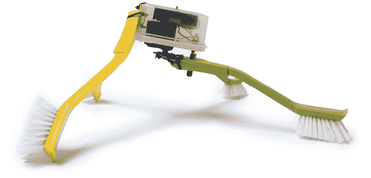

**工具和材料**

+   连续旋转舵机（已拆除控制器）

+   一个 3 × AA 电池架

+   三节 AA 电池

+   DPDT 拨动开关

+   四把擦洗刷子（带长柄）

+   小塑料容器（我的尺寸是 3½ × 2½ × 2 英寸）

+   BIC 圆珠笔

+   一个 1½ × 3/8 英寸的角撑

+   电钻

+   1/4 英寸和 1/8 英寸的钻头

+   剥线钳

+   剪切钳

+   美工刀

+   热胶

+   一些扎带

## Skitter 概述

要构建 Skitter，首先需要通过拆除其控制板（第四章）来修改一个连续旋转舵机以实现直接驱动，或者按照附录 A 中的说明使用一种齿轮电机替代品。接下来的步骤是将两个擦洗刷子安装到舵机电机的后部。然后，将电机本身安装到塑料容器的盖子上。接下来，你需要将电池安装到塑料容器本身，并将剩余的两个擦洗刷子安装到前部。然后，你需要将 DPDT 开关固定到盖子上，并按照 H 桥配置将开关接线以完成电路。你还需要用一支圆珠笔的管子延长开关的杠杆，使其能接触到摆动的擦洗刷子。最后，插入电池并合上盖子，使机器人开始运行。

## 构建 Skitter

1.  第一步：在舵机角盘的四个端点各钻一个 1/8 英寸的孔。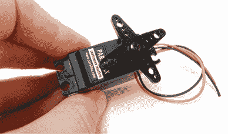

    第一步

1.  第二步：选择舵机角盘上两个相邻的孔，将每个扎带穿过其中一个。接下来，将扎带穿过角撑中的两个相邻的中央孔。然后，将扎带穿过两把刷子的挂孔。最后，将所有东西用扎带牢固固定。

1.  第三步：利用角撑中的两个空闲孔，作为引导，向下钻穿每个刷子。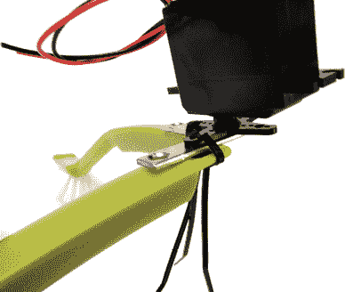

    第二步

    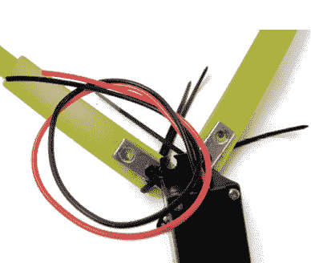

    第三步

1.  第四步：使用刚才钻好的孔，将刷子牢固地用扎带固定到角撑上。为了增加支撑，可以将刷子的挂孔与舵机角盘上未使用的后孔用扎带固定在一起。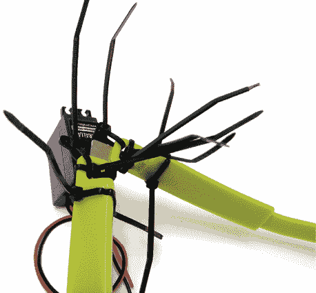

    第四步

1.  第五步：将舵机的背面中心靠近塑料容器盖的短边之一。描绘舵机背部的轮廓，然后用美工刀切出这个形状。最后，将电机线穿过孔并将塑料容器盖滑下来覆盖舵机。

1.  第 6 步. 在塑料容器盖上钻 1/8 英寸的孔，使其与伺服电机的安装孔对齐。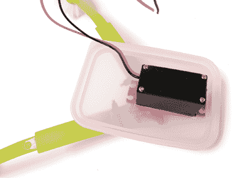

    第 5 步

    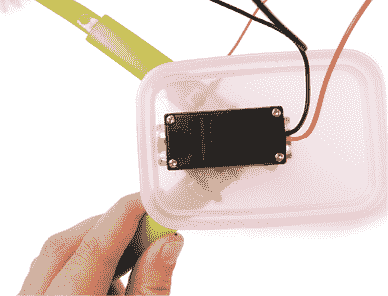

    第 6 步

1.  第 7 步. 用拉链扎带将电动机牢固固定，并修剪多余部分。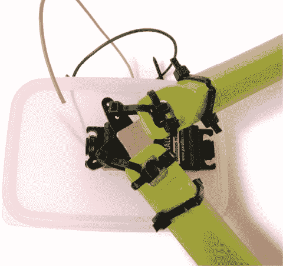

    第 7 步

1.  第 8 步. 将电池座放置在塑料容器的底面，并利用电池座的安装孔作为钻孔导向。钻两个 1/8 英寸的孔。

1.  第 9 步. 将电池座放入塑料容器内，使用螺母和螺栓将两者固定在一起。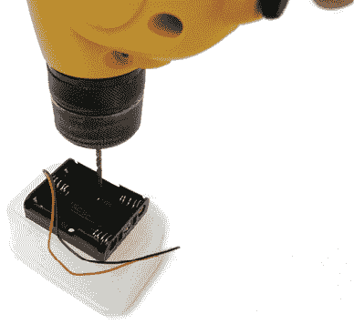

    第 8 步

    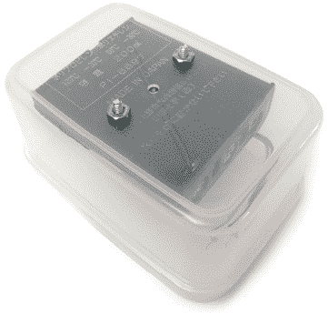

    第 9 步

1.  第 10 步. 对于剩余的两只刷子，从手柄的末端量出 1 英寸并做标记。钻一个 1/8 英寸的孔，通过你做标记的地方。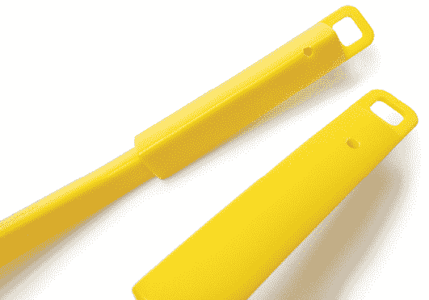

    第 10 步

1.  第 11 步. 将塑料容器倒置。标记、钻孔并用拉链扎带将剩余的两只刷子固定在塑料容器的前端，使它们形成 90º角并均匀地指向塑料容器开口的方向。换句话说，为你的机器人做两个等长的前腿。

1.  第 12 步. 在塑料容器盖的短边附近钻一个¼英寸的中心孔，位置与伺服电机相对。

    第 11 步

    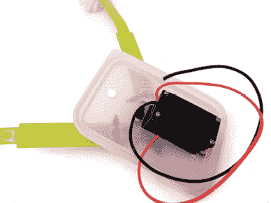

    第 12 步

1.  第 13 步. 将 DPDT 开关穿过孔，使轴指向刷子腿，然后用螺母将开关固定。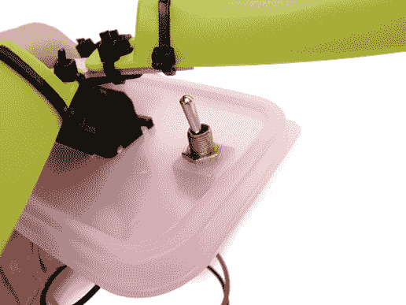

    第 13 步

1.  第 14 步. 将 DPDT 开关的相对角连接在一起。将红色电池线焊接到其中一个中心 DPDT 开关引脚上，将黑色电池线焊接到另一个引脚上。

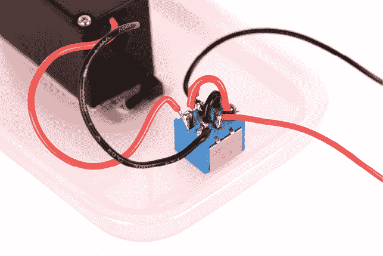

第 14 步

将开关旋转，使只有两个引脚朝向你（而不是三个）。将黑色电机线焊接到右侧离你最近的 DPDT 引脚上。将红色电机线焊接到左侧的另一个引脚上。

1.  第 15 步. 拆开 BIC 笔，并从笔管的末端切割约 1½英寸，用作开关杆的延长器。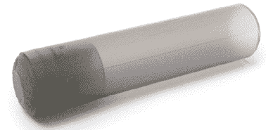

    第 15 步

1.  第 16 步. 确保开关位于两只刷子之间。将笔盖填充热熔胶，并用钳子迅速将其滑到开关轴上。保持热管在原位直到开始固化。小心不要推得太深，否则可能会将热熔胶推入开关内部，导致其无法正常工作。

1.  第 17 步. 将一些电池放入电池座中，机器人腿部开始运动。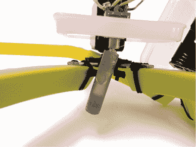

    第 16 步

    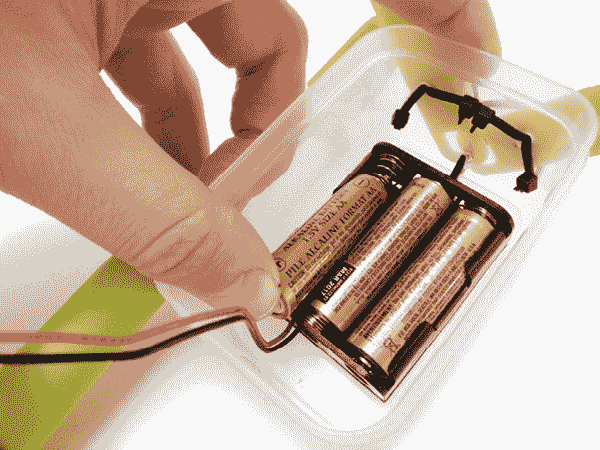

    第 17 步

1.  第 18 步. 快速关闭塑料容器，让机器人自由行动。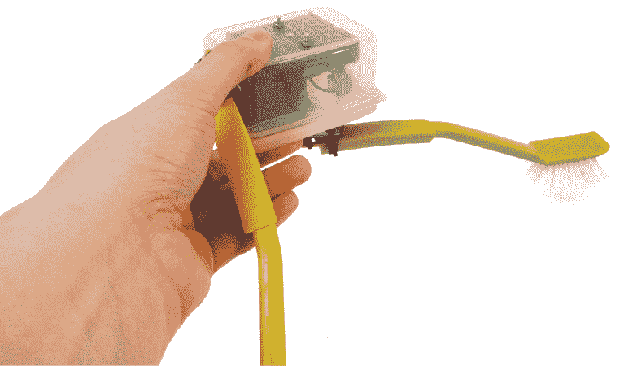

    第 18 步
