# 第十一章：Inchworm

如果你能只依赖一件东西，那一定是尺子。现在，别误会，我不是在说一辈子的最高统治者之类的东西。我说的尺子是用来测量的那种。怎么能不依赖一个上面有那么多连续数字的东西呢？这就是为什么在决定 Inchworm 机器人的定子时，我唯一能想到的就是我那可靠的好朋友——尺子。毕竟，“英寸”是它名字的一部分，而且尺子上就标有英寸。此外，铝尺是很棒的机器人部件。它们不仅结构坚固，而且还容易切割、钻孔和弯曲。自己做一个 Inchworm 机器人，亲自体验一下吧。

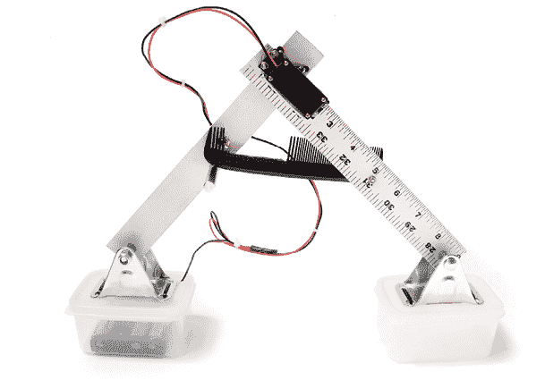

**工具和材料**

+   移除控制器后的连续旋转伺服电机

+   曲线锯

+   一个 4 × AA 电池托架

+   DPDT 杠杆开关

+   四个 AA 电池

+   红色和黑色电线

+   电工胶带

+   一把 18 英寸的铝尺（或更长）

+   两个小塑料容器，如零食或婴儿食品容器

+   两个 2 英寸的固定脚轮

+   BIC 圆珠笔

+   切割刀片

+   梳子

+   十个 4-40 × 1/2 英寸的螺母和螺栓

+   四个小垫圈

+   一个 2 英寸的金属支架

+   四根扎带

+   剥线钳

+   切割钳

+   钳子

+   电钻

+   一只 1/8 英寸的钻头

+   一只¼英寸的钻头

+   一只 3/16 英寸的钻头

+   锤子

+   台钳

+   螺丝刀

+   220 目砂纸

+   马克笔

## Inchworm 概述

要制作这个机器人，首先要通过移除控制板（第四章）来改造一个连续旋转伺服电机以实现直接驱动，或者使用附录 A 中列出的齿轮电机替代品。接下来的步骤是将尺子切割、弯曲和钻孔，以创建两个不同的部分。你将把尺子的一部分连接到伺服电机的主体上，另一部分连接到它的舵。完成后，你需要修改梳子并将其固定在尺子上。接着，你会安装 DPDT 开关，并将其以 H 桥配置接线，以便在杠杆被按下时反转电机。然后，你将安装一个支架，让梳子能够支撑在其上，这样当机器人启动后，梳子可以来回移动，从而按下开关。完成开关组件后，你将把脚轮支架固定在塑料容器的盖子上，使其作为机器人的“脚”。然后，将脚轮支架连接到每个尺子部分的末端。最后的任务是将电池托架连接到电路，整理好电线，并插入电池以启动机器人。

## 制作 Inchworm

1.  步骤 1。用曲线锯把尺子切成两段 9 英寸的部分。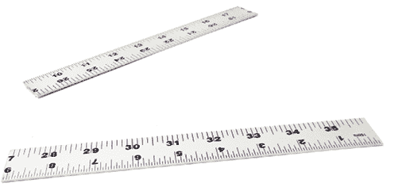

    步骤 1

1.  步骤 2。在其中一段 9 英寸的尺子上，从尺子的末端起 1/2 英寸和 2 1/8 英寸的地方，分别切割三分之四深度。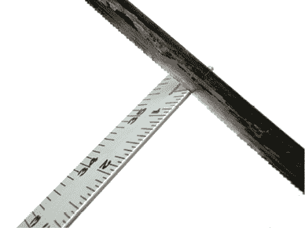

    步骤 2

1.  步骤 3. 将标尺放入台钳中，使切口底部与台钳顶部平齐。用锤子将两切口之间的部分压平，使其与标尺垂直。这将成为电机的安装支架。

1.  步骤 4. 将伺服电机放入刚切割的槽中，用铅笔标记其安装孔的位置。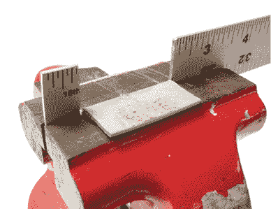

    步骤 3

    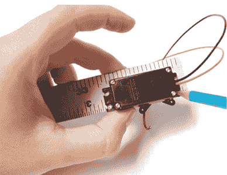

    步骤 4

1.  步骤 5. 使用 1/8 英寸钻头钻透标尺上的标记。

1.  步骤 6. 在一个已切割的标尺段上，从边缘向内 ½ 英寸的位置钻一个 ¼ 英寸的孔。对另一个标尺段重复此操作。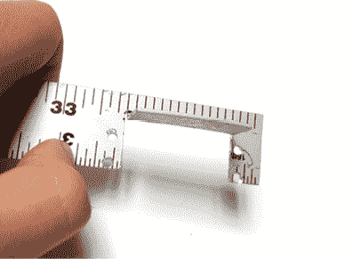

    步骤 5

    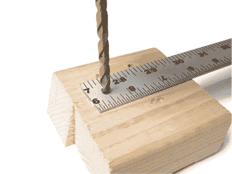

    步骤 6

1.  步骤 7. 在伺服电机头的每一端钻一个 1/8 英寸的孔。钻孔后，将伺服电机头从伺服电机上取下。

1.  步骤 8. 将伺服电机头置于没有电机支架的标尺段上，大约从未钻孔的标尺边缘内侧 11/4 英寸的位置。使用此位置作为指南，标记并钻四个 1/8 英寸的孔穿过标尺。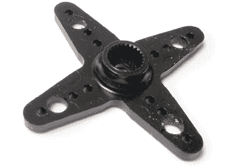

    步骤 7

    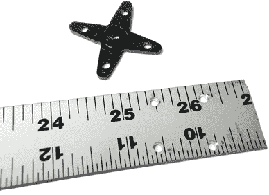

    步骤 8

1.  步骤 9. 在带有电机安装孔的标尺段上，钻一个 1/8 英寸的孔，孔位距离安装孔边缘 5 英寸。

在带伺服电机头安装孔的标尺段上，钻一个 3/16 英寸的孔，孔位距离带伺服电机头安装孔的边缘约 5 英寸，并靠近标尺边缘。

然后，钻第二个较大的 ¼ 英寸孔，孔位距离带伺服电机头安装孔的边缘 4 英寸，并且位于标尺中央。

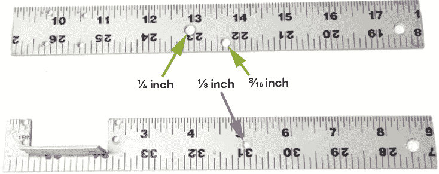

步骤 9

1.  步骤 10. 使用螺母和螺栓将电机固定在标尺上。

1.  步骤 11. 使用安装螺钉重新安装电机头。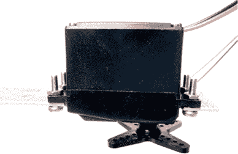

    步骤 10

    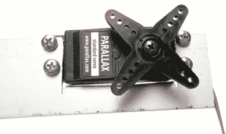

    步骤 11

1.  步骤 12. 使用螺母和螺栓将标尺的另一段连接到伺服电机头上。电机旋转时，标尺应能相互前后移动。

1.  步骤 13. 使用剪切钳从梳子的一侧去除 2 英寸的齿，停止的位置距离边缘约 ½ 英寸。远端剩余的几颗齿将起到防止梳子偏移的作用。

完成去除齿轮后，打磨梳子的这一部分，使其光滑，然后在对面边缘钻一个 1/8 英寸的孔。

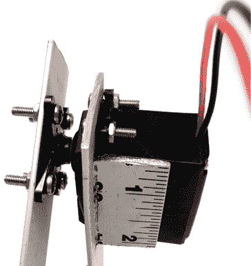

步骤 12

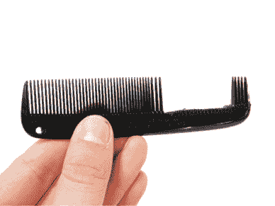

步骤 13

1.  步骤 14. 将螺栓穿过梳子的孔，然后放上两到四个垫圈。垫圈的作用是将梳子推向另一段已安装的标尺。

接着，将螺钉穿过带电机的标尺段中的中间孔。使用螺栓将其固定牢固。

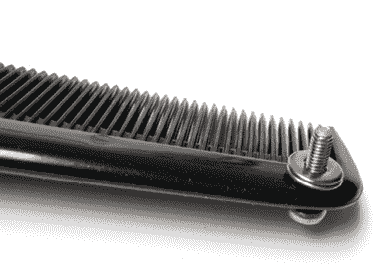 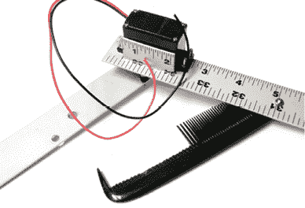

步骤 14

1.  步骤 15. 将开关的一个安装螺母放置在开关螺纹底部约 ¼ 英寸的位置。

接着，将 DPDT 开关插入在步骤 9 中钻好的 ¼ 英寸孔内。

最后，用第二个安装螺母将开关固定到位。杠杆应该与标尺的表面大致平齐。

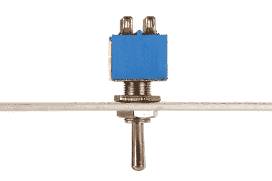

步骤 15

1.  步骤 16. 将 DPDT 开关的对角线两端连接在一起。将一根长的红色电池线焊接到 DPDT 开关的一个中间引脚，另一根长的黑色线焊接到另一个引脚。最终，你将这些线连接到电池盒。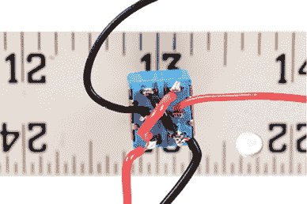

    步骤 16

转动开关，使得只有两个引脚朝向你（而不是三个）。将黑色电机线焊接到距离你最近的 DPDT 引脚上（右侧）。将红色电机线焊接到左侧的另一个引脚。

1.  步骤 17. 将支撑柱安装到标尺的舵机挂钩部分，使其朝向与杠杆开关相同的方向。梳子将放置在支撑柱的上方。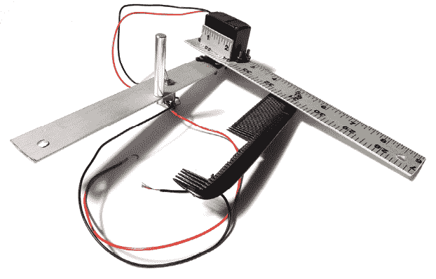

    步骤 17

1.  步骤 18. 现在你已经组装好主体，接下来将制作毛虫的“脚”。拿起你的两个脚轮并取下轮子。对于大多数脚轮，只需要拧松螺母。然而，如果轮子是铆接的，你可能需要钻透铆钉来将它们取下。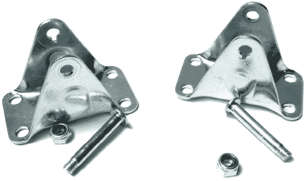

    步骤 18

1.  步骤 19. 对于每个塑料容器和脚轮支架组合，将脚轮支架置于塑料容器上方居中位置。使用脚轮支架上的孔作为指南，在容器盖上钻一个 1/8 英寸的孔。

1.  步骤 20. 使用拉紧带将脚轮框架固定到位，形成枢轴点。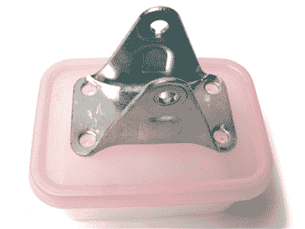

    步骤 19

    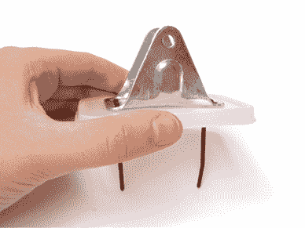

    步骤 20

1.  步骤 21. 在其中一个容器的盖子角落钻一个 1/8 英寸的孔。

1.  步骤 22. 将电池盒放入并通过孔将电源线穿过。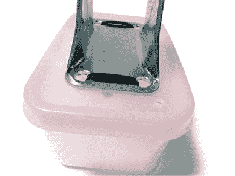

    步骤 21

    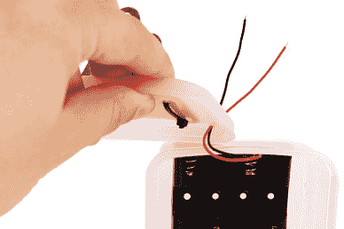

    步骤 22

1.  步骤 23. 拿起你的圆珠笔并取下墨水芯，这样你就会得到一个空心管。使用切割刀片（如美工刀），将管子切割成两段，每段长度为 1 英寸。然后将这两段再切成两半，得到四个 ½ 英寸的间隔物。你也可以从五金店购买四个 ½ 英寸的间隔物。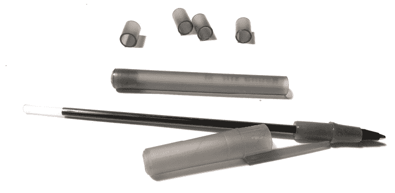

    步骤 23

1.  步骤 24. 重新使用脚轮的安装硬件，将标尺通过切割后的笔间隔物安装到脚轮支架上。如果标尺显得松动或不稳，插入金属垫圈在间隔物和标尺之间，直到不再松动为止。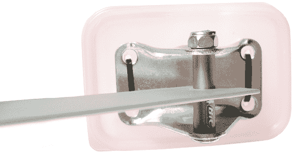

    步骤 24

1.  步骤 25. 将开关上的红线焊接到电池盒上的红线。将开关上的黑线焊接到电池盒上的黑线。

1.  第 26 步。用收缩管覆盖暴露的连接部分，以防止电线与金属框架发生短路。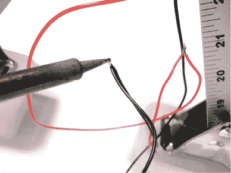

    第 25 步

    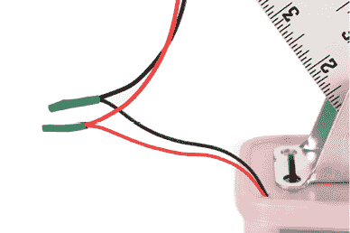

    第 26 步

1.  第 27 步。用扎带将所有松散的电线绑在一起，以防止缠绕。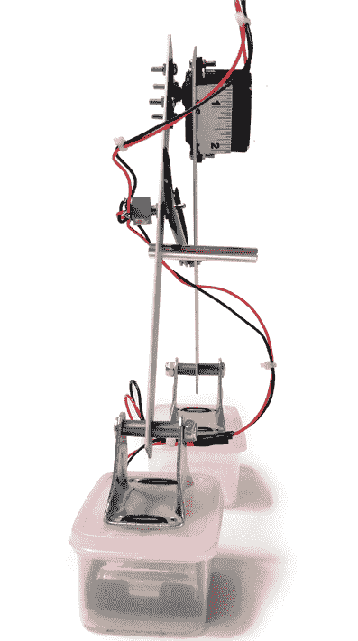

    第 27 步

1.  第 28 步。插入一些电池，并迅速关闭塑料容器的盖子，使机器人开始运作。
