# 第十二章：Walker

我制作 Walker Bot 的目标是打造一个可以在 10 分钟内完成的四足步行机器人。最终，这个机器人花费了 3 小时才完成。也就是说，我的目标并不是自己在 10 分钟内完成，而是制作一个*可以*在 10 分钟内完成的机器人。我很有信心，现在我知道自己在做什么，如果需要制作第二个，我完全有能力在 10 分钟内完成。至少，你很难制作比这个更简单的步行机器人，因此我认为这个项目是一个辉煌的成功。

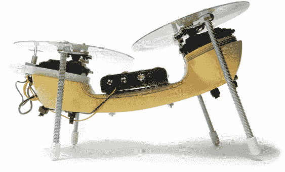

**工具和材料**

+   两个去掉控制器的连续旋转伺服电机

+   四节 AA 电池

+   一个 4 × AA 电池架

+   DPDT 杠杆开关

+   一个“经典”电话听筒（可以在线搜索“复古电话听筒”）

+   两张 CD（这些不能来自任何人的音乐收藏）

+   两个 1/4-20 × 6 英寸螺栓

+   两根 1/4-20 × 5 英寸螺栓

+   四个 1/4-20 螺母

+   四个 1/4 英寸橡胶螺栓套

+   两个 4-40 × 1 英寸螺母和螺栓

+   一卷油漆胶带

+   一些扎带

+   切割模板（见附录 B）

+   电钻

+   三个钻头：1/4、1/8 和 3/16 英寸

+   剪刀

+   剪线钳

+   电线剥皮工具

## Walker 概述

要制作 Walker Bot，你将使用与之前的机器人相同的改装伺服电机（第四章）或齿轮电机替代品（附录 A）。一旦你完成电机的改装，下一步就是拆开电话听筒，并将伺服电机放置在原本麦克风和扬声器的位置。从这里开始，你将把 DPDT 开关用扎带固定在听筒的一端。接下来，将电池架安装到电话听筒的手柄上，并将开关按 H 桥配置接线以完成电路。然后，按附录 B 的切割模板进行追踪和裁剪，或直接打印出模板，并将其粘贴到 CD（或 DVD）上。你将使用这些模板作为指导，钻孔和切割适当的孔和形状在 CD 上。完成这些后，你将把 CD 用扎带固定在电机上，并将螺栓插入 CD 中作为腿部。最后，插入电池并将 Walker Bot 放下，让它可以四处行走。

## 构建 Walker

1.  第 1 步。使用 1/8 英寸钻头扩大电机喇叭两端倒数第二个孔的直径。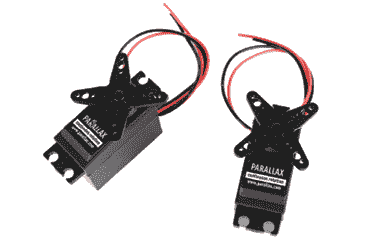

    第 1 步

1.  第 2 步。拆下电话听筒的外壳，然后拔出扬声器、麦克风和插孔。它们应该能顺利取出。

    第 2 步

1.  第 3 步。在电话听筒的每一端钻四个 3/16 英寸的孔，如图所示。实际上，你应该钻孔，以便在每个开口的背面形成一个方形区域。

1.  第 4 步。从电话听筒上插孔的另一侧开始，将电机的电线穿过电话机的机身，穿出拆除插孔后留下的孔洞。将第一个电机插入插孔相对的听筒开口，使喇叭面朝内。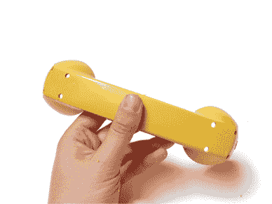

    第 3 步

    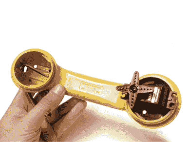

    步骤 4

1.  步骤 5. 将第二个电机的电线穿过由插孔创建的孔，并将电机插入话筒的一端。确保该电机的喇叭也朝向内部。使用你之前钻的孔，用扎带将它们固定好。

1.  步骤 6. 用扎带将 DPDT 开关固定在圆形吹嘴开口上，正好位于通过去除插孔而留下的孔上方。应有一个小的突缘，开关可以放置在其上。确保开关的杠杆朝上（指向电机上的齿轮）。

1.  步骤 7. 使用电池包上的安装孔作为导向，在话筒的中心钻两个 1/8 英寸的孔，以便与 AA 电池托架的安装孔对齐。

1.  步骤 8. 使用一对 1 英寸的螺母和螺栓将电池托架固定到话筒上。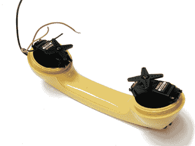

    步骤 5

    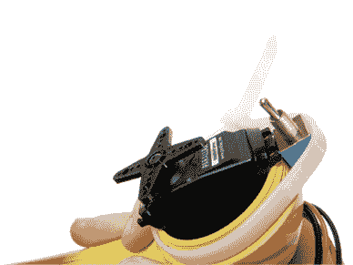

    步骤 6

    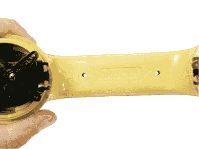

    步骤 7

    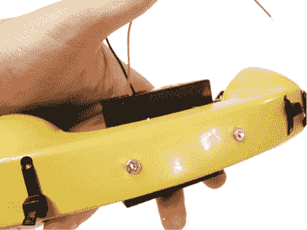

    步骤 8

1.  步骤 9. 将电池托架的红色和黑色电线分别焊接到 DPDT 开关的中心端子上。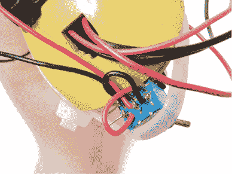

    步骤 9

将两根短电线焊接成一个 X 形，连接到开关的外部端子之间。基本上，后左端子应连接到前右端子，前左端子应连接到后右端子。这将使得开关切换时电源反向接入。

将电机一的红色电线与电机二的黑色电线焊接在一起，再将电机一的黑色电线与电机二的红色电线焊接在一起（指定哪个电机并不重要）。

最后，将红色和黑色的电线对接到外部端子上的任意一组。比如，将一对焊接到后左端子，另一对焊接到后右端子。

1.  步骤 10. 准备将安装到机器人的 CD（或 DVD），描摹切割模板并剪出两个大圆圈。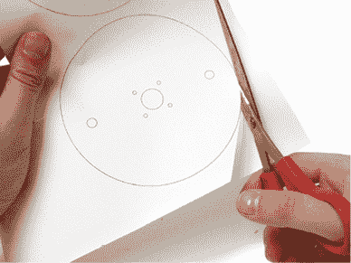

    步骤 10

1.  步骤 11. 将模板居中并用胶带固定在每张 CD 上。

1.  步骤 12. 对于两个大的外圈，钻 ¼ 英寸的孔。对于四个较小的内圈，钻 1/8 英寸的孔。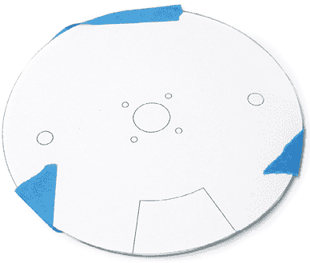

    步骤 11

    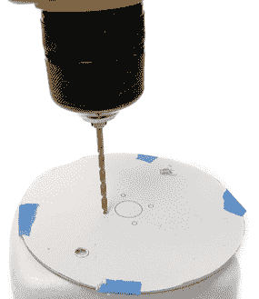

    步骤 12

1.  步骤 13. 找到带有外部缺口的 CD，并小心地用剪刀将其剪下。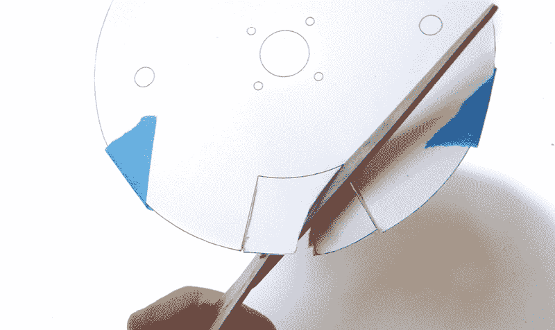

    步骤 13

1.  步骤 14. 使用扎带将 CD 固定到电机上，使得每张 CD 上的两个外部孔与话筒垂直，并且带有外部缺口的 CD 与 DPDT 切换开关的杠杆对齐。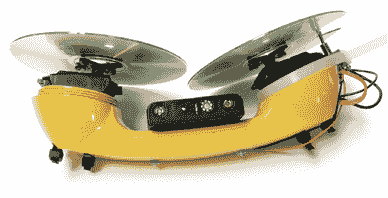

    步骤 14

1.  步骤 15. 将较短的 5 英寸螺栓通过带缺口的 CD。将较长的 6 英寸螺栓从另一张 CD 上方穿过。用螺母固定所有螺栓。

1.  步骤 16. 用橡胶螺栓保护套覆盖所有螺栓，以增加它们的摩擦力。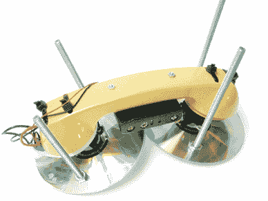

    步骤 15

    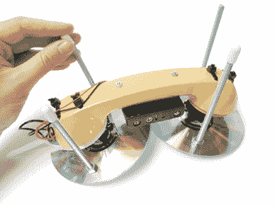

    步骤 16

1.  步骤 17. 插入电池，然后让机器人开始运行。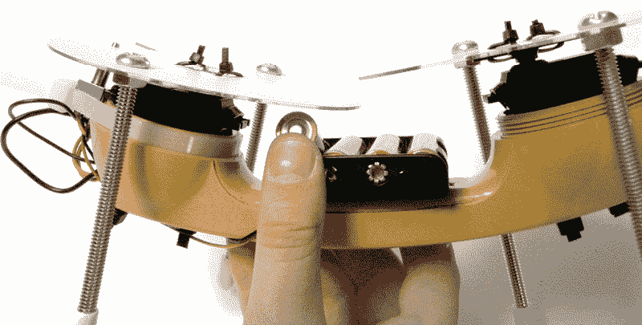

    步骤 17
