# 第十三章：帆

当 Sail Bot 遇到逆风时，它会转向避开它。与之前的机器人不同，Sail Bot 只有在风激活其杠杆时才会暂时改变方向，而不是像那些带有 DPDT 开关的机器人，只有按下自己的杠杆时才会改变方向。换句话说，当风吹过时，机器人会转向以避开风；否则，Sail Bot 会继续做它的事。尽管看起来很简单，但考虑到电路在某种意义上仅仅是开关的集合，这种行为实际上是相当复杂的。

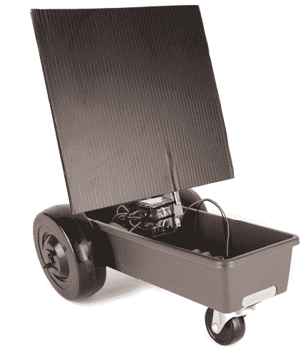

**工具和材料**

+   两个去除控制器的连续旋转伺服电机

+   一个 4 × 9½ × 2 英寸的塑料用具架

+   一个 4 × AA 电池架

+   四个 AA 电池

+   一个 6V DPDT 继电器

+   继电器插座

+   两个 3 英寸的脚轮

+   1½英寸旋转脚轮

+   一张 8 × 8 英寸的瓦楞塑料板

+   电钻

+   1/8 英寸钻头

+   3/4 英寸的铲形钻头

+   线切割器

+   剥线钳

+   绞线电缆卷

+   螺丝刀

+   马克笔

+   钳子

+   尺子

+   各种扎带

## 帆概述

要构建 Sail Bot，首先需要通过拆除其控制板（见第四章）来修改两个连续旋转伺服器进行直接驱动，或者使用附录 A 中概述的两个齿轮马达替代品。接下来，将伺服器安装到用具架的内部。从那里，您将把旋转脚轮安装到底部的用具架上。然后，您将电路连接到继电器插座（或直接连接到继电器），并将其安装到用具架中。接着，您将构建帆机制，并将其牢固地连接到继电器上。最后，将车轮安装到伺服器上并插入电池，使机器人开始移动。

## 构建帆

1.  第 1 步。通过松开固定在 3 英寸脚轮框架上的螺母和螺栓，取下车轮。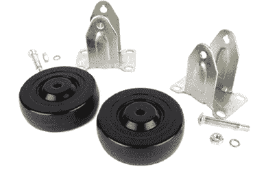

    第 1 步

1.  第 2 步。使用 1/8 英寸的钻头将伺服角轮上的倒数第二个孔扩孔。

1.  第 3 步。松开安装螺丝，将伺服角轮从伺服器中移除。将螺丝放到一边备用。

    第 2 步

    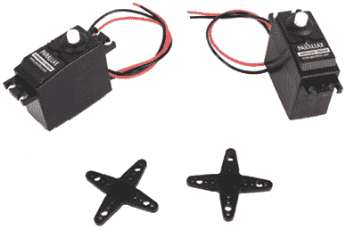

    第 3 步

1.  第 4 步。将一个伺服角轮居中放置在每个车轮上，并使用一个细螺丝刀在每个车轮的框架上压出标记，以用作钻孔导向。

1.  第 5 步。利用刚才做的凹痕作为导向，钻穿车轮的 1/8 英寸孔。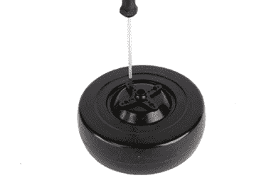

    第 4 步

    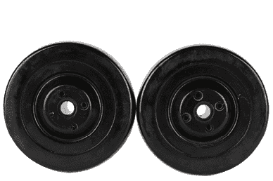

    第 5 步

1.  第 6 步。将伺服角轮用扎带固定在车轮上，并修剪掉剩余的尾部。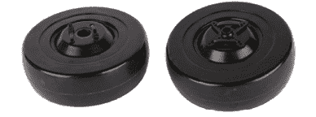

    第 6 步

1.  第 7 步。通过将 DPDT 继电器用力按下，简单地将其插入插座中。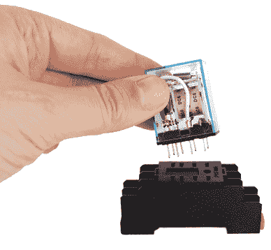

    第 7 步

1.  第 8 步。在用具架的外部，将一个伺服电机放置在长边的一个底角上，伺服轴朝内。标记出伺服器的每个安装孔和伺服轴的位置。然后在用具架的另一侧对称标记。

1.  第 9 步。使用 1/8 英寸的钻头钻出伺服电机安装孔的外部标记，然后使用 3/4 英寸的扁钻钻出伺服电机轴的中心标记。

    第 8 步

    

    第 9 步

1.  第 10 步。将伺服电机放置在器具架的内部，用扎带将其牢固固定，然后修剪多余的扎带尾部。

1.  第 11 步。将 1½英寸的脚轮放置在器具架的底部，位于与伺服电机相对的一端。在每个脚轮的安装孔上做标记。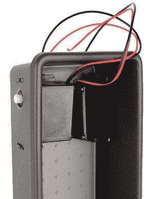

    第 10 步

    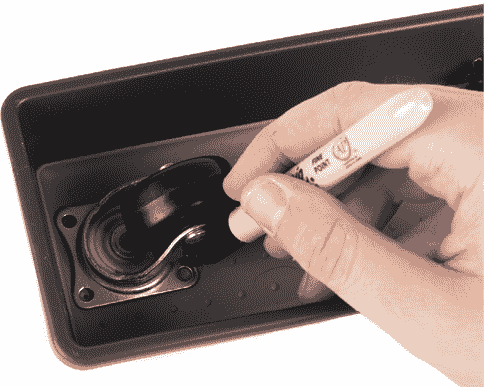

    第 11 步

1.  第 12 步。使用 1/8 英寸的钻头钻出每个标记。

1.  第 13 步。用扎带将 1½英寸的脚轮固定在器具架的底部。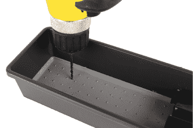

    第 12 步

    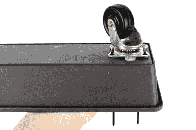

    第 13 步

1.  第 14 步。将一根 6 英寸的黑色电线焊接到开关的公共连接端，将一根 6 英寸的红色电线焊接到常开（NO）连接端。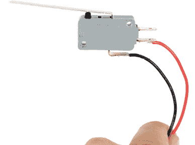

    第 14 步

1.  第 15 步。接下来，使用以下电路图进行接线。你可以在附录 A 的第 160 页了解更多关于电路的工作原理。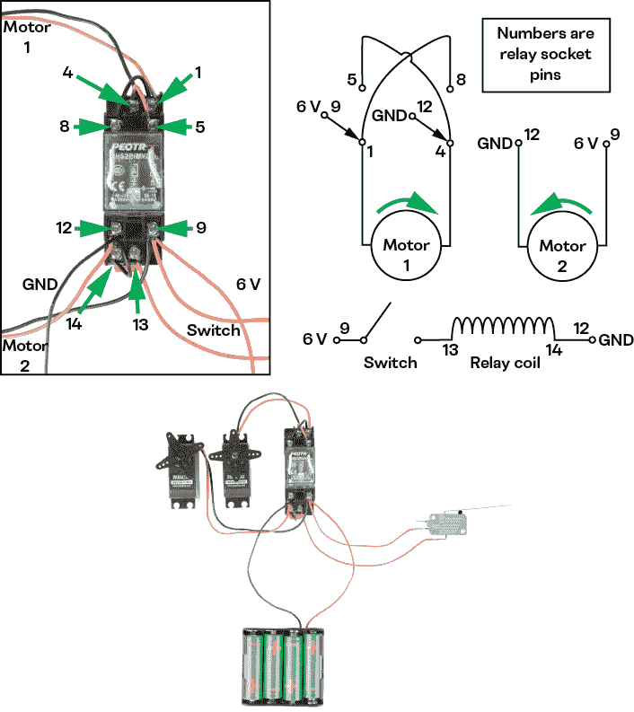

    第 15 步

1.  第 16 步。短暂插入电池测试电路。

如果你的电机旋转方向与预期相反，可以反向连接电机电线与继电器。

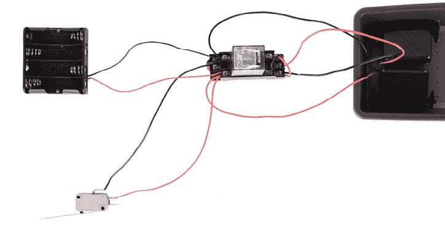

第 16 步

1.  第 17 步。将 DPDT 继电器插座放置在器具架的底部，靠近伺服电机。

在 DPDT 继电器插座的每一侧做两个标记，总共做四个标记，用于将插座用扎带固定到位。

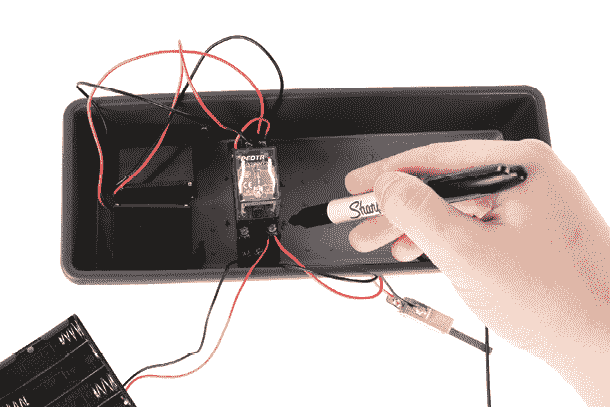

第 17 步

1.  第 18 步。使用 1/8 英寸的钻头钻出四个标记，用于安装 DPDT 继电器。

1.  第 19 步。使用扎带和安装孔将继电器插座固定到位。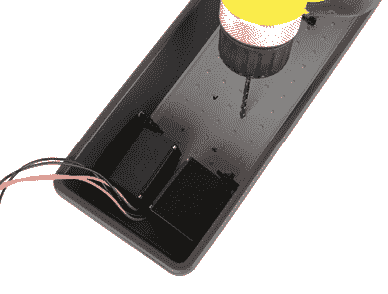

    第 18 步

    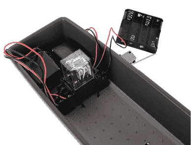

    第 19 步

1.  第 20 步。波纹纸将用作帆。将快动开关的杠杆插入波纹纸中的一个中心开口，直到它牢固到位。

    第 20 步

1.  第 21 步。用扎带将开关固定在继电器的侧面，使帆面朝向机器人的前方（带小脚轮的一侧）。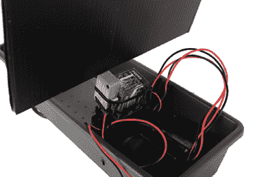

    第 21 步

如果帆太重导致开关被压缩，你可以选择将帆裁小一些，或者稍微将开关向前倾斜。

1.  第 22 步。使用伺服电机的安装螺丝将 3 英寸的轮子安装到伺服电机上。

    第 22 步

1.  第 23 步。将电池插入电池架，然后观察机器人启航。

    第 23 步

当风吹动帆时，一个轮子应该朝相反方向旋转，从而使机器人转向远离风的方向。一旦机器人转向远离风，机器人将恢复向前行驶。
