# 第十四章：翻转机器人

翻转机器人是一个典型的*状态机*，它遵循特定的例程，并具有不同的操作模式。例如，如果激活第一组开关，机器人处于第一模式并向前移动。如果激活另一组开关，机器人进入第二模式并向后移动。本质上，这个机器人向前行驶直到碰到障碍，然后反向并朝另一个方向行驶，直到碰到另一个障碍。如果你将机器人放入门框，它会不断来回移动（或者直到电池耗尽）。

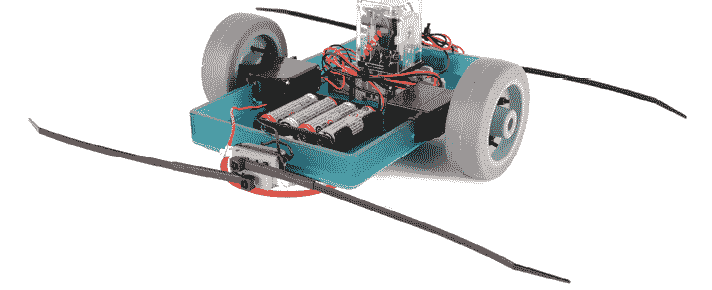

如果你想做一个更动态的版本，可以将圆形轮子换成不同形状的轮子（比如椭圆形）。这样，翻转机器人将不再持续直线往返移动。

这个机器人的美妙之处在于它可以改变自己的状态，并保持在新的状态，直到收到新的输入。

**工具和材料**

+   两个去除控制器的连续旋转伺服电机

+   一个 4 × AA 电池盒

+   四节 AA 电池

+   两个 3 英寸的万向轮

+   两个 3 英寸的圆形反射器

+   一个 6V 3PDT 继电器

+   一个 3PDT 继电器插座

+   一个 8 × 5 × 1 英寸的托盘（或类似尺寸）

+   四个快动杠杆开关

+   两个 1/4-20 的水平支架

+   一根 3/8 英寸直径的热缩管

+   四根 8 英寸的拉链扎带

+   各种拉链扎带

+   锯子

+   电钻

+   一只 1/8 英寸的钻头

+   一只 1/4 英寸的钻头

+   剥线钳

+   对角剪钳

+   螺丝刀

+   尺寸尺

+   标记笔

## 翻转机器人概览

要制作这个机器人，首先需要修改两个连续旋转的伺服电机，使其直接驱动，方法是去除其控制板（第四章）或按照附录 A 使用两个齿轮电机作为替代。你将钻孔伺服舵盘并将其安装到转向轮上。接下来，你将标记并修改托盘以将其连接到伺服电机上。然后，你将接线每对开关，将它们连接到反射器，并将反射器安装到托盘上。接下来，你将用一个 3PDT 继电器接好整个电路。这类似于一个 DPDT 继电器（或开关），但它内建了一个额外的 SPDT 引脚。你可以在附录 A 的 161 页了解更多关于这个继电器的信息。接好电路后，你将固定继电器并重新安装轮子。完成机器人后，你将为开关添加拉链扎带天线，机器人就可以启动了。

## 构建翻转机器人

1.  步骤 1. 拆下中心螺栓，将轮子与转向架分开。

1.  步骤 2. 使用 1/8 英寸钻头扩宽每个伺服舵盘末端的倒数第二个孔。对另一个伺服舵盘重复此操作。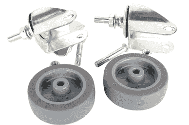

    步骤 1

    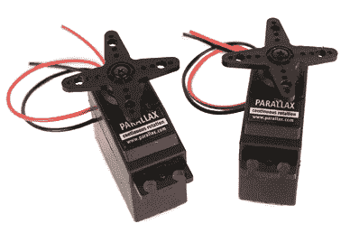

    步骤 2

1.  步骤 3. 拆下安装螺丝，移除伺服电机上的伺服舵盘。

1.  步骤 4. 将伺服舵盘中心对准每个轮子，并使用细螺丝刀在每个轮子的框架上按出标记，作为钻孔导向。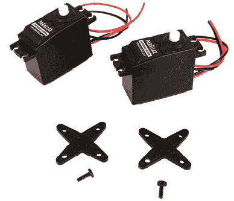

    步骤 3

    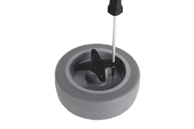

    步骤 4

1.  步骤 5. 使用刚才做的凹痕作为指南，垂直钻孔穿过车轮，孔径为 1/8 英寸。

1.  步骤 6. 用扎带将伺服电机的舵机连接到车轮上，并修剪掉多余的部分。

    步骤 5

    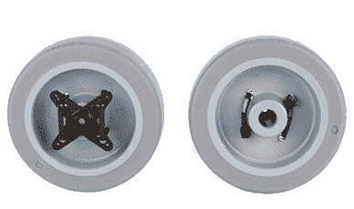

    步骤 6

1.  步骤 7. 在托盘的每个长边上做一个中心标记。

    步骤 7

1.  步骤 8. 将伺服电机轴与中心标记对齐，然后在托盘的每个长边上画出两个切割标记，勾画出伺服电机的主体。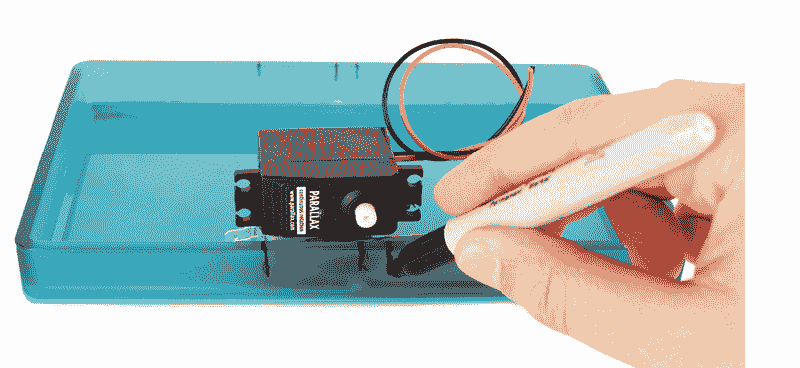

    步骤 8

1.  步骤 9. 以步骤 8 中画的线为指南，使用锯子在托盘的每个长边上切割出一个足够大的孔，以便插入电动机。电动机应放置在托盘底部。

    步骤 9

1.  步骤 10. 在托盘的边缘上做标记，表示伺服电机的安装孔。如果只有最底部的孔与托盘边缘对齐，没关系。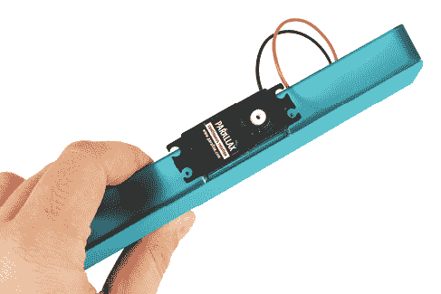

    步骤 10

1.  步骤 11. 使用 1/8 英寸的钻头在托盘的标记位置钻孔。

1.  步骤 12. 用扎带将电动机固定在托盘的边缘上。

    步骤 11

    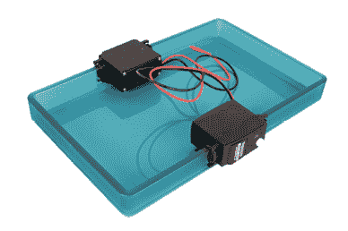

    步骤 12

1.  步骤 13. 将两个开关堆叠在每个圆形反射器的边缘上。在每个反射器的开关两侧做标记，用作扎带的钻孔引导。

1.  步骤 14. 在每个反射器的中心大致标记一个位置。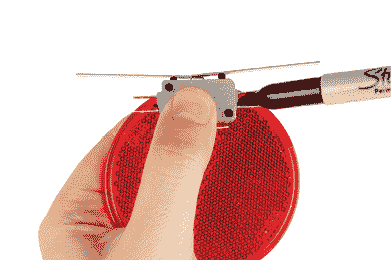

    步骤 13

    

    步骤 14

1.  步骤 15. 使用 1/8 英寸的钻头钻通所有反射器上的标记孔。

1.  步骤 16. 从每个反射器上剥离粘合剂背面，并将开关沿着 1/8 英寸孔之间的边缘粘贴。

    步骤 15

    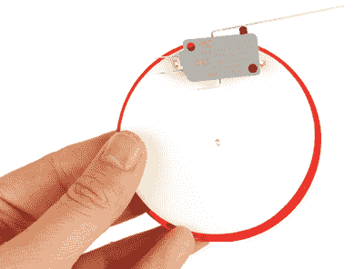

    步骤 16

1.  步骤 17. 将另一个开关堆叠在粘合反射器上的开关上，并用扎带固定它。用剩下的反射器和杠杆开关重复此过程。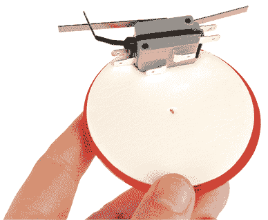

    步骤 17

1.  步骤 18. 一对开关应该将它们的常闭（NC）连接*串联*接线。这意味着你需要将公共引脚连接在一起，将一根长红线连接到一个开关的常闭引脚，并将一根长黑线连接到另一个开关的常闭引脚。

另一对开关应该将它们的常开（NO）连接*并联*接线。这意味着你需要将公共引脚连接在一起，然后将常开引脚连接在一起。最后，将一根长红线连接到常开引脚，将一根长黑线连接到公共引脚。

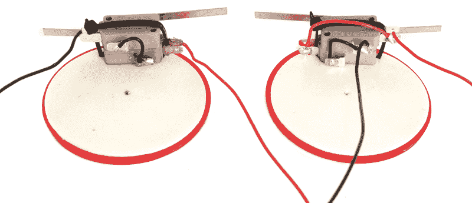

步骤 18

1.  步骤 19. 将其中一个反射器粘贴到托盘底部，使开关紧贴托盘的短边之一。

1.  第 20 步。将剩余的粘性反射器安装在托盘的另一短边上。

    第 19 步

    

    第 20 步

1.  第 21 步。用¼英寸的钻头在反射器和托盘的中心钻孔。

    第 21 步

1.  第 22 步。将调平支架直接安装在反射器下方，并用安装螺母将其固定。

    第 22 步

1.  第 23 步。将继电器插座放在托盘顶部，并在两个边缘上做两个标记，指示其安装孔的位置。

1.  第 24 步。用 1/8 英寸的钻头钻孔在四个标记上。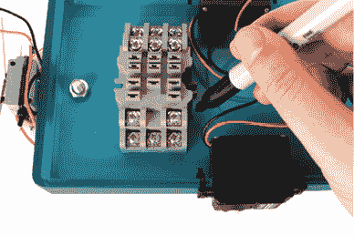

    第 23 步

    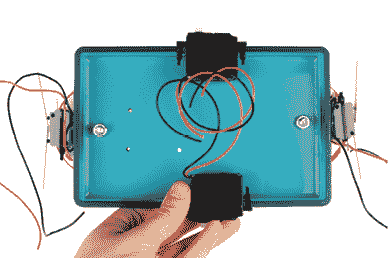

    第 24 步

1.  第 25 步。按照下面的接线图使用继电器插座构建电路。慢慢来，确保继电器插座端子上的所有正确连接都已完成。你可以在附录 A 的第 161 页了解更多关于这个电路的工作原理。完成电路构建后，电机、开关和电池座应该都连接到继电器插座上，如图所示。

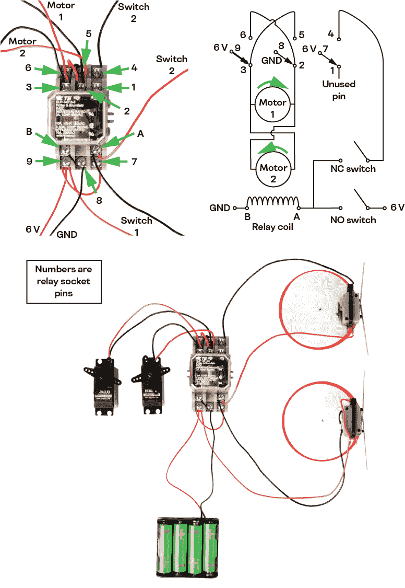

第 25 步

1.  第 26 步。将 3PDT 继电器插入继电器插座中。

1.  第 27 步。使用伺服器角的安装螺丝将轮子安装到伺服器轴上。

    第 26 步

    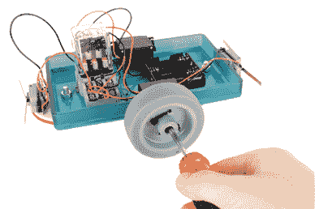

    第 27 步

1.  第 28 步。将继电器插座牢固地用扎带固定在托盘的底部。与此同时，你也可以选择使用扎带整理电线。

1.  第 29 步。将收缩管完全滑入 8 英寸的扎带中。然后将收缩管和扎带组件滑入每个快动开关的杠杆上，形成天线。一旦它们被定位，使用热风枪收缩管道。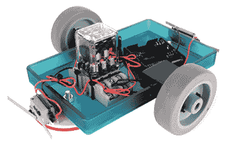

    第 28 步

    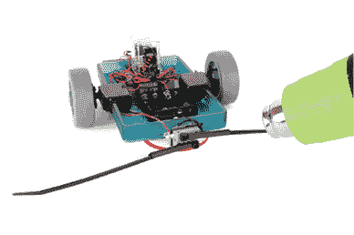

    第 29 步

1.  第 30 步。将电池插入电池座，并让机器人启动。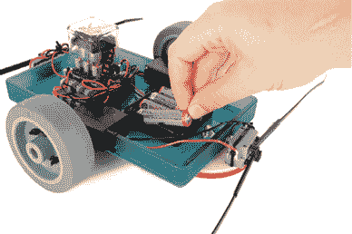

    第 30 步

当机器人与物体碰撞时，开关应该被压缩，机器人应该倒退。如果它的行为与预期不符，请检查你的接线是否与图纸一致。有关此电路的更详细说明，请参阅附录 A。
