# 第十五章：A

参考资料

本书中的一些技术和概念较为高级，因此部分读者可能需要其他选择或更多背景信息。在接下来的几页中，你将找到一些针对难度较大的技巧的替代方法、继电器电路的深入讲解、为任何机器人添加电源开关的说明、电器购物清单以及参考资料列表。如需更多信息，请访问[`www.randysarafan.com/`](http://www.randysarafan.com/)。

## 焊接的替代方法

如果焊接不是你的首选，你可以使用其他方法来建立电气连接和电路。以下是一些技术的简要概述。

### 鳄鱼夹

鳄鱼夹跳线电缆（见第二章第 19 页）本质上是两端带有鳄鱼夹的电线。只要电气接触能够适应夹口，它们提供了一种快速且简便的连接方法。鳄鱼夹非常适合暂时连接电线、开关和电机端子。请记住，虽然这些连接方便用于原型制作，但它们不是最耐用的连接方式。

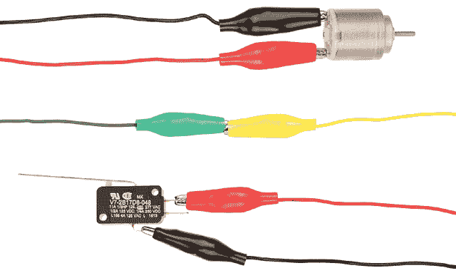

### 压接连接器

压接连接器提供了另一种不需要焊接的简便连接电线的方法。通过将连接器压接或夹紧在每根电线的末端，你可以将两根电线连接起来。有时压接连接器可以直接滑入，有时你需要额外的硬件，例如螺母和螺栓，以将其固定在一起。压接连接器的缺点是它们体积较大，电气连接部分暴露，需要进行绝缘处理。

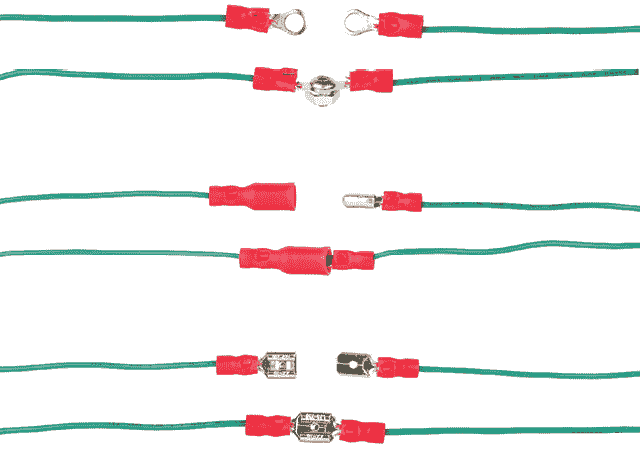

要将连接器压接到电线上，请先剥去约 1/2 英寸的绝缘层，并将电线滑入连接器的管道内。然后，压缩管道以紧握电线。将连接器放置在坚固的平面上，用锤子敲打连接器的管道，直到它变平。

或者，许多剥线钳的内把手上都有压接工具。如果你的剥线钳具备这个功能，请对准压接工具中的凹槽，确保其与电线的尺寸匹配，然后用力压下。

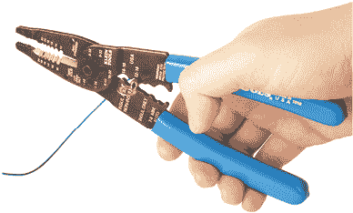

### 杠杆、弹簧和螺丝

另一种快速且简便的连接电线方法是使用机械杠杆、弹簧连接器或螺丝端子。它们的工作原理相似。首先，抬起杠杆，按下弹簧按钮，或松开螺丝以打开连接器。接着，插入电线，然后按下杠杆、释放弹簧或拧紧螺丝以固定电线并建立电气连接。这种方法是连接电线最快且最简单的方式之一；然而，这些连接器体积较大，且在施加足够的力时，可能会导致电线松脱。

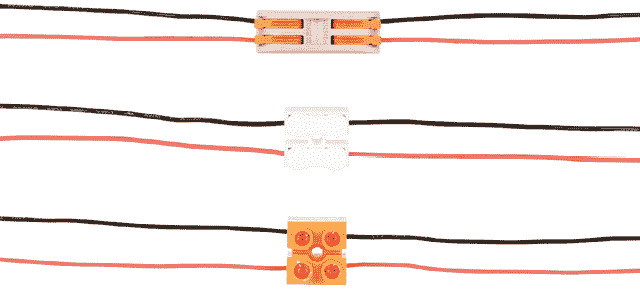

### 桶形和插座连接器

最后但同样重要的是，你可以使用带螺丝端子的桶形和插座连接器来进行电源连接。如果你想将电池连接到一个或多个并联电机，只需将一个连接器连接到电池组，另一个连接到电机，通过将电线插入连接器的螺丝端子。最后，将桶形插头插入桶形插座，连接就完成了。

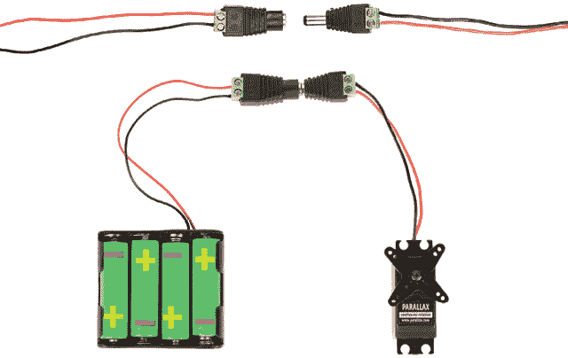

## 伺服电机的替代方案

无控制器伺服电机是本书中构建机器人最好的解决方案，但其他一些方法也能提供类似的效果。

所有这些替代方法基本上由三个元素组成：齿轮电机、电机安装支架和某种连接到电机轴的轮子或盘子。

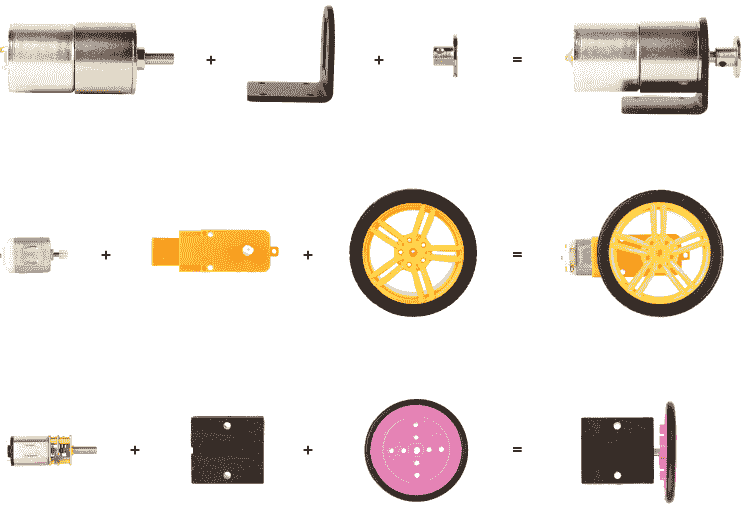

这个列表并不全面，因此可以自由尝试并寻找其他解决方案。如果遵循这个公式，你不会出错。

## 继电器电路

使用继电器时，我建议选择继电器座。继电器座具有螺丝端子，使得连接和断开电线变得容易，尽管你始终可以将电线直接连接到继电器引脚。

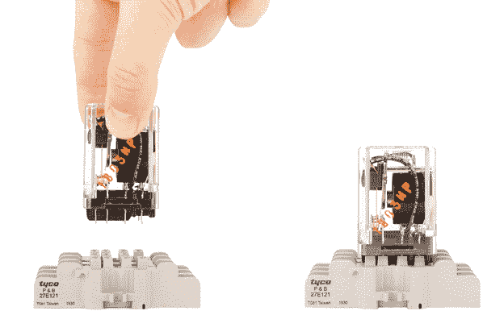

要插入电线，只需松开螺丝，将电线的未绝缘部分放在螺丝（或螺丝板）下，然后紧固螺丝。

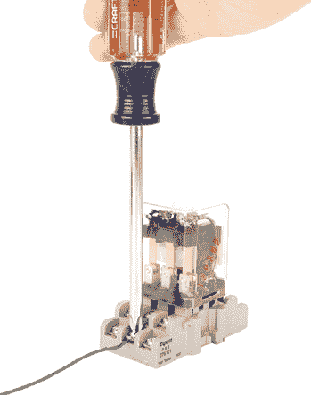

你还可以轻松地将多条电线连接到单个端子。

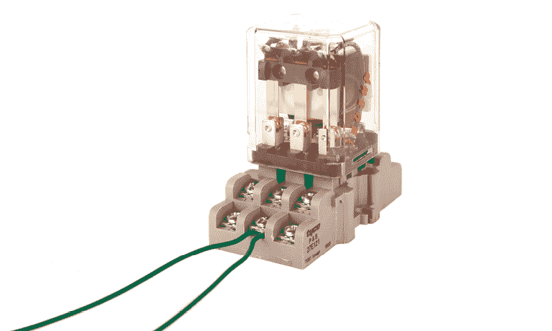

### DPDT 继电器电路

DPDT 继电器的工作原理与 DPDT 开关相同。在前面的示例中，端子被接成 H 桥配置（见第三章第 30 页）。杠杆开关控制电磁线圈的电源连接。如果线圈有电，电机反向驱动；如果线圈没有电，电机正向驱动。

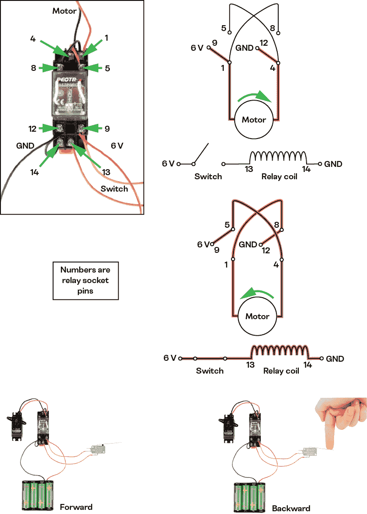

### 3PDT 继电器电路

你还可以像接 DPDT 继电器一样，将 3PDT 继电器接成 H 桥配置，但 3PDT 继电器在末端会留下一个未使用的 SPDT 继电器端子连接。你可以在继电器激活时使用这组剩余端子来控制其他设备。

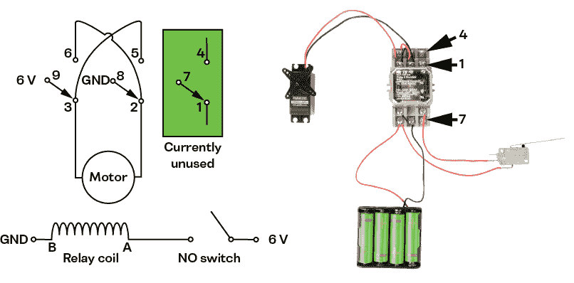

你可以制作一个电路，根据按下哪个开关来改变电机的方向（并保持改变）。你只需要这组额外的端子和一个额外的 SPDT 杠杆开关。第十四章中的 Flip Flop Bot 就使用了这个电路。

该电路由两个开关组成，每个开关通过不同的电路路径为线圈供电。一条路径通过第一个开关，该开关接线为常开（NO）。为此，将一根线连接到它的 NO 接点和公共 C 接点以及继电器线圈。第二条路径通过继电器端子（未用于 H 桥）传递电流。为此，将一个开关接线为常闭（NC），并将一根线连接到它的 NC 接点以及公共 C 接点和继电器线圈。

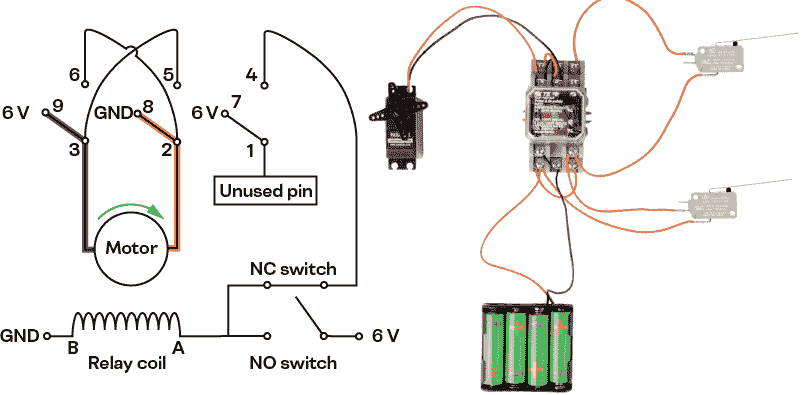

当按下第一个开关时，电路完成。电流可以通过线圈流动，并使其获得电能。这切换了继电器，利用 H 桥接线反转电动机的方向。它还完成了第二个开关电路，为线圈供电。

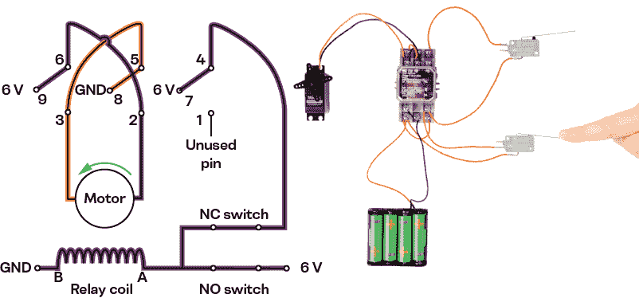

当 NO 开关被释放时，电源不再通过它流向线圈。然而，电源仍然通过另一个常闭开关流向线圈。只要这个开关保持闭合，线圈将持续供电，电动机将继续逆向旋转。如果你想让电动机再次向前旋转，唯一的办法就是按下 NC 开关，切断电路的电连接。

当按下 NC 开关时，开关会断开，并切断到继电器线圈的电路连接，从而切换继电器端子，使电动机再次向前旋转。这还会切断继电器内部到常闭开关的电源连接，防止其为线圈供电。从这里开始，过程可以重新开始。

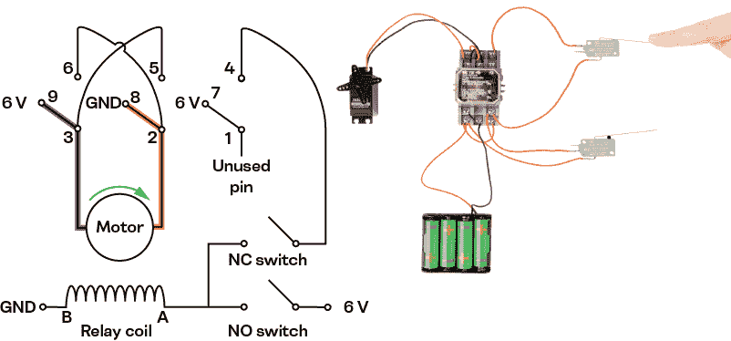

## 添加电源开关

本书中的机器人没有电源开关。然而，给任何机器人添加电源开关都很简单。只需准备一个 SPST 翘板开关，并按照以下简单步骤操作：

1.  步骤 1. 将连接到电池组的红色电源线剪成两段。

1.  步骤 2. 将每根电线的末端焊接到 SPST 开关的端子上。

1.  步骤 3. 在机器人的外壳上钻一个 ¼ 英寸的孔，选择一个有足够空间安装开关的位置。

1.  步骤 4. 将开关插入外壳中的孔，并用安装硬件固定到位。

享受您的新电源开关吧！

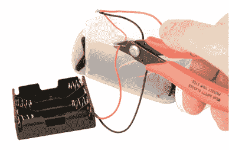

步骤 1

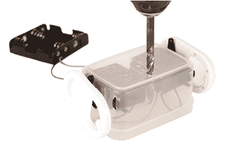

步骤 3

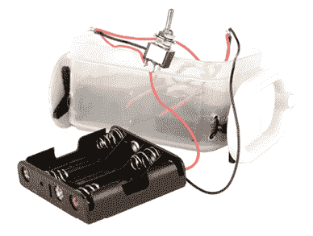

步骤 2

步骤 4

## 基本电子元件购物清单

以下表格列出了完成本书中任何项目所需的最低配件清单，按章节分类，包括不同的电子元件供应商和零件编号。

| **数量** | **零件** | **Amazon** | **Digikey** | **Mouser** | **章节** | **备注** |
| --- | --- | --- | --- | --- | --- | --- |
| 2 | 连续伺服 | B01HSX1IDE | 900-00008-ND | 619-900-00008 | 5, 6, 7, 8, 9, 10, 11, 12, 13, 14 | 用于所有项目 |
| 1 | 4 × AA 电池组 | B07F43VWRQ | 36-2478-ND | 534-2478 | 5, 6, 8, 11, 12, 13, 14 |  |
| 1 | 3 × AA 电池组 | B008HJ02F4 | 36-2480-ND | 546-BH3AAW | 7, 9, 10 |  |
| 1 | DPDT 开关 | B07QGBW6XZ | EG2398-ND | 612-100-F1111 | 10, 11, 12 |  |
| 1 | SPST 开关 | B07QGDDTWJ | 360-2827-ND | 633-M201101 | 附录 A | 所有项目的可选电源开关 |
| 2 | 磁簧开关 SPDT | B0010F0086 | — | 507-AMS-505-392W | 9 |  |
| 1 | 倾斜开关 | B07S9KQYNV | CKN10375-ND | 611-RB-231X2 | 8 |  |
| 4 | 杠杆开关 | B07YQPSK3B | 480-5932-ND | 785-V15T16-EZ100A03 | 13, 14 |  |
| 1 | 22 AWG 红色绞线电缆 | B07JNRJW37 | 422010RD005-ND | 602-422010-100-03 | 5, 6, 7, 8, 9, 10, 11, 12, 13, 14 | 用于所有项目 |
| 1 | 22 AWG 黑色绞线电缆 | B07JNRJW37 | 422010BK005-ND | 602-422010-100-02 | 5, 6, 7, 8, 9, 10, 11, 12, 13, 14 | 用于所有项目 |
| 1 | 3PDT 继电器 – 6 V 线圈 | B084KYCXQ8 | KUP-14D15-6 | 655-KUP-14D15-6 | 14 |  |
| 1 | 3PDT 继电器插座 | B07J66JGZ3 | PB165-ND | 655-27E121 | 14 |  |
| 1 | DPDT 继电器 – 6 V 线圈 | B07SYHCPQX | PB2272-ND | 655-KUP-11A15-6 | 13 |  |
| 1 | DPDT 继电器插座 | B07SYHCPQX | PB166-ND | 655-27E893 | 13 |  |

## 额外资源

1.  **instructables.com** 在这个网站上，你可以找到成千上万的用户提交的机器人和电子项目。它还提供了学习其他技能的资源，如制造和 3D 打印。

1.  *儿童电子学* 由 Øyvind Nydal Dahl 编写，是一本深入了解电子元件和电路的好书，书中包含了一系列有趣的动手项目。

1.  *Arduino 入门* 由 Massimo Banzi 和 Michael Shiloh 编写，这是由 Arduino 发明人和另一位创客传奇人物带来的关于 Arduino 微控制器系统基础的速成课程。

1.  *Arduino 项目手册* 由 Mark Geddes 编写，另一本 Arduino 快速入门书籍，包含 25 个动手项目，教授一系列 Arduino 技能（如数组）。

1.  *物理计算* **由 Dan O’Sullivan 和 Tom Igoe 编写**，这是一本介绍与电子学相关的高级入门书籍。它更像一本教材，而不是活动书籍，但它是学习构建更复杂电路的一个很好的起点。

1.  *让物体动起来* 由 Dustyn Roberts 编写，像 *物理计算* 一样，这本书更像是一本教材，而不是活动书籍，但它足够易懂，能让你快速入门机电一体化。

1.  *Make:* 杂志，这是一个处于创客运动前沿的杂志。除了许多其他有趣的主题外，它通常会有关于机器人方面的精彩文章。

1.  *HackSpace 杂志* 这是另一个非常好的资源，帮助你保持对 DIY 机器人和电子学的最新了解。

1.  **hackerspaces.org** 在这个网站上，你可以找到本地的黑客空间，并结识其他对机器人感兴趣的人。

1.  makerfaire.com Maker Faires 是本地和地区性的年度活动，创客们聚集在一起，分享他们的项目。
