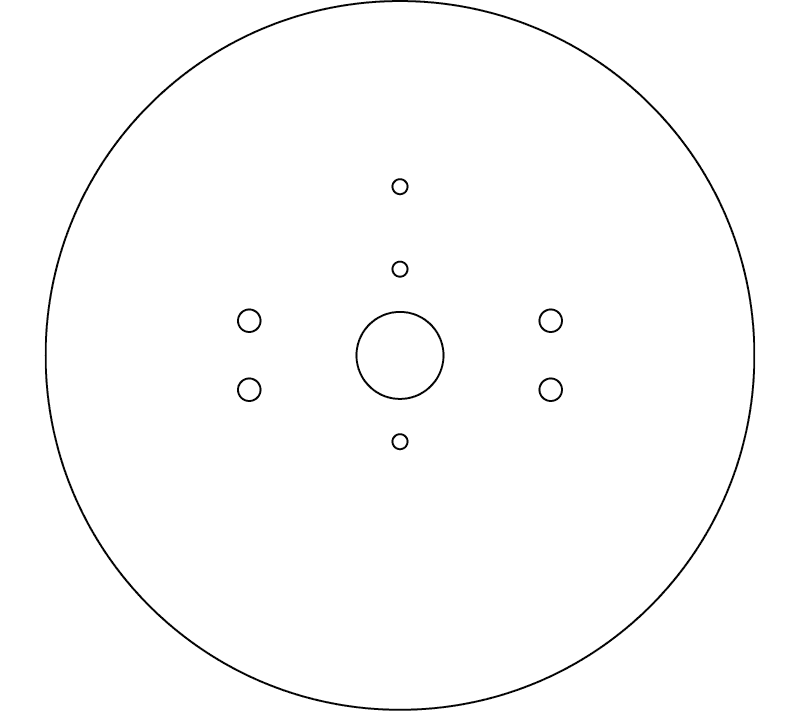
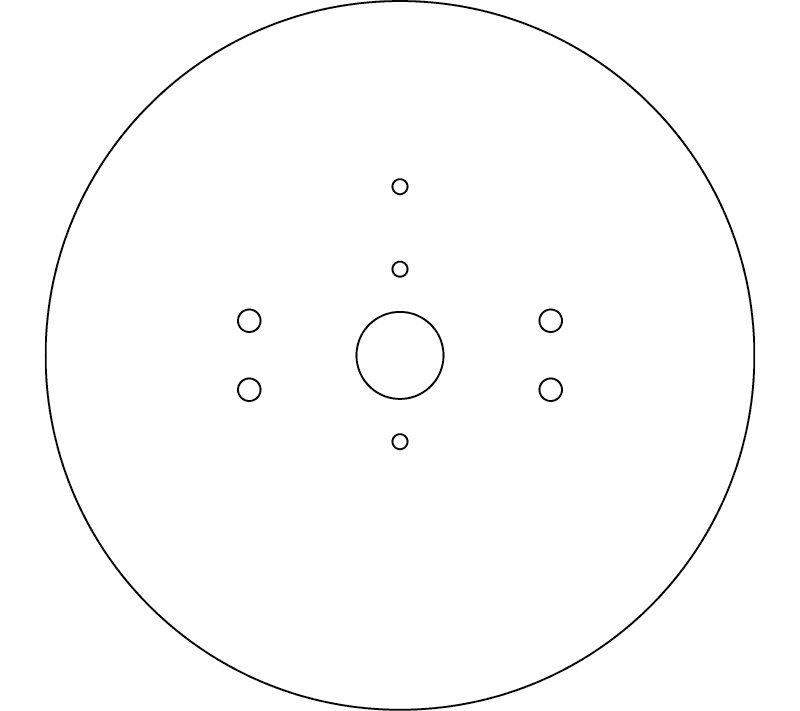
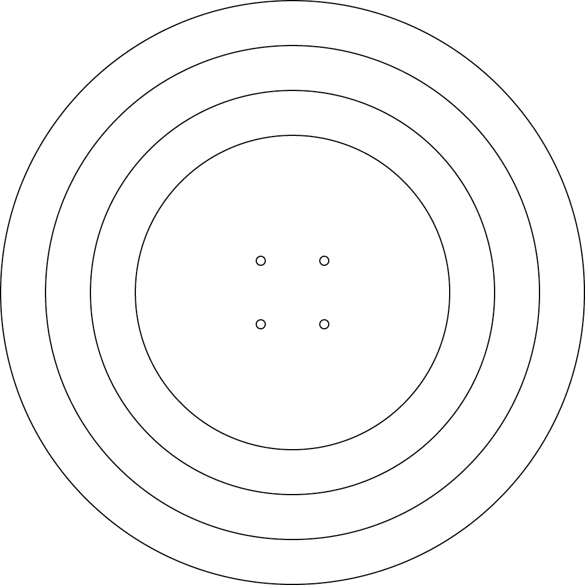

# 第十六章：B

切割和钻孔模板

在本附录中，我包含了制作 Barreller、Daze 和 Walker 所需的模板。使用这些模板的最简单方法是将一张普通的白色打印纸放在页面上，用铅笔描摹轮廓。描摹完模板后，你可以将其剪下并粘贴到你要切割或钻孔的部件上。要下载和打印这些模板的版本，你可以访问[`www.randysarafan.com/`](http://www.randysarafan.com/)或[`nostarch.com/homemaderobots/`](https://nostarch.com/homemaderobots/)。

## Barreller

## Daze

## Walker

