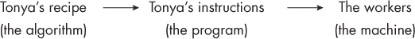
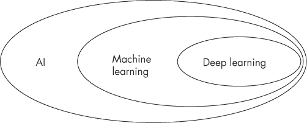
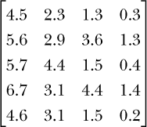
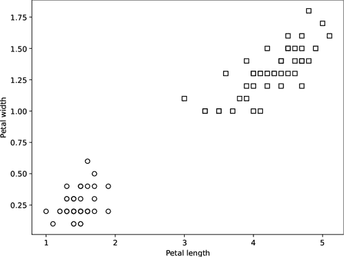
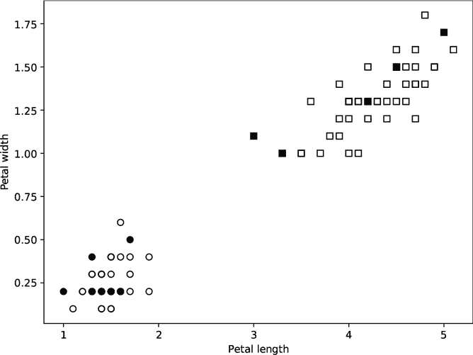
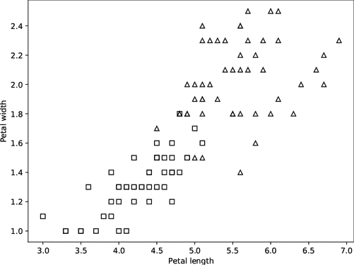
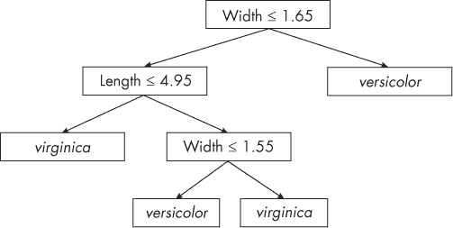
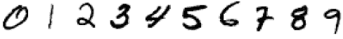
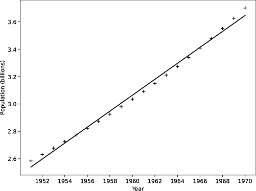
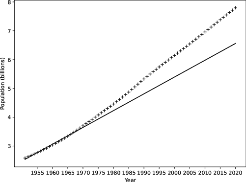

## 第二章：AND AWAY WE GO: AN AI OVERVIEW**

*人工智能*试图让机器，通常是计算机，按人类认为智能的方式进行行为。这个词汇是在 1950 年代由著名计算机科学家约翰·麦卡锡（John McCarthy，1927–2011）创造的。

本章旨在阐明什么是 AI，以及它与*机器学习*和*深度学习*的关系，这两个术语你可能在近年来听说过。我们将通过一个机器学习实例来深入探讨。可以把本章看作是 AI 的概述，后续章节将进一步扩展并复习这里介绍的概念。

****

计算机被*编程*以执行特定的任务，方法是给它们一系列指令，即*程序*，程序体现了*算法*，或者说程序让计算机执行的“配方”。

如今，“*算法*”这个词常常被提及，尽管它并不新鲜；它源自阿尔·花拉子米（Al-Khwarizmi），这是指 9 世纪波斯数学家穆罕默德·伊本·穆萨·阿尔·花拉子米，他对世界的主要贡献就是我们今天所称的*代数*。

****

让我们从一个故事开始。

托尼娅拥有一家成功的辣酱工厂。辣酱的配方是托尼娅自己创造的，她小心翼翼地保守这个秘密。它确实是她的“秘密酱”，只有她知道制作它的全过程。

托尼娅为每一步辣酱制作过程雇佣了一名工人。这些工人是人类，但托尼娅把他们当作机器看待，因为她担心他们会偷走她的辣酱配方——而且托尼娅有点怪。在事实上，工人们并不介意，因为她支付的报酬丰厚，而且他们在背后偷偷嘲笑她。

托尼娅的配方就是一个算法；它是制作辣酱所必须遵循的一系列步骤。托尼娅用来告诉工人如何制作辣酱的指令集合就是程序。程序以一种方式体现了算法，使得工人（即机器）可以一步步地执行。托尼娅已经将自己的算法编程成工人能够遵循的流程来制作辣酱。这个顺序大致如下：

有几个方面需要注意。首先，托尼娅把人类当作机器对待，显然是个怪物。其次，在制作辣酱的过程中，任何工人都不需要理解自己为什么要做某件事。第三，程序员（托尼娅）知道机器（工人）做某事的原因，即便机器自己并不清楚。

****

我刚才描述的是我们如何控制几乎所有的计算机，这可以追溯到艾伦·图灵在 1930 年代构思的第一台概念性机器，甚至更早，可以追溯到 19 世纪查尔斯·巴贝奇的分析引擎。一个人设计出一个算法，然后将该算法翻译成一系列步骤（一个程序）。计算机执行该程序，从而实现算法。计算机并不理解它在做什么；它只是执行一系列原始的指令。

巴贝奇和图灵的天才在于意识到，可以有一台通用的计算机，通过程序执行任意的算法。然而，我认为是巴贝奇的朋友，常被认为是世界上第一位程序员的阿达·洛夫莱斯，最初理解了我们现在所说的计算机的深远可能性。我们将在第二章中详细讨论图灵、巴贝奇和洛夫莱斯。

**备注**

*在洛夫莱斯时代，“计算机”不是一台机器，而是一个通过手工计算的人工智能。因此，巴贝奇的引擎是一台机械计算机。*

让我们花一点时间探讨一下*AI*、*机器学习*和*深度学习*这几个术语之间的关系。一方面，三者已成为现代 AI 的代名词。这是错误的，但很方便。图 1-1 显示了这些术语之间的正确关系。

*图 1-1：人工智能、机器学习和深度学习之间的关系*

深度学习是机器学习的一个子领域，而机器学习是人工智能的一个子领域。这种关系意味着 AI 涉及的概念既不属于机器学习，也不属于深度学习。我们将这些概念称为*传统 AI*，它包括自 1950 年代以来发展起来的算法和方法。传统 AI 并不是人们当前讨论 AI 时所指的内容。接下来，我们将完全（且不公平地）忽视 AI 领域的这一部分。

*机器学习*从数据中构建模型。对我们来说，*模型*是一个抽象的概念，它接受输入并生成输出，其中输入和输出以某种有意义的方式相关联。机器学习的主要目标是利用*已知*数据来训练模型，使得当模型接收到*未知*数据时能够生成有意义的输出。听起来有点模糊，但请耐心等待；这些模糊的部分会随着时间的推移得到澄清。

*深度学习*使用以前过于庞大而无法实用的大型模型。更多的模糊水，但我将辩称，深度学习没有严格的定义，除了它涉及到有许多层的神经网络。第四章将进一步澄清。

在本书中，我们将随意使用，但与大众的习惯一致，甚至专家也常这么做，把“深度学习”理解为大型神经网络（尚未正式定义），把“机器学习”理解为由数据条件化的模型，把“人工智能”视为机器学习和深度学习的统称——记住，人工智能不仅仅是我们在这里讨论的内容。

数据在人工智能中至关重要。我无法强调这一点的重要性。模型是空白的画布，必须通过数据来条件化，以使其适用于某个任务。如果数据不好，模型就不好。在本书中，我们将不断回到“好”数据和“坏”数据这一概念。

现在，让我们聚焦于模型是什么、如何通过条件化使它变得有用，以及在条件化后如何使用它。所有关于条件化和使用的讨论听起来都阴暗而邪恶，甚至可以说充满了威胁，但我向你保证，它并非如此，尽管我们确实有一些方法让模型“说话”。

****

机器学习模型是一个黑箱，它接受一个输入，通常是一组数字，然后产生一个输出，通常是一个标签，比如“狗”或“猫”，或者是一个连续值，如“狗”的概率，或者给定特征（大小、浴室数量、邮政编码等）后房子的价值。

模型有*参数*，它们控制着模型的输出。条件化模型，也叫做*训练*，旨在设置模型的参数，使其在给定输入时产生正确的输出。

训练意味着我们有一组输入，以及当给定这些输入时，模型应该产生的输出。乍一看，这似乎有点傻；为什么我们要让模型给出我们已经拥有的输出呢？答案是，在未来某个时刻，我们会有一些输入，而我们并没有已有的输出。这正是构建模型的全部意义：使用它来处理未知的输入，并相信它在给出输出时的可靠性。

训练使用已知的输入和输出集合来调整模型的参数，以最小化错误。如果我们能够做到这一点，我们就能在给定新的、未知的输入时开始相信模型的输出。

训练一个模型与编程是根本不同的。在编程中，我们通过逐步指示计算机来实现我们想要的算法。而在训练中，我们使用数据教模型调整其参数，以产生正确的输出。没有编程，因为大多数时候我们根本不知道算法应该是什么。我们只知道或相信输入和期望输出之间存在某种关系。我们希望模型能够足够好地逼近这种关系，使其变得有用。

值得记住英国统计学家乔治·博克斯的名言：“所有模型都是错误的，但有些是有用的。”当时他指的是其他类型的数学模型，但这一智慧同样适用于机器学习。

现在我们明白了为什么这个领域叫做机器学习：我们通过给机器（模型）提供数据来教它。我们不是在编程机器，而是在指示它。

那么，这就是机器学习算法：

1.  收集一个训练数据集，包含一组模型的输入和我们期望模型针对这些输入产生的输出。

1.  选择我们想要训练的模型类型。

1.  通过呈现训练输入并在模型输出错误时调整模型的参数来训练模型。

1.  重复步骤 3，直到我们对模型的表现满意为止。

1.  使用现在训练好的模型为新的、未知的输入产生输出。

大多数机器学习遵循这一算法。由于我们使用已知的 *标签数据* 来训练模型，这种方法被称为 *监督学习*：我们在模型学习如何产生正确输出时进行监督。从某种意义上讲，我们会惩罚模型，直到它做对为止。毕竟，这是一项黑暗的事业。

我们已经准备好进行一个示例，但让我们先总结一下目前为止的内容。我们希望构建一个系统，对于一个未知输入，能够得到一个有意义的输出。为了构建这个系统，我们通过一组已知输出的输入数据来训练一个机器学习模型。训练通过调整模型的参数，减少它在训练数据上所犯的错误，从而使模型得到调教。当我们对模型的表现满意时，我们就可以使用这个模型来处理未知输入，因为我们现在相信模型在给出输出时是可靠的（至少，大部分时间是这样）。

我们的第一个示例来自一个著名的数据集，包含了鸢尾花部位的测量数据。这个数据集来自 1930 年代，表明人们早在很久以前就开始思考我们现在所称之为机器学习的领域。

目标是得到一个模型，该模型对于一组测量值的输入，能够输出特定种类的鸢尾花。完整的数据集包含了三种鸢尾花的四个测量值。为了简化，我们只使用两个测量值和两种花种：*I. setosa* 和 *I. versicolor* 的花瓣长度和宽度（单位：厘米）。因此，我们希望模型接受两个测量值作为输入，并给出我们可以解释为 *I. setosa* 或 *I. versicolor* 的输出。像这样的 *二分类模型* 会在两个可能的输出之间做出选择，并且在人工智能中很常见。如果模型在多个类别之间做出选择，那么它就是 *多类模型*。

我们的数据集包含 100 个样本：100 对花瓣测量值以及对应的鸢尾花类型。我们将 *I. setosa* 称为类别 0，将 *I. versicolor* 称为类别 1，其中 *类别* 用来标记输入的类别。

模型通常需要数字类别标签，这告诉我们模型并不知道它的输入和输出意味着什么；它们只是对一组输入和输出之间的关联进行建模。模型并不“思考”，按照任何常见的定义。（第七章的模型可能会有不同的看法，但我们会在那时讨论更多内容。）

****

在这里，我们必须暂停一下，介绍一些关键术语。我知道，这不是你想阅读的内容，但它对接下来的内容至关重要。人工智能经常使用向量和矩阵（单数形式为“矩阵”）。*向量*是一个作为单一实体处理的数字串。例如，每朵鸢尾花的四个测量值意味着我们可以用四个数字来表示这朵花，例如（4.5，2.3，1.3，0.3）。通过这个向量描述的花朵，其花萼长度为 4.5 厘米，花萼宽度为 2.3 厘米，花瓣长度为 1.3 厘米，花瓣宽度为 0.3 厘米。通过将这些测量值组合在一起，我们可以将它们视为一个单一实体。

向量中元素的数量决定了它的维度；例如，鸢尾花数据集使用四维向量，表示花朵的四个测量值。人工智能通常处理具有数百甚至数千维的输入。如果输入是图像，那么图像的每个像素就是一个维度，这意味着一个小的 28×28 像素的图像将成为一个 28×28 或 784 维的输入向量。这个概念在三维或 33,000 维中都是一样的：它仍然是一个作为单一实体处理的数字串。但图像有行和列，使得它成为一个二维数组，而不是一个字符串。二维数字数组就是*矩阵*。在机器学习中，我们通常将数据集表示为矩阵，其中行是表示数据集元素的向量，如一朵鸢尾花，而列是各个测量值。例如，鸢尾花数据集中的前五朵花形成如下矩阵：

每一行代表一朵花。请注意，第一行与向量示例相匹配。其余的行列出了其他花朵的测量值。

在你阅读时，请将以下想法记在心里：

+   向量是数字的串，通常表示数据集中的测量值。

+   矩阵是二维数字数组，通常表示数据集（向量堆叠）。

随着我们继续探索人工智能，向量和矩阵之间的差异将逐渐显现。现在，让我们回到我们的故事。

****

模型的输入是其*特征*。我们的鸢尾花数据集有两个特征，花瓣的长度和宽度，这些特征被归类为*特征向量*（或*样本*）。一个特征向量作为模型的输入。二分类模型的输出通常是一个数字，表示模型认为输入属于类别 1 的概率。对于我们的示例，我们将向模型提供一个由两个特征组成的特征向量，并期望得到一个输出，帮助我们决定是否应将输入标记为*I. versicolor*。如果不是，我们就将输入标记为*I. setosa*，因为我们*假设*输入总是属于其中之一。

机器学习的礼仪规定，我们应该测试我们的模型；否则，怎么知道它是否有效呢？你可能会认为当模型把所有训练样本都预测正确时，它就有效，但经验告诉我们，这并不总是如此。正确的测试模型的方法是保留一些标注过的训练数据，用于训练后测试。模型在这些保留的测试数据集上的表现，能更好地反映模型学习的效果。我们将使用 80 个标注样本进行训练，保留 20 个用于测试，确保训练集和测试集大致包含相同比例的两类（花的种类）。在实践中，这一点也是至关重要的。若我们从未向模型展示某类输入数据，它又怎能学会区分该类和其他类呢？

使用保留的测试集来判断模型的表现不仅仅是礼仪问题，它还涉及机器学习中的一个基础问题：泛化。一些机器学习模型遵循的过程与一个广泛使用的方法——*优化*——非常相似。科学家和工程师使用优化方法将测量数据拟合到已知的函数；机器学习模型也使用优化方法来调节其参数，但目标不同。拟合数据到一个函数，如拟合一条线，目的是创造最佳的*拟合*，即最能解释测量数据的那条线。而在机器学习中，我们的目标是训练一个模型，让它学会训练数据的一般特征，以便能够*泛化*到新的数据上。这就是为什么我们使用保留的测试集来评估模型的原因。对模型而言，测试集包含了它未曾使用过的、未知的数据，模型没有用这些数据来调整其参数。模型在测试集上的表现，是它泛化能力的线索。

我们的示例有两个输入特征，这意味着特征向量是二维的。由于只有两个维度，我们可以选择绘制训练数据集的图形。（如果特征向量有两个或三个特征，我们可以绘制这些特征向量。然而，大多数特征向量有成百上千个特征。我不知道你怎么样，但我无法可视化一个千维的空间。）

图 1-2 展示了二维鸢尾花训练数据；*x*轴为花瓣长度，*y*轴为花瓣宽度。圆圈表示*I. setosa*的实例，方块表示*I. versicolor*的实例。每个圆圈或方块代表一个单独的训练样本，即某一朵花的花瓣长度和花瓣宽度。为了定位每个点，首先找到花瓣长度在*x*轴的位置，再找到花瓣宽度在*y*轴的位置。然后，从*x*轴向上移动，从*y*轴向右移动。手指相遇的地方即为代表该花朵的点。如果该花是*I. setosa*，则用圆圈表示该点；否则，用方块表示该点。

*图 1-2：鸢尾花训练数据*

图 1-2 中的图示展示了训练集的*特征空间*。在这种情况下，我们可以直接可视化训练集，因为我们只有两个特征。当不可行时，也并非毫无办法。存在一些先进的算法，允许我们制作像图 1-2 那样的图，其中二维或三维中的点反映了样本在更高维空间中的分布。在这里，*空间*一词与日常语言中的含义几乎相同。

仔细看看图 1-2。你看到什么了吗？不同的类别是混杂在一起还是分得很清楚？每个圆圈都位于图示的左下角，而所有方块都在右上角。类别之间没有重叠，这意味着它们在特征空间中完全分开。

我们如何利用这一事实来构建一个*分类器*，一个分类鸢尾花的模型呢？（虽然*模型*是更为通用的术语，因为并非所有模型都会将输入分到类别中，但当它们这样做时，我们使用术语*分类器*。）

我们有许多模型类型可以选择作为我们的分类器，包括*决策树*，它们生成一系列与特征相关的“是/否”问题，用于决定针对给定输入输出的类别标签。当这些问题以视觉形式展示时，它们形成了一种类似倒置树形的结构。可以把决策树看作是计算机生成版的“*20 个问题*”游戏。

尽管我们有两个特征，花瓣长度和花瓣宽度，但我们可以通过询问一个简单的问题来分类新的鸢尾花：花瓣长度是否小于 2.5 厘米？如果答案是“是”，则返回类别 0，*I. setosa*；否则，返回类别 1，*I. versicolor*。为了正确分类训练数据，我们只需要这个简单问题的答案。

你明白我刚才做了什么吗？我说问题正确地对所有*训练*数据进行了分类。那么我们没有使用的那 20 个测试样本呢？我们的单问题分类器足够为每一个测试样本分配正确的标签吗？实际上，这正是我们想要了解的内容，这也是我们会报告的分类器的表现。

图 1-3 再次展示了训练数据，以及我们没有用于构建单问题分类器的测试数据。实心圆圈和方块表示测试数据。

*图 1-3：包含保留的测试数据（实心）的鸢尾花训练数据*

没有任何测试数据违反我们的规则；我们仍然通过询问花瓣长度是否小于 2.5 厘米来获得正确的类别标签。因此，我们的模型是完美的；它没有犯任何错误。恭喜你，你刚刚创建了你的第一个机器学习模型！

我们应该感到高兴，但不要太高兴。让我们重复这个练习，将*I. setosa*替换为剩余的鸢尾花种类，*I. virginica*。这将导致图 1-4，其中三角形表示*I. virginica*的实例。

*图 1-4：新的鸢尾花训练数据*

嗯，现在情况变得不那么清晰了。类别之间的明显差距消失了，它们开始重叠。

我使用这个新的鸢尾花数据集训练了一个决策树。像之前一样，有 80 个样本用于训练，20 个样本被留作测试。这次，模型并不完美。它正确标记了 20 个样本中的 18 个，准确率为 9/10，即 90%。这大致意味着，当该模型将花卉分配到特定类别时，正确的概率是 90%。为了严谨起见，上一句话需要仔细澄清，但现在你明白了——机器学习模型并不总是完美的；它们（相当频繁地）会犯错误。

图 1-5 显示了学习到的决策树。从顶部开始，那是根节点，并回答该框中的问题。如果答案是“是”，则移到左侧的框；否则，移到右侧。继续以这种方式回答问题并移动，直到到达一个叶节点：没有箭头的框。该框中的标签被分配给输入。

*图 1-5：I. virginica 与 I. versicolor 的决策树*

第一个决策树分类器是微不足道的，因为回答一个简单的问题就足以决定类别成员身份。第二个决策树分类器则更为常见。大多数机器学习模型并不特别简单。虽然它们的运作是可以理解的，但理解它们为何如此运作是完全不同的事情。决策树是少数几种可以自我解释的模型类型之一。对于任何输入，路径从根节点到叶节点的过程在图 1-5 中详细解释了为什么该输入被分配了特定的标签。而现代 AI 背后的神经网络则不那么透明。

****

为了让模型在“实际环境”中表现良好，即在现实世界中使用时，训练模型所使用的数据必须覆盖模型可能遇到的所有输入范围。例如，假设我们想要一个模型来识别狗的图片，而我们的训练集只包含狗和鹦鹉的图片。虽然模型在我们的保留测试集上表现良好，该测试集也包含狗和鹦鹉的图片，但当我们部署模型并遇到一张狼的图片时会发生什么呢？直观上，我们可能期望模型会说“这是只狗”，就像一个小孩子在他们学习到狼是什么之前可能会这么说。这正是大多数机器学习模型会做的事情。

为了说明这一点，让我们做一个实验。所有 AI 研究人员都使用的一个流行数据集包含了成千上万张包含手写数字（0 到 9）的图像。它有一个不太吸引人的名字——MNIST（修改版的 NIST），因为它是在 1990 年代末期从美国国家标准与技术研究院（NIST）构建的数据集中派生出来的，NIST 是美国商务部下设的一个部门，负责为商业和工业领域几乎所有事物制定标准。

图 1-6 展示了一些典型的 MNIST 数字样本。我们的目标是构建一个神经网络，能够识别数字 0、1、3 和 9。我们可以在不知道神经网络具体工作原理的情况下进行训练，因为有像 scikit-learn 这样的强大开源工具包可以供大家使用。一方面，这使得 AI 变得更加民主化；另一方面，缺乏知识往往会带来危险。模型可能看起来表现良好，实际上却存在缺陷，而如果不了解模型的工作原理，可能无法在为时已晚之前意识到这个问题。

*图 1-6：典型的 MNIST 数字样本*

在分类器训练完成后，我们将通过向其输入一些从未在训练中出现过的四和七的图像来给它设置一些“难题”。这个模型会如何处理这些输入呢？

我使用开源工具包训练了数字分类模型。现在，我们只需要了解数据集的情况：输入特征向量是展开的数字图像；第一行像素之后是第二行，然后是第三行，依此类推，直到整个图像被展开成一个长向量，即一串数字。这些数字图像是 28×28 像素，特征向量的长度为 784 个数字。我们要求神经网络在一个 784 维的空间中进行学习，而不是我们之前使用的简单二维空间，但机器学习能够应对这个挑战。

用来训练神经网络模型的训练集包含了 24,745 个样本，每种数字类型（0、1、3、9）大约有 6,000 个样本。这应该足够公平地代表模型在使用过程中可能遇到的数字类型，但我们需要实际尝试才能知道。AI 是一个高度经验性的学科。

保留的测试集也包含数字 0、1、3 和 9，共有 4,134 个样本（每个数字大约 1,000 个样本）。

我们将使用一个*混淆矩阵*，它是一个二维的数字表格，用来评估模型。混淆矩阵是最常见的评估模型的方法，因为它能展示模型在测试数据上的表现。

在这种情况下，我们的数字分类器的混淆矩阵如表 1-1 所示。

**表 1-1：**数字分类器混淆矩阵

|  | **0** | **1** | **3** | **9** |
| --- | --- | --- | --- | --- |
| **0** | 978 | 0 | 1 | 1 |
| **1** | 2 | 1,128 | 3 | 2 |
| **3** | 5 | 0 | 997 | 8 |
| **9** | 5 | 1 | 8 | 995 |

矩阵的行表示提供给模型的样本的真实标签。列则是模型的响应。表格中的数值表示每种可能的输入类别和模型分配标签组合的出现次数。

例如，第一行表示测试集中的零。在这 980 个输入中，模型对 978 个返回了零标签，但有一次它将输入标记为三，另一次标记为九。因此，当输入为零时，模型输出正确的次数是 980 次中的 978 次。这是值得鼓舞的。

类似地，当输入为 1 时，模型正确地返回了 1128 次标签。对于 3，模型正确了 997 次，针对 9，模型正确了 995 次。当一个分类器表现好时，从左上到右下的混淆矩阵对角线上的数字会很高，且几乎没有偏离对角线的数字。偏离对角线的数字表示模型的错误。

总的来说，数字模型的准确率达到了 99%。我们有一个稳定且表现良好的模型——前提是我们能确保模型的输入确实是 0、1、3 或 9。可是如果输入不是这些呢？

我输入了 982 个数字 4，模型是这么回复的：

| **0** | **1** | **3** | **9** |
| --- | --- | --- | --- |
| 48 | 9 | 8 | 917 |

换句话说，模型对 982 个数字 4 中的 917 个返回了标签 9，对 48 个数字 4 返回了标签 1，其他的则返回了标签 1 或 3。那对于 7 呢？

| **0** | **1** | **3** | **9** |
| --- | --- | --- | --- |
| 19 | 20 | 227 | 762 |

模型仍然倾向于把 7 当成 9，但它也常常把 7 当成 3。神经网络在解释其行为时不愿意透露过多信息，但在这个案例中，227 个被标记为三的 7 中，有 47 个是带有斜线的欧洲风格 7。从整个数据集中随机抽取的 227 个 7 中，只有 24 个是带有斜线的欧洲风格 7。这个比较在数学上不严谨，但它暗示了带斜线的 7 通常足够像 3，容易让模型误判。

模型从未被训练去识别数字 4 或 7，因此它做了最好的尝试，把它们放入了相邻的类别中。根据写法的不同，人们有时会把数字 4 和 7 误认为是 9。例如，模型犯了人们常犯的错误，这很有趣——但更重要的是，模型的表现较差，因为它没有在可能遇到的所有输入上进行训练。它没有办法说“我不知道”，而且让模型可靠地做出这样的判断可能是棘手的。

这是一个简单的练习，但其含义深远。假设模型不是在识别数字，而是在医学图像中寻找癌症，但它从未被训练去识别一种重要的病变类型或该病变可能呈现的所有形式呢？一个构建合理且全面的数据集可能意味着生死之间的差异。

****

我们也可以从插值和外推的角度来思考数字示例。*插值*是在已知数据范围内进行近似，而*外推*则超出了已知数据的范围。

对于数字示例，插值可能是指在实际中遇到一个倾斜的零，而训练集中的零并没有特别倾斜。模型必须进行插值，在某种意义上，才能正确响应。外推更像是对一个有斜杠的零进行分类，这是训练时从未见过的情况。为了更好地理解这些术语，我们来模拟 1950 年到 2020 年的世界人口。

首先，我们将对 1950 年到 1970 年的数据进行线性拟合。拟合一条直线是一种曲线拟合的形式；可以把它看作是机器学习中不那么复杂的“表亲”。要拟合一条直线，需要找出两个数字：斜率和截距。斜率告诉我们直线的陡峭程度。如果斜率是正的，直线就会随着我们从左到右沿着图表的*x*轴移动而上升。负斜率意味着直线会随着我们沿着*x*轴移动而下降。截距是直线与*y*轴交点的位置；也就是输入为零时的值。

要拟合一条直线，我们使用一个算法来找到最能描述数据（这里是 1950 年到 1970 年世界人口）的斜率和截距。图 1-7 展示了这条直线的图表，以及每年的实际人口，用加号表示。直线穿过或接近大多数加号，因此拟合是合理的。请注意，人口单位是以十亿为单位的。

*图 1-7：1950 年至 1970 年世界人口*

一旦我们得到这条直线，就可以利用斜率和截距来估算任何年份的人口。对 1950 年到 1970 年之间的年份进行估算是插值，因为我们用了这个时间段的数据来创建直线。如果我们估算 1950 年之前或 1970 年之后的人口，那就是外推。表 1-2 展示了我们进行插值时的结果。

**表 1-2：** 1950 年到 1970 年之间的插值人口

| **年份** | **插值人口** | **实际人口** |
| --- | --- | --- |
| 1954 | 2.71 | 2.72 |
| 1960 | 3.06 | 3.03 |
| 1966 | 3.41 | 3.41 |

插值后的人口值与实际人口值非常接近，这意味着模型（这里是拟合到数据的直线）表现良好。现在，让我们进行外推，估算拟合范围之外的日期，如表 1-3 所示。

**表 1-3：** 1970 年之后的外推人口

| **年份** | **外推人口** | **实际人口** |
| --- | --- | --- |
| 1995 | 5.10 | 5.74 |
| 2010 | 5.98 | 6.96 |
| 2020 | 6.56 | 7.79 |

外推人口值与实际人口值之间的差距逐年增加。模型的表现不佳。绘制 1950 年到 2020 年整个范围的数据，揭示了问题所在；见图 1-8。

*图 1-8：1950 年至 2020 年世界人口*

随着时间的推移，拟合线变得越来越不准确，因为数据毕竟不是线性的。也就是说，增长速率不是恒定的，并且不遵循直线。

在进行外推时，我们可能会有理由相信数据将继续符合这条线；如果这是一个有效的假设，那么这条线将继续是一个很好的拟合。然而，在现实世界中，我们通常无法获得这样的保证。因此，我们可以把它作为口号：插值好，外推坏。

为一些数据拟合一条线是*曲线拟合*的一个例子。曲线拟合的规律同样适用于人工智能。当手写数字模型接收到与它训练时识别的数据相似的输入时，它的表现不错。测试数据中的数字都是 0、1、3 和 9，因此测试数据与训练数据相似。两个数据集来自相同的*分布*，并且是由相同的数据生成过程生成的。因此，我们可以说，在这些情况下，模型实际上是在进行插值。然而，当我们强迫模型做出关于 4 和 7 的决策时，我们是在进行外推，让模型对它在训练过程中从未见过的数据做出决策。

需要重复强调的是：插值好，外推坏。糟糕的数据集导致糟糕的模型；好的数据集导致好的模型，但当强迫它们进行外推时，它们会表现得很差。而且，再补充一句：所有的模型都是错误的，但有些是有用的。

****

跟 Hilaire Belloc 在 1907 年出版的《儿童警示故事》一书中的思路一样——这本书以一种有趣且略显恐怖的方式讲述了孩子们做出愚蠢行为可能导致不幸结局的故事——让我们来看看一些 AI 从业者在训练、测试，尤其是在部署模型时应该警惕的警示故事。

在 2016 年，我参加了一场会议演讲，演讲者展示了关于理解神经网络为何选择某种方式的研究。这仍然是一个未解决的问题，但已有进展。在这种情况下，研究标记了影响模型决策的输入图像部分。

演讲者展示了哈士奇犬和狼的图片，并讨论了他用来区分这两者的分类器。他展示了该分类器在测试集上的表现，并问在场的机器学习研究人员这个模型是否是一个好模型。很多人说是，但有所犹豫，因为他们预期会有陷阱。他们的犹豫是对的。随后，演讲者标记了图像，展示了神经网络在做出决策时关注的部分。模型并没有关注狗或狼。相反，模型注意到所有狼的训练图像背景中都有雪，而狗的图像中没有雪。模型并没有学习狗和狼的特征，而是学会了雪和没有雪的区别。如果不小心接受模型的行为，可能就无法发现这个问题，模型可能会被部署后在实际环境中失败。

关于上世纪五六十年代非常早期的机器学习系统，也有类似的故事。这个故事可能是虚构的，尽管我曾读过一篇来自那个时期的论文，可能就是这个都市传说的来源。在这个例子中，图像是森林的鸟瞰图。有些图像中包含了坦克，而有些则没有。

一个经过训练来检测坦克的模型在训练数据上似乎效果很好，但在实际环境中却惨败。最终人们意识到，一组训练图像是在阳光明媚的日子拍摄的，另一组则是在多云的日子拍摄的。该模型并没有学到它的创造者所假设的内容。

在更先进的机器学习模型中，类似的现象依然存在。有些模型甚至让专家误以为它学到了关于语言或类似内容的基本知识，而实际上，它只是学到了训练数据中一些极为细微的相关性，是人类（或机器）难以察觉的。

*相关性* 这个词有严格的数学意义，但我们用“相关性并不意味着因果关系”这一说法来捕捉它的本质。相关性是指两件事物之间存在联系，以至于一个的发生意味着另一个的发生，通常是按特定的顺序。更具体地说，相关性衡量的是一件事物变化与另一件事物变化的关联强度。如果两者都增加，它们是正相关的。如果一个增加而另一个减少，它们是负相关的。

例如，一只公鸡打鸣，太阳升起。这两个事件是时间相关的：先是公鸡，然后是太阳。这种相关性并不意味着因果关系，因为公鸡打鸣并不导致太阳升起，但如果这种相关性被观察得足够频繁，人类大脑就会开始认为一个是导致另一个的原因，即使没有真实证据表明如此。为什么人类会这样反应并不难理解。进化青睐那些能够做出这种关联的早期人类，因为有时这些关联促成了对生存有利的行为。

“相关性并不意味着因果关系”同样适用于人工智能。上述的模型学会了检测与目标（狗、狼、坦克）相关的训练数据中的东西，但并没有学到目标本身。精明的机器学习从业者总是警惕这种虚假的相关性。使用大规模且高度多样化的训练和测试数据集可以防止这种现象，尽管在实践中这并不总是可能的。

我们必须问自己，模型是否学到了我们假设它们已经学到的东西。正如我们在 MNIST 数字例子中看到的那样，我们必须确保模型已经看到了它们在实际环境中可能遇到的所有类型的输入——它们应该进行插值，而不是外推。

这比最初看起来更重要。谷歌在 2015 年通过 Google 照片的一个功能学到了这一课，模型在训练人脸时不足，导致做出了错误和不适当的关联。偏见，无论是泛指的还是社会层面的，都是人工智能中的一个真实问题。

让我们进行另一个实验，使用 MNIST 数字。此次，模型需要做出一个看似简单的决定：输入的数字是否是 9？该模型与之前使用的神经网络相同。如果在一个数据集中训练，其中每张图片要么是 9，要么是除 4 和 7 以外的其他任何数字（即，训练数据中没有 4 或 7），那么模型的准确率是 99%，正如混淆矩阵所示：

|  | **不是 9** | **9** |
| --- | --- | --- |
| **不是 9** |   9,754 | 23 |
|         **9** |   38 | 1,362 |

混淆矩阵告诉我们，模型正确标记了 9,777 张测试图片中除 9 以外的 9,754 张图片。对于 1,400 张数字 9，模型的标签也正确标记了其中的 1,362 张。虽然模型在测试集上表现良好，但该测试集并不包含数字 4 或 7。

在这种情况下，混淆矩阵较小，因为模型只有两个类别：9 或非 9。换句话说，这是一个二元模型。

矩阵右上角的 23 代表 23 次输入不是 9，但模型却说它是 9。对于一个二元模型，通常将类别 1 视为感兴趣的类别，即正类。因此，这 23 个输入代表了*假阳性*，因为模型说“它是 9”，但实际上不是。同样，左下角的 38 个样本是*假阴性*，因为模型说“它不是 9”，但输入实际上是 9。我们希望模型没有假阳性或假阴性，但有时最重要的是最小化其中一个。

例如，如果一个模型用于检测乳腺 X 光片中的乳腺癌，假阳性代表模型说“可能是癌症”，即使它不是。听到这个可能会让人害怕，但进一步的测试会显示模型是错误的。然而，假阴性代表漏诊癌症。如果一个模型几乎没有假阴性，我们可能会容忍更多的假阳性，因为假阳性比假阴性更不致命。我们开始意识到，全面训练、表征、测试并*理解*我们的机器学习模型是多么重要。

****

好的，回到我们的实验。像我们之前的 MNIST 模型一样，“这是 9 吗”分类器对数字 4 或 7 一无所知。当它看到数字 4 和 7 时，MNIST 模型通常会将它们误认为是 9。这个模型会做出相同的判断吗？这是我在给模型输入数字 4 和 7 时得到的结果：

|  | **不是 9** | **9** |
| --- | --- | --- |
| **不是 9** |   5,014 | 9,103 |

模型将 14,117 个四和七中的 9,103 个标记为九。这略高于 65%，大约是每三个中有两个。这模拟了我们将模型输入它从未接受过训练的类型的情况。

让我们通过将四和七添加到训练集中来帮助模型。希望提供一些例子，告诉模型：“它看起来像九，但它不是”，正式称为*困难负样本*，能够改进模型。我将 3%的训练数据设为四和七。整体模型的准确度与之前一样，99%，而当我给它一些它从未见过的四和七时，结果如下：

|  | **不是 9** | **9** |
| --- | --- | --- |
| **不是 9** | 9,385 | 3,321 |

这样就好多了。模型不再将三分之二的四或七标记为九，而是只将四分之一标记为九。即使是一些看起来像正类但不是的例子也能有所帮助。如果我将训练集中四和七的比例提高到 18%，模型将误分类四和七的情况低于 1%。因为模型是从数据中学习的，我们*必须*使用尽可能完整的数据集，以便模型能够插值而不是外推。

**注意**

*为了完全准确，最近的研究表明，现代深度学习模型几乎总是在进行外推，但输入与模型训练数据越相似，性能越好，因此我觉得使用这个类比是合理的。*

每个想要理解并且与 AI 打交道的人都必须认真对待有关用于训练 AI 模型数据质量的警告。2021 年由迈克尔·罗伯茨等人发表在《自然机器智能》期刊上的一篇研究文章《利用胸部 X 光片和 CT 扫描检测和预测 COVID-19 的机器学习常见陷阱及建议》是一个令人警醒的例子。作者评估了用于检测胸部 X 光片和 CT 扫描中的 COVID-19 的机器学习模型的表现，并将最初的超过 2,000 个研究（模型）筛选到 62 个进行严格测试。最终，作者宣称*没有*一个模型适合临床使用，因为模型构建存在缺陷，数据集存在偏差，或两者兼有。

这样的结果促成了*可解释的人工智能*这一子领域的诞生，旨在让模型具备自我解释的能力。

看看你的数据，并尽可能地理解你的模型在做什么，以及*为什么*。

****

本章标题“我们出发了”是喜剧演员杰基·格里森的口头禅。通常，在深入了解之前先快速浏览一遍主题是很好的，这样可以帮助我们在更深入地理解时拥有一个整体的视角。换句话说，我们快速进入主题，先了解一下，再更加有条理地进行探索。

本章中引入的许多新术语和概念可以在书本末尾的词汇表中找到。我的目标并不是让你现在就理解它们，更不要说记住它们，而是播下种子，以便下次你遇到这些术语或概念时，你更有可能想到：“啊，我知道这个。” 后续章节会加深这些概念，你将通过反复接触学习到重要的内容。

本章有两个要点需要记住。第一个是关于人工智能是什么以及它的基本构成。第二个是关于建立直觉，理解人工智能的功能以及我们应如何回应。

人工智能涉及模型，这些模型尚未完全明确，但我们可以通过数据对其进行条件化，以执行某些期望的任务。人工智能有很多类型的模型，本章介绍了其中两种：决策树和神经网络。关于决策树我不会再多说，但神经网络占据了书籍的大部分内容。

模型通常最好被视为函数，就像你在学校里可能记得的数学函数，或者构成大多数计算机程序核心的函数。它们都可以被看作是黑箱，其中有东西输入（输入），然后有东西输出（输出）。在人工智能中，输入是特征向量，它是根据当前任务所需的内容的集合。在本章中，我们使用了两个特征向量：花朵的测量值和手写数字的图像。

训练通过调整模型的参数来使其尽可能准确。这要求在训练大多数模型时要小心，以确保它学习到数据的通用特征，而不是虚假的关联或训练集的微小细节（这一概念称为*过拟合*，我们将在第四章讨论）。

正确开发机器学习模型意味着我们必须拥有一个测试集，它是已知输入和输出对的集合，在训练时不会使用该数据集。我们在训练后使用这个数据集来评估模型。如果数据集构建得当，测试集可以为我们提供模型在实际应用中表现如何的预期。

第二个要点与人工智能的优势及我们应如何应对有关。尽管人工智能强大，但它并不像我们一样思考（尽管第七章的模型可能会不同意）。人工智能的生死由数据决定，只有我们提供给它的数据好，它才好。如果数据集有偏差，人工智能就有偏差。如果数据集未能包括它在实际使用中可能遇到的输入类型的例子，人工智能将无法正确处理这些输入。

本章中的示例提醒我们，在假设人工智能按预期操作时要小心。模型是否学到了我们希望它学到的内容？它是否受到数据中我们未注意到的关联性影响，或者更糟糕的是，受到我们有限能力所无法察觉的影响？回想一下哈士奇与狼的例子。

因为 AI 的效果取决于输入给它的数据，我们有责任使数据集公平且无偏，并理解 AI 真正学到了什么，而不是做出假设。

AI 首次出现在 1950 年代，那么为什么它现在突然无处不在？下一章将回答这个问题。

**关键术语**

算法、人工智能、分类器、类别标签、混淆矩阵、数据集、决策树、深度学习、可解释 AI、特征、特征向量、机器学习、模型、神经网络、参数、测试、训练
