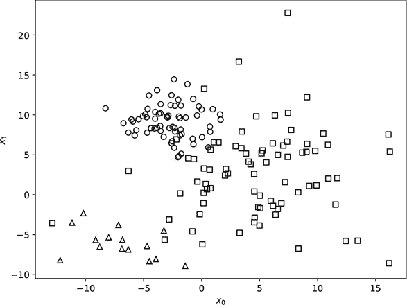
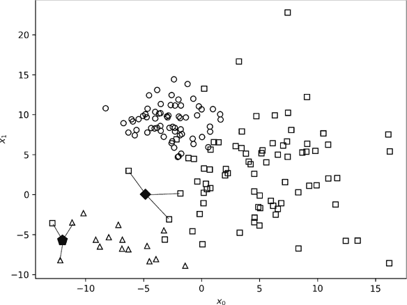
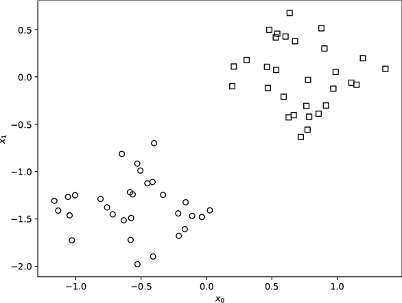
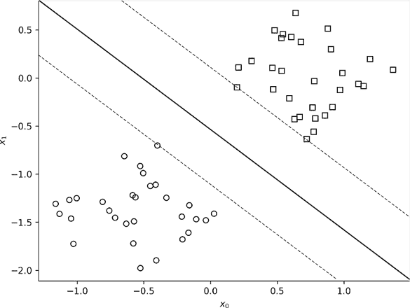
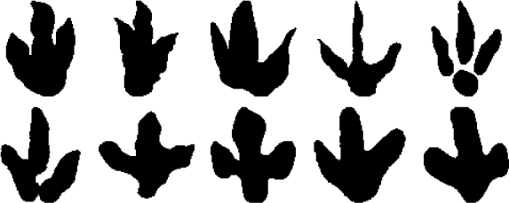

## 第四章：经典模型：老派机器学习**

初学钢琴的学生不会从李斯特的《钟声》开始，而是从《小星星》或《玛丽有只小羊羔》开始。这些简单的曲子包含了弹钢琴的基础，掌握这些基础可以让学生随着时间的推移不断进步。这个原则适用于大多数学习领域，包括人工智能。

为了达到理解现代人工智能的最终目标，我们必须从“简单”的经典机器学习世界开始。经典模型的规律通常也适用于更先进的神经网络。本章将探讨三种经典模型：最近邻、随机森林和支持向量机。理解这些将为我们理解第四章的神经网络做好准备。

****

图 3-1 展示了一个虚构数据集的训练样本，包含两个特征（*x*[0] 和 *x*[1]）和三个类别（圆形、方形和三角形）。我们在第一章中看到过类似的图表；见图 1-2。与鸢尾花数据集类似，图中的每一个形状都代表训练集中的一个样本。图 3-1 是我们理解最近邻经典模型的工具。

*图 3-1：一个包含三类和两个特征的虚构训练集*

如前一章所提到的，*最近邻*分类器是最简单的模型——简单到没有需要训练的模型；训练数据*就是*模型。为了给一个新的、未知的输入分配类标签，找到与未知样本最接近的训练样本并返回该样本的标签。就是这么简单。尽管它们很简单，如果训练数据代表了模型在现实中遇到的情况，最近邻分类器仍然非常有效。

作为最近邻模型的自然扩展，找到与未知样本最接近的*k*个训练样本。*k*通常是 3、5 或 7 这样的数字，尽管它可以是任何数字。这种模型使用多数投票系统，因此分配的类标签是*k*个训练样本中最常见的标签。如果出现平局，随机选择标签。例如，如果模型正在考虑一个未知样本的 5 个最近邻，其中两个是类别 0，另两个是类别 3，则通过在 0 和 3 之间随机选择来分配标签；平均而言，你会在 50%的时间里做出正确选择。

让我们使用最近邻概念来对一些未知输入进行分类。图 3-2 再次展示了训练样本，并加上了两个未知样本：菱形和五边形。我们想将这些样本分配到三个类别中的一个：圆形、方形或三角形。最近邻方法的思路是找到与每个未知样本最接近的训练样本。对于菱形，最近的训练样本是其左上方的方形；对于五边形，最近的训练样本是其右上方的三角形。因此，最近邻分类器会将菱形分为方形类别，将五边形分为三角形类别。

*图 3-2：分类未知样本*

我猜您已经注意到 图 3-2 中连接未知样本与三个最近训练样本的线条。这些样本是当 *k* 为 3 时要使用的样本。在这种情况下，分类器仍然会将菱形分为方形类别，因为三个最近的训练样本都是方形。对于五边形，三个最近邻样本中有两个是三角形，一个是方形，因此它也会将五边形分为三角形类别。

本例使用了二维特征向量，*x*[0] 和 *x*[1]，这样我们可以直观地展示这个过程。我们并不局限于仅有两个特征的模型；我们可以使用几十个甚至上百个特征。即使特征太多无法绘制图形，“最近” (距离) 的概念仍然具有数学意义。事实上，许多数学概念都可以作为距离度量，在实际应用中，最近邻分类器可能根据数据集使用任何一种度量方法。

例如，我们回到 第一章 的 MNIST 数字数据集。样本是小型的灰度数字图像，包含数字 0 到 9，我们将其展开为 784 个元素的向量。因此，训练集中的每个数字样本都是 784 维空间中的一个点，就像之前的例子中，每个样本都是二维空间中的一个点一样。

完整的 MNIST 数据集包含 60,000 个训练样本，这意味着训练空间由 60,000 个点组成，分布在 784 维空间中（虽然不是完全如此，但稍后会详细说明）。它还包含 10,000 个测试样本，我们可以用来评估最近邻模型。我用所有 60,000 个训练样本训练了一个 1-最近邻模型，然后使用 6,000 个样本，再用 600 个样本，最后只用了 60 个样本。训练集中的 60 个样本大约包含每个数字的六个例子。我说“约”是因为我随机抽样了训练集，所以某个数字可能有八个样本，而另一个数字可能只有三个样本。在每种情况下，我都使用所有 10,000 个测试样本来测试模型，从而模拟了在现实世界中使用模型的情况。

表 3-1 显示了随着训练样本数量变化，模型的表现。

**表 3-1：** 改变训练集大小

| **训练集大小** | **准确率 (%)** |
| --- | --- |
| 60,000 | 97 |
| 6,000 | 94 |
| 600 | 86 |
| 60 | 66 |

回想一下，准确率是指模型通过正确标记数字标签（0 到 9）正确分类的测试样本的百分比。当使用完整的训练集时，模型平均每 100 次预测中有 97 次是正确的。即便将训练集缩小为原来的十分之一，准确率仍然达到 94%。当训练样本数为 600 个（每个数字大约 60 个样本）时，准确率降至 86%。只有当训练集缩小到每个数字仅平均 6 个样本时，准确率才会急剧下降至 66%。

然而，在我们对最近邻模型过于苛刻之前，记住有 10 个数字类别，因此随机猜测平均大约有 1 次正确，准确率约为 10%。从这个角度来看，即使是 60 样本模型，也比随机猜测好六倍。让我们稍微探讨一下这个现象，看看能否深入了解为什么最近邻模型在如此少的训练数据下仍然表现良好。

想象一下，你独自一人在一个篮球场上，坐在场地中央。场馆的某个地方空中漂浮着一粒尘土。为了方便，假设这粒尘土保持在固定位置。现在，想象另外 59 粒尘土也漂浮在空中。这 60 粒尘土就是我们训练集中的 60 个数字样本，而篮球场则是数字图像向量所在的三维世界。

现在，假设一粒新的尘土出现在你鼻子前面。它是你想要分类的新数字向量。最近邻模型计算这粒尘土与已知数字标签的 60 粒尘土之间的距离。距离新尘土最近的是位于你正面对的篮筐边缘下方、47 英尺（14 米）远的一粒尘土。它标记为 3，所以模型返回标签 3。认为这粒最接近的尘土代表未知样本的正确标签合理吗？毕竟，整个场地只有 60 粒尘土。

我们需要考虑两个相互竞争的因素，才能合理地回答这个问题。首先，我们应该回答“否”，因为相信我们能用 60 粒尘土代表这个庞大的场地似乎很荒谬。训练集中的数据太少，无法填满整个场地的空间。这个现象被称为*维度灾难*，指的是随着维度的增加，需要填充空间的样本数也会以非常快的速度增加。换句话说，点的数量迅速增加，这意味着为了表示这个空间，所需的训练样本数量也会迅速增加——更准确地说是呈指数级增加。维度灾难是经典机器学习的痛点之一。

维度灾难意味着，当我们只有 60 个训练样本和 784 个维度时，我们应该不指望能正确分类数字……然而我们的最近邻分类器仍然有效。虽然效果不佳，但比随机猜测要好。为什么？原因与数字数据集以及不同类别之间的样本相似度有关。所有的数字 5 看起来都像 5；如果它们不是这样，我们就无法识别它们为 5。因此，尽管数字空间有 784 个维度，但同一类别的大多数数字会相对接近该类别的其他数字。换句话说，表示数字 5 的“尘埃颗粒”可能会聚集在一起，形成一个细长的、弯曲的区域，穿过整个空间。其他数字也可能以类似方式分组。正因为如此，最近的样本比我们最初根据维度灾难所预期的更有可能来自相同的数字类别。基于这一观察，我们将原来的“没有”答案升级为模棱两可的“可能”。

我们通过数学方式讨论这一效应，称数字数据位于一个具有有效维度的*流形*上，而这个有效维度远低于表示数字的 784 维向量。如果我们能利用这一信息，数据常常位于较低维度的流形上，这是一个好消息。最近邻模型利用了这一信息，因为训练数据就是模型。稍后在书中，当我们讨论卷积神经网络时，我们将了解到，这类模型学习新的方式来表示输入数据，这类似于学习如何表示数据所在的低维流形。

在我们过于兴奋于最近邻分类器在数字数据集上的表现之前，先让我们回到现实，尝试对真实图像进行分类。CIFAR-10 数据集包含 50,000 张 32×32 像素的小型彩色图像，来自 10 个不同类别，包括车辆（如飞机、汽车和卡车）和动物（如狗、猫和鸟）。每张图像展开后会生成一个 3,072 元素的向量，因此我们要求分类器在一个 3,072 维的空间中区分这些图像。表 3-2 展示了它的表现。

**表 3-2：** 使用最近邻分类器对 CIFAR-10 进行分类

| **训练集大小** | **准确率（%）** |
| --- | --- |
| 50,000 | 35.4 |
| 5,000 | 27.1 |
| 500 | 23.3 |
| 50 | 17.5 |

和 MNIST 一样，随机猜测的准确率为 10%。尽管我们的分类器在所有训练集大小的变种中表现得比这更好，但其最佳准确率仅为 35% 多一点——远远低于 MNIST 达到的 97%。这样的令人清醒的现实让许多机器学习领域的人感叹，通用图像分类可能超出了我们的掌控范围。幸运的是，这并非如此，但没有任何经典的机器学习模型能做到很好。

如果我们从流形的角度思考——即数据往往存在于一个比数据本身维度更低的空间中——那么这些结果并不令人惊讶。CIFAR-10 包含了现实世界的照片，通常被称为自然图像。自然图像比像 MNIST 数字那样简单的图像复杂得多，因此我们应该预期它们存在于一个高维流形中，因此更难以学习和分类。实际上，有一些数值方法可以估计数据的真实维度。对于 MNIST，尽管图像存在于一个 784 维的空间中，但数据更接近于 11 维。对于 CIFAR-10，本征维度更接近于 21 维，因此我们预期需要更多的训练数据才能达到与 MNIST 相当的表现。

现在最近邻模型不常被使用。造成这种情况的有两个问题。首先，虽然训练最近邻模型实际上是瞬时完成的，因为没有什么需要训练的，*但使用*最近邻模型却很慢，因为我们必须计算未知样本与每个训练样本之间的距离。这个计算时间随着训练集样本数的平方增长。我们拥有的训练数据越多，模型的表现越好，但运行速度却越慢。训练集的大小翻倍，搜索时间增加四倍。

数十年来，对最近邻分类器的研究揭示了许多技巧，用以减少找到最近邻或最近*k*个邻居所需的时间，但问题依然存在：增加训练样本的数量会增加使用分类器所需的时间。

第二个问题是所有经典机器学习模型以及我们将在第四章讨论的传统神经网络共同面临的。这些模型是整体的，意味着它们将输入向量视为一个整体，而没有拆解成各个部分。在许多情况下，这种做法是*不正确*的。例如，写一个四需要多个笔画，并且有明显的部分区分四和八。经典机器学习模型并不会明确学习这些部分或它们出现的位置，或者它们可能出现在多个位置。然而，现代卷积神经网络却能学习这些特征。

总结来说，最近邻模型易于理解且训练简单，但使用时速度较慢，且无法明确理解输入数据的结构。接下来让我们转变思路，思考森林与树木的问题。

****

我们在第一章中简要探讨了决策树，它由一系列关于未知样本的“是/否”问题组成。你从根节点开始，通过回答节点的问题来遍历树。如果答案是“是”，就往左走一层；如果答案是“否”，就往右走一层。继续回答问题，直到你到达叶子节点（没有问题的节点），并为未知样本分配叶子节点中的标签。

决策树是确定性的；一旦构建完成，它们就不会改变。因此，传统的决策树算法对于相同的训练集会返回相同的决策树。通常情况下，这棵树的效果并不是很好。如果发生这种情况，我们能做些什么呢？当然可以！我们可以构建一片树的森林。

但是，如果决策树是确定性的，那么森林不就变成了相同的树一遍又一遍地重复，就像一堆克隆体一样吗？如果我们不采取任何巧妙的措施，确实会这样。幸运的是，人类是聪明的。大约在 2000 年，研究人员意识到引入随机性可以产生一片独特的树的森林，每棵树都有其独特的优缺点，但集体表现要优于任何单棵树。 *随机森林*是由决策树组成的集合，每棵树在随机性上都有所不同。森林的预测是其各棵树预测结果的结合。随机森林体现了群体智慧的力量。

使用随机性来构建分类器乍一看似乎违反直觉。如果我们在星期二向模型提供样本 X，并且它告诉我们样本 X 属于类别 Y，那么如果我们在星期六再次提供相同的样本，我们不希望它告诉我们它属于类别 Z。幸运的是，随机森林的随机性并不是这样工作的。给定一个经过训练的森林样本 X 作为输入，它总是给我们输出类别 Y，即使那天是 2 月 29 日。

构建随机森林包含三个步骤：自助法（也称为自举法）、随机特征选择和集成。自助法和随机特征选择有助于对抗过拟合，这是在第一章中提到的一个概念。单一决策树容易发生过拟合。

这三个步骤协同作用，成长为一个决策树的森林，它们的联合输出生成一个（希望）性能更好的模型。为了获得这种性能提升，我们需要付出可解释性的代价。单一决策树通过一系列问题和答案来解释自己，以产生其输出。而当数十棵或数百棵决策树结合其输出时，可解释性就不复存在了，但在许多情况下我们可以接受这一点。

正如我之前多次提到的，训练集是训练模型的关键。对于随机森林来说，这一点依然成立。我们的起始点是一个训练集。当我们逐步构建森林时，每一棵决策树都是根据已有的训练集生成特定的树训练集，而这些训练集是每棵决策树独有的。这就是 bagging 发挥作用的地方。

*Bagging*是通过有放回的随机抽样从当前数据集中构建新数据集的方法。术语“有放回”意味着我们可能会多次选择某个训练样本，或者根本不选择它。该技术在统计学中用于理解测量的边界。我们将使用以下的考试成绩数据集来解释这是什么意思：

95, 88, 76, 81, 92, 70, 86, 87, 72

评估班级在测试中的表现的一种方法是通过计算所有分数的和除以分数的数量来得出平均分。总和是 747，分数有 9 个，因此平均分为 83。

总体来说，考试成绩是来自一个虚构的母体过程的样本，这个母体过程为所做的特定考试生成成绩。这并不是思考考试成绩的常见方式，但它是机器学习中理解数据集代表什么的一种方式。来自另一组学生的考试成绩是这个考试母体过程的另一个样本。如果我们有多个班级的考试成绩，我们就可以非常有把握地了解真实的平均分，或者至少了解我们期望找到该平均分的范围。

我们可以将测试分发给多个班级，从而得到多个班级的平均分，但我们会使用 bagging 从已有的考试成绩数据集中创建新数据集，并查看它们的平均值。为此，我们从考试成绩集合中随机选择值，无论之前是否已经选择过该分数，或者根本没有选择过某个分数。以下是六个这样通过自助抽样生成的数据集：

1.  86, 87, 87, 76, 81, 81, 88, 70, 95

1.  87, 92, 76, 87, 87, 76, 87, 92, 92

1.  95, 70, 87, 92, 70, 92, 72, 70, 72

1.  88, 86, 87, 70, 81, 72, 86, 95, 70

1.  86, 86, 92, 86, 87, 86, 70, 81, 87

1.  76, 88, 88, 88, 88, 72, 86, 95, 70

每个数据集的平均值分别为 83.4、86.2、80.0、81.7、84.6 和 83.4 百分比。最低值是 80.0 百分比，最高值是 86.2 百分比。这让我们有理由相信，样本数量较大时，平均值大致会落在这个范围内。

这就是统计学家可能如何使用自助法（bagging）。对我们来说，关键部分是从原始数据集生成的六个新数据集。构建随机森林时，每当我们需要一个新的决策树时，我们首先使用自助法生成一个新数据集，然后使用该数据集训练决策树，而不是使用原始数据集。请注意，这六个数据集中的许多都有重复的值。例如，数据集 1 中同时使用了 81 和 87 两次，但从未使用过 72。对给定数据集的这种随机化帮助创建了彼此行为不同的决策树，但它们仍与原始数据集所代表的内容保持一致。

随机森林使用的第二个技巧是基于随机选择的特征集训练决策树。让我们使用 表 3-3 中的玩具数据集来理解这意味着什么。像往常一样，每一行是一个特征向量，是一个我们知道正确类别标签的样本。列是每个样本的特征值。

**表 3-3：** 一个玩具数据集

| **#** | ***x***[**0**] | ***x***[**1**] | ***x***[**2**] | ***x***[**3**] | ***x***[**4**] | ***x***[**5**] |
| --- | --- | --- | --- | --- | --- | --- |
| **1** | 0.52 | 0.95 | 0.81 | 0.78 | 0.97 | 0.36 |
| **2** | 0.89 | 0.37 | 0.66 | 0.55 | 0.75 | 0.45 |
| **3** | 0.49 | 0.98 | 0.49 | 0.39 | 0.42 | 0.24 |
| **4** | 0.43 | 0.51 | 0.90 | 0.78 | 0.19 | 0.22 |
| **5** | 0.51 | 0.16 | 0.11 | 0.48 | 0.34 | 0.54 |
| **6** | 0.48 | 0.99 | 0.62 | 0.58 | 0.72 | 0.42 |
| **7** | 0.80 | 0.84 | 0.72 | 0.26 | 0.93 | 0.23 |
| **8** | 0.50 | 0.70 | 0.13 | 0.35 | 0.96 | 0.82 |
| **9** | 0.70 | 0.54 | 0.62 | 0.72 | 0.14 | 0.53 |

这个数据集代表了什么？我不知道，它是虚构的。我的调皮回答是一个很好的提醒，即机器学习模型并不理解它们的数据集代表什么。它们处理的是没有上下文的数字。它是一个像素值吗？房屋的平方英尺数？每十万人中的犯罪率？对于机器学习模型来说，这些都不重要——它们不过是数字而已。

这个玩具数据集包含九个特征向量，每个特征向量有六个特征，*x*[0] 到 *x*[5]。森林的决策树使用从六个特征中随机选择的子集。例如，假设我们随机选择保留特征 *x*[0]、*x*[4] 和 *x*[5]。 表 3-4 展示了现在用于训练决策树的数据集。

**表 3-4：** 一个随机选择的特征集

| **#** | ***x***[**0**] | ***x***[**4**] | ***x***[**5**] |
| --- | --- | --- | --- |
| **1** | 0.52 | 0.97 | 0.36 |
| **2** | 0.89 | 0.75 | 0.45 |
| **3** | 0.49 | 0.42 | 0.24 |
| **4** | 0.43 | 0.19 | 0.22 |
| **5** | 0.51 | 0.34 | 0.54 |
| **6** | 0.48 | 0.72 | 0.42 |
| **7** | 0.80 | 0.93 | 0.23 |
| **8** | 0.50 | 0.96 | 0.82 |
| **9** | 0.70 | 0.14 | 0.53 |

森林中的每棵决策树都是在使用数据集的自助采样版本上训练的，并且只使用了部分可用特征。我们已经通过两次引入随机性，生长出了一片树木，彼此之间在训练数据和关注的特征上都有细微的不同。

现在我们已经有了一片森林，接下来该如何使用它呢？这就是集成方法的最后一环：集成。音乐中的合奏是由演奏不同乐器的音乐家组成。同样，随机森林也是一个合奏，每棵决策树就像一个不同的音乐家，演奏着不同的乐器。

一个音乐合奏通过结合每个乐器演奏的音符来产生单一的输出——音乐。同样，随机森林通过结合每棵决策树生成的标签来产生单一的输出——类别标签，通常通过类似 *k* 最近邻分类器的投票方式。我们将获得最多票数的标签分配给输入。

例如，如果我们想用随机森林来分类样本 X，且随机森林中有 100 棵树（已经训练过），我们将样本 X 交给每棵树。每棵树知道应该使用样本 X 特征的哪些子集来得出一个带标签的叶子节点。现在，我们有 100 个可能的类别标签，这些标签来自森林中的 100 棵决策树。如果有 78 棵树将样本 X 分配给类别 Y，随机森林就会宣布样本 X 为类别 Y 的一个实例。

特征随机分配给树，结合自助采样数据集和集成投票，赋予了随机森林其强大的能力。集成方法是一个直观吸引人的想法，不仅限于随机森林。我们完全可以训练多个模型类型在同一数据集上，然后以某种方式结合它们的预测，得出对输入样本的联合结论。每个模型都有其自己的优缺点，组合后，优点通常会增强输出质量，使总和大于部分之和。

我们还有一个经典的机器学习模型需要研究，即支持向量机（SVM）。之后，我们将把这些模型相互对比，以便直观地了解它们的表现，并提供一个基准，便于我们将神经网络的表现与之对比。

****

要理解支持向量机，首先需要理解四个概念：边界、支持向量、优化和核函数。数学稍显复杂，即便是数学专业的人也会觉得有点难，但我们先不深入其中，而是专注于获得一个概念上的理解。

支持向量机最好通过可视化来理解，因此我们将从 图 3-3 中的玩具数据集开始。这个数据集是一个二分类数据集（圆形和方形），包含二维特征向量，特征为 *x*[0] 和 *x*[1]。

*图 3-3：一个具有两个特征的二类玩具数据集，特征为 x[0] 和 x[1]*

对于这个数据集，构建一个分类器是相对简单的，因为一条线就能轻松将数据集按类别分开，所有的正方形都在它的上方和右侧，所有的圆形都在它的下方和左侧。但是这条线应该放在哪里呢？我们可能用无数条线来实现这一目标。例如，我们可以将线放置在所有正方形的下方。那条线确实能够分隔这些类别，但如果我们遇到一个来自正方形类别的样本，它正好落在这条线的下方，那么当我们使用分类器时就会出错，将该样本归类为圆形，因为它在我们设定的分隔线下方。类似地，如果我们将线放在所有圆形的上方，那么我们可能会把一个新样本误判为正方形，即便它实际上是圆形，因为它稍微位于那条线的上方。

根据我们从训练数据中了解到的情况，我们应该尽可能将分隔线放置在每个组的最远位置。这时，边界的概念就变得重要。SVM 旨在最大化两个组之间的边界，即找到类别之间最宽的分隔位置。当它们有最大边界时，它们将边界放在边界的中间，因为这是基于训练数据中信息最合适的做法。

图 3-4 展示了训练数据和三条额外的线。虚线定义了边界，粗实线标记了 SVM 设置的边界，以最大化两个类别之间的距离。这是最适合的线位置，能够最小化两个类别之间的标签错误。从本质上来说，这就是 SVM 所做的一切。

*图 3-4：最大边界分隔线（粗线）和最大边界（虚线）*

SVM 的另外三个部分——支持向量、优化和核函数——用于寻找边界和分隔线。在图 3-4 中，可以看到虚线穿过一些数据点。这些点是支持向量，算法通过它们来定义边界。这些支持向量来自哪里？回想一下，图中的点代表训练集中的特征向量。支持向量是通过优化算法在训练集中找到的成员。优化是根据某些标准寻找最佳解的过程。SVM 使用的优化算法定位定义最大边界的支持向量，最终确定分隔线。在第一章中，我们在讨论将数据拟合到曲线时使用了优化算法，当我们训练神经网络时也会再次使用优化算法。

我们快到了；我们只剩下一个 SVM 概念：核函数。与爆米花的品种或计算机操作系统核心中的内核不同，数学核函数是用来关联两件事物——这里是两个特征向量。图 3-4 中的示例使用了线性核函数，这意味着它使用训练数据的特征向量原样。支持向量机接受多种类型的核函数来关联两个特征向量，但线性核函数是最常见的。另一种类型，称为高斯核函数（或者更为冗长且令人印象深刻的径向基函数核），通常有助于在线性核函数失败的情况下，因为特征向量之间存在不同的关系。

核函数将特征向量转换为不同的表示，这是卷积神经网络所做的核心思想之一。传统机器学习之所以长时间陷入困境的一个问题是，提供给模型的数据在原始形式下过于复杂，无法使模型在不同类别之间做出有意义的区分。这与我们在讨论最近邻时介绍的流形和内在维度的概念相关。

经典的机器学习从业者花费了大量精力试图最小化模型所需的特征数量，将特征减少到模型区分不同类别所必需的最小集合。这种方法被称为*特征选择*或*维度减少*，具体取决于所使用的算法。类似地，尤其是在支持向量机（SVM）中，使用核函数将给定的特征向量映射到一个新的表示，使得类别分离变得更加容易。这些方法是人为主导的努力；我们选择特征或核函数，希望它们能够使问题更容易处理。但正如我们将要学习的那样，现代深度学习让数据自己发声，在学习数据包含的信息的新表示时，数据本身就能起到决定性作用。

在实践中，训练支持向量机意味着为与所用核函数相关的参数找到合适的值。如果核函数是线性的，如前面的示例中所示，则只需找到一个值，通常称为*C*。这是一个数字，例如 1 或 10，它影响支持向量机的表现。如果使用高斯核函数，我们有*C*和另一个参数，用希腊字母*γ*（gamma）表示。训练 SVM 的艺术就在于找到最适合当前数据集的最佳值。

模型使用的魔法值是其*超参数*。神经网络有许多超参数；比 SVM 还要多。然而，我的经验告诉我，调整神经网络—特别是现代深度神经网络—通常比调整支持向量机更容易。我在这里坦率地承认我的偏见；其他人可能会不同意。

支持向量机在数学上非常优雅，实践者利用这种优雅来调整超参数和所用的核函数，并结合一套传统的数据预处理方法，构建出一个在实际数据中表现良好的模型。这个过程的每一步都依赖于构建模型的人类的直觉和经验。如果他们具有足够的知识和经验，并且数据集适合使用这种模型，他们通常会成功，但成功并不保证。另一方面，深度神经网络虽然庞大、略显笨重，并且完全依赖于输入的原始数据，但通过最小化假设，它们能够对数据集中的一些元素进行泛化，这些元素是人类无法理解的，我认为这也是现代神经网络能够完成以前认为几乎不可能完成的任务的原因。

支持向量机（SVM）是二分类器：它们区分两个类别，如图 3-3 中的数据集所示。但有时我们需要区分超过两个类别。我们如何用支持向量机做到这一点呢？

我们有两种方法可以将支持向量机推广到多类别问题。假设我们有 10 个类别的数据集。第一种推广方法训练 10 个支持向量机，第一个尝试将类别 0 与其他 9 个类别分开。第二个同样尝试将类别 1 与其余 9 个类别分开，依此类推，得到一组模型，每个模型都试图将一个类别与其他所有类别分开。要对一个未知样本进行分类，我们将样本传递给每个支持向量机，并返回具有最大决策函数值的模型的类别标签——该值是 SVM 用来决定其输出置信度的*度量*，或称为测量。这个方法被称为*一对多*或*一对其余*。它训练的支持向量机数量等于类别数量。

另一种方法是*一对一*，它为每一对类别训练一个单独的支持向量机。将未知样本传递给每个模型，最终分配给出现次数最多的类别标签。如果类别数量过多，一对一方法就不太实际。例如，对于 CIFAR-10 中的 10 个类别，我们需要 45 个不同的支持向量机。而如果我们尝试在 ImageNet 数据集（有 1000 个类别）上使用这种方法，那么我们将需要等待 499,500 个不同的支持向量机训练完成。

支持向量机非常适合 90 年代和 2000 年代初期常见的计算能力，这也是它们能长时间压制神经网络的原因。然而，随着深度学习的出现，使用支持向量机的理由已经不多了（在我看来）。

****

让我们使用本章探讨的三个经典模型，测试一个开源数据集，该数据集包含来自 2022 年 Jens N. Lallensack、Anthony Romilio 和 Peter L. Falkingham 论文《A Machine Learning Approach for the Discrimination of Theropod and Ornithischian Dinosaur Tracks》中恐龙足迹轮廓的样本。足迹图像已根据创作共用协议 CC BY 4.0 许可证发布，允许带有署名的重用。

图 3-5 包含了数据集中的样本。兽脚类恐龙足迹（比如*霸王龙*）位于上排，鸟臀目恐龙足迹（比如鸭嘴龙等）位于下排。模型使用的图像被反转，背景为黑色，图像为白色，重新缩放为 40×40 像素，并展开成 1,600 维的向量。按照现代标准，这个数据集相对较小，包含 1,336 个训练样本和 335 个测试样本。

*图 3-5：兽脚类（上）和鸟臀类（下）恐龙足迹*

我训练了以下模型：

+   最近邻（*k* = 1, 3, 7）

+   一个包含 300 棵树的随机森林

+   线性支持向量机

+   径向基函数支持向量机

训练后，我用保留的测试集对模型进行了测试。我还记录了每个模型训练所需的时间，以及训练后测试每个模型所需的时间。训练后使用模型进行推理是**推理**，这意味着我跟踪了在测试集上的推理时间。

**注**

*这不是一本编程书籍，但如果你熟悉编程，尤其是 Python，可以随时联系我，邮箱是* rkneuselbooks@gmail.com *，我会把数据集和代码发给你。*

表 3-5 显示了结果。评估模型的表现，如你所料，是机器学习过程中至关重要的一部分。

**表 3-5：** 恐龙足迹分类

| **模型** | **ACC** | **MCC** | **训练** | **测试** |
| --- | --- | --- | --- | --- |
| RF300 | 83.3 | 0.65 | 1.5823 | 0.0399 |
| RBF SVM | 82.4 | 0.64 | 0.9296 | 0.2579 |
| 7-NN | 80.0 | 0.58 | 0.0004 | 0.0412 |
| 3-NN | 77.6 | 0.54 | 0.0005 | 0.0437 |
| 1-NN | 76.1 | 0.50 | 0.0004 | 0.0395 |
| 线性支持向量机 | 70.7 | 0.41 | 2.8165 | 0.0007 |

左侧第一列标识了模型：从上到下分别是随机森林、径向基函数支持向量机、最近邻（7、3 和 1 个邻居）以及线性支持向量机。

ACC 和 MCC 列是从混淆矩阵计算得出的指标，混淆矩阵是机器学习从业者评估模型时最为关键的工具之一（见第一章）。对于像我们这里的二分类器，混淆矩阵统计了兽脚类测试样本被正确识别的次数、鸟臀类测试样本的识别次数，以及它们相互混淆的次数。

从视觉上看，二分类模型的混淆矩阵如下所示：

|  | **鸟脚类** | **兽脚类** |
| --- | --- | --- |
| **鸟脚类** | TN | FP |
| **兽脚类** | FN | TP |

这些行是来自验证测试集的实际类别标签。列是模型分配的标签。单元格是每种实际标签和模型分配标签组合发生的次数。字母是标准方式，用于表示单元格中数字的含义：TN 是 *真负*，TP 是 *真阳性*，FP 是 *假阳性*，FN 是 *假阴性*。对于恐龙足迹模型，兽脚类是类别 1，“正类”，使鸟脚类成为类别 0，或“负类”。

模型将鸟脚类足迹标记为“鸟脚类”的次数就是 TN 计数。同样，TP 计数表示模型正确识别兽脚类足迹的次数。目标是尽可能提高 TN 和 TP，同时尽可能减少 FP 和 FN，即错误。

在 表 3-5 中，ACC 指的是准确率：分类器分配标签正确的次数。虽然准确率是最直观的度量标准，但它并不总是最好的，特别是当每个类别的样本数不均等时。随机森林在准确率方面表现最好，每 100 张测试图像中正确标记了超过 83 张。线性支持向量机表现最差，每 100 次中只有约 71 次正确。由于我们有两个类别，随机猜测的正确率大约是 50%，因此即便是线性支持向量机也能从足迹图像中学习。我们通过将 TP 和 TN 相加，并将该和除以所有四个单元格的总和，来定义准确率。

MCC 列代表 *马修斯相关系数*，它引入了一种新的度量标准。它是混淆矩阵中四个数字的不同组合。MCC 是我最喜欢的分类器度量标准，它越来越被认为是衡量模型表现的最佳单一指标。（这些度量标准同样适用于更先进的深度学习模型。）表 3-5 按 MCC 排序，在这个例子中，排序结果也恰好按 ACC 排列。对于二分类模型，最低的 MCC 为 -1，最高为 1。随机猜测的 MCC 为 0。如果模型没有任何错误，MCC 为 1。如果 MCC 为 -1（实际上从未在实践中发生），意味着模型完全错误：在我们的例子中，它会将所有兽脚类足迹标记为鸟脚类，将所有鸟脚类足迹标记为兽脚类。如果你有一个完全错误的分类器，交换输出标签即可使其完全正确。

“训练”和“测试”列显示的是秒数。“训练”列告诉我们在使用模型之前训练它所花费的时间。最近邻模型几乎不需要时间，只有毫秒的一小部分，因为它不需要训练。回想一下，最近邻模型就是训练集本身；它没有需要调整的模型来近似数据。

最慢的模型是线性 SVM。有趣的是，复杂的径向基函数模型的训练时间约为线性 SVM 的三分之一（这种差异可以归因于这些模型在代码中的实现方式）。下一个训练速度较慢的模型是随机森林。这个情况是合理的，因为森林中有 300 棵决策树，每一棵都必须独立训练。

在“测试”列中，最近邻和随机森林模型的推理时间大致相同。SVM 模型分别较慢（RBF）和非常快（线性），这再次反映了实现上的差异。注意，最近邻模型的使用时间比训练时间要长。这与通常的情况相反，尤其是对于神经网络，正如我们在本书后面将看到的那样。通常，训练时间较长，但只需进行一次，而推理时间较短。对于最近邻模型，训练集越大，推理时间越慢——这是它们的一个显著缺点。

这次练习的两个主要收获是：对经典模型性能的整体理解，我们将以此作为基准，用于与神经网络进行比较，详见第四章，以及即便是经典模型，在这个特定数据集上也能表现得很好。它们的表现与人类专家（即古生物学家）相当，这些专家也标注了恐龙足迹的轮廓。根据 Lallensack 等人原始论文中的数据（该数据集即来源于该论文），人类专家的正确率只有 57%。他们还被允许将足迹标注为“模糊”，这是模型无法做到的奢侈选择；模型总是做出类别分配，没有“我不知道”的选项。我们可以让某些模型类型做出类似声明，但本章中的经典模型并不适合这种做法。

****

经典模型是符号主义人工智能还是联结主义？它们究竟是人工智能吗？它们会学习吗，还是仅仅是数学技巧？我对这些问题的回答如下。

在第一章中，我将人工智能、机器学习和深度学习的关系描述为一系列嵌套的概念，其中深度学习是机器学习的一种形式，而机器学习是人工智能的一种形式（参见图 1-1）。这是大多数人理解这种关系的正确方式，并且与第二章的历史内容相符。从这个角度来看，本章的经典模型可以被视为人工智能的一种形式。

那么，经典模型是符号 AI 还是连接主义 AI 呢？我说都不是。它们不是符号 AI，因为它们不操作逻辑规则或陈述；它们也不是连接主义 AI，因为它们没有采用一个简单单元的网络，单元在与数据互动时学习它们的正确关联。相反，我认为这些模型是一种复杂的曲线拟合形式——它们是一个算法的输出，该算法使用优化过程生成一个函数，该函数最能描述训练数据，并且希望能够适应模型在实际环境中遇到的数据。

对于支持向量机来说，函数是模型的结构，它通过在优化过程中定位支持向量来形成。决策树的函数是通过特定算法生成的，该算法设计用于反复将训练数据划分成越来越小的组，直到生成一个叶子节点，该节点（通常）只包含来自单一类别的示例。随机森林仅仅是并行工作的这种函数的集合。

决策树分类器几乎是一种遗传编程形式。*遗传编程*通过模拟自然选择中的进化过程来创建计算机代码，其中改进的适应度对应于“是问题的更好解决方案”。实际上，遗传编程是一种*进化算法*，进化算法以及*群体智能*算法实现了强大而通用的优化。一些人认为进化算法和群体智能是人工智能，但我并不这么认为，尽管我在工作中经常使用它们。群体智能并不学习；它们只是搜索一个表示问题可能解决方案的空间。

最近邻模型甚至更简单；不需要创建任何函数。如果我们拥有由某个父进程生成的*所有*可能的数据——也就是说，生成我们尝试建模的特征向量的那个过程——那么我们就不需要模型。为了给特征向量分配一个类别标签，我们只需在特征向量的“电话簿”中查找，并返回找到的标签。由于我们拥有所有可能的带标签的特征向量，因此没有需要近似的东西，任何在实际环境中遇到的特征向量必定会在电话簿中。

除非能够访问所有可能的特征向量，否则最近邻模型使用训练数据所代表的、不完整的电话簿中最接近的特征向量。

例如，假设我们住在一个有 3000 人的小镇，所有人都在电话簿里。（现在还有电话簿吗？如果没有，请假装有。）

如果我们想找诺斯莫·金的电话号码，我们会在电话簿中找到“King”并扫描直到找到“Nosmo”，然后就能得到它。然而，假设我们没有包含所有 3,000 人的完整名单，而是随机挑选了 300 个。我们依然想知道诺斯莫·金的电话号码（类别标签），但是在电话簿中找不到。然而，那里有一个 Burg R. King。由于他们共享同样的姓氏，Burg 很可能与 Nosmo 有关，因此我们把 Burg 的电话号码当作 Nosmo 的号码返回。显然，电话簿越完整，我们找到目标名字或该人家庭成员的机会就越大。这基本上就是最近邻模型所做的事情。

****

总结一下，支持向量机、决策树和随机森林利用数据根据人类精心设计的算法生成函数。对我来说，这既不是符号人工智能，也不是联结主义，而是曲线拟合，或者更准确地说，是优化。最近邻模型更糟糕；在这种情况下，根本没有函数。

这并不意味着人工智能是虚假的，但它确实意味着当从业者谈论人工智能时，他们所想到的内容很可能与公众所认为的“人工智能”不同。

然而，一切并非失去。确实有一个值得冠以联结主义标签的机器学习模型：神经网络。它是人工智能革命的核心，能够真正从数据中学习。所以，让我们将经典模型和符号人工智能放在一边，把注意力集中在神经网络上。

**关键术语**

包装法、维度灾难、进化算法、假阴性、假阳性、遗传编程、超参数、推理、流形、度量、最近邻、一对一、一对多、随机森林、支持向量机、群体智能、真阴性、真阳性
