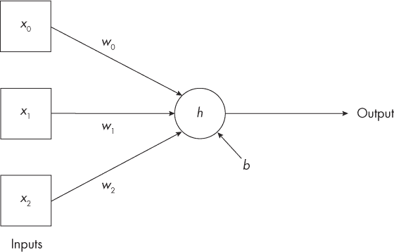
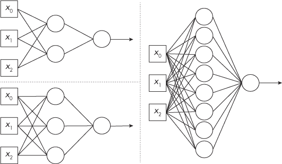
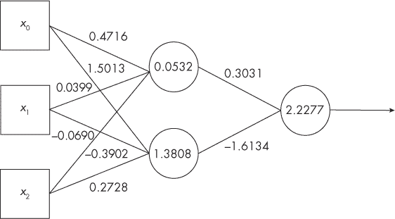
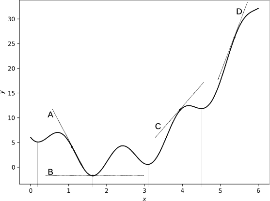
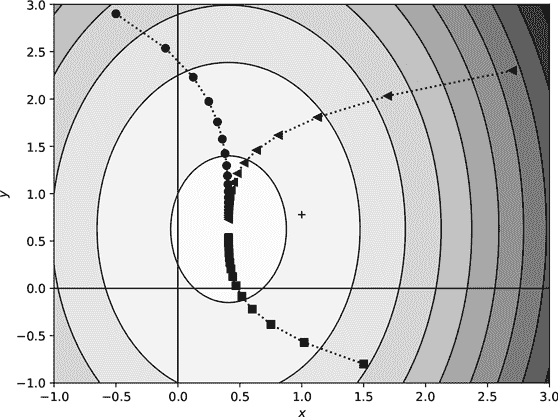

## 第五章：神经网络：类脑 AI**

联结主义试图提供一个智能可能从中涌现的基质。今天，联结主义意味着神经网络，其中“神经”一词指的是生物神经元。尽管如此，它们之间的关系却只是表面上的。生物神经元和人工神经元可能具有类似的结构，但它们的运作方式完全不同。

生物神经元通过树突接受输入，当足够多的输入被激活时，它们会“放电”，在轴突上产生短暂的电压脉冲。换句话说，生物神经元处于关闭状态，直到它们被激活。经过约 8 亿年的动物进化，这一过程变得复杂得多，但这就是其本质。

神经网络的人工神经元也具有输入和输出，但与生物神经元不同，神经元是具有连续行为的数学函数，而不是通过放电来工作。有些模型像生物神经元一样会发生放电，但我们在本书中忽略了它们。推动 AI 革新的神经网络是连续运作的。

可以将生物神经元想象成一个电灯开关。它处于关闭状态，直到有足够的理由（输入）将其打开。生物神经元不是打开了就一直开着，而是像切换开关一样，开与关交替。人工神经元类似于带调光器的灯泡。稍微调节开关，就会产生微弱的光；进一步调节，光的亮度会按比例变化。这个类比并不在所有情况下都准确，但它传达了人工神经元不是“全开”或“全关”的基本概念。相反，它们根据某种函数，按比例输出与输入相对应的结果。随着我们继续学习这一章，迷雾将会逐渐消散，所以即使目前这部分内容有些难以理解，也不用担心。

****

图 4-1 是本书中最关键的图，也是最简单的图之一，正如如果联结主义方法是正确的那样应该预期的。如果我们理解图 4-1 所代表的内容以及它是如何运作的，我们就掌握了理解现代 AI 所必需的核心知识。

*图 4-1：简朴的（人工）神经元*

图 4-1 包含三个方框、一个圆圈、五个箭头，以及像“*x*[0]”和“输出”这样的标签。我们将依次检查每个元素，从左侧的方框开始。

标准做法是将神经网络的输入放在左侧，数据流向右侧。在图 4-1 中，三个标记为 *x*[0]、*x*[1] 和 *x*[2] 的方框是神经元的输入。它们是特征向量的三个特征，我们希望神经元处理这些输入，从而给出一个输出，最终得到一个类别标签。

圆圈被标记为*h*，这是*激活函数*的标准符号。激活函数的任务是接收神经元的输入并生成输出值，输出箭头指向右侧，见图 4-1。

三个输入方框通过箭头连接到圆圈（*节点*），每个输入方框都有一条箭头。箭头的标签——*w*[0]、*w*[1]和*w*[2]——表示*权重*。每个输入都对应一个权重。与圆圈通过箭头连接的单独*b*是*偏置*。它是一个数字，和权重、输入*x*及输出一样。对于这个神经元，三个数字进入，一个数字输出。

神经元是这样运作的：

1.  将每个输入值*x*[0]、*x*[1]和*x*[2]与其相应的权重*w*[0]、*w*[1]和*w*[2]相乘。

1.  将步骤 1 中的所有乘积与偏置值*b*相加，得到一个单一的数字。

1.  将该单一数字传递给*h*，即激活函数，生成输出，也是一个单一数字。

这就是神经元的全部功能：它将输入与权重相乘，求和，添加偏置值，然后将总和传递给激活函数，以生成输出。

现代人工智能几乎所有的伟大成就都归功于这个原始构造。将足够多的这些基本构件按照正确的配置连接在一起，就可以构建一个可以学会识别狗品种、驾驶汽车或将法语翻译成英语的模型。嗯，前提是你有魔法般的权重和偏置值，这些值是通过训练得到的。这些值对于神经网络如此重要，以至于有一家公司将“权重与偏置”作为其名称；见[*https://www.wandb.ai*](https://www.wandb.ai)。

我们可以选择激活函数，但在现代网络中，最常用的是第二章中提到的整流线性单元（ReLU）。ReLU 的问题是：输入（即输入的加权和加上偏置）是否小于零？如果是，输出为零；否则，输出就是输入值。

像单个神经元这样的简单构件能有用吗？它能。作为实验，我使用第 4-1 图中的神经元，利用来自第一章的鸢尾花数据集的三个特征作为输入进行训练。回想一下，这个数据集包含了三种不同鸢尾花的各部分测量值。训练后，我使用一个未用过的测试集对神经元进行了测试，该测试集包含 30 个特征向量。神经元正确分类了 28 个样本，准确率为 93%。

我通过寻找一组三个权重和一个偏置值来训练神经元，使得输出经过四舍五入到最接近的整数后，匹配鸢尾花的类别标签——0、1 或 2。这不是训练神经网络的标准方法，但对于像单个神经元这样的简单情况是有效的。我们将在本章后面讨论标准的网络训练方法。

单个神经元可以学习，但复杂的输入会让它感到困惑。复杂的输入意味着我们需要一个更复杂的模型。让我们给我们的单个神经元一些朋友。

传统上，神经元按层排列，前一层的输出作为后一层的输入。考虑图 4-2，它展示了输入之后层中分别有两个、三个和八个节点的网络。将网络按层排列简化了代码实现，并有助于标准的训练过程。不过，如果能找到替代方法来训练模型，也没有强制要求必须使用层。

*图 4-2：两节点、三节点和八节点网络*

让我们从左上角的两个节点网络开始。三个输入（方框）在那里，但这次中间层有两个圆圈，右边有一个单一的圆圈。输入完全连接到中间层的两个节点，这意味着每个输入方框都与每个中间层节点之间有一条连接线。中间层的输出连接到最右边的单一节点，网络的输出来自这个节点。

神经网络中位于左侧输入和右侧输出之间的中间层被称为*隐藏层*。例如，图 4-2 中的网络分别有一个隐藏层，包含 2 个、3 个和 8 个节点。

具有这种配置的网络适用于二元分类任务，即类别 0 与类别 1，其中输出是一个单一的数字，表示模型认为输入属于类别 1 的概率。因此，最右侧的节点使用一种不同的激活函数，称为*sigmoid*（也叫做逻辑斯蒂函数）。Sigmoid 函数的输出范围在 0 到 1 之间。这也是表示概率的范围，因此许多人将带有 Sigmoid 激活函数的节点输出称为概率。虽然这通常并不准确，但我们可以接受这种不严谨。隐藏层的节点全部使用 ReLU 激活函数。

要实现图 4-2 中的两个节点网络，我们必须学习多少权重和偏置？我们需要为每条线（输出箭头除外）设置一个权重，并为每个节点设置一个偏置值。因此，我们需要八个权重和三个偏置值。对于左下角的模型，我们需要 12 个权重和 4 个偏置。最后，对于 8 节点模型，我们需要学习 32 个权重和 9 个偏置值。随着层中节点数量的增加，权重的数量增长得更快。仅这一事实就限制了神经网络的发展多年，因为潜在有用的模型对于单台计算机的内存来说过于庞大。当然，模型的大小是相对的。OpenAI 的 GPT-3 有超过 1750 亿个权重，尽管他们没有透露 GPT-4 的具体大小，但传闻称它有 1.7 *万亿*个权重。

我们需要一个二分类数据集来探索图 4-2 中的模型。我们将使用的数据集是一个经典的数据集，旨在区分意大利某一特定地区用于酿酒的两种葡萄品种。不幸的是，似乎这个数据集所代表的葡萄酒现在已经不再知名了。（数据集的历史就是这么久。）不过，我们知道模型不关心标签——它们使用的是数字——所以我们将使用 0 和 1 作为标签。

我们需要三个特征，*x*[0]，*x*[1]，和 *x*[2]。我们将使用的特征是酒精含量（百分比）、苹果酸和总酚类物质。目标是训练图 4-2 中的模型，看看在给定这三种特征的测量值时，每个模型在识别未知葡萄酒时表现如何。

我使用包含 104 个样本的训练集和 26 个样本的测试集训练了双神经元模型。这意味着我使用了 104 个测量的酒精含量、苹果酸水平和总酚类物质的三元组，并且知道正确的输出标签，类别 0 或类别 1。训练集使双神经元模型为所有八个权重和三个偏差赋值。我保证我们会讨论训练是如何工作的，但现在请假设它已经发生，这样我们就可以探索神经网络的行为。经过训练的模型在测试集上的准确率为 81%，意味着它的判断正确率超过了 10 次中的 8 次。对于如此小的模型和训练集来说，这还算不错。

图 4-3 展示了训练后的双神经元模型。我在连接处添加了权重，在节点上添加了偏差，这样你就可以看到它们。我认为至少要看一次这些数字，最好是用一个简单的模型来做。

*图 4-3：基于葡萄酒数据集训练的双神经元模型*

让我们用两个测试样本来理解这个过程。这两个测试样本各由三个数字组成，分别是特征值（*x*[0]，*x*[1]，*x*[2]）：

| **样本 1** | (–0.7359, 0.9795, –0.1333) |
| --- | --- |
| **样本 2** | ( 0.0967, –1.2138, –1.0500) |

你可能会有一个问题。我说特征是酒精含量（百分比）、苹果酸水平和总酚类物质。虽然我不知道苹果酸或总酚类物质的测量单位是什么，但百分比就是百分比，那么为什么第一个样本的 *x*[0] 是一个小的负数呢？我们不可能有负的酒精百分比。

答案与*预处理*有关。原始数据，比如酒精含量，通常不会直接用于机器学习模型。相反，每个特征都会通过减去训练集中特征的平均值，并将结果除以数据围绕平均值的分散程度（标准差）来进行调整。原始的酒精含量是 12.29%，这是一个合理的葡萄酒酒精含量值，但经过缩放后，它变成了 –0.7359。

让我们使用图 4-3 中学习到的权重和偏置对样本 1 进行分类。顶部神经元的输入是每个特征与连接该特征与神经元的权重相乘，然后与偏置值求和。第一个特征给我们 0.4716 × –0.7359，第二个给我们 0.0399 × 0.9795，第三个给我们–0.3902 × –0.1333，加上偏置值 0.0532。将这些加在一起得到–0.2028。这是传递给激活函数 ReLU 的数值。由于它是负数，ReLU 返回 0，这意味着顶部节点的输出是 0。对底部节点进行相同的计算得到 0.1720 作为传递给 ReLU 的输入。由于这是一个正数，ReLU 返回 0.1720 作为输出。

中间层两个节点的输出现在作为输入传递给右侧的最终节点。和之前一样，我们将输出与权重相乘，进行求和，并加上偏置值，然后传递给激活函数。在这个例子中，激活函数不是 ReLU，而是 Sigmoid。

顶部节点的输出是 0，底部节点的输出是 0.1720。将这些与各自的权重相乘，求和，再加上偏置值 2.2277，得到 1.9502 作为传递给 Sigmoid 激活函数的输入，产生 0.8755 作为网络对第一个输入样本的输出。

我们应该如何解释这个输出呢？在这里，我们学到神经网络的一个重要方面：

神经网络不会告诉我们输入的实际类别标签，而只是告诉我们一个标签相对于另一个标签的置信度。

二分类模型输出一个置信值，我们将其解释为输入属于类别 1 的概率。概率是介于 0（没有机会）和 1（完全确定）之间的数字。人类通常对百分比更为熟悉，我们可以通过将概率乘以 100 来得到百分比。因此，我们可以说网络对该输入属于类别 1 的信心大约为 87%。

实际上，我们使用一个阈值——一个截止值——来决定分配哪个标签。对于二分类模型，最常见的做法是使用 50%的阈值。如果输出超过 50%（概率为 0.5），我们将输入分配给类别 1。这个输出超过了 50%，所以我们将“类别 1”作为标签分配给它。这个样本来自类别 1，意味着网络分配的标签是正确的。

我们可以对第二个输入样本（0.0967, –1.2138, –1.0500）重复这些计算。我将把详细的计算过程留给你作为练习，但是网络对样本 2 的输出是 0.4883。换句话说，网络对这个样本属于类别 1 的信心是 49%。截止值是 50%，所以我们拒绝类别 1 标签，并将此输入分配给类别 0。实际的类别是类别 1，因此在这个实例中，网络是错误的——它将一个类别 1 的样本分配给了类别 0。哎呀。

这是一个有用的模型吗？答案取决于具体情境。我们正在按葡萄品种对葡萄酒进行分类。如果模型的输出每五次中有一次错误，误差率为 20%，这能接受吗？我怀疑不能，但也可能有些任务对于这种精度水平的模型是可以接受的。

神经网络提供了某种程度的控制，来决定如何解释它们的输出。例如，我们可能不会使用 50% 作为判断的分界线。如果我们把这个值设得更低，比如 40%，那么我们会捕获更多的类别 1 样本，但也会因此错误地将更多的实际类别 0 样本识别为类别 1。换句话说，我们可以在不同类型的错误之间进行权衡。

让我们把图 4-2 中的其他模型也考虑进来。我使用与图 4-3 相同的训练集和测试集训练了这三个模型。每个模型的训练过程重复了 240 次。以下是每个模型的平均精度：

| **2 节点** | 81.5 百分比 |
| --- | --- |
| **3 节点** | 83.6 百分比 |
| **8 节点** | 86.2 百分比 |

隐藏层中的节点数增加时，模型的性能有所提升。这是直观合理的，因为一个更复杂的模型（更多的节点）意味着能够学习到训练集中更复杂的关联。

我怀疑你现在有了一个新问题：为什么我每个模型都训练了 240 次，并报告了这 240 个模型的平均精度？这是理解神经网络时的另一个关键点：

神经网络是随机初始化的，因此即使使用相同的训练数据，重复训练也会导致表现不同的模型。

“随机初始化”这一说法需要澄清。再看一下图 4-3。表示权重和偏置的数字来自一个迭代过程。这意味着一组初始的权重和偏置会被反复更新，每次都将网络推向更接近输入特征向量与输出标签之间的函数的近似值。准确地近似这个函数是我们希望网络完成的任务。

为什么不将所有权重初始化为相同的值呢？答案是，这样做会迫使权重学习数据的相似特征，这正是我们不希望发生的，最终模型的表现会很差。如果我们将所有初始权重都设置为零，模型根本无法学习。

迭代过程需要一组初始值才能正常工作。我们应该如何选择初始值呢？这是一个重要的问题，对于我们当前的理解水平，答案是“随机”，意思是我们在某种程度上是通过掷骰子来为每个权重和偏置选择初始值。然后，迭代过程会不断优化这些值，最终得到如图 4-3 所示的最终结果。

然而，这个迭代过程并不总是以相同的结果结束。选择不同的初始随机权重和偏置集，网络将收敛到不同的一组最终值。例如，前面提到的图 4-3 中的网络达到了 81%的准确率。以下是同一网络在相同数据上训练和测试后获得的另外 10 个准确率：

89, 85, 73, 81, 81, 81, 81, 85, 85, 85

这些准确率从最高的 89%到最低的 73%不等。每次训练会话之间唯一变化的只是初始权重和偏置的集合。这是神经网络中一个经常被忽视的问题。如果可能的话，网络应该进行多次训练，以收集关于其有效性的数据，或者如同在 73%版本的网络中那样，理解纯粹由于偶然使用了一个糟糕的初始值集。我还应该提到，这个网络准确率的广泛变化与其相对较小，并且只包含少数权重和偏置有关。较大的模型在反复训练时往往更为一致。

我们已经覆盖了很多内容，所以需要做一个总结：

+   神经网络的基本单元是神经元，也叫节点。

+   神经元将输入与权重相乘，将这些乘积求和，添加一个偏置值，然后将所有这些传递给激活函数以产生输出值。

+   神经网络是由单个神经元组成的集合，通常按层排列，当前层的输出是下一层的输入。

+   训练神经网络是通过迭代调整初始的、随机选择的一组权重和偏置值来赋予权重和偏置值。

+   二值神经网络产生的输出大致对应于输入属于类别 1 的概率。

****

现在我们知道了什么是神经网络以及它是如何使用的，我们终于来到了问题的核心：这些神奇的权重和偏置到底是从哪里来的？在第二章中，我简要提到，神经网络在 1980 年代得到了提升，这要归功于两个关键的算法：反向传播和梯度下降。这些算法是神经网络训练的核心。

我们在第三章中讨论了优化，指的是根据某些标准寻找最佳解的过程，具体是在支持向量机的背景下。训练神经网络也是一个优化过程，涉及学习最佳拟合训练数据的权重和偏置。然而，必须小心，确保学习到的权重和偏置更可能符合训练数据中的一般趋势，而不是特定训练数据本身的细节。随着我们对训练过程了解得更多，这一点将变得更加明显。

一般的训练算法是：

1.  选择模型的架构，包括隐藏层的数量、每层的节点数以及激活函数。

1.  随机但智能地初始化与所选架构相关的所有权重和偏置。

1.  将训练数据或其子集通过模型，并计算平均误差。这就是*前向传播*。

1.  使用反向传播来确定每个权重和偏置对误差的贡献。

1.  根据梯度下降算法更新权重和偏置。这一步和前一步构成了*反向传播*。

1.  从第 3 步开始重复，直到网络被认为是“足够好”。

这六个步骤包含了许多重要的术语。我们花时间理解每个术语的含义是值得的。在本章中，*架构*指的是网络使用的层数，通常是隐藏层。我们有输入特征向量，可以想象每个隐藏层共同工作，接收输入向量并生成输出向量，随后该输出成为下一个层的输入，依此类推。对于二分类器，网络的输出是一个节点，输出值在 0 到 1 之间。稍后在本书中，我们将学习到这个概念可以扩展到多类别输出。

算法表明，训练是一个重复多次的迭代过程。迭代过程有一个起点。如果你想从 A 点走到 B 点，就得一步一步走。这就是迭代的部分。A 点是起点。对于神经网络，架构意味着一组权重和偏置。这些权重和偏置的初始值类似于 A 点，训练过程就像是一步步往前走。

算法使用了“平均误差”这个术语。什么是误差？这里引入了一个新概念。直观地看，我们可以理解，仅仅为权重和偏置选择一些初始值，不太可能让网络准确地对训练数据进行分类。记住，我们知道训练数据的输入和预期输出。

假设我们将训练样本 1 通过网络，得到一个输出值，可能是 0.44。如果我们知道样本 1 属于类别 1，那么网络的误差就是预期输出和实际输出之间的差值。在这里，就是 1 – 0.44，等于 0.56。一个好的模型可能会为这个样本输出 0.97，产生的误差仅为 0.03。误差越小，模型在分类该样本时越好。如果我们将所有训练数据或其代表性子集通过网络，我们可以计算每个训练样本的误差，并求出整个训练集的平均误差。这就是反向传播和梯度下降算法用来更新权重和偏置的标准。

最后，训练算法会要求将数据输入到网络中，得到误差，更新权重和偏差，然后重复这个过程，直到网络表现得“足够好”。从某种意义上说，“足够好”就是当误差，也就是*损失*，尽可能接近零时。如果网络对所有类别 0 的样本输出 0，对所有类别 1 的样本输出 1，那么它在训练数据上的表现是完美的，误差为零。这当然是“足够好”的，但我们必须小心。有时，当这种情况发生时，网络会*过拟合*，意味着它学习了训练数据中的所有细节，但没有学习到能够让它在面对未知输入时仍能良好表现的数据的普遍趋势。

实际上，过拟合问题有多种解决方法，其中最有效的一种是获取更多的训练数据。我们使用训练数据来代表所有可能由我们试图建模的过程生成的数据。因此，更多的训练数据意味着对这些数据集合的更好表示。这正是我们在第一章中讨论的插值与外推的问题。

然而，获取更多的训练数据可能并不可行。替代方法包括调整训练算法，引入一些技术，防止网络在学习过程中专注于训练数据中无关的细节。你可能听说过的一种技术是*权重衰减*，它会惩罚网络，如果它使权重值过大。

另一种常见的方法是*数据增强*。训练数据不够？别担心，数据增强会通过稍微修改你已有的数据来“发明”一些新的数据。数据增强会将现有的训练数据进行变换，产生新的数据，这些新数据可能是由与实际训练数据相同的过程所生成的。例如，如果训练样本是一张狗的图片，那么如果你对其进行旋转、上移几个像素、左右翻转等操作，它依然会是一张狗的图片。每次变换都会生成一个新的训练样本。这看起来可能像是作弊，但实际上，数据增强是一种强大的*正则化方法*，可以防止网络在训练过程中发生过拟合。

让我们暂时回到初始化问题，因为它的重要性在多年来并未得到充分重视。

最初，权重初始化仅仅意味着“选择一个小的随机数”，比如 0.001 或-0.0056\。这种方法大多数情况下都有效。但它并不总是有效，而且当它有效时，网络的表现也不一定出色。

深度学习出现不久后，研究人员重新审视了“随机小值”的思路，寻求一种更有原则的初始化方法。这些努力的成果就是神经网络至今使用的初始化方法。需要考虑三个因素：激活函数的形式、来自下层的连接数量（*fan-in*）以及到上层的输出数量（*fan-out*）。为了选定每层的初始权重，研究人员设计了公式，结合这三个因素进行选择。偏置值通常初始化为零。证明起来并不困难，使用这种初始化方法的网络性能优于传统方式初始化的网络。

我们还有两个训练算法的步骤没有讨论：反向传播和梯度下降。反向传播通常先介绍，因为它的输出是梯度下降所必需的。然而，我认为理解梯度下降在做什么更为直观，然后通过反向传播提供的内容来填补缺失的部分。尽管这些名称可能不太熟悉，但我相信你已经理解了这两种算法的本质。

****

你站在一个广阔的、起伏的草原上。你是怎么到这里的？你绞尽脑汁，但没有答案。然后，终于，你发现北方远处山谷里有一个小村庄，也许那里的居民能给你一些答案。但前往那里最好的方法是什么呢？

一般来说，你想要向北和向下移动，但也必须尊重地形的轮廓。你总是想从高处移动到低处。你不能直接往北走，因为一座大山阻碍了你的路。你可以朝东北走；那里的地势更平坦，但走那条路会让你的旅程变得漫长，因为地面下坡很缓慢。所以，你决定朝西北走，因为这条路既能让你向北又能更陡地向下。你向西北迈出一步，然后停下来重新评估自己的位置，决定下一步该往哪个方向走。

重复这个两阶段的过程：先检查你当前的位置，以确定最佳的方向，既能向北又能向下移动，然后朝这个方向迈步，这是你到达山谷中村庄的最佳选择。你可能不会成功；你可能会被困在一个小峡谷里，无法攀爬出来。但总体而言，通过持续朝着一个相对你当前位置既向北又向下的方向移动，你会向目标取得进展。

遵循这个过程，称为*梯度下降*，使我们能够调整神经网络的初始权重和偏置，从而获得表现越来越优秀的模型。换句话说，梯度下降训练了模型。

围绕村庄的三维草原世界对应着网络的*n*维世界，其中*n*是我们试图学习的所有权重和偏置的总数。从当前位置选择一个方向并沿该方向移动一定距离，就是一个梯度下降步骤。重复的梯度下降步骤会使你越来越接近村庄。

梯度下降寻求最小值的位置，即山谷中的村庄——但最小的是哪个值呢？对于神经网络而言，梯度下降的目标是调整网络的权重和偏置，以最小化训练集上的误差。

起伏的广袤草原代表了误差函数，即在使用当前权重和偏置值时，训练数据上的平均误差。这意味着草原中的每个位置都对应一组完整的网络权重和偏置。村庄的位置对应网络在训练集上能够达到的最小误差。我们的期望是，一个在训练集上有小误差的模型在实际应用中对未知输入的误差也会很少。梯度下降是一个通过权重和偏置的空间移动，以最小化误差的算法。

梯度下降是一种优化算法，再次告诉我们训练神经网络是一个优化问题，一个我们需要找到最佳一组参数的问题。虽然这是真的，但训练神经网络与其他优化问题也有细微的不同。如前所述，我们不一定要在训练数据上得到最小的误差，而是要得到一个能够最好地泛化到未知输入的模型。我们希望避免过拟合。我将在本章稍后通过图示演示这意味着什么。

梯度下降在误差函数的地形中移动。在日常使用中，梯度指的是某种事物的变化，比如道路的坡度或颜色渐变平滑地从一种色调变到另一种色调。从数学上讲，梯度是曲线在某一点的斜率的多维类比。最陡的移动方向是沿着最大梯度下降。曲线在某一点的斜率是梯度的一个有用表示，因此思考斜率是值得我们花时间的。

图 4-4 展示了一条曲线，四条线在不同的点触及曲线。这些线代表了这些点的斜率。斜率表示函数值在该点附近变化的速度。线越陡，沿着*x*轴移动时，函数值变化得越快。

*图 4-4：标出不同点斜率的曲线*

线 B 标记了曲线的最低点。这就是*全局最小值*，也是优化算法试图找到的点。注意，接触该点的线完全水平。从数学角度来看，这意味着线 B 的坡度为零。这在函数的最小值（和最大值）处成立。

线 B 接触的点是全局最小值，但图中还有三个其他最小值。这些是*局部最小值*，即接触这些点的线的坡度也为零。理想情况下，优化算法应避免这些点，优先选择全局最小值。

线 A 的坡度较陡，指向全局最小值。因此，如果我们在曲线上位于线 A 接触的点，我们可以通过朝着指示方向迈步，迅速朝着全局最小值移动。此外，由于此处坡度较陡，我们可以迈出相对较大的步伐，迅速下降到谷底。

线 C 的坡度也很陡，但它指向其中一个局部最小值，即* x *轴上 3 右侧的最小值。一个只知道沿着梯度下降的梯度下降算法将定位到该局部最小值并被困在那里。同样，线 D 也指向* x *轴上 4 与 5 之间的局部最小值。

从图 4-4 中可以得出什么结论？首先，梯度下降是沿着某一点的梯度或坡度向下移动的。这里曲线是一维的，因此该点是* x *的一个特定值。梯度下降利用该点的坡度值来选择一个方向，并根据坡度的陡峭程度确定步长。坡度陡峭意味着我们可以迈出较大的步伐，最终到达更接近最小值的新* x *值。坡度较浅则意味着步伐较小。

例如，假设我们最初位于线 A 与曲线接触的点。此时的坡度较陡，因此我们朝着全局最小值迈出大步。迈出这一步后，我们再次查看坡度，不过这次是新点上* x *轴的坡度。利用这个坡度，我们再迈出一步，然后是下一步，直到我们到达坡度基本为零的点。那就是最小值，所以我们停下。

一维情况比较简单，因为每个点只有一个坡度，因此只有一个方向可以前进。然而，回想起广袤的草原，我们知道从任何一点出发，我们都可以朝着无数方向前进，其中许多方向都很有用，因为它们能带我们向北和向下移动。所有这些方向中，最大梯度的方向是最陡的，能够最快地带我们走向期望的目标，这也是我们迈出的方向。通过重复这个过程，每次使用最大梯度方向，我们就能在多维空间中实现一维空间中的目标。准确来说，我们应该朝着与最大梯度方向*相反*的方向迈步，因为最大梯度指向远离最小值的方向，而不是指向它。

图 4-5 展示了二维中的梯度下降法。图中显示了一个等高线图。可以想象一个露天矿井的阶梯式层次：颜色越浅，表示矿井越深，但坡度也越平缓。也就是说，颜色越浅表示坡度越浅。

*图 4-5：二维中的梯度下降法*

图中显示了梯度下降法从三个起始位置出发的路径：圆形、三角形和正方形。最初，坡度较陡，因此步长较大，但随着逼近最小值，坡度变浅，意味着步长变小。最终，梯度下降法不论起点如何，都会到达最小值。

我们在一维和二维中讨论了梯度下降法，因为我们可以直观地看到这个过程。现在我们明白了，我们一直都知道这个算法，并且在自己从高处走到低处时也在使用它。说实话，这就是训练神经网络的全部内容。初始的权重和偏置集不过是*n*维空间中的一个起始点。梯度下降法利用从该起始位置出发的最大梯度，向最小值迈进。在*n*维空间中的每一个新位置，都是根据梯度的陡峭程度，从上一组权重和偏置中生成的一组新的权重和偏置。当梯度非常小时，我们宣告胜利并固定权重和偏置，认为网络已经训练完成。

梯度下降法依赖于坡度，即梯度的值。那么，梯度从哪里来呢？梯度下降法是通过最小化损失函数，或者说最小化网络所犯的错误，来实现的。训练集上的误差是每个网络中权重和偏置值的函数。梯度表示每个权重和偏置对整体误差的贡献程度。

举个例子，假设我们知道权重 3（无论是什么权重）的值对网络错误的贡献有多大，这个错误是通过网络在训练集上所犯的错误来衡量的。这样，我们就知道如果改变权重 3 的值，而保持其他权重和偏置不变，梯度的陡峭程度应该是多少。这个陡峭程度，乘以步长，给我们一个值，从权重 3 当前的值中减去。通过减去这个值，我们就朝着与最大梯度方向相反的方向移动。对网络中每个权重和偏置重复这个计算，就完成了在*n*维空间中的一次步伐。这就是梯度下降法在训练过程中所做的。

*反向传播*是给我们每个权重和偏置提供陡度值的算法。反向传播是微积分中一个著名规则的应用，微积分是数学的一个分支，告诉我们一个事物如何随着另一个事物的变化而变化。速度就是一个例子。速度表示距离随着时间的变化。我们谈论速度时，也是这样表达的：每小时多少英里或多少公里。反向传播给我们提供了“速度”，表示网络的误差如何随着任何权重或偏置值的变化而变化。梯度下降使用这些“速度”，乘以一个称为*学习率*的比例因子，步进到由网络的*n*个权重和偏置所代表的*n*维空间中的下一个位置。

例如，图 4-2 中的“巨大”网络有 32 个权重和 9 个偏置；因此，使用梯度下降训练该网络意味着在一个 41 维的空间中移动，以找到 41 个权重和偏置值，从而在训练集上得到最小的平均误差。

这个算法被称为“反向传播”，因为它计算每个权重和偏置的“速度”值，首先从网络的输出层开始，然后逐层向后移动，直到输入层。也就是说，它通过网络反向传播误差，从一层传播到前一层。

结论是这样的：

梯度下降使用反向传播提供的梯度方向，迭代地更新权重和偏置，以最小化网络在训练集上的误差。

这就是神经网络训练的核心原理。

****

使用反向传播和梯度下降训练神经网络的能力有点像偶然的运气。理论上它不应该有效。带有反向传播的梯度下降是一种*一阶*优化方法。一阶优化适用于简单的函数，而神经网络的误差曲面可远非简单。然而，幸运之神眷顾了我们，它确实有效，而且效果相当不错。到目前为止，还没有严格的数学解释，除了认识到误差函数的局部极小值几乎是相同的，这意味着如果你落入其中并无法逃脱，通常也没关系。

还有另一种经验性的解释，但要理解这一点，我们必须更多地了解训练过程。我在本章前面给出的六步训练算法讲述了如何将训练集或其子集输入到网络中，并反复执行，直到达到“足够好”的效果。让我来扩展一下这些步骤所暗示的过程。

每次将训练数据通过网络传递时，首先进行前向传递，然后进行反向传递，最终会得到一个梯度下降步骤，如图 4-5 所示。如果训练集较小，则会在前向传递中使用所有数据，这意味着所有数据都会被梯度下降用来决定下一步的方向。对训练数据的完整传递称为*epoch*；因此，在前向传递和反向传递中使用所有训练数据会导致每个 epoch 执行一个梯度下降步骤。

现代机器学习数据集通常非常庞大，这使得在每次梯度下降步骤中使用所有训练数据变得在计算上不可行。相反，会有一个小的、随机选择的数据子集，称为*小批量*，通过网络进行前向和反向传递。使用小批量显著减少了梯度下降中的计算开销，从而在每个 epoch 中执行多个步骤。小批量还提供了另一个好处，帮助克服“这种训练方法不该有效”的问题。

假设我们有一个数学函数，表示网络的误差。在这种情况下，我们可以使用几个世纪前的微积分技术来找到每个权重和偏差对误差的确切贡献；梯度下降将知道每次应该朝哪个方向前进。不幸的是，世界并非如此。我们不知道误差函数的数学形式（很可能也没有一个可以知道的形式），因此我们必须使用训练数据进行近似。当使用更多训练数据来确定误差时，这种近似会得到改善。这一事实支持了在每次梯度下降步骤中使用所有训练数据。然而，我们已经知道，在许多情况下，这在计算上是极其繁重的。

妥协的做法是，在每次梯度下降步骤中使用小批量。这样，计算量不再太大，但由于我们使用较少的数据点来估算梯度，实际梯度的近似会变差。随机选择某些东西通常与“随机”一词相关联，因此，使用小批量进行训练被称为*随机梯度下降*。随机梯度下降，某种形式或另一种形式，是几乎所有现代 AI 使用的标准训练方法。

一开始，随机梯度下降听起来像是一个失败的方案。当然，我们可以在宇宙的热寂之前计算出很多梯度下降步骤，但我们的梯度精度较低，而且我们可能正在沿着错误的方向穿越误差空间。这肯定不行，对吧？

就在此时，幸运女神再次眷顾了人类。她不仅赋予了我们通过一阶梯度下降训练复杂模型的能力，因为局部最小值（假设）大致是等价的；她还安排了事情，使得随机梯度下降找到的“错误”梯度方向往往正是我们需要的，可以帮助我们避免在训练初期进入局部最小值。换句话说，当我们应该朝正北走时，稍微朝东北走是一种暗藏的祝福，能够让我们训练大型神经网络。

****

我们准备进入下一章。然而，在此之前，让我们将传统神经网络应用于恐龙足迹数据集。我们将把结果与第三章的经典模型进行比较。

我们首先需要选择一个架构：即隐藏层的数量、每层的节点数以及每个节点的激活函数类型。恐龙足迹数据集有两个类别：鸟臀目（类别 0）和兽脚亚目（类别 1）。因此，输出节点应使用 sigmoid 激活函数，以给出类别 1 的可能性。网络的输出值估算输入图像属于兽脚亚目的概率。如果概率超过 50％，我们将把输入分配到类别 1；否则，将其归类为类别 0。我们将继续使用修正线性单元（ReLU）激活函数来处理隐藏层节点，就像本章中的所有模型一样。剩下的就是选择隐藏层的数量和每层节点的数量。

恐龙足迹数据集中有 1,336 个训练样本。这并不多，并且我们没有对数据集进行增强，所以我们需要一个较小的模型。大模型意味着很多节点和层，需要大量的训练集；否则，学习的权重和偏置相对于训练样本数量来说就会过多。因此，我们将限制自己最多尝试两层隐藏层的模型。至于隐藏层中的节点数，我们将让第一隐藏层的节点数从非常小到接近输入大小的两倍（1,600 个特征，即 40×40 像素图像展开后）。如果我们尝试第二隐藏层，我们将限制第二层的节点数不超过第一层节点数的一半。

首先，我们将训练一组一层和两层的架构。然后，我们将训练表现最好的模型 100 次，以获得平均性能水平。表 4-1 展示了试验模型的结果。

**表 4-1：** 恐龙足迹数据集的试验架构

| **准确度（%）** | **架构** | **权重和偏置** |
| --- | --- | --- |
| 59.4 | 10 | 16,021 |
| 77.0 | 400 | 640,801 |
| 76.7 | 800 | 1,281,601 |
| **81.2** | **2,400** | **3,844,801** |
| 75.8 | 100, 50 | 165,201 |
| **81.2** | **800, 100** | **1,361,001** |
| 77.9 | 2,400, 800 | 5,764,001 |

只有 10 个节点的网络表现最差，准确率约为 60%。一个仅仅抛硬币的二分类器，正确率大约是 50%，所以 10 节点网络的表现只比随机稍好一些。我们不想要这个模型。其他大部分网络的准确率都在中高 70%的区间。

这两种**粗体**模型的准确率均略超过 81%。第一种模型使用了一个包含 2,400 个节点的单隐层。第二种模型使用了一个包含 800 个节点的隐层，接着是一个包含 100 个节点的隐层。两种模型在测试集上得到了相同的准确率，但 2,400 节点模型的权重和偏置几乎是两层模型的三倍，所以我们选择使用两层模型。（请记住，表 4-1 中的结果仅代表一次训练会话，而不是多次训练的平均值。稍后我们会修正这一点。）

两层模型依然相对较大。我们试图学习 140 万个参数，以便将模型调整到可以正确分类恐龙足迹图像。这是一个需要学习的大量参数，尤其是在训练集只有 1,336 个样本的情况下。完全连接的神经网络在所需参数数量上增长非常快。我们将在第五章讨论卷积神经网络时重新回顾这一观察。

我们的架构是：两个隐层分别使用 800 个和 100 个节点的修正线性激活函数，然后是一个单节点，使用 sigmoid 函数输出类别 1 的概率。对足迹数据集进行 100 次训练后，模型的平均准确率为 77.4%，最低为 69.3%，最高为 81.5%。让我们将这一结果与第三章中的结果做一个对比；见表 4-2。

**表 4-2：** 恐龙足迹模型

| **模型** | **准确率（%）** |
| --- | --- |
| RF300 | 83.3 |
| RBF SVM | 82.4 |
| 7-NN | 80.0 |
| 3-NN | 77.6 |
| **MLP** | **77.4** |
| 1-NN | 76.1 |
| 线性 SVM | 70.7 |

请回忆一下，RF300 指的是一个包含 300 棵树的随机森林，SVM 指的是支持向量机，而 NN 则有点令人困惑，指的是最近邻分类器。我这里使用 MLP（多层感知机）作为神经网络的代替。*多层感知机*是传统神经网络的一个旧名称，至今仍然常见——注意这里的链接指回到罗森布拉特 1950 年代末期的原始感知机。

我们的神经网络在这个数据集上的表现并不是最好的。事实上，它是最差的之一。通过进一步调整，它的排名可能会有所提升，但根据我的经验，这种表现水平是典型的，也有助于深度学习革命前人们普遍认为神经网络是“平庸”的模型——平凡无奇，没什么值得大书特书的。

****

本章介绍了现代神经网络背后的基本思想。本书的其余部分将在本章覆盖的基本概念基础上展开。以下是主要要点：

+   神经网络是由多个节点（神经元）组成的集合，它们接受多个输入并输出一个数字。

+   神经网络通常按层排列，使得当前层的输入为上一层的输出。

+   神经网络是随机初始化的，因此重复训练会导致不同表现的模型。

+   神经网络通过梯度下降进行训练，使用反向传播提供的梯度方向迭代地更新权重和偏差。

现在，让我们继续研究卷积神经网络，这种架构引领了深度学习革命。本章带我们走进了 2000 年代初期，接下来我们将进入 2012 年及以后的发展。

**关键词**

激活函数、架构、反向传播、偏差、数据增强、周期（epoch）、前向传播、全局最小值、梯度下降、隐藏层、学习率、局部最小值、损失、迷你批次（minibatch）、多层感知机（multilayer perceptron）、神经元、节点、过拟合、预处理、修正线性单元（rectified linear unit）、正则化器、sigmoid、随机梯度下降、权重
