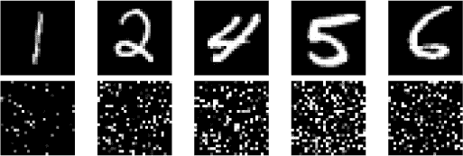
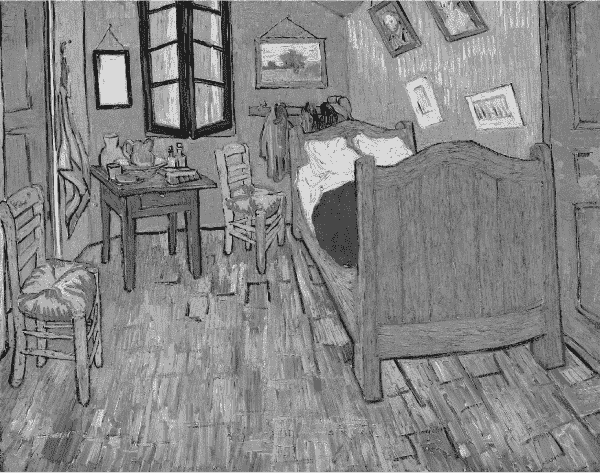
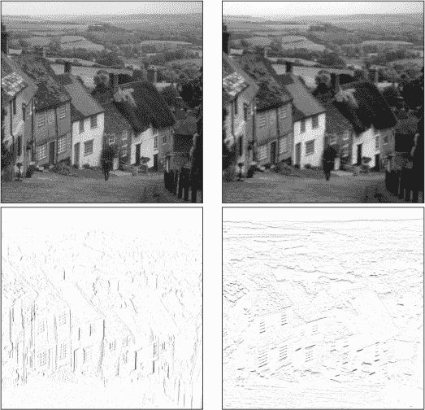
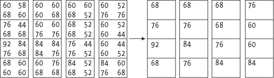
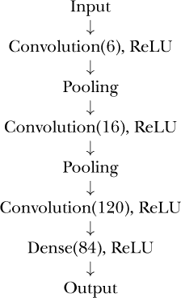
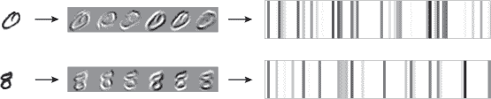
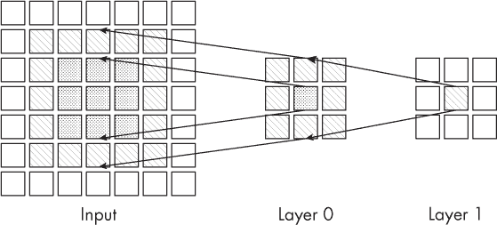
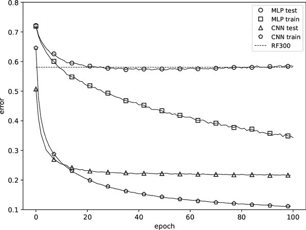
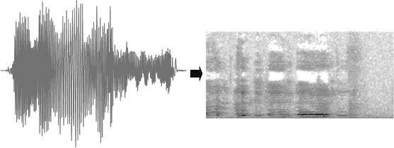

## 第六章：卷积神经网络：人工智能学会看见**

传统的机器学习模型在特征选择、特征向量维度以及无法从输入中固有的结构中学习方面存在困难。 *卷积神经网络（CNNs）* 通过学习生成输入的新的表示，并同时进行分类，从而克服了这些问题，这一过程被称为 *端到端学习* 。CNN 是我在第二章中提到的表示学习数据处理器。

形成 CNN 的元素在神经网络的发展历史中不同时期都有出现，从 Rosenblatt 的感知器开始，但引领深度学习革命的架构是在 1998 年发布的。为了充分释放 CNN 的力量，还需要十多年的计算能力的改进，直到 2012 年 AlexNet 的出现。

卷积网络利用输入中的结构。随着章节的推进，我们将更好地理解这意味着什么。在一维中，输入可能是随时间变化的值，也称为时间序列。在二维中，我们讨论的是图像。三维 CNN 存在，用于解释数据体积，比如一堆磁共振成像数据或由 LiDAR 点云构建的体积。在本章中，我们将专注于二维 CNN。

向传统神经网络呈现特征的顺序是无关紧要的。无论我们将特征向量以(*x*[0],*x*[1],*x*[2]) 还是 (*x*[2],*x*[0],*x*[1]) 的顺序呈现给模型，模型都会同样学习得很好，因为它假设特征是独立的，相互之间没有关系。事实上，像素值与相邻像素值之间的强相关性是传统机器学习模型不希望出现的，而它们无法在这种输入下取得成功，也使得神经网络在多年里未能取得突破。

卷积神经网络（CNN）则利用输入中的结构。对于 CNN 来说，输入是以(*x*[0],*x*[1],*x*[2]) 还是 (*x*[2],*x*[0],*x*[1]) 的顺序呈现是有区别的；模型可能在前者上表现良好，而在后者上表现差。这并不是弱点，而是优势，因为我们希望将 CNN 应用于那些需要学习结构的情况——这些结构有助于确定如何最佳地分类输入。

在本章后面，我们将比较传统神经网络与卷积神经网络（CNN）在分类小动物和车辆照片时的表现（见第三章的 CIFAR-10 数据集）。到那时，我们将了解利用结构的真正力量。然而，在此之前，让我们做一个小实验。我们有两个数据集，第一个是我们熟悉的 MNIST 数字数据集；第二个是相同的数字图像集合，但是这些图像中的像素顺序已经被打乱。打乱不是随机的，而是有规律的，使得例如位置（1,12）的像素被移动到了位置（26,13），其他所有像素也做了类似一致的移动。图 5-1 显示了 MNIST 数字和其打乱版本的一些示例。

*图 5-1：示例 MNIST 数字（上）和相同数字的打乱版本（下）*

这些打乱的数字我无法理解。原始数字和打乱数字之间的像素信息是相同的——也就是说，两个图像中的像素值集合是一样的——但是结构几乎完全丧失，我再也无法辨认出数字了。我认为传统的神经网络是整体处理输入的，它并不寻找结构。如果是这样，传统神经网络应该不在乎数字是否已经被打乱；它在使用原始数据集或打乱数据集进行训练时应该表现一样好。事实证明，正是如此。模型学习得同样好；打乱数据集对性能没有影响。但请注意，打乱的测试数字必须与打乱的模型一起使用；我们不能期望模型在一个数据集上训练并在另一个数据集上测试时仍能正常工作。

目前我们只知道一个关于 CNN 的事实：它们关注输入中的结构。知道这一点后，我们是否应该期待在打乱数据集上训练的 CNN 表现与在原始数据集上训练的 CNN 一样好呢？打乱的数字对我们来说是无法解读的，因为图像中的局部结构已经被破坏。因此，我们可能会预期一个同样想要利用局部结构的模型也无法解读这些打乱的数字。事实的确如此：一个在打乱数据集上训练的 CNN 相比于一个在原始数据集上训练的 CNN，表现较差。

为什么我们无法轻松地解读这些打乱的数字呢？我们必须探讨视觉过程中大脑发生了什么，才能回答这个问题。然后，我们将回到这个过程并将其与卷积神经网络（CNN）所做的工作联系起来。正如我们将要了解的，CNN 遵循着古老的谚语：入乡随俗（人类的做法）。

****

文森特·梵高是我最喜欢的艺术家。他的风格有某种神奇的吸引力，来自一个被精神疾病折磨的人的奇异平静。我相信，他作品中散发的平静反映了他试图平息内心的动荡。

请看图 5-2。它展示了梵高 1889 年在阿尔勒创作的著名《卧室》画作。图像是黑白的，这对梵高使用色彩来说是一种无法原谅的暴力，但印刷限制要求如此。

*图 5-2：梵高的阿尔勒卧室，1889 年（公共领域）*

你在画中看到了什么？我不是在问更深的意义或印象，而是客观地问，你在画中看到了什么？我看到一张床、两把椅子、一张小桌子、一扇窗户和桌上的一个水壶，当然还有许多其他物品。我猜你看到的也差不多。你看到了床、两把椅子和桌子，但你是怎么看到的？光子，光的粒子，从画面传到你的眼睛，并在大脑中转化为离散的物体。再说一次，怎么做到的呢？

我在提出问题，但尚未给出答案。这是可以的，原因有两个。首先，思考如何将图像分割成一组有意义的物体是值得我们努力的。其次，目前还没有人完全知道“如何？”的问题。然而，神经科学家确实理解了这个过程的起始部分。

我们理所当然地认为，能够看一个场景并将其解析为单独的已识别物体是理所应当的。对我们来说，这个过程是毫不费力、完全自动化的。但我们不应被愚弄。我们是数亿年进化努力的受益者。对哺乳动物来说，视觉始于眼睛，但解析和理解始于大脑后部的初级视觉皮层。

初级视觉皮层，通常被称为区域 V1，对边缘和方向非常敏感。我们立即就遇到了一个关于视觉如何在大脑中工作的线索（与眼睛相比）。大脑将输入的感觉信息传播到 V1 上，V1 呈现出扭曲的图像，并开始寻找边缘以及边缘的方向。V1 还对颜色敏感。将整个视觉场映射到 V1 上，并进行放大，使得 V1 的大部分区域由我们视觉场的中央 2%占据，这意味着边缘检测、方向和颜色都是局部的，发生在其所在的位置。

V1 将其检测结果发送到区域 V2，V2 再将其检测结果发送到区域 V3，以此类推，直到 V5，每个区域接收到的基本上是视觉场中更大、更聚合的元素的表示。这个过程从 V1 开始，最终提供了眼睛所见的完全解析和理解的表示。如前所述，V1 以外的细节仍不明确，但就我们来说，我们只需要记住 V1 对边缘、边缘的方向和颜色（我们也可以包括纹理）很敏感。从简单开始并将场景中的物体分组并区分开来是整个过程的关键。卷积神经网络（CNN）模拟了这一过程。可以公平地说，CNN 们实际上学会了如何看待它们的输入世界。

CNNs 将输入分解为小部分，然后是小部分的组合，再到更大一组部分的组合，直到整个输入从一个整体转变为新的表示形式：这种表示形式更容易被模型顶部的传统神经网络理解。然而，将输入映射到一个新的、更易理解的表示并不意味着这个新表示对*我们*来说更容易理解。

卷积神经网络在训练过程中学习将输入分割成部分，从而使网络的顶层能够成功分类。换句话说，CNN 学会了输入的新表示形式，然后对这些新表示进行分类。事实上，“从旧的学习新的表示”曾是本章的早期标题。

CNN 是如何将输入分解成部分的？为了回答这个问题，我们必须首先理解“卷积神经网络”中的“卷积”部分。请注意，接下来将涉及一些底层细节。

****

*卷积*是一种数学运算，具有正式的定义，涉及积分计算。幸运的是，在数字图像处理中，卷积是一个简单的操作，仅使用乘法和加法。卷积操作是将一个小方块，称为 *卷积核*，从上到下、从左到右地滑动图像。在每个位置，卷积将方块覆盖的像素值与相应的卷积核值相乘，然后将所有这些乘积相加，得到一个单一的数值，这个数值成为该位置的输出像素值。仅靠文字难以表达清楚，让我们看看图示。图 5-3 可以帮助理解。

*图 5-3：将卷积核卷积到图像上*

图 5-3 的左侧显示了一组数字。这些是图 5-4 中图像中心部分的像素值。灰度像素值通常在 0 到 255 的范围内，其中较低的值代表较暗的像素。卷积核是右侧的 3×3 网格。卷积操作要求我们将每个像素值与对应的卷积核值相乘，得到右侧的 3×3 数字网格。最后一步是将这九个值相加，得到一个单一的输出值 48，替代输出图像中的中心像素，60 → 48。

要完成卷积，将 3×3 的固体框框向右移动一个像素并重复此过程。当到达一行的末尾时，将框框向下移动一个像素，并对下一行重复，逐行处理，直到卷积核覆盖整个图像。卷积后的图像是所有新输出像素的集合。

起初，卷积可能看起来是一个奇怪的操作。然而，在数字图像中，卷积是一个基本操作。适当地定义卷积核可以让我们以多种方式过滤图像并增强其效果。例如，图 5-4 展示了四幅图像。左上角是原始图像，这是一张常用的测试图像，来自英国 Shaftesbury 的 Gold Hill。其余三幅图像是原始图像的过滤版本。从右上角开始，顺时针方向，分别是模糊图像、展示水平边缘的图像和展示垂直边缘的图像。每一幅图像都是通过前面所述的卷积核进行卷积生成的。图 5-3 中的卷积核产生了右下角的水平边缘图像。将卷积核旋转 90 度，就得到了左下角的垂直边缘图像。最后，将所有卷积核的值设为 1，就得到了右上角的模糊图像。注意，边缘图像是反转的，使得检测到的边缘是黑色而不是白色。

*图 5-4：卷积核的作用*

我们需要记住的关键点是，对图像进行不同卷积核的卷积可以突出图像的不同方面。很容易想象，适当的卷积核集合可以提取出对正确分类图像相关的结构。这正是 CNN 在端到端训练过程中所做的，某种程度上，也是我们视觉系统在 V1 区域中检测边缘、方向、颜色和纹理时所做的。

我们正在取得进展。我们现在已经掌握了 CNN 的核心操作——卷积，所以让我们迈出下一步，学习卷积如何在模型中用于提取结构，并构建输入的新表示。

****

第四章中的传统神经网络由一种类型的层组成：一组完全连接的节点，从下层接收输入，为上层生成输出。卷积神经网络更加灵活，支持多种类型的层。无论如何，数据流是相同的：从输入到一层又一层，最终到达网络的输出。

在 CNN 的术语中，传统神经网络使用的完全连接层被称为*密集*层。CNN 通常在顶部、靠近输出的地方使用密集层，因为到那个时候，网络已经将输入转换为新的表示，密集层可以成功地进行分类。CNN 大量使用卷积层和池化层。

*卷积层* 将一组卷积核应用于其输入，以产生多个输出，就像图 5-4 从左上角的单一输入图像中产生了三个输出一样。卷积核在训练过程中通过与我们在第四章中遇到的相同的反向传播和梯度下降方法进行学习。学习到的卷积核的值即为卷积层的权重。

*池化层*没有与之相关的权重。没有需要学习的内容。相反，池化层对其输入执行固定操作：通过在 2×2 的正方形内保留最大值，并将其移动，不重叠地横向和纵向滑动，来减少输入的空间范围。其净效应类似于将图像的大小减少一倍。图 5-5 展示了将一个 8×8 的输入转换为 4×4 输出的过程，保留每个实心正方形中的最大值。池化层是为了减少网络中参数的数量而做出的妥协。

*图 5-5：池化以减少数据的空间范围*

一个典型的卷积神经网络（CNN）将卷积层和池化层结合起来，最后加上一两个全连接层。ReLU 层也会被使用，通常在卷积层和全连接层之后。例如，一个经典的 CNN 架构 LeNet 由以下层次组成：

该模型使用三个卷积层、两个池化层和一个包含 84 个节点的单一全连接层。每个卷积层和全连接层后面都跟着一个 ReLU 层，用于将所有负输入映射为零，同时保持所有正输入不变。

每个卷积层的括号内数字是该层需要学习的过滤器数量。*过滤器*是卷积核的集合，每个输入通道有一个卷积核。例如，第一个卷积层学习六个过滤器。输入是一个灰度图像，只有一个通道，因此该层学习六个卷积核。第二个卷积层学习 16 个过滤器，每个过滤器有 6 个卷积核，分别对应第一个卷积层的 6 个输入通道。因此，第二个卷积层一共学习 96 个卷积核。最后一个卷积层学习 120 个过滤器，每个过滤器有 16 个卷积核，总共学习 1,920 个卷积核。总的来说，LeNet 模型需要学习 2,022 个不同的卷积核。

希望通过学习这么多的卷积核，能够产生一系列输出，这些输出能够捕捉输入中结构的关键元素。如果训练成功，最后一个卷积层的输出，作为全连接层的向量输入，将包含能够清晰地区分不同类别的值——至少比仅使用图像更清晰。

如果感觉我们深入到了细节，那确实是，但我们不会再继续深入。实际上，我们已经到达了本书中考虑的最低细节层次，但这是一个必要的负担，因为如果不理解卷积和卷积层，我们就无法理解 CNN 是如何工作的。

也许理解 CNN 各层作用的最好方法，是观察它们对数据流动的影响。图 5-6 展示了一个在 MNIST 数字上训练的 LeNet 模型如何处理两个输入图像。第一卷积层的输出是六张中间图像，其中灰色表示零，较暗的像素表示越来越负，较亮的像素表示越来越正。第一卷积层的六个核各自为单个输入图像产生一个输出图像。卷积核突出显示了输入图像的不同部分，呈现从暗到亮的过渡。

*图 5-6：从第一卷积层到密集层的输入*

最右侧的条形码样式图案是密集层输出的表示。我们忽略了第二和第三卷积层的输出，直接跳到了模型的最后部分。密集层的输出是一个包含 84 个数字的向量。对于图 5-6，我将这些数字映射到像素值，其中较大的值对应于较暗的垂直条形。

请注意，数字 0 和 8 的条形码不同。如果模型学得很好，我们可以预期密集层输出的条形码在不同数字间会有一些共性。换句话说，数字 0 的条形码应该大致相似，数字 8 的条形码也是如此。它们是否相似呢？请参考图 5-7。

*图 5-7：样本输入的密集层输出*

该图展示了五个不同的零和八的输入的密集层输出。条形码虽然各不相同，但根据数字类型具有相似性。这对零尤其如此。LeNet 模型已经学会了如何将每个 28×28 像素的输入图像（784 个像素）映射到一个由 84 个数字组成的向量，且这些数字在不同数字之间具有强烈的相似性。基于我们在传统神经网络中的经验，我们可以理解，这个映射产生了一个低维度的表示，保留甚至强化了不同数字之间的差异。学习到的低维向量类似于通过几个精心挑选的词语来解释的复杂概念。这正是我们希望 CNN 能够做的事情。训练后的模型学会了“看”手写数字的世界，这些数字以小的灰度图像表示。灰度图像本身并没有什么特别的。CNN 同样可以处理由红、绿、蓝通道表示的彩色图像，或是任何数量的通道，比如使用多波段卫星图像时。

我们可以这样理解这个模型：在密集层之前的 CNN 层学会了如何作为一个函数，根据输入图像产生输出向量。真正的分类器是顶部的密集层，但它之所以有效，是因为 CNN 在学习映射函数的同时，也学会了分类器（即密集层）。

我之前提到过，卷积神经网络（CNN）的高层会关注输入的更大部分。我们可以通过考虑影响深层卷积核输出的输入部分来验证这一点。图 5-8 展示了这种效果。

*图 5-8：影响模型深层的输入部分*

从图像的右侧开始。3×3 的网格表示卷积层 1 的输出。我们想知道输入的哪一部分影响了被阴影标记的像素的值。查看前一层卷积层 0，我们看到卷积层 1 的输出依赖于来自前一层的九个阴影标记的值。

卷积层 0 的九个阴影标记的值依赖于输入的 5×5 阴影区域。之所以是 5×5，是因为每个九个值都是通过将 3×3 卷积核滑动到输入的 5×5 阴影区域上得到的。例如，图层 0 中间值的虚线部分来自输入中相似阴影的 3×3 区域。通过这种方式，CNN 的更高层会受到输入更大区域的影响。这个技术术语叫做 *有效感受野*，其中，图 5-8 中最右侧阴影值的有效感受野就是输入中 5×5 的阴影区域。

****

现在是时候进行实验了。我们已经了解了 CNN 的功能，接下来让我们将这些知识运用到实践中，比较传统神经网络与卷积模型，看看哪个会胜出？我猜想你已经知道答案了，但让我们验证一下，并在过程中获得一些经验。

我们需要一个数据集。我们使用 CIFAR-10 的灰度版本。与前两章使用的恐龙足迹数据集相比，这个选择更好，因为足迹图像是没有纹理和背景的轮廓，CNN 从这种图像中学到的东西与传统模型并无太大区别。正如我们在第三章中学到的，CIFAR-10 包含 32×32 像素的动物和交通工具图像，这可能会更具挑战性。

我们将训练三个模型：随机森林、传统神经网络和卷积神经网络。这样足够了吗？我们已经意识到这三种模型都涉及随机性，所以单次训练可能无法公正地代表每个模型的性能。毕竟，我们可能会遇到糟糕的初始化或树的组合，从而影响某个模型的表现。因此，让我们将每个模型训练 10 次，并取平均结果。

这个实验将帮助我们了解模型之间性能的差异，但通过跟踪神经网络在训练过程中的错误，我们还能学到更多。结果将是一个图表，我会呈现并简短地解释它。在此之前，先让我阐述一下模型的细节。

对于每个模型，训练集和测试集的数据集是相同的。传统的神经网络和随机森林需要向量输入，因此每张 32×32 像素的图像都会被展开成一个包含 1,024 个数字的向量。CNN 则直接处理实际的二维图像。训练集包含 50,000 张图像，每个类别有 5,000 张图像，测试集包含 10,000 张图像，每个类别有 1,000 张图像。

随机森林使用了 300 棵树。传统神经网络有两层隐藏层，分别包含 512 和 100 个节点。CNN 则更复杂，有四个卷积层、两个池化层和一个包含 472 个节点的全连接层。尽管 CNN 有更多的层，但需要学习的权重和偏差的总数几乎与传统模型相同：577,014 与 577,110。

我们将训练神经网络 100 个 epoch，即对整个训练集进行 100 次迭代。将小批量大小固定为 200，每个 epoch 进行 250 次梯度下降步骤。因此，在训练过程中，我们将更新网络的权重和偏差 25,000 次。在每个 epoch 结束时，我们将记录模型在训练集和测试集上的误差。当一切尘埃落定后，一张图表将展示我们想要了解的所有信息。

图 5-9 就是那个图表。它是我们见过的最复杂的图表，所以让我们从坐标轴开始，逐步详细分析。

*图 5-9：CNN、MLP 和随机森林在 CIFAR-10 数据集上的结果*

水平轴（*x*-轴）的标签为“epoch”，表示对训练集的完整一次迭代。因此，图表展示了训练过程中每次迭代后的变化。我们还知道每个 epoch 表示 250 次梯度下降步骤。垂直轴（*y*-轴）标签为“error”，范围从 0.1 到 0.8。此轴表示模型在测试集或训练集上错误分类的样本比例。误差越低，模型越好。0.1 表示 10%的错误，0.8 表示 80%的错误。

图表右上角的图例告诉我们，圆圈和方框与 MLP（传统神经网络）相关，而三角形和五边形则指代 CNN。具体来说，圆圈和三角形分别追踪 MLP 和 CNN 在测试集上的误差变化，而方框和五边形则追踪训练集上的误差。请记住，模型在训练集上的表现用于更新权重和偏差，而测试集用于评估，并不会影响模型的训练过程。

MLP 图表展示了模型在训练集（方块）和测试集（圆圈）上的学习效果，随着训练的进行，逐个周期不断变化。可以立即看出，模型在训练集上的学习效果优于测试集，因为训练集的误差不断减少。这是我们所期望的。梯度下降算法会更新 MLP 的权重和偏差，总共有 577,110 个参数，以便在训练集上得到更低的误差。然而，我们并不关心训练集上的误差降到零；我们更希望在测试集上得到最小的误差，因为这可以让我们相信，MLP 已经学会了如何泛化。

现在看看显示测试集误差的圆形图。它在大约 40 个周期时达到了大约 0.56 或 56%的最小值。之后，误差缓慢但稳定地增加，直到 100 个周期。这个现象是典型的 MLP 过拟合。训练集误差继续减少，但测试集误差达到了最小值后开始增加。图 5-9 告诉我们，在 40 个周期时停止训练，会得到表现最佳的 MLP。

我们稍后会讨论 CNN 的结果，但此刻，先看看 58%误差的虚线。它被标记为“RF300”，展示了一个 300 棵树的随机森林的测试集误差。随机森林不会通过在多个周期中更新权重来学习，因此 58%的误差就是模型的误差。我将其绘制为与横轴平行的虚线，这样你可以看到，短暂的时间内，MLP 比随机森林稍微好一些，但到了 100 个周期后，两个模型之间的差异就几乎可以忽略不计。换句话说，我们可以认为，在灰度 CIFAR-10 数据集上，经典机器学习的最佳表现是 56%到 58%的误差。这并不是一个好的结果。通过调整随机森林、MLP 的参数，或者从头开始使用支持向量机，可能会稍微减少误差。但仍然不太可能克服经典机器学习在这个数据集上无法做太多的事实。

最后，看看 CNN 的训练（五边形）和测试（三角形）曲线。在 100 个周期时，CNN 在训练集上的误差大约为 11%，更重要的是，在测试集上的误差约为 23%。换句话说，CNN 的正确率为 77%，或者说是接近 8 次中的 7 次。在一个 10 类数据集上，随机猜测的正确率大约为 10%，所以 CNN 的学习效果非常好，远远优于 MLP 和随机森林。

这正是卷积神经网络的关键点：通过学习表示图像中物体的各个部分，就可以学习到一种新的表示（正式称为*嵌入*），使得网络的密集层能够成功地进行分类。

我在 2015 年训练的第一个 CNN 尝试在卫星图像中检测小型飞机。最初的非 CNN 方法有效，但噪声较大，存在许多假阳性（假检测）。飞机确实存在，但也有许多其他并非飞机的物体。然后，我训练了一个像本实验中使用的简单 CNN，它轻松地定位了飞机，几乎只定位了飞机。我感到目瞪口呆，并意识到深度学习是一次范式的转变。我将在第七章中讨论，到了 2022 年秋季，发生了一个新的、更深刻的范式转变，但在我们准备好讨论之前，还有一些内容需要学习。

****

本章介绍的简单 CNN 并没有充分展示可用神经网络架构的多样性。十年的快速发展促成了一些常用的 CNN 架构，其中一些甚至有超过 100 层。这些架构有像 ResNet、DenseNet、Inception、MobileNet 和 U-Net 等名称，此外还有很多其他架构。U-Net 值得一提。

我们到目前为止探讨的 CNN 接受一个输入图像，并返回一个像“狗”或“猫”这样的类别标签。事情不必非得这样。一些 CNN 架构实现了*语义分割*，其输出是另一个图像，每个像素都标记了它所属的类别。U-Net 就是这样做的。如果狗的每个像素都标记为“狗”，那么从图像中提取出狗就变得非常简单。U-Net 和将整个图像分配单一标签的 CNN 之间的一个折中方法是输出一个*边界框*的模型，边界框是包围检测到的物体的矩形。人工智能的普及意味着你很可能已经见过带有标注边界框的图像。YOLO（“you only look once”）是一种流行的生成标注边界框的架构；Faster R-CNN 则是另一种。

我们在这里关注的是图像输入，但输入不一定非得是图像。任何可以用图像格式表示的内容，只要具有两个维度，并且在这些维度内有结构，都是二维 CNN 的候选对象。一个很好的例子是音频信号，我们通常认为它是一维的，即随时间变化的电压信号，驱动扬声器。然而，音频信号在不同的频率上包含能量。不同频率的能量可以在二维上显示：水平维度是时间，垂直维度是频率，通常较低频率位于底部，较高频率位于顶部。每个频率的强度变成一个像素的强度，将音频信号从一维的、随时间变化的电压转换成二维的频谱图，如图 5-10 所示。

*图 5-10：从一维数据到二维图像的映射*

这里是一个哭泣婴儿的频谱图，包含了大量的信息和结构，CNN 可以从中学习，从而生成一个比单一的音频信号更好的模型。关键的观察是，任何能提取输入数据结构并使其适应 CNN 的转换都是可以接受的。

****

你有一个数据集，需要构建一个卷积神经网络（CNN）。你应该使用什么架构？最小批量的大小应该是多少？你需要哪些层，并且顺序如何？你应该使用 5×5 还是 3×3 的卷积核？多少轮训练才够？在标准架构发展之前，这些问题都需要由设计网络的人来回答。这有点像过去的医学：科学、经验和直觉的结合。神经网络的艺术意味着从业人员的需求很高，熟练的软件工程师很难将深度学习加入他们的技能库。有些人曾经想知道，是否可以使用软件来自动确定模型的架构和训练参数（也就是它的超参数，见第三章）。于是，自动机器学习（*AutoML*）应运而生。

大多数基于云的商业机器学习平台，如微软的 Azure Machine Learning 或亚马逊的 SageMaker Autopilot，都包含一个 AutoML 工具，可以为你创建机器学习模型；你只需要提供数据集。AutoML 不仅适用于神经网络，许多工具还包括经典的机器学习模型。AutoML 的整个目的就是以最少的用户专业知识，找到适合给定数据集的最佳模型类型。

我想争辩的是，AutoML 也仅仅做到这一点，最优秀的深度学习从业人员始终会超越它，但这个争论听起来空洞。它让我想起了以前的汇编语言程序员，他们曾经断言编译器永远无法生成比他们手写的代码更好或一样好的代码。如今，汇编语言程序员的工作机会很少，但使用编译语言的程序员却有成千上万的职位（至少目前是这样；见第八章）。话虽如此，我们中的一些人仍然更喜欢自己构建模型。

****

深度学习革命的一个结果是创建了强大且开源的机器学习工具包，如 TensorFlow 和 PyTorch 等名字。实现传统的全连接神经网络是机器学习学生的一项练习。虽然不简单，但大多数人通过努力可以完成。另一方面，正确实现一个 CNN，尤其是支持多种层类型的 CNN，可谓不是件简单事。人工智能社区早期就致力于开发支持深度学习的开源工具包，包括 CNN。如果没有这些工具包，AI 的发展会非常缓慢。像谷歌、Facebook（Meta）和 NVIDIA 等大型科技公司也加入了这一行列，它们对工具包开发的持续支持对 AI 至关重要。

除了包含大量经过测试的高性能代码外，使得这些工具包强大的另一个原因是它们的灵活性。我们现在认识到，训练一个神经网络，无论是 CNN 还是其他类型，都需要两个步骤：反向传播和梯度下降。反向传播只有在模型的层支持一种称为微分的特定数学运算时才能发挥作用。微分是高等数学第一学期学生学习的内容。只要这些工具包能够自动计算导数（即微分后的结果），它们就能让用户实现任意层。工具包通过将神经网络转化为计算图，采用了*自动微分*技术。

尽管自动微分和计算图的优雅与灵活性在数学和计算机科学的结合中是美妙的，但很难抵挡深入探索的诱惑。不幸的是，你需要相信我，因为实现这些细节的程度远远超出了本书的讨论范围。一个关键点是，自动微分有两种主要方法：前向和反向。前向自动微分更容易理解和用代码实现，但不适用于神经网络。某种程度上来说，这很遗憾，因为前向自动微分最好使用双数来实现，双数是一种由英国数学家威廉·克利福德于 1873 年发明（发现？）的晦涩数字类型。这些数字最初是数学为数学本身服务的典型例子，直到计算机时代才被重新发现并变得有用。而反向自动微分则更适用于神经网络，但不使用双数。

****

这一章很有挑战性。我们深入探讨了比以往章节更为详细的内容，也会在接下来的章节中继续讨论。因此，确实需要一个总结。卷积神经网络：

+   依赖输入的结构性，这与经典的机器学习模型完全相反

+   通过将输入拆分成部分及部分的组合来学习输入的新表示

+   使用多种不同类型的层，并以多种方式组合

+   可以对输入进行分类、定位输入，或为输入中的每个像素分配类别标签

+   仍然通过反向传播和梯度下降进行训练，就像传统神经网络一样

+   推动了强大的开源工具包的创建，使深度学习变得大众化

卷积神经网络延续了经典机器学习模型的传统：它们接受输入，并以某种方式为其分配一个类别标签。该网络作为一个数学函数运作，接受输入并产生输出。下一章将介绍那些在没有输入的情况下生成输出的神经网络。

用一句老电视节目的话来改述：你正在穿越另一个维度，一个不仅仅是视觉和听觉的维度，而是心灵的维度，一次进入神奇土地的旅程，其边界就是想象力——下一站，生成式人工智能。

**关键词**

自动微分、AutoML、边界框、计算图、卷积、卷积层、卷积神经网络、全连接层、有效感受野、嵌入、端到端学习、滤波器、卷积核、池化层、语义分割
