## 第七章：生成式人工智能：人工智能变得具有创造力**

*生成式人工智能*是一个涵盖所有可以创建新颖输出的模型的统称，这些模型可以独立（随机地）或根据用户提供的提示进行生成。生成式模型不会产生标签，而是生成文本、图像甚至视频。从底层来看，生成式模型是由相同基本组件构建的神经网络。

我们将重点介绍三种生成式人工智能模型：生成对抗网络、扩散模型和大型语言模型。本章介绍前两种。大型语言模型最近彻底改变了人工智能的世界。它们是第七章的主题。

****

*生成对抗网络 (GANs)*由两个分开的神经网络组成，它们一起训练。第一个网络是*生成器*，它的任务是学习如何为*判别器*创建假输入。判别器的任务是学习如何区分真假输入。训练这两个网络的目标是使生成器更好地欺骗判别器，而判别器则尽力区分真假。

一开始，生成器非常糟糕。它输出的是噪声，判别器很容易区分真假。然而，随着时间的推移，生成器逐渐改善，判别器的任务也变得越来越困难；这反过来又促使判别器变得更擅长于区分真假。当训练完成时，判别器通常会被丢弃，经过训练的生成器将用于从训练数据的学习空间中随机采样并生成新的输出。

我没有具体说明*训练数据*是什么，因为目前我们只需要知道的是，GAN 是由两个竞争（对抗）的网络构成的。在大多数应用中，最终我们所需要的是生成器。

从结构上看，我们可以将 GAN 想象成图 6-1 中的块。（我会在适当的时候解释随机向量部分。）从概念上讲，我们看到判别器接受两种类型的输入：真实数据和生成器的输出。判别器的输出是一个标签：“真实”或“假”。标准的神经网络训练使用反向传播和梯度下降，同时训练生成器和判别器，但不是同时进行的。

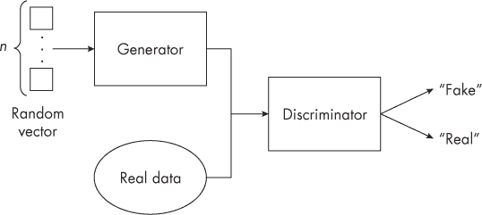

*图 6-1：生成对抗网络架构的概念化*

例如，使用一个真实数据的小批量——即可用真实训练数据的一个小子集——进行训练，步骤如下：

1.  使用当前的生成器来创建一个小批量的假数据。

1.  从训练集中获取一个小批量的真实数据。

1.  解冻判别器的权重，以便梯度下降可以更新它们。

1.  将假样本和真实样本分别通过鉴别器，标记为 0 和 1。

1.  使用反向传播进行梯度下降步骤，以更新鉴别器的权重。

1.  冻结鉴别器，使得生成器可以在不改变鉴别器的情况下进行更新。

1.  创建一个小批量的生成器输入（即图 6-1 中的随机向量）。

1.  将生成器的输入通过合成模型以更新生成器的权重。将每个生成器输入标记为真实。

1.  从步骤 1 开始，直到整个模型训练完成。

算法首先使用当前的生成器更新鉴别器的权重（步骤 5），然后冻结它们（步骤 6），这样生成器的权重可以在不改变鉴别器的情况下更新。这个方法是必要的，因为我们希望鉴别器的输出——“真实”或“假”的标签——更新生成器部分。注意，生成器更新将所有假图像标记为真实。这样做是根据假输入对鉴别器的真实度进行评分，从而评估生成器的表现。

让我们来分析作为生成器输入的随机向量。GAN 的关键是学习一个训练集的表示，我们可以把它当作一个数据生成器，就像生成真实训练集的数据生成过程。然而，在这种情况下，数据生成器可以被看作是一个函数，它接受一组随机数，即随机向量，并将其转化为一个输出，这个输出可能看起来像是来自训练集。换句话说，生成器就像一个数据增强设备。生成器的随机输入成为了训练集的一个示例。实际上，生成器是实际数据生成过程的代理，后者最初创造了真实的训练集。

随机向量是从一个概率分布中抽取的。从概率分布中抽样类似于掷两个骰子，并询问它们的和是七的可能性与是二的可能性哪个更大。和为七的可能性更大，因为有更多种方法可以将两个数字加起来得到七。而得到二的方法只有一种：蛇眼。从正态分布中抽样也类似。返回的最常见样本是分布的平均值。离平均值越远的数值出现的可能性越小，尽管仍然可能出现。

例如，图 6-2 展示了人体身高分布的条形图。原始数据集包含了 25,000 个人的身高数据，然后将这些数据适配到图中的 30 个区间。柱子越高，表示该区间内的人数越多。

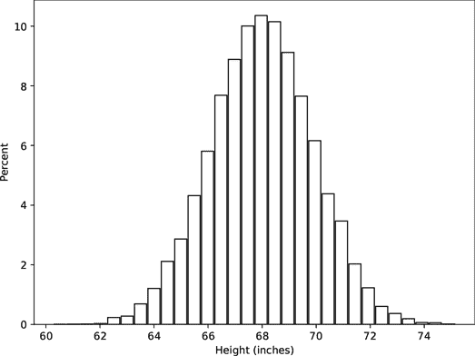

*图 6-2：人体身高分布*

注意直方图的形状，它看起来像一个钟形曲线——因此有了它那有些过时的名字，钟形曲线（bell curve）。它的现代名称是*正态分布*，因为它在自然界中经常出现，成为通常遇到的分布，尤其是那些由物理过程生成的数据。从分布中我们可以看出，随机选择的人的身高通常在 68 英寸左右：超过 10%的样本人口落入了这个区间。

GAN 使用的随机向量，也叫做*噪声向量*，工作原理相同。在这种情况下，均值为零，大多数样本的范围在-3 到 3 之间。此外，向量中的每个*n*元素都遵循这个范围，这意味着该向量本身是来自*n*维空间的样本，而不是图 6-2 中那种一维空间的样本。

有标签的数据集是机器学习的一大痛点。生成对抗网络（GAN）没有这样的限制。我们不关心训练样本的类别是什么，只关心它是否是实际数据的实例，不论类别标签是什么。当然，我们仍然要求训练集能反映我们想要生成的数据类型，但训练集不需要带标签。

****

让我们使用我们老朋友——MNIST 数字数据集，来构建一个生成对抗网络（GAN）。生成器将学习将一组随机的 10 个数字（即*n*为 10）转换成数字图像。训练完成后，我们可以给生成器任何一组围绕零的 10 个数值，生成器将输出一个新的数字图像，从而模拟了 MNIST 数据集的生成过程：人们手写数字在纸上。经过训练的 GAN 生成器可以源源不断地产生目标输出。

我们将使用一个基于传统神经网络的简单 GAN，来创建一个用于生成无限量 MNIST 风格数字图像的生成器。首先，我们将展开现有的 MNIST 训练集，使每个样本成为一个 784 维的向量，就像我们在第五章中做的那样。这就给了我们真实数据。为了生成假数据，我们需要 10 元素的随机向量，我们将通过从正态分布中抽取 10 个样本，生成均值为零的向量。

模型的生成器部分接受一个 10 元素的噪声向量作为输入，并生成一个 784 元素的输出向量，代表合成的数字图像。回想一下，这 784 个数字可以重新排列成一个 28×28 像素的图像。生成器模型有三个隐藏层，分别为 256、512 和 1,024 个节点，并有一个输出层，包含 784 个节点用于生成图像。隐藏层的节点使用一种叫做 *leaky ReLU* 的修正版本的线性整流单元。Leaky ReLU 激活函数在输入为正时输出输入值，但如果输入为负，输出则为负输入乘以一个小的正值。换句话说，它们会“漏”一点。输出层使用双曲正切激活函数，这意味着每一个 784 个输出元素的值都会在 -1 到 +1 之间。这是可以接受的。当我们将图像写入磁盘时，可以将这些值缩放到 0 到 255 之间。

生成器必须在随机噪声向量输入和输出图像之间进行映射。鉴别器则必须接受一张图像作为输入，这意味着它接受一个 784 维的向量。鉴别器有三个隐藏层，和生成器相似，但顺序相反：先是 1,024 个节点，再是 512 个节点，最后是 256 个节点。鉴别器的输出层有一个节点，采用 sigmoid 激活函数。Sigmoid 输出值在 0 到 1 之间，我们可以将其解释为鉴别器对输入是否真实的判断（输出接近 1 表示真实，输出接近 0 表示虚假）。注意，这个网络仅使用了标准的全连接层。高级的 GAN 使用卷积层，但探讨这些网络的细节超出了我们的讨论范围。

图 6-3 显示了生成器（上）和鉴别器（下）。两个部分在隐藏层节点数量上的对称性非常明显，尽管请注意，鉴别器中的顺序是反向的。

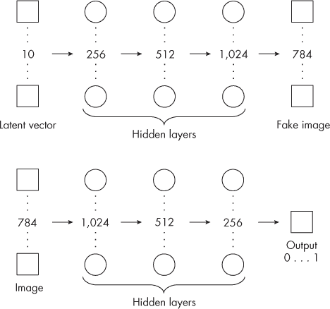

*图 6-3：GAN 生成器（上）与鉴别器（下）*

生成器接受一个 10 元素的随机向量作为输入，并生成一个 784 元素的伪图像输出向量。鉴别器接受一张图像向量（无论是真实还是伪造的），并输出一个预测值，这个值在 0 到 1 之间。伪造的图像应该生成接近 0 的值，而真实图像应该生成接近 1 的值。如果生成器训练得很好，鉴别器大多数时候会被欺骗，这意味着鉴别器的输出对于所有输入都会接近 0.5。

整个网络经过 200 次迭代训练，每次迭代包含 468 个小批量，总共 93,600 次梯度下降步骤。我们可以在每次迭代后展示来自生成器的样本，以观察网络在学习过程中的变化。图 6-4 展示了第 1、60 和 200 次迭代后的样本，从左到右依次排列。

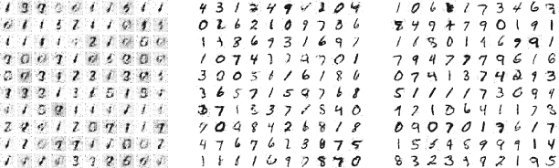

*图 6-4：生成器在第 1、60 和 200 次迭代后的输出*

正如我们预期的那样，生成器在训练数据经过一次训练后表现较差，但可能并不像我们想象的那样糟糕。大多数生成的图像看起来像数字“1”；其他数字形状，如零和二，也有出现，尽管有些噪音。

经过 60 个训练周期，生成器能够生成各种各样的数字。有些非常准确，而有些则仍然模糊不清或只是部分绘制出来。经过 200 个训练周期后，大多数数字已经清晰明确。生成器已经训练完毕，现在可以按需生成数字图像。

****

我们的数字生成器可以很高兴地为我们生成 10,000 个新的数字图像，但如果我们希望这些图像都是“四”呢？随机输入向量会生成一个随机数字，但我们不能选择具体是哪个数字。如果我们随机选择输入向量，可以理解我们会认为生成的数字输出也是随机的。我通过使用训练好的生成器生成了 1,000 个数字图像来测试这个假设。然后，我将这些数字图像传递给一个在 MNIST 数据集上训练的卷积神经网络。该卷积神经网络的测试集准确率超过 99%，这让我们对其预测充满信心，前提是输入的是数字图像。GAN 生成器可以生成逼真的数字图像，因此我们有充分的理由相信结果是可靠的。

假设生成器的表现符合我们的预期，那么每个数字的百分比应该大致相同。因为有 10 个可能的数字，所以我们预期每个数字出现的概率大约是 10%。但事实并非如此。表 6-1 显示了每个数字实际出现的分布情况。

**表 6-1：** 实际的数字分布

| **数字** | **百分比** |
| --- | --- |
| 0 | 10.3 |
| 1 | 21.4 |
| 2 | 4.4 |
| 3 | 7.6 |
| 4 | 9.5 |
| 5 | 6.0 |
| 6 | 9.1 |
| 7 | 14.4 |
| 8 | 4.4 |
| 9 | 12.9 |

生成器偏向数字“1”，其次是“7”、“9”和“0”；“8”和“2”是最不可能出现的输出。因此，GAN 不仅无法让我们选择所需的数字类型，而且它还有明显的偏好。查看图 6-4 中的最左边图像，展示了第 1 个周期的样本。大多数数字是“1”，因此从训练开始时，GAN 就表现出了偏向“1”的趋势。GAN 确实学到了东西，但数字“1”占主导的现象揭示了一个问题，这个问题有时会困扰 GAN 的训练：即*模式崩溃*，生成器在早期学会了如何生成一个特别好的例子或一组例子，这些例子能够欺骗判别器，从而陷入只生成这一输出的困境，无法产生期望的多样化图像。

我们不需要完全依赖于一个难以控制的 GAN。相反，我们可以在训练时对网络进行条件化，传入一个指示符，告诉生成器我们希望生成什么类型的数字。采用这种方法的 GAN 被称为*条件 GANs*。与无条件 GAN 不同，它们需要带标签的训练集。

在条件 GAN 中，生成器的输入仍然是一个随机噪声向量，但它附带了另一个向量，用来指定期望的输出类别。例如，MNIST 数据集有 10 个类别，数字 0 到 9，因此条件向量有 10 个元素。如果期望的类别是数字 3，条件向量除了第 3 个元素为 1，其他元素都是 0。这种表示类别信息的方法被称为*独热编码*，因为向量的所有元素都是零，只有与期望类别标签对应的元素为 1。

判别器也需要类别标签。如果输入到判别器的是一张图像，我们如何包含类别标签呢？一种方法是将独热编码的概念扩展到图像。我们知道，彩色图像由三个图像矩阵表示，分别对应红色通道、绿色通道和蓝色通道。灰度图像只有一个通道。我们可以将类别标签作为一组额外的输入通道，其中除了与类别标签对应的通道外，其他通道的值都为零，对应的类别标签通道为一。

在生成和区分真实与伪输入时包含类别标签，迫使整个网络的每个部分都学习如何生成和解释特定类别的输出和输入。如果类别标签是 4，而生成器生成的数字看起来更像是零，判别器会知道存在类别不匹配，因为它从标记过的训练集中知道真实的零是什么样的。

条件 GAN 的好处在于使用训练好的生成器时。用户提供期望的类别作为一个独热向量，并与无条件 GAN 使用的随机噪声向量一起输入。然后，生成器基于噪声向量输出一个样本，但该样本是基于期望的类别标签生成的。我们可以将条件 GAN 看作是多个无条件 GAN 的集合，每个无条件 GAN 都训练在单一类别的图像上。

我在 MNIST 数据集上训练了一个条件 GAN。在这个例子中，GAN 使用了卷积层，而不是本章早些时候使用的全连接层。然后，我要求完全训练好的生成器生成每个数字的 10 个样本，如图 6-5 所示。

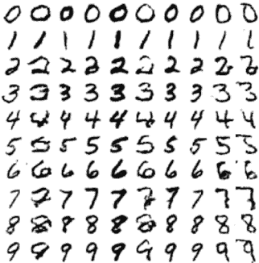

*图 6-5：条件 GAN 输出，显示每个数字的样本*

条件 GAN 让我们选择期望的输出类别，而无条件 GAN 无法做到这一点，但如果我们想调整输出图像的特定特征呢？为此，我们需要一个可控的 GAN。

****

不可控的 GAN 会无规则地生成图像，而不考虑类别标签。条件 GAN 引入了类别特定的图像生成，这在我们希望使用 GAN 生成合成图像来训练其他模型时非常有用，特别是当我们想为类别较少的示例生成数据时。另一方面，*可控 GAN* 允许我们控制生成图像中特定特征的外观。当生成器网络进行学习时，它学习一个可以映射到输出图像的抽象空间。随机噪声向量是这个空间中的一个点，该空间的维度等于噪声向量的元素数量。每个点都会生成一张图像。将相同的点、相同的噪声向量输入生成器时，会输出相同的图像。

在噪声向量所表示的抽象空间中移动，会不断生成输出图像。抽象噪声空间中是否存在具有意义的方向，这些方向与输出图像中的特征相关？这里的*特征*指的是图像中的某些元素。例如，如果生成器生成的是人脸图像，那么一个特征可能是脸部是否戴眼镜、是否有胡子或是否有红色头发。

可控 GAN 能够揭示噪声空间中的有意义方向。沿着这些方向移动会改变与该方向相关的特征。当然，现实更为复杂，因为单一方向可能会影响多个特征，这取决于噪声空间的维度和生成器学习到的数据。通常，较小的噪声向量更容易*纠缠*，意味着单一噪声向量的维度会影响多个输出特征，从而使得识别有趣方向变得困难。一些训练技巧和更大的噪声向量（例如，使用 100 个元素而非我们之前使用的 10 个）可以提高模型将有趣特征调整分配给单一方向的机会。理想情况下，单个噪声向量元素会有一个有意义的特征调整。

让我们通过一个二维示例来深入理解这个概念。使用二维噪声向量训练生成器可能会很困难，但这个概念适用于所有维度，并且在二维中容易演示。图 6-6 展示了我们所需的内容。

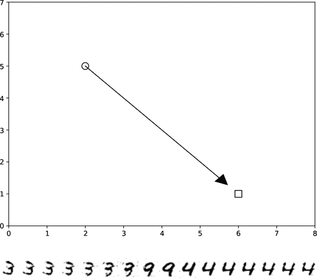

*图 6-6：在二维噪声空间中移动并插值生成 MNIST 数字*

图的上部分展示了一个具有两个输入的生成器的二维噪声空间，分别是 *x* 坐标和 *y* 坐标。因此，图中的每个点代表由 GAN 生成的图像。第一张图像是由点 (2, 5) 产生的（圆形标记）。第二张图像来自点 (6, 1)（方形标记）。箭头指示通过噪声空间的某个方向，我们以某种方式学习到这个方向控制输出图像中的某个特征。如果 GAN 生成的是人脸，箭头可能指向一个影响人物发色的方向。从点 (2, 5) 移动到点 (6, 1) 保持了大部分输出图像，但改变了发色，例如从 (2, 5) 处的黑色变为 (6, 1) 处的红色。箭头上的点代表介于黑色和红色之间的发色。

图 6-6 的底部展示了我们训练的生成对抗网络（GAN）在生成数字图像时沿第三维度的插值。从左到右，数字三短暂变为九，随后变为四，这是因为在保持其他元素初始随机值不变的情况下，调整了 10 元素噪声向量的第三个元素。噪声向量的维度相对较低，这意味着不太可能有任何一个维度仅仅与单一数字特征相关，这也是为什么整个图像从最初的三经过九变成四的原因。

精密的 GAN 可以生成逼真的假人脸图像。可控版本通过学习与特定面部特征相关的方向来进行调整。例如，考虑图 6-7，图中显示了左侧的两个生成假人脸和右侧经过调整的人脸（来源：Yujun Shen 等人，“解读 GAN 的潜在空间进行语义面部编辑”，2019 年）。这些调整对应于通过噪声空间的移动，从原始图像位置沿着表示年龄、眼镜、性别和姿势的学习方向进行调整。

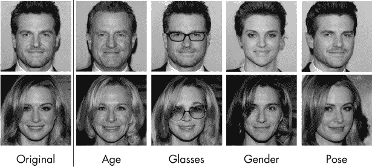

*图 6-7：控制面部属性*

可控 GAN 的能力确实令人惊叹，生成器能够通过噪声空间学习有意义的方向也令人印象深刻。然而，GAN 并不是创建现实且可控图像的唯一方法。扩散模型同样能生成逼真的图像；更重要的是，这些图像可以根据用户定义的文本提示进行条件化。

****

生成对抗网络依赖于生成器和判别器之间的竞争，来学习生成与训练数据相似的假图像。*扩散模型*则代表了一种无竞争的方式来达到同样的目标。

简而言之，训练扩散模型的过程是教它预测加到训练图像上的噪声。在扩散模型的推理过程中，则是相反的过程，将噪声转化为图像。太棒了！但在图像中，"噪声"到底是什么？

噪声意味着随机性，即没有结构的事物。如果你在想收音机的静电或音频信号中的嘶嘶声，你大致是对的。对于数字图像来说，噪声意味着随机值被添加到像素中。例如，如果像素值应该是 127，噪声就会加或减去一个小的量，使得值变成 124 或 129。加入到图像中的随机噪声通常看起来像雪花。扩散模型学习如何预测添加到训练图像中的正态分布噪声量。

在训练网络之前，我们必须准备好几个条件。首先，我们需要一个训练数据集。扩散模型像所有神经网络一样，从数据中学习。与生成对抗网络（GANs）一样，标签在我们希望模型生成特定内容之前是不需要的。

一旦我们有了训练数据，就需要一个神经网络架构。扩散模型在这里并不挑剔，但所选架构必须能够接受图像作为输入，并生成同样大小的图像作为输出。在第五章中简要提到的 U-Net 架构是一个常见的选择。

我们有了数据和架构，接下来需要找到一种方法让网络进行学习。但学习什么呢？事实证明，强迫网络学习添加到图像中的噪声就是所需的全部内容。这一认识背后的数学并不简单。它涉及到概率论，但在实际操作中，其核心是取一张训练图像，加入一定程度的正态分布噪声，然后将已知噪声与模型预测的噪声进行比较。如果模型能够成功预测噪声，我们就可以在之后用模型将纯噪声转化为与训练数据相似的图像。

上一段中重要的部分是“已知程度的正态分布噪声”这一短语。正态分布噪声可以通过一个单一参数来表征，这个数字指定了噪声的程度。训练过程包括从训练集中随机选择一张图像和一个噪声级别，并将它们作为输入传递给网络。网络的输出是模型对噪声量的估计。输出噪声（本身是一个图像）与加入的噪声之间的差异越小越好。通过标准的反向传播和梯度下降方法，逐步减少这个差异，直到模型被认为训练完成。

如何将噪声添加到训练图像中会影响模型学习的效率和速度。噪声通常遵循一个固定的*时间表*。该时间表规定，从当前噪声级别（例如噪声级别 3）转到下一个噪声级别 4 时，会向图像添加一定量的噪声，而噪声量依赖于某个函数。如果每一步之间添加的噪声量相同，则该时间表是线性的。然而，如果每一步之间添加的噪声量取决于该步骤本身，则它是非线性的，并遵循其他某种函数。

参考图 6-8，左侧展示了一个可能的训练图像。每一行展示了向训练图像添加的噪声级别。最上面一行遵循线性计划，其中从左到右的每一步都添加相同的噪声级别，直到图像几乎被破坏。最下面一行遵循的是余弦计划，这种方式破坏图像的速度较慢。这有助于扩散模型更好地学习。对于好奇的人来说，图像中的那位穿着考究的绅士是我的曾祖父，埃米尔·克诺伊塞尔，大约 1895 年拍摄。

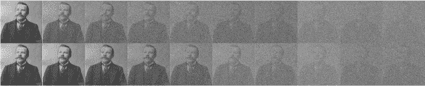

*图 6-8：将图像转化为噪声的两种方式：线性（上）和余弦（下）*

图 6-8 仅展示了九个步骤。实际上，扩散模型使用数百个步骤，关键在于，在过程结束时，原始图像被完全破坏，最终只剩下噪声。这一点很重要，因为从扩散模型中采样会反转这一过程，将随机噪声图像转化为无噪声图像。实际上，从扩散模型中采样的过程是从右到左，通过训练好的网络预测噪声，然后将其减去，生成上一步的图像。对计划中的所有步骤重复这一过程，完成从噪声到图像的生成过程。

****

前一节中的描述可以用两个算法来总结。我鼓励你阅读它们，但由于它们有些技术性，跳到下一节也是一个不错的选择。

前向算法训练扩散模型，反向算法在推理过程中从训练好的模型中采样以生成输出图像。让我们从前向算法开始。我们重复以下过程，直到宣布模型已训练完成：

1.  随机选择一张训练图像，*x*[0]。

1.  在 1 到*T*的范围内随机选择一个时间步长，*t*，其中*T*是最大步数。

1.  从标准正态分布中采样一个噪声图像，*e*。

1.  使用*x*[0]、*t*和*e*定义一个噪声图像，*x*[*t*]。

1.  将*x*[*t*]输入模型，并将输出的噪声估计与*e*进行比较。

1.  应用标准的反向传播和梯度下降方法来更新模型的权重。

前向算法之所以有效，是因为有一种直接的方式可以从训练集中的图像*x*[0]和随机选择的时间步长*t*中得到*x*[*t*]。其中，*T*是最大可能的时间步长，此时训练图像已转化为纯噪声。通常，*T*是数百步。回想一下，扩散模型的目标是学习如何预测噪声*e*。反复迫使模型在预测用于破坏训练图像的噪声方面越来越准确，这就是反向步骤能够成功的原因。

反向算法从正向算法训练的扩散模型中采样，生成新的输出图像，从纯噪声图像*x*[*T*]开始（可以参考图 6-8 中的最右边图像）。扩散模型通过重复以下步骤，使用*T*步将噪声转换为图像：

1.  如果这不是从*x*[*1]到*x*[*0]*的最后一步，从标准正态分布中采样一个噪声图像，*z*。

1.  通过从*x*[*t*]中减去扩散模型的输出并加上*z*来创建*x*[*t*−1]。

反向算法从右到左进行，如果按图 6-8 的方式思考。每一步向左的过程是通过用当前图像作为输入，减去扩散模型的输出，从而从时间步* t*移动到前一个时间步*t*–1。标准的噪声图像*z*确保*x*[*t*−1]是一个有效的样本，来自于提供*x*[*t*−1]的概率分布，生成*x*[*t*]。如前所述，我们跳过了大量的概率理论。

采样算法之所以有效，是因为扩散模型估计了输入中的噪声。这个估计引导我们估算出一个图像，合理地推测这个图像是如何从*x*[*t*]生成*x*[*t–1]的。迭代所有*T*步，最终得到*x*[*0]，即网络的输出。请注意，与我们之前的网络不同，后者有输入并生成输出，扩散模型是反复运行的，每次都生成噪声越来越少的图像，直到最终生成一个与训练数据相似的图像。

****

扩散模型就像标准的 GAN 一样：无条件的。生成的图像是不可控的。你可能会怀疑，如果 GAN 可以通过某种方式进行条件化来引导生成过程，那么扩散模型是否也能以类似的方式进行引导。如果是的话，你是对的。

我们用来生成类似 MNIST 数字图像的 GAN 是通过将输入扩展为一个 one-hot 向量，来选择所需的类别标签，进而条件化生成器。条件化扩散模型则没有那么简单，但确实可以在训练时向网络提供与图像相关的信号。通常，这个信号是一个嵌入向量，代表训练图像内容的文本描述。我们在第五章中简要接触过嵌入，之后在第七章中讨论大型语言模型时还会再次涉及。

目前我们只需要知道的是，文本嵌入将像“一个大红色的狗”这样的字符串转换为一个大的向量，我们可以将其看作是高维空间中的一个点：这个空间捕捉了意义和概念。在训练过程中，文本嵌入的关联作用就像是在网络学习预测图像中的噪声时，条件作用于网络，类似于 one-hot 类别向量对 GAN 生成器的条件作用。

训练后，当采样时，文本嵌入的存在提供了类似的信号，引导输出图像，使其包含与文本相关的元素。在采样时，文本成为一个提示，描述我们希望扩散过程生成的图像。

扩散模型通常从一张随机噪声图像开始。其实不一定如此。如果我们希望输出图像与现有图像相似，我们可以将该图像作为初始图像，添加一定程度的噪声。根据添加噪声的程度，图像的样本会更多或更少地与其相似。现在，让我们来了解条件扩散模型。

****

商业扩散模型，如 OpenAI 的 DALL-E 2 或 Stability AI 的 Stable Diffusion，使用用户提供的文本或图像来引导扩散过程，生成满足提示要求的输出图像。本节展示的示例是通过 Stable Diffusion 在 DreamStudio 在线环境中生成的。图 6-9 向我们展示了列奥纳多·达·芬奇的*蒙娜丽莎*（左上方）及其五个变体。

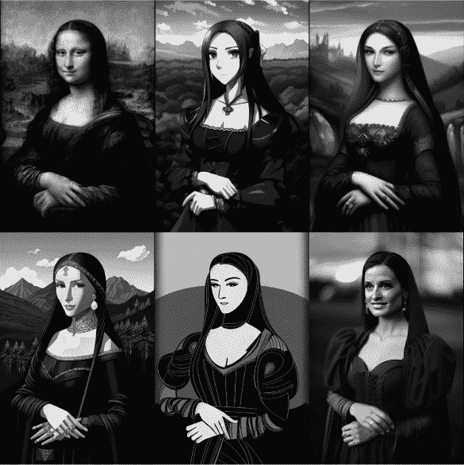

*图 6-9：由 Stable Diffusion 想象的* 蒙娜丽莎 *

这些变体是 Stable Diffusion 根据原始图像和文本提示生成的作品：

*穿棕色连衣裙的女性肖像，达·芬奇风格，柔和的土色调*

DreamStudio 界面允许用户提供初始图像，并使用滑块设置要添加的噪声量，从 0%（纯噪声图像）到 100%（不添加噪声）。(是的，我也觉得这有点反直觉。) 图像的噪声版本初始化了扩散过程。百分比越高，添加的噪声越少，初始图像对最终输出的影响越大。对于*蒙娜丽莎*，我使用了 33%的噪声。这个噪声级别，再加上提示词和用户可选择的风格，生成了图 6-9 中的五个变化版本。变化之间唯一的不同是选择的风格（上排：动漫和奇幻艺术；下排：等距画法，线条艺术，和摄影风格）。

结果令人印象深刻。这些图像既不是画出来的，也不是手工绘制的，而是从*蒙娜丽莎*的噪声版本和作为指导的文本提示中扩散生成的。不难理解，能够根据提示生成新图像的能力将对商业艺术界产生影响。

然而，AI 图像生成并不完美。错误是难免的，如图 6-10 所示。我保证我没有要求生成一只五条腿的边境牧羊犬、一只多嘴的*霸王龙*，或者像*蒙娜丽莎*那样，拥有严重畸形手的女性肖像。扩散模型似乎在渲染手部时尤其困难，就像人类艺术家一样。

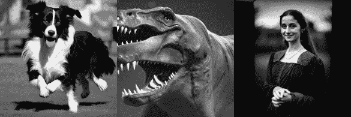

*图 6-10：扩散模型错误*

编写有效的提示语已成为一门艺术，这也催生了一个新兴职业：提示工程师。文本提示的具体形式对图像生成过程有着强烈影响，初始随机噪声图像的选择也同样如此。DreamStudio 界面允许用户固定伪随机数生成器种子，这意味着每次扩散过程都从相同的噪声图像开始。通过固定种子并稍微修改文本提示，我们可以进行实验，学习扩散过程的敏感性。

图 6-11 中的图像是通过“华丽的”、“绿色的”和“花瓶”这些词的排列组合生成的。（这些图像在书中以黑白呈现，但所有图像的绿色色调都相似。）每次的初始噪声图像都是相同的，只有这三个词的顺序发生了变化。三个花瓶相似，但第四个则有很大不同。不过，所有四个花瓶都是华丽的绿色花瓶的有效示例。

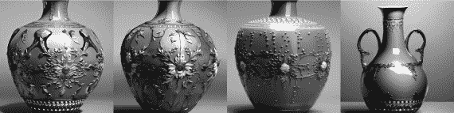

*图 6-11：通过扩散模型生成的花瓶*

提示语的顺序和措辞很重要，因为即使提示词或其含义相似，由文本提示生成的嵌入向量也会有所不同。前三个花瓶的提示语很可能在文本嵌入空间中接近，解释了它们为何如此相似。最后一个提示语由于某种原因落在了其他位置，导致生成图像的特征有所不同。有趣的是，最后一张图像的提示语是“华丽的绿色花瓶”，符合语法规范的形式。

出于好奇，我改变了提示语“华丽的绿色花瓶”，将“绿色”改成了其他颜色，并使用了之前的相同初始噪声图像。结果见图 6-12。从左到右，指定的颜色分别是红色、淡紫色、黄色和蓝色。前三张图像与图 6-11 中的最后一个花瓶相似；只有蓝色花瓶与众不同。

*图 6-12：生成的各种颜色花瓶*

在实验过程中，我注意到扩散模型的另一个特性，即生成的图像比原始图像噪声更少。假设输入图像的分辨率较低且有噪点，那么扩散模型的输出则会具有更高的分辨率且更清晰，因为输出并非对原始图像进行操作的结果，而是根据提示语重新构想的图像。如果对原始图像的绝对保真度要求不严格，是否可以利用扩散模型去除图像伪影？

图 6-13 试图回答这个问题。左侧是将原始的 195×256 像素图像放大到 586×768 像素（放大因子为 3）。这张图像使用标准的图像处理程序和立方插值法进行了放大。右侧是扩散模型输出的图像，大小同样为 586×768 像素。该扩散模型输出使用了 195×256 像素的原始图像，添加了 25%的噪声，采用了摄影风格，并且提示语为“详细，原始”。扩散图像更好。它并不完全与原始图像相同，但非常接近。我不认为这种方法能够与基于深度学习的超分辨率网络竞争，但无论最终的实用性如何，它都是扩散模型的一个有趣应用。

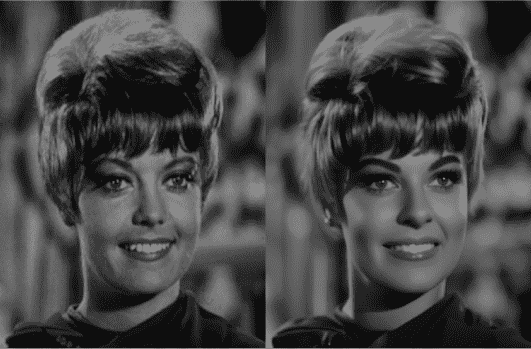

*图 6-13：扩散模型图像增强*

另一个例子是图 6-14，它展示了一张通过约 100 米远的距离拍摄的西部草地百灵鸟图像，该图像受到科罗拉多州烟雾的影响（左）。中间的图像是使用标准图像处理程序（如 Gimp）改善该图像的最佳尝试。右侧的版本是稳定扩散模型的输出，该模型使用了添加了一些噪声（约 12%）的中间图像，并且使用了以下文本提示：

*西部草地百灵鸟，高度详细，高分辨率，无噪声*

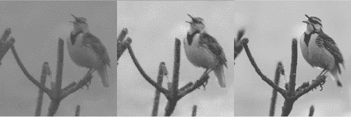

*图 6-14：扩散模型图像增强实验，尝试改善一张被烟雾遮挡的西部草地百灵鸟图像：原图（左），使用标准图像处理程序的最佳尝试（中），通过稳定扩散增强后的图像（右）*

稳定扩散模型并没有创造奇迹，但其输出无疑比原始图像要好。

****

本章探讨了两种生成网络：生成对抗网络和扩散模型。两者都通过随机输入生成图像。

GAN（生成对抗网络）联合训练生成器和判别器网络，教会生成器生成能够欺骗判别器的输出。条件 GAN 在训练和生成过程中使用类别标签，引导生成器产生属于用户指定类别的输出。可控 GAN 通过与生成输出的基本特征相关的噪声向量空间学习方向，使得沿这些方向的移动可以可预测地改变输出图像。

扩散模型学习预测图像中的噪声量。训练扩散模型时，会给模型提供干净的训练图像，并故意加入已知数量的噪声。模型的预测与已知添加的噪声一起，用于更新模型的权重。条件扩散模型将嵌入信息，通常来自训练图像内容的文本描述，与噪声相关联，以便在生成时，模型能够生成包含与用户文本提示相关的元素的图像。如果使用某个现有图像，并添加一定程度的噪声来替代纯随机初始图像，则会生成变体。

引言中提到了三种生成式 AI 模型。最后一种，大型语言模型，目前正威胁着以工业革命的规模，甚至是像某些 AI 从业者所说的轮子和火的水平，深刻改变世界。这种重大的声明要求我们给予关注。因此，让我们继续探讨可能最终会成为真正 AI 的内容。

**关键词**

条件 GAN、可控 GAN、扩散模型、判别器、纠缠、生成对抗网络（GAN）、生成式 AI、生成器、泄漏的 ReLU、模式坍塌、噪声向量、独热编码、调度
