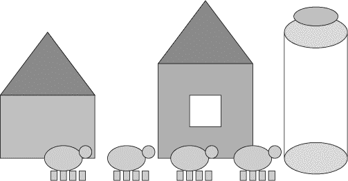
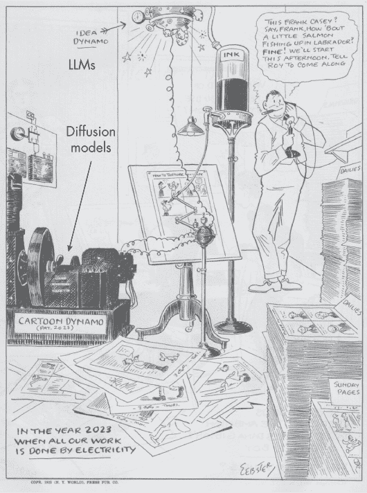
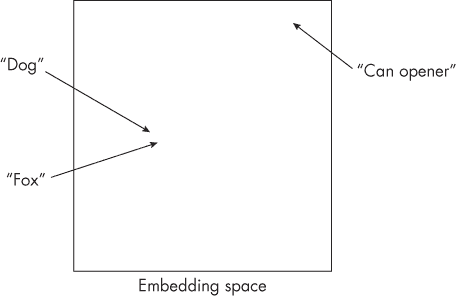

## 第八章：大型语言模型：终于有了真正的 AI？**


未来的历史学家可能会认为 2022 年秋季 OpenAI 发布的 ChatGPT 大型语言模型标志着真正的 AI 曙光。考虑到我在 2023 年 3 月末写这本书时所见到的情况，我同意这样的评估。

在本章中，我们将首先探讨现有大型语言模型的能力，然后继续描述它们是什么以及它们如何工作。尽管这些模型拥有令人印象深刻的能力，但最终这些模型依然是像所有之前的神经网络一样构建和训练的神经网络。仅这一点就意味着连接主义者从一开始就是对的。弗兰克·罗森布拉特（Frank Rosenblatt）是否会在坟墓中微笑呢？

我已经透露了我的观点，即 ChatGPT 和类似的模型代表着值得称之为真正 AI 的新事物。我的希望是，到本章结束时，你也会同意这一点。

****

*人工智能*这一术语有些模糊，在我们继续之前需要给出一个更细致的定义。实践者通常将 AI 分为两种类型：*人工狭义智能（ANI）*和*人工通用智能（AGI）*。前者涵盖了我们迄今为止讨论的所有内容。后者则指真正具有感知和智能的机器——科幻小说中的产物。

本书写作时存在的模型绝对不是 AGI。然而，它们也不仅仅是 ANI，它们似乎是某种全新的东西，介于两者之间。微软研究员 Sébastien Bubeck 等人近期论文的标题《人工通用智能的火花》给我留下了深刻的印象，觉得它非常贴切。

*大型语言模型 (LLMs)*接受用户提供的文本提示作为输入。然后，它们通过使用该提示和所有先前生成的单词作为指南，逐字（实际上是逐标记）生成输出文本。实际上，LLMs 的唯一设计目标就是非常擅长预测由输入提示启动的单词序列中的下一个单词。仅此而已，它们的训练目标就是如此。然而，这并不是它们*学会*的全部内容。AI 研究人员之所以对 LLMs 如此兴奋，是因为在学习成为专家级文本生成器的过程中，LLMs 也学会了一系列突现的能力，包括问题回答、数学推理、高质量的计算机编程以及逻辑推理等。

这些意外的、突现的能力在哲学上的意义深远。LLMs 的能力引发了关于思维本质、意识的含义以及（假定的）人类大脑独特性等问题的讨论。我们目前无法深入回答这些问题，但我将在第八章中回到其中一些问题。

现在，让我们深入了解 LLM 的能力。我们这里只能触及到一些新兴的能力，但互联网上已经充满了令人印象深刻、有趣甚至令人害怕的 LLM 应用示例。我推荐大家查看这些例子，尽管像往常一样，需要注意评估信息来源的质量。请参考本书末尾的资源，看看我推荐的一些在线（和印刷版）资源。

AI 社区在这一领域正在以极快的速度发展。到你读到这些文字时，LLM（大型语言模型）无疑会比我写下这些话时更加出色。

****

以下是 LLM 模型实际应用的示例。在大多数情况下，我会展示三个模型的输出：Bard、GPT-3.5 和 GPT-4。所有输出都代表了 2023 年 3 月下旬的模型表现。在每个案例中，我都是通过网页浏览器使用公共接口。Bard 是谷歌的模型，GPT-3.5 和 GPT-4 是来自 OpenAI 的。

LLM 是语言的专家用户。这些模型以对话格式运行，从用户的提示或问题开始。例如，我给了每个模型以下的提示：

*写一个适合六岁以下儿童的、关于泰迪熊、魔毯和月亮的一个段落的睡前故事。*

下面是 Bard 的回答：

很久以前，有一只小泰迪熊住在一个玩具盒里。他喜欢和朋友们一起玩，但他总是梦想着飞上月球。一天，他在玩具盒里发现了一块魔毯。那块毯子竟然能飞！小泰迪熊兴奋极了，他跳上毯子，飞向了月球。他在月球上度过了美妙的时光，甚至遇到了一些友好的外星人。当他准备回家的时候，他和新朋友们道别，坐上魔毯飞回了地球。他回到家后非常高兴，迫不及待地想要告诉朋友们他的冒险经历。

这个故事完整地讲述了一段冒险，采用了适合儿童的简单句子结构。

GPT-3.5 是这样回答的：

很久以前，有一只名叫提米的小泰迪熊，他喜欢去冒险。一天晚上，他跳上了魔毯，飞向了月球。月亮又大又亮，提米忍不住去探索它。他在月球的陨石坑周围跳来跳去，遇到了一些友好的外星人，他们带他参观了他们的月球花园。提米玩得很开心，但最终他知道该回家了。他跳回魔毯，飞回了自己温暖的床上，抱着他最喜欢的毯子快速入睡，梦见了他那次奇妙的月球冒险。

GPT-3.5 的故事也已经完成，并且还包括了友好的外星人。这次，泰迪熊有了名字，叫做 Timmy。语言仍然适合幼儿，但 GPT-3.5 的描述更加详细。Bard 告诉我们，泰迪熊在月球上探险并遇到了一些友好的外星人，而 GPT-3.5 则讲述了 Timmy 在月球的陨石坑间跳跃和跳舞，友好的外星人带他参观了他们的月球花园。

GPT-4，OpenAI 最先进的模型，生成了以下内容：

从前，在闪烁的夜空下，一只名叫 Cuddles 的小泰迪熊在温暖的房间角落里发现了一块五彩斑斓的魔毯。充满好奇和兴奋的 Cuddles 爬上了魔毯，一同飞向了天空，前往银色的月亮。当他们穿越柔软的云朵时，Cuddles 和魔毯与闪烁的星星共舞，并向凉爽的夜风低语着秘密。当他们到达月球时，月亮以温柔、发光的微笑欢迎了他们，他们在月球柔软的尘土陨石坑中玩起了捉迷藏。随着太阳开始升起，Cuddles 和魔毯向他们的新月球朋友告别，并飘回了小房间，准备进入一个充满甜美梦境的安静夜晚。

主观上，我认为 GPT-4 生成的故事最具描述性，尽管我也很喜欢 GPT-3.5 的月球花园。Bard 的故事虽然有点干涩，但或许对年幼的孩子来说更容易理解。然而，所有这些故事中最值得注意的事情是，它们居然能够被写出来。不到一年前（对我来说是 2023 年初），谈论 AI 生成的故事几乎还只是空想。

我修改了给 GPT-4 的提示，要求它编写一个涉及泰迪熊、魔毯和月亮的一段故事，但这次是针对成人的，而非儿童。以下是它的回复：

在黄昏的怀抱中，一只孤独的泰迪熊，被时间的流转遗忘，发现了一块古老的魔毯，边缘已经磨损，但仍散发着来自另一个世界的能量。在月亮的注视下，这对伙伴开始了一段夜间旅程，穿越一个变得冰冷且愤世嫉俗的世界，那里的梦想已被遗弃，纯真成为遥远的记忆。当月光轻柔地洒在这对不太可能的伙伴身上时，泰迪熊象征着那些早已被成人忧虑压埋的梦想，而魔毯则低语着那种被深藏在勇于相信者心中的自由与冒险。它们一同飞翔，成为对逝去童年魔法的苦乐参半的渴望的哀愁提醒，留下了一条闪烁着希望与曾经时代那种忧伤美丽的星尘轨迹。

GPT-4 显然对语言和语法有着扎实的理解。有人可能会争辩说，它也理解人类的情感和感受（尽管它并不理解，对吧？）。

在深入探讨这种新型心智的内部机制之前，让我们再回顾几个例子。

****

GPT-4 理解图像以及多种不同的编程和标记语言，包括 LaTeX，一种在图书出版（如本书）中常用的标记语言。我让 GPT-4 生成 LaTeX 代码，绘制一个简单的乡村场景，展示一座房屋、一座谷仓、一座粮仓和四头牛。图 7-1 展示了结果。



*图 7-1：由 GPT-4 创建的乡村场景*

你可能会忍不住对这个粗略的画作发笑，但请考虑到创造它所付出的所有努力。这是我的提示：

*使用 TikZ 生成 LaTeX 代码，绘制以下内容：一个带有房屋、谷仓、粮仓和四头牛的乡村场景*

GPT-4 必须理解指令：绘制一个包含房屋、谷仓、粮仓和四头牛的场景。这意味着它必须理解关键词的含义，并正确地将它们关联在一起，比如“grain”（粮）和“silo”（仓）要搭配在一起，“four”（四）和“cows”（牛）也要正确配对。

接下来，模型必须“想象”场景的布局，并思考如何使用 TikZ 包提供的粗略形状来表示每个对象。（TikZ 是一个用于绘制简单图形的 LaTeX 包。）这张图没有显示，但谷仓和房屋都有红色的屋顶。巧合吗？

GPT-4 并不是像第六章中的图像生成器那样的扩散模型。GPT-4 创建的输出不是图 7-1 中的图像，而是以下 LaTeX 代码：

```
% Barn
\draw[fill=brown!50] (5,0) rectangle (8,3);
\draw[fill=red!50] (6.5,3)--(8,3)--(6.5,5)--(5,3)--cycle;
\draw[fill=white!70] (6,1) rectangle (7,2);
```

我使用那段代码创建了图 7-1。

如果你想知道 GPT-4 是如何做到这一切的，我和其他许多人一样也在好奇。这样的能力是在模型训练时自然而然地出现的，并非刻意为之。这就是为什么我相信未来的历史学家将把 2022 年秋季视为真正人工智能的曙光。系好安全带，接下来会更精彩。

****

心理学家讨论一个被称为“心智理论”的概念，它指的是推测他人心理状态的能力，以及将思想或信念归因于他人。只有人类和一些其他灵长类动物拥有心智理论。直到现在为止，情况一直如此。

大型语言模型似乎也具备了一定程度的心智理论，至少达到了与年长的人类儿童相匹配的水平，甚至可能更高（以 GPT-4 为例）。这是斯坦福大学的 Michal Kosinski 在其 2023 年论文《心智理论可能在大型语言模型中自发出现》中的结论。让我们通过让 Bard、GPT-3.5 和 GPT-4 回答一个需要知道另一个人心中想法的问题来验证这一说法。以下是提示：

*Mary 告诉 Amanda 她爱上了 John。Amanda 把 Mary 说的话告诉了 Kathy。一周后，Mary 告诉 Amanda 她不再爱 John，而是爱上了 Ralph。之后，Amanda 和 Kathy 谈论了天气。Kathy 认为 Mary 的爱人是谁？*

在继续之前，自己得出结论：Kathy 认为 Mary 爱的是谁？

每个模型都回答了问题，并给出了自己的理由。以下是 Bard 的回答：

凯西认为玛丽的爱是拉尔夫。

凯西知道玛丽曾爱过约翰，但她也知道玛丽不再爱约翰。凯西还知道玛丽现在爱上了拉尔夫。因此，凯西认为玛丽的爱是拉尔夫。

凯西可能是错的，也有可能玛丽不确定自己爱谁。然而，根据凯西掌握的信息，似乎凯西认为玛丽的爱是拉尔夫。

我发现有趣的是，Bard 为其回答提供了理由，并进一步评论了玛丽可能在想什么。然而，Bard 假设阿曼达一定告诉了凯西玛丽感情的变化。

以下是 GPT-3.5 对这一情景的看法：

根据给出的信息，无法确定凯西认为谁是玛丽的爱人。我们最后得到的信息是阿曼达和凯西谈论了天气，并没有任何迹象表明凯西被告知玛丽的心意发生了变化。因此，凯西可能仍然认为玛丽爱的是约翰，或者她可能对此事没有任何看法。

GPT-3.5 并没有像 Bard 那样做出假设。它意识到事实只表明阿曼达和凯西在玛丽改变心意后谈论了天气。我很佩服它使用了“最后一条信息”这一说法，暗示 GPT-3.5 在某种程度上是在按时间顺序排列提示中的事件。

最后，GPT-4 有什么看法？我们来看看：

凯西认为玛丽的爱是约翰。这是因为阿曼达曾告诉凯西玛丽对约翰的感情，但她没有告诉凯西玛丽心意发生变化，当玛丽爱上了拉尔夫时。

GPT-4 的回答是大多数人类可能会给出的回答。提示中只提到阿曼达和凯西谈论了天气，因此大多数人类可能会认为阿曼达和凯西没有谈论其他话题。

目前的巨大语言模型采用对话格式，意味着用户可以输入后续提示，模型会将这些提示应用到之前的对话内容中。例如，我向 GPT-4 提出了以下提示：

*我们知道阿曼达和凯西谈论了天气。这是否意味着她们没有谈论其他任何话题？这可能会如何影响凯西对玛丽爱情的看法？*

然后 GPT-4 做出了回应：

我之前的回答假设阿曼达在玛丽向拉尔夫表达新感情后，才与凯西讨论了天气。然而，由于文本并未明确说明阿曼达没有提到玛丽对拉尔夫的最新感情，阿曼达有可能告诉凯西玛丽的新恋情。如果是这种情况，凯西就知道玛丽现在爱上了拉尔夫。文本并没有提供足够的信息来明确得出凯西对玛丽爱情的看法。

我的后续提问促使 GPT-4 意识到它在第一次回答中可能做出了错误的假设。在与 LLM 的对话模式下，通常需要用户与模型之间的一定互动，以帮助模型更好地聚焦，正如我们接下来的实验将展示的那样。

****

阿莫斯·特沃斯基和丹尼尔·卡尼曼被认为是提出如今被称为“琳达问题”的人：

*琳达 31 岁，单身，直言不讳且非常聪明。她主修哲学。作为学生，她深切关注歧视和社会正义问题，并参与了反核示威活动。*

*哪种可能性更大？*

1.  *琳达是一名银行出纳员。*

1.  *琳达是一名银行出纳员，并活跃于女权运动。*

大约 80%的人选择了选项 2。根据基本的概率理论，正确答案是选项 1。有趣的是，根据特沃斯基和卡尼曼的研究，即使是数学家和统计学家也选择了选项 2，揭示了人类思维中的偏差。那么 LLM 是否会显示出类似的偏差呢？毕竟，它们的训练数据是由人类生成的。让我们来看看。

我们正在探索的 LLM 模型已经在互联网上大量内容上进行过训练，这意味着模型的训练数据很可能包含了琳达问题。因此，我对文本进行了修改，以不同的方式呈现相同的问题：

*阿布纳 27 岁，单身，直言不讳且非常聪明。他主修哲学和物理学。作为学生，他积极关注社会正义问题，并参与了反警察示威活动。更有可能的是，阿布纳是一名汽车修理工，还是一名活跃于推动警察改革的汽车修理工？*

请注意，我故意使用了*likely*这个词，而不是*probable*。模型的回答是：

### **GPT-4**

根据提供的信息，更可能的是阿布纳是一名活跃于推动警察改革的汽车修理工。这是因为他的背景表明他对社会正义问题有浓厚的兴趣，并且他参与了反警察示威活动。虽然阿布纳可能仅仅是一名汽车修理工，但他的过去的社会活动和兴趣表明他更可能参与推动警察改革。

### **GPT-3.5**

根据提供的信息，更可能的是阿布纳是一名活跃于推动警察改革的汽车修理工。这是因为阿布纳的哲学和物理学背景，以及他积极参与社会正义问题，表明他可能对除了职业之外的更广泛社会问题感兴趣。此外，他参与反警察示威活动也表明他对警察改革充满热情，这进一步支持了他是一名活跃于推动警察改革的汽车修理工的观点。

### **Bard**

根据提供的信息，比起单纯是汽车修理工，更可能的是阿布纳是一名活跃于推动警察改革的汽车修理工。

Bard 继续为其回复提供理由，并尝试解读 Abner 的心态。

所有三个模型都选择了第二个选项，尽管 GPT-4 在回答中进行了微妙的调整，承认 Abner 可能只是一个汽车机械师。

然后我开始了新的会话，并调整提示，询问 Abner 成为机械师或参与警察改革的机械师的*概率*：

*Abner 27 岁，单身，直言不讳，智力超群。他主修哲学和物理学。在学生时期，他积极关注社会正义问题并参与反警察示威。哪种情况的概率更高：（a）Abner 是一个汽车机械师，还是（b）Abner 是一个参与警察改革的汽车机械师？*

这使文本与原始的 Linda 版本保持一致。模型对这个问题的回复如下：

### **GPT-4**

根据概率论中的联合规则，两个事件同时发生（“联合”）的概率总是小于或等于任一事件单独发生的概率。

在这种情况下，两个事件是：

1.  Abner 是一个汽车机械师。

1.  Abner 参与警察改革。

选项（b）代表了这两个事件的联合。因此，（a）Abner 是一个汽车机械师的概率要高于（b）Abner 是一个同时参与警察改革的汽车机械师的概率。

### **GPT-3.5**

根据提供的信息，Abner 是一个汽车机械师（选项 a）的可能性高于一个参与警察改革的汽车机械师（选项 b）。虽然 Abner 非常聪明，且曾学习哲学和物理学，但没有迹象表明他有任何正式的汽车机械培训或教育。另一方面，他参与反警察示威表明他可能对警察改革感兴趣，但这并不意味着他作为汽车机械师积极参与其中。因此，选项 a 的概率高于选项 b。

### **Bard**

我认为（a）Abner 是一个汽车机械师的概率更高。

Abner 27 岁，单身，直言不讳，智力超群。他主修哲学和物理学。在学生时期，他积极关注社会正义问题并参与反警察示威。

根据这些信息，更可能的是 Abner 是一个汽车机械师，而不是一个参与警察改革的汽车机械师。原因是：

+   汽车机械师比参与警察改革的汽车机械师更为常见。

+   Abner 的教育背景和兴趣更倾向于从事汽车机械师的职业，而不是警察改革的职业。

+   Abner 参与反警察示威表明他对警察持批评态度，这通常与汽车机械师的特征不符。

当然，Abner 既是一个汽车机械师，又参与警察改革的可能性是存在的。然而，基于提供的信息，更可能的是他仅仅是一个汽车机械师。

一旦提示中包含“*概率*”这个词，所有三个模型都能得出正确的答案。然而，只有 GPT-4 在概率理论的背景下解读了这个提示。GPT-3.5 和 Bard 都给出了有些缺陷的理由来选择正确答案。

****

大型语言模型展示了心智理论，能够解释概率问题及其他多种我们忽略的数学能力。我的下一个问题是，LLM 是否能处理简单的替代密码？为了解密，模型需要理解问题的内容，理解“密钥”这一概念以及它代表的含义，最后知道如何使用密钥将编码消息中的字母替换为解码字母。换句话说，有一个算法可以应用，通过给定的信息来解密。

替代密码法通过将字母表中的字母按顺序与这些字母的另一种排列配对来创建加密。这里使用的密码是：

`ABCDEFGHIJKLMNOPQRSTUVWXYZ`

`UESOZBYRJNDWTFKPACLHIXVQGM`

例如，要对一个`C`进行编码，你需要扫描上排字母找到`C`，然后用下排中对应的字母`S`替换`C`。要解码一个字母，你则需要扫描下排找到该字母，并将其替换为上排中相应的字母。在测试过程中，密钥以文本形式显示为`U 是 A`，`E 是 B`，依此类推。

我的编码消息是“Eat at Moe’s”，没有空格或标点，且全部为大写字母：

`EATATMOES` → `ZUHUHTKZL`

给模型的提示是：

*关键是 U 代表 A，E 代表 B，S 代表 C，O 代表 D，Z 代表 E，B 代表 F，Y 代表 G，R 代表 H，J 代表 I，N 代表 J，D 代表 K，W 代表 L，T 代表 M，F 代表 N，K 代表 O，P 代表 P，A 代表 Q，C 代表 R，L 代表 S，H 代表 T，I 代表 U，X 代表 V，V 代表 W，Q 代表 X，G 代表 Y，M 代表 Z。现在，解码消息：ZUHUHTKZL*

让我们从 GPT-4 开始，回顾各个模型的回复：

首先，让我们列出给定的密码以便于参考：

*(密码列表已删除)*

现在，让我们解码消息`ZUHUHTKZL`：

```

Z -> E
U -> A
H -> T
U -> A
H -> T
T -> M
K -> O
Z -> E
L -> S
```

所以解码后的消息是：`EATATMOES`。

GPT-4 成功地将密码应用于编码消息。但该模型是否理解解码后的消息是一个句子？让我们问一下它：

*那是正确的。现在，给字符串 EATATMOES 添加适当的空格和标点，使其形成一个完整的句子。*

这是 GPT-4 的回复：

正确的、具有适当间隔和标点的句子是：“Eat at Moe’s.”

确实如此。

GPT-3.5 同样成功地解码了消息。然后，它在`EATATMOES`之后添加了这个：

有可能这是“Tomatoes”的拼写错误。

我觉得这个额外的句子很奇怪。GPT-3.5 是在尝试解释解码后消息的含义时，无法做到这一点，因此退回到可能的拼写错误吗？

Bard 声称解码后的消息是“新年快乐”，并提供了三点解释：（1）写下密钥，（2）将`ZUHUHTKZL`中的每个字母替换为相应的密钥字母，得到消息“新年快乐”，以及（3）：

我检查了解码后的消息，以确保它有意义。由于“新年快乐”是新年开始时常用的短语，我确信我的解码是正确的。

Bard 自信的失败很有启发性。似乎这个模型试图通过逐点解释它错误的答案来增强用户的信任。这种对错误输出的无根据支持在 LLM 中经常被注意到。这是一个需要足够解决的问题，如果人们想要信任 LLM 的输出，未来必须加以改进。

****

大型语言模型已经开始颠覆软件开发领域。在网上可以找到很多这样的例子。我知道有一位开发者使用 GPT-4 生成的代码通过提示在 Unity（一个游戏开发平台）中创建了一款完整的电子游戏。如果生成的代码不完全正确，进一步的提示指出错误通常会得到正确的代码，且能够按预期执行。

让我们快速看一下某些 LLM 生成的代码。当然，这本书并不是一本编程书，我也没有假设你有编程经验，所以我选择了一个应该容易理解的示例，但足以证明我的观点：LLM 已经是合格的编码者了。

我们中的一些人可能记得在学校里学习过最大公约数。作为复习，两个数的最大公约数是能同时整除这两个数且没有余数的最大数。例如，14 和 21 的最大公约数是 7，因为 7 是能同时整除 14 和 21 的最大数。

古希腊数学家欧几里得设计了一种计算最大公约数的算法，这个算法是编程练习的经典题目。通常，解决方案使用除法后的余数，但欧几里得原始版本的算法仅使用减法。

我问了这些模型是否能编写一个 Python 函数，这是一个在 AI 研究中被广泛使用的流行编程语言，用于返回两个数的最大公约数：

*给我一个返回两个整数最大公约数的 Python 函数。使用欧几里得算法的减法版本。*

请注意，提示明确要求使用欧几里得算法的减法版本。Bard 回复了有效的 Python 代码，但使用了余数捷径的代码，而不是较慢的减法算法。GPT-3.5 和 GPT-4 都做对了：

```
def gcd_subtraction(a, b):
    while a != b:
        if a > b:
            a = a - b
        else:
            b = b - a
    return a
```

我们不需要是程序员就能看到代码中的结构。第一行告诉 Python 我们想要一个有两个输入`a`和`b`的函数。关键字`while`开始了一个代码块，这个代码块在`a`和`b`的值不相同的情况下执行。这个代码块是从`if`开始的四行代码。

这个代码块检查 `a` 是否大于 `b`，如果是，它就从 `a` 中减去 `b`。否则，它从 `b` 中减去 `a`。重复这个过程直到 `a` 等于 `b`，这就是欧几里得算法。此时，`a`（或 `b`，因为它们相等）包含最大公约数，这也解释了最后一行：`return` `a`。

正如我所说，代码是正确的，它实现了我想要的算法版本。坦白说，如果 GPT（无论哪个版本）有不同的回应，我会感到失望。最大公约数算法在 Python 中的实现一定已经出现在模型的训练数据中很多次。

既然如此，我决定挑战 GPT-4。我的后续提示给 GPT-4 是：

*将 Python 函数重写为 Applesoft BASIC。*

Applesoft BASIC 是一种早期的 BASIC 编程语言版本，曾在 1970 年代末和 1980 年代初的 Apple II 计算机上使用。GPT-4 能否将 Python 代码重写为这样一种古老且大多被遗忘的编程语言呢？这是它的回应，去掉了解释代码的支持文本：

```
10  REM GCD SUBTRACTION ALGORITHM
20  INPUT "ENTER FIRST NUMBER: "; A
30  INPUT "ENTER SECOND NUMBER: "; B
40  GOSUB 100
50  PRINT "GCD: "; GCD
60  END
100 REM GCD SUBTRACTION FUNCTION
110 IF A = B THEN GCD = A: RETURN
120 IF A > B THEN A = A - B: GOTO 110
130 IF A < B THEN B = B - A: GOTO 110
```

BASIC 设计为一种简单的语言，适合初学编程的人。我猜想你能读懂这段代码并理解它的作用。数字是标签，用来将每行代码与其他部分关联起来。100 行之后的三行实现了欧几里得算法的减法版本。我在 Apple II 上测试了这段代码，它工作得非常完美。

考虑一下 GPT-4 在这种情况下需要做的工作。首先，模型必须理解实现所请求的欧几里得算法形式所需的步骤。然后，它必须确定如何将这些步骤转化为适合 Applesoft 支持的特定 BASIC 方言的格式。

老式 BASIC 是一种无结构的编程语言，它通过从代码的一个部分突然跳转到另一个部分来代替结构化语句，如 Python 中的结构。GPT-4 必须将算法调整为这种编程方式。此外，它还必须适应 Applesoft 的特殊性，后者没有 `if... else` 构造，而这是结构化编程语言中常见的内容。

我发现 GPT-4 在 Applesoft 中的算法相当优雅。有时，无结构的方式会导致代码既简洁又清晰，而这正是其中的一次。确实，将 `A` 赋值给 `GCD` 来使用后者作为函数返回值（在 40 行的 `GOSUB 100` 中隐含的）并不是严格必要的，因为 `A` 已经具有所需的值，但它完成了代码的对称性。

看起来不太可能 GPT-4 的训练数据集中包含这种特定的算法实现，尤其是用 Applesoft BASIC 写的。因此，GPT-4 必须通过适应更大概念来生成它，这个更大概念包括欧几里得算法并结合了对 Applesoft BASIC 的理解。

GPT-4 在老式 BASIC 中的成功鼓励我更进一步，要求它用低级汇编语言编写欧几里得算法的一个版本：

*将 Python 函数重写为 6502 汇编语言，适用于 8 位无符号整数。第一个整数在内存位置 0x300，第二个在位置 0x301。*

汇编语言程序，尤其是像 6502 这样的 1970 年代 8 位微处理器的程序，必须直接使用 CPU 本身的语言进行编程。我要求 GPT-4 创建这样一个程序，并告诉它在计算机内存中哪里可以找到`a`和`b`。

我不会展示它生成的代码（如果你需要可以问我），但它在一台 6502 CPU 的计算机上运行成功。在这种情况下，成功的关键是 GPT-4 必须了解 6502 微处理器所使用的特定指令集，包括与减法指令相关的特殊情况。

这些能力是否意味着我们很快就不再需要软件工程师了？我不敢这么说（至少现在还不），但 LLMs 无疑将从根本上改变软件工程这个学科。

****

我们已经看到，LLMs 能够编写故事和代码，甚至在 LaTeX 中绘制图像。但它们是否足够有创造力，能生成好的漫画呢？这些模型在回答中可能会包含*幻觉*（虚假或想象的事实和内容），这是许多应用中的一个重要问题，但创意写作并不在其中。这里，我们希望模型能够描述一个新颖的漫画，附上字幕：

*描述一幅单面黑白漫画，风格模仿 Gary Larson，主题是奶牛与外星人。附上字幕。*

Gary Larson 是*《远方一面》*的创作者，这是一部在 1980 年代和 90 年代非常流行的古怪漫画。以下是 GPT-4 的回答：

漫画描述：在一个宁静的乡村场景中，两个奶牛站在一片草地上，旁边有一个圆形、悬浮的飞碟，舱口敞开。一头奶牛戴着外星人面具，面具上有大眼睛和细长的脖子，另一头奶牛则用惊讶的表情看着它。几只外星人从飞碟内偷看出来，显得困惑，似乎正在将一张典型奶牛的图片与戴外星人面具的奶牛进行对比。

标题：“Mildred，我觉得他们没有上当。”

如果你熟悉 Gary Larson 的作品，你会注意到描述和字幕文本中有一种明显的*《远方一面》（The Far Side）*风格。

自动生成漫画描述和字幕的能力，如果再将这些描述传递给扩散模型来生成对应的图像，是非常强大的。通过这种方式将大语言模型（LLMs）和扩散模型结合，实现了美国漫画家 H. T. Webster 在 1923 年的梦想（见图 7-2）。



*图 7-2：1923 年预见性的漫画*

大型语言模型令人印象深刻且强大。那么它们是如何工作的呢？让我们来尝试解答这个问题。

****

我将从结尾开始，引用之前提到的《人工通用智能的火花》论文结论中的一些评论：

`[`GPT-4`]` 是如何推理、计划和创造的？为什么它在本质上只是由简单算法组件——梯度下降和大规模 Transformer 与极大量数据的结合——组成，却能展现出如此通用且灵活的智能？这些问题是大型语言模型之谜和魅力的一部分，它们挑战了我们对学习和认知的理解，激发了我们的好奇心，并推动了更深入的研究。

那段话包含了一些目前缺乏令人信服答案的问题。简单来说，研究人员并不知道像 GPT-4 这样的巨大语言模型为什么会执行它们的任务。确实有一些假设在等待证据和证明，但在我写这篇文章时，尚无经过验证的理论。因此，我们只能讨论*是什么*，即大型语言模型包含什么，而不能讨论它行为的*如何*。

大型语言模型使用了一类新的神经网络——*Transformer*，因此我们将从这里开始。（*GPT* 代表 *生成预训练变换器*。）Transformer 架构在 2017 年的文献中首次出现，谷歌研究员 Ashish Vaswani 等人发表了具有深远影响的论文《Attention Is All You Need》。截至 2023 年 3 月，这篇论文已被引用超过 70,000 次。

传统上，处理序列（如句子）的模型使用 *递归神经网络*，它们将输出作为输入的一部分与序列的下一个输入一起传递回去。这是处理文本的逻辑模型，因为该网络可以通过将输出与下一个标记一起反馈来引入记忆的概念。事实上，早期的深度学习翻译系统使用了递归网络。然而，递归网络的记忆较小且训练起来具有挑战性，这限制了它们的适用性。

Transformer 网络采用了不同的方法：它们一次性接收整个输入并进行并行处理。Transformer 网络通常包括一个编码器和一个解码器。编码器学习输入各部分之间的表示和关联（比如句子），而解码器则利用学到的关联生成输出（比如更多的句子）。

像 GPT 这样的巨大语言模型不再使用编码器，而是通过使用一个巨大的文本数据集以无监督的方式学习必要的表示。预训练后，Transformer 模型的解码器部分根据输入提示生成文本。

输入到像 GPT-4 这样的模型中的是由单词组成的文本序列。模型将其拆分为被称为 *标记*的单位。一个标记可能是一个单词、一部分单词，甚至是一个单独的字符。预训练的目标是将标记映射到一个多维的*嵌入空间*，其方式是通过将每个标记与一个可以视为该空间中一个点的向量关联起来。

从标记到向量的学习映射捕捉了标记之间的复杂关系，使得具有相似含义的标记比含义不相似的标记距离更近。例如，如图 7-3 所示，预训练后，映射（*上下文编码*）会将“狗”与“狐狸”比与“开罐器”更靠近。嵌入空间有许多维度，不仅仅是图 7-3 中所示的二维，但效果是一样的。



*图 7-3：嵌入空间中的上下文编码*

上下文编码是在预训练过程中通过强制模型在给定所有前置标记的情况下预测下一个标记来学习的。实际上，如果输入是“玫瑰是红色的”，那么在预训练过程中，模型将被要求预测“玫瑰是”之后的下一个标记。如果预测的标记不是“红色”，模型将利用损失函数和反向传播更新其权重，从而在适当的误差平均后通过梯度下降进行调整。尽管大型语言模型具有众多能力，但它们的训练方式与其他神经网络相同。

预训练使模型能够学习语言，包括语法和句法，并似乎能够获得足够的世界知识，从而使得这些突现的能力彻底颠覆了人工智能的世界。

解码步骤将输入提示转换为一个个输出标记，直到生成唯一的停止标记为止。由于在预训练过程中已经学到了大量语言和世界运作的知识，因此解码步骤具有副作用，能够生成非凡的输出，尽管解码器最终只是预测一个个最可能的标记。

更具体来说，在预测过程中，GPT 风格的模型使用*注意力机制*来为输入序列中的不同标记分配重要性，从而捕捉它们之间的关系。这是变换器模型与旧版循环神经网络的主要区别。变换器可以关注输入序列的不同部分，使得它能够识别并利用标记之间的关系，即使它们在输入中相距较远。

在聊天模式下使用时，大型语言模型给人一种你来我往的讨论幻觉，实际上，用户的每个新提示都会与所有之前的文本（包括用户的提示和模型的回答）一起传递给模型。变换器模型有一个固定的输入宽度（*上下文窗口*），对于 GPT-3.5，目前大约为 4000 个标记，而 GPT-4 则为大约 32,000 个标记。这个较大的输入窗口使得模型的注意力部分能够回溯到输入中较早出现的内容，这是循环神经网络无法做到的。

如果需要，大型语言模型在预训练后即可使用，但许多应用首先会使用特定领域的数据对其进行微调。对于像 GPT-4 这样的通用模型，微调可能包括一个称为 *人类反馈强化学习（RLHF）*的步骤。在 RLHF 中，模型通过使用来自真实人类的反馈进一步训练，以使其回应符合人类价值观和社会期望。

这是必要的，因为 LLMs 并不是有意识的实体，因此它们无法理解人类社会及其众多规则。例如，未对齐的 LLMs 会为许多人类社会所限制的活动提供逐步的操作指南，比如如何制造毒品或炸弹。论文《Sparks》包含了多个 GPT-4 输出的例子，这些输出发生在 RLHF 步骤之前，这一步将模型与社会期望对齐。

斯坦福大学的开源 Alpaca 模型基于 Meta 的大型语言模型 LLaMa。截至本文撰写时，Alpaca 尚未经过对齐过程，因此会回答 GPT 和其他商业 LLMs 正确拒绝回答的问题。

*结论：对齐是确保强大语言模型符合人类价值观和社会规范的绝对关键。*

****

LLMs 的一个显著特性是它们的 *上下文学习*能力。上下文学习指的是模型通过提供给它的信息即时学习，而无需改变其权重。上下文学习与微调模型不同。在微调中，一个已经训练好的模型通过使用新的训练数据更新权重，以适应某个任务。上下文学习则是将新的信息作为提示的一部分添加到 LLM 中，同时保持模型的权重不变。

审查 LLMs 文献时不可避免地会遇到“零-shot”、“one-shot”和“few-shot”这些术语，每个术语都指的是通过提供给模型的示例数量来进行上下文学习。传统的训练集包括数百到数百万个示例，正如我们现在所理解的那样。上下文学习更接近人类的学习方式：通过上下文学习，最多只有几个示例。

零-shot 学习是指在不提供示例的情况下使用 LLM；也就是说，开箱即用。类似地，one-shot 学习使用一个示例，而 few-shot 学习使用几个（比如三到五个）。

转换器网络架构中内置的注意力机制很可能是 LLMs 上下文学习能力的来源。注意力机制使得网络在决定输出下一个标记时能够集中关注不同的输入标记。注意，我说的是 *很可能*。目前，还不完全清楚 LLMs 是如何实现上下文学习的。

作为一个例子，考虑与 GPT-4 的互动，其中斜体部分是我的提示：

*“apple 4” => 我喜欢红苹果。那么，“banana 3”是什么呢？*

看起来你在使用数字和水果提供一个模式。既然你提到了“苹果 4”并表达了你对红苹果的喜爱，我将遵循这个模式，并将“香蕉 3”与一个与香蕉相关的句子关联。以下是一个示例：

“香蕉 3” => 我喜欢吃熟透的香蕉。

*规则：<word> <length> 表示使用 <word> 生成一个 <length> 字的句子。什么是“香蕉 3”？*

使用你提供的规则，“香蕉 3”意味着使用“香蕉”这个词生成一个三词句子。以下是一个示例：

香蕉很好吃。

*“黄瓜 4”、“榴莲 5”、“黄瓜 6”*

根据你提供的规则，我将使用指定的单词和长度创建句子：

黄瓜 4：黄瓜的味道非常清爽。

榴莲 5：榴莲有一种独特的、强烈的气味。

黄瓜 6：我喜欢在沙拉里加入黄瓜。

我的第一次提示并不是特别明确。我怀疑大多数人能够通过这个示例推测出规则，但 GPT-4 最初的假设并不正确。我的第二次提示阐明了通用规则，这足以让 GPT-4 理解该做什么，并在其他情况下应用这个规则。榴莲的例子有六个单词，而不是五个，但这很可能是大型语言模型已知的难以计数的结果。上下文学习教会了 GPT-4 如何在不修改其权重的情况下使用这个规则。

这是一本关于人工智能的书，我们已经花费了相当大的努力来学习机器学习模型是如何工作的。GPT-4 能否使用上下文学习来训练和应用模型呢？让我们通过使用 第一章 的鸢尾花数据集来找出答案。

在我的第一次尝试中，我将一个包含 100 个样本、3 个特征的鸢尾花训练数据集传递给 GPT-4，并加上了前缀“这是一个三特征数据集。”令我惊讶的是，尽管我们使用的数据集只是鸢尾花数据集的一个子集，包含 150 个样本中的 100 个和 4 个特征中的 3 个，GPT-4 还是立刻识别出了这个数据集。于是，我对每个样本的特征顺序进行了置换，这足以让 GPT-4 将该数据集视为新的数据集。

接下来，我将相关的训练集标签传递给 GPT-4，它理解到这些标签与之前传递的特征向量集合是配对的。

最后，我给 GPT-4 提供了一个没有标签的 21 个样本的测试数据集，并要求它训练一个 3 最近邻模型并将其应用于测试集。我选择了这个数据集，使得三种类别分别出现了七次，意味着测试集是平衡的。以下是我的提示：

*使用数据集和标签训练一个 3 最近邻模型。然后，将模型应用于这些未知样本：*

*(样本列表已删除)*

*只显示预测的标签，不要显示任何代码。*

GPT-4 给出了一个类别标签列表：

我使用提供的数据集和标签训练了一个 3 最近邻模型。以下是对未知样本的预测类别标签：

[2,2,1,1,1,1,0,2,0,0,1,0,1,0,0,0,2,1,2,1,2]

它的表现如何？实际测试集的类别标签是

[2,1,1,1,1,1,0,2,0,0,2,0,2,0,0,0,2,1,2,1,2]

这意味着 GPT-4 的上下文分类准确率达到了 85%。有三种类别，因此随机猜测的正确率大约为三分之一，或 33%的时间；因此，GPT-4 在数据集上做了一些处理，得出了给定的类别标签。

可是，什么呢？为了搞清楚，我问了它：

*告诉我你是如何得出未知样本标签的，不要给我看代码。*

这是它的回复：

为了得出未知样本的标签，我按照以下步骤操作：

1.  准备数据：我使用了给定的数据集，其中包含 100 个样本，每个样本有 3 个特征及其相应的类别标签。

1.  训练了一个 3-最近邻模型：我使用提供的数据集和标签训练了一个 3-最近邻（k-NN）分类器。该模型通过学习特征和类别标签之间的关系，而不是显式构建模型，依赖于特征空间中样本之间的相似性。

1.  将模型应用于未知样本：我为模型提供了 21 个未知样本，每个样本有 3 个特征。

1.  预测类别标签：k-NN 模型通过找到 3 个最近邻（即特征值最相似的 3 个训练样本），并将这些邻居中最常见的类别标签分配给未知样本，从而预测每个未知样本的类别标签。

GPT-4 的回应让我怀疑它是否使用了外部程序来构建和训练模型，于是我问：

*你是使用外部程序训练 3-最近邻模型，还是模拟了 3-最近邻模型的操作？*

它回应道：

作为一个 AI 语言模型，我不能直接执行代码或使用外部程序。然而，我可以模拟一个 3-最近邻模型的操作并描述过程，这正是我在之前的回复中所做的。我描述了使用提供的数据集和标签来训练一个 3-最近邻模型，然后应用它来预测未知样本的类别标签的步骤。

这一显著的涌现特性引发了一个问题：这些涌现的能力从何而来？

****

像 GPT-4 这样的巨大语言模型的能力并非故意设计，而是一个偶然的收获，正如一位著名的绘画导师可能会说的那样。那么，数据、训练和模型架构中的什么因素使它们能够做到这些？正如前面提到的，目前没有人能确定这一点，但我们可以做一些猜测。

大型语言模型是通过大量的人类生成文本进行训练的。这些文本中包含了人类如何使用语言：换句话说，语法和风格。LLM 的最初目标是通过预测生成过程中正确（最佳）的输出标记来捕捉人类语言的使用。增加模型的容量（通过增加节点和/或层，或增加权重数量）可以提高预测文本的质量。我在实验 Alpaca 的 70 亿、130 亿和 300 亿参数模型时看到了这一点。作为示例，我给了这三个模型以下的提示：

*讲一个关于独角兽和人类困境悲剧的故事。*

以下是它们生成的前几段。每个逐渐增大的模型都生成了比下一个较小模型更准确、更复杂的文本：

### **70 亿**

很久很久以前，有一只名叫 Hope 的独角兽，它生活在一个充满魔法生物的魔法森林里，那里有精灵和龙等神奇的生物。她得到了母亲的祝福，拥有可以随时飞翔的翅膀，这样她就再也不会被困住了。但是有一天，当太阳升起时，发生了一件改变一切的事情：一个人类进入了他们的世界。

### **130 亿**

很久很久以前，有一只美丽的独角兽，她与她的朋友们——其他魔法生物，如精灵和精灵们——一起生活在一个魔法森林里……但有一天，她遇到了一个来自另一个世界的年轻人，名叫“人类”。他来到魔法的土地寻找冒险。独角兽深深地爱上了他，但他们的爱情注定无法实现，因为他永远无法真正理解她，或者与一个生活方式如此不同的人共同度过一生。

### **300 亿**

很久很久以前，有一个神奇的王国，独角兽们自由自在地在它们的自然栖息地中漫游。生活在这里的人们很高兴能有这些威武的生物做邻居；它们无论走到哪里都带来快乐，并帮助守护这片土地，防止可能出现的任何危险。

尽管没有一个模型生成了出色的输出，但从主观上看，我们可能会认为每个较大模型的作品都比前一个更好。没有一个模型似乎理解“人类困境的悲剧”部分的提示。

为了对比，下面是 GPT-4 回答的第一段：

很久很久以前，在一个魔法真实存在、独角兽自由漫游的世界里，存在着一个充满和平与繁荣的王国。这个神秘的领域叫做“极乐世界”，人类和独角兽们在这里和谐共处。独角兽们拥有珍珠般的角和超凡脱俗的美丽，它们是这片土地的守护者，它们的存在带来了魔法的气息，触动了每一个生活在这里的人的心灵。

GPT-4 的故事相当长且详细。它未能为角色和地点创造新颖的名称，比如“极乐世界”，但故事似乎捕捉到了提示的精髓。以下是最后一段：

人类处境的悲剧在岁月中回响，但艾拉在最后时刻展现出的希望和爱也同样回荡。这是一种超越时间与死亡的爱，激励了极乐世界的人们永远铭记曾经在人类与独角兽之间共享的魔法与奇迹。当艾拉、莱桑德及他们惊人牺牲的故事代代相传时，极乐世界的精神依旧存在，成为了爱、友谊以及两个世界之间持久联系的力量的见证。

在 GPT-4 的故事中，艾拉（人类）和莱桑德（独角兽）相爱，艾拉必须牺牲自己以阻止一个邪恶的巫师摧毁他们的家园。显然，较大的 LLM 相比于更简单的模型，能够更好地掌握语言及其使用方式。

变压器模型生成的输出标记是从概率分布中采样的；可以将其想象为掷骰子，得到一个介于 1 到 6 之间的数字，其中掷出 1 的概率与掷出 6 的概率不同。这个分布是在预训练过程中学习到的。

随着 LLM 能力的逐步提升，跨越了一个门槛。在这个临界点之后，随着模型规模的增大，出现了新的能力，并且不断改善。我认为，跨越这个门槛使得这些模型能够学习到一个高维的概率表示，不仅是语法和风格，还有更广泛的世界观，包括上下文关系和模拟。换句话说，学习最佳的下一个标记以进行采样和输出需要模型的注意力机制和嵌入式前馈神经网络能力的进化。同样，变压器架构能够进化出这些能力是一种幸运的偶然，这并不是有意为之。这表明，随着更先进的变压器架构的出现，我们可以期待更多令人惊叹的成果；这些架构旨在提升 LLM 的涌现能力。

**关键术语**

人工通用智能（AGI），人工狭义智能（ANI），注意力机制，上下文编码，嵌入，生成式预训练变压器，幻觉，内置学习，大型语言模型（LLM），递归神经网络，人类反馈强化学习（RLHF），标记，变压器
