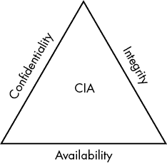

# 1

网络安全简介

网络安全是一个广泛且多样的领域。无论你是在设置防火墙还是制定密码策略，你的行动都会影响组织的各个层面，从技术人员和帮助台到 CEO。网络安全还涉及组织中每一件技术设备：手机、服务器，甚至是工业控制系统等设备。这样一个广泛且深入的领域在你初次接触时可能会让人感到有些令人畏惧。尤其是当你尝试学习网络安全而不进入这个领域时。这尤其适用于像你这样的 IT 部门负责人，想要学习更多内容，以便更好地保护你的组织。

本章开始较慢：我们将讨论什么是网络安全，什么不是网络安全，以及白帽黑客与黑帽黑客之间的区别。

## 什么是网络安全？

网络安全的核心目标是：识别组织中的网络威胁，计算与这些威胁相关的风险，并适当处理这些威胁。并不是每个公司经历的威胁都是网络安全直接处理的问题（例如，疫情或由龙卷风或洪水造成的建筑物物理损害）。通常，网络安全使用*CIA 三元组*模型来确定哪些威胁属于其职责范围。

CIA 三元组包括三类安全：机密性、完整性和可用性。*机密性*涉及资产和数据如何暴露给人员或过程，确保只有应当访问资源的人才能访问它。*完整性*确保资产和数据在没有适当授权的情况下不会被更改。这不仅包括像数据库服务器中的条目，还包括例如将用户添加到网络中。*可用性*确保在需要时能够访问数据或资产。为了工作的持续进行，必须能够在必要时访问数据。

图 1-1 展示了 CIA 三元组的元素以三角形的形式排列，旨在展示如何平衡它们以维持彼此的功能。例如，如果你过于关注机密性，你可能会大大限制资产的使用，以至于其他人无法使用这些数据进行工作，从而造成可用性问题。同样，如果过于强调完整性，你就会失去机密性，因为你必须能够读取数据以确保没有变化。通过平衡三元组的三个组件，你可以在网络安全的核心要素之间实现平衡。

图 1-1：CIA 三元组

一些专家讨论是否应当在传统的三位一体模型中加入新的元素，以应对网络安全领域中出现的新技术或新优先事项。一个常被加入的元素是*不可否认性*，即当某人或某个实体做某事时，必须有特定的证据将其与该行为关联，以至于他们无法否认自己做过这件事。

### 网络安全与隐私

近年来，网络安全和隐私之间的关系受到了越来越多的关注。在这种情况下，隐私意味着一个人控制自己信息的存储、共享和使用的权利和能力。尽管隐私的话题超出了网络安全的范围，网络安全在确保个人数据免受恶意使用方面仍然起着至关重要的作用。网络安全还负责许多控制措施，这些措施允许公司审计其数据使用，确保其遵循所有必要的规则和法规。展望未来，用户隐私的保护可能会成为网络安全领域中日益重要的一部分。

### 网络安全并不等同于

在像网络安全这样庞大的领域中，你肯定会遇到一些关于其范围的误解。为了减少这些误解，最好先讨论一下网络安全究竟不是做什么。这样做有助于界定该领域，并明确*做*网络安全到底意味着什么。

首先，网络安全并不等同于黑客攻击。媒体通常会让你认为所有的网络安全专业人员都只是拼命敲键盘，试图闯入系统。尽管*渗透测试*——即尝试闯入你被授权攻击的系统（比如自己的或客户的系统）以从攻击者的角度发现漏洞——是网络安全的一部分，但它只是该领域的一小部分。*漏洞*是系统中的缺陷，包括其设置方式或使用方式。例如，系统代码中的错误可能会导致漏洞。攻击者会创建*利用工具*来利用这些漏洞。但仅仅因为你不知道如何通过计算机内存中的缺陷执行利用工具，并不意味着你不能成为设置和维护防火墙的专家。这意味着你不需要理解每一个黑客工具如何运作，或者最新的利用工具具体做什么，才能为网络安全行业做出贡献。

第二，网络安全不是简单的**开关切换**。有些人用*开关切换*这个术语来形容他们认为系统工程师或其他 IT 专业人员的工作：他们只是在切换开关或配置系统，却没有理解让系统运行的底层过程。的确，配置一个系统以确保其安全对网络安全至关重要。但确保系统安全并不一定能通过遵循检查清单来实现。这需要从整体上审视整个系统，注意每个组件不仅如何与其他组件相互作用，还如何与其他系统交互，才能充分理解如何保障系统安全。此外，专业人员还需要深思熟虑和批判性思维的能力，以便在无法应用最佳实践的情况下，知道如何保障系统安全。

第三，网络安全不仅仅需要技术技能。与技术知识同样重要的是将这些信息转化为每个人都能理解的提示和资源的能力，尤其是在专业人员进行演讲或撰写报告时。网络安全专业人员需要与组织中的每个部门合作，这意味着他们的人际沟通能力至关重要。组织要变得更安全，唯一的方法就是每个人都理解自己在维护安全中的角色，这意味着你必须有效地传达这个角色。

## 黑帽与白帽

当你想到*黑客*这个词时，可能会想到某个恶意使用电脑做坏事的人，比如破坏文件或解锁门上的电子锁，让抢劫犯能够闯入。你之所以这样想，是因为媒体通常用*黑客*这个词来描述电脑犯罪分子。但并非所有黑客都是穿着连帽衫的青少年，在地下室里一边敲打键盘一边听死亡金属乐。事实上，来自不同背景和地区的人都可能参与到计算机犯罪中。*黑客*这个词也被用来形容优秀的网络安全专家：这个标签适用于那些提出问题并打破系统（无论是计算机还是物理设备）以了解更多信息的人，并不一定是为了犯罪。许多特定的表达，如*坏演员、攻击者*和*国家行为体*，专门指代网络犯罪分子。但在本书中，我将称他们为*黑帽*（也称为*攻击者*或*对手*）。

正如前面所提到的，攻击者来自不同的背景和地点，但他们都有相同的意图：利用自己的技术知识犯罪。这些犯罪通常与某种形式的经济利益相关，要么通过直接盗取资金或要求支付赎金，要么通过间接盗取重要信息（如社会保障号码，以便日后出售）。值得注意的是，并非每个对手都在追求金钱。他们可能在寻求特定的信息，或者试图破坏某项服务。在恶意计算机使用方面，关于什么构成犯罪有许多争议。在本书中，我认为任何违反现行《美国计算机欺诈和滥用法》的行为都符合网络犯罪的定义。

在另一个极端的是白帽黑客。*白帽黑客*是网络安全专家，他们将自己的技术知识应用于使系统更加安全。他们不仅包括为公司安全部门工作的人员，还包括进行安全研究的独立专业人士，例如分析恶意软件或发现*零日*漏洞（系统或软件中全新、前所未见的漏洞）。这些人不懈努力，试图始终领先一步，超越黑帽黑客。

处于中间灰色地带的是*灰帽黑客*。灰帽黑客的活动不一定具有恶意，但也不光彩。例如，未经许可攻击系统以查找漏洞，然后将漏洞披露给系统所有者，这属于灰色地带，因为通常白帽黑客不会在没有许可的情况下进行任何攻击。灰帽黑客的立场取决于个人的观点。如果有人利用自己的技能突破政府的互联网过滤器，政府可能会认为他是攻击者，但对所有试图行使言论自由的人来说，他可能是一个白帽黑客。

### 黑帽黑客的类型

尽管各种各样的人都符合黑帽黑客的角色，但你仍然可以将他们分为几类。这些类别并非详尽无遗，但应该能让你大致了解黑帽活动背后的动机。

#### 脚本小子

*脚本小子*是那些没有固有技能、仅仅按照互联网找到的指示执行攻击的对手。他们通常会找到预先编写好的脚本（因此得名*脚本小子*），这些脚本是为了执行特定类型的攻击而设计的。然后，他们输入目标信息并运行脚本。传统上，脚本小子对大多数组织构成的威胁较小。他们使用的攻击通常不复杂，而且往往依赖过时或容易识别的攻击手段。但是，脚本小子不容小觑。仅仅因为他们没有更高级黑帽黑客的技能，并不意味着他们在拥有合适的工具时不能造成损害。

#### 有组织犯罪

由于政府执法削弱了其其他收入来源，越来越多的有组织犯罪开始转向黑帽活动。有组织犯罪在招募具备专家技能的人方面非常有效。因此，这些攻击者使用最新的漏洞，创建自己的恶意软件，并进行广泛的研究，以获得丰厚的财务回报。这使得他们成为重要的威胁。东欧和俄罗斯是这种活动的热 beds。

#### 黑客活动家

*黑客活动家*是指为了政治目的使用黑客技能的人或团体。他们通常试图破坏或扰乱服务，而不是窃取数据或金钱。例如，一个黑客活动家团体可能会占领一个与他们意见不合的公司的 Twitter 账户，利用该账户发布恶劣的消息，抹黑该公司的声誉或推动自己的议程。最具传奇性的黑客活动家团体之一是匿名者，它通常攻击政府或其他它认为具有权威性质的组织。它曾攻击网站并发布泄露的文件，进行过许多其他活动（尽管很难准确知道该团体具体做了什么，因为任何人都可以声称自己是成员）。黑客活动家可能对组织构成重大威胁，且通常比脚本小子更为熟练。

#### 国家行为者

*国家行为者*是为政府工作的黑帽黑客。对许多人来说，这些特工处于灰色地带，因为他们的行为的合法性似乎可能因他们所服务的政府而异。然而，国家行为者使用与其他攻击者相同的技术，他们的攻击可能造成重大损害。国家行为者通常的目标是窃取专有信息以帮助自己的国家，或干扰服务以打击外国国家。中国、北朝鲜、伊朗和俄罗斯等国拥有强大的计划，与几个主要的黑帽攻击活动相关，包括入侵索尼窃取敏感的内部文件以及干扰全球选举。国家行为者构成最高的风险之一，因为他们资金充足，使用的是最新的技术和训练。

#### 高级持续性威胁

一个较新的术语是*高级持续性威胁（APT）*，描述的是一种隐藏时间较长的攻击，慢慢渗透到目标系统中，直到实现其目标。最初，只有国家行为者才具备执行此类攻击的资源和专业知识。但近年来，一些非政府组织也能够执行类似的操作。APT 攻击非常危险，因为很难确定它们在组织中的位置、它们可能访问的内容或它们已渗透的人员。APT 的动机从定向数据窃取到直接勒索不等。

### 白帽子的类型

就像黑帽黑客一样，白帽黑客也扮演着成功的网络安全程序中所需的各种角色。网络安全并不是单一的，它涵盖了许多领域和专业知识，很难由一个人独自处理。那些无法负担专门安全团队的组织应该考虑寻求外部帮助，以补充他们自己的内部 IT 团队，并在需要时提供建议。

以下章节将解释各种白帽职位，并简要描述每个职位的典型任务。这个列表绝不是详尽无遗的，也不应被视为标准，因为一些组织可能有不同的需求或对职位在其内部结构中的定位有不同的看法。尽管如此，这个列表应能让你对现有职位类型以及一个人填补特定角色所需的技能有一个良好的了解。另请注意，我没有提及任何教育学位。原因是大多数网络安全职位不要求特定学位；相反，它们更多依赖于知识和经验（这两者都可以通过其他途径积累）。我遇到过一些拥有高级网络安全学位的专家，也遇到过一些拥有军事历史硕士学位的专家。尽管如此，没有学位的人可能需要更长时间来积累必要的知识和经验。

#### 网络安全/安全运营中心分析员

*网络安全分析员*是一个入门级职位，负责维护和监控来自各种网络安全工具或设备的警报。他们的主要工作是寻找任何看起来可疑的内容，并在必要时将其上报以便进一步分析。通常，这些职位与*安全运营中心*（*SOC*）相关联，SOC 是一个汇总和监控来自组织各个部分的警报的设施。

分析员是许多安全事件的第一响应者，因为他们是接收警报或直接联系最终用户的人。这些职位通常要求有强大的 IT 背景：额外的安全经验会有帮助，但并非总是必须的。要在这个职位上取得成功，一个人需要扎实的网络或系统管理知识、关注细节的能力、耐心，以及解决问题和任务管理的技能。

#### 网络安全顾问

*网络安全顾问* 提供广泛的服务，并需要具有丰富的安全背景。实际上，他们的任务是为组织提供安全专业知识，解决组织当前面临的任何任务或问题。这包括政策制定、系统安全控制、事件响应、培训与意识提升以及一般安全建议等问题。顾问需要深入理解安全的总体原则，通常还需具备大部分操作系统、软件或特定硬件设备的基础知识。批判性思维、解决问题的能力、优秀的口头与书面表达能力以及任务管理能力是该职位的必要条件。

#### 网络安全架构师

我们通常认为架构师是设计建筑物的人。*网络安全架构师* 的工作类似，但他们设计的是安全性，而不是建筑物。他们的任务是为环境创建安全控制措施，而不是实施或管理现有的控制措施。这意味着他们必须完全理解安全控制如何运作以及他们所处理的环境，并且还要理解在正常工作流中该环境及其内部控制的相互作用。例如，网络安全架构师会设计保护特定网络环境的安全控制措施，考虑所需的安全设备、信息如何在网络中流动以及在单个系统上所需的网络安全控制。

如果你认为这听起来像是一个庞大且复杂的工作，你是对的。网络安全架构师必须在其特定领域拥有大量经验，例如网络或数据库，此外还需要扎实的安全背景。理解工作流需要哪些控制措施，以及这些控制措施如何与环境中的其他部分产生不良交互，需要高水平的批判性思维和解决问题的能力。架构师还必须与跨越 IT 各个方面的多样化团队合作，因此他们必须磨练书面和口头沟通能力。此外，架构师通常需要在生产时间表的压力下工作，这意味着他们需要高效且细致地完成工作。

#### 首席信息安全官

组织通常有一组人负责运营所有事务。这些人通常担任首席执行官（CEO）、首席财务官（CFO）或首席信息官（CIO）等职务。在安全领域，相应的职位是*首席信息安全官（CISO）*。CISO 负责组织内所有安全运营的管理：他们对组织如何管理安全做出广泛决策，并决定公司需要哪些项目或资源，以确保在面对威胁时保持足够的安全级别。

CISO 需要对安全有广泛的理解，但与大多数安全专业人员不同的是，他们还具备其他技能。要成为 CISO，你需要优秀的项目管理技能和预算经验。你还需要能够与团队及其他高层管理人员沟通，解释组织的目标和使命，以及安全如何与这些目标和使命相关。CISO 会花费大量时间在管理工作上，无论是管理人员、预算还是风险。风险管理要求你识别威胁、该威胁对组织的影响、该威胁发生的可能性，以及你可以采取什么措施来减轻风险（第十章详细讨论了风险管理）。作为组织的安全负责人，强大的领导力也是必不可少的。

即使是小型组织也需要一个 CISO（首席信息安全官）。无论是全职工作还是作为其他职责的一部分，有一个人担任此角色对于构建和维护安全性至关重要。小型组织可以考虑聘请顾问，提供 CISO 级别的指导，兼职进行。

#### 事件响应人员

*事件*是指任何发生在组织中的不良事件：例如，账户被盗，数据丢失或被销毁，或恶意软件感染了系统。*事件响应人员*是当事件发生时做出反应的人。其主要工作是进行初步调查、保存信息和证据、阻止事件蔓延，并尽快恢复受影响的系统。你可以把事件响应人员比作急救员。急救员会稳定受伤的人并确定伤情，以便医生能够进行全面治疗。事件响应人员与此有些相似：他们不会对发生了什么进行全面调查。这项工作由法医专家负责，我们稍后会介绍。

事件响应人员的工作是稳定发生事件的系统，确保攻击不会扩散到整个环境。例如，他们可能会将系统从网络中断开，以阻止恶意软件的传播。接着，事件响应人员会收集并保存事件的证据。这意味着检查日志、系统副本、备份以及他们能够找到的其他信息。一旦他们收集了所有数据并确保事件被遏制，他们就会着手恢复环境。这可能意味着清除系统，以去除任何可能存在的恶意软件痕迹。

事件响应人员必须快速但有条不紊地工作。他们需要在压力下保持冷静头脑。必须是批判性思维者，能够通过推理每一个行动，确保他们不会使事件恶化或破坏证据。事件响应人员通常具有强大的安全背景，但通常需要接受特定的事件响应技术培训。响应人员通常在一个大团队中工作。通常，他们被要求为团队提供特定的系统专长；例如，他们可能对 Linux 操作系统有深入的理解。

#### 漏洞管理者和威胁猎人

而事件响应是针对有害事件的反应，漏洞管理则试图在不良事件发生之前预防它们。*漏洞管理者*寻找系统中的安全漏洞并尝试修复它们。这是一个持续的过程，因为系统不断变化，从而产生新的漏洞。漏洞管理者需要耐心和勤奋，毫不松懈地确保没有漏洞被忽视。

*威胁猎人*的工作类似，但他们的操作更为深入，试图从整个组织中关联事件，以检测可能的威胁。他们通常寻找高级黑帽活动，例如 APT 实施的活动，这些活动通常不会被典型的警报识别出来。威胁猎人需要深厚的安全知识、细致入微的观察力和出色的批判性思维能力。他们还需要良好的口头和书面沟通技巧，以便将他们所检测到的威胁传达给组织中的每个人。

#### 计算机取证分析师

在事件发生并且事件响应人员完成工作后，事件的取证分析便开始了。*计算机取证分析*是检索和分析与事件相关的证据的过程。

计算机取证分析师可以是事件响应团队的一部分，但通常是一个独立的组，在威胁被遏制后接管调查工作。这些分析师会对收集到的证据进行深入和详细的调查。他们不仅会查看日志等项目，还会检查系统上运行的进程、事件发生时加载到内存中的内容，甚至是单个软件代码。这需要极其专业的背景，并深入了解计算机代码的内部工作原理。计算机取证分析师使用各种专业工具，这些工具需要通过培训和实践才能有效使用。他们必须具备极高的细节关注力，并具备良好的沟通能力，将他们的发现用非技术性人员能够理解的语言传达出来。

#### 渗透测试人员

对大多数具有网络安全专业知识的人来说，**渗透测试员**是最具代表性的角色。他们像黑帽攻击者一样尝试攻破系统，以发现系统的缺陷和漏洞。渗透测试实际上是一个需要大量训练才能成功的小领域。

渗透测试员必须具备扎实的技术技能，因为他们必须理解安全概念和攻击者使用的各种技术。这需要持续的培训和实践。渗透测试员依赖多种工具来攻击系统，每种工具都需要相应的专业知识。保持详尽的文档记录也至关重要，因为这能向客户提供他们行动的证据：最终，如果你无法解释如何攻破系统，那么攻入系统本身就没有意义。

## 练习：了解更多关于网络安全和威胁的知识

为了更好地理解网络安全，参与社区活动是非常有帮助的。最好的方法是注册新闻通讯和警报。以下部分列出了一些最好的威胁情报源，帮助你入门。在浏览这些资源时，试着回答以下问题：最常见的威胁类型是什么？不同来源如何分类这些威胁？你能在不同资源中找到哪些共同的预防攻击建议？你可能使用什么样的搜索词来找到更多的资源？

**政府资源**

国家标准与技术研究院 (NIST) 计算机安全资源中心在 [`csrc.nist.gov/`](https://csrc.nist.gov/): 一个很好的地方，可以找到关于如何保护你在家或工作中的系统的文章和其他信息。

网络安全与基础设施安全局 (CISA) 在 [`www.cisa.gov/`](https://www.cisa.gov/): 负责提供网络安全和基础设施安全指导的政府机构。该网站包含大量关于安全实践和威胁的资源和通告。

国家网络安全教育研究所 (NICE) 在 [`www.nist.gov/itl/applied-cybersecurity/nice/`](https://www.nist.gov/itl/applied-cybersecurity/nice/): 该机构是 NIST 的一部分，提供与网络安全相关的教育资源，包括面向中学和高中生的挑战和培训课程。

**威胁情报**

多州信息共享与分析中心 (MS-ISAC) 在 [`www.cisecurity.org/ms-isac/`](https://www.cisecurity.org/ms-isac/): 该网站提供有关关键漏洞和其他与网络安全相关的信息警报。

InfraGard 在 [`www.infragard.org/`](https://www.infragard.org/): 该计划为国家和州级组织提供威胁情报以及其他服务，包括培训。

SANS 互联网风暴中心在 [`isc.sans.edu/`](https://isc.sans.edu/): 该网站提供有关安全漏洞的更新以及各种安全主题的博客文章。

**网络安全博客**

Krebs on Security at [`krebsonsecurity.com/`](https://krebsonsecurity.com/): 由安全专家 Brian Krebs 编写，本网站提供大量关于当前威胁和其他网络安全趋势的信息性文章。

Threatpost at [`threatpost.com/`](https://threatpost.com/): 本网站提供有关最新漏洞和被利用的威胁的文章。

FireEye Blogs at [`www.fireeye.com/blog.html`](https://www.fireeye.com/blog.html): 本网站包含有关威胁、行业故事以及其他有价值的网络安全文章。

**网络安全播客**

Security Now at [`twit.tv/shows/security-now/`](https://twit.tv/shows/security-now/): 由 Leo Laporte 和 Steve Gibson 主持，这个节目深入探讨与网络安全相关的本周头条新闻。它是跟进最新漏洞、利用和威胁的好资源。

Darknet Diaries at [`darknetdiaries.com/`](https://darknetdiaries.com/): 由 Jack Rhysider 创办，这个节目探讨了多年来黑客和其他安全事件的真实故事。

## 结论

网络安全是一个令人畏惧的领域。然而，面对各种各样的攻击者和威胁，组织如果想要维护其安全，迫切需要网络安全专业人士。本章向你介绍了网络安全是什么以及存在的威胁。接下来的章节将引导你了解网络安全领域和你可能遇到的威胁，无论你是经理，还是长期从事 IT 工作的人员转行，或是刚刚进入职业世界的人。
