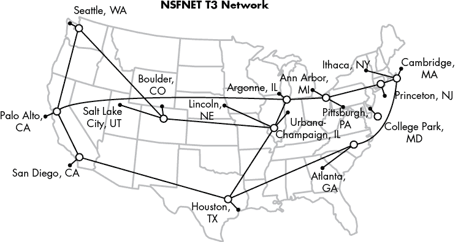
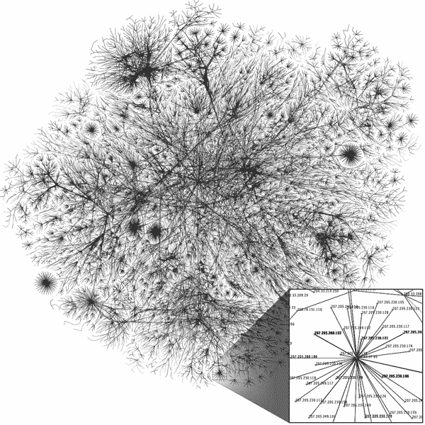
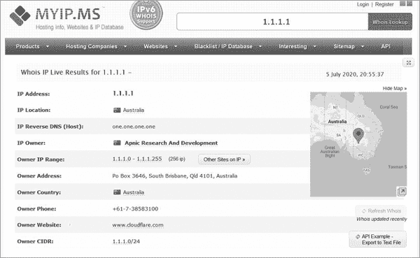
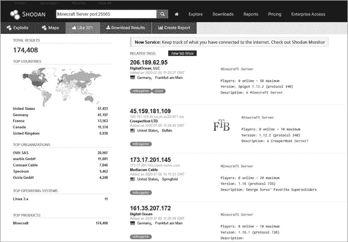
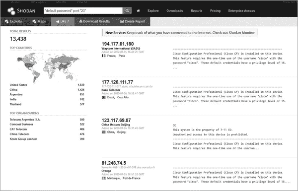

# 互联网中的攻击目标


你知道有哪些类型的黑帽攻击者，但问题依然存在：他们是如何找到你的？大多数人并不期待自己会成为攻击者的目标。你可能会想知道自己有什么东西是黑帽攻击者想要的。

你会惊讶于攻击者认为有价值的东西。确实，许多人会窃取信用卡和社会保障号码，但也有些攻击者寻找的不仅仅是个人数据。某些人可能会想要关于其他目标的信息，或者他们可能想要访问你的设备，比如计算机或路由器，以进行其他黑客攻击。他们甚至可能只是想寻找不安全的设备，纯粹是为了好玩。在这些情况下，任何连接到互联网的设备都会成为黑帽攻击者的目标。

我们每个人都有大量设备，其中一些我们可能甚至不知道，它们使用互联网并需要保护以防止黑帽攻击。在本章中，我们将简要了解互联网是如何工作的，包括技术的历史，帮助你更好地理解攻击者是如何利用它的。接下来，我会解析黑帽攻击者如何利用他们从公共资源中收集到的信息来准备攻击。最后，我将通过实施三条互联网使用的基本规则，向你解释如何躲避攻击者。

## 互联网是如何运作的

要理解黑帽攻击者如何在互联网中找到并利用你，你需要理解一些关于互联网运作的基本概念。你今天所知的互联网起源于*先进研究计划署*（*ARPA*），这是一个美国政府机构，负责研究新技术以保持对苏联的技术领先优势。

在 1960 年代，ARPA 开始研究一种工具，用于在核攻击期间保护美国的通信。由于核弹可以轻易摧毁大量基础设施，美国军方需要一个能够在部分国家遭到攻击时自动重新调整的通信网络。例如，如果华盛顿特区遭到轰炸，军方需要能够绕过经过该城市的通信线路，以便继续与国家其他地区无缝地共享信息。

解决这个问题的一种方法是*分组* *交换*的理念。其前提是将信息分成数据包，或者是自包含的单元，然后让计算机根据所提供的信息实时决定这些数据包应该发送到哪里。例如，如果计算机接收到一个目标是亚特兰大的数据包（通过附加在数据包上的地址来标识），并且知道中介的华盛顿特区通信线路已经中断，它可以自动将该数据包发送到克利夫兰，克利夫兰随后将其传递到亚特兰大。这使得即使网络的一部分被摧毁，计算机也能创建并维护一个通信网络。

ARPA 和许多其他研究人员致力于在大型网络中实现分组交换。在此之前，设备通过设置的专用电路直接进行通信。电路通常是单一的物理线路，任何线路中断都会导致整个网络瘫痪。到 1960 年代末和 1970 年代初，几个较小的网络，主要用于各大学和超级计算机站点之间的通信，开始使用分组交换，允许计算机在广阔的距离上相互通信。图 2-1 展示了作为 *NSFNET* 一部分的站点连接情况，*NSFNET* 是早期网络之一，后来发展成了互联网。这个工作一直持续到 1980 年代，当时商业桌面计算机开始更广泛地向公众提供。



图 2-1：1992 年的 NSFNET，连接美国各地的学术和其他站点（图片修改自原始图像，由 Merit Network, Inc. 创建，采用 Attribution-ShareAlike 3.0 Unported [CC BY-SA 3.0] 许可证，[`creativecommons.org/licenses/by-sa/3.0/deed.en`](https://creativecommons.org/licenses/by-sa/3.0/deed.en)）

正是在这一时期，Robert Kahn 和 Vinton Cerf 首次开发了被称为互联网协议（IP）和传输控制协议（TCP）的通信协议。

### TCP/IP：互联网的支柱

*TCP**/IP*（有时称为 *IP* *套件*）是运行现代互联网的协议集合。协议是特别的代码，定义了系统应如何理解和处理通过网络接收到的数据。例如，HTTP 协议告诉系统，发送的数据是一个网站，应该由网页浏览器处理。TCP/IP 协议告诉系统如何将流量（数据流）从一个设备传输到另一个设备，直到达到目的地。它是系统用来在分组交换网络中进行调整的信息的一部分。

IP 协议提供了一个编号，称为 IP 地址，用于标识计算机在给定网络上的位置。你可以把 IP 地址想象成你的邮政编码。邮政编码标识了一个大致的区域，邮政服务利用它来引导包裹。IP 地址有两个版本，版本 4（称为 IPv4）和版本 6（称为 IPv6）。在本章中，我只讨论 IPv4，因为它仍然是最常见的。

TCP 是一套规则，允许一个系统与另一个系统进行通信，同时确保两个系统都能在网络上访问。TCP 本质上就像打电话给朋友，确认他们在家，以便包裹寄到时可以接收。我们将在第六章中进一步讨论这两种协议。

随着 TCP/IP、分组交换技术以及家庭计算机变得更加便宜，商业公司很快对建立自己的网络产生了兴趣，以便企业和家庭能够进行通信。最终，这些网络开始互相连接，连接了越来越多的系统，直到互联网自然而然地发展成了由互联网服务提供商（ISPs）构成的网络。像 AT&T、Comcast 和 Verizon 这样的 ISP 开始提供互联网接入，并向企业以及最终的家庭销售必要的基础设施。自 1990 年代初以来，世界变得更加互联互通，计算机网络几乎覆盖了地球的每个角落。

### 公共网络与私人网络

当今的互联网由大量连接的小型网络组成。这些网络通常可以分为两种类型：公共网络和私人网络。本质上，任何人都可以使用*公共网络*，通常需要支付一定费用。例如，你家连接的网络并通过 ISP 支付使用费用的网络就是公共网络。这些网络构成了互联网的骨干，因为它们允许任何付费用户进行连接。通常，公共网络由 ISP 运营。

公共网络通常也与*私人网络*连接，私人网络仅允许有限的设备连接。例如，如果你在办公室工作，你可能可以通过桌面计算机的连接访问特定服务器上的文件。服务器和桌面计算机位于一个私人网络中，这意味着它们只允许彼此或其他位于私人网络上的设备进行通信。公共网络（互联网）上的人无法直接查看、连接或访问私人网络中的任何内容。

许多私人网络通过 ISP 提供的设备连接到公共网络，并支付费用以接入互联网。例如，你家可能有一个 Wi-Fi 网络。只有住在你家的人或你授权的访客才能使用这个 Wi-Fi 网络，这使它成为一个私人网络。然而，你的家与互联网连接，通常是通过一个叫做*调制解调器*或*路由器*的特殊设备。这些设备在你家的 Wi-Fi 网络和 ISP 的公共互联网之间传递流量。你和你邻里的其他人通过特别的 ISP 设备支付费用以访问互联网。如果你不允许别人访问，他们就无法从公共网络直接访问你的私人网络。

图 2-2 显示了带有公共和私人网络的互联网的可视化地图。

数十亿个*节点*构成了互联网。这些节点代表了 IP 地址之间的连接。图中右下角的扩展部分显示了像 8.8.8.8 这样的单个地址是如何连接到 ISP，形成更大连接，最终构成互联网的。



图 2-2：互联网地图（图像已根据 Opte 项目创建的原始图像进行修改，使用署名 2.5 通用 [CC BY 2.5] 许可证，[`creativecommons.org/licenses/by/2.5/deed.en`](https://creativecommons.org/licenses/by/2.5/deed.en)）

私有网络和公共网络通过它们使用的 IP 地址类型来区分。IPv4 地址由四个数字组成，每个数字的范围是 0 到 255，通常用句点分隔，例如：192.168.15.1 和 10.10.10.255。某些数字范围仅为私有网络保留，而其余的则供公共使用。私有地址使用某些永不改变的地址，例如 10.0.0.0 或 192.168.27.0。公共地址在你从公共网络连接到私有网络时，会被转换为私有地址，反之亦然。例如，当你连接到 google.com 时，你可能会连接到地址 8.8.8.8（一个公共地址）。一旦与 8.8.8.8 的连接建立，Google 自己的网络设备可能会将该连接转换为私有地址，例如*192.168.1.1*，以便你能够访问 Google 私人网络中的资源。这个过程被称为*网络地址转换*（*NAT**）。

### 黑帽眼中的互联网

当黑帽访问互联网时，他们通常是在尝试弄清楚如何越过公共网络，进入私人网络。这可能非常困难，因为构成今天互联网的许多系统是专门设计来阻止公共网络上的人们查看任何私人网络中的情况的。考虑 NAT 过程：连接到公共地址的用户看不到翻译过程，也看不到幕后发生的事情。当你连接到 google.com 时，你是通过网页浏览器连接的，Google 网站会出现。你并不会被告知，也通常看不到 Google 私人网络中所有的机制，这些机制使得网页能够按照预期的方式运行。

因此，当对手集中攻击一个目标时，他们的第一步通常是确定如何从网络的公共侧转移到私人侧。一旦进入私人网络，他们就可以继续寻找特定的目标，并执行攻击以获取他们想要的东西，无论是破坏正常的业务运作，还是窃取数据。为了成功执行这些操作，许多黑帽依赖于一套特定的步骤，以最大化他们攻击的潜力。

## 黑帽攻击方法

并非所有黑帽攻击都遵循特定的模式或步骤。但大多数攻击者在完全实现他们的目标之前，必须完成某些特定的目标。虽然有多个模型对这些目标进行了分类，但其中最著名的之一是*洛克希德·马丁网络攻击杀链*（*CKC**）。

CKC 包含七个步骤，黑帽攻击者必须完成这些步骤，才能使他们的攻击有效。这些步骤涉及许多网络攻击的前期、进行中和后期活动：包括*侦察*、*武器化*、*交付*、*利用*、*安装*、*指挥与控制*和*攻击目标*。让我们更详细地看一下每个步骤。

### 侦察

在 CKC 的侦察阶段，攻击者尽可能多地了解目标。他们首先收集任何被认为是公开信息的数据。在组织的情况下，这意味着来自其网站和社交媒体的数据，以及有关员工、组织结构、物理位置、合作伙伴关系、近期新闻、组织拥有的公共 IP 地址等信息。对于个人，这可能包括关于家庭成员、工作地点、居住地、犯罪记录和其他政府记录的信息，当然，还有社交媒体上的内容。

这些对手还会寻找一些不那么公开的信息，尽管这些信息仍然可以通过互联网找到，只要你知道在哪里找。这包括虽然所有人都能访问的、但并非公开消费的网站，比如员工的远程登录页面。或者它可能包括收集到的有关公共 IP 地址的细节，比如它正在运行的服务。黑帽攻击者还可能通过挖掘社交媒体或其他互联网资源，开始列出相关的电子邮件地址，供以后使用。

攻击者可以通过嗅探和扫描来寻找信息。*嗅探*是截取并分析其他用户的网络流量。黑帽攻击者可以在不干扰流量的情况下进行嗅探，因此用户不会意识到他们的流量正在被监控。例如，攻击者可能会查看来自邮件服务器的所有数据，并在将原始邮件发送到目的地之前复制任何附件。*扫描*是向设备发送特殊构造的数据包，并监听设备如何回应这些数据包。这些响应可以向黑帽攻击者提供有关节点运行的系统或软件类型的信息。例如，如果攻击者想知道主机是否运行的是 Windows 操作系统，他们可以发送专为 Windows 系统设计的数据包。如果系统回应错误，他们就知道这不是 Windows 系统。我们将在第六章《攻击你的网络》中详细讨论扫描和嗅探；这两者都可以成为对手信息来源的丰厚宝库。

所有这些侦察工作提供的信息帮助黑客缩小他们的关注范围，直到他们知道从哪里开始他们的初步攻击。它还提供了宝贵的信息，供他们在下一阶段利用来制定可能成功的攻击。例如，如果攻击者扫描一个公共 IP 地址并发现它连接到一个 Windows 服务器，他们就不会浪费时间去利用 Apple 的漏洞。这正是侦察工作成为成功攻击关键部分的原因。

### 武器化

在下一步的武器化阶段，黑客创建实际的攻击工具来针对目标进行攻击。通过侦察阶段收集到的信息，他们计划并创建所需的工具。这个阶段还要求对手清楚地知道什么方法能够最迅速地达到他们的任务目标。例如，如果攻击者的目标是收集更多关于目标的个人信息并用来勒索他们，他们可能会尝试利用目标的电子邮件。尽管创建一个破坏 Word 文档的病毒是一个有效的攻击手段，但这并不是实现该目标的最佳方式。相反，创建一个链接到虚假电子邮件登录页面的 PDF 文件，并尝试欺骗受害者使用它，才是更好的选择。这样，攻击者可能能够从虚假页面收集受害者的凭证，并用它们登录合法账户。

### 传递

一旦黑客拥有了武器化的工具包，无论是恶意软件、网络钓鱼网站（我们将在第三章详细讨论）还是其他形式的攻击，他们就准备好进行攻击了。同样，这要求使用侦察阶段收集到的信息来决定最佳的传递方式。许多近期的攻击通过电子邮件进行，但这并不总是最好的方式。

如果攻击者知道目标使用的设备存在已知漏洞，他们可能会制定一种利用该漏洞的传递方式。例如，如果一个公司网站使用了包含漏洞的可填写表单，对手可能会通过该漏洞直接将代码注入到网站服务器。这将使他们能够直接向服务器传递攻击，而不必依赖员工为他们安装攻击。

### 利用与安装

接下来的两步——利用和安装——依赖于一旦传递完成，如何将漏洞利用安装到目标设备。这意味着要让某个人点击恶意链接或启动在传递阶段创建的恶意软件。一旦利用完成，黑客应该能够执行他们的攻击或在设备上安装恶意软件。

请记住，攻击者想要获取的许多物品，比如信用卡号码或其他个人信息，通常存储在私人网络中，这些信息对公众是不可访问的。这意味着攻击者必须先攻破私人网络，才能完全访问其中的内容。

这种妥协通常涉及对手建立*后门*。考虑这个类比：如果前门是人们进入房屋的正常途径，那么使用后门（或车库门）就是绕过控制手段（例如门上的锁）的方式。黑帽的后门也以类似的方式工作，允许对手在不通过正常、可信的身份验证手段的情况下访问系统。

### 指挥与控制，以及对目标的攻击

在指挥与控制和攻击目标阶段，黑帽利用后门在系统中建立立足点。然后，他们可以利用这个立足点作为基地，进一步识别可以利用的系统。这被称为*横向渗透*。攻击者会继续进行横向渗透，直到能够直接到达他们的目标（如第一章所讨论，目标会根据攻击者类型而有所不同）。一旦他们找到通向目标的路径，攻击者将发动一整套攻击来获得访问权限并完成他们的任务。

指挥与控制阶段涉及创建一个指挥与控制服务器，这是一个允许攻击者从远程位置向受害设备发送命令并接收信息的工具。例如，如果黑帽攻破了一个网页服务器，他们可能指示该服务器联系网络上的其他设备，寻找他们可以进一步攻破的系统。通常，这些命令会使用正常的流量模式来隐藏，以便白帽更难在为时已晚之前检测到它们。

对目标的攻击通常以类似的隐秘方式进行，以确保黑帽不会被阻止获取他们想要的东西，而且组织无法减轻损害。如果攻击者盗取了一些信用卡号码，只有在银行不知道这些号码被盗的情况下，它们才有用，届时银行会在它们被出售或使用之前取消这些卡片。完成最后阶段后，黑帽会出售他们的战利品，接着进入下一个目标，再次从侦察阶段开始。

## 黑帽如何找到你

如果你仔细观察黑帽攻击的各个阶段，你会注意到最重要的步骤之一是第一步：侦察。如果对手无法找到任何有用的信息关于他们的目标，他们将很难发动有效的攻击。当然，这也使得在私有网络中站稳脚跟变得更加困难。

那么，黑帽攻击者从哪里找到他们的侦察信息呢？他们大多数从公开可用的资源中获取这些信息，而这些资源通常是人们在不自觉中创建的，暴露了他们并未意识到的信息。许多时候，配置错误的系统会在互联网上公开通信，暴露出组织可能不希望对外公开的服务。你可以通过使用*Shodan*来看到许多这样的开放系统，Shodan 是一个扫描互联网开放服务和系统的工具。扫描之后，Shodan 将其发现结果放入一个易于使用的数据库中，供公众搜索。通过使用 Shodan，你可以找到各种关于从互联网公开可访问设备的详细信息。我们将在本章末的练习中演示如何使用该工具。

使用 Shodan 并不是唯一能在网上找到有用信息的方式。互联网上有大量数据可能帮助黑帽攻击者设计攻击。让我们看几个场景，帮助你理解敌人是如何收集这类信息的。

### 示例 1：并购

假设一个攻击者得知 Sparkle Kitten Inc.正在收购 Smelly Puppy Co.并将其直接并入 Sparkle Kitten。通过阅读新闻，黑帽攻击者了解到 Smelly Puppy 的首席执行官对这次并购感到不满。攻击者决定在这个压力巨大的时刻针对 Smelly Puppy。他们从扫描 Smelly Puppy 的官网开始，寻找任何列出的电子邮件地址。通过使用自动化工具遍历所有可用的网页，包括那些可能无法通过 Google 搜索到的网页，他们找到了一个需要了解特定类型 Web 服务器的管理员职位招聘广告。

通过使用公开的注册信息，黑帽攻击者可以精确地找到该公司购买并注册使用的 IP 地址。接着，攻击者使用扫描工具针对这些地址，寻找特定的 Web 服务器。他们找到了服务器，而且发现它对发送到它的流量有响应。现在他们可以利用已知漏洞来精心设计有效的攻击并获取服务器访问权限。

### 示例 2：社交媒体狩猎

一个黑帽攻击者想要攻击 Secure Co.，世界上最安全的公司之一（正如它的名字所示）。攻击者知道 Secure Co.使用最新的设备、培训和最佳实践来保持安全，因为 Secure Co.经常宣传这些信息。黑帽攻击者还意识到该组织使用了一个特定的营销公司——Super Awesome Marketing，来处理所有广告事务。敌人决定不直接攻击 Secure Co.，而是攻击 Super Awesome Marketing。

为了做到这一点，攻击者会浏览 LinkedIn 和 Facebook，寻找在 Super Awesome Marketing 工作的员工。他们找到了一个在 IT 部门工作的特定员工，并开始在 Twitter 上追踪他们。每天早晨，这名员工都会在同一个健身房拍照。黑帽黑客还注意到他们在帖子中留下了地理位置标签。通过这些标签，黑帽黑客找到了员工使用的健身房。攻击者某天早晨到达那家健身房，倾听员工的对话，得知了关于 Super Awesome Marketing 邮件服务器的一个特定漏洞。对手利用这个漏洞访问邮件服务器，并接管了某名员工的邮件账户。现在，黑帽黑客可以通过该账户感染 Super Awesome Marketing 为 Secure Co. 创建的营销材料。因为这些材料来自一个受信任的供应商，它能顺利通过正常的安全检查，悄悄地在 Secure Co. 的私人网络中设置后门。现在安全性不再那么强了，是吧？

## 如何从黑帽黑客中隐藏自己

前面关于对手如何收集信息的示例可能看起来有些牵强，但它们描述的是黑帽黑客使用的真实技巧。当人们公开发布信息时，攻击者可以利用这些信息找到他们安全系统中的漏洞，从而能够精心策划针对个人或组织的完美攻击。防御这些攻击的最佳方法是实施*操作安全*（*OPSEC**）。

OPSEC 是理解并最小化任何可能被用来对付你的信息的过程。这个技巧起源于军事领域，当时军方担心通过泄露看似不重要的信息，会让敌人猜到即将发动的攻击。例如，如果军方将一支部队转移到一个新基地，敌方可以通过与其他信息进行关联推测出军方可能正在计划对某个国家发动攻击，尤其是该国家距离新基地较近。

对于民间组织来说，OPSEC 是保护黑帽黑客可能用来攻击组织的信息。这意味着限制你在公共网站、新闻稿或社交媒体上分享的信息。OPSEC 很难做到完美，因为很难知道攻击者可能在特定的情况下发现什么信息有用。确保 OPSEC 的最佳方法是，在发布信息时记住关于互联网的三条规则：互联网是开放的、公开的，并且是永远存在的。

### 互联网是开放的

当你使用互联网时，假设任何人都能看到你正在做什么或分享的内容，包括任何通过网络传输的数据。保护这些信息是你的责任，你需要决定如何发送这些信息。

一个很好的例子是请求网页的能力。当您访问一个网页时，您的浏览器需要弄清楚该页面在互联网上的位置。它通过查询一个*域名服务*（*DNS*）服务器来做到这一点，该服务器包含网站分配的公共 IP 地址的记录。例如，DNS 服务器可能会告诉您，域名 sparklekitten.net 的 IP 地址是 1.1.1.1。当您告诉浏览器访问 sparklekitten.net 时，它会发送出一个请求，最终到达 DNS 服务器，服务器提供该网站所在的 IP 地址记录，这样您的浏览器就能访问该网站。

通常，DNS 请求会经过一系列的 DNS 服务器，直到找到正确的服务器。您的浏览器首先向由 ISP 托管的服务器发送请求，该服务器再将请求转发给另一个 DNS 服务器，接着又转发给另一个，直到找到拥有正确记录的 Sparkle Kitten DNS 服务器。直到最近，浏览器几乎完全以未加密的方式发送这些请求，这意味着这些请求处于明文状态，任何人都可以看到。因此，不仅您的 ISP 可以看到您请求的每一个网页——它们非常乐意将这些信息出售给营销公司——而且任何能够嗅探您流量的人也能看到您的 DNS 请求。即使您正在使用私人浏览器或访问加密链接的网站，该 DNS 请求仍然使用未加密的协议，因此任何人都能知道您试图访问哪个网站。

幸运的是，许多浏览器现在已经开始支持通过加密链接发送的 DNS 请求。不过，这仍然是一个典型的例子，展示了互联网是如何开放的。无论您是在浏览网页、发送邮件，还是下载文件，您都在传递信息，这些信息会被编目、存储，并且通常会被出售。这些信息可以很容易地被利用，用来了解您或您的组织，从而策划出完美的攻击。因此，意识到您在互联网上传递的是什么信息是非常重要的。虽然您不需要完全切断与世界的联系，生活在洞穴里，但最好确保您加密任何敏感信息，尤其是当您通过电子邮件、文件共享或社交媒体发送时。通常，研究您使用的服务及其可能在后台收集的数据是个好主意。尽管采取这些步骤可能需要额外的时间和精力，但它们提供的额外安全性和内心的平静是完全值得的。

### 互联网是公开的

互联网是完全公开的；只要拥有正确的连接设置或支付给像 ISP 这样的公司使用其设备，任何人都可以上网。从很多方面来看，访问并不与特定的人挂钩。通过使用用户名或隐藏您的 IP 地址（稍后会详细介绍），您可以在互联网上隐藏自己的身份，这既是合法的，也是最好的做法。这不仅适用于视频游戏或社交媒体网站上的用户名，也适用于您的 IP 地址和您在世界上的实际位置。

跟踪 IP 地址位置的一种方法是使用*Whois*查询来查找注册信息。Whois 是一个网站注册信息数据库。多个网站提供 Whois 信息，包括 Myip.ms，如图 2-3 所示，展示了 IP 地址 1.1.1.1 的 Whois 记录。



图 2-3：1.1.1.1 Whois 记录

尽管公共 IP 地址与全球特定地区相关联，但很难信任使用该 IP 地址的人确实位于该地点。就像你可以将公共 IP 地址转换为私有 IP 地址一样，你也可以将公共 IP 地址转换为另一个地址。这使得追踪流量的实际来源变得困难，从而使黑客能够轻松地在明处隐藏自己。

这也意味着其他国家的人、你的老师、你的祖母，甚至你的邮递员都可以访问你在互联网上发布的内容。更重要的是，如果你将某些内容发布到互联网上并设为公开，可能很难阻止别人看到它。即使你认为你只是与朋友分享，还是有可能你的朋友将其分享给了公众。当你在互联网上发布任何信息时，最好的规则是假设每个人都能看到它，因此要以这种假设为基础来表达自己的想法。如果你认为某条发布可能会伤害到你，或者提供别人可以用来对付你的信息，最好不要发布它。

### 互联网是永恒的

几乎不可能从互联网上删除信息。例如，当你删除一封电子邮件时，它真的被删除了吗？如果你使用像 Gmail 这样的服务，删除的邮件会进入垃圾箱，保留 30 天后才会被彻底删除。因此，你删除的邮件并没有真正删除，它只是被放到了一个不同的地方，黑客仍然可以访问。

在社交媒体的情况下，情况甚至更糟。像 Facebook 和 Google 这样的公司通过人们在平台上创建的数据赚取大量利润，因此它们有利益保持这些数据尽可能长时间。Facebook 和 Twitter 会保存多年发布的内容。即使你从平台上删除了自己，曾在群组中发布的帖子仍然会公开可见。试着搜索你的全名和所在州，可能会惊讶地发现你的帖子出现在搜索结果中。

此外，许多人记录在线活动，以保留互联网变化的历史。一项主要从事此项工作的项目是互联网档案馆，网址为[`archive.org/`](https://archive.org/)。互联网档案馆试图对每个创建的网页进行目录编制，因此即使你已删除或编辑了网页，仍有可能存在它们的记录，供他人查找。

正如假设每个人都能看到你发布到互联网上的内容一样，假设你的互联网帖子将永远存在也是同样重要的。同样，这并不意味着你应该完全放弃使用互联网。只是要注意自己在线时的行为。

理解互联网的三条规则将帮助你练习 OPSEC（操作安全），如果有一天你为一个需要防止敏感信息泄露的组织工作。通过注意自己发布个人信息的方式，你将能够识别出黑帽攻击者可能利用的信息来攻击你的组织。你还可以向你组织中的其他人，特别是新员工，教授如何限制他们向公众分享信息的重要性。这种行为会让你的组织整体上更加安全。毕竟，攻击者知道的信息越少，他们攻击的难度就越大。

## 练习：分析你的网络

正如你在本章中学到的，理解你发布到互联网的信息非常重要。否则，攻击者可能会利用你无意中暴露的帖子来访问你的账户或私人网络。正如前面提到的，你可以使用 Shodan 来查找这些信息，Shodan 就像是一个 IP 地址的搜索引擎，正如你记得的那样。

尽管你可以在网页浏览器中使用 Shodan，但其他一些有用的工具需要*命令行*，它允许你在系统中输入命令以执行任务。在这个练习中，你将学习如何使用一些简单的命令来发现关于你网络的信息。然后，你将利用这些信息去搜索 Shodan，看看你在互联网上留下了哪些开放的服务。

### 网络命令行工具

Windows 和 macOS 操作系统都自带了一些工具，帮助你了解你的网络。让我们看看其中四个特别有用的工具，它们能够帮助你找到信息，而这些信息在使用 Shodan 进行搜索时会很有用。在开始使用命令之前，你需要访问系统上的命令行。Windows 和 macOS 有不同的命令行程序；每个程序使用的命令版本略有不同，输出的结果也不同。让我们分别看看它们。

#### Windows

定位到屏幕左下角的搜索栏，输入**CMD**。在搜索结果的顶部，你应该能看到一个名为*命令提示符*的应用。选择它，像图 2-4 中那样的窗口应该会出现在你的屏幕上。如果你不是以管理员身份运行，C:后面的文字将是你的主目录，并包含你当前的用户名。


图 2-4：命令提示符窗口

首先，我们将使用`ipconfig`命令。这个命令会输出您当前的网络配置，包括计算机分配的 IP 地址、默认网关以及 DNS 服务器信息。默认网关是计算机连接的第一个路由器，用于将流量传出您的网络。路由器将流量从一个设备传递到另一个设备，以连接两个端点。路由器创建了一个单一的网络，设备可以加入其中。因此，默认网关地址是您的计算机需要知道的，用来将流量发送到控制进出您网络流量的路由器。当您在命令提示符窗口输入`ipconfig`时，您应该看到类似以下的输出：

```
C:\Windows\System32> **ipconfig**
Wireless LAN adapter Local Area Connection* 1: Media State . . . . . . . . . . . : Media disconnected Connection-specific DNS Suffix  . :
Wireless LAN adapter Local Area Connection* 10: Media State . . . . . . . . . . . : Media disconnected Connection-specific DNS Suffix  . :
Wireless LAN adapter Wi-Fi: Connection-specific DNS Suffix  . : lan Link-local IPv6 Address . . . . . : fe80::4d78:5074:4095:fe97%18 IPv4 Address. . . . . . . . . . . : 192.168.86.36 Subnet Mask . . . . . . . . . . . : 255.255.255.0 Default Gateway . . . . . . . . . : 192.168.86.1Ethernet adapter Bluetooth Network Connection: Media State . . . . . . . . . . . : Media disconnected Connection-specific DNS Suffix  . :
```

注意在`Wireless Lan adapter Wi-Fi`下方标记为`IPv4` `Address`的部分。这是您计算机的私有 IP 地址。从这个输出中，您可以看到该系统被分配了一个私有 IP 地址。同时注意`IPv4 Address`部分下方两行的`Default Gateway`部分。这标识了系统将其流量发送到的路由器，以便离开私有网络。在家庭网络中，这通常是 ISP 提供的调制解调器或路由器。默认网关也有一个私有 IP 地址。

尽管`ipconfig`能为您提供有关计算机在本地网络中使用的地址的有用信息，但它并不适用于 Shodan 的使用，因为您需要查找的是公共 IP 地址，而不是私有 IP 地址。您可以使用在线工具来发现公共 IP 地址，但我们将使用`nslookup`命令，因为它是另一个通常可用的命令行工具。这个工具可以查找分配给网站域名的 IP 地址。要使用它，您需要一个目标。为了本次练习，让我们使用 google.com。在命令提示符窗口中输入`nslookup`命令，然后跟上`google.com`：

```
C:\Windows\System32> **nslookup** **google.com**
Server:  testwifi.here
Address:  192.168.86.1
Non-authoritative answer:
Name:    google.com
Addresses:  2607:f8b0:4002:c09::8b 2607:f8b0:4002:c09::65 172.217.9.14
```

来自`nslookup`的输出显示了当前附加在 google.com 上的公共 IP 地址。这个工具在您试图确定与网站关联的 IP 地址时非常有用，可以帮助您了解网络中可疑流量的来源。根据您的地理位置和 Google 使用的当前配置，您的输出可能会有所不同。

现在，您有了一个公共 IP 地址，您可以使用另一个工具，叫做`ping`。这个工具会向一个 IP 地址发送一个小的数据包，然后监听该目的地是否会回应自己的数据包。这告诉您是否能与该系统进行通信，因为如果系统无法接收到 ping 请求，它就无法回应。您可以尝试对通过`nslookup`发现的公共 IP 地址使用`ping`。只需输入`ping`，然后跟上您想要目标的 IP 地址：

```
C:\Windows\System32> **ping** **172.217.9.14**
Pinging 172.217.9.14 with 32 bytes of data:
Reply from 172.217.9.14: bytes=32 time=14ms TTL=116Reply from 172.217.9.14: bytes=32 time=14ms TTL=116
Reply from 172.217.9.14: bytes=32 time=14ms TTL=116
Reply from 172.217.9.14: bytes=32 time=15ms TTL=116
Ping statistics for 172.217.9.14: Packets: Sent = 4, Received = 4, Lost = 0 (0% loss),
Approximate round trip times in milli-seconds: Minimum = 14ms, Maximum = 15ms, Average = 14ms
```

如你所见，`ping` 发送了四个数据包。每个数据包会记录发送和返回到原点的速度。这个速度非常快，以毫秒为单位记录。在这个例子中，每个数据包大约用了 14 毫秒。在命令结束时，系统会提供一个关于发送和接收的数据包的总结。如果你无法访问某个系统，`ping` 会显示数据包丢失。

让我们使用最后一个工具，它将为你提供所有搜索 Shodan 所需的信息。你知道通过`ping`命令可以找到 Google 的 IP 地址，但它并没有告诉你*数据包*是如何到达 Google 系统的。要了解这一点，你可以使用 `tracert` 工具，它将数据包发送到你电脑和你希望流量到达的目的地之间的每个路由器。这些数据包提供了关于你流量到达目的地的各个停靠点（或跳数）信息，使用的功能叫做 *生存时间*（*TTL*）。本质上，每个数据包被设计成只能进行一定次数的跳跃，这个次数由其 TTL 值决定。当数据包通过一个路由器时，就算一次跳跃。每次路由器传递数据包时，TTL 值会减少 1。当 TTL 值降到 0 时，数据包会返回关于最后一个接收数据包的路由器的信息。数据包*死亡*，因此最后接收到它的路由器会向数据包的下一个亲属发送信息，或者在这种情况下，向最初发送数据包的设备发送消息。`tracert` 工具会总结所有这些跳跃。在命令提示符窗口中输入 `tracert`，并添加目标 IP 地址：

```
C:\Windows\System32> **tracert** **172.217.9.14**
Tracing route to dfw28s02-in-f14.1e100.net [172.217.9.14]
over a maximum of 30 hops: 1     2 ms     2 ms     2 ms  testwifi.here [192.168.86.1] 2     3 ms     3 ms     3 ms  Address Removed by Author 3    12 ms    14 ms    17 ms  Address Removed by Author 4    10 ms     5 ms     5 ms  71.154.103.34 5    29 ms    23 ms    15 ms  cr2.dlstx.ip.att.net [12.122.138.122] 6    17 ms    14 ms    14 ms  12.123.240.25 7    23 ms    22 ms    13 ms  12.255.10.100 8    23 ms    23 ms    22 ms  209.85.243.95 9    17 ms    22 ms    14 ms  108.170.231.69 10    19 ms    22 ms    15 ms  dfw28s02-in-f14.1e100.net [172.217.9.14]
Trace complete.
```

输出显示，第一次跳跃是到你的默认网关（换句话说，就是你的路由器）。从那里开始，再经过九次跳跃，数据包才能到达目的地。每个跳跃都代表一个路由器，无论是在本地网络还是互联网中。每个跳跃都会发送三个数据包，以显示到达该点所花费的平均时间。

使用这个工具是确定你的网络或互联网中哪些部分可能遇到问题的理想方法。它还能帮助你了解你的 ISP 分配给你电脑的公共 IP 地址；这是你首先看到的公共地址，因为你的流量必须先经过这个跳跃才能访问互联网。在之前的 `tracert` 输出中，我省略了第二个和第三个结果，因为它们直接连接到我的家庭网络。但在正常的 `tracert` 执行中，你将能够看到这些地址。

#### macOS

在 macOS 上，打开终端应用程序以访问命令行。为此，请使用屏幕右上角的搜索栏，输入 **Terminal**，然后点击出现的应用程序。现在你可以学习一些有用的命令，帮助你找到有关网络的信息。

在 macOS 上，你可以使用与 Windows 10 命令非常相似的命令，尽管有些命令需要稍作调整。例如，在 macOS 上，你将使用 `ifconfig` 命令，而不是 `ipconfig`。`ifconfig` 命令提供与 `ipconfig` 相同的信息，但更为详细，正如你在以下输出中所看到的：  

```
$**ifconfig** lo0: flags=8049<UP,LOOPBACK,RUNNING,MULTICAST> mtu 16384
options=1203<RXCSUM,TXCSUM,TXSTATUS,SW_TIMESTAMP>
inet 127.0.0.1 netmask 0xff000000 
inet6 ::1 prefixlen 128 
inet6 fe80::1%lo0 prefixlen 64 scopeid 0x1 
nd6 options=201<PERFORMNUD,DAD>
gif0: flags=8010<POINTOPOINT,MULTICAST> mtu 1280
stf0: flags=0<> mtu 1280
XHC20: flags=0<> mtu 0
en0: flags=8863<UP,BROADCAST,SMART,RUNNING,SIMPLEX,MULTICAST> mtu 1500
ether b8:e8:56:16:38:10 
inet6 fe80::8ec:dd2e:36cc:b962%en0 prefixlen 64 secured scopeid 0x5 
inet 192.168.86.93 netmask 0xffffff00 broadcast 192.168.86.255
nd6 options=201<PERFORMNUD,DAD>
media: autoselect
status: active
p2p0: flags=8843<UP,BROADCAST,RUNNING,SIMPLEX,MULTICAST> mtu 2304
ether 0a:e8:56:16:38:10 
media: autoselect
status: inactive
awdl0: flags=8943<UP,BROADCAST,RUNNING,PROMISC,SIMPLEX,MULTICAST> mtu 1484
ether ee:57:a6:16:74:96 
inet6 fe80::ec57:a6ff:fe16:7496%awdl0 prefixlen 64 scopeid 0x7 
nd6 options=201<PERFORMNUD,DAD>
media: autoselect
status: active
en1: flags=8963<UP,BROADCAST,SMART,RUNNING,PROMISC,SIMPLEX,MULTICAST> mtu 1500options=60<TSO4,TSO6>
ether 32:00:1e:74:20:00 
media: autoselect <full-duplex>
status: inactive
bridge0: flags=8863<UP,BROADCAST,SMART,RUNNING,SIMPLEX,MULTICAST> mtu 1500
options=63<RXCSUM,TXCSUM,TSO4,TSO6>
ether 32:00:1e:74:20:00 
Configuration:
id 0:0:0:0:0:0 priority 0 hellotime 0 fwddelay 0
maxage 0 holdcnt 0 proto stp maxaddr 100 timeout 1200
root id 0:0:0:0:0:0 priority 0 ifcost 0 port 0
ipfilter disabled flags 0x2
member: en1 flags=3<LEARNING,DISCOVER> ifmaxaddr 0 port 8 priority 0 path cost 0
nd6 options=201<PERFORMNUD,DAD>
media: <unknown type>
status: inactive
utun0: flags=8051<UP,POINTOPOINT,RUNNING,MULTICAST> mtu 2000
inet6 fe80::b740:b05f:b952:2490%utun0 prefixlen 64 scopeid 0xa 
nd6 options=201<PERFORMNUD,DAD>
utun1: flags=8051<UP,POINTOPOINT,RUNNING,MULTICAST> mtu 1380
inet6 fe80::508:28d2:8ad8:65a5%utun1 prefixlen 64 scopeid 0xb 
nd6 options=201<PERFORMNUD,DAD>
utun2: flags=8051<UP,POINTOPOINT,RUNNING,MULTICAST> mtu 1380
inet6 fe80::e0b5:18ed:6a4c:a999%utun2 prefixlen 64 scopeid 0xc 
nd6 options=201<PERFORMNUD,DAD>
```

`ifconfig` 命令返回大量信息。在这些输出中，可能很难找到你的设备的 IP 地址。查找 `en0`（以太网 0），它通常表示你的主要网络适配器。默认情况下，主网络适配器会分配你的 IP 地址。  

macOS 上的 `traceroute` 命令类似于 Windows 上的 `tracert` 命令。它遵循相同的语法，输入命令后加上你要追踪的目标：

```
$ **traceroute** **31.13.93.35**
traceroute to 31.13.93.35 (31.13.93.35), 64 hops max, 52 byte packets 1  testwifi.here (192.168.86.1)  2.753 ms  2.391 ms  1.938 ms 2   REDACTED 2.349 ms  2.619 ms  2.141 ms 3  REDACTED 13.995 ms  4.940 ms  4.207 ms 4  71.154.103.34 (71.154.103.34)  5.964 ms * * 5  cr2.dlstx.ip.att.net (12.122.138.122)  16.537 ms  17.924 ms  20.084 ms 6  dlstx410me9.ip.att.net (12.123.18.177)  14.537 ms  15.603 ms  14.522 ms 7  12.245.171.14 (12.245.171.14)  15.592 ms  17.718 ms  31.346 ms 8  po104.psw04.dfw5.tfbnw.net (157.240.49.143)  14.118 ms  13.705 ms po104.psw02.dfw5.tfbnw.net (157.240.41.125)  23.049 ms 9  157.240.36.39 (157.240.36.39)  18.651 ms 157.240.36.135 (157.240.36.135)  17.058 ms 157.240.36.37 (157.240.36.37)  18.979 ms
10  edge-star-mini-shv-02-dfw5.facebook.com (31.13.93.35)  14.644 ms  20.972 ms  20.617 ms
```

`nslookup` 和 `ping` 命令在 macOS 和 Windows 上几乎相同。一个主要区别是，在 macOS 上，`ping` 默认不会仅执行四次 ping，而是会持续 ping 一个系统，直到用户手动停止命令。如果你正在更改系统配置并希望确保你所做的任何操作没有阻碍网络访问，这种行为会非常有用。但在大多数情况下，你可能希望将 ping 的次数限制为四次或五次，以避免一次发送过多的 ping。你可以使用 `-c` 参数设置发送的 ping 次数，`-c` 是 count（计数）的缩写：  

```
$ **ping** **-c 4 192.168.86.1**
PING 192.168.86.1 (192.168.86.1): 56 data bytes
64 bytes from 192.168.86.1: icmp_seq=0 ttl=64 time=1.891 ms
64 bytes from 192.168.86.1: icmp_seq=1 ttl=64 time=2.907 ms
64 bytes from 192.168.86.1: icmp_seq=2 ttl=64 time=5.073 ms
64 bytes from 192.168.86.1: icmp_seq=3 ttl=64 time=9.108 ms
--- 192.168.86.1 ping statistics ---
4 packets transmitted, 4 packets received, 0.0% packet loss
round-trip min/avg/max/stddev = 1.891/4.745/9.108/2.769 ms
```

### 使用 Shodan  

Shodan 提供两种形式：一个你可以安装的命令行工具和一个你可以浏览的网站。本章只讨论网站版。你可以访问 Shodan 网站 [`www.shodan.io/`](https://www.shodan.io/)。在网站上，你需要注册一个免费账户。免费账户允许你使用大部分工具功能，包括搜索其数据库，但限制了你从网站下载报告和其他信息的数量。图 2-5 展示了首页。  

一旦你拥有一个免费账户，浏览网站以熟悉其布局。首先点击 **Explore** 标签，它位于页面顶部、搜索框的右侧。这个页面提供了 Shodan 数据库中各种 IP 地址的分类和这些地址上暴露的服务。  

  

图 2-5：Shodan 的首页  

在左侧，你应该能看到几个有趣的类别。点击标记为 **Video Games** 的类别。你会看到一列各种在线游戏的列表，包括 *Counter Strike*、*Starbound* 和 *Minecraft*。如果点击 Minecraft，你将看到 Shodan 当前定位到的所有开放的 *Minecraft* 服务器。图 2-6 展示了该列表的一个示例。  

  

图 2-6：Shodan 定位到的 *Minecraft* 服务器  

Shodan 还可以提供更为严重的信息，例如攻击者可以用来利用系统的信息。返回到 Explore 页面，这次不要选择“Video Games”，而是点击**Default Password**，它位于页面中部，灰色框内。Shodan 验证过的使用默认密码进行身份验证的系统列表将会显示出来，如图 2-7 所示。


图 2-7：使用默认密码的系统列表

使用默认密码是邀请黑帽攻击者进入你系统的好方法。Shodan 允许你检查你正在使用的任何 IP 地址是否有默认凭据。它还可以告诉你哪些服务暴露在互联网上。例如，在左侧，你会看到一个名为“Top Services”的列表。点击**Telnet**，以查看允许 Telnet 连接的系统列表，如图 2-8 所示。



图 2-8：Telnet 开放的系统

Telnet 允许你远程连接到一个系统，并像管理员一样发送命令。它本质上让你控制系统。哦，顺便提一下，所有的 Telnet 流量都是以未加密的形式发送的，这使得它相当危险。但正如你所见，许多设备都允许 Telnet 连接。点击列表中的 IP 地址，查看这些设备的位置以及其他相关信息。图 2-9 展示了一个在中国的系统，Telnet 开放。


图 2-9：Shodan 上关于中国某系统的 IP 记录

现在开始有点偏执了吗？Shodan 为你提供了大量关于公众可以在互联网上看到的网络信息。你还可以用它来搜索特定的地址。在搜索栏中，尝试输入你在`tracert`试验中发现的中介地址，看看结果是什么。你可能不喜欢这些结果，但至少现在你知道你的网络将什么暴露给黑帽攻击者了。

隐藏攻击者的关键是首先了解他们可以看到什么。在这个练习中，使用命令行工具和 Shodan，你可以收集到这些数据。如果你发现你的某个设备在 Shodan 上暴露了，你可以采取一些步骤来关闭暴露。首先，你需要识别出哪个设备被暴露了。Shodan 提供了关于连接的更多细节，这些细节对完成这一任务很有帮助。其次，你需要控制暴露。这里有几个选项。你可以完全将设备从网络中移除，尽管这通常不可行，因为设备可能无法继续正常工作。你还可以查找制造商，看看是否有关于如何保护设备的建议。如果这些方法不起作用，像 Reddit 和 Spiceworks 这样的论坛通常会提供关于如何保护家庭网络的建议。一旦你知道哪个设备是开放的，关闭它就容易多了。

## 结论

互联网是由设备和连接构成的复杂结构，跨越全球。虽然这可能很难想象，但你不需要理解互联网的每一个方面就能安全地使用它。通过了解黑客如何找到目标，以及他们如何针对这些目标发动攻击，你可以在使用互联网时更好地保护自己的系统。第一步是知道你正在公开哪些信息。一旦了解了暴露给攻击者的信息，你就可以更好地部署自己的防御措施。
