# 第三章：钓鱼策略

尽管看起来并非如此，但人类在某些行为上是相当可预测的。黑帽黑客知道这一点，并利用它来对自己有利，采用一种叫做*社交工程*的技巧，诱使受害者做出他们平时不会做的事情或泄露一些隐藏的信息。

攻击者通过社交工程技巧来欺骗你，从而获得系统或数据的访问权限。在本章中，我们将讨论攻击者用来获取情报的一些社交工程技巧，包括网络钓鱼、URL 劫持，甚至是恶作剧。到本章结束时，你将能很好地识别假消息和伪造网站，帮助你避免任何试图窃取个人信息的对手。

## 什么是网络钓鱼？

*网络钓鱼*是最常见的社交工程攻击类型之一。这是通过电子邮件等方式欺骗受害者透露关键信息的尝试。你很可能见过一些邮件，内容是承诺向你发送一百万美元，或者承诺如果你点击某个链接就能获得一个酷炫的奖品。你可能会因为其中可笑的语法或荒谬的前提而按下 DELETE 键。这些就是典型的钓鱼攻击例子。

黑帽黑客会试图伪装成合法的个人或组织，提供某种奖励或制造只有你能解决的危机。例如，他们可能会假装是来自你银行的人，并告诉你：“你需要在账户被锁定之前，回复你的账户详细信息。”通过增加紧迫感和威胁，他们希望你足够害怕，做出他们想要的行为，而不会怀疑他们的策略。

这些尝试通常会寻求一些细节信息，如个人身份信息（PII）、信用卡号码或重要在线账户的密码，如银行账户或电子邮件账户。有时，它们会直接在邮件中要求你提供这些信息。通常，它们会要求你点击一个链接，进入一个模仿真实网站的恶意网站，任何你在该网站输入的信息（如密码和用户名）都会被窃取并记录。这是一种钓鱼攻击的轻微变种，称为*网络劫持*。我们将在“黑帽如何通过 URL 欺骗你”一节中进一步讨论这一点。

### 一个明显的钓鱼攻击

有时，钓鱼邮件很容易识别，并且会被你的邮箱的垃圾邮件设置自动过滤掉。让我们来看一个你可能在任何一天的垃圾邮件文件夹中发现的典型钓鱼邮件的例子：

> 亲爱的人类 Greg，
> 
> 我们注意到你的信用卡在我们的数据库中没有更新。我们有一个新系统，要求你重新输入你的信息。你看，Don 把一大杯咖啡洒在了旧系统上。我告诉 Don，不可以在系统地方喝咖啡，但他说他随时可以喝。请问，我可以要一下你的信用卡号吗？谢谢，再见。
> 
> 此致敬礼，
> 
> Janice，一个真正的人类。（不是猫）

这封邮件显然不是由名为 Janice 的真实人员发送的。它有许多语法错误，并使用了不专业的语言。邮件中也没有提到他们代表的是哪个服务，更没有解释为什么他们会直接发送邮件要求您更新信息，而不是让您登录个人账户（这是典型的做法）。此外，邮件中包含了许多对于账户更新邮件来说不必要的细节。钓鱼邮件通常会包含一些叙事内容，目的是让您信任或同情发送者，比如讲述自己被驱逐出国或最近失去了亲人的故事。这些细节是为了混淆或欺骗您。

### 并非所有钓鱼攻击都显而易见

并非所有钓鱼邮件都容易识别。假设您收到了来自*customerservice@amazon.org*的邮件。

> 尊敬的客户，
> 
> 您在<insert your email address>的账户最近因可疑活动被标记。由于此活动，我们已暂时暂停您的账户，并将在十天后永久删除该账户，除非您验证您的信息。
> 
> 若要验证您的账户，请点击链接：<malicious link here>。这是一条自动消息。请将所有回复发送至 accounts@sparklekitten.net。
> 
> 此致
> 
> 客户服务

这个钓鱼攻击更难察觉。攻击者确保写了一封简短且连贯的邮件。内容直截了当——您的账户已被暂停，并可能被删除——并使用了紧迫感的社会工程学原理，促使您点击一个链接，链接肯定会将您引导到某种恶意网站，甚至下载恶意软件。通常，黑帽黑客会窃取真实公司的标志，使他们的电子邮件看起来更真实。上述示例电子邮件可能会在顶部粘贴亚马逊或 PayPal 的标志，让您以为这封邮件来自这些公司之一。

唯一真正能表明这是一封钓鱼邮件的迹象是电子邮件地址，*customerservice@amazon.org*。通常，当收到钓鱼邮件时，发件人的地址会与实际公司使用的地址非常接近，但又有所不同。通常会包含额外的单词或拼写错误，比如*accounts@amzon.com*。如果您不确定邮件的真实性，可以通过将地址与您从该公司收到的其他邮件进行比较，查看域名是否相同（域名是@符号后的文字）。

### 利用细节制造更有说服力的钓鱼邮件

有时候，攻击者会针对特定的人或组织，试图获取他们想窃取的特定数据，因此他们会使用一种叫做*spear phishing*的技术。Spear phishing 利用关于某个人的真实信息，制作出一封看起来非常真实的电子邮件，甚至可能骗过最优秀的白帽黑客。让我们来看一个例子：

> 早上好，Karen！
> 
> 你好，这是来自 IT 帮助台的史蒂夫。HR 那边一切都好吗？我们今天晚上应该在你的系统上运行更新，但在这之前，我需要从你的账户做一些更改。你能把账户登录信息发给我吗？我现在忙得不可开交，没有时间走三层楼去你办公室，所以我希望能远程登录。谢谢！
> 
> 史蒂夫
> 
> ABC 公司
> 
> 123 街道
> 
> 美国，某地

这次黑帽真的做了功课。他们不仅找到了一个目标——在 HR 部门工作的凯伦，还找到了一个 IT 帮助台人员来冒充，名字是史蒂夫。通过添加一些细节，比如 HR 部门距离 IT 部门三层楼的距离，攻击者能够与凯伦建立信任和熟悉感，这也是两种更强大的社会工程学原则。

## 网络钓鱼与其他非邮件钓鱼

电子邮件并不是攻击者尝试针对受害者的唯一方式。钓鱼攻击可以通过任何允许人与人之间沟通的媒体进行。已经发现钓鱼尝试出现在聊天应用如 Discord、社交媒体平台如 Instagram 和 Twitter，甚至在像*英雄联盟*或*堡垒之夜*这样的游戏中。

他们也可以使用你的电话。通过电话进行的钓鱼攻击叫做*vishing*，特别危险，因为对方可以实时对你的反应做出回应。如果你听起来很怀疑或者不感兴趣，黑帽可能会改变策略，试图诱使你提供他们想要的东西。vishing 攻击常常还会冒充权威来源，比如警察或国税局。模仿权威是一个社会工程学原则。人们倾向于立即信任已知的权威人物，比如医生，因此攻击者通常会假扮成这样的角色。

## 如何保护自己免受钓鱼攻击

现在你知道如何识别钓鱼邮件，这可能对你来说已经变得很容易，但并不是每个人都知道如何识别这些攻击。想想你的某位年长亲戚或亲人，比如祖父母，他们可能不懂黑帽钓鱼的特征。帮助他们识别攻击者何时在攻击他们是很重要的，可以通过记住钓鱼邮件的一些常见特征来做到这一点：

+   钓鱼邮件通常涉及某种紧急情况或权威。如果邮件中说你需要立即采取行动，否则将会有麻烦，那么很可能这就是钓鱼邮件。

+   一定要检查拼写错误、不正确的公司标志或奇怪的电子邮件地址。

+   如果你从未使用过某项服务，他们不太可能突然给你发邮件。你不可能收到没有账户的银行的款项。

+   技术支持永远不会先给你打电话。

+   除非你完全确定邮件来源，否则始终直接访问网站，而不是点击电子邮件中的链接。

教育你的朋友和家人注意在使用电子邮件时这些细节，能帮助他们保持安全。你还可以在他们的垃圾邮件过滤器中创建自定义规则，帮助他们防范常见的钓鱼攻击。例如，如果你知道他们只使用 Facebook，你可以创建一个规则，将来自其他社交媒体平台的邮件发送到垃圾邮件文件夹。这将帮助减少他们需要处理的钓鱼邮件量，从而更容易捕捉到那些漏网之鱼。

### 黑帽黑客如何利用网址欺骗你

许多钓鱼邮件不仅直接要求你提供个人信息；相反，它们会告诉你点击一个网址，导向一个恶意网页，在那里黑帽黑客可以窃取你的密码，甚至在你的计算机上安装恶意软件。当你点击链接时，你会以为自己正在访问一个完全安全的网页，因此可能毫不犹豫地输入你的重要信息。

URL（统一资源定位符）是用于查找网站的地址，例如 [`www.google.com/`](https://www.google.com/) 或 [`www.instagram.com/`](https://www.instagram.com/)。当你在浏览器中输入该地址时，计算机会读取它并发送域名系统（DNS）查询，查找与该网址相关联的 IP 地址。这类似于学校通过在数据库中查找你的名字来找到你的家庭地址。从本质上讲，这就是 DNS 为你的网页浏览器所做的：它使用网站的名称（URL）来查找它的地址（IP 地址），从而让浏览器能为你展示正确的网页。DNS 通常保存在一个服务器上，可能是你的本地网络上的服务器，或者在很多情况下是由你的互联网服务提供商（ISP）管理的服务器。

### 错别字钓鱼

我们使用网址的频率如此之高，以至于大多数人已经不再关注网页地址了。这正是攻击者所期望的。黑帽黑客可以创建自己的网址，并用这些网址代替合法的网址，引导你访问恶意网页。这被称为“域名劫持”（pharming）。

攻击者通过修改网址或网站内容来实现“域名劫持”。当黑帽黑客拼写错误的网址时，这种行为被称为 *错别字钓鱼*。例如，他们可能会注册 petmart.com 而不是 petsmart.com。然后，DNS 查找拼写错误的网址，而不是正确的网址，导致你进入不安全的网站。如今，错别字钓鱼较为罕见，因为许多公司会注册所有可能的拼写错误，以确保它们都指向同一个合法网站。

### 复杂的 URL 和重定向

黑客还会创建难以阅读的复杂 URL。他们通过在初始 URL 后创建一个很长的路径来实现。路径是指在网站上找到文件的位置。例如，*sparklekitten.net/kittenpics* 就是访问 sparklekitten.net 网站中“猫咪图片”部分的路径。攻击者可以利用这一点，通过创建很长的路径来使 URL 的真实目的地变得难以察觉。例如，你可能会收到一封电子邮件，里面的链接看起来像这样：*www.accounts.com/user/payments/…*，三个点表示 URL 的其余部分被截断了。尽管这看起来像是一个有效的网站，但路径的结尾可能会有更危险的部分，比如*payments/files/virus.exe*。

黑帽黑客也可能使用重定向来隐藏他们的 URL 目的地。*重定向*是一段代码，当被激活时，它会将你引导到另一个网站，而不是你点击的原始网站。你可能会在网页上看到一个广告，显示一个很酷的新浏览器游戏叫做*Cat Attack!*这个广告看起来很真实，但当你点击广告横幅时，实际上你并没有进入一个有趣的网页游戏，而是网页中嵌入的一个脚本会激活并将你重定向到*sparklekitten.net/dumbhooman*。

重定向是对手们喜欢的手段，因为在激活之前很难被发现。如果合法网站不安全，攻击者也可以在真实的合法网站上放置脚本甚至重定向（关于重定向的更多内容，请参见第七章《Web 应用攻击》）。

### 修改 DNS 记录

攻击者喜欢通过篡改 DNS 记录来进行药物攻击。DNS 服务器使用记录来组织和管理所有网站及其 IP 地址。这些记录在互联网上的所有 DNS 服务器中维护，因此，如果你的 DNS 服务器没有记录，它会向另一个 DNS 服务器发送请求，直到找到你需要的记录。

如果黑帽黑客能够修改 DNS 记录，他们就可以指示你的网页浏览器去任何他们想去的地方。他们通过入侵 DNS 服务器并修改记录来实现这一点，这样任何查询该服务器的人都会得到恶意记录。幸运的是，修改 DNS 服务器是困难的，因为它们很难被入侵。

另一种药物攻击技巧是向你的计算机的*本地主机文件*中添加信息。所有计算机系统中都有本地主机文件。任何添加到文件中的 DNS 记录将会被使用，而不是向 DNS 服务器发送查询以寻找该记录。如果攻击者获得了该文件的访问权限，他们就可以创建自己的记录。与修改服务器上的 DNS 记录一样，访问本地主机文件也很难做到。

对于对手来说，攻击你的系统还有一种更简单的方法，那就是改变你的 DNS 查询的去向。攻击者可以让它们指向恶意的 DNS 服务器，而不是正确的 DNS 服务器。这通常是在你的计算机本地进行的，或者更常见的是在数据传输经过的路由器上进行。由于你的系统接受第一个收到的记录，攻击者可以通过他们的欺骗性 DNS 记录来重定向你所有的互联网流量。如果发生这种情况，不仅链接会被定向到不安全的网站，就连你输入 *www.facebook.com* 时，也会被送往一个危险的网站。伪造 DNS 服务器或记录很难被检测到，目前是网络安全研究人员热议的话题。

## 骗局

*骗局*是编造的故事，用来传播关于某个特定主题的虚假信息；例如，在互联网上，可能是一个假冒的名人故事或一种新的神奇健康疗法。骗局有很多不同的发起原因。有时它们仅仅是作为一个笑话被制造出来，比如关于最新 iPhone 型号上并不存在的新功能的恶作剧。

骗局也可能是为了损害或传播关于某个特定目标的误导性信息。例如，一个黑帽黑客可能因为某个猫粮公司不再生产自己猫咪最爱的脆口口味而感到愤怒。通过虚假的健康代码违规报告，这个对手可能会编造一个骗局，称该公司的猫粮是有毒的，从而让人们犹豫是否购买。

大多数骗局通过社交媒体传播。包含骗局的帖子或文章可以通过 Facebook 或 Twitter 快速传播。有时候，这些欺骗行为使用真实的信息，使它们看起来更加合法，这也是揭穿骗局并传播正确信息的难点。不了解真相时，很难反驳骗局，尤其是当它来自你信任的人时。

欺骗性可以成为一种强大的武器。在社交媒体的帮助下，黑客可以迅速传播关于某个主题的虚假信息。这可能产生巨大影响，导致人们对信息产生不信任、愤怒和困惑，因为他们越来越难以判断哪些是真实的。作为这种不诚实行为的大规模例子，我们可以看看 2016 年美国总统选举。关于两位候选人产生了多种虚假故事和骗局，导致大量误导性信息在公众中传播。任何骗局都有可能对人们造成伤害，因此我们需要时刻准备好在社交媒体动态中识别出它们。

## 为什么黑帽黑客喜欢钓鱼攻击

为什么黑帽黑客喜欢使用钓鱼技巧，包括 URL 劫持和骗局，来攻击人们？记住，攻击者是懒惰的。钓鱼攻击之所以有吸引力，是因为它便宜、简单且快速。

钓鱼攻击的成本很低，因为你只需要一个邮件服务器来发送信息。很多地方都允许你以极低的成本租用邮件服务器。更好的是，攻击者不仅可以使用自己的邮件服务器，还可以控制他人的邮件服务器。这样，他们不仅能从服务器的联系人列表中获得新的目标邮箱地址，还可以利用该系统发送邮件，使追踪钓鱼邮件的来源变得更加困难。即便只有千分之一的人做出回应，他们仍然很可能获利。

设置钓鱼邮件活动也非常简单。攻击者只需制作一封通用的钓鱼邮件，并安排在某个时间发送即可。因为钓鱼攻击不是时效性的，他们可以等到有人点击链接后，再继续进行其他项目。（像鱼叉式钓鱼等技术为初始邮件增加了复杂性，因为它需要关于受害者的定制信息。）

电子邮件是一种快速的媒介；一旦设置好邮件计划，数十万封钓鱼邮件可以轻松在一天内发送。这为攻击者提供了在相对较短的时间内找到易受骗目标的最大机会。一旦有人点击或回复，攻击者就应该拥有所有他们需要的信息来利用受害人。

黑帽黑客喜爱钓鱼攻击的最大原因是它有效。防御钓鱼攻击非常困难，因为没有硬件或软件能够完全防止攻击。即使是垃圾邮件过滤器也会漏掉一些信息。垃圾邮件过滤器检测鱼叉式钓鱼的可能性也非常小。唯一对抗钓鱼攻击的一致防线就是被攻击者本人。

### 三思而后行，避免钓鱼攻击

虽然看起来你总是需要警惕钓鱼攻击，但保持警觉的最佳方法是质疑一封邮件或一个电话是否合理。这样做将帮助你识别攻击。

通过停下来思考电子邮件的要求或电话中的人告诉你做什么，你可以轻松识别他们故事中的不一致或漏洞。以下是质疑潜在攻击时需要记住的一些关键细节：

+   没有任何公司会无论如何要求你提供密码。它可能会要求你重设密码，但绝不会直接要求你提供密码。

+   没有人会突然联系你，尤其是为了给你某些东西。

+   如果有人告诉你必须*马上*采取行动，停下来思考一下你是否应该这么做。

+   法律事务，尤其是刑事案件，几乎从未通过电话或电子邮件处理过。而且，你绝不应该在没有事先核实的情况下支付罚款（例如，税费或刑事罚款），最好是亲自检查是否为官方费用。

### 选择另一条路径

即使你采取了预防措施，识别出别人是否在试图诈骗你也可能很困难，尤其是当他们使用了鱼叉式钓鱼攻击时。但请记住，你总是可以选择其他方式来核实某件事情是否属实。例如，假设有人声称是你的银行工作人员，打电话说你的账户出现了问题。与其当时就处理，不如告诉他们你现在很忙，稍后会打回电话解决问题。黑帽黑客最讨厌这种情况，因为他们知道你不会再回拨电话，而是会打电话给真正的银行。

你可以对任何钓鱼方法使用这种策略。与其点击邮件中发送给你的链接，不如通过 Google 搜索或直接输入网址访问该网站。事实上，除非你百分百确定邮件的来源，否则绝不应点击邮件中的链接。你还可以使用知名的 DNS 服务器来确保你访问的是实际网站。将浏览器的 DNS 服务器设置为 8.8.8.8（Google 的 DNS）或 1.1.1.1（Cloudflare 的安全 DNS）是避免 DNS 劫持的好方法。

### 听从你的“蛛丝马迹”感觉

永远不要忘记，*你*是抵御钓鱼攻击的最佳防线。如果你看到可疑的东西，听从你内心的声音，做一些调查，确定它是否合法。你还应该负责提醒其他人。检查一个来源是否可信需要额外的时间，但这有助于防止虚假信息在互联网上蔓延。

## 练习：分析钓鱼邮件

成为网络安全专家的一部分不仅仅是识别威胁，更是理解这些威胁如何对你或你的组织造成伤害。尤其在钓鱼邮件的情况下，识别某些钓鱼邮件可能会很具挑战性。但即使你能识别并删除一封邮件，知道自己发现了钓鱼邮件也不能帮助你理解攻击者使用的技巧。相反，当你收到一封极其精心制作的钓鱼邮件时，你可以运用自己的知识来识别并分析它。

在这个练习中，你将学习如何分析一封钓鱼邮件，识别它的来源、是否有恶意以及黑帽黑客尝试进行的攻击类型。到最后，你将了解攻击者用来制作有说服力的钓鱼邮件的一些技巧，并学会如何使用免费的在线工具来判断邮件是否危险。

这个练习使用 Gmail 平台作为示例。但每一步收集的信息是一样的，无论你使用什么类型的邮件应用程序。

### 钓鱼邮件的指标

首先，你需要一封钓鱼邮件进行分析。图 3-1 展示了我收到的一封截图，试图冒充苹果 iCloud 登录警告。你通常可以在垃圾邮件文件夹中找到钓鱼邮件。只需确保不下载任何附件或点击任何链接。

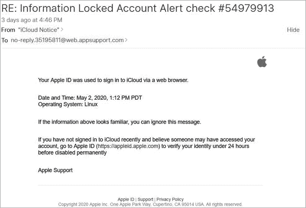

图 3-1：钓鱼邮件的示例

这封邮件声称来自 Apple，并且宣称我的账户因来自 Linux 操作系统的可疑登录而被暂停。为了修复这个问题，它说我只需点击链接登录我的账户。

这是一封看起来非常真实的钓鱼邮件，几乎完全模仿了实际的 Apple 邮件。为了比较，图 3-2 展示了一张真实的 Apple iCloud 登录通知截图。

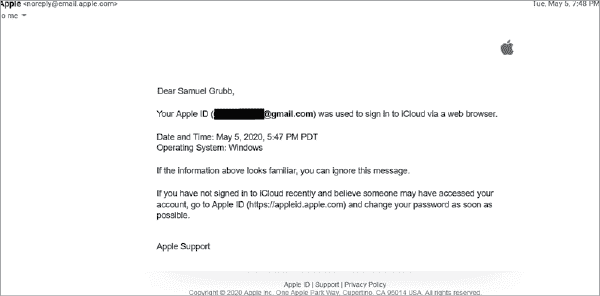

图 3-2：来自 Apple 的一封合法邮件

看起来几乎一样，对吧？那么，我是如何知道图 3-1 是钓鱼邮件的呢？让我们再看一遍，并加上一些注释（图 3-3）。

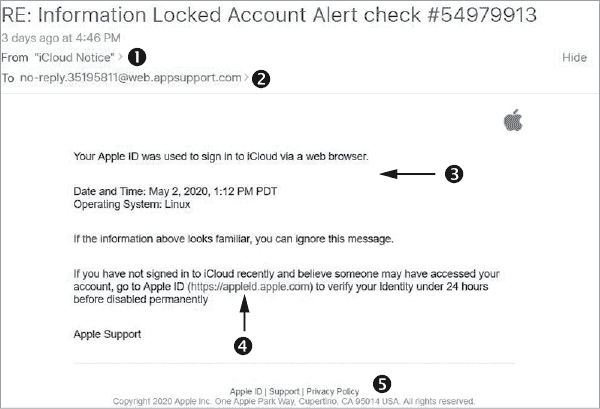

图 3-3：带有编号注释的钓鱼邮件

下面是这些显眼指示的解释：

1.  邮件的发件人是 iCloud Notice，这很可疑，因为你可能会期望它只是显示 Apple。此外，它被加上了引号，表明它是一个 *友好名称*。电子邮件应用程序使用友好名称作为电子邮件地址的简写。例如，如果你的朋友 Jane 的电子邮件地址是 *sparklekittenisamazingdazzle@emaildomain.com*，应用程序可能会用 *Jane* 代替它，帮助你识别发件人。稍后在本练习中，你将看到黑帽黑客如何经常利用这一功能来试图欺骗用户。

1.  “收件人”字段没有包含我的电子邮件地址。这表明邮件是通过 BCC（密件抄送）发送的，这样可以隐藏邮件的收件人。攻击者使用这个技巧向多个受害者发送钓鱼邮件，而不会让他们察觉。

1.  邮件正文中没有包含我的账户名。如果这封警告邮件是专门发送给我的，难道我的账户名不应该列出吗？此外，邮件中有很多语法错误，包括最后一句话。而且，邮件试图通过声称我的账户将被禁用来吓唬我。

1.  提供的链接与合法的 Apple 通知中的链接相同，但在这封邮件中，它是 *活动的*（可点击的）。更重要的是，当我将鼠标悬停在链接上时，显示的 URL 与写明的内容不同，因此它实际上不是指向 Apple 网站的链接。

1.  邮件底部有三个“链接”，分别是 Apple ID、支持和隐私政策。这可能是最难察觉的指示。然而，当我将鼠标悬停在这些链接上时，它并没有显示典型的手形图标，表明它们是可点击的链接。原因是它们根本不是链接，而只是一个图片，用来模仿来自合法邮件的签名。

如你所见，即使邮件制作得非常精良，仍然有几个线索让人明显知道这是一封钓鱼邮件。但是，仅仅识别出邮件是钓鱼邮件只是良好分析的第一步。接下来，我们要通过分析邮件头和 URL 来了解邮件的更多信息。

为什么分析网络钓鱼邮件很重要？假设你在 Sparkle Kitten Inc. 的 IT 部门工作，一位用户打电话说他们收到了一个邮件，但不确定它是否合法。你可能会查看邮件，发现它是垃圾邮件，然后告诉用户删除它。这是一个不错的计划，但如果其他用户也收到了相同的邮件怎么办？如果其中一个用户点击了链接呢？通过花时间分析发送者是谁，以及点击链接后 URL 的作用，你将能获得宝贵的信息，如果这成为一个问题，你可以将其传递给你的邮件管理员或安全人员。

### 邮件头分析

你需要首先分析邮件头，以便检测邮件的来源并确定其他有用信息。邮件头提供有关邮件来源的详细信息（例如邮件到达你收件箱的路径），发送者是谁，以及邮件服务器用来读取和使用的其他特定信息。

查找完整邮件头的过程根据你使用的邮件应用程序不同而有所不同。在 Gmail 中，点击邮件右上角的三个点以访问菜单，如图 3-4 所示。

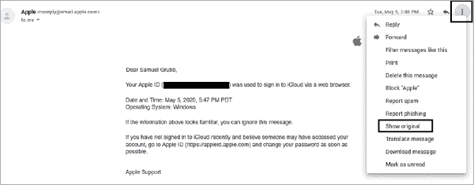

图 3-4: Gmail 中的邮件菜单

在此菜单中，点击**显示原始邮件**，如图 3-4 所示。这样做会在新窗口中打开邮件，并在原始的收件人和发件人字段下方显示完整的邮件头，如图 3-5 所示。

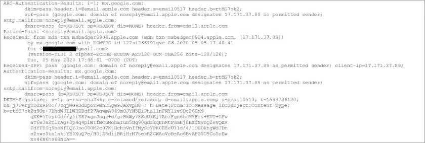

图 3-5: Gmail 中的邮件头

这些原始数据可能很难读取和理解，特别是考虑到它包含的字段数量。你如何理解如此复杂的文本？当然是使用一个设计用来读取数据的工具！你在分析中使用的第一个工具是 MX Toolbox。你可以在[`mxtoolbox.com/`](https://mxtoolbox.com/)网站上免费找到它。MX Toolbox 提供了多种用于邮件分析的工具。现在，我们将使用 Analyze Headers 工具。你将在该网站的主页上看到它（见图 3-6）。

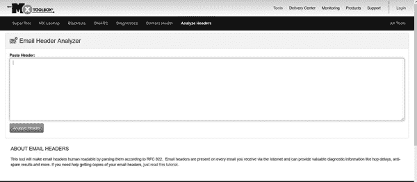

图 3-6: MX Toolbox Analyze Headers 工具

要使用 Analyze Headers 工具，只需将完整的邮件头复制并粘贴到空白窗口中。该工具将分析邮件头，并将所有数据分隔到易于阅读的字段中，如图 3-7 所示。

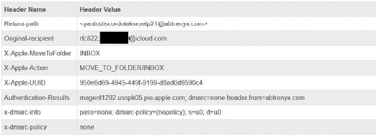

图 3-7: MX Toolbox 邮件头分析

在查看邮件头字段之前，我们需要先检查`x-dmarc-info`标题下方显示的内容。这些内容与邮件使用的两种身份验证类型有关：发送者政策框架（SPF）和域名密钥标识邮件（DKIM）记录，这两者合起来被称为域名消息身份验证报告（DMARC）。电子邮件应用程序本质上使用 SPF 和 DKIM 记录来验证邮件是否获得了从该域和 IP 地址发送的权限。例如，如果 Google 向您发送电子邮件，它来自 Google 的电子邮件服务器，并且具有特定的 IP 地址。该地址对应于一个 DKIM 和 SPF 记录。您的邮件服务器在收到邮件时会检查 Google 的 DKIM 记录。如果黑帽攻击者试图伪装成 Google 发送电子邮件，您的服务器将发现攻击者使用的 IP 地址与注册在 Google 的地址不同。因此，DKIM 记录将在邮件头中显示为失败，如图 3-8 所示。

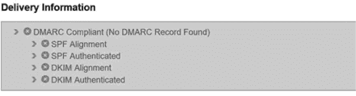

图 3-8：DMARC 失败

尽管 SPF 或 DKIM 记录失败是识别钓鱼邮件的重要指标，但它们并不能作为证据。邮件服务器需要正确设置 DMARC 记录，签名系统才能正常工作，而许多服务器并没有这么做。也有可能伪装 IP 地址以通过 DMARC 检查，因此即使邮件通过检查，也不代表它是合法邮件。

现在，让我们看看邮件头字段。在图 3-9 中，注意到`Return-path`字段顶部的地址是 yantodiscordolaksroelp21@abtrenyx.com，这个地址与 Apple 使用的地址相差甚远。这个地址表明我们正在查看一封钓鱼邮件。还需要注意这个地址，以便邮件管理员稍后查找，以查看其他用户是否也收到了这封邮件。

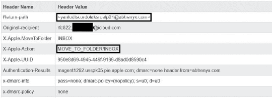

图 3-9：带有突出显示字段的邮件头

继续查看邮件头，注意那些以`X`开头的头部字段。`X`头部包含邮件服务器用于决定如何发送邮件的信息。例如，`X-Apple-Action`头部显示`MOVE_TO_FOLDER/INBOX`。这意味着，当邮件进入我的 Gmail 账户时，它会自动发送到我的收件箱，而不是垃圾邮件或垃圾箱。下面这些头部，显示了关于 DMARC 的信息。如您所见，这里没有 DMARC 策略，因此邮件未能通过 DMARC 检查。

表 3-1 列出了一些其他需要关注的头部，以及您可以从中收集的信息。

表 3-1：重要的邮件头字段

| **字段** | **目的** |
| --- | --- |
| `Message-ID` | 赋予邮件的唯一 ID。使得通过搜索功能更容易查找。 |
| `x-originating-ip` | 发送邮件的原始 IP 地址。帮助判断发送者是否已知为恶意，并且可以找到该发送者发送的其他邮件。 |
| `X-Mailer` | 指定用于发送电子邮件的应用程序。奇怪或意外的平台可能表示钓鱼攻击。 |
| `Received-SPF` | 提供 SPF 检查的结果。 |
| `X-MS-Has-Attach` | 指示电子邮件是否包含附件。 |

### URL 分析

查看完邮件头信息后，你需要验证 URL 是否恶意。为此，你将使用另一个在线工具 VirusTotal，网址是[`www.virustotal.com/gui/home/url/`](https://www.virustotal.com/gui/home/url/)。图 3-10 显示了其主页。

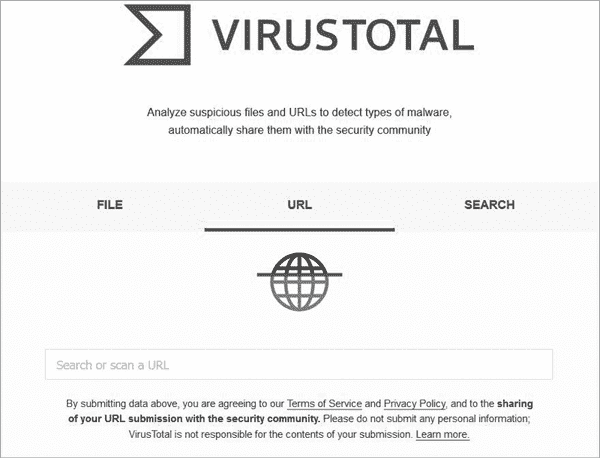

图 3-10：VirusTotal 的主页

VirusTotal 允许你使用多个杀毒引擎扫描 URL 链接的恶意行为，我们将在第四章中更详细地讨论。它通过每个引擎运行链接，并汇总信息，生成一个易于理解和共享的页面。如果即使只有一个引擎标记它为恶意，你也应该认为这个链接是恶意的。图 3-11 显示了将图 3-2 中的链接运行通过 VirusTotal 的结果。

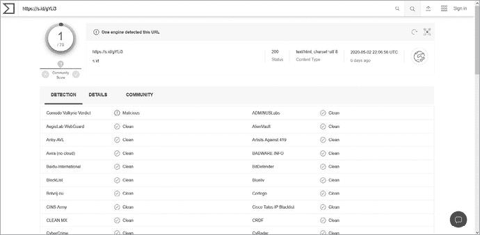

图 3-11：来自 VirusTotal 的分析

即使只有一个引擎返回了恶意结果，也足以知道这个链接是危险的。

像所有优秀的安全专家一样，你对点击链接后发生的事情充满好奇。然而，你也知道点击链接可能会感染你的计算机。那么你该怎么办呢？

你使用另一个名为 Joe Sandbox 的工具（[`www.joesandbox.com/`](https://www.joesandbox.com/)）。这是一个免费的工具，允许你在沙箱环境中运行附件或打开 URL。*沙箱*是模拟计算机，旨在像真实的物理机器一样运行，但你可以将它们与计算机系统的其他部分隔离，并轻松摧毁它们。这使得沙箱非常适合测试恶意实体，例如恶意软件，因为你可以研究恶意软件感染，而不用担心它会传播或损坏关键系统组件。

要开始使用 Joe Sandbox，首先创建一个帐户。然后将链接复制并粘贴到沙箱中，如图 3-12 所示。

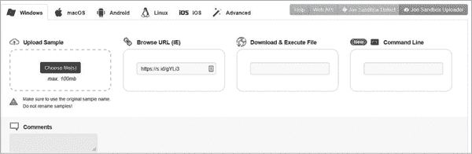

图 3-12：Joe Sandbox 的主页

报告生成需要几分钟时间，但一旦完成，你将获得关于该链接和点击时运行的内容的丰富信息。两个最有趣的功能是行为图和截图部分。

行为图（图 3-13）显示了当某人点击链接时发生的所有进程，例如打开的任何内容或访问的任何网页。在这个示例中，链接打开了几个不同的网页，然后重定向到其他网页。你可以看到这些网页都不是实际的 Apple 域名，这进一步证明了这封邮件不是来自有效的 Apple 来源。

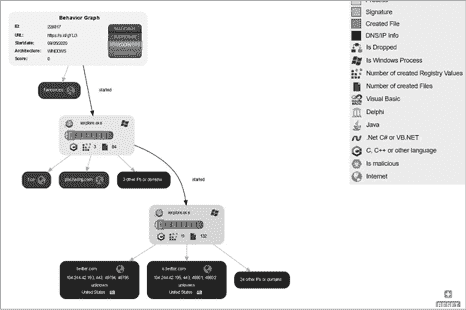

图 3-13：Joe Sandbox 报告：行为图

截图部分（图 3-14）显示了沙箱执行链接时打开或运行的截图。

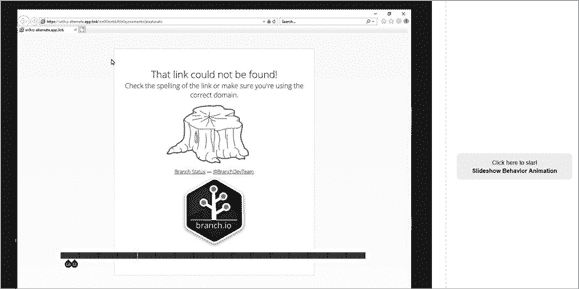

图 3-14：Joe Sandbox 报告：截图部分

本节还提供了动画选项，因此你可以实时查看发生了什么。我提交的特定链接找不到，虽然这对我们的研究目的来说是个不幸的情况，但并不令人惊讶。钓鱼链接通常只在短时间内有效，然后要么被发现，要么被钓鱼者删除以避免被检测到。尽管如此，由于邮件要求你验证账户，你现在知道这很可能是一次*凭证劫持*攻击。在这种攻击中，攻击者试图窃取凭证，要么通过让受害者在虚假网站上输入凭证，要么通过利用浏览器漏洞捕获凭证。

通过一些研究和一些免费工具，你可以了解很多关于钓鱼邮件的信息。你现在已经分析了这封邮件，并确定它是一个钓鱼邮件，攻击源以及尝试的攻击类型。你现在可以通过在邮件程序中添加规则来更好地保护自己，指示服务器将来自这个恶意发送者的任何邮件直接发送到垃圾邮件箱，或将此信息传递给相关管理员以供其在防御工作中使用。

## 结论

说到钓鱼攻击，关键是要记住，攻击者只需一次点击就能访问你的计算机或潜在地窃取你的个人信息。钓鱼攻击可能来自不同的方向，因为攻击者基本上可以利用任何形式的社交工程通信。在使用电子邮件或接到电话时保持警惕。通过练习，你将学会更容易识别钓鱼尝试。无论攻击是使用网络劫持（pharming）、语音钓鱼（vishing）、精准钓鱼（spear phishing）还是任何其他类型的社交工程，都要花时间仔细思考别人要求你做的事情。这样做可能是钓鱼攻击成功与失败之间的区别。
