# 4

恶意软件感染

计算机攻击中最著名的类型之一就是恶意软件的传播。有时被错误地称为病毒，*恶意软件*，或恶意软件，是任何旨在绕过系统预定操作的软件。此类活动通常未经用户授权，甚至对用户不可见。恶意软件自现代计算机问世以来就一直存在。它有很多形式，尽管杀毒软件的努力不断加强，今天仍然很常见。

在本章中，我们将讨论什么是恶意软件，一些较为常见的变种，以及如何最好地防御它，同时澄清你可能从电视上看到的虚构黑客那里得到的一些误解。

## 什么是恶意软件？

恶意软件是旨在破坏计算机系统的软件。因此，即使一个游戏占用了你计算机的全部内存，它也不被视为恶意软件。定义恶意软件损害的最佳方式是由未经授权的行为引起的损害，这种行为对系统来说是异常的。例如，一个正常的操作可能涉及用户使用由内部管理员设置的用户名和密码登录系统。如果一个应用程序允许黑客在没有使用用户名和密码的情况下访问系统，那么它就执行了一个未经授权的操作。

这可能看起来是琐碎的事，但理解恶意软件与漏洞或其他损坏软件之间的区别非常重要。如果一款软件，比如前面提到的游戏，存在一个无意的漏洞，导致计算机崩溃或造成其他伤害，它就不是恶意软件，只是一个劣质程序。同样，即使一个浏览器插件声明：“我们将窃取你的浏览历史并出售”，它也不是恶意软件，即使读者没有仔细阅读声明。另一方面，如果一个程序在表面上运行正常，但同时执行隐藏的操作，比如记录按键而没有通知用户，那它可能就是恶意软件。

大多数情况下，恶意软件很容易识别，因为它会执行明显恶意的操作，例如窃取密码或允许另一个未经授权的系统访问你的计算机。但是，有些程序执行的是合法的授权功能，同时也会进行一些不受欢迎的活动，比如展示广告或记录用户数据。仅仅因为一个程序看起来、表现得像一个安全的程序，并不意味着它没有在后台运行恶意代码。

## 恶意软件类型

为了分类不同类型的恶意软件，恶意软件分析师通常使用两个属性：恶意软件如何感染系统以及恶意软件执行什么类型的攻击。这些属性有助于将恶意软件划分为大致类别，从而帮助我们更好地防御它。在本节中，我们将探讨一些更常见的类别。

尽管本章讨论的恶意软件可以很好地归类为以下小节中描述的几类，但在现实世界中情况并非总是如此。黑帽黑客经常将不同类型的恶意软件类组合成一个单一的恶意软件包。例如，你可能会遇到一个病毒，它同时安装间谍软件和根工具。由于这一原因，当你试图清除恶意软件感染时，扫描计算机的每个部分非常重要。例如，仅仅清理病毒文件并不意味着你已经完全消除了整个感染。

### 病毒

也许最为人所知的恶意软件类型是病毒，我们定义病毒不是根据它的功能，而是根据它的行为。用户必须与病毒进行交互，病毒才能开始执行其恶意代码。我们将这种交互称为*触发器*。触发器可以是点击文件、运行程序或打开附件。一旦执行了这些操作，病毒就能运行其指令并释放其有效载荷。

病毒的*有效载荷*是执行病毒程序所设计的任何恶意操作的代码。例如，1990 年代创建的许多病毒，如切尔诺贝利病毒，旨在摧毁感染的系统，通常通过重写或删除关键文件（图 4-1）。切尔诺贝利病毒是由台湾大学生陈英豪创建的，他想证明当时的杀毒软件是无效的。一旦激活，代码就会用零重写系统硬盘的前一个千字节。这摧毁了许多系统运行所必需的关键文件，包括分区表，它有助于确定硬盘上信息的物理存储位置。

图 4-1：Windows 蓝屏（错误屏幕），显示切尔诺贝利病毒成功感染后的情况（原图由自由艺术许可 1.3 覆盖）

随着网络犯罪的普遍化，攻击者开始利用病毒植入其他类型的恶意软件，如木马或勒索软件（详见第 59 页），然后利用这些软件进一步利用系统。

尽管所有病毒都具有这些共同特征，但病毒的具体目标可能会有所不同。例如，*文件感染病毒*感染文件，而*引导扇区病毒*感染启动计算机时使用的启动文件。*宏病毒*专注于，你猜对了，就是系统中的宏。宏是将发送到计算机的指令转换成更长指令集的代码。例如，当你按下 CTRL-C 时，宏会将该按键转换为“复制”命令。宏通常用于 Microsoft Office 应用程序中，以提供额外的功能，尤其是在像 Excel 这样的电子表格应用程序中。一些病毒，被称为*隐身病毒*，在代码中加入了额外的层级，试图避开杀毒软件的检测。

### 蠕虫

蠕虫是一种恶意软件，设计目标只有一个：尽可能多地感染系统。与病毒不同，*蠕虫*可以在没有任何用户直接接触的情况下感染系统，这意味着它可以比病毒更容易地通过网络传播。一旦蠕虫感染了一个新系统，它会寻找其他未感染的计算机，继续传播。

蠕虫之所以能够在没有用户接触的情况下传播，是因为它们利用了一个漏洞，该漏洞允许进行*远程代码执行*，即即使是未经授权的用户，也可以在远程位置执行任何代码。这使得对手能够安装程序、创建用户，甚至更改网络设置。通常，允许远程代码执行的漏洞涉及欺骗系统，让它认为某个用户或进程有权限执行代码。一个经典的例子就是 ILOVEYOU 蠕虫（图 4-2）。该蠕虫于 2000 年创建，利用了当时 Windows 系统中的一个漏洞，导致文件类型 *.vsb*（表示 Visual Basic 脚本）被隐藏。这意味着当文件通过电子邮件发送时，附件看起来像一个普通的文本文档。但当用户打开它时，它会运行一个脚本，通过覆盖某些文件类型来感染系统。接着，它会使用目标的电子邮件账户，将文件副本发送给与 Microsoft Outlook 关联的地址簿中的每个联系人。传播蠕虫到新系统的最常见方式是通过电子邮件。这为蠕虫提供了一种接触其他用户的方法，并且可以通过它获得电子邮件地址列表。在 10 天内，报告了 5000 万个 ILOVEYOU 感染事件。

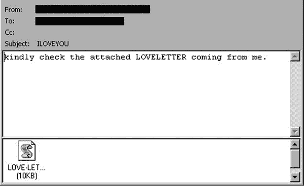

图 4-2：ILOVEYOU 蠕虫发送的电子邮件示例

从历史上看，黑客曾利用蠕虫作为炫耀的工具。你能够感染的系统越多，你在黑客社区中的信誉就越高。一些蠕虫，如 Melissa，就没有有效载荷。Melissa 是由 David Smith 于 1999 年创建的一个宏病毒。它通过伪装成 Word 文档的附件感染电子邮件系统。点击该文件后会运行宏代码，打开色情网站，并将其副本发送给联系人列表中的每个人。仅仅因为一个蠕虫没有有效载荷并不意味着它没有害处。Melissa 在蠕虫通过电子邮件泛滥，直到电子邮件服务器崩溃时，导致了许多邮件服务器离线。其他一些蠕虫，如 Code Red 和 SQL Slammer，也由于生成的流量过大，造成了网络服务的重大中断。Code Red 于 2001 年 7 月出现，几天内便感染了全球近 40 万个系统。SQL Slammer 更快：它在 2003 年出现时，仅在 10 分钟内就感染了大约 75,000 个主机。当蠕虫携带有效载荷时，它们通常会包含像勒索病毒或远程访问后门（稍后我们将讨论）这样的恶意软件。

### 特洛伊木马

就像它名字来源的经典希腊故事一样，特洛伊木马是一种恶意软件，它伪装成合法软件，暗地里在后台运行恶意任务。特洛伊木马模仿许多不同的软件元素，包括游戏、Word 文档或 PDF 文件，甚至插件或宏。一旦特洛伊木马安装完成，它通常会开始运行不必要的代码，但可能不会立即激活全部负载，直到满足特定条件或收到命令为止。例如，许多特洛伊木马会向一个由黑客控制的服务器发送 HTTP 请求，等待从感染的计算机接收命令。由于特洛伊木马模仿合法程序，使得它们非常难以检测，这也使得它们可以长时间潜伏不被发现。

最常见的一种特洛伊木马叫做*远程访问木马*（*RAT*）。它的主要目的是在你的系统上放置一个静默的、无法被检测到的程序，允许对方远程控制你的计算机。这个程序连接到*指挥与控制*（*C&C*）服务器，允许攻击者通过正常的流量过滤程序向你的计算机发送命令，而不被发现。

本质上，RAT 使用正常的流量，例如对互联网上某个网站的请求，来请求 C&C 服务器的额外命令。攻击者可以响应并发送额外的命令，或者在 RAT 的情况下，利用该程序获得*后门访问*系统的权限。（后门访问意味着通过未知或未授权的方式进入系统。）这使得黑客能够利用该系统，移动到其他目标或攻击其他系统。

### 勒索软件

勒索软件是一种使用加密技术锁定计算机，直到支付赎金为止的恶意软件。一旦勒索软件部署，它会加密特定的目标，例如正在使用的文件、整个硬盘，甚至整个数据库，导致这些文件无法使用。因为文件被加密，计算机无法读取它们，直到黑客提供解密密钥，才能恢复文件的内容。攻击者会扣留密钥，直到赎金支付，通常使用无法追踪的货币，如加密货币。

对手经常使用这种类型的恶意软件，因为它有几个优势。首先，它易于部署和扩展。一次感染就能传播到整个网络或加密关键的关键系统，实质上使一个组织瘫痪。其次，一旦部署，它几乎无法绕过。加密技术非常难以破解，许多现代加密协议的破解时间可能需要数十亿年。避免支付赎金的唯一有效方法是保持备份。然而，许多组织即使有备份，也选择支付赎金，因为恢复文件需要花费大量时间。第三，它便宜且有效。对手尝试感染几乎不需要任何成本，但一旦成功，便能获得成千上万甚至数十万美元的回报。随着服务的紧迫性增加，以及涵盖此类攻击的网络保险变得越来越普遍，更多的组织选择支付赎金。

### 间谍软件和广告软件

间谍软件和广告软件可能是影响系统的最令人讨厌的恶意软件类型。间谍软件窃取系统中的数据，而广告软件则在你使用系统时插入广告。两种恶意软件通常感染网络浏览器或其他使用互联网的程序。它们特别喜欢隐藏在用户安装的浏览器插件或宏中。这使得它们能够跟踪你的浏览历史、点击的链接和访问的账户，同时在屏幕上随机弹出烦人的广告。虽然这些恶意软件通常比其他类型的恶意软件造成的后果较轻，但它们可能会导致系统变慢，有时还会窃取有价值的个人数据，包括密码。它们还可能导致其他恶意软件的进一步感染，因为加载的广告会指向其他类型的恶意软件，如特洛伊木马。

### Rootkit 和 Bootkit

Rootkit 和 bootkit 为攻击者提供了前所未有的系统访问权限。*Rootkit* 是一种恶意软件，它试图访问计算机的内部系统文件，这些文件是操作系统运行所必需的。例如，rootkit 可能会替换控制登录的文件。通过这样做，黑帽黑客可以创建一个秘密的登录账户，赋予他们对系统的完全管理员权限，同时隐藏实际的账户，使其他用户无法察觉，从而保持不被发现。通常，这些文件对未授权用户是禁止访问的。为了访问这些文件，rootkit 利用一个漏洞，使其能够以管理员身份运行。这样，它可以对系统文件进行各种修改，包括添加用户、更改文件权限或更改系统的网络设置。

*启动病毒*访问并修改系统的启动记录，启动记录是当你开启电脑时启动操作系统的文件。启动记录初始化许多不同的配置，通常还会加载额外的软件，比如*硬件驱动程序*，操作系统用来与电脑硬件（如键盘和鼠标）进行交互。通过修改启动记录，恶意软件可以改变系统的功能，允许黑客完全控制，或者将其他恶意软件（如僵尸网络）加载到系统中（关于僵尸网络的更多内容见第六章）。启动病毒的另一个优势是，许多系统安全功能直到系统启动后才会启动。这意味着恶意软件可以在不被杀毒引擎或其他安全工具检测到的情况下运行。物联网（IoT）设备，像是恒温器或监控摄像头等具有网络连接的小型设备，尤其容易受到启动病毒的攻击，因为它们通常几乎完全通过启动记录运行所有功能（我们将在第六章讨论物联网设备）。

启动病毒和根套件在系统中极难被检测到。根套件会修改原本用于检测它们的程序。例如，它们可以修改你的杀毒程序，使得在运行扫描时跳过安装根套件的位置。启动病毒能够躲避检测，因为传统的杀毒软件只有在操作系统加载后才会起作用，而操作系统加载是在启动记录运行之后进行的。这使得在问题出现之前，很难发现系统中的任何异常。

检测这两种类型感染的典型方法是通过传统的症状，如系统运行缓慢、文件丢失或损坏，或异常的运行进程。你也可以通过使用安装在 USB 闪存驱动器或其他媒介上的杀毒软件来检测根套件。一些系统还具备进行*安全启动*的能力。这种方式会修改启动过程，检测与启动病毒相关的错误或异常，从而在启动病毒运行之前将其拦截。Windows 系统通过检查启动记录是否来自微软来执行安全启动。如果系统发现启动记录被修改，检查会导致系统停止启动。但即使如此，找到恶意软件也只是战斗的一部分。移除它非常棘手，通常情况下，最好是彻底清除系统并重新安装，而不是冒险让感染潜藏在某个无法访问的角落里。

### 多态恶意软件

最强大且最危险的恶意软件形式是多态恶意软件。这种恶意软件具有先进的功能，能够根据特定因素改变其代码，比如它当前感染的系统类型或系统上运行的应用程序。这使得它能够根据环境进行调整，而不是仅仅运行固定的负载，从而使其非常难以通过传统方式被检测到，因为它在特定情境下才会变得有害。一旦触发条件被激活，恶意软件就会启动，改变其代码并执行破坏性操作，开始执行其预定任务。

幸运的是，多态恶意软件极为罕见，且通常是为非常特定的目标所打造的。由于创建这种恶意软件需要大量的时间和资源，通常只有国家行为者才会使用它。一个著名的多态恶意软件例子是*Stuxnet* *病毒*。该恶意软件是由美国及其盟国设计的，目的是感染伊朗的核离心机，并阻止其正常运作。Stuxnet 的设计者特别将其制作成在进入离心机系统之前保持隐蔽，一旦进入系统，它就会重写代码并感染设备。Stuxnet 能够保持长时间未被发现，成功破坏了伊朗的核计划。

随着技术的进步，编写像多态恶意软件这样的高级代码变得越来越容易。你可能会发现传统恶意软件中集成了多态特征，从而赋予其额外的功能。例如，利用机器学习理论和算法，恶意软件可以被训练逃避杀毒软件的检测，即使杀毒程序之前已经检测到过相同的破坏性软件。根据 Hyrum Anderson 的最新研究，攻击者可以使用机器学习程序将恶意软件通过一系列杀毒引擎进行扫描，根据扫描结果稍微调整软件的代码。这个过程将反复进行数十万次，直到没有任何引擎能够检测到该恶意软件。最终的结果是，恶意软件的运行方式和之前一样，但不会引起杀毒引擎的注意。对敌人而言，他们无需做任何事情；机器学习程序会为他们完成所有工作。

## 黑帽黑客如何部署恶意软件

黑帽黑客部署恶意软件的原因多种多样。为了了解攻击者如何以及为何在系统上释放恶意软件，让我们通过一些典型的攻击案例来讲解。尽管所有恶意软件各不相同，但大多数恶意软件的安装方式是相似的。

部署任何恶意软件的第一步是创建破坏性软件。通常，攻击者通过两种方式来实现这一点：利用现有的漏洞或从零开始编写代码。许多黑帽黑客使用已经设计好以利用某个漏洞的恶意软件进行攻击。这意味着他们根据需要向现有的恶意软件中添加特定的有效载荷。一个很好的例子是 EternalBlue 漏洞，由美国国家安全局（NSA）开发，后来被攻击者用于多个恶意软件样本中。该漏洞通过利用服务器消息块协议（Server Message Block，SMB）处理某些类型信息的方式，使攻击者能够在目标 Windows 机器上执行远程代码。每次攻击中，攻击者都会添加自己的代码来执行。

从零开始编写新的代码比使用框架更难，但通常更有效。原因是目标系统的防护机制之前未曾遇到过该恶意软件。因此，新的恶意软件更有可能避开检测（正如我们在本章后面将讨论的那样），因为杀毒软件严重依赖于实际恶意软件样本的代码。

在创建了破坏性代码后，攻击者进入下一步：初始感染。通过各种方式，他们可以将有害软件安装到系统中，但最有效的方式是社会工程学，这是第三章中描述的过程。通过网络钓鱼技术，通常很容易让用户下载并执行恶意软件。例如，攻击者喜欢将不安全的代码隐藏在无特征的文件类型中，如 Word 文档或 Excel 电子表格。两种文件都允许创建宏，黑帽黑客可以在其中存储恶意代码，当用户打开文档时，代码会激活，从而导致初始感染。通过链接执行脚本下载有害代码到计算机也是常见的做法。由于许多恶意软件需要用户交互才能生效，因此文件或链接看起来越无害越好。这对木马尤其重要，因为木马必须长期留在系统中才能有效。

初始感染会释放完整的有效载荷，但这并不意味着恶意软件已经完全停止工作。在这个阶段，一些恶意软件专注于执行特定的操作；例如，勒索软件会加密文件或其他存储介质。其他恶意软件则专注于创建 APT（高级持续威胁），这是一种复杂的恶意软件，会在网络上长时间保持隐蔽，收集数据和其他信息，然后执行大规模攻击。RAT（远程访问木马）就是一种可能的 APT，它允许攻击者通过后门反复访问系统，以收集有关环境的更多信息。APT 非常危险，且难以处理，因为它们在设计上避免了许多传统的检测方式。更糟糕的是，一些恶意软件会执行炫目的攻击，例如加密所有的 Word 文档，以掩盖安装 rootkit 的秘密代码。这就是为什么在恶意软件攻击中数字取证至关重要的原因（见下文《如何防御恶意软件》）。

一旦感染发生并且有效载荷被部署，传播就可以开始。这可能涉及通过主机系统的联系人列表发送恶意软件的电子邮件；通过传输协议（如文件传输协议 FTP 或超文本传输协议 HTTP）在网络中传播；或是将恶意软件隐藏在文件中，直到新的用户点击它。虽然蠕虫特别擅长传播，勒索软件和病毒也可以快速而轻松地传播，尽管它们可能需要用户输入才能做到这一点。

## 如何防御恶意软件

防御恶意软件的最佳方法是使用反恶意软件软件，通常称为*防病毒* *程序*（尽管它们现在防护几乎所有形式的恶意软件，而不仅仅是病毒）。防病毒程序由许多商业供应商提供。微软系统还内置了一款名为 Microsoft Defender（前身为 Windows Defender）的防病毒程序。但仅仅下载防病毒程序并不一定提供完全的保护。为了确保系统安全，你需要获得适当的软件，以减少计算机可能遇到的风险。

防病毒软件有两种基本的检测形式：特征码检测和启发式检测。前者通过代码特征来识别恶意软件。代码特征是破坏性程序代码中的独特部分，有助于识别它。例如，假设你收到一封电子邮件中的文件。*特征码防病毒程序*扫描该文件，并注意到该文件中包含作为宏一部分的代码*sparklekitten.exe*。它会将该代码与已知恶意软件特征数据库进行比对，确定*sparklekitten.exe*被标记为恶意。然后，防病毒软件会提醒你，并可能根据其设置将该文件隔离。

签名病毒软件非常快速，因为它只需将一段代码与签名数据库进行比较，以验证它是否为恶意软件。图 4-3 显示了一个在 Linux 系统上运行的此类程序的示例。它也不需要太多系统资源，因此可以在大多数系统上运行——即使是内存容量较小或中央处理单元（CPU）较慢的系统，也可以运行，这里的 CPU 负责处理发送给计算机的指令。然而，为了让软件能够检测到恶意软件，它的数据库必须包含恶意软件的签名。这意味着新创建的恶意软件可以避免病毒检测，至少在足够多的感染事件被报告给软件制造商并添加准确的签名到数据库之前。它还意味着黑客可以修改恶意软件的签名以避开检测（或像本章前面讨论的那样，使用机器学习改变恶意软件）。由于这些优缺点，最好将签名病毒软件部署在终端系统上，例如桌面、手机、笔记本电脑以及其他处理数据的系统上，以避免减慢系统实际工作的速度。

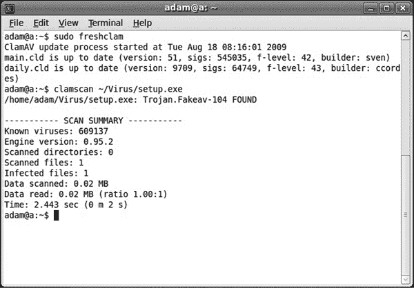

图 4-3：在基于 Linux 的系统上运行的病毒软件的屏幕截图（此图像已从 SourceFire 创建的原图修改，并根据 GNU 通用公共许可证授权）

*启发式病毒检测*根据网络流量的变化来调整其检测方式，寻找异常的流量，这些流量偏离了正常的流量模式。正常的流量会根据网络的使用方式而有所不同，因此启发式病毒程序必须花时间学习这个基准。然后，它就能察觉到异常。例如，如果你的计算机上安装了一个 RAT（远程访问木马），它的第一步是通过网络发送一条信息到其 C&C（指挥与控制）服务器。启发式病毒程序可以检测到这一行为，并识别出这不是正常流量（可能是因为它发生在异常时间，或者来自一个通常不发送这种流量的系统）。然而，如前所述，RAT 仍然有可能模仿启发式系统认为的正常流量。

启发式病毒检测非常有效，因为它能够检测到全新的恶意软件，以及试图隐藏的恶意软件，如 rootkit 或 bootkit。但它比基于签名的检测需要更多的设置和维护。为了发现不正常的流量，启发式引擎首先需要了解你系统的正常流量是什么样的。这意味着它必须在开始有效工作之前确定一个准确的基准，并且这个基准必须随着系统用户行为的变化而定期更新。通常，你会在一些关键的高流量区域找到启发式系统，比如扫描从外部进入网络的流量的防火墙上。

所有类型的杀毒软件都会扫描进入或离开系统的大多数数据，具体取决于你的设置或所使用的产品。这包括 PDF 或图片等文档、Excel 或游戏等应用程序，甚至是网页流量。现代系统中强大的扫描工具使得恶意软件难以通过传统手段进入你的屏幕。然而，良好的检测依赖于你拥有一个适当维护的杀毒程序。你需要定期更新软件并执行自动定期扫描。你还应确保软件设置为扫描所有类型的数据，特别是电子邮件附件或从互联网下载的文件。

尽管杀毒软件在技术上有许多进步，但攻击者仍然有可能通过理解并规避杀毒软件检测恶意文件的方式来绕过这些扫描。例如，你可能收到一份正常、干净的 Word 文档，杀毒软件对此没有反应；该文档在任何签名数据库中都不会显示为已知恶意软件，也不会显示为异常流量。但当你打开它时，你可能会触发一个链接，连接到互联网并下载勒索软件。在杀毒软件有机会反应之前，勒索软件可能会执行并锁定你所有的文件。

你还可以使用文件完整性工具来确保文件没有被篡改以隐藏木马或其他恶意软件。*文件完整性工具*使用文件哈希值，我们将在第九章讨论这一点，来检查文件是否已被修改。大多数公司会在其网站上提供其应用程序或文件的哈希值。你可以将该哈希值与下载的文件或应用程序的哈希值进行比较，以确保黑客没有在其中添加恶意软件。如果哈希值匹配，说明该文件或应用程序没有被修改。

要真正保护你的计算机免受恶意软件的侵害，你必须加强社交工程防御。奇怪的链接、未经请求的电子邮件附件以及其他类似的可疑请求都表明，攻击者可能试图诱使你下载恶意软件。

## 练习：分析恶意软件并管理杀毒设置

预测恶意软件的来源并避免它们是保护系统安全的关键步骤。毕竟，如果恶意软件永远没有进入你的计算机，你就不需要担心它会感染你的系统。在这个练习中，你将使用一些免费的在线工具扫描 PDF，看看它是否感染了恶意软件。你还将了解更多关于计算机中内置的杀毒设置，这样你就知道在不小心下载恶意软件到系统时该怎么办。完成这个练习后，你将学会如何识别并防御各种恶意软件威胁。

### 分析附件中的恶意软件

假设你收到了一份看起来像是朋友发来的奇怪 PDF 文件。这个朋友以前曾发送过类似的附件，但这次你并没有期待他们的邮件，也不确定这是否是恶意文件。一种解决方法是问问你的朋友是否发送了该文件；另一种方法是直接删除它，继续过你的生活。然而，假设你的朋友无法联系，并且你真的想知道该文件是否安全。那么，你就需要进行一些恶意软件分析了。

为了完成这项练习，你可以使用为本书创建的 PDF，名为*maliciouspdf.pdf*，该文件可在[`nostarch.com/cybersecurityreallyworks/`](https://nostarch.com/cybersecurityreallyworks/)下载。或者，你也可以分析任何你想要的文件；只要确保将它标记为*DO NOT OPEN*，以免忘记它可能是恶意软件。

首先，你需要验证发送的文件类型。Office 文档、可执行文件、媒体文件和 PDF 通常是无害的，除非你打开它们。但是，有些文件类型，如*.js*、*.sh* 或 *.script* 文件，下载后可能会立即执行；其他文件，如 *.dll* 文件，可能会在下载后被其他进程激活。最佳选择是使用虚拟机下载文件。虚拟机是与物理计算机其他部分隔离的环境，因此如果它被感染，很可能不会感染整个系统。为了让恶意软件突破虚拟机，它需要非常复杂的软件。

因为并非每个人都有虚拟机的使用权限，另一种解决方案是将可疑的有害文件下载到云平台。例如，如果你使用 Windows 的 OneDrive，你可以直接将文件保存到你的在线 OneDrive 文件夹，而不是保存到电脑上。通常，这会触发对文件的病毒扫描，可能会在不需要进一步分析的情况下显示它已被感染。如果你没有在线文件夹，下一种最佳选择是使用闪存驱动器或外部硬盘。尽管将恶意软件保存到外部存储设备仍然有可能感染主系统，但这样能减少一些风险。只需确保在保存可疑文件之前，驱动器上没有任何重要文件。

当你下载文件时，确保*不要打开它*。选择**另存为**选项，并将文件移动到一个名为 *Do Not Open* 或 *Malware* 的文件夹中，以提醒你和其他人不要意外打开它。同时，确保你的系统默认不会自动运行任何文件。许多系统在你下载文件时会提供**用此打开**选项。*不要*选择这个选项。

一旦安全保存了文件，你可以开始通过分析工具对其进行处理。你将首先使用的网站是 VirusTotal ([`www.virustotal.com/`](https://www.virustotal.com/))，你在第三章中曾用它分析可疑的 URL 链接。这次，你将使用文件分析功能。当你加载页面时，你会看到上传文件进行分析的选项。点击**选择文件**，导航到你保存的文件并选择它进行上传。图 4-4 显示了使用 *maliciouspdf.pdf* 文件的示例。

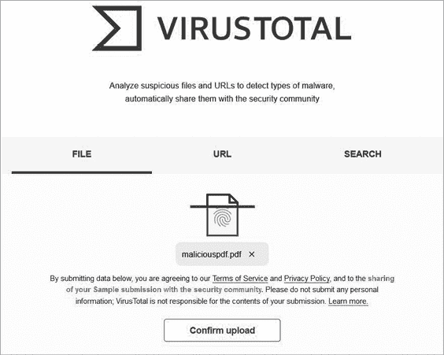

图 4-4：准备上传的恶意 PDF 文件

一旦文件上传完成，点击**确认上传**以开始分析。VirusTotal 会将文件通过多个杀毒软件程序进行扫描并返回结果，告知你文件是否含有恶意软件。请记住，VirusTotal 会指明找到恶意软件的引擎数量。如果即使只有一个引擎报告文件为不安全，你也可以假设它是恶意软件，不管其他引擎是否标记它为干净。图 4-5 提供了 *maliciouspdf.pdf* 文件的输出示例。

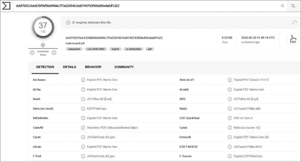

图 4-5：VirusTotal 的结果

如你所见，37 个不同的恶意软件扫描服务报告该文件含有恶意软件。这个文件是通过一个著名的漏洞创建的，其签名已被加载到许多杀毒程序中，因此容易被检测到。但这并不总是如此。文件可能包含尚未具有标准签名的新恶意软件，导致 VirusTotal 报告文件为干净，实际上它已经被感染。为了应对这种情况，你需要使用另一个熟悉的工具，Joe Sandbox。

如你在第三章中学到的，Joe Sandbox ([`www.joesandbox.com/`](https://www.joesandbox.com/)) 允许你通过一个云平台分析链接或文件，这个平台像一个实际的系统。在本练习中，你将使用它在一个安全环境中打开文件，进行彻底的分析。首先，上传文件，如图 4-6 所示。

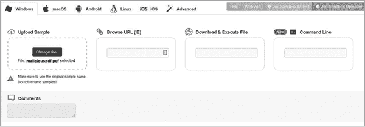

图 4-6：在 Joe Sandbox 上上传文件

一旦文件上传完成，沙盒会花几分钟时间完成分析。Joe Sandbox 会打开文件，并通过多个不同的杀毒扫描进行检查。图 4-7 显示这些杀毒扫描程序将 *maliciouspdf.pdf* 文件识别为恶意文件。

图 4-7：Joe Sandbox 对 *maliciouspdf.pdf* 的分析结果

Joe Sandbox 还提供了额外的分析，旨在了解文件中可能嵌入的恶意软件类型，以及如果下载并打开该恶意软件，它会如何影响你的系统。如果你认为自己可能不小心打开了文件，并需要找出它执行了什么样的恶意活动，这项分析会特别有用。图 4-8 显示了关于 *maliciouspdf.pdf* 的一些有用报告部分。

此分析提供了一个检测级别，在这个例子中是恶意的，并且还提供了两种文件分类方式：签名和分类图。回想一下，许多防病毒程序使用签名文件来检测恶意软件。签名部分显示与正在分析的文件匹配的签名。分类部分则根据扫描和检测到的签名，提供文件可能包含的恶意软件类型的估计。

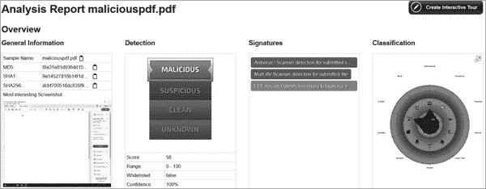

图 4-8：*maliciouspdf.pdf* 分析概览

接下来，图 4-9 展示了当文件在沙箱中执行时，创建了哪些进程。

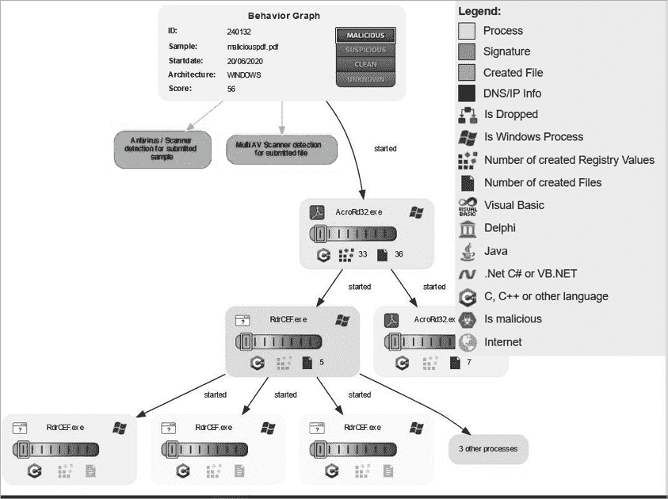

图 4-9：*maliciouspdf.pdf* 打开时创建的进程

报告还列出了由父进程创建的任何子进程。在这个例子中，打开 PDF 后启动了 Adobe Reader 进程，随后它生成了两个子进程。这个进程中的一个子进程又生成了更多的子进程。这部分报告对于识别在此类文件执行中不常见的进程（例如这里的子进程，它们与 Adobe 无关）非常有用。

### 审查防病毒设置

现在你已经分析了可疑文档，并知道它是恶意软件，你需要检查系统中的防病毒设置，确保你的计算机受到感染保护。

内建的防病毒软件并未随 macOS 一起提供，但你可以使用多个第三方选项来保护你的系统安全。所有 Windows 10 系统都预装了 Microsoft Defender，它集成在操作系统的安全设置中，并提供广泛的恶意软件防护，包括对勒索软件的防护。虽然其他商业产品，如 Sophos、Check Point、Avast 和 Symantec，提供额外的功能，但我们将重点介绍 Microsoft Defender，因为它是免费的，并且默认内置于 Windows 10 中。

#### macOS

大多数现代防病毒软件都有 Apple 兼容版本。如果你在寻找免费的程序，Avast 和 Sophos 提供有效的产品。但使用免费版本时，功能是有限的。两款产品都提供付费版本，提供更强大的功能。

尽管目前攻击 Apple 计算机的恶意软件种类不如 Windows 系统那么多，但定期扫描计算机仍然至关重要。设置自动更新同样关键，这样一来，一旦有新的病毒定义文件发布，你就能第一时间获取。即使是从官方 Apple 商店下载应用程序，也要小心。恶意软件，特别是勒索病毒和木马，常常伪装成应用程序，其中一些甚至能够绕过 Apple 的验证流程，进入官方商店。

#### Windows 10

要访问 Microsoft Defender 设置，请在屏幕左下角的任务栏中的搜索框中输入**安全**，找到安全仪表盘。点击**Windows 安全**，然后点击**病毒与威胁防护**以打开 Microsoft Defender 的防病毒保护设置，如图 4-10 所示。

使用这些选项，你可以执行几种不同的操作。首先，你可以使用快速扫描选项进行手动扫描。它会扫描病毒或其他恶意软件最可能存在的地方，且速度非常快。如你所见，此系统上最近一次扫描花费了 1 分 26 秒，扫描了 42,363 个文件。如果你认为计算机感染了常见的恶意软件，快速扫描非常有用。但并非所有恶意软件都藏在显眼的文件中。为了确保系统真正干净，最好扫描更多的文件，而不仅仅是快速扫描所检查的那些文件。为此，请点击**扫描选项**，位于快速扫描按钮下方。

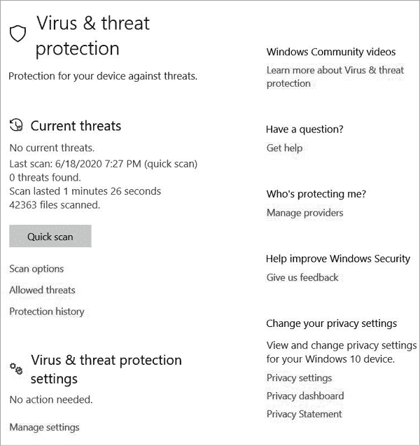

图 4-10：病毒与威胁防护设置

Microsoft Defender 提供了除快速扫描外的几种扫描选项。*完全扫描*选项会检查整个操作系统。与快速扫描相比，这是一种更为彻底的扫描，因此可能会减慢计算机的运行速度，并且完成所需时间较长。但它通过检查系统的每个角落，为你提供一个全面的报告。你还可以进行*自定义扫描*，选择特定的文件进行扫描。当你确切知道自己面对的恶意软件类型并且知道它喜欢隐藏的地方时，使用这个选项效果最好。例如，你可以使用 Joe Sandbox 的分析报告，确定恶意文件与哪些文件或文件夹发生了交互，然后扫描这些文件或文件夹，看看恶意软件是否也感染了你的系统。*Windows Defender 离线扫描*实际上是一种启动扇区扫描选项。它会重新启动计算机，在系统完全启动之前进行扫描，以确保 rootkit 或 bootkit 无法在系统启动后隐藏或修改进程。图 4-11 显示了这些扫描选项。

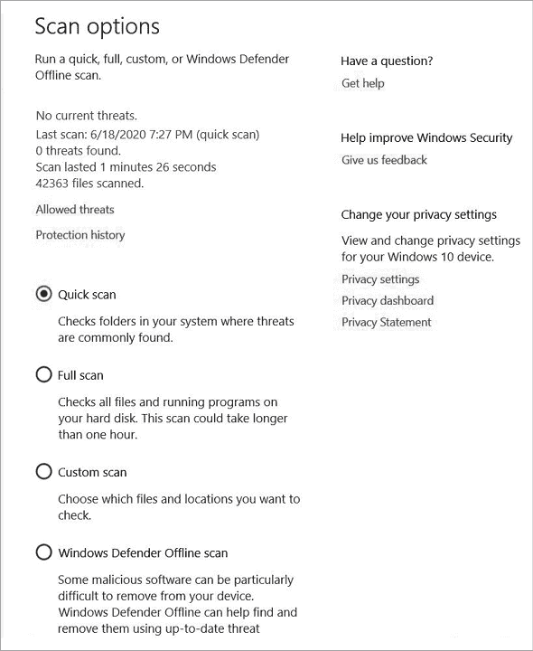

图 4-11：Microsoft Defender 扫描选项

当你返回到病毒和威胁防护对话框时，找到“保护历史”选项。这个选项会显示微软 Defender 检测到的所有威胁及其采取的措施以中和这些威胁（图 4-12）。如果你担心病毒没有被正确清除，或者防病毒软件可能误删了合法文件（虽然这种情况很少见，但偶尔会发生），你可以使用这个对话框查看最近的活动。图 4-12 显示了系统中发现并被隔离的两个威胁的示例（如果你在想当你将恶意 PDF 添加到系统中时会发生什么，这是一个例子）。

下述病毒和威胁防护设置中的附加选项决定了微软 Defender 的运行方式，包括是否提供*实时保护*，以阻止恶意软件的安装，或是否将恶意代码的样本提交到防病毒数据库，用于生成签名。微软 Defender 也提供一些基于云的启发式资源，但总体而言，它是一个基于签名的系统。默认情况下，它会自动更新签名列表，但你仍然应该确保这些签名是最新的。你可以通过在病毒和威胁防护对话框中点击“检查更新”来手动检查更新。

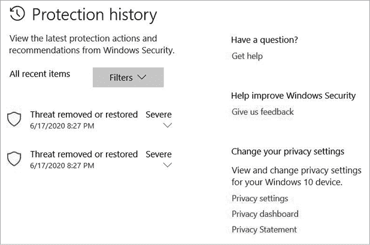

图 4-12：微软 Defender 保护历史

最后你需要检查的设置是*勒索软件* *保护*，如图 4-13 所示。为了防范勒索软件，微软 Defender 控制对文件夹的访问，并通过某些云平台提供备份。在这些设置中，你可以查看哪些文件已被保护，并修改一些保护设置。请记住，微软 Defender 不是万无一失的。如果你在外部硬盘或与主存储分开的云系统上保持定期备份，如果你的系统被勒索软件锁定，这将进一步帮助保护你的系统。

现在，你已经学会了如何分析文件中潜在的嵌入恶意软件，并且已准备好你的 Windows 系统以减少感染的威胁。这两项技能对于保护你的系统免受任何恶意软件威胁是至关重要的。将这些技能与第三章中学到的技能结合起来，将使黑客更难入侵你的系统。预防是击败恶意软件的最佳方法之一。记住，如果恶意软件从未进入你的系统，你就不需要担心它会做什么。

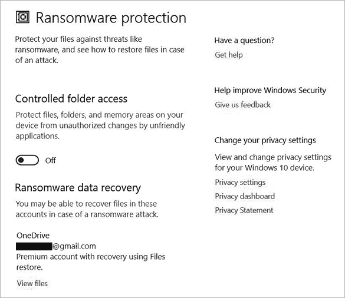

图 4-13：微软 Defender 勒索软件保护设置

## 结论

本章重点介绍了各种类型的恶意软件及其不同特征。病毒和蠕虫是最传统的恶意软件类型，通常携带有效负载，当激活时会执行恶意操作。此外，蠕虫还设计用于将恶意软件传播到新系统。勒索软件加密文件并要求赎金，允许黑客从受害者那里勒索钱财。木马则藏身于明面之中，允许后门访问，甚至安装根套件或启动套件，这些恶意软件感染系统的核心安全区域，导致操作的修改。间谍软件和广告软件有时比恶意更令人烦恼，它们窃取流量并弹出广告，比如突然出现的弹窗。但最危险的类型是变种恶意软件。这种先进的软件能够即时改变其代码，允许进行高级持久感染，极其难以检测。

本章还探讨了如何防御恶意软件。关键在于将社会工程防御技巧与先进的反恶意软件软件结合使用。通过注意你点击的内容、下载的文件以及点击的链接，你可以防止感染。如果系统确实被感染，杀毒软件可以通过使用签名或启发式特征来检测恶意代码。签名检测速度快，资源消耗少，但不如启发式检测先进，后者通过将流量与基准数据进行比较来判断是否正常或异常。通过结合这些策略，你可以保持系统免受感染，并使其正常运行。
