# 密码盗窃与其他账户访问技巧

我们使用访问控制程序来确保只有授权人员能够访问系统、打开文件或运行软件。这是组织日常管理的一部分；每一个为企业工作的人都以某种方式接触到它，无论是通过登录电子邮件账户还是与客户共享文件。为了更好地管理这样一个庞大而重要的议题，安全界通常将访问控制分为三大类：认证、授权和审计。

在本章中，我们将探讨各种认证和授权方法如何保护你的系统安全，以及如何使用审计来跟踪系统中所做的一切。在本章中，你还将学习到黑帽攻击者如何绕过访问控制。

## 认证

*认证*是验证某人是否真的是他所说的那个人。假设有一位骑士来到你城堡的门前。他可能是敌对的骑士，也可能是友好的骑士，取决于他盾牌上的纹章。为了认证这位骑士，你派一个侍从去检查骑士的纹章。如果他有友好的纹章，你就让他进门。如果他有敌对的纹章，你就关上大门。

网络安全专家严格区分认证与相关概念——*身份识别*。你可能会使用某种形式的身份识别来说明你试图认证的是谁，而认证则证明你确实是那个人。例如，当你输入用户名和密码时，用户名是用来识别你的。但仅凭用户名并不能证明你真的是那个用户。通过输入密码，你验证了自己是与该 ID 相关联的用户。

### 认证方式

你可以通过多种方式对一个人或系统进行认证：使用密码、使用 DNA，甚至通过知道一个人说话的方式。每种认证方法都有其优点和缺点。为了更好地分类不同的方法，网络安全专家将其分为以下五种类型。

#### 类型 1：你知道的东西

类型 1，某些你知道的东西，通常是你记住的一些信息。最常用的版本是密码，因为密码非常容易设置和维护，且许多系统都可以使用密码。想想你每天使用多少次密码来访问账户或系统。

但密码并不是唯一的类型 1 认证方式。另一个常见的方式是安全问题，也称为*认知密码*。通常，当你忘记常规密码时，会用这种方式来重置密码。系统询问的问题的答案是只有你知道的答案，例如你母亲的娘家姓或你成长的街道。然而，随着社交媒体的传播，黑帽攻击者更容易发现这些问题的答案并用它们来重置你的密码。

事实上，第一类身份验证是最容易破解的，因为它不一定是唯一的或复杂的。想一想你使用的密码，诚实地回答以下问题。你有多少个密码是：

+   仅在一个地方使用？

+   至少 12 个字符长？

+   由小写字母、大写字母、数字和符号组成？

如果你的任何密码未能满足上述要求，那么它们就容易受到攻击。攻击者使用一些巧妙的技术尝试破解密码，包括暴力破解。暴力破解密码时，计算机系统会自动尝试每一个可能的密码字符组合，然后用它们来登录系统。通常，这个过程只需要几个小时就能完成，而如果是人工操作，可能需要几个月的时间。尽管这种技术看起来耗时，但只要时间充足，暴力破解总是能成功，即使要花费多年时间去尝试每一个可能的组合。密码越短，破解起来就越容易。此外，你永远不知道攻击者何时会在第一次尝试时就成功。

另一种攻击方式是攻击者使用*字典攻击*。这种攻击依赖于常见的单词或组合，以缩短暴力破解密码所需的时间。例如，每年排名前列的密码之一就是*qwerty*（标准美国键盘顶部一行的字母）。字典攻击可能会遍历存储在文件中的所有密码，包括*qwerty*和一些其他常见的密码，从而缩小攻击者必须尝试的组合范围。密码越简单，就越容易通过字典攻击破解。

尽管如此，黑帽攻击者通常不需要暴力破解密码或使用字典攻击。让用户自己告诉他们密码要容易得多。攻击者通过社会工程学，或者仅仅是在某人桌子上的便利贴上寻找密码，常常能够让人们泄露他们的密码。一旦攻击者获得了密码，就没有任何东西能阻止他们使用它。第一类身份验证没有额外的检查来确认输入密码的人就是他们所声称的人；它仅仅读取密码，如果密码正确，就允许登录。所以，虽然第一类身份验证可能便宜且容易部署，但它并不是最安全的，这也是我们依赖其他类型身份验证的原因。

#### 第二类：你拥有的东西

你所拥有的东西是一种实体，无论是物理物品还是计算机上的数字工件，你都必须向系统呈现它来进行身份验证。这个物品对你来说是唯一的，通常会提供一个代码或密钥供系统使用。实现第二类身份验证的方法有很多种；例如智能卡、密钥生成器和数字证书，你将在第九章了解更多关于它们的内容。

类型 2 认证比类型 1 更强，因为攻击者需要盗取物理物品来绕过认证，这比猜测密码要困难得多。但类型 2 也更复杂且实施成本更高，这就是为什么它不那么常见的原因。原因在于类型 2 需要特殊设备和额外硬件。例如，如果你为你的计算机添加了一个门禁卡阅读器系统来登录，你不仅需要购买、安装和维护阅读器，还需要为每个用户购买门禁卡，并且必须为避免有人丢失卡片而额外准备一些备用卡片。然而，在过去的几年里，实施类型 2 认证的新方法使得它变得更加便宜。其中最常见的就是文本验证代码。

使用文本验证代码的系统通常会在你首次设置帐户时提示你输入电话号码。之后，为了访问你的帐户，系统会要求你授权发送验证代码到你的手机。一旦你同意，代码将通过短信（或电话，尽管这种方式不太常见）发送给你。然后你将这个代码输入系统或应用程序中的字段。这一过程证明了你是帐户的拥有者，因为从理论上讲，只有你能访问那个电话号码。

类型 2 认证最安全的方法之一是智能卡。在使用智能卡的系统中，每个人都会收到一张独特的卡。卡上有一个包含加密密钥的芯片（我们将在第九章讨论这些密钥）。当你将卡片滑过芯片读取器时，读取器会检查密钥并验证你的身份。没有卡片？没有密钥？无法登录。使用加密密钥而非代码使得这种认证更加安全，因为几乎不可能猜测出密钥。随着时间的推移，这种方法变得越来越普遍：自 1990 年代中期以来，芯片就已应用于信用卡，但直到 2015 年才在美国普及。图 5-1 显示了一个*通用访问卡*（*CAC**）的例子，这是一种由美国联邦政府和军方用于访问桌面和建筑物的智能卡。

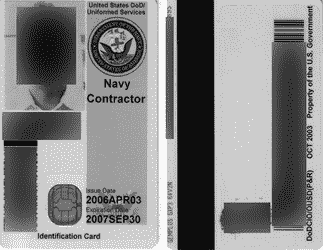

图 5-1：海军通用访问卡

类型 2 认证对象不必是物理实体。它也可以是数字实体，例如*数字证书*：存储在计算机上的一段数据，当计算机尝试访问另一个系统时，用于标识和认证它。例如，当一个系统查询数据库中的信息时，该系统可能会向数据库发送一个数字证书，以证明它有权进行查询。该证书存储在硬件中，有时在一个特殊的芯片中，称为*受信平台模块（TPM）*。TPM 和系统中其他硬件之间有许多安全层，这使得黑客如果没有物理接触到计算机，是极其困难的访问证书的。我们将在第九章中更详细地讨论证书和加密。

#### 类型 3：你是谁

尽管类型 1 和类型 2 认证提供了很大的保护，但它们都有一个相同的缺点：它们都不能唯一地与某个人绑定，这使得别人可能会使用他们的凭证。这就是类型 3 认证的优势所在。类型 3 系统使用一个人的独特生物识别签名作为认证方法。

*生物识别*是指一个人身上的某种身体或行为特征。最常用的用于身份验证的生物识别示例是指纹，但其他例子还包括视网膜扫描、面部识别、声音，甚至是 DNA。生物识别也可以是某种行为，比如一个人的走路方式或签名。从理论上讲，这些特征是独一无二的，意味着世界上没有其他人拥有与之相同的特征。表 5-1 列出了一些常用的生物识别方式。

表 5-1：生物识别类型

| **生物识别类型** | **扫描数据** |
| --- | --- |
| 指纹扫描仪 | 手指垫上的螺旋纹路 |
| 手部扫描仪 | 手指和手掌上的独特图案 |
| 虹膜扫描仪 | 眼球的形状 |
| 视网膜扫描仪 | 眼球后部血管的图案 |
| 面部扫描仪 | 面部的图案和形状 |

要设置生物识别系统，使用该系统的人必须提供他们的生物识别签名，这些签名会存储在数据库中。例如，如果你的工作场所想在所有门上使用指纹扫描仪，它必须扫描你的指尖。当你在门口使用扫描仪时，收集到的签名将与存储在数据库中的签名进行比较。如果它们相同，你就可以进入。

这是一个棘手的过程，因为每个扫描仪的灵敏度不同。例如，如果后门的扫描仪过于敏感，即使它应该允许你通过那扇门进入，它也可能会拒绝你的进入。这种情况发生的频率被称为*误拒绝率*（*FRR*）。另一方面，如果扫描仪的灵敏度过低，它可能会允许一个不在数据库中的人通过。这种情况发生的频率被称为*误接受率*（*FAR*）。设计这些系统的人必须弄清楚如何设置扫描仪，以最小化 FRR 和 FAR 两者。我们称这个最佳平衡点为*交叉错误率*（*CER*）。寻找 CER 的需要使得安装生物识别系统成为一个反复试验的过程。此外，扫描仪的类型会影响系统的成功，因为简单的扫描仪不像更复杂的扫描仪那样能够创建完整或复杂的签名。

类型 3 是最强的身份验证形式。尽管电影中常常让人误以为如此，但伪造生物识别签名是极其困难的，尤其是在使用高质量扫描仪的情况下。一些目前使用的扫描仪甚至可以检测手指的心跳，以确定它是否连接到一个活人身上。这意味着，要获取签名，必须由正确的人使用扫描仪。这大大减少了敌人入侵系统或窃取凭证的能力，而这种能力在类型 1 或类型 2 身份验证中更容易实现。

除了高质量的扫描仪，这些系统还需要大型数据库来存储签名。这些要求使得生物识别技术的实施成本相当高。尽管扫描仪已经变得便宜，但放置在移动设备中的扫描仪并不像独立系统中使用的扫描仪那样精确。这就导致了生物识别技术的第二个问题：扫描不良。因为每个签名都非常独特，任何变化都会导致 FRR 错误。例如，如果你烧伤了用于指纹扫描的手指，扫描仪可能就无法工作了。即使是像刮胡子这样的行为，也可能会让面部扫描仪产生混乱。

生物识别技术可能难以使用和调整，因此，如果生物识别系统发生故障，拥有一个备份身份验证系统非常重要。例如，在带有指纹或面部扫描仪的手机上，身份验证系统通常会提供一个选项，让你在扫描仪无法识别身份时输入密码。这样，你可以随着时间的推移调整生物识别扫描仪的灵敏度，而不用担心它会把你锁定在无法访问的系统之外。

#### 类型 4 和类型 5：你做的事情和你所在的地方

其他两种身份验证类型通常是作为多因素身份验证的一部分来补充其他身份验证形式，而不是作为独立的身份验证方法。它们是多因素身份验证的一部分（稍后将详细讨论）。

你所做的事情（类型 4）是你必须采取的动作来进行身份验证。例如，为了进入一个疯狂科学家的秘密实验室，你可能需要拉动书架上的某本书来揭示入口。只有知道该拉哪本书的人才能完成身份验证。类型 4 的另一个例子是*验证码*，它是一个证明你是人类而不是自动登录脚本的测试。通过选择正确的图片，例如从一组照片中选出汽车的图像，你证明自己是一个真实的人。然而，类型 4 身份验证方法本身并不能提供足够的保护，因为任何人只要知道需要做什么，就能执行这个动作。（在疯狂科学家的例子中，敌人可能会通过裂开的门或透过别人肩膀看到某人做出的选择，从而完成身份验证。）

你所在的位置（类型 5）是进行身份验证时人的位置。如果此人不在正确的位置，身份验证将失败。单独使用类型 5 时，其缺陷与类型 4 相似；仅凭此方法无法验证该位置的人是否是正确的人，除非结合其他身份验证方法。然而，当与其他身份验证类型配合使用时，类型 5 能为防止黑客入侵账户提供额外的保护。例如，如果你注册账户时设置的位置是阿肯色州的小石城，而有人尝试从香港登录该账户，系统可以识别出这可能不是你，并发送警报。尽管在互联网上伪造位置是可能的（第六章会讨论这个话题），但这种保护增加了另一个防御层，攻击者必须绕过这一层才能访问账户。防御层越多，攻击者突破系统的难度就越大。

### 多因素认证

使用多种身份验证方法被称为*多因素认证*。它可以弥补任何单一认证方法的不足。回顾类型 1 认证的问题，*你知道的事情*是可以猜测的，可以写下来或转交给其他人，任何人都能使用它，不管他们是否创建了它。但是，如果我们在已经使用类型 1 的系统中加入类型 2 认证，我们可以解决其中的许多问题。因为用户必须拥有某个额外的验证项来进行认证，例如来自短信的验证码，攻击者就无法仅凭猜测密码来进入账户。

如果你想保护你的系统免受黑客使用现代技术的攻击，你必须启用多因素认证。现在最常见的多因素认证策略是将电话号码或电子邮件地址添加到账户中，并在你尝试登录时向该地址发送验证码。然后，在输入密码后，系统会提示你输入该验证码。这可能看起来像是进入社交媒体账户时不必要的麻烦，但如前所述，攻击者可以通过多种方式获取密码。启用多因素认证会让攻击者更难以突破，许多情况下，他们在遇到障碍后会放弃。至少，它能为你提供额外的时间来应对攻击者的行动，在他们突破账户之前。

增加额外防御是一种安全策略，称为*深度防御*。基本上，你设置的障碍越多，攻击者想轻易进入的难度就越大。这不仅有助于弥补单一防御（例如可猜测密码中的漏洞）的不足，还能为白帽黑客提供时间，让他们察觉、了解并应对黑客的活动。如第一章所述，意识对攻击者来说是致命的；你构建的防御层越多，白帽黑客越有可能察觉到恶意活动并阻止它。

## 授权

一旦用户通过身份验证，他们必须被*授权*进行某些操作。之前例子中的友好骑士并不会仅仅因为他友好就进入公主所在的塔楼。相反，他可能被授权进入城堡，但不能进入塔楼。与身份验证类似，授权是基于你在组织中的身份。友好骑士和国王可能都能进入城堡，但只有国王、公主和公主的随从才可能被授权进入公主的塔楼。

授权至关重要。举一个更现代的例子，如果你的公司有两名工程师被授权修改 web 服务器，追踪到底是谁做了修改可能会变得很困难。当攻击者突破或发生恶意行为时，找到源头可能会更加复杂。如果只有一名工程师被授权对 web 服务器进行修改，那么你就能明确知道谁是负责任何修改或可能发生的恶意行为的责任人。

*安全内核*程序是操作系统的一部分，通常用于强制执行系统上更改的授权。安全内核如何执行授权取决于所使用的访问控制方案类型。有五种常见的访问控制方案：强制访问控制（MAC）、基于规则和基于角色的访问控制（这两者通常缩写为 RBAC，但为了避免混淆，我会使用完整名称）、基于属性的访问控制（ABAC）和自主访问控制（DAC）。让我们逐一看看每种方案。

### 强制访问控制

MAC 是一个集中式系统，其中中央权威严格执行访问控制。MAC 提供了对谁可以访问文件、系统或软件的高度控制，但它不允许太多灵活性。系统会根据中央安全策略测试所有访问资源的尝试，以决定是否授予访问权限。如果请求的访问类型不完全符合政策，就会被拒绝。由单一管理员或管理员组控制该策略。

为了创建这样的策略，管理员可能会使用标签来确定一个人访问每个资源所需的授权类型。例如，军方使用一个包含三个基本类别的分类系统：机密、秘密和绝密。任何新文件都会根据策略分配一个分类。如果一个文件被赋予绝密分类，只有那些拥有绝密许可的人才能访问它，而拥有秘密许可的人无法覆盖系统来查看绝密文件。

### 基于规则的访问控制

基于规则的访问控制使用特定的规则来决定授予何种授权。这是一个极其严格的系统。上下文的变化几乎不重要，如果没有规则与访问请求匹配，大多数系统会使用*隐式拒绝*，意味着它们会自动拒绝该操作。这有助于防止基于规则的访问控制策略变得过于臃肿。在系统中定义你希望发生的事情要比试图追踪你不希望发生的事情容易得多。尽管如此，该系统迫使管理员映射每一个可能的授权操作，否则人们很可能会被拒绝。在某些环境中，比如有许多需求的复杂环境，使用基于规则的访问控制系统可能不可行。与 MAC 不同，基于规则的方案必须对每个资产单独设置规则。

一个很好的基于规则的访问控制示例是文件权限。大多数操作系统根据规则授予文件访问权限，这些规则会考虑谁正在访问文件以及他们被授权执行的操作。每个文件都有一套这些规则，系统读取这些规则来决定是否授予访问权限。例如，系统管理员可能能够读取和写入（即*更改*）系统文件，而标准用户只能读取该文件。

### 基于角色的访问控制

基于角色的访问控制使用用户的角色来决定他们对系统的访问权限。与基于规则的访问控制不同，角色适用于整个系统，而不是像文件这样的单独对象。例如，如果你在人力资源部门工作，你可能会被赋予人力资源官员的角色。这意味着，当你登录到计算机时，你可以访问人力资源部门的共享文件夹并登录员工记录数据库。

基于角色的访问控制比 MAC 或基于规则的访问控制提供了更多的灵活性。系统管理员可以根据需要创建新的角色，以提供所需的访问级别。这种方法还使得管理大量人员的访问权限变得更加容易。例如，每个在呼叫中心工作的人可能需要访问一组资源，如客户账户列表。通过创建“呼叫中心员工”角色，系统管理员可以轻松地为每个呼叫中心员工授予执行其工作所需的权限，而无需进入系统并逐一授权每个资源的访问权限。

基于角色的访问控制的主要缺点是，它往往导致*特权蔓延*。特权蔓延是指个人或团体逐渐获得更多的授权，直到他们有权限做超出其工作要求的事情。当控制措施无法防止账户执行其实际上没有授权的操作时，这就成为一个问题。例如，你可能暂时接管公司中的一个角色，直到新员工被聘用。如果新员工加入后该角色授予的授权依然有效，你可能会有不该有的资源访问权限。

角色也可能过于宽泛。为了保证大量人群符合一个角色的要求，每个角色可能会有广泛的访问权限。例如，管理员角色通常会获得完整的权限集，无论该用户是否需要所有管理员功能。或者一个人力资源员工可能不需要查看与员工相关的所有文件。他们可能只是一个招聘人员，所以不需要访问当前员工的文件。

这样的广泛访问角色使得黑客更容易获取文件、账户或系统的访问权限。为了防止特权蔓延，安全专家通常应用最小权限和职务分离的概念。拥有*最小权限*的人仅拥有完成工作所必需的权限。例如，平面设计师可能能够更新网站上的图片，但不能登录管理员界面并更改网站名称。具有*职务分离*的任务要求多个人一起完成。例如，可能需要两个人来创建支票并支付供应商：一个人起草支票，另一个人在验证支票是有效支付后签署它。

### 基于属性的访问控制

ABAC 与基于角色的访问控制在灵活性上相似，但有助于缓解特权蔓延的问题。从本质上讲，ABAC 使用描述符（恰如其分地称为属性）来确定一个人或系统需要何种访问权限。你可以把每个属性看作是一个小角色。当某人或系统尝试访问资源时，系统会检查他们的属性来授权访问。

该方案解决了之前提到的人力资源问题。在 ABAC 系统中，某个部门的成员会在其账户中获得*人力资源*属性。然而，如果他们还是招聘人员，他们会同时拥有*招聘人员*属性。人力资源属性允许他们读取一般的人力资源文件，但由于他们还拥有招聘人员属性，他们无法读取现有员工的文件。

属性可以以多种方式组合，允许你在保持基于角色的访问控制的广度和灵活性的同时，进行细化的访问控制。特权蔓延依然是一个可能性；然而，使用 ABAC 更容易防止这种情况的发生，因为它可以在不使系统变得繁琐的情况下，严密限制属性的访问，就像严格的 MAC 系统一样。

### 自主访问控制

DAC 是所有访问控制系统中最灵活但最不安全的。在 DAC 下，谁拥有对象，无论是文件、应用程序还是系统，谁就决定谁有权访问。这为系统带来了极大的灵活性，因为拥有者可以根据需要授予或拒绝访问权限。但这个系统也不安全，因为没有中央权威决定如何授予或拒绝访问权限，从而增加了未经授权访问的可能性。

DAC 的一个很好的例子是在文档服务中，例如 OneDrive 或 Google Drive。当你在这些服务中创建文档时，它会被放入你的个人账户。然后，你可以通过与第三方共享文件来授予访问权限，例如与同一项目的同事。没有任何系统告诉你谁可以或不能接收该文档。由你决定与谁共享，一旦他们不再需要访问，你可以将其从共享中移除。

这种方案可能会导致一些问题；例如，如果你输入了错误的电子邮件地址，或者将文件分享给了另一个部门的员工，而他并不需要查看该文档。因此，我们通常只将 DAC 用于非常有限的应用场景，比如共享文档，而不是像 MAC 那样作为完整的访问控制系统。

## 会计

*会计*是确保每个在系统或网络上执行的操作都会生成记录。虽然会计不能防止攻击者直接访问账户或系统，但它对于维持组织的安全至关重要。如果你无法在任何时刻验证账户或系统中的活动，你将无法知道自己是否维持了安全。此外，如果发生事故，可能很难找到攻击的细节并将攻击者从环境中移除。因此，维持会计记录的过程很重要：启用日志记录和定期审计。

### 日志记录

日志记录是捕获系统在运行期间发生事件的统称。每个系统都有自己的日志记录方法。例如，如果您在记录一个应用程序，日志将包括应用程序运行时应用程序代码的确切操作记录。如果您在记录一个帐户，它将包括帐户何时登录、从哪里登录以及访问了哪些内容的时间线。大多数日志记录在处理事件时遵循类似的约定。这包括严重性级别、收集的信息以及日志存储的位置。

日志中的事件通常按级别分类，以表示问题的严重性。标准排名方法称为 *Syslog*，从 7 开始为最不严重，到 0 为最严重。表 5-2 列出了每个级别及其相关的严重性。

表 5-2：日志严重性级别

| **值** | **严重性** | **描述** |
| --- | --- | --- |
| 0 | 紧急 | 系统不可用。 |
| 1 | 警报 | 必须立即采取行动。 |
| 2 | 严重 | 严重条件。 |
| 3 | 错误 | 错误条件。 |
| 4 | 警告 | 警告条件。 |
| 5 | 通知 | 正常但需要特别处理。 |
| 6 | 信息 | 信息性消息。 |
| 7 | 调试 | 调试消息。 |

最重要的事件，在级别 0 时，表示系统硬件发生了故障，导致系统崩溃。级别 1 表示导致系统运行不正常的故障，例如系统崩溃。级别 2 用于表示导致系统内部操作故障的故障，例如应用崩溃，尽管系统仍在运行。级别 3 包括导致错误但不会中断操作的情况；例如，尝试访问一个已不存在的文档可能会导致错误，但该错误可能不会导致计算机崩溃。级别 4 和 5 提供需要额外关注的信息，但通常不被视为安全风险。一个例子可能是用户在一小时内未能登录其帐户。级别 6 事件提供有关系统所做操作的信息：例如，它是否打开了文件或进行了授权连接。我们仅在极少数情况下使用级别 7，当我们尝试查找系统底层操作的问题时。通常，级别 7 默认未开启，您应该仅在极其小心的情况下使用它。日志记录会生成大量条目，单独使用级别 7 事件可能会填满日志存储。

通常，你应该尽可能记录更多的信息，同时保持信息的实用性。如果你记录的太少，可能会错过帮助你理解事件的关键信息。如果记录的太多，你会被大量数据淹没，这些数据可能会掩盖你需要快速找到的关键信息。许多日志代理允许你筛选事件，以使日志更易于处理。你可以筛选出级别为 6 的事件，比如成功登录，以便更容易找到其他事件，比如失败的登录尝试。但你必须小心调试此筛选，以免错过恶意事件。（我稍后将在本章讨论这些恶意事件可能的表现。）

此外，你还需要决定日志保留的时长。组织通常通过考虑日志类型、日志包含的信息量、可用存储空间、是否有法律或合规要求以及其他因素来做出这个决策。主要的关注点是，如果你需要回溯到某个特定事件或日期，你是否能够确定发生了什么。例如，如果你发现某个员工的电脑遭到攻击，你需要访问该电脑在当天的所有网络活动，以便确定黑客的行为。

大多数组织以前会保留 90 天的日志，但随着存储成本的降低，许多组织现在已转向保留年度日志。它们通常将日志存储在大容量服务器上，这些服务器配有固态硬盘，以最好地保护它们免受可能导致系统离线或删除数据的问题。无论选择何种媒介，你都应该将其存储在异地。这样，日志更有可能在灾难发生时（例如勒索软件感染）存活下来。云服务也提供为客户存储日志的能力。

任何人都不应具有写入访问权限——即修改日志的能力——或从系统中删除日志的能力。日志的整个意义在于它准确记录了系统或网络上发生的每个事件。如果一个人可以修改这些事件，日志就失去了可信度。使日志不可编辑有助于消除内部威胁。

### 审计

与捕捉日志信息同样重要的是查看这些信息。我们*审计*不仅仅是为了发现恶意活动，还为了日常维护。为了使审计有效，我们不能仅在出现问题时进行审计。我们需要在问题发生的第一时间就发现它们，避免硬件故障、软件漏洞或黑客攻击对我们的系统造成重大损害。

正如前面提到的，系统上的每个事件都应该产生一个日志。决定审计多少这些日志可能有些棘手。如果审计过多，你会浪费时间在处理正常事件上。如果审计过少，你会错过恶意活动的关键指标。相反，你需要优先考虑组织的关键资产。例如，审计组织中每台工作站可能并不现实，但你可以优先考虑每天检查网络上的关键服务器。

即使你缩小了关键资产的范围，可能还有成千上万个事件需要审查。为了进一步缩小范围，审计的下一步是设置关于重要事件的警报。这就是 Syslog 可以派上用场的地方。通过使用 Syslog 标准中的各种严重级别，你可以直接收到高级别的警报。例如远程登录、密码更改和账户锁定等事件也可能生成警报。

但是，设置警报可能仍然不足以捕捉到组织中的恶意活动，因为攻击者已经擅长隐藏行踪。对网络或系统进行公开攻击的同时，对手会结合不同的小攻击，最终导致更大的妥协。他们还非常有耐心，在最终找到入侵途径之前，会慢慢尝试不同的攻击。例如，他们可能不会通过快速连续尝试几个密码来暴力破解登录，而是每六个小时尝试一次密码。一旦找到正确的密码，他们可能会等待数周甚至数月才登录到账户。然后他们会坐下来等待，观察内部网络流量或系统活动，收集信息用于最终的大规模攻击，感染数据库以勒索软件。

这种攻击方法论单靠警报很难检测出来，因为直到对数据库的攻击之前，所有的活动都是寻常的。即使可能存在异常指标——例如黑客从不寻常的地点登录——这些指标可能也不足以触发警报，特别是如果奇怪的事件发生在多个设备上。

为了更好地跟踪这种类型的恶意行为，你可以使用*安全信息和事件管理*（*SIEM**）系统。SIEM 系统会将来自你组织内所有设备和网络的日志进行关联。这意味着，你组织中捕获的每个事件都会被输入到 SIEM 系统进行处理。然后，SIEM 系统会剔除正常事件或任何假阳性，并提供每个可疑事件的审计日志。你还可以将其编程为在发生关键事件时生成警报，比如针对某个账户的暴力破解攻击。最好的部分是，由于 SIEM 系统从多个设备获取日志，它可以关联活动以识别可疑行为。例如，远程登录到工作站并不一定是可疑的。但如果更改防火墙以允许远程连接到工作站，然后进行远程连接，这可能会引起警报。SIEM 系统会特别记录该活动的日志。如果该工作站随后以管理员身份连接到数据库并开始下载所有文件，这一系列异常事件可能会触发一个全面的警报。

SIEM 系统非常强大，但它们需要维护。从本质上讲，SIEM 系统仍然依赖规则和其他指标来判断某个事件或事件集是否是恶意的。随着组织的演变，它们必须更新这些规则，以确保这些规则与当前系统和网络的状态保持一致。例如，如果你添加了一个新服务器，你需要将其日志添加到 SIEM 系统中，并根据该服务器提供的服务创建规则。如果你未能维护好 SIEM 系统，你可能会错过一些关键事件，这些事件本可以帮助你发现潜在的安全漏洞。

### 攻击指标

*攻击指标（IoA）*是指指出网络、设备或账户上发生恶意活动的事件。这些活动可能是恶意软件、黑帽黑客或内部威胁所导致的。表 5-3 描述了几个常见的 IoA、每个的示例以及它们可能意味着什么。这份清单并不详尽无遗，但它应该能让你对在设置日志记录、审计或 SIEM 规则时需要考虑的内容有个较为清晰的了解。

表 5-3：攻击指标

| **IoA** | **示例** | **可能的活动** |
| --- | --- | --- |
| **异常的外部流量** | 设备连接到已知的恶意 IP 地址；设备使用不寻常的协议，如 FTP；大量查询某个网站或一组网站 | 恶意软件联系命令和控制服务器；文件被移除；后门被访问 |
| **内部设备运行网络扫描** | 工作站或服务器发送 ping 数据包 | 恶意软件或黑帽黑客寻找其他可以攻击的系统 |
| **来自业务区域外的账户登录** | 来自外国的登录；在同一时间从多个不同地点的登录 | 黑帽或僵尸网络窃取账户凭证 |
| **系统设置的更改** | 防火墙更改或端口更改以允许新流量连接，例如打开 FTP 端口；新增系统账户；给账户赋予管理员权限；创建新的自动化任务 | 系统被恶意软件或黑客攻击 |
| **电子邮件设置的更改** | 创建了新的收件箱规则；新的邮件流规则；某账户的电子邮件活动剧增 | 电子邮件账户被侵入；利用电子邮件发送垃圾邮件或网络钓鱼攻击 |
| **应用程序或系统进行不正常的连接** | 外部网络中的系统连接到内部系统；应用程序进行新的或不寻常的请求，例如尝试从只读数据库下载数据；系统尝试访问其未授权或不在正常工作流程中的设备（例如，前台工作站试图连接到人力资源数据库） | 应用程序或系统被恶意软件或黑客攻击；攻击者利用这种侵入尝试从其他系统窃取数据或获取访问权限 |
| **多次快速失败** | 多次登录失败尝试；多次访问请求失败；多次系统故障 | 黑客试图访问系统或账户，例如，通过暴力破解账户登录；可能试图利用系统故障绕过正常的安全控制 |
| **未经授权的程序或进程运行** | 设置为开机启动的程序，并且不是正常业务软件的一部分；进程占用了大量内存或 CPU 资源 | 恶意软件，特别是木马 |
| **正常操作时间之外的活动** | 在非工作时间进行的网站查询、发送的电子邮件、运行的应用程序或登录操作 | 系统被恶意软件或黑客攻击，包括可能的后门或木马 |

## 练习：在 Windows 10 和 macOS 中设置账户

了解身份验证和授权系统如何影响你对系统的使用，最好的方法是管理家用计算机上的账户。无论你使用的是 Windows 还是 Apple 系统，你都应该能够创建账户，并控制它们对系统某些部分的访问权限。在这个练习中，你将配置 Windows 或 Apple 计算机上账户的安全设置。然后，你将创建一个新账户并授予其访问共享文件夹的权限。虽然这个过程很简单，但它涉及了本章讨论的所有身份验证和授权原则，并能让你真实地感受到如何保护这些系统免受不必要的访问。

### Windows 10

Windows 自带多种内建安全功能，您可以使用它们保护账户免受未经授权的访问。许多这些功能默认已启用。但检查这些功能，确保系统得到最佳保护，是个好主意。为此，请在屏幕左下角的搜索栏中输入**安全**，任务菜单会出现，列出多个应用程序。点击**Windows 安全**以打开安全设置。图 5-2 展示了应该打开的 Windows 安全对话框。

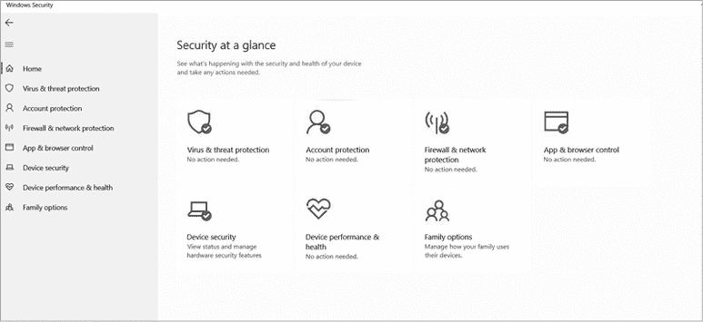

图 5-2：Windows 安全对话框

如第四章所述，这是访问 Windows 系统包括的许多安全功能的地方。这次，您将点击**账户保护**，图 5-3 展示了相应的对话框。

在这个对话框中，您可以看到与账户登录相关的设置。顶部应显示您当前登录的账户名称。紧接着下面是*Windows Hello* 登录选项。Windows Hello 提供通过面部结构进行生物识别登录，从而解锁系统。（请注意，此功能仅适用于支持的系统，并且需要配备摄像头。）尽管生物识别登录比传统密码更安全，但需要注意的是，此功能在识别面部和允许其他形状相似的面孔登录时，曾出现过一些问题。

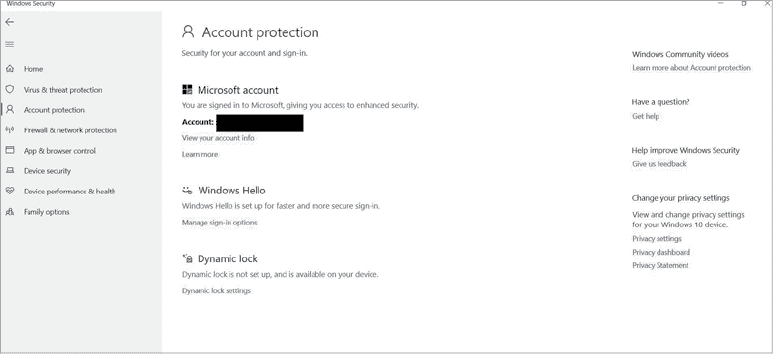

图 5-3：账户保护对话框

紧接着 Windows Hello 下面是*动态锁定*选项。此功能允许您的系统通过蓝牙与另一设备（如笔记本电脑、平板或手机）配对，并在与该设备失去连接时自动锁定计算机屏幕。动态锁定可以在您必须离开系统时提供安心，但如果您频繁移动并需要不断解锁屏幕，可能会感到有些麻烦。此外，尽管蓝牙是短距离无线技术，它仍然可以在意想不到的较远距离内连接。例如，您离开办公室去休息室拿一杯咖啡，可能并不足以让计算机锁定，因此计算机可能会保持打开状态，任何路过的人都可以访问。

现在您已经对 Windows 10 中的一些安全功能有了更多了解，接下来我们来看一下您可以更改的具体账户设置。在账户保护对话框中，点击**管理登录选项**，图 5-4 显示了应该出现的对话框。

通过这个对话框，您可以查看和更改系统登录到账户的方式。选项列表足够多样，既能提供所需的安全性，又能保持易用性。请记住，如果密码或其他身份验证操作不容易实现，用户可能会错误使用它，甚至完全绕过。

*Windows Hello 指纹*选项是一个生物识别指纹扫描器。它需要内置或附加的指纹扫描设备才能工作（正如你所看到的，图 5-3 中的电脑没有这个选项）。*Windows Hello PIN*选项提供了一个 PIN，你可以用它来登录，作为传统密码的替代方式。它设计为更快速地使用；但请记住，你仍然需要确保创建一个长且难以猜测的 PIN（至少六到八位数字），以防止暴力破解攻击。

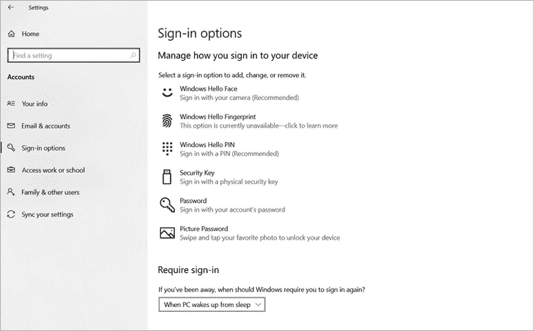

图 5-4：登录选项对话框

*安全密钥*选项会生成一个令牌——一种二级身份验证因素——其唯一密钥使你能够登录系统。你必须拥有一个物理安全令牌与此设备配对。通常，这些密钥只在能负担得起购买它们的企业中使用，但也有一些价格便宜的商业令牌可用，例如 Duo 或 Google Authenticator 手机应用。

Windows 还提供了两种密码选项：传统密码和图片密码。图片密码要求你选择一张图片并在其上绘制。例如，你可以选择一张脸的图片，然后在眼睛周围画圈。要访问系统，你需要在登录时看到该图片并复制你的操作。这是类型 4 身份验证（你做的事情）。通常认为它是最弱的身份验证方式，因为大多数人的手势遵循图片的自然路径。例如，如果你选择了一个旗帜和旗杆的图片，你可能会沿着旗杆画一条线，这对于攻击者来说相对容易猜测，因为这是一个可预测的动作。

花点时间尝试每个选项，看看哪个最适合你。仅仅因为你一直使用密码，并不意味着它最适合你。添加一种不同类型的身份验证可能会为你的设备提供更好的安全性或功能。

在继续之前，让我们再看最后一个设置。在不同的登录选项下方有一个*要求登录*的下拉菜单。这个选项让你决定系统在一段时间未活动后应何时要求你重新登录：有两个选项，分别是*从不*和*当电脑从休眠中唤醒时*。你应该始终要求在系统唤醒后重新登录。这可以防止你在不使用系统但忘记退出时，系统遭到未经授权的访问。此设置默认应开启。

#### 添加新账户

现在你已经选择了安全设置，你可以创建一个新账户。为此，点击左侧边栏中的**家庭和其他用户**选项。图 5-5 显示了出现的界面。

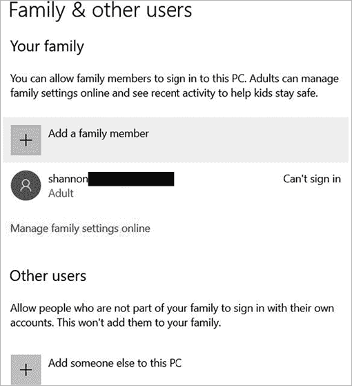

图 5-5：家庭和其他用户对话框

该对话框允许你将其他帐户添加到系统中。顶部是*您的家庭*部分。在 Windows 10 生态系统中，家庭成员帐户具有额外的审计功能和家长控制，以帮助保护孩子安全。此功能还允许你在帐户之间共享应用程序和其他购买。但在本练习中，我们将重点关注第二部分，*其他用户*。此选项允许你向操作系统添加另一个传统的用户帐户。

现在我们来添加一个新帐户。在本练习的后面，你将学习如何在当前帐户和新创建的帐户之间共享文件夹。点击*将其他人添加到此计算机*旁边的加号图标。会弹出一个对话框，询问新用户如何登录并提供一个相应的 Microsoft 帐户。如果新用户没有 Microsoft 帐户，点击**我没有此人的登录信息**。同样，在下一页中，点击**不使用 Microsoft 帐户创建**。图 5-6 展示了现在出现的对话框。

为系统创建一个本地帐户。*本地帐户*只与一台计算机关联，而不是属于更大的网络。在图 5-6 中，我创建了一个名为 Sparkle Kitten 的用户，但你可以将新用户命名为任何你喜欢的名字。填写信息后，完成时点击**下一步**。

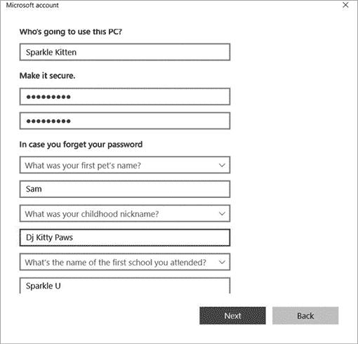

图 5-6：创建新帐户

创建帐户后，你需要决定是否将其设为管理员帐户，这可以在“更改帐户类型”对话框中进行选择（图 5-7）。

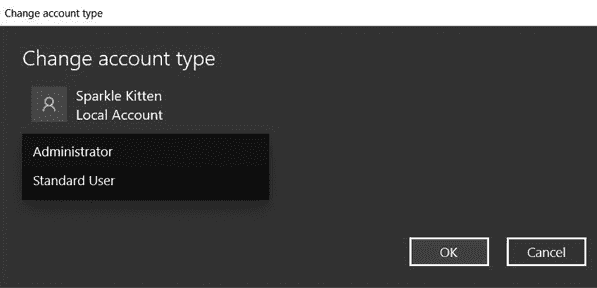

图 5-7：更改帐户类型对话框

管理员帐户可以访问系统文件并对系统进行其他可能有害的更改，因此在将某人指定为管理员帐户之前，请确定他们是否真的需要这样的权限。记住在做出此决定时要遵循最小权限原则。在本练习中，标准用户帐户就足够了。

#### 分享文件夹

访问控制的一个重要部分是能够基于最小权限原则和需要知道的原则来限制控制。现在让我们通过创建一个文件夹并将其与刚刚创建的新帐户共享来应用这些原则。在原始帐户中右键点击桌面空白区域，然后点击**新建**▶**文件夹**来创建一个新文件夹。文件夹创建的位置无关紧要，但“文档”或“桌面”可能是最方便的位置。

创建文件夹后，你需要访问其属性以共享它。右键点击文件夹，然后点击**属性**。图 5-8 展示了弹出的对话框。

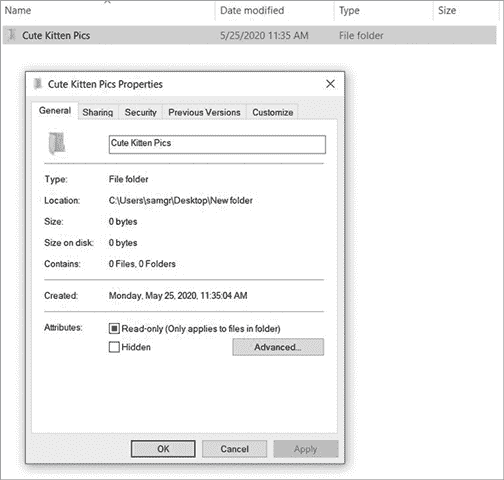

图 5-8：文件夹属性

打开“属性”对话框后，点击顶部的**共享**标签。此标签包含你用来共享文件夹的设置（图 5-9）。

在此对话框中，点击**高级共享**，这将弹出图 5-10 所示的对话框。

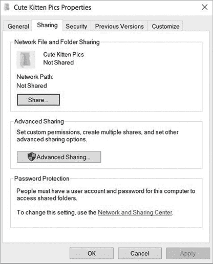

图 5-9：共享对话框

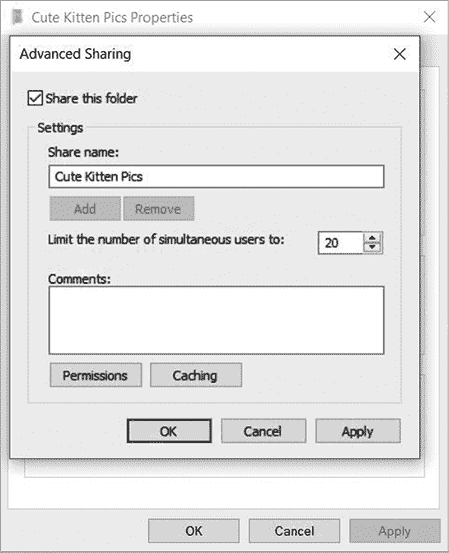

图 5-10：高级共享对话框

选择**共享此文件夹**选项，这会打开一个新选项，询问你输入共享名称，并显示一个“权限”按钮。现在，点击**权限**（图 5-11）。

图 5-11：共享权限

共享权限对话框与你在许多访问控制系统中可能看到的类似。对于每个组或用户，它会显示与你的文件夹对应的权限列表。虽然这些权限很基础，但它们提供了全面的控制。*读取*权限允许用户查看文件夹中的内容，但不能删除或重命名文件夹。*更改*权限允许用户重命名或删除文件夹，而*完全控制*则授予用户完全访问权限，包括读取、写入、重命名或删除文件夹。

要添加特定用户，点击**添加**按钮，显示图 5-12 所示的对话框。

在这里，你可以将其他用户添加到文件夹的权限列表中，然后赋予他们相应的权限。只需在对话框底部附近的白色框中输入用户的名称。因为我将我的新用户命名为 Sparkle Kitten，所以我输入了这个名字。接下来，点击**检查名称**，系统应该会自动填写完整的用户名，如图 5-12 所示。如果用户名没有按图示填写，确保检查拼写。必须精确无误才能找到正确的用户名。

点击**确定**，你选择的用户应该出现在“共享权限”对话框中的“每个人”下方的列表中。然后你可以点击该用户名并设置其权限。通常，最好默认设置为仅有读取权限，这样用户可以查看文件夹中的内容，但不能进行更改。

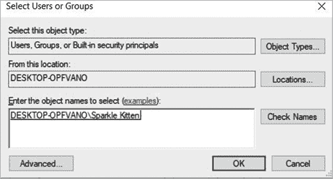

图 5-12：添加用户

接下来，让我们看看属性对话框中共享标签旁边的安全标签。安全标签提供了与共享相同的一些功能。本质上，安全标签显示了所有能够访问该文件或文件夹的用户或组以及他们的权限。你可以像使用高级共享功能一样使用此标签：添加用户并为其赋予文件夹的权限。需要注意的是，你放入共享文件夹中的任何文件或文件夹，都必须与共享文件夹具有相同的用户权限，用户才能访问它们。共享文件夹的权限仅授予用户访问文件夹的权限，而不一定是其中的内容。图 5-13 显示了安全标签的示例。

图 5-13：安全标签

现在你已经知道如何配置账户的安全设置，添加用户，并授予该用户查看共享文件夹的权限。虽然这个练习看起来可能不那么重要，但我们已经涵盖了几乎所有的访问控制原则，包括身份验证、授权、最小权限，甚至是 DAC 模型。现在让我们来看看如何在 macOS 上配置安全设置。

### macOS 的访问控制

macOS 提供了自己的一套访问控制和身份验证机制。一个挑战是，苹果系统简化了许多在 Windows 环境中通常可以访问的控制项。这让用户对如何管理系统的控制较为有限，除非他们准备深入系统文件并手动编辑。这不建议普通用户操作，除非你有足够的经验，因为不小心修改系统文件可能会破坏系统。在这一部分，我将提供一个关于你可以使用的控制项的概述，并告诉你在哪里可以找到它们。

#### 账户管理

让我们从 macOS 的账户管理开始。这个操作系统提供了一些有用的控制项，你可以用它们来进一步保护你的系统，特别是系统自动注销的时间和方式。首先，点击屏幕左上角的苹果符号，然后点击**系统偏好设置**来打开该应用程序（见图 5-14）。

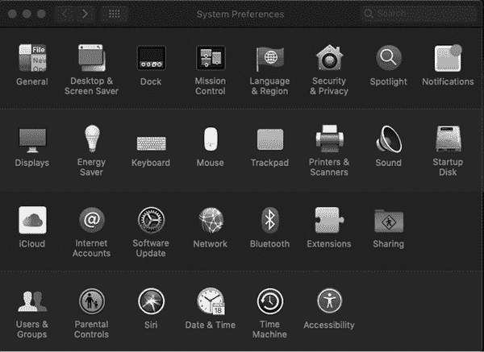

图 5-14：系统偏好设置应用程序

这个应用是你管理系统大多数设置和配置的一站式工具。点击**安全与隐私**，以显示图 5-15 中的对话框。

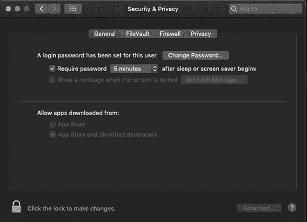

图 5-15：安全与隐私对话框

如对话框中所示，选择的选项不多。你应该设置一个定时器，用来确定系统在要求输入密码之前的非活动时间，最好设置为至少五分钟，若有更高的安全需求则可以设置得更低。你还可以通过点击左下角的锁定图标、输入密码，然后点击右下角的**高级**按钮，如图 5-16 所示，访问高级设置。（你需要有管理员权限才能执行此操作。）高级设置允许你通过要求输入管理员密码来增加系统的安全性，这样只有管理员才能更改影响多个用户的设置。你还可以更改非活动退出定时器。这个定时器与之前的非活动定时器不同，因为它会完全注销你，而不仅仅是要求你再次输入密码。最好将此选项设置为最多 30 分钟。

配置这些设置后，返回系统偏好设置。然后点击最底行图标中的**用户与群组**。此时应该会打开一个对话框，显示系统中的所有用户。再次点击左下角的锁图标并输入密码，你可以访问每个用户的附加设置。在“用户与群组”对话框的底部，点击**登录选项**以显示图 5-17 所示的对话框。

这些设置主要与登录菜单上出现的选项有关，例如密码提示或在未先登录的情况下关闭或重启计算机的功能。你还可以通过点击“登录选项”下方左下角的加号图标来为系统添加新用户。现在让我们来看一下如何在用户账户之间共享文件。

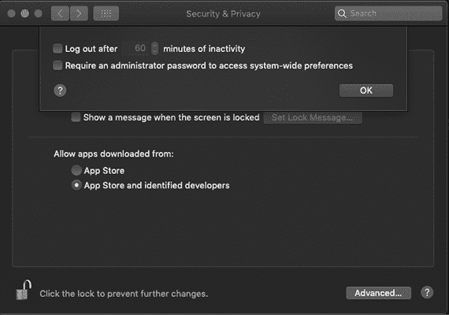

图 5-16：高级安全性与隐私设置

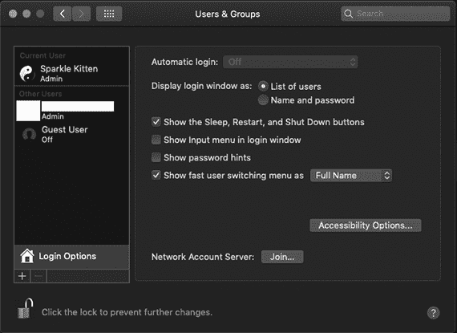

图 5-17：登录选项

#### 文件共享

macOS 简化了文件共享，每个系统都有一个与用户账户关联的内建文件共享。你可以通过一个集中式对话框来控制并授予对该文件共享的访问权限。返回系统偏好设置并点击**共享**图标以显示其对话框，如图 5-18 所示。

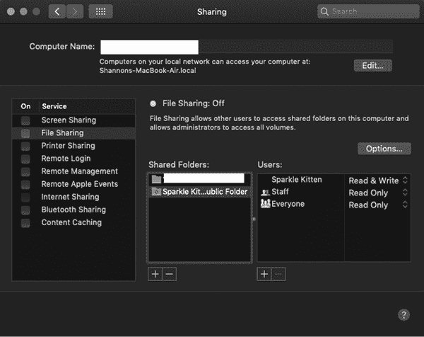

图 5-18：共享对话框

在这个对话框中，你可以控制所有形式共享的设置，包括远程登录、文件共享、屏幕共享等。在共享对话框中，你可以看到共享文件夹的列表。通过点击此列表底部的加号图标，你可以添加另一个想要共享的文件夹。点击列表中的共享文件夹也会显示可以访问该文件夹的人员以及他们可以拥有的访问权限。这里的选项比 Windows 少，但非常容易理解。*读取*允许某人查看文件夹，而*写入*则允许他们向文件夹中添加或删除项目。

你现在已经学习了 Windows 和 macOS 的账户管理、访问控制和文件共享的基础知识。利用这些知识，你可以更好地控制谁可以访问你的系统以及如何与他人共享信息。记住，只授予他人完成其任务所需的最基本访问权限。给予某人完全权限，而他们仅需要“只读”权限，这无疑是在制造灾难。

## 结论

在本章中，您了解了一个健壮访问控制系统的三个组成部分：认证、授权和审计。进行用户认证时，确保使用适合您环境需求的方法，同时保持安全性。多因素认证可以提供额外的安全层，这一预防措施可能决定您的账户是否会被侵害。授权用户在系统上执行任务时，使用一个访问控制系统，确保每个人只拥有完成工作所需的最小权限。您还应当将职责分配给多个人，以确保没有一个人拥有过多的权力。

审计使您能够清楚地掌握组织内部发生的事情。要进行有效的审计，设置日志、建立良好的实践，并警惕各种 IoA。在这些过程的支持下，您将能够在组织内创建一个可靠且高效的访问控制程序。您会让正确的人进入，阻止不该进入的人，并确保每一个事件都被追踪。
