# 第六章：网络监听

今天，几乎所有设备都连接到了网络。这使得它们可以在本地进行通信，比如连接打印机，或者通过互联网进行通信，比如访问网站或使用在线应用程序。尽管这些连接提供了很多便利，但它们也让黑帽黑客能够找到这些设备。通过利用网络的运行方式，攻击者可以看到你的流量，冒充合法设备，甚至确定流量在网络中的流动方式。

在本章中，你将学习更多关于如何创建有线计算机网络的内容，以及组成网络的设备的一些细节。你将了解对手是如何窃取这些网络上的流量并获取网络设备访问权限的。你还将学习如何使用防火墙和入侵检测系统（IDSs）来防御网络攻击。我们将在本章的最后配置你设备的防火墙。

本章只关注有线网络。在第八章中，我们将讨论无线网络，这些网络有自己的一套挑战。即使你使用无线网络，你的流量最终几乎肯定会通过有线网络。

## 网络设计基础

网络允许两个或更多设备进行通信，无论是无线还是使用电缆。你可以把设备之间的连接想象成有点类似于连接到你家里的电力线。这些电线，其中一些附着在电杆上，将电力站与房屋连接起来。电力站很可能与另一个电站相连，而那个电站又与另一个相连，直到到达产生电力的地方，比如水坝。同样地，你的计算机通过一条链路与其他设备连接，直到到达网络另一端的另一个设备。

网络不仅仅由电缆组成。它们还包括一些设备，例如路由器和交换机，它们帮助移动流量并导航连接。路由器提供两个不同网络之间的主要连接。在第二章中，我们讨论了公有网络和私有网络之间的区别。路由器是将流量导向这两种网络之间的设备。交换机在网络内部工作，指引流量在连接到它的设备之间流动。这两种设备共同将你的流量从一个点传输到另一个点。图 6-1 展示了一个大型企业网络可能使用的典型路由器和交换机机架的例子。较小的网络，如小型企业或家庭网络，可能只有一个交换机，或者使用交换机/路由器组合设备。

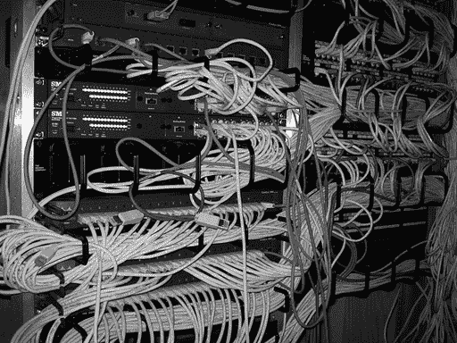

图 6-1：典型的网络机架设置（图片已修改，原图由 Adrian Sampson 根据[CC BY 2.0](https://creativecommons.org/licenses/by/2.0/)许可证创建）

让我们来看一下当你访问一个网站时，流量的流动和连接。当你发送请求访问一个网站时，你使用的是 HTTP 协议。该协议帮助对数据进行分类，使得设备可以理解如何解析它。大多数协议还会分配一个*端口号*，这是分配给协议的特殊数字，以便网络设备识别正在发送的数据类型以及它们应该如何处理这些数据。对于 HTTP，端口号是 80，如果数据是加密的，则是 443。当交换机或路由器看到端口号 80 时，它会识别数据包为 HTTP 流量，并自动知道如何处理它，而不需要查看数据包内部的所有数据。这样就能更快地将数据包发送到目标。

使用 HTTP 时，你从计算机发送一个以*数据包*形式的请求。该数据包包括网站请求、端口号（80）、你的 IP 地址以及你访问的网站的 IP 地址。这个请求会发送到交换机。交换机查看请求并判断目标是否在当前网络上。很可能不在，所以交换机会将数据包传递给连接你家与互联网的路由器。如第二章所述，这个路由器被称为默认网关。

一旦路由器从交换机接收到数据包，它会检查连接到它的所有其他网络的列表。有许多类型的网络，但最常见的有*局域网*（*LAN*）和*广域网*（*WAN*）。局域网是一个小型网络，连接同一物理区域内的设备。局域网的例子包括办公楼、家庭甚至飞机。广域网连接跨越大范围地理区域的设备。互联网由许多广域网组成，所有这些广域网都连接成一个巨大的网络。路由器检查它从交换机接收到的数据包的目标 IP 地址，并确定该地址是否位于它连接的任何局域网或广域网中。如果路由器不知道该目标 IP 地址位于何处，通常会将流量发送到一个默认网络。

无论如何，路由器将流量传递给另一个路由器，后者按照相同的过程进行处理。这个链条会一直延续，直到数据包最终到达一个连接到目标设备所在局域网（LAN）的路由器。然后，路由器将数据包发送到局域网中的交换机，交换机找到目标设备。在局域网中可以有多个交换机，甚至在大型网络中有数百个交换机，比如 Google 或 Amazon 维护的网络。交换机之间像路由器一样传递流量，不过它们使用 MAC 地址而不仅仅是 IP 地址。一旦目标设备接收到数据包，它会读取数据包中的信息，比如网站请求，并做出响应。刚才描述的整个过程会反向进行：最初的请求源现在变成了响应的目标。

这是网络通信的基础。但它可能变得更加复杂。其他设备也会读取网络流量，甚至可能在发送之前对其进行修改。例如，一种特殊类型的服务器，叫做*代理服务器*，从一个网络连接获取数据包并将其传递到另一个连接。代理服务器通常会以某种方式修改原始数据包，例如，将目标 IP 地址从公有地址更改为私有地址。另一种类型的代理会读取网站请求，并判断它们是否符合组织确定的在工作时适合浏览的内容，然后再将它们发送到互联网以供处理。还有其他设备，如防火墙和入侵检测系统（IDS），会中断流量；我们将在本章后面讨论这些设备。

## 攻击你的网络

黑客根据他们的目标使用各种技术来攻击你的网络。网络攻击通常专注于获取对网络的访问权限，以查看流量或窃取数据。这意味着他们必须在你的系统发送的数据包和数据包的目的地之间连接到网络，这样他们才能看到正在发送的数据。对手还经常直接攻击网络。这些攻击通常围绕着试图找到关闭网络使用的方法，以使受害者无法像往常一样使用他们的网络。

无论如何，黑客的主要目标首先是了解网络。对手使用多种侦察技术在开始攻击之前了解他们的受害者。一个常见的方法是进行*端口扫描*，即向一个 IP 地址的所有可能端口发送请求，然后观察该地址上的设备如何响应。根据这些响应，攻击者可以获得大量关于系统的信息。例如，如果一个 IP 地址在黑客扫描端口 80 和 443 时做出响应，攻击者就知道这些端口是开放的，而且服务器可能正在运行某种 Web 服务。对手可以利用这些信息直接攻击服务器，或者欺骗其他系统认为它们是一个友好的系统。端口扫描为攻击者提供了宝贵的信息，使得他们可以更轻松地制定不同的网络攻击。

### 黑客如何查看你的流量

数据包为攻击者提供了各种详细信息，包括它们经过的设备、设备的位置以及设备使用的协议，更不用说数据包中包含的数据。当对手（或任何人）拦截流经网络的流量时，这叫做*嗅探*。就像猎犬跟踪一条线索一样，对手会获取经过网络的流量的碎片，并从中重建他们需要的信息。

在有线网络中，嗅探对攻击者来说可能是一个挑战，因为网络设计是将流量只发送到预定的接收方。这意味着攻击者必须想办法绕过这个设计，让流量直接发送到他们那里。在第八章中，你将看到攻击者如何在无线网络上做到这一点。在有线网络中，黑客可以通过几种不同的方法来实现这一点。

一种方法是将自己的硬件添加到网络中。如果你能够连接自己的物理设备，设备就可以扫描并复制通过网络的流量。那么攻击者如何偷偷地将路由器或交换机接入网络，而不被察觉呢？虽然做到这一点很困难，但对手通常会使用一个更小的设备，叫做*网络监控器*，它专门为此目的设计。图 6-2 展示了一个网络监控器的例子。监控器连接到网络中已经存在的基础设施，并复制通过它的流量。

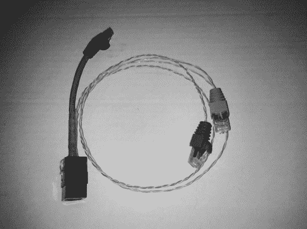

图 6-2：网络监控器（图像经过修改，原图由 Andrew Fresh 根据[CC BY 2.0](https://creativecommons.org/licenses/by/2.0/)许可创建）

对手还可以使用一种叫做*IP 伪装*的技术，伪装成网络上合法设备的 IP 地址并模仿该设备。任何原本应该发送到被伪装 IP 地址的设备的流量也会发送到黑客那里。IP 伪装可以让你误连接到一个设备，比如一台打印机，实际上这个设备是攻击者控制的。

第三种方法是通过更改网络设置来改变流量的去向。例如，通过更改设备的默认网关，黑客可以决定网络流量的去向。这使他们能够将流量引导到他们控制的设备上，从而捕获流量。

或者，攻击者可以在交换机上启用*端口镜像*功能。交换机有编号的物理端口，或者说是你插入电缆的插槽。通常，交换机有 24 到 48 个端口。端口镜像功能指示交换机将通过一个端口进出所有的流量复制到另一个端口。例如，如果攻击者能够在交换机上启用端口镜像，他们可以告诉交换机将进入端口 1 的所有流量复制到端口 22，然后他们可以将设备插入到端口 22 来捕获流量。更改流量设置通常需要较高的访问权限，尤其是在网络管理员没有注意到的情况下。

攻击者还可以使用另一种方法，通过物理方式接触传输流量的电缆。这种操作的方式取决于所使用电缆的类型。例如，早期网络常常使用一种被称为*同轴电缆*的电缆。它由两根铜线组成，外面包裹着厚厚的绝缘层。一种特殊的网络接入方式被称为*吸血鬼接入*，它能够穿透绝缘层，将两个金属尖端（即设备的*牙齿*）与两根铜线连接，从而允许接入记录任何经过的流量。图 6-3 展示了吸血鬼接入的示例。

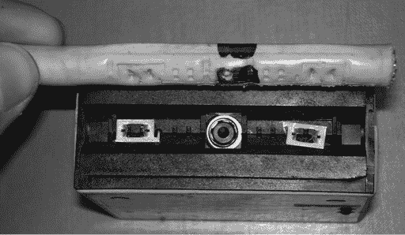

图 6-3：吸血鬼接入示例（图像已修改，原图受[创作共用-共享 2.5 Generic](https://creativecommons.org/licenses/by-sa/2.5/)许可保护）

链接光纤电缆，它通过玻璃管中包裹的绝缘层利用光脉冲发送流量，需要弯曲电缆并将一个不带光的光纤放置在弯曲处。当光线经过弯曲时，不带光的光纤可以抓住一部分光，从而捕获流量。

这些物理方式捕获流量的问题在于几乎所有方法都会导致电缆信号的损失。例如，弯曲光纤电缆会增加延迟，导致任何监控网络的人都能立刻察觉到异常。

### 中间人攻击

尽管使用物理接入和更改网络设置可以让黑帽子看到网络中的流量，但要使这些技术生效需要大量的设置工作。它们也很难隐藏，尤其是当目标是拥有专职 IT 员工、负责寻找此类攻击的大型企业时。相反，攻击者可以使用*中间人攻击*，这种攻击能够在不需要物理访问网络的情况下实现相同的流量读取能力。

在中间人攻击中，攻击者将自己置于受害者和他们试图到达的目标之间的流量流中。攻击者并没有让你的流量直接发送到你原本打算发送的地方——例如一个网络服务器——而是先发送到攻击者那里。然后，攻击者可以读取、修改流量并将其转发给目标。这使得攻击者能够捕获你的数据并为自己目的操控它们。最糟糕的是，这些攻击通常极难被受害者发现。对受害者而言，一切看起来都在正常运行，尽管速度可能比平常慢。图 6-4 提供了一个基本的中间人攻击示例。

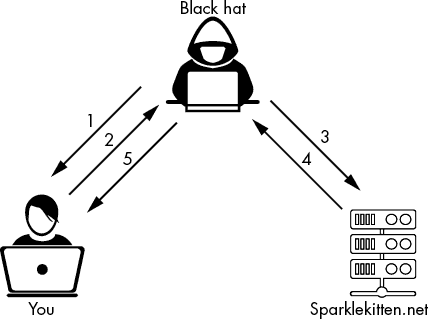

图 6-4：中间人攻击示例

在这种情况下，黑客向你发送了一封网络钓鱼邮件，邮件中的链接看起来像是来自你银行的合法链接 1。当你点击邮件中的链接时，它会把你带到对方的伪造 web 服务器，他们在该服务器上创建了一个看起来像你银行网站的页面。然后，你在该网站上输入了你的凭据 2。对方接收到你发送到该网站的流量，并进行修改，使其看起来像是来自攻击者的计算机，而不是你的。接着，攻击者将其发送到合法的银行网站 3，并成功访问了你的账户 4。攻击者随后向你发送了一个 404 未找到错误，确保你没有意识到发生了什么 5。

中间人攻击可以通过多种方式执行。除了刚刚描述的攻击方式，攻击者还可以创建一个代理服务器，然后诱使受害者连接到该代理。请记住，代理服务器代表另一台设备处理请求，因此通过让受害者连接到恶意代理，黑客可以捕获受害者发送到互联网的任何流量。建立中间人会话的另一种方法是更改受害者获取 DNS 信息的位置。如果攻击者能欺骗受害者或在系统上加载恶意软件，改变默认的 DNS IP 地址，他们就能迫使设备将所有 DNS 查询发送到恶意攻击者的服务器，而不是合法的 DNS 服务器。恶意服务器随后可以用任何它想要的 IP 地址进行响应，从而有效地让攻击者决定受害者设备发送网页流量的去向。

攻击者还可以使用网络上的设备发起中间人攻击。如果黑客能够访问某个设备，他们可以更改设置以重定向流量。物联网（IoT）设备尤其容易受到这种攻击。物联网设备是连接到互联网的非传统设备，通常提供某种增强功能。它们包括冰箱、电视、智能家居助手和安防摄像头。这些设备的安全性通常较差，因此攻击者很容易控制它们。攻击者有时可以更新物联网设备的*固件*（运行设备硬件的代码），以便包含新代码，从而允许他们捕获网络上的流量。由于这种方法通常不会影响设备的功能，因此很难被察觉。

### 拒绝服务

捕获流量并不是攻击者攻击网络的唯一选项。黑客还可以完全关闭网络，使其无法传输任何流量。这种类型的攻击被称为*拒绝服务* *(DoS)*。DoS 攻击的基本原理是阻止网络正常运行。例如，攻击者可能会向单个 web 服务器发送大量流量，以至于其他任何人都无法访问该服务器及其托管的网页。

造成 DoS 攻击的方式有很多种。正如前面提到的，一种方法是通过大量流量压垮服务器，使系统崩溃。ping 数据包（在第二章讨论过）也是一种很好的方式，因为攻击者可以改变其大小并快速连续发送它们。在 *ping 洪水攻击* 中，攻击者的设备每秒发送大量的 ping 请求，使目标设备无法与网络通信。ping 数据包可以填满系统的内存，从而导致系统变慢。ping 洪水攻击很容易执行，因为它只需要一个能够发送 ping 的系统和比目标系统更多的带宽。图 6-5 展示了 ping 洪水攻击的示意图。

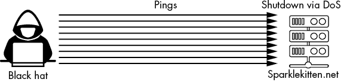

图 6-5：ping 洪水攻击

另一种 DoS 攻击形式是利用代码中的漏洞来造成 DoS 状态。一个例子就是 *死亡 ping*。ping 数据包通常最大为 65,535 位（位是计算机中数据大小的最基本度量单位），但可以创建超出此限制的 ping 数据包。如果黑客发送一个超大 ping 数据包给设备，它可以使接收该 ping 的系统崩溃并关闭。

ping 洪水攻击和死亡 ping 攻击现在已不如过去常见，因为大多数漏洞已经被修复。然而，它们仍然是如何利用代码或网络设计中的条件来造成 DoS 攻击的经典例子，许多现代 DoS 攻击仍使用类似的方法。

### 分布式拒绝服务

DoS 攻击是指一个设备攻击一个单一目标，类似于死亡 ping 攻击。在 *分布式拒绝服务*（*DDoS*）攻击中，攻击者利用多个系统来攻击单一目标。通过使用多个攻击系统，攻击者能够放大攻击的效果。

在 *Smurf 攻击* 中，这是一个过时的 DDoS 攻击实例，攻击者首先伪造了目标的 IP 地址。图 6-6 展示了 Smurf 攻击的示意图。

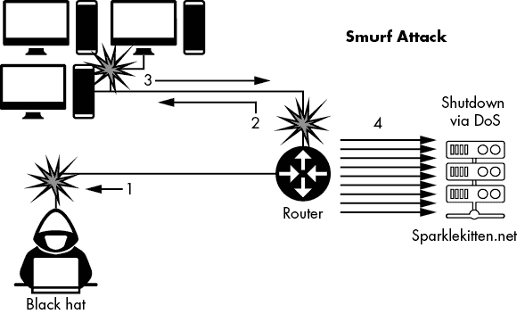

图 6-6：Smurf 攻击的示意图

在伪造 IP 地址后，攻击者向一个大网络的广播地址发送了 ping。*广播地址*会自动将流量发送到网络上的每一个设备。ping 请求发送到网络上的所有设备，它们随后向目标的 IP 地址做出回应。目标被大量响应淹没，最终崩溃。

更现代的 DDoS 攻击例子是 *DNS 放大攻击*（图 6-7）。

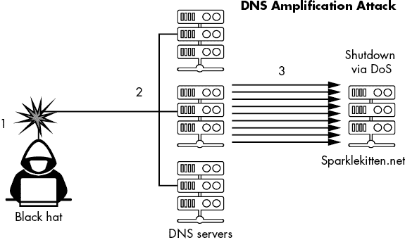

图 6-7：DNS 放大攻击的示意图

与 Smurf 攻击类似，DNS 放大攻击使用基本的 DNS 请求来淹没受害者的互联网连接。黑客制造伪造受害者 IP 地址的 DNS 查询请求 1。这些查询还包含了大响应参数，意味着它们将接受单个查询的最大响应大小。接着，攻击者向公共可用的 DNS 服务器持续发送这些查询 2。尽管查询本身相对较小，但响应非常大。DNS 服务器将这些大响应发送到受害者的 IP 地址 3，从而造成 DoS 状态。攻击者在 2016 年使用这种类型的攻击攻击了安全网站 Krebs on Security，造成了迄今为止最大的一次 DDoS 攻击。

对手尝试进行 DDoS 攻击的一种方式是通过创建*僵尸网络*。在这种情况下，僵尸是指黑客已经控制的系统，使其能够接受来自攻击者控制的服务器的指令。通过这种方式攻击设备通常需要安装恶意软件或恶意固件。攻击者可以将成千上万，甚至数百万的设备转变为僵尸，这些设备可以同时接收指令。这个僵尸网络可以向服务器发送同时的请求，从而发起强大的 DDoS 攻击。据记录，其中一个较大的僵尸网络——Mirai 僵尸网络，曾在其高峰期感染了 60 万个物联网设备。每个被感染的设备都可以用来发送 ping、DNS 查询或其他类型的 DoS 攻击，而攻击者无需直接攻击目标。这使得僵尸网络成为非常有效的工具，用于关闭受害者的系统。

## 网络攻击防御

防御网络攻击需要深入理解你的网络布局以及与之连接的资源。如果网络不规范，黑客更容易利用它，因为 IT 管理员在无法清楚了解流量如何在网络中流动的情况下，将更难确保正确的设置和安全控制措施到位。这对于拥有成千上万，甚至数万台系统的大型网络尤其如此。

解决这个问题的一种方法是将网络组织成多个区域，并基于每个区域而不是每个系统来构建安全性。当一个系统被添加到某个区域时，你会知道它需要具备一套特定的安全控制措施，以符合该区域的要求。当系统需要从外部访问时，一种常见的网络区域被称为*非军事区*（*DMZ*）。DMZ 处于内部私有网络与外部公共网络之间，实际上是两者的混合。通常，管理员会将允许外部连接的系统放在 DMZ 中。例如，如果你在服务器上托管一个网站，你会将该服务器放在 DMZ 中。DMZ 通常有严格的控制措施，以确保进出流量受到监控，从而防止攻击或漏洞突破。 图 6-8 显示了 DMZ 的示意图。

你可以将一个网络划分为多个区域，以维护安全控制。例如，你可能会有一个外部网络区域，一个 DMZ 区域，以及一个包括数据库和人力资源系统子区域的内部区域。使用多个区域的唯一缺点是管理和更新每个区域的所有安全控制。有时，你的系统可能还会适合多个区域，因此你需要仔细考虑将它们放在哪个区域。

一旦你建立了网络区域，你就可以添加控制措施。

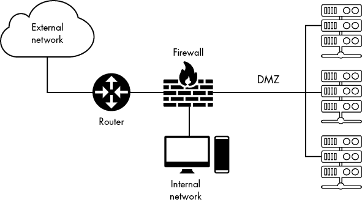

图 6-8：网络中 DMZ 的示意图

### 防火墙

网络中最基本的控制之一就是防火墙。从基本层面来说，防火墙通过两种方式来调节流量：它要么*允许*流量通过并继续到达目的地，要么*拒绝*流量并阻止其继续前行。这个决策是通过将流量与一组规则进行匹配来决定如何处理流量的。

有多种类型的防火墙可供选择，它们可以是基于软件的或基于硬件的。*软件防火墙*是计算机程序，通常用于运行其他软件的设备上，如运行网站的服务器或桌面计算机。软件防火墙是系统防御的最后一道防线。通常，它们的功能比硬件防火墙少，但仍然是必要的，帮助控制哪些系统应用程序可以在网络上发送流量。*硬件防火墙*是用于查看和调节流入网络的流量的物理设备。一般而言，硬件防火墙比软件防火墙更强大。根据不同的型号，它们提供许多安全功能，并能够做出更多选择，而不仅仅是允许或拒绝流量。

#### 包括包过滤防火墙

软件防火墙使用*数据包过滤*方法。它们在数据包进入系统时查看数据包，并根据一组规则决定是否允许该流量。如前所述，数据包包含有关发送数据的信息，包括目标和源 IP 地址以及到达的端口号。数据包过滤规则通常基于源 IP 地址和使用的端口号。表 6-1 显示了防火墙规则的示例。

表 6-1：示例防火墙规则

| **规则编号** | **允许/拒绝** | **协议** | **目标 IP** | **源 IP** | **端口号** |
| --- | --- | --- | --- | --- | --- |
| 1 | 允许 | 任意 | 192.168.15.1 | 任意 | 80 |
| 2 | 允许 | 任意 | 192.168.15.1 | 192.168.15.2 | 23 |
| 3 | 拒绝 | 任意 | 192.168.15.1 | 任意 | 23 |
| 4 | 拒绝 | 任意 | 任意 | 任意 | 任意 |

每一行表示防火墙中的一条规则。在协议列中，*任意*表示不管使用何种网络协议。有时，你会看到通配符符号（*）代替任意，但它们的意思是一样的。

请注意，第二条和第三条规则使用相同的端口号。然而，一条规则允许特定的源 IP，而另一条则拒绝任何源 IP。需要注意的是，当防火墙读取其规则时，它会逐条检查，直到找到匹配的规则。如果规则顺序不正确，可能会导致流量管理出现问题。例如，如果你将第 3 条和第 2 条规则调换，拒绝来自任何源 IP 的端口 23 流量的规则会被放在允许来自特定源 IP 流量的规则之前；因此，当来自 IP 地址 192.168.15.2 的流量进入时，防火墙会拒绝它，因为该 IP 地址与任意源 IP 匹配。出于这个原因，至关重要的是将允许流量的规则，特别是列出特定 IP 地址的规则，放在拒绝规则之前。

第四条规则确保，如果没有其他规则适用于流量，则该流量将被拒绝。我们称之为*显式拒绝*。许多现代防火墙默认会包含一条“拒绝所有”规则，而无需你将其添加到规则列表中；这被称为*隐式拒绝*。

#### 有状态检测防火墙

另一种常见的防火墙形式是*有状态检测* *防火墙*，它通常仅用于管理进入网络的流量。与数据包过滤防火墙类似，有状态检测防火墙有规则，基于 IP 地址和端口号等因素来管理流量。此外，有状态检测防火墙还会考虑条件来决定如何应用规则。

换句话说，当流量通过有状态检测防火墙时，外部设备会与防火墙建立连接。这与包过滤防火墙不同，包过滤防火墙会在流量经过其他设备时进行查看。防火墙会学习连接是如何建立的，以及一些关于连接的参数——例如，是否使用了加密。它还会决定是否允许或拒绝该流量。如果流量被允许，防火墙会监控流量的变化，观察连接的状态是否发生变化。这使得防火墙能够通过某些细节（例如源和目的 IP 地址）跟踪数据包。当来自相同位置的包在稍后时间到达时，防火墙可以利用这些细节来判断该流量是否被允许，而无需完全重新检查它。

#### 应用程序防火墙

应用程序防火墙提供的是专为特定类型的应用程序设计的保护，例如 web 服务器或数据库。这些防火墙包含特殊的安全控制，帮助防御针对它们所保护应用程序的攻击。应用程序防火墙还可以在更深层次上检查流量，使其能够看到比有状态检测防火墙更多的信息。

例如，如果你使用 *Web 应用程序防火墙* *(WAF)* 来保护 web 服务器，它将检查所有发送到该 web 服务器的 HTTP 请求。WAF 可以看到发送恶意软件的尝试、被利用的漏洞，甚至是与典型的 web 服务器设置的偏差。应用程序防火墙在处理流量时也有更多的选择。例如，有些可以将流量发送到一个新的 IP 地址进行分析。许多应用程序防火墙与其他安全设备一起捆绑在一起，例如入侵检测系统（将在下一节讨论）。

应用程序防火墙的主要缺点是它可能非常慢且资源消耗大。深入扫描数据包并分析数据以查找违规行为，比简单地检查 IP 地址和端口号（像包过滤防火墙那样）花费的时间要长得多。它还需要更多的内存和处理能力，这意味着运行应用程序防火墙的系统比运行包过滤防火墙的系统更昂贵。更高等级的安全控制需要这种权衡。还需要知道，应用程序防火墙是针对指定的应用程序的；你不能将 WAF 放在数据库服务器前面，并期望获得相同级别的安全性能。

防火墙无法读取加密流量，因为流量是加密的。然而，当网络中的流量被加密时，包含 IP 地址和端口号的数据包头通常是未加密的。这意味着有状态检查防火墙和数据包过滤防火墙可以正常工作，而应用防火墙则需要解密数据包中的数据才能进行检查，然后再决定是否允许该流量。

### 入侵检测系统

虽然防火墙对于防止许多不必要的连接是必要的，但它们并不总是高效地检测攻击或发现隐藏在合法流量中的恶意流量。由于防火墙是按照规则执行的，它有时可能会允许来自黑帽的流量，如果该流量符合允许规则。为了捕捉这些攻击，你应该在网络中添加 IDS。

IDS 旨在检测网络或系统上发生的攻击，并向安全人员提供警报。IDS 能够检测一些其他安全控制可能无法处理的攻击。例如，它们能够检测死亡回显（ping of death）或 Smurf 攻击，而防火墙如果有允许 ping 流量的规则，可能会接受这种流量。与防火墙一样，IDS 可以是软件或硬件基础的，可以监控单个系统或网络的一部分。IDS 通常用于网络的关键区域，如 DMZ 的入口或内部私有网络。

为了检测攻击，IDS 使用两种不同的方法：签名和启发式。*签名*类似于防火墙规则，但可能包含额外的行为元素，例如流量进入的时间或它试图建立的连接类型。签名的主要特点是它们是固定的。一旦编写签名，IDS 将仅寻找与该签名完全匹配的流量。例如，如果你写了一个查找对 sparklekitten.net 的特定请求的签名，而一个请求访问的是 sparklekitten.us，签名将不会检测到该请求。签名还可以检测已知的恶意软件。

基于启发式的 IDS 监视其所在的系统或网络，以了解正常流量基线的情况。然后，安全专业人员将启发式系统设置为在网络上某些条件发生变化时发出警报。例如，如果连接到 Web 服务器的数量通常每分钟保持在 1,000 次左右，安全人员可能会设置一个每分钟 10,000 次的阈值，以触发警报，因为这个流量增加可能表示正在进行热销活动或潜在的 DoS 攻击。启发式系统在检测新攻击方面非常有效，因为它们不必依赖签名来判断事件是否恶意。专家必须分析恶意软件以创建恶意软件签名，因此，如果恶意软件是全新的，签名系统可能无法检测到它。但启发式系统也需要不断的微调，以确保它们拥有正确的正常流量基线。如果系统在正常情况下每分钟生成 10,000 次连接时不应触发警报。

### 入侵防御系统

通常，IDS 是一种被动系统。它可以发送警报，但不会阻止恶意流量。与应用程序防火墙类似，IDS 可能需要很长时间来检查数据并确保它与签名或启发式特征不匹配。为了提高速度，许多 IDS 会复制流量，并在其通过系统后进行分析。但这意味着流量在被检测为恶意之前，已经到达了目的地。

显然，这可能是一个重大安全问题，尤其是对于可能在安全人员来不及反应之前就感染系统的恶意软件。为了解决这个问题，安全研究人员创建了名为 *入侵防御系统* *(IPS)* 的设备。IPS 的工作原理与 IDS 类似，使用签名或启发式方法来检测恶意流量。但与被动的 IDS 不同，IPS 在流量到达目的地之前，会主动与之互动，以防止其对目标造成危害。

根据不同的模型，IPS 处理恶意流量的方式有几种。一种方法是完全阻止这些流量。IPS 可能直接执行此操作，或者可能会更改防火墙规则来阻止流量。IPS 还可以将流量发送到一个专门的安全系统，安全团队可以分析这些流量，以了解攻击者的技术。IPS 还可以在传递干净流量之前移除或隔离恶意软件。除了这些主动措施外，IPS 还会发送警报，类似于 IDS。

就像应用程序防火墙一样，IPS 的主要缺点是它比 IDS 更慢，并且需要更多的资源。这使得 IPS 比 IDS 更昂贵。因此，通常只会在关键位置使用 IPS，例如 DMZ 的入口，而 IDS 可能会在 DMZ 内的每台服务器上，如 图 6-9 所示。

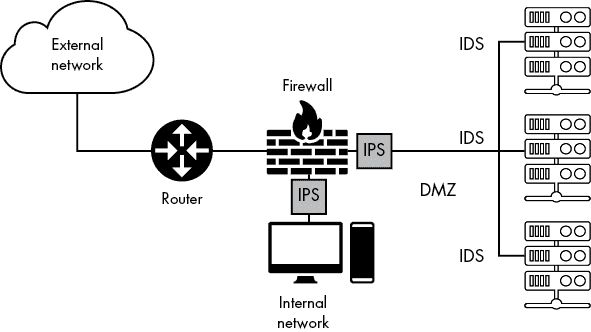

图 6-9：IDS 和 IPS 在网络中的示例位置

IPS（入侵防御系统）和 IDS（入侵检测系统）通常被捆绑成一体机设备，将几种不同的服务结合成一个系统。这些设备可能包括多种安全设备，如防火墙、电子邮件过滤器、代理服务器等。

## 练习：设置您的防火墙

Windows 和 macOS 都包含内置防火墙，您可以用它们来阻止特定应用程序的流量进入您的系统。虽然两者都有一组默认规则，能够提供足够的安全性，但您也可以添加、删除或修改这些规则。自定义规则可以帮助您进一步提高设备的安全性，特别是在添加不希望允许外部连接的新应用程序时。在本练习中，您将配置防火墙，添加一个入站规则以保护您刚刚安装的新应用程序。

### Windows

要访问 Windows 防火墙，请在屏幕左下角的搜索栏中输入**firewall**。Windows Defender 防火墙高级安全应用程序将出现。点击该应用程序，打开一个显示常规防火墙信息和设置的窗口。在左侧，点击**高级设置**，打开图 6-10 中显示的窗口（您必须拥有管理员账户才能执行此操作）。

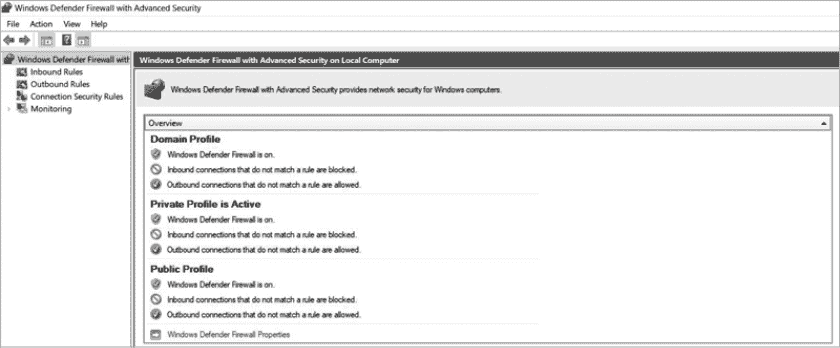

图 6-10：Windows Defender 防火墙高级设置

左侧菜单显示了您可以设置的规则类型。您应该可以看到入站和出站规则的子菜单，以及其他一些选项。当您点击其中一个菜单项时，相应的选项将显示在中间框中，您可以执行的操作将在最右侧出现。

此时，您应该能在主框中看到防火墙配置文件。在 Windows Defender 防火墙中，配置文件可以根据系统连接的网络类型来更改防火墙的行为。这对于像笔记本电脑这样的设备非常有用，因为它们可能频繁切换不同的网络。*域*配置文件适用于远程管理的设备，例如公司中的设备。*私有*配置文件适用于私有网络，如您的家庭网络，*公共*配置文件适用于公共网络，如咖啡馆中的无线网络。每个配置文件的默认选项相同，但您可以进行更改。只是在进行任何修改时要小心，因为这些更改会影响整个系统，而不仅仅是特定的应用程序。

现在您已经查看了配置文件，让我们添加一个新规则。选择一个您想要应用新规则的应用程序。考虑好应用程序有助于您设置规则的参数。需要考虑的主要因素是应用程序使用的端口号以及允许哪些类型的流量连接到该应用程序。例如，如果您正在安装一款新游戏，您需要打开该游戏使用的端口号。您还需要检查是否有任何特定的协议或流量类型必须连接到游戏才能正常运行。对于大多数应用程序，您可以在用户手册或网站的帮助部分找到这些信息。

在考虑应用程序时，您需要选择要添加规则的菜单。对于本练习，让我们将规则添加到**入站规则**。入站规则适用于进入您系统的流量，而出站流量是您从计算机发送出去的数据。点击左侧的**入站规则**，以显示当前的入站流量规则列表。图 6-11 提供了这些规则的一个示例。

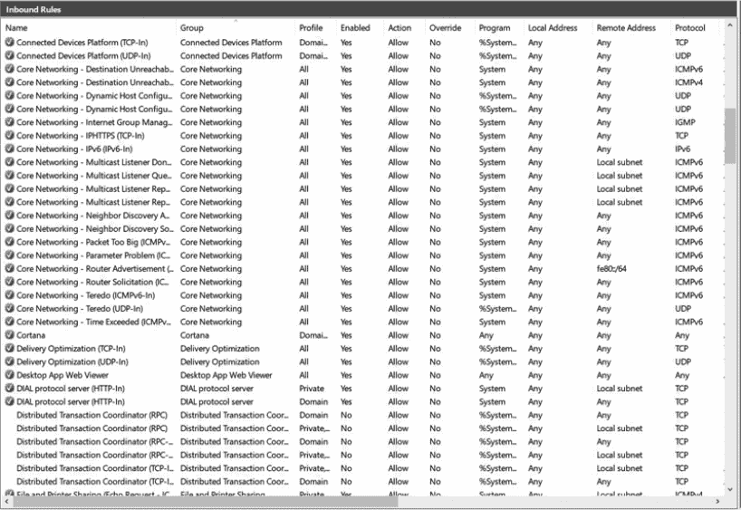

图 6-11：入站规则列表

这个窗口的布局与本章早些时候关于数据包过滤防火墙的表 6-1 稍有不同，但您可以看到相同的元素仍然存在。一个绿色的勾选标志表示该规则允许流量；没有标志的规则当前是禁用的。右侧是规则的名称和它所属的*组别*，该组别根据规则所依赖的协议或应用程序对规则进行分类。例如，在图 6-11 中，您可以看到几个规则处理桌面核心网络功能，因此它们被恰当地放置在核心网络组中。下一列是规则应用的配置文件。如您所见，一些规则仅在特定配置文件中处于活动状态。随后的列显示了规则的作用，包括操作（允许/拒绝）、规则适用的应用程序、规则适用的 IP 地址以及规则适用的协议类型。

协议通常与使用的连接类型相关，例如 TCP。如果您的应用程序不使用特定协议，选择"Any"是安全的。下一个列（图中未显示）与规则适用的端口号相关。回想一下，端口号可以告诉系统发送的流量类型。大多数应用程序使用常见的端口号，例如端口 80 用于网页流量。其他应用程序可能会使用独特的端口号；例如，游戏*Doom*在其多人模式下使用端口号 666。当安装新应用程序时，您可能需要添加一条规则来允许它使用一个新端口号。现在我们就来做这个！

在“入站规则”窗口的右侧，点击**新建规则**。这将弹出一个向导，帮助你设置规则（图 6-12）。你看到的第一个选项是规则类型。程序用于为特定应用程序创建规则。你也可以选择端口，用于影响特定端口号的规则；预定义用于连接默认创建的某个组，如核心网络，而自定义则允许你设置自己的参数，而不仅仅局限于端口号或应用程序。选择**自定义**以查看可用选项。

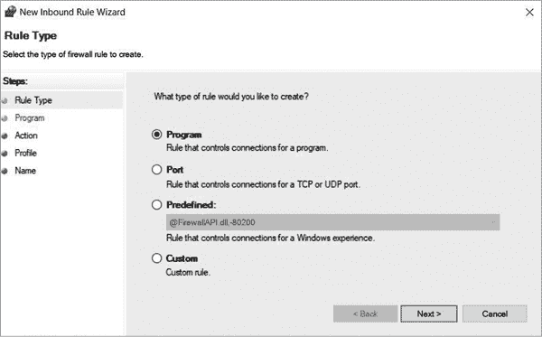

图 6-12：规则类型选项

指定你是为所有程序创建规则，还是仅为特定应用程序创建规则。为此，选择**此程序路径**，点击**浏览**，然后找到你在系统中保存的程序并从菜单中选择它。在图 6-13 中，我使用了一个虚拟程序名作为示例。你也可以这样做，或者继续选择“所有程序”选项。然后点击**下一步**。

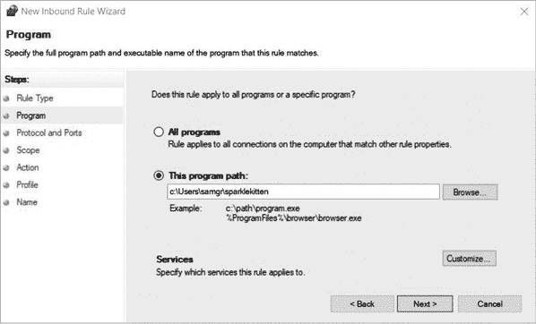

图 6-13：程序选择示例

现在列出你的规则所需的端口和协议。如果你为某个应用程序创建规则，你应该能够从该应用程序的官方网站或支持材料中找到它使用的端口和协议。在这个示例中，我使用了端口 80 和协议 TCP 来表示 Web 服务。图 6-14 显示了已填写的选项。

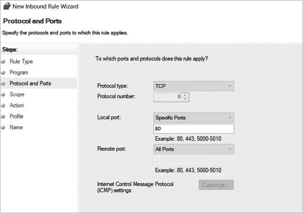

图 6-14：端口号选择示例

点击**下一步**，在“范围”步骤中指定规则适用的 IP 地址。除非你打算与特定设备通信，例如打印机，否则最好保持广泛的地址范围可访问，以免你不断添加新的地址。这也是重新考虑规则并确保你愿意允许所有来源的流量进出的时候。

点击**下一步**进入“操作”步骤，决定你要采取的操作。你有三种选择：允许、如果安全则允许和阻止。“如果安全则允许”选项仅在连接使用了包含加密的知名安全协议时才允许连接（我们将在第九章讨论一些这些协议）。在此练习中，我设置规则为阻止连接，如图 6-15 所示。这意味着任何尝试访问指定应用程序的端口 80 上的流量将被阻止，从而有效地将其与 Web 流量隔离。

选择动作后，点击**下一步**以选择规则的配置文件。通常，你应该选择所有三种配置文件，以便无论你处于哪种类型的网络中，规则都能起作用。不过，你也可以选择一个特定的配置文件类型，以为你的计算机提供不同级别的安全性。例如，你可能会阻止与公共网络的连接，而这种连接通常会在私人网络中允许。

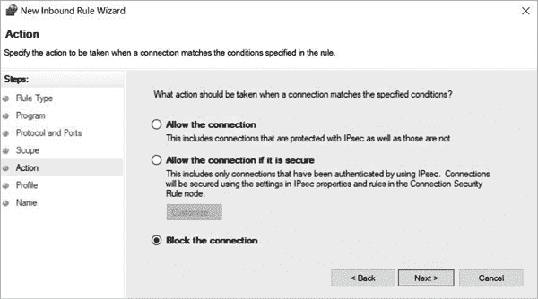

图 6-15：设置连接类型

最后，点击**下一步**来命名规则。然后点击**完成**。你应该能在“入站规则”窗口的顶部看到你新建的规则，如图 6-16 所示。

图 6-16：最终规则生效

现在你已经添加了一个新规则，你可以轻松地创建更多规则，以满足网络需求，同时保持设备的安全。记住，当你不再需要某个规则时，你可以禁用它，而不是删除它，以防将来可能还需要它。

### macOS

macOS 包含一个内置的防火墙，你可以激活它。虽然它的选项没有 Windows Defender 防火墙那么强大，但一旦正确设置，它仍然提供了很好的保护。要找到防火墙，点击屏幕左上角的苹果标志，然后点击**系统偏好设置**。点击**安全性与隐私**，然后点击顶部菜单栏中的**防火墙**。图 6-17 显示了结果对话框。如果防火墙被关闭，你需要管理员权限才能打开它。点击对话框底部的锁图标来更改防火墙设置。点击**开启防火墙**，然后点击**防火墙选项**。

在选项对话框中（图 6-18），你有几种选择。你可以阻止所有进入系统的连接。虽然这会增加你的安全性，但如果应用程序无法接受传入连接，它们将无法正常工作。你还可以添加应用程序，并指定它们是否应接受或拒绝传入连接。在图 6-18 中，Adobe Photoshop 被设置为允许所有连接。

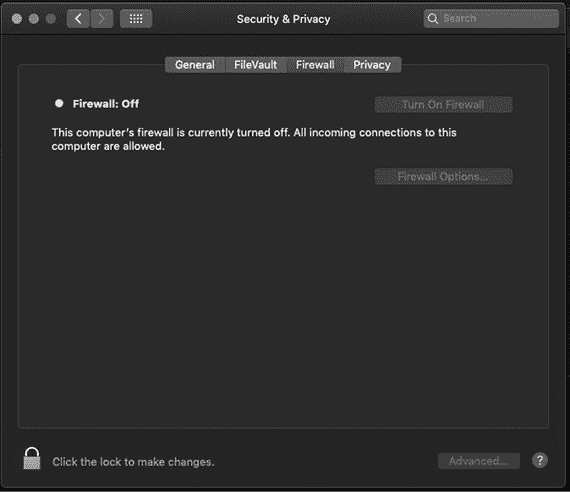

图 6-17：macOS 防火墙设置

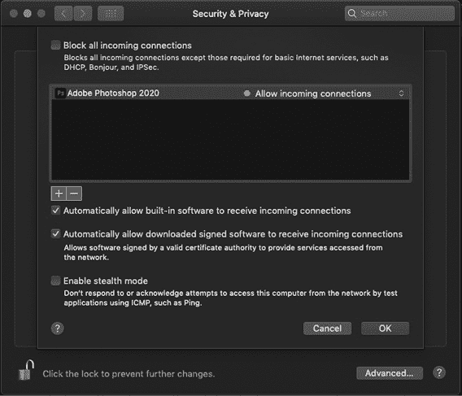

图 6-18：macOS 防火墙选项

下一个选项允许内置软件自动接受传入连接。这意味着系统上安装的任何苹果产品默认都会接受传入连接。苹果有许多过程来测试其软件的漏洞，但你应该注意，仍然存在黑客可能利用这种防火墙条件来访问应用程序的风险。

下一个选项类似，但适用于下载的签名软件。*签名软件*来自经过验证的合法来源。最后一个选项，*隐身模式*，防止设备在接收到某些类型的流量（例如 ping 包）时做出回应。这可以帮助阻止攻击者获取有关设备的信息，包括它是否真的在线。

不幸的是，macOS 的图形界面（GUI）没有像 Windows Defender 防火墙那样提供很多选项；你可以将应用程序添加到防火墙列表中，但不能使用系统偏好设置中的选项创建带有端口号的自定义规则。还有一个叫做*pf*的防火墙，它是操作系统的一部分；不过，要访问它，你需要进入*etc*文件夹中的配置文件*pf.conf*。你可以通过在终端窗口输入`man`命令，`man pf.conf`，来查找其手册，这会显示内置的帮助文档。

在对防火墙进行任何更改之前，我强烈建议你彻底阅读手册。不幸的是，配置*pf*的具体细节超出了本书的范围。

现在你已经了解了如何为 Windows 和 macOS 创建规则，你可以微调你的防火墙，在工作时保护你的系统。需要记住的重要细节是，创建一个调优良好的防火墙需要时间和一些反复尝试。这也不是一个你可以设置一次就不再考虑的功能。定期审查防火墙规则，确保所有应用程序都受到保护，对于维持系统安全至关重要。

## 结论

阅读完这一章后，你现在知道预防对于保护网络安全至关重要。你的安全工作应该主要集中在防止攻击发生，而不是在攻击发生后再去阻止它。通过设置具有正确规则的防火墙，你可以通过阻止流量进入网络来挫败许多低级和中级攻击。对于高级攻击，使用应用程序防火墙或 IDS/IPS 可以在攻击到达目的地或释放负载之前帮助检测攻击。这些系统可以为安全专家提供必要的时间，以便在黑帽黑客获得访问权限之前做出反应。
