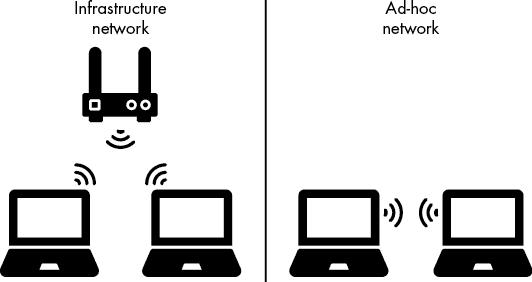
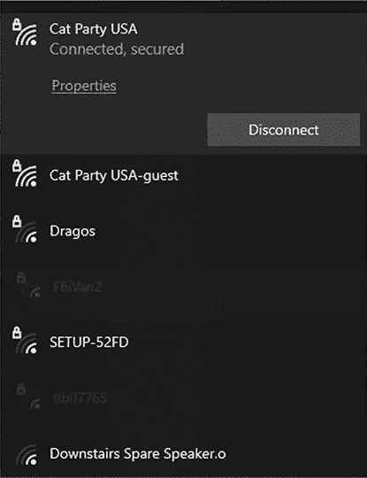
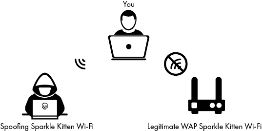
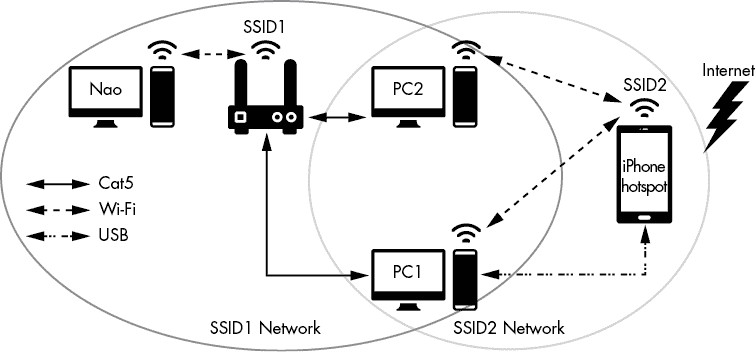
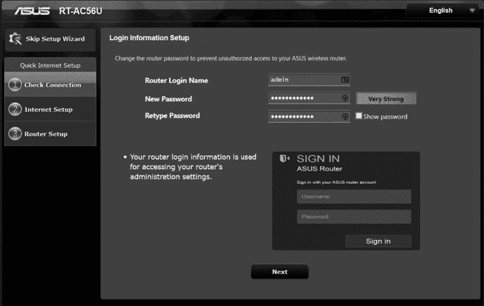
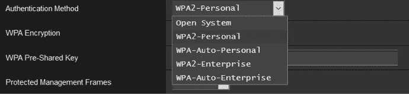
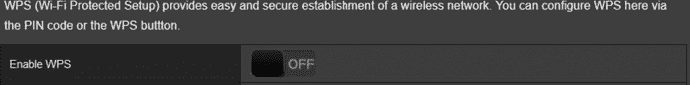
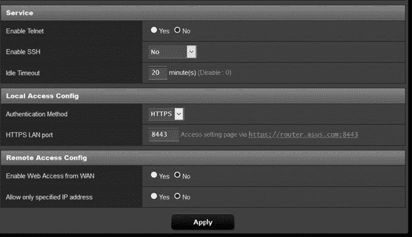
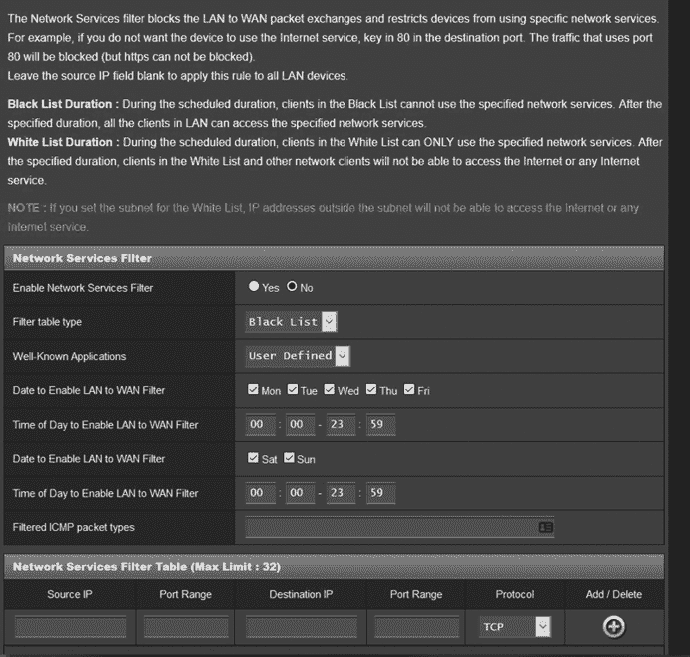
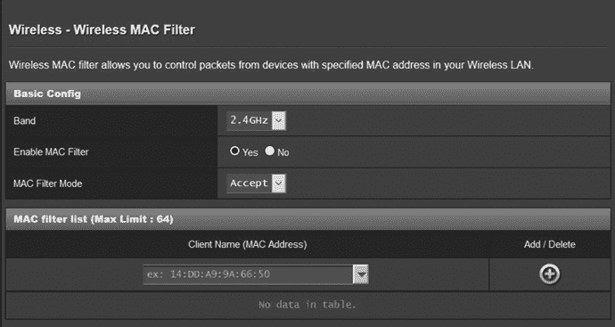

# 无线网络盗版

无线互联网给用户带来了一整套新的挑战，防止黑帽子攻击。显然，无线网络和第六章讨论的有线网络的主要区别在于它们是无线的。无线网络使用无线电波在设备之间传送数据，这意味着，就像菲尔·柯林斯（Phil Collins）1981 年的热门歌曲标题一样，它是*在空中的今夜*。

开玩笑的话，无线互联网更容易受到攻击，因为物理隔离——防御有线网络攻击的主要方式之一——不起作用。例如，通过锁定办公楼，可以潜在地阻止不受欢迎的人访问有线网络。但是这对无线网络无效，因为无线设备信号穿过这些障碍物，并且可以被外部的人捕捉到。

在本章中，您将学习无线网络的工作原理及其独特之处。在涵盖基础机制后，我们将讨论攻击者如何利用这些特性来利用无线网络并窃取它们发送的数据。然后，我们将探讨几种重要的防御措施，您可以使用这些措施来保护您的无线网络，无论是家庭环境还是办公环境。作为一个练习，您将学习如何保护典型的无线路由器。

## 无线网络如何工作

无线网络不使用电缆传输数据；相反，设备使用天线发送无线信号。这些天线可以是外部的，从设备上突出，就像外星人的耳朵，或者是内部的，就像您的笔记本电脑中可能的天线。现代无线设备具有多个天线以增加它们可以处理的信号量。

网络上的设备发送和接收信号与称为*无线接入点（WAP）*的中央设备的信号，通常是您的路由器或交换机。WAP 通过将信号传递给无线网络上的另一设备或将其发送到有线网络来管理设备之间的所有通信。

无线网络可以通过两种不同的方式设置。在*基础设施模式*中，WAP 充当路由器和交换机，为整个网络提供互联网的网关。尽管如此，也有一些类型的 WAP 没有路由或高级交换功能，仅仅会直接在无线和有线网络之间传递流量。

创建无线网络的另一种方式是使用 *临时模式*。在这种配置中，没有中央 WAP。相反，每个设备通过无线信号直接连接到另一个设备。由于设备之间是直接连接的，因此无需中央设备。每个设备将信息直接发送给其连接的设备。一个很好的临时网络示例是当你连接两个蓝牙设备时。蓝牙是一种旨在短距离内使用的无线通信形式，例如，当你将手机连接到车载系统播放音乐时。当你将蓝牙设备连接到手机或车载系统时，实际上是在创建一个临时无线网络。（这也是第二章中讨论的个人区域网络的一个例子。）

图 8-1 展示了每种类型无线网络的网络图示例。

设备可以通过使用 WAP 的唯一标识符——称为 *服务集标识符*（*SSID**）来查找并识别不同无线网络发出的信号。基本上，这就是无线网络的名称，当你将设备连接到网络时，它会显示出来，如 图 8-2 所示。WAP 通常会广播其 SSID，因此任何监听无线信号的设备都可以看到它们，尽管它们也可以隐藏其 SSID，这时你必须知道该标识符才能连接。

图 8-1：基础设施网络与临时网络设置的对比

图 8-2：无线网络的 SSID 示例

一旦选择了一个无线网络，设备就会使用一种叫做 *关联* 的过程与其连接。通常，像笔记本电脑或手机这样的设备一次只能与一个无线网络关联，但 WAP 可以同时与多个设备关联。然后，WAP 会管理发往每个设备的流量，确保每个设备都有机会使用信号，而不会互相干扰。

现代无线网络可以支持许多连接的设备。但当设备数量达到上限时，设备将开始体验到较慢的速度或失去与无线网络的连接。因此，在插入 WAP 之前，考虑如何使用网络非常重要。在一个小房子里，通常只需一个位于中心位置的接入点即可。在办公楼或较大区域内，您需要多个接入点来负载均衡网络，以避免任何单一设备过载。

然而，拥有多个接入点有时会导致问题，尤其是当设备无法在不同网络之间轻松连接时，因为它无法与新的接入点建立关联。为了解决这个问题，你可以创建一个*网状网络*。网状网络将多个 WAP 结合成一个大的无线网络，并使用一个单一的 SSID。这使得人们可以自由地在这些接入点之间移动设备，而不会丢失无线信号，只要设备仍然处于网状网络的范围内。

## 无线标准

无线技术成功的部分原因是创造了广泛采用的标准，确保设备之间的互操作性。此处的*互操作性*意味着一个无线设备可以轻松地与几乎任何其他无线设备通信，不论它们是由哪个公司制造的。这主要得益于 Wi-Fi 联盟的工作，Wi-Fi 联盟是一个推广无线标准的组织。基本上，如果一个无线设备遵循了特定的准则，它可以将自己称为*Wi-Fi 启用*设备。

公司遵循的主要标准被称为*IEEE 802.11*。*电子电气工程师协会（IEEE）*是一个制定标准的组织，而 802.11 只是一个分类该标准的编号。然而，这个数字现在已经成为无线技术的代名词。事实上，它已经变得如此普遍，你可能之前在家用或办公路由器上听到过或看到过它。

随着无线技术的发展，新的子标准应运而生，以管理新类型的无线网络。前两个主要的子标准是*802.11a*和*802.11b*，它们使用不同的无线电波长来发送信息。802.11a 标准使用 5 GHz 频段，而 802.11b 使用 2.4 GHz 频段。2.4 GHz 频段的信号覆盖范围更广，但速度较慢；而 5 GHz 频段速度更快，但覆盖范围较小。如今，这些差异大多已经不再重要，因为大多数现代无线设备同时支持这两种标准（稍后会详细介绍）。

后来的标准集成了新功能。*802.11g*在 802.11b 的基础上做出了改进，提供了更快、更强的信号。接下来是*802.11n*，它加入了一项名为*多输入多输出（MIMO）*的技术。MIMO 允许设备使用多个天线来增加无线设备一次性发送和接收的流量。这一特性大幅提高了无线接入点（WAP）的容量，使得同一网络上能够同时连接更多设备而不会导致网络减速或信号丢失。MIMO 还允许设备同时使用 2.4 GHz 和 5 GHz 信号。随后，*802.11ac*和*802.11ax*标准在 MIMO 和其他信号增强技术上做了改进，实现了极快的数据传输速度。发布于 2019 年的 802.11ax 仍在被逐步采用。表 8-1 列出了每个标准及其相关信息。

表 8-1：IEEE 802.11 标准

| **标准** | **信号类型** | **最大范围** | **速度** |
| --- | --- | --- | --- |
| 802.11a | 5 GHz | 120 m | 54 Mbps (兆比特/秒) |
| 802.11b | 2.4 GHz | 140 m | 11 Mbps |
| 802.11g | 2.4 GHz | 140 m | 54 Mbps |
| 802.11n | 2.4/5 GHz | 250 m | 600 Mbps |
| 802.11ac | 5 GHz | 120 m | 3466 Mbps (3.4 Gbps) |
| 802.11ax | 2.4/5/6 GHz | 120 m | 9608 Mb/s (9.6 Gbps) |

## 无线安全

IEEE 标准的另一个有趣之处在于它们将安全性作为功能的一部分。它们的设计者试图从一开始就防御一些明显的无线攻击，而不是事后做出反应。尽管绝非完美（正如你在“无线攻击”章节第 147 页所看到的那样），但这种对安全性的重视帮助创建了无线安全标准，这些标准在多次迭代中得以延续。

### 无线认证

无线网络的一大问题是很难确定谁在使用该网络。由于网络不受传统物理边界（如墙壁或门）的限制，它必须使用认证协议来确保只有正确的人才能访问它。另一个问题是，当你发送认证信息时，它会通过无线网络传输，而此时对手可能会截取它。因此，你还必须加密你的流量，以确保你的凭证保持秘密。

基本上，认证无线网络有两种方法。第一种是*个人*或*PSK*（*预共享密钥*）模式。这很可能是你熟悉的方法；当你想加入无线网络时，它要求你输入密码。如第五章所述，密码的强度取决于你设置的强度；因此，使用个人模式的弱密码将使黑客更容易突破你的无线网络。然而，这在家中使用是一种简单的方法，因为它不需要任何额外的设备或维护，除了你设置的 WAP。它也便于共享密码，让其他人加入你的无线网络。这就是为什么咖啡馆或其他公共场所的访客 Wi-Fi 网络使用个人模式的原因。

另一种用于无线网络认证的常见方法是*企业模式*，在该模式下，认证由认证数据库处理。WAP 将认证请求转发到数据库进行验证。数据库然后告诉 WAP 该设备是否被授权连接到无线网络。这些请求通过*可扩展认证协议（EAP）*发送，该协议会对其加密，使攻击者更难截取它们。EAP 还具有支持多种认证协议的额外优势，因此它能够与多种认证方法兼容。

使用企业模式（有时称为*802.1X*）的一个优势是，它提供了一种统一的身份验证方法，用于无线接入和接入 WAP 所连接的网络。因此，用户无需记住或输入多个凭证，只需进行一次身份验证即可访问他们所需的一切。另一个优势是，它提供了非常强大的身份验证方法，难以破解。缺点是，所有这些组件都需要大量的管理和成本。因此，在家庭或小型企业中，你不太可能看到使用企业模式。

### 无线加密

无线安全的另一个重要方面是确保通过网络发送的数据不会被黑帽子窃取。攻击者有可能捕获无线信号，窃取设备与 WAP 之间发送的任何数据。为了保护无线网络，WAP 会采用特殊的加密算法。

其中第一个是*有线等效隐私*（*WEP**），它作为原始 802.11 标准的一部分被引入，试图提供与当时有线网络相同级别的加密。然而，这个算法并没有达到其名称所承诺的效果。问题在于它的加密密钥不够长。正如你将在下一章学习到的那样，如果加密算法的密钥太短，攻击者可以轻松破解它。

了解到 WEP 在安全性方面存在问题后，Wi-Fi 联盟帮助创建了一种新的加密标准，称为*Wi-Fi 保护访问*（*WPA**）。其目的是在开发更好的标准的同时，提供一种应急措施来缓解 WEP 存在的问题。WPA 使用了一种名为*时序密钥完整性协议（TKIP）*的协议，来补充 WEP 加密的密钥大小，从而使其更难破解。然而，仍然存在密钥使用方式的缺陷，攻击者仍然可以破解加密。

最终，WPA 的另一个版本，恰如其分地命名为*WPA2*，达到了目标：它提供了与有线网络相当的加密安全性。WPA2 使用了一种完全新的加密算法，称为高级加密标准（AES；第九章将详细介绍），以提供强大的加密级别。WPA2 还包含了前面讨论的 802.1X 标准。这仍然是无线安全的主流标准。尽管不是完美无缺，正如你稍后会看到的，它提供了高水平的加密和认证，能够防止攻击者监听无线信号或未经许可加入无线网络。

需要注意的是，尽管所有现代 WAP 都支持 WPA2，但它们通常也支持遗留标准，如 WEP 和 WPA。因此，检查你的 WAP，确保它们没有使用存在重大缺陷的遗留标准，是至关重要的。

## 无线攻击

针对无线网络的最常见攻击是中间人攻击，像第二章中讨论的那样。这是因为无线网络本身让攻击者容易拦截 WAP 和连接到无线网络的设备之间的通信。

其他常见的攻击包括无线嗅探和拒绝服务（DoS）攻击。无线嗅探大部分可以通过使用强加密来缓解，但如果你使用像 WEP 这样的弱加密算法，它仍然是一个可行的攻击方式。拒绝服务（DoS）攻击也非常有效，因为通过干扰无线信号相对容易，有时甚至是无意的。

让我们通过一些具体的攻击示例来了解攻击者如何针对无线网络进行攻击，这样你就能了解黑帽攻击者是如何实现这些攻击的。

### 恶意接入点

攻击者制造中间人攻击的一种方式是模仿一个接入点，并诱使毫无防备的人连接到它。这种方式被称为*恶意接入点*，它允许攻击者看到任何受害者发送到假接入点的流量。由于无线网络不需要昂贵的设备，这种攻击特别容易实现。实际上，通常只需通过开源软件和计算机的无线网卡就可以完成。

一旦攻击者将其系统转变为恶意接入点，任何连接到它的人都会像连接到合法设备一样将流量发送给它。更糟糕的是，攻击者通常会创建一个与真实 WAP 的桥接，将流量传送到互联网，这使得受害者难以察觉问题，因为他们仍然能够顺利浏览网站。

另一种中间人攻击的形式叫做*恶意双胞胎*攻击。在这种变种中，攻击者复制一个合法无线网络的名称，诱使人们连接到它。为此，攻击者首先通过*漫游驾驶*（wardriving）技术，找到周围合法网络的名称，这是一种让他们的无线网卡接收到所有信号（即使是隐藏信号）的方法。这样，攻击者可以获得关于无线网络位置的信息。一旦确定了目标，攻击者就会将其设备转变为一个具有与目标相同 SSID 的恶意接入点。然后，他们等待某人连接到这个接入点，以为它是一个合法的接入点。图 8-3 展示了这种中间人攻击的示例。

图 8-3：恶意双胞胎攻击示例

欺骗用户认为虚假的接入点是可信的其实相当容易。因为许多地方提供客用 Wi-Fi，黑客只需将他们的网络伪装成某个客用网络，便能让人们连接上。特别是在一些人流密集的地方，比如机场，那里提供了很多客用网络选择。再加上各个终端的商店可能提供的网络，用户有很多选择。如此，攻击者便可以轻松地隐匿在众目睽睽之下（这也是为什么你绝对不应该使用机场的公共无线网络，我真的意思是*绝对不要*）。

恶意双胞胎攻击最糟糕的部分在于，许多设备会保存网络信息，以便以后连接。当它们接收到一个记得的 SSID 时，可能会自动连接到恶意双胞胎。实际上，当你告诉设备记住一个网络时，它会定期发送关联帧来寻找该 SSID。一旦它收到回应，它会连接到那个 WAP，无论它是否是真正的接入点。因此，检查你电脑连接的无线网络并确保它连接到正确的网络是非常重要的。

### 分离攻击

如前所述，将设备连接到 WAP 的过程叫做关联。为了与网络关联，设备必须通过一种叫做*帧*的数据块发送请求。当 WAP 收到这个*关联请求帧*时，它会开始与设备通信，以便建立与无线网络的连接。如果需要，还会进行身份验证。

在*分离攻击*中，黑客从网络中读取设备的 MAC 地址，复制该地址，并代表设备向 WAP 发送*分离帧*。分离帧的作用（你猜对了）是与关联帧相反；它会将设备与 WAP 断开连接。设备必须重新与接入点关联。攻击者可以反复执行此攻击，实际上阻断了受害者与 WAP 之间的通信。

分离攻击给攻击者带来几个好处。首先，它为受害者创造了一个 DoS 状态。其次，它给了攻击者一个机会，通过让受害者连接到一个恶意接入点，来实施中间人攻击。第三，它可以用来获取认证信息，从而破解用于保护网络的密码或加密密钥。许多针对无线加密的攻击开始时，会发送大量的关联帧或分离帧，以记录设备与 WAP 之间传输的加密数据。一旦攻击者收集到足够的加密数据，就可以更容易地通过系统进行暴力破解，找到 WAP 所使用的加密密钥。这也是为什么像 WEP 这样的弱密钥如此成问题的原因；破解这种密钥所需的加密通信较少，从而破解速度相对较快。

### 干扰

攻击无线网络的另一种方式是造成干扰，干扰信号，使得合法用户无法连接到网络。无线网络特别容易受到干扰，因为它们严重依赖于许多其他设备产生的无线电频率，如微波炉。因此，制造额外的噪音进行干扰非常容易，因为许多设备，如电话和无线键盘，通常已经接近 WAP。事实上，你甚至可能不小心制造出干扰条件。将设备放置在强电器旁边，如服务器和大型厨房电器，可能会减慢甚至完全阻断无线网络。

这对于 2.4 GHz 网络尤为适用，因为许多电子设备会产生该频段的信号。你甚至可以通过将一个 2.4 GHz 的 WAP 放得太靠近另一个 WAP 来干扰信号。2.4 GHz 频段被分为 12 个频道，除了 3 个频道外，其他的频道在某种程度上都会发生重叠，因此 1、6 和 11 成为唯一可用的频道。如果两个设备处于相同或重叠的频道，它们将相互干扰，导致用户无法有效地使用 WAP，甚至无法使用。

尽管 5 GHz 网络也会受到干扰，但该频段有 23 个非重叠的频道可用，使其更加抗干扰，不容易受到其他设备的影响。

## 以安全为前提设置无线网络

防止无线网络遭受攻击的最佳防御方法是从一开始就考虑安全地设置 WAP。当你小心地放置设备时，你可以消除黑帽攻击者首次攻击无线网络的机会。为了做到这一点，你需要一个有组织且有效的计划。一种方法是创建*无线网络图*，即你将布置无线网络的区域的地图。然后在地图上标注出 WAP 应放置的位置、无线网络应覆盖的范围以及你要创建的网络类型。

例如，你可能希望设置一个能够覆盖整座办公大楼的无线网络。通过使用无线网络图，你可以大致了解每个 WAP 的信号覆盖范围，以及需要多少个 WAP 才能覆盖整栋大楼。你还可以将接入点放置在特定的位置，使得信号仅在用户位于大楼内时可用。这将使得攻击者更加难以攻击网络；他们现在需要绕过物理障碍，例如上锁的门，才能发起无线攻击。

无线网络图也非常适合确保你不会将 WAP 放置在可能会导致干扰的设备附近。图 8-4 展示了一个无线网络图的示例。

图 8-4：网络示例图

使用无线网络图，您可以设置您的 WAP，并确保它们配置正确。验证它们是否使用 WPA2 进行加密，并且使用 802.1X 认证或强密码。同时，确保它们在您的内部网络中是独立分段的子网络。这样，任何从无线子网络到主内部网络的流量都必须经过额外的访问控制，才能允许通过，这与 DMZ 的工作方式类似。

在您设置好网络并验证配置之后，您需要定期在无线网络覆盖的区域内移动，并进行“路由驱动”以查找任何恶意接入点或 Evil Twin 攻击。这被称为*站点调查*。通过嗅探您自己的无线网络，您不仅能看到是否有攻击者试图伪造您的网络，还能发现对手可能用来访问您网络的隐藏 SSID。在一个著名的例子中，一名伪装成清洁工的攻击者正在更换带有小型无线发射器和键盘记录木马的相同型号键盘。这名黑帽通过无线发射器窃取了键盘记录的数据。尽管这是一个极端的案例，但它是攻击者可能悄悄将无线设备带入您内部网络并随后用来进行访问的完美示例。

需要记住的一个关键细节是，无线网络可能比有线网络需要更多的安全性，因为无线信号更容易被接收。这并不意味着您不能使用无线网络；您只需要在使用时更加谨慎。尽可能避免在无线网络上发送敏感数据而不先加密。这样，即使无线网络的加密被破解，您的数据仍然会保持加密状态。

通常，您还应避免使用公共无线网络，如咖啡馆和机场提供的网络。您无法知道谁可能在监听，因此最好完全避免使用这些网络。此外，始终确保您的无线网络至少使用 WPA2 或更高版本的加密。WPA 和 WEP 太容易被破解，不值得信赖作为安全协议。牢记这些提示，您可以避开黑帽嗅探器，享受无线访问的自由。

## 练习：保护您的 WAP

在这个练习中，您将学习如何启用 WAP 的各种安全设置。虽然某些配置细节会根据您拥有的 WAP 型号有所不同，但为了演示，我们将重点介绍功能的工作原理，而不是某个特定型号的机制。这种方法应该能让您了解在 WAP 设置中要查找的关键字，以及某些工具的工作方式。我们从设置一个接入点开始。

### 设置您的接入点

许多接入点在最初设置时都包括一个设置向导。要访问这个向导，你必须先打开接入点并等待它完全启动。然后，你应该会看到 WAP 上的指示灯，表明无线连接正在运行。

大多数无线接入点在首次启动时会创建一个默认的无线网络。通常，你可以在接入点的背面或设备文档中找到该无线网络的名称。找到网络后，你可以连接到它，无论是作为开放的接入点，还是使用给定的凭证（通常印在设备上）。如果找不到设备的默认网络，你可能需要通过以太网线直接连接设备。

一旦你连接到默认无线网络或设备，你需要访问设置向导。这通常需要知道设备启动时分配的默认 IP 地址。同样，你通常可以在 WAP 或其文档中找到这个地址。默认常见的 IP 地址是 192.168.1.1，但也有不同的变种。找到 IP 地址后，输入到浏览器中并按下 ENTER 键，浏览器应该会连接到设备，展示向导界面或管理菜单以开始设置过程。

例如，图 8-5 展示了 ASUS 无线路由器使用的向导主页。

图 8-5：无线接入点设置向导

向导应该会提示你输入密码。确保为管理员账户设置一个强密码，该账户允许你登录并更改路由器的设置。许多路由器提供管理员账户的默认密码，尤其是由 ISP 提供的路由器。你应该始终更改这个默认密码，以防他人利用该密码访问设置。即使密码是该路由器独有的，仍然有可能被他人发现，因为它们通常印在路由器上。

接下来，输入一个 SSID 或无线网络名称。有时，路由器在第一次启动时会使用默认名称。但如果你为它取一个独特的名字，它将在其他名称列表中容易被识别，尤其是当你住在有多个网络的地方，比如公寓楼。为你的网络命名也是给它增添个性的好方法；例如，我的网络名称是 Cat Party USA。

设置完 SSID 后，你可以确保正确配置了 WAP 的安全功能。

### 设置无线安全性

你要检查的第一个安全设置是路由器的无线加密标准。许多路由器会自动使用 WPA2，并可能在设备的初始设置中启用它。然而，最好检查使用的标准，并确保它正确设置，以确保获得最佳的加密保护。

要执行此操作，你需要找到路由器的安全设置。通常，它们会列在无线网络配置菜单或单独的安全配置菜单中。图 8-6 展示了 ASUS 路由器的此菜单示例。

图 8-6：无线加密选项

你将看到几种选项，通常对于家庭网络，最好的选项是 WPA2-个人。它允许你设置一个*预共享密钥*，这基本上是你用来加入网络的密码。记得遵循严格的密码最佳实践，如第五章所讨论的那样。由于其他人也可以访问登录菜单，确保密码足够强大，以抵御暴力破解攻击或其他密码破解技术。

你还可以选择与你的网络一起使用的加密标准。我们将在下一章中更详细地讨论加密；目前，最好的选择是*AES*，它是目前最有效的标准，提供极其强大的加密保护。

接下来，我们来看一下其他一些需要配置的安全功能。第一个是*Wi-Fi* *保护设置*（*WPS*）。此功能允许你在不输入长密码或进行其他复杂安全设置的情况下访问 WAP。其原理是，通过使用 PIN 码或按下位于 WAP 上的物理按钮来登录网络。然而，WPS 存在缺陷，可能通过暴力破解 PIN 码来访问网络。通常情况下，应该禁用此功能。你通常可以在无线网络设置中找到 WPS 的配置选项。图 8-7 展示了此设置的示例。

图 8-7：WPS 设置

你还应该检查 WAP 的远程访问设置。可能有人能够在没有连接到网络的情况下通过互联网访问 WAP 的管理界面。这很危险，因为这可能导致对手在不需要物理接近设备的情况下获得设备访问权限。检查你的设置，确保没有人能够从 WAN（即互联网）访问 WAP。图 8-8 展示了远程访问设置的示例。

图 8-8：ASUS WAP 的远程访问设置

另一个需要检查的远程设置是如何保护与接入点设置的连接。避免使用 Telnet 或 HTTP，因为它们都不提供加密，这意味着对手在你修改路由器设置时，可以看到你所做的操作。相反，使用 SSH 或 HTTPS。SSH 需要更多的设置，因为你必须为设备创建一个特殊的加密密钥；最简单的选项是使用 HTTPS。这将确保当你使用 web 浏览器访问管理设置时，连接到 WAP 是安全的。

### 启用过滤

*过滤*允许你根据选择的参数有选择地接受连接，然后阻止所有其他设备或流量。根据你的路由器型号，你可能有几种过滤选项。让我们看看一些常见的选项。

一种选项，*端口过滤*，允许你根据与流量关联的端口号进行过滤。使用端口过滤是限制网络允许哪些协议的好方法。例如，你可能会阻止端口 21，因为它与 FTP 相关，FTP 是一种不加密的文件传输方式。你也可能想阻止端口 23，它是 Telnet 使用的端口；Telnet 也是一种不安全的远程访问协议。

无论你想阻止什么，都要小心。与所有过滤一样，阻止一个端口可能会导致意想不到的后果。例如，你可能会不小心阻止一个正在使用的应用程序。图 8-9 展示了端口过滤设置的示例。在这个示例中，WAP 允许你设置在某些时间段阻止端口，并显示你是在指定白名单还是黑名单。

图 8-9：ASUS 路由器的端口过滤设置

另一种过滤方式，*URL 过滤*，允许你阻止某些 URL，甚至是 URL 中使用的短语，让它们不能被 WAP 解析。基本上，当有人试图通过 WAP 访问这些 URL 时，WAP 会识别网站地址并阻止它。这是创建家长控制或限制无线网络上不良内容访问的好方法。然而，URL 过滤要求你非常具体，它有时会错误地过滤合法网站。与端口过滤一样，最好进行测试，以确保其正常工作。

另一种常见的 WAP 过滤选项是*MAC 地址过滤*。如第六章所述，交换机使用 MAC 地址来决定应该将流量发送到 LAN 的哪个位置。MAC 过滤允许你通过设备来过滤对无线网络的访问，可以使用黑名单或白名单。通常，白名单更为有效，因为你更可能知道你*想要*接入网络的设备的 MAC 地址，而不是那些你*不想*接入的设备的 MAC 地址。如果一个设备尝试连接到无线网络但不在白名单上，WAP 会拒绝它的连接。

尽管 MAC 过滤是限制谁可以访问网络的一个优秀方法，但它并不是阻止黑客的最佳方式。因为 MAC 地址是以未加密的形式发送的，攻击者可以轻松嗅探无线网络并收集允许连接的设备的 MAC 地址。一旦他们获得了白名单上的地址，他们就能轻松伪造地址以获得访问权限。通常来说，只要 MAC 地址在列表中，MAC 过滤器不会在意两个设备是否有相同的 MAC 地址。这正是为什么给网络增加多层保护很重要的一个例子：尽管 MAC 过滤可能单独不够有效，但它能增强设备的整体安全性。

图 8-10 展示了一个 MAC 过滤设置的示例。

图 8-10：ASUS 路由器上的 MAC 过滤设置

设置好这些配置后，你的 WAP 将会是安全的，并能够防止攻击者以及合法用户的不当行为。尽管配置这些设置可能看起来需要很多工作，但安全总比后悔好。你不必使用每一个提到的功能来保护你的网络，但安全层次越多，恶意攻击发生的可能性就越小。

## 结论

无线网络带来了独特的安全挑战。虽然方便，但网络覆盖广泛的能力使其容易被攻击者接入。攻击者还可能诱使用户连接到他们控制的无线网络。这就是为什么只使用你信任的无线网络，并避免使用公共无线网络非常重要。对于你自己的无线网络，使用加密（如 WPA2）和认证（如 802.1X）可以帮助防止攻击者破坏网络，让你在使用互联网时对网络的安全性更有信心。
