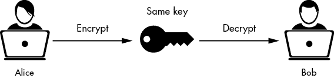
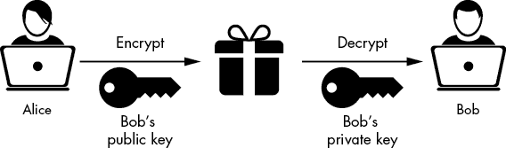
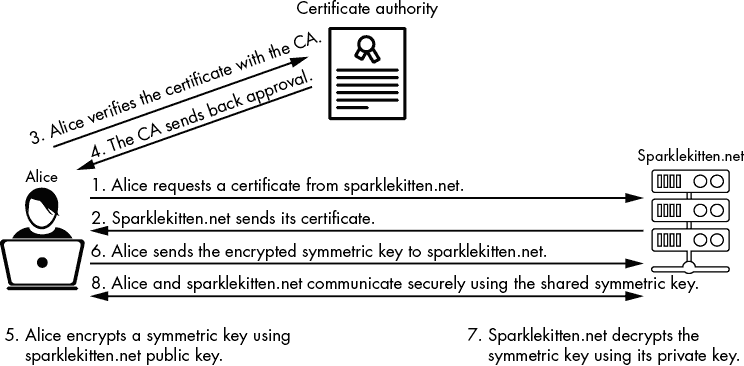
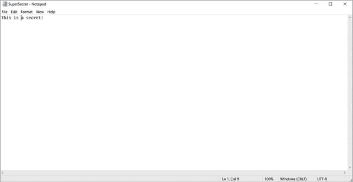
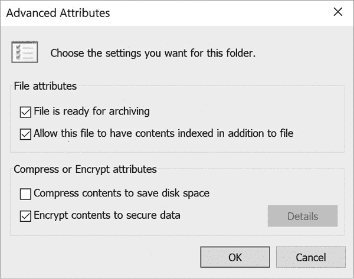

# 加密破解


想象一下，如果你所有的互联网电子邮件、消息和购买记录都能被任何人查看。一位黑帽黑客只需要观察你的网络流量，就能知道你想要的任何信息，盗取你的文件，甚至捕获你的密码。网络安全中最重要的部分之一就是*密码学*，即隐藏数据的过程，使得只有授权的人才能看到它。

在本章中，你将了解加密是如何工作的，攻击者如何尝试破解它，以及你如何加强加密来保护个人信息免受窥探。

## 什么是密码学？

*密码学*是编写代码的研究与艺术。当人们想要隐藏数据时，他们通常通过编写代码或过程（称为*密码*）来掩盖信息。在现代计算机系统中，我们使用*密码算法*来隐藏数据，这些算法是执行复杂数学运算以安全地转换信息的过程。

密码和算法以各种方式工作，但它们都使用密钥来执行功能。一个*密钥*是一个独特的信息，通常保持秘密。通过使用这个密钥，用户可以将*明文*（即未加密的数据）转化为*密文*（即加密后的数据）。加密过程类似于在门上安装锁。当门未上锁时，任何人都可以访问门的另一侧。像密码学一样，锁限制了只有持有钥匙的人才能访问。每个门都有一个独特的锁和钥匙，用来保护门的另一侧的安全。使用密钥对数据进行编码的过程称为*加密*。你可以把它想象成给门上锁。反向加密过程，相当于解锁门，称为*解密*。

## 我们加密的内容

我们在许多类型的文件和过程上使用加密。基本上，存储在计算机上的任何内容都可以以某种形式加密。然而，所使用的加密类型可能会根据数据的状态而变化。所有数据都被组织为三类之一：静态数据、传输中的数据和使用中的数据。*静态数据*包括计算机不在主动处理的任何文件；例如，音乐、文档或数据库中的信息。*传输中的数据*是指在两个系统之间传输的任何数据，包括数据包（如第六章所讨论）、电子邮件或正在通过网络发送的文件。*使用中的数据*是指计算机系统当前正在使用的数据。此类数据不能加密，因为计算机必须能够读取它以进行使用。

当数据在不同状态之间传输时，加密类型会发生变化。例如，假设你在电脑上安装了一个游戏。如果你没有在玩这个游戏，你可以使用*文件加密*将其加密，并将其存储在硬盘或其他存储介质上。但一旦你打开游戏，它就变成了“使用中的数据”，计算机必须对其进行解密才能正常运行。现在假设你通过互联网将游戏发送给一个朋友。这时，游戏变成了“传输中的数据”，必须使用*传输加密*。

不同的加密选项有助于区分用于加密特定类型数据的方法。每种加密选项都有其优缺点，我们将在《现代密码学》第 160 页中更详细地讨论这一点。现在，请记住，单单因为你使用了一种加密方式，例如文件加密，并不意味着你的数据在其他状态下（例如使用中或传输中）也一定是安全的。

## 早期密码学

加密消息的做法与书写本身一样古老。军事部门早期使用密码学技术来传输消息，确保如果消息落入敌人之手，他们无法得知自己的计划。

早期的密码学也相当临时。人们没有加密消息的固定标准，因此通常是根据具体情况发明策略。有时，缺乏标准在将消息传递给陌生人时会带来问题，比如传递给其他王国的国王或将军，因为他们不知道加密方法。事实上，一些历史文献至今未能被解读，因为专家认为它们是用早已失传的密码写成的。

缺乏标准突显了密码学中的一个主要问题：如何创建一个在隐藏信息的同时，仍能在两人之间共享解密密钥的系统？换句话说，这是平衡机密性和可用性的 CIA 三原则元素的问题。如果加密系统过于复杂，可能会导致难以有效使用。例如，如果我加密一条消息，使得只有在某个王国的最高峰在满月时，并且在倒着说精灵语的魔法词语时才能解密，那我很可能会阻止敌人阅读这条消息。但如果我想和其他巫师分享我的工作，他们也会很难阅读它。然而，如果我创建一个使用关键字解密的密码，并将这个关键字写在消息的顶部，那么加密就变得毫无意义，因为任何收到消息的人都会知道这个关键字。

平衡可用性和机密性的考虑始终是密码学中的一个难题。为了解决这个问题，密码学家开始依赖两种加密方法：*代换*和*置换*。

### 代换密码

要创建一个替代密码，你需要用一个符号替换另一个符号。例如，考虑虚构的超级棒替代密码，在这种密码中，你用数字替换消息中的每个字母。要使用超级棒替代密码，你只需要知道其中一个替代规则，这可以作为密钥。这个密钥可能是*字母 A 等于 10*。一旦你知道了密钥，就可以继续计数，将每个后续字母与下一个数字配对：*B*变成*11*，*C*变成*12*，依此类推，直到*Z*变成*36*。使用这个密码和密钥，消息*attack now*就变成了*10, 29, 29, 10, 12, 20, 23, 24, 32*。

这种替代密码在实际应用中并不安全，因为它很容易通过试错法破解。然而，在历史上，许多有效的密码都使用了替代法。最著名的是凯撒密码，它由尤利乌斯·凯撒发明。它依赖于使用两个字母表副本。作者将这两个字母表一上一下对齐，使它们相匹配：上面的字母表中的字母*A*与下面字母表中的字母*A*对齐。然后，作者将下面的字母表向左或向右移动几个位置，并使用移动后的字母表来加密他们的信息。移动的空间数就是密钥。例如，要用密钥 3 加密字母*A*，你会将它写成字母*D*。虽然它仍然容易破解，但这是第一个创建标准替代算法的密码，并成为未来替代密码的基础。

### 换位密码

替代密码将消息替换为完全新的符号，而换位密码使用相同的符号，但将它们以不同的顺序排列以隐藏其含义。这个过程类似于你在报纸或在线上看到的字谜。当经过换位密码处理后，消息*attack now*可能变成*kcnwta toa*，例如。

为了使换位密码成为一种有效的加密形式，而不仅仅是一个有趣的脑筋急转弯，你必须以有序的方式打乱字母。有几种方法可以实现这一点，但其中一种最古老的方法是*Scytale*法。Scytale 法起源于希腊，原始的 Scytale 方法使用一块布，将其缠绕在一根特定厚度和长度的棒上。作者在布上写下信息，当他们将布解开时，信息沿着布的长度自然被打乱。解密消息的人必须将布缠绕在相同类型的棒上。为了进一步隐藏消息，人们有时将这些布作为腰带佩戴。

## 现代密码学

在 1800 年代，政府开始采用更系统化的密码学方法。这包括制造机器来处理加密/解密过程，这种加密方法最典型的例子就是德国的恩尼格玛机。恩尼格玛机在第二次世界大战期间使用，采用了三组旋转盘来加密和解密通过无线电发送的消息。从理论上讲，这种密码太复杂，如果没有恩尼格玛机来进行工作，就无法破解，因为该机器使用三片独特的磁盘生成了大量的符号组合。

但该密码并非无法破解。密码学的普遍缺陷是：任何密码都有可能被破解，只要有足够的时间，即使破解每一个可能的密钥组合需要一亿年。一个密码的真正价值在于它的*工作量*，也就是说，破解它所需的时间足够长，以至于消息在破解之前就不再相关。到第二次世界大战结束时，*密码分析*，即破解密码的研究，已经发展到如此先进的程度，以至于研究人员能够在短时间内破解依赖机械过程的任何密码，例如恩尼格玛机所使用的密码。这大大降低了这些密码的工作量，基本上使它们变得毫无价值。

计算机的出现进一步减少了工作量，但也创造了新的加密方式。计算机使得执行高级数学运算变得非常迅速。因此，人们能够在几分钟内解决那些通常需要几天或几周才能完成的问题。从 1950 年代开始，现代密码学家开始研究新的加密方法，这些方法使用极其复杂的数学问题来计算生成密文所需的数字。例如，利用椭圆曲线图上的两个特定点，配对后可以创建一组密钥来加密和解密密文。即使你知道其中一个点，使用高端计算机也需要许多年才能搜索出所有可能的配对以找到正确的那一对。

最终，加密学家创造了三种主要的加密方法：*对称*、*非对称*和*哈希*。这三种方法成为了现代密码学的基础，是当今大多数加密技术的构建基石。

### 对称密码学

对称密码学，也称为*单一*或*私钥密码学*，使用一个密钥来加密和解密明文（图 9-1）。



图 9-1：使用私钥加密

对称密钥算法使用复杂的函数将明文转化为密文，但其核心仍然使用替换和换位技术。它们不是交换或移动字母，而是移动表示这些字母的计算机中的 1 和 0。它们比传统的换位和替换技术要强大得多，因为与人类手动操作数据不同，计算机可以在短时间内执行数百次甚至数千次变换。计算机还可以在运行算法时改变它们执行替换或换位的方式。然而，这可能会有一定难度，原因有二：系统需要对 1 和 0 进行打乱，以确保它们无法再次被读取，同时也要确保在提供正确密钥的情况下，过程能够被逆转。

为了简化这些过程，对称密钥算法使用两种类型的密码模式：*流式*和*块式*。在流密码模式下，计算机一次加密一个比特的数据。这个模式产生的是一些最快的加密，但通常被认为比块模式弱，因为它在生成的密文中产生的随机性较少；换句话说，它会产生一些模式，这些模式可能使破解算法变得更容易，特别是当密钥过短或者同一密钥频繁使用时。

块密码对固定长度的比特块进行加密。与使用流密码相比，这种技术较慢但更强大。它不是逐个比特加密，而是将比特组织成块。例如，从正在加密的数据中取出一个 4×4 大小的比特块，并从密钥中取出一个相同大小的比特块。然后，算法一次性加密整个比特块，生成一个加密的 4×4 大小的比特块。

由于块的大小相同，算法可以将之前加密过的块与密钥结合，生成一个新的、唯一的输入，用来加密下一个块。因此，不仅密钥帮助创建独特的加密方式，而且被加密的内容也有助于增加最终密文的唯一性，使得破解变得极为困难。

就像用钥匙锁住一扇门一样，对称算法在加密文件时速度较快，这使得它们在大批量加密中非常高效，例如加密硬盘上的多个文件或整个数据库。但这种速度也有一个代价。如果两个人试图使用对称算法进行通信，他们必须找到一种方法来传输密钥而不暴露它。这需要找到一种不同于发送密文所用的传输方式，因为如果有人截获了密文，他们也会同时截获密钥。所需的传输方式被称为*带外*传输，在许多情况下，这可能会非常棘手。

有许多对称加密算法可用，但其中有两个特别著名。一个是*数据加密标准（DES）*，这是最早的现代加密标准之一，在政府、军事和公共系统中被广泛使用。该算法实现了一个 56 位密钥的分组加密算法。尽管在 DES 被发明时，56 位密钥能够提供有效的工作因子，但由于计算机处理能力的提升，从 2000 年代初开始，破解一个 DES 密钥只需不到 24 小时。密钥位数越多，计算机需要遍历的组合就越多。随着处理器的速度越来越快，计算机能够更快地计算出所有可能的组合。56 位密钥的组合数不足以防止现代处理器快速猜测出密钥。

为了延长 DES 的生命周期，密码学家发明了一种新的使用该算法的方法，叫做*3DES*（发音为“三重 DES”），顾名思义，它使用了三个 DES 密钥，而不是仅使用一个。然而，这种方法在加密执行的方式上存在缺陷。黑客可以利用这个缺陷，几乎和破解 DES 一样快速地破译 3DES。

由于 DES 已经接近其生命周期的末期，人们需要一种新的算法来替代它。许多密码学家尝试开发替代算法，最终他们选择了 Rijndael 算法。今天，我们通常将该算法的实现称为*高级加密标准*（*AES*）。AES 通常使用 128 位密钥，尽管在需要时密钥长度可以达到 256 位。AES 使用的是分组加密方法。尽管该算法于 2001 年首次实施，但它至今仍在广泛使用，并且具有出色的工作因子。即使是当前的超级计算机，也需要数十亿年才能暴力破解一个 AES 密钥——这比宇宙的年龄还要长。

### 非对称加密

尽管对称加密适用于大多数加密需求，如保护文件或在两台设备之间建立安全连接，但无法轻易在两方之间共享密钥，这使得它在互联网上的有效通信中存在问题。这就是非对称加密，也称为*公钥加密*，发挥作用的地方。

在非对称加密中，算法为每一方使用两把密钥：公钥和私钥。这两把密钥是相互关联的，因此公钥加密的任何内容只有私钥才能解密，反之亦然。没有任何一把密钥能够加密并解密相同的密文。这个系统之所以有用，是因为任何用公钥加密的数据只能用私钥解密，因此你可以将公钥和要加密的数据一起在同一消息中共享（图 9-2）。



图 9-2：使用公钥/私钥对进行加密

正因如此，非对称加密使得两个人之间的通信加密变得容易，特别是当他们互不相识时。例如，假设艾丽丝想通过电子邮件向鲍勃发送一份私人文档。在她加密文档之前，她需要确保鲍勃在文档到达他的收件箱后能够解密它。如果她使用的是对称密钥，她就无法将密钥与电子邮件一起发送，因为任何可能监听流量的人都能看到文档和密钥。她可以将对称密钥放在一个 U 盘上，并通过邮寄的方式发送给鲍勃，但这需要时间和精力。与其使用对称密钥，艾丽丝可以让鲍勃将他的公钥发给她。鲍勃可以通过任何方便的方式通过互联网发送这个公钥，因为它不需要保密。然后，艾丽丝可以使用鲍勃的公钥加密文档，并通过电子邮件将文档发送回去。如果有对手拦截了电子邮件，他们也无法解密，因为只有鲍勃的私钥可以解密它。如果他的私钥保密，谁拥有他的公钥都无关紧要。

公钥加密对于证明某人就是他们所说的那个人，并防止他们否认自己发送了某个信息，也非常有益，这个概念叫做*不可否认性*。假设鲍勃审阅了文档，表示文档看起来不错，然后将其发回给艾丽丝。艾丽丝想要确认是鲍勃而不是某个冒充鲍勃的人发送了文档。为了使用非对称加密做到这一点，鲍勃可以用他的私钥加密文档的哈希值，并将其发送给艾丽丝（我们将在第 166 页的《哈希》一章中讨论哈希）。只有鲍勃的公钥可以解密该文件。如果解密成功，艾丽丝就知道是鲍勃发送的，因为他是唯一拥有私钥的人。此外，鲍勃以后不能否认自己没有发送文档，因为密钥对是唯一的，属于他自己。除非鲍勃的私钥被泄露，否则没有其他人能够使用它来加密信息。

很像对称加密，许多不同的算法也使用非对称密钥。然而，这些算法不使用分组密码或流密码。相反，它们依赖于极其复杂的数学问题来生成密钥对。例如，其中一个最早的非对称算法通过计算离散对数来实现。另一个则使用大素数的因数分解。尽管这些数学问题的细节超出了本书的范围，但密钥是解决问题所需的数字。这些问题非常复杂，以至于没有这些数字，计算机需要花费很长时间才能计算出解决问题所需的值。这就是算法的工作量因素。

长时间以来，非对称加密的事实标准是一个叫做 *Rivest–Shamir–Adleman (RSA)* 的算法。RSA 以其发明者命名，从 2000 年到 2013 年，它是互联网上最广泛使用的公钥加密算法。其主要的密钥长度是 1024 位，这比对称加密所使用的密钥要大得多。近年来，RSA 逐渐失宠，因为 2013 年证明美国政府可以使用超级计算机破解 1024 位的 RSA 密钥。从那时起，大多数系统使用 2048 位密钥，这要复杂得多，或者使用其他算法。

RSA 的一个更受欢迎的替代品是 *椭圆曲线加密（ECC）*。尽管非对称加密比对称加密慢得多，且生成的文件要大得多，但 ECC 是最迅速的非对称算法之一。它可以比 RSA 快 10 倍加密文件。ECC 还不需要消耗大量的处理器能力。它的典型密钥长度是 160 位，但也可以使用 256 位密钥。因此，我们可以在内存有限的设备上实现 ECC，例如物联网设备。

### 验证公钥

在阅读有关公钥加密的内容后，你可能会想知道爱丽丝最初是如何获得鲍勃的公钥的。这比你最初想象的要复杂，因为虽然接收公钥的人不重要，但你必须确保你使用的是正确的公钥来发送消息。特别是在互联网上交流时，这一点尤为重要，因为你根本无法确定接收方是否就是你认为的那个人。他们可能是一个黑帽黑客，伪装成别人。验证公钥的两种主要方法是 *信任网* 和 *证书授权机构*。

#### 信任网

信任网是一个由受信任的个体组成的网络，每个人都为他们在网络中所连接的人担保。例如，爱丽丝在现实生活中认识鲍勃并信任他，因此她在自己和鲍勃之间建立了一个受信任的链接，她的系统接受鲍勃的公钥。鲍勃不仅信任爱丽丝，还信任查理。因此，爱丽丝也信任查理，因为她对鲍勃的信任转移到鲍勃信任的每个人（这也包括网络中的丹妮尔、埃里克和弗兰基）。

尽管信任网络对于那些不希望使用集中管理的信任系统的小型组织来说效果很好，但它在互联网中并不适用。随着数十亿人使用互联网，几乎不可能确保信任网络中的每个人都是可信的。对手很容易利用信任网络来欺骗他人，诱使他们发送敏感信息。因此，只有少数应用程序使用信任网络系统。其中一个最著名的应用叫做*Pretty Good Privacy*（*PGP*）。PGP 是一种主要用于加密电子邮件的加密系统。它作为一种替代方案应运而生，目的是避免集中式信任解决方案可能会受到政府或私人组织的破坏或监听。

#### 证书颁发机构

验证公钥是否真实有效的更流行的方式是使用*数字证书*。类似于高中或大学文凭，数字证书是一种文档，验证你收到的公钥确实来自发送它的人。为了维护和管理数字证书，个人需要使用*证书颁发机构*（*CA*），这是一家为个人或组织创建、管理和验证证书的第三方机构。本质上，它告诉你是否可以信任一个公钥。

证书颁发机构提供几种不同的服务。其中一项是它们为个人或组织创建证书。例如，当一个组织（比如 Sparkle Kitten Inc.）希望在其网站上使用公钥加密时，它会选择一个证书颁发机构来为该公司提供证书。该证书颁发机构随后验证 Sparkle Kitten Inc.是一个合法公司，并且请求证书的人确实代表 Sparkle Kitten Inc. 一旦完成验证并收取费用，证书颁发机构会创建数字证书并提供副本给公司。证书颁发机构还会创建与证书一起使用的公钥/私钥对。通常，这些证书的有效期为一年，到期后，任何持有证书的人都会收到警告。在访问网站时，要注意过期的证书。即使网站所有者可能只是忘记续期证书，黑客也可以利用过期的证书来欺骗你连接到不安全的网站。

证书授权机构（CA）提供的另一个服务是密钥管理和恢复。假设 Sparkle Kitten Inc.使用对称密钥加密了整个数据库，然后使用其 CA 颁发的公钥对该对称密钥进行加密（这是一种常见的通过互联网共享对称密钥的做法）。私钥将是唯一可以访问对称密钥并解密数据库的方法。现在，假设公司的一只常驻猫把存储私钥的系统从窗户上撞了出去，摧毁了硬盘，导致无法从中恢复任何数据。没有密钥，数据库中加密的数据将永远丢失。幸运的是，CA 可以将它们创建的公钥/私钥对保存在高度安全的保险库中，以备不时之需，如果它们提供此服务，并且你为此支付了额外费用。一旦 Sparkle Kitten Inc.提供所需的认证材料，证明它合法拥有密钥，CA 就会将私钥释放回公司，使其能够恢复数据库。

此外，CA 还提供了一个高度管理的所有公开证书的存储库，供它们管理的所有证书公开使用。这使得互联网上的任何人都可以验证发送给他们的公钥是否来自正确的人。例如，当客户访问 Sparkle Kitten Inc.的网站时，他们将收到一个数字证书和一个公钥，用于保护连接。然后，客户的浏览器将联系颁发证书的 CA，以验证该证书是否来自该特定 CA。如果 CA 验证它是真实的，浏览器就可以信任发送给它的公钥。CA 还会维护不良证书的列表，并定期更新这些列表，以防止对手使用被破坏或过时的证书。

### 哈希

密码学中最广泛使用的一种形式是*哈希*，它是一种单向加密函数，给定相同的输入总是提供相同的加密输出。一旦数据使用哈希算法进行加密，它就无法再被解密。例如，如果我将单词*CAT*输入哈希算法，输出可能是`x5d7nt2k`。每次将单词 CAT 输入该算法时，输出结果都会相同。但如果我改变一个字母，比如将单词改为*PAT*，整个密文将变成完全不同的输出；例如，`l3loi2jd`。即使只改变字母的大小写，比如将大写的*C*改为小写的*c*，密文也会发生实质性的变化。这种现象被称为*瀑布效应*，它是哈希算法的主要目的之一；也就是说，确保即使是最微小的变化也会产生完全不同的密文。

起初，可能难以理解为什么我们需要一个始终生成相同输出且无法反向操作的算法。哈希算法的一个有用之处在于，它提供了一种验证信息真实性的方法，而不会泄露信息。例如，我们使用哈希算法来验证密码。与其以明文存储密码（这是一种极不安全的做法，容易被攻击者窃取），应用程序通常会将密码经过哈希算法处理后再存储哈希值。当用户想要登录他们的账户时，输入的密码会通过相同类型的哈希算法处理。应用程序并非以明文形式发送密码，而是发送哈希值通过网络传输。当哈希值到达系统后，系统将其与存储在数据库中的哈希值进行比较。由于哈希算法的输出在输入相同时永远不会改变，系统如果匹配的哈希值相同，则知道用户输入了正确的密码。此外，这意味着用户是唯一知道密码明文值的人。

我们还使用哈希算法来验证文件。我可以通过哈希算法运行文件（如软件）以获得哈希值，然后将该哈希值分发给公众。当有人下载我的软件时，他们可以将其通过相同的哈希算法运行，并将其与我提供的哈希值进行比较。如果两者相同，他们就知道这是原始软件，并且未被其他人修改，例如添加恶意代码如病毒。

许多哈希算法可供公众使用。首个获得广泛认可的算法是消息摘要 5（MD5）。MD5 的 *摘要大小* 是 128 位，这意味着其输出始终为 128 位，无论输入数据量大小如何。尽管这看起来是很多位，但并不足以防止攻击者破解哈希值（有关此主题的更多信息，请参阅第 171 页上的“黑客如何破解哈希值”）。由于 MD5 的缺陷，安全专家将其替换为安全哈希算法 1（SHA-1）。SHA-1 的摘要大小为 160 位，虽然比 MD5 好，但仍然不足以抵御现代黑客技术的攻击。目前，我们使用的是 SHA-2 或 SHA-3 算法。两者的摘要大小通常为 256 或 512 位。

还需注意的是，通常用户无需做任何事情即可使用哈希算法。哈希过程是计算机与应用程序或服务器之间正常通信的一部分。事实上，您的计算机甚至不会选择使用哪种算法；相反，连接的服务决定应该使用哪种算法。

## 访问网站时发生了什么？

现在你已经了解了不同类型的现代加密技术，让我们回顾一下我们所知道的通过互联网传输的加密流量。假设你想访问一个安全的网站，例如 sparklekitten.net。首先，Sparkle Kitten 的 Web 服务器会向你发送一个数字证书。该证书包含三项重要信息：该 Web 服务器的公钥、它将接受的对称密钥算法类型以及创建该证书的证书颁发机构（CA）。然后，你的系统通过联系 CA 来验证证书的合法性（或检查证书是否由已经信任的 CA 签名，例如一个受信的根证书机构）。

如果 CA 验证了证书，你的系统就会使用 Web 服务器指定的算法生成对称密钥。由于公钥加密速度较慢，必须使用对称密钥来高效地将数据发送到 sparklekitten.net。然而，为了保证安全，sparklekitten.net 不能直接将对称密钥发送给你，因为任何拦截 Web 服务器流量的黑帽黑客都可能捕获并破解加密。相反，你会生成一个对称密钥，并使用 sparklekitten.net 的公钥加密它。现在，只有 sparklekitten.net 的私钥能够解密该对称密钥。你还会将你刚刚发送给 sparklekitten.net 的所有数据的哈希值发送过去，用作完整性检查。

一旦 sparklekitten.net 的 Web 服务器接收到加密的对称密钥，它就会使用自己的私钥解密该密钥。然后，Web 服务器使用哈希值验证密钥的完整性。如果一切正常，Web 服务器会确认连接，允许你和 sparklekitten.net 使用相同的对称密钥安全地进行通信。整个过程通常不到一秒钟就可以完成。图 9-3 提供了该通信方式的详细说明。



图 9-3：与网站建立安全连接

尽管我们在多种方式中使用哈希和对称加密与非对称加密来保护通信，正如前面网站示例所示，保护通信是其中最常见的应用之一。需要记住的主要方面是，系统通常在后台处理密钥和加密。作为用户，你不需要做任何事情就能利用加密的强大功能来保护系统。事实上，你可能甚至没有意识到它正在发生，这使得加密对所有用户而言既简单又快速且有效。然而，这种缺乏意识可能导致你甚至不知道的攻击。

## 黑帽如何窃取你的密钥

绕过加密是黑客行为的核心部分。攻击者可以通过多种方式绕过加密提供的安全性，其中大多数方式涉及另一种类型的攻击，如社会工程学，这使得加密的存在变得无关紧要。例如，您可能对硬盘进行了全盘加密，但如果攻击者诱使您透露用于访问硬盘的 PIN 码或密码，那么无论加密多么强大，都没有意义。如果攻击者能够欺骗您与他们而非合法服务建立加密连接，这种情况也是一样的，这在许多中间人攻击中都有发生。如果发生这种情况，您与对方共享生成的对称密钥，允许他们在将流量转发给合法服务之前解密您的流量。

攻击者还可以窃取存储在硬件上的密钥，尤其是应用程序使用的密钥。存储在硬件上的密钥通常更难被破解，因为攻击者通常需要与系统进行物理交互才能窃取这些密钥。例如，您的密钥可能存储在一个 USB 驱动器中，必须将其插入才能访问这些密钥。如果对方没有 USB 驱动器，他们就无法获取这些密钥。某些漏洞，如内存存储中的错误或 CPU 访问信息时出现的问题，使得存储在硬件上的密钥有可能被访问，尽管这些漏洞通常非常罕见且难以利用。

这些针对硬件的攻击并不是攻击加密算法本身，而是影响了加密算法的实现。许多密码学漏洞是由于加密算法在使用时的运行方式存在缺陷，而非算法在理想状态下应如何运行。例如，最著名的例子之一是无线加密标准 WEP。它使用了 RC4 算法，但选择了一个极小的密钥空间并重用信息来生成密钥。这导致了该标准的漏洞，尽管底层算法本身是强大的。

### 密码分析

研究密码学及其破解方法被称为*密码分析*。现代密码分析通过检查加密算法的内部工作原理，寻找任何可能揭示加密消息明文的缺陷。这不仅包括寻找密钥的方法，还包括在不暴露密钥的情况下解码明文的方法。

研究人员在密码分析中使用多种技术，其中一种技术是暴力破解分析。如前所述，任何算法都可以被破解，只要时间足够。问题在于，如果暴力破解算法需要很长时间——比如说，几年或几十年——那么破解后获得的信息可能不再有用。因此，暴力破解分析还包括一些方法，利用算法处理信息时的漏洞，来减少正确猜测密钥所需的时间。例如，3DES 的主要漏洞在于其核心使用了三个不同的 DES 密钥进行加密过程。通过分析该算法，研究人员发现他们可以分别隔离每个密钥，实际上将其转化为普通的 56 位 DES 密钥，然后可以使用传统的暴力破解技术来破解，从而削弱了 3DES 的强度。这种攻击被称为*meet-in-the-middle*（不要与 man-in-the-middle 混淆）。

另一种密码分析技术是分析明文如何转换为密文。常见的做法之一是使用*差分分析*，它侧重于明文输入和密文输出之间的差异。该方法创建多种明文输入，除了一个受控变量（例如，每个输入中的数字不同）外，其他都相同。研究人员随后分析密文输出，并根据使用的明文寻找统计模式。另一种分析技术是*积分分析*，它考虑块密码的替代方法，寻找加密算法在管理替代过程中产生的统计模式。这两种分析方法通常可以发现可以利用的漏洞，例如之前提到的 meet-in-the-middle 漏洞。

密码分析不仅关注算法如何加密明文；它还关注算法与周围系统的互动。*侧信道攻击*侧重于算法外部的元素，如功耗、时序，甚至加密过程生成的声音，这些都可能导致发现关键的漏洞。

### 非对称算法攻击

尽管许多密码分析技术在对称和非对称算法上同样有效，但公钥密码学的特性使其更容易受到暴力破解攻击。由于非对称算法依赖于复杂的数学运算来生成密钥对，攻击者可能会利用任何能够加速问题求解的方法来破解非对称算法。例如，你的算法可能依赖于计算离散对数的难度，通过需要计算离散对数的数字来生成密钥，这些数字是从一对随机选择的数字中获得的。如果一个数学家找到了一种更快速的方法来计算离散对数，他们可能会显著降低你算法的工作难度。

RSA 的安全性在爱德华·斯诺登（Edward Snowden）——一名美国国家安全局承包商——揭露出超级计算机可以完成素数分解，从而创建公钥/私钥对后受到了削弱。这意味着传统的 1024 位密钥长度不再可行，算法必须使用 2048 位密钥才能保持安全。随着计算机处理器的持续增强，非对称加密必须不断更新其算法和标准，以避免被破解。

## 保护你的密钥

为了保护密钥，许多加密算法使用*初始化向量*（*IV*）。初始化向量由算法在加密数据之前添加到密钥中的随机位组成。这确保即使是用相同密钥加密的数据，也遵循不同的加密过程。初始化向量是保护加密分析的一个好方法，因为它们能避免加密数据中出现规律。

保护密钥的另一种方式是限制它们的重用频率。由于密钥在频繁使用时更容易被破解，因此最好尽可能频繁地更换密钥。你可以通过使用*会话密钥*来做到这一点，*会话密钥*仅在单个会话期间加密数据，例如在连接到谷歌时。一旦你关闭谷歌窗口或达到某个超时，*会话*就结束了，平台会销毁该密钥。这样，即使攻击者在会话期间获得了密钥，他们也无法用它解密未来的通信。我们通常使用对称密钥，如本章早些时候讨论的在连接到 sparklekitten.net 时创建的密钥，作为会话密钥来保护互联网通信。

我们还必须定期更换非对称密钥。通常，这会在每年进行一次，作为正常证书续期的一部分，但你也可以更频繁地更换。决定何时更新非对称密钥的一个好规则是，使用该密钥加密的流量越多，它需要更早更换：每年使用两次的密钥比每月使用数千次的密钥（或者像谷歌这样的公司每秒使用数千次的密钥）暴露的风险要小得多。

## 黑帽如何破解哈希值

我们经常使用哈希值来检查某些数据的完整性，如密码。由于哈希值本质上是不可逆的，哈希算法仅生成一个哈希值，不能用于解密。因此，大多数常见的密码分析攻击对哈希算法不起作用。然而，哈希值并非不可攻破。

对手破解哈希的主要方式是使用暴力破解技术。方法可能很简单，比如创建一个包含随机但可能的输入的哈希表，并将其与他们要破解的哈希进行比较。一旦找到哈希，他们就知道自己已经正确猜出了输入。但考虑到可能的输入数量——几乎是无限的——这种方法很少有效，除非他们拥有一些信息来缩小可能的结果范围，可能通过使用其他密码破解技术，如字典攻击或社会工程学。然而，哈希确实存在一个关键的漏洞，使其比其他加密密钥更容易被暴力破解：这个漏洞就是*碰撞*。

当两个输入产生相同的哈希输出时，就发生了碰撞。例如，随机情况下，单词*sparkle*和*kitten*可能都会生成哈希`f90ab7`。哈希算法中的碰撞会减少破解哈希所需的时间。可以这样理解：假设你有一个需要在超市购买的 10 个物品清单，而这些物品分布在商店的不同位置，可能需要花费 20 分钟才能找到所有物品。但如果其中有两个物品就放在靠近的货架上，找到它们所需的时间就会减少。物品之间越是靠得近，找到它们的时间就越短。哈希算法中的碰撞越多，攻击者通过各种组合找到目标的时间就越短。找到一个碰撞可以有效地将猜测输入的时间减半。碰撞越多，所需的时间就越少。

更强的哈希算法会生成较少的碰撞，因此破解所需的时间更长。但作为一种变通方法，黑帽黑客使用一种需要特殊工具的技术，这种工具被称为*彩虹表*。本质上，彩虹表是一个预先计算的哈希表，它通过哈希输出将哈希值分组，从而使特定输出更容易找到。因此，如果我有一个哈希值`4fd3cd`，该表会尝试将这个哈希值孤立成一个特定的输出组，并找到在该组中生成此哈希的密码。一旦表格找到密码，我就可以通过哈希算法确认它是否正确。

## 给你的哈希添加盐

MD5 算法极易受到碰撞攻击。在拥有正确的信息的情况下，破解其哈希只需几秒钟。SHA-1 虽然比 MD5 更安全，但也容易受到攻击。SHA-2 和 SHA-3 由于其哈希大小，更加安全。增强哈希安全的另一种方法是使用盐。像初始化向量（IV）一样，盐是一串随机位，在对输入进行哈希之前，我们将其添加到输入中。这一过程会生成一个独特的哈希，与未加盐的输入完全不同。

举个例子，假设输入*kitten*生成的哈希值是`f903d`。为了使哈希更加安全，我的系统可能会通过在末尾添加一组随机数字来对*kitten*进行哈希处理，使输入变成*kitten123*（尽管在实际应用中，它会将位添加到输入的二进制表示中，而不是十进制数字）。由于系统每次对*kitten*进行哈希时都会添加新的数字，因此哈希值每次都不同。这个过程还使得将哈希值聚集在一个彩虹表中变得更加困难，因为输出与被哈希的原始明文没有直接关联。

通过添加盐，你可以增加可能的哈希数量，直到碰撞变得极其罕见或难以发现。结果，破解哈希成为一个非常漫长的过程，尤其是当输入复杂时（有关详细信息，请参见第 76 页的“类型 1：你知道的某些东西”）。尽管如此，就像加密密钥一样，只要给足够的时间，任何哈希都是可以破解的。

## 练习：加密和哈希文件

Windows 和 macOS 系统提供了多种工具来帮助你加密和哈希文件。在本次练习中，你将使用 Windows 10 和 macOS 中嵌入的工具来加密文件。你还将对文件进行哈希处理，然后再加密它，并再次哈希，以查看哈希输出的不同之处。完成练习后，你将能够保护你的文件并验证它们是否已被修改。（只有 Windows 10 专业版才支持内建文件加密。对于使用 Windows 家庭版的用户，我建议使用 VeraCrypt 开源软件来创建存储敏感文件的地方，这样它们就会被加密。）

### 在 Windows 10 中加密和哈希文件

为了练习使用文件加密，你需要创建一个文件进行加密。最快的方法是打开一个文本编辑器，添加一些文本，然后将其保存为一个*.txt*文件，并存储在一个容易记住的位置；稍后你会输入文件路径。选择一个没有空格的文件名，以便稍后在练习中更容易使用。图 9-4 展示了我创建的一个超级秘密文件，名为*Secretfile.txt*，并将其保存到一个名为*Secret*的文件夹中。

接下来，你需要确保没有人能够在没有被你察觉的情况下修改你的秘密文件。最简单的方法之一就是创建文件的哈希值。然后，你可以将这个哈希值与该文件其他版本的哈希值进行比较，以确认文件内容是否完全一致。Windows 10 提供了内建工具，允许你创建这样的哈希值。要访问这些工具，打开命令提示符应用程序，就像在第二章的练习中那样。



图 9-4：一个非常秘密的文件

在命令提示符窗口中，你将使用 certutil 命令行工具。通常我们使用 certutil 来查找有关证书的信息，但它也可以创建文件哈希。使用以下命令运行该工具：

```
C:\Windows\System32>**certutil -hashfile****C:\Users\SparkleKitten\Documents\Secretfile.txt** **SHA512**
SHA512 hash of C:\Users\samgr\Desktop\Secret\SuperSecret.txt:
0dd47a4aa75835dfd19b1bb6ed5f8f60cc87492dacf8284ef598229cc258244f67d430e18d7cb770d36ed8b205af1571f42f9956bbe544a362ca191256450eb0
CertUtil: -hashfile command completed successfully.
```

该命令通过 `hashfile` 函数运行 certutil。回想一下第二章的练习，后续以破折号（`–`）开头的命令，被称为 *标志*，可以修改原始命令。添加文件路径，以便系统知道你要哈希的文件。输入文件路径时，从硬盘字母（通常是 *C*）开始，按顺序列出每个文件夹，直到到达存储文件的文件夹；确保在每个文件夹名称之间使用反斜杠（\）。然后选择要使用的哈希算法。默认情况下，此工具使用 SHA-1，因此我们在这里输入 `SHA2-512`，以确保我们使用的是强大的算法。按 ENTER 运行命令。

该命令计算哈希值并输出一长串字符。将这串字符复制并粘贴到另一个 *.txt* 文件中，例如名为 *SecretHash.txt* 的文件，以便以后进行比较。

现在你已经对文件进行了哈希处理，接下来需要对其进行加密。对于本次练习，你将使用 Windows 10 中内置的加密功能。要访问此功能，右键点击文件，在文件系统中选择 **属性** 以打开属性菜单。找到窗口底部的属性区域，然后点击 **高级**。在这里，你会看到一些不同的选项。选择 **加密内容以保护数据**，如图 9-5 所示，然后点击 **确定** 以使用默认的 AES 算法对文件进行加密。



图 9-5：选择加密内容选项

现在文件已加密并且安全。让我们再运行一次 `certutil` 工具，以比较原始的（*Secretfile.txt*）文件和加密版本的哈希值。因为你已经拥有了未加密的 *Secretfile.txt* 文件的哈希值，这些哈希值保存在 *SecretHash.txt* 文件中，现在你只需要为加密后的 *Secretfile.txt* 创建一个新的哈希值。请记住，任何对文件的修改，无论多么微小，都应该生成一个新的哈希值。在运行与之前相同的 `certutil` 命令后，将哈希值粘贴到名为 *SecretHash.txt* 的文本文件中，那里存放了第一个哈希值，然后比较这两个哈希值。注意到哈希值差异很大，这表明原始文件发生了变化。如果你没有进行这些更改，你可能会怀疑文件被恶意篡改。

### 使用 macOS 保护文件

在 macOS 中保护文件非常简单，因为你可以通过一些基本命令从终端访问所需的所有工具。首先，你需要创建一个文件作为示例。打开文本编辑器，创建一个名为 *Secret* 的新文件，并将其保存为 *.rtf* 文件，存放在你的 *Documents* 文件夹中。你可以在文件中写下任何你想要的内容。

一旦你创建了文件，就可以对它进行哈希处理，以便在文件被修改时提供一个基准值进行对比。打开终端应用程序，就像你在第二章的练习中所做的那样。你无需特别的权限即可在终端中使用这些命令。

要为*Secret.rtf*创建哈希，使用以下`shasum`命令。为了表示主目录，你可以使用波浪符（~）符号，而无需在路径中键入完整路径：

```
$ **shasum ~/Documents/Secret.rtf**
2966acd0faf387e024b8b6be50f47450c3c2f7fb  /Users/sparklekitten/Documents/Secret.rtf 
```

一旦你输入了命令，它会自动生成一个哈希值。这个长字符串就是你文件的哈希值。将这个字符串复制到一个新文件中，命名为*SecretHash.rtf*，以便日后进行比较。

要加密*Secret.rtf*，你需要使用 openssl 工具。SSL 是一种网络通信加密形式，而 openssl 是该协议的开源工具集。你可以通过输入以下命令来加密*Secret.rtf*：

```
$ **openssl aes256 -in** **~/Documents/Secret.rtf** **-out** **~/Documents/Secret.rtf.enc**
enter aes-256-cbc encryption password:
Verifying - enter aes-256-cbc encryption password:
```

该命令使用了 AES-256 算法，正如你在本章中学到的，它非常强大。然后，它接收一个输入——在这个例子中，就是你想要加密的文件。输出使用不同的文件名来区分原始的*Secret.rtf*文件和加密后的文件，因此我建议在加密文件名的末尾添加*.enc*，这样你就知道它是加密过的。按下 ENTER 键运行命令后，你将被要求输入密码短语两次（第二次是确认）。请务必记住这个密码短语，因为它是解密文件的唯一方式。

要解密*Secret.rtf*，你再次运行相同的命令，但需要添加`-d`来表示解密，并反转`-in`和`-out`路径，如下所示：

```
$ **openssl aes256 -d -in** **~/Documents/Secret.rtf.enc -out** **~/Documents/Secret.rtf** 
```

现在，让我们保持*Secret.rtf*的加密状态，以便你可以重新进行哈希，并将其与之前加密文件时创建的原始哈希进行比较。再次运行`shasum`命令，但这次指向加密后的文件：

```
$ **shasum -/Documents/Secret.rtf.enc** 
786109556539fa6571704db78b79fb0d6ae035db 
```

如你所见，哈希值与原始的完全不同，而原始哈希已被保存在*SecretHash.rtf*文件中。这个哈希值将帮助你检测文件是否已被修改，这可能表明文件中被添加了恶意内容。

### 使用 ssh-keygen 生成公钥（适用于 Windows 10 或 macOS）

现在，你已经加密了文件，无论是在 Windows 10 还是 macOS 上，并创建了哈希值，你需要创建一个安全的方式来发送文件。尽管文件已经加密，但最好还是通过安全的通信渠道发送文件。为此，你可能需要一对公钥/私钥的非对称密钥。你可以通过`ssh-keygen`命令生成 RSA 密钥对，无论是在 Windows 还是 macOS 上。对于这个练习，我使用了 Windows 命令，但 macOS 上的命令是一样的：

```
C:\Windows\System32> **ssh-keygen**
Generating public/private rsa key pair.
Enter file in which to save the key (C:\Users\samgr/.ssh/id_rsa): **mykey**
Enter passphrase (empty for no passphrase):
Enter same passphrase again:
Your identification has been saved in **mykey****.**
Your public key has been saved in mykey.pub.
The key fingerprint is:
SHA256:FCRaZDnraock8vueS1FqjEZmdzcRB+LqXzRvRwqrLxc samgr@DESKTOP-OPFVANO
The key's randomart image is:
+---[RSA 2048]----+
|     .*o*o.      |
|     =oo +       |
|  + o +o+        |
| + + =.o .       |
|  o *.  S   .    |
|...o....E= o     |
| o ooo  o.+ .    |
|  ..+ooo.. .     |
|  .==oo+.        |
+----[SHA256]-----+
```

会弹出一个提示，询问你想将文件存储在哪里。默认路径是当前用户目录下的*.ssh*文件夹（在示例中，目录是*samgr*，但它会根据你系统上的目录名称而不同）。默认文件名是*id_rsa*。若选择默认路径，按 ENTER 键，或者如果你想将密钥保存在特定位置，可以创建自己的文件路径。接下来的提示会要求你设置一个密码短语以保护密钥免受滥用。如果你设置了密码短语，每次使用密钥时都需要输入该短语。请输入一个强密码短语，并在下一个提示框中重新输入它。完成后，你的密钥将生成并保存到*Users*目录下的*.ssh*文件夹中。

*.ssh*文件夹现在应该包含两个文件。一个是*id_rsa*，它是实际的私钥。你可以在记事本中打开此文件以查看私钥。另一个文件是一个发布者文件，包含公钥。你也可以在记事本中打开此文件查看公钥。现在，你拥有了一对公钥/私钥，可以在需要时用于加密通信。

了解如何创建哈希、加密文件并生成公钥/私钥对，能够让你加密通信以确保其安全。通过使用这些技术，你可以保护文件免受未经授权的访问，并判断文件是否被修改。你还可以检查下载的文件，特别是可执行文件，看看它们的哈希值是否与供应商公布的真实哈希值匹配。如果不同，可能是黑客篡改了文件，添加了恶意软件或其他恶意代码。

## 结论

密码学是一个复杂的学科，涉及众多动态部分。这使得了解如何保持通信安全变得具有挑战性。通过认识到现代世界中密码学的基本结构，包括对称加密和非对称加密以及哈希技术如何协同工作以建立安全连接，你将更好地理解如何保护你的连接免受试图窃取数据的对手。尽管黑客有许多方法窃取密钥或破解加密，但正确使用密码学可以有效降低攻击成功的风险。确保在连接到网站或使用协议时正确实现加密的一个简单方法是*检查是否有 S*。

我说的检查“S”是什么意思？许多协议使用字母 S 来表示它们是安全的——例如，SSH（用于安全远程访问）、FTPS（用于安全文件传输）和 HTTPS（用于安全网络连接）。相比之下，Telnet、FTP 和 HTTP 提供相同的服务，但没有加密。虽然并非所有安全协议的缩写中都包含 S（WPA 就是一个典型例子），但寻找 S 仍然是一个很好的提醒，让你在发送或存储重要数据时检查是否进行了加密。你使用协议的上下文决定了你需要在哪里查找 S。例如，当浏览互联网时，查看网站名称，确保它以 HTTPS 而不是 HTTP 开头。

你需要自己验证系统是否正确设置了加密，无论是在线购物还是将敏感的税务文件发送给会计师。你可以在安全设置中进行此操作，无论是在你的电脑上还是在你使用的软件应用中。通过了解加密的工作原理，你可以更好地确保它按预期工作。这能保证无论你在做什么或发送什么，只要它保持加密状态，就能避免被攻击者窃取。
