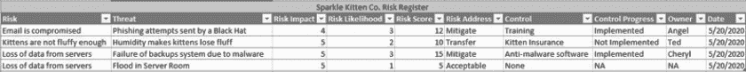

# 如何击败黑帽子黑客

到目前为止，你已经了解了什么是网络安全，为什么黑帽子黑客想要窃取你的数据，敌人如何以各种方式攻击你的系统，以及你可以采取什么措施来阻止特定类型的攻击。你应该对可能面临的威胁有一个清晰的认识，包括网络、社交媒体、电子邮件等方面。然而，正如你现在可能已经猜到的，优质的安全性不能仅仅依赖反应式的措施。如果你等到攻击发生后再试图阻止它，那时你已经输了。这就像玩一个*打地鼠*游戏：你可能打中了一个地鼠，但除非你修复所有的洞口，否则很快会有另一个地鼠冒出来。

要实现真正有效的安全性，你需要从基础做起。这意味着从一开始就制定一个详细的计划，说明你将如何创建、维护和更新你的安全措施。在这一章中，你将学习如何制定一个前瞻性的安全计划，将到目前为止学到的所有元素付诸实践。最终，你将创建一个定制的计划来保护房屋、学校、企业或任何其他实体。通过练习如何创建安全计划，你将能够将本书中学到的所有知识联系起来。在本章结束时，你将准备好开始制定一个安全策略，作为工作或家庭中任何项目的重要组成部分。

## 最坏的情况会是什么？

当你开始任何形式的安全计划时，甚至只是一般地考虑安全问题时，你应该始终从设想最坏的情况开始。事实上，安全人员常常被描述为悲观主义者，因为他们总是在考虑任何情况下可能出错的地方，通常考虑的程度可能让人觉得不必要。但正是这种思维方式能帮助你理解系统的威胁和它面临的风险。一旦你确定了问题所在，你就能开始解决它。首先，你需要了解风险和威胁之间的区别。

一开始，风险和威胁似乎有相同的含义，因为它们都可能对你的系统或组织造成巨大破坏。从理论上讲，它们都指示了你的组织可能遭遇攻击或损害的方式。但实际上，风险和威胁是不同的问题，你必须以不同的方式来应对它们。

### 风险

*风险*通常是因为你做了某些事情而产生的。你可以把风险看作是某个危险事件发生的可能性，这种事件可能是由个人或组织的行为引起的。例如，考虑早上起床。你可能扭伤脚踝摔倒在地。你也可能踩到乐高积木，伤到脚底。甚至有可能一只灰熊从你衣柜里跳出来，在你一醒来就攻击你。现在，你可能会想，灰熊怎么可能在我的衣柜里呢？你可能连生活的地方都不是灰熊栖息的区域。但这并不意味着它不可能发生。它只是意味着这种可能性很低。在网络安全中，任何行动都没有“零风险”这一说。

我们通过将事件发生的可能性与事件的影响相乘来计算风险。让我们回到起床的例子。你起床时踩到乐高积木的可能性有多大？如果你有小孩，可能性就会增加。如果他们拥有乐高玩具或有朋友拥有乐高玩具，可能性会更高。如果他们在你的卧室玩乐高积木，可能性会更大。但影响是什么呢？可能只是脚痛，是的，但很可能不过是短期的疼痛。如果你将可能性与影响结合起来，你可能会发现踩到乐高积木的风险是中等的。这种风险足以让你在睡觉前检查床周围的环境，但不足以禁止乐高出现在你家 200 码以内。

在计算风险时，使用数字有助于让你了解一些风险是如何与其他风险进行比较的。虽然有一些正式的方法可以衡量风险，比如通过风险实现时可能产生的金钱损失来计算，但你不必使用标准。例如，你可以选择一个 1 到 5 之间的数字来衡量可能性和影响。在灰熊藏在你衣柜里的例子中，你可能会给可能性评分为 1，因为这种可能性极低。然而，灰熊攻击的影响是严重的，所以你可能会给影响评分为 5。将这两个评分相乘，结果是 5 的风险。

尽管 5 分的评分看起来很高，但它还可以更高。让我们看看踩到乐高积木的风险。如果你家里有很多乐高积木，那么它离你床边的可能性大约是 3 分。但它的影响比与灰熊攻击的影响要小一些；假设它的影响也是 3 分（我是说，踩到乐高确实很疼）。因此，风险总分是 9。这几乎是灰熊攻击风险的两倍！

表 10-1 提供了这些计算的详细信息。

表 10-1：计算起床的风险

| **风险** | **可能性** | **影响** | **总风险** |
| --- | --- | --- | --- |
| **扭伤** **脚踝** | 3 | 4 | 12 |
| **踩到乐高** | 3 | 3 | 9 |
| **灰熊** **攻击** | 1 | 5 | 5 |

在你评估每个风险后，你必须决定如何处理该风险。当你发现一个风险时，应该立即处理它。特别注意一个法律术语叫做*尽职调查*，意思是做一个谨慎的人会做的事情。本质上，如果你知道某个事物是一个风险，就不要忽视它，否则如果风险发生，你可能会被追究法律责任。

也就是说，你可以通过几种方式来应对风险：

1.  避免风险 不做导致风险的行为。如果你不下床，你就不会踩到乐高积木。

1.  转移风险 将风险的所有权转移给另一个团体或实体。通常，这与保险有关。例如，如果你的房子有可能发生洪水，你可以通过购买洪水保险来转移这种风险。然后，如果风险发生，保险公司必须通过支付损失来处理它。

1.  减轻风险 做一些事情，减少风险的影响或可能性到可接受的水平。例如，如果你在睡觉前检查床周围是否有松动的乐高积木，或者制定规则禁止它们进入卧室，你就在减轻踩到乐高积木的风险。

1.  接受风险 接受一个不好的事件可能会发生。通常只有当风险的影响或可能性低到不值得花时间去减轻它时，才会这样做。例如，在我的卧室里遭遇熊袭击的可能性如此之低，根本没有必要采取预防措施。

让我们在网络安全的背景下考虑这些选项。例如，想象一下你的一名员工可能会点击钓鱼邮件中的链接。考虑到几乎每个企业都会以某种方式使用电子邮件，这显然是一个风险。正如你在第三章学到的，你也可以将这个风险视为具有高影响，特别是如果受害者下载了恶意软件或向攻击者提供了他们的凭证。

可能不太合理去*避免*这种风险，因为对于大多数企业来说，完全取消电子邮件并不是一个可行的选项。你可以通过购买网络安全保险来*转移*一些风险，但如果风险发生，这可能不足以覆盖整个影响。你也不能*接受*这个风险，因为一旦事件发生，其影响可能是如此严重，甚至可能导致企业停业。在这种情况下，最佳的选择是通过设置垃圾邮件过滤器和培训员工识别钓鱼尝试来*减轻*风险。

通常，管理风险并不像这样简单明了；许多因素会影响决定风险的可能性、影响以及应对策略。然而，哪怕只是像这里描述的那样简单地思考风险，也能帮助你更好地理解可能遇到的问题。

### 威胁

*威胁*是对系统、个人或组织的负面影响。换句话说，威胁是导致坏事件发生的动因。在起床的例子中，威胁是可能对你造成伤害的因素。在 LEGO 和熊袭击的情况下，威胁很明显。但在扭伤脚踝的情境中，识别威胁可能会很棘手，因为这取决于可能导致你扭伤脚踝的因素。如果是鞋子放错了地方，那鞋子就是威胁。如果只是你自己的笨拙，那么威胁就是你（或者至少是控制你动作的大脑部分）。

威胁有各种形式和大小。它们不一定是恶意的，甚至不一定是有意识的。例如，建筑物常常面临着可能着火并烧毁的威胁。但不论是人类还是其他，我们都称为带来威胁的因素为*威胁行为者*。威胁和威胁行为者之间的区别看起来可能很傻，但当你涉及到威胁管理时，这一点非常重要；管理威胁比管理威胁行为者要容易得多。

举个例子，假设你正在管理员工点击钓鱼链接的威胁。你可能认为威胁行为者是发送电子邮件的攻击者，但这只是部分正确。员工也是潜在的威胁行为者，因为他们是点击链接以激活它的人。由于你无法消除威胁行为者（没有员工的公司算什么呢？），你需要通过培训和垃圾邮件过滤器来减少威胁。

为了更好地应对威胁，将其分类会有所帮助。这样可以更清楚地了解如何将它们从环境中消除。表 10-2 展示了一个流行的网络安全威胁分类方案，即微软创建的 STRIDE 模型。这个助记符代表了六种类型的安全威胁：欺骗、篡改、拒绝、信息泄露、服务拒绝和权限提升。本质上，所有的网络安全攻击都可以归类为这几种威胁类别。事实上，你可能会在本书的前几章中认识到大多数这些威胁，作为各种攻击。

表 10-2：STRIDE 模型及其目标

| **威胁** | **目标** |
| --- | --- |
| **欺骗** | 认证 |
| **篡改** | 完整性 |
| **拒绝** | 不可否认 |
| **信息泄露** | 保密性 |
| **服务拒绝** | 可用性 |
| **权限提升** | 授权 |

通过将攻击分类，你可以大致了解它们的工作方式或至少了解它们的目标是什么。例如，如果我告诉你有一个新的攻击叫做“Sparkle Kitten Bite”，你可能不知道该如何应对。但如果我告诉你这是一种新的权限提升威胁，叫做“Sparkle Kitten Bite”，你至少会明白这个攻击试图访问它不应该访问的账户，很可能是为了在特权环境中执行命令。

## 控制措施

将威胁和威胁行为者分类还有助于你选择最佳的*控制措施*，这些控制措施试图预防或缓解威胁。到现在为止，你应该已经对不同类型的控制措施有了一个很好的了解，知道它们如何用于阻止各种攻击。例如，你知道通过使用冗余系统或在流量到达目标之前进行过滤（如第六章所述），可以防止 DoS 攻击。同样，你也知道应对暴力破解攻击的最佳方法是使密码复杂到即使是计算机也需要花费太长时间才能猜测出来（如第五章和第九章所述）。

与威胁类别一样，控制措施也有不同的分类，这可以帮助你选择最适合的控制措施。对于风险管理，我们通常按照控制措施如何试图保护目标免受威胁的方式来对其进行分类。五种控制类别是行政性、预防性、侦测性、补偿性和纠正性。表 10-3 列出了这些类别及其目的和每种类别的示例。

表 10-3：控制类别

| **类别** | **目的** | **示例** |
| --- | --- | --- |
| **行政性** | 提供关于如何进行活动的指导 | 安全意识培训，政策，程序 |
| **预防性** | 在不良活动发生之前尝试阻止它 | 防火墙 |
| **侦测性** | 在不良活动发生后或正在发生时尝试发现它 | IDS，日志记录 |
| **补偿性** | 为弥补其他控制措施的弱点，提供额外的安全保障 | 加密 |
| **纠正性** | 在发现控制措施或缺陷后进行修复 | 补丁管理，漏洞管理 |

让我们考虑如何在实际场景中部署这些控制措施。*预防性*控制是显而易见的。例如，防火墙通过阻止其规则设定的连接来防止不良活动。另一方面，*侦测性*控制通常在恶意活动发生后提供发现手段，例如当你查看登录日志时，可以确定是否有攻击者闯入了你的服务器。

*补偿*控制加强另一个控制措施，使其更加安全。加密就是一个很好的补偿控制示例：如果另一个控制措施失败——例如，用于保护数据库的身份验证控制——攻击者仍然无法读取数据。*修正*控制修复另一个控制中发现的缺陷。例如，在发现关键漏洞后修补系统就是一种修正控制。

*行政*控制为组织提供如何实施安全性的指导。一个好的行政控制示例是为新员工设置计算机的程序。如果你记录下涉及的步骤，你可以确保每次操作都按照相同的方式进行，并且正确的安全配置始终得以实施。行政控制通常规定了其他控制措施的设置和维护方式。

理解风险、威胁和控制措施有助于你处理自己或组织可能遇到的问题，尤其是那些对手造成的问题。但对这些方面的了解只是过程的一部分。你还必须确保你在尽职尽责，包括处理所有威胁和维护你的控制措施。在这方面，风险管理程序可以带来重大好处。

## 风险管理程序

管理风险可能很复杂，因为它要求同时处理多个网络安全方面的内容。你不仅要应对威胁，还要维护已经实施的控制措施。此外，作为一名网络安全专业人员，你还需要回答关于组织安全性的问题。你必须向技术水平不同的人解释为什么某些风险需要解决，以及你选择的控制措施将如何应对这些风险。这要求你始终全面了解组织的安全状况。这确实不是一项小任务。

一个好的风险管理程序可以救命。风险管理程序的目的是跟踪公司面临的风险、相关的威胁以及用于应对这些风险的控制措施。理想情况下，风险管理程序应足够灵活，以便在环境发生变化时能够持续更新。你应该能够根据新风险的出现或已解决的风险不再是问题的情况，随时添加或删除控制措施。该程序还应该提供一个模板，用于处理一次性项目的风险，例如重大设备升级或新建筑的开设。

为了管理所有这些活动，你需要使用一个叫做*风险* *登记册*的特殊工具，它是一个记录你当前正在追踪的所有风险的系统。可以将其视为一个任务组织工具，就像你在学校里使用过的那种。你可以用它来追踪风险、你如何应对这些风险，以及你用来应对的控制措施。该程序还可以高效地跟踪那些你尚未处理的风险，或那些尚未完全实施的控制措施。

风险登记册可以是一个复杂的软件，提供详细的状态信息，但你也可以使用简单的电子表格作为风险登记册。事实上，使用电子表格总比什么都不用要好。请记住，风险管理的重点是追踪你如何管理风险，这至少是为了满足通常由法律要求的尽职调查要求。图 10-1 展示了一个用来追踪风险的电子表格示例。让我们更详细地讨论每个部分。

图 10-1：Sparkle Kitten Inc. 的风险登记册

前两列追踪了组织的风险和威胁。记住，风险是基于我们所做的事情而发生的，而威胁则是发生在我们身上的事件。在这个例子中，由于 Sparkle Kitten Inc.使用电子邮件，因此它面临着电子邮件系统被破坏的风险。特别需要注意的是，威胁列中提到的钓鱼攻击威胁，它们是由黑客发起的。

风险登记册并不总是追踪风险*和*威胁，但这样做可以帮助区分风险实现的方式。例如，当你存储信息时，丢失数据是一个常见的风险。但请注意，在风险登记册中列出了两种不同的威胁，它们根据可能性和影响会有不同的结果。

风险评分可以帮助我们确定哪些风险需要立即处理，哪些可以暂时搁置。这份风险登记册显示，由于恶意软件导致服务器数据丢失的风险评分最高。因此，我们应该首先处理这个风险，因为如果这个风险发生，它可能是最具破坏性的。接下来的两列详细说明了我们如何应对该风险，以及我们使用了哪种控制措施来应对它。在服务器数据丢失的情况下，我们通过使用反恶意软件来缓解这一风险，期望该软件能检测并阻止恶意软件破坏我们的备份。

接下来的三列列出了我们选择的控制措施的状态，用以应对这个风险。例如，你可以看到反恶意软件软件已于 2020 年 5 月 20 日实施。*控制负责人* Cheryl 负责维护和检查该控制措施，确保它仍然满足我们的需求。这些列还表明我们需要做的事情。注意，尽管我们决定通过购买小猫保险来转移小猫失去毛茸茸的风险，但我们尚未实施这一控制措施。由 Ted 负责为组织购买小猫保险。一旦他完成购买，他会更新登记册并加入新的日期，反映保险何时生效。

尽管这个电子表格可能很简单，但它可以帮助你组织公司面临的风险和威胁，使它们更容易处理。通过一目了然的方式，你可以看到已识别的风险、风险的影响以及控制过程的状态。你还可以找出需要与谁沟通以获取控制状态的最新信息。最棒的是，你不需要详细的技术知识就能理解你的组织是否安全。

## 汇总所有内容

让我们将你在本书中学到的所有内容结合成一个实际示例。假设你在一家有 500 名员工的中型公司担任安全分析师。你日常工作的一部分是检查员工或防火墙和入侵检测系统发出的任何警报。

有一天早晨，你收到一封焦虑的员工邮件，说他们收到了一个奇怪的邮件并点击了其中的链接。现在他们担心可能会对他们的电脑造成一些问题。你使用一些快速的钓鱼分析工具，比如在第三章练习过的 VirusTotal 和 MX Toolbox，检查了这封邮件。邮件声称是来自微软的密码重置通知，但发件人邮箱地址是*M1cos0ft.com*。查看链接后，你意识到这可能是恶意的。员工表示，当他们点击链接时，系统要求他们下载一个密码更新工具，并在电脑上运行。你意识到这很可能是恶意软件，于是开始对系统进行病毒扫描。

在扫描系统时，你检查了防火墙和 IDS 警报，查看是否有任何可疑的内容。果然，你注意到有警报显示来自员工计算机的新、可能是恶意的流量。你不确定该如何处理这些信息，因此你将警报上报给团队中的一位高级安全顾问。他们查看了警报并意识到，这很可能意味着员工下载了一个特洛伊木马，正在尝试通过网络传播勒索病毒。高级安全顾问迅速更新了 IDS 和防火墙，阻止员工计算机与网络上其他计算机进行连接。与此同时，你的扫描检测到一个知名的恶意软件工具包。你成功地将其隔离并删除了感染，但为了确保万无一失，你将员工的计算机完全重置了。

事件发生后，你和你的安全同事进行了一次事后分析，讨论发生了什么，并探讨如何在未来避免类似情况。CISO 主持了这次会议。从讨论中，每个人都意识到组织存在一个薄弱环节：培训员工识别钓鱼邮件，而钓鱼邮件是一个重大威胁，勒索病毒攻击就证明了这一点。CISO 将这一点加入公司的风险登记表，并讨论如何最佳实施员工培训控制。大家一致认为，专门的钓鱼培训平台是实施这一控制的最佳方式。

首席信息安全官（CISO）将新的风险带到季度风险管理会议，并讨论为组织购买钓鱼培训平台的想法。人力资源负责人同意 CISO 的想法，因为目前人力资源使用的培训平台没有包括钓鱼相关信息。首席财务官（CFO）也同意，因为该平台的成本较低，但带来的效益巨大。最终决定由 CISO 调查不同的选项，并在一个月内向委员会报告推荐方案。CISO 更新了风险登记表，并指派了一个安全团队成员来协助完成这项任务。

虽然这是一个虚构的场景，但它代表了安全在组织中应如何运作。在这个场景中，仅仅处理员工关于钓鱼邮件的来电是不够的。安全分析师必须交叉参考不同的信息来源，并请求其他团队成员的建议，以了解整个情况。此外，工作并没有在事件结束后停止。后续工作同样重要，它帮助组织识别出安全上的漏洞并修复它们。通过安全团队的专业知识，CISO 成功展示了为什么与高层领导合作购买特定培训平台是重要的。这也是风险管理计划至关重要的原因：它帮助将安全的各个方面联系起来。它以简单、易于管理的格式展示了安全的需求和解决方案。

## 练习：进行风险分析

对于这个最终的练习，选择一个目标并进行风险分析。风险分析定义了针对目标的所有风险，并检查每个风险的风险管理过程。你的目标可以是你的家、学校、工作场所或任何你对网络安全威胁或风险有较为清晰认识的地方。一旦你选择了目标，完成以下步骤：

1.  确定你希望纳入分析的所有资产。例如，在你的家中，你可能会列出任何计算机、网络设备如路由器以及智能设备如游戏主机或电视。将这些设备列在电子表格或纸张上。

1.  记录你认为这些资产可能遭受攻击或以其他方式受到损害的所有方式。在执行此操作时，记得进行合理性检查，考虑攻击的可能性。是的，在电影中，一个邪恶的 AI 可能会接管你的游戏主机并试图杀死你，但在现实生活中，这显然不是需要担心的事情。

1.  查看所有可能攻击你的资产的方式，并使用 STRIDE 模型进行分组。识别这些攻击的共同点。这些就是针对你目标的威胁。例如，你的电视和游戏主机可能容易受到 DoS 攻击。

1.  确定你的小组中哪个类别的实例最多。实例的数量越高，发生的可能性越大。另外，简要记录下潜在的影响。例如，如果你的游戏主机遭遇了 DoS 攻击，你就无法和朋友一起玩刚发布的电子游戏，这将是一个极其令人失望的体验，因此它的影响较大。

1.  将威胁放入风险登记册中，比如本章前面展示的那种形式。包括风险内容、威胁及其风险评分。

1.  查看你已经采取了哪些控制措施来应对这些攻击。例如，在面对针对游戏主机的 DoS 攻击时，你可能会研究处理这种攻击所需的带宽，主机的安全性，或者你的 ISP 是否有相关保护措施。

1.  完善风险登记册，记录你如何应对风险，以及你正在使用哪些控制措施来应对这些风险。

现在你已经有了一个完整的风险登记册，这能让你对目标面临的威胁以及你能采取的应对措施（如果还没有采取的话）有一个清晰的了解。虽然有时候减轻已识别的威胁可能并不实际（比如单独阻止 DoS 攻击是非常困难的），但风险登记册为你提供了一种练习风险管理情境的方法。

## 告别并祝好运

现在你已经准备好开始踏入网络安全的世界。无论你打算加入网络安全专业人士的行列，还是只是想将这项新知识应用到日常生活中，你已经打下了一个坚实的基础，可以用来探索你感兴趣的安全话题。

以下是你网络安全之旅的一些最终建议：

+   点击前三思。即使是最优秀的专业人士，在匆忙中也会被欺骗。网络安全是慢工出细活。

+   抽出时间采取正确的步骤。网络安全的工作有时可能看起来是应该昨天就处理的任务；不过，还是要停下来，深呼吸一下，选择最好的下一步。

+   如果情况让你感觉不对劲，千万不要仅凭他人之言。如果你不确定某个配置是否正确完成，不要假设其他人已经处理好。

+   永远寻求帮助。网络安全不是一个孤立的领域，也不仅限于你的团队。

+   保持阅读和学习。网络安全需要不断的维护，才能始终领先于黑帽黑客。

+   玩得开心！网络安全是严肃的，但这并不意味着它必须是*严肃的*。
