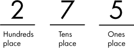
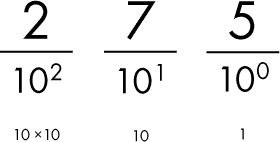
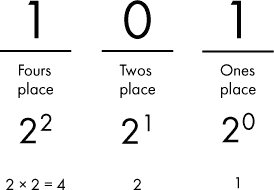
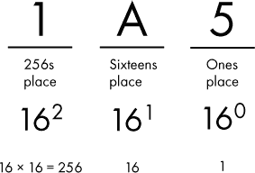
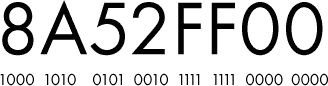

## 第一章：计算机概念**

计算机如今无处不在：在我们的家里、学校、办公室——你可能在口袋里、手腕上，甚至在冰箱里找到计算机。如今，找到并使用计算机比以往任何时候都容易，但很少有人真正理解计算机是如何工作的。这并不令人惊讶，因为学习计算机的复杂性可能会让人不知所措。本书的目标是以一种任何有好奇心并具备一些技术倾向的人都能理解的方式，阐明计算机的基本原理。在我们深入了解计算机如何工作之前，让我们花点时间了解一些计算机的主要概念。

在本章中，我们将从讨论计算机的定义开始。从这个定义出发，我们将介绍模拟数据和数字数据之间的差异，然后探讨数字数据的数制和术语。

### 定义计算机

让我们从一个基本问题开始：什么是计算机？当人们听到*计算机*这个词时，大多数人会想到笔记本电脑或台式电脑，有时被称为个人计算机或 PC。这是本书讨论的其中一种设备类型，但让我们再扩大一些思考。考虑一下智能手机。智能手机当然是计算机；它们执行与 PC 相同类型的操作。事实上，对于今天的许多人来说，智能手机是他们的主要计算设备。如今，大多数计算机用户还依赖互联网，而互联网是由服务器提供支持的——另一种计算机类型。每次你访问网站或使用连接到互联网的应用程序时，你都在与一个或多个连接到全球网络的服务器互动。视频游戏机、健身追踪器、智能手表、智能电视……这些都是计算机！

一个*计算机*是任何能够被编程以执行一组逻辑指令的电子设备。根据这个定义，很明显许多现代设备实际上都是计算机！

**练习 1-1：找出你家里的计算机**

花一点时间，看看你能在家里找出多少台计算机。当我和家人一起做这个练习时，我们很快找到了大约 30 个设备！

### 模拟与数字

你可能听说过计算机被描述为数字设备。这与模拟设备，如机械钟表，是相对的。那么这两个术语到底是什么意思呢？理解模拟和数字之间的差异是理解计算机的基础，因此让我们仔细看看这两个概念。

#### *模拟方法*

环顾四周，挑选一个物体。问问自己：它是什么颜色的？它有多大？它重多少？通过回答这些问题，你正在描述该物体的属性，或者说是*数据*。现在，挑选另一个物体并回答相同的问题。如果你对更多的物体重复这个过程，你会发现，对于每个问题，潜在的答案是非常多的。你可能挑选一个红色物体，一个黄色物体，或者一个蓝色物体，或者物体可能是几种基本颜色的混合。这种变化不仅仅适用于颜色。对于给定的属性，我们世界上物体间的变化是潜在无限的。

用语言描述一个物体是一回事，但假设你想要更精确地测量它的某个属性。例如，如果你想测量物体的重量，你可以将它放在一个秤上。秤根据放置在其上的重量，移动指针沿着标有数字的线，直到指针停在与重量相对应的位置。从秤上读出数字，你就得到了物体的重量。

这种测量方法很常见，但让我们稍微思考一下我们是如何测量这些数据的。刻度盘上指针的位置实际上不是重量，它是重量的一个表示。指针指向的数字线为我们提供了一种便捷的方式，将指针的位置（表示重量）与该重量的数值相互转换。换句话说，尽管重量是物体的属性，但在这里我们可以通过其他方式来理解这个属性：即指针在数字线上的位置。指针的位置会随着物体放置在秤上的重量成比例地变化。因此，秤起到了*类比*的作用，我们通过指针在刻度线上的位置来理解物体的重量。这就是为什么我们称这种测量方法为*模拟*方法。

另一个类比测量工具的例子是水银温度计。水银的体积随着温度的变化而增加。温度计制造商利用这一特性，将水银放入一个玻璃管中，管上有与不同温度下水银体积相对应的刻度标记。因此，水银在管中的位置就作为温度的一个表示。注意，在这两个例子中（秤和温度计），当我们进行测量时，我们可以利用仪器上的刻度将位置转换为一个具体的数值。但从仪器上读取的数值只是一个近似值。指针或水银的真实位置可能处于仪器范围内的任何位置，我们将其四舍五入到最接近的标记值。因此，尽管这些工具似乎只能产生有限的测量结果，但这是由转换为数字所施加的限制，而不是由类比本身的限制。

在人类历史的大部分时间里，人类一直通过模拟方法来测量事物。但人类不仅仅用模拟方法来测量，他们还设计出了巧妙的方法来以模拟方式存储数据。唱片利用调制的槽纹作为录制音频的模拟表示。槽纹的形状沿着路径变化，呈现出音频波形随时间变化的情况。槽纹本身不是音频，但它是原始声音波形的类比。基于胶片的相机做了类似的事情，通过短暂地将胶片暴露在相机镜头的光线下，导致胶片发生化学变化。胶片的化学性质不是图像本身，而是捕捉到的图像的表示，是图像的类比。

#### *走向数字化*

这一切与计算有什么关系？事实证明，那些数据的模拟表示方式对于计算机来说难以处理。所使用的模拟系统类型差异巨大且变化多端，几乎不可能创建一个通用的计算设备来理解所有这些系统。例如，制作一个能够测量水银体积的机器和制作一个能够读取黑胶唱片槽纹的机器是完全不同的任务。此外，计算机需要高度可靠和准确的数据表示，像数字数据集和软件程序等类型的数据。数据的模拟表示可能难以精确测量，随着时间的推移会衰减，且在复制时会失去保真度。计算机需要一种方法，以一种可以准确处理、存储和复制的格式来表示所有类型的数据。

如果我们不想将数据表示为具有潜在无限变化的模拟值，我们该怎么办？我们可以改用数字化方法。*数字*系统将数据表示为一系列符号，其中每个符号是有限集合中的一个值。现在，这个描述可能听起来有点正式，也有些让人困惑，所以与其深入探讨数字系统的理论，我将解释它在实际中的含义。在今天几乎所有的计算机中，数据是通过两个符号的组合来表示的：0 和 1。仅此而已。虽然数字系统可以使用超过两个符号，但添加更多符号会增加系统的复杂性和成本。仅使用两个符号的集合可以简化硬件设计，并提高可靠性。在大多数现代计算设备中，所有数据都表示为 0 和 1 的序列。从此书开始，当我谈论数字计算机时，您可以假设我指的是只处理 0 和 1 的系统，而不是其他符号集合。简单明了！

需要强调的一点是：你计算机上的一切都以 0 和 1 存储。你在智能手机上拍的最后一张照片？你的设备将这张照片存储为一串 0 和 1。你从互联网流媒体播放的歌曲？0 和 1。你在计算机上写的文档？0 和 1。你安装的应用程序？一堆 0 和 1。你访问的网站？0 和 1。

说我们只能使用 0 和 1 来表示自然界中的无限值，可能听起来有些限制。如何将一段音乐录音或一张详细的照片浓缩成 0 和 1 呢？许多人觉得这样有限的“词汇”能够表达复杂的思想是直觉上难以理解的。关键在于，数字系统使用的是一串 0 和 1。举个例子，一张数字照片通常由数百万个 0 和 1 组成。

那么，这些 0 和 1 究竟是什么呢？你可能会看到其他术语用来描述这些 0 和 1：假和真，关和开，低和高等等。这是因为计算机并不直接存储数字*0*或*1*。它存储的是一串条目，其中每个条目只有两种可能的状态。每个条目就像一个开关，要么是开，要么是关。实际上，这些 1 和 0 的序列以各种方式存储。在 CD 或 DVD 上，0 和 1 通过凸起（0）或平坦的空间（1）存储在光盘上。在闪存驱动器中，1 和 0 以电荷的形式存储。在硬盘驱动器中，0 和 1 通过磁化存储。正如你将在第四章中看到的，数字电路通过电压水平来表示 0 和 1。

在继续之前，最后一个关于术语*模拟*的说明——它通常用来表示“非数字化”。例如，工程师可能会说“模拟信号”，意思是信号是连续变化的，并不与数字值对齐。换句话说，它是一个非数字信号，但不一定表示其他事物的类比。因此，当你看到*模拟*这个术语时，考虑到它可能并不总是意味着你想的那样。

### 数值系统

到目前为止，我们已经确定计算机是处理 0 和 1 的数字机器。对于许多人来说，这个概念似乎很奇怪；他们习惯了在表示数字时使用 0 到 9。如果我们只限于使用两个符号，而不是十个，我们应该如何表示大数字呢？为了回答这个问题，让我们回顾一下小学数学中的一个基本话题：数值系统。

#### *十进制数*

我们通常使用一种叫做*十进制位置值表示法*的方式来写数字。让我们来解析一下。*位置值表示法*（或*位置表示法*）意味着写下的每个数字位置代表不同的数量级；*十进制*，或者说*基数 10*，意味着数量级是 10 的倍数，每个位置可以有十个不同的符号，0 到 9。请参见图 1-1 中的位置值表示法示例。

*图 1-1：二百七十五在十进制位置值表示法中的表示*

在图 1-1 中，数字二百七十五在十进制表示法中写作 275。5 位于个位，因此它的值是 5 × 1 = 5。7 位于十位，因此它的值是 7 × 10 = 70。2 位于百位，因此它的值是 2 × 100 = 200。总值是所有位置值的和：5 + 70 + 200 = 275。

很简单，对吧？你可能从一年级起就已经理解了这个概念。但让我们更仔细地分析一下。为什么最右边的位置是个位？为什么下一个位置是十位，依此类推？这是因为我们使用的是十进制，或者说是基数 10，因此每个位置代表的是 10 的幂，换句话说，10 是自乘若干次的结果。如图 1-2 所示，最右边的位置是 10 的 0 次方，等于 1，因为任何数的 0 次方都等于 1。下一个位置是 10 的 1 次方，等于 10，接下来的位置是 10 的 2 次方（10 × 10），等于 100。

*图 1-2：在十进制位置值表示法中，每个位置是 10 的幂。*

如果我们需要表示一个比 999 更大的数字，我们会在左侧加一个位置，即千位，其权重等于 10 的 3 次方（10 × 10 × 10），也就是 1,000。这个模式继续延续，因此我们可以通过添加更多的位置来表示任何大数字。

我们已经解释了为什么不同的位置有不同的权重，但让我们继续深入。为什么每个位置使用符号 0 到 9？在十进制中，我们只能使用十个符号，因为根据定义，每个位置只能表示十个不同的值。当前使用的是 0 到 9 这些符号，但实际上任何一组十个独特的符号都可以使用，每个符号对应某个数字值。

大多数人偏好使用十进制（基数 10）作为数字系统。有些人说这是因为我们有十个手指和十个脚趾，但无论原因如何，在现代世界，大多数人都是用十进制来读、写和思考数字。当然，这只是我们共同选择的代表数字的约定。如前所述，这一约定并不适用于计算机，计算机只使用两个符号。让我们看看如何在只使用两个符号的情况下应用位置值系统的原理。

#### *二进制数字*

由两个符号组成的数字系统是*二进制*。二进制仍然是一个位置值系统，因此其基本原理与十进制相同，但有一些变化。首先，每个位置代表的是 2 的幂，而不是 10 的幂。其次，每个位置只能有两个符号中的一个，而不是十个符号。这两个符号是 0 和 1。图 1-3 展示了我们如何使用二进制表示一个数字。

*图 1-3：五的十进制在二进制位值表示法中的表现*

在图 1-3 中，我们有一个二进制数：101。看起来像一百零一，但在二进制中，这实际上表示的是五！如果你想口头表达，“一零一二进制”是个很好的表达方式。

就像在十进制中一样，每一位都有一个与基数的幂次相关的权重。由于我们使用的是二进制，因此最右边的位是 2 的 0 次方，即 1。接下来的位是 2 的 1 次方，即 2，再接下来的位是 2 的 2 次方（2 × 2），即 4。同样地，就像在十进制中那样，要获得总值，我们将每一位的符号与该位的权重相乘，并将结果相加。所以，从右开始，我们有(1 × 1) + (0 × 2) + (1 × 4) = 5。

现在你可以尝试自己从二进制转换成十进制了。

**练习 1-2：二进制转十进制**

将这些以二进制表示的数字转换成它们的十进制等价物。

10（二进制） = ______ （十进制）

111（二进制） = ______ （十进制）

1010（二进制） = ______ （十进制）

你可以在附录 A 中检查你的答案。你做对了吗？最后一个可能有点棘手，因为它引入了另一个位置，即八位位置。现在，尝试反向操作，从十进制转换成二进制。

**练习 1-3：十进制转二进制**

将这些以十进制表示的数字转换成它们的二进制等价物。

3（十进制） = ______ （二进制）

8（十进制） = ______ （二进制）

14（十进制） = ______ （二进制）

希望你也做对了！立刻你就会发现，同时处理十进制和二进制可能会让人感到混淆，因为像 10 这样的数字，在十进制中表示十，而在二进制中表示二。从现在开始，在本书中，如果有可能造成混淆，二进制数字将会带有 0b 前缀。我之所以选择 0b 前缀，是因为许多编程语言都使用这种方式。前导的 0（零）字符表示数字值，而 b 是 binary（二进制）的缩写。举个例子，0b10 表示二进制的二，而 10 没有前缀则表示十进制的十。

### 比特与字节

十进制数字中的每一位或符号叫做*数字*。例如，数字 1,247 是一个四位数。类似地，二进制数字中的每一位或符号叫做*比特*（二进制数字）。每个比特的值可以是 0 或 1。像 0b110 这样的二进制数是一个三比特数。

单个比特不能传递太多信息；它要么是关（0），要么是开（1）。我们需要一系列比特来表示更复杂的信息。为了更方便地管理这些比特序列，计算机将比特按八个一组进行分组，这些组叫做*字节*。以下是一些比特和字节的例子（省略了 0b 前缀，因为它们都是二进制）：

**1**   这就是一个比特。

**0**   这也是一个比特。

**11001110**  这是一个字节，或 8 个比特。

**00111000**  这也是一个字节！

**10100101**  另一个字节。

**0011100010100101**  这是两个字节，或者说 16 位。

**注意**

*有趣的事实：4 位二进制数，即半个字节，有时被称为* nibble *（有时拼写为* nybble *或* nyble）。

那么，我们能在一个字节中存储多少数据呢？换句话说，我们可以用 8 位二进制表示多少种不同的 0 和 1 的组合？在回答这个问题之前，我先用 4 位二进制来说明，因为这样更容易理解。

在表格 1-1 中，我列出了 4 位二进制数的所有可能组合，并包括了该数的对应十进制表示。

**表格 1-1：** 所有可能的 4 位二进制数值

| **二进制** | **十进制** |
| --- | --- |
| 0000 | 0 |
| 0001 | 1 |
| 0010 | 2 |
| 0011 | 3 |
| 0100 | 4 |
| 0101 | 5 |
| 0110 | 6 |
| 0111 | 7 |
| 1000 | 8 |
| 1001 | 9 |
| 1010 | 10 |
| 1011 | 11 |
| 1100 | 12 |
| 1101 | 13 |
| 1110 | 14 |
| 1111 | 15 |

如表格 1-1 所示，我们可以在 4 位二进制数中表示 16 种不同的 0 和 1 的组合，十进制值从 0 到 15 不等。看到这些位组合的列表有助于理解这一点，但我们也可以通过其他几种方法来推导出这个结论，而不必列举每一种可能的组合。

我们可以通过将所有位设置为 1 来确定 4 位可以表示的最大数字，这样得到 0b1111。它的十进制值为 15；如果我们加 1 来表示 0，那么总共有 16 种组合。另一种简便的方法是将 2 的位数次方，4 在这里，就是 2⁴ = 2 × 2 × 2 × 2 = 16 种 0 和 1 的组合。

看 4 位二进制数是一个很好的开始，但我们之前谈的是字节，字节包含 8 位。使用前面的方式，我们可以列出所有 0 和 1 的组合，但我们跳过这一过程，直接进入一个简便的方法。将 2 的 8 次方计算出来，得到 256，这就是一个字节中 0 和 1 的唯一组合数。

现在我们知道，4 位二进制数可以表示 16 种 0 和 1 的组合，而一个字节则可以表示 256 种组合。这与计算机有什么关系呢？假设一个电脑游戏有 12 个关卡；游戏只需要 4 个位来存储当前的关卡编号就可以了。另一方面，如果游戏有 99 个关卡，4 位就不够用了……只能表示 16 个关卡！而一个字节则能够满足 99 个关卡的需求。计算机工程师有时需要考虑存储数据时需要多少位或字节。

### 前缀

表示复杂的数据类型需要大量的位。像数字 99 这样的简单东西不会超过一个字节；而数字格式的视频，另一方面，可能需要数十亿个位。为了更容易地传达数据的大小，我们使用类似吉和兆的前缀。*国际单位制（SI）*，也叫*公制系统*，定义了一组标准前缀。这些前缀用于描述任何可以量化的事物，不仅仅是位。我们将在接下来的章节中再次看到它们，特别是涉及电路时。表 1-2 列出了常见的 SI 前缀及其含义。

**表 1-2:** 常见的 SI 前缀

| **前缀名称** | **前缀符号** | **值** | **十进制** | **英文单词** |
| --- | --- | --- | --- | --- |
| 太 | T | 1,000,000,000,000 | 10¹² | 万亿 |
| 吉 | G | 1,000,000,000 | 10⁹ | 十亿 |
| 兆 | M | 1,000,000 | 10⁶ | 百万 |
| 千 | k | 1,000 | 10³ | 千 |
| 分 | c | 0.01 | 10^(-2) | 百分之一 |
| 毫 | m | 0.001 | 10^(-3) | 千分之一 |
| 微 | μ | 0.000001 | 10^(-6) | 百万分之一 |
| 纳 | n | 0.000000001 | 10^(-9) | 十亿分之一 |
| 皮 | p | 0.000000000001 | 10^(-12) | 万亿分之一 |

使用这些前缀时，如果我们想说“30 亿字节”，可以使用简写 3GB。或者，如果我们想表示 4 千位，可以说 4kb。注意字节（B）使用大写，位（b）使用小写。

你会发现，这种约定通常用来表示位和字节的数量。不幸的是，它也常常在技术上是错误的。原因如下：在处理字节时，大多数软件实际上是按二进制而不是十进制工作。如果你的计算机告诉你某个文件的大小是 1MB，实际上它是 1,048,576 字节！这大约是百万，但并不完全是百万。看起来这个数字很奇怪，不是吗？那是因为我们在用十进制看它。在二进制中，这个数字表示为 0b100000000000000000000。它是 2 的幂，具体来说是 2²⁰。表 1-3 显示了处理字节时如何解释 SI 前缀。

**表 1-3:** 当应用于字节时，SI 前缀的含义

| **前缀名称** | **前缀符号** | **值** | **二进制** |
| --- | --- | --- | --- |
| 太 | T | 1,099,511,627,776 | 2⁴⁰ |
| 吉 | G | 1,073,741,824 | 2³⁰ |
| 兆 | M | 1,048,576 | 2²⁰ |
| 千 | k | 1,024 | 2¹⁰ |

关于位和字节的另一个混淆点是与网络传输速率相关。互联网服务提供商通常以每秒位数（十进制）做广告。因此，如果你的互联网连接速度是 50 兆*位*每秒，这意味着你只能传输大约 6 兆*字节*每秒。也就是说，50,000,000 位每秒除以每字节 8 位，得到每秒 6,250,000 字节。将 6,250,000 除以 2²⁰，我们得到大约 6 兆字节每秒。

**二进制数据的 SI 前缀**

为了消除由前缀多重含义引起的混淆，2002 年（在 IEEE 1541 标准中）引入了一组新的前缀，用于二进制场景。在处理 2 的幂次时，应使用 kibi- 代替 kilo-，mebi- 代替 mega-，以此类推。这些新的前缀对应基数 2 的值，旨在用于以前旧前缀被错误使用的场景。例如，由于千字节可能被解释为 1,000 或 1,024 字节，标准建议使用 kibibyte 来表示 1,024 字节，而 kilo- 保留其原意，使得千字节等于 1,000 字节。

这看起来是个不错的主意，但在写这篇文章时，这些符号尚未被广泛采用。表 1-4 列出了新的前缀及其含义。

**表 1-4：** IEEE 1541-2002 二进制数据的前缀

| **前缀名称** | **前缀符号** | **值** | **基数 2** |
| --- | --- | --- | --- |
| tebi | Ti | 1,099,511,627,776 | 2⁴⁰ |
| gibi | Gi | 1,073,741,824 | 2³⁰ |
| mebi | Mi | 1,048,576 | 2²⁰ |
| kibi | Ki | 1,024 | 2¹⁰ |

这个区别很重要，因为在实际操作中，大多数显示文件大小的软件使用的是旧的 SI 前缀，但计算文件大小时却采用基数 2。换句话说，如果你的设备显示一个文件的大小是 1KB，那就意味着 1,024 字节。另一方面，存储设备的制造商倾向于使用基数 10 来宣传其设备的容量。这意味着一个标称为 1TB 的硬盘可能存储 1 万亿字节，但如果你将该设备连接到计算机，计算机将显示大约 931GB（1 万亿除以 2³⁰）。鉴于新的前缀尚未被广泛采用，在本书中，我将继续使用旧的 SI 前缀。

### 十六进制

在我们离开二进制思维的话题之前，我还要介绍一个数字系统：十六进制。快速回顾一下，我们的“正常”数字系统是十进制，或基数 10。计算机使用二进制，或基数 2。*十六进制*是*基数 16*！根据你在本章已经学到的内容，你大概知道这意味着什么。十六进制，简称*hex*，是一种位置值系统，每个位置表示 16 的幂次，每个位置可以是 16 个符号之一。

在所有位值系统中，最右边的位仍然是个位。接下来的位是十六位，然后是 256 位（16 × 16），然后是 4,096 位（16 × 16 × 16），依此类推。很简单。那么每个位可以是 16 个符号中的一个的另一个要求怎么办呢？我们通常有十个符号来表示数字，0 到 9。我们需要添加六个符号来表示其他值。我们可以选择一些随机符号，如& @ #，但这些符号没有明显的顺序。相反，标准做法是使用 A、B、C、D、E 和 F（大小写都可以！）。在这个方案中，A 表示十，B 表示十一，依此类推，到 F 表示十五。这是有道理的；我们需要表示从零到比基数少一的符号。所以我们的额外符号是 A 到 F。通常在需要明确区分时，使用前缀 0x 来表示十六进制。表 1-5 列出了 16 个十六进制符号及其对应的十进制和二进制值。

**表 1-5：** 十六进制符号

| **十六进制** | **十进制** | **二进制（4 位）** |
| --- | --- | --- |
| 0 | 0 | 0000 |
| 1 | 1 | 0001 |
| 2 | 2 | 0010 |
| 3 | 3 | 0011 |
| 4 | 4 | 0100 |
| 5 | 5 | 0101 |
| 6 | 6 | 0110 |
| 7 | 7 | 0111 |
| 8 | 8 | 1000 |
| 9 | 9 | 1001 |
| A | 10 | 1010 |
| B | 11 | 1011 |
| C | 12 | 1100 |
| D | 13 | 1101 |
| E | 14 | 1110 |
| F | 15 | 1111 |

当你需要数到超过十进制的 15 或 0xF 时会发生什么？就像在十进制中一样，我们加上了另一个位。0xF 之后是 0x10，即十进制的 16。然后是 0x11、0x12、0x13，依此类推。现在看看图 1-4，我们看到一个更大的十六进制数，0x1A5。

*图 1-4：十六进制数 0x1A5 按位值拆解*

在图 1-4 中，我们有一个十六进制的数字 0x1A5。这个数字在十进制中的值是多少？最右边的位是 5。接下来的位的权重是 16，那里是 A，它在十进制中是 10，所以中间位的值是 16 × 10 = 160。最左边的位的权重是 256，那里是 1，所以这一位的值是 256。总值是 5 + 160 + 256 = 421，换算成十进制就是 421。

为了进一步强调这一点，这个例子展示了像 A 这样的新符号，根据它们出现的位置，值会有所不同。0xA 是十进制的 10，但 0xA0 是十进制的 160，因为 A 出现在十六位的位置。

到这一点，你可能会在心里想：“很好，但这有什么用呢？”很高兴你问了这个问题。计算机并不使用十六进制，大多数人也不使用。然而，十六进制对于需要处理二进制的人来说非常有用。

使用十六进制有助于克服处理二进制时的两个常见困难。首先，大多数人不擅长阅读长串的 0 和 1。过一段时间后，比特位就会混在一起。处理 16 个或更多比特对人类来说既繁琐又容易出错。第二个问题是，虽然人们擅长使用十进制，但在十进制和二进制之间转换并不容易。大多数人很难看着一个十进制数字，迅速判断出如果这个数字用二进制表示，哪些比特位是 1，哪些是 0。但使用十六进制，二进制到十六进制的转换就变得更加直接。表 1-6 提供了一些 16 位二进制数字的例子，以及它们对应的十六进制和十进制表示。请注意，我已在二进制值中加入空格，以提高清晰度。

**表 1-6：16 位二进制数字的十进制和十六进制示例**

|  | **示例 1** | **示例 2** |
| --- | --- | --- |
| **二进制** | 1111 0000 0000 1111 | 1000 1000 1000 0001 |
| **十六进制** | F00F | 8881 |
| **十进制** | 61,455 | 34,945 |

看看表 1-6 中的示例 1。在二进制中，序列非常清晰：前四个比特是 1，接下来的八个比特是 0，最后四个比特是 1。在十进制中，这个序列就变得模糊了。从 61,455 看不出哪些比特可能是 0 或 1。而十六进制则很好地反映了二进制中的序列。第一个十六进制符号是 F（在二进制中是 1111），接下来的两个十六进制符号是 0，最后一个十六进制符号是 F。

继续看示例 2，前三组四个比特都是 1000，最后一组四个比特是 0001。在二进制中很容易看出这一点，但在十进制中就比较难以看清。十六进制提供了一个更清晰的表示，其中十六进制符号 8 对应于二进制的 1000，而十六进制符号 1 则对应于 1！

我希望你能看到一个规律：二进制中的每四个比特对应十六进制中的一个符号。如果你记得的话，四个比特是半个字节（或者说是半个 Nibble）。因此，一个字节可以用两个十六进制符号来表示。一个 16 位的数字可以用四个十六进制符号表示，一个 32 位的数字可以用八个十六进制符号表示，依此类推。我们来看图 1-5 中的 32 位数字作为例子。

*图 1-5：每个十六进制字符映射到 4 个比特*

在图 1-5 中，我们可以每次处理半个字节来理解这个相对较长的数字，而用十进制表示同一个数字（2,320,695,040）时是无法做到的。

因为在二进制和十六进制之间转换相对容易，许多工程师通常会同时使用这两种表示方式，只有在必要时才转换为十进制数字。本书稍后会在适当的地方使用十六进制。

尝试从二进制转换到十六进制，而不通过先转换为十进制的中间步骤。

**练习 1-4：二进制转十六进制**

将这些以二进制表示的数字转换为其十六进制等价物。如果可以避免，请不要转换为十进制！目标是直接从二进制转换为十六进制。

10 (二进制) = ______ (十六进制)

11110000 (二进制) = ______ (十六进制)

你可以在附录 A 中查看你的答案。

一旦你掌握了从二进制到十六进制的转换，试着反过来做，从十六进制转换到二进制。

**练习 1-5：十六进制转二进制**

将这些以十六进制表示的数字转换为其二进制等价物。如果可以避免，请不要转换为十进制！目标是直接从十六进制转换为二进制。

1A (十六进制) = _____ (二进制)

C3A0 (十六进制) = ______ (二进制)

你可以在附录 A 中查看你的答案。

### 总结

在本章中，我们介绍了一些计算机基础概念。你学到了计算机是任何可以被编程以执行一系列逻辑指令的电子设备。接着你了解到现代计算机是数字设备，而不是模拟设备，并学会了它们之间的区别：模拟系统使用广泛变化的值来表示数据，而数字系统则将数据表示为符号的序列。之后，我们探讨了现代数字计算机如何仅依赖于两个符号，0 和 1，并了解了由这两个符号组成的数字系统，即二进制。我们介绍了位（bit）、字节（byte）以及你可以用来更轻松描述数据大小的标准国际单位前缀（如千兆（giga-）、兆（mega-）、千（kilo-）等）。最后，你学到了十六进制如何帮助那些需要在二进制中工作的人员。

在下一章中，我们将更详细地研究二进制在数字系统中的应用。我们将看看如何使用二进制表示各种类型的数据，并了解二进制逻辑是如何工作的。
