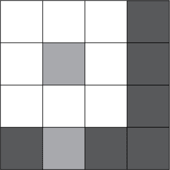
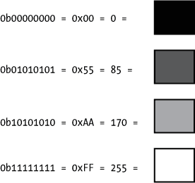
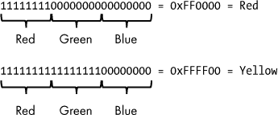
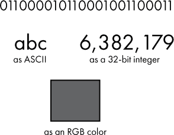

## 第二章：二进制的实际应用**


在上一章中，我们将计算机定义为一种可以编程执行一系列逻辑指令的电子设备。随后，我们以高层次了解了计算机中所有内容，从它使用的数据到它执行的指令，都是以二进制形式存储的，即 0 和 1。在本章中，我将进一步阐明 0 和 1 是如何被用来表示几乎任何类型的数据。我们还将讨论二进制如何适用于逻辑操作。

### 数字化数据表示

到目前为止，我们关注的是如何在二进制中存储数字。更具体地说，我们讨论了如何存储正整数（有时称为整数）和零。然而，计算机将所有数据都存储为比特：负数、分数、文本、颜色、图像、音频和视频，等等。让我们来考虑一下如何使用二进制表示各种类型的数据。

#### *数字文本*

让我们以文本为例，看看比特、0 和 1 如何表示数字以外的其他东西。在计算机的语境中，*文本*指的是一组字母数字和相关符号，也称为*字符*。文本通常用来表示单词、句子、段落等等。文本不包括格式（粗体、斜体）。为了便于讨论，我们将字符集限定为英语字母和相关字符。在计算机编程中，术语*字符串*通常用来指代一串文本字符。

保持对文本的这个定义，我们究竟需要表示什么呢？我们需要大写和小写的 A 到 Z，即 A 和 a 是不同的符号。我们还需要标点符号，如逗号和句号。我们需要表示空格的方式。我们还需要数字 0 到 9。数字的需求可能会让人困惑；这里我所指的是包括表示数字 0 到 9 的*符号*或*字符*，这与存储数字 0 到 9 是不同的概念。

如果我们将所有需要表示的独特符号加起来，刚才提到的，差不多有 100 个字符。那么，如果我们需要为每个字符拥有一个独特的比特组合，我们每个字符需要多少比特呢？一个 6 位数给我们 64 种独特的组合，这还不够。但一个 7 位数给我们 128 种组合，足以表示我们需要的 100 个左右的字符。然而，由于计算机通常以字节为单位工作，因此直接向上取整，使用一个完整的 8 位字节来表示每个字符是有意义的。使用字节，我们可以表示 256 个独特字符。

那么我们该如何用 8 个比特来表示每个字符呢？正如你可能预料到的那样，已经有一种标准的方法可以用二进制表示文本，我们很快就会讲到。但在此之前，重要的是要理解，我们可以制定任何方案来表示每个字符，只要计算机上运行的软件知道我们的方案。话虽如此，一些方案比其他方案更适合表示某些类型的数据。软件设计师更喜欢那些使常见操作易于执行的方案。

假设你负责创建自己的系统，将每个字符表示为一组比特。你可能决定将 0b00000000 表示字符 A，0b00000001 表示字符 B，依此类推。将数据转换为数字格式的过程称为*编码*；当你解释这些数字数据时，它被称为*解码*。

**练习 2-1：创建你自己的文本表示系统**

定义一种方法，将大写字母 A 到 D 表示为 8 位数字，然后使用你的系统将单词*DAD*编码为 24 位。这个问题没有唯一的正确答案；请参见附录 A 获取示例答案。额外任务：同时展示你的 24 位编码数字的十六进制表示。

#### *ASCII*

幸运的是，我们已经有几种标准的数字文本表示方法，因此我们不必自己发明！*美国信息交换标准代码（ASCII）*是一种格式，它使用每个字符 7 个比特表示 128 个字符，尽管每个字符通常使用完整的字节（8 个比特）存储。使用 8 个比特而不是 7 个比特，意味着我们多了一个前导比特，值为 0。ASCII 处理英语所需的字符，另一个标准叫做*Unicode*，它处理几乎所有语言（包括英语）中使用的字符。现在，我们先集中在 ASCII 上，以保持简单。表 2-1 显示了部分 ASCII 字符的二进制和十六进制值。前 32 个字符未显示，它们是控制码，如回车和换页，最初用于控制设备，而不是存储文本。

**练习 2-2：编码与解码 ASCII**

使用表 2-1，将以下单词编码为 ASCII 二进制和十六进制，每个字符使用一个字节。记住，大写字母和小写字母的值不同。

+   你好

+   5 只猫

使用表 2-1，解码以下单词。每个字符由一个 8 位的 ASCII 值表示，空格用于增加清晰度。

+   01000011 01101111 01100110 01100110 01100101 01100101

+   01010011 01101000 01101111 01110000

使用表 2-1，解码以下单词。每个字符由一个 8 位的十六进制值表示，空格用于增加清晰度。

+   43 6C 61 72 69 6E 65 74

答案见附录 A。

**表 2-1：** ASCII 字符 0x20 至 0x7F

| **二进制** | **十六进制** | **字符** | **二进制** | **十六进制** | **字符** | **二进制** | **十六进制** | **字符** |
| --- | --- | --- | --- | --- | --- | --- | --- | --- |
| `00100000` | `20` | `[空格]` | `01000000` | `40` | `@` | `01100000` | `60` | `` ` `` |
| `00100001` | `21` | `!` | `01000001` | `41` | `A` | `01100001` | `61` | `a` |
| `00100010` | `22` | `"` | `01000010` | `42` | `B` | `01100010` | `62` | `b` |
| `00100011` | `23` | `#` | `01000011` | `43` | `C` | `01100011` | `63` | `c` |
| `00100100` | `24` | `$` | `01000100` | `44` | `D` | `01100100` | `64` | `d` |
| `00100101` | `25` | `%` | `01000101` | `45` | `E` | `01100101` | `65` | `e` |
| `00100110` | `26` | `&` | `01000110` | `46` | `F` | `01100110` | `66` | `f` |
| `00100111` | `27` | `'` | `01000111` | `47` | `G` | `01100111` | `67` | `g` |
| `00101000` | `28` | `(` | `01001000` | `48` | `H` | `01101000` | `68` | `h` |
| `00101001` | `29` | `)` | `01001001` | `49` | `I` | `01101001` | `69` | `i` |
| `00101010` | `2A` | `*` | `01001010` | `4A` | `J` | `01101010` | `6A` | `j` |
| `00101011` | `2B` | `+` | `01001011` | `4B` | `K` | `01101011` | `6B` | `k` |
| `00101100` | `2C` | `,` | `01001100` | `4C` | `L` | `01101100` | `6C` | `l` |
| `00101101` | `2D` | `-` | `01001101` | `4D` | `M` | `01101101` | `6D` | `m` |
| `00101110` | `2E` | `.` | `01001110` | `4E` | `N` | `01101110` | `6E` | `n` |
| `00101111` | `2F` | `/` | `01001111` | `4F` | `O` | `01101111` | `6F` | `o` |
| `00110000` | `30` | `0` | `01010000` | `50` | `P` | `01110000` | `70` | `p` |
| `00110001` | `31` | `1` | `01010001` | `51` | `Q` | `01110001` | `71` | `q` |
| `00110010` | `32` | `2` | `01010010` | `52` | `R` | `01110010` | `72` | `r` |
| `00110011` | `33` | `3` | `01010011` | `53` | `S` | `01110011` | `73` | `s` |
| `00110100` | `34` | `4` | `01010100` | `54` | `T` | `01110100` | `74` | `t` |
| `00110101` | `35` | `5` | `01010101` | `55` | `U` | `01110101` | `75` | `u` |
| `00110110` | `36` | `6` | `01010110` | `56` | `V` | `01110110` | `76` | `v` |
| `00110111` | `37` | `7` | `01010111` | `57` | `W` | `01110111` | `77` | `w` |
| `00111000` | `38` | `8` | `01011000` | `58` | `X` | `01111000` | `78` | `x` |
| `00111001` | `39` | `9` | `01011001` | `59` | `Y` | `01111001` | `79` | `y` |
| `00111010` | `3A` | `:` | `01011010` | `5A` | `Z` | `01111010` | `7A` | `z` |
| `00111011` | `3B` | `;` | `01011011` | `5B` | `[` | `01111011` | `7B` | `{` |
| `00111100` | `3C` | `<` | `01011100` | `5C` | `\` | `01111100` | `7C` | `&#124;` |
| `00111101` | `3D` | `=` | `01011101` | `5D` | `]` | `01111101` | `7D` | `}` |
| `00111110` | `3E` | `>` | `01011110` | `5E` | `^` | `01111110` | `7E` | `~` |
| `00111111` | `3F` | `?` | `01011111` | `5F` | `_` | `01111111` | `7F` | `[删除]` |

以数字格式表示文本相当简单。像 ASCII 这样的系统将每个字符或符号映射到一个独特的位序列。然后，计算设备解释这些位序列并显示相应的符号给用户。

#### *数字颜色与图像*

现在我们已经看到了如何以二进制表示数字和文本，让我们探索另一种数据类型：颜色。任何具有彩色图形显示的计算设备都需要有一种描述颜色的系统。如你所料，就像文本一样，我们已经有了标准的颜色数据存储方式。我们会介绍这些方法，但首先让我们设计自己的数字颜色描述系统。

让我们将颜色范围限制为黑色、白色和不同深浅的灰色。这种有限的颜色集合称为 *灰度*。就像我们处理文本一样，首先决定我们要表示多少种不同的灰度。我们保持简单，使用黑色、白色、深灰色和浅灰色。这总共是四种灰度颜色，那么我们需要多少位来表示这四种颜色呢？只需要 2 位。因为 2 的 2 次方等于 4，所以 2 位数字可以表示四个唯一的值。

**练习 2-3：创建你自己的灰度表示系统**

定义一种数字方式来表示黑色、白色、深灰色和浅灰色。没有单一的正确答案；请参见 附录 A 获取示例答案。

一旦你设计了表示灰度的二进制系统，你可以在此基础上构建自己的系统来描述一个简单的灰度图像。图像本质上是颜色在二维平面上的排列。这些颜色通常以一个由单色方块组成的网格排列，这些方块称为 *像素*。这里是 图 2-1 中的一个简单例子。



*图 2-1：一个简单的图像*

图 2-1 中的图像宽度为 4 像素，高度为 4 像素，总共有 16 个像素。如果你眯起眼睛并发挥想象力，你可能会看到一个白色的花朵和背后的暗天空。该图像由三种颜色组成：白色、浅灰色和深灰色。

**注意**

*图 2-1 由一些非常大的像素组成，用来说明一个观点。现代电视、计算机显示器和智能手机屏幕也可以看作是像素网格，但每个像素非常小。例如，高清显示屏通常为 1920 像素（宽度）乘 1080 像素（高度），总共有大约 200 万个像素！再举一个例子，数字照片通常包含超过 1000 万个像素*。

**练习 2-4：创建你自己的简单图像表示方法**

**第一部分** 基于你之前表示灰度颜色的系统，设计一个表示由这些颜色组成的图像的方法。如果你想简化问题，可以假设图像总是 4 像素乘 4 像素，就像 图 2-1 中的那个图像。

**第二部分** 使用第一部分中的方法，写出 图 2-1 中花朵图像的二进制表示。

**第三部分** 解释你表示图像的方法给朋友听。然后把你的二进制数据给朋友，看看她是否能在不看原始图像的情况下画出上面的图像！

这个问题没有唯一的正确答案；可以参考附录 A 中的示例答案。

在练习 2-4 的第二部分，你像一个计算机程序一样负责将图像编码成二进制数据。在第三部分，你的朋友像一个计算机程序一样负责解码，将二进制数据还原成图像。希望她能够解码你的二进制数据并画出一朵花！如果她成功了，那太好了，你们一起展示了软件如何编码和解码数据！如果情况不太顺利，她画出的可能更像是腌黄瓜而不是花朵，那也没关系；你们展示了有时软件存在缺陷，导致意外结果。

#### *表示颜色和图像的方法*

如前所述，已经有标准的方法定义了以数字方式表示颜色和图像。对于灰度图像，一种常见的方法是每个像素使用 8 位，允许表示 256 种灰度级别。每个像素的值通常表示光的强度，因此 0 代表无光强度（黑色），255 代表最大光强度（白色），介于两者之间的是不同的灰度，从深到浅。图 2-2 展示了使用 8 位编码方案的不同灰度级别。



*图 2-2：使用 8 位表示的灰度，显示为二进制、十六进制和十进制*

表示除了灰度以外的颜色采用类似的方法。虽然灰度图像可以通过一个 8 位数表示，称为 *RGB* 的方法使用三个 8 位数表示红色、绿色和蓝色的强度，这三种颜色组合起来形成一个单一的颜色。为每种颜色分配 8 位意味着需要 24 位来表示整体颜色。

**注**

*RGB 基于一种* 加色模型，*其中颜色由红色、绿色和蓝色光的混合组成。这与绘画中使用的* 渐变色模型 *不同，在后者中，混合的颜色是红色、黄色和蓝色*。

例如，红色在 RGB 中通过将所有 8 位红色设为 1，其余 16 位的两个颜色设为 0 来表示。或者，如果你想表示黄色，这是一种红色和绿色的组合，但没有蓝色，你可以将红色和绿色的位设为 1，蓝色的位保持为 0。这个过程在图 2-3 中有说明。



*图 2-3：使用 RGB 表示的红色和黄色*

在图 2-3 中的两个例子中，所有“开启”的颜色都是 1，但 RGB 系统也允许红色、蓝色和绿色的组成颜色部分强度不一。每个组成颜色的值可以从 00000000（0 十进制/0 十六进制）到 11111111（255 十进制/FF 十六进制）。较低的值表示该颜色的较暗阴影，较高的值表示该颜色的较亮阴影。通过这种颜色混合的灵活性，我们几乎可以表示任何想象得到的颜色。

不仅有标准的颜色表示方法，还有多种常用的方法来表示整个图像。正如你在图 2-1 中看到的，我们可以通过一个像素网格来构建图像，每个像素设置为特定的颜色。多年来，已经设计出了多种图像格式来实现这一点。一种简单的表示图像的方法称为*位图*。位图图像存储每个单独像素的 RGB 颜色数据。其他图像格式，如 JPEG 和 PNG，使用压缩技术来减少存储图像所需的字节数，相比位图格式更为高效。

#### *解读二进制数据*

让我们再来分析一个二进制值：011000010110001001100011。你认为它代表什么？如果我们假设它是一个 ASCII 文本字符串，那么它表示“abc”。另一方面，也许它表示一个 24 位 RGB 颜色，从而是某种灰度色调。或者它可能是一个正整数，在这种情况下，它在十进制下的值是 6,382,179。这些不同的解释在图 2-4 中有所展示。



*图 2-4：011000010110001001100011 的解释*

那么它到底代表什么呢？它可以是这些中的任何一种，或者完全是其他的东西。这完全取决于数据被解释的上下文。文本编辑器程序会假设数据是文本，而图像查看器可能会假设它是图像中某个像素的颜色，计算器则可能会假设它是一个数字。每个程序都被设计为期望某种特定格式的数据，因此一个二进制值在不同的上下文中有不同的含义。

我们已经展示了如何使用二进制数据来表示数字、文本、颜色和图像。从这些例子中，你可以对如何存储其他类型的数据，如视频或音频，做出一些推测。数字化表示的数据类型没有限制。数字表示不一定是原始数据的完美复制，但在许多情况下这并不是问题。能够将任何事物表示为一串 0 和 1 是极其有用的，因为一旦我们构建了能够处理二进制数据的设备，我们就可以通过软件将其适配为处理任何类型的数据！

### 二进制逻辑

我们已经建立了使用二进制表示数据的实用性，但计算机不仅仅是存储数据。它们还让我们能够处理数据。在计算机的帮助下，我们可以读取、编辑、创建、转换、分享以及以其他方式操作数据。计算机赋予我们以多种方式处理数据的能力，利用硬件，我们可以编写程序来执行一系列简单的指令——像“将两个数字相加”或“检查两个值是否相等”这样的指令。实现这些指令的计算机处理器本质上基于*二进制逻辑*，这是一种描述逻辑陈述的系统，其中变量只能是两个值之一——真或假。现在，让我们来研究一下二进制逻辑，在这个过程中，我们将再次看到计算机中的一切都归结为 1 和 0。

让我们考虑一下二进制如何自然地与逻辑契合。通常，当有人提到逻辑时，他们指的是推理，或者说通过已知的事实进行思考，以得出有效的结论。当面对一组事实时，逻辑帮助我们判断另一个相关的陈述是否也为事实。逻辑关注的是真理——什么是真的，什么是假的。同样，一个位（bit）只能有两个值之一：1 或 0。因此，单个比特可以表示逻辑状态中的“真”（1）或“假”（0）。

让我们来看一个逻辑陈述的例子：

```
GIVEN a shape has four straight sides,

AND GIVEN the shape has four right angles,

I CONCLUDE that the shape is a rectangle.
```

这个例子有两个条件（四条边，四个直角），它们必须*都*为真，结论才能为真。对于这种情况，我们使用逻辑运算符 AND 将两个陈述连接在一起。如果其中任何一个条件为假，那么结论也为假。我在表 2-2 中表达了相同的逻辑。

**表 2-2：** 矩形的逻辑陈述

| **四条边** | **四个直角** | **是矩形** |
| --- | --- | --- |
| 假 | 假 | 假 |
| 假 | 真 | 假 |
| 真 | 假 | 假 |
| 真 | 真 | 真 |

使用表 2-2，我们可以按如下方式解释每一行：

1.  如果这个形状*不*有四条边且*不*有四个直角，那么它*不是*矩形。

1.  如果这个形状*不*具有四条边且*有*四个直角，那么它*不是*矩形。

1.  如果这个形状*有*四条边且*没有*四个直角，那么它*不是*矩形。

1.  如果这个形状*有*四条边且*有*四个直角，那么它*是*矩形！

这种类型的表格被称为*真值表*：一种展示所有可能的条件组合（输入）及其逻辑结论（输出）的表格。表 2-2 是专门为我们关于矩形的陈述编写的，但实际上，这张表适用于任何通过 AND 连接的逻辑陈述。

在表 2-3 中，我将这个表格做得更加通用，使用 A 和 B 来表示我们的两个输入条件，使用 Output 来表示逻辑结果。具体来说，对于这个表格，Output 是 A AND B 的结果。

**表 2-3：** 与（AND）真值表（使用真和假）

| **A** | **B** | **输出** |
| --- | --- | --- |
| 假 | 假 | 假 |
| 假 | 真 | 假 |
| 真 | 假 | 假 |
| 真 | 真 | 真 |

在表 2-4 中，我对我们的表格做了一点修改。由于本书讲的是计算机，我将假表示为 0，将真表示为 1，就像计算机一样。

**表 2-4：** 与（AND）真值表

| **A** | **B** | **输出** |
| --- | --- | --- |
| 0 | 0 | 0 |
| 0 | 1 | 0 |
| 1 | 0 | 0 |
| 1 | 1 | 1 |

表 2-4 是当你处理使用 0 和 1 的数字系统时，标准的与（AND）真值表。计算机工程师使用这样的表格来表达组件在面对某一组输入时的行为。现在让我们看看这如何与其他逻辑运算符和更复杂的逻辑表达式一起工作。

假设你在一家商店工作，该商店仅对两种类型的顾客提供折扣：儿童和戴太阳镜的人。其他人都不符合折扣条件。如果你想用逻辑表达式陈述商店的政策，你可以这样说：

```
GIVEN the customer is a child,

OR GIVEN the customer is wearing sunglasses,

I CONCLUDE that the customer is eligible for a discount.
```

在这里，我们有两个条件（儿童，戴太阳镜），其中*至少一个*条件必须为真，结论才为真。在这种情况下，我们使用逻辑运算符“或”（OR）将两个语句连接起来。如果其中任何一个条件为真，那么结论也为真。我们可以将其表示为一个真值表，如表 2-5 所示。

**表 2-5：** 或（OR）真值表

| **A** | **B** | **输出** |
| --- | --- | --- |
| 0 | 0 | 0 |
| 0 | 1 | 1 |
| 1 | 0 | 1 |
| 1 | 1 | 1 |

通过观察表 2-5 中的输入和输出，我们可以快速看到，当顾客是儿童（A = 1）或顾客戴太阳镜（B = 1）时，会给予折扣（输出 = 1）。请注意，A 和 B 的输入列值在表 2-4 和表 2-5 中完全相同。这是有道理的，因为这两张表都有两个输入，因此有相同的输入组合。不同之处在于输出列。

让我们将与（AND）与或（OR）结合起来，形成一个更复杂的逻辑表达式。为了这个例子，假设我每天都去海滩，如果天气晴朗且温暖，而且假设我每年生日时也去海滩。事实上，我只在这些特定情况下去海滩——我妻子说我在这方面太固执了。将这些想法结合起来，我们得到以下逻辑表达式：

```
GIVEN it is sunny AND GIVEN it is warm,

OR GIVEN it is my birthday,

I CONCLUDE that I am going to the beach.
```

让我们标记输入条件，然后为这个表达式写一个真值表。

**条件 A**   天气晴朗。

**条件 B**   天气温暖。

**条件 C**   今天是我的生日。

我们的逻辑表达式看起来像这样：

```
(A AND B) OR C
```

就像在代数表达式中，A 且 B 周围的括号意味着该部分表达式应首先进行评估。表 2-6 为此逻辑表达式提供了一个真值表。

**表 2-6：** (A 且 B) 或 C 真值表

| **A** | **B** | **C** | **输出** |
| --- | --- | --- | --- |
| 0 | 0 | 0 | 0 |
| 0 | 0 | 1 | 1 |
| 0 | 1 | 0 | 0 |
| 0 | 1 | 1 | 1 |
| 1 | 0 | 0 | 0 |
| 1 | 0 | 1 | 1 |
| 1 | 1 | 0 | 1 |
| 1 | 1 | 1 | 1 |

表 2-6 比简单的 AND 真值表稍微复杂一些，但仍然可以理解。表格格式使得查找特定条件并查看结果变得容易。例如，第三行告诉我们，如果 A = 0（今天*不*是晴天），B = 1（今天*很*暖和），C = 0（今天*不是*我的生日），那么输出 = 0（我今天*不*去海滩）。

这种逻辑是计算机经常需要处理的。事实上，正如之前提到的，计算机的基本功能归结为一组逻辑操作。虽然一个简单的 AND 运算符看起来与智能手机或笔记本电脑的功能相差甚远，但这些逻辑运算符是所有数字计算机的概念性构建块。

**练习 2-5：编写一个逻辑表达式的真值表**

表 2-7 显示了一个逻辑表达式的三个输入。完成表达式 (A 或 B) 且 C 的真值表输出。答案见 附录 A。

**表 2-7：** (A 或 B) 且 C 真值表

| **A** | **B** | **C** | **输出** |
| --- | --- | --- | --- |
| 0 | 0 | 0 |  |
| 0 | 0 | 1 |  |
| 0 | 1 | 0 |  |
| 0 | 1 | 1 |  |
| 1 | 0 | 0 |  |
| 1 | 0 | 1 |  |
| 1 | 1 | 0 |  |
| 1 | 1 | 1 |  |

除了 AND 和 OR，还有一些其他常用的逻辑运算符用于数字系统的设计。在接下来的几页中，我将介绍每个运算符，并为每个运算符提供一个真值表。在 第四章 关于数字电路的部分，我们将再次使用这些运算符。

逻辑运算符 NOT 就是它听起来的意思，输出是输入条件的反面。也就是说，如果 A 为真，则输出为 *不* 真，反之亦然。如 表 2-8 所示，NOT 仅接受一个输入，而不是两个输入。

**表 2-8：** NOT 真值表

| **A** | **输出** |
| --- | --- |
| 0 | 1 |
| 1 | 0 |

运算符 NAND 意味着 NOT AND，因此输出是 AND 的反向。如果两个输入都为真，则结果为假。否则，结果为真。这一点在 表 2-9 中有显示。

**表 2-9：** NAND 真值表

| **A** | **B** | **输出** |
| --- | --- | --- |
| 0 | 0 | 1 |
| 0 | 1 | 1 |
| 1 | 0 | 1 |
| 1 | 1 | 0 |

NOR 运算符意味着 NOT OR，因此输出是 OR 的反向。如果两个输入都为假，则结果为真。否则，结果为假。表 2-10 显示了这一点。

**表 2-10：** NOR 真值表

| **A** | **B** | **输出** |
| --- | --- | --- |
| 0 | 0 | 1 |
| 0 | 1 | 0 |
| 1 | 0 | 0 |
| 1 | 1 | 0 |

XOR 是“异或”运算，意味着只有一个（排他性）输入为真时，结果才为真。也就是说，输出为真时，只有 A 为真或者只有 B 为真，而当两个输入都为真时，输出为假。详情见 表 2-11。

**表 2-11：** XOR 真值表

| **A** | **B** | **输出** |
| --- | --- | --- |
| 0 | 0 | 0 |
| 0 | 1 | 1 |
| 1 | 0 | 1 |
| 1 | 1 | 0 |

研究二值变量（真或假）逻辑功能的学科称为 *布尔代数* 或 *布尔逻辑*。乔治·布尔在 19 世纪描述了这种逻辑方法，早于数字计算机的出现。他的工作为数字电子学的发展，包括计算机的诞生，奠定了基础。

### 总结

在本章中，我们介绍了二进制如何用来表示数据和逻辑状态。你学习了如何使用 0 和 1 来表示几乎任何类型的数据。我们以文本、颜色和图像作为二进制格式数据的示例。你还了解了各种逻辑运算符，如与（AND）和或（OR），并学习了如何使用真值表来表达逻辑语句。理解这些非常重要，因为今天计算机中复杂的处理器是基于复杂的逻辑系统。

当我们在 第四章讨论数字电路时，我们将回到二进制的主题，但在此之前，为了为你准备好这个话题，我们将在 第三章中绕道讲解电路基础知识。我们将探讨电学定律，了解电路是如何工作的，并熟悉一些在许多电路中常见的基本元件。你甚至还会有机会构建自己的电路！
