## 第三章：电气电路**

我们已经在概念层面上讨论了计算的某些方面；现在让我们改变方向，看看计算的物理基础。让我们从回顾计算机的定义开始。计算机是一种电子设备，可以通过编程执行一组逻辑指令。

计算机是遵循由人类设计规则的设备，但最终计算机必须根据另一组规则行事：自然法则。计算机只是一个机器，就像所有机器一样，它利用自然法则来完成任务。特别是，现代计算机是电子设备，因此电学法则是构建这些设备的自然基础。为了全面理解计算，您需要掌握电力和电路的基础知识；这就是本章要讲解的内容。让我们从电气术语和概念开始，学习一些电学法则，了解电路图，最后构建一些简单的电路。

### 电气术语定义

为了讨论电路，您首先需要熟悉几个关键概念和术语。我将现在讲解这些电气概念，并解释它们如何相互关联。本节内容非常详细，所以让我们先通过表 3-1 进行概览，再深入探讨细节。

**表 3-1：** 关键电气术语汇总

| **术语** | **解释** | **单位** | **水的类比** |
| --- | --- | --- | --- |
| 电荷 | 使物质受到力的作用 | 库仑 | 水 |
| 电流 | 电荷的流动 | 安培 | 水通过管道的流动 |
| 电压 | 两点之间的电位差 | 伏特 | 水压 |
| 电阻 | 衡量电流通过物质的难易程度 | 欧姆 | 管道的宽度 |

表 3-1 提供了每个术语的简单解释，列出了其计量单位，并将每个术语与水系统中的类比进行了对比（如本章后面图 3-2 所示）。如果这暂时不完全明白，别担心！我们将在接下来的页面中更深入地讲解每个术语。

#### *电荷*

在学校里，您可能学过原子由带正电的质子、带负电的电子和不带电的中子组成。*电荷*使物质受到力的作用；不同电荷相吸，相同电荷相斥。在解释电路的概念时，我喜欢使用水流过管道的类比。在这个类比中，电荷就像水，电线就像管道。

电荷的计量单位是*库仑*。质子或电子的电荷量是一个微小的量，与单个库仑代表的电荷量相比几乎可以忽略不计。

#### *电流*

对我们讨论特别相关的是电荷的传输或移动，称为*电流*。电荷通过电线的流动类似于水流通过管道。在日常使用中，包括在本书中，我们说“电流在流动”或“电流流动”，虽然更准确地说，是电荷在流动，而电流是衡量流动强度的量。

在方程中表示电流时，使用符号*I*或*i*。电流以*安培*为单位，有时简称为*安*，缩写为*A*。1 安培等于每秒 1 库仑。假设你有两根电线，第一根电线通过 5A 电流，第二根电线通过 1A 电流。由于安培代表的是电流的流动速率，因此第一根电线的电荷流动速率是第二根电线的五倍。

#### *电压*

由于电荷通过电线流动类似于水流通过管道，让我们进一步扩展这个类比。到目前为止，我们有水（电荷）、一根简单的管道（一根铜线）和水流速率（电流）。接下来，我们加上一个泵，连接到管道上，用来推动水流动。水压越大，水流通过管道的速度越快。将这个类比应用到电路中，水泵代表的是*电源*，即提供电能的源，如电池。

在这个类比中，水压代表了一个新的概念：*电压*。就像水压影响水流通过管道的速率一样，电压影响电流——电荷流通过电路的速率。为了理解电压，回想一下科学课上学到的*势能*，它以*焦耳*为单位，是做功的能力。就电学而言，*功*是指将电荷从一个点移动到另一个点的过程。*电势*是每单位电荷的势能，单位是焦耳每库仑。电压被定义为两个点之间的电势差。也就是说，电压是将电荷从一个点移动到另一个点所需的每库仑功。

在方程中表示电压时，使用符号*V*或*v*。电压以*伏特*为单位，缩写为*V*。电压总是测量两个点之间的差异，例如电池的正负端子之间的电压。*端子*在此上下文中指的是电气连接点。电压越高，推动电荷从一个端子到另一个端子的“压力”就越大，因此，当电压源连接到电路中时，电流也越大。然而，即使没有电流流动，电压也可以存在。例如，一个 9 伏的电池在其端子之间的电压为 9V，即使没有连接到任何设备。

#### *电阻*

让我们回到水流类比。影响水流的另一个因素是管道的宽度。非常宽的管道允许水流动不受限制，而狭窄的管道则会阻碍水流。如果我们将这一类比应用于电路，管道的宽度就代表了电路中的*电阻*。电阻是衡量电流通过*导体*（允许电流流动的材料）时难易程度的指标。材料的电阻越高，电流通过它时的难度就越大。

在表示电阻的方程中，使用符号*R*。电阻的单位是*欧姆*，简称*Ω*（希腊字母欧米伽）。铜线的电阻非常低；为了简化起见，我们假设它的电阻为零，这意味着电流可以自由流过它。电路中使用一种叫做*电阻器*的电气元件来引入特定数量的电阻，满足需要。请参见图 3-1 查看典型电阻器的照片。

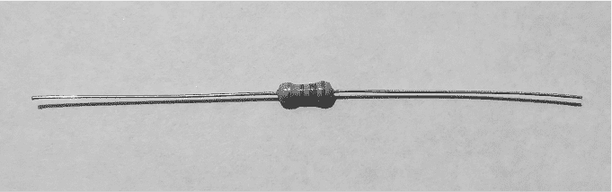

*图 3-1：电阻器*

#### *水流类比*

现在我们已经讲解了电气的关键概念，接下来让我们回顾一下我们一直用来解释电路工作原理的水流类比，如图 3-2 所示。

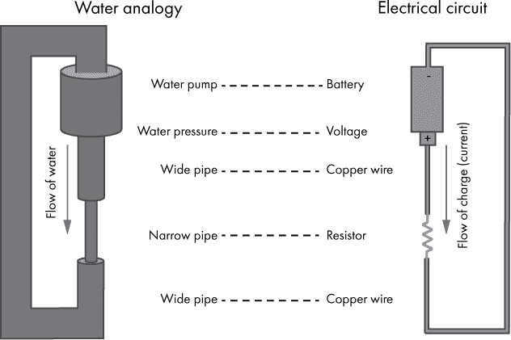

*图 3-2：使用水流类比描述的电路*

水泵通过管道推动水流，就像电池通过电路推动电荷流动一样。就像水流一样，电荷也会流动；我们称之为电流。水压影响水流速率，同样地，电压影响电流——电压越高，电流越大。水会自由地通过宽管道流动，就像电流通过铜线一样。狭窄的管道会限制水流，就像电阻器限制电流一样。

现在，让我们将你学到的知识应用于一个示例电路，该电路由一个电池和连接到其端子的导体组成。电池中储存有势能。电池端子之间的电压是一定数量的伏特，代表电势差。当导体连接到电池端子时，电压就像一种压力，推动电荷通过导体，形成电流。导体有一定的电阻；低电阻会导致较大的电流，而高电阻会导致较小的电流。

### 欧姆定律

电流、电压和电阻之间的关系由*欧姆定律*定义，欧姆定律告诉我们，从一个点流到另一个点的电流等于这两个点之间的电压除以它们之间的电阻。或者用方程表示：

*I = V / R*

假设你有一个 9 伏特的电池，电池两端连接着一个 10,000Ω的电阻。欧姆定律告诉我们，流过电阻的电流将是 9V / 10,000Ω = 0.0009 安培，或者说是 0.9 毫安（mA）。请参考表 1-2 了解我们为什么在这里使用“milli-”前缀。请注意，在本章中，我们再次使用的是 10 进制，所以你可以暂时放下二进制的思维，以正常人的方式思考数字！

**交流电和直流电**

现在值得简单了解一下交流电（AC）和直流电（DC）。不是说澳大利亚的摇滚乐队。*AC*代表*交流电*，是一种周期性改变方向的电流。与之相对的是*DC*，即*直流电*，电流只沿一个方向流动。交流电用于从电厂将电力传输到家庭和企业。插座直接连接的电器、灯具、电视等设备运行在交流电上。像笔记本电脑和智能手机这样的小型电子设备则使用直流电。当你为设备充电时，适配器将来自插座的交流电转换为设备所需的直流电。电池也提供直流电。AC 和 DC 这两个术语也用于电压（例如，*直流电压源*），在这种情况下，它们基本上意味着“交流电压”或“直流电压”。我们在本书中涉及的所有电路都是直流电，所以除了了解 AC 和 DC 之间的区别外，你不需要担心 AC 的细节。

### 电路图

当我们描述电路时，图示可以是一个非常有用的视觉辅助工具。电路图使用标准符号表示各种电路元件。连接这些符号的线代表电线。让我们来看一下常见电路元件在电路图中的表示方式。图 3-3 显示了电阻器和电压源（如电池）的符号。+表示电压源的正端，–表示负端。换句话说，+端相对于–端具有正电压。

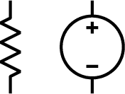

*图 3-3：电阻器符号（左）和电压源符号（右）*

使用这两个符号，我们可以绘制一个电路图，表示我们之前提到的示例电路（一个 9 伏特的电池和一个 10,000Ω电阻连接在其端子之间）。这个电路图如图 3-4 所示。请注意电阻器上的 10kΩ标记；这是 10,000Ω的简写（换句话说，k 代表千，即千的意思）。根据我们之前的欧姆定律计算，我们知道电阻器中有 0.9 毫安（mA）的电流流动，所以这一点也在电路图中标示出来。

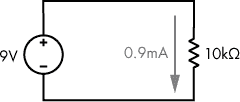

*图 3-4：一个 9 伏特的电池和一个 10,000Ω电阻连接在其端子之间*

我们还可以将电流表示为一个回路，如图 3-5 所示。这种可视化帮助传达了电流流经整个电路，而不仅仅是电阻器的概念。

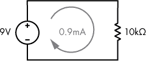

*图 3-5：电流流动的回路示意*

说到电路，这是一个好时机，回顾一下已经提到过好几次但我还没有定义的术语。*电路*是由一组电气元件组成，这些元件以某种方式连接，使得电流在回路中流动，从电源出发，经过电路元件，再回到电源。撇开电力不谈，*电路*这个通用术语指的是从起点到终点的路径。这是一个重要的概念，因为没有电路，电流就无法流动。带有断路的电路称为*开路电路*，当电路是开路时，电流不会流动。另一方面，*短路*是电路中一种允许电流以极小或没有阻力流动的路径，通常是无意的。

**习题 3-1：使用欧姆定律**

看看图 3-6 中的电路。电流是什么，*I*？答案在附录 A 中。

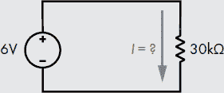

*图 3-6：使用欧姆定律求电流*。

在直流电路的上下文中，*地面*，有时缩写为 GND，是指我们用来与电路中其他电压进行比较的一个点。换句话说，地面被认为是 0V，我们测量电路中其他电压时是相对于地面而言的。正如我们之前所讲，电压总是测量两个点之间的差异，因此重要的是电势的差，而不是某一个点的电势。通过将地面作为 0V 的参考点，我们可以更容易地讨论电路中其他点的相对电压。在我们这里讨论的简单直流电路中，电池或其他电源的负极通常被认为是地面。

地面这个术语来源于某些电路物理上与大地相连的事实。它们字面上与地面连接，而这种连接作为一个 0V 的参考点。便携式或电池供电的设备通常没有物理的地面连接，但我们仍然在这些电路中称指定的 0V 参考点为地面。

有时，工程师们不会将电路图绘制成回路的形式；相反，他们会专门使用图 3-7 中显示的符号来标识地面和电压源的连接。这使得电路图更加简洁，但并不会改变电路的物理连接方式；电流仍然从电源的正极流向负极。

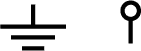

*图 3-7：地面符号（左）和相对于地面的电压源符号（右）*

作为示例，图 3-8 展示了我们之前讨论的电路，左侧是原电路，右侧则是使用图 3-7 中介绍的地和电压符号表示的相同电路。

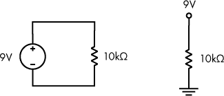

*图 3-8：这两种电路是等效的。*

图 3-8 中的两个电路在功能上是等效的；只是图示表示不同。

### 基尔霍夫电压定律

解释电路行为的另一个原理是*基尔霍夫电压定律*，它告诉我们，电路中的电压总和为零。这意味着，如果一个电压源向电路提供 9V，那么电路中的各个元件必须共同“使用”9V。电路环路中的每个元件都会导致电势的降低。当这种情况发生时，我们说电压在每个元件上被*降落*。让我们以图 3-9 中的电路为例。

*图 3-9：基尔霍夫电压定律示意电路*

在图 3-9 中，我们有一个 10 伏的电源连接到三个电阻上。当电阻按单一路径（*串联*）连接时，总电阻就是各个电阻值的总和。在这种情况下，总电阻为 4kΩ + 6kΩ + 10kΩ = 20kΩ。根据欧姆定律，我们可以计算出通过该电路的电流为 10V / 20kΩ = 0.5mA。电路中有四个测量电压的点，分别标记为 V[A]、V[B]、V[C]和 V[D]。我们将根据电源的负端来确定每个点的电压。

让我们从简单的开始：V[D]直接连接到电源的负端，因此 V[D] = 0V，或地。类似地，V[A]连接到电源的正端，因此 V[A] = 10V。现在我们从基尔霍夫电压定律得知，每个电阻都会导致电压降落，所以 V[B]必须小于 10V，V[C]必须小于 V[B]。

在 4kΩ电阻上降落了多少电压？欧姆定律指出*V = I × R*，所以电压降是 0.5mA × 4kΩ = 2V。这意味着 V[B]将比 V[A]少 2V。因此，V[B] = 10 – 2 = 8V。类似地，6kΩ电阻上的电压降为 3V。因此，V[C] = 8 – 3 = 5V。即使不进行计算，我们也知道根据基尔霍夫电压定律，10kΩ电阻上必须降落 5V 电压，因为它是接近负端（0V）的最后一个电路元件。在图 3-10 中，我们的图示已更新，包含了电压和电压降。

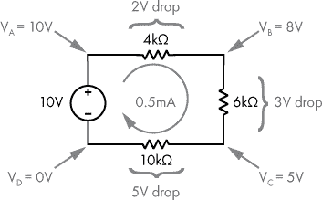

*图 3-10：简单电路中的电压降落*

回顾这个例子，电压源提供 10V，我们认为这是一个正电压。每个电阻都会导致电压降，我们认为这些电压降是负的。如果我们将正电压源与负电压降相加，就得到 10V - 2V - 3V - 5V = 0V。电路中电压的总和为 0，这符合基尔霍夫的电压定律。

你可能会想，这是否只适用于特定值的电阻。毕竟，在给出的例子中，数学运算非常顺利，可能有点太顺利了！在下面的练习中，我们将示例电路中的一个电阻从 4kΩ 改为 24kΩ，你可以看到基尔霍夫的电压定律依然成立。

**练习 3-2：找出电压降**

给定图 3-11 中的电路，*I* 是多少电流？每个电阻的电压降是多少？找到标记的电压：V[A]、V[B]、V[C] 和 V[D]，每个电压相对于电源的负端测量。答案见附录 A。

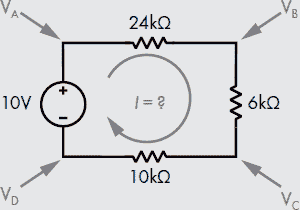

*图 3-11：另一个说明基尔霍夫电压定律的电路*

### 现实世界中的电路

让我们来看一下我们简单的 9V/10kΩ 电路（来自图 3-4）如何在现实世界中构建。在图 3-12 中的照片中，我已经用鳄鱼夹将 10kΩ 电阻连接到 9 伏电池上。

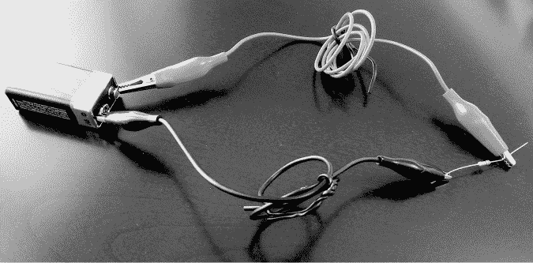

*图 3-12：一个 10kΩ 电阻通过鳄鱼夹连接到 9 伏电池*

这种方法可行，但还有更好的方式来构建电路。*面包板*是用于电路原型制作的基础板。历史上，类似用来烤面包的板子曾用于此目的，但遗憾的是，今天的面包板与面包没有任何关系！面包板（图 3-13）可以方便地连接各种电子元件。

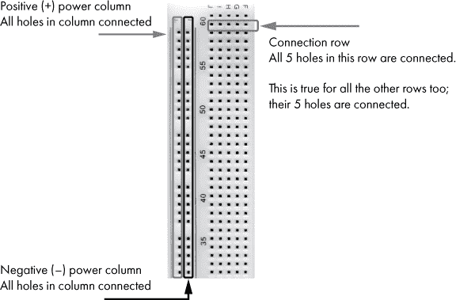

*图 3-13：面包板的一部分*

如图 3-13 所示，面包板的边缘通常有长列，通常标有+和-。这些列通常也有颜色编码，红色表示正极，蓝色表示负极。沿着这样的边缘列的所有孔是电气连接的，这些列用于为电路提供电源，因此通常将电池或其他电源连接到这些列。类似地，通常有五个孔的行（在图 3-13 中，这些行位于边缘列的右侧）也会连接在一起。两个组件可以通过将每个组件的一个端插入相同的行来连接。无需焊接、夹子或电气胶带！

图 3-14 是图 3-4 中电路在面包板上构建的照片。

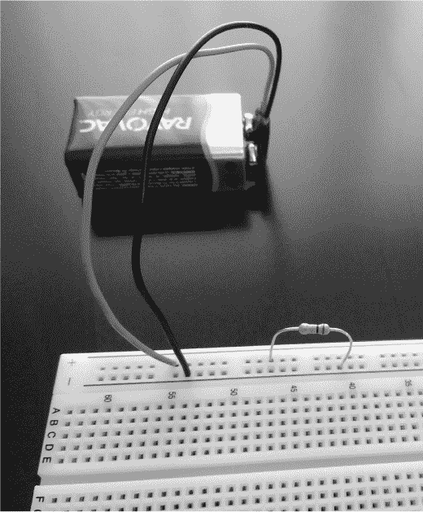

*图 3-14：一个在面包板上构建的简单电路*

如你所见，这是连接电子元件的更整洁、更简单的方式。我做了一些优化，把电阻的两端插入电源柱，直接与电池连接。

**注意**

*请参考项目 #1，位于第 45 页，开始本书的第一个项目！前面的练习要求你从思维上解决问题，而项目则要求你做得更多，包括获取一些硬件。当然，这需要一定的努力和费用，但我相信动手实践是深入理解本书所涵盖概念的最佳方式。翻到本章末尾，你可以找到项目部分，在那里你可以自己动手制作电路！*

### 发光二极管

我们到目前为止讨论的简单电路展示了电流和电压的基本原理，但它们没有什么视觉上的趣味。我发现，让一个沉闷的电路变得有趣的最简单方法就是加入一个*发光二极管（LED）*。典型 LED 的照片见于图 3-15。

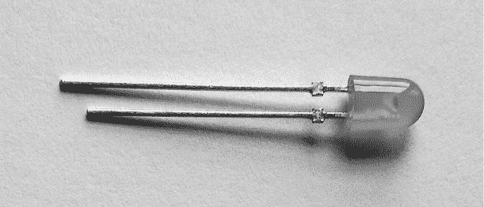

*图 3-15：LED*

让我们先了解 LED 的基础知识，然后将其加入电路中。“发光”这一部分名字是显而易见的；这是一个发光的电路元件。具体来说，它是一个发光的二极管。*二极管*是一个电子元件，它只允许电流单向流动。与允许电流双向流动的电阻不同，二极管在一个方向上电阻极低（允许电流流动），而在另一个方向上电阻极高（阻碍电流流动）。LED 是特殊的二极管类型，当电流流过它时，它会发光。LED 有多种颜色。LED 的电路符号见于图 3-16。

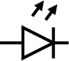

*图 3-16：LED 的符号*

为了让 LED 发光，我们需要确保适量的电流流过它。标准的红色 LED 最大电流为约 25mA；我们不希望超过这个最大电流，因为过大电流会损坏 LED。我们设定目标电流为 20mA，这样电流就能流过我们的 LED。较低的电流值也能正常工作，但 LED 不会那么亮。

那么，我们如何确保适量的电流流过 LED 呢？我们只需要选择一个合适的电阻来限制电路中的电流。但在此之前，你需要了解 LED 的另一个特性——*正向电压*，它描述了当电流流过 LED 时，LED 上会掉落多少电压。典型的红色 LED 的正向电压大约为 2V。正向电压通常表示为 V[f]。

我们的电路图中包含了一个电池、LED 和限流电阻，见于图 3-17。图中还显示了所需的 20mA 电流。

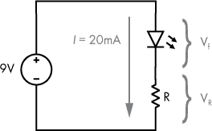

*图 3-17：一个带 LED 的基础电路*

在图 3-17 中，我们有一个 9 伏电池，一个前向电压为 V[f] 的 LED，以及一个电阻值为 *R* 的电阻器。电阻器上的电压降是 V[R]。请记住，电阻器上的电压降会随流过它的电流变化，而 LED 的电压降是由其前向电压特性定义的。在我们之前的电路中，只有电池和电阻器（图 3-4），整个 9V 电压都降落在电阻器上。现在我们有两个电路元件连接到电池上，基尔霍夫电压定律告诉我们，部分电压会降落在 LED 上，其余的电压会降落在电阻器上。作为提醒，你可以将电池视为提供电压，其他元件则是使用电压。如果我们将这个应用于我们的电路（图 3-17），那么 V[f] + V[R] = 9V。

假设我们使用一个标准前向电压为 2V 的 LED，那么 V[R] = 9V – 2V = 7V。让我们用这些电压值更新我们的电路图，如图 3-18 所示。

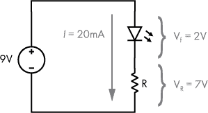

*图 3-18：一个带 LED 的基础电路，显示了电压降*

这让我们只剩下一个未知数，*R*，电阻的电阻值。我们可以通过欧姆定律来计算：*I = V / R*，或者*R = V / I*。所以我们得到 R = 7V / 20mA = 350Ω。这样，我们就解决了如何确保正确的电流通过 LED 的最后一块拼图。我们需要一个大约 350Ω 的电阻，连接到我们的电池和 LED 上。

**注意**

*请参阅项目 #2，见第 50 页，在这里你可以自己搭建 LED 电路并看到它亮起来！*

### 总结

在本章中，我们介绍了电路，这是现代计算设备的物理基础。你了解了电学概念，如电荷、电流、电压和电阻。我们还介绍了两个支配电路行为的定律——欧姆定律和基尔霍夫电压定律。你学到了电路图以及如何构建自己的电路。理解电路的基础将帮助你从根本上理解计算机的工作原理。下一章将介绍数字电路，将二进制逻辑和电路概念结合起来。

**项目 #1：搭建并测量电路**

现在你已经掌握了足够的知识来构建自己的电路。没有比自己动手更好的学习方式了！为了开始，你需要一些硬件，这些都可以在线购买，或者如果你运气好，在附近的电子商店购买。请参阅“购买电子元件”部分，位于第 333 页，了解如何获取这些零件。以下是你在本项目和下一个项目中需要的材料：

+   面包板（400 点或 830 点型号）

+   电阻（多种电阻。在这个项目中你将特别使用一个 10kΩ电阻。务必使用 10kΩ电阻，而不是 10Ω电阻。使用阻值过低的电阻会产生过多电流，可能会导致电路过热！）

+   数字万用表（你将需要它来检查电路的电压、电流和电阻。）

+   9 伏电池

+   9 伏电池夹连接器（这使得连接电池变得更容易。）

+   至少一个 5mm 或 3mm 的红色 LED（发光二极管）

+   可选：剥线钳（你可能需要一个来剥去导线两端的塑料并露出铜线。）

+   可选：鳄鱼夹（这些可以使电池与面包板或万用表与电路的连接更为简便。）

+   可选：面包板跳线（将它们连接到 9 伏电池夹的端口，以便更容易插入面包板。）

即使在我们使用的低电压下，电路组件也有可能会变得很热。考虑到这一点，我建议你在连接电路时先断开电源（此处是电池），直到最后一步才连接电源。

一旦你准备好所有组件，连接它们：

1.  将一个 10kΩ电阻的任意一端连接到正电源列。

1.  将电阻的另一端连接到负电源列。

1.  将电池夹的红色/正极导线连接到面包板的正电源列。

1.  将电池夹的黑色/负极导线连接到面包板的负电源列。

1.  将电池夹连接到 9 伏电池的端子。

9 伏电池夹的接线有时比较脆弱，这使得它很难插入面包板。如果你遇到这个问题，可以尝试将跳线的一端连接到脆弱的电池线，另一端连接到面包板。你可以用电工胶带或鳄鱼夹连接这两根线（见图 3-19），如果你懂得使用电烙铁，也可以将它们焊接在一起。如果你尝试这些方法，请小心保持负极和正极导线的金属部分分开。意外连接它们会导致电池短路，使导线变得非常热，并迅速耗尽电池电量。

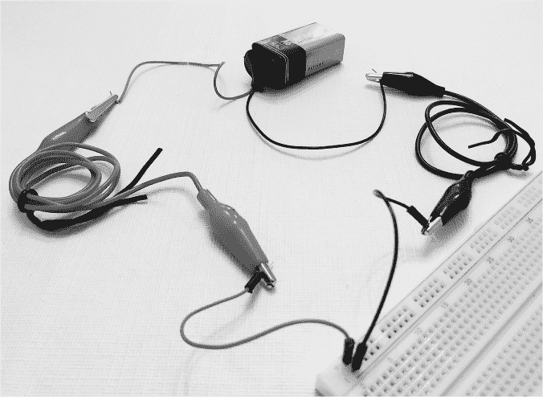

*图 3-19：使用鳄鱼夹和跳线解决脆弱的 9 伏电池夹接线问题*

你可能会想知道如何确定电阻的欧姆值。电阻是通过颜色编码的；色环表示倍数，颜色代表数值。网上有许多免费的电阻色环计算器和图表，所以我在这里就不详细说明了。对于 10kΩ电阻，寻找具有棕色、黑色和橙色色环的电阻，顺序如上。第四个色环通常是金色或银色，表示制造商的公差，即允许的偏差值。

现在你已经搭建好了电路，但如何判断电路是否在工作呢？不幸的是，这个电路并没有直观的方式表明它是否工作，因此是时候拿出万用表，测量电路的各个特性了。使用万用表时，你需要两根测试线（用于测量的电缆）。除非你的万用表的测试线是固定的，否则它可能有两个或三个输入端口来连接测试线，如图 3-20 所示。

如图 3-20 所示，将一根测试线连接到标有“COM”（表示“公共端”）的输入端口。通常我们将黑色测试线连接到 COM 端口。如果你的万用表只有两个输入端口，只需将第二根测试线（通常是红色的）连接到第二个端口即可。具有三个端口的万用表通常有一个 COM 输入端口、一个高电流输入端口和一个低电流输入端口。在这种情况下，你需要将第二根测试线连接到低电流输入端口；它通常标有支持的各种测量类型，例如 V Ω mA。通常，高电流输入端口标有 A、10A、10A 最大或类似字样。再次强调，这不是你需要使用的端口。有些万用表有四个输入端口；如果是这种情况，你必须使用不同的输入端口来进行低电流测量与电压和电阻测量。无论你使用哪种类型的万用表，如果有任何疑问，请查看使用手册。

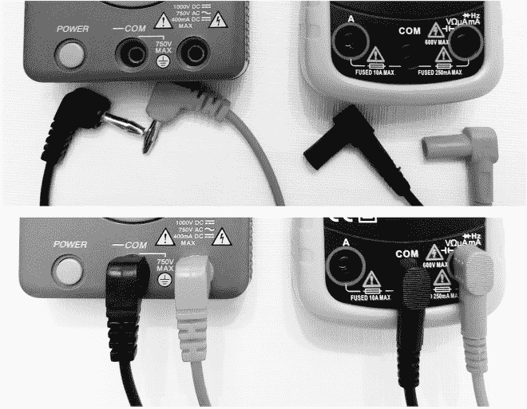

*图 3-20：将测试线连接到万用表。具有两个输入端口的万用表（左）；具有三个输入端口的万用表（右）*。

你的万用表将提供选择功能，让你决定是测量电压、电流还是电阻。我们先从电压开始。将万用表设置为测量直流电压。通常，直流电压会用 V 和旁边的 DC 字母表示，或者你可能会看到 V 旁边有一系列的破折号表示直流（而波浪线表示交流）。

一旦你将万用表设置为测量直流电压，通过将一根测试线接触到电阻的左侧（金属对金属），另一根接触到右侧，来测量电阻两端的电压。记住，电压总是测量两个点之间的，所以我们需要在电阻的两端进行测量。由于我们使用的是 9 伏的电池为电路供电，且电路中唯一的元件是电阻，因此你预计会测得大约 9V 的电压。在测量过程中，你可能会注意到万用表显示的数值会有所变化（通常只是最小的有效数字，即右侧的数字）。这是数字万用表工作原理的结果，并不意味着万用表或电路有故障。

现在试着交换表笔，将左侧的表笔接到电阻器的右侧，右侧的表笔接到电阻器的左侧。你应该会看到电压值变为负值（或者如果之前是负值，则变为正值）。这是因为仪表正在测量电势差，并将连接到 COM 的表笔视为 0V；显示的测量值是另一个表笔的电压差。在图 3-21 中，你可以看到我的电路的电压测量值——9.56V。这个值听起来差不多，因为新的电池通常比广告上标示的电压略高。

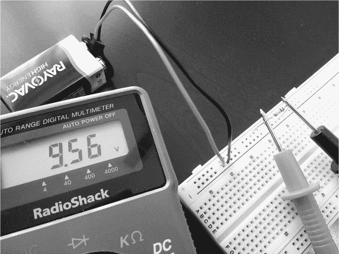

*图 3-21：测量电压*

接下来让我们测量电阻器的电阻。首先，将万用表从电路中断开，以防在更改设置时发生意外损坏。然后将万用表设置为电阻档，这通常标记为Ω。未连接任何东西时，万用表很可能会显示左侧的 1 或 OL，这表示电阻值太大无法显示——空气的电阻非常高！将万用表的两个表笔接触在一起时，显示屏应显示零。要测量电阻器的电阻，你需要将其从电池中断开，但如果有帮助的话，你可以将其保留在面包板上。为了确保你看到准确的读数，测量时避免触碰电路元件和导线的金属部分；如果触碰了，你身体的电阻可能会改变测量值。你可以在图 3-22 中看到我的电阻测量值；在我的情况下，值是 9.88kΩ。我使用的电阻器的颜色带为棕色、黑色和橙色（表示 10,000Ω），后面有一条金色带（表示 5%的公差），所以这个测量值是合适的。也就是说，9.88kΩ在 10kΩ的 5%公差范围内。

在这个阶段，你已经知道了电压和电阻的测量值，因此可以通过欧姆定律计算预期的电流——电流等于电压除以电阻。对于我的电路，这个值将是 9.56V / 9,880Ω = 0.97mA。在测量电路中的电流之前，使用你的电压和电阻测量值进行相同的计算，这样你就可以知道你应该期待在电路中流动的电流大小。

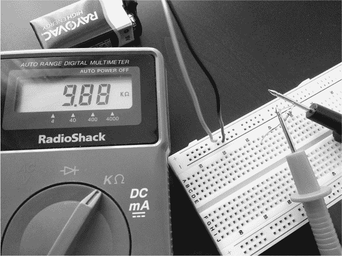

*图 3-22：测量电阻*

现在测量电路中的电流，看看它与计算值有多接近。测量电流与测量电压或电阻有所不同。为了让万用表能够测量电流，电流必须通过它。换句话说，仪表必须成为电路的一部分，如图 3-23 所示。

记得在设置万用表测量直流电流之前断开连接。直流电流符号可能是 A 或 mA，后面带有 DC，或者是一系列短横线表示直流。一些万用表有一个设置用于同时测量直流和交流电流；在这种情况下，符号可能同时显示直线和波浪线。将万用表设置为正确的档位后，将其连接到电路中，如图 3-23 所示。

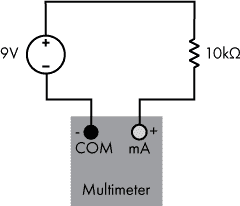

*图 3-23：测量电流时如何连接万用表*

希望您的测量值接近计算值。如图 3-24 所示，我的电流测量值为 0.97mA，这与我之前的计算相同。

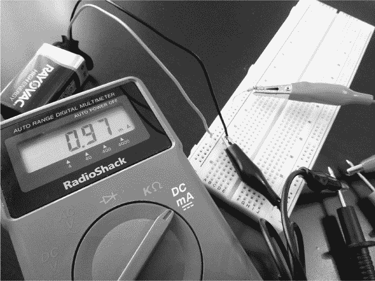

*图 3-24：测量电流。电阻的右侧和电池的黑线不需要连接到面包板上*。

如果您已经跟随到此步骤，那么恭喜您！您刚刚构建并测量了一个电路，或者至少，您了解了我是如何做到的。然而，您可能会感到有些失望。我理解。说实话，除了它具有极高的教育价值外，这个电路其实有些无聊且没什么实际用途！在下一个项目中，我们来做一些更有趣的事情吧。

**项目 #2：构建一个简单的 LED 电路**

现在轮到您自己构建一个 LED 电路并让它亮起来了！假设您完成了之前的项目，您可以将 9 伏电池夹保持连接到您的面包板上，但让我们用更合适的电阻替换 10kΩ电阻。根据我们在本章“发光二极管”一节中的计算，在第 42 页中我们发现，我们需要一个 350Ω的电阻来提供 20mA 的电流。如果我查看我的大电阻包，我不太可能找到一个 350Ω的电阻，您也不太可能找到。您可能会找到的最接近的电阻是 330Ω。

现在我们可以使用多个电阻来精确得到 350Ω，但有必要吗？330Ω是否已经足够接近？让我们来看看。如果我们保持使用 9 伏电池，并且仍然假设我们需要在电阻上降压 7V，那么欧姆定律告诉我们，电路中的电流将是*I = V / R* = 7V / 330Ω = 21.2mA。这样就可以了，因为典型的红色 LED 最大电流大约为 25mA。

值得指出的是，您购买的任何 LED 可能与我描述的特性有所不同。如果您的 LED 附带了数据表，或者在线列出了规格，请检查这些规格并进行自己的计算：您的具体 LED 的实际最大电流或期望电流是多少？您的具体 LED 的实际正向电压是多少？请注意，这通常会因 LED 颜色而有所不同。

在构建电路之前，你需要了解关于 LED 的一件事。与电阻不同，电流可以双向流动，LED 设计只允许电流单向流动，因此你需要知道哪个端口是正极，哪个是负极。正极（*阳极*）通常有较长的引脚，负极（*阴极*）有较短的引脚，如图 3-25 所示。电流从正极流向负极。

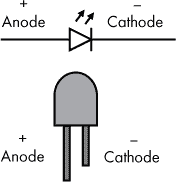

*图 3-25：识别 LED 的阳极和阴极*

一旦你确定了数值并知道要使用的电阻值，将电路按下述方式连接，并如图 3-26 中的电路图所示。

1.  临时将 9 伏电池从面包板上断开。

1.  将 LED 的较长引脚连接到正电源列。

1.  将 LED 的较短引脚连接到面包板上任何空闲的排针。

1.  将电阻的一端连接到 LED 的较短引脚所在的同一排针。

1.  将电阻的另一端连接到负电源列。

1.  重新连接 9 伏电池到你的面包板。

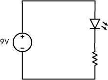

*图 3-26：简单的 LED 电路*

图 3-27 是我的 LED 的照片，按照描述连接。看看它的光芒！希望你的 LED 也在电路完成后亮起来。

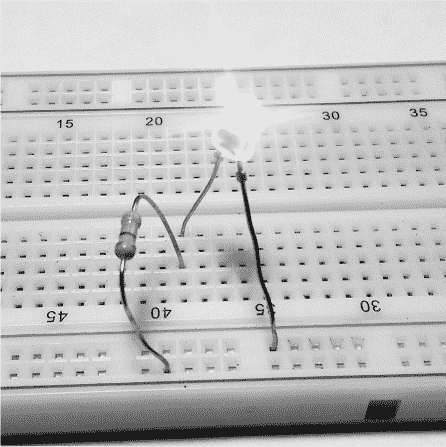

*图 3-27：发光的 LED；未显示连接的电池*
