# 第四章：**数字电路**


到目前为止，我们已经讨论了计算机的两个方面。首先，计算机工作在一个由 0 和 1 组成的二进制系统中。其次，计算机是建立在电子电路上的电子设备。现在是时候将这两个方面结合起来了。在本章中，我们定义了一个电路成为数字电路的含义。我们将探讨实现数字电路的方法，包括晶体管所扮演的角色。最后，我们将考察逻辑门和集成电路，它们是更复杂组件的构建模块，这些内容将在后续章节中讨论。

### 什么是数字电路？

你可能注意到，在上一章中我们构建的电路并不是数字电路——它们是模拟电路。在那些电路中，电压、电流和电阻可以在一个广泛的范围内变化。这并不令人惊讶；我们的世界本来就是模拟的！然而，计算机在数字领域工作，要理解计算机，我们需要了解数字电路。如果我们希望电路是数字的，我们必须首先定义在电子学中数字电路的含义，然后我们可以利用模拟元件构建数字电路。

*数字电路* 处理表示有限状态数的信号。本书讨论的是*二进制*数字电路，因此 0 和 1 是唯一需要考虑的两种状态。我们通常使用电压来表示数字电路中的 0 或 1，其中 0 代表低电压，1 代表高电压。通常，低电压意味着 0V，而高电压则可能是 5V、3.3V 或 1.8V，这取决于电路的设计。实际上，数字电路并不需要精确的电压来判断为高或低。通常，一定范围的电压可以被认为是高或低。例如，在一个标称为 5 伏特的数字电路中，输入电压在 2V 到 5V 之间被认为是高电压，而在 0V 到 0.8V 之间则被认为是低电压。任何其他电压级别都会导致电路中不确定的行为，应当避免。

通常，地面是数字电路中最低的电压，电路中的所有其他电压都相对于地面为正。如果数字电路由电池供电，我们认为电池的负极端子是地面。对于其他类型的直流电源也是如此；负极端子或电线被视为地面。

当提到数字电路中的 0 和 1 状态时，常常会出现许多术语和缩写，它们的意思相同。这些术语经常可以互换使用。以下是一些常见的低电压和高电压术语：

**低电压**   低、LO、关闭、地面、GND、假、零、0

**高电压**   高、HI、开启、V+、真、1、一

### 机械开关的逻辑

现在我们已经确定高电压和低电压分别表示数字电路中的 1 和 0，接下来让我们考虑如何构建一个数字电路。我们希望电路的输入和输出电压始终保持预定的高或低值，或者至少在允许的范围内。为了帮助我们实现这一点，让我们引入一个非常简单且熟悉的电路元件：机械开关。*开关* 很有用，因为它本质上是数字化的。它要么开，要么关。当开关打开时，它就像一根简单的铜线，电流可以自由流过。当开关关闭时，它就像一个开路，电流无法通过。我们用图 4-1 中所示的符号表示开关。


*图 4-1：开关的电路图符号——开/关（左），闭/开（右）*

开关符号传达了这样的概念：当开关处于关闭位置时，它是开路，当开关处于开启位置时，它是闭路。你可以把开关符号和开关本身看作一个栅栏门，要么是开着的，要么是关着的。电流在开关关闭时会流过它。在现实中，开关有多种形状和大小，如图 4-2 所示。

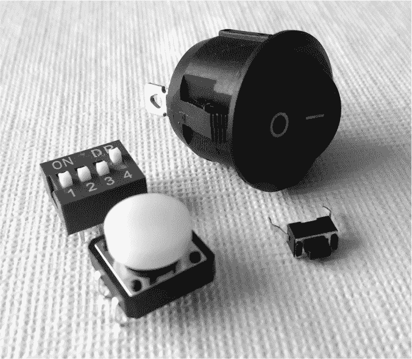

*图 4-2：一些电气开关*

注意，在图 4-2 中，两个靠近我们的开关是*按键开关*，这类开关你可能不常把它当作普通的开关。按键开关也叫做*瞬时开关*，因为它只有在按钮被按下时才闭合。释放按钮的压力后，开关会断开。

现在我们引入了一个可以轻松打开和关闭的电路元件，让我们用开关构建一个像逻辑与操作符一样的数字电路。如果你记得第二章的内容，一个两输入的逻辑与操作符当两个输入都是 1 时输出 1，否则输出 0。作为提示，AND 的真值表已在表 4-1 中重复。

**表 4-1：** 与（AND）真值表

| **A** | **B** | **输出** |
| --- | --- | --- |
| 0 | 0 | 0 |
| 0 | 1 | 0 |
| 1 | 0 | 0 |
| 1 | 1 | 1 |

现在让我们根据以下指南将其转化为电路：

1.  输入 A 和 B 用机械开关表示。我们用一个打开的开关表示 0，用一个闭合的开关表示 1。

1.  输出由我们电路中特定点的电压决定，称为 V[out]。

1.  如果 V[out] 大约为 5V，输出为逻辑 1；如果 V[out] 大约为 0V，输出为逻辑 0。

考虑图 4-3 中所示的电路。这是使用开关实现的逻辑与（AND）。

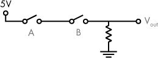

*图 4-3：使用开关实现的逻辑与（AND）*

如果图 4-3 中的任一开关处于关闭状态（开/0），则电流不会流动，V[out]的电压为 0V。如果两个开关都处于开启状态（闭合/1），则形成通向地的路径，电流流动，V[out]的电压为 5V。换句话说，如果 A 和 B 都为 1，则输出为 1。

我们采用相同的方法来处理逻辑或门。或门的真值表，如第二章中首先介绍的，见表 4-2。

**表 4-2：** 或门真值表

| **A** | **B** | **输出** |
| --- | --- | --- |
| 0 | 0 | 0 |
| 0 | 1 | 1 |
| 1 | 0 | 1 |
| 1 | 1 | 1 |

看一下图 4-4 所示的电路，这是一个用开关实现的逻辑或门。

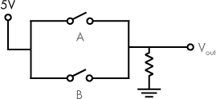

*图 4-4：用开关实现的逻辑或门*

在图 4-4 中，当两个开关都处于关闭状态（开/0）时，电流不流动，V[out]的电压为 0V，即逻辑 0。当任一开关被打开（闭合/1）时，电流流动，V[out]的电压为 5V。换句话说，如果 A 或 B 为 1，则输出为 1。

### 神奇的晶体管

在我们设计数字电路的过程中，刚刚讨论过的基于开关的电路是一个很好的概念起点。然而，在计算设备中，我们不能实际使用机械开关。计算机的输入非常多，使用开关来控制这些输入并不是一个很好的设计。此外，计算设备需要将多个逻辑电路连接在一起——一个电路的输出需要成为另一个电路的输入。为了实现这一点，我们的开关需要通过电控，而不是机械控制。我们不需要机械开关，我们需要电子开关。幸运的是，有一种电路元件可以充当电子开关：晶体管！

*晶体管*是一种用于开关或放大电流的设备。就我们来说，我们主要关注晶体管的开关能力。晶体管是现代电子学的基础，包括计算设备。晶体管有两种主要类型：双极性结晶体管（BJT）和场效应晶体管（FET）。这两种类型的区别在这里并不重要；为了简化起见，我们仅关注一种类型：BJT。

BJT（双极性晶体管）有三个端子：基极、集电极和发射极。BJT 有两种类型：NPN 和 PNP。这两者在基极端子施加电流时的响应方式不同。就我们讨论的目的而言，我们关注 NPN 型 BJT。请参见图 4-5 中的电路图和 NPN 晶体管的照片。

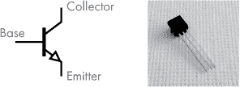

*图 4-5：NPN 晶体管的符号（左）和照片（右）*

在 NPN 晶体管中，向基极施加小电流可以使较大的电流从集电极流向发射极。换句话说，如果我们把晶体管看作一个开关，那么在基极施加电流就像是打开晶体管，而去掉电流则关闭晶体管。让我们来看一下如何将晶体管接成电子开关，如图 4-6 所示。

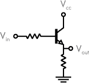

*图 4-6：NPN 晶体管作为开关*

在图 4-6 中，一个 NPN 晶体管与几个带有不同标注电压的电阻相连。V[cc]是施加在集电极端子的正电源电压，这为我们的电路提供电力。如果你有疑问，V[cc]中的“cc”代表“共集电极”，V[cc]是 NPN 电路中正电源电压的典型表示。V[out]是我们希望控制的电压；当晶体管作为开关打开时，我们希望此电压为高，当开关关闭时，该电压为低。V[in]作为控制开关的电压。与翻动机械设备不同，我们可以使用电压 V[in]来控制开关。

让我们考虑如果将 V[in]设置为低或高电压时会发生什么。如果 V[in]为低，接地连接，那么没有电流流向晶体管的基极。在基极没有电流的情况下，晶体管就像一个开路，集电极和发射极之间没有电流流动。这意味着 V[out]也为低。图 4-7 说明了这一点。


*图 4-7：NPN 晶体管作为关闭状态的开关*

在图 4-7 的左侧是我们正在讨论的基于晶体管的电路，右侧是一个基于开关的电路，表示相同的状态。换句话说，左侧的电路与右侧的电路在效果上是一样的；我只是将晶体管替换成了开关，以清楚地说明晶体管在此状态下就像是一个开路的开关。

如果 V[in]为低，则没有电流流动。另一方面，如果 V[in]为高，则会有电流流向晶体管的基极。这个电流使得晶体管从集电极到发射极导电。也就是说，V[out]实际上连接到 V[cc]，因此输出为高，如图 4-8 所示。

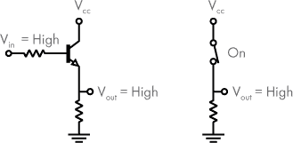

*图 4-8：NPN 晶体管作为打开状态的开关*

在图 4-8 的左侧是我们正在讨论的基于晶体管的电路，右侧是一个基于机械开关的电路，具有相同的有效状态。晶体管在此状态下就像是一个闭合的开关。

### 逻辑门

现在我们已经确定晶体管可以作为电控开关使用，接下来我们可以构建实现逻辑功能的电路元件，其中输入和输出为高低电压。这些元件被称为*逻辑门*。我们先从之前设计的与门电路开始，将机械开关替换为晶体管。这样做的好处是，我们只需改变电压就能改变电路的输入，而不需要翻动机械开关。虽然机械开关是人类与电路交互的好方法，但电子开关允许多个电路相互作用——一个电路的输出可以轻松地成为另一个电路的输入。

我们之前使用机械开关构建了与门电路（见图 4-3）。现在我们使用晶体管作为开关来实现相同的功能，如图 4-9 所示。

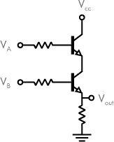

*图 4-9：使用晶体管实现的逻辑与门*

在图 4-9 中，如果 V[A]和 V[B]是高电平（逻辑 1），那么电流会通过两个晶体管，V[out]也将是高电平（逻辑 1）。如果 V[A]或 V[B]是低电平（逻辑 0），则电流不会流动，V[out]也会是低电平（逻辑 0）。这个电路实现了逻辑与门。

可以使用类似的方法来实现逻辑或门。这个设计练习和项目留给你来完成。

**练习 4-1：用晶体管设计一个逻辑或门**

绘制一个逻辑或门电路图，使用晶体管作为输入 A 和 B。将使用机械开关的图 4-4 电路进行改造，但使用 NPN 晶体管代替。解决方案请见附录 A。

**注意**

*请参阅项目 #3，在第 66 页中，你可以构建使用晶体管的逻辑与门和逻辑或门电路*。

我们刚刚看到，如何用晶体管和电阻器构建一个实现逻辑功能的逻辑门。从现在开始，我将隐藏逻辑门的实现细节；我们将把整个逻辑门看作一个单独的电路元件。这不仅仅是一种理论上看待逻辑门的方式；它也与这些电路元件在现实世界中的使用方式一致。逻辑门已经作为一个完整的电路元件被组装并包装出售，所以通常你不需要自己从晶体管开始构建它们，除非作为学习练习。标准的电路符号已经为各种逻辑门定义。你可以在图 4-10 中看到一些最常见的符号。

在回顾图 4-10 中的各种逻辑门时，请注意在各种符号上添加的小圆圈，用来表示 NOT 或反转。NOT 门是这种情况的最简单例子，它接受一个输入，其输出是该输入的反转。因此，1 变为 0，0 变为 1。NAND 门的输出与 NOT AND 相同；它的输出是普通 AND 门输出的反转。NOR 门也是如此。您将在其他逻辑符号的地方看到小圆圈，它们表示 NOT 或反转。

在继续之前，让我们在这里暂停一下，反思一下我们刚才讲解的内容的某些方面。首先，我们研究了逻辑门是如何在内部工作的。接着，我们将这个设计打包，赋予它一个名称和一个符号。我们故意隐藏了电路的实现细节，同时继续记录其预期行为。我们将逻辑门的设计细节放入了一个被称为*黑盒子*的元素中，黑盒子是指已知输入和输出，但内部细节被隐藏的元素。另一种对这种方法的称呼是*封装*，这是一种设计选择，它隐藏了组件的内部细节，同时记录了如何与该组件交互。

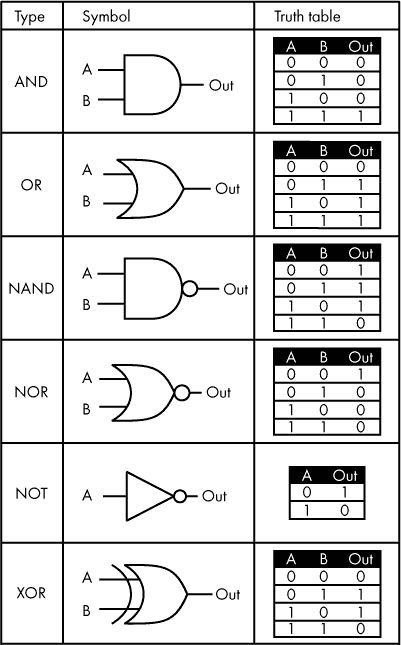

*图 4-10：常见逻辑门*

封装是一种贯穿现代技术的设计原则。当一个组件的设计者希望其他人能够轻松地使用他们的创作并在此基础上进行扩展，而无需完全理解其实现细节时，便使用了这种方法。该方法还允许在“盒子”内部进行改进，只要输入和输出行为保持不变，盒子就可以继续像以往一样使用。封装的另一个优势是，团队可以在一个大型项目中协作工作，项目的部分内容被封装起来。这使得个人不必了解每个组件的每一个细节。在本书中，逻辑门中的晶体管封装是封装的第一个例子，但随着我们继续前进，您会看到它在多个地方出现。

### 使用逻辑门设计

在第二章中，我们看到如何将多个逻辑运算符组合起来创建更复杂的逻辑语句。现在我们将这一思想扩展到逻辑门。一个逻辑语句或真值表一旦写好，就可以使用逻辑门在硬件中实现。我们现在将这一原理应用于我们之前创建的真值表（表 2-6），用于以下语句：

```
IF it is sunny AND warm, OR it is my birthday, THEN I am going to the beach.
```

我们将其简化为

```
(A AND B) OR C
```

现在让我们使用一个包含逻辑门的图表来表示这个语句，如图 4-11 所示。

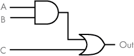

*图 4-11：用于 (A AND B) OR C 的逻辑门图*

如果 A 和 B 都是 1，那么 AND 门的输出将是 1。AND 门的输出连接到 OR 门的输入，并与 C 一起传入。如果 AND 的输出或 C 的值为 1，那么整体输出将是 1。

当我们以某种方式将逻辑门组合，使得输出仅仅是当前输入的函数时，电路被称为*组合逻辑*电路。也就是说，一组特定的当前输入将始终产生相同的输出。这与*时序逻辑*相对，后者的输出不仅取决于当前输入，还与过去的输入有关。我们将在本书后面讨论时序逻辑。现在，请尝试设计一个电路，表示练习 4-2 中描述的逻辑表达式。

**练习 4-2：使用逻辑门设计电路**

在第二章的练习 2-5 中，你为(A OR B) AND C 创建了真值表。现在，基于之前的工作，将这个真值表和逻辑表达式转换成电路图。绘制一个逻辑门图（类似于图 4-11 中的电路图），使用逻辑门来表示该电路。答案请参见附录 A。

### 集成电路

如前所述，很多公司生产并销售即用型数字逻辑门。硬件设计师可以购买这些逻辑门，开始构建他们的逻辑电路，而不必担心逻辑门电路的内部工作原理。这些逻辑门就是集成电路的一个例子。*集成电路（IC）*将多个元件集成在单片硅上，封装中具有外部电气接触点或*引脚*。IC 也被称为*芯片*。

本书主要介绍的是采用*双列直插封装（DIP）*的 IC，这是一种矩形外壳，具有两排平行的引脚。这些引脚的间距设计使其可以方便地用于面包板。制造商通过使用微小的晶体管来制造 IC，这些晶体管比之前在图 4-5 中展示的分立晶体管要小得多。*分立*元件是一种仅包含单一元件（如电阻器或晶体管）的电子设备。IC 能使电路更小、运作更快且成本低于由分立晶体管构建的同样电路。

我们之前讨论过的使用电阻器和晶体管的逻辑电路被称为电阻–晶体管逻辑（RTL）电路。制造商最初就是通过这种方式构建数字逻辑电路，但后来他们采用了其他方法，包括二极管–晶体管逻辑（DTL）和晶体管–晶体管逻辑（TTL）。7400 系列是最流行的 TTL 逻辑电路系列。这个集成电路系列包括逻辑门和其他数字元件。7400 系列及其后代自 1960 年代问世以来，依然是数字电路的标准。我将重点介绍 7400 系列，给你提供一些关于集成电路在实际应用中的例子。

让我们来看看一个具体的 7400 系列集成电路。7432 芯片，如图 4-12 所示，包含四个或门。

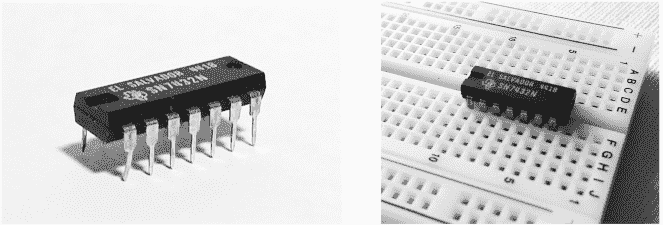

*图 4-12：SN7432N 集成电路，采用双列直插封装（两者），显示在面包板（右）上*

7432 集成电路采用 14 引脚封装。每个或门需要 3 个引脚，因此需要 12 个引脚，再加上 1 个引脚用于正电压（V[cc]），1 个引脚用于接地，最终得到 14 个引脚。说到电压，7400 系列的工作电压通常是 5V。也就是说，高电压，逻辑值 1，理想状态下为 5V，低电压则为 0V。然而，实际上，任何 2V 到 5V 之间的输入电压都被视为高电平，而任何 0V 到 0.8V 之间的输入电压都被视为低电平。

在图 4-12 中，您可以看到 7432 封装每边有 7 个引脚，并且可以整齐地插入面包板。在将此类芯片放入面包板时，请确保将芯片放置在面包板中心的间隙上，以确保直接相对的引脚（例如：引脚 1 和 14）不会被意外连接。请注意封装上的半圆形凹口；它可以帮助您确定芯片的正确方向，以便识别引脚。

在图 4-13 中，您可以看到该封装内部电路的排列。这里是一个*引脚图*——一个标注了组件电气接触点或引脚的图示。此类图示的目的是显示组件的外部连接点，但通常引脚图并不会记录电路的内部设计。

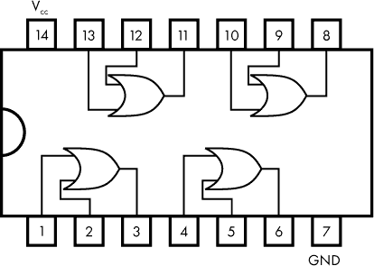

*图 4-13：显示 7432 集成电路引脚排列的引脚图*

假设您想使用 7432 芯片中的四个或门之一，并且选择了图 4-13 中引脚图左下角的那个与引脚 1、2 和 3 相连的或门。要使用这个门，您需要按照表 4-3 中所示的方式连接引脚。

**表 4-3：** 连接 7432 集成电路中的单个或门

| **引脚** | **连接** |
| --- | --- |
| 1 | 这是或门的 A 输入。连接 5V 或 GND，分别表示 1 或 0。 |
| 2 | 这是或门的 B 输入。连接 5V 或 GND，分别表示 1 或 0。 |
| 3 | 这是或门的输出。期望其为 5V 或 GND，分别表示 1 或 0。 |
| 7 | 连接到地。 |
| 14 | 连接到 5V 电源。 |

7400 系列包含数百个组件。我们在这里不会一一介绍，但在图 4-14 中，您可以看到该系列中四种常见逻辑门的引脚图。您也可以快速在线搜索，找到其他 7400 集成电路的引脚图。

凭借每个集成电路的引脚图，您现在掌握了物理构建您之前在练习 4-2 中设计的电路所需的知识。

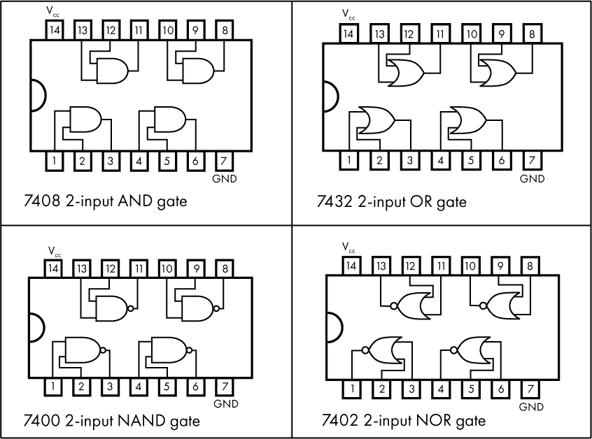

*图 4-14：7400 系列常见集成电路的引脚图*

**注意**

*请参见项目 #4 第 68 页，在那里您可以构建一个实现逻辑表达式 (A 或 B) 与 C 的电路*。

### 总结

在本章中，我们介绍了二进制数字电路，电路中我们使用电压水平表示逻辑 1 或 0。你学到了如何使用开关来构建逻辑运算符，例如与运算，在物理电路中。我们讨论了使用机械开关的局限性，并引入了一种新的电路元件，作为电控开关——晶体管。你了解了逻辑门，这是实现逻辑功能的电路元件。我们还介绍了集成电路，包括 7400 系列。

在下一章，我们将探索如何使用逻辑门来构建处理计算机基本功能之一——数学运算——的电路。你将看到，当简单的逻辑门组合在一起时，可以实现更复杂的功能。我们还将讨论计算机内部整数的表示方法，包括有符号和无符号数字。

**项目 #3：用晶体管构建逻辑运算符（与、或）**

在本项目中，你将使用晶体管构建逻辑与和逻辑或的物理电路。构建这些电路，你将需要以下元件：

+   面包板（可以是 400 点或 830 点型号）

+   电阻（各种电阻）

+   9 伏电池

+   9 伏电池夹连接器

+   5mm 或 3mm 红色 LED

+   跳线（设计用于面包板）

+   两个晶体管（型号为 2N2222，TO-92 封装[也叫 PN2222]）

请参见第 333 页的“购买电子元件”部分，获取如何购买这些部件的帮助。

在开始连接之前，你需要知道一些晶体管和集成电路是*静电敏感器件*，这意味着它们可能会被静电放电损坏。你是否曾在地毯上走动后，触摸某个物体时感受到静电冲击？那一阵电击可能对电子元件致命。即使是你自己感觉不到的微小静电放电，也可能损坏电子元件。

电子行业的专业人士通过佩戴接地腕带、在防静电工作区工作以及穿戴特殊服装来避免这个问题。大多数爱好者并不会采取这些预防措施，但你至少应该意识到静电放电可能会损坏你的晶体管或集成电路。尽量避免静电积聚，在处理静电敏感元件之前，触摸一个接地表面（如固定电源插座盖的螺丝）以释放任何静电。

现在让我们回到正在进行的项目。TO-92 封装的 2N2222 晶体管有三个引脚。如果你将晶体管的平面朝向自己，且引脚朝下，那么左边的引脚是发射极，中间的引脚是基极，右边的引脚是集电极（见图 4-5）。你还可以在网上搜索“2N2222 TO-92”获取更多关于此晶体管的详细信息。

按照 图 4-15 中的电路图，用 9 伏电池、晶体管、电阻器和 LED 来构建一个 AND 电路。

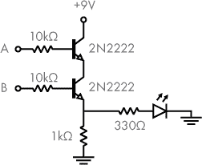

*图 4-15：带有建议电阻器、晶体管和输出 LED 的 AND 电路图*

A 和 B 应该连接到 9V（表示 1）或地线（表示 0）来测试输入。当预期输出为 1 时，LED 应该亮起。查看 表 4-1，该表格列出了各种输入组合对应的预期输出。记住，图中的 +9V 表示连接到电池的正极端子，而地线符号表示连接到电池的负极端子。另外，记得 LED 只允许电流朝一个方向流动，所以一定要把较短的引脚连接到地线。如果电路没有按预期工作，可以查看 “电路故障排除” 部分，见 第 340 页。

构建好的电路应该类似于 图 4-16 中的样子。当然，你在面包板上的零件布局可能与我的有所不同。

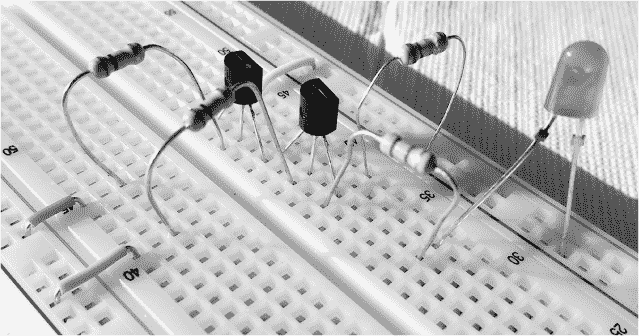

*图 4-16：在面包板上搭建的 图 4-15 中的 AND 电路*

一旦 AND 电路完成并且正常工作，我们就可以开始构建类似的 OR 电路。按照 图 4-17 中的电路图，用 9 伏电池、晶体管、电阻器和 LED 来搭建一个 OR 电路。

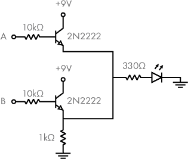

*图 4-17：带有建议电阻器、晶体管和输出 LED 的 OR 电路*

和之前的电路一样，A 和 B 应该连接到 9V（表示 1）或地线（表示 0）来测试输入。当预期输出为 1 时，LED 应该亮起。查看 表 4-2 以获取各种输入组合的预期输出。 **项目 #4：构建一个具有逻辑门的电路**

在 练习 4-2 中，你画出了 (A OR B) AND C 的电路图。如果你跳过了那个练习，我建议你回去完成它，然后再继续。结果应该类似于 图 4-18 中所示的电路图。

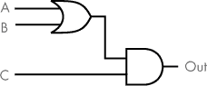

*图 4-18：逻辑门图，表示 (A OR B) AND C*

现在让我们开始实际构建电路吧！将输出引脚连接到 LED（记得同时加入电阻器），这样你就能看到输出是 0 还是 1。你的三个输入（A、B、C）可以直接连接到 5V 或地线。尝试连接不同的输入组合，以确保你的逻辑按预期工作。

本项目需要以下组件：

+   面包板

+   LED

+   一个用于 LED 的限流电阻器；约 220Ω

+   跳线

+   7408 集成电路（包含四个 AND 门）

+   7432 集成电路（包含四个 OR 门）

+   5 伏电源

+   三个适合面包板的按钮开关或滑动开关（用于加分项目）

+   三个 470Ω 电阻器（用于加分问题）

由于电路需要使用 5 伏电源，而不是 9 伏电池，请查看第 336 页的“为数字电路供电”部分，了解如何设置电源的几种选项。另外，如前所述，您也可以参考第 333 页的“购买电子元件”部分，了解如何获取这些零件。

您可能已经注意到，组件列表推荐使用 220Ω电阻，而不是我们之前使用的 330Ω电阻。这是因为我们将源电压从 9V 降到了 5V。电路所需的具体电阻值将取决于您使用的 LED 的正向电压，正如我们在第三章中讨论过的那样。尽管如此，这个电阻值不必非常精确。您可以使用 220Ω、200Ω或 180Ω电阻——这些值都很常见。图 4-19 中的接线图展示了如何构建该电路的详细信息。

请记住，一旦将芯片放置到面包板上，芯片的引脚会与整个一行电气连接。请确保将集成电路放置在面包板中央的间隙上，以确保彼此直接相对的引脚不会意外连接。如果电路是根据面包板搭建的，完成后的电路应该类似于图 4-20 中所示的照片。

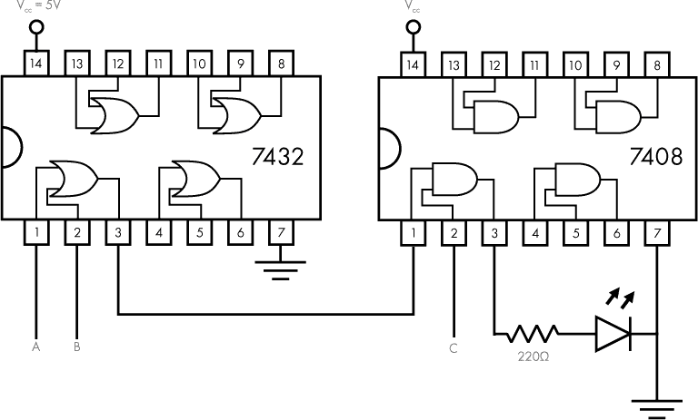

*图 4-19： (A 或 B) 与 C 的接线图*

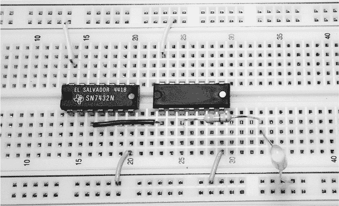

*图 4-20：带有 A、B 和 C 输入未连接的 (A 或 B) 与 C 的面包板实现*

请注意，在图 4-20 中，7432 集成电路位于左侧，而 7408 集成电路位于右侧。在这个布局中，顶部的电源列连接到 5V，底部的负电源列连接到地面，但这两者在照片中没有显示。同时注意，输入 A、B 和 C 在这里未连接；它们需要连接到地面或 5V，以测试不同的输入。

一旦您构建了这个电路，可以尝试连接输入的不同组合，以确保逻辑按预期工作。将输入连接到 5V 表示逻辑 1，连接到地面表示逻辑 0。根据表 4-4 中显示的 (A 或 B) 与 C 的真值表检查电路的行为。如果电路没有按预期工作，请查看第 340 页的“电路故障排除”部分。

**表 4-4：** (A 或 B) 与 C 的真值表

| **A** | **B** | **C** | **输出** |
| --- | --- | --- | --- |
| 0 | 0 | 0 | 0 |
| 0 | 0 | 1 | 0 |
| 0 | 1 | 0 | 0 |
| 0 | 1 | 1 | 1 |
| 1 | 0 | 0 | 0 |
| 1 | 0 | 1 | 1 |
| 1 | 1 | 0 | 0 |
| 1 | 1 | 1 | 1 |

手动将输入线在地和 5V 之间切换并不理想。更好的设计是将输入 A、B 和 C 连接到机械开关，这样你可以轻松改变输入，而不需要重新接线电路。作为一个附加项目，让我们添加一些机械开关来控制我们的输入。你的第一反应可能是将开关连接在输入和 V[cc] 之间，如图 4-21 所示，关闭开关时将输入连接到 5V，逻辑 1。


*图 4-21：V[cc] 和输入之间的开关。提示：不要这样做。*

不幸的是，图 4-21 中所示的方法有问题。闭合的开关按预期工作，但打开的开关则不然。你可能认为打开的开关会导致输入 A 处于 0V，但情况不一定如此。当开关打开时，输入 A 的电压会“漂浮”，是一个不可预测的值。记住，图 4-21 中的输入 A 代表的是 7432 或门的输入引脚。该输入设计用于连接高电压或低电压；如果不连接，它会使逻辑门处于未定义的状态。我们需要重新接线，使得当开关关闭时输入能够保持一个可预测的低电压。正如图 4-22 所示，我们可以使用*下拉电阻*来实现这一点——这是一种常规电阻，用于在输入未连接到高电压时将其“拉”到低电压。

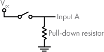

*图 4-22：使用下拉电阻确保数字输入正确。*

让我们考虑一下在图 4-22 所示添加下拉电阻时会发生什么。为了了解 7432 集成电路在不同条件下的输入响应，我们可以查阅制造商的数据手册中描述的电压和电流特性。我在这里不详细讨论（可以在线查找你具体的 7432 芯片的数据手册），但简而言之，当开关打开时，会有一小部分电流从输入 A 流过电阻器到地。

如果我们使用一个低阻值的电阻器，从输入 A 流过的电流会在输入端产生一个低电压，足以被识别为逻辑 0。当开关闭合时，输入直接连接到 V[cc]，输入将是逻辑 1。对于 74LS 系列元件（在附录 B 中讨论），470Ω 或 1kΩ 的下拉电阻通常适用于逻辑门输入。我推荐这些特定的值，因为它们常见且符合我们的要求。大于 1kΩ 的值不适合作为 74LS 元件的下拉电阻。当使用下拉电阻时，你可以按照图 4-23 所示构建带有开关的完整电路。

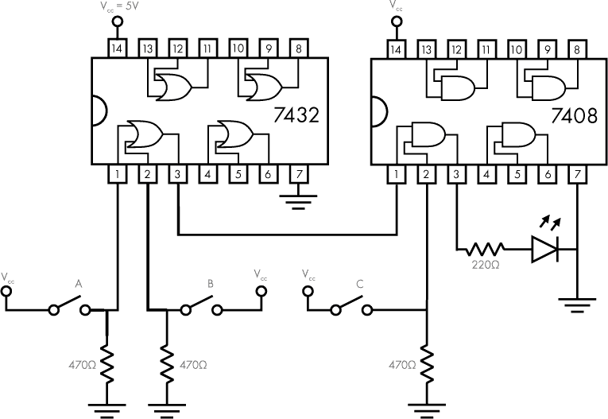

*图 4-23：控制输入的开关添加到 (A OR B) AND C 的接线图*

完成的电路，如果在面包板上搭建，将类似于图 4-24 中显示的照片。在我的电路中，我使用了按键作为开关，如左下角所示。如果你仔细观察，你可能会发现这张照片中的下拉电阻是 1kΩ，和图中的建议值 470Ω不同，但两者都可以使用。

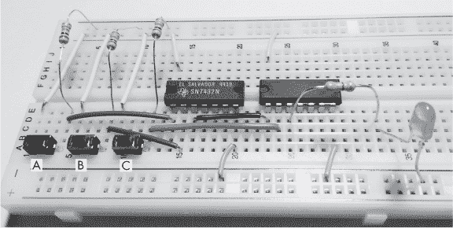

*图 4-24：面包板上实现的（A 或 B）与 C*

一旦你按照图 4-24 所示搭建了电路，一定要检查不同输入的组合，并查看它是否与表 4-4 中的（A 或 B）与 C 的真值表相符。如果电路没有按预期工作，请查看 “电路故障排除” 在第 340 页上的内容。
