## 第五章：数字电路中的数学**

在上一章中，我们介绍了逻辑门和数字电路，它们使我们能够在硬件中实现逻辑表达式。在本书的早些时候，我们将计算机定义为可以被编程执行一组指令的电子设备。在本章中，我将通过向你展示简单的逻辑门如何为计算机执行的操作铺平道路，来桥接这些概念。我们将讨论所有计算机都能执行的一个特定操作——加法。首先，我们将回顾二进制加法的基础知识。然后，我们使用逻辑门构建加法硬件，演示简单的逻辑门如何在计算机中协同工作以执行有用的操作。最后，我们将讨论整数在计算机中的有符号和无符号表示。

### 二进制加法

让我们来看一下二进制加法的基础。加法的基本原理在所有位置值系统中是相同的，因此你已经知道如何在十进制中加法，所以你有一定的基础！为了避免抽象的概念，我们来看一个具体的例子：加法两个特定的 4 位数 0010 和 0011，如图 5-1 所示。

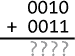

*图 5-1：加法两个二进制数*

就像在十进制中一样，我们从最右侧的位开始，称为*最低有效位*，并将两个值相加（图 5-2）。这里，0 + 1 等于 1。

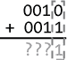

*图 5-2：加法两个二进制数的最低有效位*

现在让我们向左移动一位并将这些值相加，如图 5-3 所示。

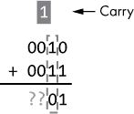

*图 5-3：加法中的二进制位*

如你在图 5-3 中看到的，这一位要求我们加 1 + 1，这给我们带来了一个有趣的转折。在十进制中，1 + 1 用符号 2 来表示，但在二进制中我们只有两个符号，0 和 1。在二进制中，1 + 1 是 10（详见第一章的解释），这需要两个比特来表示。我们只能在这一位放一个比特，所以 0 放在当前位，1 被进位到下一位，如图 5-3 所示。现在我们可以移到下一位（参见图 5-4），当我们加上这些比特时，必须包括从上一位进位的比特。这给我们 1 + 0 + 0 = 1。

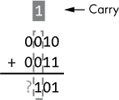

*图 5-4：加法四位数*

最后，我们加上*最高有效位*，如图 5-5 所示。

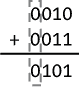

*图 5-5：加法八位数*

一旦我们加完所有位，完整的二进制结果是 0101。我们检查工作的一个方法是将所有内容转换为十进制，如图 5-6 所示。

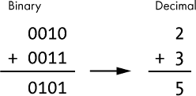

*图 5-6：加法二进制数，然后转换为十进制*

正如你在图 5-6 中看到的，我们的二进制答案（0101）与十进制（5）一致。很简单吧！

**练习 5-1：二进制加法练习**

现在你可以练习你刚学到的内容。尝试以下加法问题：

0001 + 0010 = ______

0011 + 0001 = ______

0101 + 0011 = ______

0111 + 0011 = ______

请参见附录 A 查找答案。

幸运的是，不管你使用的是哪个进制，加法的方式都是一样的。不同的进制唯一的区别是可用的符号数量。二进制使得加法特别简单，因为每个位的加法总是会产生两个输出位，每个输出位只有两个可能的值：

**输出 1**   一个 *和* 位（S），值为 0 或 1，表示加法操作结果的最低有效位

**输出 2**   一个 *进位输出* 位（C[out]）为 0 或 1

### 半加器

现在假设我们要构建一个数字电路，来加和两个二进制数的 *单个位*。我们最初关注的是最低有效位。对两个数的最低有效位进行加法只需要两个二进制输入（我们称之为 A 和 B），而二进制输出是一个和位（S）和一个进位输出位（C[out]）。我们称这样的电路为 *半加器*。图 5-7 显示了半加器的符号。

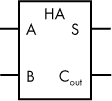

*图 5-7：半加器符号*

为了澄清半加器如何与我们之前添加两个二进制数的示例相适应，图 5-8 将这两个概念联系起来。

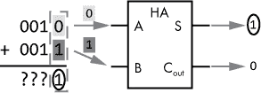

*图 5-8：半加器工作示意图*

如图 5-8 所示，第一个数字的最低有效位是输入 A，第二个数字的最低有效位是输入 B。和位是输出 S，进位输出也是输出。

在内部，半加器可以实现为一个组合逻辑电路，因此我们也可以用真值表来描述它，如表 5-1 所示。请注意，A 和 B 是输入，而 S 和 C[out] 是输出。

**表 5-1：半加器的真值表**

| **输入** | **输出** |
| --- | --- |
| **A** | **B** | **S** | **C[out]** |
| 0 | 0 | 0 | 0 |
| 0 | 1 | 1 | 0 |
| 1 | 0 | 1 | 0 |
| 1 | 1 | 0 | 1 |

让我们通过表 5-1 中的真值表进行讲解。将 0 和 0 相加的结果是 0，没有进位。将 0 和 1（或反之）相加的结果是 1，没有进位。将 1 和 1 相加的结果是 0，进位为 1。

现在，我们如何使用数字逻辑门来实现这一点呢？如果我们逐个检查输出，解决方案就很简单，如图 5-9 所示。

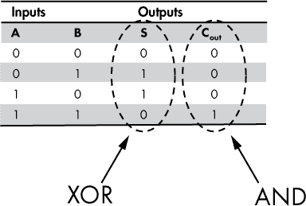

*图 5-9：半加器的真值表；输出与 XOR，AND 相匹配*

仅从图 5-9 中的输出 S 来看，我们可以看到它与异或门的真值表完全匹配（参见第四章）。仅从 C[out]来看，我们可以观察到它与与门的输出相匹配。因此，我们可以仅使用两个门：异或门和与门，来实现一个半加器，如图 5-10 所示。

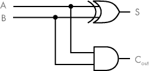

*图 5-10：用两个逻辑门（异或门和与门）实现的半加器*

如图 5-10 所示，数字输入 A 和 B 作为异或门和与门的输入。然后，这些门产生所需的输出 S 和 C[out]。

**注意**

*请参见项目 #5 在第 89 页，在那里你可以构建一个半加器的电路*。

### 全加器

半加器可以处理两位二进制数最低有效位的加法逻辑。然而，每一位之后的位需要一个额外的输入：进位输入 C[in]。这是因为除了最低有效位之外的每个位，都需要处理上一位加法结果产生的进位，这个进位会成为当前位的进位输入。为加法器组件添加一个 C[in]输入需要新的电路设计，我们将这个电路称为*全加器*。全加器的符号，如图 5-11 所示，类似于半加器的符号，唯一的区别是多了一个输入 C[in]。

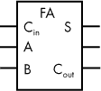

*图 5-11：全加器的符号*

在图 5-12 中，我们看到一个关于二进制加法和全加器之间关系的例子。

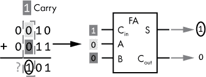

*图 5-12：全加器的工作过程*

全加器处理一个位的加法，包括进位输入位。在图 5-12 所示的例子中，我们加的是 4 位的数字。由于前一位的两个数字是 1 和 1，因此有一个进位输入 1。全加器接受所有三个输入（A = 0, B = 0, C[in] = 1），并输出 S = 1 和 C[out] = 0。

为了完整展示全加器的可能输入和输出，我们可以使用真值表，如表 5-2 所示。这个表有三个输入（A、B、C[in]）和两个输出（S、C[out]）。请花一点时间考虑各种输入组合下的输出。

**表 5-2：** 全加器真值表

| **输入** | **输出** |
| --- | --- |
| **A** | **B** | **C[in]** | **S** | **C[out]** |
| 0 | 0 | 0 | 0 | 0 |
| 0 | 0 | 1 | 1 | 0 |
| 0 | 1 | 0 | 1 | 0 |
| 0 | 1 | 1 | 0 | 1 |
| 1 | 0 | 0 | 1 | 0 |
| 1 | 0 | 1 | 0 | 1 |
| 1 | 1 | 0 | 0 | 1 |
| 1 | 1 | 1 | 1 | 1 |

那么，我们如何实现全加器呢？顾名思义，全加器可以通过将两个半加器结合来实现（见图 5-13）。

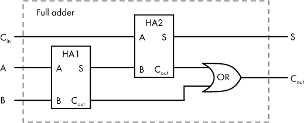

*图 5-13：由两个半加法器和一个 OR 门实现的全加法器电路*

一个全加法器的和输出（S）应该是 A 和 B 的和（我们可以使用一个半加法器 HA1 来计算）加上 C[in]（我们可以使用第二个半加法器 HA2 来计算），如 图 5-13 所示。

我们还需要全加法器输出一个进位位。这个实现起来很简单，因为如果任意半加法器的进位为 1，那么全加法器的 C[out] 值就为 1。因此，我们可以使用一个 OR 门来完成全加法器电路，如 图 5-13 所示。

这里我们看到另一个封装的例子。一旦这个电路构建完成，使用全加法器的功能时，就无需了解具体的实现细节。在下一部分，让我们看看如何将全加法器和半加法器结合起来，以便对多个位的数字进行加法运算。

### 一个 4 位加法器

一个全加法器允许我们加两个 1 位数字，再加上一个进位输入位。这样我们就可以构建一个电路模块，用于加多个数字位的二进制数。现在，让我们将多个 1 位加法器电路组合在一起，构建一个 4 位加法器。对于最低有效位，使用半加法器（因为它不需要进位输入），对于其他位使用全加法器。我们的思路是将加法器连接在一起，使每个加法器的进位输出流入下一个加法器的进位输入，正如 图 5-14 所示。

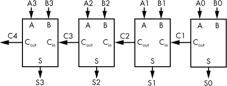

*图 5-14：一个 4 位加法器*

为了与人们书写数字的方式保持一致，我将 图 5-14 安排成最低有效位位于右侧，并且图表的流向是从右到左。这意味着我们的加法器框图将具有与之前显示的不同的输入和输出位置；不要因此而感到困惑！

在 图 5-15 中，我将之前提到的两个（0010）加三个（0011）应用到这个 4 位加法器中。

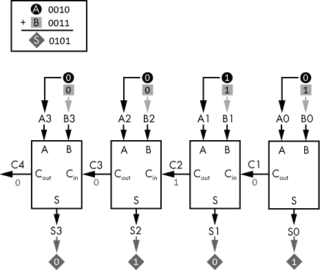

*图 5-15：4 位加法器的工作过程*

在 图 5-15 中，我们可以看到输入 A（0010）和输入 B（0011）中的每一位是如何依次传递到每个加法单元的，从右边的最低有效位开始，向左移动到最高有效位。你可以通过从右到左阅读图表，跟踪信号流动。首先加上最右侧的位，0（A0）和 1（B0）；结果是 1（S0）和进位 0。

最右侧加法器的输出进位位作为 C1 传递到下一个加法器，在这里，1（A1）和 1（B1）被相加，同时进位为 0。结果是 0（S1），并产生进位 1（C2）。该过程会继续，直到最左侧的加法器完成。最终结果是一组输出位，0101（S3 到 S0），以及进位 0（C4）。如果我们需要处理更多位的数字，可以通过简单地增加更多的全加法器来扩展 图 5-15 中的设计。

这种类型的加法器需要进位比特通过电路传播，或称为“波纹”传播。因此，我们称这种电路为*波纹进位加法器*。每个传播到下一个全加器的进位比特都会引入小的延迟，因此，将设计扩展到处理更多的比特会使电路变慢。直到所有进位比特有时间传播完毕，电路的输出才会准确。

7400 系列集成电路中有几种版本的 4 位加法器。如果你的项目需要一个 4 位加法器，你可以使用这样的集成电路，而不必通过单独的逻辑门来构建加法器。

让我们在这里暂停一下，思考我们刚才讨论的内容对更广泛的计算机应用有什么影响。是的，你学会了如何构建一个 4 位加法器，但这与计算机有什么关系呢？回想一下，计算机是可以编程的电子设备，能够执行一系列逻辑指令。这些指令包括数学运算，我们刚才看到，由晶体管构建的逻辑门可以组合在一起，执行其中的一个操作——加法。我们以加法为具体例子来说明计算机操作，虽然本书中我们不详细介绍，但你也可以使用逻辑门实现其他基本的计算机操作。这就是计算机的工作原理——简单的逻辑门通过协作来完成复杂的任务。

### 带符号数

到目前为止，在本章中我们只关注了正整数，但如果我们还想处理负整数该怎么办呢？首先，我们需要考虑如何在像计算机这样的数字系统中表示负数。正如你所知道的，计算机中的所有数据都是由一串 0 和 1 来表示的。负号既不是 0 也不是 1，因此我们需要采用一种约定来表示数字系统中的负值。在计算中，*带符号数*是一串比特，可以用来表示负数或正数，具体取决于这些比特的值。

一个数字系统的设计必须定义用于表示整数的比特数。通常，我们使用 8、16、32 或 64 个比特来表示整数。可以为其中一个比特分配来表示负号。例如，我们可以规定，如果最高有效位是 0，则该数为正数；如果最高有效位是 1，则该数为负数。剩余的比特用于表示数值的绝对值。这种方法被称为*带符号的大小表示法*。这种方法是可行的，但它要求系统设计增加额外的复杂性，以考虑那个具有特殊意义的符号位。例如，我们之前构建的加法器电路需要进行修改，以考虑符号位。

一种更好的计算机中表示负数的方法被称为*二进制补码*。在这个上下文中，一个数字的二进制补码表示该数字的负数。找到一个数字的二进制补码的最简单方法是将每个 1 替换为 0，每个 0 替换为 1（换句话说，翻转位），然后加上 1。稍微耐心一下，起初这看起来可能过于复杂，但如果你按照细节操作，它就会变得清晰。

让我们来看一个 4 位的例子，数字 5，或者在二进制中表示为 0101。图 5-16 展示了找到这个数字的二进制补码的过程。

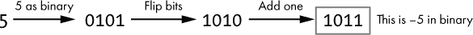

*图 5-16：找到 0101 的二进制补码*

首先，我们翻转位，然后加上 1，得到 1011 二进制。因此，在这个系统中，5 表示为 0101，而-5 表示为 1011。请记住，1011 仅在 4 位带符号数字的上下文中表示-5。这个二进制序列在不同的上下文中可能有不同的解释，正如我们稍后将看到的那样。如果我们想从负值开始，反向操作怎么办？过程是相同的，如图 5-17 所示。

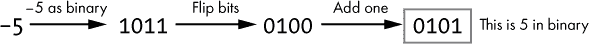

*图 5-17：找到 1011 的二进制补码*

正如你在图 5-17 中看到的，取-5 的二进制补码会让我们回到原来的 5。这是有道理的，因为-5 的负数是 5。

**练习 5-2：寻找二进制补码**

找到 6 的 4 位二进制补码。答案请参见附录 A。

现在我们知道如何使用二进制补码将数字表示为正数或负数，但这怎么有用呢？我认为看清这个系统的好处最简单的方式就是亲自试试。假设我们要加 7 和-3（即从 7 中减去 3）。我们期望结果是正数 4。首先让我们确定二进制形式的输入，如图 5-18 所示。

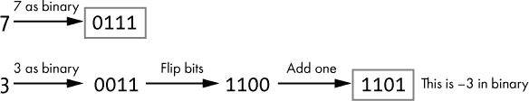

*图 5-18：找到 7 和-3 的 4 位二进制补码形式。*

我们的两个二进制输入将是 0111 和 1101。现在，暂时忘记我们正在处理的是正值和负值。只需将两个二进制数相加。不用担心这些位代表什么，直接加，准备好惊讶吧！做完二进制计算后，请查看图 5-19。

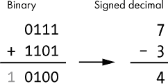

*图 5-19：两二进制数相加，作为带符号的十进制数解释*

正如你在图 5-19 中看到的，这个加法操作导致了超出 4 位数字能表示范围的进位位。我稍后会更详细地解释这个问题，但目前我们可以忽略那个进位位。这样我们得到的 4 位结果是 0100，表示正数 4，正是我们预期的数字！这就是二进制补码表示法的魅力所在。在加法或减法操作中，我们无需做任何特殊处理，它自然就能奏效。

让我们暂停一下，反思一下这意味着什么。还记得我们之前构建的加法电路吗？它们同样适用于负值！任何设计用来处理二进制加法的电路都可以使用二进制补码来处理负数或减法。详细的数学解释超出了本书的范围；如果你有兴趣，可以在网上找到很多好的解释。

**二进制补码术语**

“二进制补码”这个术语实际上指的是两个相关的概念。二进制补码是一种*表示法*，用于表示正整数和负整数。例如，数字 5，在 4 位二进制补码表示法中为 0101，而-5 表示为 1011。同时，二进制补码也是一种*运算*，用于取反存储在二进制补码格式中的整数。例如，取 0101 的二进制补码得到 1011。

另一种看待二进制补码表示法的方式是：最高有效位的权重等于该位的负值，而其他所有位的权重等于该位的正值。因此，对于一个 4 位数字，位的权重如图 5-20 所示。

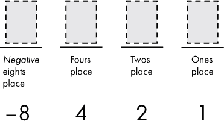

*图 5-20：使用二进制补码表示法的有符号 4 位数字的位值权重*

如果我们将这种方法应用于-3 的二进制补码表示（1101），则可以按照图 5-21 所示计算十进制值。

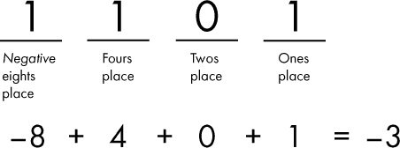

*图 5-21：使用二进制补码位权查找 1101 的有符号十进制值。*

在处理二进制补码时，我发现将最重要的位权看作该位的负值是一个方便的思维捷径。现在我们已经涵盖了 4 位有符号数的所有位的权重，我们可以检查这种数字所能表示的全部值范围，如表 5-3 所示。

**表 5-3：** 4 位有符号数的所有可能值

| **二进制** | **有符号十进制** |
| --- | --- |
| 0000 | 0 |
| 0001 | 1 |
| 0010 | 2 |
| 0011 | 3 |
| 0100 | 4 |
| 0101 | 5 |
| 0110 | 6 |
| 0111 | 7 |
| 1000 | –8 |
| 1001 | –7 |
| 1010 | –6 |
| 1011 | –5 |
| 1100 | –4 |
| 1101 | –3 |
| 1110 | –2 |
| 1111 | –1 |

根据表 5-3，我们可以观察到，对于一个 4 位有符号数，最大值是 7，最小负值是-8，总共有 16 个可能的值。请注意，每当最高有效位为 1 时，值就会是负数。我们可以将其概括为：对于一个*n*位有符号数：

+   最大值: (2^(*n*–1)) – 1

+   最小值: –(2^(*n*–1))

+   唯一值的个数: 2^(*n*)

所以，对于一个 8 位有符号数（举例来说），我们可以发现

+   最大值 = 127

+   最小值 = –128

+   唯一值的个数 = 256

### 无符号数

使用二进制补码表示负值的带符号整数，是处理负数的一种便捷方式，无需专用的加法器硬件。我们之前讲解的加法器同样适用于负值，就像它适用于正值一样。然而，在计算中，某些情况下负值根本不需要，若我们将数字视为带符号的，那么大约有一半的值区间将被浪费（所有负值都不使用），同时最大值也会被限制为本应能表示的值的一半。因此，在这种情况下，我们希望将数字视为*无符号*，即比特序列始终表示一个正值或零，但绝不表示负值。

再次查看一个 4 位数字，表 5-4 展示了如果我们将其解释为带符号或无符号时，每个 4 位二进制值所代表的内容。

**表 5-4：** 一个 4 位数字的所有可能值，带符号或无符号

| **二进制** | **带符号十进制** | **无符号十进制** |
| --- | --- | --- |
| 0000 | 0 | 0 |
| 0001 | 1 | 1 |
| 0010 | 2 | 2 |
| 0011 | 3 | 3 |
| 0100 | 4 | 4 |
| 0101 | 5 | 5 |
| 0110 | 6 | 6 |
| 0111 | 7 | 7 |
| 1000 | –8 | 8 |
| 1001 | –7 | 9 |
| 1010 | –6 | 10 |
| 1011 | –5 | 11 |
| 1100 | –4 | 12 |
| 1101 | –3 | 13 |
| 1110 | –2 | 14 |
| 1111 | –1 | 15 |

我们可以为 *n* 位无符号数做出以下概括：

+   最大值： (2^(*n*)) – 1

+   最小值：0

+   唯一值的个数：2^(*n*)

那么，我们来看一个例子，4 位值 1011。查看表 5-4，它代表什么？是代表 –5 还是 11？答案是“取决于情况！”它可以代表 –5 或 11，取决于上下文。从加法器电路的角度来看，这无关紧要。对加法器而言，4 位值就是 1011。无论执行什么加法运算，过程是一样的，唯一的区别是我们如何解释结果。我们来看一个例子。在图 5-22 中，我们将两个二进制数 1011 和 0010 相加。

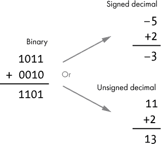

*图 5-22：加法运算的两个二进制数，解释为带符号或无符号*

如图 5-22 所示，添加这两个二进制数的结果是 1101，无论我们是在处理带符号数还是无符号数。计算完成后，我们可以决定如何解释这个结果。我们要么认为是将 –5 和 2 相加，结果为 –3，要么认为是将 11 和 2 相加，结果为 13。在这两种情况下，数学运算都没有问题，问题只是出在如何解释结果！在计算机科学中，正确解释加法运算结果是带符号还是无符号的责任归程序。

**习题 5-3：加两个二进制数并解释为带符号和无符号**

将 1000 与 0110 相加。将你的结果解释为有符号数。然后将其解释为无符号数。结果是否有意义？请参阅附录 A 以获得答案。

到目前为止，我们大多数情况下忽略了最重要的进位输出位，但它有一个需要理解的意义。对于无符号数，进位输出为 1 意味着发生了*整数溢出*。换句话说，结果太大，无法用分配给整数的位数表示。对于有符号数，如果最重要的进位输入位不等于最重要的进位输出位，则发生了溢出。对于有符号数，如果最重要的进位输入位等于最重要的进位输出位，则没有发生溢出，进位输出位可以被忽略。

整数溢出是计算机程序中的一种错误来源。如果程序没有检查是否发生了溢出，那么加法运算的结果可能会被错误地解释，导致意外的行为。一个著名的整数溢出错误出现在街机游戏《吃豆人》中。当玩家到达 256 级时，屏幕的右侧会充满乱码图形。发生这种情况是因为级别数被存储为 8 位无符号整数，当它的最大值 255 加 1 时发生了溢出。游戏的逻辑没有考虑到这种情况，从而导致了这个故障。

### 总结

在本章中，我们使用加法作为计算机如何基于逻辑门进行复杂任务的示例。你学习了如何在二进制中进行加法，以及如何从逻辑门构建能够进行二进制加法的硬件。你看到了半加器如何对 2 位进行加法并生成和与进位输出位，而全加器可以对 2 位加上进位输入位进行加法。我们讨论了如何将单比特加法器组合起来进行多比特加法。你还学习了计算机中整数是如何使用有符号和无符号数字表示的。

在下一章中，我们将超越组合逻辑电路，学习顺序逻辑。使用顺序逻辑，硬件可以具有存储功能，允许存储和检索数据。你将看到如何构建存储电路。我们还将介绍时钟信号，这是一种同步计算机系统中多个组件状态的方法。

**项目 #5：构建一个半加器**

在这个项目中，你将使用异或门和与门构建一个半加器。输入将通过开关或按钮控制。输出应连接到 LED，以便轻松观察其状态。这个项目需要以下组件：

+   面包板

+   两个 LED

+   两个限流电阻，用于 LED（大约 220Ω）

+   跳线

+   7408 集成电路（包含四个与门）

+   7486 集成电路（包含四个异或门）

+   两个适合面包板的按钮或开关

+   两个 470Ω电阻

+   5 伏电源

提醒一下，如果你需要有关这些主题的帮助，请参见“购买电子元件”一节，第 333 页和“为数字电路供电”一节，第 336 页。有关 7408 IC 引脚编号的回顾，请参见图 4-14。7486 IC 之前没有涉及，因此在此我将它的引脚图包含在图 5-23 中。

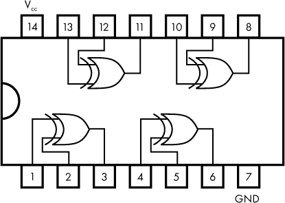

*图 5-23：7486 XOR 集成电路的引脚图*

图 5-24 提供了半加器的接线图。继续阅读图示后面的内容，了解如何构建这个电路的更多细节。

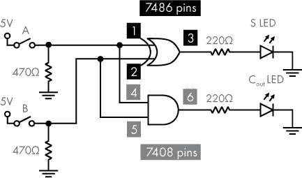

*图 5-24：由 XOR 和 AND 门构建的半加器*

图 5-24 展示了开关的连接，带有下拉电阻，以及 LED 的连接，带有限流电阻。还请注意 7486 和 7408 IC 上的引脚编号，显示在方框内。注意连接 A 和 B 到电阻和 IC 的电线上的黑点。黑点表示连接点——例如，开关 A、470Ω电阻、7486 IC 的引脚 1 和 7408 IC 的引脚 4 都连接在一起。不要忘记将 7486 和 7408 IC 分别通过引脚 14 和 7 连接到 5V 和地（这在图 5-24 中没有显示）。

图 5-25 展示了当这个电路在面包板上实现时的样子。

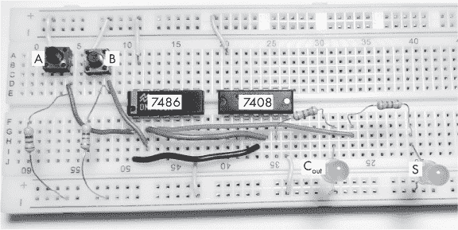

*图 5-25：由 XOR 和 AND 门构建的半加器*

一旦你完成了这个电路的构建，尝试所有 A 和 B 的输入组合，以确认输出符合预期值，如半加器真值表中所示（表 5-1）。
