# 第六章：**内存与时钟信号**

在前几章中，我们看到如何将数字逻辑门组合起来，产生有用的组合逻辑电路，其中输出是输入的函数。在本章中，我们将讨论时序逻辑电路。这些电路具有内存，可以存储过去的记录。我们将介绍一些特定类型的内存设备：锁存器和触发器。我们还将了解时钟信号，这是一种同步多个电路组件的方法。

### 时序逻辑电路与内存

现在让我们来研究一种数字电路，称为*时序逻辑电路*。时序逻辑电路的输出不仅取决于当前的输入集，还取决于电路的过去输入。换句话说，时序逻辑电路对自身的历史或状态有一定的记忆。数字设备通过一种叫做*内存*的组件来存储过去的状态，这个组件允许存储和检索二进制数据。

让我们考虑一个简单的时序逻辑示例：一个投币式自动售货机。自动售货机至少有两个输入：一个投币口和一个售货按钮。为了简化起见，假设自动售货机只售卖一种商品，并且该商品的价格是一个硬币。售货按钮只有在投币后才会起作用。如果自动售货机是基于*组合逻辑*的，那么状态仅由当前输入决定，那么投币必须在按下售货按钮的同时完成。

幸运的是，自动售货机并不是这样工作的！它们有内存，可以记录是否已插入硬币。当我们按下售货按钮时，自动售货机中的时序逻辑会检查其内存，看是否之前已插入硬币。如果是，机器就会发放商品。我们将在本章后面进一步探讨这个时序逻辑示例。

时序逻辑之所以可能，是因为有了内存。内存存储二进制数据，并且其存储容量以位或字节为单位来衡量。现代计算设备，如智能手机，通常至少有 1GB 的内存。那可是超过 80 亿位！让我们从一个简单的设备开始：一个只有 1 位内存的存储设备。

### SR 锁存器

*锁存器*是一种记住 1 位的内存设备。*SR 锁存器*有两个输入：S（设定）和 R（复位），以及一个输出 Q，表示“记住”的单个位。当 S 设置为 1 时，输出 Q 也变为 1。当 S 变为 0 时，Q 保持为 1，因为锁存器记住了这个之前的输入。这就是内存的本质——组件记住了一个先前的输入，即使该输入发生变化。当 R 设置为 1 时，这是一个复位/清除内存位的指示，因此输出 Q 变为 0。即使 R 返回到 0，Q 也会保持为 0。

我们在表 6-1 中总结了 SR 锁存器的行为。

**表 6-1：** SR 锁存器的操作

| **S** | **R** | **Q (输出)** | **操作** |
| --- | --- | --- | --- |
| 0 | 0 | 保持先前值 | 保持 |
| 0 | 1 | 0 | 重置 |
| 1 | 0 | 1 | 设置 |
| 1 | 1 | X | 无效 |

根据设计，同时将 S 和 R 都设置为 1 是一个无效输入，在这种情况下 Q 的值是未定义的。实际上，尝试这样做会导致 Q 变为 1 或 0，但我们无法可靠地说出是哪一个。而且，试图同时设置和重置触发器是没有意义的。SR 触发器的电路符号见图 6-1。

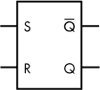

*图 6-1：SR 触发器的电路符号*

在图 6-1 中，有一个额外的输出：Q。将其理解为“Q 的补码”，“非 Q”，或“Q 的反转”。它只是 Q 的相反值。当 Q 为 1 时，Q 为 0，反之亦然。拥有 Q 和 Q 两个输出是很有用的，正如你将看到的，这种电路的设计本身就适合包括这个输出，且无需额外努力。

我们可以通过仅使用两个 NOR 门和一些电线简单实现 SR 触发器。也就是说，理解设计的工作原理需要一些思考。考虑图 6-2 所示的电路，它是 SR 触发器的实现。

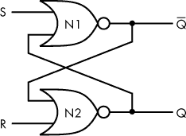

*图 6-2：通过交叉耦合的 NOR 门实现的 SR 触发器*

在图 6-2 中，我们有两个 NOR 门，采用的是*交叉耦合配置*。提醒一下，NOR 门只有在两个输入都是 0 时才输出 1；否则，它输出 0。N1 的输出送入 N2 的输入，而 N2 的输出送入 N1 的输入。输入是 S 和 R，输出是 Q 和 Q。让我们通过激活和清除各种输入来检查电路如何工作，并在过程中检查输出。假设最初 S 为 0，R 为 1。

*图 6-3：SR 触发器，初始状态*

**初始状态 (S = 0, R = 1)**

1.  R = 1，因此 N2 的输出为 0。

1.  N2 的输出送入 N1。

1.  S = 0，因此 N1 的输出为 1。

1.  初始时，Q = 0。

总结：当 R 变高时，输出变低（见图 6-3）。

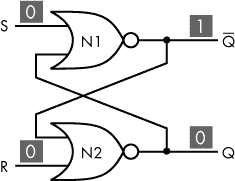

*图 6-4：SR 触发器，输入为低*

**接下来，清除所有输入 (S = 0, R = 0)**

1.  R 变为 0。

1.  N2 的另一个输入仍然是 1，因此 N2 的输出仍然是 0。

1.  因此，Q 仍然等于 0。

总结：电路记住了之前的输出状态（见图 6-4）。

*图 6-5：SR 触发器，S 变高*

**接下来，激活 S 输入 (S = 1, R = 0)**

1.  S 变为 1。

1.  这导致 N1 的输出为 0。

1.  N2 的输入现在是 0 和 0，因此 N2 的输出为 1。

1.  因此，Q 现在等于 1。

总结：将 S 设置为高会导致输出为高（见图 6-5）。

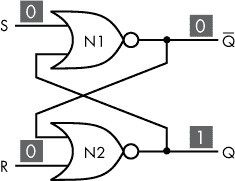

*图 6-6：SR 触发器，S 变低*

**最后，再次清除所有输入 (S = 0, R = 0)**

1.  S 变为 0。

1.  N1 的另一个输入仍然是 1，因此 N1 的输出仍然是 0。

1.  N2 的输入没有改变。

1.  因此，Q 仍然等于 1。

总结：电路记住了之前的输出状态（见图 6-6）。

将这些信息整合起来，我们刚刚描述了 SR 锁存器的预期行为，如表 6-1 中之前总结的。当 S（设置）为 1 时，输出 Q 为 1，并且即使 S 返回为 0，Q 也会保持为 1。当 R（重置）为 1 时，输出 Q 为 0，并且即使 R 返回为 0，Q 也会保持为 0。通过这种方式，电路记住了 1 或 0，因此我们有一个 1 位内存的设备！尽管有两个输出（Q 和 Q），它们只是同一存储位的不同表示。记住，同时将 S = 1 和 R = 1 设置为输入是无效的。

为了理解 SR 锁存器的行为，我们已经看过了当输入保持为高电平再变为低电平时电路的表现。然而，S 和 R 通常只需要“脉冲”一下。当电路处于静止状态时，S 和 R 都为低电平。当我们想改变其状态时，不需要长时间保持 S 或 R 为高电平；我们只需要快速将其设置为高电平，再返回低电平——一个简单的输入脉冲。

**通用逻辑门**

我们刚刚展示了如何使用 NOR 门构建 SR 锁存器。事实上，NOR 门可以用来创建任何其他逻辑电路，而不仅仅是 SR 锁存器。NOR 门被称为*通用逻辑门*；它可以用来实现任何逻辑功能。NAND 门也是如此。

现在我们已经研究了 SR 锁存器的内部设计，我们可以选择回到使用图 6-1 中的符号来表示 SR 锁存器。当我们这样做时，我们不再需要关心锁存器的内部结构。这是封装的另一个例子！我们将一个设计放入“黑盒子”中，这使得使用该设计变得更简单，而无需担心内部细节。我发现将 SR 锁存器简单地理解为一个 1 位内存设备是很有帮助的：它有一个 Q 状态，值为 1 或 0。S 输入将 Q 设置为 1，R 输入将 Q 重置为 0。

**注意**

*请参见项目 #6（在第 104 页上），您可以在那里构建一个 SR 锁存器*。

### 在电路中使用 SR 锁存器

现在我们有了一个基本的存储设备——SR 锁存器，让我们在一个示例电路中使用它。让我们回到自动售货机的例子，设计一个使用锁存器的自动售货机电路。该电路有以下要求：

+   电路有两个输入：一个 COIN 按钮和一个 VEND 按钮。按下 COIN 表示插入硬币，按下 VEND 则使机器售出物品（电路将点亮一个 LED 表示物品正在售出）。

+   电路有两个 LED 输出：COIN LED 和 VEND LED。插入硬币时，COIN LED 亮起；VEND LED 亮起表示物品正在售出。

+   机器在插入硬币之前不会售出物品。

+   为了简单起见，假设每次只能投入一枚硬币。投入额外的硬币不会改变电路的状态。

+   通常，在完成售货操作后，我们期望电路能够重置，并恢复到“无硬币”状态。然而，为了简化设计，我们将跳过自动重置，而采用手动重置。

从概念上讲，我们的自动售货机电路将按图 6-7 所示实现。

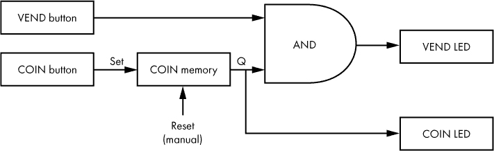

*图 6-7：概念性的自动售货机电路，带手动重置*

让我们来一步步解析图 6-7。当你按下 COIN 按钮时，COIN 存储器（一个 SR 触发器）会记录硬币已被投放的事实。然后，存储器输出 1，表示硬币已被投放，COIN LED 亮起。当你按下 VEND 按钮时，如果之前已经投放了硬币，与门的输出为 1，VEND LED 亮起。另一方面，如果你在没有投币的情况下按下 VEND 按钮，什么也不会发生。要清除 COIN LED 并重置设备，你必须手动将 Reset 输入设置为 1。

**注意**

*请参阅项目 #7 在第 105 页，您可以在此处构建刚刚描述的自动售货机电路*。

这个基本的自动售货机电路展示了在电路中实际使用存储器的应用。由于我们的电路设计包括一个存储元件，因此 VEND 按钮的行为会根据是否曾投放过硬币而有所不同。然而，一旦 COIN 位在存储器中被设置，它将一直保持直到电路被手动重置。这并不理想，因此我们将更新电路，使其在售货操作完成后自动重置。

一旦机器完成售货操作，我们期望 COIN 位被重置为 0，因为售货的行为“消耗”了硬币。换句话说，售货操作也应该导致硬币存储器的重置。为了实现这一逻辑，我们可以将与门的输出连接到存储器重置，如图 6-8 所示。这样，当 VEND LED 亮起时，COIN 存储器会被重置。

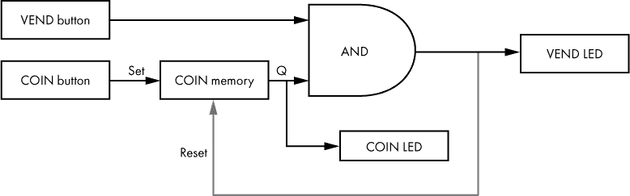

*图 6-8：概念性的自动售货机电路，带自动重置*

如图 6-8 所示的系统将在售货过程中重置电路，但此设计存在一个问题。你能找出来吗？问题可能并不显而易见。如果你完成了上一个项目，可能想在刚刚构建的电路上尝试这种重置方式。将一根电线从与门的输出端连接到 SR 触发器的 R 输入端，按下 COIN 按钮，再按下 VEND 按钮。以下有剧透，除非你已经在脑中或在面包板上试过，否则请不要继续阅读！

问题在于，虽然复位按预期工作，但它发生得非常迅速，以至于 VEND LED 立即熄灭，或者更可能是，VEND LED 根本没有亮起。在这里，我们有一个技术上可行但执行过快的设计例子，以至于设备的用户无法看到发生了什么。这在用户界面设计中是一个相当常见的问题。我们构建的设备和程序通常运行得太快，以至于必须故意减慢一些速度，以便用户能跟得上。在这种情况下，一种解决方案是在线路上引入延迟，使得 VEND LED 能够在复位发生之前点亮一到两秒钟。这在图 6-9 中展示了出来。

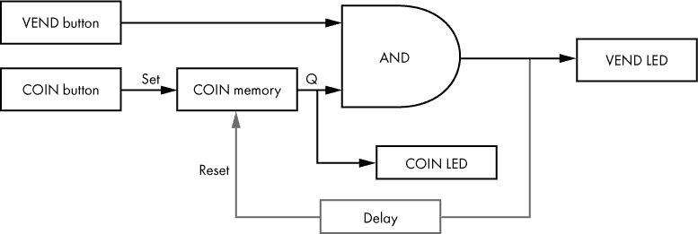

*图 6-9：概念性自动售货机电路与自动延迟复位*

我们如何添加延迟呢？一种方法是使用电容器。*电容器*是一种储存能量的电气元件。它有两个端子。当电流流向电容器时，电容器充电。电容器储存电荷的能力叫做*电容*，其单位是*法拉*（farads）。1 法拉是一个非常大的数值，所以我们通常用*微法*（μF）来表示电容器的容量。

当电容器没有充电时，它就像是一个短路。一旦电容器充电，它就像是一个开路。电容器充电或放电的时间由电容器的电容值和电路中的电阻决定。更大的电容和电阻值会导致电容器需要更长时间才能充电。所以我们可以使用电容器和电阻器来引入电路中的延迟，这是由于电容器充电所需的时间。

**注意**

*请参见项目 #8 在第 107 页，在这里你可以为自动售货机电路添加延迟复位功能*。

到目前为止，在本章中我们只探讨了单比特设备的存储。虽然 1 比特的内存适用性有限，但在第七章中，我们将看到如何利用多个单比特内存单元结合起来表示更多的数据。

### 时钟信号

随着电路变得更加复杂，我们通常需要保持各种元素同步，以确保它们能同时改变状态。对于具有多个内存设备的电路，我们可能需要确保所有存储的比特可以同时设置。特别是在我们需要一起考虑一组比特时，这一点尤为重要。我们可以用时钟信号来同步多个电路组件。*时钟信号*，简称*时钟*，其电压水平在高低之间交替。通常，信号按照规则的节奏交替，其中信号的一半时间是高电平，另一半时间是低电平。我们称这种类型的信号为*方波*。图 6-10 展示了一个 5V 的方波时钟信号在时间上的图像。

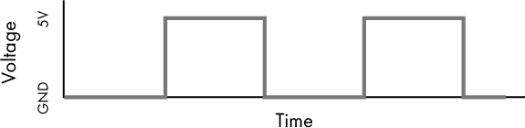

*图 6-10：一个 5V 方波时钟信号*

电压上升和下降的单次迭代叫做一个*脉冲*。从低到高再回到低（或反之）的完整振荡叫做一个*周期*。我们用每秒钟的周期数来衡量时钟信号的*频率*，单位是*赫兹（Hz）*。在图 6-11 中，显示的时钟信号频率是 2Hz，因为该信号在一秒钟内完成了两次完整的振荡。

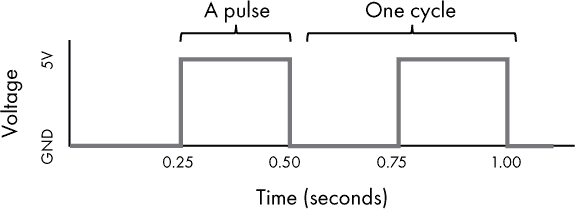

*图 6-11：2Hz 时钟信号*

当电路使用时钟时，所有需要同步的组件都连接到时钟。每个组件的设计都允许仅在时钟脉冲发生时才进行状态变化。时钟驱动的组件通常会在脉冲的上升沿或下降沿触发状态变化。一个在上升脉冲边缘变化状态的组件称为*正沿触发*，而一个在下降脉冲边缘变化状态的组件称为*负沿触发*。图 6-12 提供了一个上升沿和下降沿的例子。

*图 6-12：脉冲边缘示意图*

本书中的图形将脉冲边缘表示为垂直线；这意味着从低到高或反之的瞬时变化。然而，实际上，状态的变化是需要时间的，但为了简化讨论，我们假设状态变化是瞬时发生的。

**注意**

*请参阅项目#9 在第 109 页，你可以将你的 SR 触发器用作手动时钟。*

### JK 触发器

使用时钟的 1 位存储设备叫做*触发器*。术语*latch*和*触发器*有时会有些重叠，但在这里我们使用*latch*来指没有时钟的存储设备，使用*触发器*来指带时钟的存储设备。你可能会看到这些术语在其他地方互换使用或有不同的含义。

让我们来看看一个特定的时钟记忆设备——*JK 触发器*。JK 触发器是 SR 触发器的概念性扩展，因此我们可以将它们进行比较。SR 触发器有输入 S 来设置存储位，输入 R 来重置存储位；类似地，JK 触发器有输入 J 来设置，输入 K 来重置。SR 触发器在 S 或 R 被设为高电平时立即改变状态，而 JK 触发器只有在时钟脉冲时才会改变状态。JK 触发器还增加了一个附加功能：当 J 和 K 都设为高电平时，输出会在低到高或高到低之间切换一次。这一点在表 6-2 中做了总结。

**表 6-2：** SR 触发器与 JK 触发器的比较

|  | **SR 触发器** | **JK 触发器** |
| --- | --- | --- |
| **状态变化** | 当 S 或 R 为高时立即改变 | 只有在时钟脉冲时，J 或 K 为高时才改变 |
| **设置** | S = 1 | J = 1 |
| **重置** | R = 1 | K = 1 |
| **切换** | 不适用 | J = 1 且 K = 1 |

在图示中表示 JK 触发器时，可以使用图 6-13 中的符号。

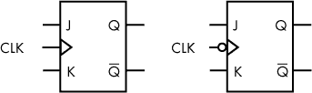

*图 6-13：JK 翻转触发器，正边缘触发（左），负边缘触发（右）*

图 6-13 显示了两种版本的 JK 翻转触发器。左侧的是正边缘触发式，意味着它在时钟脉冲的上升沿发生状态变化。右侧的是负边缘触发式的 JK 翻转触发器（注意 CLK 输入上的圆圈）；它在时钟脉冲的下降沿发生状态变化。除此之外，这两个设备的行为完全相同。

因此，JK 翻转触发器是一个 1 位存储设备，只有在接收到时钟脉冲时才会改变状态。它与 SR 锁存器非常相似，唯一的区别是它的状态变化由时钟控制，并且能够切换其值。表 6-3 总结了 JK 翻转触发器的行为。

**表 6-3：** JK 翻转触发器功能总结

| **J** | **K** | **时钟** | **Q（输出）** | **操作** |
| --- | --- | --- | --- | --- |
| 0 | 0 | 脉冲 | 保持先前值 | 保持 |
| 0 | 1 | 脉冲 | 0 | 复位 |
| 1 | 0 | 脉冲 | 1 | 置位 |
| 1 | 1 | 脉冲 | 上一个值的反向 | 切换 |

我们不会像在 SR 锁存器中那样逐步讲解 JK 翻转触发器。相反，理解 JK 翻转触发器的最佳方法是直接操作它。

**注意**

*请参见项目 #10，该项目位于第 111 页，你可以在其中动手操作 JK 翻转触发器*。

### T 翻转触发器

将 J 和 K 连接并将其视为一个输入，创建一个在时钟脉冲到来时只执行两种操作之一的翻转触发器：它要么切换，要么保持其值。要理解为什么会这样，请查看表 6-3，并注意当 J 和 K 都为 0 或者都为 1 时的行为。将 J 和 K 连接是一种常用的技术，具有这种行为的翻转触发器叫做 *T 翻转触发器*。图 6-14 显示了 T 翻转触发器的符号。

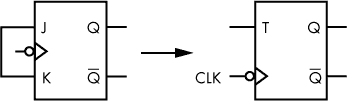

*图 6-14：J 和 K 连接的 JK 翻转触发器被称为 T 翻转触发器*。

因此，T 翻转触发器只会在时钟脉冲时切换其值，当 T 为 1 时。表 6-4 总结了 T 翻转触发器的行为。

**表 6-4：** T 翻转触发器功能总结

| **T** | **时钟** | **Q** | **操作** |
| --- | --- | --- | --- |
| 0 | 脉冲 | 保持先前值 | 保持 |
| 1 | 脉冲 | 上一个值的反向 | 切换 |

### 在 3 位计数器中使用时钟

为了说明时钟在电路中的应用，让我们构建一个 3 位计数器——一个二进制从 0 到 7 计数的电路。这个电路有三个存储元件，每个元件代表一个 3 位数字的一位。电路接受时钟输入，当时钟脉冲发生时，3 位数字会递增（增加 1）。由于所有位都代表一个数字，因此重要的是我们要使它们的状态变化与时钟同步。让我们使用 T 翻转触发器来实现这一点。

首先，查看表 6-5，复习一下如何使用 3 位数字进行二进制计数。

**表 6-5：** 使用 3 位进行二进制计数

| **二进制** | **十进制** |
| --- | --- |
| 000 | 0 |
| 001 | 1 |
| 010 | 2 |
| 011 | 3 |
| 100 | 4 |
| 101 | 5 |
| 110 | 6 |
| 111 | 7 |

表 6-5 将我们的 3 位数字作为每一行的单一值展示。现在，我们将每一位分配给标记为 Q0、Q1 和 Q2 的内存元素。Q0 是最不重要的位，Q2 是最重要的位，如表 6-6 所示。

**表 6-6：** 二进制计数，每一位分配给一个单独的内存元素

| **所有 3 位** | **Q2** | **Q1** | **Q0** | **十进制** |
| --- | --- | --- | --- | --- |
| 000 | 0 | 0 | 0 | 0 |
| 001 | 0 | 0 | 1 | 1 |
| 010 | 0 | 1 | 0 | 2 |
| 011 | 0 | 1 | 1 | 3 |
| 100 | 1 | 0 | 0 | 4 |
| 101 | 1 | 0 | 1 | 5 |
| 110 | 1 | 1 | 0 | 6 |
| 111 | 1 | 1 | 1 | 7 |

如果我们单独查看表 6-6 中的 Q 列，就能看到一个模式。当我们计数时，Q0 每次都会切换。当 Q0 之前是 1 时，Q1 才会切换。当 Q0 和 Q1 都是 1 时，Q2 才会切换。换句话说，除了 Q0，每一位在下一个计数时会在前面的所有位为 1 时切换。T 触发器非常适合实现这个计数器，因为它们正是用于切换的！让我们看看如何构建一个电路来实现这个功能，如图 6-15 所示。

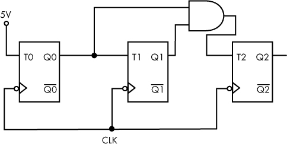

*图 6-15：由 T 触发器构建的 3 位计数器*

在图 6-15 中，所有三个 T 触发器使用相同的时钟信号，因此它们是同步的。T0 连接到 5V，因此 Q0 每次时钟脉冲时都会切换。T1 连接到 Q0，因此只有当 Q0 为高电平时，时钟脉冲才会使 Q1 切换。T2 连接到 Q0 和 Q1，因此当 Q0 和 Q1 都为高电平时，时钟脉冲才会使 Q2 切换。

**注**

*请参见项目 #11 以及第 113 页，在这里你可以构建你自己的 3 位计数器*。

想一想我们如何将这样的计数器与我们之前设计的自动售货机电路结合使用。我们可以不单纯地跟踪是否投币，而是跟踪投币的数量，至少可以跟踪到七个硬币！为了使自动售货机计数器有用，它还需要能够进行倒计数，因为售卖商品应该减少硬币数量。这里我不会详细讲解如何将计数器添加到自动售货机电路中，但你可以自己进行实验。网上有计数器电路的设计，可以进行加法和减法计数，或者你可以使用像 74191 这样的加/减计数器 IC。

我们已经从 T 触发器构建了一个计数器，而 T 触发器又是由 JK 触发器构建的，JK 触发器是基于晶体管的数字逻辑电路！这再次展示了封装如何使我们能够构建复杂的系统，同时隐藏细节。

### 总结

本章内容介绍了顺序逻辑电路和时钟信号。你了解了与组合逻辑电路不同，顺序电路具有记忆功能，能记录过去的状态。你学习了 SR 锁存器，一种简单的单比特存储设备。我们看到如何通过时钟信号同步多个电路组件，包括存储设备，时钟信号是一种电气信号，其电压水平在高和低之间交替变化。一个带时钟的单比特存储设备被称为触发器，它使状态变化只在与时钟信号同步时发生。你了解了 JK 触发器的工作原理，如何通过 JK 触发器构建 T 触发器，最后，如何将时钟和 T 触发器结合使用来创建一个 3 位计数器。

内存和时钟是现代计算设备的关键组件，在下一章中，我们将看到它们如何在今天的计算机中发挥作用。在那里，你将学习到计算机硬件——内存、处理器和 I/O。

**项目 #6：使用 NOR 门构建 SR 锁存器**

在本项目中，你将在面包板上构建一个 SR 锁存器。你将输出 Q 连接到一个 LED，以便轻松观察状态。你应测试将 S 和 R 设置为高或低，并观察输出。

本项目需要以下组件：

+   面包板

+   LED

+   用于 LED 的限流电阻（约 220Ω）

+   跳线

+   7402 IC（包含四个 NOR 门）

+   5 伏电源

+   两个 470Ω电阻

+   两个适合面包板的开关或按键

+   可选：一个额外的 220Ω电阻和另一个 LED

提醒一下，如果你需要关于这些主题的帮助，可以参考第 333 页的“购买电子元件”和第 336 页的“为数字电路供电”部分。同时，复习第 68 页的项目 #4，提醒你如何使用带下拉电阻的按钮/开关。按照图 6-16 所示连接组件，构建 SR 锁存器。请注意，7402 IC 内的 NOR 门布局与其他 IC（如 7408（与门）和 7432（或门））中的门布局不同，因此务必使用正确的引脚连接输入和输出。

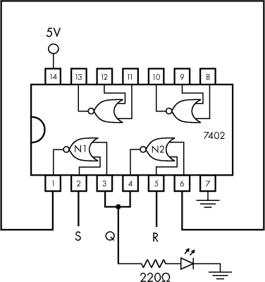

*图 6-16：由 7402 IC 构建的 SR 锁存器接线图*

在你按照图 6-16 所示构建 SR 锁存器电路后，将 S 和 R 连接到带有下拉电阻的按钮（或开关），如图 6-17 所示。这使得你可以通过按下按钮轻松设置 S 或 R 的值。

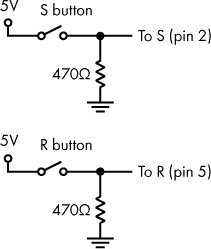

*图 6-17：使用按钮和下拉电阻控制输入 S 和 R*

连接按钮到 SR 锁存器后，尝试通过按下和释放按钮将 S 或 R 设置为高电平或低电平。观察结果。当您按下 S 时，Q 是否打开并在释放 S 后保持打开？当您按下 R 时，Q 是否关闭并在释放 R 后保持关闭？如果您想要查看 Q 的值，它应该始终与 Q 相反，只需将另一个 220Ω电阻器和 LED 连接到 IC 的引脚 1 和 6。

当您初始应用电源时，输出将处于不可预测状态。也就是说，电路可能以 Q = 0 或 Q = 1 的任一值启动。或者，您的电路可靠地以某个特定值的 Q 启动。这种不可预测性的原因是这种设计导致了*竞争条件*。如果 S = 0 并且 R = 0 在应用电源时，N1 和 N2 都试图输出 1。其中一个稍快地做到了这一点（因此是*竞赛*）。如果 N1 首先输出 1，N2 变低，Q 为 0。如果 N2 首先输出 1，N1 变低，Q 为 1。可以通过在启动期间按住 R 按钮（以强制 Q = 0）然后在启动后释放 R 按钮来解决此问题。

保留此电路，我们将在下一个项目中使用它。

**项目＃7：构建基本自动售货机电路**

在这个项目中，您将构建本章前述的自动售货机电路。您可以重复使用上一个项目中的 SR 锁存器作为存储单元。确保在 LED 上使用限流电阻器，并为按钮输入使用下拉电阻器。测试电路以确保其按预期工作。要重置电路，请按 SR 锁存器上的 R 按钮。

对于这个项目，您将需要以下组件：

+   在您构建的面包板上的 7402 SR 锁存器，见项目＃6

+   一个额外的 LED

+   使用额外的限流电阻器来与您的 LED 一起使用（约为 220Ω）

+   连接线

+   7408 IC（包含四个与门）

+   适合面包板的额外按钮或开关

+   使用额外的下拉电阻器来与您的按钮一起使用（约为 470Ω）

提醒，请参阅章节“购买电子元件”在第 333 页和“供电数字电路”在第 336 页如果您需要帮助这些主题。

在显示于图 6-18 中的电路图中，IC 引脚号码显示在方框中。虽然它们在图表中未显示，但确保将 7402 和 7408 芯片都连接到 5V 和地（分别是引脚 14 和 7）。

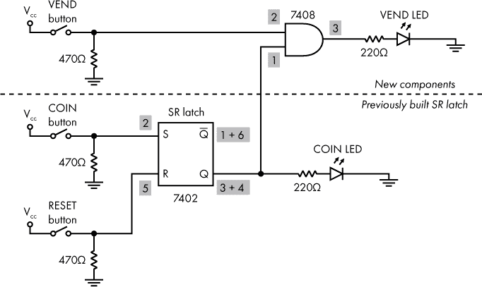

*图 6-18：基本自动售货机电路的接线图*

图 6-18 的底部部分是您在上一个项目中构建的电路。唯一的区别是现在 S 按钮代表硬币按钮，而输出 Q LED 现在代表硬币指示 LED。要构建完整的电路，您只需添加电路的顶部部分并将两部分连接如图所示。

一旦电路搭建完成，你应该能看到，当你按下 COIN 按钮时，COIN LED 灯会亮起。按下 VEND 按钮时，VEND LED 灯应亮起，但仅当 COIN LED 灯已经亮起时才会如此。按下 RESET 按钮以重置电路。

保留这个电路，我们将在下一个项目中使用它。

**项目 #8：为自动售货机电路添加延迟复位**

在这个项目中，你将为项目 #7 中的自动售货机电路添加一个延迟复位。你将需要以下组件：

+   你在项目 #7 中构建的自动售货机电路

+   4.7kΩ电阻

+   220μF 电解电容器

+   跳线

电容器有多种类型，关于各种类型的讨论超出了本书的范围。对于这个项目，你将使用*电解电容器*（图 6-19）。连接电容器时，请注意电解电容器是有极性的，这意味着一根引脚是负极，另一根是正极。寻找标示负极的负号或箭头。有时，负极端子较短。在图 6-21 中，负极端应连接到地。

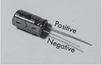

*图 6-19：一个电解电容器。带有条纹/箭头的较短引脚是负极引脚。*

图 6-20 展示了电容器的电路符号。左侧是非极性电容器的符号。中间和右侧是用于表示极性电容器的符号。两个极性符号都提供了一种识别电容器正负端的方法。

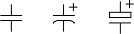

*图 6-20：电容器的电路符号*

图 6-21 展示了如何将基于电容的延迟复位添加到自动售货机电路中，替代手动复位。继续阅读图示后面的内容，了解如何构建这个电路的更多细节。

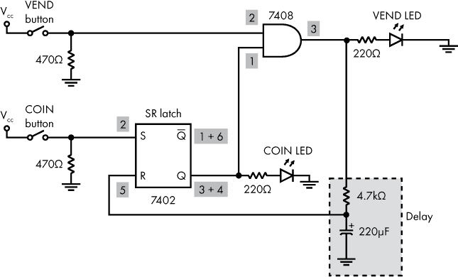

*图 6-21：带延迟复位的自动售货机电路接线图*

如果你仍然有手动复位开关或按钮连接到 R（7402 芯片的第 5 引脚），请务必断开它，因为它的存在会干扰延迟复位的操作。在图 6-21 中，请注意我们的电路的 VEND 输出（7408 芯片的第 3 引脚），当发生售货操作时会变高，并通过一个新的延迟组件连接到锁存器的复位输入。这个新组件由一个电阻和电容器组成，它们共同引入约 1 秒的延迟来进行复位。接下来让我们看看这里发生了什么：

1.  当发生售货操作时，7408 与门的输出会变高。

1.  初始时，未充电的电容器表现得像是一个接地的短路，复位 R 到锁存器的电平保持低，因此最初不会发生复位。

1.  由于复位尚未发生，VEND LED 有机会亮起。

1.  如果按住 VEND 按钮，AND 输出保持高电平，电容开始充电。

1.  经过大约 1 秒钟后，电容就充足了，表现得像一个开路，从而有效地断开了与地的连接。

1.  触发器的重置输入 R 变为高电平，重置发生。

关于这个设计有几点需要注意：

+   必须按住 VEND 按钮，以便电容有时间充电。

+   电路可能仍然会在 COIN LED 已经亮起的情况下启动。只需按住 VEND 按钮进行重置。这可以通过电源开启重置电路来解决，但这超出了本项目的范围。

+   如果添加重置组件导致整个售货机电路无法工作，可能是 R 输入被卡在高电压状态。检查 7402 芯片第 5 脚的电压，看看当它应该是低电压时，是否过高（高于 0.8V）。如果遇到这个问题，请再次检查 4.7kΩ电阻和 220μF 电容的数值。还要检查接线，松动的连接或错误排位的跳线可能会导致问题。

+   我选择了电容和电阻的数值，因为它们能产生大约 1 秒的延时。你可以使用其他数值。然而，改变这些数值可能会导致 R 输入的电压过高，正如前面提到的那样。

你完成的电路应该与图 6-22 所示的电路相似，尽管你的具体布局可能会有所不同。

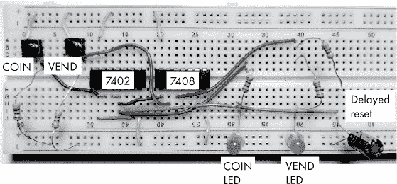

*图 6-22：面包板上的带延时重置的售货机电路*

我建议你保留电路中的 SR 触发器部分，因为你将在接下来的项目中再次使用它。你可以移除电路板上的其他组件，但请保留项目 #6 部分。或者，当需要时，你也可以重新构建一个 SR 触发器。

**项目 #9：使用触发器作为手动时钟**

你将需要一个时钟信号来进行本章后面的项目。在这个项目中，你将把之前构建的 SR 触发器配置为手动时钟。

正如你之前学到的，时钟输入需要在高电压和低电压之间交替。你可以尝试通过将一根线在地和 5V 之间移动来实现时钟。这样当然能使电压交替变化，但并不是你想要的那种方式。当你移动电线时，有时电线并没有连接到任何地方。在这些时刻，时钟输入引脚上的电压会“漂浮”，并且电路行为会变得不可预测。这不是一个好的选择。

或者，你可以添加一个振荡器，自动生成有规律的脉冲，比如每秒一个脉冲。这就是现实世界中时钟的典型工作方式。一种常见的集成电路专门用于这个目的：555 定时器。然而，在接下来的练习中，你需要仔细观察电路中的状态变化，因此你真正需要的是一个*手动*时钟，也就是说，只有在你指示时它才会变高或变低。从某种意义上说，这种手动时钟甚至不算真正的时钟，因为它不会按规律交替状态。话虽如此，无论它是否技术上算作时钟都不是特别重要——我们需要一个可以用来手动触发状态变化的设备。

你可能会想尝试使用普通的按键和下拉电阻作为时钟，如图 6-23 所示。毕竟，按下按钮会使电压变高，松开按钮会使电压变低。

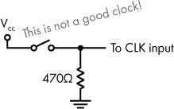

*图 6-23：带下拉电阻的简单开关作为时钟输入（这个方法效果不好）*

不幸的是，图 6-23 中的设计实际上并不是一个好的手动时钟。问题在于，机械按钮和开关往往会“抖动”。开关内部有金属接点，在开关闭合时会连接。关闭开关时，接点会首次连接，但随后接点会分开并再次接触，有时会多次发生，直到开关最终稳定在关闭状态。当开关打开时，也会发生类似的情况，只是方向相反。简单的按钮按下或开关翻转会导致电压多次上下跳动。这种现象叫做*开关抖动*，如图 6-24 所示。

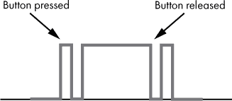

*图 6-24：开关抖动，这不是我们在时钟中想要的效果*

*去抖电路*是去除抖动的硬件选项。一个这样的去抖电路基于 SR 锁存器，而巧合的是，你已经构建了一个！如果你将 S 和 R 连接到开关，这些输入到锁存器仍然会抖动，但锁存器的输出（Q）会保持其值，如图 6-25 所示。这是一种有效去除开关抖动的方法。

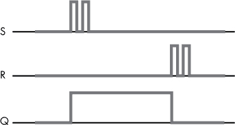

*图 6-25：即使输入发生抖动，SR 锁存器也能输出干净的信号。*

要使用 SR 锁存器作为时钟，按下 S 将时钟信号设为高电平，然后按下 R 将时钟信号设为低电平。只要不要同时按下两个按钮！你可以使用在项目#6 中构建的 SR 锁存器作为时钟。如果你之前在项目#8 中将复位按钮/开关从引脚 5 中移除，重新连接它。完整的 SR 锁存器作为手动时钟应该按图 6-26 所示进行布线。

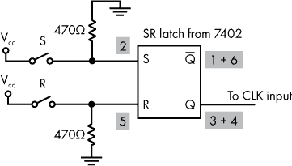

*图 6-26：由两个按钮/开关和 SR 锁存器组成的去抖动手动时钟*

按下 S 键将时钟脉冲设置为高电平，按下 R 键将时钟脉冲设置为低电平。现在你有了一个可以在以下项目中使用的手动时钟。

**项目 #10：测试一个 JK 触发器**

尽管你可以用其他门电路构建 JK 触发器，但它作为集成电路出售，非常方便，这样可以省去一些麻烦。7473 芯片包含两个负边沿触发的 JK 触发器。在这个项目中，你将使用这个集成电路来测试单个 JK 触发器的功能。你将尝试将 J 和 K 设置为高或低，然后通过电路发送时钟脉冲。将 LED 连接到输出 Q，便于观察状态变化。

对于这个项目，你将需要以下组件：

+   将 SR 锁存器配置为时钟（在项目 #9 中讨论）

+   7473 集成电路（包含两个 JK 触发器）

+   跳线

+   LED

+   用于 LED 的限流电阻（约 220Ω）

提醒一下，如果你在这些话题上需要帮助，请参考第 333 页的“购买电子元件”和第 336 页的“为数字电路供电”。图 6-27 显示了 7473 集成电路的引脚图。

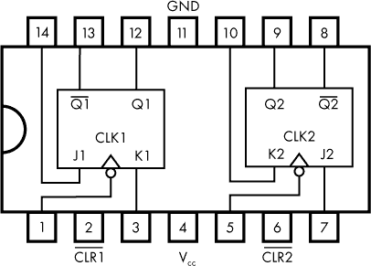

*图 6-27：7473 集成电路的引脚图*

7473 集成电路包含两个 JK 触发器，如图 6-27 所示。注意电压和接地连接不在“常规”位置，而是分别在引脚 4 和引脚 11。同时，注意 CLK（时钟）输入用圆圈标记，表示该电路是负边沿触发的；你应该预期当时钟脉冲下降时，状态会发生变化。由于你使用 SR 锁存器作为手动时钟，这意味着当你按下 SR 锁存器的 R 输入按钮时，你会看到 JK 状态变化。

章节中没有提到每个 JK 触发器的额外输入：CLR。当这个引脚被设置为低电平时，触发器会清除保存的位（Q = 0）。CLR 是异步的，这意味着它不依赖时钟脉冲。上面显示的 CLR 线表示它是*低有效*的，这意味着当输入被设置为低电平时，保存的位会被清除。CLR 有时也叫做复位（Reset）或 R，不能与我们 SR 锁存器的 R 输入混淆。将 JK 触发器的 CLR 输入（引脚 2）连接到 5V，以防止触发器复位。为了测试单个触发器，你可以按图 6-28 所示连接芯片。

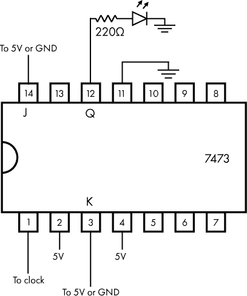

*图 6-28：一个简单的 JK 测试电路*

使用你之前构建的 SR 锁存器作为时钟，将 SR 锁存器的输出 Q（7402 上的引脚 3 和引脚 4）连接到 7473 的时钟输入（引脚 1）。现在，尝试将 7473 上的输入 J（引脚 14）和 K（引脚 3）设置为 5V 或接地。你会看到，直到时钟从高电平过渡到低电平之前，这样做对 JK 触发器的输出 LED 没有任何影响。提示：通过先按下 S 再按下 R 来为 SR 锁存器时钟提供脉冲信号，使时钟信号从高电平变为低电平。返回查看表 6-3，查看 JK 触发器的预期功能，并确保你的电路按预期工作。

保持该电路不变，用于下一个项目。

**项目#11：构建一个 3 位计数器**

在本项目中，你将构建本章前面描述的 3 位计数器。将 Q 输出连接到 LED，以便轻松观察输出。

对于本项目，你将需要以下组件：

+   在项目#10 中构建的电路（包括来自项目#9 的手动时钟）

+   一个额外的 7473 集成电路

+   7408 集成电路（包含四个与门）

+   47kΩ电阻

+   10μF 电解电容

+   一个额外的按钮或开关

+   跳线

+   两个额外的 LED

+   两个额外的限流电阻，用于 LED（每个大约 220Ω）

按照图 6-29 中的示意图连接所有部件。集成电路的引脚编号显示在框内。

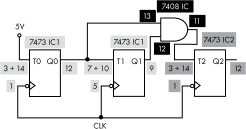

*图 6-29：由 T 触发器构建的 3 位计数器，显示引脚编号*

除了图 6-29 中显示的引脚连接外，请确保还要做以下连接：

+   两个 7473 集成电路的引脚 4 和引脚 11 分别需要连接到 5V 和接地。

+   7408 的引脚 7 应连接到接地，引脚 14 应连接到 5V。

+   Q0、Q1 和 Q2 应该通过 220Ω电阻连接到 LED，以便你可以看到比特的更新。

+   手动时钟输出（7402 上的引脚 3 和引脚 4）应连接到所有三个触发器的 CLK（第一个 7473 的引脚 1 和 5，第二个 7473 的引脚 1）。

该电路以不可预测的状态启动。你可以通过手动重置所有三个触发器来纠正这一点，但这很繁琐。相反，可以添加一个*上电复位*电路，确保所有触发器在输出 = 0 时启动。每个 7473 集成电路中的触发器都有一个 CLR 输入，当该输入为低电平时，会重置触发器，无论时钟状态如何。你希望 CLR 在启动时短暂地变为低电平，然后变为高电平并保持在那里。这样可以确保计数器在上电时从零开始。为了更好地控制，你还可以添加一个计数器复位按钮，当按下时手动重置计数器。该复位功能如图 6-30 所示。

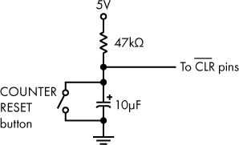

*图 6-30：3 位二进制计数器的上电复位电路*

当电源最初施加到图 6-30 所示的电路时，电容器表现得像一个短路，CLR 保持低电平，将电路设置为初始状态。一旦电容器充电完成，它就像一个开路，CLR 变为高电平，电路准备好使用。当按下计数器重置按钮或开关时，CLR 也会变为低电平，电路被重置。此电路需要连接到 CLR 输入：第一个 7473 芯片的 2 脚和 6 脚，以及第二个 7473 芯片的 2 脚。在项目 #10 中，第一个 7473 的 2 脚连接到 5V；在连接上电复位电路之前，一定要先将其断开。记得正确放置电解电容器的引脚——负极应连接到地。

在设置好电源复位后，电路应以计数器从 000 开始。向电路发送时钟脉冲应导致计数器在时钟边沿下降时增加 1。提醒：通过按下 S 设置时钟信号为高电平，按下 R 设置时钟信号为低电平，来脉冲 SR 锁存器的时钟。测试计数从 000 到 111，并确保计数器按预期工作。
