## 第七章：计算机硬件**

前几章介绍了计算的基础元素——二进制、数字电路、内存。现在让我们看看这些元素如何在计算机中结合起来，计算机是一个超越其各个部分的设备。在本章中，我首先提供计算机硬件的概述。然后我们将深入探讨计算机的三个部分：主内存、处理器以及输入/输出。

### 计算机硬件概述

让我们从计算机与其他电子设备的区别概述开始。此前，我们已经看到如何使用逻辑电路和内存设备构建执行有用任务的电路。我们使用逻辑门构建的电路具有一些硬接入的特性。如果我们想添加或修改某个特性，就必须更改电路的物理设计。在面包板上这是可能的，但对于已制造并交付给客户的设备来说，通常无法更改硬件。仅通过硬件定义设备的特性限制了我们快速创新和改进设计的能力。

到目前为止，我们构建的电路让我们初步了解了计算机是如何工作的，但我们还缺少计算机的一个关键元素：*可编程性*。也就是说，计算机必须能够执行新的任务，*无需*改变硬件。为了实现这一目标，计算机必须能够接受一组指令（*程序*），并执行这些指令中指定的操作。因此，它必须拥有能够按照程序指定的顺序执行各种操作的硬件。可编程性是区分计算机与非计算机设备的关键特征。在本章中，我们将讨论计算机的*硬件*，即计算机的物理元素。与此相对的是*软件*，即告诉计算机该做什么的指令，我们将在下一章讨论软件。

运行软件的能力将计算机与固定用途设备区分开来。也就是说，软件仍然需要硬件，那么我们需要什么样的硬件来实现通用计算机呢？首先，我们需要内存。我们已经介绍了诸如锁存器和触发器之类的单比特内存设备；计算机中使用的内存是这些简单内存设备的概念扩展。计算机中使用的主要内存被称为*主内存*，但通常简称为内存或*随机存取内存（RAM）*。它是*易失性的*，意味着它只在电源开启时保持数据。RAM 中的“随机存取”意味着任何任意的内存位置都可以在大致相同的时间内访问，和其他位置一样。

我们需要的第二个关键组件是 *中央处理单元*，或称 *CPU*。通常简称为 *处理器*，这个组件执行软件中指定的指令。CPU 可以直接访问主内存。今天的大多数处理器都是*微处理器*，即集成电路上的 CPU。单芯片集成的处理器具有成本较低、可靠性更高和性能更强的优点。CPU 是我们之前讨论过的数字逻辑电路的概念性扩展。

虽然主内存和 CPU 是计算机的最低硬件要求，但实际上，大多数计算设备都需要与外部世界进行交互，这些交互通过输入/输出（I/O）设备实现。在本章中，我们将更详细地讨论主内存、CPU 和 I/O。这三个元素在图 7-1 中有示意。

*图 7-1：计算机硬件元素*

### 主内存

在执行程序时，计算机需要一个地方来存储程序的指令和相关数据。例如，当计算机运行文字处理器来编辑文档时，计算机需要一个地方来保存程序本身、文档的内容以及编辑状态——文档的哪一部分是可见的、光标的位置等等。所有这些数据最终都是一系列位，CPU 需要能够访问它们。主内存负责存储这些 1 和 0。

让我们来探索计算机中主内存是如何工作的。计算机内存有两种常见类型：*静态随机存取内存 (SRAM)* 和 *动态随机存取内存 (DRAM)*。在这两种类型中，内存存储的基本单位是 *存储单元*，它是一个能够存储单个位的电路。在 SRAM 中，存储单元是一种触发器。SRAM 是静态的，因为其触发器存储单元在电源持续供电时会保留其位值。另一方面，DRAM 存储单元是通过晶体管和电容器实现的。电容器的电荷会随着时间的推移而泄漏，因此数据必须定期重新写入单元。这种对内存单元的刷新使得 DRAM 成为动态内存。今天，DRAM 由于其相对较低的价格，通常被用于主内存。SRAM 虽然更快，但成本较高，因此通常用于对速度要求极高的场景，例如缓存内存，我们稍后会讨论到。一个 RAM“条”示例如图 7-2 所示。

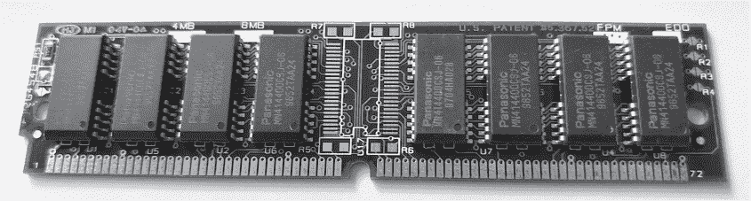

*图 7-2：随机存取内存*

一般来说，你可以把 RAM 的内部结构看作是由内存单元组成的网格。网格中的每一个单比特单元都可以通过二维坐标来标识，即它在网格中的位置。一次访问一个比特并不是非常高效，因此 RAM 会并行访问多个 1 比特内存单元的网格，从而实现一次读取或写入多个比特——例如，一个完整的字节。内存中一组比特的位置被称为 *内存地址*，它是一个数字值，用于标识一个内存位置。内存通常是 *按字节寻址* 的，这意味着一个内存地址对应 8 位数据。内存的内部布局或内存单元的实现对于 CPU（或程序员）来说并不是必须知道的知识！关键点是，计算机会给内存的字节分配数字地址，CPU 可以读取或写入这些地址，正如 图 7-3 所示。

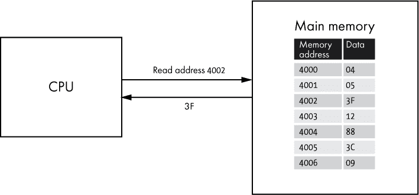

*图 7-3：CPU 从内存地址读取一个字节。*

让我们考虑一个假设的计算机系统，它最多可以寻址 64KB 的内存。以今天的标准来看，这对一台计算机来说是一个非常小的内存，但它仍然对我们作为示例很有用。我们还假设这台假设的计算机的内存是按字节寻址的；每个内存地址代表一个字节。这意味着我们需要为每个字节分配一个唯一的地址，并且由于 64KB 等于 64 × 1024 = 65,536 字节，我们需要 65,536 个唯一的地址。每个地址只是一个数字，内存地址通常从 0 开始，因此我们的地址范围是 0 到 65,535（或者 0xFFFF）。

由于我们的假设 64KB 计算机是数字设备，内存地址最终以二进制表示。那么我们需要多少位来表示这个系统的内存地址呢？一个二进制数可以表示的唯一值的数量为 2^(*n*)，其中 *n* 为位数。所以我们想知道 *n* 的值，使得 2^(*n*) = 65,536。2 的某个指数的反运算是以 2 为底的对数。因此 log2) = *n*，而 log2 = 16。所以换句话说，2¹⁶ = 65,536。因此，表示 65,536 字节需要 16 位的内存地址。

或者更简单地说，既然我们已经知道我们最高的内存地址是 0xFFFF，并且知道每个十六进制符号代表 4 位，我们可以看出需要 16 位（4 个十六进制符号 × 每个符号 4 位）。再次说明，我们的假设计算机能够寻址 65,536 字节，每个字节被分配一个 16 位的内存地址。表 7-1 显示了一个 16 位内存布局，包含一些示例数据。

**表 7-1：** 一个 16 位内存地址布局，跳过中间地址，包含示例数据

| **内存地址（以二进制表示）** | **内存地址（以十六进制表示）** | **示例数据** |
| --- | --- | --- |
| `0000000000000000` | `0000` | `23` |
| `0000000000000001` | `0001` | `51` |
| `0000000000000010` | `0002` | `4A` |
| `----------------` | `----` | `--` |
| `1111111111111101` | `FFFD` | `03` |
| `1111111111111110` | `FFFE` | `94` |
| `1111111111111111` | `FFFF` | `82` |

为什么位数很重要？用于表示内存地址的位数是计算机系统设计的关键部分。它限制了计算机可以访问的内存量，并且影响程序在底层如何处理内存。

现在让我们假设我们的虚拟计算机已经从内存地址 0x0002 开始存储 ASCII 字符串“Hello”。由于每个 ASCII 字符都需要 1 个字节，因此存储“Hello”需要 5 个字节。查看内存时，通常会使用十六进制来表示内存地址以及这些内存地址的内容。表格 7-2 提供了从地址 0x0002 开始存储的“Hello”在内存中的可视化表示。

**表格 7-2：** “Hello” 存储在内存中

| **内存地址** | **数据字节** | **数据（ASCII）** |
| --- | --- | --- |
| `0000` | `00` |  |
| `0001` | `00` |  |
| `0002` | `48` | `H` |
| `0003` | `65` | `e` |
| `0004` | `6C` | `l` |
| `0005` | `6C` | `l` |
| `0006` | `6F` | `o` |
| `0007` | `00` |  |
| `----` | `--` |  |
| `FFFF` | `00` |  |

使用这种格式可以清楚地看出，每个地址只存储 1 个字节，因此存储所有 5 个 ASCII 字符需要地址从 0x0002 到 0x0006。请注意，表格中显示其他内存地址的值为 00，但实际上不能假设随机地址会存储 0；它可以是任何值。不过，在某些编程语言中，通常会以空字符（字节值为 0）结束文本字符串，在这种情况下，我们确实会期望在地址 0x0007 看到 00。

允许查看计算机内存的应用程序通常会将内存内容表示为类似图 7-4 所示的格式。

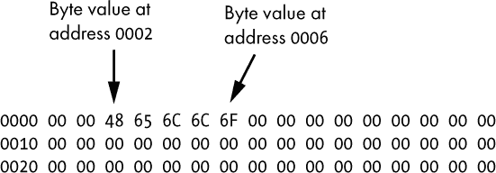

*图 7-4：内存字节的典型视图*

图 7-4 中的最左列是以十六进制表示的内存地址，接下来的 16 个值表示该地址及其后 15 个地址的字节。这种方法比表格 7-2 更紧凑，但这意味着每个地址没有被单独标出。在此图中，我们再次看到从地址 0x0002 开始存储的 ASCII 字符串“Hello”。

我们的假设计算机具有 64KB 的 RAM，作为示例非常有用，但现代计算设备通常具有更大的内存。到 2020 年为止，智能手机通常至少有 1GB 内存，而笔记本电脑通常至少有 4GB。

**练习 7-1：计算所需的位数**

使用刚才描述的技术，确定寻址 4GB 内存所需的位数。你需要回头查看表格 1-3，参考一下国际单位制（SI）前缀。记住，每个字节都有一个唯一的地址，这只是一个数字。答案在附录 A 中。

### 中央处理单元（CPU）

内存为计算机提供了一个存储数据和程序指令的地方，但执行这些指令的是 CPU 或处理器。正是处理器使得计算机能够运行在设计处理器时尚未构想到的程序。处理器实现了一组指令，程序员可以利用这些指令来构建有意义的软件。每条指令都很简单，但这些基本指令是所有软件的构建块。

以下是 CPU 支持的一些指令类型示例：

**内存访问**   读取、写入（到内存）

**算术**   加法、减法、乘法、除法、自增

**逻辑**   与、或、非

**程序流程**   跳转（到程序的特定部分）、调用（子程序）

我们将在第八章中详细介绍具体的 CPU 指令，但现在重要的是要理解，CPU 指令只是处理器可以执行的操作。它们相对简单（加两个数字、从内存地址读取、执行逻辑与等）。程序由这些指令的有序集合组成。用做饭的类比，CPU 就是厨师，程序是食谱，程序中的每条指令就是厨师知道如何执行的食谱步骤。

程序指令驻留在内存中。CPU 读取这些指令以便运行程序。图 7-5 展示了一个简单的程序，CPU 从内存中读取该程序。

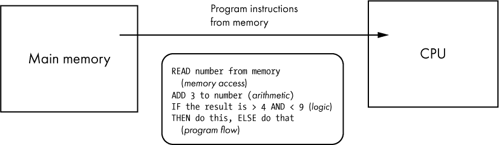

*图 7-5：一个示例程序从内存中读取并在 CPU 上运行。*

图 7-5 中的示例程序是用*伪代码*编写的，这是一种人类可读的程序描述，但并不是用真实的编程语言编写的。程序中的步骤属于刚才描述的几类（内存访问、算术、逻辑和程序流程）。在第一步中，程序从内存中的某个地址读取一个数字。然后程序将 3 加到这个数字上。接着，它执行两个条件的逻辑与操作。如果逻辑结果为真，则程序执行“这个”；否则，执行“那个”。信不信由你，所有程序本质上只是这些基本操作的各种组合。

#### *指令集架构*

尽管所有 CPU 都实现了这些类型的指令，不同处理器上可用的具体指令是不同的。有些指令在某一类型的 CPU 上存在，但在其他类型的 CPU 上根本不存在。即使是几乎所有 CPU 都有的指令，也不是以相同的方式实现的。例如，用于表示“加两个数字”的特定二进制序列，在不同的处理器类型之间并不相同。使用相同指令的 CPU 家族被称为共享 *指令集架构（ISA）*，或者简称 *架构*，它是描述 CPU 如何工作的模型。为某个特定 ISA 开发的软件可以在任何实现该 ISA 的 CPU 上运行。多个处理器型号，即使来自不同的制造商，也有可能实现相同的架构。这些处理器可能在内部工作方式上有很大不同，但通过遵循相同的 ISA，它们可以运行相同的软件。如今，存在两种流行的指令集架构：x86 和 ARM。

大多数桌面计算机、笔记本电脑和服务器都使用 x86 CPU。这个名字源自英特尔公司为其处理器制定的命名惯例（每个处理器型号都以 86 结尾），从 1978 年发布的 8086 开始，一直到 80186、80286、80386 和 80486。继 80486（或者更简单地说是 486）之后，英特尔开始使用 Pentium 和 Celeron 等品牌命名其 CPU；这些处理器尽管更名，但仍然是 x86 CPU。除了英特尔，其他公司也生产 x86 处理器，尤其是超威半导体公司（AMD）。

*x86* 这个术语指的是一组相关的架构。随着时间的推移，新的指令被加入到 x86 架构中，但每一代都试图保持向后兼容性。这通常意味着为较旧的 x86 CPU 开发的软件可以在较新的 x86 CPU 上运行，但针对较新的 x86 CPU 开发的，利用新 x86 指令的软件将无法在不支持这些新指令的旧 x86 CPU 上运行。

x86 架构包括三代主要的处理器：16 位、32 位和 64 位。让我们停下来仔细分析一下，当我们说一个 CPU 是 16 位、32 位还是 64 位处理器时是什么意思。与处理器相关的位数，也称为 *位宽* 或 *字长*，指的是处理器一次可以处理的位数。因此，一个 32 位的 CPU 可以处理 32 位长度的值。更具体地说，这意味着计算机架构有 32 位寄存器、32 位地址总线或 32 位数据总线，或者这三者都是 32 位。我们稍后会详细讨论寄存器、数据总线和地址总线。

回到 x86 及其各代处理器，最初的 8086 处理器于 1978 年发布，是一款 16 位处理器。受到 8086 成功的鼓舞，Intel 继续生产兼容的处理器。Intel 后续的 x86 处理器也是 16 位，直到 1985 年发布 80386 处理器，这款处理器引入了新的 32 位 x86 架构。这个 32 位版本的 x86 有时被称为 IA-32。得益于向后兼容性，现代 x86 处理器仍完全支持 IA-32。一个 x86 处理器的例子见图 7-6。

有趣的是，带领 x86 进入 64 位时代的是 AMD，而非 Intel。1990 年代末，Intel 的 64 位重点放在一种新 CPU 架构上，名为 IA-64 或 Itanium，这种架构*并非*x86 指令集架构（ISA），最终成为仅限服务器使用的小众产品。Intel 专注于 Itanium 时，AMD 抓住机会扩展了 x86 架构。2003 年，AMD 发布了 Opteron 处理器，这是第一个 64 位 x86 CPU。AMD 的架构最初被称为*AMD64*，后来 Intel 也采用了这一架构，并将其实现命名为*Intel 64*。这两种实现大体上功能相同，如今 64 位 x86 通常被称为*x64*或*x86-64*。

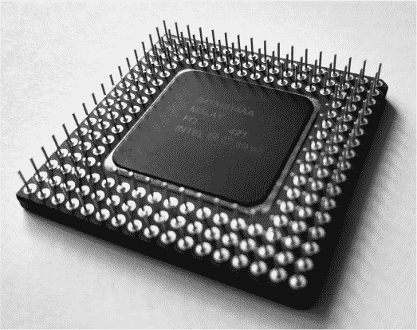

*图 7-6：一款 Intel 486 SX，32 位 x86 处理器*

尽管 x86 在个人计算机和服务器领域占据主导地位，ARM 处理器却统治着智能手机和平板等移动设备的领域。多家公司生产 ARM 处理器。一家公司名为 ARM Holdings，开发 ARM 架构并将其设计授权给其他公司实现。ARM CPU 常被用于*系统级芯片（SoC）*设计中，其中一个集成电路不仅包含 CPU，还包含内存和其他硬件。ARM 架构起源于 1980 年代，是一个 32 位的指令集架构（ISA）。2011 年，ARM 架构推出了 64 位版本。由于 ARM 处理器在移动设备中相较于 x86 处理器具有更低的功耗和成本，因此更受青睐。ARM 处理器也可以用于 PC，但这一市场仍然主要集中在 x86 上，以保持与现有 x86 PC 软件的向后兼容性。然而，2020 年，苹果宣布将把其 macOS 电脑从 x86 转移到 ARM CPU。

#### *CPU 内部结构*

在内部，CPU 由多个组件组成，这些组件共同工作以执行指令。我们将重点介绍三个基本组件：处理器寄存器、算术逻辑单元和控制单元。*处理器寄存器*是 CPU 内部存储数据的位置，数据在处理过程中保存在这里。*算术逻辑单元（ALU）*执行逻辑和数学运算。处理器的*控制单元*指挥 CPU，负责与处理器寄存器、算术逻辑单元和主存进行通信。图 7-7 展示了 CPU 架构的简化视图。

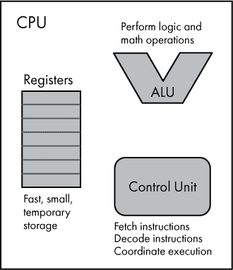

*图 7-7：CPU 架构的一个大大简化的视图*

让我们来看一下处理器寄存器。主内存存储正在执行程序的数据。然而，当程序需要对一块数据进行操作时，CPU 需要在处理器硬件中为数据提供一个临时存储位置。为此，CPU 具有称为处理器寄存器的小型内部存储位置，或简称寄存器。与访问主内存相比，访问寄存器是 CPU 的一种非常快速的操作，但寄存器只能容纳非常少量的数据。我们用位而不是字节来衡量单个寄存器的大小，因为寄存器非常小。例如，一个 32 位 CPU 通常具有 32 位“宽”的寄存器，这意味着每个寄存器可以容纳 32 位数据。这些寄存器由一个称为*寄存器文件*的组件实现（不要与数据文件，如文档或照片混淆）。寄存器文件中使用的存储单元通常是某种类型的 SRAM。

ALU 负责 CPU 内部的逻辑和数学运算。我们之前讲解过组合逻辑电路，这些电路的输出是输入的一个函数。处理器的 ALU 就是一个复杂的组合逻辑电路。ALU 的输入是称为*操作数*的值和一个表示要对这些操作数执行什么操作的代码。ALU 输出操作结果及一个状态，提供执行操作的更多细节。

控制单元充当 CPU 的协调者。它以一个循环重复执行：从内存中获取指令，解码指令，然后执行指令。由于正在运行的程序存储在内存中，控制单元需要知道读取哪个内存地址才能获取下一条指令。控制单元通过查看一个称为*程序计数器（PC）*的寄存器来确定这一点，在 x86 架构上也叫做*指令指针*。程序计数器保存下一条要执行的指令的内存地址。控制单元从指定的内存地址读取指令，将指令存储到一个称为*指令寄存器*的寄存器中，并更新程序计数器以指向下一条指令。然后，控制单元解码当前指令，理解表示指令的 1 和 0。一旦解码完成，控制单元执行该指令，这可能需要与 CPU 中的其他组件协调。例如，执行加法操作时，控制单元需要指示 ALU 执行所需的数学运算。指令执行完毕后，控制单元重复这一循环：获取、解码、执行。

#### *时钟、核心与缓存*

由于 CPU 执行的是有序的指令集，你可能会想知道是什么导致 CPU 从一条指令跳转到下一条指令。我们之前已经演示了如何利用时钟信号使电路从一个状态转换到另一个状态，比如在计数器电路中。相同的原理也适用于这里。CPU 接收输入的时钟信号，如图 7-8 所示，时钟脉冲作为信号，指示 CPU 在状态之间进行转换。

*图 7-8：时钟为 CPU 提供震荡信号。*

认为 CPU 每个时钟周期执行恰好一条指令是一种过于简单化的看法。有些指令需要多个周期才能完成。此外，现代 CPU 采用了一种叫做*pipelining（流水线技术）*的方法，将指令分解成更小的步骤，这样多个指令的部分可以由单个处理器并行执行。例如，当一条指令正在解码时，另一条指令可以被获取，而第三条指令可以被执行。尽管如此，考虑到每个时钟脉冲都可以作为指示 CPU 向前执行程序的信号，依然是有帮助的。现代 CPU 的时钟频率以*吉赫兹（GHz）*为单位。例如，一颗 2GHz 的 CPU 时钟每秒会震荡 2*十亿*次！

增加时钟频率可以让 CPU 每秒执行更多的指令。不幸的是，我们不能让 CPU 在任意高的时钟频率下运行。CPU 对输入时钟频率有实际的上限，超过该限制会导致过多的热量产生。而且，CPU 的逻辑门可能无法跟上，导致意外的错误和崩溃。多年来，计算机行业见证了 CPU 时钟频率上限的稳步提升。这一增长主要得益于制造工艺的持续改进，提升了晶体管的密度，使得 CPU 能够在功耗几乎不变的情况下，提供更高的时钟频率。1978 年，英特尔 8086 的时钟频率为 5MHz，而到了 1999 年，英特尔奔腾 III 的时钟频率达到了 500MHz，20 年内增长了 100 倍！直到 2000 年代初，CPU 时钟频率持续快速增长，突破了 3GHz 的门槛。从那时起，尽管晶体管数量继续增长，但与微小晶体管尺寸相关的物理限制使得时钟频率的大幅提升变得不再实际。

由于时钟频率停滞不前，处理器行业转向了一种新方法来提高 CPU 的工作效率。与其专注于增加时钟频率，CPU 设计开始聚焦于并行执行多条指令。*多核*CPU 的概念应运而生，这是一种拥有多个处理单元，称为*核心*的 CPU。*CPU 核心*实际上是一个独立的处理器，和其他独立的处理器共同存在于单一的 CPU 封装中，如图 7-9 所示。

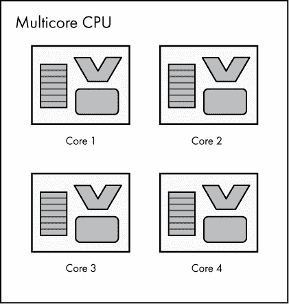

*图 7-9：四核 CPU——每个核心都有自己的寄存器、算术逻辑单元和控制单元*

请注意，多个核心并行运行不同于流水线处理。多核并行意味着每个核心处理不同的任务，即一组独立的指令。与此不同，流水线处理发生在*每个*核心内部，允许多个指令的部分在同一个核心上并行执行。

每增加一个核心到处理器，就意味着计算机可以并行运行更多指令。也就是说，向计算机的 CPU 添加多个核心并不意味着所有应用程序都会立即或均等地受益。软件必须被编写以充分利用指令的并行处理，才能最大限度地发挥多核硬件的优势。然而，即使单个程序没有针对并行性进行设计，计算机系统整体也能受益，因为现代操作系统会同时运行多个程序。

我之前描述过 CPU 如何从主存储器加载数据到寄存器中进行处理，然后再将数据从寄存器存回内存以备后用。事实证明，程序往往会反复访问相同的内存位置。正如你可能预料的那样，多次从主存取回相同的数据是低效的！为了避免这种低效，在 CPU 内部有一小块内存，用于存储频繁访问的主存数据副本。这块内存被称为*CPU 缓存*。

处理器检查缓存，以查看它希望访问的数据是否已经在其中。如果是这样，处理器可以通过读取或写入缓存来加速操作，而不是直接访问主存。当所需数据不在缓存中时，处理器可以在从主存读取数据后，将其移动到缓存中。现代处理器通常具有多个缓存级别，通常有三级。我们将这些缓存级别分别称为 L1 缓存、L2 缓存和 L3 缓存。CPU 首先检查 L1 缓存是否有所需的数据，然后是 L2，再是 L3，最后才是主存，如图 7-10 所示。L1 缓存访问速度最快，但也最小。L2 缓存较慢且较大，而 L3 缓存则更慢且更大。请记住，即使是这些逐渐变慢的缓存级别，访问主存的速度仍然比访问任何缓存级别都要慢。

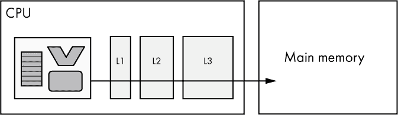

*图 7-10：具有三级缓存的单核 CPU*

在多核 CPU 中，一些缓存是每个核心特有的，而另一些则在各个核心之间共享。例如，每个核心可能有自己的 L1 缓存，而 L2 和 L3 缓存是共享的，如图 7-11 所示。

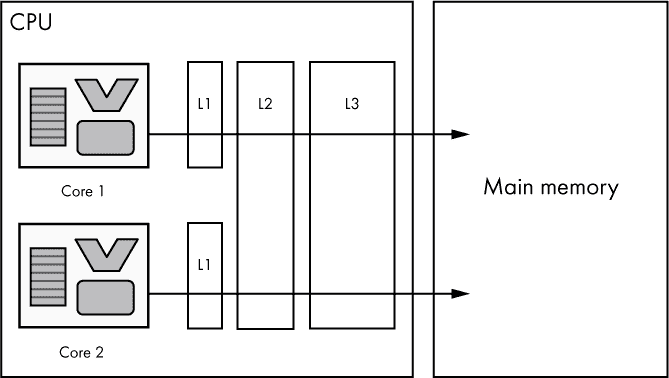

*图 7-11：具有缓存的双核 CPU。每个核心都有自己的 L1 缓存，而 L2 和 L3 缓存是共享的。*

### 超越内存和处理器

我已经概述了计算机所需的两个基本组件：内存和处理器。然而，如果一台设备仅由内存和处理器组成，仍然存在一些需要填补的空白，以便我们能够得到一台实用的设备。第一个空白是内存和 CPU 都是易失性的；当电源断开时，它们会丧失状态。第二个空白是，仅有内存和处理器的计算机无法与外界进行交互。现在让我们来看一下辅助存储和 I/O 设备如何填补这些空白。

#### *辅助存储*

如果计算机仅包含内存和处理器，那么每次设备断电时，它都会丢失所有数据！为了强调这一点，这里的*数据*不仅仅指用户的文件和设置，还包括任何已安装的应用程序，甚至操作系统本身。这样一台相当不便的计算机会要求每次开机时都需要加载操作系统和任何应用程序。这可能会让用户不愿意关闭设备。信不信由你，过去几代计算机确实是这样工作的，但幸运的是，今天的计算机不再如此。

为了解决这个问题，计算机使用辅助存储。*辅助存储*是非易失性的，因此即使系统断电，它也能记住数据。与 RAM 不同，辅助存储不能直接被 CPU 寻址。这类存储通常比 RAM 便宜得多，每字节的价格较低，使得与主内存相比，辅助存储可以提供更大的容量。然而，辅助存储的速度也比 RAM 慢得多；它不能作为主内存的替代品。

在现代计算设备中，硬盘驱动器和固态硬盘是最常见的辅助存储设备。*硬盘驱动器（HDD）*通过在快速旋转的盘片上利用磁性存储数据，而*固态硬盘（SSD）*则通过在非易失性存储单元中利用电荷存储数据。与 HDD 相比，SSD 速度更快、更安静、且对机械故障更具抵抗力，因为 SSD 没有任何活动部件。图 7-12 是几种辅助存储设备的照片。

有了辅助存储设备，计算机可以按需加载数据。当计算机开机时，操作系统从辅助存储加载到主内存；任何设置为在启动时运行的应用程序也会加载。启动后，当应用程序被启动时，程序代码会从辅助存储加载到主内存。任何本地存储的用户数据（如文档、音乐、设置等）也是如此；它必须从辅助存储加载到主内存才能使用。在常见用法中，辅助存储通常简称为存储，而主存储/主内存则直接称为内存或 RAM。

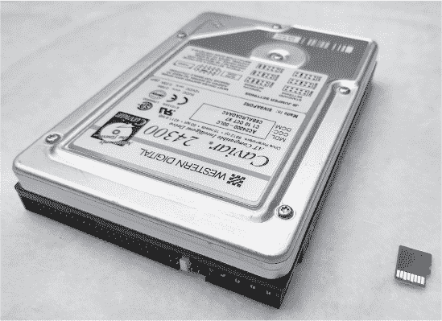

*图 7-12：1997 年款的 4GB 硬盘驱动器与现代 32GB microSD 卡（固态存储的一种类型）并排展示*

#### *输入/输出*

即使有了二级存储，我们假设的计算机仍然存在问题。一个由处理器、内存和存储组成的计算机并没有与外部世界进行交互的方式！这就是输入/输出设备的作用。*输入/输出（I/O）设备*是一个组件，允许计算机接收来自外部世界的输入（键盘、鼠标）、向外部世界发送数据（显示器、打印机），或者两者都做（触摸屏）。人类与计算机的交互需要通过 I/O。计算机之间的交互也需要通过 I/O，通常是通过计算机网络，如互联网。二级存储设备实际上是一种 I/O 设备。你可能不会认为访问内部存储是 I/O 操作，但从 CPU 的角度来看，读写存储只是另一个 I/O 操作。从存储设备读取数据是输入，而写入存储设备则是输出。图 7-13 提供了一些输入和输出的示例。

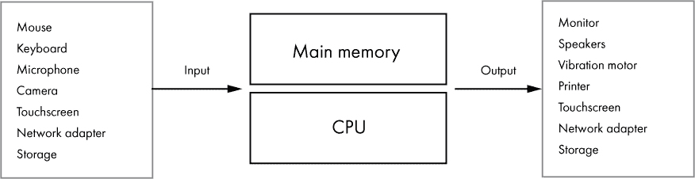

*图 7-13：常见的输入和输出类型*

那么，CPU 是如何与 I/O 设备进行通信的呢？计算机可以连接多种多样的 I/O 设备，而 CPU 需要一种标准的方式与这些设备进行通信。要理解这一点，我们首先需要讨论*物理地址空间*，即计算机可用的硬件内存地址范围。在本章的“主存储器”一节中，第 119 页介绍了内存字节如何分配地址。计算机系统上的所有内存地址将使用一定数量的位来表示。这个位数不仅决定了每个内存地址的大小，还决定了计算机硬件可用地址的范围——物理地址空间。地址空间通常比计算机上安装的 RAM 容量大，因此会有一些物理内存地址未被使用。

举个例子，对于一台具有 32 位物理地址空间的计算机，其物理地址范围是从 0x00000000 到 0xFFFFFFFF（这是用 32 位数字表示的最大地址）。这大约是 40 亿个地址，每个地址表示一个字节，或者 4GB 的地址空间。假设这台计算机有 3GB 的 RAM，那么可用的物理内存地址的 75%被分配给了 RAM 字节。

现在让我们回到 CPU 如何与 I/O 设备通信的问题。物理地址空间中的地址并不总是指向内存字节；它们也可以指向 I/O 设备。当物理地址空间映射到 I/O 设备时，CPU 可以通过读取或写入其分配的内存地址来与该设备通信；这称为*内存映射 I/O (MMIO)*，如图 7-14 所示。当计算机像对待主内存一样对待 I/O 设备的内存时，CPU 无需任何特殊指令进行 I/O 操作。

然而，一些 CPU 家族，特别是 x86，确实包括用于访问 I/O 设备的特殊指令。当计算机采用这种方法时，设备不会映射到物理内存地址，而是分配一个*I/O 端口*。端口就像内存地址，但它不是指向内存中的某个位置，而是指向 I/O 设备。你可以将 I/O 端口的集合视为一个与内存地址不同的地址空间。这意味着端口 0x378 并不指向物理内存地址 0x378。通过单独的端口地址空间访问 I/O 设备被称为*端口映射 I/O (PMIO)*。今天的 x86 CPU 支持端口映射 I/O 和内存映射 I/O 两种方式。

I/O 端口和内存映射 I/O 地址通常指的是设备控制器，而不是直接指向存储在设备上的数据。例如，在硬盘驱动器的情况下，磁盘的字节并不是直接映射到地址空间中的。相反，硬盘控制器提供了一个接口，可以通过 I/O 端口或内存映射 I/O 地址访问，该接口允许 CPU 请求对磁盘上的位置进行读写操作。

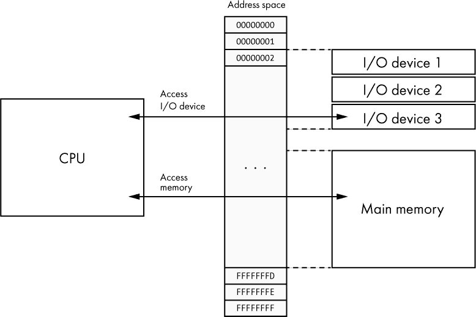

*图 7-14：内存映射 I/O*

**练习 7-2：了解你生活中的硬件设备**

选择你拥有或使用的几台计算设备——比如笔记本电脑、智能手机或游戏机。回答以下关于每台设备的问题。你可以通过查看设备本身的设置来找到答案，或者可能需要在线进行一些研究。

+   该设备使用的是什么类型的 CPU？

+   CPU 是 32 位还是 64 位（或其他）？

+   CPU 的时钟频率是多少？

+   CPU 是否有 L1、L2 或 L3 缓存？如果有，是多少？

+   CPU 使用哪种指令集架构？

+   CPU 有多少个核心？

+   该设备有多少内存？是什么类型的主内存？

+   该设备拥有多少存储空间，是什么类型的二级存储？

+   该设备有哪些 I/O 设备？

### 总线通信

到目前为止，我们已经讲解了内存、CPU 和 I/O 设备在计算机中的作用。我们还讨论了 CPU 如何通过内存地址空间与内存和 I/O 设备通信。接下来，让我们更深入地看看 CPU 如何与内存和 I/O 设备进行通信。

*总线*是计算机组件之间用于硬件通信的系统。总线有多种实现方式，但在计算机早期，总线只是由一组并行电线组成，每根电线传输一个电信号。这使得多个数据位可以并行传输；每根电线上的电压代表一个单独的位。今天的总线设计不总是那么简单，但其目的依然相似。

在 CPU、内存和 I/O 设备之间的通信中，有三种常见的总线类型。*地址总线*作为 CPU 希望访问的内存地址的选择器。例如，如果程序希望写入地址 0x2FE，CPU 会将 0x2FE 写入地址总线。*数据总线*传输从内存读取的值或要写入内存的值。因此，如果 CPU 希望将值 25 写入内存，那么 25 将被写入数据总线。或者如果 CPU 正在从内存中读取数据，CPU 则从数据总线上读取该值。最后，*控制总线*管理其他两个总线上的操作。例如，CPU 使用控制总线来指示即将进行写入操作，或者控制总线可以传输指示操作状态的信号。图 7-15 展示了 CPU 如何使用地址总线、数据总线和控制总线来读取内存。

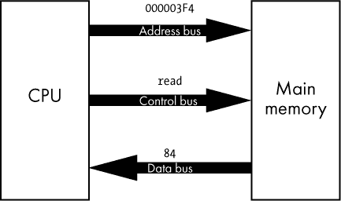

*图 7-15：CPU 请求读取地址 3F4 处的值，返回的值是 84。*

在图 7-15 中显示的示例中，CPU 需要读取存储在内存地址 000003F4 处的值。为此，CPU 将 000003F4 写入地址总线。CPU 还会在控制总线上设置一个特定的值，表示它希望执行读取操作。这些总线更新作为输入传递给内存控制器（管理与主内存交互的电路），告诉它 CPU 希望读取主内存中地址 000003F4 处存储的值。作为响应，内存控制器从地址 000003F4 处检索存储的值（在此示例中为 84），并将其写入数据总线，CPU 可以从数据总线上读取这个值。

### 总结

本章内容涵盖了计算机硬件：中央处理单元（CPU）用于执行指令，随机存取存储器（RAM）在通电时存储指令和数据，输入/输出（I/O）设备与外界交互。你学到了内存由单一比特的内存单元组成，这些单元在 SRAM 中通过一种触发器实现，在 DRAM 中通过晶体管和电容实现。我们讲解了内存寻址的工作原理，其中每个地址指向一个字节的内存。你了解了 CPU 架构，包括 x86 和 ARM 架构。我们探索了 CPU 内部的工作方式，查看了寄存器、算术逻辑单元（ALU）和控制单元。我们还讨论了二级存储和其他类型的 I/O，最后，我们讲解了总线通信。

在下一章中，我们将超越硬件，探讨使计算机在各种设备中独具特色的东西——软件。我们将研究处理器执行的低级指令，并且看到这些指令如何组合以执行有用的操作。你将有机会使用汇编语言编写软件，并使用调试器探索机器代码。
