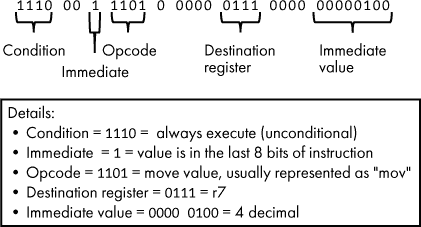
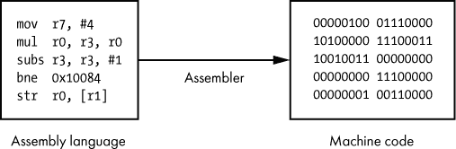
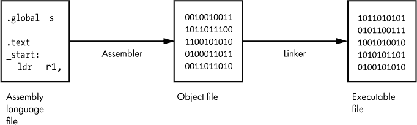
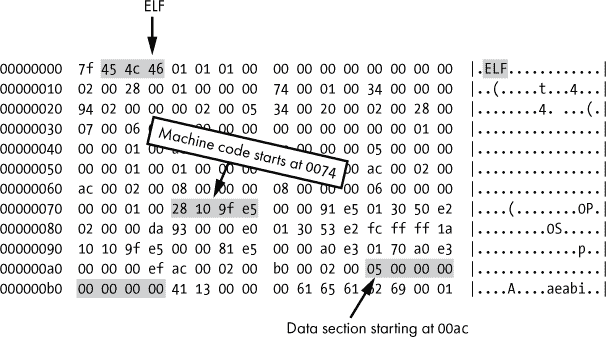

# 第八章：机器码和汇编语言**


我们已经讨论了计算机的硬件部分：CPU、主内存和 I/O 设备。理解计算机硬件很重要，但硬件只是故事的一半。计算机的魔力在于软件。正是软件将计算机从一个固定用途的设备变成了一个高度灵活的设备，能够轻松获得新功能！在这一章中，我们讨论低级软件——机器码和汇编语言。我发现这些主题最好通过互动的方式来理解，所以本章的主要内容是在项目中展示的。

### 软件术语定义

要讨论软件，我首先需要介绍几个术语。指示计算机做什么的指令称为*软件*；这与硬件（计算机的物理部件）相对。完成一项任务的有序软件指令集称为*程序*，而*编程*则是编写此类程序的行为。

*应用程序*这个术语有时与程序同义使用，尽管*应用程序*通常指的是直接与人类交互的程序，而不是与软件或硬件交互的程序。一个应用程序也可以由多个程序协同工作组成。*应用*一词大约在 2008 年开始广泛使用，并且带有其他含义，我将在第十三章中详细讨论。

软件指令集的另一种名称是*计算机代码*，简称*代码*。CPU 执行*机器码*，而软件开发人员通常使用高级编程语言编写源代码。*源代码*一词指的是开发人员最初编写的程序文本。这些代码通常不是以 CPU 直接理解的形式编写的，因此在计算机上运行之前必须采取额外步骤。我将在第九章中详细讨论源代码和高级编程语言，但现在让我们先来看一下软件的基础：机器码。

机器码是以二进制*机器语言*指令形式存在的软件。如第七章所述，CPU 的架构决定了该 CPU 理解哪些指令。就像人类语言是由词汇构成的，机器语言是由 CPU 家族已知的指令列表构成的。词汇单词按顺序排列成句子传达意义，CPU 指令按顺序排列成程序也能做到这一点。

无论程序最初是如何编写的（实际上有很多种编写程序的方法），它最终需要作为一系列机器语言指令在 CPU 上执行。正如你可能预料的那样，CPU 指令归结为一系列 0 和 1，就像计算机处理的其他所有内容一样。值得重复的是：无论程序最初是如何编写的，无论使用了什么编程语言，无论涉及了什么技术，最终，这个程序会变成一系列 0 和 1，代表 CPU 可以执行的指令。

几年前，我有一份工作，涉及诊断软件故障。通常，我分析的问题出现在由其他公司编写的软件中。我没有该软件的源代码，也没有关于该软件应如何工作的太多信息，但我的工作就是确定软件为什么会失败！我有一位同事，他对此泰然处之，并经常提醒我“这只是代码”。换句话说，故障软件只是一些 1 和 0，CPU 将其解释为指令。如果 CPU 能理解代码，你也能理解。

### 一个示例机器指令

我认为跳入机器代码话题最简单的方法是看一个例子。让我们看看 ARM 处理器家族理解的一个具体机器指令。正如你可能记得的那样，ARM 处理器广泛应用于大多数智能手机中，因此这条指令可能是你的手机能够理解的。

我们的示例指令告诉处理器将数字 4 移动到`r7`寄存器中，这是 ARM 处理器上的几个通用寄存器之一。回想一下我们之前讨论的计算机硬件，寄存器是 CPU 内部的小型存储位置。执行此操作的 ARM 指令在二进制中看起来是这样的：

```
11100011101000000111000000000100
```

让我们分析 ARM CPU 如何解读这条指令，如图 8-1 所示。请注意，我们略过了一些与我们讨论无关的位。



*图 8-1：解码 ARM 指令*

*条件*部分指定了指令应该在什么条件下执行。`1110`表示该指令没有条件，因此 CPU 应该始终执行它。虽然在这个例子中不是这样，但有些指令只在特定条件下才会执行。接下来的两位，示例中的`00`与我们讨论无关，因此我们将跳过它们。*立即位*告诉我们是否在访问寄存器中的值，或者访问指令本身指定的值（称为*立即数*）。在本例中，立即位是`1`，所以我们使用的是指令中指定的数字。如果立即位是`0`，应该访问的寄存器将通过指令中的其他位来指定。*操作码*表示 CPU 要执行的操作。在本例中，它是`mov`，表示 CPU 需要移动一些数据。`0111`的*目标寄存器*告诉我们要将值移动到寄存器`r7`中（`0111`是 7 的二进制表示）。最后，立即值`00000100`是十进制的 4，这是我们想要移动到`r7`寄存器中的数字。总而言之，这个二进制序列告诉 ARM CPU 将数字 4 移动到`r7`寄存器中。

CPU 始终以二进制处理所有内容，但大多数人对那些 0 和 1 感到难以理解。为了让它更容易阅读，我们用十六进制来表示相同的指令：

```
e3a07004
```

现在是不是更好一些了？嗯，可能不完全是。它比二进制更紧凑且更容易区分，但它的意义依然不那么明显。幸运的是，我们还有另一种表示这种指令的方法：汇编语言。*汇编语言*（或称*汇编程序语言*）是一种编程语言，每条语句直接代表一条机器语言指令。每种机器语言都有相应的汇编语言——例如 x86 汇编、ARM 汇编等。汇编语言语句由一个*助记符*组成，助记符代表 CPU 的操作码，以及任何所需的操作数（如寄存器或数字值）。助记符是操作码的可读形式，使得汇编语言程序员可以在代码中使用`mov`而不是`1101`。之前讨论的相同 ARM 指令，也可以通过以下汇编语言语句表示：

```
mov r7, #4
```

与相应的二进制和十六进制表示相比，这个表达方式无疑是更好的方式来表示“将 4 移入 r7 寄存器”！至少对于人类来说更容易阅读。话虽如此，记住汇编语言语句仅仅是为了方便人类。CPU 从不以文本格式执行指令，它只处理指令的二进制形式。如果程序员用汇编语言编写程序，那么汇编指令仍然必须转换为机器码，计算机才能运行该程序。这是通过使用*汇编器*来完成的，汇编器是一个将汇编语言语句翻译为机器码的程序。一个汇编语言文本文件被输入到汇编器中，输出则是一个包含机器码的二进制目标文件，如图 8-2 所示。



*图 8-2：汇编器将汇编语言转换为机器码。*

### 用机器码计算阶乘

现在我们已经研究了一个单一的 ARM 指令，让我们看看如何将多个指令组合在一起执行有用的任务。我们来看看一些计算整数阶乘的 ARM 机器码。正如你可能还记得的数学课上，*n*的阶乘（记作*n*!）是小于或等于*n*的所有正整数的乘积。所以举个例子，4 的阶乘是

4! = 4 × 3 × 2 × 1 = 24

既然我们已经有了阶乘的定义，接下来我们来看一下 ARM 机器码中阶乘计算的实现。为了简单起见，我们不会审视完整的程序代码，只看实现阶乘算法的部分。我们假设最初*n*的值存储在 r0 寄存器中，代码执行完毕时，计算结果也存储在 r0 寄存器中。

机器码和计算机处理的其他数据一样，必须先加载到内存中，CPU 才能访问它。以下是我们机器码的一个视图，以 32 位（4 字节）十六进制值表示，并附带每个值的内存地址。

```
Address   Data   

0001007c  e2503001

00010080  da000002

00010084  e0000093

00010088  e2533001

0001008c  1afffffc
```

当我们的代码加载到内存中时，阶乘逻辑从地址`0001007c`开始。让我们检查从该地址开始的内存内容。请注意，`0001007c`并不是一个神奇的地址，它只是恰好是代码在这个示例中加载的地方。另外要注意的是，内存地址的值每次增加 4，因为每个数据值需要 4 字节的存储空间。每个 ARM 指令的长度为 4 字节，因此这些数据代表了五个 ARM 指令。

通过将这些指令看作十六进制值，我们无法深入理解它们的含义，因此让我们解码这些指令，以便理解这个程序。在接下来的列表中，我已经将十六进制数据值转换为对应的汇编语言助记符。顺便提一句，手动将机器语言翻译成汇编语言不是你需要掌握的技能！我们有一个叫做*反汇编器*的软件来做这件事。目前，这本书充当你的反汇编器。下面是每条指令及其汇编语句的配对：

```
Address   Data      Assembly

0001007c  e2503001  subs r3, r0, #1

00010080  da000002  ble  0x10090

00010084  e0000093  mul  r0, r3, r0

00010088  e2533001  subs r3, r3, #1

0001008c  1afffffc  bne  0x10084

00010090  ---
```

CPU 按顺序执行这些指令，直到遇到分支指令（例如`ble`或`bne`），这可能会导致它跳转到程序的另一部分。地址`00010090`标记了阶乘逻辑的结束。一旦到达该地址，阶乘结果已经存储在`r0`中。此时，CPU 执行地址`00010090`处的任何指令。

你可能会想，这些指令是如何表示阶乘计算的。对于大多数人来说，粗略看一下这些指令不足以理解其背后的意图。采取逐步的方法并跟踪每条指令执行时寄存器的值，可以帮助你理解程序。我将提供一些必要的背景信息，然后你可以尝试评估这个程序是如何工作的。

要理解这个程序，你首先需要了解每条指令的描述。在表 8-1 中，我为你提供了该程序中每条指令的解释。在这个表格中，我使用了寄存器的占位符名称，如*`Rd`*和*`Rn`*。当你查看汇编代码时，你会看到实际的寄存器名称，如`r0`或`r3`。代码中列出的操作数顺序对应于表 8-1 中操作数的顺序。例如，`subs r3, r0, #1`表示从`r0`中减去 1，并将结果存储在`r3`中。

**表 8-1：** 一些 ARM 指令的解释

| **指令** | **详细信息** |
| --- | --- |
| `subs *Rd*, *Rn*`, #Const | **减法**从寄存器`*Rn*`中存储的值中减去常量值`Const`，并将结果存储在寄存器`*Rd*`中。换句话说，`*Rd* = *Rn* – Const` |
| `mul *Rd*, *Rn*, *Rm*` | **乘法**将寄存器`*Rn*`中存储的值与寄存器`*Rm*`中存储的值相乘，并将结果存储在寄存器`*Rd*`中。换句话说，`*Rd* = *Rn* × *Rm*` |
| `ble *Addr*` | **小于或等于跳转**如果上一个操作的结果小于或等于 0，则跳转到地址`*Addr*`处的指令。否则，继续执行下一条指令。 |
| `bne *Addr*` | **不等跳转**如果上一个操作的结果不为 0，则跳转到地址`*Addr*`处的指令。否则，继续执行下一条指令。 |

**分支和状态寄存器**

分支指令实际上并不查看上一条指令的数值结果。像大多数 CPU 一样，ARM 处理器有一个专门的寄存器来跟踪状态。这个状态寄存器有 32 位，每一位对应一个特定的状态标志。例如，第 31 位是`N`标志，当指令的结果为负数时，该标志被设置为 1。只有某些指令会影响这些标志的状态。例如，`subs`指令会改变标志的状态。如果某个减法操作的结果为负数，`N`标志被设置为 1；否则，它会被清除。其他指令，包括分支指令，会查看这些状态标志来决定接下来要做什么。这个方法看起来可能有些迂回，但实际上，它简化了像`bne`这样的指令——处理器可以根据单个位的值决定是否分支。

我们已经讲解完了这一主题的内容；本章的其余部分是一个练习和两个项目。在练习 8-1 中，你将使用在表 8-1 中找到的细节来逐步理解示例阶乘程序如何工作。

**练习 8-1：用你的大脑当作 CPU**

尝试在脑海中运行以下 ARM 汇编程序，或者使用纸笔进行演练：

```
Address   Assembly

0001007c  subs r3, r0, #1

00010080  ble  0x10090

00010084  mul  r0, r3, r0

00010088  subs r3, r3, #1

0001008c  bne  0x10084

00010090  ---
```

假设输入值*n* = 4 最初存储在`r0`中。当程序执行到`00010090`的指令时，说明代码已经执行完毕，`r0`应该是期望的输出值 24。我建议你在每条指令前后，跟踪`r0`和`r3`的值。逐步执行指令直到达到`00010090`，看看是否得到了期望的结果。如果一切正常，你应该会多次循环执行相同的指令；这是故意的。答案可以在附录 A 找到。

在纸上演练汇编语言是一个很好的开始，但在计算机上尝试汇编语言会更好。

**注意**

*请参见项目 #12（第 145 页），你可以在其中组装阶乘代码并在运行时进行查看。同时，请参见项目 #13（第 155 页），在其中你可以学习一些额外的机器码分析方法*。

### 总结

本章内容涵盖了机器码，它是以字节的形式存储在内存中的一系列特定于 CPU 的指令。你学习了一个 ARM 处理器指令如何被编码，并且看到了如何将该指令表示为汇编语言。你了解到汇编语言是一种源代码，具体来说，它是机器码的人类可读形式。我们看到了如何将多个汇编语言语句结合起来执行有用的操作。

在下一章，我们将讲解高级编程语言。此类语言提供了一种对 CPU 指令集的抽象，使得开发者可以编写更易理解并能跨不同计算机硬件平台移植的源代码。

**项目 #12：汇编中的阶乘程序**

前提条件：一台运行 Raspberry Pi OS 的树莓派。我建议你翻到 附录 B，阅读第 341 页 上的“树莓派”部分。这将帮助你设置树莓派并引导你使用 Raspberry Pi OS，包括如何处理文件，这在本章的项目中将大量使用。

在这个项目中，你将编写一个汇编语言的阶乘程序，类似于我们在本章之前讲解过的程序。然后你将检查生成的机器码。这个阶乘程序包括了一些额外的代码，超出了本章内容。具体来说，程序还从内存中读取 `n` 的初始值，将结果写回内存，并在最后将控制权交还给操作系统。

***汇编指令与指令集***

由于你包含了这段额外的代码，我提供了 表 8-2 来解释代码中使用的各种指令。你已经在 表 8-1 中看到了其中一些指令，但我这里把所有内容都列出来，方便查阅。

**表 8-2：** 在 项目 #12 中使用的 ARM 指令

| **指令** | **详细说明** |
| --- | --- |
| `ldr *Rd*, Addr` | **从内存加载寄存器** 读取地址 `*Addr*` 处的值，并将其放入寄存器 `*Rd*` 中。 |
| `str *Rd*, *Addr*` | **将寄存器存储到内存** 将寄存器 `*Rd*` 中的值写入地址 `*Addr*`。 |
| `mov *Rd*`, #`*Const*` | **将常数移入寄存器** 将常数值 `*Const*` 移动到寄存器 `*Rd*` 中。 |
| `svc` | **发起系统调用** 向操作系统请求服务。 |
| `subs *Rd*, *Rn*`, #`*Const*` | **减法运算** 从寄存器 `*Rn*` 中存储的值减去常数值 `*Const*`，并将结果存储到寄存器 `*Rd*` 中。换句话说，`*Rd*` = `*Rn*` – `*Const*` |
| `mul *Rd*`, `*Rn*`, `*Rm*` | **乘法运算** 将寄存器 `*Rn*` 和寄存器 `*Rm*` 中存储的值相乘，并将结果存储到寄存器 `*Rd*` 中。换句话说，`*Rd*` = `*Rn*` × `*Rm*` |
| `ble *Addr*` | **小于或等于时跳转** 如果前一操作的结果小于或等于 0，则跳转到地址 `*Addr*` 处的指令。否则，继续执行下一条指令。 |
| `bne *Addr*` | **不相等时跳转** 如果前一操作的结果不为 0，则跳转到地址 `*Addr*` 处的指令。否则，继续执行下一条指令。 |

在编写汇编语言代码时，开发人员还使用*汇编指令*。这些不是 ARM 指令，而是发送给汇编器的命令。这些指令以句点（.）开头，因此与指令区分开来。在以下代码中，您还会看到后面跟着冒号的文本——这些是*标签*，用于给内存地址命名。由于在编写代码时我们不知道指令在内存中的具体位置，因此我们通过标签而不是内存地址来引用内存位置。还需要注意的一点是，`@`符号表示它后面的文本（同一行内）是注释。我已经在程序中添加了注释以做解释，但如果您不需要，可以跳过输入这些注释。

***输入并查看代码***

背景信息已足够；毕竟这是一个项目！现在开始输入代码吧。使用您喜欢的文本编辑器在主文件夹的根目录中创建一个名为*fac.s*的新文件。Raspberry Pi 操作系统中使用文本编辑器的详细步骤可以在 Raspberry Pi 文档的“工作文件和文件夹”部分的第 346 页找到。将以下 ARM 汇编代码输入到您的文本编辑器中（您不必保留缩进和空行，但要确保保持换行符，尽管额外的换行符不会有坏处）。如果您还不完全理解这段代码也不用担心；我会在代码后面解释您需要了解的部分。

```
.global _start❶

.text❷

_start:❸

  ldr  r1, =n      @ set r1 = address of n❹

  ldr  r0, [r1]    @ set r0 = the value of n

  subs r3, r0, #1  @ set r3 = r0 - 1 

  ble  end         @ jump to end if r3 <= 0

loop:

  mul  r0, r3, r0  @ set r0 = r3 x r0

  subs r3, r3, #1  @ decrement r3

  bne  loop        @ jump to loop if r3 > 0

end:

  ldr  r1, =result @ set r1 = address of result❺

  str  r0, [r1]    @ store r0 at result

@ Exit the program

  mov  r0, #0❻

  mov  r7, #1

  svc 0

.data❼

  n: .word 5❽

  result: .word 0
```

输入代码后，在文本编辑器中将其保存为*fac.s*，并存储在主文件夹的根目录中。让我们从指令和标签开始，逐步讲解这段代码。

如前所述，后跟冒号的文本，如`_start:`，是内存位置的标签❸。`_start`标签标记程序开始执行的地方。`.global`指令使得`_start`标签对链接器可见❶（我们稍后会讲到链接器），以便将其设置为程序的入口点。`.text`指令告诉汇编器接下来的行是指令❷。

在代码的末尾，`.data`指令告诉汇编器接下来的行是数据❼。在数据部分，程序存储了两个 32 位的值，每个值由`.word`指令❽指示。第一个是`n`的值，初始设为 5。第二个是`result`，初始设为 0。在此上下文中，“word”表示 4 个字节，或 32 位。

现在，让我们来看一下代码中除本章内容之外的功能性增加部分。我们现在有了加载`n`值到内存、将阶乘结果保存到内存并退出程序的代码。`_start`中的前两条指令从内存中的位置❹加载`n`的值。`ldr`指令将一个值加载到寄存器中。我们用`=n`引用`n`的地址。在下一行，`[r1]`用方括号括起来，因为程序正在访问存储在`r1`地址中的值。

紧接在 `end` 后的两条指令将结果保存到内存中的某个位置 ❺。第一条指令将名为 `result` 的内存位置的地址移动到 `r1` 寄存器中。之后，代码将 `r0` 寄存器中的值（即计算得到的阶乘）存储到 `r1` 所引用的 `result` 内存地址中。

`.text` 部分的最后三条指令用于干净地退出程序 ❻。这需要操作系统的帮助，因此在我们讲解操作系统相关内容之前，我会跳过这些指令的细节，直到我们在第十章中讲到操作系统。

***汇编、链接并运行***

现在你拥有的是一个包含汇编语言指令的文本文件，但这不是计算机可以运行的格式。你需要通过一个两步过程将汇编语言指令转换成机器代码字节。首先，你需要使用 *汇编器* 将指令转换（汇编）成机器代码字节。这个过程的结果是一个 *目标文件*，它包含程序的字节，但还不是最终可运行的格式。接下来，你需要使用一个名为 *链接器* 的程序将目标文件转换为操作系统可以运行的可执行文件。这个过程在图 8-3 中有说明。



*图 8-3：汇编和链接生成可执行文件*

你可能会想知道为什么需要这两步过程。如果你正在汇编多个源文件，并将它们组合成一个完整的程序，那么每个源文件会汇编成一个目标文件。链接器随后会将这些目标文件组合成一个可执行文件。这允许先前创建的目标文件根据需要进行链接。在这个例子中，你只有一个目标文件，链接器会简单地将其转换为可执行格式。

现在，汇编你的代码：

```
$ as -o fac.o fac.s
```

`as` 工具是 GNU 汇编器，它将你的汇编语言语句转换为机器代码。这个命令将生成的机器代码写入名为 *fac.o* 的文件，这是一个目标文件。如果你的 *fac.s* 文件没有以换行符结尾，汇编器可能会给出警告——你可以放心忽略这个警告。

一旦你的源代码被汇编成目标文件，你就需要使用 GNU 链接器（`ld`）将目标文件转换成可执行文件：

```
$ ld -o fac fac.o
```

这个命令以 *fac.o* 为输入，输出一个名为 *fac* 的可执行文件。到此为止，你可以通过以下命令运行你的程序：

```
$ ./fac
```

这个命令应该立即返回到下一行，且没有任何输出。这是因为你的程序实际上并没有在屏幕上显示任何文本。它只是计算了一个阶乘，将结果保存在内存中，然后退出。如果程序需要与用户互动，它将需要操作系统的帮助。然而，由于我们尽量保持程序的最简化，你无需做任何额外操作。

***使用调试器加载程序***

由于你的程序没有输出任何内容，如何知道它在做什么？你可以使用*调试器*，这是一种可以在程序运行时检查进程的工具。调试器可以附加到运行中的程序上并暂停其执行。程序暂停时，调试器可以检查目标进程的寄存器和内存。在这里，你使用 GNU 调试器`gdb`作为调试工具，而目标程序是`fac`。

要开始，只需执行以下命令：

```
$ gdb fac
```

当你运行这个命令时，`gdb`会加载*fac*文件，但尚未执行任何指令。在（`gdb`）提示符下，输入以下命令查看程序的起始地址：

```
(gdb) info files
```

你应该看到类似下面的一行，尽管具体地址可能不同：

```
       Entry point: 0x10074
```

这告诉你程序的入口点地址是`0x10074`。记住，当你编写程序时，你并不知道将使用哪些内存地址，因此你使用了标签。现在程序已经构建并加载到内存中，你可以检查真实的内存地址。这个入口点地址对应于`_start`标签，因为程序就是从那里开始的。你现在可以使用`gdb`反汇编从程序入口点开始的机器码。*反汇编*是将机器码字节视为汇编语言指令的过程。以下命令使用`0x10074`作为起始地址；如果你的入口点不同，请使用那个地址。

```
(gdb) disas 0x10074

Dump of assembler code for function _start:

   0x00010074 <+0>:     ldr     r1, [pc, #40]   ; 0x100a4 <end+20>

   0x00010078 <+4>:     ldr     r0, [r1]

   0x0001007c <+8>:     subs    r3, r0, #1

   0x00010080 <+12>:    ble     0x10090 <end>
```

运行这个命令后，你应该看到前四条指令的反汇编，如下所示。默认情况下，`gdb`只会反汇编少量指令。这是一个好的开始，但最好能看到整个程序。为了做到这一点，你需要告诉`gdb`你想要查看的代码的结束地址。如果你回头看看之前输入到*fac.s*中的代码，你会看到程序一共有 12 条指令。每条指令占 4 个字节，所以程序的总长度应该是 48 个字节。这意味着程序应该在起始地址之后 48 个字节结束，所以结束地址应该是 0x00010074 + 48。你可以手动计算这个加法，也可以使用计算器程序，但由于你已经在`gdb`中，你可以要求它为你做这个运算并找到程序的结束地址（如果需要，替换`0x10074`为你的入口点地址）：

```
(gdb) print/x 0x00010074 + 48

$1 = 0x100a4
```

`print`命令的输出一开始可能有些让人困惑。命令中的`/x`表示“以十六进制打印结果”。如果你查看输出，左边的值（`$1`）是一个*便利变量*，它是`gdb`中的临时存储位置。将一个值保存在便利变量中是`gdb`让你以后方便地返回这个结果的方法。等号后的值是打印的结果，计算结果，在这个例子中是`0x100a4`。

现在你已经知道了结束地址（`0x100a4`），你可以要求`gdb`反汇编整个程序。注意，如果你的起始地址与我的不同，你需要在下面的命令中替换这两个地址。

```
(gdb) disas 0x10074,0x100a4

Dump of assembler code from 0x10074 to 0x100a4:

   0x00010074 <_start+0>:       ldr     r1, [pc, #40]   ; 0x100a4 <end+20>❶

   0x00010078 <_start+4>:       ldr     r0, [r1]

   0x0001007c <_start+8>:       subs    r3, r0, #1

   0x00010080 <_start+12>:      ble     0x10090 <end>

   0x00010084 <loop+0>: mul     r0, r3, r0

   0x00010088 <loop+4>: subs    r3, r3, #1

   0x0001008c <loop+8>: bne     0x10084 <loop>

   0x00010090 <end+0>:  ldr     r1, [pc, #16]   ; 0x100a8 <end+24>❷

   0x00010094 <end+4>:  str     r0, [r1]

 0x00010098 <end+8>:  mov     r0, #0

   0x0001009c <end+12>: mov     r7, #1

   0x000100a0 <end+16>: svc     0x00000000
```

这看起来很像你最初输入并汇编的*fac.s*，不过现在每条指令都被分配了一个地址，`n`和`result`的引用被替换成了相对于程序计数器寄存器的内存偏移（例如，`[pc, #40]` ❶）。*程序计数器*寄存器，或者称为*指令指针*，保存当前指令的内存地址。为了简单起见，我不深入讲解为什么在这里使用程序计数器的偏移量，但只要知道，`0x10074` ❶ 和 `0x10090` ❷ 处的指令分别将`n`和`result`的内存地址加载到`r1`寄存器中即可。

***使用调试器断点运行并检查程序***

现在你可以看到程序已加载到内存中，让我们看看程序是否按预期工作。为此，你将会在某些指令上设置断点，这样可以在该点检查程序的状态。*断点*告诉调试器当到达某个地址时暂停执行。设置在某个地址的断点会在执行相应指令之前立即暂停执行。在以下示例命令中，我使用的是我系统上的地址，但如果你的内存地址不同，请务必使用那些地址。

你将要设置以下断点：

**0x10074**   程序的起始位置。

**0x1007c**   阶乘逻辑的开始，距第一条指令 8 个字节。当程序到达此指令时，寄存器`r0`应为输入值`n`，该值在程序中被硬编码为 5。

**0x10090**   阶乘逻辑的结束，距第一条指令 0x1C 字节。当程序到达此指令时，寄存器`r0`应保存已计算的阶乘值。

**0x100a0**   程序的最终指令。当程序到达此指令时，标记为`result`的内存位置应保存阶乘结果。

按如下方式设置断点（如果你的起始地址不是`0x10074`，请调整地址）：

```
(gdb) break *0x10074

(gdb) break *0x1007c

(gdb) break *0x10090

(gdb) break *0x100a0
```

现在开始运行程序：

```
(gdb) run

Starting program: /home/pi/fac

Breakpoint 1, 0x00010074 in _start ()
```

你应该看到像这样输出的内容，表示执行在第一个断点处停止。此时，程序已经准备好执行第一条指令，你可以查看当前的状态。首先，检查寄存器，实际上，当前唯一需要关心的寄存器是程序计数器（`pc`），因为我们需要确认当前指令的起始地址是 0x10074。现在，要求调试器显示`pc`寄存器的值：

```
 (gdb) info register pc

pc             0x10074  0x10074 <_start>
```

这告诉你程序计数器指向了起始地址和第一个断点，正如预期的那样。确认当前指令的另一种方法是简单地反汇编当前代码，方法如下：

```
(gdb) disas

Dump of assembler code for function _start:

=> 0x00010074 <+0>:     ldr     r1, [pc, #40]   ; 0x100a4 <end+20>

   0x00010078 <+4>:     ldr     r0, [r1]

   0x0001007c <+8>:     subs    r3, r0, #1

   0x00010080 <+12>:    ble     0x10090 <end>
```

注意`=>`符号表示当前指令。

现在你已经确认程序准备好执行其第一条指令，你可以检查两个标记的内存地址的当前值：`n`和`result`。这两个值应该分别为 5 和 0，因为这就是你在*fac.s*源代码中定义的初始值。你可以再次使用`print`命令查看这些值。执行时，你需要指定数据类型为`int`（32 位整数），这样`print`命令才知道如何显示这些值。

```
(gdb) print (int)n

$2 = 5

(gdb) p (int)result

$3 = 0
```

请注意，在第二个命令中，`p`被替代为`print`。`gdb`支持命令的简化版本；这可以节省你一些输入。如你所见，`print`命令使打印标记内存位置的值变得非常容易！

尽管打印标记内存位置的值很方便，但它也引出了一个问题：`gdb`中的`print`命令是如何知道你在原始*fac.s*文件中给这些内存位置命名的标签的呢？CPU 并不使用这些标签，它只使用内存地址。机器码也不通过名称引用这些内存位置。调试器能够做到这一点，是因为存储机器码的文件*fac*也包含了符号信息。这些*调试符号*告诉调试器有关某些命名内存位置的信息，例如`n`和`result`。通常，符号信息会在可执行文件分发给最终用户之前被移除，但符号信息仍然存在于你的*fac*可执行文件中。

记住，`n`和`result`只是内存位置的标签，那么如何找到这些变量的实际内存地址呢？一种方法是使用`&`运算符打印地址，这在`gdb`中表示“地址”。所以`&n`表示“n 的地址”。现在打印`n`的地址和`result`的地址。

```
(gdb) p &n

$4 = (<data variable, no debug info> *) 0x200ac

(gdb) p &result

$5 = (<data variable, no debug info> *) 0x200b0
```

这告诉你，`n`的值存储在地址`0x200ac`，`result`的值存储在地址`0x200b0`。请注意，这两个值在内存中是连续的，因为`n`和`result`的长度都是 4 字节。你可以使用`x`命令查看这些内存：

```
(gdb) x/2xw 0x200ac

0x200ac:        0x00000005      0x00000000
```

`x/2xw`命令表示检查两个连续的值，这些值以十六进制显示，每个值为“字”大小（4 字节），从地址`0x200ac`开始。所以在这里你可以看到`n`是 5，`result`是 0。这只是一种查看内存的不同方式，这次不使用命名标签。

回到程序—你现在已经确认了初始内存值已按预期设置。继续执行，直到下一个断点，在那里你可以验证`r0`已被设置为`n`的初始值。

```
(gdb) continue

Continuing.

Breakpoint 2, 0x0001007c in _start ()

(gdb) disas

Dump of assembler code for function _start:

   0x00010074 <+0>:     ldr     r1, [pc, #40]   ; 0x100a4 <end+20>

   0x00010078 <+4>:     ldr     r0, [r1]

=> 0x0001007c <+8>:     subs    r3, r0, #1

   0x00010080 <+12>:    ble     0x10090 <end>

End of assembler dump.

(gdb) info registers r0

r0             0x5      5
```

从之前的输出可以看出，程序已经按预期向前推进到指令`0x1007c`，并且`r0`的值是预期的 5（`n`的值）。到目前为止，一切顺利。现在，继续前进到下一个断点，在那里`r0`的值应该是计算出的 5 的阶乘值，即 120。你可以将`continue`命令简化为`c`，将`info registers`命令简化为`i r`。

```
(gdb) c

Continuing.

Breakpoint 3, 0x00010090 in end ()

(gdb) disas

Dump of assembler code for function end:

=> 0x00010090 <+0>:     ldr     r1, [pc, #16]   ; 0x100a8 <end+24>

   0x00010094 <+4>:     str     r0, [r1]

   0x00010098 <+8>:     mov     r0, #0

   0x0001009c <+12>:    mov     r7, #1

   0x000100a0 <+16>:    svc     0x00000000

   0x000100a4 <+20>:    andeq   r0, r2, r12, lsr #1

   0x000100a8 <+24>:    strheq  r0, [r2], -r0   ; <UNPREDICTABLE>

End of assembler dump.

(gdb) i r r0

r0             0x78     120
```

一切看起来都很不错。请记住，此时阶乘输出还没有保存到`result`内存地址。现在验证一下`result`是否未改变：

```
(gdb) p (int)result

$6 = 0
```

虽然你暂时将阶乘输出存储在`r0`中，但它还没有写入内存。继续执行程序，直到最后一个断点，看看`result`内存位置是否已更新。

```
(gdb) c

Continuing.

Breakpoint 4, 0x000100a0 in end ()

(gdb) p (int)result

$7 = 120
```

你应该看到`result`的值为 120。如果是这样，做得不错，你的程序按预期工作！

***破解程序以计算不同的阶乘***

这个程序是硬编码的，计算的是 5 的阶乘。如果你想让它计算其他数字的阶乘怎么办？你可以修改硬编码的值，修改*fac.s*源代码，重新构建代码并再次运行。或者，你可以写一些代码，让用户在运行时输入所需的`n`值。但假设你现在无法访问源代码，并且只想在程序运行时快速修改其行为，将硬编码的`n`值替换为其他值，而不是 5。

首先，使用运行命令重新启动程序，并回答问题中的 y：

```
(gdb) run

The program being debugged has been started already.

Start it from the beginning? (y or n) y

Starting program: /home/pi/fac

Breakpoint 1, 0x00010074 in _start ()
```

现在你回到了程序的起始位置，在断点 1 处。你可以编辑内存中的`n`值，将它设置为 7 而不是 5。首先，获取`n`的内存地址，然后将该地址的值设置为 7。接下来，你可以打印出`n`以确保修改生效。

```
(gdb) p &n

$8 = (<data variable, no debug info> *) 0x200ac

(gdb) set {int}0x200ac = 7

(gdb) p (int)n

$9 = 7
```

现在，去程序的结尾，看看`result`是否更新为预期的 7 的阶乘值，即 5,040。你可以去掉中间的两个断点（2 号和 3 号），因为你想直接跳到最后：

```
(gdb) disable 2

(gdb) disable 3

(gdb) c

Continuing.

Breakpoint 4, 0x000100a0 in end ()

(gdb) p (int)result

$10 = 5040
```

你应该看到`result`的值为 5,040。如果是这样，你刚刚成功地破解了一个程序，让它按照你的意图运行——完全不需要触碰源代码！

现在你可能想尝试将`n`设置为其他值，看看是否得到预期的结果。为此，使用运行命令重新启动程序，编辑内存中的`n`值，继续到最后的断点，并检查`result`的值。然而，如果你使用大于 12 的`n`值，将会得到不正确的结果。有关原因，请参见练习 8-1 的答案，详见附录 A。

如果你允许程序`continue`到达结尾，进程将退出，并且你应该看到类似`Inferior 1 (process 946) exited normally`的信息。这并不是对你代码的侮辱，而是`gdb`用来指代被调试目标的术语——“inferior”！你可以随时通过在`gdb`中输入`quit`来退出调试器。**项目 #13：检查机器代码**

前提：参见项目 #12。

假设你得到了*fac*可执行文件，但没有原始的汇编语言源文件。你想知道程序的功能，但没有源代码。正如你在项目 #12 中看到的，你可以使用`gdb`调试器来检查*fac*可执行文件。在本项目中，我将向你展示一组用于检查机器码的不同工具。

打开你树莓派上的终端。默认情况下，终端应该打开到主文件夹，以`~`字符表示。在这个文件夹中，你应该有来自上一个项目的三个与阶乘相关的文件。可以通过以下命令检查：

```
$ ls fac*
```

你应该看到

***fac***   可执行文件

***fac.o***   汇编过程中生成的目标文件

***fac.s***   汇编语言源代码

在我们设想的场景中，你只有可执行的*fac*文件，并且想要了解从这个文件的内容中可以学到什么。首先，通过使用`hexdump`工具查看文件中包含的字节，以十六进制值的形式显示：

```
$ hexdump -C fac
```

`hexdump`的输出开始应该类似于图 8-4（没有注释），显示的是*fac*可执行文件中的字节。



*图 8-4：Linux 可执行文件的十六进制转储*

你看到的只是文件字节的顺序列出，每个字节以两个字符的十六进制值显示。如果这个命令的输出太大，无法适应你的终端窗口，可以向上滚动查看起始字节。左侧一列的八个字符的十六进制数字表示每行第一个字节在文件中的偏移量。每行有 16 个字节，这意味着每行的偏移量（左侧）增加 0x10。在输出的右侧是相同的字节，以 ASCII 字符的形式表示。无法对应打印 ASCII 字符代码的字节用句点表示。

在偏移量`00000000`处，即文件的开头，你应该看到`7F`，接着是`45 4c 46`，或者用 ASCII 表示为`ELF`。这是一个指示符，表示这是一个*可执行与可链接格式（ELF）*的文件。*ELF 文件*是 Linux 中用于可执行程序的标准格式。这 4 个字节标记了*ELF 头部*的开始，头部包含描述文件内容的属性。紧随 ELF 头部的是*程序头部*，提供操作系统运行程序所需的详细信息。

现在跳过头部，找到包含程序机器指令的文本部分。在我的系统中，偏移量`00000074`是文本部分的开始，它以字节`28 10 9f e5`开始。如果你将这些字节按最后一个到第一个的顺序重新排列，你会得到`e59f1028`，这就是`ldr r1, [pc, #40]`的机器码指令。该部分中的每 4 个字节都是一条机器指令。从这个角度看程序是一个很好的提醒，`fac`程序的代码只是以字节序列的形式表示。参见图 8-1 以了解机器码如何以二进制表示。

在输出的后面，在我的系统中，偏移量为`000000ac`的地方，你应该能够看到文件的数据部分，其中包含程序定义的两个初始 4 字节值。你在这里看不到`n`和`result`标签，但你应该能看到`05 00 00 00`和`00 00 00 00`。这些字节在你系统中的偏移量可能与我的不同。

顺便提一下，计算机存储更大数值数据字节的顺序被称为*字节序*（endianness）。当计算机首先存储最低有效字节（在最低地址处），这叫做*小端*（little-endian）。如果首先存储的是最高有效字节，那就叫做*大端*（big-endian）。在`hexdump`输出中，你看到的是小端存储，因为 32 位机器指令`e59f1028`是按这个顺序存储为字节的：`28 10 9f e5`。最低有效字节先存储。`n`和`result`的值也是如此存储。`n`的值存储为`05 00 00 00`，在作为 32 位整数时，它表示`00000005`。

如果你想查看这些十六进制数据的某些部分，但按部分分组，你可以使用`objdump`工具：

```
$ objdump -s fac
```

这会以分组形式显示一些与之前相同的字节，像这样：

```
Contents of section .text:

 10074 28109fe5 000091e5 013050e2 020000da  (........0P.....

 10084 930000e0 013053e2 fcffff1a 10109fe5  .....0S.........

 10094 000081e5 0000a0e3 0170a0e3 000000ef  .........p......

 100a4 ac000200 b0000200                    ........

Contents of section .data:

 200ac 05000000 00000000                    ........

Contents of section .ARM.attributes:

 0000 41130000 00616561 62690001 09000000   A....aeabi......

 0010 06010801                              ....
```

注意左侧的数字是如何变化的。`.text`部分（即代码）不再从`0074`开始，而是从`10074`开始。`.data`部分（包含`n`和`result`的值）不再从`00ac`开始，而是从`200ac`开始。`hexdump`工具仅显示文件中的字节偏移量，而`objdump`输出则表示程序运行时字节加载到内存中的地址。查看 ELF 可执行文件中各个部分地址的另一种方式是使用`readelf` -e `fac`。该命令显示文件中的头部信息。

现在你可以尝试`objdump`的另一个功能，反汇编机器码，这样你就能看到汇编语言指令和机器码字节值并排显示。

```
$ objdump -d fac

fac:     file format elf32-littlearm

Disassembly of section .text:

00010074 <_start>:

   10074:       e59f1028        ldr     r1, [pc, #40]   ; 100a4 <end+0x14>❶

   10078:       e5910000        ldr     r0, [r1]

   1007c:       e2503001        subs    r3, r0, #1

   10080:       da000002        ble     10090 <end>

00010084 <loop>:

   10084:       e0000093        mul     r0, r3, r0

   10088:       e2533001        subs    r3, r3, #1

   1008c:       1afffffc        bne     10084 <loop>

00010090 <end>:

   10090:       e59f1010        ldr     r1, [pc, #16]   ; 100a8 <end+0x18>

   10094:       e5810000        str     r0, [r1]

   10098:       e3a00000        mov     r0, #0

   1009c:       e3a07001        mov     r7, #1

   100a0:       ef000000        svc     0x00000000

   100a4:       000200ac        .word   0x000200ac

   100a8:       000200b0        .word   0x000200b0
```

你应该看到类似于这里展示的输出。请注意，地址`10074` ❶处的指令与图 8-4 中高亮显示的字节序列相同，即机器代码的前 4 个字节。这个输出与上一项目中来自`gdb`的输出非常相似。考虑一下这意味着什么：使用像`gdb`或`objdump`这样的工具，你可以轻松查看任何可执行文件的机器代码和相应的汇编语言！

使用我在前几页中描述的技术，你可以查看 ELF 可执行文件的内容。这适用于 Linux 系统上的任何标准 ELF 文件，而不仅仅是你自己写的代码。你可以随意探索计算机上任何 ELF 文件的机器代码。例如，假设你想查看`ls`的机器代码——就是你之前用来列出目录内容的工具。首先，你需要找到*ls* ELF 文件的文件系统位置，如下所示：

```
$ whereis ls

ls: /bin/ls /usr/share/man/man1/ls.1.gz
```

这告诉我们`ls`的二进制可执行文件位于*/bin/ls*（你可以忽略返回的其他结果）。现在你可以运行`objdump`（或已经讲解过的其他工具）来查看`ls`的机器代码：

```
$ objdump -d /bin/ls > ls.txt
```

这个命令的输出相当长，因此它被重定向到一个名为*ls.txt*的文件中。你在终端窗口中看不到反汇编的代码；它被写入到*ls.txt*文件中，你可以使用你选择的文本编辑器查看。 当然，由于 Linux 是开源的，你可以在线查看`ls`工具的源代码。然而，并不是所有的内容都是开源的，这个项目应该能让你了解如何查看任何 Linux 可执行程序的反汇编代码。
