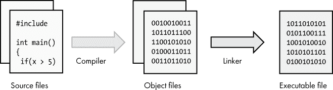
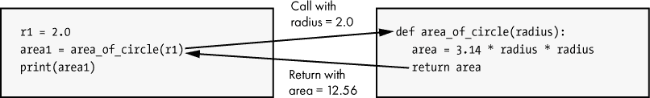
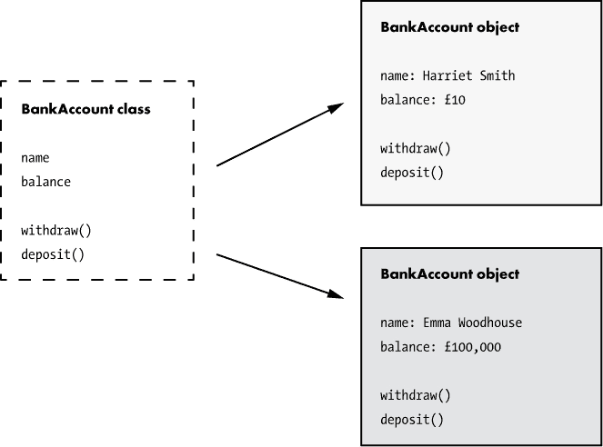
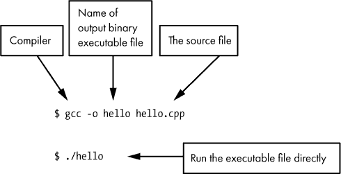
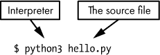
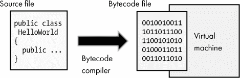

## 第九章：高级编程**


在上一章中，我们学习了软件的基础：运行在处理器上的机器代码，以及汇编语言，它是机器代码的人类可读表示。虽然最终所有软件都必须以机器代码的形式存在，但大多数软件开发人员在更高、更抽象的层次上工作。本章将介绍高级编程。我们将概述高级编程，讨论各种编程语言中常见的元素，并查看一些示例程序。

### 高级编程概述

尽管可以用汇编语言（甚至机器代码！）编写软件，但这样做既耗时又容易出错，而且结果是难以维护的软件。此外，汇编语言特定于某个 CPU 架构，因此如果汇编开发人员希望在另一种类型的 CPU 上运行程序，代码必须重写。为了克服这些不足，*高级编程语言*应运而生；它们允许程序以不依赖于特定 CPU 的语言编写，并且语法上更接近人类语言。这些语言中的许多需要一个*编译器*，即将高级程序语句转换为特定处理器的机器代码的程序。使用高级语言，软件开发人员可以编写一次程序，然后将其编译为多种类型的处理器，有时源代码几乎不需要改变或根本不需要改变。

编译器的输出是一个目标文件，包含特定处理器的机器代码。正如我们在项目 #12 中介绍的那样，目标文件并不是计算机可以执行的正确格式。另一个程序，称为*链接器*，用于将一个或多个目标文件转换为可执行文件，操作系统可以运行该文件。链接器还可以在需要时引入其他已编译的代码库。编译和链接的过程在图 9-1 中进行了说明。



*图 9-1：从源代码构建可执行软件*

编译和链接的过程被称为*构建*软件。然而，在日常使用中，软件开发人员有时会说他们在*编译*代码，但实际上是指整个编译、链接以及将代码转换为最终形式所需的其他步骤。编译器通常会自动调用链接步骤，使其对软件开发人员来说不太可见。

### C 和 Python 简介

学习高级编程的最佳方式是研究编程语言并用这些语言编写一些程序。在本章中，我选择了两种高级语言：C 和 Python。它们都是功能强大且实用的，并且能够展示编程语言如何以不同的方式提供类似的功能。我们首先简要介绍每种语言。

*C* 编程语言起源于 1970 年代初期，当时用于编写 Unix 操作系统的一个版本。尽管 C 是一种高级语言，但它与底层机器代码之间的距离并不遥远，这使得它成为操作系统开发或其他与硬件直接交互的软件的理想选择。80 年代时，C 的更新版本 *C++* 出现了。C 和 C++ 是功能强大的语言，几乎可以完成任何任务。然而，这些语言也很复杂，并且没有为程序员错误提供太多的保护措施。它们仍然是需要与硬件交互或者对性能要求高的软件（如游戏）的流行选择。C 也因其提供了从低级到高级概念的直观映射，在教育中非常有用，这也是我在本章选择它的原因。

与 C 语言相比，*Python* 编程语言与底层硬件的距离更远。Python 最初于 1990 年代发布，随着时间的推移，它的流行程度逐渐上升。它因易于阅读和对初学者友好而著称，同时仍提供了支持复杂软件项目所需的一切功能。Python 有着“自带电池”的理念，这意味着标准版 Python 包含了一系列开发者可以轻松使用的库，帮助他们在项目中快速开发。Python 的简洁特性使其成为教授编程概念的良好选择。

现在，让我们来看一下大多数高级编程语言中的一些元素。目标不是教你使用某一特定语言编程，而是让你熟悉编程语言中常见的思想。记住，高级编程语言中的功能是 CPU 指令的抽象。正如你所知道的，CPU 提供了内存访问、数学和逻辑运算、程序流控制等指令。我们来看看高级语言是如何暴露这些底层能力的。

### 注释

让我们从编程语言的一个特点开始，这个特点实际上并不会指示 CPU 执行任何操作！几乎所有的编程语言都提供了一种在代码中加入注释的方式。*注释*是源代码中的文本，用于提供对代码的某些解释。注释是供其他开发者阅读的，通常会被编译器忽略；它们对编译后的软件没有任何影响。在 C 语言中，注释的书写方式如下：

```
/* 

  This is a C-style comment.

  It can span multiple lines.

*/

// This is a single-line C comment, originally introduced in C++.
```

Python 使用井号字符（#）来表示注释，像这样：

```
# This is a comment in Python.
```

Python 并未提供对多行注释的特殊支持；程序员可以简单地使用多个单行注释，一行接一行。

### 变量

内存访问是处理器的基本功能，因此它必须是高级语言的一项特性。编程语言暴露内存的最基本方式就是通过变量。*变量*是内存中一个命名的存储位置。变量允许程序员为内存地址（或一段内存地址范围）指定一个*名称*，然后可以访问该地址上的数据。在大多数编程语言中，变量都有一个*类型*，表示它们保存的数据类型。例如，一个变量可以是整数类型或文本字符串类型。变量还具有*值*，即存储在内存中的数据。尽管这通常对程序员是隐藏的，但变量也有一个*地址*，即存储变量值的内存位置。最后，变量具有*作用域*，意味着它们只能从程序的某些部分访问，通常是它们“有效”的部分。

#### *C 语言中的变量*

让我们看一个 C 语言中变量的例子。

```
// Declare a variable and assign it a value in C.

int points = 27;
```

这段代码*声明*了一个名为 `points` 的变量，类型为 `int`，在 C 语言中，这意味着该变量保存一个整数。然后该变量被*赋值*为 `27`。当这段代码运行时，`27`（十进制）的值将被存储在一个内存地址中，但开发者不需要担心该变量被存储的具体地址。如今，大多数 C 语言编译器将 `int` 视为 32 位数值，因此在*运行时*（程序执行时），为该变量分配 4 字节内存（4 字节 × 每字节 8 位 = 32 位），并且该变量的内存地址指向第一个字节。

现在我们来声明第二个变量并赋值；然后我们可以查看这两个变量是如何在内存中分配的。

```
// Two variables in C

int points = 27;

int year = 2020;
```

现在我们有两个变量，`points` 和 `year`，它们一个接一个地声明。两个变量都是整数类型，因此每个变量需要 4 字节的存储空间。变量可以按照表 9-1 所示存储在内存中。

**表 9-1：** 存储在内存中的变量

| **地址** | **变量名称** | **变量值** |
| --- | --- | --- |
| `0x7efff1cc` | `?` | `?` |
| `0x7efff1d0` | `year` | `2020` |
| `0x7efff1d4` | `points` | `27` |
| `0x7efff1d8` | `?` | `?` |

在表 9-1 中使用的内存地址只是示例；实际地址会根据硬件、操作系统、编译器等不同因素而有所不同。请注意，地址是按四字节递增的，因为我们存储的是 4 字节的整数。已知变量之前和之后的地址，其变量名称和值用问号表示，因为根据前面的代码，我们无法知道这些位置可能存储的内容。

**注意**

*请参见项目 #14，位于第 184 页，在那里你可以查看内存中的变量*。

正如*变量*一词所暗示的，变量的值是可以改变的。如果我们之前的 C 程序需要将 `points` 的值设置为另一个值，我们可以在程序的后续部分简单地实现这一点：

```
// Setting a new points value in C

points = 31;
```

请注意，与我们之前的 C 代码示例不同，这段代码在变量名前并没有指定 `int` 或其他类型。我们只需要在变量首次声明时指定类型。在这种情况下，变量已经提前声明过，因此这里只是给它赋值。然而，C 语言要求变量的类型保持不变，所以一旦 `points` 被声明为 `int`，只能给该变量赋值整数类型。如果尝试赋值其他类型，比如文本字符串，则在编译代码时会失败。

#### *Python 中的变量*

并不是所有语言都要求声明类型。例如，Python 允许像这样声明并赋值一个变量：

```
# Python allows new variables without specifying a type.

age = 22
```

现在，在这种情况下，Python 识别到数据的类型是整数，但程序员并不需要指定这一点。与 C 不同，变量的类型可以随着时间变化，因此在 Python 中，以下代码是有效的：

```
# Assiging a variable a value of a different type is valid in Python.

age = 22

age = 'twenty-two'
```

让我们更详细地了解一下这个示例中实际发生了什么。一个 Python 变量没有类型，但它所引用的值有类型。这是一个重要的区别：类型是与值关联的，而不是与变量关联的。一个 Python 变量可以引用任何类型的值。因此，当给变量赋予新值时，实际上并不是变量的类型发生了变化，而是变量被绑定到了一个不同类型的值上。与此对比，在 C 中，变量本身具有类型，并且只能保存该类型的值。这一差异解释了为什么 Python 中的变量可以赋值不同类型的值，而 C 中的变量则不能。

**注意**

*请参见 项目 #15 和 第 186 页，在那里你可以更改 Python 中变量引用的值的类型*。

### 栈内存和堆内存

当程序员使用高级语言访问内存时，内存的管理细节会有所隐藏，这取决于所使用的编程语言。例如，像 Python 这样的编程语言使内存分配的细节几乎对程序员不可见，而像 C 这样的语言则暴露了一些底层的内存管理机制。无论这些细节是否对程序员可见，程序通常都会使用两种类型的内存：栈内存和堆内存。

#### *栈内存*

*栈*是一个按照*后进先出（LIFO）*模型工作的内存区域。也就是说，最后放入栈中的项是第一个被移除的项。你可以把内存栈想象成一叠盘子。当你向栈中添加新的盘子时，你把最新的盘子放到最上面。当你需要从栈中取出盘子时，你会首先取出最上面的盘子。这并不意味着栈中的项只能按 LIFO 顺序被*访问*（读取或修改）。实际上，栈中任何当前的项都可以随时被读取或修改。然而，在需要移除不再需要的项时，项会从栈顶向下被丢弃，意味着最后放入栈中的项会首先被移除。

栈顶值的内存地址存储在一个称为*栈指针*的处理器寄存器中。当一个值被添加到栈顶时，栈指针的值会被调整，以增加栈的大小并为新值腾出空间。当一个值从栈顶被移除时，栈指针会被调整，以减小栈的大小。

编译器生成的代码利用栈来跟踪程序执行的状态，并作为存储局部变量的地方。这些机制对于使用高级语言的程序员来说是透明的。图 9-2 展示了 C 程序如何利用栈存储我们在表 9-1 中提到的两个局部变量。


*图 9-2：栈内存用于存储用 C 语言编写的程序中的变量值。*

在图 9-2 中，`points`变量首先被声明，并被赋值为`27`，这个值存储在栈上。接下来，`year`变量被声明并赋值为`2020`。第二个值被放置在栈上第一个值的“上方”。更多的值将继续被添加到栈的顶部，直到不再需要为止，这时它们将从栈中移除。请记住，图中的每个槽只是内存中的一个位置，并分配有内存地址，尽管图中没有显示这些地址。你可能会感到惊讶，许多架构中，栈分配的内存地址实际上是*递减*的。以这个例子来说，意味着`year`变量的内存地址低于`points`变量的地址。

栈内存速度快，非常适合于具有有限作用范围的小内存分配。每个执行线程在程序中都会有一个单独的栈。我们将在第十章中更详细地讨论线程，但现在你可以把线程看作是程序中的并行任务。栈是一种有限的资源；分配给栈的内存是有上限的。如果将太多的值放入栈中，会导致一种叫做*栈溢出*的错误。

#### *堆*

堆栈用于存储只需要临时使用的小型值。对于需要更大内存或需要长期存在的内存分配，堆更为合适。*堆*是程序可用的一块内存池。与堆栈不同，堆内存并不采用先进后出（LIFO）模型；堆内存的分配没有标准模型。而堆栈内存特定于某个线程，来自堆的内存分配可以被程序的任何线程访问。

程序从堆中分配内存，且该内存的使用会持续到程序释放或程序终止。*释放*内存分配意味着将其归还给可用内存池。当某个分配不再被引用时，一些编程语言会自动释放堆内存；这种方法通常被称为*垃圾回收*。其他编程语言，如 C，则要求程序员编写代码来释放堆内存。如果未释放未使用的内存，就会发生*内存泄漏*。

在 C 编程语言中，有一种特殊的变量叫做*指针*，用于追踪内存分配。指针实际上是一个存储内存地址的变量。指针值（即内存地址）可以存储在堆栈上的局部变量中，而该值可以指向堆中的某个位置，正如图 9-3 所示。


*图 9-3：名为`data`的指针变量位于堆栈上，并指向堆中的某个地址。*

在图 9-3 中，我们有一段声明了名为`data`的变量的代码。该变量类型为`void *`，这意味着它是一个指针（由`*`表示），指向一个可以存储任何类型数据的内存地址（`void`表示类型未指定）。因为`data`是一个局部变量，它被分配在堆栈上。接下来的代码调用了`malloc`，这是 C 语言中一个从堆中分配内存的函数。程序请求分配 512 字节的内存，`malloc`函数返回新分配内存的第一个字节的地址。这个地址存储在堆栈上的`data`变量中。最终，我们在堆栈上的某个地址处得到了一个局部变量，这个变量存储着堆内存分配的地址。

**注意**

*请参见项目#16（在第 187 页），你可以亲自查看程序运行时变量是如何分配的。*

### 数学

由于处理器提供了执行数学运算的指令，高级语言也提供了相应的指令。与汇编语言编程不同，汇编语言中需要针对数学运算指定具体的命名指令（例如在 ARM 处理器上使用`subs`指令进行减法），高级语言通常使用符号来表示常见的数学运算，这使得在代码中进行数学运算变得非常简单。许多编程语言，包括 C 语言和 Python，使用相同的运算符表示加法、减法、乘法和除法，具体如表 9-2 所示。

**表 9-2：** 常见数学运算符

| **操作** | **运算符** |
| --- | --- |
| 加法 | `+` |
| 减法 | `-` |
| 乘法 | `*` |
| 除法 | `/` |

另一个在多种编程语言中常见的约定是使用等号（`=`）表示赋值，而不是表示相等。也就是说，像`x = 5`这样的语句意味着*将* x 的值设置为 5。将数学运算的结果赋给一个变量的表示方式是自然的，比如在这些语句中：

```
// Addition is easy in C.

cost = price + tax;
```

```
# Addition is easy in Python too.

cost = price + tax
```

到目前为止，我们关注的是在计算中常见的整数运算。然而，计算机和高级语言也支持一种叫做*浮点运算*的数学运算。与表示整数的整数不同，浮点值可以表示小数。一些编程语言隐藏了这部分细节，但在内部，CPU 使用与整数运算不同的指令来执行浮点运算。在 C 语言中，浮点变量通过浮点类型声明，如`float`或`double`，如下所示：

```
// Declaring a floating-point variable in C

double price = 1.99;
```

另一方面，Python 会推断变量类型，因此整数和浮点值的声明方式是相同的：

```
# Declaring integer and floating-point varibles in Python

year  = 2020 # year is an int

price = 1.99 # price is a float
```

整数和浮点数之间的差异有时会导致意外的结果。例如，假设你有以下的 C 语言代码：

```
// Dividing integers in C

int x = 5;

int y = 2;

int z = x / y;
```

你期望`z`的值是多少？结果发现，由于所有参与运算的数值都是整数，`z`最终的值是`2`。不是`2.5`，而是`2`。作为整数，`z`不能保存小数值。

现在如果我们稍微改变一下代码，像这样：

```
// Dividing integers in C, result stored in a float

int x = 5;

int y = 2;

float z = x / y;
```

请注意，`z`现在是`float`类型。现在你期望`z`的值是多少？有趣的是，`z`现在等于`2.0`，它依然不是`2.5`！这是因为除法运算发生在两个整数之间，所以结果也是一个整数。除法的结果是`2`，当这个值赋给浮点类型的变量`z`时，它被赋值为`2.0`。C 语言是非常字面化的；它被编译成紧密反映程序员指令的机器码。这对于需要精确控制处理过程的程序员来说是很棒的，但对于那些希望编程语言行为更直观的程序员来说，则不总是那么理想。

Python 尝试更智能地处理，自动分配一个允许小数结果的类型，在这种情况下。如果我们在 Python 中写出等效的代码，存储在 `z` 中的结果将是 `2.5`。

```
# Dividing integers in Python

# z will be 2.5 and its inferred type is float

x = 5

y = 2

z = x / y
```

一些编程语言提供了数学运算符，这些运算符是表示操作的一种简洁方式。例如，C 语言提供了增量（加 1）和减量（减 1）运算符，如下所示：

```
// In C, we can add one to a variable the long way,

x = x + 1;

// or we can use this shortcut to increment x.

x++;

// On the other hand, this will decrement x.

x--;
```

**注意**

*有趣的事实：编程语言 C++ 的名称意味着它是在 C 语言的基础上进行改进或增量的语言*。

Python 还提供了一些数学运算的快捷方式。`+=` 和 `-=` 运算符允许程序员对变量进行加法或减法。例如：

```
# In Python, we can add 3 to a variable like this...

cats = cats + 3

# Or we can do the same thing with this shortcut...

cats += 3
```

`+=` 和 `-=` 运算符在 C 语言中也同样适用。

### 逻辑

如前所述，处理器非常擅长执行逻辑运算，因为逻辑是数字电路的基础。正如你所预期的那样，编程语言也提供了处理逻辑的能力。大多数高级语言提供了两种操作逻辑的运算符：位运算符，作用于整数的比特；布尔运算符，作用于布尔（真/假）值。这里的术语可能会让人困惑，因为不同的编程语言使用不同的术语。Python 使用“位运算”和“布尔”，而 C 语言使用“位运算”和“逻辑”，其他语言则使用其他术语。在这里我们坚持使用“位运算”和“布尔”。

#### *位运算符*

*位运算符* 作用于整数值的单个比特，并返回一个整数值。位运算符就像数学运算符，但它不是进行加法或减法，而是在整数的比特上执行与（AND）、或（OR）或其他逻辑操作。这些运算符依据第二章中讨论的真值表工作，平行地对整数的所有比特执行操作。

许多编程语言，包括 C 和 Python，使用表 9-3 中显示的运算符集合来进行位运算。

**表 9-3：** 编程语言中常见的位运算

| **位运算** | **位运算符** |
| --- | --- |
| 与 | `&` |
| 或 | `&#124;` |
| 异或 | `^` |
| 非（补码） | `~` |

让我们来看一个 Python 中的位运算示例。

```
# Python does bitwise logic.

x = 5

y = 3

a = x & y

b = x | y
```

上述代码的结果是 `a` 为 1，`b` 为 7。让我们通过二进制（图 9-4）来看这些操作，以便清楚地了解为什么会是这样。


*图 9-4：5 和 3 的位与、位或运算*

首先查看图 9-4 中的与运算；回想一下第二章中提到的与运算规则，当两个输入都为 1 时，结果为 1。我们逐列查看这些位，如你所见，只有最右侧的位在两个输入中都是 1。因此，与运算的结果是 0001 二进制，或 1 十进制。因此，在之前的代码中，`a` 被赋值为 1。

另一方面，OR 表示如果任一输入（或两个输入中的任何一个）为 1，则结果为 1。在这个例子中，右边三个二进制位中有一个输入或另一个输入的位都为 1，所以结果是二进制 0111，或十进制 7。因此，`b` 在前面的代码中被赋值为 7。

**练习 9-1：位运算符**

请考虑以下 Python 语句。这段代码执行后，`a`、`b` 和 `c` 的值会是什么？

```
x = 11

y = 5

a = x & y

b = x | y

c = x ^ y
```

答案可以在 附录 A 找到。

#### *布尔运算符*

高级编程语言中的另一类逻辑运算符是 *布尔运算符*。这些运算符作用于布尔值并返回布尔值。

让我们花一点时间讨论布尔值。*布尔值* 只能是真或假。不同的编程语言以不同的方式表示真或假。*布尔变量* 是一个命名的内存地址，它保存一个布尔值，即真或假。例如，我们可以在 Python 中定义一个变量来追踪某个物品是否在销售：`item_on_sale = True`。

表达式可以在不将结果存储到变量中的情况下评估为真或假。例如，表达式 `item_cost > 5` 在运行时根据 `item_cost` 变量的值评估为真或假。

布尔运算符允许我们对布尔值执行逻辑操作，例如 AND、OR 或 NOT。例如，我们可以使用 Python 的布尔 AND 运算符检查两个条件是否都为真：`item_on_sale` 和 `item_cost > 5`。`and` 左右两边的表达式会评估为布尔值，整个表达式的结果也将是布尔值。在这里，C 和 Python 使用不同的运算符，如 表 9-4 所示。

**表 9-4：** C 和 Python 编程语言中的布尔运算符

| **布尔运算** | **C 运算符** | **Python 运算符** |
| --- | --- | --- |
| 与 | `&`& | `and` |
| 或 | `&#124;&#124;` | `or` |
| 非 | `!` | `not` |

在我们讨论返回布尔值的运算符时，*比较运算符* 会比较两个值，并根据比较结果评估为真或假。例如，*大于运算符* 允许我们比较两个数字并确定其中一个是否大于另一个。表 9-5 显示了 C 和 Python 中使用的比较运算符。

**表 9-5：** C 和 Python 编程语言中的比较运算符

| **比较操作** | **比较运算符** |
| --- | --- |
| 等于 | `==` |
| 不等于 | `!=` |
| 大于 | `>` |
| 小于 | `<` |
| 大于或等于 | `>=` |
| 小于或等于 | `<=` |

你已经看到过其中一个例子，我们之前提到的`item_cost > 5`。请注意相等运算符。C 语言和 Python 都使用双等号表示相等比较，使用单等号表示赋值。这意味着`x == 5`是一个比较，返回`true`或`false`（`x`是否等于`5`？），而`x = 5`是一个赋值，将`x`的值设为`5`。

### 程序流程

布尔运算符和比较运算符让我们能够评估表达式的真假，但仅此并不十分有用。我们需要一种方式来响应这些评估结果！*程序流程*，或称*控制流*语句，使我们能够做出响应，在某些条件下改变程序的行为。让我们来看看不同编程语言中常见的程序流构造。

#### *If 语句*

*if 语句*，通常与*else 语句*一起使用，允许程序员在某个条件为真时执行某些操作。反过来，`else`语句允许程序在条件为假时执行不同的操作。以下是 Python 中的一个例子：

```
  # Age check in Python

❶ if age < 18:

    ❷ print('You are a youngster!')

❸ else:

    ❹ print('You are an adult.')
```

在这个例子中，第一个`if`语句 ❶ 检查`age`变量是否小于 18。如果是，它会打印一条信息，表示用户很年轻 ❷。`else`语句 ❸ 告诉程序，如果`age`大于或等于 18，则打印另一条消息 ❹。

这里是相同的“年龄检查”逻辑，这次用 C 语言编写：

```
  // Age check in C

  if (age < 18)

❶ {

    printf("You are a youngster!");

❷ }

  else

  {

    printf("You are an adult.");

  }
```

在 C 语言示例中，注意在`if`语句后使用的大括号 ❶❷。这些大括号标记了一段应该在`if`语句响应下执行的代码块。在 C 语言中，代码块可以由多行代码组成，尽管在代码块只有一行时，可以省略大括号。Python 不使用大括号来限制代码块，而是使用缩进。在 Python 中，连续在同一缩进级别（比如四个空格）的行被视为同一代码块的一部分。

Python 还包含了`elif`语句，表示“else if”。只有在前面的`if`或`elif`语句为假时，`elif`语句才会被评估。

```
# A better age check in Python

if age < 13:

    print('You are a youngster!')

elif age < 20:

    print('You are a teenager.')

else:

    print('You are older than a teen.')
```

在 C 语言中，使用`else`和`if`结合的方式可以完成相同的功能：

```
// A better age check in C

if (age < 13)

  printf("You are a youngster!");

else if (age < 20)

  printf("You are a teenager!");

else

  printf("You are older than a teen.");
```

请注意，我也省略了大括号，因为我的所有代码块都是单行的。

#### *循环*

有时候，程序需要反复执行某个操作。*while 循环*允许代码重复运行，直到某个条件满足。在下面的 Python 示例中，使用`while`循环打印从 1 到 20 的数字。

```
# Count to 20 in Python.

n = 1

while n <= 20:

    print(n)

    n = n + 1
```

最初，变量`n`被设置为`1`。`while`循环开始，表示循环应该在`n`小于或等于`20`时运行。由于`n`是`1`，它满足条件，因此`while`循环的主体开始执行，打印`n`的值并将其加 1。现在`n`等于`2`，代码返回到`while`循环的顶部。这个过程会一直继续，直到`n`等于`21`，此时它不再满足`while`循环的要求，所以循环结束。

以下是相同功能在 C 语言中的实现。

```
// Count to 20 in C.

int n = 1;

while(n <= 20)

{

  printf("%d\n", n);

  n++;

}
```

在这两个示例中，`while`循环的主体会递增`n`的值。实际上，有一种更简洁的方式来做这件事。*for 循环*允许对一系列数字或值的集合进行迭代，从而使程序员能够对每个项执行某些操作。这里有一个 C 语言示例，它会打印从 1 到 10 的数字。

```
  // C uses a for loop to iterate over a numeric range.

  // This will print 1 through 10.

  for(❶int x = 1; ❷x <= 10; ❸x++)

  {

❹ printf("%d\n", x);

  }
```

`for`循环声明了`x`并将其初始值设置为`1`❶，指定循环将在`x`小于或等于`10`时继续❷，最后声明在循环体执行后应递增`x`的值❸。通过将所有这些信息写在一行`for`语句中，我们可以更容易地看到循环运行的条件。`for`循环的主体只是打印出`x`的值❹。

Python 采用了不同的方式处理`for`循环，允许程序对集合中的每个项执行重复操作。以下是一个 Python 示例，它会打印出列表中的动物名称。

```
# Python uses a for loop to iterate over a collection.

# This will print each animal name in animal_list.

animal_list = ['cat', 'dog', 'mouse']

for animal in animal_list:

    print(animal)
```

首先，声明一个动物名称的列表并将其赋值给名为`animal_list`的变量。在 Python 中，列表是一个有序的值集合。接下来，`for`循环声明代码块会对`animal_list`中的每个项执行一次，每次运行时，列表中的当前值会被赋给`animal`变量。因此，第一次执行循环时，`animal`等于`cat`，程序会打印出`cat`。下一次执行时打印出`dog`，最后一次执行时打印出`mouse`。

### 函数

循环允许一组指令连续执行多次。然而，程序中也常常需要执行一组特定的指令多次，但不一定在循环中执行。相反，这些指令可能需要从程序的不同部分、不同时间、以及不同的输入和输出中调用。当程序员意识到某些代码在多个地方都需要时，他们可能会将这些代码编写成一个函数。*函数*是一组程序指令，可以被其他代码调用。函数可以选择接受输入（称为*参数*）并返回输出（称为*返回值*）。不同的高级编程语言可能使用不同的术语来描述函数，包括*子例程*、*过程*或*方法*。在某些情况下，这些不同的名称可能传达略有不同的含义，但为了简化，我们就使用函数这一术语。

将字符字符串转换为小写、将文本打印到屏幕以及从互联网下载文件，都是你可以通过可重用的代码（以函数形式）实现的例子。程序员希望避免多次键入相同的代码。这样做会导致维护多个相同代码的副本，并增加程序的整体大小。这违反了一个软件工程原则，即*不要重复自己（DRY）*，该原则鼓励减少重复代码。

函数是封装的另一个例子。我们之前在硬件上下文中看到过封装，在这里我们再次看到它，这次是在软件中。函数封装了代码块的内部细节，同时提供了一个接口来使用该代码。希望使用函数的开发者只需要了解其输入和输出；而不需要完全理解函数内部的工作原理。

#### *定义函数*

函数必须在使用之前定义。一旦定义，你可以通过调用它来使用函数。*函数定义*包括函数名称、输入参数、函数的程序语句（称为*函数体*），以及在某些语言中，返回值类型。这里我们有一个示例 C 函数，用于计算给定半径的圆的面积。

```
  // C function to calculate the area of a circle

❶ double ❷areaOfCircle(❸double radius)

  {

    double area = 3.14 * radius * radius;

  ❹ return area;

  }
```

`double` 类型在开头 ❶ 表明该函数返回一个浮动点数（`double` 是 C 语言中的浮动点类型之一）。该函数有一个名称，`areaOfCircle` ❷，旨在传达该函数的作用——在本例中，计算圆的面积。该函数接受一个输入参数，名为 `radius` ❸，其类型也是 `double`。

在大括号之间是函数的主体，定义了函数的具体实现。我们声明了一个名为 `area` 的局部变量，它的类型也是 `double`。面积通过 `π` × radius² 来计算并赋值给 `area` 变量。最后，函数返回 `area` 变量的值 ❹。请注意，`area` 变量的作用域是有限的；它无法在函数外部访问。当函数返回时，局部变量 `area` 会被丢弃（它可能被存储在栈上），但其值会通过处理器寄存器返回给调用者。

以下是一个类似的面积函数，这次是用 Python 编写的。

```
# Python function to calculate the area of a circle

def area_of_circle(radius)

    area = 3.14 * radius * radius

    return area
```

让我们对比这两个函数示例。它们都通过 `π` × radius² 来计算 `area`，然后返回该值。两者都接受一个名为 `radius` 的输入参数。C 语言版本显式定义了返回类型为 `double`，以及 `radius` 的类型为 `double`，而 Python 版本则不需要声明类型。Python 用 `def` 关键字来标识函数定义的开始。

#### *调用函数*

在程序中定义一个函数并不足以确保该函数能够执行。函数定义只是让其他代码可以在需要时调用该函数。这种调用被称为*函数调用*。调用代码传递所需的参数并将控制权交给函数。然后，函数执行其代码并将控制权（及任何输出）返回给调用者。下面演示了如何在 C 中调用我们的示例函数：

```
// Calling a function twice in C, each time with a different input

double area1 = areaOfCircle(2.0);

double area2 = areaOfCircle(38.6);
```

并且在 Python 中：

```
# Calling a function twice in Python

area1 = area_of_circle(2.0)

area2 = area_of_circle(38.6)
```

一旦函数返回，调用代码需要将返回值存储到某个地方。在两个示例中，都声明了变量`area1`和`area2`来保存函数调用的返回值。在两种语言中，`area1`的值为 12.56，`area2`的值为 4,678.4744。实际上，调用代码可以忽略返回值，而不将其赋给变量，但考虑到该函数的用途，这样做并不太有用。图 9-5 展示了调用函数如何暂时将控制权交给该函数。



*图 9-5：调用一个函数*

在图 9-5 中，左侧的 Python 代码调用了`area_of_circle`函数，并将输入参数`radius`的值设置为`2.0`。左侧的代码随后等待右侧函数完成工作。一旦函数返回，左侧的代码将返回值存储在变量`area1`中，然后继续执行。

#### *使用库*

尽管程序员会为自己的使用定义函数，但编程中的一个重要部分是知道如何最好地利用其他人已经编写的函数。编程语言通常包括一套称为*标准库*的函数集合。在这个上下文中，*库*是供其他软件使用的代码集合。C 和 Python 都包括标准库，提供诸如打印到控制台、处理文件和文本处理等功能。Python 的标准库尤其庞大且广受好评。尽管并非总是如此，大多数编程语言的实现都会包含该语言的标准库，因此程序员可以依赖这些函数。

**注意**

*请参见项目 #17 在第 189 页，您可以在这里运用所学知识编写一个简单的猜数字游戏。这包括使用 Python 标准库*。

除了标准库之外，还有许多编程语言的附加函数库可供使用。开发人员编写库供他人使用，并以源代码或编译文件的形式共享这些库。这些库有时以非正式方式共享，某些编程语言具有已知且被接受的库发布机制。共享的库集合称为*包*，而用于共享这些包的系统称为*包管理器*。C 语言有多个包管理器，但没有一个被 C 程序员普遍接受为标准。Python 自带的包管理器叫做`pip`。`pip`使得安装社区开发的 Python 软件库变得非常简单，Python 开发者常常使用它。

### 面向对象编程

编程语言旨在支持特定的*范式*，或者说是编程的方法。例如，包括过程式编程、函数式编程和面向对象编程等。一个语言可能被设计来支持一种或多种范式，而软件开发者则需根据某种范式使用该语言。让我们来看一个流行的范式：*面向对象编程*，这是一种将代码和数据组合在一起的编程方法，这种组合被称为*对象*。对象旨在以一种模拟现实世界概念的方式，表示数据和功能的逻辑分组。

面向对象编程语言通常采用基于类的方法。*类*是对象的蓝图。从类创建的对象被称为该类的*实例*。在类中定义的函数称为*方法*，而在类中声明的变量称为*字段*。在 Python 中，对于每个类实例有不同值的字段称为*实例变量*，而在所有实例中具有相同值的字段则称为*类变量*。

例如，可以编写一个描述银行账户的类。这个银行账户类可能有一个表示余额的字段，一个表示持有人姓名的字段，以及用于取款和存款的方法。该类描述的是一个通用的银行账户，但直到从该类创建一个银行账户对象，才会存在特定的银行账户实例。这在图 9-6 中得到了说明。



*图 9-6：银行账户对象是从银行账户类创建的。*

正如你在图 9-6 中看到的，`BankAccount`类描述了银行账户的字段和方法，帮助我们理解银行账户的样子。已经创建了两个`BankAccount`类的实例。这些对象是具体的银行账户，并且已分配了名称和余额。我们可以使用每个对象的`withdraw`或`deposit`方法来修改其`balance`字段。在 Python 中，向名为`myAccount`的银行账户对象存款的代码如下所示，这将使其`balance`字段增加 25：

```
myAccount.deposit(25)
```

**注意**

*请参见项目#18，该项目在第 190 页中，您可以尝试实现刚才描述的银行账户类的 Python 实现。*

### 编译或解释

如前所述，源代码是开发者最初编写的程序文本，通常不是用 CPU 直接理解的编程语言编写的。CPU 只理解机器语言，因此需要额外的步骤：源代码必须被编译成机器码，或在运行时通过其他代码解释。

在*编译型语言*中，例如 C，源代码会被转换为机器指令，可以直接由处理器执行。这个过程在本章的“高级编程概述”一节中已经描述过，见第 160 页。源代码在开发过程中被编译，编译后的可执行文件（有时称为*二进制文件*）会被交付给最终用户。当最终用户运行二进制文件时，他们不需要访问源代码。编译后的代码通常运行得更快，但只在为其编译的架构上运行。图 9-7 展示了开发者如何使用 GNU C 编译器（`gcc`）从命令行编译并运行 C 程序的示例。



*图 9-7：将 C 源文件编译为可以独立运行的可执行文件*

在*解释型语言*中，例如 Python，源代码不会提前编译。相反，它会被一个叫做*解释器*的程序读取，并执行程序的指令。实际上运行在 CPU 上的是解释器的机器代码。使用解释型语言的开发者可以分发源代码，最终用户可以直接运行，而无需复杂的编译步骤。在这种情况下，开发者不需要担心为多个平台编译代码——只要用户的系统中安装了适当的解释器，就可以运行代码。这样分发的代码是平台无关的。

解释型代码通常比编译型代码运行得慢，因为在运行时需要进行解释。分发解释型代码时，最好是在用户已经安装了所需的解释器，或者用户技术足够熟练，安装解释器不是问题。否则，开发者需要将解释器与软件打包，或者指导用户安装解释器。图 9-8 展示了从命令行运行 Python 程序的示例，假设已经安装了 Python 3 版本的解释器。请注意，Python 源代码文件 *hello.py* 直接提供给了解释器——无需中间步骤。



*图 9-8：Python 解释器运行 Python 源代码。*

有些语言使用的是这两种方法的混合体。这些语言会编译成*中间语言*或*字节码*。字节码类似于机器代码，但它不是针对特定硬件架构，而是设计成在虚拟机上运行，如图 9-9 所示。



*图 9-9：字节码编译器将源代码转化为在虚拟机中运行的字节码。*

在此上下文中，*虚拟机*是一种旨在运行其他软件的软件平台。虚拟机提供虚拟的 CPU 和执行环境，抽象出真实底层硬件和操作系统的细节。例如，Java 源代码被编译成 Java 字节码，然后在 Java 虚拟机中运行。类似地，C# 源代码被编译成通用中间语言（CIL），并在 .NET 公共语言运行时（CLR）虚拟机中运行。CPython，Python 的原始实现，实际上在运行前将 Python 源代码转换为字节码，尽管这是 CPython 解释器的实现细节，对 Python 开发者来说大多是隐藏的。使用字节码的编程语言在保持解释型语言的跨平台独立性的同时，也保留了一些编译代码的性能提升。

### 在 C 中计算阶乘

为了总结我们对高级编程的了解，让我们来看看阶乘算法的实现，这次使用 C 语言。我们之前在 ARM 汇编中做过类似的事情，所以看到 C 中的相同逻辑可以很好地对比汇编语言和高级语言之间的差异。这个 C 代码使用了我们刚刚介绍的一些概念。我选择使用 C 而不是 Python，因为 C 是编译语言，我们可以检查编译后的机器代码。以下是一个简单的 C 函数，用于计算一个数的阶乘：

```
// Calculate the factorial of n.

int factorial(int n)

{

  int result = n;

  while(--n > 0)

  {

    result = result * n;

  }

  return result;

}
```

其他代码可以调用这个函数，传递`n`参数作为需要计算阶乘的值。然后函数会在内部计算阶乘值，将其存储在局部变量`result`中，并将计算结果返回给调用者。就像我们在第八章中使用汇编代码一样，接下来我们通过练习深入探索这段代码。

**练习 9-2：在脑海中运行 C 程序**

尝试在脑海中运行前面的阶乘函数，或者使用铅笔和纸。假设输入值为`n` = 4。当函数返回时，返回的结果应该是预期的值 24。我建议你在每一行之前和之后，跟踪`n`和`result`的值。按步骤执行代码，直到你到达`while`循环的末尾，看看是否得到预期的结果。答案在附录 A 中。

请注意，`while` 循环的条件（`--n` > 0）将递减操作符（`--`）放在变量 `n` 之前。这意味着 `n` 会在与 0 比较之前被递减。每次评估 `while` 循环条件时，都会发生这种情况。

我希望你能觉得我们算法的 C 版本比 ARM 汇编版本更易读！这个版本的阶乘代码的另一个主要优点是它不依赖于特定的处理器类型。只要有合适的编译器，它就可以为任何处理器编译。如果你将之前的 C 代码编译到 ARM 处理器上，你会看到生成的机器代码与我们之前分析的 ARM 汇编非常相似。你将在项目 #19 中有机会亲自尝试，但现在我已经为你编译并反汇编了代码：

```
Address   Assembly

0001051c  sub     r3, r0, #1

00010520  cmp     r3, #0

00010524  bxle    lr

00010528  mul     r0, r3, r0

0001052c  subs    r3, r3, #1

00010530  bne     00010528

00010534  bx      lr
```

如你所见，从 C 源代码生成的代码与我们在第八章中讨论的汇编阶乘示例非常相似。虽然有一些差异，但这些细节与我们的讨论无关。这里需要注意的是，一个程序可以用像 C 这样的高级语言编写，编译器可以做繁重的工作，把高级语句翻译成机器代码。你可以看到，使用高级语言进行开发可以简化开发者的工作，但最终我们仍然得到的是机器代码的字节，因为处理器需要的是这些。

**注意**

*请参阅项目 #19 中的内容，位于第 191 页，你可以尝试编译然后反汇编一个 C 语言的阶乘程序*。

这里发生了一些有趣的事情，我希望你没有错过。我们从用 C 编写的源代码开始，编译成机器代码，然后反汇编成汇编语言。这意味着，如果你电脑上有一个编译后的程序或软件库，你可以把它当作汇编语言来查看！你可能无法访问原始源代码，但程序的汇编版本就在你手边。

我们一直在研究专门为 ARM 处理器编写的机器代码和汇编语言，但正如前面所提到的，使用像 C 这样的高级语言进行开发的一个优点是，同样的代码可以为不同的处理器编译。事实上，只要代码没有使用特定操作系统的功能，同样的代码甚至可以为另一个操作系统编译。为了说明这一点，我已经将相同的阶乘 C 代码为 32 位 x86 处理器编译，这次是在 Windows 而不是 Linux 上。以下是生成的机器代码，以汇编语言显示：

```
Address   Assembly

00406c35  mov     ecx,dword ptr [esp+4]

00406c39  mov     eax,ecx

00406c3b  jmp     00406c40

00406c3d  imul    eax,ecx

00406c40  dec     ecx

00406c41  test    ecx,ecx

00406c43  jg      00406c3d

00406c45  ret
```

我不会详细说明这段代码的细节，但你可以随意研究 x86 指令集并自行解读代码。我希望你从这个例子中获得的主要收获是，高级语言，如 C，允许开发者编写比汇编更易于理解的代码，而且可以轻松地为各种处理器编译。

### 总结

本章介绍了高级编程语言。这些语言独立于特定的 CPU，语法上更接近人类语言。你了解了编程语言中常见的元素，如注释、变量、函数和循环功能。你看到这些元素在两种编程语言中的表现：C 和 Python。最后，我们检查了一个 C 语言的示例程序，并看到了通过编译高级代码生成的反汇编机器码。

在下一章，我们将介绍操作系统。我们将首先概述操作系统提供的功能，了解不同种类的操作系统家庭，并深入探讨操作系统的工作原理。过程中，你将有机会探索 Raspberry Pi OS，它是为 Raspberry Pi 定制的 Linux 版本。

**项目 #14：检查变量**

前提条件：一台运行 Raspberry Pi OS 的 Raspberry Pi。如果你还没看过，建议你翻到附录 B，阅读第 341 页中关于“Raspberry Pi”的全部内容。

在这个项目中，你将编写使用变量的高级代码，并检查它在内存中的工作原理。使用你喜欢的文本编辑器，在主文件夹的根目录下创建一个名为 *vars.c* 的新文件。将以下 C 代码输入到文本编辑器中（你不必保留缩进和空行，但要确保保持换行）。

```
#include <stdio.h>❶

#include <signal.h>

int main()❷

{

  int points = 27;❸

  int year = 2020;❹

  printf("points is %d and is stored at 0x%08x\n", points, &points);❺

  printf("year is %d and is stored at 0x%08x\n", year, &year);

  raise(SIGINT);❻

  return 0;

}
```

在继续之前，让我们检查一下源代码。它首先包含了几个头文件 ❶。这些文件包含了 C 编译器所需的有关 `printf` 和 `raise` 函数的细节，这些函数将在程序中稍后使用。接下来你会看到定义了 `main` 函数 ❷；这是程序的入口点，执行从这里开始。程序随后声明了两个整型变量，`points` ❸ 和 `year` ❹，并为它们赋值。然后它打印出变量的值及其内存地址（以十六进制表示） ❺。`raise(SIGINT)` 语句会导致程序停止执行 ❻。这不是你在用户运行的代码中通常会做的事情；这是一种我们用来帮助调试的技术。

文件保存后，使用 GNU C 编译器（`gcc`）将你的代码编译成可执行文件。在 Raspberry Pi 上打开终端并输入以下命令以调用编译器。该命令以 *vars.c* 作为输入，编译并链接代码，并输出名为 *vars* 的可执行文件。

```
$ gcc -o vars vars.c
```

现在尝试使用以下命令运行编译后的代码。程序应该会打印出程序中两个变量的值和地址。

```
$ ./vars
```

在确认程序工作正常后，通过 GNU 调试器（`gdb`）运行它，并检查内存中的变量。

```
$ gdb vars
```

此时 `gdb` 已经加载了文件，但还没有执行任何指令。在 `(gdb)` 提示符下，输入以下命令来运行程序，直到执行 `raise(SIGINT)` 语句为止。

```
(gdb) run
```

一旦程序返回到`(gdb)`提示符，你应该会看到几行输出，其中打印了变量的值和内存地址。接下来，你可能还会看到一条可能让你担心的消息：“没有此类文件或目录”——你可以忽略它。这只是调试器试图查找某个在你的系统上不存在的源代码。你需要关注的输出应该是类似这样的内容：

```
Starting program: /home/pi/vars

points is 27 and is stored at 0x7efff1d4

year is 2020 and is stored at 0x7efff1d0
```

现在你已经知道了内存地址，并且由于你恰好在调试器中，你可以开始检查这些地址处存储的内容。在这个输出中，你可以看到`year`存储在较低的地址处，`points`存储在 4 个字节之后，因此你将从`year`变量的地址开始转储内存，在我的例子中是`0x7efff1d0`。你的地址可能会不同。以下命令会从地址`0x7efff1d0`开始，在内存中转储三个 32 位的值，以十六进制表示。如果地址不同，请将`0x7efff1d0`替换为你系统上`year`的地址。

```
(gdb) x/3xw 0x7efff1d0

0x7efff1d0:     0x000007e4      0x0000001b      0x00000000
```

你可以看到，存储在`0x7efff1d0`的值是`0x000007e4`。这在十进制中是 2020，正是预期的`year`值。而存储在 4 个字节之后的值是`0x0000001b`，即 27 十进制，正是预期的`points`值。内存中的下一个值恰好是 0，并不是我们的变量之一。内存通常以十六进制形式进行检查，但如果你想看到这些值的十进制表示，可以使用以下命令：

```
(gdb) x/3dw 0x7efff1d0

0x7efff1d0:     2020    27      0
```

你正在查看 32 位（4 字节）内存块，因为这是这个程序中使用的变量大小。但实际上内存是按字节寻址的，也就是说，每个字节都有自己的地址。这就是为什么`points`的地址比`year`的地址大 4 个字节的原因。让我们改为按字节查看相同的内存范围：

```
(gdb) x/12xb 0x7efff1d0

0x7efff1d0:     0xe4    0x07    0x00    0x00    0x1b    0x00    0x00    0x00

0x7efff1d8:     0x00    0x00    0x00    0x00
```

查看`year`的值，这里加以强调。请注意，最低有效字节（`0xe4`）首先出现。这是由于小端数据存储方式，正如在第 156 页的项目 #13 中讨论的那样。你可以使用`q`退出`gdb`（即使调试会话仍然处于活动状态，它会询问你是否要退出；回答`y`）。**项目 #15：更改 Python 中变量引用值的类型**

前提条件：一台运行 Raspberry Pi OS 的树莓派。如果你还没有阅读过，我建议你翻到附录 B，阅读第 341 页上的“树莓派”部分。

在这个项目中，你将编写代码，将一个 Python 变量设置为某种类型的值，然后将该变量更新为引用另一种类型的值。使用你喜欢的文本编辑器，在主目录下创建一个名为*vartype.py*的新文件。在文本编辑器中输入以下 Python 代码：

```
age = 22

print('What is the type?')

print(type(age))

age = 'twenty-two'

print('Now what is the type?')

print(type(age))
```

这段代码将名为`age`的变量设置为一个整数值，然后打印该值的类型。接着，它将`age`设置为一个字符串值，并再次打印类型。

文件保存后，你可以通过 Python 解释器在终端窗口中运行该文件，方法如下：

```
$ python3 vartype.py
```

你应该看到如下输出：

```
What is the type?

<class 'int'>

Now what is the type?

<class 'str'>
```

你可以通过简单地为变量赋予一个新值，看到类型从整数变为字符串。不要让“`class`”这个术语让你困惑；在 Python 3 中，内置类型如 `int` 和 `str` 被视为类（在 第 177 页 的“面向对象编程”中讲解）。在 Python 中，将变量设置为不同类型的值是很容易的，但在 C 中根本不允许。

***PYTHON 版本***

当前有两个主要版本的 Python，Python 2 和 Python 3。自 2020 年 1 月 1 日起，Python 2 不再获得支持，这意味着不会再对其进行任何新的 bug 修复。Python 开发者被鼓励将旧项目迁移到 Python 3，并且新项目应当面向 Python 3。因此，本书中的项目使用的是 Python 3。在 Raspberry Pi OS 和一些其他 Linux 发行版中，直接从命令行运行 python 会调用 Python 2 解释器，而运行 python3 会调用 Python 3 解释器。这就是为什么本书中的项目要求你特别运行 python3 而不是 python。也就是说，在其他平台上，或者在未来版本的 Raspberry Pi OS 上，可能会有所不同，输入 python 可能会调用 Python 3。你可以通过以下方式检查调用的 Python 版本：

```
$ python --version
```

或

```
$ python3 --version
```

**项目 #16：堆栈还是堆**

先决条件：项目 #14。

在本项目中，你将查看在运行中的程序中，变量是分配在堆栈内存还是堆内存中。打开 Raspberry Pi 上的终端，开始调试你之前在 项目 #14 中编译的 `vars` 程序：

```
$ gdb vars
```

此时 `gdb` 已加载文件，但尚未执行任何指令。从 `gdb` 提示符下，输入以下内容运行程序，该程序将继续直到执行 `SIGINT` 语句。

```
(gdb) run
```

再次查看 `points` 和 `year` 变量的内存地址。在我的情况下，这些变量的地址分别是 `0x7efff1d4` 和 `0x7efff1d0`，但你的地址可能不同。现在，使用以下命令查看你运行程序的所有映射内存位置：

```
(gdb) info proc mappings
```

输出列出了该程序使用的各种内存范围的起始和结束地址。找到包含你变量地址的那个范围。两个变量的地址应该都落在同一个范围内。对我来说，这个条目匹配：

```
    0x7efdf000 0x7f000000   0x21000       0x0 [stack]
```

如你所见，`gdb` 指出该内存范围被分配给堆栈，这正是我们期望局部变量所在的地方。你可以通过输入 `q` 退出 `gdb`（即使调试会话处于活动状态，它会询问你是否要退出；回答 `y`）。

现在我们来看看堆上分配的内存。你需要修改 *vars.c* 文件并重新编译，使程序分配一些堆内存。使用你喜欢的文本编辑器打开现有的 *vars.c* 文件。将以下代码行作为第一行添加：

```
#include <stdlib.h>
```

然后在 `SIGINT` 行前立即添加这两行：

```
void * data = malloc(512);

printf("data is 0x%08x and is stored at 0x%08x\n", data, &data);
```

让我们来解释一下这些更改的含义。我们调用内存分配函数 `malloc` 从堆中分配 512 字节的内存。`malloc` 函数返回新分配内存的地址。该地址存储在一个新的局部变量 `data` 中。然后程序打印两个内存地址：一个是新堆分配的地址，另一个是 `data` 变量本身的地址，它应该位于栈上。

文件保存后，使用 `gcc` 编译你的代码：

```
$ gcc -o vars vars.c
```

现在再次运行程序：

```
$ gdb vars

(gdb) run
```

检查新打印的值。对我来说，值如下：

```
data is 0x00022410 and is stored at 0x7efff1ac
```

我们预计第一个地址，也就是从 `malloc` 返回的地址，应该在堆上。第二个值，即 `data` 局部变量的地址，应该在栈上。再次运行以下命令，查看该程序的内存范围，看看这两个地址位于何处。

```
(gdb) info proc mappings

...

           0x22000    0x43000    0x21000        0x0 [heap]

...

        0x7efdf000 0x7f000000    0x21000        0x0 [stack]
```

查找系统中匹配的地址范围，并确认这些地址是否位于预期的堆和栈的地址范围内。你可以使用 `q` 退出 `gdb`。

**项目 #17：编写一个猜数字游戏**

在这个项目中，你将编写一个猜数字游戏，基于我们在本章中所讲的内容。使用你选择的文本编辑器，在你的主文件夹根目录创建一个名为 *guess.py* 的新文件。将以下 Python 代码输入到文本编辑器中。在 Python 中，缩进非常重要，请确保正确缩进。

```
from random import randint❶

secret = randint(1, 10)❷

guess = 0❸

count = 0❹

print('Guess the secret number between 1 and 10')

while guess != secret:❺

    guess = int(input())❻

    count += 1

    if guess == secret:❼

        print('You got it! Nice job.')

    elif guess < secret:

        print('Too low. Try again.')

    else:

        print('Too high. Try again.')

print('You guessed {0} times.'.format(count))❽
```

让我们来看看这个程序是如何工作的。这个代码首先导入一个名为 `randint` 的函数，用于生成随机整数 ❶。这是一个使用别人编写的函数的例子；`randint` 是 Python 标准库的一部分。调用 `randint` 函数返回一个范围为 `1` 到 `10` 的随机整数，我们将其存储在一个名为 `secret` 的变量中 ❷。接着，代码将一个名为 `guess` 的变量设置为 `0` ❸。这个变量保存玩家的猜测，初始值为 `0`，这个值肯定与秘密值不匹配。另一个名为 `count` 的变量 ❹ 用来跟踪玩家已猜测的次数。

`while` 循环会一直运行，直到玩家的 `guess` 与 `secret` 匹配 ❺。循环中的代码调用内置函数 `input` 从控制台获取用户的猜测 ❻，并将结果转换为整数并存储在 `guess` 变量中。每次输入猜测后，它会与 `secret` 变量进行比较，判断是否匹配，还是太低或太高 ❼。一旦玩家的 `guess` 与 `secret` 匹配，循环退出，程序打印玩家猜测的次数 ❽。

文件保存后，你可以使用 Python 解释器运行它，方法如下：

```
$ python3 guess.py
```

多次运行这个程序；每次运行时，秘密数字应该会改变。你可能想尝试修改程序，使得允许的整数范围更大，或者你可能想放入你自己的自定义消息。作为挑战，尝试修改程序，当猜测非常接近时，程序打印不同的消息。**项目 #18：在 Python 中使用银行账户类**

在这个项目中，你将用 Python 编写一个银行账户类，并基于该类创建一个对象。使用你选择的文本编辑器，在你主文件夹的根目录下创建一个名为*bank.py*的新文件。将以下 Python 代码输入到文本编辑器中。如果你愿意，可以跳过输入注释（以`#`开头的行）。请注意，`__init__`前后有两个下划线字符。

```
# Define a bank account class in Python.

class BankAccount:❶

    def __init__(self, balance, name):❷

        self.balance = balance❸

        self.name = name❹

    def withdraw(self, amount):❺

        self.balance = self.balance - amount

    def deposit(self, amount):❻

        self.balance = self.balance + amount

# Create a bank account object based on the class.

smithAccount = BankAccount(10.0, 'Harriet Smith')❼

# Deposit some additional money to the account.

smithAccount.deposit(5.25)❽

# Print the account balance.

print(smithAccount.balance)❾
```

这段代码定义了一个新的类，名为`BankAccount` ❶。它的`__init__`函数 ❷会在创建类的实例时自动调用。这个函数将实例变量`balance` ❸和`name` ❹设置为传入初始化函数的值。变量对于创建的每个类的对象实例都是唯一的。类定义还包括两个方法：`withdraw` ❺和`deposit` ❻，它们简单地修改余额。类定义之后，代码继续创建类的一个实例 ❼。现在可以通过访问其变量和方法来使用这个银行账户对象。在这里，进行了一次存款操作 ❽，然后获取新余额并打印 ❾。

文件保存后，你可以像下面这样使用 Python 解释器运行它：

```
$ python3 bank.py
```

你应该看到账户余额 15.25 打印到终端窗口。事实上，这种计算银行余额的方法过于复杂！所有的数字在程序中都是硬编码的，我们实际上并不需要使用面向对象的方法来解决这个问题。然而，我希望这个例子能帮助你理解类和对象是如何工作的。**项目 #19：C 语言中的阶乘**

先决条件：项目 #12 和 #13

在这个项目中，你将使用 C 语言编写一个阶乘程序，和本章之前我们介绍的程序类似。然后，你将查看代码编译后生成的机器代码。使用你选择的文本编辑器，在你主文件夹的根目录下创建一个名为*fac2.c*的新文件。将以下 C 代码输入：

```
#include <stdio.h>

// Calculate the factorial of n.

int factorial(int n)❶

{

  int result = n;

  while(--n > 0)

  {

    result = result * n;

  }

  return result;

}

int main()❷

{

  int answer = factorial(4);❸

  printf("%d\n", answer);❹

}
```

你可以看到，`factorial`函数 ❶与本章之前给出的 C 示例完全相同；这是计算阶乘的核心代码。然而，为了使这个程序可用，我们还定义了一个`main`函数 ❷，作为程序的入口点——程序从这里开始执行。从`main`，程序调用`factorial`函数，传入 4 的值，将结果存储在名为`answer`的局部变量中 ❸。然后，程序打印`answer`的值到终端 ❹。

文件保存后，使用`gcc`将代码编译成可执行文件。以下命令以*fac2.c*为输入，输出一个名为*fac2*的可执行文件。不需要单独的链接步骤。还请注意`-O`（是大写字母 O）命令行选项：这意味着启用编译器优化。我在这里添加了这个选项，因为在这种情况下它生成的代码更接近第 12 项目中的汇编代码。

```
$ gcc -O -o fac2 fac2.c
```

现在尝试使用以下命令运行代码。如果一切按预期工作，程序应该在下一行打印出计算结果 24。

```
$ ./fac2
```

现在你已经有了一个`fac2`可执行文件，使用你在第 12 和第 13 项目中使用过的相同技术来检查已编译的文件。我不会再逐一讲解所有细节，但你之前使用过的方法在这里同样有效。以下是一些命令，帮助你入门：

```
$ hexdump -C fac2

$ objdump -s fac2

$ objdump -d fac2

$ gdb fac2
```

你应该立刻看到`fac2`文件里有很多内容！编译后的 ELF 二进制文件包含了 C 语言程序所需的一些开销。在我的电脑上，原始的`fac` ELF 文件为 940 字节，而`fac2` ELF 文件为 8,364 字节，增加了 9 倍！当然，C 版本包括了额外的功能，用来打印值，因此某些大小的增加是可以预见的。

在查看反汇编代码时，首先要检查的是`factorial`函数。将其与在第八章中用汇编语言写的阶乘代码进行对比。你可能会注意到，`gdb`显示的入口点与`main`不同。这是因为 C 程序在调用`main`入口点之前有一些初始化代码。如果你想跳过这部分代码，直接进入`factorial`函数，可以设置一个断点（break factorial），然后运行，再进行反汇编。

在你的机器上生成的机器指令可能会有所不同，但以下是我电脑上生成的`factorial`函数的机器代码和相应的汇编语言。这是使用 objdump -d fac2 命令的输出：

```
00010408 <factorial>:

    10408:       e2403001        sub     r3, r0, #1❶

    1040c:       e3530000        cmp     r3, #0❷

    10410:       d12fff1e        bxle    lr❸

    10414:       e0000093        mul     r0, r3, r0❹

    10418:       e2533001        subs    r3, r3, #1❺

    1041c:       1afffffc        bne     10414 <factorial+0xc>❻

    10420:       e12fff1e        bx      lr❼
```

在调用此函数之前，`n`的值已经存储在`r0`寄存器中。当函数开始时，立即对`n`进行递减，并将结果存储在`r3`中 ❶。接着程序比较`r3`（也就是`n`）与零 ❷。如果`n`小于或等于零 ❸，程序将从函数中返回。否则，存储在`r0`中的`result`将被计算为`result` × `n` ❹。接着`n`递减 ❺，如果`n`不为零 ❻，程序将再次进入循环，跳转回地址`10414` ❹。一旦`n`达到零，循环结束，函数返回 ❼。
