## 第十章：操作系统**


到目前为止，我们已经研究了计算机的硬件和软件。在本章中，我们将关注一种特定类型的软件：操作系统。首先，我们将讨论没有操作系统（OS）时编程的挑战。接着，我们将概述操作系统。我们将在本章的大部分内容中详细介绍操作系统的核心功能。在项目中，你将有机会深入了解 Raspberry Pi OS 的工作原理。

### 没有操作系统的编程

让我们先考虑一下在没有操作系统的设备上使用和编程的情况。正如你马上会看到的，操作系统提供了硬件与其他软件之间的接口。然而，在没有操作系统的设备上，软件可以直接访问硬件。有许多计算机就是这样工作的，但我们特别关注其中的一种类型：早期的电子游戏主机。如果我们回顾像雅达利 2600、任天堂娱乐系统或世嘉 Genesis 这样的游戏主机，我们会发现这些硬件从游戏卡带中运行代码，没有操作系统。图 10-1 展示了游戏软件直接在主机硬件上运行的概念，中间没有任何介入。


*图 10-1：早期的视频游戏直接在游戏主机硬件上运行，没有操作系统。*

使用这种系统时，你只需插入一个卡带并打开系统以开始游戏。这款游戏主机一次只能运行一个程序——即当前插入卡带中的游戏。在大多数此类系统中，如果没有插入卡带，打开系统不会有任何反应，因为 CPU 没有任何指令可供执行。要切换到另一个游戏，你需要关掉系统，交换卡带，再重新开机。系统运行时没有切换程序的概念，也没有任何程序在后台运行。一个程序，即游戏，完全占用了硬件的所有资源。

作为程序员，为这种系统制作游戏意味着必须负责直接通过代码控制硬件。系统启动后，CPU 开始运行卡带中的代码。游戏开发者不仅需要为游戏的逻辑编写软件，还必须初始化系统、控制视频硬件、读取控制器输入的硬件状态等。不同的游戏主机硬件设计差异极大，因此开发者需要了解他们所针对硬件的复杂性。

幸运的是，对于老派的游戏开发者来说，游戏主机在制造的过程中，硬件设计几乎没有变化。例如，所有的任天堂娱乐系统 (NES) 游戏主机都拥有相同类型的处理器、内存、图像处理单元 (PPU) 和音频处理单元 (APU)。要成为一名成功的 NES 开发者，你必须对所有这些硬件有深刻的理解，但至少每台出售给玩家的 NES 主机的硬件都是一样的。开发者知道系统中会有什么硬件，因此可以将代码针对特定硬件进行优化，这样他们就能从系统中榨取每一分性能。然而，要将他们的游戏移植到另一种类型的游戏主机时，他们通常不得不重写大量代码。此外，每个游戏卡带必须包含类似的代码来完成基本任务，比如初始化硬件。尽管开发者可以重用他们之前为其他游戏编写的代码，但这仍然意味着不同的开发者一次又一次地解决相同的挑战，且成功的程度各不相同。

### 操作系统概述

操作系统提供了一种不同的编程模型，并通过这种方式，解决了许多与直接针对特定硬件编写代码相关的挑战。*操作系统 (OS)* 是与计算机硬件通信并为程序执行提供环境的软件。操作系统允许程序请求系统服务，如从存储设备读取数据或通过网络进行通信。操作系统负责计算机系统的初始化，并管理程序的执行。这包括并行运行多个程序，或称为*多任务处理*，确保多个程序能够共享处理器时间和系统资源。操作系统设置边界，确保程序之间以及程序与操作系统之间相互隔离，并确保共享系统的用户获得适当的访问权限。你可以将操作系统视为硬件和应用程序之间的代码层，如图 10-2 所示。

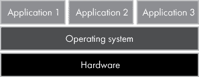

*图 10-2：操作系统充当硬件和应用程序之间的层。*

这一层提供了一套抽象底层硬件细节的功能，使软件开发者能够专注于软件的逻辑，而不是与特定硬件进行通信。正如你可能预料的那样，考虑到当今计算设备的多样性，这非常有用。考虑到智能手机和个人电脑中硬件的惊人多样性，为每种设备编写代码是不切实际的。操作系统隐藏了硬件的细节，并提供了应用程序可以构建的通用服务。

从高层次来看，操作系统包含的组件可以分为两个主要类别：

+   内核

+   其他一切

操作系统的*内核*负责管理内存、促进设备 I/O，并为应用程序提供一组系统服务。内核允许多个程序并行运行并共享硬件资源。它是操作系统的核心部分，但单独并不能为最终用户提供与系统交互的方式。

操作系统还包括一些非内核组件，这是系统有用的必备部分。包括*shell*，即与内核交互的用户界面。*shell*和*内核*这两个术语是操作系统的隐喻，其中操作系统被视为一个坚果或种子。内核处于核心位置，shell 环绕其周围。shell 可以是命令行界面（CLI）或图形用户界面（GUI）。一些 shell 的例子包括 Windows 的 shell GUI（包括桌面、开始菜单、任务栏和文件资源管理器）以及 Linux 和 Unix 系统中的 Bash shell CLI。

操作系统的一些功能由在后台运行的软件提供，这些软件与内核不同，称为*守护进程*或*服务*（不要与前面提到的内核系统服务混淆）。这种服务的一个例子是 Windows 上的任务调度程序或 Unix 和 Linux 上的 cron，它们都允许用户在特定时间安排程序运行。

操作系统还通常包括*软件库*，供开发人员进行构建。这些库包含许多应用程序可以利用的通用代码。此外，操作系统本身的组件，如 shell 和服务，也使用这些库提供的功能。

在与硬件交互时，内核与设备驱动程序协作。*设备驱动程序*，或简称*驱动程序*，是用于与特定硬件交互的软件。操作系统的内核需要与各种硬件设备协作，因此，软件开发人员将与特定设备交互的代码实现为设备驱动程序，而不是让内核了解如何与世界上每个硬件设备交互。操作系统通常包括一套常见硬件的设备驱动程序，并提供安装额外驱动程序的机制。

大多数操作系统都包括一些基本应用程序，如文本编辑器和计算器，通常统称为*实用程序*。网络浏览器也是许多操作系统的标准组件。这些实用程序可以说并不真正属于操作系统，而只是应用程序，但实际上，大多数操作系统都包括这种软件。图 10-3 提供了操作系统中组件的简要概述。

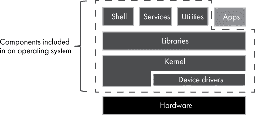

*图 10-3：操作系统包含多个组件。*

如你在图 10-3 中所见，在软件栈的基础部分，硬件之上，是内核和设备驱动程序。库提供应用程序构建所需的功能，因此库被显示为位于内核和应用程序之间的层。Shell、服务和实用工具也基于库构建。

### 操作系统家族

今天，主流的操作系统家族有两个：类 Unix 操作系统和 Microsoft Windows。如其名所示，*类 Unix*操作系统表现得像 Unix 操作系统。Linux、macOS、iOS 和 Android 都是类 Unix 操作系统的例子。*Unix*最初在贝尔实验室开发，其历史可以追溯到 1960 年代。Unix 最初运行在 PDP-7 小型计算机上，但后来被移植到许多种计算机上。Unix 最初是用汇编语言编写的，后来被重写成 C 语言，从而使其能够在各种处理器上编译运行。今天，Unix 被用于服务器，并且由于苹果的 macOS 和 iOS（这两者都基于 Unix），它在个人计算机和智能手机上也占有重要地位。Unix 支持多用户、多任务处理和统一的层次化目录结构。它有一个强大的命令行 Shell，并通过一套明确标准的命令行工具支持，可以将这些工具结合使用，完成复杂任务。

*Linux*内核最初是由 Linus Torvalds 开发的，他的目标是创建一个类似 Unix 的操作系统。Linux 不是 Unix，但它无疑是类 Unix 的。它的行为很像 Unix，但不包含任何 Unix 源代码。*Linux 发行版*是将 Linux 内核与其他软件捆绑在一起的操作系统。Linux 内核是*开源的*，这意味着其源代码是公开的。许多 Linux 发行版是免费的。典型的 Linux 发行版包括一个 Linux 内核和来自 GNU 项目的一些类 Unix 组件（发音为“guh-new”）。

*GNU*是一个递归首字母缩略词，代表*GNU 不是 Unix*，这是一个始于 1980 年代的软件项目，目标是将 Unix-like 操作系统作为自由软件创建。GNU 项目和 Linux 是两个独立的努力，但它们已紧密相关。1991 年 Linux 内核发布后，促使了将 GNU 软件移植到 Linux 的努力。当时，GNU 没有完整的内核，而 Linux 缺乏 Shell、库等。因此，Linux 为 GNU 代码提供了内核，而 GNU 项目则为 Linux 提供了 Shell、库和实用工具。通过这种方式，这两个项目互为补充，共同形成了一个完整的操作系统。

今天，人们通常用*Linux*一词来指代由 Linux 内核和 GNU 软件组合而成的操作系统。这有些争议，因为将整个操作系统称为“Linux”没有体现出 GNU 软件在许多 Linux 发行版中所起的重要作用。尽管如此，在本书中，我遵循普遍的惯例，将整个操作系统称为 Linux，而非 GNU/Linux 或类似的名称。

如今，Linux 通常用于服务器和嵌入式系统，并且在软件开发者中非常流行。Android 操作系统基于 Linux 内核，因此 Linux 在智能手机市场占有重要地位。Raspberry Pi OS（前称 Raspbian）也是一个包括 GNU 软件的 Linux 发行版，我们将使用 Raspberry Pi OS 来进一步探索 Linux。总体来说，在本书中，我将更多依赖 Linux，而非 Unix，来举例说明类 Unix 行为。

微软 Windows 是个人计算机上占主导地位的操作系统，包括台式机和笔记本电脑。它在服务器领域（Windows Server）也有着强大的影响力。Windows 的独特之处在于它并不追溯至 Unix。Windows 的早期版本基于 MS-DOS（微软磁盘操作系统）。尽管在家用计算机市场广受欢迎，这些早期版本的 Windows 在服务器或高端工作站市场上并不足够强大，无法与类 Unix 操作系统竞争。

与 Windows 的发展并行，微软在 1980 年代与 IBM 合作创建了 OS/2 操作系统，这是 MS-DOS 在 IBM PC 上的继任者。微软和 IBM 在 OS/2 项目的方向上产生了分歧，1990 年，IBM 接管了 OS/2 的开发，而微软则将精力转向了另一款已经在开发中的操作系统——Windows NT。与基于 MS-DOS 的 Windows 版本不同，Windows NT 基于全新的内核。Windows NT 的设计旨在能够在不同的硬件上移植，兼容多种类型的软件，支持多用户，并提供高度的安全性和可靠性。微软从数字设备公司（DEC）聘请了 Dave Cutler 来领导 Windows NT 的开发工作。他带领了一批来自 DEC 的前工程师，NT 内核设计的部分元素可以追溯到 Dave Cutler 在 DEC 开发 VMS 操作系统时的工作。

在早期版本中，Windows NT 被定位为一款面向商业的 Windows 版本，旨在与面向消费者的 Windows 版本共存。这两个 Windows 版本在实现上有很大不同，但它们共享相似的用户界面和编程接口。用户界面的相似性意味着熟悉 Windows 的用户可以迅速在 Windows NT 系统上投入生产工作。通用的编程接口使得为基于 DOS 的 Windows 开发的软件能够在 Windows NT 上运行，有时甚至无需修改。随着 2001 年 Windows XP 的发布，微软将 NT 内核带入了面向消费者的 Windows 版本。从 Windows XP 发布起，所有桌面和服务器版 Windows 都是基于 NT 内核构建的。  

表 10-1 列出了今天常用的一些操作系统和设备，以及它们所属的操作系统家族。

**表 10-1：** 常见操作系统

| **操作系统或设备** | **家族** | **备注** |
| --- | --- | --- |
| Android | 类 Unix | Android 使用 Linux 内核，尽管在其他方面，它并不算非常 Unix-like。其用户体验和应用编程接口与典型的 Unix 系统大相径庭。 |
| iOS | 类 Unix | iOS 基于类 Unix 的开源 Darwin 操作系统。与 Android 相似，iOS 的用户体验和编程接口与典型的 Unix 系统不同。 |
| macOS | 类 Unix | macOS 基于类 Unix 的开源 Darwin 操作系统。 |
| PlayStation 4 | 类 Unix | PlayStation 4 操作系统基于类 Unix 的 FreeBSD 内核。 |
| Raspberry Pi OS | 类 Unix | Raspberry Pi OS 是一个 Linux 发行版。 |
| Ubuntu | 类 Unix | Ubuntu 是一个 Linux 发行版。 |
| Windows 10 | Windows | Windows 10 使用 Windows NT 内核。 |
| Xbox One | Windows | Xbox One 的操作系统使用 Windows NT 内核。 |

**练习 10-1：了解你生活中的操作系统**

选择几台你拥有或使用的计算设备，例如笔记本电脑、智能手机或游戏机。每个设备运行的操作系统是什么？它们属于哪种操作系统家族（Windows、类 Unix、其他）？

### 内核模式与用户模式

操作系统的责任是确保其上运行的程序行为良好。实践中这意味着什么呢？我们来看几个例子。每个程序不得干扰其他程序或内核。用户不应能够修改系统文件。应用程序不得直接访问硬件；所有此类请求必须通过内核处理。考虑到这些要求，操作系统如何确保非操作系统代码遵守操作系统的规定呢？这通过利用一种 CPU 能力来实现，该能力赋予操作系统特殊权限，同时对其他代码施加限制；这就是*特权级别*。处理器可能提供超过两个特权级别，但大多数操作系统仅使用两个级别。较高的特权级别称为*内核模式*，较低的特权级别称为*用户模式*。内核模式也被称为*监督模式*。在内核模式下运行的代码可以完全访问系统，包括访问所有内存、I/O 设备和特殊的 CPU 指令。而在用户模式下运行的代码则有着有限的访问权限。通常情况下，内核和许多设备驱动程序在内核模式下运行，而其他所有程序则在用户模式下运行，如图 10-4 所示。

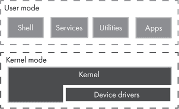

*图 10-4：用户模式与内核模式下运行的代码的划分*

在内核模式下运行的代码是*可信的*，而用户模式下的代码是*不可信的*。在内核模式下运行的代码可以完全访问系统中的所有内容，因此它必须是值得信赖的！通过仅允许可信代码在内核模式下运行，操作系统可以确保用户模式下的代码行为规范。

**Windows 中的内核模式组件**

值得注意的是，微软 Windows 还有一些其他主要组件运行在内核模式下。在 Windows 中，基础的内核模式功能实际上分布在两个组件中：内核和*执行组件*。这种区分仅在讨论 Windows 的内部架构时才有意义；对于大多数软件开发人员或用户而言，这种分离并不重要。事实上，内核和执行组件的编译机器代码都包含在同一个文件中（*ntoskrnl.exe*）。在本书的其余部分，我将不区分 Windows NT 内核和执行组件。除了内核、执行组件和设备驱动程序之外，Windows 还有其他几个主要组件运行在内核模式下。*硬件抽象层（HAL）*将内核、执行组件和设备驱动程序与低级硬件的差异（如主板的变化）隔离开来。*窗口和图形系统（win32k）*提供绘制图形和通过编程与用户界面元素交互的能力。

### 进程

操作系统的主要功能之一是为程序提供运行平台。正如我们在上一章所看到的，程序是机器指令的序列，通常存储在可执行文件中。然而，存储在文件中的一组指令本身并不能执行任何工作。必须有某些东西将文件中的指令加载到内存中，并指导 CPU 执行程序，同时确保程序不出现异常行为。这正是操作系统的工作。当操作系统启动一个程序时，它会创建一个 *进程*，即该程序的一个运行实例。在前面的内容中，我们讨论了运行在用户模式中的事物（例如 shell、服务和实用工具）——这些都在进程中执行。如果代码在用户模式下运行，它就在进程内运行，如 图 10-5 所示。

进程是程序运行的容器。这个容器包括一个私有的虚拟内存地址空间（稍后会详细介绍），加载到内存中的程序代码的副本，以及关于进程状态的其他信息。一个程序可以被启动多次，每次执行都会导致操作系统创建一个新的进程。每个进程都有一个唯一的标识符（一个数字），称为 *进程标识符*、*进程 ID*，或简称 *PID*。

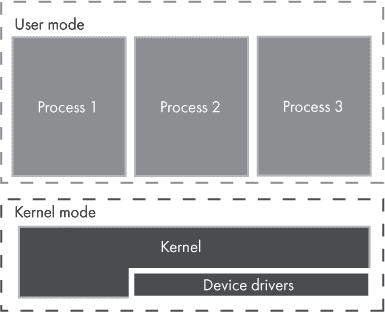

*图 10-5：在用户模式下运行的进程*

除了由内核启动的初始进程外，每个进程都有一个父进程，也就是启动它的进程。父子进程的这种关系构成了进程树。如果一个子进程的父进程在子进程之前终止，那么这个子进程就成了 *孤儿进程*，也就是说，毫不奇怪，它没有父进程。在 Windows 上，孤儿进程的子进程将保持没有父进程。而在 Linux 上，孤儿进程通常会被 *init 进程* 收养，init 进程是 Linux 系统上启动的第一个用户模式进程。

图 10-6 显示了 Raspberry Pi OS 上的进程树。这个视图是使用 `pstree` 工具生成的。

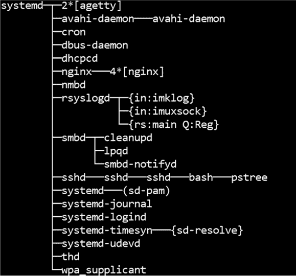

*图 10-6：通过 `pstree` 显示的 Linux 进程树示例*

在 图 10-6 中，我们看到 init 进程是 `systemd`；它是第一个启动的进程，接着它又启动了其他进程。子线程使用大括号显示（稍后会详细讨论线程）。为了生成这个输出，我在命令行 shell 中运行了 `pstree` 命令，在输出中，你可以看到 `pstree` 本身正在运行，正如预期的那样。它是 `bash`（shell）的子进程，而 `bash` 又是 `sshd` 的子进程。换句话说，从这个输出可以看出，我是在一个远程安全 Shell（SSH）会话中打开的 Bash shell 中运行 `pstree`。

要查看运行 Windows 的计算机上的进程树，我建议你使用可以从 Microsoft 下载的 Process Explorer 工具。它是一个图形界面应用程序，能够让你深入查看计算机上正在运行的进程。

**注意**

*请参见 项目 #20 以及 第 218 页，在那里你可以查看设备上运行的进程*。

### 线程

默认情况下，程序按顺序执行指令，一次处理一个任务。但如果程序需要并行执行两个或更多任务怎么办？例如，假设一个程序需要在执行长期计算的同时更新用户界面，也许是为了显示进度条。如果程序是完全顺序执行的，那么一旦开始计算，用户界面就会被忽视，因为分配给程序的 CPU 时间必须被用在其他地方。期望的行为是，在计算运行的同时更新 UI——这两个任务需要并行发生。操作系统通过 *执行线程*，或简称 *线程*，提供了这种能力。线程是进程内可调度的执行单元。线程在进程内运行，并且可以执行加载到该进程中的任何程序代码。

线程执行的代码通常包括程序希望完成的特定任务。由于线程属于进程，它们与该进程中的其他线程共享地址空间、代码和其他资源。一个进程从一个线程开始，可能会根据需要创建其他线程，以便并行处理工作。每个线程都有一个标识符，称为 *线程 ID* 或 *TID*。内核也会创建线程来管理其工作。图 10-7 说明了线程、进程和内核之间的关系。

在 Windows 中，线程和进程是不同的对象类型。进程对象是一个容器，线程属于一个进程。在 Linux 中，这种区分更为微妙。Linux 内核使用单一的数据类型来表示进程和线程，该类型既可以表示进程，也可以表示线程。在 Linux 中，一组共享地址空间并具有相同进程标识符的线程被视为一个进程；没有单独的进程类型。

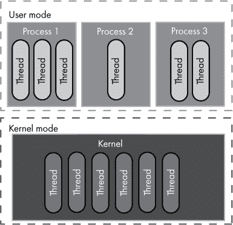

*图 10-7：线程属于用户模式进程或内核。*

Linux 中用于表示进程和线程标识符的术语可能会让人有些困惑。在用户模式下，进程有进程 ID（PID），线程有线程 ID（TID）。这与 Windows 类似。然而，Linux 内核将线程的 ID 称为 PID，而将进程的 ID 称为 *线程组标识符（TGID）*！

**注意**

*请参见 项目 #21 以及 第 220 页，在那里你可以创建自己的线程*。

多个线程并行运行到底意味着什么呢？假设你的计算机有 10 个进程在运行，每个进程有 4 个线程。仅用户模式下就有 40 个线程在运行！我们说线程是并行运行的，但 40 个线程真的能够同时运行吗？不，除非你的计算机有 40 个处理器核心，而这通常不可能。每个处理器核心一次只能运行一个线程，因此设备中的核心数量决定了可以同时运行多少个线程。

**物理核心与逻辑核心**

并非所有核心都具备相同的并行能力。*物理核心*是 CPU 内部核心的硬件实现。*逻辑核心*表示一个物理核心能够同时运行多个线程的能力（每个逻辑核心运行一个线程）。英特尔称这种能力为*超线程技术*。举个例子，我现在用来写这本书的计算机有两个物理核心，每个物理核心有两个逻辑核心，总共有四个逻辑核心。这意味着我的计算机可以同时运行四个线程，尽管逻辑核心无法实现物理核心的完全并行性。

如果我们有 40 个线程需要运行，但只有 4 个核心，会发生什么？操作系统实现了一个*调度器*，这是一个负责确保每个线程都能轮流运行的软件组件。操作系统采用不同的方法来实现调度，但根本目标是相同的：给线程分配运行的时间。每个线程会获得一个短暂的运行时间（称为*时间片*），然后线程会被挂起，以便让另一个线程运行。之后，第一个线程会被重新调度，并从它中断的地方继续执行。这一过程大部分对线程的代码以及编写应用程序的开发者是隐藏的。从线程代码的角度来看，它是连续运行的，开发者在编写多线程应用时，通常认为所有线程都是在并行运行的。

### 虚拟内存

操作系统支持多个正在运行的进程，每个进程都需要使用内存。大多数情况下，一个进程不需要读写另一个进程的内存，事实上，这通常是不希望发生的。我们不希望一个有问题的进程窃取或覆盖另一个进程的数据，甚至更糟糕的是，覆盖内核中的数据。此外，开发者也不希望他们进程的地址空间因为其他进程的内存使用而变得碎片化。基于这些原因，操作系统并不允许用户模式进程访问物理内存，而是为每个进程提供了*虚拟内存*——这一抽象概念为每个进程提供了一个独立且庞大的私有地址空间。

在第七章中，我们讲解了内存寻址，其中硬件中的每个物理字节都被分配了一个地址。这些硬件内存地址被称为*物理地址*。这些地址通常对用户模式进程是隐藏的。操作系统则向进程呈现*虚拟内存*，每个地址都是一个*虚拟地址*。每个进程都被分配了自己的虚拟内存空间来工作。对单个进程来说，内存表现为一个很大的地址范围。当一个进程写入某个虚拟地址时，这个地址并不直接指向硬件内存位置。虚拟地址在需要时会被转换为物理地址，如图 10-8 所示，但这种转换的细节对进程是隐藏的。

这种方法的优点是，每个进程都被分配了一个大型、私有的虚拟内存地址范围来使用。通常，系统中的每个进程都会呈现*相同*的内存地址范围。例如，每个进程可能会被分配 2GB 的虚拟地址空间，从地址 0x0000000 到 0x7FFFFFFF。这看起来可能会有问题；当两个程序尝试使用相同的内存地址时会发生什么？一个程序能否覆盖或读取另一个程序的数据？多亏了虚拟地址，这并不是问题。

多个程序的相同虚拟地址映射到不同的物理地址，因此不会发生一个程序意外访问另一个程序数据的情况。这意味着，在不同进程中，存储在某个虚拟地址处的数据是不同的——虚拟地址可能相同，但存储的数据不同。也就是说，若程序需要共享内存，是有机制支持的。在较旧的操作系统中，内存空间并没有如此清晰的划分，这导致了程序在其他程序甚至操作系统中的内存损坏的机会。幸运的是，所有现代操作系统都确保了进程之间内存的隔离。

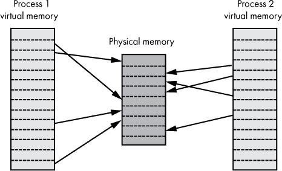

*图 10-8：每个进程的虚拟地址空间映射到物理内存*

重要的是要理解，尽管一个进程的地址范围可能是 2GB（例如），但这并不意味着所有 2GB 的虚拟内存都会立即可供进程使用。只有其中一部分地址由物理内存支持。回想一下你在第八章和第九章中进行的项目；你当时实际上是在检查虚拟内存地址，而不是物理地址。

内核有一个单独的虚拟地址空间，用来处理一个与分配给用户模式进程的地址范围不同的地址范围。与用户模式地址空间不同，内核地址空间由所有在内核模式下运行的代码共享。这意味着任何在内核模式下运行的代码都可以访问内核地址空间中的所有内容。这也使得这些代码有机会修改任何内核内存的内容。这加强了一个观点，即在内核模式下运行的代码必须是值得信任的！

那么虚拟地址空间是如何在用户模式和内核模式之间划分的呢？让我们以 32 位操作系统为例。如第七章所述，对于 32 位系统，内存地址被表示为 32 位数字，这意味着总共 4GB 的地址空间。这个地址空间的地址范围必须在内核模式和用户模式之间进行划分。对于 4GB 的地址空间，Windows 和 Linux 都允许通过配置设置进行 2GB 用户/2GB 内核或 3GB 用户/1GB 内核的划分。图 10-9 展示了虚拟内存的均等 2GB 划分。

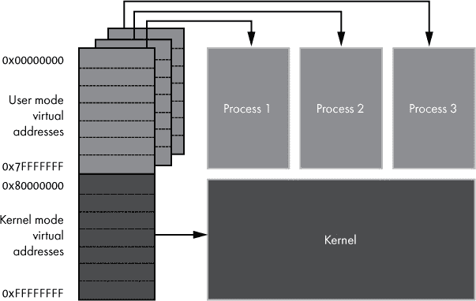

*图 10-9：32 位系统上虚拟地址空间的 2GB/2GB 均等划分*

请记住，我们这里只关注的是*虚拟*地址。无论物理内存有多少，32 位系统的虚拟地址空间始终为 4GB。假设一台计算机只有 1GB 的 RAM，它在 32 位操作系统下仍然有 4GB 的虚拟地址空间。回想一下，虚拟地址范围并不代表映射的物理内存，它仅仅是物理内存*可以被*映射的范围。也就是说，内核和所有运行中的进程完全可以请求更多的虚拟内存字节，超过 RAM 的总大小。在这种情况下，操作系统可以将内存字节移动到辅助存储中，以腾出 RAM 空间供新请求的内存使用，这个过程被称为*分页*。通常，最少使用的内存首先会被分页，以便活动内存可以保持在 RAM 中。当需要分页的内存时，操作系统必须将其重新加载到 RAM 中。分页使得可以使用更大的虚拟内存，但代价是当字节在辅助存储和 RAM 之间移动时，会造成性能上的损失。请记住，辅助存储的速度远远低于 RAM。

**注意**

*请参见项目#22，在第 222 页上，您可以查看虚拟内存的相关内容*。

随着 64 位处理器和操作系统的到来，出现了更大地址空间的潜力。如果我们用完整的 64 位表示内存地址，虚拟地址空间将是 32 位地址空间的约 4 *billion*倍！然而，今天并不需要如此大的地址空间，因此 64 位操作系统使用较少的位数来表示地址。不同的 64 位操作系统在不同的处理器上使用不同的位数来表示地址。64 位 Linux 和 64 位 Windows 都支持 48 位地址，这意味着虚拟地址空间为 256TB，约为 32 位地址空间的 65,000 倍——这对于今天的典型应用来说空间已经足够大了。

### 应用程序编程接口（API）

当大多数人想到操作系统时，他们会想到用户界面，即 Shell。Shell 是人们看到的部分，它影响人们如何看待系统。例如，Windows 用户通常认为 Windows 就是任务栏、开始菜单、桌面等等。然而，用户界面实际上只是操作系统代码的一小部分，它只是一个界面，系统和用户的接触点。从应用程序（或软件开发人员）的角度来看，与操作系统的交互并不是由 UI 定义的，而是由操作系统的*应用程序编程接口（API）*定义的。API 不仅仅适用于操作系统；任何希望提供程序化交互方式的软件都可以提供 API，但我们这里的重点是操作系统 API。

操作系统 API 是一种规范，定义在源代码中并在文档中描述，详细说明了程序应该如何与操作系统交互。一个典型的操作系统 API 包括一系列函数（包括其名称、输入和输出）以及与操作系统交互所需的数据结构。操作系统随附的软件库提供了 API 规范的实现。软件开发人员通常将“调用”或“使用”API 作为一种简便的说法，表示他们的代码正在调用 API 中指定的某个函数（并由软件库实现）。

就像用户界面为用户定义了操作系统的“个性”一样，API 为应用程序定义了操作系统的个性。图 10-10 展示了用户和应用程序如何与操作系统交互。

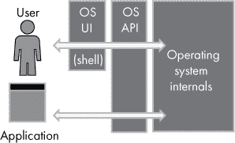

*图 10-10：操作系统接口：用户的 UI；应用程序的 API*

如 图 10-10 所示，用户通过操作系统用户界面与操作系统进行交互，这就是 Shell。Shell 将用户的命令转化为 API 调用。API 然后调用操作系统的内部代码来执行请求的操作。应用程序不需要通过用户界面；它们只需要直接调用 API。从这个角度来看，Shell 与操作系统的 API 交互方式和其他应用程序一样。

让我们看一个通过 API 与操作系统接口的示例。创建文件是操作系统的常见功能，用户和应用程序都需要进行此操作。图形化 Shell 和命令行 Shell 提供了简单的方式供用户创建文件。然而，应用程序不需要通过图形用户界面（GUI）或命令行界面（CLI）来创建文件。让我们探讨一下应用程序如何通过编程方式创建文件。

对于 Unix 或 Linux 系统，你可以使用一个名为`open`的 API 函数来创建文件。以下 C 语言示例使用 `open` 函数创建一个名为 *hello.txt* 的新文件。`O_WRONLY` 标志表示只写操作，`O_CREAT` 表示要创建一个文件。

```
open("hello.txt", O_WRONLY|O_CREAT);
```

在 Windows 上，可以使用 `CreateFileA` API 函数来完成相同的操作：

```
CreateFileA("hello.txt", GENERIC_WRITE, 0, NULL, 

    CREATE_NEW, FILE_ATTRIBUTE_NORMAL, NULL);
```

这两个示例都使用了 C 编程语言。操作系统通常使用 C 语言编写，因此它们的 API 天然适用于 C 程序。在其他语言编写的程序中，当程序运行时，仍然需要调用操作系统的 API，但是该编程语言会将该 API 调用封装在其自身的语法中，隐藏 API 的细节。这使得代码可以跨操作系统移植。即使是 C 语言也这样做，提供了一组可以在任何操作系统上运行的标准库函数。这些函数反过来必须在运行时调用特定操作系统的 API。再考虑一下创建文件的例子；在 C 语言中，我们可以使用 `fopen` 函数，如以下代码所示。该函数是 C 语言标准库的一部分，适用于任何操作系统。

```
fopen("hello.txt", "w");
```

作为另一个示例，我们可以使用以下 Python 代码来创建一个新文件。这段代码可以在任何安装了 Python 解释器的操作系统上运行。Python 解释器会代替应用程序调用适当的操作系统 API。

```
open('hello.txt', 'w')
```

对于类 Unix 操作系统，API 会根据具体的 Unix 或 Linux 版本以及内核的版本有所不同。然而，大多数类 Unix 操作系统都遵循一个标准规范，无论是完全遵守还是部分遵守。这个标准被称为*可移植操作系统接口（POSIX）*，它不仅为操作系统 API 提供标准，也为 Shell 的行为和包含的工具提供标准。POSIX 为类 Unix 操作系统提供了基准，但现代类 Unix 操作系统通常有自己的 API。*Cocoa*是 Apple 为 macOS 提供的 API，iOS 也有一个类似的 API，称为*Cocoa Touch*。Android 也有自己的编程接口，统称为*Android 平台 API*。

另一大操作系统家族 Windows 有其自己的 API。*Windows API*随着时间的发展不断增长和扩展。Windows API 的最初版本是一个 16 位版本，现在被称为*Win16*。当 Windows 在 1990 年代更新为 32 位操作系统时，发布了 32 位版本的 API，即*Win32*。现在 Windows 已经是 64 位操作系统，对应的 API 是*Win64*。微软还在 Windows 10 中推出了一个新的 API，*通用 Windows 平台（UWP）*，旨在使 Windows 上运行的各种类型设备的应用开发保持一致。

**注意**

*请参见项目 #23，位于第 224 页，在那里你可以尝试与 Linux 操作系统 API 互动。*

### 用户模式泡泡与系统调用

如前所述，用户模式下运行的代码对系统的访问权限是有限的。那么，用户模式代码*能做*什么呢？它可以读写自己的虚拟内存，并可以执行数学和逻辑运算。它可以控制自己代码的程序流。另一方面，运行在用户模式下的代码*不能*访问物理内存地址，包括用于内存映射 I/O 的地址。这意味着它无法自行将文本打印到控制台窗口，获取键盘输入，绘制屏幕上的图形，播放声音，接收触摸屏输入，通过网络通信，或从硬盘读取文件！我喜欢说“用户模式代码运行在一个泡泡中”(图 10-11)。它无法与外部世界互动，至少没有一些帮助的话是做不到的。另一种说法是，用户模式代码不能直接执行 I/O 操作。实际上，这意味着运行在用户模式下的代码可以做有用的工作，但无法在没有帮助的情况下共享这些工作成果。

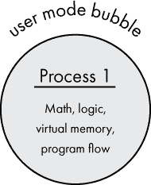

*图 10-11：一个进程运行在用户模式泡泡中。它可以进行数学运算、执行逻辑、访问虚拟内存并控制程序流，但无法直接与外部世界互动。*

你可能会想知道，用户模式应用程序是如何与用户进行交互的。自然，应用程序以某种方式能够与外部世界交互，但这是如何实现的呢？答案是，用户模式代码有一个其他重要的能力：它可以请求内核模式代码代表它执行工作。当用户模式代码请求内核模式代码代表它执行特权操作时，这被称为*系统调用*，如图 10-12 所示。

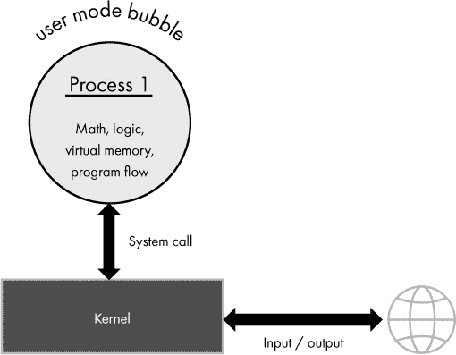

*图 10-12：用户模式进程可以通过发出系统调用，借助内核与外部世界交互。*

例如，如果用户模式代码需要从文件中读取数据，它会发出系统调用，请求内核从某个文件中读取特定的字节。内核与存储设备驱动程序协同工作，执行必要的 I/O 操作以读取文件，然后将请求的数据返回给用户模式进程。这如图 10-13 所示。

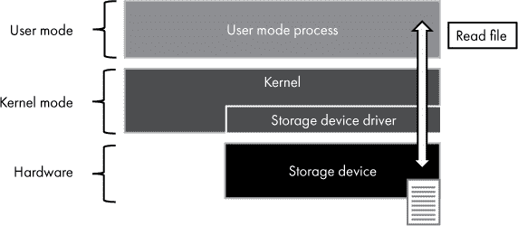

*图 10-13：内核作为中介，帮助用户模式代码访问硬件资源，如二级存储。*

用户模式代码不需要了解任何关于物理存储设备或相关设备驱动程序的信息。内核提供了一个抽象，封装了细节，让用户模式代码可以简单地完成任务。我们之前提到的示例 API 函数`open`和`CreateFileA`在幕后就是这样工作的，它们通过系统调用请求特权操作。当然，内核会对允许的操作有所限制。例如，用户模式进程不能读取没有访问权限的文件。

CPU 提供了专门的指令来简化系统调用。在 ARM 处理器上，使用`SVC`指令（以前称为`SWI`），它被称为*监控调用*。在 x86 处理器上，提供了`SYSCALL`和`SYSENTER`指令来实现这一目的。Linux 和 Windows 都实现了大量的系统调用，每个调用都有一个唯一的编号。例如，在 Linux 的 ARM 版本中，`write`系统调用（用于写入文件）的编号是 4。要进行系统调用，程序需要将所需的系统调用编号加载到某个处理器寄存器中，将任何附加参数放入其他特定的寄存器，然后执行系统调用指令。

尽管软件开发人员可以直接在机器代码或汇编语言中进行系统调用，但幸运的是，在大多数情况下并不需要这么做。操作系统和高级编程语言提供了以自然的方式进行系统调用的能力，通常通过操作系统 API 或语言的标准库来实现。程序员只需编写代码来执行某个操作，可能甚至没有意识到在幕后正在进行系统调用。

**注意**

*请参见 项目 #24，位于 第 226 页，你可以在那里观察从程序中发起的系统调用*。

### API 和系统调用

我们之前讨论了操作系统的 API 主题，并且刚刚看过系统调用。操作系统 API 和系统调用有什么不同？二者是相关的，但并不等同。系统调用定义了一种机制，允许用户模式代码请求内核模式服务。API 描述了应用程序如何与操作系统交互，无论是否调用了内核模式代码。有些 API 函数会发起系统调用，而另一些 API 函数则不需要系统调用。这取决于操作系统的具体实现。

我们先来看一下 Linux。如果我们将 Linux 的定义限制在内核层面，那么可以说 Linux API 实际上是使用 Linux 系统调用的规范，因为系统调用是与内核交互的编程接口。然而，基于 Linux 的操作系统不仅仅是内核。例如，考虑使用 Linux 内核的 Android。Android 有自己的一套编程接口，即 Android 平台 API。

在 Microsoft Windows 中，Windows NT 内核提供了一组系统调用，通过一种称为原生 API 的接口提供。应用程序开发人员很少直接使用原生 API；它主要供操作系统组件使用。相反，开发人员使用 Windows API，它是原生 API 的封装。然而，并非所有 Windows API 函数都需要系统调用。我们来看看 Windows API 的几个例子。Windows API 函数`CreateFileW`用于创建或打开文件。它是原生 API `NtCreateFile` 的封装，后者会向内核发起系统调用。相比之下，Windows API 函数`PathFindFileNameW`（用于在路径中查找文件名）不与原生 API 交互，也不发起任何系统调用。创建文件需要内核的帮助，而在路径字符串中查找文件名只需要虚拟内存访问，这可以在用户模式下完成。

总结一下，操作系统 API 描述了操作系统的编程接口。系统调用提供了一种机制，允许用户模式的代码请求特权的内核模式操作。某些 API 函数依赖于系统调用，而另一些则不依赖。

### 操作系统软件库

如前所述，操作系统 API 描述了与操作系统交互的程序接口。尽管技术接口描述对程序员有帮助，但当程序运行时，它需要一个具体的方法来调用 API。这是通过软件库来实现的。*操作系统的软件库*是操作系统随附的代码集合，提供操作系统 API 的实现。也就是说，库包含执行 API 规范中描述的操作的代码。在第九章中，我们讨论了编程语言的库：包括语言的标准库以及由使用该语言的开发者社区维护的附加库。我们在这里讨论的软件库类似；唯一的区别是这些库是操作系统的一部分。

操作系统库类似于可执行程序；它是一个包含机器码字节的文件。然而，它通常没有入口点，因此通常无法独立运行。相反，库*导出*（使可用）一组可以被程序使用的函数。使用软件库的程序*导入*该库中的函数，并被称为*链接*到该库。

操作系统包含一组库文件，导出 API 定义的各种函数。这些函数中的一些只是包装器，立即执行内核系统调用。其他函数则完全在用户模式代码中实现，并包含在库文件本身中。还有一些介于两者之间，在用户模式中实现一些逻辑，同时也进行一个或多个系统调用，如图 10-14 所示。

在典型的 Linux 发行版中，许多可用的 Linux 内核系统调用通过*GNU C 库*（或`glibc`）提供。这个库还包括 C 编程语言的标准库，其中包括不需要系统调用的函数。主要的`glibc`文件通常命名为*libc.so.6*，其中*so*表示*共享对象*，而*6*表示版本。通过这个库，C 或 C++开发者可以轻松使用 Linux 内核和 C 运行时库提供的功能。鉴于该库在大多数 Linux 发行版中的普遍存在，可以合理地将`glibc`中的函数视为标准 Linux API 的一部分。

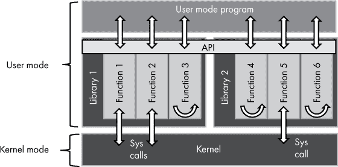

*图 10-14：操作系统 API 通过一组库来实现。这些库中的一些函数会调用内核的系统调用；而另一些则不会。用户模式程序与 API 进行交互。*

**注意**

*请参阅项目#25 在第 227 页，在这里你可以尝试 GNU C 库*。

微软 Windows API 相当广泛，随着时间的推移，它已经包含了许多库。三个基本的 Windows API 库文件是*kernel32.dll*、*user32.dll*和*gdi32.dll*。通过*kernel32.dll*，NT 内核导出的系统调用可以提供给用户模式程序。通过*user32.dll*和*gdi32.dll*，win32k（窗口和图形系统）导出的系统调用可以提供给用户模式程序。

这些文件上的*dll*扩展名表示它们是*动态链接库*，类似于 Linux 中的共享对象（*.so*）文件。也就是说，*dll*文件扩展名表示该文件包含共享库代码，进程可以加载并运行。文件名中的*32*后缀是在 16 位到 32 位 Windows 过渡期间添加的。如今，64 位版本的 Windows 仍然在这些文件上保留*32*后缀，以保持兼容性。实际上，64 位版本的 Windows 包括这两个版本的文件（相同的名称，不同的目录），一个用于 32 位应用程序，一个用于 64 位应用程序。

**注意**

*程序有可能在不通过软件库的情况下调用系统调用。通过设置处理器寄存器中的值并发出特定处理器的指令，例如 ARM 上的`SVC`或 x86 上的`SYSCALL`，程序可以直接进行系统调用。然而，这需要用汇编语言进行编程，导致的源代码不能跨处理器架构工作。此外，操作系统的 API 可能包含一些不是通过系统调用实现的函数，因此直接调用系统调用并不能替代操作系统的软件库。*

**Windows 子系统 for Linux**

Linux 内核和 Windows NT 内核暴露不同的系统调用，并且它们的可执行文件存储在不同的格式中，这使得为一个操作系统编译的软件与另一个操作系统不兼容。然而，在 2016 年，微软宣布了*Windows 子系统 for Linux (WSL)*，这是一个 Windows 10 功能，允许许多 64 位 Linux 程序在 Windows 上运行，而无需修改。在 WSL 的第一个版本中，这是通过拦截 Linux 可执行文件发出的系统调用并在 NT 内核中处理它们来实现的。WSL 的第二个版本依赖于一个真实的 Linux 内核来处理系统调用。这个 Linux 内核在虚拟机中运行，并与 NT 内核一起运行。我们将在第十三章中详细介绍虚拟机。

### 应用程序二进制接口

现在我们已经讨论了应用程序编程接口（API）的概念以及它如何与系统调用和库相关联，接下来让我们来探讨一个相关的概念，即 ABI。*应用程序二进制接口（ABI）*定义了软件库的机器代码接口。这与 API 相对，API 定义的是源代码接口。一般来说，API 在各种处理器系列之间是一致的，而 ABI 则在处理器系列之间有所不同。开发人员可以编写利用操作系统 API 的代码，然后将代码编译为多种处理器类型。源代码针对的是一个通用的 API，而编译后的代码则针对特定架构的 ABI。

一旦编译，生成的机器代码会遵循目标架构的 ABI。这意味着在执行时，真正定义已编译程序和软件库之间交互的是 ABI，而不是 API。操作系统库所暴露的 ABI 保持一致性非常重要。这种一致性使得较旧的程序能够在操作系统的新版本中继续运行，而无需重新编译。

### 设备驱动程序

当今的计算机支持各种各样的硬件设备，例如显示器、键盘、摄像头等。这些设备各自实现了输入/输出接口，允许设备与系统的其他部分进行通信。不同类型的设备使用不同的方法进行输入/输出；例如，Wi-Fi 适配器与游戏控制器的需求差异很大。即使是相同类型的设备，也可能实现不同的输入/输出方法。例如，两种不同型号的显卡与系统的其他部分进行通信的方式可能完全不同。与硬件的直接交互仅限于在内核模式下运行的代码，但不可能指望操作系统内核知道如何与每一种设备通信。这就是设备驱动程序的作用。*设备驱动程序*是与硬件设备交互并为该硬件提供编程接口的软件。

通常，设备驱动程序作为一个*内核模块*实现，这是一个包含代码的文件，内核可以加载并在内核模式下执行。这是允许驱动程序访问硬件所必需的。因此，设备驱动程序具有广泛的访问权限，类似于内核本身，所以只有受信任的驱动程序应该被安装。内核与设备驱动程序协同工作，代表用户模式下运行的代码与硬件进行交互。这使得硬件交互可以在操作系统或应用程序不了解如何与特定硬件交互的情况下进行。这是一种封装的形式。在某些情况下，驱动程序可以在用户模式下执行（例如使用微软的用户模式驱动程序框架），但这种方法仍然需要内核模式中的某些组件，通常由操作系统提供，用于处理硬件交互。

**注意**

*请参见项目 #26 在第 230 页，在那里你可以查看包括设备驱动程序在内的加载的内核模块，在 Raspberry Pi OS 上。*

### 文件系统

几乎每台计算机都有某种类型的二级存储设备，通常是硬盘驱动器（HDD）或固态硬盘（SSD）。这些设备实际上是可以读取和写入的比特容器，而且即使系统关闭电源，数据依然可以保存。存储设备被划分为称为*分区*的区域。操作系统实现*文件系统*，将存储设备上的数据组织成文件和目录。在分区被操作系统使用之前，必须先用特定的文件系统进行*格式化*。不同的操作系统使用不同的文件系统。Linux 通常使用 ext（扩展）系列文件系统（ext2、ext3、ext4），而 Windows 使用 FAT（文件分配表）和 NTFS（NT 文件系统）。一些操作系统将存储呈现为*卷*，这是基于一个或多个分区构建的逻辑抽象。在这种系统中，文件系统位于卷上，而不是分区上。

*文件*是数据的容器，*目录*（也称为文件夹）是文件或其他目录的容器。文件的内容可以是任何东西；文件中存储的数据结构由写入文件的程序决定。类 Unix 系统将其目录结构组织为统一的目录层次结构。该层次结构从根目录开始，根目录用一个斜杠（`/`）表示，所有其他目录都是根目录的子目录。例如，库文件存储在*/usr/lib*中，其中*usr*是根目录的子目录，*lib*是*usr*的子目录。这种统一的层次结构即使在系统中有多个存储设备时也适用。额外的存储设备会映射到目录结构中的某个位置；这被称为*挂载*设备。例如，一个 USB 驱动器可以挂载到*/mnt/usb1*。

相比之下，微软 Windows 为每个卷分配一个驱动器字母（A–Z）。因此，与统一的目录结构不同，每个驱动器都有自己的根目录和目录层次结构。Windows 在目录路径中使用反斜杠（`\`），并在驱动器字母后面加上冒号（`:`）。例如，存储在 C 驱动器上的 Windows 系统文件通常位于*C:\windows\system32*目录下。这种约定源于 DOS（以及更早的版本），当时 A 和 B 驱动器被保留给软盘，而 C 驱动器表示内部硬盘。直到今天，C 驱动器通常用作 Windows 安装所在卷的驱动器字母。

**注意**

*请参见项目 #27 在第 230 页，在那里你可以查看 Raspberry Pi OS 上存储和文件的详细信息。*

### 服务与守护进程

操作系统提供了让进程在后台自动运行而无需用户交互的功能。这类进程在 Windows 上称为 *services*，在类 Unix 系统上称为 *daemons*。典型的操作系统包括多个默认运行的此类服务，比如用于配置网络设置的服务，或者按计划运行任务的服务。服务用于提供不依赖于特定用户、不需要在内核模式下运行但又需要随时可用的功能。

操作系统通常包括一个负责管理服务的组件。有些服务需要在操作系统启动时启动；其他服务则需要响应特定事件运行。通常在发生意外故障时，服务应重新启动。在 Windows 中，*服务控制管理器* (*SCM*) 执行这些功能。SCM 的可执行文件是 *services.exe*，它在 Windows 启动过程中很早就开始运行，并在 Windows 运行时继续运行。许多现代 Linux 发行版已经将 `systemd` 作为管理守护进程的标准组件，尽管 Linux 中也可以使用其他机制来启动和管理守护进程。如前所述，`systemd` 还充当初始化进程，因此它在 Linux 启动过程中非常早就开始运行，并在系统运行时继续执行。

Unix 和 Linux 中的术语 *daemon* 源自物理学思想实验中描述的假想生物 Maxwell's demon。这个生物像计算机的守护进程一样在后台工作。在计算机之外，*daemon* 通常发音为“demon”，但在指代后台进程时，“DAY-mon”也是一种可以接受的发音。历史上，*service* 是一个特定于 Windows 的术语，但现在它在 Linux 上也被使用，通常指由 `systemd` 启动的守护进程。

**注意**

*请参阅 第 28 号项目，以及 第 231 页，你可以在这里查看 Raspberry Pi OS 上的服务*。

### 安全性

操作系统为在其上运行的代码提供安全模型。在此背景下，*安全性* 意味着软件及其用户应该只访问系统的适当部分。这对像笔记本电脑或智能手机这样的个人设备来说，可能看起来不是什么大问题。如果只有一个用户登录系统，难道他们不应该能够访问所有内容吗？嗯，不，至少默认情况下不是这样。用户会犯错误，包括运行不可信的代码。如果用户不小心在设备上运行了恶意软件，操作系统可以通过限制该用户的访问权限来帮助减少损害。在共享系统上，多个用户登录时，用户不应该能够读取或修改另一个用户的数据，至少默认情况下不应该。

操作系统使用多种技术来提供安全性。这里我们仅介绍其中一些。简单地将应用程序放入用户模式的隔离环境中，能够大大确保软件不会故意或无意地干扰其他应用程序或内核。操作系统还实现了文件系统安全，确保存储在文件中的数据只能被合适的用户和进程访问。虚拟内存本身也可以被保护——内存区域可以被标记为只读或可执行，从而帮助限制内存的滥用。为用户提供登录系统，使操作系统能够根据用户身份管理安全性。这些都是现代操作系统的基本安全要求。不幸的是，操作系统中经常会发现安全漏洞，允许恶意行为绕过操作系统的防御机制。保持现代互联网连接操作系统的最新更新对于确保安全至关重要。

### 总结

在本章中，我们讨论了操作系统，操作系统是与计算机硬件通信并为程序执行提供环境的软件。你了解了操作系统内核、非内核组件以及内核模式与用户模式的分离。我们回顾了两大主流操作系统家族：类 Unix 操作系统和 Microsoft Windows。你了解到，程序在一个名为进程的容器中运行，并且多个线程可以在该进程内并行执行。我们查看了与操作系统编程交互的各个方面：API、系统调用、软件库和 ABI。在下一章中，我们将超越单设备计算，研究互联网，看看使互联网成为可能的各种层次和协议。

**项目 #20：检查正在运行的进程**

前提条件：一台运行 Raspberry Pi OS 的 Raspberry Pi。如果你还没有阅读过，建议翻到附录 B 并阅读整个“Raspberry Pi”部分。

在这个项目中，你将查看 Raspberry Pi 上运行的进程。`ps` 工具提供了多种查看运行中进程的方式。让我们从以下命令开始，它提供了进程的树形视图。

```
$ ps -eH
```

输出应该类似于以下文本。我这里只复制了一部分。

```
    1 ?        00:00:10 systemd

   93 ?        00:00:09   systemd-journal

  133 ?        00:00:01   systemd-udevd

  233 ?        00:00:01   systemd-timesyn

  274 ?        00:00:02   thd

  275 ?        00:00:01   cron

  276 ?        00:00:00   dbus-daemon

  286 ?        00:00:03   rsyslogd

  287 ?        00:00:01   systemd-logind

  291 ?        00:00:08   avahi-daemon

  296 ?        00:00:00     avahi-daemon

  297 ?        00:00:01   dhcpcd

  351 tty1     00:00:00   agetty

  352 ?        00:00:00   agetty

  358 ?        00:00:00   sshd

 5016 ?        00:00:00     sshd

 5033 ?        00:00:00       sshd

 5036 pts/0    00:00:00         bash

 5178 pts/0    00:00:00           ps
```

缩进级别表示父子关系。例如，在上述输出中，我们可以看到 `systemd` 是 `systemd-journal`、`systemd-udevd` 等的父进程。或者反过来，我们可以看到 `ps`（当前运行的命令）是 `bash` 的子进程，而 `bash` 是 `sshd` 的子进程，依此类推。

显示的列如下：

**PID**   进程 ID

**TTY**   关联的终端

**TIME**   累计 CPU 时间

**CMD**   可执行文件名称

当你以这种方式运行`ps`时，正在运行的进程数量可能会让你感到惊讶！操作系统处理了很多事情，因此在任何给定时刻，运行大量进程是很正常的。通常，你会看到列出的第一个进程是 PID 2，`kthreadd`。这是内核线程的父进程，你在`kthreadd`下看到的子进程是运行在内核模式中的线程。另一个需要注意的进程是 PID 1，初始化进程，第一个启动的用户模式进程。在之前的输出中，初始化进程是`systemd`。Linux 内核按照顺序启动初始化进程和`kthreadd`，确保它们分别被分配 PID 1 和 2。

让我们来看一下初始化过程。这是第一个启动的用户模式进程，具体执行的可执行文件在不同版本的 Linux 中可能有所不同。你可以使用`ps`命令查找用于启动 PID 1 的命令：

```
$ ps 1
```

你应该看到如下的输出：

```
  PID TTY      STAT   TIME COMMAND

    1 ?        Ss     0:03 /sbin/init
```

这告诉你，启动初始化进程的命令是`/sbin/init`。那么，运行`/sbin/init`如何导致`systemd`执行，就像你在之前的`ps`输出中看到的那样？这是因为`/sbin/init`实际上是指向`systemd`的符号链接。*符号链接*引用另一个文件或目录。你可以使用以下命令看到这一点：

```
$ stat /sbin/init

  File: /sbin/init -> /lib/systemd/systemd

  Size: 20              Blocks: 0          IO Block: 4096   symbolic link
```

在这个输出中，你可以看到`/sbin/init`是指向`/lib/systemd/systemd`的符号链接。

另一种方便查看进程树的方法是使用`pstree`工具，正如本章前面提到的那样。运行`pstree`会呈现一个格式化良好的用户模式进程树，从初始化进程开始。试试看：

```
$ pstree
```

或者，如果你的树莓派配置为启动到桌面环境，你可能还想尝试使用树莓派操作系统中包含的任务管理器应用程序。它提供了一个正在运行的进程的图形化视图，如图 10-15 所示。


*图 10-15：树莓派操作系统中的任务管理器*

**项目 #21：创建一个线程并观察它**

前提条件：一台运行树莓派操作系统的树莓派。请参见第 341 页中的“树莓派”。

在这个项目中，你将编写一个创建线程的程序。然后，你将观察线程的运行。使用你选择的文本编辑器，在你的主文件夹的根目录下创建一个名为*threader.c*的新文件。将以下 C 代码输入到你的文本编辑器中（你不必保留缩进和空行，但要确保保留换行符）。

```
#include <stdio.h>

#include <pthread.h>

#include <unistd.h>

#include <sys/syscall.h>

void * mythread(void* arg)❶

{

  while(1)❷

  {

    printf("mythread PID: %d\n", (int)getpid());❸

    printf("mythread TID: %d\n", (int)syscall(SYS_gettid));

    sleep(5);❹

  }

}

int main()❺

{

  pthread_t thread;

  pthread_create(&thread, NULL, &mythread, NULL);❻

  while(1)❼

  {

    printf("main     PID: %d\n", (int)getpid());❽

    printf("main     TID: %d\n", (int)syscall(SYS_gettid));

    sleep(10);❾

  }

  return 0;

}
```

在继续之前，我们来看看源代码。我在这里不会讲解所有细节，但总结来说，程序从`main`函数❺开始，创建一个运行`mythread`函数❶的线程❻。这意味着有两个线程，`main`线程和`mythread`线程。两个线程都在无限循环中运行❷❼，并且时不时地打印当前线程的 PID 和 TID❸❽。为了变化，`mythread`大约每 5 秒打印一次❹，而`main`大约每 10 秒打印一次❾。这有助于说明两个线程实际上是并行运行的，并且各自按自己的节奏工作。我们来试试看。

文件保存后，使用 GNU C 编译器（`gcc`）将代码编译成可执行文件。以下命令将*threader.c*作为输入，输出一个名为*threader*的可执行文件。

```
$ gcc -pthread -o threader threader.c
```

现在尝试使用以下命令运行代码：

```
$ ./threader
```

运行中的程序应该输出类似以下内容，尽管 PID 和 TID 数字会有所不同：

```
main     PID: 2300

main     TID: 2300

mythread PID: 2300

mythread TID: 2301
```

随着程序的运行，预期两个线程会继续打印它们的 PID 和 TID 信息。由于这是同一个进程和线程在整个时间内运行，所以 TID 和 PID 数字不会改变。你应该看到`mythread`打印的频率是`main`的两倍——每 5 秒一次，而`main`每 10 秒打印一次。

保持该程序运行，并查看正在运行的进程和线程列表。为此，你需要打开第二个终端窗口并运行以下命令（`|`符号可以通过按 SHIFT 和反斜杠键（位于 ENTER 键上方）来输入，在美国键盘上）。

```
$ ps -e -T | grep threader

 2300  2300 pts/0    00:00:00 threader

 2300  2301 pts/0    00:00:00 threader
```

在`ps`命令中添加`T`选项，可以同时显示线程和进程。`grep`命令用于过滤输出，只显示`threader`进程的信息。在这个输出中，第一列是 PID，第二列是 TID。所以你可以看到，`ps`的输出与程序输出匹配。两个线程共享 PID，但有不同的 TID。还要注意，`main`线程的 TID 与其 PID 相同。这是进程中第一个线程的预期行为。

要停止线程程序的执行，可以在其运行的终端窗口按 CTRL-C，或者从第二个终端窗口使用`kill`命令，指定主线程的 PID，如下所示：

```
$ kill 2300
```

**项目 #22：检查虚拟内存**

前提条件：一台运行 Raspberry Pi OS 的树莓派。请参见第 341 页的“树莓派”。

在本项目中，你将研究树莓派操作系统上的虚拟内存使用情况。让我们从查看地址空间是如何在内核模式和用户模式之间分配开始。本项目假设你正在运行 32 位版本的树莓派操作系统，这意味着虚拟地址空间为 4GB。Linux 允许将这 4GB 的内存划分为 2GB 的用户空间和 2GB 的内核空间，或者 3GB 的用户空间和 1GB 的内核空间。较低的地址用于用户模式，较高的地址用于内核模式。这意味着，在 2:2 划分下，内核模式地址从`0x80000000`开始，而在 3:1 划分下，内核模式地址从`0xC0000000`开始。你可以使用以下命令查看内核模式地址空间的起始位置：

```
$ dmesg | grep lowmem
```

如果`dmesg`命令没有任何输出，只需重新启动你的树莓派，然后再次运行`dmesg`命令。该命令应该会产生类似以下的输出。

```
                   lowmem  : 0x80000000 - 0xbb400000   ( 948 MB)
```

如果你在疑惑为什么如果该命令返回为空需要重启树莓派，以下是一些背景信息。Linux 内核将诊断信息写入一个叫做内核环形缓冲区的地方，*`dmesg`*工具会显示该缓冲区中的信息。这些信息旨在让用户了解内核的工作原理。这里只存储有限数量的消息；当有新消息添加时，旧的消息会被删除。我们想要查看的特定信息（关于*`lowmem`*）是在系统启动时写入的，因此如果你的系统已经运行了一段时间，这条信息可能已经被覆盖。重启系统确保该消息会重新写入。

如你所见，在我的系统中，内核`lowmem`从`0x80000000`开始，表示使用了 2:2 的内存划分方式。这意味着用户模式进程可以使用地址`0x00000000`到`0x7fffffff`之间的地址。这一地址范围可以引用 2GB 的内存，尽管整个地址空间对每个进程都是可用的，但典型进程只需要使用这一范围中的一部分。某些地址被映射到物理内存，但其他地址则保持未映射状态。

如果你的系统在`lowmem`的起始值返回`0xc0000000`，那么你的系统正在使用 3:1 的内存分配方式。这将为用户模式进程提供 3GB 的虚拟地址空间，从`0x00000000`到`0xbfffffff`。

让我们选择一个进程并检查它的虚拟内存使用情况。树莓派操作系统使用 Bash 作为默认的 Shell 进程，因此，如果你在树莓派操作系统的命令行工作，至少会有一个`bash`实例在运行。让我们找到一个`bash`实例的 PID：

```
$ ps | grep bash
```

这将输出类似以下的文本：

```
 2670 pts/0    00:00:00 bash
```

在我的案例中，`bash`的 PID 是`2670`。现在，运行以下命令查看`bash`进程中的虚拟内存映射。输入命令时，请确保将`*<pid>*`替换为你系统上返回的 PID。

```
$ pmap <pid>
```

输出将类似以下内容，其中每一行代表进程地址空间中的一个虚拟内存区域。

```
2670:   -bash

00010000    872K r-x-- bash

000f9000      4K r---- bash

000fa000     20K rw--- bash

000ff000     36K rw---   [ anon ]

00ee7000   1044K rw---   [ anon ]

76b30000     36K r-x-- libnss_files-2.24.so

76b39000     60K ----- libnss_files-2.24.so

76b48000      4K r---- libnss_files-2.24.so

76b49000      4K rw--- libnss_files-2.24.so

...

7ec2c000    132K rw---   [ stack ]

7ec74000      4K r-x--   [ anon ]

7ec75000      4K r----   [ anon ]

7ec76000      4K r-x--   [ anon ]

ffff0000      4K r-x--   [ anon ]

total     6052K
```

第一列是区域的起始地址，第二列是区域的大小，第三列表示区域的权限（`r` = 读，`w` = 写，`x` = 执行，`p` = 私有，`s` = 共享），最后一列是区域名称。区域名称要么是文件名，要么是标识内存区域的名称（如果它不是从文件映射的）。

你可以看到输出中的几乎所有区域都在期望的用户模式范围`0x00000000`到`0x7fffffff`内。唯一的例外是最后一项，它对应于 ARM CPU 向量页面，并表示一个特殊情况，因为它位于标准用户模式地址范围之外。如前面的输出所示，这个特定实例的 bash 仅映射了`6052K`（大约 6MB）的虚拟内存，总共可用 2GB，大约为 0.3%。

**项目 #23：尝试操作系统 API**

前提条件：一台运行 Raspberry Pi OS 的 Raspberry Pi。

在这个项目中，你将尝试以不同方式调用操作系统 API。你将特别关注创建一个文件并向其写入一些文本。使用你喜欢的文本编辑器，在你的主文件夹根目录下创建一个名为*newfile.c*的文件，并在其中输入以下 C 代码。

```
#include <fcntl.h>

#include <unistd.h>

#define msg "Hello, file!\n"❶

int main()❷

{

  int fd;❸

  fd = open("file1.txt", O_WRONLY|O_CREAT|O_TRUNC, 0644);❹

  write(fd, msg, sizeof(msg) - 1);❺

  close(fd);❻

  return 0;❼

}
```

在继续之前，让我们检查一下源代码，确切了解它的功能。简而言之，程序使用三个 API 函数：`open`、`write`和`close`，来创建一个新文件、向其中写入一些文本，并最终关闭文件。我们在这里的重点是查看操作系统的 API 如何允许程序与计算机的硬件交互，特别是存储设备。让我们更详细地了解一下程序。

在必要的包含语句之后，下一行将`msg`定义为一个文本字符串 ❶，稍后将写入新创建的文件。接下来，代码定义了`main`，程序的入口点 ❷。在`main`中，声明了一个名为`fd`的整数 ❸。然后，调用操作系统 API 的`open`函数来创建一个名为*file1.txt*的新文件 ❹。传递给`open`函数的其他参数指定了文件打开的详细信息。为了简便起见，我这里不涉及这些细节，但你可以自由研究这些参数的含义。`open`函数返回一个文件描述符，该描述符保存在`fd`变量中。

接下来，`write`函数被用来将`msg`文本写入*file1.txt*（由存储在`fd`中的文件描述符标识） ❺。`write`函数需要输入写入的数据（`msg`）和写入的字节数，字节数由`sizeof(msg) - 1`决定。你要减去 1，因为 C 语言使用空字符终止字符串，而你不需要将那个字节写入输出文件。程序现在已完成文件操作，并调用`close`函数关闭文件描述符，表示文件不再使用 ❻。最后，程序以返回代码 0 退出 ❼，表示成功。

一旦文件保存好，使用 GNU C 编译器（`gcc`）将代码编译成可执行文件。下面的命令以 *newfile.c* 为输入，生成一个名为 *newfile* 的可执行文件。

```
$ gcc -o newfile newfile.c
```

现在尝试使用以下命令运行代码。你不会看到任何输出，因为文本被写入了文件，而不是终端。

```
$ ./newfile
```

要确定程序是否成功运行，你需要检查是否创建了一个文件。文件应该被命名为 *file1.txt* 并存在于你当前的目录中。你可以使用 `ls` 命令列出当前目录的内容，并查找该文件。假设 *file1.txt* 存在，你可以使用 `cat` 命令查看文件内容。

```
$ ls

$ cat file1.txt
```

该命令应打印 `Hello, file!` 到终端，因为这就是程序写入文件的文本。或者，你也可以在 Raspberry Pi OS 桌面的文件管理器应用中查看文件属性，打开 *file1.txt* 文件并用你喜欢的文本编辑器查看。

当你使用 C 编程语言时，你会看到操作系统 API 函数的具体实现，因为 `open`、`write` 和 `close` 被定义为 C 函数。然而，和操作系统交互时你并不仅限于使用 C 语言。其他语言提供了自己的一层封装，隐藏了部分复杂性，方便软件开发者使用。为了说明这一点，让我们用 Python 编写一个等效的程序。

使用你喜欢的文本编辑器，在主文件夹的根目录创建一个名为 *newfile.py* 的文件。将以下 Python 代码输入到你的文本编辑器中。

```
f = open('file2.txt', 'w')❶

f.write('Hello from Python!\n');❷

f.close()
```

在继续之前，我们先来看看源代码。这个程序的功能和之前的程序几乎一样，唯一的不同是输出的文件名不同（*file2.txt*）❶，以及写入文件的文本也有所不同❷。在这个例子中，Python 恰好使用了与操作系统 API 相同的名称（`open`、`write`、`close`），但这些并不是直接的操作系统调用，而是调用了 Python 标准库中的函数。

一旦你保存了这段代码，就可以运行它。记住，Python 是一种解释型语言，所以你不需要编译 Python 代码，只需使用 Python 解释器运行它，如下所示：

```
$ python3 newfile.py
```

要确定程序是否成功运行，你需要检查 *file2.txt* 是否被创建并包含预期的内容。你可以再次使用 `ls` 和 `cat` 命令来验证，或者直接在桌面文件管理器中查看文件。

```
$ ls

$ cat file2.txt
```

尽管看起来你只是利用 Python 的能力来操作文件，但请记住，Python 无法独立完成这项工作。当你运行代码时，Python 解释器实际上是在代表你进行系统 API 调用。你将在下一个项目中观察到这一点。

**项目 #24：观察系统调用**

前提条件：完成 项目 #23。

在这个项目中，你将观察到你在 项目 #23 中编写的程序所做的系统调用。为此，你将使用一个叫做 `strace` 的工具，它可以追踪系统调用并将输出打印到终端。

在您的树莓派上打开一个终端，并使用`strace`运行您之前编写并编译的`newfile`程序：

```
$ strace ./newfile
```

`strace`工具启动一个程序（在本例中为`newfile`），并显示该程序运行时所做的所有系统调用。在输出的开头，您可以看到表示加载可执行文件和所需库的多个系统调用。这是代码运行之前所发生的工作；您可以跳过这些文本。在输出的末尾，您应该会看到类似以下的文本：

```
openat(AT_FDCWD, "file1.txt", O_WRONLY|O_CREAT|O_TRUNC, 0644) = 3

write(3, "Hello, file!\n", 13)        = 13

close(3)                              = 0
```

这应该看起来很熟悉；它几乎与您用于创建*file1.txt*并向其写入文本的那三个 API 函数相同。您从程序中调用的 C 函数只是围绕同名的系统调用的薄包装器，除了`open`，它调用的是`openat`系统调用。等号后面的值是三个系统调用的返回值。在我的系统中，`openat`函数返回了`3`，这是一个称为*文件描述符*的数字，用来引用已打开的文件。您可以看到文件描述符值作为参数传递给随后的`write`和`close`调用。`write`函数返回`13`，表示写入的字节数。`close`函数返回`0`，表示成功。

现在使用相同的方法来检查您在项目 #23 中编写的 Python 程序所做的系统调用。

```
$ strace python3 newfile.py
```

预计这里会看到更多的输出，因为`strace`实际上在监控 Python 解释器，而 Python 解释器必须加载*newfile.py*并运行它。如果您查看输出的末尾，应该会看到对`openat`、`write`和`close`的调用，就像在 C 程序中一样。这表明，尽管 C 和 Python 的源代码存在差异，但最终为了与文件交互，调用的仍然是相同的系统调用。

`strace`工具可以快速了解一个程序如何与操作系统交互。例如，在本章前面，我们使用了`ps`工具来获取进程列表。如果您想了解`ps`是如何工作的，您可以在`strace`下运行`ps`，就像这样：

```
$ strace ps
```

查看此命令的输出，以查看`ps`执行了哪些系统调用。

**项目 #25：使用 GLIBC**

先决条件：一台运行树莓派操作系统的树莓派。

在这个项目中，您将编写代码使用 C 库并检查其工作原理的详细信息。使用您选择的文本编辑器在主文件夹根目录中创建一个名为*random.c*的新文件。将以下 C 代码输入到您的文本编辑器中。

```
#include <stdio.h>

#include <stdlib.h>

#include <time.h>

int main()

{

  srand(time(0));❶

  printf("%d\n", rand());❷

  return 0;

}
```

这个小程序只是简单地将一个随机整数值打印到终端。程序首先调用 `srand` 函数来为随机数生成器设定种子❶，这是确保生成唯一数字序列的必要步骤。当前时间（由 `time` 函数返回）被用作种子值。接下来的一行打印出由 `rand` 函数返回的随机值❷。为了完成这些操作，程序使用了 C 库中的四个函数（`time`、`srand`、`rand` 和 `printf`）。

一旦文件保存，你可以使用 GNU C 编译器（`gcc`）将代码编译成可执行文件。以下命令以 *random.c* 作为输入，输出一个名为 *random* 的可执行文件。

```
$ gcc -o random random.c
```

现在尝试使用以下命令运行代码。程序应该输出一个随机数。多次运行它来确认输出的是不同的数字。然而，快速运行两次可能会产生相同的结果，因为从 `time` 函数返回的种子值每秒才会增加一次。

```
$ ./random
```

一旦你确保程序正常工作，查看程序导入的库。可以通过运行 `readelf` 工具来实现，像这样：

```
$ readelf -d random | grep NEEDED
```

查找输出中的 `NEEDED` 部分，如下所示：

```
0x00000001 (NEEDED)                     Shared library: [libc.so.6]
```

这告诉你，程序运行需要 *libc.so.6* 库。这是预期的，因为这是 GNU C 库（也称为`glibc`）。换句话说，由于程序依赖于 C 标准库中的函数，操作系统必须加载 *libc.so.6* 库文件，以便提供库代码。这是一个好的开始，但如果你想查看 `random` 程序从这个库中使用的具体函数列表怎么办？你可以通过以下方式查看：

```
$ objdump -TC random
```

这会给你如下的输出：

```
random:     file format elf32-littlearm

DYNAMIC SYMBOL TABLE:

00000000  w   D  *UND*  00000000              __gmon_start__

00000000      DF *UND*  00000000  GLIBC_2.4   srand

00000000      DF *UND*  00000000  GLIBC_2.4   rand

00000000      DF *UND*  00000000  GLIBC_2.4   printf

00000000      DF *UND*  00000000  GLIBC_2.4   time

00000000      DF *UND*  00000000  GLIBC_2.4   abort

00000000      DF *UND*  00000000  GLIBC_2.4   __libc_start_main
```

在前面的输出中，在最右侧的列中，你可以看到预期的四个函数（`srand`、`rand`、`printf` 和 `time`）以及一些额外的函数。

现在你已经确定了 `glibc` 函数被 `random` 程序导入，可能你想查看 `glibc` 导出的所有函数列表。这些是该库为程序提供的可用函数。你可以通过以下命令获取这个信息：

```
$ objdump -TC /lib/arm-linux-gnueabihf/libc.so.6
```

有时候在调试运行中的进程时，查看已加载库的信息是很有用的。让我们通过调试 `random` 程序来试试。首先，输入以下命令：

```
$ gdb random
```

此时 `gdb` 已经加载了文件，但还没有运行任何指令。从 `(gdb)` 提示符下，输入以下命令以开始运行程序。调试器将在到达 `main` 函数的开头时暂停执行。

```
(gdb) start
```

查看已加载的共享库：

```
(gdb) info sharedlibrary

From        To          Syms Read   Shared Object Library

0x76fcea30  0x76fea150  Yes         /lib/ld-linux-armhf.so.3❶

0x76fb93ac  0x76fbc300  Yes (*)     /usr/lib/arm-linux-gnueabihf/libarmmem-v71.so❷

0x76e6e050  0x76f702b4  Yes         /lib/arm-linux-gnueabihf/libc.so.6❸

(*): Shared library is missing debugging information.
```

第一个库 *ld-linux-armhf.so.3* ❶ 是 Linux 动态链接器库。它负责加载其他库。Linux ELF 二进制文件被编译成使用特定的链接器库；此信息包含在已编译程序的 ELF 头中。你可以使用以下命令在终端窗口（不是在 `gdb` 中）中查找 `random` 程序的链接器库：

```
$ readelf -l random | grep interpreter

      [Requesting program interpreter: /lib/ld-linux-armhf.so.3]
```

如你在前面的输出中所见，`random` 程序指定的链接器库是 *ld-linux-armhf.so.3*，这正是我们刚才讨论过的动态链接器库。

回到 `gdb` 中的 `info sharedlibrary` 输出，你可以看到第二个列出的库是 `libarmmem-v71.so` ❷。这个库在文件 */etc/ld.so.preload* 中指定，这是一个列出了每个执行的程序需要加载的库的文本文件。

现在进入第三个库，即我们关注的库 *libc.so.6* ❸，GNU C 库（`glibc`）。在之前的 `readelf` 和 `objdump` 输出中，你看到该库已被可执行文件导入，在这里你可以看到它确实在运行时成功加载。你还可以看到它加载的具体地址范围（`0x76e6e050` 到 `0x76f702b4`），以及加载的具体目录路径。

你可以随时通过在 `gdb` 中输入 `quit` 来退出调试器。

**项目 #26：查看已加载的内核模块**

前提条件：一台运行 Raspberry Pi OS 的 Raspberry Pi。

在这个项目中，你将查看 Raspberry Pi OS 上加载的内核模块，包括设备驱动程序。设备驱动程序通常作为内核模块在 Linux 上实现，尽管并非所有内核模块都是设备驱动程序。要列出已加载的模块，你可以检查 */proc/modules* 文件的内容，或者像这样使用 `lsmod` 工具：

```
$ lsmod
```

要查看某个特定模块的更多细节，使用 `modinfo` 工具，如下所示（以 `snd` 模块为例）：

```
$ modinfo snd
```

**项目 #27：检查存储设备和文件系统**

前提条件：一台运行 Raspberry Pi OS 的 Raspberry Pi。

在这个项目中，你将了解存储设备和文件系统。我们首先列出块设备，这是 Linux 对存储设备的描述方式。

```
$ lsblk

NAME        MAJ:MIN RM  SIZE RO TYPE MOUNTPOINT

mmcblk0     179:0    0 29.8G  0 disk❶

|−mmcblk0p1 179:1    0  256M  0 part /boot❷

|_mmcblk0p2 179:2    0 29.6G  0 part /❸
```

在这里我们看到一个名为 `mmcblk0` ❶ 的单一“磁盘”，它是 Raspberry Pi 中的 microSD 卡。你可以看到它被分成两个大小不一的分区。分区 1 被映射到统一目录结构中的 */boot* 目录 ❷，而分区 2 被映射到根目录（*/*） ❸。

现在使用 `df` 命令查看存储设备的整体使用情况：

```
$ df -h -T

Filesystem     Type      Size  Used Avail Use% Mounted on

/dev/root      ext4       30G  3.0G   25G  11% /❶

devtmpfs       devtmpfs  459M     0  459M   0% /dev

tmpfs          tmpfs     464M     0  464M   0% /dev/shm

tmpfs          tmpfs     464M  6.3M  457M   2% /run

tmpfs          tmpfs     5.0M  4.0K  5.0M   1% /run/lock

tmpfs          tmpfs     464M     0  464M   0% /sys/fs/cgroup

/dev/mmcblk0p1 vfat      253M   52M  202M  21% /boot❷

tmpfs          tmpfs      93M     0   93M   0% /run/user/1000
```

这个命令让你查看各种已挂载的文件系统、它们的大小以及占用情况。只有 `root` ❶ 和 `/boot` ❷ 目录被映射到存储设备。其他的是驻留在内存中的临时文件系统，而非持久存储设备。

你可以通过运行`tree`命令查看系统上的目录。这里使用的参数限制了输出仅显示目录，并且目录层级最多为三层。

```
$ tree -d -L 3 /
```

你也可以通过桌面环境中的文件管理器应用程序查看类似的视图。

**项目 #28: 查看服务**

先决条件：一台运行 Raspberry Pi OS 的树莓派。

在这个项目中，你将查看服务/守护进程。Raspberry Pi OS 使用`systemd`初始化系统，它包括一个名为`systemctl`的工具，你可以用它来查看服务的状态：

```
$ systemctl list-units --type=service --state=running
```

这将生成类似以下的输出：

```
UNIT                      LOAD   ACTIVE SUB     DESCRIPTION

avahi-daemon.service      loaded active running Avahi mDNS/DNS-SD Stack

bluealsa.service          loaded active running BluezALSA proxy

bluetooth.service         loaded active running Bluetooth service

cron.service              loaded active running Regular background ...

dbus.service              loaded active running D-Bus System Message Bus

dhcpcd.service            loaded active running dhcpcd on all interfaces

getty@tty1.service        loaded active running Getty on tty1

hciuart.service           loaded active running Configure Bluetooth Modems ...

rsyslog.service           loaded active running System Logging Service

ssh.service               loaded active running OpenBSD Secure Shell server

systemd-journald.service  loaded active running Journal Service

systemd-logind.service    loaded active running Login Service

systemd-timesyncd.service loaded active running Network Time Synchronization

systemd-udevd.service     loaded active running udev Kernel Device Manager

triggerhappy.service      loaded active running triggerhappy global hotkey daemon

user@1000.service         loaded active running User Manager for UID 1000
```

如果你没有自动返回到终端提示符，可以在终端中按 Q 退出服务视图。要查看特定服务的详细信息，可以尝试使用以下命令，以`cron.service`为例：

```
$ systemctl status cron.service
```

该命令的输出包括与服务关联的进程的路径和 PID。以`cron.service`为例，我系统上的路径是*/usr/sbin/cron*，并且它的 PID 恰好是 367。

查看守护进程的另一种方法是查看所有`systemd`的子进程，即 PID 1。这很重要，因为服务是由`systemd`启动的，作为 PID 1 的子进程出现。注意，这个输出可能不仅仅包括服务/守护进程，因为孤立进程会被 PID 1 收养。

```
$ ps --ppid 1
```
