## 第十一章：**互联网**


到目前为止，我们关注的是单一设备上的计算。在本章和下一章中，我们将讨论跨多个设备的计算。我们将研究计算领域中的两项重要创新——互联网和万维网，它们是不同的！本章主要聚焦于互联网，我们首先定义一些关键术语。然后我们将介绍网络的分层模型，并深入探讨互联网使用的一些基础协议。

### 网络术语定义

要讨论互联网和网络，首先需要了解一些概念和术语，这里我们将进行介绍。一个*计算机* *网络*是一个允许计算设备相互通信的系统，如图 11-1 所示。网络可以通过无线方式连接，使用诸如 Wi-Fi 等技术，它通过无线电波传输数据。网络也可以通过电缆连接，如铜线或光纤。网络上的计算设备必须使用一个共同的*通信协议*，即一套描述信息如何交换的规则。

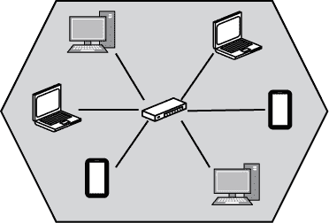

*图 11-1：计算机网络*

*互联网*是一个全球互联的计算机网络系统，所有网络都使用一套共同的协议。互联网是一个*网络的网络*，连接了来自世界各地各种组织的网络，如图 11-2 所示。

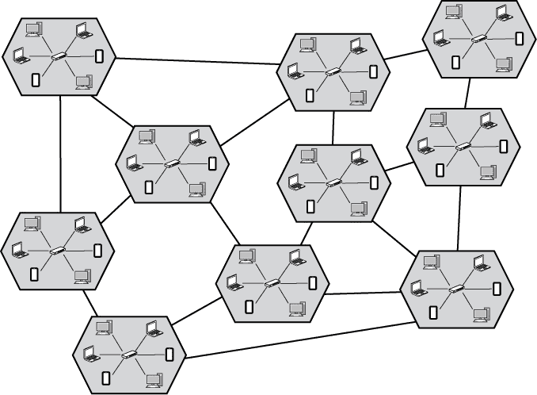

*图 11-2：互联网：网络的网络*

一个*主机*或*节点*是连接到网络的单个计算设备。主机可以作为网络上的服务器或客户端，或有时两者兼具。网络*服务器*是一个主机，它监听入站的网络连接并为其他主机提供服务。例子包括网页服务器和电子邮件服务器。网络*客户端*是一个主机，它发起出站连接并从网络服务器请求服务。客户端的例子包括运行网页浏览器或电子邮件应用程序的智能手机或笔记本电脑。客户端向服务器发出*请求*，服务器则通过*响应*进行回复，如图 11-3 所示。

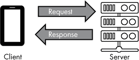

*图 11-3：客户端向服务器发出请求，服务器作出响应*

如上所述，*服务器*是指任何接受入站请求并为客户端提供服务的设备。然而，*服务器*也可以指一类专门设计用于作为网络服务器的计算机硬件。这些专用计算机通常被设计成可以安装在数据中心的计算机机架中，并且通常包含典型个人电脑中没有的硬件冗余和管理能力。然而，任何具备正确软件的设备都可以作为网络上的服务器。

### 互联网协议套件

仅仅将世界各地的网络物理连接起来并不足以让这些网络上的设备相互通信。所有参与的计算机需要以相同的方式进行通信。*互联网协议套件*标准化了互联网中的通信方式，确保网络上的所有设备使用相同的语言进行交流。互联网协议套件中的两个基础协议是*传输控制协议（TCP）*和*互联网协议（IP）*，统称为*TCP/IP*。

网络协议在分层模型中运行，而这种模型的实现被称为*网络栈*（与第九章中讨论的内存栈不同）。最底层的协议与底层网络硬件进行交互，而应用程序则与上层的协议进行交互。中间层的协议提供诸如寻址和数据可靠传输等服务。某一层的协议不需要关心整个网络栈，只需要关心与其交互的层，从而简化了整体设计。这是封装的另一个例子。

互联网协议套件是围绕四层模型设计的。这有时被称为*TCP/IP 模型*。TCP/IP 模型的四层，从下到上依次是链路层、互联网层、传输层和应用层，如图 11-4 所示。

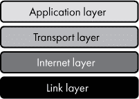

*图 11-4：互联网协议套件的网络模型*

**OSI—另一个网络模型**

另一个常用的网络协议模型是*开放系统互联（OSI）模型*。OSI 模型将协议划分为七层，而不是四层。这个模型在技术文献中经常被提及，但互联网是基于互联网协议套件的，因此本书将重点讨论 TCP/IP 模型。

这些网络层代表了一种抽象，是我们讨论互联网运作时使用的模型。在实际操作中，每一层都是通过特定的网络协议来实现的。每一层网络代表了一定的责任范围，协议必须履行其分配的层级责任。表 11-1 提供了每一层的描述。

**表 11-1：** 互联网协议套件四层的描述

| **层级** | **描述** | **示例协议** |
| --- | --- | --- |
| 应用层 | 在应用层运行的协议提供特定应用功能，如发送电子邮件或检索网页。这些协议完成终端用户（或后端服务）希望完成的任务。应用层协议构造了用于网络中进程对进程通信的数据。所有较低层的协议作为“管道”来支持应用层。 | HTTP, SSH |
| 传输层 | 传输层协议为应用提供了在主机之间发送和接收数据的通信通道。应用根据应用层协议构造数据，然后将这些数据交给传输层协议，送往远程主机。 | TCP, UDP |
| 网络层 | 网络层协议提供了一种跨网络通信的机制。该层负责通过地址标识主机，并使数据能够在互联网各网络之间进行路由。传输层依赖于网络层进行地址分配和路由。 | IP |
| 链路层 | 链路层协议提供了一种在本地网络上进行通信的方式。该层的协议与本地网络上的网络硬件类型（如 Wi-Fi）紧密相关。网络层协议依赖链路层协议在本地网络上进行通信。 | Wi-Fi, Ethernet |

每一层的协议与相邻层的协议进行通信。来自主机的外发传输通过网络层逐层传递，从应用层协议，到传输层协议，再到网络层协议，最后到链路层协议。主机接收的传输则从链路层协议开始，逐层向上传递，按照刚才描述的顺序逆向进行。

尽管网络主机（如客户端或服务器）会使用四层协议，但其他类型的网络硬件（如交换机和路由器）只使用与低层协议相关的协议。这些设备可以执行其工作，而无需查看网络传输中包含的高层协议数据。

来自客户端到服务器的请求以及其与网络层的关系，如图 11-5 所示。

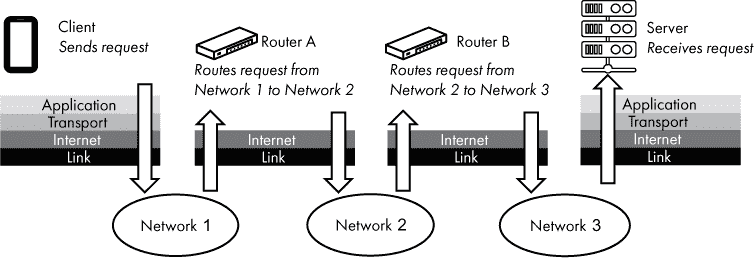

*图 11-5：网络请求穿越各网络层*

让我们一步步了解图 11-5 的流程。客户端设备上的应用通过应用层协议生成一个请求。这个请求被交给传输层协议，再传递到网络层协议，最后到链路层协议。所有这些操作都在客户端设备上完成。此时，请求被传输到本地网络，如图中标示的网络 1。请求跨越互联网，依次通过各个网络。在此例中，路由器 A 将请求从网络 1 路由到网络 2，路由器 B 将请求从网络 2 路由到网络 3。请求到达目标服务器后，会通过各网络协议向上传递，从链路层协议开始，到达应用层协议。服务器上运行的进程接收该请求，该请求按照客户端原本使用的应用层协议格式化。服务器进程解析请求并做出适当的响应。

现在，让我们从底层开始，逐层查看。

#### *链路层*

互联网协议栈的最低层是*链路层*。主机之间的物理和逻辑连接被称为网络*链路*。链路层协议被同一网络上的设备用来相互通信。链路上的每个设备都有一个唯一标识其身份的网络地址。对于许多链路层协议，这个地址被称为*媒体访问控制地址*（或*MAC 地址*）。链路层数据被分成称为*帧*的小单元，每个帧包括一个描述帧的头部、一个数据负载和最后用于检测错误的帧尾。具体内容如图 11-6 所示。


*图 11-6：链路层帧*

帧头包含源和目的 MAC 地址。头部还包括一个描述帧数据部分所承载数据类型的说明。

如果你的家里有 Wi-Fi 网络，Wi-Fi 就是你网络上主机之间的链路。Wi-Fi 协议由 IEEE 802.11 规范定义，它并不关心或知道无线网络上传输的数据类型；它只是使设备之间能够通信。每个连接到 Wi-Fi 网络的设备都有一个 MAC 地址，并接收发送到其地址的帧。MAC 地址只在本地网络上有效；远程网络上的计算机不能直接向本地网络上的 MAC 地址发送数据。

另一个值得注意的链路层技术是*以太网*，它用于有线物理连接。以太网由 IEEE 802.3 标准定义。以太网通常使用内含铜线对的电缆，端口使用常见的*RJ45*连接器，如图 11-7 所示。

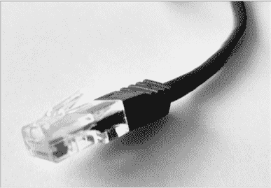

*图 11-7：以太网常用的电缆*

所有连接到互联网的设备都参与链路层。这是必要的，因为正是链路层提供了本地网络的连接（有线或无线）。像笔记本电脑或智能手机这样的主机参与所有层次，但某些网络设备只在链路层工作。最基本的例子是集线器。*网络集线器*是一种网络设备，用于连接本地网络上的多个设备，但不具备处理发送帧的智能功能。一个简单的集线器可能提供多个以太网端口来连接设备。集线器只是将它接收到的每个帧从一个物理端口转发到所有其他端口。更智能的链路层设备是*网络交换机*，它会检查接收到的帧中的 MAC 地址，并将这些帧发送到目标 MAC 地址所在设备的物理端口。

**注意**

*请参见项目#29 在第 254 页，在那里你可以查看链路层设备和 MAC 地址*。

#### *互联网层*

*互联网层*允许数据超越本地网络进行传输。该层使用的主要协议被称为互联网协议（IP）。它支持*路由*，即确定在网络之间传输数据路径的过程。互联网上的每个主机都分配一个*IP 地址*，这是一个唯一标识全球互联网中主机的数字。也可以有私有 IP 地址，它们不会直接暴露在互联网上。IP 地址通常由本地网络中的服务器分配，且设备的 IP 地址在连接到新网络时通常会发生变化。关于地址分配和私有 IP 地址的内容，我们将在后续部分进行详细介绍。

通过互联网层发送的数据称为*数据包*，它被封装在链路层的帧中。图 11-8 说明了数据包如何适应帧的数据部分。

IP 数据包头包含源 IP 地址和目标 IP 地址。头部还包括描述数据包的信息，例如正在使用的 IP 版本和头部长度。IP 数据包的数据部分包含 IP 层携带的有效载荷。

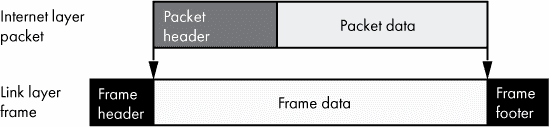

*图 11-8：数据包包含在帧的数据部分中*

目前互联网上使用两种版本的互联网协议。*互联网协议版本 4（IPv4）*是当前使用的主要版本，另一个活跃的版本是*互联网协议版本 6（IPv6）*。你可能会想，IPv5 发生了什么？其实并没有这样的协议，但一个叫做互联网流协议的实验性协议将其 IP 版本标识为 5，因此在 IPv4 的继任者开发时跳过了 IPv5。IPv4 和 IPv6 之间的一个重要区别是 IP 地址的大小。IPv4 地址的长度为 32 位，而 IPv6 地址的长度为 128 位。这一差异使得 IPv6 可以提供更多的地址。这种地址大小的变化旨在帮助解决 IPv4 地址短缺的问题。在本书中，我们将重点介绍 IPv4 地址（并称之为*IP 地址*），因为它们仍然是目前互联网上最主要的寻址方式。

一个 32 位的 IP 地址通常以点分十进制表示法显示，意味着 32 位被分成四组，每组 8 位，8 位数字以十进制显示（而不是十六进制或二进制），四个十进制数字之间用句点（点）分隔。一个示例 IP 地址，以点分十进制表示法显示为 192.168.1.23。每个 8 位的十进制数字可以称为*字节*。

连接到同一本地网络的计算机具有以相同前导位开头的 IP 地址，且被认为处于同一个*子网*中。处于同一子网的计算机能够直接在链路层进行通信，因为它们在同一物理网络上运行。处于不同子网的计算机必须通过*路由器*发送其流量，路由器是一个连接子网并在互联网层上工作的设备。

子网划分将 IP 地址分为两部分：*网络前缀*，同一子网中的所有设备共享此前缀；以及*主机标识符*，它是该子网上每台主机的唯一标识。网络前缀中包含的位数根据网络配置的不同而有所不同。

让我们看一个例子。假设一个子网使用 24 位网络前缀，剩余 8 位用于表示主机。还假设此子网中的一台主机使用之前的示例 IP 地址——192.168.1.23。根据这个 IP 地址和网络前缀，IP 地址的划分如 图 11-9 所示。

在此示例中，所有本地子网中的主机都有一个以 192.168.1\ 开头的 IP 地址。每台主机的最后一个八位字节的值不同，`23` 被分配给这台特定的主机。此示例使用了一个 24 位前缀长度，意味着前缀与 IP 地址的前三个八位字节对齐。这是一个很好的示例，但前缀长度并不总是与八位字节边界对齐。例如，一个 25 位前缀也会包括最后一个八位字节的第一个位，留给主机的则只有 7 位。

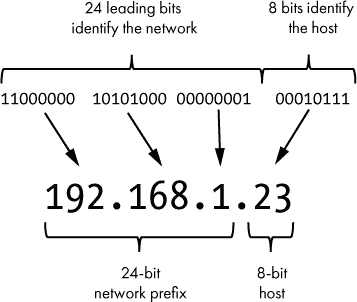

*图 11-9：使用 24 位网络前缀的示例 IP 地址*

用于表示网络前缀的位数通常有两种方式。*无类域间路由（CIDR）符号*列出了一个 IP 地址，后跟一个斜杠（/），然后是用于网络前缀的位数。在我们的示例中，这将是 192.168.1.23/24。表示前缀位数的另一种常见方法是使用*子网掩码*，它是一个 32 位的数字，其中每个属于网络前缀的位都用二进制 1 表示，而属于主机号的位用二进制 0 表示。子网掩码也以点分十进制表示，因此我们这个 24 位网络前缀的示例会导致一个子网掩码为 255.255.255.0，如 图 11-10 所示。

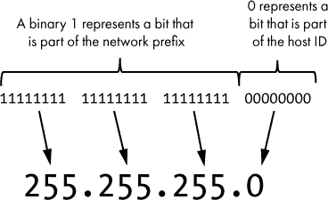

*图 11-10：表示为子网掩码的 24 位网络前缀*

让我们看看这在实践中如何发挥作用。假设你的计算机 IP 地址是 192.168.0.133，子网掩码是 255.255.255.224，或者以 CIDR 表示法表示为 192.168.0.133/27\。你的计算机希望连接到另一台 IP 地址为 192.168.0.84\ 的计算机。如前所述，如果两台计算机在同一子网中，它们可以直接通信；如果不在同一子网中，它们必须通过路由器通信。那么，如何判断另一台计算机是否在同一子网呢？

对 IP 地址和其子网掩码执行按位逻辑与操作，得到子网中的第一个地址。这个第一个地址，其中主机位全为 0，作为子网本身的标识符。通常称之为*网络 ID*。共享网络 ID 的两台计算机在同一子网中。主机可以对其自身的 IP 地址和希望连接的 IP 地址执行此与操作，以查看它们是否共享网络 ID，从而是否在同一子网中。我们可以用示例计算机的 IP 地址来试一下，如下所示：

```
  IP = 192.168.0.133   = 11000000.10101000.00000000.10000101

MASK = 255.255.255.224 = 11111111.11111111.11111111.11100000

 AND = 192.168.0.128   = 11000000.10101000.00000000.10000000 = The network ID
```

现在对我们示例中的第二台计算机执行相同的操作：

```
  IP = 192.168.0.84    = 11000000.10101000.00000000.01010100

MASK = 255.255.255.224 = 11111111.11111111.11111111.11100000

 AND = 192.168.0.64    = 11000000.10101000.00000000.01000000 = The network ID
```

如你所见，通过这个操作，得出了两个不同的网络 ID（`192.168.0.128` 和 `192.168.0.64`）。这意味着第二台计算机不在与你的计算机同一子网中。为了进行通信，这两台计算机需要通过连接两个子网的路由器来发送消息。

**练习 11-1：哪些 IP 在同一子网？**

IP 地址 192.168.0.200 是否与你的计算机在同一子网中？假设你的计算机 IP 地址为 192.168.0.133，子网掩码为 255.255.255.224。

另一种看待这个问题的方法是：网络前缀描述了子网中可以使用的地址范围。该范围中的第一个地址被定义为网络前缀位，后跟所有主机标识符的二进制 0。继续以我们示例中的计算机 192.168.0.133 为例，它所在子网的第一个地址是 192.168.0.128\。该范围中的最后一个地址是网络前缀位，后跟所有主机标识符的二进制 1。在我们的示例中，这个地址是 192.168.0.159\。第一个和最后一个地址有特殊含义——第一个标识网络，最后一个是*广播地址*（用于向子网上所有主机发送消息）。其间的所有地址可以用于子网中的主机。我们示例中的 IP 地址 192.168.0.133 显然在此范围内（从 192.168.0.128 到 192.168.0.159），而另一台 IP 地址为 192.168.0.84 的计算机则不在该范围内。

你也可以通过查看为主机标识符保留的位数来确定子网中可用于主机的 IP 地址数量。在我们的示例中，27 位保留用于网络前缀，剩余 5 位用于主机标识符。这 5 位提供了 32 个可能的主机地址，因为 2⁵ 等于 32。然而，正如前面所提到的，第一个和最后一个地址有特殊用途，因此实际上只能使用这个网络前缀识别 30 个主机。这与我们之前的结论一致：第一个主机标识符是 128，128 + 32 给出的是 160，这是下一个子网中的第一个地址，因此 159 将是我们的地址范围中的最后一个主机。

**注意**

*请参见 项目 #30 在 第 255 页，你可以通过你的 Raspberry Pi 查看互联网层*

#### *传输层*

*传输层* 提供了一个通信通道，应用程序可以使用它来发送和接收数据。传输层有两个常用的协议：传输控制协议（TCP）和 *用户数据报协议（UDP）*。TCP 提供两个主机之间的可靠连接。它确保最小化错误，数据按顺序到达，丢失的数据会被重发，等等。使用 TCP 发送的数据被称为 *段*。另一方面，UDP 是一种“尽力而为”的协议，这意味着它的传输是不可靠的。UDP 在速度比可靠性更重要的情况下更受青睐。使用 UDP 发送的数据被称为 *数据报*。这两种协议各有其用，但为了简单起见，接下来的章节中我只讲解 TCP。 图 11-11 展示了一个 TCP 段如何嵌入到数据包的数据部分中，而数据包又嵌入到帧的数据部分中。

正如我们之前看到的，链路层在帧头中包括目标 MAC 地址来识别本地网络接口，互联网层在数据包头中包括目标 IP 地址来识别互联网中的主机。这些信息足以将数据包传送到互联网中的特定设备。一旦数据包到达目标主机，传输层头部会包括目标网络 *端口号*，用于标识将接收数据的特定服务或进程。一个拥有单一 IP 地址的主机可以有多个活跃端口，每个端口用于执行不同类型的网络活动。

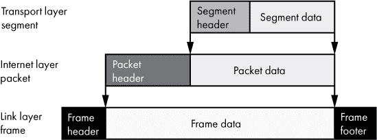

*图 11-11：TCP 段包含在 IP 数据包的数据部分中*

用一个类比来说明，IP 地址就像办公大楼的街道地址，而网络端口号就像该办公大楼中某个员工的办公室号码。IP 地址唯一标识一台主机计算机，就像街道地址唯一标识一座办公大楼一样。通过互联网协议，数据包可以像包裹送到办公大楼一样送到主机。然而，一旦数据包到达计算机，操作系统必须决定如何处理它。数据包并不是送给操作系统本身的，而是送给计算机上某个正在运行的进程。同样，包裹到达办公大楼后，可能并不是送给邮局工作人员的，而是送给大楼里其他某个人的。操作系统检查端口号，将传入的数据送到在指定端口上监听的进程，就像邮局工作人员检查包裹上的姓名或办公室号码，将包裹送到正确的人手中。

端口号范围从 0 到 1,023 的网络端口称为*知名端口*，而端口号范围从 1,024 到 49,151 的端口可以在互联网分配号码局（IANA）注册，称为*注册端口*。大于 49,151 的端口是*动态端口*。从技术上讲，任何具有足够权限的进程都可以在任何未被系统占用的端口上监听，可能会忽略该端口号的典型使用案例。然而，当客户端应用程序希望连接到另一台计算机上的远程服务时，它需要知道使用哪个端口，因此标准化端口号是有意义的。例如，Web 服务器通常监听端口 80 和端口 443（用于加密连接）。除非另行指示，Web 浏览器会假定应使用端口 80 或 443。

**练习 11-2：研究常见端口**

查找常见应用层协议的端口号。域名系统（DNS）、安全外壳协议（SSH）和简单邮件传输协议（SMTP）的端口号是多少？你可以通过在线搜索或查看 IANA 注册表找到这些信息，网址是：*[`www.iana.org/assignments/port-numbers`](http://www.iana.org/assignments/port-numbers)*。IANA 列表有时会使用意想不到的术语来表示服务名称。例如，DNS 仅被列为“domain”。

服务器使用知名端口以方便客户端连接。然而，大多数网络通信是双向的（客户端发送请求，服务器响应），因此客户端也需要有一个开放的端口，以便接收来自服务器的数据。客户端只需暂时打开这样的端口，足够完成与服务器的通信即可。这样的端口称为*临时端口*，由操作系统中的网络组件分配。例如，客户端网页浏览器连接到服务器的 80 端口，客户端上也会打开一个临时端口，假设是端口号 61,348。客户端将其网页请求发送到服务器的 80 端口，服务器则将响应发送到客户端的 61,348 端口。

一个 IP 地址加上一个端口号构成一个*端点*，而一个端点的实例称为*套接字*。一个套接字可以监听新的连接，或者它可以代表一个已建立的连接。如果多个客户端连接到同一个端点，每个客户端都有自己独立的套接字。

**注意**

*请参阅项目 #31 在第 256 页，在这里您可以查看 Raspberry Pi 的端口使用情况*。

#### *应用层*

*应用层*是互联网协议栈的最终、最上层。虽然下三层为互联网通信提供了通用的基础，但应用层的协议专注于完成特定的任务。例如，Web 服务器使用*超文本传输协议（HTTP）*来检索和更新网页内容；邮件服务器使用*简单邮件传输协议（SMTP）*来发送和接收电子邮件；文件传输服务器使用*文件传输协议（FTP）*来，没错，就是传输文件！换句话说，应用层是我们接触到描述应用程序行为的协议的地方，而栈的较低层则是使应用程序能够在互联网上完成其任务的“管道”。图 11-12 提供了四个层次的完整视图。

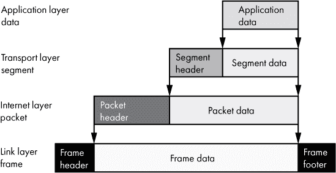

*图 11-12：应用层的数据包含在段的数据部分中。*

图 11-12 展示了每个层次如何适配低层数据负载的视图。将所有层次组合在一起，参见图 11-13，我们可以看到发送到互联网设备的帧所包含的内容。


*图 11-13：包含 IP 数据包、TCP 段和应用数据的帧*

我们已经从下到上地走了一遍网络帧的内容，从最接近硬件的层开始。当一个帧被主机接收时，它会按照相同的顺序处理，从链路层到应用层。相反，当一个帧从主机发送时，帧会以相反的顺序组装。一个过程准备好应用数据，数据最终被封装在一个段、一个包，最后是一个帧中。

### 互联网之旅

现在你已经熟悉了 TCP/IP 网络模型中的四个层次，让我们通过一个例子来看数据是如何在互联网中传输的。我们将看到沿途的各种设备如何与每个网络层进行交互。图 11-14 说明了这一点，展示了左上方的客户端如何与左下方的服务器进行通信。

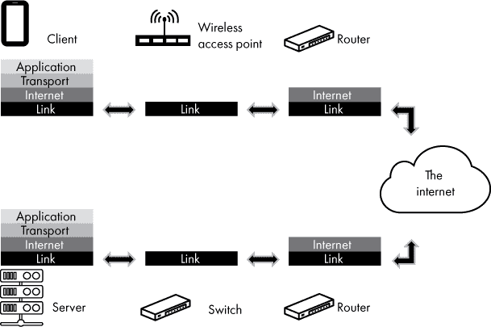

*图 11-14：不同设备在网络栈的不同层次进行交互*

我将在 图 11-14 中设置场景。一个客户端设备（图示左上角）连接到一个无线 Wi-Fi 网络。该网络通过路由器连接到互联网。在图示的另一个位置，我们有一台服务器（图示左下角），它通过交换机和路由器与互联网建立有线连接。客户端设备的用户打开网页浏览器，向服务器请求一个网页。为了简便起见，我们假设客户端已经知道服务器的 IP 地址。

客户端上的网页浏览器使用 HTTP 语言，这是 web 的应用层协议，因此它会形成一个面向目标服务器的 HTTP 请求。浏览器随后将 HTTP 请求交给操作系统的 TCP/IP 软件栈，请求将数据传送到服务器——特别是服务器的 IP 地址和端口 80，HTTP 的标准端口。客户端操作系统上的 TCP/IP 软件栈随后将 HTTP 负载封装在一个 TCP 段中（传输层），并在段头中设置目标端口为 80。如果需要，TCP 会将应用层数据分割成多个段，每个段都带有自己的头部。客户端的互联网层软件随后将 TCP 段封装在一个 IP 包中，该包在头部包含服务器的目标 IP 地址。如果需要，IP 会将数据包分割成多个更小的片段，为通过网络链路的传输做好准备。在客户端的链路层，IP 包被封装在一个帧中，帧头部包含本地路由器的 MAC 地址。该帧通过客户端设备的 Wi-Fi 硬件无线传输。

无线接入点接收该帧。接入点在链路层操作，将帧发送给路由器。路由器检查互联网层的数据包以确定目标 IP 地址。为了到达服务器，请求需要通过互联网上的多个路由器。当地路由器将数据包封装成一个新的帧，带有新的目标 MAC 地址（下一个路由器的地址），并将新帧发送出去。这个路由过程会在互联网上经过多个路由器，直到请求到达与服务器连接的子网上的路由器。

最后的路由器将数据包封装成适合服务器本地网络的帧。这个帧的头部包含服务器的 MAC 地址。服务器子网上的交换机查看帧中的 MAC 地址，并将帧转发到合适的物理端口。交换机无需查看更高层的信息。服务器接收到帧后，网络接口的驱动程序将 TCP/IP 数据包传递给 TCP/IP 软件栈，接着将 HTTP 数据交给监听 TCP 端口 80 的进程。监听 80 端口的 Web 服务器软件处理请求。这包括回复客户端，为此，整个过程会再次发生，只不过顺序是反向的。

**注意**

*请参见项目 #32，该项目位于第 258 页，在其中你可以看到从你的 Raspberry Pi 到互联网上主机的路由*

### 基础互联网功能

虽然 TCP/IP 为可靠的数据传输提供了必要的基础设施，但其他协议则提供了额外的基础互联网功能。这些功能作为应用层协议来实现。现在让我们看看两个这样的协议（DHCP 和 DNS）以及一种用于转换 IP 地址的系统（NAT）。

#### *动态主机配置协议*

互联网上的每个主机都需要一个 IP 地址、一个子网掩码以及它的路由器 IP 地址（也叫*默认网关*），才能与其他主机进行通信。IP 地址是如何分配的呢？设备可以被赋予一个*静态 IP 地址*，这需要有人编辑设备的配置并手动设置 IP 信息。这有时是有用的，但它要求用户确保该 IP 地址没有被占用，并且对该子网是有效的。大多数终端用户没有手动配置设备 IP 设置的专业知识，也不想处理手动配置的麻烦。幸运的是，大多数 IP 地址是通过*动态主机配置协议（DHCP）*动态分配的。通过 DHCP，当设备连接到网络时，它会在没有用户干预的情况下接收 IP 地址和相关信息。

为了使 DHCP 在网络上可用，网络上的设备必须被配置为*DHCP 服务器*。该服务器有一个可分配给网络上设备的 IP 地址池。DHCP 的流程在图 11-15 中进行了说明。

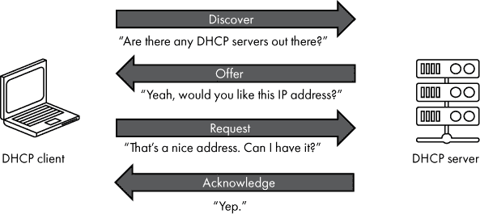

*图 11-15：一个 DHCP 对话*

让我们来逐步了解图 11-15。当一个设备连接到网络时，它会广播一条消息以发现任何 DHCP 服务器。*广播*是一种特别的包，它的目标是本地网络上的所有主机。当 DHCP 服务器收到这个广播时，它会向客户端设备提供一个 IP 地址。如果客户端希望接受这个提供的 IP 地址，它会向服务器回复一个请求，要求分配该地址。然后，DHCP 服务器会确认请求，并将该 IP 地址分配给客户端。该 IP 地址会被*租赁*给客户端，如果客户端没有续租，地址最终会过期。

**注意**

*请参阅项目 #33 和第 258 页，在那里你可以看到你的 Raspberry Pi 使用 DHCP 租赁的 IP 地址*。

#### *私有 IP 地址和网络地址转换*

可用的 IP 地址数量是有限的，因此大多数家庭互联网服务提供商（ISP）只会分配一个 IP 地址给客户。这个 IP 地址被分配给直接连接到 ISP 网络的设备，通常是一个路由器。然而，许多客户家中有多个设备。让我们看看如何通过利用私有 IP 地址和网络地址转换，使多个设备共享一个公共 IP 地址。

某些范围的 IP 地址被认为是*私有 IP 地址*，这些地址是为*私有网络*设计的，例如家庭或办公室中的网络，在这些网络中，设备并没有直接连接到互联网。任何符合 10.*x.x.x*、172.16.*x.x* 或 192.168.*x.x* 格式的地址都是私有 IP 地址。任何人都可以在不需要许可的情况下使用这些地址范围。问题是私有 IP 地址是不可路由的——它们不能在公共互联网中使用。家庭网络中的 DHCP 服务器可以分配这些地址，而不必担心其他网络是否也在使用相同的地址。与必须唯一的公共 IP 地址不同，私有 IP 地址设计上可以在多个私有网络中同时使用。即使多个网络使用相同的地址，也没有关系，因为这些地址永远不会出现在私有网络之外。私有 IP 地址解决了 ISP 仅为家庭或企业提供一个公共 IP 地址的问题，但如果私有 IP 地址无法在互联网上路由，它们又如何有用呢？

*网络地址转换 (NAT)* 允许在私有网络（通常是家庭网络）上的设备使用相同的公共 IP 地址访问互联网。当数据包通过 NAT 路由器时，路由器会修改数据包中的 IP 地址信息。当来自私有家庭网络的数据包到达 NAT 路由器时，路由器会修改源 IP 地址字段，以匹配公共 IP 地址，如图 11-16 所示。

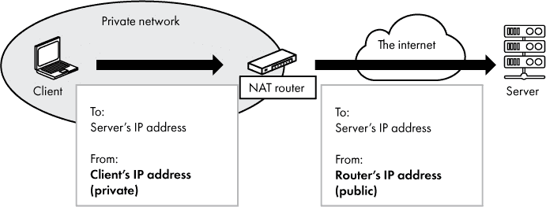

*图 11-16：NAT 路由器将私有 IP 地址替换为其自己的公共 IP 地址*

当响应返回到路由器时，路由器将目标 IP 地址设置为发起请求的主机的私有地址。通过这种方式，家庭网络中的所有流量看起来都来自同一个公共 IP 地址，即使实际在私有网络上有多个设备。NAT 还具有额外的安全性好处：私有网络上的设备不会直接暴露在公共互联网中，因此互联网中的恶意用户无法直接发起连接到私有设备。大多数面向消费者销售的家用路由器都是 NAT 路由器，通常还具备内置无线接入点功能。

私有 IP 地址不仅对家庭网络有价值，对于不希望将计算机暴露于公共互联网的企业来说也同样重要。许多企业网络使用*代理服务器*而不是 NAT 路由器。代理服务器类似于 NAT 路由器，它允许私有网络上的设备访问互联网，但代理服务器通常在应用层而非互联网层运行。代理服务器通常还提供额外的功能，如用户认证、流量日志记录和内容过滤。

**注意**

*请参见项目 #34 以及第 259 页，在其中你可以看到分配给你设备的 IP 地址是公共 IP 地址还是私有 IP 地址*。

#### *域名系统*

我们已经看到，互联网上的主机通过 IP 地址进行标识。然而，互联网的多数用户很少，甚至从不直接处理 IP 地址。虽然 IP 地址对于计算机来说是有效的，但它们对用户来说并不友好。没有人愿意记住由点分隔的四组数字。幸运的是，我们有*域名系统 (DNS)* 来简化这一切。DNS 是一个将名称映射到 IP 地址的互联网服务。这使得我们可以通过像 *www.example.com* 这样的名称来引用主机，而不是通过其 IP 地址。

计算机的完整 DNS 名称被称为 *完全限定域名*，或 *FQDN*。像 *travel.example.com* 这样的名称就是一个 FQDN。这个名称由一个简短的本地 *主机名（travel）* 和一个域后缀 *（example.com）* 组成。术语 *主机名* 常常交替使用，指的是计算机的短名称或 FQDN。本文接下来会使用 *主机名* 来指代计算机的 FQDN。*域名*，如 *example.com*，代表一个由组织管理的网络资源组。*example.com* 和 *travel.example.com* 都是域名。前者代表一个网络域；后者代表该域中的特定主机。

软件需要能够查询 DNS 将主机名转换为 IP 地址——这被称为 *解析* 主机名。为了实现这一功能，主机会配置一个 DNS 服务器 IP 地址的列表。这个列表通常由 DHCP 提供，通常包含由互联网服务提供商维护或在本地网络上运行的 DNS 服务器。当客户端想通过名称连接到服务器时，它会向 DNS 服务器请求与该名称对应的 IP 地址。如果服务器能提供，它会返回请求的 IP 地址。这个过程如 图 11-17 所示。

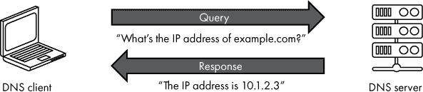

*图 11-17：简化的 DNS 查询。* example.com *的 IP 地址并不准确。*

一旦客户端获取到服务器的 IP 地址，它就会使用该地址与服务器进行通信，如前所述。我曾听说 DNS 被比作互联网的电话簿，尽管这种类比对一些读者来说可能不太恰当，因为电话簿不再像以前那样普及！

你可能会认为 IP 地址和名称之间存在一对一的映射关系。实际上并非如此。一个名称可以映射到多个 IP 地址。在这种情况下，多个客户端查询 DNS 获取某个名称时，它们可能会收到不同的 IP 地址作为响应。这对于需要将某个服务的负载分配到多个服务器的情况非常有用。负载分配可以基于地理位置进行，比如欧洲的客户端可能会得到一个不同于亚洲客户端的 IP 地址，这样可以让各地区的客户端连接到离它们物理上更近的服务器 IP 地址。

反向查询也是可能的：多个名称可以映射到相同的 IP 地址。在这种情况下，查询不同名称时，可能会返回同一个 IP 地址。这对于服务器托管多个相同类型的服务实例（每个实例通过名称标识）非常有用。此情况在网站托管中很常见，一台服务器可能托管多个网站，每个网站通过其 DNS 名称进行标识。

DNS 中的每个条目被称为*记录*。记录有多种类型；最基本的是*A 记录*，它只是将主机名映射到 IP 地址。其他例子包括将一个主机名映射到另一个主机名的*CNAME（规范名称）*记录，以及用于电子邮件服务的*MX（邮件交换器）*记录。

没有任何一个组织愿意承担管理当今存在的众多 DNS 记录的任务。幸运的是，这并不需要；DNS 的实现方式允许共享责任。像*www.example.com*这样的 DNS 名称实际上代表了一个记录层次结构，不同的 DNS 服务器负责维护该层次结构中不同级别的记录。应用于*www.example.com*的 DNS 层次结构，如图 11-18 所示。

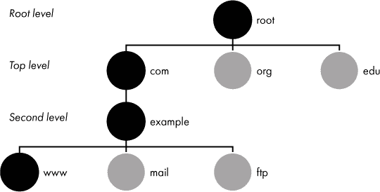

*图 11-18：示例 DNS 层次结构，突出显示* www.example.com

在这个层次结构的顶部是*根域名*。根域名在 DNS 名称中不会像*www.example.com*那样有文本表示，但它是 DNS 层次结构中不可或缺的一部分。根域名包含所有*顶级域名（TLD）*的记录，例如*.com*、*.org*、*.edu*、*.net*等。截至 2020 年，全球有 13 个根名称服务器，每个根名称服务器负责了解所有顶级域名服务器的详细信息。假设你想查找一个以*.com*结尾的域名的记录，根服务器可以将你引导到一个知道*.com*下域名信息的 TLD 服务器。

顶级 DNS 服务器负责了解其层次结构下所有二级域名的信息。一个*.com*的顶级 DNS 服务器可以将你引导到*example.com*的二级 DNS 服务器。二级域名的 DNS 服务器维护着主机和三级域名的记录，这些主机和三级域名位于二级域名下。这意味着*example.com*的 DNS 服务器负责维护诸如*www.example.com*和*mail.example.com*等主机的记录。这个模式继续下去，允许域名嵌套。一旦一个域名在顶级域名下注册，域名的拥有者可以在其域名下创建任意多的记录。

如前所述，当计算机需要为 FQDN 查找 IP 地址时，它会向配置的 DNS 服务器发送请求。那么 DNS 服务器如何处理这个请求呢？如果服务器最近已经查找过该记录，它可能会将该记录存储在缓存中，并立即返回 IP 地址给客户端。如果 DNS 服务器没有缓存响应，它可能会根据需要查询其他 DNS 服务器来获取答案。这涉及从根服务器开始，逐步向下查询服务器层次，直到找到该记录。一旦服务器找到记录，它可以将其缓存起来，以便未来查询该记录时能够立即回应。最终，缓存的记录会被删除，以确保服务器提供的是较为最新的数据。

**注意**

*请参见项目 #35，在第 260 页上查看有关 DNS 的信息*。

### 网络即计算

让我们花点时间来思考互联网如何融入我们在本书中已经讨论的更广泛的计算概念。网络看起来可能是一个边缘话题，但实际上它与计算并没有多远的关系。互联网由硬件和软件共同工作，允许设备之间的通信。通过互联网发送的数据最终归结为 0 和 1，以各种形式表示，例如电线上的电压。从计算机的角度来看，像 Wi-Fi 或以太网适配器这样的网络接口只是另一个 I/O 设备。操作系统通过设备驱动与这些适配器进行交互，操作系统还包含了软件库，允许应用程序轻松地通过互联网进行通信。像路由器和交换机这样的网络设备也是计算机，尽管它们是高度专业化的。互联网以及网络本身，实际上是本地计算的延伸，它允许数据在超出单一设备范围的情况下进行传输和处理。

### 总结

本章我们讨论了互联网，一个全球互联的计算机网络集合，所有这些网络都使用一套通用的协议。你学习了互联网协议套件的四个层次——链路层、互联网层、传输层和应用层。你了解了数据如何在互联网中传输，以及设备如何在各个层次上进行交互。你学习了 DHCP 如何提供网络配置信息，NAT 如何让私有网络上的设备连接到互联网，以及 DNS 如何提供友好的名称，可以代替 IP 地址使用。在下一章中，你将学习万维网，这是一组通过 HTTP 在互联网中传输的资源。

**项目 #29：检查链路层**

先决条件：一台运行 Raspberry Pi OS 的 Raspberry Pi。如果你还没有，建议你翻到附录 B，阅读完整的“Raspberry Pi”部分。

在这个项目中，你将使用你的树莓派检查本地网络的链路层。我们先从以下命令开始，它可以列出你以太网适配器的 MAC 地址：

```
$ ifconfig eth0 | grep ether
```

输出结果应该类似于以下内容：

```
        ether b8:27:eb:12:34:56  txqueuelen 1000  (Ethernet)
```

在这个例子中，MAC 地址是`b8:27:eb:12:34:56`。这是一个 48 位数字的十六进制表示。记住，每个十六进制字符表示 4 位，因此 12 个字符 × 4 位 = 48 位。

MAC 地址的前 24 位表示硬件的供应商/制造商。这个数字被称为*组织唯一标识符（OUI）*，由*电气和电子工程师协会（IEEE）*管理。在这个例子中，OUI 是 B827EB，它分配给了树莓派基金会。你可以在这里查看当前的 OUI 列表：*[`standards-oui.ieee.org/oui.txt`](http://standards-oui.ieee.org/oui.txt)*。

你的树莓派 Wi-Fi 适配器有它自己的 MAC 地址。你可以像这样查看它：

```
$ ifconfig wlan0 | grep ether

        ether b8:27:eb:78:9a:bc  txqueuelen 1000  (Ethernet)
```

在我的系统上，Wi-Fi 适配器的 OUI（MAC 地址的前 24 位）与以太网适配器的 OUI 相同。这是因为这两个适配器都是树莓派的内部硬件，使用树莓派基金会的 OUI。

从你的树莓派上，你还可以查看本地网络上其他设备的 MAC 地址。你可以使用一个名为`arp-scan`的工具，它尝试连接本地网络上的每台计算机并检索其 MAC 地址。

首先，安装该工具：

```
$ sudo apt-get install arp-scan
```

然后运行这个命令（命令末尾是小写字母 L，而不是数字 1）：

```
$ sudo arp-scan -l
```

你应该会看到一个 IP 地址列表（我们将在本章的其他部分进行讲解）和 MAC 地址，还有一列尝试将 MAC 前缀与制造商匹配。我在我的本地网络上得到了 10 个结果，其中一些我没有立即认出来。你可能会看到一些重复的结果，它们会在第三列中标记为`DUP`。返回的列表通常不包括你运行扫描的计算机的地址。

你可能会在第三列中看到一些显示为`(Unknown)`的结果。这意味着`arp-scan`工具无法将 OUI 号码与已知制造商匹配，可能是因为该工具使用的是过时的 OUI 列表版本。你可以尝试通过下载 IEEE 当前的 OUI 号码列表并重新运行扫描来修复此问题，命令如下：

```
$ get-oui

$ sudo arp-scan -l
```

当我在家里的网络上看到多个设备，我无法立即识别时，我会立刻产生想要弄清楚它们是什么的冲动！作为额外的挑战，找出所有从`arp-scan`返回的设备。现在，如果你在一个你无法控制的网络上运行这个工具（比如咖啡店或图书馆），这可能不太实际，但如果你在家里，这是你可以做的事。你可能需要登录到网络中的每个设备，翻查其设置，找到它的 IP 地址或 MAC 地址，并查看它是否与`arp-scan`返回的某个条目匹配。提示：在 Linux 或 Mac 上使用`ifconfig`工具，或在 Windows 上使用`ipconfig`工具。在移动设备上，可以查看网络设置的用户界面。

**项目 #30：检查互联网层**

先决条件：一台运行 Raspberry Pi OS 的树莓派。

在这个项目中，你将使用树莓派查看互联网层。让我们从以下命令开始，它列出了设备上所有的网络接口及其关联的 IP 地址。

```
$ ifconfig
```

你通常会看到三个接口：`eth0`、`lo`和`wlan0`。`lo`接口是一个特殊的接口，它是*环回*接口。它用于树莓派上运行的进程，这些进程希望使用 TCP/IP 相互通信，但不需要通过网络实际发送任何流量。也就是说，流量会留在设备上。环回接口的 IP 地址是 127.0.0.1。这个地址是一个特殊地址，无法路由，也不能作为本地子网中的地址使用，因为任何尝试将消息发送到该地址的行为都会导致消息立即返回给发送计算机。换句话说，每台计算机都认为 127.0.0.1 是自己的 IP 地址。

正如我们在上一个项目中提到的，`eth0`是有线以太网接口，`wlan0`是无线 Wi-Fi 接口。如果你通过这些接口之一或两个连接到网络，你应该能在`ifconfig`的输出中看到`inet`旁边的 IP 地址。你可能还会看到列在`inet6`旁边的 IPv6 地址。以下是`ifconfig`输出中的示例`wlan0`信息：

```
wlan0: flags=4163<UP,BROADCAST,RUNNING,MULTICAST>  mtu 1500

        inet 192.168.1.138  netmask 255.255.255.0  broadcast 192.168.1.255

        inet6 fe80::8923:91b2:13e0:ed2a  prefixlen 64  scopeid 0x20<link>
```

在这个输出中，你可以看到分配的 IP 地址是`192.168.1.138`。`netmask`值（子网掩码）是`255.255.255.0`，而`broadcast`地址是`192.168.1.255`。

`ifconfig`命令为我们提供了有关树莓派各种网络接口的信息，但它并没有告诉我们路由是如何配置的。让我们使用`ip route`命令来看一下。这里包含了一个示例输出；你的结果可能有所不同。

```
$ ip route

default via 192.168.1.1 dev wlan0 src 192.168.1.138 metric 303

192.168.1.0/24 dev wlan0 proto kernel scope link src 192.168.1.138 metric 303
```

该命令的输出可能有些难以理解。简而言之，第一行给出了默认路由。当没有特定的路由适用时，数据包应该发送到这里。在这个特定的例子中，所有不匹配特定路由规则的数据包应发送到`192.168.1.1`。这意味着`192.168.1.1`是本地路由器的 IP 地址，也被称为*默认网关*。

下一行是一个路由条目，告诉你，任何发送到`192.168.1.0/24`范围内的 IP 地址的数据包，应该通过设备`wlan0`发送。这是本地子网的 Wi-Fi 适配器。换句话说，这条路由规则确保与本地子网 IP 地址的通信直接发生，而无需经过路由器。

总结来说，这个输出告诉你，任何发送到与`192.168.1.0/24`匹配的 IP 地址的数据包，都应该通过`wlan0`接口直接发送到目标地址。其他的流量则使用默认路由，将流量发送到`192.168.1.1`的路由器。最终结果是，本地子网的流量直接发送到目标设备，而发送到其他子网上的设备的流量，通常是互联网设备，将通过默认网关发送。

**项目 #31：检查端口使用情况**

前提条件：一台运行 Raspberry Pi OS 的树莓派。

在这个项目中，你将查看树莓派上哪些网络端口在使用。然后你将检查其他计算机上的端口。让我们从以下命令开始，它将展示树莓派上监听和已建立的 TCP 套接字。

```
$ netstat -nat
```

让我们分析一下命令中使用的`-nat`选项。`n`选项表示使用数字输出以显示端口号。`a`选项表示显示所有连接（包括监听和已建立的连接），`t`表示将输出限制为 TCP。在我的设备上，我看到如下的列表：

```
Active Internet connections (servers and established)

Proto Recv-Q Send-Q Local Address           Foreign Address         State

tcp        0      0 0.0.0.0:22              0.0.0.0:*               LISTEN

tcp        0     36 192.168.1.138:22         192.168.1.125:52654    ESTABLISHED

tcp        0      0 192.168.1.138:22         192.168.1.125:51778    ESTABLISHED

tcp6       0      0 :::22                   :::*                    LISTEN
```

这里你看到四个与 SSH 相关的套接字。我知道它们与 SSH 相关，因为所有套接字都使用端口`22`。我在树莓派上启用了 SSH，以允许远程终端连接。第一行和最后一行显示树莓派在端口`22`上监听新的传入 SSH 连接，使用 TCP 和 IPv6 上的 TCP 协议。中间的两行显示我有两个已经建立的 SSH 连接到这个设备，它们都来自我的笔记本（IP 为`192.168.1.125`）到树莓派（IP 为`192.168.1.138`）。注意到，两个已建立的连接都指向树莓派的相同服务器端口（`22`），而我笔记本上的客户端端口则不同（`52654`和`51778`），因为它们是临时端口。

再次运行命令，这次添加`-p`选项并在命令前加上`sudo`：

```
$ sudo netstat -natp
```

这将给你相同的列表，但还会显示与该套接字相关的进程 ID（PID）和程序名称。任何发送到该套接字的流量都会被定向到 PID，后者处理流量并根据需要响应。在我的计算机上，我看到使用此端口的程序是`sshd`—SSH 的守护进程。

现在你已经检查了树莓派上哪些端口在使用，接下来让我们检查远程计算机上的端口。为此，你将使用一个名为`nmap`的工具，首先需要在树莓派上安装它：

```
$ sudo apt-get install nmap
```

一旦工具安装完成，选择一个你希望扫描的目标主机。这个主机可以是你网络上的设备（比如你的路由器或笔记本电脑），也可以是互联网上的主机。注意，反复扫描一个你无法控制的主机可能会引起该服务器管理员的怀疑，所以我强烈建议你只扫描你拥有的设备。

在我的案例中，我决定扫描我的默认网关，恰好它位于 192.168.1.1。以下`nmap`命令扫描指定 IP 地址上开放的 TCP 端口。尝试在你的树莓派上运行此命令，将 IP 地址替换为你希望扫描的设备的地址。如果你想扫描你自己的路由器，请参阅项目 #30，了解如何获取默认网关的 IP 地址。

```
$ nmap -sT 192.168.1.1
```

我扫描的结果的部分列表显示了以下端口：

```
PORT      STATE SERVICE

53/tcp    open  domain

80/tcp    open  http
```

这告诉我，这个设备不仅充当路由器，还充当 DNS 服务器（端口`53`）和 Web 服务器（端口`80`）。对于家庭路由器来说，提供这些服务是正常的。 **项目 #32：追踪互联网主机的路由**

前提条件：一台运行 Raspberry Pi OS 的树莓派。

在这个项目中，你将检查数据包从树莓派到互联网上某个主机的路由。首先，你需要选择一个互联网上的主机。这个主机可以是像*www.example.com*这样的网站，也可以是你知道的任何互联网主机的 IP 地址或完全限定域名（FQDN）。一旦你决定了主机，输入以下命令，将*`www.example.com`*替换为你希望查看的主机的名称或 IP 地址。

```
$ traceroute www.example.com
```

`traceroute`工具尝试显示在数据包跨越互联网时遇到的路由器。输出应该逐行阅读。每一行都有序号，并显示该数据包在旅行过程中遇到的路由器的名称（如果有的话）和 IP 地址。如果短时间内没有响应，输出将显示一个星号（`*`），并跳到下一个路由器。你也可能看到每一行显示多个 IP 地址，表示可能有多个路由。

**项目 #33：查看你的租用 IP 地址**

前提条件：一台运行 Raspberry Pi OS 的树莓派。

在这个项目中，你将查看与树莓派的 IP 地址相关的租用信息，该 IP 地址是从 DHCP 服务器获取的。当然，这假设你的树莓派配置为使用 DHCP（这是默认设置），而不是静态 IP 地址。要做到这一点，请查看系统日志：

```
$ cat /var/log/syslog | grep leased
```

预计会看到类似以下的输出：

```
Jan 24 19:17:09 pi dhcpcd[341]: eth0: leased 192.168.1.104 for 604800 seconds
```

在这里，你可以看到 IP 地址`192.168.1.104`是从 DHCP 服务器租用的，供网络接口`eth0`使用，这是树莓派上的以太网接口。你的输出可能显示不同的 IP 地址，也许是不同的接口，可能是`wlan0`。

默认情况下，*syslog* 文件会定期清除，其内容会被移动到备份文件中。因此，您可能无法在 *syslog* 文件中看到 DHCP 条目。您可以释放当前的 IP 地址，申请一个新的，并再次查看租赁条目，方法如下：

```
$ sudo dhclient –r wlan0

$ sudo dhclient wlan0

$ cat /var/log/syslog | grep leased
```

如果您想查看以太网而不是 Wi-Fi 的地址，请将 `wlan0` 替换为 `eth0`。

**项目 #34：您的设备的 IP 地址是公有的还是私有的？**

前提条件：一台运行 Raspberry Pi OS 的 Raspberry Pi。

在这个项目中，您将检查 Raspberry Pi 的 IP 地址是公有的还是私有的。如果您的设备有一个私有 IP 地址，您还可以找到用于互联网通信的公有 IP 地址。如同之前，您可以使用以下工具查看设备的分配 IP 地址。

```
$ ifconfig
```

在查找设备的分配 IP 地址时，您可能会看到一个 127.0.0.1 的条目；可以忽略它，因为它用于环回（见 项目 #30）。如前所述，任何符合 10.*x.x.x*、172.16.*x.x* 或 192.168.*x.x* 格式的地址都是私有 IP 地址。现在，即使您拥有像这些这样的私有 IP 地址，当您访问互联网资源时，您也间接地使用了一个公有 IP 地址。这是网站或其他互联网服务在您连接时看到的地址。如果您在家庭网络中，这个公有 IP 地址很可能是分配给您的路由器的。如果您在企业网络中，这个公有 IP 地址可能是分配给您公司网络边缘的代理设备的。在这两种情况下，从您本地网络到互联网的所有网络流量都起源于这个公有地址。

要查找设备在连接互联网设备时使用的公有 IP 地址，一种选择是登录到您的路由器或代理服务器并检查其网络配置。如果您知道如何查询路由器或代理服务器以获取这些信息，随时可以进行操作。不过，由于每种网络设备的型号略有不同，我在这里不会一一讲解步骤。

一个更通用的选择是查询一个可以返回您当前公有 IP 地址的在线服务。之所以可以实现，是因为每个您的设备连接的互联网服务器都知道您的 IP 地址；关键是找到一个愿意告诉您它看到的 IP 地址的服务。如果您在设备上使用的是网页浏览器，或许最简单的做法是查询 Google，搜索类似“我的 IP 地址”这样的内容。通常这会返回您想要的信息。

如果您正在使用终端工作，比如在 Raspberry Pi 上，您可以使用 `curl` 工具向一个返回当前 IP 地址的网页发出 HTTP 请求。以下是一些当前可以使用的服务示例：

```
$ curl http://ipinfo.io/ip

$ curl http://checkip.amazonaws.com/

$ curl http://ipv4.icanhazip.com/

$ curl http://ifconfig.me/ip
```

任何一个命令都应该返回你的公共 IP 地址到终端窗口。将此地址与之前通过`ifconfig`获得的地址进行比较。如果它们相同，则说明你的设备直接分配了公共 IP 地址。如果不同，则说明你的设备可能被分配了私有 IP 地址，你正在通过 NAT 路由器或代理服务器连接到互联网。

**项目 #35：在 DNS 中查找信息**

前提条件：一台运行 Raspberry Pi OS 的树莓派。

在这个项目中，你将使用树莓派查询 DNS 记录。让我们从查找一个网站的 IP 地址开始。你将使用`host`工具来完成此操作。以下命令返回我感兴趣的网站*`www.example.com`*的 IP 地址。你可以自由替换为你希望查找的其他主机名。

```
$ host www.example.com
```

你应该会看到输出，显示该主机的 IP 地址。你可能还会看到一个 IPv6 地址。根据你查询的主机名，可能会返回多个记录，因为一个 DNS 名称可以映射到多个 IP 地址。你还可能会发现你输入的名称实际上是另一个名称的别名，而该名称又映射到一个 IP 地址。

DNS 还支持反向查找，你可以指定一个 IP 地址，返回与之对应的主机名。这并不总是有效，因为需要 DNS 记录来支持此功能。想尝试的话，只需使用`host`命令并提供一个 IP 地址。在以下命令中，将*`a.b.c.d`*替换为你在项目 #34 中找到的公共 IP 地址，或者任何其他你想查询的公共 IP 地址。同样，这仅对那些已有 DNS 记录支持反向查找的 IP 地址有效。

```
$ host a.b.c.d
```

默认情况下，`host`工具使用你的设备配置的 DNS 服务器。你也可以通过指定该服务器的 IP 地址，使用`host`查询特定的 DNS 服务器。互联网服务提供商为其客户提供 DNS 服务，但也有许多免费的替代 DNS 服务可用。例如，在本文撰写时，Google 提供了一个 DNS 服务器，地址为 8.8.8.8，Cloudflare 提供了一个 DNS 服务器，地址为 1.1.1.1。如果你想使用 1.1.1.1 的 DNS 服务器查找*www.example.com*，你可以输入如下命令：

```
$ host www.example.com 1.1.1.1
```

这应该会输出与之前相同的 IP 地址信息，并附带一些文本，指示用于查找的 DNS 服务器。

如果你对 DNS 查询的详细信息感兴趣，可以在使用`host`命令时加上`-v`选项，这样会提供详细输出。

```
$ host -v www.example.com
```
