## 第十二章：万维网**


前一章描述了互联网，即一组全球连接的计算机网络，使用一套协议共享资源。万维网是建立在互联网之上的一个系统，由于其广泛的普及，常常与互联网本身混淆。在这一章中，我们深入探讨网络的细节。我们首先看看它的关键属性和相关的编程语言，然后我们再讨论 web 浏览器和 web 服务器。

### 万维网概述

*万维网*，通常简称为*网*，是一组通过*超文本传输协议（HTTP）*在互联网上提供的资源。一个网络*资源*是任何可以通过网络访问的内容，如文档或图片。托管网络资源的计算机或软件程序称为*web 服务器*，而*web 浏览器*是常用来访问网络内容的一种应用程序。浏览器用于查看称为*网页*的文档，一组相关的网页被称为*网站*。网络具有分布性、可寻址性和链接性。让我们从检查这些核心属性开始。

#### *分布式网络*

万维网是*分布式*的。没有集中式的组织或系统来管理哪些内容可以发布到网络上。任何连接到互联网的计算机都可以运行 web 服务器，而该计算机的所有者可以公开任何他们希望发布的内容。尽管如此，组织或国家可能会选择阻止用户访问某些内容，而政府可以关闭托管非法内容的网站。除了这些情况，网络是一个开放的平台，允许人们发布任何他们愿意发布的内容，没有单一的组织控制可用内容。

#### *可寻址的网络*

网络使用*统一资源定位符（URL）*为网络上的每个资源提供一个唯一的地址，该地址包括其位置和如何访问它。URL 通常被称为*网络地址*或简写为*地址*。为了说明这些地址的结构，让我们以一个虚构的旅游网站的 URL 为例，如图 12-1 所示。这个 URL 标识了一个关于前往卡罗莱纳的旅游信息页面。

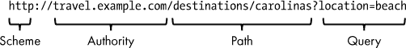

*图 12-1：一个示例 URL*

一个 URL 由多个部分组成。URL 的*协议*标识了用于访问资源的应用层协议。在这种情况下，协议是 HTTP，我们将在后续部分详细讨论。冒号（:）字符表示协议部分的结束。接着是两个斜杠（//），这是 URL 的*权限*部分。在这个示例中，权限部分包含了服务器的 DNS 主机名，即资源所在的服务器（*travel.example.com*）。这里也可以使用 IP 地址。除主机外，其他信息也可以出现在这一部分，例如用户名（位于主机之前并以@符号分隔）或端口号（位于主机之后，并以冒号前缀）。接下来是 URL 的*路径*部分，它指定了 Web 服务器上资源的位置。URL 路径类似于文件系统路径，将资源组织成逻辑层级。在我们的示例中，路径*/destinations/carolinas*表示该网站有一个描述旅行目的地的页面集合，且 URL 指定的特定页面是关于卡罗莱纳州的页面。如果该网站有一个描述佛罗里达州作为目的地的页面，那么它可能位于*/destinations/florida*。最后，URL 的*查询*部分作为修改返回给客户端的资源的修饰符。在我们的示例中，查询指示*carolinas*页面应显示海滩上的位置。URL 查询部分的格式和含义因网站而异。

该 URL 包含了大量信息，所以让我用简单的语言重新陈述如何读取它。一个网站运行在名为*travel.example.com*的计算机上。该网站使用 HTTP 协议，因此在连接到该网站时需要使用此协议。该网站上有一个名为*carolinas*的页面，它是*destinations*集合的一部分。查询字符串指示该页面仅显示位于海滩的地点。

一个 URL 不必包含图 12-1 中示例的每个元素。它也可以包含该示例中未包括的某些元素。只包含协议和权限的 URL 也是完全有效的，例如*[`travel.example.com`](http://travel.example.com)*。在这种情况下，网站会提供其默认页面，因为没有提供路径。

**习题 12-1：识别 URL 的各个部分**

对于以下 URL，识别其中的协议、用户名、主机、端口、路径和查询。并非所有 URL 都包含所有这些部分。

+   *[`example.com/photos?subject=cat&color=black`](https://example.com/photos?subject=cat&color=black)*

+   *[`192.168.1.20:8080/docs/set5/two-trees.pdf`](http://192.168.1.20:8080/docs/set5/two-trees.pdf)*

+   *mailto:someone@example.com*

你可以在附录 A 中检查你的答案。

网络浏览器通常会在其地址栏中显示当前的 URL，如图 12-2 所示。

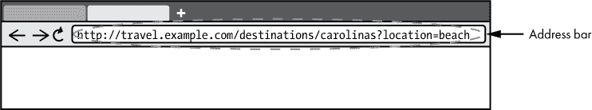

*图 12-2：地址栏*

今天，浏览器通常会在地址栏中省略 URL 的方案、冒号和正斜杠。这并不意味着这些 URL 元素不再被浏览器使用。浏览器只是想简化用户体验。URL 的显示方式会随着时间的推移而不断变化，不同的浏览器表现也各不相同。

图 12-3 显示了 Google Chrome（版本 77）如何在其地址栏中显示 URL 的示例。

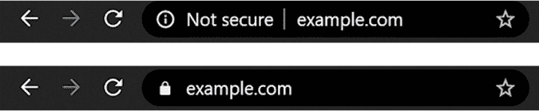

*图 12-3：Chrome 地址栏*

图 12-3 上方的图像显示了加载 HTTP 网站时的地址栏。Chrome 在其地址栏中不显示*http://*前缀。请注意`Not secure`文本。下方的图像显示了加载 HTTPS 网站时的地址栏。HTTPS 是 HTTP 的安全版本。Chrome 省略了*https://*前缀，但显示一个锁形图标，表示这是一个 HTTPS 网站。

我们一直在讨论以网页为背景的 URL，但 URL 也扩展到 Web 上的其他资源。例如，网页上显示的图像有其自己的 URL，脚本文件或 XML 数据文件也是如此。网页浏览器只在地址栏显示网页的 URL，但典型的网页通过 URL 引用各种其他资源；浏览器会自动加载这些资源。

有时在 URL 中不需要包含方案、主机名，甚至完整路径。当 URL 省略其中一个或多个元素时，这种 URL 被称为*相对 URL*。相对 URL 被解释为相对于其所在的上下文。例如，如果在网页中使用一个像*/images/cat.jpg*的 URL，加载该页面的浏览器会假设猫照片的方案和主机名与该页面的方案和主机名相匹配。

#### *链接的 Web*

URL 的特点是 Web 上的每个资源都有一个唯一的地址，这使得一个 Web 资源可以轻松地引用另一个资源。从一个网页文档到另一个网页文档的引用被称为*超链接*，或者简称*链接*。这种链接是单向的；任何网页都可以链接到另一个页面，而无需许可或互链。网页相互链接的这种系统就是让“Web”成为万维网的原因。像网页这样的文档，如果可以通过超链接连接，就被称为*超文本*文档。

#### *Web 协议*

Web 使用*超文本传输协议（HTTP）*及其安全变种*HTTPS*进行传输。

##### HTTP

尽管名称中有“超文本”，但 HTTP 不仅用于传输超文本；它还用于读取、创建、更新和删除 Web 上的所有资源。HTTP 通常依赖于 TCP/IP。TCP 确保数据可靠传输，IP 负责主机寻址。HTTP 本身基于*请求*和*响应*的模型。HTTP 请求发送到 Web 服务器，服务器会回复一个响应。

每个 HTTP 请求都包括一个*HTTP 方法*，也非正式地称为*HTTP 动词*，它描述了客户端请求服务器执行的操作类型。

一些常用的 HTTP 方法：

GET   检索资源而不修改它。

PUT   在服务器的特定 URL 上创建或修改资源。

POST   在服务器上创建一个资源，作为现有 URL 的子资源。

DELETE   从服务器上删除资源。

任何 HTTP 方法都可以在任何资源上尝试，但托管特定资源的服务器通常不会允许某些方法在该资源上使用。例如，大多数网站不允许客户端删除资源。那些允许删除的站点几乎总是要求用户以拥有删除权限的帐户登录。

在典型网站上最常用的方法是 `GET`。当网页浏览器访问网站时，浏览器会对请求的页面执行 `GET` 请求。该页面可能包含对脚本、图片等的引用，浏览器随后也使用 `GET` 方法获取这些资源，直到页面能够完全显示。

每个 HTTP 响应都包括一个*HTTP 状态码*，它描述了服务器的响应。每个状态码是一个三位数，其中最显著的数字表示响应的总体类别。100 范围内的响应是信息性的，200 范围的响应表示成功，300 范围的响应表示重定向，400 范围的响应表示客户端出现错误——请求未被客户端正确形成，500 范围的响应表示服务器发生了错误。

一些常用的 HTTP 状态码：

**200**   成功。服务器能够完成请求。

**301**   永久移动。浏览器应将请求重定向到响应中指定的不同 URL。

**401**   未经授权。需要身份验证。

**403**   禁止访问。用户没有权限访问请求的资源。

**404**   未找到。服务器未能找到请求的资源。

**500**   服务器内部错误。服务器发生了意外错误。

HTTP 是相当容易理解的。它使用人类可读的文本来描述请求和响应。请求的第一行包括 HTTP 方法、资源的 URL 和请求的 HTTP 版本。以下是一个例子：

```
GET /documents/hello.txt HTTP/1.1
```

这意味着客户端请求服务器通过 HTTP 版本`1.1`发送 */documents/hello.txt* 的内容。在请求行之后，HTTP 请求通常包括一些头部字段，用以提供更多关于请求的信息，此外还可以有一个可选的消息体。

类似地，HTTP 响应也使用简单的文本格式。第一行包括 HTTP 版本、状态码和响应短语。以下是一个 HTTP 响应第一行的例子：

```
HTTP/1.1 200 OK
```

在这个响应示例中，服务器返回了状态码 `200` 和响应短语 `OK`。就像 HTTP 请求一样，响应也可以包括头信息值和消息体。图 12-4 提供了一个更详细，但仍然简化的 HTTP 请求和响应示例。

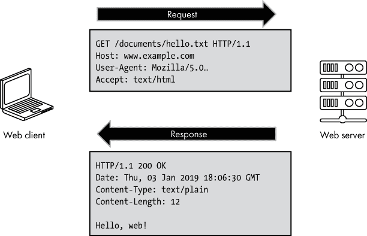

*图 12-4：简化的 HTTP 请求和响应*

**注意**

*请参见 项目 #36 在 第 283 页，你可以查看 HTTP 网络流量*。

##### HTTPS

一种安全变体的 HTTP 称为*HTTPS（超文本传输协议安全）*，通常用于加密通过互联网发送的数据。*加密*是将数据编码成无法读取的格式的过程。*解密*是加密的反过程，使加密数据重新变得可读。加密算法使用称为*加密密钥*的秘密字节序列来加密和解密数据。由于密钥可以保持秘密，因此算法本身可以是公开的。

HTTPS 使用两种加密方式。*对称加密*使用一个*共享密钥*来加密和解密信息。*非对称加密*使用两把密钥（一个*密钥对*）：*公钥*用于加密数据，*私钥*用于解密数据。非对称加密允许公钥自由共享，以便任何人都可以加密和发送数据，而私钥则仅与需要接收和解密数据的信任方共享。

没有 HTTPS 时，网页流量以“明文”方式传输，这意味着它是未加密的，可能会在传输过程中被恶意方截获或修改。HTTPS 有助于减少这些风险。在 HTTPS 中，整个 HTTP 请求都会被加密，包括 URL、头信息和主体。HTTPS 响应也是如此，它是完全加密的。HTTPS 将 HTTP 请求使用一种叫做*传输层安全协议（TLS）*的协议进行加密。过去，使用类似的协议叫做*安全套接字层（SSL）*，但由于安全问题，它已被弃用，取而代之的是 TLS。当我们谈到 HTTPS 时，指的就是使用 TLS 加密的 HTTP。

当一个 HTTPS 会话开始时，客户端会通过一个包含安全通信方式的 *客户端 hello* 消息连接到服务器。服务器则以 *服务器 hello* 消息回应，确认通信的方式。服务器还会发送一组称为 *数字证书* 的字节，其中包括服务器的公钥，用于非对称加密。然后，客户端检查服务器的证书是否有效。如果有效，客户端使用服务器的公钥加密一串字节，并将加密后的消息发送给服务器。服务器使用其私钥解密这些字节。客户端和服务器都利用先前交换的信息来计算一个共享的秘密密钥，用于对称加密。一旦客户端和服务器都拥有了共享密钥，所有在会话期间的通信都将使用该密钥进行加密和解密。

HTTPS 之前只在有限的情况下使用，通常用于处理特别敏感信息的网站。然而，网络正在向 HTTPS 成为常态而非例外的方向发展。越来越多的观点认为，HTTPS 的安全性和隐私保护对大多数，甚至是所有网络流量都是有意义的。谷歌通过在 Chrome 浏览器中将 HTTP 网站标记为“不安全”并利用 HTTPS 作为正面信号来提升其搜索引擎排名，推动了这一变化。

**注意**

*请参见项目 #37，它介绍了如何在本地网络上设置一个简单的 Web 服务器，详细内容见第 285 页。*

#### *可搜索的网络*

对于许多人来说，访问网络的典型入口是通过搜索。用户不需要直接访问特定的 URL，而是将一些搜索词输入到浏览器中，查看搜索结果。浏览器设计鼓励这种做法，因为浏览器通常会将地址栏也当作搜索框使用。即使用户想访问某个特定网站，他们通常会先搜索该网站，然后点击搜索结果中的链接，而不是在地址栏中输入完整的 URL。这种设计增强了浏览器的可用性，即使它模糊了 URL 和搜索词、浏览器和搜索引擎之间的区别。

尽管搜索网络的普遍性和实用性，搜索功能并不是网络的原生特性。没有标准的规范来定义搜索应该如何工作。这意味着，作为网络的关键特性之一，搜索依赖于非标准的、专有的搜索引擎。在本文写作时，谷歌主导着网络搜索领域，尽管也有一些不错的替代搜索引擎，但它们的全球使用量仅为谷歌的一小部分。

### 网络的语言

任何可以保存为文件的内容都可以托管在网上。例如，Web 服务器可以托管一组 Excel 文件，这些文件可以从网站上下载并在 Excel 中打开。然而，网页浏览器不仅仅是一个下载文件并在其他应用程序中打开的工具。网页浏览器不仅下载内容，还会渲染网页。这些网页可以是简单的文档，也可以是互动的网页应用程序。为了实现这一点，浏览器理解三种计算机语言，这些语言用于构建网站。

**超文本标记语言 (HTML)** 定义了网页的结构。换句话说，它定义了*页面上的内容*。例如，HTML 可以指定网页上存在一个按钮。

**层叠样式表 (CSS)** 定义网页的外观。换句话说，它定义了*页面的外观*。例如，CSS 可以指定前述按钮的宽度为 30 像素，并且是蓝色的。

**JavaScript** 定义网页的行为。换句话说，它定义了*页面的功能*。例如，JavaScript 可以在点击按钮时将两个数字相加。

这三种语言一起用于创建网页内容。值得注意的是，网页浏览器也能够渲染其他数据类型，特别是某些图像、视频和音频格式，但我们不会详细讨论这些内容。现在，让我们深入了解构成网页的三种基础语言：HTML、CSS 和 JavaScript。

#### *使用 HTML 构建网页结构*

HTML 是一种标记语言，用于描述网页的结构。请注意，HTML 不是一种编程语言。编程语言描述的是计算机应该执行的操作，而标记语言描述的是数据的结构。就 HTML 而言，这些数据代表的是网页。一个网页可以包含多种元素，如段落、标题和图片。以下是一个用 HTML 描述的简单网页示例。

```
<!DOCTYPE html>

<html lang="en">

  <head>

    <meta charset="utf-8">

    <title>A Cat</title>

  </head>

  <body>

    <h1>Thoughts on a Cat</h1>

    <p>This is a cat.</p>

    

  </body>

</html>
```

你会看到许多内容被小于符号 (`<`) 和大于符号 (`>`) 包围。这些被称为 *HTML 标签*，是用于定义 HTML 文档部分的文本字符集。举个例子，表示段落开始的标签是 `<p>`，用于表示段落结束的标签是 `</p>`。请注意结束标签中的斜杠，它与开始标签不同。*HTML 元素* 是指以开始标签开始，以结束标签结束，并包括标签之间的内容的网页部分。例如，这是一个 HTML 元素：`<p>这是一个猫。</p>`。事实上，并不是所有元素都需要结束标签。例如，用于表示图像的 `img` 元素就不需要结束标签。你可以在前面的 HTML 代码示例中看到这一点。

图 12-5 显示了该 HTML 示例在网页浏览器中的渲染效果。

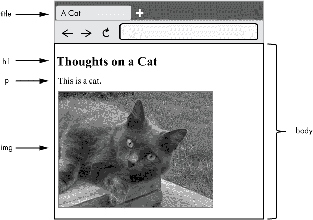

*图 12-5：我们的示例网页在网页浏览器中的渲染效果*

该文档故意没有包含任何关于如何呈现的信息，因此浏览器会使用默认的字体和大小来显示标题和段落。在这个例子中，浏览器还默认使用黑色文字和白色背景——同样，这在文档中并没有指定。由于这个 HTML 示例没有包含样式信息，不同的浏览器可能会略微不同地呈现这个页面。

让我们更仔细地看看 HTML 代码示例。HTML 文档的第一行声明该文件是一个 HTML 文档，如下所示：`<!DOCTYPE html>`。之后，HTML 文档被结构化为一棵树，包含父元素和子元素。`<html>`标签是顶级父标签；所有内容都包含在`<html>`和`</html>`之间。你可以将这两个标签解释为“HTML 从这里开始”和“HTML 到此结束”。这很有道理——HTML 文档中的一切都应该是 HTML！`<html>`标签还包含一个名为`lang`的属性，它标识该文档的语言为`en`，即英语的代码。

`html`元素有两个子元素：`head`和`body`。位于 head 中的元素（在`<head>`和`</head>`之间）描述文档，而位于 body 中的元素（在`<body>`和`</body>`之间）构成文档的内容。

在我们的示例中，head 包含两个元素：一个`meta`元素，用于描述用于编码文档的字符集，还有一个`title`。浏览器通常会在页面的标签上显示标题文本，并在用户添加书签或收藏夹时将其作为默认名称。搜索引擎在显示结果时也会使用标题文本。因此，网页开发人员为页面提供有意义的标题非常重要。

在我们的示例中，body 部分包含一个`<h1>`标签，用于表示标题元素。`<h1>`至`<h6>`有不同级别的标题标签，其中`h1`用于最高级别的章节标题，`h6`用于最低级别的标题。标题之后是一个段落，用`<p>`标签表示，接着是一个通过``标签包含的图像。请注意，图像本身的字节并没有出现在 HTML 中。相反，``标签仅通过相对 URL（*cat.jpg*）引用图像文件。为了完全加载此页面，浏览器需要发送一个单独的 HTTP 请求来下载图像。在此示例中，图像的 URL 仅是文件名，意味着它托管在与文档相同的服务器和路径下。如果图像托管在其他地方，则可以使用带有路径或服务器名称的 URL。``标签还有一个`alt`属性，它提供描述图像的替代文本。这在图像无法呈现时使用，例如当使用纯文本浏览器或朗读页面内容的屏幕阅读器时。

你可能注意到，之前的 HTML 代码使用了缩进来显示页面上各种元素的嵌套关系。例如，`<h1>`和`<p>`标签被缩进到相同的级别，表明它们是`<body>`标签的子元素。这是网页开发中的一种常见做法，用于提高 HTML 的可读性，但并不是强制要求的。事实上，HTML 文档中的空格除了单个空格或制表符之外都不重要！我们可以移除所有多余的空格、制表符和换行符，将 HTML 放在一行中，文档在浏览器中的呈现效果也不会改变。网页浏览器会忽略多余的空白，因此页面元素的排版对开发者有帮助，但对浏览器无影响。

**注意**

*请参见项目#38，该项目在第 287 页展示了如何使本地网站返回使用 HTML 结构的文档，而非简单文本*。

我们目前所讲解的 HTML 元素只是网页浏览器识别的所有元素的一小部分。我们在这里不会详尽地覆盖所有 HTML 内容；这些内容在网上有充分的文档资料。HTML 的规范以前由两个组织维护：万维网联盟（W3C）和网页超文本应用技术工作组（WHATWG）。HTML 的最后一个获得 W3C“推荐”状态的主要版本是*HTML5*。2019 年，这两个组织达成协议，HTML 标准的持续开发将主要由 WHATWG 负责，这被称为*HTML 生活标准*，并且会不断维护。

现代浏览器尝试支持当前版本和较早版本的 HTML，因为许多网页内容是基于早期 HTML 标准编写的。过去，浏览器引入了非标准的 HTML 元素，其中一些最终成为标准化元素，而其他一些则不再使用并失去支持。网页浏览器开发者必须在创新与遵循标准之间找到平衡，同时仍然支持互联网上有时会遇到的不完美 HTML。网页浏览器不断进化，不同的浏览器有时会以不同的方式呈现相同的内容。这意味着网页开发者通常需要在多个浏览器中测试他们的作品，以确保一致的行为。

#### *用 CSS 美化网页*

在我们之前的 HTML 示例中，我们使用了描述文档结构的标签，但这些标签并没有传达文档应该如何呈现的信息。这是有意为之；我们希望保持结构和样式的分离。结构与样式之间的分离使得相同的内容可以在不同的上下文中以不同的样式呈现。例如，大多数网页内容在大屏 PC 显示器上和小屏移动设备上应该有不同的呈现方式。

*层叠样式表（CSS）* 是用于描述网页样式的语言。样式表是一个规则列表。每个规则描述了应该应用于页面某个部分的样式。每条规则包括一个选择器，指示哪些页面元素应该应用该样式。*层叠* 术语指的是多个规则可以应用于同一个元素的能力。让我们看一个简单的例子：

```
p {

   font-family: Arial, Helvetica, sans-serif;

   font-size: 11pt;

   margin-left: 10px;

   color: DimGray;

}

h1 {

   font-family: 'Courier New', Courier, monospace;

   font-size: 18pt;

   font-weight: bold;

}
```

在此示例中，为段落（`p`）元素和一级标题（`h1`）元素定义了样式规则。当此 CSS 应用到页面时，页面上的所有段落都使用指定的字体，字号为 11 磅，左边距为 10 像素，文本为灰色。同样，h1 标题使用指定的加粗字体，字号为 18 磅。请注意，`font-family` 是一个字体列表，而不仅仅是单一字体。这意味着网页浏览器应该尝试找到匹配的字体，从最左边的字体开始，向右查找，直到找到匹配的字体为止。并非每个客户端设备都安装了首选字体；指定多个字体可以增加找到匹配字体的机会。

你可以通过几种方式将样式表应用于网页。一个选择是将 CSS 规则包含在页面上的 `style` 元素中。例如：

```
<style>p {color: red};</style>
```

这样做并不理想，因为样式和结构现在紧密相关。更好的做法是将 CSS 规则指定在一个单独的文件中，该文件也托管在网络上。这种方法使我们的 HTML 和 CSS 完全分离，并允许多个 HTML 文件使用同一个样式表。这样我们可以修改一个 CSS 规则，并使其立即应用到多个页面。在 HTML 的头部部分，我们可以使用一个元素来应用来自 CSS 文件的样式表规则，如下所示（其中 `style.css` 是要应用的 CSS 文件的 URL）：

```
<link rel="stylesheet" type="text/css" href="style.css">
```

如果我们将此样式表应用于我们的示例猫页面，则会看到标题和段落文本发生这些变化，如 图 12-6 所示。

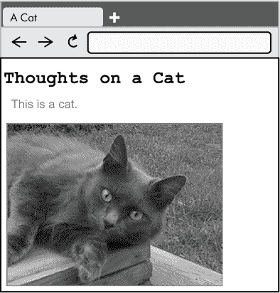

*图 12-6：我们的示例网页，已应用 CSS 样式*

**注意**

*请参见 项目 #39 第 288 页，你可以通过一些 CSS 更新你的猫网页*。

这个 CSS 示例很简单，但 CSS 也允许进行更为复杂的样式设置。如果你熟悉网页上各种令人惊叹的视觉样式，那么你已经看到了 CSS 强大功能的体现。

#### *使用 JavaScript 脚本编写网页*

Web 最初是作为通过超文本文档共享信息的方式构想的。HTML 给我们提供了这个能力，CSS 则为我们提供了控制这些文档展示的方法。然而，Web 逐渐演变成了一个交互内容的平台，JavaScript 成为了启用交互的标准方式。*JavaScript* 是一种编程语言，它使网页能够响应用户的操作，并以编程方式执行各种任务。使用 JavaScript，Web 浏览器不仅仅是一个文档阅读器，而是一个完整的应用程序开发平台。

JavaScript 是一种解释型语言；它在传递给浏览器之前并不会编译成机器代码。Web 服务器以文本格式托管 JavaScript 代码，浏览器会下载这些代码并在运行时进行解释。也就是说，一些浏览器使用*即时编译器 (JIT)*，在运行时编译 JavaScript，从而提高性能。一些开发者会在部署之前对 JavaScript 进行*压缩*，去除空白符、注释，并通常会减小脚本的大小。压缩 JavaScript 可以提高网站的加载速度。压缩并不等同于编译；压缩后的文件仍然是高级代码，而非编译后的机器代码。

JavaScript 的语法类似于 C 语言以及其他从 C 借用的语言（如 C++、Java 和 C#）。然而，这种相似性仅仅是表面的，因为 JavaScript 与这些语言有很大的不同。不要让名字迷惑你：JavaScript 与 Java 几乎没有关系。该语言是面向对象的，但根本上依赖于*原型*而不是类。也就是说，现有的对象而非类，作为其他对象的模板。

JavaScript 使用浏览器提供的页面表示与 HTML 页面进行交互，这种表示被称为*文档对象模型 (DOM)*。DOM 是一个页面元素的层级树结构，并且可以通过编程进行修改。对 DOM 中元素的更新会导致浏览器在显示的网页上更新该元素。JavaScript 包含用于处理 DOM 的方法，利用这些方法，JavaScript 代码不仅可以响应页面上发生的事件（例如按钮的点击），还可以改变渲染页面的内容。

让我们看一下与我们示例页面交互的简单脚本的一部分。每次点击猫咪照片（或在触摸屏上轻触）时，脚本都会将文本`Meow!`添加到页面的段落中。

```
document.getElementById('cat-photo').onclick = function() {

  document.getElementById('cat-para').innerHTML += ' Meow!';

};
```

这里的第一行添加了一个事件处理器，当点击猫咪照片时会触发。事件处理器的代码在下一行定义，它告诉浏览器将文本`Meow!`添加到段落中。由于这是一个事件处理器，它只有在图片点击事件发生时才会运行。请注意，脚本通过 ID 引用照片和段落，分别是`cat-photo`和`cat-para`。HTML 元素可以设置 ID；这使我们可以轻松地通过编程引用它们。我们的脚本只有在我们将这些 ID 添加到 HTML 中时才有效。以下是更新后的 HTML，它引用了脚本（名为`cat.js`）并添加了所需的 ID。

```
<!DOCTYPE html>

<html lang="en">

  <head>

    <meta charset="utf-8">

    <title>A Cat</title>

    <link rel="stylesheet" type="text/css" href="style.css">

    <script src="cat.js"></script>

  </head>

  <body>

    <h1>Thoughts on a Cat</h1>

    <p id="cat-para">This is a cat.</p>

    

  </body>

</html>
```

一旦脚本代码保存为*cat.js*，并且 HTML 按照所示方式更新后，重新加载页面并点击猫咪图片，就会将`Meow!`附加到段落中。如果我们多次点击该图片，我们最终会得到类似图 12-7 所示的效果。

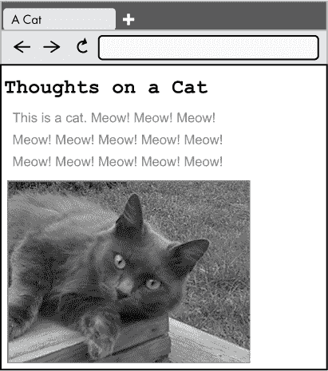

*图 12-7：运行 JavaScript 代码并附加文本后的示例网页*

**注意**

*请参见项目 #40，在第 289 页，你可以使用 JavaScript 更新你的网页*。

JavaScript 可以用来构建在网页浏览器中运行的完整应用程序。前面的例子只是它能做的冰山一角。JavaScript 以 *ECMAScript* 规范为标准化。各种浏览器实现了脚本引擎，力求遵守 ECMAScript 标准的全部或部分内容，该标准会定期更新。

#### *使用 JSON 和 XML 构建网络数据结构*

网站并不是网络上唯一的内容类型。*Web 服务*通过 HTTP 提供数据，旨在通过编程方式进行交互。这与返回 HTML（及相关资源）并旨在通过网页浏览器供用户消费的网站不同。大多数终端用户从不直接与 Web 服务交互，尽管我们使用的网站和应用通常是由 Web 服务支撑的。

想象一下，你经营着一个关于本地乐队信息的网站，网站包含每个乐队的资料，包括乐队成员、背景、演出地点等。终端用户可以访问你的网站，轻松阅读自己喜欢的音乐人的信息。现在，假设有一位应用开发者联系你，希望将你网站上的最新信息纳入他们的应用中。然而，该应用有自己完全不同的展示方式——开发者并不想仅仅在应用中展示你的网站页面。他们需要一种方式来获取你网站上底层的数据。他们可以尝试通过编程读取你的网站页面并提取相关信息，但这个过程复杂且容易出错，特别是如果你网站的布局发生变化时。

通过提供一个将网站数据以非 HTML 格式展示的 Web 服务，可以使得这个开发者的工作变得更加轻松。尽管 HTML 确实提供了一定的结构，但它描述的是一个文档的结构（如标题、段落等），并且对文档中引用的数据类型几乎没有提供任何见解。HTML 对于人类读者是有意义的，但对软件来说解析起来困难。那么，你的 Web 服务应该使用什么格式来构建关于乐队的数据呢？当前 Web 服务中最常用的一般用途数据格式是 XML 和 JSON。

*可扩展标记语言 (XML)* 自 1990 年代以来就已出现，并且是一种流行的 Web 数据交换方式。像 HTML 一样，XML 是基于文本的标记语言，但与其预定义标签不同，XML 允许使用自定义标签来描述数据。在我们虚构的乐队信息服务中，我们可能会定义一个 `<band>` 标签和一个 `<concert>` 标签。让我们看一下使用 XML 描述的虚构乐队：

```
<band name="The Highbury Musical Club">

  <bandMembers>

    <member name="Jane Fairfax" instrument="Piano" />

    <member name="Emma Woodhouse" instrument="Guitar" />

    <member name="Harriet Smith" instrument="Percussion" />

    <member name="Frank Churchill" instrument="Vocals" />

  </bandMembers>

  <upcomingConcerts>

    <concert location="Donwell Abbey" date="August 14, 2020" />

    <concert location="Hartfield" date="November 20, 2020" />

  </upcomingConcerts>

</band>
```

如你所见，具体的 XML 标签及其属性是根据我们的需求定制的，而开始标签、结束标签和树形结构的通用结构与 HTML 类似。XML 的灵活性使得标签可以被任意定义，这意味着 XML 的生产者和消费者需要就预期的标签及其含义达成一致。HTML 也存在这个问题，但 HTML 中所有方参与方都同意一个标准。而在 XML 的情况下，只有通用格式是标准化的，具体标签则有所不同。

XML 是一种流行的 Web 数据共享方法，许多 Web 服务将 XML 作为其主要的数据表示方式。然而，XML 的冗长性和正确解析它的难度是一个挑战。

*JavaScript 对象表示法 (JSON)*，和 XML 一样，是一种以文本格式描述数据的方法。JSON 避免使用标记标签，而是采用了一种类似于 JavaScript 语法描述对象的风格，因此得名。在 JSON 中，对象用大括号（`{` 和 `}`）包裹，数组（对象的集合）用方括号（`[` 和 `]`）括起来。它的语法比 XML 更简洁，这有助于减少通过网络传输的数据大小。JSON 的流行始于 2010 年代，当时它开始取代 XML 成为新 Web 服务首选的数据格式。以下是使用 JSON 描述的相同虚构乐队：

```
{

  "name": "The Highbury Musical Club",

  "bandMembers": [

    {

      "name": "Jane Fairfax",

      "instrument": "Piano"

    },

    {

      "name": "Emma Woodhouse",

      "instrument": "Guitar"

    },

    {

      "name": "Harriet Smith",

      "instrument": "Percussion"

    },

    {

      "name": "Frank Churchill",

      "instrument": "Vocals"

    }

  ],

  "upcomingConcerts": [

    {

      "location": "Donwell Abbey",

      "date": "August 14, 2020"

    },

    {

      "location": "Hartfield",

      "date": "November 20, 2020"

    }

  ]

}
```

XML 和 JSON 都会忽略多余的空白字符，因此，和 HTML 一样，我们可以去掉所有多余的空格、制表符和换行符，而不会影响数据的解释。这样做能生成相当紧凑的数据表示，尤其是在 JSON 的情况下。

XML 和 JSON 并不是为在网页浏览器中直接渲染而设计的格式。在某些浏览器中打开 JSON 或 XML 内容，可能会显示一些内容（也许是稍微格式化过的数据版本），但实际上，JSON 和 XML 并不是为了被网页浏览器直接消费而设计的。它们是供代码读取，然后用数据做一些有用的事情。也许这些代码是一个智能手机应用，展示附近正在演出的乐队信息，就像我们示例中的情况。或者，也可能是客户端 JavaScript 代码，将 JSON 转换为 HTML 供浏览器展示。

### 网页浏览器

现在我们已经讲解了用于描述网页的语言，让我们来看看网页客户端的软件 —— 网页浏览器。第一个网页浏览器叫做 *WorldWideWeb*（不要与本章讨论的主题混淆）。它是由蒂姆·伯纳斯-李（Tim Berners-Lee）于 1990 年开发的。这个第一个浏览器是第一个网页服务器 *CERN httpd* 的客户端。几年后，*WorldWideWeb* 被 *Mosaic* 浏览器取代，后者帮助普及了互联网。接下来的主要浏览器发布是 *Netscape Navigator*，它也有大量的用户群体。1995 年，微软发布了他们的第一个浏览器 *Internet Explorer*，作为 Netscape Navigator 的直接竞争对手，Internet Explorer 成为了当时的主流浏览器。如今，浏览器市场发生了巨大变化，目前主流的浏览器是 *Google Chrome*、*Apple Safari* 和 *Mozilla Firefox*。

#### *渲染页面*

现在，让我们来看一下网页浏览器渲染页面的过程。访问网站的典型流程从请求网站的默认页面（比如 *[`www.example.com`](http://www.example.com)/*）开始，或者请求网站上的特定页面（比如 *[`www.example.com/animals/cat.html`](http://www.example.com/animals/cat.html)*）。用户可以直接在地址栏输入这个 URL，或者通过点击链接来到这个 URL。无论哪种方式，浏览器都会请求指定 URL 的内容。如果 URL 是有效的并且代表一个网页，服务器就会返回 HTML 内容。

然后，网页浏览器必须将返回的 HTML 解析并生成页面的 DOM 表示。HTML 可能包含对其他资源的引用，比如图片、脚本和样式表。每个资源都有自己的 URL，浏览器会为每个资源单独发起请求，如图 12-8 所示。

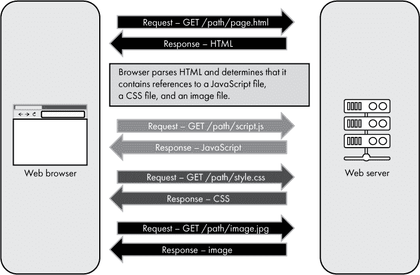

*图 12-8：网页浏览器请求一个页面及其引用的内容*

一旦浏览器检索到页面的各种资源，它会显示 HTML，并使用任何指定的 CSS 来确定适当的呈现方式。任何脚本都会交给 JavaScript 引擎运行。JavaScript 代码可能立即对页面进行更改，或者它可能注册事件处理程序，在某些事件发生时再执行。JavaScript 代码也可以请求来自 Web 服务的数据，并使用这些数据来更新页面。

Web 浏览器由一个渲染引擎（用于 HTML 和 CSS）、一个 JavaScript 引擎和一个将这些功能连接起来的用户界面组成。虽然用户界面提供了浏览器本身的外观和感觉（例如后退按钮和地址栏的外观），但正是渲染引擎和 JavaScript 引擎决定了网站的呈现方式和行为（这包括页面如何布局以及如何响应输入等）。由于每个渲染引擎和 JavaScript 引擎的处理方式略有不同，网页在不同浏览器中的显示或行为可能会有所不同。理想情况下，所有浏览器应该以相同的方式渲染内容，完全按照网站开发者的意图，但现实情况并非总是如此。在撰写本文时，只有三个主要的渲染引擎正在积极开发：WebKit、Blink 和 Gecko。

*WebKit* 是苹果 Safari 浏览器的渲染引擎和 JavaScript 引擎。它也被应用于 iOS 应用商店中的应用程序，因为苹果要求所有展示 Web 内容的 iOS 应用都必须使用这个引擎。*Blink*，这是 WebKit 的一个分支，是 *Chromium* 开源项目的渲染引擎，该项目还包括 *V8* JavaScript 引擎。Chromium 是 Google Chrome 和 Opera 的基础。在 2018 年 12 月，微软宣布其 *Microsoft Edge* 浏览器也将基于 Chromium；微软选择停止开发自己的渲染引擎和 JavaScript 引擎。现在只剩下一个主要的浏览器没有追溯到 WebKit——Mozilla Firefox，它拥有自己的 *Gecko* 渲染引擎和 *SpiderMonkey* JavaScript 引擎。

**注意**

*软件分支（fork）发生在开发者复制一个项目的源代码并对其进行更改时。这使得原始项目和分支项目可以作为独立的软件共存*。

#### *用户代理字符串*

Web 浏览器的正式技术术语是*用户代理*。这个术语也可以应用于其他软件（任何代表用户执行操作的软件），但在这里我们特别讨论的是 Web 浏览器。这个术语出现在有关 Web 的技术文档中，尽管在正式的交流之外很少使用。也就是说，术语实际使用的一个地方是*用户代理字符串*。当浏览器向 Web 服务器发出请求时，通常会包括一个名为`User-Agent`的头部值，用以描述浏览器。例如，下面是 Windows 10 上 Chrome（版本 71）发送的用户代理字符串：

```
Mozilla/5.0 (Windows NT 10.0; Win64; x64) AppleWebKit/537.36 (KHTML, like Gecko)

Chrome/71.0.3578.98 Safari/537.36
```

这看起来似乎有些矛盾。这到底是什么意思呢？

第一个条目 `Mozilla/5.0` 是网络早期的遗留物。Mozilla 曾是 Netscape Navigator 的用户代理名称，许多网站专门在用户代理字符串中寻找“Mozilla”以指示它们向浏览器发送网站的最新版本。那时，其他浏览器也希望获得网站的最佳版本，因此它们也自称是 Mozilla，尽管根本不是 Mozilla。时至今日，几乎*每*个浏览器都自称是 Mozilla，我们发现这一部分的用户代理字符串其实没有多大意义。

括号中的下一部分 `(Windows NT 10.0; Win64; x64)` 指定了浏览器运行的平台。

紧接着是渲染引擎，这里是 `AppleWebKit/537.36`。如前所述，Chrome 的 Blink 引擎是 WebKit 的一个分支，并且仍然自称如此。接下来的文本 `(KHTML, like Gecko)` 进一步阐明了这一点；KHTML 是 WebKit 基于的一个遗留引擎。

现在我们来看实际的浏览器名称和版本，`Chrome/71.0.3578.98`。

最后，我们看到一个尴尬的提及——苹果浏览器 `Safari/537.36`，它出现在某些网站需要对 Safari 特殊处理时。通过包括这段文本，Chrome 尝试确保这些网站发送给它与 Safari 所接收的内容相同。

这是一个相当复杂的方式来标识 Chrome，但其他浏览器也做同样的事情，以确保与各种网站兼容。这种复杂性是不同浏览器和网站之间历史上功能碎片化的副作用，这些网站试图根据特定浏览器发送定制的内容。随着浏览器的发展，今天浏览器功能的差异性较小。然而，许多网站没有随之发展，仍然会为特定浏览器发送定制内容，迫使现代浏览器继续让旧网站相信它们正在与另一个浏览器通信。

### 网页服务器

到目前为止，我们主要关注的是用于网页客户端的技术。网页浏览器使用三种常见的语言：HTML、CSS 和 JavaScript。那么，网页的服务器端呢？用于支持网页服务器的是什么语言和技术呢？简而言之，任何编程语言或技术都可以用于网页服务器，只要该技术能够通过 HTTP 进行通信，并返回客户端能够理解的数据格式。

广义上讲，网站可以分为静态和动态两种。*静态网站*返回的是提前构建好的 HTML、CSS 或 JavaScript。通常，网站内容存储在服务器上的文件中，服务器仅返回这些文件的内容而不做修改。这意味着任何需要的运行时处理必须通过浏览器中的 JavaScript 来实现。另一方面，*动态网站*则在服务器上进行处理，当请求到来时生成 HTML。

在早期的网络时代，几乎所有的内容都是静态的。页面是简单的 HTML，几乎没有交互性。随着时间的推移，开发人员开始添加在 Web 服务器上运行的代码，使得服务器能够返回动态内容，或者接受用户上传的文件或表单提交。这一趋势持续发展，服务器端处理请求成为常见做法，直到服务器才响应。

让我们看看动态网站的服务器端处理通常是如何工作的，如图 12-9 所示。假设图 12-9 中的动态网站是一个博客。浏览器请求一篇博客文章。当 Web 服务器收到请求时，它会读取请求的 URL，并确定需要生成 HTML。服务器上的代码然后查询数据库（可能是在 Web 服务器上，也可能在其他服务器上），获取相关的博客文本数据，将文本格式化为 HTML，并将该 HTML 返回给客户端。这种方法很有用，因为它允许网站内容与网站代码分开管理，但动态网站也有一些缺点。服务器端的复杂性增加意味着设置工作更多，运行时响应更慢，服务器负载可能较重，而且安全问题的风险也增大。

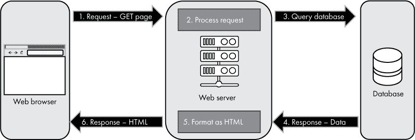

*图 12-9：典型的动态网站处理请求*

最近，出现了一种趋势，即尽可能回归静态网站。静态网站中页面请求的流动如图 12-10 所示。

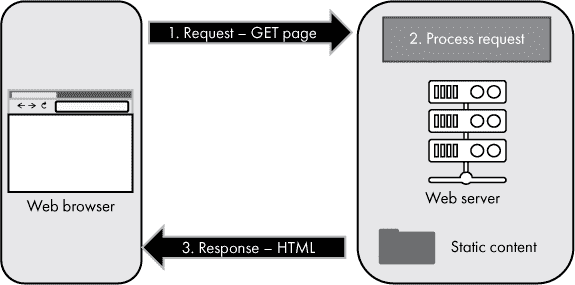

*图 12-10：静态网站处理请求*

如图 12-10 所示，静态网站的服务器端处理相比于动态网站更为简化。静态网站的服务器端处理仅仅是返回与请求的 URL 匹配的静态文件。内容已经构建好，服务器无需再获取原始数据并格式化。减少服务器端的复杂性通常意味着网站更简单、更快速，并且更加安全。

需要理解的是，在这种语境下，*静态*和*动态*是从服务器的角度来看，而非用户的角度。静态网站的内容来自服务器上未更改的文件，而动态网站的内容则是由服务器生成的。这些术语并不描述用户体验网站的方式，例如网站是否具有交互性，或者内容是否会自动更新。这些体验可以通过浏览器中的 JavaScript 来实现，有时还会与独立的 Web 服务结合使用，无论网站本身是静态的还是动态的。

如果你托管的是静态网站，你只需要一个能够响应静态文件请求并提供这些文件内容的网页服务器软件。无需编写自定义代码。许多软件包和在线服务都可以用于托管静态网站。通常，用于服务静态网站的软件会配置为指向服务器上的一个文件目录，当请求某个文件时，服务器只需返回该文件的内容。例如，如果位于*example.com*的网页文件存放在服务器上的目录*/websites/example*中，那么对* [`example.com/images/cat.jpg`](http://example.com/images/cat.jpg)*的请求将映射到*/websites/example/images/cat.jpg*。网页服务器只需从本地目录读取匹配的文件，并将该文件中包含的字节返回给客户端。在项目#37 到#40 中开发的网站就是一个静态网站的例子。

如果你正在构建一个动态网站或网络服务，你可以选择使用现有的软件来管理你的内容并提供动态页面，或者你可以编写自定义代码来生成网页内容。假设你在编写自定义代码，你会发现与客户端开发相比，服务器端的情况截然不同。任何编程语言、任何操作系统、任何平台都可以用作网页服务器。只要网页服务器通过 HTTP 响应并返回客户端可以理解的格式的数据，几乎什么技术都可以！客户端并不关心生成 HTML 或 JavaScript 时使用了什么技术，它只需要一个它能够处理的格式的响应。

由于客户端并不关心网页服务器端使用了什么技术，因此希望编写在服务器上运行代码的开发者有很多选择。客户端网页开发仅限于 HTML、CSS 和 JavaScript 三者，而服务器端网页开发可以使用 Python、C#、JavaScript、Java、Ruby、PHP 等多种语言。服务器端网页开发通常包括与某种数据库的交互。就像任何编程语言都可以用于服务器一样，任何类型的数据库也可以用于服务器端网页开发。

### 总结

本章我们讨论了网页——一个分布式的、可寻址的、相互链接的资源集合，通过 HTTP 在互联网中传输。你学习了网页如何使用 HTML 进行结构化，使用 CSS 进行样式化，使用 JavaScript 进行脚本化。我们还探讨了网页浏览器，它们用于访问网页上的内容，并且我们检查了网页服务器——托管网页资源的软件。在下一章中，我们将探讨一些现代计算的趋势，并且你将有机会完成一个最终项目，将本书中各个概念结合起来。

**项目 #36：检查 HTTP 流量**

在这个项目中，你将使用 Google Chrome 或 Chromium 来检查 web 浏览器与 web 服务器之间的 HTTP 流量。你可以在 Windows PC 或 Mac 上使用 Chrome，或者在 Raspberry Pi 上使用 Chromium 浏览器。以下步骤假设你在使用 Raspberry Pi，但在 Windows PC 或 Mac 上的过程类似，只需使用 Chrome 代替 Chromium。

1.  如果你没有使用 Raspberry Pi 的图形桌面界面，赶紧切换过去。与之前的项目不同，这个项目不能仅通过终端窗口完成。

1.  点击**Raspberry**（左上角的图标）▶ **Internet**▶ **Chromium Web Browser**。

1.  访问一个网站，如*[`www.example.com`](http://www.example.com)*。

1.  按下 F12 键（或 CTRL-SHIFT-I）打开开发者工具（DevTools），如图 12-11 所示。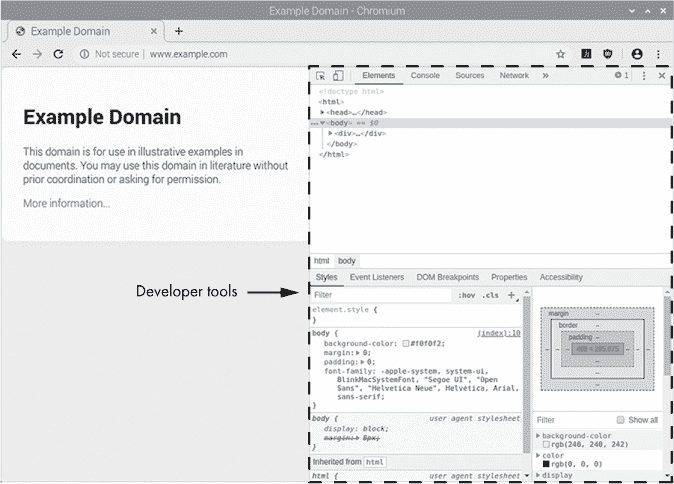

    *图 12-11：Chromium 中的开发者工具*

1.  在 DevTools 菜单中，选择**Network**菜单项。

1.  按下 F5 键（或点击重载图标）重新加载页面。你将看到加载当前页面时发出的 HTTP 请求。

1.  如果你实际使用*www.example.com*，你可能会看到一个相当简单的请求。如果你想看到更有趣的内容，可以访问一个更复杂的网站，并观察网络请求，如图 12-12 所示。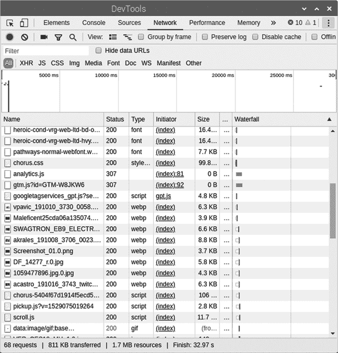

    *图 12-12：Chromium 开发者工具中显示的一个网站的 HTTP 流量示例*

1.  每一行代表对 web 服务器的一个请求。你可以看到请求的资源名称、请求的状态（`200`表示成功）等信息。

1.  你可以点击每一行，查看请求的具体内容，例如请求头和返回的内容。

我建议你在多个网站上尝试一下，了解网站请求的数量。你可能会对传输的内容量感到惊讶！ **项目#37：运行你自己的 Web 服务器**

在这个项目中，你将设置一个 Raspberry Pi 作为 web 服务器。你将使用 Python 3 来完成这一过程，因此你实际上可以在任何安装了 Python 3 的设备上跟随这些步骤，尽管这些步骤是针对 Raspberry Pi 编写的。我们简单的网站将在收到请求时返回一个文件的内容。

打开一个终端窗口，创建一个目录来存放你的网站文件，然后将该新目录设置为当前工作目录。

```
$ mkdir web

$ cd web
```

当向你网站的根目录发起请求时，web 服务器软件会查找名为*index.html*的文件，并将该文件的内容返回给客户端。让我们创建一个非常简单的*index.html*文件：

```
$ echo "Hello, Web!" > index.html
```

该命令创建了一个名为*index.html*的文本文件，文件中包含`Hello, Web!`的文本。你可以通过文本编辑器打开文件来查看文件内容，或者像这样在终端中显示文件内容：

```
$ cat index.html
```

一旦文件就绪，让我们使用 Python 内建的 web 服务器将 `Hello, Web!` 信息提供给任何连接的用户。

```
$ python3 -m http.server 8888
```

此命令告诉 Python 在端口`8888`上运行一个 HTTP 服务器。让我们测试一下，看看它是否按预期工作。打开树莓派上的另一个终端窗口。从这个第二个终端窗口，输入以下命令向你新网站的根目录发起一个 `GET` 请求：

```
$ curl http://localhost:8888
```

`curl` 工具可以用来发起 HTTP `GET` 请求，而 `localhost` 是指当前正在使用的计算机的主机名。此命令告诉 `curl` 工具向本地计算机的端口 `8888` 发起一个 HTTP `GET` 请求。你应该会看到返回的文本是 `Hello, Web!`。同时，在原始终端中，你应该看到一个 `GET` 请求已经到达。

现在，让我们尝试通过网页浏览器连接到你的网站。在树莓派桌面上，打开 Chromium 浏览器。在地址栏中输入 http://localhost:8888。你应该会看到网站中的文本出现在浏览器中，如图 12-13 所示。

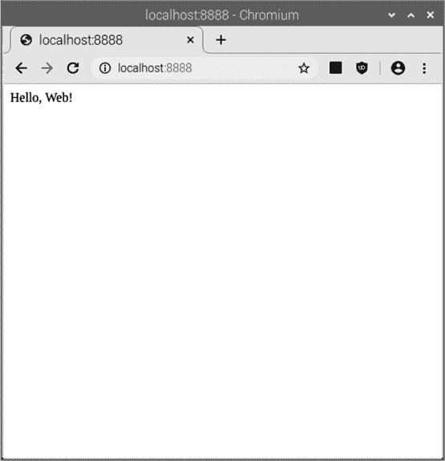

*图 12-13：使用 Chromium 浏览器连接到本地 web 服务器*

现在尝试从另一台设备连接到你的网站。为了使这项工作正常进行，第二台设备必须与树莓派在同一网络上。例如，它们应该都连接到同一个 Wi-Fi 网络。或者，如果你的树莓派有公共 IP 地址（参见项目 #34 在第 259 页），那么你的网站可以供互联网上的任何设备访问！首先，通过在第二个终端窗口中运行以下命令获取树莓派的 IP 地址：

```
$ ifconfig | grep inet
```

这通常会返回几个 IP 地址。从远程设备连接时，你不能使用 `127.0.0.1`，因此选择分配给你树莓派的另一个 IP 地址。拿到 IP 地址后，打开另一台设备上的浏览器。可以是智能手机、笔记本电脑，或者任何在你网络上的设备，只要它有网页浏览器。在浏览器窗口的地址栏中输入以下内容：*`http://w.x.y.z:8888`*（将 *`w.x.y.z`* 替换为你设备的 IP 地址）。按下回车键或浏览器中的相应按钮以导航到该地址。你应该会在浏览器中看到 `Hello, Web!` 的字样。

如果这对你不起作用，且你的树莓派没有公共 IP 地址，请确保两台设备在同一物理局域网中。此外，有时 Python web 服务器会对新请求无响应。如果 web 服务器停止响应，你可以重启它。要停止 web 服务器，请转到执行服务器命令的终端，按下 CTRL-C 键。然后通过再次运行 `python3 -m http.server 8888` 命令重新启动服务器（按键盘上的上箭头键可以获取上一个命令）。

一旦你的网站运行正常，尝试编辑*index.html*文件，并将信息更改为你想要的任何内容。你可以使用任何你喜欢的文本编辑器来完成此操作。更新完*index.html*文件后，重新加载网页以查看你的更改！

如果你不希望其他设备能够访问你的网站，你可以限制只允许来自树莓派本身的请求获得响应。通过使用`--bind`选项运行 Python 网页服务器可以实现这一点，方法如下：

```
$ python3 -m http.server 8888 --bind 127.0.0.1
```

要使用`--bind`选项运行网页服务器，首先需要停止任何正在运行的网页服务器实例（按键盘上的 CTRL-C）。

**项目 #38：从网页服务器返回 HTML**

前提条件：项目 #37。

在本项目中，你将更新本地网页服务器，使其返回 HTML 而不是简单的文本。使用你喜欢的文本编辑器打开*index.html*（在项目 #37 中创建的文件），并用以下 HTML 代码替换文件中的所有文本。这是本章中讨论的相同 HTML 代码。你无需担心每行的缩进，因为 HTML 中多余的空白字符是无关紧要的。

```
<!DOCTYPE html>

<html lang="en">

  <head>

    <meta charset="utf-8">

    <title>A Cat</title>

  </head>

  <body>

    <h1>Thoughts on a Cat</h1>

    <p>This is a cat.</p>

    

  </body>

</html>
```

一旦文件更新完成，你将再次使用 Python 的内置网页服务器。如果它还未运行，使用此命令启动它。在运行命令之前，请确保你的终端窗口当前位于*web*目录中。

```
$ python3 -m http.server 8888
```

现在，使用网页浏览器像在项目 #37 中那样连接到你的网页服务器。你应该看到页面被渲染，但没有猫咪照片。如果你查看运行 Python 网页服务器命令的终端窗口，你应该看到一个尝试获取猫咪照片但失败的请求，如下所示：

```
192.168.1.123 - - [31/Jan/2020 17:38:56] "GET /cat.jpg HTTP/1.1" 404 -
```

`404`错误代码表示无法找到资源，这很合理，因为你在这个目录中没有名为*cat.jpg*的文件！为什么网页浏览器会请求一张猫咪照片呢？如果你回顾页面的 HTML，会看到一个 HTML ``标签，它指示浏览器渲染`cat.jpg`图片。浏览器请求该图片，但由于文件缺失，无法成功获取。

让我们解决丢失的猫咪图片问题。你需要下载一张猫的图片（或者任何东西的图片都可以），格式为 JPEG，并将其保存为*~/web/cat.jpg*。为了简化，你可以使用以下命令下载本章中使用的图片。在运行命令之前，请确保你的终端窗口当前位于*web*目录中。

```
$ wget https://www.howcomputersreallywork.com/images/cat.jpg
```

现在，你应该在*web*目录中存有*cat.jpg*文件。重新加载网页，查看页面中的猫咪图片。提醒：如果网页服务器似乎卡住了，按照项目 #37 中的描述重新启动它。

值得注意的是，你不仅可以在页面中查看猫的图片，还可以直接从服务器请求该图片，因为它有自己的 URL。试着将浏览器指向以下 URL（将*`SERVER`*替换为你为网站使用的主机名或 IP 地址）：`http://*SERVER*:8888/cat.jpg`。你应该能看到猫的图片在浏览器中显示出来，且不依赖于网页的内容。网页上引用的每个资源都有自己的 URL，可以直接访问！

**项目 #39：为你的网页添加 CSS**

前提条件：项目 #38。

在这个项目中，你将使用 CSS 来设计你的网页。首先，使用你选择的文本编辑器，在*web*目录下创建一个名为*style.css*的文件。这个文件将包含你的 CSS 规则。确保文件名为*style.css*，并将其保存到*web*目录，与*index.html*和*cat.jpg*文件一起。*style.css*的内容应如下所示：

```
p {

   font-family: Arial, Helvetica, sans-serif;

   font-size: 11pt;

   margin-left: 10px;

   color: DimGray;

}

 h1 {

   font-family: 'Courier New', Courier, monospace;

   font-size: 18pt;

   font-weight: bold;

}
```

一旦*style.css*创建完成，就像在上一个项目中那样，打开*index.html*进行编辑。保留现有的 HTML 内容。我们只需要在头部区域添加一行，如下所示：

```
  <head>

    <meta charset="utf-8">

    <title>A Cat</title>

    <link rel="stylesheet" type="text/css" href="style.css">❶

  </head>
```

一旦你完成了对*index.html*的更新❶，启动你的 web 服务器（如果它还没有运行的话），并在浏览器中重新加载页面。你应该能看到页面样式的更新。提醒：如果 web 服务器似乎卡住了，按照项目 #37 中描述的步骤重新启动它。

随意编辑*style.css*以尝试不同的样式。也许你想把段落字体设得非常大，或者换个颜色！根据自己的喜好编辑样式，保存*style.css*并在浏览器中重新加载页面。

如果你在浏览器中没有看到更新，可能是因为浏览器加载了你网站的缓存版本，而不是下载最新的版本。试着在新标签页中打开页面，或者完全重新启动浏览器。你还可以告诉浏览器在重新加载时跳过本地缓存。为此，请导航到页面，然后按 CTRL-F5 强制页面重新加载。大多数 Windows 和 Linux 浏览器都支持此操作。在 Mac 上，Chrome 和 Firefox 可以通过 CMD-SHIFT-R 强制刷新。有时需要多次刷新才能让浏览器渲染最新的内容。

**项目 #40：为你的网页添加 JavaScript**

前提条件：项目 #39。

在这个项目中，你将使用 JavaScript 让你的网页具备交互性。首先，使用你选择的文本编辑器，在*web*目录下创建一个名为*cat.js*的文件。这个文件将包含 JavaScript 代码。确保文件名为*cat.js*，并将其保存到*web*目录，与*index.html*和*cat.jpg*文件一起。*cat.js*的内容应如下所示：

```
document.addEventListener('DOMContentLoaded', function() {

    document.getElementById('cat-photo').onclick = function() {

        document.getElementById('cat-para').innerHTML += ' Meow!';

    };

});
```

一旦*cat.js*被保存，像在上一个项目中那样，打开*index.html*进行编辑。保留现有的 HTML 内容，并按照下面所示进行更改：

```
<!DOCTYPE html>

<html lang="en">

  <head>

    <meta charset="utf-8">

    <title>A Cat</title>

    <link rel="stylesheet" type="text/css" href="style.css">

    <script src="cat.js"></script>❶

  </head>

  <body>

    <h1>Thoughts on a Cat</h1>

    <p id="cat-para"❷>This is a cat.</p>

    

  </body>

</html>
```

这些更改引用了脚本 ❶，并给段落 ❷ 和图片 ❸ 添加了 ID。

一旦你更新了*index.html*，启动你的 web 服务器（如果它尚未运行），并在浏览器中重新加载页面。现在你应该能够点击（或触摸）猫的照片，并看到单词`Meow!`被附加到段落中。提醒：如果 web 服务器似乎卡住，按项目 #37 中的描述重启它。
