## 第十三章：现代计算**


本章概述了现代计算中的几个选定领域。考虑到计算的多样性和广度，我有许多主题可以选择。我选择的这些领域绝不是当前计算中所有有趣事物的详尽列表。相反，它们代表了我认为值得你关注的一些话题。在本章中，我们将讨论应用程序、虚拟化、云计算、比特币等内容。最后，我们通过一个最终项目，将本书中涉及的多个主题汇集在一起。

### 应用程序

自计算机早期以来，人们一直将直接供用户使用的软件程序称为*应用程序*。这个术语被缩写为*app*，以前这两个术语可以互换使用。然而，自从 Apple 在 2008 年推出 iPhone *App Store* 以来，*app* 一词便赋予了新的含义。尽管没有标准的技术定义来区分什么软件程序算作一个 app，但应用程序通常具有一些共同特征。

应用程序是为最终用户设计的。应用程序通常面向移动设备，如智能手机或平板电脑。应用程序通常通过基于互联网的数字商店（即*应用商店*）分发，如 Apple 的 App Store、Google Play Store 或 Microsoft Store。应用程序对其运行的系统的访问权限有限，通常必须声明它们运行所需的具体功能。应用程序通常使用触摸屏作为主要的用户输入方式。单独使用时，*app* 一词通常指安装在设备上的软件，并直接利用操作系统的 API。换句话说，*app* 一词通常指的是*原生应用程序*，即为特定操作系统构建的应用程序。相对而言，*Web 应用程序*是使用 Web 技术（HTML、CSS 和 JavaScript）设计的应用程序，并且不依赖于特定的操作系统。图 13-1 提供了原生应用程序和 Web 应用程序的概述。

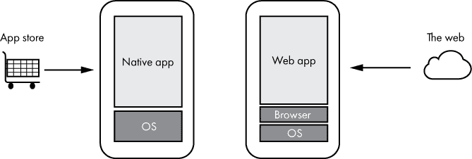

*图 13-1：原生应用程序是为特定操作系统构建的。Web 应用程序则是使用 Web 技术构建的。*

如图 13-1 所示，原生应用程序通常是通过应用商店安装的，旨在利用特定操作系统的功能。Web 应用程序通常通过网站运行，旨在使用 Web 技术。Web 应用程序在浏览器或其他呈现 Web 内容的进程中运行。接下来，我们将更详细地了解原生应用程序和 Web 应用程序。

#### *原生应用程序*

如前所述，原生应用是为特定操作系统构建的。苹果的 App Store 和随之而来的类似应用商店开启了原生软件开发的新纪元，为开发者提供了新的平台、新的软件分发方式，以及通过软件赚钱的新方式。目前，原生应用开发的现状主要集中在两个平台：iOS 和 Android。虽然软件仍然会为其他操作系统开发，但这些软件通常没有应用程序的典型特征（如移动友好、触摸输入、通过应用商店分发等）。

Android 和 iOS 在编程语言、API 等方面有所不同。因此，要编写一个同时适用于 iOS 和 Android 的应用程序，需要么维护独立的代码库，要么使用像 Xamarin、React Native、Flutter 或 Unity 这样的*跨平台框架*。这些跨平台解决方案抽象了每个操作系统 API 的底层细节，使开发者能够编写能够在多个平台上运行的代码。许多原生应用也依赖于网络服务，这意味着应用开发者不仅需要为 iOS 和 Android 编写和维护代码，还必须构建或与网络服务集成。

开发一个跨平台的、与网络连接的应用程序需要大量的工作和专业知识！过去，开发者通常只专注于一个平台，例如 Windows PC 或 Mac。今天，对于目标多个平台和网络的开发者来说，事情肯定更复杂了。平台竞争通常对用户是好事，但这也意味着开发者需要付出更多的工作。

有趣的是，当前的应用开发状态本可以完全不同。当 iPhone 在 2007 年 1 月发布时，时任 Apple CEO 的 Steve Jobs 曾就 iPhone 上的第三方应用开发发表过以下言论：

整个 Safari 引擎都在 iPhone 内。因此，你可以编写令人惊叹的 Web 2.0 和 Ajax 应用，这些应用看起来和行为完全像 iPhone 上的应用。这些应用可以与 iPhone 服务完美集成。它们可以打电话，发送电子邮件，查找 Google 地图上的位置。猜猜看？你不需要任何 SDK！

**注意**

*一个*SDK（软件开发工具包）*是开发者用于为特定平台构建应用程序的软件集合*。

根据这段话，苹果最初的第三方应用开发计划是让开发者只需构建类似应用的网站，这些网站可以利用 iPhone 的功能。原生应用开发将仅限于苹果开发并随 iPhone 一起提供的应用程序，如相机、邮件和日历应用。

当时，使用网络作为应用开发平台并不常见。苹果的立场具有前瞻性。不幸的是，2007 年时，网络的基础技术可以说还不够成熟，无法将网络定位为真正的应用平台。到 2007 年 10 月，苹果改变了其立场，宣布允许开发者为 iPhone 开发本地应用。苹果在 2008 年推出了 App Store，这是唯一支持将本地 iPhone 应用分发给用户的机制。

苹果的政策逆转使公司受益，因为 App Store 成为苹果的一项收入来源。注册成为 App Store 开发者需要支付费用，而且苹果会从每笔销售中抽取一定比例。App Store 和本地 iPhone 开发还为独占内容打开了大门，推出了仅能在苹果设备上运行的应用。

App Store 也为最终用户带来了好处。带有评分的精选应用列表很有帮助，且商店提供了一定程度的消费者信任。进入 App Store 的应用必须符合某些质量标准。集中化的支付服务意味着用户无需将支付信息提供给多个公司。应用会自动更新，这相较于传统的 PC 软件是一大优势，尽管相较于网络应用，这并不算优势，因为网络应用也会在没有用户干预的情况下进行更新。

随着苹果 App Store 的成功，其他公司也创建了类似的数字商店来分发软件。Google Play 商店、Microsoft Store 和 Amazon Appstore 都采用了与苹果商店相似的模式，并提供类似的好处。尽管这一系统通常对这些公司和最终用户来说运作良好，但它也为开发者创造了一个复杂的环境：多个商店、多个平台和不同的技术。每个数字市场都有自己的要求，应用开发者必须满足这些要求，而且每个商店都会从销售收入中抽取一定的比例。

#### *网页应用*

随着本地应用的兴起，网络逐渐发展成为一个非常适合运行应用的平台。HTML5 作为 HTML 的成熟版本被引入，网页浏览器在处理内容方面变得更加高效和一致。浏览器开发者使得他们的 JavaScript 实现符合 ECMAScript 5 标准，为 JavaScript 代码提供了更好的基础。除了浏览器更新外，网页开发者社区接受并继续采用一种叫做*响应式网页设计*的概念，这种方法确保无论显示内容的屏幕大小如何，网页内容都能良好呈现。通过使用响应式设计技术，网页开发者可以维护一个适用于各种设备的单一网站，而不是为不同设备创建多个网站。此外，近年来发布了多个*网页开发框架*，如 Angular 和 React。这些框架使得开发者更容易编写和维护*网页应用*——表现得像应用程序的网页。

开发者已经意识到，现代网页技术可以用来构建与本地应用程序非常相似的体验，许多开发者构建了像应用程序一样运行的网站。有些开发者选择完全放弃本地应用程序，只构建网页应用程序。这个方法的优点是，网页应用程序可以在任何具有现代网页浏览器的设备上运行，且代码只需要编写一次。然而，网页应用程序也有一些缺点。网页应用程序无法访问设备的全部功能，通常比本地应用程序慢，要求用户保持在线，并且通常不会列在应用商店中。

为了弥补网页应用程序的一些缺点，*渐进式网页应用程序（PWAs）* 提供了一套技术和指南，帮助缩小本地应用程序和网页应用程序之间的差距。PWA 仅仅是一个具有一些额外功能的网站，这些功能使其更像一个应用程序。一个渐进式网页应用程序必须通过 HTTPS 提供服务，能够在移动设备上适当地渲染，下载后能够离线加载，提供一个描述该应用程序的清单文件给浏览器，并且在页面之间快速过渡。对最终用户来说，运行一个 PWA 应该和运行一个本地应用程序一样响应迅速且自然。如果一个网站符合 PWA 的标准，现代的网页浏览器会给用户提供将 PWA 图标添加到主屏幕或桌面的选项。这样做意味着用户可以像启动本地应用程序一样启动网页应用程序。该应用程序将在自己的窗口中打开，而不是浏览器窗口中，并且通常表现得像一个本地应用程序。

渐进式网页应用程序可能为那些希望使用网页技术构建应用程序但又不想为不同平台构建多个应用程序的开发者提供巨大好处。然而，PWA 仍然存在一些缺点。一个显著的缺点是，PWA 不会出现在应用商店中。移动操作系统多年来一直在训练用户，应用程序应该通过应用商店获取。用户不习惯通过浏览网页来获得应用程序。在撰写本文时，只有 Microsoft Store 允许将 PWA 直接发布到商店。其他平台则要求 PWA 从浏览器安装或重新打包为本地应用程序来渲染网页内容。这个重新打包的应用程序可以提交到商店。另一个潜在的缺点是，PWA 可能看起来不像本地应用程序；它们通常在所有平台上看起来基本相同，尽管有些人可能认为这是好事。PWA 仍然无法达到本地应用程序的性能，也无法访问底层平台的所有功能，但根据应用程序的需求，这不一定是一个问题。

### 虚拟化与仿真

计算机何时不是一个物理设备？当然是当它是一个虚拟计算机时！*虚拟化*是利用软件创建计算机虚拟表示的过程。另一种相关技术，*仿真*，允许为某种类型的设备设计的应用程序在完全不同类型的设备上运行。本节我们将探讨虚拟化和仿真两者。

#### *虚拟化*

虚拟计算机，称为*虚拟机（VM）*，运行操作系统，就像物理计算机一样。接着，应用程序在该操作系统上运行。从应用程序的角度来看，虚拟化的硬件就像物理计算机一样。虚拟化使得几种有用的场景成为可能。运行一个操作系统的计算机可以在虚拟机中运行另一个操作系统。例如，运行 Windows 的计算机可以在虚拟机中运行 Linux 的实例。虚拟机还允许数据中心在单一物理服务器上托管多个虚拟服务器。这为互联网托管公司提供了一种简单快捷的方式来为客户提供专用服务器，只要客户可以接受虚拟服务器。虚拟机可以轻松备份、恢复和部署。

*虚拟机监控器（Hypervisor）*是运行虚拟机的软件平台。如图 13-2 所示，虚拟机监控器有两种类型。

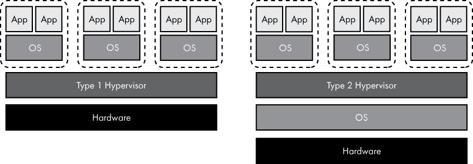

*图 13-2：类型 1 和类型 2 虚拟机监控器*

如图 13-2 左侧所示，虚拟机监控器可以直接与底层硬件交互，实际上将虚拟机监控器放置在技术栈中的内核下方。虚拟机监控器与物理硬件通信，并将虚拟化硬件呈现给操作系统内核。这被称为*类型 1 虚拟机监控器*。相比之下，*类型 2 虚拟机监控器*，如图 13-2 右侧所示，作为操作系统上的应用程序运行。微软的 Hyper-V 和 VMware ESX 是类型 1 虚拟机监控器，而 VMware Player 和 VirtualBox 是类型 2 虚拟机监控器的例子。

另一种流行的虚拟化方法是使用容器。*容器*提供了一个隔离的用户模式环境，在其中运行应用程序。与虚拟机不同，容器与主机操作系统共享内核，并与同一计算机上运行的其他容器共享内核。运行在容器中的进程只能看到物理机上可用资源的一个子集。例如，每个容器可以被授予自己的隔离文件系统。容器提供了虚拟机的隔离功能，但没有为每个虚拟机运行独立内核的开销。一般来说，容器限于运行与主机相同的操作系统，因为内核是共享的。一些容器技术，如 OpenVZ，用于虚拟化操作系统的整个用户模式部分，而其他容器技术，如 Docker，用于在隔离容器中运行单独的应用程序。

**注意**

*你可能还记得，在第十章中，操作系统进程被描述为一个“容器”——这与虚拟化容器是不同的*。

#### *仿真*

仿真是使用软件使一种设备表现得像另一种设备。仿真和虚拟化的相似之处在于，它们都提供一个虚拟环境来运行软件，但虚拟化提供的是底层硬件的一部分，而仿真则呈现出与正在使用的物理硬件*不同*的虚拟硬件。例如，运行在 x86 处理器上的虚拟机或容器运行为 x86 编译的软件，直接利用物理 CPU。相比之下，运行在 x86 硬件上的*仿真器*（执行仿真的程序）可以运行为完全不同处理器编译的软件。仿真器通常还会提供除处理器之外的其他虚拟硬件。

例如，完整的 Sega Genesis（1990 年代的视频游戏系统）仿真器将模拟摩托罗拉 68000 处理器、雅马哈 YM2612 音频芯片、输入控制器和 Sega Genesis 中所有其他硬件。在运行时，这样的仿真器将原本设计用于 Sega Genesis 的 CPU 指令转换为在 x86 代码中实现的功能。这引入了显著的开销，因为每条 CPU 指令都必须进行转换，但足够快速的现代计算机仍然可以以全速仿真远比 Sega Genesis 慢得多的硬件。结果是可以在完全不同的平台上运行为某个平台设计的软件，如图 13-3 所示。

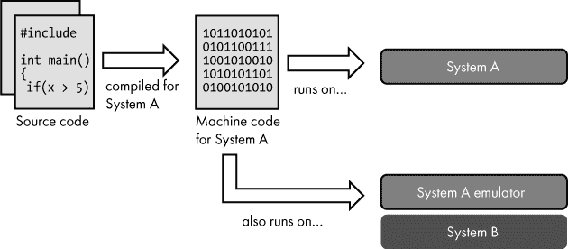

*图 13-3：为系统 A 编译的代码可以在系统 A 的仿真器上运行*

仿真在保护为过时平台设计的软件方面起着重要作用。随着计算平台的老化，找到可以正常工作的硬件变得越来越困难。软件开发人员常常使用仿真技术来将旧软件移植到现代平台上。原始的源代码可能已经丢失，或者更新它的任务可能会非常繁重。在这种情况下，投资仿真器可以让原始的已编译代码在不修改的情况下在新平台上运行。

**进程虚拟机**

还有一种与仿真器有些相似的虚拟机类型。*进程虚拟机*在一个执行环境中运行应用程序，该环境抽象了底层操作系统的细节。它类似于仿真器，因为它提供了一个与运行它的硬件和操作系统解耦的平台执行环境。然而，不同于仿真器，进程虚拟机并不试图模拟真实的硬件。相反，它提供了一个为运行平台无关的软件而设计的环境。正如我们在第九章中讨论的，Java 和.NET 利用了运行字节码的进程虚拟机。

### 云计算

*云计算*是通过互联网提供计算服务。在本节中，我们将探讨各种类型的云计算，但首先让我们快速回顾一下远程计算的历史。

#### *远程计算的历史*

自计算机诞生以来，我们可以观察到从远程集中式计算（通过终端访问服务器）到本地计算（桌面计算机），再到现在的远程计算（通过智能本地设备如智能手机访问网络）的摆动。今天，许多应用程序依赖于远程计算和本地计算的结合。在网络的情况下，部分代码运行在浏览器中，部分代码运行在网络服务器上。我们今天口袋里携带的设备，比起计算机诞生初期的占地一间房大小的机器，要强大得多，但我们希望在这些设备上做的许多事情，仍然涉及与其他计算机的通信，因此将处理任务分担给本地设备和远程服务器是合情合理的。

随着远程计算的重新兴起，组织开始需要维护服务器。过去，这意味着购买一台物理服务器，根据需要进行配置，将其连接到网络，并让它在某个储物间中运行。组织可以直接访问机器，并完全控制其配置。然而，维护服务器（或一组服务器）可能是一项复杂且昂贵的工作。这包括购买和维护硬件、跟进软件更新、处理安全问题和容量规划问题、管理网络配置等等。通常，这项工作所需的技能和专业知识与组织的主要业务并不匹配。即使是一个技术驱动的公司，也不一定希望从事维护服务器的工作。这就是云计算的出现背景。

*云计算*通过互联网（即*云*）提供远程计算能力。底层硬件由云服务公司（即*云提供商*）维护，解放了需要这些计算能力的组织或用户（即*云消费者*）免于维护服务器。云计算允许按需购买计算服务，随需随取。对于云消费者来说，这意味着放弃对某些事务的控制，信任第三方提供可靠的服务。云计算有多种形式；我们将在这里了解其中的一些形式。

#### *云计算的类别*

云计算的不同类别通常由划分云提供商和云消费者责任的界限定义。图 13-4 提供了四种云计算类别（IaaS、PaaS、FaaS 和 SaaS）及其各自责任划分的概述。我们接下来将逐一介绍这些类别。

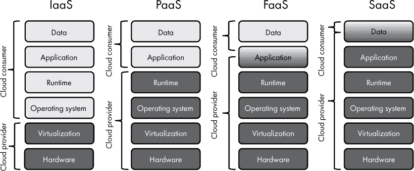

*图 13-4：不同类型云服务中的责任分配*

图 13-4 中的垂直堆栈表示运行应用程序所需的组件。无论使用哪种类型的云计算，所有组件都必须存在——各类别之间的区别在于云服务提供商或云消费者是否负责管理每个组件。每个堆栈中的不同组件应该是熟悉的，因为我们已经覆盖了这些主题。然而，*运行时* 需要解释。*运行时环境* 是应用程序执行的环境，包括所需的库、解释器、进程虚拟机等。接下来，让我们从左到右依次介绍图 13-4 中展示的四种云计算类别。

*基础设施即服务（IaaS）* 是一种云计算场景，其中云服务提供商仅管理硬件和虚拟化，允许消费者管理操作系统、运行时环境、应用代码和数据。IaaS 的消费者通常会获得一台连接互联网的虚拟计算机，按照自己的需求使用，通常作为某种类型的服务器。这台虚拟计算机通常实现为基于虚拟机监控程序的虚拟机或用户模式部分的 Linux 发行版容器。IaaS 虚拟服务器的消费者可以访问虚拟计算机的操作系统，并可以根据需要配置它。这为消费者提供了最大灵活性，但也意味着维护系统软件（包括操作系统、第三方软件等）的责任完全落在消费者肩上。IaaS 提供了一台虚拟计算机，消费者负责运行在该计算机上的所有内容。以下是一些 IaaS 的例子：亚马逊弹性计算云（EC2）、微软 Azure 虚拟机和谷歌计算引擎。

*平台即服务（PaaS）*赋予云服务提供商更多的责任。在 PaaS 场景中，云服务提供商不仅管理硬件和虚拟化，还管理消费者希望使用的操作系统和运行时环境。PaaS 消费者开发的应用程序是为了在他们选择的云平台上运行，并利用该平台独特的各种功能。PaaS 产品的云消费者无需担心维护底层操作系统或运行时环境。云消费者可以只专注于他们的应用程序代码。尽管提供商抽象化了底层系统的细节，消费者仍然需要管理由提供商配置的用于处理其应用程序的资源。这包括所需的存储量和分配的虚拟机类型。PaaS 提供了一个托管平台来运行代码，消费者负责运行在该平台上的应用程序。以下是一些 PaaS 的例子：Amazon Web Services Elastic Beanstalk、Microsoft Azure App Service 和 Google App Engine。

*函数即服务（FaaS）*将 PaaS 模型进一步发展。它不要求消费者部署完整的应用程序或提前配置平台实例。相反，消费者只需要部署他们的代码（一个函数），该函数在响应特定事件时运行。例如，开发者可以编写一个函数，返回距离最近超市的距离。该函数可以在浏览器向 URL 发送当前 GPS 坐标时运行。这个事件驱动的模型意味着云服务提供商负责按需调用消费者的代码。消费者不再需要让应用程序代码始终运行，等待请求的到来。这可以简化消费者的操作并降低成本，尽管如果函数代码尚未运行，处理请求时可能会有较慢的响应时间。

FaaS 是一种*无服务器计算*，一种云计算模型，在这种模型中，消费者不需要处理服务器或虚拟机的管理。当然，这个术语并不完全准确；实际上运行代码是需要服务器的，只不过消费者不需要考虑它们！FaaS 提供了一个事件驱动的平台来运行代码，消费者负责响应事件时运行的代码。一些 FaaS 的例子包括 Amazon Web Services Lambda、Microsoft Azure Functions 和 Google Cloud Functions。

*软件即服务 (SaaS)* 是一种本质上与其他云服务不同的服务类型。SaaS 为消费者提供的应用程序完全托管在云端。而 IaaS、PaaS 和 FaaS 是面向希望在云中运行自己代码的软件工程团队，SaaS 则向最终用户或组织提供一个已经编写好的完整云应用程序。如今，许多软件都在云端运行，因此这看起来似乎没有什么特别的，但它与用户或组织在本地设备和网络上安装和维护软件形成鲜明对比。SaaS 提供一个完全在云中管理的应用程序，消费者只需负责存储在该应用程序中的数据。甚至数据的管理也部分由提供商负责，包括数据存储、备份等细节。SaaS 的一些例子包括 Microsoft 365、Google G Suite 和 Dropbox。

云服务提供商领域的一些主要参与者包括亚马逊 Web 服务、微软 Azure、谷歌云平台、IBM 云、甲骨文云和阿里巴巴云。

### 深网与暗网

你可能已经读过有关暗网或深网的恶性事件的新闻。不幸的是，这两个术语经常被混淆，但它们有着不同的含义。网络可以分为三个大致的部分：表层网络、深网和暗网，如图 13-5 所示。

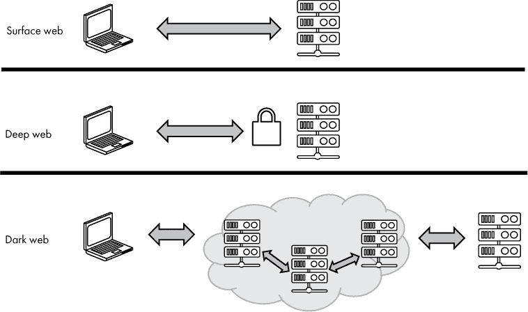

*图 13-5：表层网络、深网和暗网*

任何人都可以自由访问的内容属于*表层网络*。公共博客、新闻网站和公共推特帖子都是表层网络内容的例子。表层网络是被搜索引擎索引的，有时，表层网络被定义为可以通过搜索引擎找到的内容。

*深网* 是指需要登录网站或网络服务才能访问的网络内容。大多数互联网用户都定期访问深网内容。查看银行余额、通过像 Gmail 这样的网页读取电子邮件、登录 Facebook、查看自己在亚马逊上的个人购物历史——这些都是深网活动的例子。深网仅仅是指那些不可公开访问的内容，通常需要某种密码才能访问。大多数用户不希望他们的电子邮件或银行余额公开，因此这些内容不会公开，并且无法被搜索引擎索引。

*暗网*是需要专门软件才能访问的网络内容。你不能仅通过标准网页浏览器访问暗网。最常见的暗网技术是*Tor（洋葱路由器）*。通过加密和中继系统，Tor 使得用户能够匿名访问网络，防止用户的 ISP 监控访问的站点，也防止网站知道访客的 IP 地址。此外，Tor 还允许用户访问一些称为*洋葱服务*的网站，这些网站如果没有 Tor 无法访问——这些网站属于暗网的一部分。Tor 还隐藏洋葱服务的 IP 地址，使其匿名。如你所料，暗网的匿名性有时被犯罪分子利用。然而，暗网所提供的隐私也有合法用途，比如举报和政治讨论。在访问暗网内容时，我建议谨慎。

### 比特币

*加密货币*是一种数字资产，旨在用于金融交易，作为传统货币（如美元）的替代品。加密货币的用户维持该货币的余额，类似于传统银行账户，并可以用其购买商品和服务。有些用户将加密货币主要作为投资，而非交易手段，这使得它对于这些用户来说更像是黄金。与传统货币不同，加密货币通常是去中心化的，没有任何单一组织控制其使用。

#### *比特币基础*

*比特币*于 2009 年推出，是第一种去中心化的加密货币，今天也是最为人知的。自那时以来，大量的替代加密货币（被称为*山寨币*）相继出现，但没有一种能够挑战比特币的主导地位。比特币的主要货币单位也叫做*比特币*，缩写为*BTC*。

比特币和类似的加密货币基于*区块链*技术。在区块链中，信息被分组到叫做*区块*的数据结构中，区块按时间顺序连接在一起。也就是说，当新块创建时，它会被添加到区块链的末端。以比特币为例，区块中保存着交易记录，跟踪比特币的流动。图 13-6 展示了比特币区块链的情况。

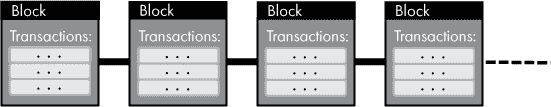

*图 13-6：比特币的区块链将按时间顺序链接交易记录块。*

区块链通过像互联网这样的网络运行，多个计算机共同处理交易并更新区块链。一起处理比特币交易的计算机被称为*比特币网络*。连接到比特币网络的计算机称为*节点*，某些节点保存区块链的副本；没有单一的主副本。加密和解密被用来确保交易的完整性，并防止篡改区块链中的数据。一旦写入，区块链数据是不可更改的——它不能被修改。比特币的区块链是一个公共的、去中心化的、不可变的交易账本。这个账本用来记录所有在比特币网络上发生的事件，比如比特币的转账。

#### *比特币钱包*

最终用户的比特币存储在*比特币钱包*中。然而，更准确地说，比特币钱包持有一组加密密钥对，如图 13-7 所示。

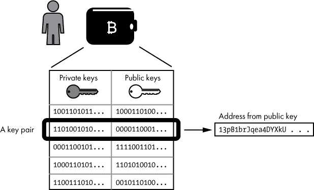

*图 13-7：一个比特币钱包包含密钥对。比特币地址是由公钥派生出来的。*

如图 13-7 所示，钱包中的每个密钥对由两个数字组成——一个私钥和一个公钥。*私钥*是一个随机生成的 256 位数字。这个数字必须保密；任何知道私钥的人都可以花费与该密钥对相关联的比特币。*公钥*用于接收比特币，是从私钥派生出来的。在接收比特币时，公钥以*比特币地址*的形式表示，这是从公钥生成的文本字符串。这里是一个比特币地址的例子：`13pB1brJqea4DYXkUKv5n44HCgBkJHa2v1`。

假设我有一个比特币想要发送给你。这个比特币与我控制的地址相关联。也就是说，我拥有这个地址的私钥。如果你给我你控制的比特币地址的文本字符串表示，我可以将我的比特币发送到你的地址。你不需要（也不应该）将私钥发给我。我之所以能将比特币发送给你，是因为我拥有我地址的私钥，这使我能够花费我的比特币。反之，我无法将任何比特币转出你的地址，因为我没有你的私钥。

#### *比特币交易*

让我们仔细看看它是如何工作的。比特币的转账被称为*交易*。要发送比特币，钱包软件构建一个指定转账细节的交易，用私钥对其进行数字签名，然后将交易广播到比特币网络中。比特币网络中的计算机验证交易，并将其添加到区块链中的新区块。 图 13-8 说明了一个比特币交易。

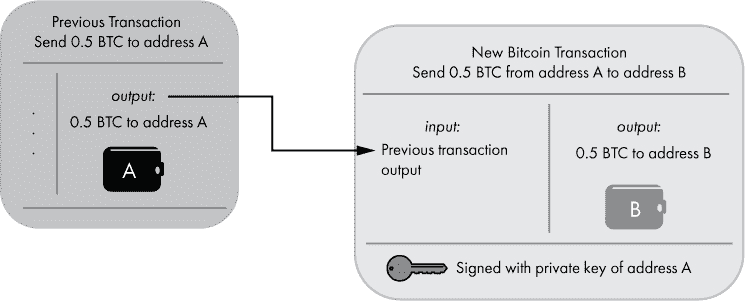

*图 13-8：一个比特币交易将 0.5 比特币转移到地址 B（忽略任何交易费用）。*

如图 13-8 所示，交易包含输入和输出，分别表示比特币的来源和去向。在该图的左侧，我们可以看到一个先前的交易，只有输出被显示；先前交易的输入与我们的讨论无关。在先前的交易中，0.5 BTC 被发送到地址 A。

在图 13-8 的右侧，我们可以看到一个新交易，它将 0.5 BTC 从地址 A 转移到地址 B。为了简便起见，这笔交易只有一个输入和一个输出。输入表示要转移的比特币的来源。你可能会认为这应该是一个比特币地址，但事实并非如此。相反，输入是先前交易的输出。假设地址 A 是我的地址，而我想将 0.5 比特币发送到你的地址 B。那么，我知道之前 0.5 BTC 已被发送到我的地址，因此我可以将先前交易的输出作为新交易的输入，从而将那 0.5 比特币发送给你。交易的输出部分包含比特币被发送到的地址。

尽管你可以认为一个地址有比特币余额，但与地址相关的比特币数量并不是存储在比特币钱包中的，也不是直接存储在区块链中的。相反，关联到该地址的交易历史存储在区块链中，从这些历史记录中可以计算出某个地址的余额。提醒一下，比特币钱包只是包含了用于执行比特币交易的密钥。

#### *比特币挖矿*

维护比特币区块链的过程被称为*比特币挖矿*。全球的计算机将交易区块添加到区块链中——这些计算机被称为*矿工*。图 13-9 展示了比特币挖矿的过程。

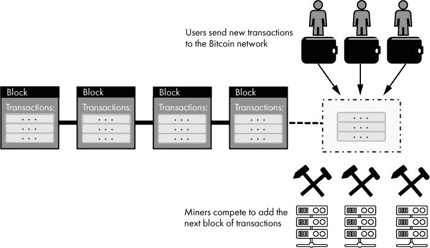

*图 13-9：比特币挖矿*

为了将一个交易区块添加到区块链中，矿工必须验证区块中包含的交易（确保每个交易在语法上正确，输入的比特币尚未被花费等等），并且还必须完成一个计算上困难的问题。要求矿工解决这样的问题可以防止篡改区块链，因为修改一个区块需要重新解决该区块及其后续所有区块的问题。这种通过解决困难问题来防止不当行为的系统被称为*工作量证明*。

到达计算问题的解决方案需要大量的试验和错误计算。解决方案难以产生，但容易验证。第一个完成问题的矿工将获得一笔比特币奖励。这就是新比特币生成并被引入系统的方式。这样，比特币挖矿类似于传统矿业——矿工进行工作，在合适的情况下可能会“淘金”。除了获得新铸造的比特币外，矿工还可以为每个包含在区块中的交易收取*手续费*，该费用从交易中发送的比特币总额中扣除。比特币的设计只允许总共挖掘 2100 万个币。一旦这个数字达到，比特币矿工将不再获得比特币奖励，而是依靠交易费用来资助他们的运营。

**比特币的起源**

比特币区块链的开始可以追溯到 2009 年，当时第一个区块，也就是*创世区块*，被挖掘出来。这个区块是由中本聪挖掘的，中本聪被认为是比特币的发明者。“中本聪”被认为是一个化名；至本文写作时，这个人的身份仍然存在争议。

要使比特币挖矿有利可图，操作挖矿硬件的成本不能超过获得的比特币的价值。比特币挖矿硬件通常非常耗电，因此挖矿者的电费可能很高。比特币最初是在普通计算机上挖掘的，但如今使用专用的、高成本的硬件来尽可能快地挖矿（记住，奖励会给予第一个解决问题的计算机）。这些成本，加上比特币价格的高度波动，意味着比特币挖矿并不是一条保证盈利的路！

比特币区块链是公开的——所有交易都可以被任何人查看。然而，区块链中没有记录转账比特币的人的个人身份。因此，尽管一个地址的余额和交易历史是公开的，但没有简单的方法将该地址与某个人挂钩。因此，比特币对那些希望保持匿名的人具有吸引力，比如那些在暗网运营商业网站的人。

区块链技术与加密货币密切相关，在加密货币中作为财务账本使用，但区块链也可以用于其他目的。任何需要防篡改记录历史的系统都可以利用区块链。时间将证明比特币或其他加密货币是否能够在长期内成功，但无论如何，我们可能会看到区块链技术在其他新颖的方式中得到应用。

### 虚拟现实与增强现实

两项有可能从根本上改变我们与计算机互动方式的技术是虚拟现实（VR）和增强现实（AR）。*虚拟现实*是一种将用户沉浸在三维虚拟空间中的计算形式，通常通过头显显示。虚拟现实允许用户通过多种输入方式与虚拟物体交互，包括用户的目光、语音命令以及专用的手持控制器。与此相反，*增强现实*通过头显或用户通过手持便携设备（如智能手机或平板）“透视”来将虚拟元素叠加到现实世界中。虚拟现实将用户沉浸在另一个世界中；增强现实则改变了现实世界。

尽管几十年来已经有各种虚拟现实尝试，但直到 2010 年代，虚拟现实才开始进入主流。2014 年，Google 通过*Google Cardboard*帮助普及了虚拟现实，Cardboard 这个名字源于这样一个想法：虚拟现实头显可以由纸板、镜头和智能手机构成。专为 Cardboard 设计的应用通过在智能手机屏幕的左半部分渲染左眼内容、右半部分渲染右眼内容，向用户呈现虚拟现实内容，正如图 13-10 所示。


*图 13-10：为 Google Cardboard 设计的应用以虚拟现实模式呈现*

为 Cardboard 设计的应用依赖于智能手机的陀螺仪检测能力，使得显示屏可以随着用户头部的移动而更新。这样的头显被称为具有*3 自由度（3DoF）*；头显能够追踪有限的头部运动，但无法追踪其他空间中的运动。这使得用户可以*环顾四周*，但不能使用头显*移动*。Cardboard 还支持基本的单按钮输入。Cardboard 简单但有效，它让许多可能不会尝试虚拟现实的用户第一次体验到了虚拟现实。

更具沉浸感的体验需要*6 自由度（6DoF）*；用户可以通过在现实空间中身体的物理移动来在虚拟现实中自由移动。一些虚拟现实头显支持 6DoF，而虚拟现实控制器则可能是 3DoF 或 6DoF。6DoF 控制器由用户手持，可以追踪控制器在虚拟现实空间中的位置，从而实现与虚拟环境的更自然互动。

自 Google Cardboard 发布以来，消费市场出现了多种虚拟现实解决方案。一些依赖于智能手机（如 Samsung Gear VR、Google Daydream）。另一些则使用个人计算机进行处理，通过连接的虚拟现实头显和控制器（如 Oculus Rift、HTC Vive、Windows Mixed Reality）。还有一些是独立设备，无需智能手机或个人计算机（如 Oculus Go、Oculus Quest、Lenovo Mirage Solo）。通常，连接 PC 的解决方案提供最高的图形保真度，同时也是最昂贵的，特别是在考虑到所需计算机的成本时。

如前所述，增强现实（AR）是一种类似但不同的技术。虚拟现实试图让用户完全沉浸在虚拟世界中，而增强现实则是在现实世界上叠加虚拟元素。这可以通过移动设备实现，移动设备的后置摄像头用于观察现实世界，同时将虚拟元素叠加在摄像头所看到的画面上。先进的 AR 技术可以使软件理解房间中的物理元素，从而使叠加的虚拟元素能够与环境无缝互动。增强现实以基本形式在移动应用中实现，但在像 Google Glass、Magic Leap 头戴设备和微软 HoloLens 这样的专用设备中得到了更充分的应用。这些 AR 设备佩戴在头部，将计算机生成的图形叠加在用户的视野中。用户可以通过语音命令或手部追踪等多种方式与虚拟元素进行互动。

各种虚拟现实（VR）和增强现实（AR）技术（统称为*XR*）为软件开发人员提供了多个目标平台。许多 VR 开发者依赖于现有的游戏引擎，这些引擎通常用于构建 3D 游戏，比如 Unity 游戏引擎或 Unreal 游戏引擎。这些引擎对游戏开发者来说已经很熟悉，并且使得开发者能够相对轻松地为多个 VR 平台构建他们的软件。Web 开发者可以使用被称为*WebVR*和*WebXR*的 JavaScript API 来开发 VR 和 AR 内容。二者中，WebVR 首先出现，并专注于 VR；而 WebXR 则紧随其后，支持 AR 和 VR。

### 物联网

传统上，我们认为服务器提供互联网上的服务，用户通过互联网连接的个人计算设备，如 PC、笔记本电脑和智能手机，与这些服务器进行交互。近年来，我们看到了更多新型设备连接到互联网——扬声器、电视、恒温器、门铃、汽车、灯泡，等等！这种将各种设备连接到互联网的概念被称为*物联网（IoT）*。

电子元件的成本和物理尺寸在减少，Wi-Fi 和蜂窝网络的互联网接入也已普及，消费者期待他们的设备“更智能”。所有这些因素共同推动了将一切连接到互联网的趋势。物联网设备通常离不开某种支持它们的网络服务，因此，云计算的兴起也促进了物联网的传播。对于消费者来说，物联网设备在“智能家居”中尤为突出，其中各种家电可以被监控和控制。在商业领域，物联网设备可以在制造、医疗保健、交通等多个领域找到。

尽管这些类型的联网设备带来了明显的好处，但它们也引入了风险。此类设备的安全性是一个特别需要关注的问题。并不是每个物联网设备都能很好地防御恶意攻击。即使设备上的数据对攻击者没有兴趣，设备也可能成为进入本来防守严密的网络的突破口，或者被用作对其他目标进行远程攻击的发起点。尤其是对于消费者来说，物联网设备看起来足够无害，在将其连接到家庭网络时，安全问题往往不会成为优先考虑的事项。

隐私是物联网设备带来的另一个风险。许多这类设备由于其性质，会收集数据。这些数据通常会被发送到云服务进行处理。最终用户应该如何信任这些运营服务的组织处理他们的个人数据呢？即使是一个有良好意图的组织，也可能成为数据泄露的受害者，用户数据可能以意想不到的方式暴露。像智能音响这样的设备必须随时监听，等待语音命令。这带来了意外录音私密对话的风险。现代读者阅读乔治·奥威尔的小说*1984*时，可能会发现，当今的消费者自愿为了便利而交换隐私，具有一定的讽刺意味。

物联网设备的另一个风险是，它们的完整功能通常依赖于云服务。如果设备的互联网连接中断，该设备可能会暂时变得不那么有用。更大的担忧是，设备的制造商可能在某一天永久关闭支持该设备的服务。到那时，智能设备将变回“傻”设备！

**注意**

*请参考项目 #41 在第 311 页，在这里你可以运用你学到的硬件、软件和网络知识，构建一个联网的“自动售货机”物联网设备*。

### 总结

在本章中，我们涵盖了与现代计算相关的各种话题。你了解了应用程序，包括本地应用和基于网络的应用。你探索了虚拟化和仿真如何使计算机能够在虚拟化硬件上运行软件。你看到了云计算如何为软件运行提供新的平台。你了解了表面网络、深网和暗网的区别，以及像比特币这样的加密货币如何实现去中心化支付系统。我们简要介绍了虚拟现实和增强现实，以及它们如何为计算提供独特的用户界面。你学习了物联网，并有机会构建一个联网的“自动售货机”。

当我们接近本书的结尾时，让我们回顾一些主要的计算机概念，并看看它们是如何相互关联的。计算机是二进制数字设备，所有事物都以 0 或 1、开或关的形式表示。二进制逻辑，也称为布尔逻辑，为计算操作提供了基础。计算机通过使用数字电路来实现，其中电压水平代表二进制状态——低电压表示 0，高电压表示 1。数字逻辑门是基于晶体管的电路，能够执行布尔操作，如 AND 和 OR。这样的逻辑门可以排列组合，创建更复杂的电路，如计数器、存储设备和加法电路。这些类型的电路为计算机硬件提供了概念基础：执行指令的中央处理单元（CPU）、在电源开启时存储指令和数据的随机存取内存（RAM）以及与外界交互的输入/输出（I/O）设备。

计算机是可编程的；它们可以在不更改硬件的情况下执行新的任务。指示计算机该做什么的指令被称为软件或代码。CPU 执行机器码，而软件开发人员通常使用高级编程语言编写源代码。计算机程序通常运行在操作系统上——操作系统是与计算机硬件通信并为程序执行提供环境的软件。计算机通过互联网进行通信，互联网是一个全球互联的计算机网络集合，所有这些网络都使用 TCP/IP 协议套件。互联网的一个流行应用是万维网，它是一组分布式、可寻址、互联的资源，通过 HTTP 协议在互联网上传输。所有这些技术为现代计算创新提供了一个蓬勃发展的环境。

我希望本书已经让你对计算机的工作原理有了更全面的了解。我们覆盖了大量内容，但大多数主题我们只是触及了皮毛。如果某个特定领域引起了你的兴趣，我鼓励你继续深入学习这个主题——在网上阅读相关资料，参加课程，观看视频，或购买另一本书！关于计算的知识有很多可以探索的地方。

**项目 #41：使用 Python 控制自动售货机电路**

先决条件：项目 #7（见第 105 页）和#8（见第 107 页），在这些项目中，你构建了一个自动售货机电路。你需要一台运行 Raspberry Pi OS 的树莓派。如果你还没有这样做，我建议你翻到附录 B，阅读第 341 页上的“树莓派”部分。

在这个项目中，你将利用你所学到的硬件、软件和网络知识，构建一个网络连接的“自动售货机”物联网设备。在第六章中，你使用按键、LED 和数字逻辑门搭建了一个自动售货机电路。对于这个项目，你将更新该设备。你将保留按钮和 LED，但用运行在 Raspberry Pi 上的 Python 代码替换逻辑门。这将使你能够轻松地通过软件添加功能，例如能够通过网络连接到设备。

对于这个项目，你将需要以下组件：

+   面包板

+   LED

+   用于 LED 的限流电阻；大约 220Ω

+   两个适合面包板的开关或按钮

+   跳线，包括 4 根公对母跳线

+   Raspberry Pi

***GPIO***

除了其小巧的尺寸和低廉的成本，Raspberry Pi 还有一个特点，使其与普通计算机区别开来——那就是它的 GPIO 引脚。每个*通用输入/输出（GPIO）*引脚可以指定为电气输入或输出。当引脚作为输入时，运行在 Raspberry Pi 上的代码可以将其读取为高电平 3.3V 或低电平 0V。Raspberry Pi 甚至内置了上拉和下拉电阻，通过软件启用，因此你不再需要为输入按钮额外添加这些电阻。当引脚作为输出时，它可以设置为高电平（3.3V）或低电平（0V），这一切都可以通过软件控制。某些引脚始终设置为接地、5V 或 3.3V。这些引脚在软件中通过编号引用。图 13-11 显示了 GPIO 引脚的指定。

如你所见，在图 13-11 中，GPIO 编号与引脚编号并不对应。引脚，如灰色框中的显示，从 1 到 40 按顺序编号，从左上角开始，右下角结束。例如，左侧第二个引脚是 GPIO 2，而引脚编号是 3。在代码中引用这些 GPIO 引脚时，你需要使用 GPIO 编号，而不是引脚编号。

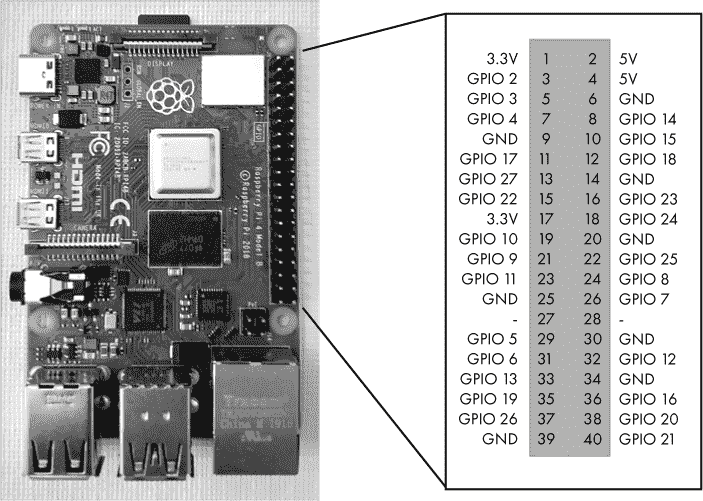

*图 13-11：Raspberry Pi GPIO 引脚*

***搭建电路***

在编写任何代码之前，请按照图 13-12 所示，将电路组件连接到面包板和 Raspberry Pi 的 GPIO 引脚。

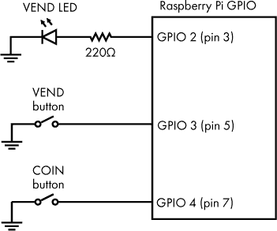

*图 13-12：Raspberry Pi 自动售货机电路图*

我建议在连接任何东西到 GPIO 引脚之前，先关闭你的 Raspberry Pi。对于 GPIO 引脚和面包板之间的连接，使用公对母跳线。你可以将跳线的母头连接到 GPIO 引脚，公头连接到面包板。

如果你使用图 13-12 中显示的引脚编号，VEND LED、VEND 按钮和 COIN 按钮会连接到 Raspberry Pi 上连续的三个 GPIO 引脚。你还需要将其中一个 GND 引脚（我建议使用引脚 9）连接到面包板的负电源列，这样你就可以轻松将按钮和 LED 连接到地。

你可能已经注意到，这个电路的输入开关与第 7 项目（第 105 页）和第 8 项目（第 107 页）中使用的开关接线方式不同。在这些项目中，你将开关的一侧连接到 5V，另一侧连接到下拉电阻/输入引脚。电路的设计是预期开关打开时为低电压，而关闭时为高电压。而在这里，情况正好相反——开关关闭时为低电压，打开时为高电压。从内部来看，当开关打开（或没有连接任何东西）时，树莓派将 GPIO 引脚拉高。

图 13-13 展示了在面包板上搭建的这个电路。

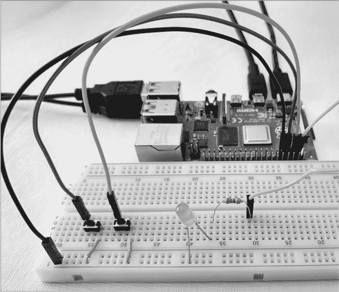

*图 13-13：在面包板上搭建的树莓派自动售货机电路*

一旦你的电路连接好并且你验证了连接，开启树莓派的电源。你可能会看到 LED 亮起，这没关系，因为你还没有运行任何代码来设置 LED 的状态。

***测试你的电路***

在进入自动售货机代码之前，我们先写一个简单的程序来测试电路是否正确连接，并让你熟悉在 Python 中使用 GPIO 的操作。为了与 GPIO 引脚进行交互，我们将使用*GPIO Zero*，这是一个 Python 库，可以轻松与按钮、LED 等物理设备进行交互。使用你喜欢的文本编辑器，在主目录下创建一个名为*gpiotest.py*的新文件。在文本编辑器中输入以下 Python 代码。Python 中缩进非常重要，请确保正确缩进。

```
from time import sleep❶

from gpiozero import LED, Button❷

button = Button(3)❸

led = LED(2)❹

while True:❺

    led.off()

    button.wait_for_press()

    led.on()

    sleep(1)
```

这个简单的程序导入了`sleep`函数❶和来自 GPIO Zero 库的`LED`和`Button`类❷。然后，它创建一个名为`button`的变量，代表 GPIO 3 上的物理按钮❸。类似地，创建了一个`led`变量，代表连接到 GPIO 2 的 LED❹。程序随后进入一个无限循环❺，在该循环中，LED 先熄灭，等待按钮被按下，然后亮起一秒钟后再次进入循环。

一旦文件保存，你可以通过 Python 解释器运行它，如下所示：

```
$ python3 gpiotest.py
```

当你启动程序时，最初应该不会发生任何事情，除了如果 LED 之前是亮的，可能会熄灭。如果你按下连接到 GPIO 3 的按钮，LED 应该会亮起一秒钟，然后熄灭。只要程序在运行，你可以重复这个操作。

我们的简单程序没有包含任何优雅的退出方式，因此要结束程序，请按下键盘上的 CTRL-C。当你以这种方式退出程序时，Python 解释器会显示“追溯”（Traceback）最近的函数调用——这是正常现象。

如果程序没有按预期工作，请仔细检查你输入的代码，并查看《电路故障排除》在第 340 页的内容。

***一个自动售货机程序***

在 项目 #7（见 第 105 页）和 #8（见 第 107 页）中，自动售货机的逻辑由 SR 锁存器、与门和电容器控制。现在，你可以用 Raspberry Pi 上的程序来替代这一切。这种新设计还去除了 COIN LED。之前，如果投入了硬币，COIN LED 会亮起。在新的设计中，程序会打印硬币积分数。每次投入硬币时，积分数应该增加 1，每次发生售货操作时，积分数应该减少 1。

该设备的要求如下：

+   按下 COIN 按钮会使积分数增加 1。

+   按下 VEND 按钮模拟售货操作。如果积分数大于 0，VEND LED 会短暂亮起，积分数减少 1。如果积分数为 0，按下 VEND 按钮时不会发生任何事情。

+   每次按下可操作的按钮，无论是 COIN 还是 VEND，都会导致程序打印当前的积分数。

使用你选择的文本编辑器，在你的主文件夹根目录下创建一个名为 *vending.py* 的新文件。将以下 Python 代码输入到文本编辑器中：

```
from time import sleep❶

from gpiozero import LED, Button

vend_led = LED(2)❷

vend_button = Button(3)

coin_button = Button(4)

coin_count = 0❸

vend_count = 0

def print_credits():❹

    print('Credits: {0}'.format(coin_count - vend_count))

def coin_button_pressed():❺

    global coin_count

    coin_count += 1

    print_credits()

def vend_button_pressed():❻

    global vend_count

    if coin_count > vend_count:

        vend_count += 1

        print_credits()

        vend_led.on()

        sleep(0.3)

        vend_led.off()

coin_button.when_pressed = coin_button_pressed❼

vend_button.when_pressed = vend_button_pressed

input('Press Enter to exit the program.\n')❽
```

首先，代码导入了 `sleep` 函数、`LED` 类和 `Button` 类 ❶，这些将在程序中后续使用。接下来，声明了三个变量，代表连接到 GPIO 引脚的物理组件——`vend_led` 连接到 GPIO 2，`vend_button` 连接到 GPIO 3，`coin_button` 连接到 GPIO 4 ❷。声明了变量 `coin_count` 用于跟踪按下 COIN 按钮的次数，变量 `vend_count` 用于跟踪发生了多少次自动售货操作 ❸。这两个变量用于计算积分数。

`print_credits` 函数 ❹ 打印可用积分数，计算方法是 `coin_count` 和 `vend_count` 之间的差值。

`coin_button_pressed` 函数 ❺ 是当按下 COIN 按钮时运行的代码。它增加 `coin_count` 并打印当前的积分数。`global coin_count` 语句允许在 `coin_button_pressed` 函数中修改全局变量 `coin_count`。

`vend_button_pressed` 函数 ❻ 是当按下 VEND 按钮时运行的代码。如果还有积分剩余（`coin_count > vend_count`），则该函数增加 `vend_count`，打印当前的积分数，并让 LED 灯亮起 0.3 秒。

设置 `coin_button.when_pressed = coin_button_pressed` ❼ 将 `coin_button_pressed` 函数与 GPIO 4 上的 `coin_button` 关联，以便在按下按钮时运行该函数。类似地，`vend_button_pressed` 与 `vend_button` 关联。

最后，我们调用`input`函数❽。这个函数会在屏幕上打印一条消息，并等待用户按下 ENTER 键。这是一种保持程序运行的简单方法。如果没有这一行代码，程序会在用户有机会与按钮交互之前就结束并停止运行。

文件保存后，你可以像这样使用 Python 解释器运行它：

```
$ python3 vending.py
```

当你启动程序时，你应该立即看到`Press Enter to exit the program`显示在终端窗口上。这时尝试按下连接到 GPIO 4 的 COIN 按钮。你应该看到程序打印出`Credits: 1`。接下来，尝试按下 VEND 按钮。LED 应该会短暂点亮，程序应打印出`Credits: 0`。再按一次 VEND 按钮——应该什么也不会发生。多次按下 COIN 和 VEND 按钮，确保程序按预期工作。当你完成测试时，按下 ENTER 键结束程序。

如你所见，一台树莓派或类似的设备，可以在软件中复制我们之前在硬件中实现的相同逻辑。然而，基于软件的解决方案更容易修改。可以通过改变几行代码来添加新功能，而不是添加新的芯片和布线。对于我们在这里想要做的事情来说，树莓派实际上有点“杀鸡用牛刀”；同样的事情可以通过一个更不强大的计算设备以更低的成本完成，但原理是一样的。

***一个物联网自动售货机***

假设自动售货机的操作员希望能够通过互联网远程检查机器的状态。由于你使用的是树莓派来处理自动售货机的逻辑，你可以更进一步，让它成为一台物联网自动售货机！你可以在程序中添加一个简单的 Web 服务器，使得有人可以通过 Web 浏览器连接到设备的 IP 地址，并查看已插入硬币的次数以及发生了多少次售货操作。

Python 使这变得相对简单，因为它包含了一个简单的 Web 服务器库`http.server`。你只需要构建一些包含你要发送的数据的 HTML，并为传入的`GET`请求编写一个处理程序。你还需要在程序启动时启动 Web 服务器。

使用你选择的文本编辑器编辑你家目录根目录下现有的*vending.py*文件。首先在文件的第一行插入以下导入语句（保持现有代码不变，只是向下移一行）：

```
from http.server import BaseHTTPRequestHandler, HTTPServer
```

接下来，删除文件底部的整个`input`行，并将以下代码添加到文件末尾：

```
HTML_CONTENT = """

<!DOCTYPE html>

<html>

  <head><title>Vending Info</title></head>

  <body>

    <h1>Vending Info</h1>

    <p>Total Coins Inserted: {0}</p>

    <p>Total Vending Operations: {1}</p>

  </body>

</html>

"""

class WebHandler(BaseHTTPRequestHandler):❶

    def do_GET(self):❷

        self.send_response(200)❸

        self.send_header('Content-type', 'text/html')❹

        self.end_headers()

        response_body = HTML_CONTENT.format(coin_count, vend_count).encode()❺

        self.wfile.write(response_body)

print('Press CTRL-C to exit program.')

server = HTTPServer(('', 8080), WebHandler)❻

try:❼

    server.serve_forever()❽

except KeyboardInterrupt:

    pass

finally:

    server.server_close()❾
```

`HTML_CONTENT` 是一个多行字符串，定义了程序通过网络发送的 HTML 代码。该 HTML 代码块表示一个简单的网页，包含一个 `<title>`、一个 `<h1>` 标题和两个描述自动售货机状态的 `<p>` 段落。这些段落中的具体值由占位符 `{0}` 和 `{1}` 表示。这些值将在程序运行时由程序填充。由于这是 HTML，字符串中的空格和换行不重要。

`WebHandler` 类 ❶ 描述了网页服务器如何处理传入的 HTTP 请求。它继承自 `BaseHTTPRequestHandler` 类，这意味着它拥有与 `BaseHTTPRequestHandler` 相同的方法和字段。然而，这仅提供了一个通用的 HTTP 请求处理器；你仍然需要指定程序如何响应特定的 HTTP 请求。在这种情况下，程序只需要响应 HTTP `GET` 请求，因此代码定义了 `do_GET` 方法 ❷。当收到一个 `GET` 请求时，会调用该方法，并以以下内容进行回复：

+   `200` 状态码，表示成功 ❸

+   `Content-type: text/html` 头部，告诉浏览器期望响应为 HTML ❹

+   先前定义的 HTML 字符串，但两个占位符已被 `coin_count` 和 `vend_count` 的值替换 ❺

使用 `HTTPServer` 类 ❻ 创建一个网页服务器实例。在这里，你指定服务器名称可以是任何内容，并且 HTTP 服务器监听 8080 端口 `('', 8080)`。在此处，你还指定了使用 `WebHandler` 类来处理传入的 HTTP 请求。

网页服务器通过 `server.serve_forever()` 启动 ❽。这被放置在一个 `try/except/finally` 块 ❼ 中，以便服务器可以持续运行直到发生 `KeyboardInterrupt` 异常（由 CTRL-C 触发）。发生这种情况时，调用 `server.server_close()` 进行清理，然后程序结束 ❾。

一旦文件保存完毕，你可以像这样使用 Python 解释器运行该文件：

```
$ python3 vending.py
```

程序在按下 COIN 或 VEND 按钮时应与之前的行为相同。然而，现在你还可以通过网页浏览器连接到设备，并查看有关自动售货机的数据。为此，你需要确保设备与树莓派在同一局域网内，除非你的树莓派直接连接到互联网并具有公共 IP 地址，在这种情况下，任何互联网设备都应能连接到它。如果没有其他设备，你可以在树莓派本身上启动网页浏览器，让树莓派同时充当客户端和服务器。

你需要找到树莓派的 IP 地址。如果你想查看详细信息，我们在项目#30 中已经讲解过，位于第 255 页，但你需要使用的命令是：

```
$ ifconfig
```

一旦你知道了树莓派的 IP 地址，在你想用作客户端的设备上打开一个网页浏览器。在地址栏中输入以下内容：`http://IP:8080`，将`IP`替换为树莓派的 IP 地址。最终结果应类似于：`http://192.168.1.41:8080`。当你将这个地址输入到浏览器的地址栏后，你应该看到网页加载，显示硬币数量和售货操作。每次你请求此页面时，应该能在终端看到 Python 程序打印有关请求的信息。一旦网页加载完成，它不会自动重新加载，因此如果你多次按下 COIN 或 VEND 按钮并希望查看最新的数值，你需要刷新浏览器中的页面视图。要停止此程序，可以使用键盘上的 CTRL-C。

回想一下第十二章，网站可以是静态的或动态的。你在第十二章项目中运行的网站是静态的——它提供了预先构建好的内容。与此不同，本章中的售货机网站是动态的。它在收到请求时生成 HTML 响应。具体来说，它会在响应之前更新 HTML 内容中的硬币和售货机数值。

作为一个额外的挑战，尝试修改程序，使其也在网页上显示“积分”值。这个值应该与上次打印到终端的积分值相匹配。
