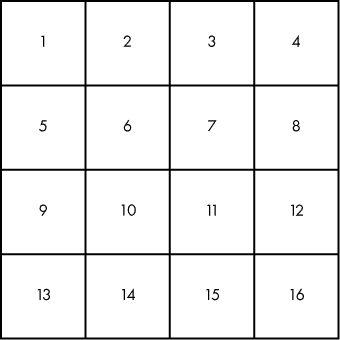
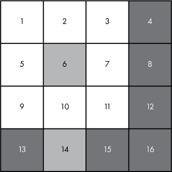
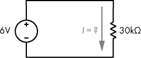
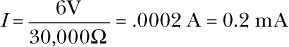
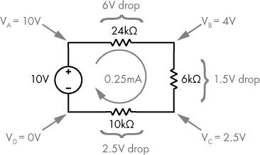
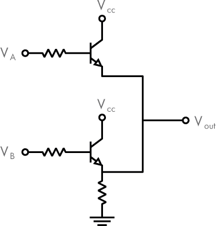
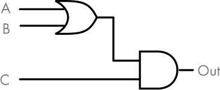
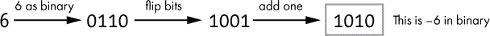
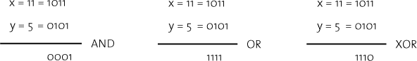

## 第十四章：**A

答案


这里你将找到本书中练习的题目和答案。有些问题没有唯一的正确答案；对于这些问题，我提供了一个示例答案。如果在阅读这里的解答之前自己先想出答案，你将从这些练习中受益最多！

### 1-2: 二进制到十进制

**练习：** 将这些以二进制表示的数字转换为其十进制等效值。

**解答：**

10 (二进制) = 2 (十进制)

111 (二进制) = 7 (十进制)

1010 (二进制) = 10 (十进制)

### 1-3: 十进制到二进制

**练习：** 将这些以十进制表示的数字转换为其二进制等效值。

**解答：**

3 (十进制) = 11 (二进制)

8 (十进制) = 1000 (二进制)

14 (十进制) = 1110 (二进制)

### 1-4: 二进制到十六进制

**练习：** 将这些以二进制表示的数字转换为其十六进制等效值。如果可以，尽量不要转换为十进制！您可以使用表 1-5 来帮助您。目标是直接从二进制转换为十六进制。

**解答：**

10 (二进制) = 2 (十六进制)

11110000 (二进制) = F0 (十六进制)

### 1-5: 十六进制到二进制

**练习：** 将这些以十六进制表示的数字转换为其二进制等效值。如果可以，尽量不要转换为十进制！您可以使用表 1-5 来帮助您。目标是直接从十六进制转换为二进制。

**解答：**

1A (十六进制) = 0001 1010 (二进制)

C3A0 (十六进制) = 1100 0011 1010 0000 (二进制)

### 2-1: 创建您自己的文本表示系统

**练习：** 定义一种方法，将大写字母 A 到 D 表示为 8 位数字，然后使用您的系统将单词 *DAD* 编码为 24 位。附加题：也请将您编码后的 24 位数字显示为十六进制。表 A-1 给出了一个示例答案；没有唯一的正确答案。

**解答：**

**表 A-1：** 用字节表示 A-D 的自定义系统

| **字符** | **二进制** |
| --- | --- |
| A | 00000001 |
| B | 00000010 |
| C | 00000011 |
| D | 00000100 |

使用此系统编码后的 DAD 为 00000100 00000001 00000100（为清晰起见添加了空格）。以十六进制表示为：0x040104。

### 2-2: 编码和解码 ASCII

**练习：** 使用表 2-1，将以下单词编码为 ASCII 二进制和十六进制，每个字符使用一个字节。请记住，大写字母和小写字母有不同的编码。

**解答：**

**文本**   Hello

**二进制**   01001000 01100101 01101100 01101100 01101111

**十六进制**   0x48656C6C6F

**文本**   5 只猫

**二进制**   00110101 00100000 01100011 01100001 01110100 01110011

**十六进制**   0x352063617473

请注意，“5 只猫”的编码给我们得到了 0b00110101 作为字符 5 的二进制表示。这与数字 5（0b101）不同。字符代表我们用来表示数字五的符号（5），而数字则表示数量。从“5 只猫”的同一编码中，还可以注意到，甚至空格字符，你可能认为它是空的，仍然需要一个字节来表示。

**练习：** 使用表 2-1，解码以下单词。每个字符都以 8 位 ASCII 值表示，并添加空格以便清晰显示。

**解答：**

**二进制** 01000011 01101111 01100110 01100110 01100101 01100101

**文本** 咖啡

**二进制** 01010011 01101000 01101111 01110000

**文本** 商店

**练习：** 使用表 2-1，解码以下单词。每个字符都以 8 位十六进制值表示，并添加空格以便清晰显示。

**解答：**

**十六进制** 43 6C 61 72 69 6E 65 74

**文本** 长笛

### 2-3: 创建你自己的灰度表示系统

**练习：** 定义一种方法来表示黑色、白色、深灰色和浅灰色。

**解答：** 如果我们使用 2 位系统，2 位数的四个唯一值为 00、01、10 和 11。然后，可以将这四个二进制数映射到一个颜色：黑色、白色、深灰色和浅灰色——具体的映射由你决定，因为你正在设计自己的系统。表 A-2 展示了一个示例答案；没有唯一正确的答案。

**表 A-2：** 表示灰度的自定义系统

| **颜色** | **二进制** |
| --- | --- |
| 黑色 | 00 |
| 深灰色 | 01 |
| 浅灰色 | 10 |
| 白色 | 11 |

### 2-4: 创建你自己的简单图像表示方法

**练习：第一部分** 基于你之前设计的灰度颜色表示系统，设计一种表示由这些颜色组成的图像的方法。如果你想简化，可以假设图像始终是 4x4 像素，就像图 2-1 中的图像。

**解答：** 假设图像始终为 4x4 像素，因此我们需要表示 16 个像素，每个像素一个颜色。使用之前定义的表示灰度颜色的系统（参见表 A-2），我们需要 2 位来表示每个像素的颜色。因此，要表示完整的 16 像素图像，每个像素 2 位，我们需要 16 × 2 = 32 位总位数。

当我们将数据编码为二进制时，应该如何表示这 16 个像素的顺序？这个决定在某种程度上是任意的，但在这个例子中，我们按从左到右、从上到下的顺序排列数据，如图 A-1 所示。



*图 A-1：示例图像格式中的像素顺序*

使用在 图 A-1 中展示的方法，当我们将数据编码为二进制时，前 2 位是像素 1 的颜色，接下来的 2 位是像素 2 的颜色，依此类推。然后，我们使用前一个练习中定义的颜色代码来定义每个像素的颜色。例如，如果像素 1 是白色，像素 2 是黑色，像素 3 是深灰色，那么我们图像数据的前 6 位是 110001。

**练习：第二部分**   使用第一部分的方法，写出 第二章 中的花朵图像的二进制表示，图 2-1。

**解答：** 在这里，我提供了一个示例，说明如何通过应用第一部分的示例方法来解决这个问题。为了帮助可视化，图 A-2 将编号的像素网格叠加在花朵图像上。



*图 A-2：叠加在花朵图像上的 4X4 像素网格*

现在我们已经为网格中的每个像素分配了一个编号，可以参考 表 A-2 为每个方格应用 2 位值，从方格 1 到 16 依次填充。最终结果是以下二进制序列，表示灰度花朵图像：

11111101111011011111110101100101

**注意**

*我写了一个简单的网页，模拟了这个由 16 个像素和 2 位灰度级组成的系统。请在这里尝试：* [`www.howcomputersreallywork.com/grayscale`](https://www.howcomputersreallywork.com/grayscale)/.

### 2-5：为逻辑表达式写真值表

**练习：** 表 2-7 展示了一个逻辑表达式的三个输入。请完成表达式 (A OR B) AND C 的真值表输出。

**解答：**

**表 A-3：** (A OR B) AND C 真值表解答

| **A** | **B** | **C** | **输出** |
| --- | --- | --- | --- |
| 0 | 0 | 0 | 0 |
| 0 | 0 | 1 | 0 |
| 0 | 1 | 0 | 0 |
| 0 | 1 | 1 | 1 |
| 1 | 0 | 0 | 0 |
| 1 | 0 | 1 | 1 |
| 1 | 1 | 0 | 0 |
| 1 | 1 | 1 | 1 |

### 3-1：使用欧姆定律

**练习：**   看一下 图 A-3 中的电路。电流 *I* 为多少？



*图 A-3：使用欧姆定律找出电流。*

**解答：**   欧姆定律告诉我们电流是电压除以电阻。因此，*I* 是 0.2 毫安，如下所示：



### 3-2：找出电压降

**练习：** 给定 图 3-11 中的电路，电流 *I* 为多少？每个电阻上的电压降是多少？找出标记的电压：V[A]、V[B]、V[C] 和 V[D]，每个电压相对于电源的负端子测量。

**解答：** 总电阻是 24kΩ + 6kΩ + 10kΩ = 40kΩ。这影响电路中的电流，我们可以使用欧姆定律来计算：10V / 40kΩ = 0.25 mA，如 图 A-4 所示。



*图 A-4：电路中的电压降*

现在使用欧姆定律计算 24kΩ电阻上的电压降：V = 0.25mA × 24kΩ = 6V。这意味着 V[B]将比 V[A]低 6V。所以 V[B] = 10V – 6V = 4V。6kΩ电阻降压 0.25mA × 6kΩ = 1.5V。因此，V[C] = V[B] – 1.5V = 2.5V。剩余 2.5V 将在 10kΩ电阻上降压，这可以通过基尔霍夫电压定律推导出来，或者使用欧姆定律计算。

### 4-1：使用晶体管设计逻辑或电路

**练习：** 绘制一个使用晶体管作为输入 A 和 B 的逻辑或电路图。将图 4-4 中使用机械开关的电路进行改编，但使用 NPN 晶体管替代。

**解答：** 图 A-5 展示了使用 NPN 晶体管实现逻辑或的解决方案。



*图 A-5：使用 NPN 晶体管实现逻辑或*

### 4-2：设计一个带逻辑门的电路

**练习：** 在第二章中，练习 2-5 你已经创建了(A OR B) AND C 的真值表。现在基于这个工作，将该真值表和逻辑表达式转化为电路图。绘制一个类似于图 4-11 的逻辑门电路图。

**解答：** 图 A-6 展示了实现(A OR B) AND C 的解决方案。



*图 A-6：(A OR B) AND C 的逻辑门图*

### 5-1：练习二进制加法

**练习：** 尝试以下加法问题。

**解答：** 答案中的前导 0 是可选的。

0001 + 0010 = 0011

0011 + 0001 = 0100

0101 + 0011 = 1000

0111 + 0011 = 1010

### 5-2：求二的补码

**练习：** 求 6 的 4 位二的补码。

**解答：** 请参见图 A-7。



*图 A-7：求 6 的二的补码*

### 5-3：加两个二进制数并解释为带符号数和无符号数

**练习：** 将 1000 和 0110 相加。将你的工作解释为带符号数。然后将其解释为无符号数。结果是否合理？

**解答：** 请参见图 A-8。


*图 A-8：加 1000 和 0110*

### 7-1：计算所需的位数

**练习：** 使用第七章中描述的技巧，确定为寻址 4GB 内存所需的位数。请记住，每个字节都分配一个唯一地址，这只是一个数字。

**解答：** 参考第一章中的 SI 前缀，1GB 内存是 2³⁰或 1,073,741,824 字节。所以 4GB 是 4 倍这个数字，或者是 4,294,967,296 字节。如果我们计算 log2，结果是 32。所以，使用 32 位我们可以为 4GB 内存中的每个字节表示一个唯一的地址。

如果你的计算器或应用程序没有提供 log[2]函数，请注意：


有了这些信息，你可以通过取 log(4,294,967,296)并除以 log(2)来计算 log2。这应该给出 32 的结果。

我们也可以通过另一种方法得到这个解答。由于内存地址从 0 而不是 1 开始分配，因此 4GB 内存的内存地址范围是从 0 到 4,294,967,295（比字节数少 1）。在十六进制中，4,294,967,295 是 0xFFFFFFFF。这是 8 个十六进制数字，每个十六进制符号代表 4 位，我们可以很容易地看到，4 × 8 = 32 位是需要的。

### 8-1: 用大脑代替 CPU

**练习：** 尝试在脑海中运行以下 ARM 汇编程序，或者使用铅笔和纸进行计算： 

```
Address   Assembly

0001007c  subs r3, r0, #1

00010080  ble  0x10090

00010084  mul  r0, r3, r0

00010088  subs r3, r3, #1

0001008c  bne  0x10084

00010090  ---
```

假设输入值*n* = 4 最初存储在`r0`中。当程序执行到指令`00010090`时，你已到达代码的结束，`r0`应为预期的输出值 24。我建议你在每个指令之前和之后跟踪`r0`和`r3`的值。执行指令直到到达`00010090`并查看你是否得到了预期的结果。如果一切正常，你应该已经多次执行了相同的指令；这是有意为之的。

**解答：** 一旦你完成了这个练习，可以查看表 A-4，查看每一步执行汇编代码的情况。表中的每一行代表一次单独指令的执行。对于每个指令，我们跟踪`r0`和`r3`的值。箭头（→）表示寄存器的值从左边的值变化到右边的值。在说明列中，我使用等号表示“被设置为”而不是作为数学上的等式检查。例如，`r0` = `r3` × `r0`表示“`r0`被设置为`r3`和`r0`的积”。

**表 A-4：** 阶乘汇编代码，逐步执行

| **地址** | **指令** | r0 | r3 | **说明** |
| --- | --- | --- | --- | --- |
|  |  | 4 | ? | 你想计算 4 的阶乘，所以在代码运行之前，将`r0`设为 4。`r3`最初是未知的。 |
| `0001007c` | `subs r3, r0, #1` | 4 | ? → 3 | `r3` = `r0` – 1 = 4 – 1 = 3 |
| `00010080` | `ble 0x10090` | 4 | 3 | `r3` > 0，因此不跳转，而是继续到 10084。 |
| `00010084` | `mul r0, r3, r0` | 4 → 12 | 3 | `r0` = `r3` × `r0` = 3 × 4 = 12 |
| `00010088` | `subs r3, r3, #1` | 12 | 3 → 2 | 将`r3`减 1。 |
| `0001008c` | `bne 0x10084` | 12 | 2 | `r3`不为 0，跳转到 10084。 |
| `00010084` | `mul r0, r3, r0` | 12 → 24 | 2 | `r0` = `r3` × `r0` = 2 × 12 = 24 |
| `00010088` | `subs r3, r3, #1` | 24 | 2 → 1 | 将`r3`减 1。 |
| `0001008c` | `bne 0x10084` | 24 | 1 | `r3`不为 0，跳转到 10084。 |
| `00010084` | `mul r0, r3, r0` | 24 → 24 | 1 | `r0` = `r3` × `r0` = 1 × 24 = 24 |
| `00010088` | `subs r3, r3, #1` | 24 | 1 → 0 | 将`r3`减 1。 |
| `0001008c` | `bne 0x10084` | 24 | 0 | `r3`为 0，因此不跳转，而是继续到 10090。 |
| `00010090` |  | 24 | 0 | 我们已经完成了算法，结果可以在 `r0` 中找到，当前 `r0` 的值为 24，正如预期的那样。 |

希望这个表格与你自己尝试时看到的结果一致。现在我们已经走过了 *n* = 4 的代码，接下来请考虑以下问题：

1.  如果我们通过将 `r0` 初始化为 1 来计算 1 的阶乘，会发生什么？

1.  阶乘的数学定义指出，0 的阶乘是 1\. 我们的算法在这种情况下能正常工作吗？如果我们最初将 `r0` 设置为 0，结果会是什么？

1.  你可能已经注意到，预期的结果 24 在倒数第二次循环时已经存储在 `r0` 中。也就是说，程序额外循环了一次，但这并不影响 `r0` 的值。你认为为什么代码是这样写的？

1.  考虑到我们使用的是 32 位寄存器，是否存在 *n* 的实际上限？也就是说，是否可以提供一个 *n* 值，导致结果太大，无法适配 32 位寄存器？

以下是这些问题的答案：

1.  第一次 `subs` 指令将 `r3` 设置为 0，接下来的 `ble` 指令跳转到 `0x10090`，因为 `r3` 为 0\. 此时 `r0` 中的结果仍然是 1，这就是预期的输出。

1.  不，我们的算法无法工作。第一次 `subs` 指令将 `r3` 设置为 -1，接下来的 `ble` 指令跳转到 `0x10090`，因为 `r3` 是负数。此时 `r0` 中的结果仍然是 0，这不是预期的输出。

1.  *n* 的阶乘是小于或等于 *n* 的所有正整数的乘积。遵循这个定义意味着要将 `r0` 乘以 1，尽管这样做并不会改变最终结果。这意味着在 `r3` 为 1 时，代码会多执行一遍循环。我们可以通过跳过乘以 1 来提高代码的效率，但我保留了这一操作，以保持阶乘的数学定义。

1.  32 位整数能够表示的最大值是 2³² – 1 = 4,294,967,295\. 如果我们还需要表示负数，那么最大值是 2,147,483,647\. 所以如果我们尝试计算一个结果大于约 40 亿（或 20 亿）的阶乘，我们会得到一个不准确的结果。事实证明，*n* = 12 是我们可以使用的最大 *n* 值。13 的阶乘超过了 60 亿，已经太大，无法存储在 32 位整数中。

### 9-1：位运算符

**练习：** 请考虑以下 Python 语句。执行完这段代码后，`a`、`b` 和 `c` 的值是多少？

```
x = 11

y = 5

a = x & y

b = x | y

c = x ^ y
```

**解答：** 图 A-9 显示了当对 11 和 5 的值应用与、或、异或位操作时的工作方式。



*图 A-9：对两个值进行位操作*

所以，`a` 的值是 1\. `b` 的值是 15（1111 二进制）。`c` 的值是 14（1110 二进制）。

### 9-2：在脑海中运行 C 程序

**练习：** 尝试在脑海中运行以下函数，或者使用笔和纸。假设输入值为 `n` = 4。当函数返回时，返回的结果应该是预期的 24。我建议您在每一行代码前后，记录下 `n` 和 `result` 的值，直到您走完整个 `while` 循环，看看是否得到预期结果。

请注意，`while` 循环的条件 (`--n > 0`) 将递减操作符 (`--`) 放在变量 `n` 之前。这意味着在将 `n` 的值与 0 比较之前，`n` 会被递减。每次评估 `while` 循环条件时，都会发生这种情况。

```
// Calculate the factorial of n.

int factorial(int n)

{

  int result = n;

  while(--n > 0)

  {

    result = result * n;

  }

  return result;

}
```

**解答：** 在继续阅读之前，我强烈建议您尝试完成这个练习！如果自己动手做，您会学到更多。完成这个练习后，请查看表 A-5，查看每一步执行示例 C 代码的过程。箭头 (→) 表示变量值从左侧的值变为右侧的值。

**表 A-5：** 阶乘 C 代码，逐步解析

| **语句** | **结果** | **n** | **备注** |
| --- | --- | --- | --- |
| `int factorial(int n)` | ? | 4 | 我们想计算 4 的阶乘，因此将 `n` 设置为 4 作为函数的输入。 |
| `int result = n;` | ? → 4 | 4 | 初始时，将 `result` 设置为 `n` 的值。 |
| `while(--n > 0)` | 4 | 4 → 3 | 减少 `n`。`n` > 0，因此执行 `while` 循环体。 |
| `result = result * n;` | 4 → 12 | 3 | `result` = 4 × 3 |
| `while(--n > 0)` | 12 | 3 → 2 | 减少 `n`。`n` > 0，因此再次执行 `while` 循环体。 |
| `result = result * n`; | 12 → 24 | 2 | `result` = 12 × 2 |
| `while(--n > 0)` | 24 | 2 → 1 | 减少 `n`。`n` > 0，因此再次执行 `while` 循环体。 |
| `result = result * n`; | 24 → 24 | 1 | `result` = 24 × 1 |
| `while(--n > 0)` | 24 | 1 → 0 | 减少 `n`。`n` = 0，因此退出 `while` 循环。 |
| `return result`; | 24 | 0 | 我们已经完成了函数，计算结果可以在 `result` 中找到，结果是 24，符合预期。 |

希望这张表与您自己尝试时看到的结果相匹配。

### 11-1：哪些 IP 位于同一子网中？

**练习：** IP 地址 `192.168.0.200` 是否与您的计算机位于同一子网中？假设您的计算机的 IP 地址是 `192.168.0.133`，子网掩码是 `255.255.255.224`。

**解答：** 正如我们在第十一章中发现的，您计算机子网的网络 ID 是 `192.168.0.128`。假设两台设备在同一子网中，它们将共享子网掩码和网络 ID。将另一台计算机的 IP 地址与我们的子网掩码进行逻辑与运算，得到网络 ID。

```
  IP = 192.168.0.200   = 11000000.10101000.00000000.11001000

MASK = 255.255.255.224 = 11111111.11111111.11111111.11100000

 AND = 192.168.0.192   = 11000000.10101000.00000000.11000000 = The network id
```

另一台计算机的网络 ID (`192.168.0.192`) 与您计算机的网络 ID (`192.168.0.128`) 不匹配，因此它们位于不同的子网中。这意味着这两台主机之间的通信需要经过路由器。

### 11-2：研究常见端口

**练习：** 查找常见应用层协议的端口号。域名系统（DNS）、安全外壳协议（SSH）和简单邮件传输协议（SMTP）的端口号分别是多少？你可以通过搜索在线资料或查阅 IANA 注册表来找到这些信息，地址是：*[`www.iana.org/assignments/port-numbers`](http://www.iana.org/assignments/port-numbers)*。IANA 注册表有时会用一些意外的术语来表示服务名称。例如，DNS 通常仅列为“domain”。

**解决方案：**

+   DNS: 53

+   SSH: 22

+   SMTP: 25

### 12-1: 识别 URL 的各个部分

**练习：** 对于以下 URL，识别出协议、用户名、主机、端口、路径和查询。并非所有 URL 都包含所有这些部分。

**解决方案：**

*[`example.com/photos?subject=cat&color=black`](https://example.com/photos?subject=cat&color=black)*

**协议**   *https*

**主机**   *example.com*

**路径**   *photos*

**查询**   *subject=cat&color=black*

*[`192.168.1.20:8080/docs/set5/two-trees.pdf`](http://192.168.1.20:8080/docs/set5/two-trees.pdf)*

**协议**   *http*

**主机**   *192.168.1.20*

**端口**   *8080*

**路径**   *docs/set5/two-trees.pdf*

*mailto:someone@example.com*

**协议**   *mailto*

**用户名**   *someone*

**主机**   *example.com*
