## 第十五章：**B

资源**


本附录包含帮助你开始项目的信息。我们介绍了如何寻找可购买的电子元件，如何为数字电路供电，以及如何设置树莓派。

### 购买项目所需电子元件

通过动手操作电子元件和编程，你能帮助你更好地理解本书中的概念，但获取各种组件可能让人感到有些吓人。本节将帮助你找到项目所需的电子元件。

以下是所有项目中使用的组件的完整清单，以防你想一次性购买所有材料：

+   面包板（至少一个 830 点的面包板。如果你打算在每次练习之间拆解电路，使用一个面包板就足够了。如果你希望保持电路完整，您需要多个面包板。）

+   电阻器（一组电阻器。这里是使用的具体数值：47kΩ，10kΩ，4.7kΩ，1kΩ，470Ω，330Ω，220Ω。）

+   数字万用表

+   9 伏电池

+   9 伏电池夹连接器

+   一包 5mm 或 3mm 的红色 LED（发光二极管）

+   两个 NPN BJT 晶体管，型号 2N2222，TO-92 封装（也称为 PN2222）

+   适用于面包板的跳线（包括公对公和公对母）

+   按钮开关或滑动开关，适合面包板使用

+   7402 集成电路

+   7408 集成电路

+   7432 集成电路

+   两个 7473 集成电路

+   7486 集成电路

+   220μF 电解电容

+   10μF 电解电容

+   5 伏电源（详情请参见第 336 页的“数字电路供电”部分。）

+   树莓派及相关设备（详情请参见第 341 页的“树莓派”部分。）

+   推荐：鳄鱼夹（这些可以使你更容易将电池连接到面包板或将万用表连接到电路。）

+   可选：剥线器（你可能需要一个剥线器来剥去电线末端的塑料，暴露出铜线。）

虽然这个清单列出了某些元件的具体数量，但对于一些零件，你可能想多买一些以防损坏，或者如果你想做实验的话。我建议你准备一些备用的晶体管和每种集成电路的一个备用。

#### *7400 零件编号*

寻找适合的 7400 系列集成电路（IC）可能会很有挑战性，因为这些芯片的零件编号比仅仅 74*xx*标识符包含更多的细节。7400 系列有许多子系列，每个子系列都有自己的零件编号方案。此外，制造商还会在零件编号前后添加自己的前缀和后缀。一开始可能会很混乱，所以让我们看一个例子。我最近想购买一个 7408 集成电路，但我实际订购的零件编号是 SN74LS08N。让我们在图 B-1 中分解这个零件编号。

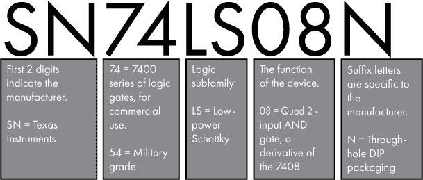

*图 B-1：解读 7400 系列零件编号*

因此，SN74LS08N 是由德州仪器生产的 7408 与门，属于低功耗肖特基子系列，采用通孔封装。无需担心“低功耗肖特基”的细节，只需要知道这是一个常见的零件子系列，适用于我们的目的。

本书中的项目要求你确保所使用的零件相互兼容。项目假设你使用的零件兼容原始的 7400 逻辑电平（5V）。考虑到现有的零件，我建议你购买 LS 或 HCT 系列的零件。所以如果你需要 7408，你可以购买 SN74**LS** 08N 或 SN74**HCT** 08N。一般来说，你应该能够在同一电路中混合使用 LS 和 HCT 系列的零件。前缀字母（例如此处的 SN）对兼容性没有影响；你不需要购买特定厂商的零件。后缀则非常重要，因为它表示封装类型。确保购买适合面包板的零件——N 系列的零件适用。

#### *购物*

如果附近恰好有一家能够提供这些零件的本地电子商店，我建议你去看看。店员可以帮助确保你得到需要的零件。然而，我发现这类商店越来越稀少；你可能无法在本地找到所有需要的零件。

你的下一个选择是在线购物。为了方便你，我整理了一个网页，提供了来自不同商店的所需零件链接： *[`www.howcomputersreallywork.com/parts`](https://www.howcomputersreallywork.com/parts)/*。或者，如果你想自己挑选，表 B-1 列出了一些你可以购买零件的热门商店；我还为每个商店添加了备注。我并不特别推荐这些商店，你也许能在其他地方找到零件。当然，这些在线商店的状态可能会在本书出版后发生变化。

**表 B-1：** 在线购买电子元件

| **商店** | **备注** |
| --- | --- |
| Adafruit*[`www.adafruit.com`](https://www.adafruit.com)*/ | Adafruit 提供了丰富的电子元件选择；不过，最后一次检查时，他们没有单独销售 7400 系列的逻辑门。 |
| Amazon*[`www.amazon.com`](https://www.amazon.com)*/ | Amazon 销售流行商品，如树莓派，但集成电路的订购通常不可选或者价格较高。例如，一些商品只能按 50 或 100 个为一包出售。你可能不需要 100 个晶体管，但如果你是 Prime 会员，实际上从 Amazon 购买 100 个晶体管比从其他商店购买 5 个要更划算，尤其是考虑到运费。 |
| Digi-Key Electronics*[`www.digikey.com`](https://www.digikey.com)*/ | Digi-Key 主要面向专业人士而非爱好者，网站可能会让人感到有些难以应对，但你可以在这里找到集成电路，包括 7400 系列的逻辑电路。 |
| Mouser Electronics*[`www.mouser.com`](https://www.mouser.com)*/ | Mouser 类似于 Digi-Key，主要面向专业人士，并销售集成电路。 |
| SparkFun*[`www.sparkfun.com`](https://www.sparkfun.com)*/ | 和 Adafruit 一样，你可以在这里找到很多电子产品，但至少我上次检查时，找不到 7400 逻辑门。 |
| 德州仪器*[`store.ti.com`](https://store.ti.com)*/ | 德州仪器生产 7400 系列逻辑电路，并通过其官网直接销售这些产品。我发现他们的价格合理，且运输选项很好。 |

许多网站专门帮助人们找到电子零件。这些网站提供易于导航的用户界面，并允许跨多个零售商进行价格比较。我发现两个非常有用的网站是 Octopart (*[`octopart.com`](https://octopart.com)*) 和 Findchips (*[`www.findchips.com`](https://www.findchips.com)*)。

### 为数字电路供电

7400 系列逻辑芯片需要 5V 电压，因此使用 9 伏电池不能为这些集成电路供电。我们来看一下为你的 7400 电路供电的几种选项。

#### *USB 充电器*

2010 年以来，许多智能手机充电器都配备了微型 USB 连接器。大约在 2016 年，USB Type-C（或称 USB-C）连接器开始变得更为普及。幸运的是，无论是 USB 类型的哪种，都提供 5V 直流电。因此，像图 B-2 中展示的 USB 充电器，都是为你的 7400 系列集成电路供电的好选择。如果你像我一样，家里可能已经有一堆旧的微型 USB 手机充电器。

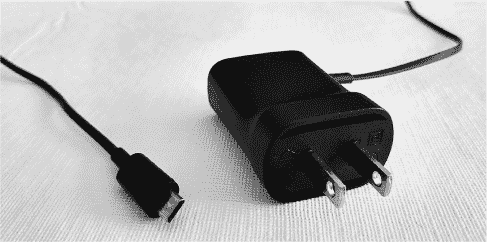

*图 B-2：一款微型 USB 手机充电器*

然而，存在一个挑战；微型 USB 连接器不能直接插入面包板，至少没有一些额外的帮助！一个不错的选择是购买一个*微型 USB 分解板*，就像在图 B-3 中展示的那样。这样你可以将 USB 充电器插入分解板，分解板再插入面包板。Adafruit、SparkFun 和亚马逊都出售这些产品。可能需要一些焊接。这些板通常有五个引脚，但对于这个用途，你只需要关注 VCC（5V）引脚和 GND（地）引脚。当将其连接到面包板时，记得调整引脚的方向，确保它们不会相互连接，正如图 B-3 中所示。

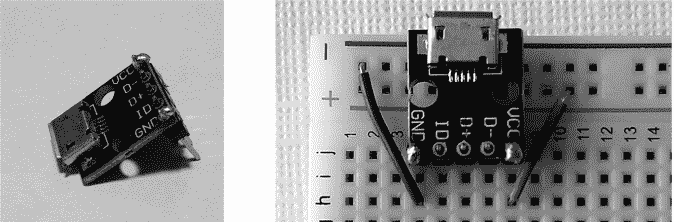

*图 B-3：插入面包板的微型 USB 分解板（右侧）*

#### *面包板电源供应*

另一种选择是购买一个面包板电源供应器，比如 DFRobot DFR0140 或 YwRobot Power MB V2 545043。这些方便的设备插入你的面包板，并由一个带 2.1mm 圆柱插孔的墙面直流电源供电。该直流电源的电压应在 6V 到 12V 之间（确保验证你所使用的特定板子所允许的电压）。这些 2.1mm 直流电源在为消费电子产品供电时很常见——你可能已经有几个了——这种类型的电源板使得转换电压为 5V 并连接到面包板变得非常简单。图 B-4 展示了一个带有 2.1mm 圆柱插孔的常见直流电源和一个面包板电源。

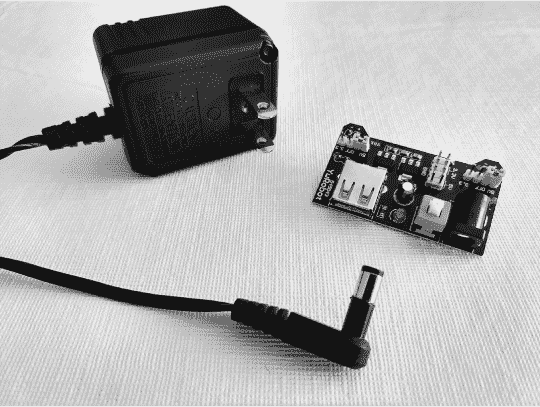

*图 B-4：一个带 2.1mm 圆柱插孔的电源和一个面包板电源*

有一点需要注意：我个人曾见过这些电源板的电压调节器发生故障，导致板子输出的电压超过了 5V。在连接这些电源时，不要假设输出电压一定是 5V。在连接电路之前，务必测试输出电压！使用较低的输入直流电压有助于降低此风险，因此我建议你使用 9 伏或更低的直流电源，考虑到允许的电压范围是 6V 到 12V。这些电源板也可以选择输出 3.3V 而不是 5V，可以通过板上的跳线设置来控制，所以请确保跳线放置在正确的位置。

#### *来自树莓派的电源*

如果你打算为第八章的项目购买一台树莓派，你真幸运；它还有一个附加好处，就是可以当作 5 伏电源使用！树莓派的 GPIO 引脚有多种功能，但对于这个用途，你只需要知道引脚 6 是地线，引脚 2 提供 5V。你可以将这些引脚连接到你的面包板上，作为电源使用。请参阅图 13-11 和第 312 页的 GPIO 引脚图。甚至无需安装任何树莓派软件，因为一旦树莓派开机，5 伏引脚会自动启用。只需将树莓派连接到电源即可。作为额外的好处，引脚 1 还可以提供 3.3V（如果需要的话）。需要澄清的是，如果你这样做，你并没有使用树莓派的计算能力；它只是充当一个 5 伏电源。树莓派提供的电流是有限的。你为树莓派使用的电源适配器会有一个最大电流额定值，而树莓派本身也会消耗一些电流，可能在空闲时为 300mA 左右。这可能是显而易见的，但如果你选择这个选项，请小心确保你的电路连接正确；你可不想不小心损坏你的树莓派！图 B-5 展示了树莓派作为电源使用的情况。

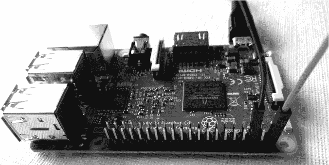

*图 B-5：将树莓派用作电源*

#### *AA 电池*

你也可以使用 AA 电池为数字电路供电。单个 AA 电池提供 1.5V 电压，因此可以将三节 AA 电池串联连接，提供 4.5V 电压。虽然这个电压低于 7400 系列元件推荐的电压，但对于本书中的电路来说应该是可行的，尽管你的结果可能会有所不同。你可以购买一个适用于三节 AA 电池的电池座，并将其输出电线连接到你的面包板，如图 B-6 所示。

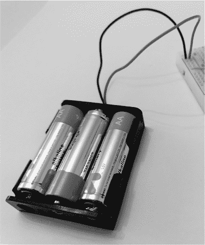

*图 B-6：使用三节 AA 电池为面包板上的电路供电*

### 电路故障排除

有时候你搭建电路时，预期电路按某种方式工作，但结果却完全不同。也许电路看起来什么都不做，或者它的行为与你的预期不一致。别担心，这种情况每个做电路的人都会遇到！接线错误或松动的连接很容易导致问题，打乱整个电路的工作。故障排除和诊断电路问题是一项非常有价值的技能，实际上能帮助你更好地理解事物的工作原理。在这里，我分享一些当我的电路不能正常工作时，我常用的故障排除方法。

如果电路中的任何元件过热到无法触摸的程度，请立即将电路与电源断开。接线错误可能导致元件过热。如果电路继续连接超过几秒钟，往往会损坏元件。

你进行电路故障排除的主要工具是万用表。使用万用表，你可以轻松检查电路中各个点的电压。问问自己：“我预期电路中这个点或那个点的电压应该是多少？”对于 5 伏的数字电路，预期的电压通常是大约 0V 或大约 5V。如果你的万用表显示电路中的某个点电压异常，问问自己，“是什么因素可能影响这个电压？”然后检查这些因素。

对于数字电路，我通常采取“逆向工作”的方法，从表现异常的元件开始。确认它的输出电压是否有问题，然后检查它的输入。是否有某个输入电压也不正常？如果是，回溯到为该输入提供电压的元件，检查其输出。重复此过程，直到找到问题的根源。

在检查电压时，我发现最简单的方法是将黑色/负极/COM 探头连接到电路中的接地点，并保持连接。如果没有明显的接地点，可以在面包板上的接地点加一个跳线，然后用鳄鱼夹将跳线连接到 COM 探头。将 COM 探头固定在地面后，你可以轻松地使用红色的正极探头，在电路的各个点进行测量，检查与地面相比的电压。

我在故障排除时经常使用万用表检查的另一项是电阻。有时我知道两个点之间预期的电阻值，并且希望验证这个电阻值。如果连接这两个点有多个路径，请确保你知道预期的电阻，以便正确解释你的测量结果。

通常我检查电阻是为了确保两个点连接，这时我预期的电阻值大约是 0Ω。相反，有时我希望确保两个点*没有*连接，这时我会寻找一个非常高的电阻，即开路。一些万用表还包括*连续性检查*功能，当两个点连接时，万用表会发出声音。如果你只是检查连接性，有时这种方式比检查电阻更为方便。

故障排除时需要验证的一些具体事项：

**面包板电源** 你的面包板在长电源列上是否有合适的电压？正电压列应该等于你的电源电压（例如，9 伏电池或 5 伏电源）。如果两个面包板两边都在使用，一定要检查两侧的电压。

**面包板连接** 验证面包板上的接线是否稳固。导线是否完全插入，还是有松动的连接？再次检查面包板上连接的对齐情况；导线是否插在正确的行？你检查的行中是否有多余的连接？

**电阻器** 你的电阻器的数值是否正确？如有需要，逐一将它们从电路中取出，并使用万用表进行验证。

**LED 灯** 你的 LED 是否正确安装？短引脚应该连接到地线。

**电容器** 如果你的电容器是有极性的，确保正负引脚正确连接。还要检查电容值。

**集成电路** 你的 IC 是否正确连接到地线和正电压？芯片是否完全插入面包板，并且位于中央的间隙中？通过检查缺口来确认 IC 是否正确对齐。你是否使用了正确的零件编号？

**数字输入开关/按钮** 使用下拉电阻时，开关的一侧是否连接到正电压，另一侧是否通过下拉电阻连接到地线？相关芯片上的数字输入引脚是否连接到与下拉电阻相同的一侧？

### 树莓派

树莓派是一款小巧、廉价的计算机。它的开发目的是促进计算机科学的教学，并且在技术爱好者中获得了广泛关注。它是我们本书中使用的计算机，所以在这里我们将介绍设置和使用树莓派的基本知识。

#### *为什么选择树莓派*

在详细讲解如何配置你的 Raspberry Pi 之前，我想先解释一下为什么我选择 Raspberry Pi 作为本书的主要工具。一些项目需要某种计算机设备来进行交互。现在，你可能会想：“我已经有计算机了，为什么还需要一个？”是的，既然你正在阅读一本关于计算的书，你可能已经拥有计算机，甚至多台！然而，并不是每个人都拥有相同类型的计算机，有些类型的计算设备在教育方面比其他设备更为适合。此外，本书中的一些项目涉及计算机的底层细节，因此每个参与的人都需要使用相同类型的设备。

选择 Raspberry Pi 是一个自然的决定，因为它价格低廉（大约$35）且专为计算机教育设计。我的目标不是让你把 Raspberry Pi 作为主力电脑，或者让你成为 Raspberry Pi 专家。相反，我们使用 Raspberry Pi 来学习一些核心概念，然后你可以将这些概念应用到任何计算设备上。Raspberry Pi 使用 ARM 处理器，我们将运行*Raspberry Pi OS*（之前称为*Raspbian*），这是为 Raspberry Pi 优化的 Linux 版本。

#### *所需配件*

首先，你需要获得一个 Raspberry Pi 和一些配件。以下是你需要的东西：

+   **Raspberry Pi**。这些设备通常售价约为$35，可以在线购买。本文撰写时，最新型号为 Raspberry Pi 4 Model B，本书中的练习已在该版本和 Raspberry Pi 3 Model B+上进行了测试。如果发布了新型号，考虑到 Raspberry Pi 具有向后兼容的良好记录，它也应该是可用的。Raspberry Pi 4 Model B 有多个内存配置（1GB、2GB、4GB 和 8GB），本书中的任何一个都适用。

+   **USB-C 电源适配器（仅适用于 Raspberry Pi 4）**。Raspberry Pi 4 使用 USB-C 电源适配器。电源适配器需要提供 5V，并且至少 3A。某些 USB-C 电源适配器与一些 Raspberry Pi 4 设备不兼容，因此我建议你购买专为 Raspberry Pi 4 设计的 USB-C 电源适配器。

+   **Micro-USB 电源适配器（仅适用于 Raspberry Pi 3）**。与 Raspberry Pi 4 不同，Raspberry Pi 3 使用 micro-USB 电源适配器供电，类似于许多智能手机所使用的适配器。如果你已经有智能手机充电器，它可能也适用于 Raspberry Pi。只需确保连接器是 micro-USB。此类充电器的标准电压输出为 5V，但它们提供的最大电流不同。对于 Raspberry Pi 3，建议使用能够提供至少 2.5A 电流的电源适配器。电流需求根据你连接到 Raspberry Pi 的设备而有所不同。因此，请检查你的智能手机充电器，看它能够提供多少电流；你可能需要购买专为 Raspberry Pi 设计的 micro-USB 电源适配器。

+   **MicroSD 卡，8GB 或更大。** 树莓派没有自带存储器，因此你需要通过 microSD 卡来添加存储。这些卡片通常用于智能手机和相机，所以你可能已经有一张闲置的卡。安装树莓派操作系统的过程会清除已有的数据，请确保备份你在 microSD 卡上存储的任何内容。

+   **USB 键盘和 USB 鼠标。** 任何标准的 USB 键盘和 USB 鼠标都可以使用。

+   **支持 HDMI 的电视或显示器。** 所有现代电视和许多计算机显示器都支持 HDMI 连接。

+   **HDMI 电缆。** 树莓派 3 使用标准的全尺寸 HDMI 电缆，但树莓派 4 有一个 micro-HDMI 端口。如果你的显示设备支持全尺寸 HDMI 输入，那么树莓派 4 需要一个 micro-HDMI 到 HDMI 的电缆或适配器。

+   **可选：树莓派机箱。** 这不是必须的，但有的话会很不错。请注意，树莓派 3 和树莓派 4 的物理布局不同，因此它们需要不同形状的机箱。

请参阅本附录中“购买电子组件”部分的“购物”小节，以获取如何购买这些零件的帮助。

#### *设置树莓派*

树莓派网站 (*[`www.raspberrypi.org`](https://www.raspberrypi.org)*) 提供了详细的设置指南，带你一步步完成树莓派的设置。我在这里不会覆盖所有细节，因为在线文档已经存在，并且随着时间变化会更新。让我为你简要概述一下所需的步骤。

你有多种选择可以在树莓派上安装树莓派操作系统。如果你有一台带有 microSD 卡读写器的计算机，最简单的方式是使用 *树莓派镜像工具*。下面是使用这个工具快速启动树莓派的方法：

1.  将你的 microSD 卡插入计算机。

1.  从 *[`www.raspberrypi.org/downloads`](https://www.raspberrypi.org/downloads)* 下载树莓派镜像工具。

1.  在你的计算机上安装并运行树莓派镜像工具。

1.  选择操作系统：树莓派操作系统（32 位）。

1.  选择你想使用的 SD 卡。

1.  点击“写入”，树莓派操作系统将被复制到你的 microSD 卡中。

1.  从你的计算机中取出 microSD 卡。

1.  将 microSD 卡插入树莓派。

1.  使用 HDMI 将树莓派连接到 USB 键盘、USB 鼠标以及显示器或电视，最后连接电源。

1.  树莓派应该会启动到树莓派操作系统。

安装树莓派操作系统的另一种好方法是使用树莓派的*新盒子软件（NOOBS）*。要使用 NOOBS，请从 *[`www.raspberrypi.org/downloads`](https://www.raspberrypi.org/downloads)* 下载它并复制到一张空白的 microSD 卡上。如果你没有其他电脑来进行这项操作，你也可以购买一张预加载了 NOOBS 的 microSD 卡。在任何一种情况下，一旦你将 NOOBS 放到 microSD 卡上，插入树莓派并开启电源。按照屏幕上的指示来安装树莓派操作系统。

**注意**

*在撰写本书时，Raspberry Pi OS 的 64 位版本已经作为测试版发布。然而，本书中的项目是基于 32 位 Raspberry Pi OS 测试的，因此我建议你在进行项目时使用 32 位版本*。

#### *使用 Raspberry Pi OS*

一旦你的 Raspberry Pi 设置完成，我建议你花点时间熟悉一下 Raspberry Pi OS 的用户界面。如果你之前使用过 Mac 或 Windows PC，Raspberry Pi OS 的桌面环境应该会有些熟悉。你可以在窗口中打开应用程序，移动这些窗口，关闭它们，等等。

也就是说，本书中的大多数项目并不需要你使用任何 Pi 的图形化应用程序。几乎所有的操作都可以通过终端完成，而且大多数项目至少需要使用终端，因此我们先花一点时间来熟悉它。从 Raspberry Pi OS 的桌面上，你可以通过点击 **Raspberry**（左上角的图标）▶ **附件** ▶ **终端** 来打开一个终端窗口，如 图 B-7 所示。

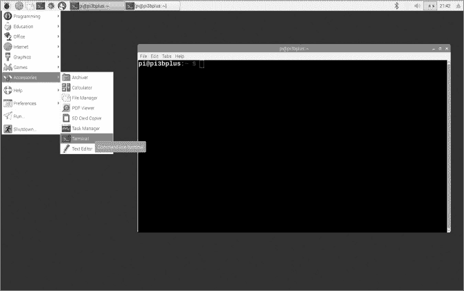

*图 B-7：打开 Raspberry Pi 终端*

终端是一个 *命令行界面（CLI）*，你在其中所做的一切操作都是通过输入命令来完成的。Raspberry Pi OS 和所有版本的 Linux 一样，都对 CLI 提供了出色的支持。如果你知道正确的命令，你几乎可以从终端做任何事情。默认情况下，Raspberry Pi OS 的终端运行一个叫做 *bash* 的 Shell。*Shell* 是操作系统的用户界面，可以是图形化的（如桌面）也可以是基于命令行的。bash 命令行中的初始文本应该像这样：

```
pi@raspberrypi:~ $
```

让我们逐个分析该文本字符串的各个部分：

**pi**   这是当前登录用户的用户名。默认用户的名称是“pi”。

**raspberrypi**   用@符号与用户名分隔，这是计算机的名称。

**~**   这表示你正在工作的当前目录（文件夹）。~ 字符有特别的含义，它指的是当前用户的主目录。

**$**   美元符号是 CLI 提示符，表示你可以在此处输入命令。

在本书中，当我列出应该在终端中输入的命令时，我会在命令前加上一个 `$` 提示符。例如，以下命令列出了当前目录中的文件：

```
$ ls
```

要运行命令，你不需要输入美元符号；只需输入其后面的文本，然后按下 ENTER 键。如果你想运行之前输入过的命令，可以按键盘上的上箭头键浏览之前输入的命令。

如果你更喜欢在终端中工作，你可以设置树莓派直接启动到命令行界面，而不是桌面环境：**Raspberry** ▶ **Preferences** ▶ **Raspberry Pi Configuration** ▶ **System tab** ▶ **Boot** ▶ **To CLI**。完成这个配置更改后，系统下次启动时会直接进入 CLI，而不是桌面环境。如果你在 CLI-only 环境中，并且想要启动桌面环境，只需运行以下命令：

```
$ startx
```

作为终端用户，另一种选择是通过网络使用*安全外壳（SSH）*从另一台计算机甚至手机控制你的树莓派。这种方法的最终结果是，你的树莓派可以在网络中的任何地方运行，即使没有连接显示器或键盘，你也可以使用其他设备的键盘和显示器来控制它。要实现这一点，你必须在树莓派上启用 SSH（**Raspberry** ▶ **Preferences** ▶ **Raspberry Pi Configuration** ▶ **Interfaces tab** ▶ **SSH** ▶ **Enable**），然后在第二台设备上运行 SSH 客户端应用。我不会提供详细的设置步骤，但网上有很多指南可以帮助你完成此操作。

当你完成使用树莓派一段时间后，你应该优雅地关闭它，以避免数据损坏，而不是直接关机。在桌面环境下，你可以通过**Raspberry** ▶ **Shutdown…** ▶ **Shutdown**来关闭系统。或者在终端中，你可以使用以下命令来停止系统：

```
$ sudo shutdown -h now
```

当你看到附加的显示器不再显示任何内容，并且树莓派板上的活动指示灯停止闪烁时，就说明系统已经完全关机。然后你可以拔掉树莓派的电源。

#### *文件和文件夹操作*

本书中的项目通常会指导你创建或编辑文本文件，并在文件上运行一些终端命令。我们将讨论如何在树莓派操作系统中操作文件和文件夹，既可以通过命令行也可以通过图形桌面来操作。操作系统通过文件系统来组织存储设备上的数据，就像树莓派中的 microSD 卡。*文件*是数据的容器，*文件夹*（也称为目录）是文件或其他文件夹的容器。文件系统的结构是一个*层级*，一个文件夹的树状结构。在 Linux 系统中，这个层级的根是表示为*/*。根文件夹是最上层的文件夹，所有其他文件夹和文件都在根文件夹“之下”。

根文件夹下的一个文件夹会像这样表示：*/<foldername>*。该文件夹中的一个文本文件可能是这样：*/<foldername>/<filename>.txt*。请注意*.txt*文件扩展名，它是文件名的最后部分。约定上，文件名通常以一个点号和一些字符结尾，用来表示文件中包含的数据类型。对于文本文件，通常使用“txt”。虽然使用文件扩展名并不是强制性的，但它是一个常见的做法，有助于整理数据。

在 Raspberry Pi OS 中，每个用户都有一个用于工作的主文件夹。Raspberry Pi OS 的默认用户名为 pi，pi 用户的主文件夹位于 */home/pi*。当你以 pi 用户身份登录时，该主文件夹也可以用 ~ 字符来表示。假设你在主文件夹中创建了一个名为 *pizza* 的文件夹，它的完整路径为 */home/pi/pizza*，或者当以 pi 用户身份登录时，你可以将其称为 *~/pizza*。让我们尝试从终端窗口创建一个 *pizza* 文件夹，使用 mkdir 命令，缩写自“make directory”。输入命令后不要忘记按回车键。

```
$ mkdir pizza
```

在终端中，你可以使用 ls 命令查看你新创建的文件夹：

```
$ ls
```

当你输入 ls 并按下回车键时，你应该会看到 *pizza* 文件夹，旁边还有一些已经存在于你的主文件夹中的其他文件夹，如 *Desktop*、*Downloads* 和 *Pictures*。

终端并不是查看文件夹中文件的唯一方式。你还可以使用文件管理器应用程序，该应用程序可以通过 **Raspberry** ▶**Accessories** ▶**File Manager** 启动。如 Figure B-8 所示，文件管理器应用程序以默认视图打开，显示你的主目录。

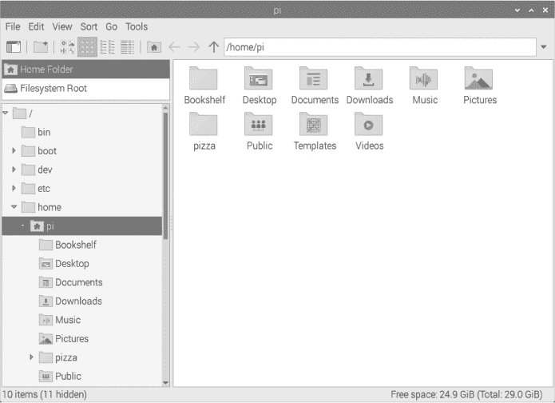

*Figure B-8: Raspberry Pi OS 文件管理器*

文件管理器的左侧显示了完整的文件系统文件夹层次结构，当前选中的文件夹会被高亮显示——在此例中是 *pi*。顶部的地址栏显示 */home/pi*，表示当前文件夹。现在，尝试双击 *pizza* 文件夹；它应该是空的。让我们回到终端窗口，在该文件夹中创建一些文件。首先，使用 cd 命令（change directory 变更目录）更改文件夹，使得当前文件夹为 *pizza* 文件夹。然后，使用 touch 命令创建两个空文件。最后，我们使用 ls 命令列出目录内容，应该能看到这两个新文件名。

```
$ cd pizza

$ touch cheese.txt

$ touch crust.txt

$ ls
```

请注意，当你切换到 *pizza* 文件夹时，你的 bash 提示符也应已更改。现在它应该在 `$` 之前包含 `~/pizza`，表示当前文件夹。现在查看文件管理器应用程序窗口，它应该也会显示 *pizza* 文件夹下的两个新文件，如 Figure B-9 所示。

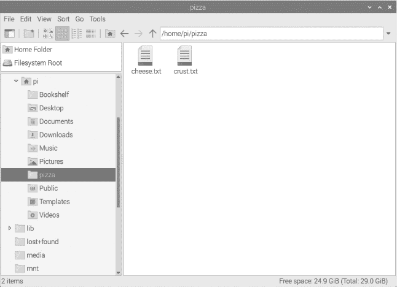

*Figure B-9: Raspberry Pi OS 文件管理器：pizza 文件夹中的文件*

现在我们在 *pizza* 文件夹中有两个空文件。让我们往文件中添加文本内容。首先，我们将使用一种命令行文本编辑器 `nano` 编辑 *cheese.txt* 文件。

```
$ nano cheese.txt
```

当终端中的 `nano` 编辑器窗口打开时，你可以输入将保存到 *cheese.txt* 的文本。请记住，`nano` 是一个命令行应用程序——你不能使用鼠标。你需要使用箭头键来移动光标。尝试输入一些文本，如 Figure B-10 所示。

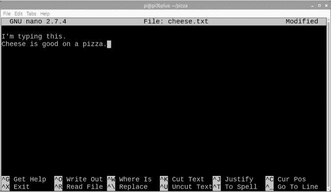

*Figure B-10: 使用 nano 编辑* cheese.txt

在`nano`中输入一些文本后，按下 CTRL-X 退出`nano`。编辑器会提示你保存工作（“保存已修改的缓冲区？”）。这看起来可能是个奇怪的问题，但不要让“缓冲区”这个术语困扰你——`nano`只是问你是否想将输入的文本保存到文件中。按 Y，然后按 ENTER 接受建议的文件名（*cheese.txt*）。

我经常使用`nano`，因为它可以在终端中工作，但你也许更喜欢使用图形化文本编辑器编辑文件。Raspberry Pi OS 桌面环境中包含一个方便的文本编辑器，你可以通过**Raspberry** ▶**Accessories** ▶**Text Editor**来启动。写这本书时，启动的编辑器是 Mousepad。接下来，我们可以尝试在这个文本编辑器中进一步修改*cheese.txt*。首先，我们需要通过以下步骤在文本编辑器中打开文件：**File** ▶**Open** ▶**Home** ▶**pizza** ▶**cheese.txt** ▶**Open**（按钮），如图 B-11 所示。

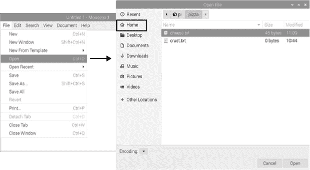

*图 B-11：在文本编辑器中打开* cheese.txt

一旦你在文本编辑器中打开了文件，你应该会看到你之前输入的文本。你可以根据需要编辑文本。然后通过**File** ▶**Save**保存更改。

除了编辑现有文件外，你还可以使用文本编辑器创建新文件。只需启动一个新的编辑器窗口（**Raspberry** ▶**Accessories** ▶**Text Editor**），然后点击**File** ▶**Save**。这将提示你将文件保存到你选择的文件夹中，并指定一个文件名。你可以编辑新文件的内容，并在需要时通过**File** ▶**Save**保存更改。如果你想用新名称保存现有文件，可以选择**File** ▶**Save As…**。

如果你更喜欢使用`nano`创建新文件，首先在终端窗口中切换到你希望保存文件的文件夹（如果需要），然后输入`nano filename`，如下所示：

```
$ nano new-file.txt
```

输入你的文本，当你退出`nano`时，它会提示你保存这个新文件。

我们刚刚介绍了在 Raspberry Pi OS 中查看、编辑和创建文本文件的方法。如果你想留在终端中，`nano`是一个不错的选择。如果你更喜欢桌面环境，那么文本编辑器 Mousepad 应该能满足你的需求。Raspberry Pi OS 还包含其他编辑器。Geany 是一款程序员使用的文本编辑器，而 Thonny Python IDE 则专为 Python 编程设计。两者都可以在**Raspberry** ▶**Programming**下找到。在本书的项目中，我会让你自行决定使用哪个文本编辑器。

你也可以通过其他方式管理你的文件和文件夹——移动文件、删除文件等。你可以通过文件管理器完成所有这些操作，或者也可以通过终端窗口来完成。下面是一些你可以在 bash 提示符下使用的命令，帮助你入门：

`**cd *folder***`   改变当前目录（文件夹）。

`**mkdir *folder***`   创建一个目录。

`**rm *file***`   删除一个文件。

`**rm -rf *folder***`   删除文件夹及其内容，包括子文件夹。

`**mv *file file2***`   重命名文件。

`**mv *file folder*/**`   将文件从一个位置移动到另一个位置。

`**cp *file folder*/**`   将文件从一个位置复制到另一个位置。
