# 第二章：触摸我，触摸你：硬件外设接口

大多数嵌入式设备使用标准化的通信接口与其他芯片、用户和外界进行交互。由于这些接口通常处于低级别，且很少对外开放，并依赖于不同制造商之间的互操作性，因此它们通常没有应用任何保护、混淆或加密。在本章中，我们将讨论一些有助于理解这些不同类型接口工作的电气基础知识。

接下来，我们将查看来自三类通信接口的示例：低速串行接口、并行接口和高速串行接口。最容易监控或仿真的是用于大多数基本通信的*低速串行接口*。需要更高性能或带宽的设备可能更难与之交互，且往往使用*并行接口*。并行接口正在迅速过渡到*高速串行接口*，即使是在最便宜的嵌入式设备上，也能可靠地运行在千兆赫范围内，但与它们交互通常需要专用的硬件。

在分析嵌入式系统时，你需要意识到需要相互通信的多个互联组件，并决定这些组件和通信通道是否可信。这些接口是嵌入式安全性中最关键的方面之一，然而，嵌入式系统设计人员常常假设攻击者无法物理接触这些通信通道，因此他们认为可以信任任何接口。这个假设给攻击者提供了一个机会，可以被动监听或主动参与，从而影响设备的安全性。

## 电学基础

在与不同种类的接口交互时，了解一些基本的电学术语非常有帮助。如果你熟悉电压、电流、阻力、反应性、电抗、感抗和电容，并且知道 AC/DC 不仅仅是澳大利亚摇滚乐队的名字，那就可以跳过这一部分。（如果你不熟悉澳大利亚摇滚乐队 AC/DC，建议你先从高电压的歌曲《Thunderstruck》开始了解。）

### 电压

*伏特*（*V*，单位为 V，得名于亚历山德罗·伏特）是电压的电学单位。它指的是*电势*，即电子从 A 点到 B 点推动的力度。可以把电线中的电压比作水管中的水压，或者说水从 A 点到 B 点推动的力度。

电压总是测量两个点之间的差值。例如，如果你拿一只万用表和一节 AA 电池，你可以测量负极和正极之间的电压，并观察到电压差为 1.5 V（如果低于 1.3 V，可能是时候换电池了）。如果你交换两个测量探针，你会看到电压差为–1.5 V。

当人们仅提及电压的某一点时，他们实际上是在谈论该点相对于所谓的*地线*的电压。地线通常是系统的公共参考；在这种情况下，地线的电压定义为 0 V。

### 当前

*安培*（*I*，单位为 A，以安德烈-玛丽·安培命名）是衡量*电流*的单位，指的是在一定时间内通过某一点的电子数量。电线中的电流类似于水管中的水流，但与其测量水流通过水管的横截面不同，在电路中，我们统计的是通过电线横截面的电子数量。其他条件相同的情况下，更高的水压意味着相同时间内更多的水流通过水管。同样，电线两端的电压越高，相同时间内通过的电流也越大。

对于人类来说，100 mA 大约是足以使心脏停搏的电流，而在嵌入式设备中，你很容易遇到数安培的电流。幸运的是，为了让电流通过人体，所需的电压需要比电子设备中常见的电压高得多。尽管两位作者都曾经经历过 110 V 电击并讲述这个故事，但这些不愉快的经历使我们建议避免触摸带电电路，即使你认为那是一个安全电压。

### 电阻

*欧姆*（*R*，单位为Ω，以乔治·西蒙·欧姆命名）是衡量*电阻*的单位，表示电子通过两个点的难易程度。继续使用水流的类比，电阻类似于水管的宽度或狭窄程度（或者水管内部可能有多堵塞）。

### 欧姆定律

电压、电流和电阻是紧密相关的。*欧姆定律*总结了这种关系：*V* = *I* × *R*，该公式指出，知道任意两个参数就能计算出第三个参数。

这意味着如果你知道电线上的电压（电势）以及电线的欧姆值（电阻），你就可以计算电线上的电流（流量）。

### 交流电/直流电

*直流电 (DC)* 和 *交流电 (AC)* 分别指的是恒定和变化的电流。现代电子设备使用来自直流电源的电力，如电池和直流电源。交流电是正弦波变化的电压（因此也是电流），通常出现在 240 V 或 110 V 电力网中，但正弦波变化的电压也用于电子设备中，例如开关电源。在本书中，我们通过设备电路中的活动变化来测量电流的变化。恒定的电流消耗是该测量的直流分量，而我们非常关注的电流变化部分，可以宽泛地称为交流分量。

### 拆解电阻

在交流电中，*阻抗*等同于直流电中的电阻。在交流电中，阻抗是由电阻和反应抗组成的复数，并且它依赖于交流信号的频率。*反应抗*是感抗和容抗的函数。

*电感*是电路对电流变化的抵抗（类似“反对”）。回到水的类比，如果水流向一个方向，那么由于流动水的动能，要将水推向相反的方向需要一些能量。在电感中，这个能量存储在流过导线的磁场中，需要一个“反向推力”才能改变电流方向。电感引起的电压与电流变化（变化）成正比。电感的单位是*亨利*，以约瑟夫·亨利命名。

*电容*是对电压变化的抗拒。考虑一个连接到水箱的竖直管道，并与一个水平管道相连，水流通过（见图 2-1）。

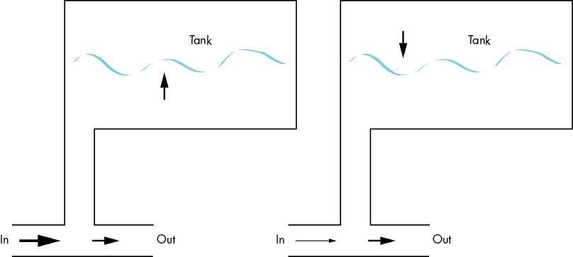

图 2-1：如果电流像水一样，那么电容器就像一个水箱。左侧是水箱在“充电”，右侧是水箱在“放电”。

当管道中有较高的输入压力时（见图 2-1，左侧），水不断流入水箱，直到水箱满。若输入压力下降，水箱开始排水，直到水空为止。这里的类比是，竖直管道中的压力与电容器上的电压相关，而水箱中的水量与电容器所储存的电荷相关。如果电容器上的电压足够高以“推高水位”，电容器将吸入电荷。如果电压太低，电容器则会“排水”并释放电荷。水箱会在其容量范围内反抗输出端的压力变化，而电容器则会反抗输出端的电压变化。电容与电气元件储存电荷的能力相关，并且它会引起与电压变化成正比的电流。电容的单位是*法拉*，以迈克尔·法拉第命名。

### 功率

功率是每秒消耗的能量，单位为*焦耳*，用*P*表示，单位是*瓦特*（*W*，以詹姆斯·瓦特命名）。在电子电路中，这种能量几乎完全转化为热量。这个过程叫做*功率耗散*，而一个给定负载的*功率公式*，即*P* = *I* × *I* × *R*，便是对此的表达。功率耗散*P*与电流*I*的平方和电阻*R*成线性关系。这被称为*静态功耗*。根据欧姆定律，我们也可以将功率公式重写为电流和电压的测量方式。因此，我们可以通过测量电路中的电流和负载两端的电压来测量功率，公式为*P* = *I* × *V*。

你可能已经观察到，当你的计算机进行大量工作时，它会变热：这是*动态功耗*。在你的 CPU 中，很多晶体管在工作时会发生切换，这需要额外的功率（而计算机会将其转换为热量，需要你将笔记本电脑从被子上移开）。数字门电路就像是带有小串联电阻的开关，每根电线大致充当一个小电容。当数字门电路驱动电线时，它需要给电容充电和放电，这需要能量。数字门从高电平到低电平再到高电平的切换速度越快，门电路的工作负担就越重，门电路通过小串联电阻消耗的功率也就越多。

本书中描述的物理现象远比我们想要阐述的要复杂，但有一点规则需要记住，因为它与侧信道分析相关：如果你将电线建模为一个电容 *C*，在频率 *f* 下将一个方波在 0 V 和 *V* 伏特之间切换，则需要的功率为 *P* = *C* × *V* × *V* × *f*。换句话说，切换速度更快、增加电压或增加电容都会增加 CPU 所需的功率，而这是我们在侧信道中可以观察到的。

## 与电力的接口

现在我们已经回顾了基础内容，接下来让我们探讨如何使用电力构建通信通道。你遇到的接口将使用不同的电气特性以实现不同的通信方式，而每种方式都有其优缺点。

### 逻辑电平

在数字通信中，通信双方交换*符号*（例如字母表中的字母）。发送者和接收者约定了一组符号来表示字母和单词。当通过电线进行通信时，电压差异对这些符号进行编码，并将它们从一侧的电线发送到另一侧。另一侧可以观察到电压变化，进而重构符号和消息。

摩尔斯电码，作为最早的通过电线传输信息的方式之一，说明了这个原理。摩尔斯电码的符号是点和划，每个符号对应一个电压级别或形状。在摩尔斯电码中，点是短暂的高电压脉冲，划是较长的高电压脉冲。

在使用摩尔斯电码进行通信时，发送者有一个按钮，接收者则有一个蜂鸣器或在纸带上写字的标记器。当发送者按下按钮时，电线连接到电源，这会在电线上产生电压差，当另一端接通电源时，蜂鸣器会发出声音。通过解码点、划和空格（即短和长的高电压脉冲）以及电线上的沉默（见 图 2-2），我们可以得出字母和单词。

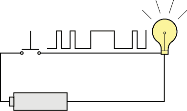

图 2-2：通过电线传输的摩尔斯电码

在现代信号方案中，符号是比特（零和一）。一个完整的通信方案可能还会使用额外的特殊符号（例如，用于表示传输的开始和结束，或帮助检测传输错误）。你可以用高逻辑电平表示“1”比特，用低逻辑电平表示“0”比特。我们可以约定，0 V 代表零，5 V 代表一。然而，由于电线的电阻，你可能在另一端看不到完整的 5 V，可能只有 4.5 V。考虑到这一点，我们约定任何低于 0.8 V 的信号为零，任何高于 2 V 的信号为一，这样给我们提供了一个较大的误差范围。如果我们改用一个输出电压只有 3.3 V 的低电压源，仍然可以进行通信，只要我们能够产生高于 2 V 的电压。

0.8 V 和 2 V 参数是我们约定的*切换阈值*。你最常见的阈值集是*晶体管-晶体管逻辑（TTL）*阈值集。TTL 这个术语通常用来表示存在一些低电压信号，其中 0 V 代表逻辑零，更高的电压（根据具体标准从 1 V 到 5 V 不等）代表逻辑一。

切换阈值的另一个原因是，尽管我们描绘了完美的电压，任何模拟系统中都会存在*噪声*。这意味着，即使发送方尝试发送完美的 5 V 信号，你也可能会在接收端看到一个在 4.7 V 和 4.8 V 之间波动的信号，看起来似乎是随机的。这就是噪声。噪声是在发送端产生的，在传输过程中从空气中捕获并在接收端测量。如果我们的切换阈值是 2 V，这种噪声就不成问题，并且结合*错误校正码*，通信仍然是可能的。问题出现在*敌对噪声*引入时：不是大自然产生的随机噪声，而是攻击者注入的噪声，使接收端误解为攻击者控制的信息。这可能会悄悄地破坏通信，除非使用*加密签名*。故障注入也可以视为敌对噪声。

你实际上可能会遇到许多逻辑阈值，它们可能并不都能相互理解（参见图 2-3）。

图 2-3 中定义了几个电压水平。VCC 是电源电压，当驱动“1”时，输出电压应介于 VCC 和 V[OH] 之间，而驱动“0”时，输出电压应介于 V[OL] 和 GND 之间。在接收端，任何介于 VCC 和 V[IH] 之间的信号应解释为一，任何介于 V[IL] 和 GND 之间的信号应解释为零。

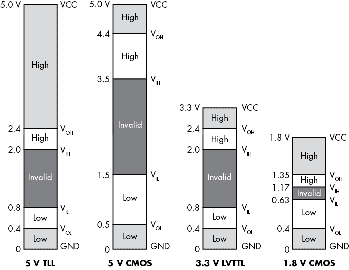

图 2-3：不同标准电压阈值。图例：VCC = 供电电压，V[OH] = 所需的最小高输出电压，V[IH] = 所需的最小高输入电压，V[IL] = 所需的最大低输入电压，V[OL] = 所需的最大低输出电压，GND = 地。

### 高阻抗、上拉电阻和下拉电阻

集成设备不像社交媒体上的朋友，似乎总是在线和连接的。有时设备实际上会“安静”下来，这在电子学中称为*高阻抗*状态（就像电阻一样，单位也以Ω为单位）。这种安静状态与 0 V 不同。如果你将 0 V 和 5 V 连接在一起，电流会从 5 V 端流向 0 V 端，但如果你将高阻抗连接到 5 V，几乎没有电流会流动。如前所述，高阻抗是高电阻的交流等效物；这就是为什么电流不流动的原因。可以将 0 V 想象成测量水洼表面压力的方式；高阻抗就像关闭水管上的水龙头。

高阻抗状态也意味着信号非常容易在高电压和低电压之间波动，甚至受到最小的干扰，比如串扰或无线电信号。有时我们称这些信号为“漂浮”；就像一滴雨水落在漂浮在空中的水压传感器上，导致其给出无意义且不稳定的读数。

为了确保设备不会将随机和错误的信号误认为有效数据，我们可以使用上拉和下拉电阻来防止这些信号“漂浮”不定。*上拉电阻*是一个将信号连接到高电压的电阻，*下拉电阻*是一个将信号连接到地或 0 V 的电阻。强上拉电阻（通常在 50 Ω到 470 Ω之间）设计用来产生强信号，需要强大的干扰信号才能覆盖它。弱上拉电阻（通常在 10 kΩ到 100 kΩ之间）会在没有其他更强信号将其拉低或拉高电压时，将信号保持在高电平。一些芯片在输入端设计了弱的内部上拉电阻，以避免信号在数字环境中漂浮。请注意，上拉和下拉电阻仅用于防止随机干扰信号被误认为是有效信号；它们不会阻止更强的有效信号被识别。

### 推拉与三态与开集电极或开漏

为了实现双向通信，甚至在一根电线上传输多个发送者和接收者，我们需要做一些额外的工作。假设我们有两个想要通信的方，以下简称为“我”和“你”。如果我只想将数据发送给你，之前使用的简单 0 V 到 5 V 的方法将完全适用。这被称为*推拉输出*，因为我将把你的输入推到 5 V，或者将你的输入拉到 0 V。你对此没有发言权，其他任何人也没有。

但是如果你现在想反向传输数据，通过相同的连接线路发送数据给我呢？我需要保持安静并进入高阻抗模式，这样你就可以有机会回应我。为了进行通信，一方必须在发送信号，而另一方则必须在接收信号。虽然这看起来很基础，但在任何通信系统中，发送和接收都需要精心设计，事实上很多人类也未完全掌握这一点。

为了进行通信，我可以处于 1 状态或 0 状态（发送信号），也可以处于高阻抗状态（接收信号），这也被称为 *Hi-Z*（阻抗用 Z 表示）或 *三态*（因为这是第三种状态）。更好的是，如果我们协调“进入三态”的时机，我们可以让多个设备通过我们的线路进行通信。这些连接的线路被称为 *总线*。总线共享线路，所有设备轮流使用这些线路。图 2-4 展示了两个设备之间的通信示意图。

在 图 2-4 的上部电路中，设备 2 控制着这条线路，因为 EN[2] = 1 且 EN[1] = 0（Hi-Z）。它在线路上设置了值 *B*，设备 1 然后读取到这个值。下面，设备 1 发送 *A*，因为 EN[1] = 1 且 EN[2] = 0（Hi-Z）。

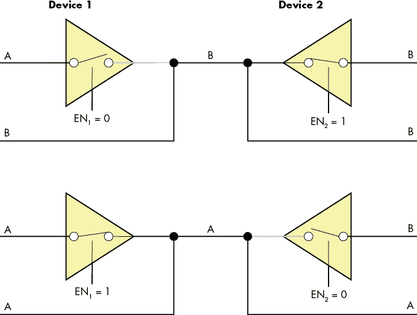

图 2-4：通过三态缓冲器通信的两个设备

*开路集电极* 和 *开漏* 是指将晶体管连接到线路的不同方式。与具有 0 和 1 输出的晶体管不同，开路集电极晶体管有 0 和 Hi-Z 状态。如果我们将多个晶体管的集电极输出连接到一根线路并使用一个上拉电阻，那么这些连接的集电极中的任何一个都可以将线路拉低到 0 V，从而通过公共线路向下一个输入发送一位信息。在信号发送时，其他集电极应保持在 Hi-Z 状态，整个信号必须与其他集电极的输出保持同步。这项技术使得通过晶体管进行通信成为可能。

### 异步 vs. 同步 vs. 嵌入式时钟

在我们的 TTL 通信示例中，我们略过了一个方面——*时钟信号*。如果我们交替地在线路上输出 0 V 和 5 V，如何区分像 10101 和 10010111 这样的 1 和 0 序列呢？它们看起来都会像 1 V，0 V，1 V，0 V，1 V，因为重复的信号看起来就像是一个信号。

当我们使用 *异步* 通信时，我不会电气化地告诉你何时期待数据。到某个时刻，我会开始发送数据。如果我确实想通过异步线路清晰地向你发送 10010111，我们需要提前约定好 *数据传输速率*，即我会以什么样的速率发送信号给你。数据传输速率规定了我将保持信号高电平或低电平的时间，以表示一位数据。例如，如果我规定每秒钟发送一位数据，你就知道 0 V 持续一秒表示 0，而 0 V 持续三秒表示 000。

*同步*通信是我们共享一个时钟，使我们能够同步传输比特的开始和结束，但有许多不同的方法可以共享时钟。

*通用时钟*意味着在我们的系统中有一个普遍的节拍器在某处滴答作响——一个我们都遵循的时钟。在这个意义上，时钟也由电信号携带：高电压的*滴答*和低电压的*嘀嗒*。当时钟滴答时，我将通信线路设为 5 V。当它嘀嗒时，你读取 5 V 并解码为“1”。当时钟再次滴答时，我可以保持线路为 5 V，而在第二个嘀嗒时，你就知道我已经发送了“11”。如果系统中的不同接口需要不同的时钟速度，这会变得复杂。

*源同步时钟*对于接收方来说是相同的，但与通用时钟不同，发送方设置节拍器。如果我是发送方，在设置值之前我会滴答一下，然后在完成时嘀嗒一下。你在另一端监听，每次我嘀嗒时检查值。源同步时钟的一个好处是，如果我没有要说的话或需要一些时间来组织我的比特，我可以暂停时钟。你，以你那机器般无限的耐心和顺从，将等一个永恒，直到我准备继续。通用时钟和源同步时钟的缺点是，你需要在芯片上额外增加引脚，在电路板上增加额外的线缆来传输时钟信号。

*嵌入时钟*或*自时钟*信号将数据和时钟信息包含在同一个信号中。我们可以使用更复杂的模式来表示时钟信息，而不是直接说 5 V 代表 1，0 V 代表 0。例如，图 2-5 展示了*曼彻斯特编码*如何定义 1 为从高电压到低电压的过渡，0 为从低电压到高电压的过渡。

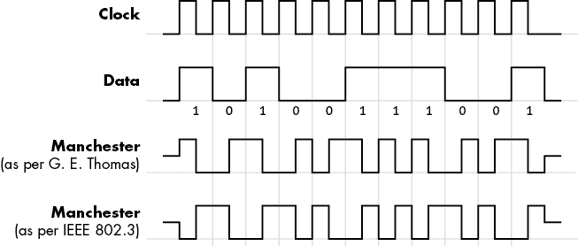

图 2-5：曼彻斯特编码示例，它将数据和时钟结合在一个信号中

每一个通过等时间间隔传输的比特都会在中间包含一个转换，允许接收方恢复时钟。

### 差分信号

到目前为止，我们讨论的一切都涉及*单端信号*，这意味着我们使用一根线来表示一串 1 和 0。这种设计简单，并且在低速和简单设备下效果很好。如果我开始将单端信号传输到你，频率达到 MHz 范围，你将不再看到具有明确高低电压的方波，而是开始看到带有圆滑边缘的高低电平，最终你将很难分辨高电平和低电平，就如图 2-6 所示。

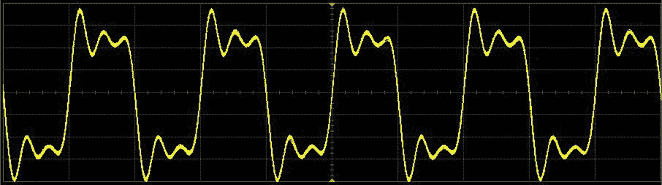

图 2-6：高频率下失真方波

这些边缘现象被称为*振铃效应*，它们是由传输线的阻抗和电容引起的。振铃效应使信号变得不那么清晰数字化，并引入了模拟变化的因素。在适当的条件下，电线的长度可以充当天线，接收环境噪声，从而将模拟变化引入本应为纯数字信号的信号中。

*差分信号*是一种利用信号的模拟特性并将其用于抵消噪声和干扰的方式。我不使用一根电线，而是使用两根电线来传输反向的电压水平：当一根电线电压升高时，另一根电线电压下降，反之亦然。这样做的原因是，如果我将两根电线紧挨着放置，它们将遭受来自外部源的相同干扰，这种干扰在两根电线上的表现将相同，因此它们之间不会发生反向变化。在接收端，我只需将一个信号减去另一个信号，以抵消信号中的模拟部分，保留原始的数字信号。如果我配备了差分发射器，而你配备了差分接收器，我们可以通过一对电线以 GHz 的数据速率进行轻松通信，而不是通过一根电线在 MHz 范围内进行通信。

到目前为止，我们已经描述了多种不同的方式，通过电气层面使用电线来传输和接收数据。如果这些知识并没有完全掌握，也不要担心。尽管理解和与系统中不同接口的交互并不依赖于这些知识，但了解为何需要以不同的方式在各个接口之间进行交互将会有所帮助。这也有助于你确定如何处理可能遇到的新协议。

## 低速串行接口

如果我们告诉你，通过连接仅三根电线，你就可以访问大量嵌入式系统的根文件系统，你会相信吗？（根文件系统包含对系统操作至关重要的文件和目录。）如果我们告诉你，你只需四根电线就可以获得设备固件的完整副本呢？你只需要花费 30 美元或更少（不包括计算机）就能做到。这些攻击依赖于你与目标设备之间的通信能力，这种通信方法我们也将用于电源分析和故障注入，因此接下来我们来看看你需要了解的各种通信接口。

### 通用异步接收器/发射器串行

这种协议有多种名称——串行、RS-232、TTL 串行和 UART——但它们都指的是同一事物，仅有一些小的潜在差异。

*UART*代表*通用异步接收/发送器*（如果它同时支持同步操作，有时也称为*USART*）。请务必不要将其与*通用串行总线（USB）*混淆，后者是一个复杂得多的协议。*通用*这个词是合适的，因为它是最常见的串行接口之一，如果你在观察信号，比如通过示波器探测线路信号，它也很容易辨认。*异步*意味着它不带有自己的时钟；各方需要事先就时钟速度达成一致，如果他们打算通过 UART 进行通信。*接收/发送器*指的是，如果串行电缆中的两根线都连接，一个设备可以双向通信。

双向 UART 接口需要两根线缆（和地线），以便设备 A 和设备 B 进行通信（见图 2-7）。

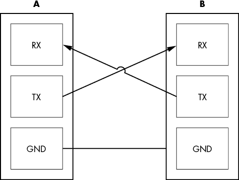

图 2-7：三根用于 UART 的线缆，连接发送（TX）到接收（RX）并连接地线

*RS-232*是最常见的 UART 标准，但它有一个有趣的怪癖。它在许多年前为通过几米长的电缆连接设备而设计，定义了逻辑一（也叫*标记*）为-3 V 到-15 V 之间的任何电压，而逻辑零（也叫*空格*）为+3 V 到+15 V 之间的任何电压。在电缆的远端，预期能够容忍+25 V 到-25 V 之间的任何电压变化，以应对电压漂移，但今天低电压系统的信号范围通常不会超出 0 V 和 3 V 之间。你可以想象，如果将一个真正的高电压 RS-232 设备直接连接到它们的逻辑电平输入，它们会非常不高兴。另一方面，这样做确实允许跨两个不同孩子的卧室进行多人*Doom*游戏。

*TTL 串行*，使用 TTL 0 V/5 V 逻辑电平，格式上与 RS-232 完全相同。这意味着你可以使用 UART 进行通信，而无需额外的电压转换芯片。你可能会看到有人指定不同的电压电平（如“3.3 V TTL 串行”），表示他们不是使用经典的 0 V/5 V 逻辑电平，而是使用 0 V/3.3 V 逻辑电平。

UART 协议相对直接。回到我们的双向通信场景，如果我空闲时，我将持续传输逻辑一（标记）。当我准备发送一个字节的位时，我会从逻辑零“起始位”开始，以表示传输的开始。接下来，我将传输其余的位，每个字节中的最低有效位先发送。（*字节*是位的分组。）我可以选择在字节中包含奇偶校验信息，以便于错误检测。最后，我可以发送一个或多个逻辑一的“停止位”来表示字节的结束。为了使你能正确解释我的传输，我们需要就以下几个参数达成一致：

1.  波特率：我将传输的比特每秒数量，你将接收的比特每秒数量。

1.  字节长度 字节中的位数。现在几乎普遍为八位，但 UART 支持其他长度。

1.  校验位 N 表示没有校验位，E 表示偶校验，O 表示奇校验——校验位作为一种错误检测措施，用于指示字节中 1 的总数是偶数还是奇数。

1.  停止位 停止信号位的长度，通常为 1、1.5 或 2。

例如，如果我指定了 9600/8N1，你应该期望看到 9600 比特每秒、8 位字节、没有校验位和一个停止位（见图 2-8）。

从电气层次上升到逻辑层次后，一旦你连接了 TX、RX 和地线，并且将串行电缆连接到系统上，你可以像对待任何其他字符生成设备一样处理这个连接。在*nix 操作系统中，连接表现为 TTY 设备；在 Windows 操作系统中，它表现为 COM 端口。

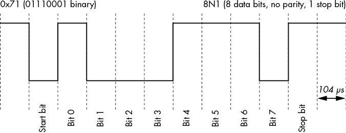

图 2-8：使用 9600/8N1 的 UART 传输字节 0x71/位 0b01110001 的示例

虽然 UART 最常用于嵌入式设备上的调试控制台，但它也常用于与通信设备接口。一些带有蜂窝通信功能的手机或嵌入式系统使用 UART 协议与蜂窝无线电进行通信，采用为调制解调器控制开发的 Hayes AT 命令集。许多 GPS 模块通过 NMEA 0183 进行通信，这是一种文本协议，依赖 UART 作为数据链路层。

### 串行外设接口

*串行外设接口（SPI）*是一种低引脚数的控制器-外设、源同步的串行接口。通常，它包含一个总线上的*控制器*和一个或多个*外设*设备。而 UART 是对等接口，SPI 是控制器-外设接口，这意味着外设仅响应控制器的请求，不能发起通信。此外，与 UART 不同，SPI 是源同步的，因此 SPI 控制器将时钟信号传输给外设接收器。这意味着外设和控制器无需事先约定波特率（时钟频率），因为时钟信号已经提供。SPI 通常运行速度比 UART 协议快得多（UART 通常运行在 115.2 kHz；SPI 通常运行在 1–100 MHz）。

图 2-9 展示了 C（控制器）与 P（外设）之间 SPI 通信的四根信号线——SCK（串行时钟）、COPI（控制器输出外设输入）、CIPO（控制器输入外设输出）和*CS（芯片选择）*，以及 GND（地线）。

正如你从引脚图名称中可能注意到的那样，没有传输和接收引脚的歧义或交换，因为无论哪一方都有明确的控制器和外设。从电气角度看，所有 SPI 输出都是推挽型的，这没有问题，因为 SPI 接口设计为只有一个控制器在总线上。

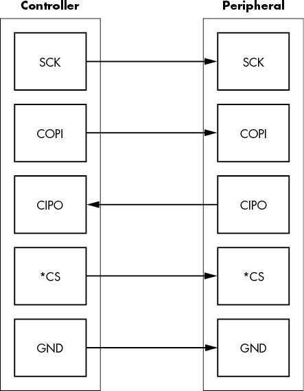

图 2-9：SPI 的四根信号线，以及地线

*芯片选择*引脚标有星号（*CS），表示它是低有效的，即高电压为假，0V 为真。如果你是 SPI 接口上的外设设备，你需要安静地待在高阻抗模式下，直到我通过将其设置为 0V 来激活*CS*。此时，你需要监听 SCK 和 COPI 以接收命令，只有当轮到你时，才能在 CIPO 引脚上做出响应。

拥有*CS 引脚*的一个优点是，作为控制器，我实际上可能有几个不同的*CS 引脚*，每个外设一个。由于在选择*CS 引脚*之前你需要保持在高阻抗模式，因此其他外设可以共享 SCK、COPI 和 CIPO 引脚。这允许在每个外设只增加一根额外的*CS 引线*的情况下，向单个控制器添加更多的 SPI 外设设备。

SPI 最常用于与 EEPROM 接口。几乎每台个人计算机上的 BIOS/EFI 代码都存储在 SPI EEPROM 中。许多网络路由器和 USB 设备将它们的整个固件存储在 SPI EEPROM 中。SPI 非常适合不一定需要高速或频繁交互的设备。环境传感器、加密模块、无线电收发器和其他设备都可以作为 SPI 设备使用。

你可能会注意到，一些设备仅使用*串行数据输出（SDO）*和*串行数据输入（SDI）*的标记。这种标记明确了给定设备的引脚是输出还是输入（没有混淆控制器或外设的角色），但无论引脚名称如何，协议通常是相同的。你还可能会发现一些设备使用 MOSI 代替 COPI，MISO 代替 CIPO，SS 代替 CS，分别指代主设备/从设备术语。

### Inter-IC 接口

*Inter-IC 接口*，也叫 IIC、I2C、I²C（发音为“I-square-C”）、两线（TWI）和 SMBus，是一种低引脚数、多控制器、源同步总线。多种名称的出现主要是由于一些细微差异和商标问题。I²C 曾是一个注册商标，因此各公司为同一总线使用了不同的名称。你会发现 I2C 在大多数方面与 SPI 非常相似，并且你可能会发现相同的设备使用 SPI 或 I2C 接口。

然而，你可能会注意到，I2C 是“多控制器”的，而 SPI 是“控制器-外设”的。图 2-10 有助于澄清这一点。

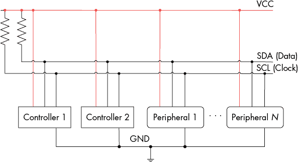

图 2-10：用于控制器和外设之间 I2C 通信的两根线

完整的“总线”由两根线组成：SDA 和 SCL。每根线连接到所有连接到总线的 I2C 端口的 SDA 或 SCL 引脚。每根线都有一个单独的上拉电阻。一个未激活的 I2C 端口会将 SDA 和 SCL 引脚置于高阻抗模式。这意味着如果没有其他设备在通信，两个线路将处于逻辑一状态，任何设备都可以通过拉低 SCA 线来接管总线。一个 I2C 设备可以仅作为控制器、仅作为外设，或者在不同时间点充当控制器或外设。

假设你和我在 I2C 总线上是两个总线控制器，连接到一个 I2C 外设 EEPROM。如果我们想访问 EEPROM，我们检查 SDA 和 SCL 线的状态。如果它们都处于逻辑一状态，总线未被使用，我可以通过发送一个 START 条件来控制总线（即，将 SDA 设置为 0，而 SCL 保持为 1）。此时，你需要站到一边，等待我完成总线操作。我会通过发送一个 STOP 条件来发出信号，将 SDA 设置为 1，而 SCL 保持为 1。图 2-11 显示了 SCA 和 SCL 线上 STOP 条件的情况。

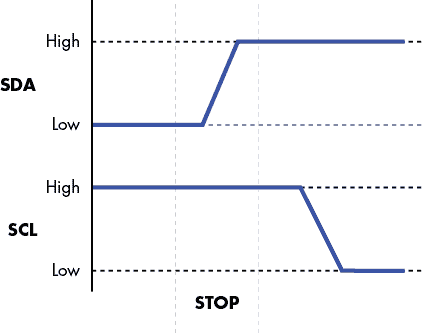

图 2-11：I2C 线上 SDA 和 SCL 的 STOP 条件

一旦我控制了总线，你、EEPROM 和其他所有设备都必须静静等待，直到我发送出地址。

每个设备都有一个独特的 7 位地址。通常，几位是硬编码的，其余的可以通过闪存或上拉/下拉电阻进行编程，以区分连接到同一 I2C 总线的多个相同组件。7 位地址之后是一个读写位，用于指示下一个字节数据的传输方向。为了从 EEPROM 读取数据，我首先告诉 EEPROM 我想从哪个内存地址读取（这是一个写操作——即第八位为 1），然后我必须告诉 EEPROM 发送该内存位置的数据（这是一个读操作——即第八位为 0）。每传输完一个字节，接收方必须确认该字节。发送方释放 SDA 线，控制器切换 SCL 线。如果接收方接收了所有八位，它应该在此期间将 SDA 线设置为零。图 2-12 显示了在整个交易过程中 SDA 和 SCL 随时间变化的情况。

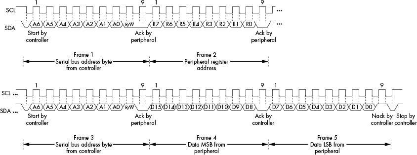

图 2-12：I2C 读取寄存器序列

一个完整的 SCA 序列在控制器设备和 EEPROM 之间如下所示：

1.  **开始序列**：控制器告诉其他设备保持安静，等待接收设备地址。

1.  **外设地址**：控制器发送它想要读取的 EEPROM 的 7 位设备地址。

1.  **R/*W 位**：控制器发送零，因为我们首先需要写入 EEPROM 内存地址。

1.  **确认**：控制器释放 SDA，并期望 EEPROM 通过将 SDA 置为 0 来信号接收到设备地址。

1.  **EEPROM 地址**：控制器发送 8 位字节，即 EEPROM 内存地址。

1.  **确认**：控制器释放 SDA，并期望 EEPROM 通过将 SDA 置为 0 来信号化接收内存地址。

1.  **启动序列**：控制器重复启动序列，因为它现在想要读取数据。

1.  **外设地址**：控制器重新发送 7 位 EEPROM 设备地址。

1.  **R/*W 位**：控制器发送一个 1，因为它现在想从刚设置的内存地址读取数据。

1.  **确认**：控制器释放 SDA，并期望 EEPROM 通过将 SDA 置为零来信号化接收设备地址。

1.  **EEPROM 数据**：当控制器切换 SCL 时，EEPROM 会将 8 个数据位从内存地址通过 SDA 发送到控制器。

1.  **确认**：控制器将 SDA 置为零，以确认它已接收到该字节。

1.  **重复**：只要控制器继续切换 SDA 并在正确的时间确认，EEPROM 将继续向控制器发送连续的数据字节。当读取足够的字节后，控制器会发送一个非确认（NACK）来通知外设。

1.  **停止序列**：控制器告诉所有人它完成了，给其他设备轮流使用总线的机会。

在整个过程中，控制器切换 SCL 以同步它与外设的通信。

这个多控制器总线的一个大优点是，它只需要两根线，无论有多少设备共享该总线。一个缺点是，由于只有一个上拉电阻，并且所有设备必须始终监听这条线，因此由于数据吞吐量需要在多个设备之间分配，有效的最大吞吐量必须低于 SPI 能够通信的设计速度。因此，你更可能在大于 1 MHz 的总线速度下找到只有 SPI EEPROM，而大多数其他设备同样可能拥有普通 SPI 或 I2C 接口。

由于只需要两根线，I2C 可以被广泛应用于各种硬件中。例如，VGA、DVI 甚至 HDMI 连接器都使用 I2C 来读取显示器的数据结构，该结构描述了显示器的输出能力。在大多数系统中，甚至可以通过软件访问这个 I2C 总线，以便在你想通过空闲的 VGA 端口将辅助设备连接到系统时使用。

由于 I2C 是一个多控制器总线，跳到 I2C 总线并作为控制器工作是完全没有问题的，而这一点在 SPI 总线上并不总是能够按预期工作。

### 安全数字输入/输出和嵌入式多媒体卡

*安全数字输入/输出 (SDIO)* 使用物理和电气*SD 卡*接口进行 I/O 操作。*嵌入式多媒体卡（eMMC）*是表面贴装芯片，提供与存储卡相同的接口和协议，但无需插槽和额外的包装。MMC 和 SD 是两个紧密相关且重叠的规范，在嵌入式系统中非常常见用于存储。

SD 卡与 SPI 向后兼容。只要你将我们之前讨论的 SPI 引脚连接到任何 SD 卡（大多数 MMC 卡也是如此），你就可以读取和写入卡上的数据。

SD 通过用双向控制和数据线替换 COPI 和 CIPO 线路来修改 SPI。SD 还从这两条线路扩展，增加了两条或四条双向数据线的模式。eMMC 进一步扩展了这两条或四条线路，增加了八条双向数据线，而 SDIO 通过使用接口与除存储设备外的其他设备进行交互，进一步扩展了基本的低级协议，并添加了中断线。

在这些规范的逐步迭代过程中，一个低 ly 的 1 MHz、1 位 SPI 总线已经扩展到最多 8 位并行位和高达 208 MHz 的时钟。它可能不再是一个“低速串行总线”，但方便的是，几乎所有设备都向后兼容，当你可以以低速 SPI 运行时，仍然可以使用低成本的嗅探器从这些设备中提取有用信息。对于仍然支持 SPI 的各种存储卡，表 2-1 显示了 MMC、SD、miniSD 和 microSD 卡的 CS、COPI、CIPO 和 SCLK 引脚位置。

表 2-1：MMC、SD、miniSD 和 microSD 卡的 SPI 通信引脚排列（来自[`en.wikipedia.org/wiki/SD_card`](https://en.wikipedia.org/wiki/SD_card)，CC-BY 3.0 许可）

| **MMC** **引脚** | **SD** **引脚** | **miniSD** **引脚** | **microSD** **引脚** | **名称** | **I/O** | **逻辑** | **描述** |
| --- | --- | --- | --- | --- | --- | --- | --- |
| 1 | 1 | 1 | 2 | nCS | I | PP | SPI 卡选择 [CS]（负逻辑） |
| 2 | 2 | 2 | 3 | DI | I | PP | SPI 串行数据输入 [COPI] |
| 3 | 3 | 3 |  | VSS | S | S | 接地 |
| 4 | 4 | 4 | 4 | VDD | S | S | 电源 |
| 5 | 5 | 5 | 5 | CLK | I | PP | SPI 串行时钟 [SCLK] |
| 6 | 6 | 6 | 6 | VSS | S | S | 接地 |
| 7 | 7 | 7 | 7 | DO | O | PP | SPI 串行数据输出 [CIPO] |
|  | 8 | 8 | 8 | NC nIRQ | . O | . OD | 未使用（存储卡） 中断（SDIO 卡，负逻辑） |
|  | 9 | 9 | 1 | NC | . | . | 未使用 |
|  |  | 10 |  | NC | . | . | 保留 |
|  |  | 11 |  | NC | . | . | 保留 |

你可以看到，基本引脚在它们之间是共享的，这意味着设备被命名为 SD 卡、microSD 卡、MMC 或 eMMC 设备，实际上声明了设备协议和性能的上限。对于大多数我们要做的硬件工作，我们可以以相同的方式与设备交互，因为我们不关心最高性能。图 2-13 显示了与表格对应的物理引脚位置。

你会注意到标准之间有一些物理对齐，例如将 MMC 卡插入 SD 卡读卡器时，仍然能接触到引脚 1–7。如果你直接与 miniSD 卡接口，也要注意 miniSD 的奇数编号，因为引脚 10 和 11 位于引脚 3 和 4 之间！

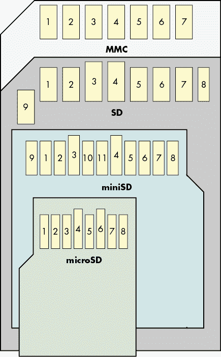

图 2-13：物理位置与表 2-1 中所示的 SPI 引脚对应

### CAN 总线

许多汽车应用使用*控制器局域网络（CAN）*总线来连接与传感器和执行器通信的微控制器。例如，方向盘上的按钮可能通过 CAN 发送命令到车载音响系统。你还可以通过 CAN 读取实时引擎数据和诊断信息，这意味着你可以通过被入侵的蜂窝连接访问汽车微控制器，从而访问发动机控制。例如，参见 Dr. Charlie Miller 和 Chris Valasek 的“未修改的乘用车远程利用”一文。我们曾经玩弄过电动自行车显示屏和电机控制器之间的通信，结果发现它也使用了 CAN。

CAN 使用差分信号传输，因为汽车的电气环境嘈杂，并且稳健性是一个重要的安全要求。CAN 有几种变体，但主要的有高速和低速容错 CAN。两者都使用一对差分信号线，分别称为 CAN 高电平和 CAN 低电平，但这些线的名称与低速或高速 CAN 无关。相反，差分信号是通过两个 CAN 引脚传输的，这些名称与用于表示逻辑 1 或逻辑 0 的电压电平相对应：

+   高速 CAN 的比特率从 40Kbps 到 1Mbps，使用 CAN 高电平 = CAN 低电平 = 2.5 V 表示逻辑 1，CAN 高电平 = 3.75 V 和 CAN 低电平 = 1.25 V 表示逻辑 0。

+   低速 CAN 的比特率从 40Kbps 到 125Kbps，使用 CAN 高电平 = 5 V 和 CAN 低电平 = 0 V 表示逻辑 1，CAN 高电平 ≤ 3.85 V 和 CAN 低电平 ≥ 1.15 V 表示逻辑 0。

这些电压是针对理想情况规定的，实际情况中可能有所不同。一种名为*CAN 灵活数据速率（FD）*的 CAN 更新版本将速度提高至 12Mbps，同时还将单个数据包中传输的最大字节数增加至 64。

### JTAG 及其他调试接口

*联合测试行动小组（JTAG）*是一个常见的硬件调试接口，对安全性至关重要。JTAG 制定了 IEEE 1149.1 标准，名为《标准测试接入端口与边界扫描架构》。其目标是规范化测试/调试芯片以及测试印刷电路板（PCB）制造缺陷的一种方式。本书无法全面覆盖 JTAG，但我们将提供概述，供你查找其他资源。

为什么需要进行这种测试或调试？随着 1980 年代多层 PCB 的广泛应用，制造厂中测试刚生产出来的 PCB 的需求变得愈加迫切，同时又需要避免将内层暴露给外界。工程师们想出了一个方法，利用 PCB 上现有的芯片来测试连接。

当你执行 *边界扫描* 时，你基本上会禁用每个芯片的实际功能，而启用通过测试设备对每个芯片引脚的控制。例如，如果芯片 A 的第 6 引脚连接到芯片 B 的第 9 引脚，你可以让芯片 A 将第 6 引脚设置为低电平然后再设置为高电平，然后你可以在芯片 B 的第 9 引脚上观察该信号是否真正到达。将此扩展到所有芯片和所有引脚，你可以通过使用 JTAG 引脚将所有芯片级联在一起，从而验证 PCB 的正确制造。要正确执行边界扫描，你需要一个定义所有级联芯片的文件，这些定义通常在 *边界扫描描述语言（BSDL）* 文件中指定。如果你幸运的话，可以在网上找到这些芯片定义。

边界扫描让你接触到 PCB，而不是芯片本身，因此在你尝试访问 PCB 内层时，它是一个有用的选择。从技术上讲，你可以做一些有趣的事情，比如切换 SPI 或 I2C 引脚，并通过 JTAG 进行这些协议的通讯，但这会非常慢，所以你最好实际连接到 SPI 或 I2C 的线路上。使用边界扫描足够快，可以查看 UART 或其他低速流量，如果你在采样模式下使用 JTAG，它是被动运行的，也就是说，它不会控制芯片，芯片仍然正常工作。

给定 BSDL 文件的设备端口引脚切换工具是存在的；一些知名的例子包括 UrJTAG（开源）和 TopJTAG（低成本并提供免费试用，基于 GUI）。这些工具对于 PCB 反向工程非常有帮助，因为你可以切换芯片的某个引脚并观察在 PCB 上发生的情况。你还可以驱动网络或将已知模式映射到芯片引脚上。图 2-14 显示了使用 TopJTAG 查看串行数据波形的例子。

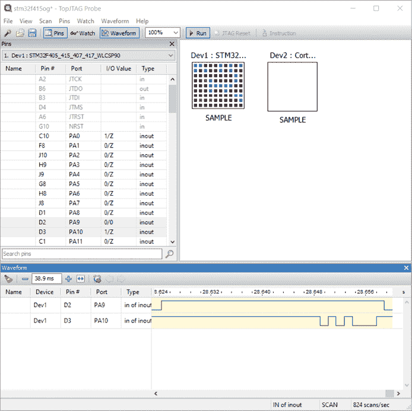

图 2-14：使用边界扫描检查一个我们无法轻易探测的小型 BGA 设备

一个名为 JTAG Boundary Scanner 的开源工具，由 Viveris Technologies 提供，提供了一个简单的库以及一个 Windows GUI，用于基于从 BSDL 文件中学习的引脚名称访问引脚。如果你希望自动化更复杂的任务，例如记录上电序列或通过 JTAG 发送 SPI 命令，JTAG Boundary Scanner 工具是一个很好的起点。它也是开源 pyjtagbs（[`github.com/colinoflynn/pyjtagbs/`](https://github.com/colinoflynn/pyjtagbs/)）Python 绑定的基础，允许你通过 JTAG 端口执行类似功能。

如果使用边界扫描模式，你可以选择运行一个`SAMPLE`指令，这个指令可以让你查看 I/O 引脚状态，或者运行一个`EXTEST`指令，允许你控制 I/O。通常，`EXTEST`指令可能会禁用其他功能（如 CPU 核心），所以如果你尝试检查一个正在运行的系统，应该在`SAMPLE`模式下使用边界扫描工具。

更多以芯片为中心（不仅仅是 I/O 引脚）的控制通过 JTAG *测试访问端口（TAP）*控制器进行，它提供了片上调试能力。好消息是它在一定程度上是标准化的；坏消息是这种标准化程度相当低。基本上，TAP 控制器可以执行 IC 复位并从两个寄存器中读写数据：*指令寄存器（IR）* 和 *数据寄存器（DR）*。调试功能，如内存转储、断点、单步执行等，是在这个标准接口之上的专有附加功能。很多这类功能已经被逆向工程，并且可以在软件中使用，例如 OpenOCD。这意味着，如果你有一个支持的目标，你可以将 OpenOCD 连接到 JTAG 适配器，然后使用 GDB 连接到 OpenOCD 并调试 CPU！

JTAG 使用四到六个引脚：

+   **测试数据输入 (TDI)** 将数据传输到 JTAG 串联链中。

+   **测试数据输出 (TDO)** 从 JTAG 串联链中输出数据。

+   **测试时钟 (TCK)** 为 JTAG 链上的所有测试逻辑提供时钟。

+   **测试模式选择 (TMS)** 选择所有设备的操作模式（例如，边界链操作与 TAP 操作）。

+   **测试复位 (TRST，可选)** 复位测试逻辑。另一种复位方法是将 TMS 保持为 1，持续五个时钟周期。

+   **系统复位 (SRST，可选)** 复位整个系统。

JTAG 有几个标准的头接口。例如，ARM 有一个标准的 20 引脚连接器。你也可以通过追踪怀疑的芯片 JTAG 引脚来识别 JTAG。如果你不确定一组引脚是否是 JTAG，可以尝试像 Joe Grand 的 JTAGulator 这样的工具，它使用巧妙的算法来识别每个 JTAG 引脚。（我们在附录 B 中给出了几个这些头接口的示例。）

你可能会想，是否完全调试访问 CPU 会非常不安全。答案是肯定的。这就是为什么注重安全的制造商会做各种事情来禁用 JTAG，而这些措施让攻击者需要做更多的工作才能攻击系统（参见表 2-2）。

表 2-2：JTAG 端口禁用措施与攻击概述

| **JTAG 保护措施** | **保护措施攻击** |
| --- | --- |
| 移除 PCB 连接器。 | 将连接器重新焊接到 PCB 上。 |
| 移除 PCB 路径。 | 直接将线缆连接到 CPU 上的 JTAG 引脚，这对于不直接暴露引脚的芯片封装来说会稍微复杂一点。 |
| 禁用 JTAG 以确保安全操作。一个例子是 ARM 核心上的 SPIDEN 输入信号，它可以禁用安全世界的调试。另一个单独的输入信号 SPNIDEN 可以禁用普通世界的调试。 | 如果这些 CPU 信号通过封装引脚引出，将其拉高。 |
| 使用芯片中的 OTP 熔丝配置，烧录后禁用 JTAG。 | 对熔丝读取或影像寄存器进行故障注入。 |
| 在启用 JTAG 之前，先对其设置授权协议。 | 如果使用挑战/响应协议或授权失败，则对加密密钥的旁路通道进行攻击。 |

在这一系列 JTAG 防御和攻击措施中，注意到 JTAG 并不是你会看到的唯一调试接口。其他调试接口的制造商包括使用 Atmel AVR 协议（基于 SPI 协议）的协议，使用 Atmel XMEGA 协议（Atmel 的程序和调试接口，或称 PDI，这类似于 SPI，但只有一条数据线），以及 TI Chipcon 系列的协议。

你还会发现一些接口仅支持芯片内调试模式，而不支持 JTAG 边界扫描模式（或反之亦然）。例如，Microchip SAM3U 有一个名为 JTAGSEL 的物理引脚，用于选择 JTAG 端口的运行模式，是芯片内调试模式还是边界扫描模式。如果你想使用非默认模式，可能需要修改电路板以将该引脚拉至所需电平。你还可能发现某些设备禁用了 JTAG 调试模式，但仍然启用了 JTAG 边界扫描模式。这并不是直接的安全漏洞，但边界扫描模式对于各种逆向工程工作非常有用。从技术上讲，你可以在边界扫描模式下做的任何事情，通过探测物理 PCB 也能做到（这就是为什么启用边界扫描模式不是一个安全问题），但是使用这种模式会让你的工作变得更加轻松。

我们在第一章介绍了基于 ROM 的引导加载程序。在某些情况下，你可以使用这些引导加载程序进行编程，有时它们也提供调试支持，允许你读取内存位置。

## 并行接口

低速串行接口并不总是能够满足需求。如果你只需要在启动时加载 4MB 的压缩固件，它们是合适的，但如果你有一个 128MB 可写的文件系统，或者想要一个低延迟的外部动态 RAM（DRAM）接口，串行总线就无法提供合理的性能。提高接口的时钟频率是有实际限制的，而且你仍然需要在使用数据之前对其进行反序列化。使用多个数据线并行传输是一种更具可扩展性的方法。铺设 8 根或 16 根电线能为内存访问或快速存储提供更多带宽。并行总线的主要应用之一就是内存。

图 2-15 中展示了来自 i.MX6 Rex 板的摘录，图中显示了从芯片到外部 DRAM 的多个并行总线线。

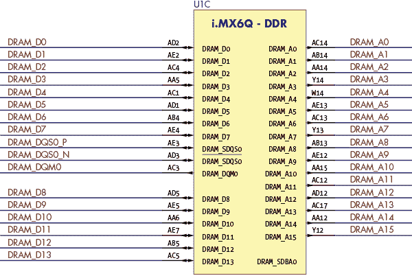

图 2-15：来自 i.MX6 Rex 开源板的摘录

看看连接到双倍数据速率（DDR）内存总线的引脚布局？许多数据和地址线（分别标记为 DRAM_D 和 DRAM_A）也有显示。

### 内存接口

与串行接口不同，串行接口你只需连接两到四根电线，然而并行总线可能包含多个地址、数据和控制信号线。例如，你可能会发现一个闪存芯片，具有 24 根地址位、16 根数据输入/输出位和 8 根或更多的控制信号线。你会面临比串行接口更复杂的探测工作；对于真正勇敢的人，DDR4 有 288 根引脚。因为各种标准存在于比特率、引脚/电线分配等方面，事先研究你的目标是非常有帮助的（参见第三章）。你将主要遇到作为并行总线实现的内存接口，无论是用于 DRAM 还是闪存，如图 2-15 中 DDR 接口的示例所示。

有几种连接电路中并行接口的选项。如果引脚间距足够宽，你可能可以使用几打抓取探头和一堆乱七八糟的电线连接到逻辑分析仪或通用编程器（参见附录 A 以了解示例供应商）。但通常情况下，当设备引脚较多时，引脚会变得更小并且被布线到 PCB 的内部层。大多数芯片有标准尺寸，虽然它们可能比较昂贵，但你可以为大多数设备购买在电路板上直接夹取的夹子。与不那么密集的组件夹子不同，这些夹子通常配有一个柔性印刷电路带，它将所有电路引出到一个独立的拆解板上，你可以将其适配到分析仪或编程器上。

只要你能接触到引脚，应该就能想办法将它们连接起来。如果逻辑分析仪足够快速，它可以让你捕捉所有通过接口的流量进行后续分析，并且只需进行被动分析。

如果你需要对接口进行完全控制，并且无法将其从系统的其他部分隔离，或者如果你的目标设备是一个没有可访问引脚的球栅阵列（BGA）封装，你可能需要将芯片从电路板上拆下来才能读取或写入数据。拆焊并更换设备而不损坏任何组件肯定不是万无一失的，而且听起来可能并不容易，但通过实践（或有才华的朋友的帮助），你可以在相对较低的失败风险下可靠地完成这一操作。（第三章进一步详细讲解了闪存芯片的读取，附录 A 列出了一些有用的工具。）

## 高速串行接口

我们已经讨论过，布置八倍数量的信号线比稳定地运行一根线并以八倍速率传输数据更容易。虽然“高速串行接口”这个术语听起来似乎有些矛盾，但实际上并非如此。在前面的章节中，我们描述了单端信号，而在本章早些时候，我们提到过在某些情况下，差分信号能够在 GHz 范围内稳定运行，而单端信号只能限制在几 MHz 内。

高速串行接口促进了过去十年大部分数据传输速率的提升。40 针的并行 ATA 电缆最大支持 133 MHz，但被七针的 Serial ATA 电缆取代，后者现已支持 6 GHz 的速度。具有 32 条数据线的 PCI 插槽最高支持 33 MHz 或 66 MHz，但已被支持最高 8 GHz 速度的 PCIe 通道取代。这是由几个原因造成的。

首先，对于并行信号线，你需要确保所有信号在一个时钟周期内在接收端稳定。随着频率的提高，这变得更加复杂，因为这意味着所有信号线必须具有非常相似的物理特性，如长度和电气特性。其次，并行信号线容易受到串扰的影响，这意味着一根线充当天线，邻近的线充当接收器，从而导致数据错误。相比处理并行信号线，单根信号线的这些问题影响较小，并且使用差分信号能进一步减少这些影响。

这一进展的缺点是，在 6 GHz 的差分信号上观察或注入数据，比在 400 kHz 的单端信号上要困难得多。这种困难通常意味着“更贵”。你可以轻松地嗅探到这个 6 GHz 的信号，但你需要一台价格相当于中型轿车的逻辑分析仪。

幸运的是，所有这些接口在电气特性上非常相似，并且它们被设计成即使在不理想的条件下也能可靠工作。这意味着，如果你附加到 PCIe 通道上的探头加载得太重，导致它无法以全速工作，它将自动以较低的速度重新训练，而系统的其他部分甚至不会注意到这一变化。

### 通用串行总线

USB 是第一个使用高速差分信号的外部接口，它设立了一些优秀的先例。首先，如果你将 USB 设备连接到配备不同版本 USB 标准的主机上，连接的两端会自动调节到最高的共同标准。第二，如果传输丢失、错过或中断，它们会自动重试。最后，USB 实际上定义了许多特性，比如连接器形状和引脚分配、电气协议、数据协议，一直到设备类别以及如何与之接口。例如，USB *人机接口设备（HID）* 规范用于键盘和鼠标等设备，它允许操作系统（OS）为所有 USB 键盘提供一个驱动程序，而不是为每个制造商提供一个驱动程序。

USB 连接由一个主机和最多 127 个设备（包括集线器）组成。USB 版本支持不同的比特率，从 USB 1.1 的 12Mbps，到 USB 2.0 的 480Mbps，再到 USB 3.0、3.1 和 3.2 中的 5、10 和 20Gbps。对于最高 480Mbps 的数据速率，使用四根线。超过 480Mbps 时，需要额外的五根线。所有九根线如下：

1.  VBUS 一个 5V 线路，可用于为设备提供电源。

1.  D+ 和 D- 用于通信的差分对，支持最高 USB 2.0 版本。

1.  GND Venerable ground (for power).

1.  SSRX+，SSRX-，SSTX+，SSTX- 两对差分信号，一对用于接收，一对用于发送（USB 3.0 及以上版本）。

1.  GND_DRAIN 另一个信号地；这个附加的地比电源地噪声更小，电源地可能处理更大的电流（USB 3.0 及以上版本）。

USB 的电源线提供至少 100 mA 的电流，电压为 5V，你可以从中获取电力以为设备供电。根据 USB 标准和主机的不同，这个可用电流可以达到 48V 下的 5A（5A × 48V = 240W），但在允许你使用如此多的电流之前，你实际上需要与 USB 主机进行数字通信。

现在，试试拿起最近的 USB 2.0 微型电缆，数一数引脚的数量。你会发现有五个，而 USB 2.0 只需要四个引脚。第五个引脚是 ID 引脚，最初用于 USB On-The-Go（OTG）。可以作为主机或外设使用 OTG 的设备，配有一条特殊的 OTG 电缆，电缆一端是主机端，另一端是外设端。

ID 引脚信号表示哪个端插入，因此设备可以感知其角色是主机还是外设：接地的 ID 引脚表示“主机”，浮空的 ID 引脚表示“外设”。然而，正如 Michael Ossmann 和 Kyle Osborn 在他们 2013 年的 Black Hat 演讲《复用线攻击面》中所展示的那样（[`www.youtube.com/watch?v=jYa6-R-piZ4`](https://www.youtube.com/watch?v=jYa6-R-piZ4)），你可以通过不同于“接地”或“浮空”的电阻值启用隐藏功能。他们展示了，如果你在 ID 引脚上加上 150 kΩ 的电阻，Galaxy Nexus（GT-I9250M）就会关闭 USB 功能并启用 TTL 串行 UART，从而提供调试访问。

USB 是普及的，并且已经存在了二十多年，因此它很可能是你可以像观察或操作其他许多更简单、更慢的接口一样，轻松观察或操作的高速串行接口的最佳示例。它还具有标准通信协议的优势，这意味着你可以从几乎任何 USB 设备请求特定的信息。USB 协议栈本身相对复杂，因此模糊测试通常会产生有趣的结果，而故障注入可以进一步推动这一过程。Micah Scott 有一个非常棒的演示，你可以在视频“Glitchy Descriptor Firmware Grab – scanlime:015”中看到它（[`www.youtube.com/watch?v=TeCQatNcF20`](https://www.youtube.com/watch?v=TeCQatNcF20)）。

### PCI Express

*PCI Express (PCIe)* 是旧版 PCI 总线的高速串行进化版，其架构与 USB 惊人地相似。两者都使用高速差分对来实现点对点连接。两者都有明确的层次结构和协议来枚举设备。两者都向后兼容，并自动协商最佳接口。

尽管 PCIe 最初是为个人计算机设计的，而非嵌入式系统，但目前市场上的基于 ARM 和 MIPS 的系统芯片（SoC）支持 PCIe，你可以在价格低至$20 的嵌入式系统中找到它们。与 USB 的 12 MHz 不同，PCIe 的起始频率为 2.5 GHz，因此简单的嗅探器无法应对。然而，一些 PCIe 设备足够灵活，可以启用一些意外的用途。

PCIe 的一个独特特性是它通常与 CPU 或 SoC 紧密耦合。而 USB 在没有所有相关驱动程序的情况下无法工作，PCIe 通常可以完全访问系统内存，以及所有其他 PCIe 设备和系统中的其他设备。如果你能够将一个恶意的 PCI 设备插入目标系统，你可能能够控制整个系统中的所有硬件。有关如何使用 PCIe 获取内存转储的一些示例，请参阅[`github.com/ufrisk/pcileech/`](https://github.com/ufrisk/pcileech/)。

### 以太网

以太网于 1983 年首次标准化，用于创建计算机网络。它在物理电缆、速度和帧类型方面有不同的变种，但在嵌入式系统中最常见的类型是 100BASE-TX（100Mbps）和 1000BASE-T（1Gbps），都使用熟悉的 8P8C 插头。这个插头连接到一个包含四个*双绞线*的电缆中。每对线用于差分信号传输，线对的扭绞有助于减少串扰和外部干扰。

两种标准都以 125 MHz 的线路波特率运行，这意味着如果你连接示波器，你会看到 125 MHz 的信号。100BASE-TX 与 1000BASE-T 之间的 10 倍速度差异是因为 100BASE-TX 使用+1 V、0 V 或−1 V 的单线对信号，而 1000BASE-T 则在四对线的所有信号上使用−2 V、−1 V、0 V、+1 V 和+2 V 的电平。

## 测量

没有一些基础的测量内容，任何一本硬件书籍都是不完整的。你会通过测量来更深入地了解目标，但更重要的是，理解测量将帮助你调试所有可能遇到的连接问题。让我们来看看一些基本工具——可靠的老旧万用表、炫目的示波器以及极具时尚感的逻辑分析仪——并讨论为什么以及如何使用它们，它们可能出现的问题，以及一些适合你实验室的参考资料。

### 万用表：电压

测量电压对于确定供电电压或通信电压至关重要。如果你打算使用实验室电源为芯片供电，在连接电源之前使用电压表进行检测是一个不错的确认步骤（希望你已经从设备数据手册中找到了电压值）。同样，对于通信电压，你可能需要使用*电平转换器*将 PCB 上的电压与通信接口的电压匹配。

将万用表设置为直流电压测量模式。万用表的交流电压测量模式在我们这里讨论的电路类型中并不适用。一些万用表有自动量程功能，而有些则需要你手动设置“最大量程”。对于测量 3.3V 电压，你需要将量程开关设置为大于 3.3V 的档位，因此 10V、20V 和 200V 的量程都适用。详细信息请参考用户手册。测量电压时，将黑色探头接地（通常可以将黑色探头接到机壳上，但有时那并不是地），然后测量你希望了解电压值的点与地之间的电压。

### 万用表：连续性测试

测量*连续性*可以让你判断两个点是否连接，这对于追踪 PCB 上的线路、接头、引脚等非常有用。要测量连续性，将万用表设置为欧姆档，因为接近零的电阻表示两个点是电连接的。同样，具体连接方式请参考手册。在测量电阻时，请关闭目标设备电源，这样几乎没有损坏任何元件的风险。将两个探头接触两个点，如果电阻接近零（或者听到一声响声），则表示有连接。选择一款在有连接时会发出蜂鸣声的万用表，这样你就不需要一直观察屏幕。

连续性测试是通过探头引线通电小电流并测量电压来完成的。如果你尝试测量一个仍然带电的设备，通常会得到错误的读数，因为万用表“看到”的电压实际上是由被测电路提供的。

### 数字示波器

*示波器*测量并可视化模拟信号，展示电压随时间的变化。当我们说示波器时，指的是*数字*采样示波器，因为模拟示波器不具备我们需要的功能。示波器可以测量数字通信通道（尽管逻辑分析仪是一个更合适的工具），并且通过正确的探头和目标准备，示波器能够测量功耗或电磁（EM）辐射，尤其在进行侧信道分析时。这是一个发现 PCB 模拟域中发生情况的关键工具。附录 A 从示波器功能的角度描述了示波器。在这里，我们聚焦于它们的使用。

示波器有多个*输入通道*，通过一个或多个*探头*与信号源连接，信号源可以是 PCB 上的线路或引脚、微控制器的引脚，或者只是一个用于测量电磁（EM）信号的线圈。探头通常*衰减*（降低信号源的幅度）信号，然后将信号传送到示波器。随示波器附带的探头通常是 10×衰减，并且应该在你的探头上标明。这意味着你的信号中 1 V 的差分信号，在输入示波器时将变为 0.1 V 的差分信号；不过，你的示波器探头可能可以在 1×（不衰减）和 10×（衰减）之间切换。

衰减的一个大优点是它减少了电路的负载，并提高了示波器的频率响应。使用 1×模式的示波器探头通常意味着带宽较低（无法测量高频信号），而且示波器探头的电负载可能会影响被测电路。因此，许多高性能的示波器探头都是固定在 10×模式下，因为大多数用户更倾向于使用 10×模式的高频响应优势。

任何探头都需要与示波器*阻抗匹配*。示波器会有一个*输入阻抗*（例如 50 Ω或 1 MΩ），而你的探头阻抗需要与之相同，以避免信号退化。想象两根管子连接在一起。如果其中一根管子比另一根窄得多，那么水波就无法在管子之间正确传播；部分波能量会在连接点反弹回来。在测量术语中，RG58U 探头电缆具有 50 Ω的特性阻抗，这意味着对于非常快速的变化（例如陡峭的边缘），电缆看起来像一个 50 Ω的终端。如果你将示波器保持在 1 MΩ，那么不连续性会导致边缘到达示波器时发生反射（反弹）。这会扭曲测量结果。

示波器上的阻抗可能是固定的或可配置的，而探头的阻抗是固定的。普通示波器探头设计为 1 MΩ阻抗。如果你使用的是高端（昂贵的）示波器，它们可能会自动检测所连接探头的类型。如果存在阻抗不匹配，你可能需要一个*阻抗匹配器*。一些特殊探头（例如电流探头）需要 50 Ω的阻抗，例如，如果你的示波器没有这个选项，你就需要一个这样的阻抗匹配器。

示波器和探头还将具有模拟*带宽*，以 Hz 为单位表示，代表它们能够测量的最大频率。探头和示波器不需要完全匹配，但探头和示波器的总带宽受到最低带宽组件的限制。你想要测量的信号应该在该带宽范围内。例如，在侧信道分析中，确保示波器的带宽高于加密时钟频率。（不过，这并不是硬性要求；有时加密信号会在低于时钟频率的频率下泄漏。）

你可以插入一个*低通滤波器*来人工限制带宽，这对于过滤信号中的噪声非常有用。类似地，你可以添加一个*高通滤波器*，通常用于去除直流或低频成分（例如，许多电源存在低频噪声）。根据早期测量的频率分析或目标信号的知识来选择这些滤波器。Mini-Circuits 品牌有一些易于使用的模拟滤波器；确保将它们与示波器和探头进行阻抗匹配。

你可以将示波器通道配置为交流或直流耦合模式。*直流耦合*意味着它可以测量到 0 Hz 的电压（*直流偏移*），而*交流耦合*则意味着非常低的频率会被滤除。对于侧信道分析，通常区别不大，因此交流耦合模式稍微容易一些，因为你不需要将信号居中。

现在，模拟信号进入示波器，需要使用*模拟到数字转换器（ADC）*将其转换为数字信号。这些转换器的分辨率通常以位为单位进行测量。例如，许多示波器使用 8 位 ADC，这意味着示波器的电压范围被划分为 256 个相等的*量化*范围。图 2-16 展示了一个简单的 3 位 ADC 输出示例，其中一个平滑的正弦波输入被转换为数字输出（类似于曾经流行的 8 位计算机游戏，游戏中的主角是一位意大利水管工）。

此数字输出仅具有固定值；因此，ADC 不完美地表示输入信号。误差量部分取决于分辨率；例如，如果我们有一个 8 位 ADC 而不是 3 位 ADC，那么图 2-16 输出中的“阶梯”将具有更小的步长。然而，绝对电压误差还取决于我们要求 ADC 表示的总范围。在相同的 3 位中表示的 10 V 范围（八个步骤）意味着每个位为 1.25 V，但在相同的 3 位中表示的 1 V 范围意味着每个步骤为 0.125 V。

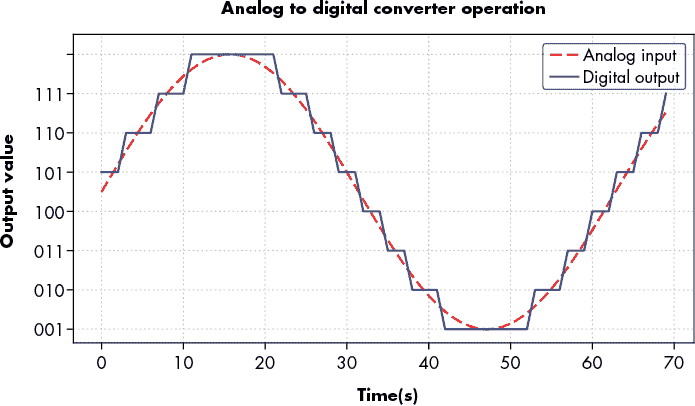

图 2-16：正弦波输入被转换为数字输出的阶跃序列。

示波器将具有最小和最大电压，由*电压范围*表示，通常是可配置的。几乎每个示波器都有一个可调的*跨度*，但有些还有可调的*输入偏移*。跨度将显示我们可以测量的最大范围；例如，10 V 跨度可能意味着我们从 -5 V 到 5 V 进行测量。如果我们有一个输入偏移，我们可以将同样的跨度移动到意味着从 0 V 到 10 V 的测量。务必配置它，使其紧贴您感兴趣的信号。如果范围太小，您将*夹*住信号，因为其电压超出范围。如果范围太大，将获得大的*量化误差*。如果您仅使用范围的 10％，则仅使用 256 个可能同值中的大约 10％。不同的示波器将具有不同的输入偏移和跨度范围。

这些 ADC 在可编程的*采样率*下运行，这意味着它们每秒输出新样本的次数。一个*样本*就是一个测量输出。通常情况下，采样率应至少是你想要捕捉的最高频率的两倍，正如奈奎斯特-香农采样定理所述。在实践中，比两倍最高频率更高的采样率效果更好；可以提高到五倍。如果您的示波器测量是*同步*到目标设备的，每个采样点发生在目标时钟周期上，您可以使用降低的采样率。

一系列样本称为*跟踪*。数字示波器具有用于记录跟踪的缓冲区，称为*存储深度*。一旦记录填满存储器，跟踪需要发送到 PC 进行处理，或者为下一次测量丢弃。

深度和采样率共同确定跟踪的最大长度。为了效率，限制跟踪长度非常重要。跟踪的长度由单个跟踪中获取的样本数配置。

示波器可以持续地进行数据测量（记录），或者也可以通过外部刺激信号来启动，这个信号称为*触发器*。触发器是一个数字信号，通过专用的触发通道或普通探头通道进入示波器。一旦示波器*激活*，它将等待触发信号超过可配置的*触发电平*，然后示波器开始测量波形。如果示波器在*触发超时*之前没有观察到高触发信号，它会认为*触发丢失*并仍然开始测量。将触发超时设置为明显的时间（比如 10 秒）是有用的。如果你看到你的*采集过程*（进行大量测量）变慢到每 10 秒钟采集一条波形，你就知道触发丢失了。最初，测量并观察*触发通道*的波形对于调试任何触发问题是非常有帮助的。

在实验室环境中，目标本身通常会生成触发信号。例如，如果你想测量一个特定的加密操作，首先通过外部通用输入/输出（GPIO）引脚拉高触发信号，然后开始操作。这样，示波器将在操作开始前就开始捕获数据。

一旦波形完全捕获，高端示波器具有内置显示功能进行可视化，而更简单的 USB 示波器则将数字信号发送到 PC 进行可视化。两者都可以将波形发送到 PC 进行分析，例如，用于查找侧信道！

就像用万用表测量电压一样，目标需要通电，因此要采取预防措施，避免伤害自己或损坏设备。同时，确保所有工具都已正确配置。示波器配置错误不总是显而易见的，因此请确保自己做好准备，避免将来花时间重新进行错误的测量。

常见错误包括未正确接地范围导线。如果使用多个探头，每个探头都应该接地，并且必须确保它们都连接到同一接地点（否则，电流将通过示波器流动）。如果需要进行高频或低噪声测量，良好的接地非常重要。许多示波器探头都有一个小的*弹簧接地*选项，如图 2-17 所示。

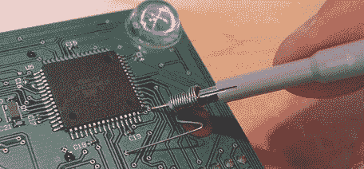

图 2-17：一个小型示波器探头上的弹簧接地导线

使用这种接地方法时，PCB 上的接地和示波器探头之间有一个小的间距。通常需要弯曲弹簧导线以适应你的 PCB，但这是一种低成本且简单的方式，能获得良好的高频性能。

在设置测量时，你还需要确保连接方式具有物理上的稳固性。悬挂在工作台上的示波器探头可能会被衣物（或任何实验室宠物）挂住，并将你昂贵的开发板和示波器一起拉下来。临时的电缆扎带、热熔胶、胶带，甚至只是重物，都是确保探头线不会被路过的人体挂住的完美方法。

尽可能地，最好在电路关闭时更改设备设置或探头位置。附加示波器探头时容易滑动，如果探头尖端短接到电源，通常会导致探头尖端的腐蚀，尤其是当形成电弧时。即使是典型开发板上的低电压，也能导致小电弧，这会损坏探头尖端。当然，短接时还可能损坏被测设备，甚至会将较高电压（如 12 V 输入电压）短接到低电压电路中。

### 逻辑分析仪

*逻辑分析仪* 是一种允许你捕捉数字信号的设备。它是示波器的数字变种。通过它，你可以捕捉并解码使用电压编码数据的通信通道。你可以使用逻辑分析仪解码 I2C、SPI 或 UART 通信，或者探测更宽的通信总线，支持各种波特率。与示波器一样，逻辑分析仪也有多个通道、采样率、电压等级，并且通常还可以选择触发功能（见 图 2-18）。

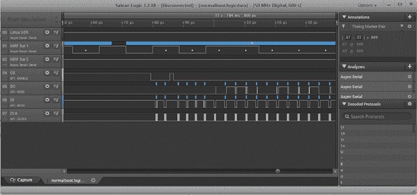

图 2-18：来自逻辑分析仪的示例时间序列测量

一些示波器具有基础的逻辑捕捉和协议分析功能，但它们的通道数有限。相反，一些逻辑分析仪具有基础的模拟信号捕捉功能，但其带宽和采样率非常低。

逻辑分析仪出错的可能性不大。就像使用示波器一样，你需要在系统通电时使用它，因此所有的安全预防措施都适用。

## 总结

本章讨论了与硬件接口相关的多个主题：电气基础知识、如何使用这些基础知识进行通信，以及在嵌入式设备上可能遇到的不同类型的通信端口和协议。我们已经覆盖了比你与单个设备进行通信所需的更多内容，因此可以把本章当作参考，在以后遇到关于什么是电压、什么是差分信号，或者电路板上六针插头可能是什么的问题时，翻阅查看（更多内容请参见附录 B）。本书附带了索引，帮助你找到特定信息的位置。在本书后面的实验中，我们将使用最常见的接口，但在实际工作时，你将需要与各种设备进行通信。经过一些实践后，连接到接口就成了一个小障碍，跨过它后，就可以开始有趣的工作：通过这些接口发送数据（并最终从中获取机密信息）。同时，利用你对测量（数字或模拟）的知识来调试你不可避免的连接问题。只是要小心蓝色烟雾！
