# 第三章：查探目标：识别组件和收集信息


弗兰克·赫伯特在《沙丘》中写道：“开始是一个非常微妙的时刻。”正如你可能知道的，项目的开始方式为其成功奠定了基调。基于错误假设进行操作或忽视一些小信息，可能会使项目偏离轨道并浪费宝贵的时间。因此，无论是进行逆向工程还是研究项目（硬件项目也不例外），在调查目标系统的早期阶段收集并审查尽可能多的信息至关重要。

大多数基于硬件的项目都从好奇心和事实收集阶段开始，本章旨在帮助这一阶段。如果你在没有设计文件、规格说明书或物料清单（BOM）的情况下进行目标系统审查，你自然会从拆开设备并查看里面的内容开始。这就是最有趣的部分！本章概述了识别有趣组件或接口的技术，并分享了收集设备及其组件信息和规格的想法。

这个信息收集阶段并非线性进行。你会发现各种各样的拼图碎片。在本章中，我们展示了找到这些碎片的方法，而将它们以任何顺序拼凑起来，使得图像足够完整，就由你自己决定了。

## 信息收集

*信息收集*、*个人信息搜集*、*侦察*、*让开发者 Joe 泄密*——无论你怎么表达，这都是一个节省时间的重要步骤。如果你知道该去哪里找，很多信息是可以获取的。我们从最简单的方式开始，也就是在键盘前，之后我们将使用螺丝刀和其他工具。

在深入网络的更深处之前，你或许可以先搜索给定产品名称加上关键词*拆解*。常常会在多个来源中找到热门产品的拆解；例如，iFixit 网站([`www.ifixit.com/`](https://www.ifixit.com/))上就有许多流行产品的拆解，并附有详细的产品注释。对于消费品，注意查看产品的多个代际版本。例如，Nest Protect 智能烟雾报警器第二代设备在内部结构上与第一代设备有很大不同。公司通常不会区分这些代际产品，因为他们会停止销售旧一代设备，所以你可能需要通过型号或类似的信息来判断。

### 美国联邦通信委员会档案

*联邦通信委员会 (FCC)* 是美国的一个政府机构，负责从对电视上暴露特定身体部位罚款到确保最新的高速无线设备不会相互干扰等一切事务。它制定了美国市场上任何数字设备制造商必须遵守的规定。这些规定旨在确保设备不会产生过量的干扰（例如，你那款超炫的 5000 型设备导致邻居电视信号中断），并能在一定程度的电磁（EM）干扰下继续正常工作。

其他国家也有类似的机构和规定。FCC 特别有趣的是，因为美国是一个非常大的市场，所以大多数产品都是为了符合 FCC 规定而设计和/或测试的，并且 FCC 将备案信息数据库公开提供。

#### 关于 FCC 备案

任何发射无线电波的数字设备，称为有意辐射源，都需要进行测试。FCC 要求制造商仔细测试设备的辐射，并提供文档证明设备符合 FCC 规定。这是一个非常昂贵的过程，FCC 需要确保公众能够轻松检查合规性。因此，像 *USB armory Mk I* 这样的开源闪存驱动器大小的计算机，标明它是一个开发平台，“可能会对附近的电气或电子设备造成干扰。”证明该标签可能不合理是非常昂贵的。

为了让公众进行合规性检查，有意辐射源必须公布一个称为 *FCC ID* 的标识，印在设备标签上。你可以在 FCC 网站上搜索该 ID，并确认该设备确实通过了合规性测试。这也意味着检测假冒 FCC 标签变得很容易，因为任何人都可以检查状态，而不仅仅是 FCC 的工作人员。

设备的 FCC 标签可能位于电池盖内部。图 3-1 显示了 D-Link 路由器标签的一个例子。

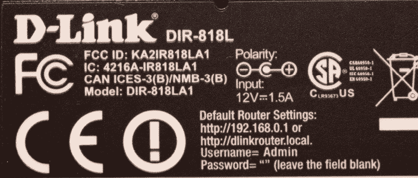

图 3-1：D-Link FCC 标签

如果设备不是有意辐射源，它仍然必须有 FCC 合规标志，但不会有 FCC ID。这些无意辐射源的报告要求较少，测试文档通常也不公开。

#### 查找 FCC 备案

作为例子，图 3-1 中无线电路由器的标签显示 FCC ID 为 KA2IR818LA1，你可以在 FCC ID 搜索网站上找到该 ID。搜索工具将该 ID 分为两部分：授权代码和产品代码。FCC 分配授权代码，并且对于某个特定公司来说，这个代码始终是相同的。此前，该代码只有 FCC ID 的前三个字符，但自 2013 年 5 月 1 日起，它可以是三位或五位字符。公司分配产品代码，长度可以从 1 到 14 个字符不等。

回到路由器，授权代码是 KA2，产品代码是 IR818LA1。将这些信息输入搜索框后，会显示出如图所示的结果。该设备有三个备案，因为它可以在多个频段中工作。点击详细链接可查看报告和信函，包括外部和内部产品照片——通常是电路板的照片以及集成电路的详细信息。

基于 FCC ID KA2IR818LA1 调出内部照片后，你应该能轻松识别出主处理器是 RTL8881AB。你还可以看到某种类型的头针，这很可能是串行接口，因为它有大约四个引脚，并且电路板（PCB）上有多个测试点。你在没有动用螺丝刀的情况下就找到了所有这些信息。

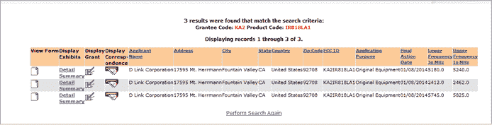

图 3-2：FCC ID 搜索结果

#### FCC 等效项

图 3-3 中的 Nest 门铃没有显示 FCC ID。为什么？Colin 购买了这款设备，并且他位于加拿大，所以该设备不需要 FCC ID。相反，它只标有加拿大工业（IC）代码，这允许你在加拿大工业“无线设备列表（REL）”数据库中搜索匹配的“认证号”。

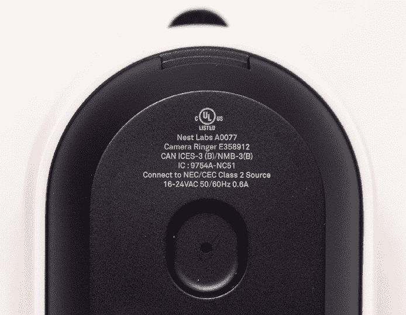

图 3-3：Nest 门铃

在 IC REL 数据库中搜索 9754A-NC51 会提供更多信息，但公共网站上没有详细的内部照片。参考资料中的产品代码部分（NC51）在 FCC ID 和 IC 设计标识符之间是共享的，因此快速查找更多信息的方法是到[`FCCID.io/`](https://FCCID.io/)进行部分搜索，查找 NC51。我们发现 FCC ID 是 ZQANC51，这让我们找到了内部照片。

### 专利

专利实际上是授予产品开发者的许可证，使其能够起诉在特定地理区域内销售复制原始产品运行方式的产品的公司，且在有限的时间内有效。理论上，专利只有在该明确的操作是新颖的情况下才会被授予。专利的目标是保护发明，由于本章讨论的是信息收集而非政治，我们就此打住。

大多数公司喜欢专利，因为他们可以利用专利来阻止竞争对手发布使用某种新技术或设计的产品。但有一个前提：专利必须解释该新技术如何运作。其背后的理念是，作为交换，为了透露关于新技术的宝贵细节，法律系统可以阻止任何人使用这些细节与发明者在有限的时间内进行竞争。

#### 查找专利

在研究设备时，你可能会发现专利提供了关于如何处理设计中安全性或其他方面的有用信息。例如，在研究一个密码保护的硬盘时，我们找到了一项专利，描述了一种通过打乱分区表来保护硬盘的方法。

产品或手册上可能会有类似“受美国专利 7,324,123 保护”的声明。你可以轻松地在美国专利商标局（USPTO）网站或第三方网站（如 Google Patents）上查找该专利号。我们推荐使用 Google Patents，因为它可以搜索多个数据库，并且包含一个易于导航的通用搜索工具。

产品上常常标有“专利申请中”字样，或者你可能只会在产品文献中找到专利的引用。这通常意味着公司已经提交了专利申请，但该专利可能尚未公开。在这种情况下，搜索这些专利的唯一合理方法是通过公司名称来查找。确定专利可能归属的公司；例如，一个专利可能属于设备内部芯片的制造商，而不是设备本身的制造商。通常你可以找到授予该公司相关专利，并进一步通过该公司的律师事务所或其他相关发明人的专利进行搜索。

如果你找到了一项专利（或专利申请），实际发布的申请并不是你可以使用的所有信息。有一个名为 USPTO Public PAIR 的系统，可以让你查看几乎所有 USPTO 与专利申请人之间的通信。这些文件不会被搜索引擎索引，所以如果不使用 USPTO Public PAIR 系统，你是找不到这些文件的。例如，你可以看到 USPTO 是否在专利待审的情况下与申请人争论，或者你可以找到申请人可能上传的支持文档。有时你还可以找到专利的早期版本或申请人的论点，其中包含一些在 Google Patents 上找不到的额外信息。

一些有趣的专利逆向工程应用案例包括 Red Balloon Security 的 Thangrycat 攻击，详细内容见 DEF CON 报告《100 Seconds of Solitude: 利用 FPGA 比特流恶作剧突破思科信任锚》。在这次攻击中，Red Balloon Security 突破了思科的信任根，它使用了一种名为*现场可编程门阵列（FPGA）*的电子组件。美国专利 9,830,456 详细解释了架构，这些信息原本需要大量的逆向工程工作才能获得。

另一个专利对硬件黑客有用的例子是在 Black Hat USA 上的一个报告，标题为“GOD MODE UNLOCKED: x86 CPU 中的硬件后门”，由 Christopher Domas 主讲。在这里，美国专利 8,296,528 解释了如何将一个独立的处理器连接到主 x86 核心，并暗示了一些细节，这些细节最终导致了核心安全机制的完全被攻破。

专利甚至可能列出关于安全设备的详细信息。例如，Square 信用卡读卡器包含一个集成在微控制器安全部分塑料外壳中的防篡改“网格”。图 3-4 显示了四个大方形垫片（我们将在本章后面讨论更多 PCB 特征），这些垫片上有椭圆形区域，能够与防篡改网格外壳连接。

图 3-5 显示了与图 3-4 中所示的 PCB 连接的防篡改网格外壳的底部。

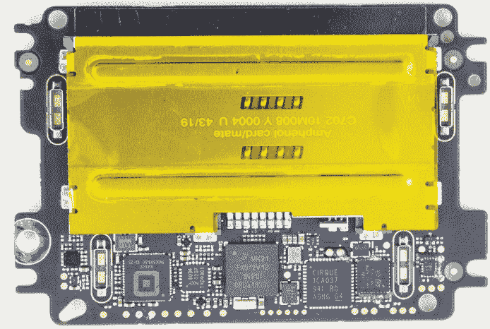

图 3-4：Square 信用卡读卡器内部结构，四个防篡改保护连接器位于每个角落附近

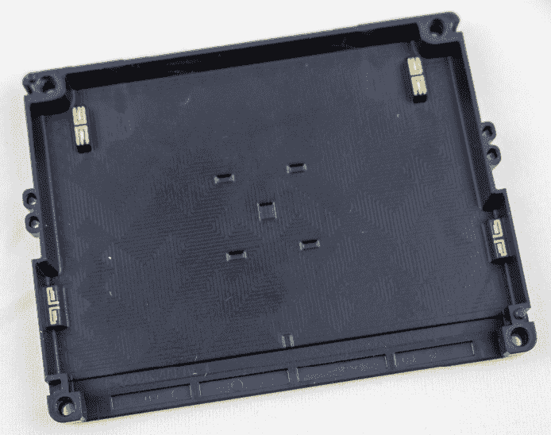

图 3-5：Square 读卡器的防篡改保护罩；暴露的连接将与图 3-4 中显示的 PCB 连接。

当你移除网格时，设备将停止工作，因此对设备进行逆向工程会迅速变得非常昂贵。然而，如果你在 Google 专利中搜索 US10251260B1，你会找到有关网格工作原理的详细信息。现在试试，看看能否将图 3-4 和图 3-5 的照片与专利图纸进行匹配。如果你以前没有接触过 PCB，等你完成本章后再回来看这些图，我们会解释一些你可以在这里看到的 PCB 特征。

### Datasheet 和原理图

制造商发布 datasheet（无论是公开的还是在保密协议下）以便设计师了解如何使用他们的组件，但他们通常不发布完整的原理图。相反，你通常可以找到公开共享的*逻辑*设计，展示组件如何互联。例如，PCB 布局展示了物理设计——即所有组件的放置位置以及电线如何布置，但它通常不会公开。

尝试在线查找你最喜欢的设备或开发板的 datasheet，例如树莓派计算模块或英特尔 8086 处理器，或者随机查找闪存或 DRAM 内存的 datasheet。或者，如果你想了解模拟电路，可以找一个电平转换器的 datasheet。通常，你只需要根据前面提到的产品 ID 或其他标识符进行简单的互联网搜索。像 findchips 这样的网页([`www.findchips.com/`](https://www.findchips.com/))也有助于定位当前产品。

查找特定零件的 datasheet 可能会有些困难。对于组件，首先确定零件号（请参见第 86 页的“识别电路板上的 IC”部分）。零件号通常看起来像是随机的字母和数字组合，但它们编码了零件的各种配置。例如，MT29F4G08AAAWP 的 datasheet 将零件号分解如下：

+   MT 代表美光科技。

+   29F 是 NAND 闪存的产品系列。

+   4G 表示 4GB 存储容量。

+   08 表示一个 8 位设备。

+   第一个“A”表示一个芯片，一个命令引脚和一个设备状态引脚。

+   第二个“A”表示工作电压为 3.3V。

+   第三个“A”是列出的特性集。

+   WP 表示该组件是一个 48 引脚薄小型外形封装（TSOP）。

搜索时，只需输入你在芯片上找到的任何零件编号。如果找不到精确的编号，可以去掉一些最后的字符再试，或者让你的搜索引擎建议一些相似的名称。

通常你会遇到过多的匹配结果，因为在一些非常小的元件上，完整的零件编号没有打印出来，只有一个较短的*标记代码*。不幸的是，搜索标记代码时，可能会返回成百上千个不相关的结果。例如，某个板上的特定元件可能仅仅标记为*UP9*，这几乎无法搜索。如果你将标记代码与封装类型一起搜索，通常会得到更有用的结果。在这个例子中，我们已经确认该封装为 SOT-353 封装类型（我们将在本章后面讨论封装类型）。针对标记代码，您可以找到 SMD（表面贴装设备）标记代码数据库，例如[`smd.yooneed.one/`](https://smd.yooneed.one/)和[`www.s-manuals.com/smd/`](http://www.s-manuals.com/smd/)，结合您对封装的了解，能够帮助你找到该设备（在此案例中是 Diodes, Inc.的 74LVC1G14SE）。

在查阅了几个数据手册后，你会发现它们有一些共同点。它们很少包含从安全角度有趣的信息。我们主要关心的是如何与设备互动，这意味着要了解它如何工作以及如何连接到它。引言部分会包含功能说明：它是一个 CPU、闪存设备或其他什么设备。要连接到它，我们需要查看引脚排列图以及任何描述引脚的参数，例如功能、协议或电压等级。你几乎肯定会找到一些在第二章中讨论的接口。

### 信息搜索示例：USB Armory 设备

让我们以 Inverse Path（被 F-Secure 收购）的 USB Armory Mk I 设备为例来查找信息。它是一个开源硬件，因此我们可以访问很多细节。在阅读这里的所有内容之前，尝试自己进行研究。去查找以下内容：

+   主系统芯片（SoC）的制造商、零件编号，以及其数据手册。

+   PCB 上的 GPIO 和 UART。

+   板上暴露的任何 JTAG 端口。

+   PCB 上的电源线和电压。

+   外部时钟晶体线和频率。

+   主 SoC 上的 I2C 接口连接到另一个 IC 的位置以及该协议。

+   SoC 上的启动配置引脚，它们在 PCB 上的连接方式，以及选择的启动模式和配置。

#### 制造商、零件编号和数据手册

从 USB armory 的 GitHub 页面和 Wiki（[`inversepath.com/usbarmory_mark-one.html`](https://inversepath.com/usbarmory_mark-one.html)）上，我们可以看到 USB armory 基于 NXP i.MX53 ARM Cortex-A8。数据表名为 *IMX53IEC.pdf*，可以在多个地方找到。当搜索“imx53 vulnerability”时，我们在 Quarkslab 博客上找到了已知的 X.509 漏洞。如果继续深入查找，可能会找到一份名为“Security Advisory: High Assurance Boot (HABv4) Bypass”的公告，指出这些漏洞在 Mk II 中不存在。

#### PCB 上的 GPIO 和 UART

搜索“USB armory GPIO”，我们找到了其 GitHub Wiki（[`github.com/f-secure-foundry/usbarmory/wiki/GPIOs/`](https://github.com/f-secure-foundry/usbarmory/wiki/GPIOs/)），该页面提供了 GPIO 的详细信息。在前一节中提到的数据表中，我们可以找到所有 i.MX53 的 GPIO、UART、I2C 和 SPI 引脚。任何一个通信端口都很有趣，值得监控；它们肯定会传输控制台或调试输出。

#### JTAG 端口

如果没有被锁定，JTAG 应该能够通过 ARM 的调试功能提供对芯片的低级访问，因此我们需要了解任何暴露在板上的 JTAG 端口。进一步探索 GitHub 页面可以找到专门针对 Mk I 的 JTAG 页面（[`github.com/f-secure-foundry/usbarmory/wiki/JTAG-(Mk-I)/`](https://github.com/f-secure-foundry/usbarmory/wiki/JTAG-(Mk-I)/)），该页面包含了 PCB 照片（见 图 3-6）。

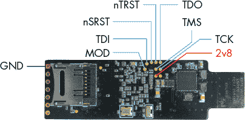

图 3-6：USB armory JTAG 连接器引脚

图 3-6 显示了标准的 TCK、TMS、TDI、TDO、nTRST 和 GND（地）JTAG 连接。2v8 引脚提供 2.8V 电源，但 MOD 引脚怎么样呢？数据表对此没有明确说明。JTAG_MOD/sjc_MOD 在 i.MX53 引脚分配表中有列出，但并没有解释其含义。通过搜索相关产品，我们在 i.MX6 计算机模块的数据表中找到了一个解释（搜索“IMX6DQ6SDLHDG.pdf”；原 NXP 网站需要登录，但该 PDF 在其他地方有镜像）。该数据表解释了 *low* 将所有系统测试访问端口（TAP）加入链中，而 *high* 使其符合 IEEE1149.1 标准（仅对边界扫描有用，边界扫描的使用将在第 106 页的“使用 JTAG 边界扫描进行映射”一节中讨论）。查看 Mk I JTAG 页面底部的原理图，建议通过下拉电阻将其接地；这样可以将其 *low* 拉低，以启用系统 TAPs。正如你所看到的，有时综合不同的信息来源可以补全全貌。

#### 电源和电压

关于 PCB 上的电源线和电压，我们可以查阅之前获取的数据表。搜索“power”、“Vcc”、“Vdd”、“Vcore”、“Vfuse” 和“ground/Vss”。你会发现现代 SoC 包括多个重复的这些术语实例，每个都代表一个针脚。电源层的各种子系统具有多个输入电压，这也是为什么有如此众多的针脚的原因之一。例如，闪存存储器可能具有比核心电压更高的电压。你还可能会发现支持多种标准的多个 I/O 电压。

第二个针脚数量众多的原因是它们经常会重复，有时甚至会多次重复。这有助于将电源和地针物理上靠近彼此，减少电感，帮助快速传递电源瞬变给芯片。

数据表中当然包含许多电源针脚，在此芯片中标记为 VCC（外围核心电压）和 VDDGP（ARM 核心电压），以及其他设计 ations。我们寻找电源针脚以找到注入故障和进行电力分析的方法，这些技术将在接下来的几章中学习。例如，如果你想监听 ARM 核心上的加密内容，你可以尝试探测 VDDGP。如果你想干扰 L1 缓存（VDDAL1）、JTAG 访问控制（NVCC_JTAG）或熔断写入（NVCC_FUSE），你可以尝试控制这些针脚。

真实的原理图对于学习这些电源针脚如何在电路板上连接非常有帮助。我们在 GitHub 硬件库中找到了一份名为 *armory.pdf* 的原理图（[`raw.githubusercontent.com/inversepath/usbarmory/b42036e7c3460b6eb515b608b3e8338f408bcb22/hardware/mark-one/armory.pdf`](https://raw.githubusercontent.com/inversepath/usbarmory/b42036e7c3460b6eb515b608b3e8338f408bcb22/hardware/mark-one/armory.pdf)）。PDF 的第三页列出了与 SoC 的电源连接。如果你跟随这些电源连接的 PCB 追踪线路，你会看到一堆去噪电容器（标记为 C48、C49 等），这些电容器用于去除电源噪声。你还会注意到连接名称以 PMIC_SW1_VDDGP 和 PMIC_SW2_VCC 等标签结尾。*PMIC* 意为电源管理 IC，专用于提供正确的电压。PDF 的第二页显示了主要电源（USB_VBUS）如何进入主要电源层（5V_MAIN），然后进入 PMIC，进而向 SoC 提供各种稳定电压。

这告诉我们逻辑上一切是如何连接的，但还没有告诉我们这些线路在 PCB 上的具体位置。为此，我们需要打开 KiCAD 设计文件中的 PCB 布局文件。

KiCAD 是用于设计 PCB 的开源软件。在这里，我们只使用它的百分之一功能来检查 PCB 布局。我们通过 KiCAD 的 `pcbnew` 命令打开了 *armory.kicad_pcb* 设计文件。一个 PCB 可能包括多层导电轨迹/走线，这些层会显示在程序窗口的右侧，并带有复选框用于启用和禁用它们。首先禁用所有层，只显示 PCB 上的焊盘。你会看到“U2”（主 SoC 的球阵列）位于中间，“U1”/PMIC 在左侧，“U4”/DRAM 芯片在右侧。

KiCAD 有一个很好的工具叫做 *highlight net*，可以让你点击任意位置并跟踪连接。假设我们想玩弄 JTAG 电源。缩放到 SoC，直到看到球名称，并找到 NVCC_JTAG 球，根据数据表它位于 G9\。你会看到如 图 3-7 所示的内容。

记得 JTAG 焊盘吗？看起来 NVCC_JTAG 连接到了用于 JTAG 电源的 2v8 焊盘。不过，在 PMIC 附近，你还会看到一些高亮显示的线。这些线属于同一网络，只是我们看不见这一部分，因为我们已关闭了所有层。通过逐个启用和禁用各层，我们发现有一层连接了它们：GND_POWER_1（见 图 3-8）。

白色圆点是 *vias*，即连接一层走线与另一层走线的小镀孔。一个 via 位于与 PMIC 连接的左侧，另一侧通过电源平面连接到右侧的 via，然后连接到通往 NVCC_JTAG 的线。如果我们想控制 *NVCC_JTAG* 的电源进行故障注入或电源分析，我们可以物理切断与 PMIC 的走线，并通过焊接一根线到 2v8 焊盘来提供自己的 2.8 V 电压。

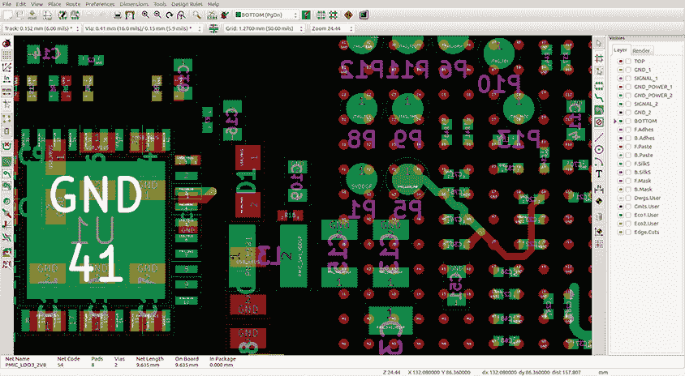

图 3-7：使用 KiCAD 高亮显示一个互连网络

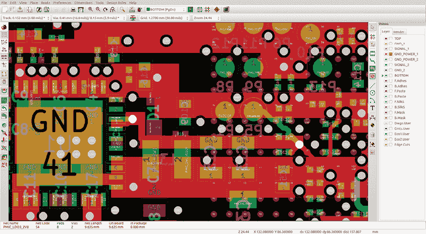

图 3-8：高亮显示 GND_POWER_1 层

#### 时钟晶体与频率

要识别外部时钟晶体线和频率时钟，我们再次参考之前获取的数据手册。搜索“clock/CLK/XTAL”，你将发现四个有趣的外部振荡器引脚：XTAL 和 CKIL（及其互补输入 EXTAL 和 ECKIL），以及两个通用输入 CKIH1 和 CKIH2。通过搜索这些输入，我们找到了“i.MX53 系统开发用户指南”，文件名为 *MX53UG.pdf*。该部分内容提到的输入，再次引用了“i.MX53 参考手册”，我们找到的文件是 *iMX53RM.pdf*。根据参考手册，你可以编程这些输入，为各种外设提供时钟，如 CAN 网络和 SPDIF 端口。查看板子原理图，我们发现（E）XTAL 连接到一个 24 MHz 的振荡器，（E）CKIL 连接到一个 32,768 Hz 的振荡器，而 CKIH1 和 CKIH2 被拉到地面。USB armory 原理图显示这些引脚连接到两组焊盘，对应两个振荡器。这些振荡器就是图 3-9 中非常大的组件。

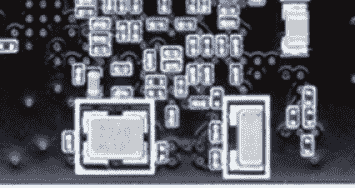

图 3-9：振荡器周围有白色丝印框。

时钟控制对两个主要目的至关重要：同步设备时钟的侧信道测量，以及促进时钟故障注入实验。在这种情况下，EXTAL 输入通过一个频率倍增器，然后为 ARM 核提供时钟。这里的 PLL（锁相环）将外部频率转换为内部时钟，可能会消除时钟中的任何异常，因此时钟故障注入可能无法进行，但我们仍然可以将自己的时钟注入到这些引脚中，以提供更精确的时钟同步来计数时钟周期。如果你要进行时钟同步，甚至不需要移除板上的晶体。你可以将时钟信号输入到晶体电路中，它将迫使晶体振荡器电路按照你注入的时钟脉冲运行。（更多关于时钟故障注入的内容，请参见第四章。）

#### I2C 接口

我们需要确定主 SoC 的 I2C 接口连接到另一个集成电路（IC）的位置，并且确定该接口上的协议是什么。USB armory 原理图显示第 30 和 31 引脚是 I2C，i.MX53 数据手册显示有三个 I2C 控制器。我们可以追踪布局，找到连接到 V3 的线，该接口名为 EIM_D21，是 GPIO 之一。EIM_D21 要么是 SPI，要么是 I2C-1。这是一个多路复用引脚的例子；SoC 本身可以配置为在该引脚上执行各种低级协议。

至于高级协议，我们需要深入挖掘——具体来说，是查看 PMIC 数据手册。PMIC 在 PCB 原理图中标识为 LTC3589，数据手册名为 *3589fh.pdf*。在 “I2C 操作”部分，数据手册详细定义了该协议。

#### 启动配置引脚

了解引导配置引脚的位置、它们在 PCB 上的连接方式，以及这些引脚选择的引导模式和配置是非常有帮助的。目前，我们提供了一个如何查找数据的示例；无需担心理解技术细节。

i.MX53 的数据手册（*IMX53IEC.pdf*）提到各种 BOOT_MODE 和 BOOT_CFG 引脚，但没有定义它们的功能。在 Mk I 的原理图中，我们发现 BOOT_MODE 引脚（C18 和 B20）没有连接到电源或地线。

让我们先弄清楚 BOOT_MODE 未连接意味着什么。i.MX53 的数据手册中有一张表格，声明对于 BOOT_MODE0 和 BOOT_MODE1，"配置值"为 100 kΩ下拉电阻。PD 代表*下拉*，因此如果引脚未连接，它会被内部下拉到地。这意味着当引脚未连接时，BOOT_MODE0 和 BOOT_MODE1 引脚的逻辑值为 0。数据手册没有提及更多信息，但 i.MX53 参考手册（*iMX53RM.pdf*，这是一本 5100 页的好资料）提供了高级引导序列，显示 BOOT_MODE[1:0]=0b00 表示*内部引导*。

现在，对于 BOOT_CFG，i.MX53 的数据手册显示，所有这些 BOOT_CFG 引脚都连接到以 EIM_ 开头的引脚，例如 EIM_A21\。请记住，这只是引脚的名称，而不是坐标。如果继续查找数据手册，你会发现 EIM_A21 是位于 AA4 位置的引脚名称（这个 AA4 是芯片上的位置，指的是 BGA 焊球）。有了这些信息，我们可以查看 Mk I 原理图，看看这些引脚是如何连接的。

结果显示，除了 BOOT_CFG2[5]/EIM_DA0/Y8 和 BOOT_CFG1[6]/EIM_A21/AA4 这两个引脚外，所有 BOOT_CFG 引脚都接地。BOOT_CFG2[5]和 BOOT_CFG1[6]通过一个电阻上拉到 3.3V。这些位被设置为 1，而所有其他 BOOT_CFG 位被设置为 0。在参考手册中查找 BOOT_CFG，我们找到了第 7-8 表，“引导设备选择”，其中有一行指定 BOOT_CFG1[7:4]设置为 0100 或 0101 表示从 SD 卡引导（在表中写为 010X）。设置 BOOT_CFG2[5]的效果似乎取决于所选择的引导模式。既然我们刚刚发现是从 SD 卡引导，那么第 7-15 表，“ESDHC 引导 eFUSE 描述”，是相关的。它指出 BOOT_CFG2[5]=1 表示我们使用的是 SD 卡的 4 位总线宽度。

还记得那个我们找不到相关信息的 MOD 引脚吗？参考手册中有你想知道的所有信息，甚至更多，关于 sjc_mod 引脚的描述也确认了我们之前找到的信息。如果你一开始找不到需要的信息，别灰心。

这些只是你可以从不同文档来源回答的一些问题的例子。数据手册通常很容易找到；而原理图、PCB 布局和/或参考设计比较少见。不过，你也可以通过逆向工程来获取信息，正如你将在下一节“打开外壳”中看到的那样。

## 打开外壳

和任何逆向工程任务一样，你的目标是进入系统设计者的思维。通过研究、线索和一点猜测，目的是理解足够的信息以完成任务。我们进行逆向工程的目的不是为了克隆或完整提取电路图，而是希望知道如何修改和/或连接到 PCB，从而实现我们的目标。如果幸运的话，可能有人已经研究过这个设备（或类似设备），如前所述，你可以尝试查找已有的拆解报告。

起初可能只有一堆集成电路的序列号、少量外部端口，以及看似无穷无尽的电阻和电容，但随着时间的推移，你将逐渐理解系统的工作原理。如果运气好，你还可以找到一个测试点或调试端口，进一步获得更多的访问权限。

### 识别电路板上的集成电路

我们并没有使用特定的设备来演示识别 IC 的技巧，因此，如果你想跟着做，可以找一款便宜的物联网（IoT）设备或类似设备，确保你不介意将其拆开。

你在现代电子设备中遇到的大多数印刷电路板（PCB）都是表面贴装的，与过去的通孔插装方式不同。这种技术叫做*表面贴装技术（SMT）*，其上任何元件都叫做*表面贴装元件（SMD）*。

一旦你打开设备，通常会看到一块单独的 PCB，上面有许多组件（检查 PCB 的正反面），其中最大的组件可能是主 SoC、DRAM 和外部闪存存储，如图 3-10 所示。

在图 3-10 的顶部中央位置，是一款 DSPGroup DVF97187AA2ANC 主 SoC 1。其左侧是 EtronTech EM63A165TS-6G SDRAM，采用 TSSOP 封装 2，SDRAM 上方是 Winbond 25Q128JVSQ 闪存，采用 SOIC-8 封装 3。除此之外，还有一款 Realtek RTL8304MB 以太网控制器 4。这款设备是一个非常低成本的 IP 电话，这或许能解释为何其 SoC 和 SDRAM 是你可能从未听说过的品牌。

第一步是读取芯片上的标记。你通常可以通过手机摄像头得到相当清晰的图像。图 3-11 展示了另一款设备——HDMI RCA 音频分配器的照片，这些照片是用普通手机摄像头和显微镜应用程序拍摄的。

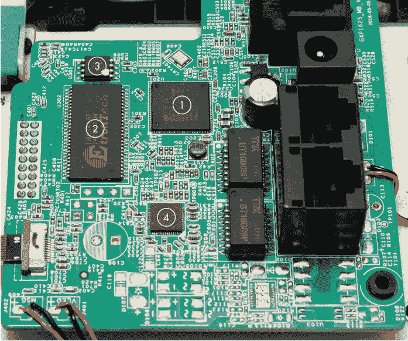

图 3-10：识别电路板上的集成电路（IC）


图 3-11：芯片标记：左侧为闪光灯和良好角度；中间为闪光灯和不良角度；右侧为自然光

如你所见，通过改变拍摄角度并开关手电筒，你应该能拍出适合读取芯片标记的照片。另一种选择是使用便宜的 USB 显微镜摄像头；有关硬件信息，请参见附录 A。图 3-12 中的照片就是用这种相机拍摄的。

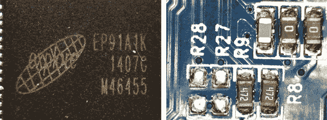

图 3-12：使用 USB 显微镜摄像头拍摄的照片

一旦你有了芯片上的标记，就可以运用你的侦察技能来挖掘该部件的信息。尤其是如果这是你第一次做这件事，试着识别所有的 IC 及其数据手册。即使大多数较小的组件从安全角度来看可能并不重要，你也会了解一些让设备正常工作的必要内容。我们通过这种方式学到了很多关于电压调节器和其他一些有趣的小 IC 的知识。

对于一些芯片，由于散热片或保护性封装，接触主芯片会有些棘手。你可以通过拆卸散热片，通常是旋开螺丝或轻轻拉起它来轻松去除。如果散热片卡住了（这种情况常见于小型设备），可以通过扭动的方式来去除，而不是直接撬或拉起它。

在高安全性的系统中，你会遇到保护性封装，制造商希望避免对芯片的访问。简单地剥离它可能不会成功，但你很可能会发现，用热风枪加热后可以很好地软化环氧树脂，然后可以用牙科小工具等工具将其去除。如果你想完全去除环氧树脂，可以尝试使用像二甲苯或去漆剂这样的化学品（这些在五金店有售）。

### 小型引脚封装：SOIC、SOP 和 QFP

在你进行 IC 识别时，你会遇到各种类型的封装。识别这些封装对硬件黑客有几个方面的用途。首先，你可以在搜索数据手册时用到这些信息。其次，封装类型实际上会影响你能够执行的攻击。有些非常小的封装提供了几乎芯片级的访问权限，我们将在后续章节中讨论的探针在这些小封装上也更易于使用。图 3-13 显示了你可能遇到的一些主要小型引脚封装。

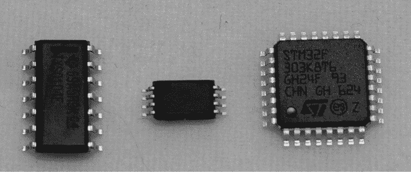

图 3-13：小型引脚封装：SOIC、TSSOP 和 TQFP 样式

图 3-13 中的所有封装都有引脚；区别在于引脚之间的相对大小（间距）和引脚的位置。这个系列中有许多不同的变种，我们在这里不深入讨论，因为对于我们的目的来说，它们是等效的。例如，你可能会看到 *薄型四方扁平封装（TQFP）* 和 *塑料四方扁平封装（PQFP）* 的提及，它们几乎是一样的，并且具有相似的引脚间距、引脚数量和封装尺寸。

最大的是 *小型外形集成电路（SOIC）*，它在封装的两侧都有引脚，通常引脚间距为 1.27 毫米。这个封装很好，因为你可以在上面夹取抓取夹。通常，SPI 闪存芯片采用 8 引脚或 16 引脚宽的 SOIC 封装。

SOIC 的一个更小版本是*小外形封装（SOP）*，通常为薄型 SOP（TSOP）或薄缩型 SOP（TSSOP）。这些封装也仅在两个边缘有引脚，且引脚间距通常在 0.4 mm 到 0.8 mm 之间。宽型 TSOP 封装（如图 3-14 所示的 48 引脚封装）几乎肯定是并行闪存芯片。


图 3-14：48 引脚 TSOP 封装

最后，*四方扁平封装（QFP）*的封装在四个边缘都有引脚，通常见于*薄型 QFP（TQFP）*或*塑料 QFP（PQFP）*封装。这些封装在材料或厚度上有小的变化，但整体外形保持不变。引脚间距通常在 0.4 mm 到 0.8 mm 之间。

TQFP 的内部结构基本上包含一个小的中央 IC 芯片，它通过*引线框*与引脚连接。如果你打磨掉 IC 的一部分，你可以看到它的相对大小，如图 3-15 所示，这是一个 TQFP-64 封装。

如果你想保持物品更完好无损，你也可以使用酸性脱封装方法，但砂纸是几乎每个人都能安全使用的工具。

图 3-16 是 SOIC/SOP/TQFP 内部结构的简易示意图，展示了连接芯片和引脚的键合线。在图 3-15 中，显然移除了芯片从顶部往下打磨时所有的键合线痕迹。

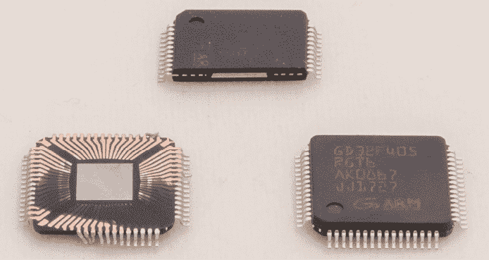

图 3-15：QFP 封装；从左到右：顶部打磨掉、截面图和完好无损

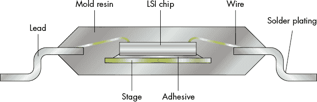

图 3-16：SOIC/SOP/TQFP 封装的内部结构

### 无引脚封装：SO 和 QFN

无引脚封装与之前的 SOIC/QFP 封装类似，但不使用引脚，而是将芯片下方的焊盘焊接到 PCB 上。这个焊盘通常（但并不总是）延伸到设备的边缘，所以你通常会看到芯片边缘有一个小的凸起焊点。 图 3-17 是这些无引脚设备的简易示意图。

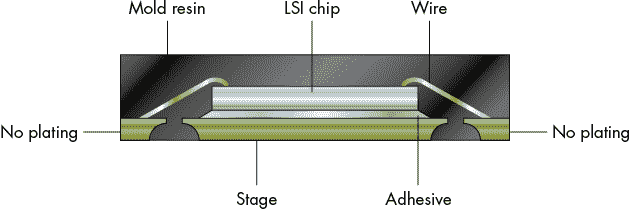

图 3-17：无引脚封装

*小外形无引脚（SON）*封装仅在两个边缘有连接。此类设备的典型引脚间距在 0.4 mm 到 0.8 mm 之间。和其他封装一样，也有许多变体，例如*薄型 SON（TSON）*。你也可能会看到各种定制的引脚布局，其中一些焊盘可能缺失。SON 封装几乎总是有一个中央热焊盘，焊盘下方通常会焊接到 PCB 上，这意味着你很可能需要使用热风来焊接或拆卸这个封装。由于你无法用焊接铁触及到隐藏的中央焊盘，你需要通过某种方法间接加热它，可以通过设备封装或 PCB 进行加热。

另外，注意 WSON 封装类型，官方似乎同时称其为*超薄 SON*和*宽型 SON*。该封装比普通的 SON 封装宽，通常具有 1.27 mm 的引脚间距，常用于 SPI 闪存芯片。

*四边无引脚封装（QFN）* 包含四个边缘的连接。这些设备的典型引脚间距在 0.4 毫米到 0.8 毫米之间。同样，你几乎总能看到这些设备中央有一个热垫。它们广泛应用，可以是从主微控制器到电源开关稳压器的任何设备。

### 球栅阵列

*球栅阵列（BGA）* 封装的芯片底部有焊球，如图 3-18 所示，你从顶部无法看到它们。

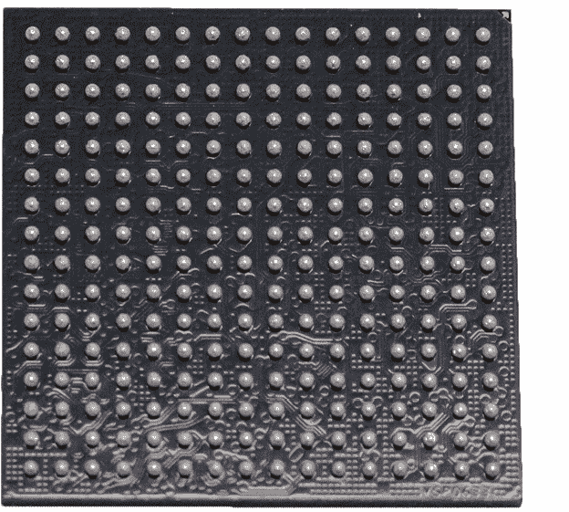

图 3-18：BGA 封装

如果你能调整好角度，就能看到边缘焊球，如图 3-19 所示，在那里你还可以看到其实有一个更小的*载体 PCB*。BGA 芯片本身由一个更小的 PCB 组成，芯片被安装在其上。


图 3-19：边缘焊球视图

BGA 元件常用于主处理器或 SoC。一些 eMMC 和闪存设备也会使用 BGA 封装，而在更复杂的系统中，挂在主处理器旁边的较小 BGA 通常是 DRAM 芯片。

实际上，BGA 设备有几个变体，这对功率分析和故障注入可能很重要，因此我们将在此详细说明它们的构造差异。供应商使用略有不同的名称，但我们在这里遵循富士通的命名方式（*a810000114e-en.pdf*），这通常与其他供应商使用的名称相对应。

#### 塑料 BGA 和精细引脚 BGA

*塑料 BGA（PBGA）* 设备的引脚间距通常为 0.8 毫米到 1.0 毫米（见图 3-20）。芯片与载体板内部连接，载体板上有焊球。

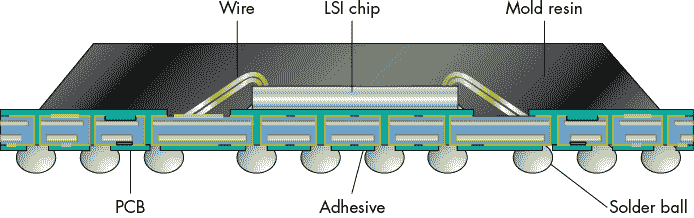

图 3-20：塑料 BGA

*精细引脚间距 BGA（FPBGA）* 与 PBGAs 相似，但其网格更精细（通常为 0.4 毫米到 0.8 毫米）。同样，该设备安装在载体 PCB 上。

#### 热增强型球栅阵列

*热增强型球栅阵列（TEBGA）* 如图 3-21 所示，BGA 本身具有明显的金属区域。

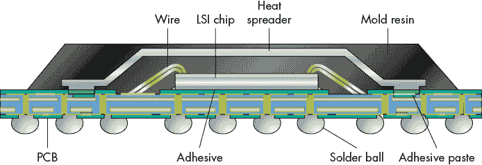

图 3-21：热增强型球栅阵列

这个金属区域是集成热扩散器的一部分，有助于提供更好的热连接，既连接到底部的焊球，又连接到封装顶部的散热器。

#### 翻转芯片球栅阵列（Flip-Chip BGA）

*翻转芯片 BGA（FC-BGA）* 如图 3-22 所示，去除了内部的连接线。相反，芯片本身实际上是一个更小的 BGA（这会很难操作），并被焊接到载体 PCB 上。这里的区别在于，与之前的 BGA 设备相比，内部的“LSI 芯片”是*倒置的*。

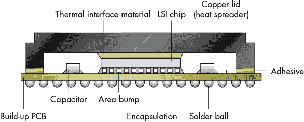

图 3-22：翻转芯片球栅阵列

在其他封装中，如 PBGA/FBGA/TEBGA，内部的引线会接触到内部 LSI 芯片的“顶部金属”层。在 FC-BGA 中，该金属层位于底部，上面装有非常小的焊球。这种封装类型还可能包含小型的集成无源元件，例如去耦电容。对于 FC-BGA 封装，可能可以去除散热器或“盖子”，以更接近实际芯片进行故障注入或侧信道分析。

### 芯片级封装

*芯片级封装 (CSP)* 本质上是将切割下来的芯片晶圆的一部分提供给你。在图 3-23 所示的内部结构中，顶部没有封装材料。

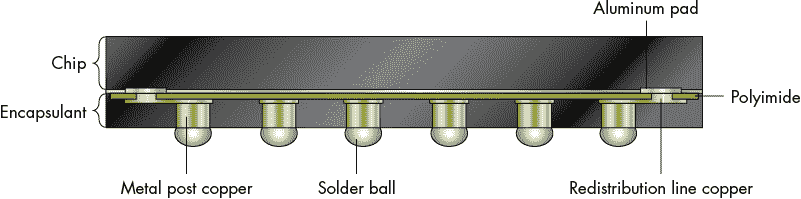

图 3-23：CSP 内部结构

提供的设备几乎只有它物理上所需要的大小，通常 CSP 底部会有一些非常细小的球状连接焊点，用于连接到 PCB。CSP 这个名称可能有一些修饰词，如 *晶圆级 CSP (WLCSP)*。可以将 CSP 视为翻转芯片 BGA 的 LSI 芯片部分。它们的引脚间距非常小（通常为 0.4 毫米或更细）。你通常可以很容易地识别这些设备，因为其表面与常规 BGA 有明显的不同。

### DIP、穿孔封装及其他

最早的封装是穿孔封装，尤其是 IC 封装中，现实产品中不太可能遇到它们。你*会*在爱好或套件产品（例如 Arduino）中遇到 DIP 封装。

另一种相对过时的技术是 *塑料引脚芯片载体 (PLCC)*，它可以直接焊接到 PCB 上，或者插入插座中。这些设备常用于微控制器，如果你在查看一款使用 8051 微控制器的老旧产品，可能会遇到这种封装。

## PCB 上的示例 IC 封装

我们并没有单独提供大量零件的照片，而是认为展示它们在电路板中的实际样子更为有用。让我们来看一下从实际产品中取出的四块样本板。图 3-24 展示了一块来自智能锁的通信子板。

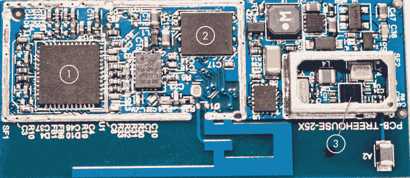

图 3-24：智能锁的示例 IC 封装

图 3-24 中标出的三个封装类型如下：

1.  **QFN 封装**：该设备的主要微控制器（EM3587）。

1.  **WSON 封装**：SPI 闪存芯片（这种封装尺寸常用于 SPI 闪存）。

1.  **BGA 封装**：我们无法看到任何边缘连接，因此很可能是一个小型 BGA。

我们换一个不同的智能锁设备，看看能发现什么（见 图 3-25）。

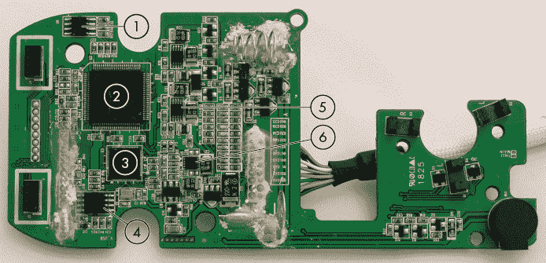

图 3-25：另一款智能锁的 IC 封装示例

图 3-25 显示了以下内容：

1.  **八引脚 SOIC**：这可能是基于八引脚 SOIC 的 SPI 闪存（零件编号确认它是 SPI 闪存）。

1.  **TQFP 封装**：该设备的主要微控制器。

1.  **QFN 封装**：协处理器芯片（在这种情况下用于音频）。

1.  **八脚宽 SOIC 封装**：这肯定是 SPI 闪存，因为封装很宽。

1.  **TSOP/TSSOP 封装**：未知 IC。

1.  **TSON 封装**：未知 IC。

继续以我们消费电子的例子为例，接下来让我们看看智能门铃的一个电路板（见图 3-26）。

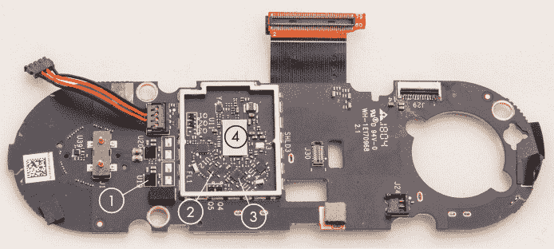

图 3-26：智能门铃的 IC 封装示例

图 3-26 展示了以下内容：

1.  **非常小的 BGA**：未知 IC。

1.  **TSON 风格的非常小设备（仅两侧有引脚）**：未知 IC。

1.  **QFN 风格的非常小设备（四面都有引脚）**：未知 IC。

1.  **CSP 封装，几乎具有镜面般的光泽**：主要微控制器，BCM4354KKUBG。在这个设备下方有 395 个间距为 0.2 毫米的焊球（我们告诉过你，CSP 很小）。

作为最后一个例子，图 3-27 展示了一块来自汽车电子控制单元（ECU）的电路板。

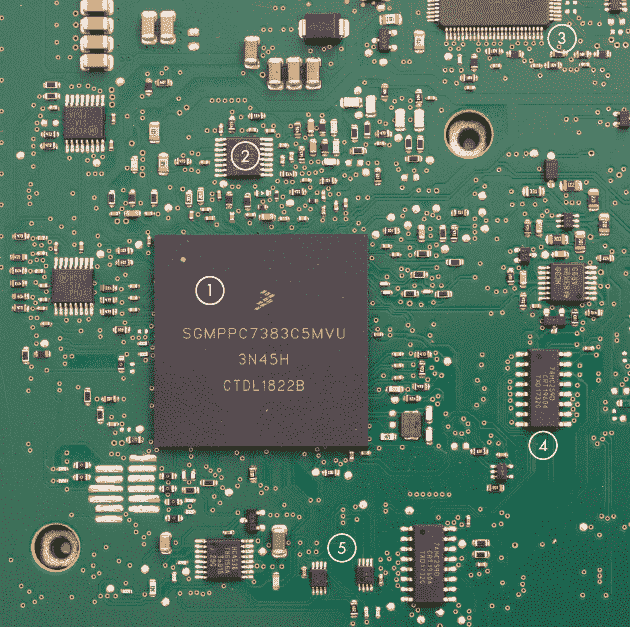

图 3-27：汽车 ECU 的 IC 封装

图 3-27 展示了以下内容：

1.  **BGA 封装**：该设备的主要处理器。

1.  **TSSOP 封装**：数字触发器。

1.  **QFP 封装（这里只显示边缘）**：未知 IC。

1.  **SOIC 封装**：数字逻辑门。

1.  **TSSOP 封装**：两个未知 IC。

### 识别电路板上的其他组件

现在你已经看过了主要的 IC，让我们来看看其他一些组件。

#### 端口

端口是连接设备并理解它们互联的各种组件功能的一个很好的起点。数字 I/O 端口最为有趣，因为它们可能用于常规设备通信，或者提供调试接口。

一旦你基于外观识别了端口类型，你通常会找到端口上使用的协议类型。（请参见第二章，回顾各种端口协议。）如果仅凭外观无法识别端口，可以连接示波器来测量电压并识别数据模式。注意高电压和低电压，以及你看到的最短脉冲的持续时间。最短脉冲将告诉你*比特率*，例如一个 8.68 微秒的脉冲，这对应于 UART 上的 115,200 比特率。比特率通常是单个比特的翻转速率；最短脉冲通常表示 0 或 1。我们通过取倒数来得到比特率。在这个例子中，1 / 0.00000868 = 115,207，我们将其四舍五入为标准波特率 115,200。

或者，你也可以从端口追踪 PCB 线路到 IC，然后利用 IC 的引脚分配信息来识别端口类型。

#### 接头

*头针*基本上是内部端口，因此它们很有趣，因为它们可能暴露出一些功能，这些功能并不是为普通用户设计的，而是为了调试、制造或维修而包含在设计中的。你可能会找到内部的 JTAG、UART 和 SPI/I2C 端口。有时，头针并没有实际安装在 PCB 上，但它们的焊盘仍然存在，因此通过一些简单的焊接即可提供访问。图 3-28 展示了几个表面贴装头针的例子。

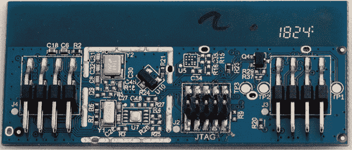

图 3-28：PCB 头针

中间的头针标记为 JTAG。这个头针并未安装，但我们将其焊接到焊盘上，从而为主 IC 提供了 JTAG 访问，因为该 IC 没有启用任何内存读取保护。这个特别的头针是 Ember 数据包跟踪端口连接器。有关更多实用的头针引脚排列，请参见附录 B。

穿孔头针更容易探测，但小型设备可能需要表面贴装头针。图 3-29 展示了设备内部的经典 UART 头针。

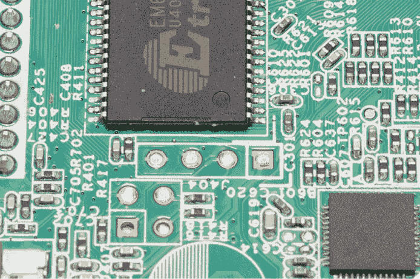

图 3-29：设备中的 UART 头针

头针是电路板上标有“J404”的四个排针（请注意，图中的 J404 是倒置的）。这个头针没有“标准”引脚排列，你需要进行一些反向工程来确定它的引脚配置。左边的引脚可以通过肉眼看到连接到较大的“接地平面”，你可以用万用表确认这一点。我们将在后面“映射 PCB”部分中详细讨论这个内容，见第 102 页。

#### 模拟电子学

大多数你找到的小型组件都是模拟电子元件（电阻器和电容器），虽然你也可以找到作为表面贴装元件（SMD）存在的电感器、振荡器、晶体管和二极管。电容器和电阻器具有与本书相关的特定特性。图 3-30 中的 PCB 上有许多这样的元件。

电容器（如图 3-30 中的 C31）可以储存和释放少量电荷，常用于过滤信号。电容器就像非常快速且小型的可充电电池。它们可以每秒充放电数百万次，这意味着任何快速的电压波动都会通过充电或放电电容器来抵消其影响。其效果类似于“低通滤波器”。这也是你会看到许多电容器出现在集成电路（IC）周围，连接在电源与接地之间的原因之一。在这种功能下，它们被称为*去耦电容器*，它们的作用是为 IC 提供局部的电源，以防止电噪声注入电源线。它们还帮助阻止其他区域的噪声影响到 IC。如果电压故障注入（VFI）依赖于电源电压的快速变化，去耦电容器能够抵消 VFI 的影响，我们将在第五章进一步讨论*电压故障注入（VFI）*，但可以想象，如果 VFI 依赖于电压快速变化，去耦电容器则能够消除 VFI 的影响。因此，我们首先去除尽可能多的去耦电容器，而不让系统变得不稳定。


图 3-30：表面贴装电阻和电容

电阻器（如 图 3-30 中的 R26），顾名思义，抵抗电流的流动，在我们的应用中，最有趣的功能是作为分流电阻、上拉/下拉电阻（见第二章解释）和零欧姆电阻。分流电阻用于在进行旁路分析时测量 IC 的电流（有关更多细节，请参见第八章）。表面贴装电阻器通常在其上印有一个数字，表示电阻值；例如，abc 表示 ab × 10^c 欧姆电阻。

最后，零欧姆电阻器（如 图 3-30 中的 R29）可能看起来有些神秘，因为它们不提供任何电阻；它们基本上就是导线。它们的存在意义在于允许在制造时配置电路板：零欧姆电阻可以采用与其他电阻相同的制造技术进行安装。通过放置或不放置它们，可以将电路打开或关闭，这可以用于例如作为配置输入给 IC。（举个例子，回想一下“引导配置引脚”部分，第 85 页，关于 NXP i.MX53 的 BOOT_MODE。）制造商可以选择使用相同的 PCB 设计用于调试板和生产板，但随后在相关引脚上使用零欧姆电阻来选择这些板的引导模式。这就是为什么零欧姆电阻特别值得关注；它们可以改变安全敏感的配置，因为它们容易被移除或创建。只需在相邻的焊盘之间放置一个焊锡球，就足以模拟一个零欧姆电阻。

你还可能会遇到封装尺寸标记，例如*0603*。这表示电阻或电容的物理尺寸；例如，0603 大约是 0.6 × 0.3 毫米。表面贴装元件的尺寸可以小到 0201，尽管随着技术的进步和消费设备的变小，尺寸仍然在不断变小。

#### PCB 特性

我们在 PCB 上看到的其他有趣特性包括跳线和测试点。*跳线*（有时称为*跳带*）用于通过开关它们来配置 PCB，随着特定电路的开闭，它们也会开闭。它们与零欧姆电阻的功能完全相同，只是它们更容易插入或断开。它们通常看起来像带有两到三个引脚的插头，这些引脚上有一个小的可拆卸连接器，用于例如配置特定的 IC（请参见之前提到的 NXP i.MX53 的 BOOT_MODE）。跳线尤其有趣，因为它们可能提供访问安全敏感配置的途径。图 3-31 显示了可以安装标记为 JP1 的跳线插头的焊盘。

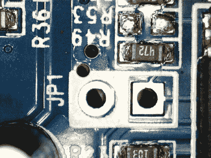

图 3-31：跳线插头焊盘

*测试点* 在制造、修复或调试过程中用于提供对特定 PCB 走线的访问。测试点可以非常简单，只有 PCB 上的一个焊盘，可以通过弹簧针、完整的连接器或插头进行连接。

图 3-32 显示了可用于探测的暴露线路。

如你所见，测试点也可以是小型的裸露金属组件，示波器探头可以接触到这些组件。

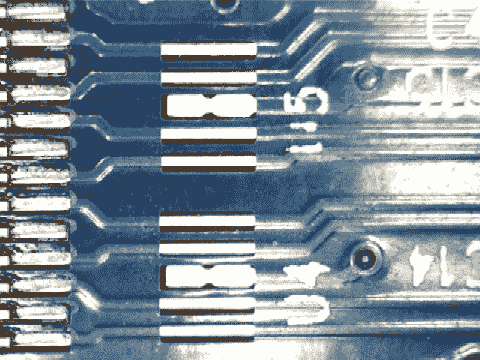

图 3-32：测试点

## 绘制 PCB 地图

现在让我们来看一下 PCB 本身。从 PCB 中推理电路设计的过程称为 *逆向工程*。在第 77 页的“数据表和原理图”一节中，我们介绍了原理图和布局以及如何阅读它们。板的布局（编码在 Gerber 文件中）会发送到制造工厂进行生产。我们很少能接触到这个文件（在之前的示例中，我们通过使用开源产品来“作弊”）。实际上，我们更感兴趣的是反向过程：从物理产品回推到（安全敏感部分的）原理图。

这个过程非常有用，因为我们通常知道某个 IC 上有我们想要访问的特定信号，比如之前我们标识的启动模式引脚。或者，我们通常知道 IC 上有一个调试或串行连接器，我们想要弄清楚 PCB 上该连接器的引脚排列。

对于故障注入和电源分析等主题，我们通常需要针对某个特定的电源网进行测试。在这种情况下，我们可能有一个电源管理 IC，我们希望看到它供电的其他 IC。为此，我们需要沿着电源走线从一个 IC 连接到另一个 IC。

PCB 的作用是传输电力和信号到其组件（比如我们刚提到的集成电路和连接器）。它本质上是由导电材料、隔离材料和组件组成的三明治结构。PCB 通常由几层到几十层构成，每一层彼此电气隔离。*走线* 看起来像是 PCB 上的线，而 *通孔* 则像是走线末端的孔（参见 图 3-33）。这些通孔连接着其他层上的走线，位于 PCB 内层或表面。通常，组件位于 PCB 的正面和背面。

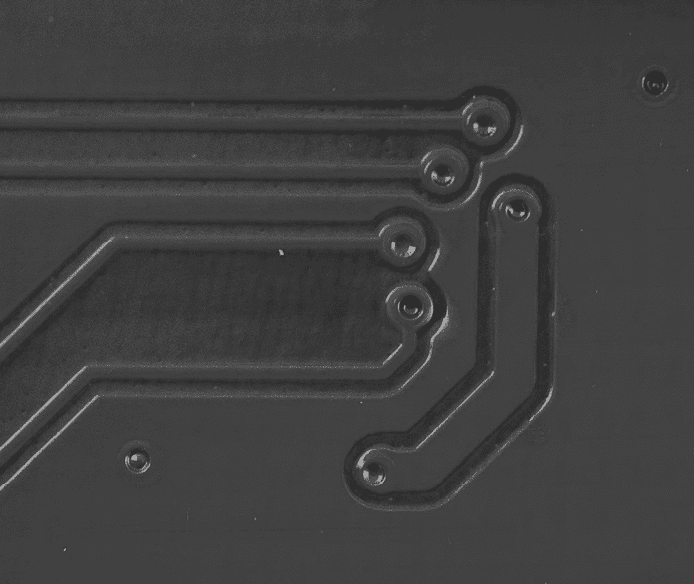

图 3-33：走线与通孔；通孔可能被覆盖（*封闭*），如本照片所示，或暴露（*未封闭*）

PCB 的外侧有印刷标记，用于标识组件、公司标志、PCB 零件号以及其他图案。这些标记被称为 *丝网印刷*，在将 PCB 原理图与实际 PCB 对照时非常有用。此外，在成千上万的标注组件中寻找电阻 R33 也是一种乐趣。所有在 图 3-30 中显示的文本和线条都属于丝网印刷的一部分。

当你将集成电路（IC）引脚图映射到电路板时，通常在芯片的丝印层（以及 IC 封装上）会标注一个点，表示引脚 1。

以下参考设计符号值得记忆，尽管你也可能会找到这些元件的其他设计符号：

+   C = 电容器

+   R = 电阻器

+   JP = 跳线

+   TP = 测试点

+   U = 集成电路（IC）

+   VR = 电压调节器

+   XTAL 或 Y = 振荡器（晶体）

你可以尝试通过视觉跟踪 PCB 的电路走向，但这样做很快会变得棘手，因此最常见的方法是拿起你最喜欢的万用表，将其设置为测量电阻（记住，最好选择具有蜂鸣功能的万用表，这样你就不需要一直看着它）。在开始测量之前，了解所有的电路走线都覆盖着*焊接掩膜*是很重要的，焊接掩膜是使 PCB 呈现绿色、红色、黑色或其他颜色的层。焊接掩膜可以防止在制造过程中发生腐蚀和意外的焊接桥接。焊接掩膜是非导电的，因此你不能使用万用表直接接触到电路走线。然而，你可以很容易地刮掉焊接掩膜，甚至可以用万用表探针的尖端来暴露铜质走线。

万用表通过在探针之间施加微小电流并测量给定测试电流下的探针电压来测量电阻。这实际上是通过欧姆定律（*V* = *I* × *R*）来计算电阻。因此，你只能在无电源的电路上使用万用表。电路中存在的任何电压，充其量会干扰测量，最坏的情况下会损坏万用表。

这些走线传输输入/输出信号，如 JTAG、I2C 或 DRAM 总线信号，它们也可以形成电源和地面平面。信号通常在两个 IC 之间，或者在 IC 和端口或接头之间传递。如果你像我们建议的那样使用万用表，请注意，某些类型的元件仍然可能干扰万用表的测量。大型电容器通常看起来像是短路，因为微小的测试电流正在非常缓慢地给电容器充电，这会给出类似低电阻的读数。半导体元件可能也会在一个方向上读作低电阻，因此如果你看到一个信号似乎连接到了不合理的区域，请对你的测量结果保持怀疑。通常，直接短路（0 Ω，万用表和探针的电阻可能会测量在 0 到 10 Ω之间）是“真实”的连接；任何更高的电阻值可能是电路元件的伪影。

从 IC 引脚上，常见会看到上拉或下拉电阻连接到 IC 引脚。这些通常不是网络的“最终目的地”，所以在大多数情况下你需要进一步探查。如果你看到很多连接，可能是接地网络；通常，单一的接地平面会贯穿整个 PCB。每个 IC 至少有一个接地引脚。端口的金属外壳通常是接地的，任何连接器肯定会有接地连接到至少一个引脚。较大的 IC 可能有数十个接地引脚，以便将电流负载分布到多个引脚上。IC 还可能有独立的模拟和数字接地引脚。数字线路上的开关动作会在地线引起较大的电压差，产生大量噪声，因此可以通过使用独立接地来将其与模拟电路隔离。在某些情况下，PCB 会将这些数字和模拟接地连接起来。你通常可以在端口的金属外壳处找到接地，或通过丝印上的文字*GND*标识接地。

有时端口上的金属外壳（通常称为屏蔽）不会直接连接到数字接地，因此在深入研究之前，始终需要对一些潜在的接地点进行快速检查。

PCB 可以有一个或多个电源平面，每个平面通常为组件，特别是较大的 IC 提供不同的电压。常见的电压可以通过丝印上的文字识别，如 5 V、3.3 V、1.8 V 和 1.2 V。

各种电压由*电压调节器*或*电源管理 IC（PMIC）*生成。电压调节器是简单的组件，它们将连接到 PCB 的基础原始电压转换为多种稳定的电压。例如，LD1117 接受 4V 到 15V 之间的原始电压，并将其转换为 3.3V。PMIC 通常用于更复杂的设备，如手机。它们提供各种电压，并且可以通过外部指令开关各种电压的开关。它们可能通过诸如 I2C 等协议与它们所供电的 SoC 进行通信，这样如果 SoC 中的操作系统需要更快运行，它可以指示 PMIC 增加供电电压。当导电大电流时，电压可能会沿着走线发生下降，因此 PMIC 的反馈电路可以验证到达组件的电压，允许 PMIC 在必要时调整电压。

有时你可能想绕过 PMIC，并提供自己的电源（例如用于故障注入）。起初，这可能看起来很棘手，因为 PMIC 在启动和操作过程中可能经过复杂的电压序列，但实际上我们很少见到只提供恒定电压会出现问题。我们猜测这些电压序列的目的是为了节省电池电量，如果你不执行这些操作，IC 的工作似乎不会受到影响。此外，当提供自有电源时，你需要保持反馈回路的完整性。因此，只向你正在调查的 IC 提供自己的独立电源。你希望 PMIC 保持正常，因为它可能在看到稳定的输出电压之前会将主 IC 保持在复位状态。

了解这些基础后，你可以开始回答以下问题：

1.  IC 或 I/O 通道运行在什么电压水平？为设备通电，测量接地与相关 IC 引脚之间的稳态电压或附近 PCB 线路上的电压。

1.  接地平面连接到哪里？任何端口的金属外壳都将连接到地。你可以将其作为参考，在断开设备电源后，通过之前描述的蜂鸣测试识别所有其他接地点，无论是在 IC 引脚还是连接器上。

1.  电源是如何在 PCB 上分布的？你可以像以前一样测量所有引脚上的电压，或者使用蜂鸣测试来识别所有连接到相同电源平面的点。

1.  JTAG 引脚连接到哪里？假设你已经识别了 IC 的 JTAG 引脚，但你想知道它们连接到了哪个接头或测试点。使用蜂鸣测试，在 JTAG IC 引脚和所有“可疑”点之间进行测试。如果你真的想更专业，可以取一根导线，将一端剥成“风扇”形状，如图 3-34 所示。将探针的一端连接到导线上，并“扫过”电路板，这比手动接触每个点要高效得多。如果你想更精致一点，也可以购买小型金属刷来实现相同的目的。

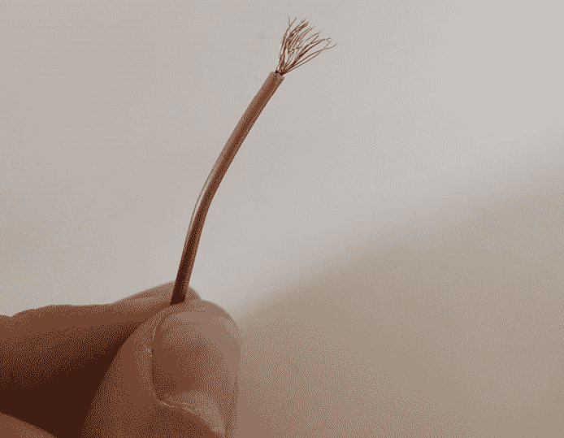

图 3-34：连通性测试仪

想了解更多关于 PCB 反向工程的信息，可以参考 Joe Grand 的《Printed Circuit Board Deconstruction Techniques》USENIX 论文。如果你想深入了解设计方面的内容，Christopher T. Robertson 编写的《Printed Circuit Board Designer’s Reference: Basics》（普伦蒂斯·霍尔出版社，2003 年）一书解释了 PCB 的物理制作过程。有关更多反向工程技术，可以参阅 Ng Keng Tiong 的《PCB-RE: Tools & Techniques》（CreateSpace 独立出版，2017 年）。

### 使用 JTAG 边界扫描进行映射

到目前为止，我们主要讨论了反向工程中用于识别 PCB 连接的被动方法。在上一章中，我们提到过 JTAG 边界扫描模式的存在。通过边界扫描，我们可以使用芯片驱动板上的信号，并使用测量设备查明该信号的走向。边界扫描还可以用来感应芯片引脚上的信号，这意味着我们可以在板上驱动信号，并找出该信号连接到哪个引脚。

边界扫描要求我们在反向工程过程中为板子提供电源。它还需要一些初步信息。我们需要一个 JTAG 头来执行这个过程！通常，使用 JTAG 边界扫描是我们在完成一些基本的反向工程工作之后的一个步骤。它还要求我们为相关设备准备一个 JTAG 边界扫描描述语言（BSDL）文件，并且该设备必须启用 JTAG 边界扫描（并非所有设备都支持）。

让我们以汽车 ECU 为例。E82 ECU 使用 NXP MPC5676R 芯片。我们可以通过简单的在线搜索找到 MPC5676R 芯片的 BSDL 文件，这意味着尝试连接 JTAG 接口是值得的。检查板子时，发现一个未安装的 14 引脚头，其外形与这些设备常用的 14 引脚 JTAG 接口非常相似。我们将一个头插到这个位置，并连接一个 JTAG 适配器（见图 3-35）。

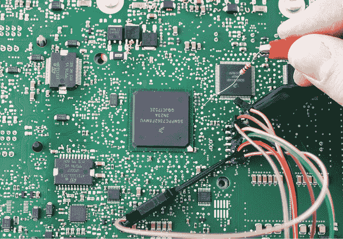

图 3-35：JTAG 头和适配器连接到 E82 ECU；使用 1 kΩ电阻将 1 Hz 方波信号输入到测试点

接下来，我们使用 TopJTAG 软件加载 BSDL 文件，并将芯片置于*EXTEST*模式。在此模式下，我们可以完全控制芯片的 I/O 引脚。由于您可能会通过随意翻转引脚（例如，意外地发出开关电源的信号）而引起混乱，因此存在一定的风险。还有*SAMPLE*模式，这意味着芯片仍在运行，它可能会驱动输出为高或低，从而阻止有效的映射。我们将坚持使用*EXTEST*模式。

TopJTAG 显示 JTAG 边界扫描连接性；这对我们的反向工程非常有利。最后我们将在软件中看到像图 3-36 这样的屏幕。

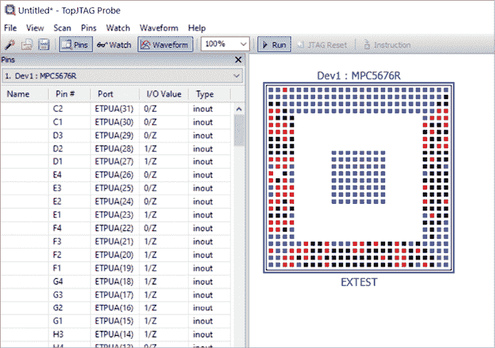

图 3-36：TopJTAG 软件使用 BSDL 文件显示引脚状态的图形视图。

在图 3-36 中，您可以看到设备上每个引脚的状态。这是一个“实时”视图，因此如果引脚上的外部电压发生变化，我们可以在这张图中看到颜色变化，或者在表格中看到 I/O 值的变化。

要将测试点映射到引脚，我们可以使用信号发生器在测试点上驱动方波。您可以在图 3-35 中看到，使用 1 kΩ电阻将低电流方波信号输入到板上。我们应该能在 TopJTAG 屏幕上看到相应引脚的切换。如果没有信号发生器，您还可以将 1 kΩ电阻的一端连接到板上的 VCC 点，另一端轻触测试点。

使用该软件，你也可以做相反的操作：通过切换来自特定引脚的信号，你可以在电路板的不同位置测量，找出该引脚连接的位置。不幸的是，软件中没有生成波形的功能，但你可以使用 CTRL-T 快捷键手动完成此操作（或者找到一些按键注入软件）。我们将在附录 A 中讨论执行这种类型工作的工具。例如，Joe Grand 的 JTAGulator 可以用于自动将测试点映射到边界扫描位。

## 从固件中提取信息

固件镜像包含了设备上运行的大部分代码，因此查看它们通常是非常有趣的，可以帮助找到攻击点。到目前为止，我们主要讨论的是可以通过眼睛看到的信息或简单的电气测试。现在我们将跨越一个巨大的复杂性鸿沟，详细介绍如何实际操作固件。乍一看，这似乎是从 PCB 的琐碎细节上大大偏离了，但如果你回想一下我们收集信息的整体目标，分析固件是一个至关重要的步骤（在许多情况下，甚至是最重要的步骤）。在本书的其余部分，我们将讨论许多依赖固件的操作。例如，了解如何找到加密签名，是知道何时可以应用故障注入的一个重要部分；看到可能引用签名的代码，是你能够找到签名检查例程位置的一个良好迹象。

### 获取固件镜像

在设备实际摆在你面前，并且刚刚讨论完 JTAG 后，你可能会认为我们接下来要从设备中提取固件镜像。但考虑到最小阻力的路径，我们首先检查是否可以通过从更新网站下载固件镜像，或者如果设备支持 Linux，检查*/lib/firmware*目录来获取固件镜像。

固件镜像可能作为一个单独的文件提供下载，也可能嵌入在安装包中。如果是前者，请跳到下一节；如果是后者，使用你的软件逆向工程技巧在安装目录中找到更新文件。一种技巧是进行普通字符串搜索，查找设备打印出的已知字符串，尽管固件镜像通常是压缩的，你可能找不到原始字符串。你可以使用 binwalk 工具在文件中查找 LZMA 文件或 deflate（zlib/gzip）压缩镜像。事实上，我们稍后将使用 binwalk 来切割固件镜像并进一步分析。另一种方法是执行更新，然后在固件更新过程中，通过 Wireshark（用于以太网连接）或 socat（用于 Linux）等工具嗅探通信通道中的镜像。

一些设备支持 USB 直接固件更新（DFU）标准，该标准用于将固件映像下载和上传到设备中。如果目标设备支持此标准，它通常会作为一种可选的启动模式启用。例如，可以通过跳线设置此模式，或者如果板载固件映像损坏，可能会自动选择该模式。你可能通过故障注入来破坏映像加载过程，这可能仅仅是通过短接数据线，导致加载损坏的数据。一旦进入 DFU 模式，你可能能够上传（提取）固件映像。如果设备支持上传并且 dfu-util 工具支持该设备，它可以执行此操作。

该设备还可能支持其专有协议，称为 DFU 模式，并且可能有多个恢复模式。例如，iPhone 和 iPad 通常具有“恢复模式”，允许通过 USB 重新刷新设备并运行 Apple 可以更新的固件。此外，单独的“DFU 模式”运行不可更改的 ROM 代码，允许通过 USB 重新刷新设备。“DFU 模式”是一个专有协议，不符合 USB 标准的 DFU 模式。

如果你已经用尽了获取映像的软件方法，或者只是想尝试硬件攻击，你可以尝试从闪存芯片中提取固件。这对于外部闪存芯片来说是*简单*的做法。一些 SoC 有内部闪存，仅通过芯片级逆向工程和去封装后的微探针可访问，因此超出了本书的范围。

要将闪存芯片从电路板上取下，你需要对其进行除焊，这并不像听起来那么难，但确实需要一个热风工作站。获取映像的现成方法是购买一个内存读卡器。如果你希望尽量减少麻烦，FlashcatUSB 系列的产品是一个不错的选择。该公司生产的型号支持 SPI 和并行闪存芯片，价格从低到中等不等。

你还会看到各种读取 SPI 闪存的其他方法。解决方案已经通过 Arduino Teensy 设备和树莓派制作出来。Jeong Wook（Matt）Oh 的《逆向工程闪存内存以获取乐趣和利益》（2014 年 Black Hat 会议）描述了一种 DIY 方式来获取映像，是学习如何创建硬件与闪存芯片和闪存芯片内存编码进行交互的绝佳方法。它详细介绍了通过 FTDI FT2232H 进行 bit-banging 连接芯片并读取它的过程。

说到读取板载闪存，我们还应该提到如何读取 eMMC 芯片。这些芯片基本上是芯片形式的 SD 卡，正如第二章所述。得益于一些很好的向后兼容性，你可以在 1 位模式下运行它们（这意味着你只需要 GND、CLK、CMD 和 D0）。图 3-37 展示了一个连接的 SD 卡插接器的例子，用于读取 eMMC 内存。

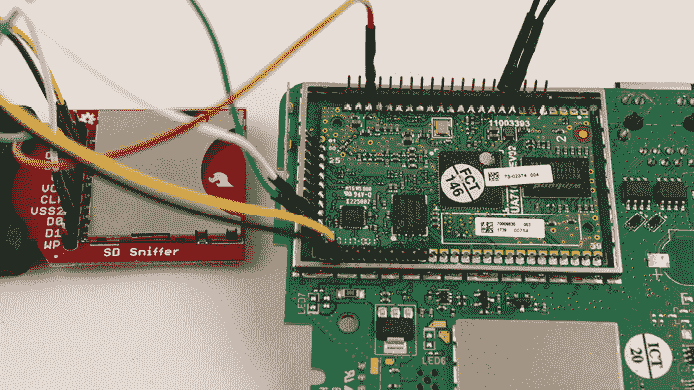

图 3-37：在此板上，eMMC 闪存连接（位于板底部，不可见）可通过多个焊盘访问，您可以将引脚头插入这些焊盘。

在此示例中，我们通过接地 nRST 引脚将目标处理器保持在复位状态，然后插入 SD 卡到 USB SD 卡读卡器中。保持目标处理器在复位状态是必要的，否则它会尝试同时切换 I/O 线路。接下来，我们可以将 SD 卡上的文件系统挂载到计算机上。在此示例中，这是一个在 Linux 中可读取的标准文件系统。由 Amir “Zenofex” Etemadieh、CJ “cj_000” Heres 和 Khoa “maximus64” Hoang 于 2017 年 Black Hat 会议上发表的讲座《使用$10 SD 卡读卡器进行硬件黑客攻击》以及 Exploitee.rs Wiki 是一个宝贵的资源。

### 分析固件映像

接下来的任务是分析固件映像。它将包含多个块，代表不同的功能组件——例如，启动加载器的各个阶段、数字签名、密钥槽和文件系统映像。第一步是将映像分解成其组件。每个组件可能是明文的、压缩的、加密的和/或签名的。Binwalk 是一个有用的工具，用于查找固件映像中的所有组件。它通过与编码不同文件类型的“魔术”字节匹配来识别不同的部分。

对于加密数据，您首先需要弄清楚使用的加密方式和密钥。最好的方法是进行旁道分析（参见第 8 到 12 章）。常见的选项是 AES-128 或 AES-256，使用 CTR 或 CBC 模式，虽然我们也见过使用 ECB 和 GCM 模式。一旦获得密钥，就可以解密映像进行进一步分析。关于如何处理数字签名，请参见第 116 页的“签名”部分。

一旦获得包含明文或压缩块的映像，binwalk 可以帮助完成以下任务：

+   使用`--signature`选项检测映像中的各种文件、文件系统和压缩方法。

+   使用`--carve`、`--extract`或`--dd`选项提取不同的组件。如果指定`--matryoshka`，则会递归执行此操作。

+   使用`--opcode`或`--disasm`分析文件中的操作码来检测 CPU 架构。

+   使用`--raw`搜索固定字符串。

+   使用`--entropy`分析文件的 Shannon 熵或使用`--fast`选项分析 zlib 压缩比。使用`--save`将熵图保存到文件中。

+   使用`--hexdump`进行十六进制转储并比较二进制文件。

+   使用`--deflate`或`--lzma`通过暴力破解找到缺少头部的压缩数据。

作为示例，让我们简要查看一些可以轻松下载的设备固件（在本例中为 TP-Link TD-W8980 路由器的固件）。我们查看的是版本 TD-W8980_V1_150514（找到为*TD-W8980_V1_150514.zip*）。解压缩文件后，像这样运行 binwalk：

```
$ **binwalk TD-W8980v1_0.6.0_1.8_up_boot\(150514\)_2015-05-14_11.16.43.bin**
DECIMAL       HEXADECIMAL     DESCRIPTION
-----------------------------------------------------------------------------------------------
17524         0x4474          CRC32 polynomial table, little endian
20992         0x5200          uImage header, header size: 64 bytes, header CRC: 0x8930352,
                              created: 2015-05-14 03:01:45, image size: 37648 bytes, Data
                              Address: 0xA0400000, Entry Point:    0xA0400000, data CRC:
                              0x1F36D906, OS: Linux, CPU: MIPS, image type: Firmware Image,
                              compression type: lzma, image name: "u-boot image" 1
21056         0x5240          LZMA compressed data, properties: 0x5D, dictionary size: 8388608
                              bytes, uncompressed size: 101380 bytes
66048         0x10200         uImage header, header size: 64 bytes, header CRC: 0xBEC297,
                              created: 2013-10-25 07:26:06, image size: 41781 bytes, Data
                              Address: 0x0, Entry Point: 0x0, data CRC: 0xBECBCEC2, OS: Linux,
                              CPU: MIPS, image type: Multi-File Image, compression type: lzma,
                              image name: "GPHY Firmware" 2
66120         0x10248         LZMA compressed data, properties: 0x5D, dictionary size: 8388608
                              bytes, uncompressed size: 131200 bytes
132096        0x20400         LZMA compressed data, properties: 0x5D, dictionary size: 8388608
                              bytes, uncompressed size: 3979748 bytes
1442304       0x160200        Squashfs filesystem 3, little endian, version 4.0,
                              compression:lzma, size: 6265036 bytes, 592 inodes, blocksize:
                              131072 bytes, created: 2015-05-14 03:09:10
```

输出（为了可读性进行格式化）揭示了一些有趣的信息：一个 u-boot 启动加载程序镜像 1，一个 GPHY 固件 2，以及一个 Squashfs 文件系统（Linux） 3。如果你使用 `--extract` 和 `--matryoshka` 选项运行 binwalk，你将得到这些块作为单独的文件，包含组件的压缩和解压版本，以及解包后的 Squashfs 文件系统。

我们主要关注嵌入式系统的硬件攻击，但软件逆向工程中你可能需要的一个功能是识别加密块和签名。后续章节假设你已经弄清楚了这一点，因此我们将通过一个示例分析来说明。现在，如果我们修改 Squashfs 文件系统中的一个文件（例如 */etc/passwd* 或 */etc/vsftpd_passwd*），我们会发现路由器无法接受新的固件镜像。这是因为使用了 RSA-1024 签名来验证镜像的真实性。binwalk 输出中没有显示签名，因为签名通常只是一些看似随机的字节序列，存在于特定的偏移量位置。你可以通过熵分析找到这些偏移量。

#### 熵分析

*熵* 在计算机科学中用于度量信息密度。为了我们的目的，我们使用的是 8 位熵。熵为 0 意味着一个数据块包含单一的字节值，而熵为 1 意味着一个数据块包含从 0 到 255 每个字节值的相同数量。接近 1 的熵值通常表示加密密钥、密文或压缩数据。

满怀希望和兴奋，我们再次运行 binwalk，使用 `--nplot` 和 `--entropy` 选项：

```
$ **binwalk TD-W8980v1_0.6.0_1.8_up_boot\(150514\)_2015-05-14_11.16.43.bin --nplot --entropy**

DECIMAL       HEXADECIMAL     ENTROPY
--------------------------------------------------------------------------------
0             0x0             Falling entropy edge (0.660092)
24576         0x6000          Rising entropy edge (0.993507)
57344         0xE000          Falling entropy edge (0.438198)
69632         0x11000         Rising entropy edge (0.994447)
106496        0x1A000         Falling entropy edge (0.447692)
135168        0x21000         Rising entropy edge (0.994445)
1417216       0x15A000        Falling entropy edge (0.000000)
1445888       0x161000        Rising entropy edge (0.993861)
7704576       0x759000        Falling entropy edge (0.779626)
```

binwalk 工具计算每个块的熵，并通过查找熵的大幅变化来确定块的边界。这通常通过找到连续的压缩或加密数据块来实现，有时甚至能帮助找到密钥材料。在这个例子中，我们正在寻找一个 RSA-1024 签名（128 字节），但没有找到这样的块。

如果你再次运行 binwalk，省略 `--nplot` 选项，它会生成如图 Figure 3-38 所示的图表。

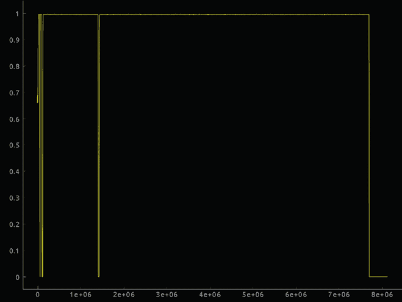

图 3-38：使用默认设置的 binwalk 熵输出

图表也没有显示我们要寻找的 1,024 位/128 字节签名。虽然这个签名可能嵌入在某个块中，但我们已经自作自受。我们使用 binwalk 的方式永远不会显示一个 128 字节的熵峰。还记得熵是如何计算的么？这意味着 binwalk 会将文件切割成数据块，并计算这些块的熵值。默认情况下，块大小似乎是 0x1000，或者 4,096 字节。如果我们的 128 个随机字节嵌入在一个 4,096 字节的块中，那么熵值的影响就微乎其微。

这就是为什么 binwalk 有 `--block` 选项的原因。现在，虽然很有诱惑使用 128 字节的块大小，但如果签名并不恰好存储在一个块内，我们仍然无法得到清晰的熵峰。因此，为了安全起见，我们倾向于使用 16 字节的块大小。

现在，我们遇到了另一个问题：执行非常慢。输出仅显示以下内容：

```
$ **binwalk TD-W8980v1_0.6.0_1.8_up_boot\(150514\)_2015-05-14_11.16.43.bin --save --entropy \**
**--block=16**

DECIMAL       HEXADECIMAL     ENTROPY
--------------------------------------------------------------------------------
0             0x0             Falling entropy edge (0.384727)
```

这并不太有用，因为根本没有识别出任何块。输出图表在图 3-39 中也没有显示我们想要的内容。

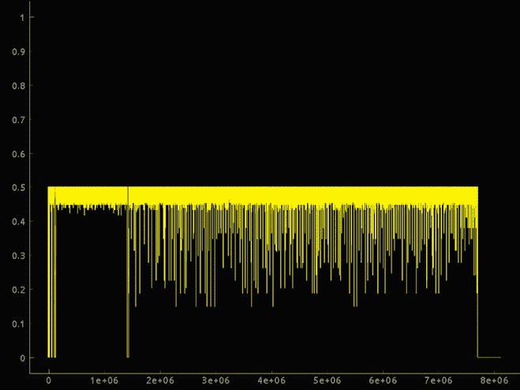

图 3-39：使用 16 字节块大小的熵输出

其原因是熵的计算。重要的是要理解，对于小于 256 字节的块，根据定义，熵不可能是 1。实际上，熵为 1 仅在每个字节值在块中具有相同的频率时才能实现。如果一个块小于 256 字节，就不可能为每个字节值具有 1 或更高的频率；因此，熵不可能是 1。事实上，当块长度为 16 时，熵最大为 0.5。

由于 binwalk 进行熵的边缘检测，我们需要调整上升和下降边缘的阈值。如果最大熵为 0.5，你可以设置例如`--high=0.45`和`--low=0.40`。或者，你可以使用`--verbose`选项查找你自己的熵“峰值”，该选项会输出每个块的熵值。

当然，边缘检测不起作用。我们得到了超过 2000 个边缘。原因再次是熵的计算。你能猜出*Glib jocks quiz nymph to vex dwarf*的熵是多少吗？使用 16 字节的块，第一个块的熵为 0.447。这是因为块大小越小，非随机字节序列偶然只包含唯一字节的可能性越高，因此熵达到最大（换句话说，我们得到了假阳性）。

让我们运用一点常识。如果我们要把一个签名存储在图像中，我们会把它放在哪里呢？很可能我们会把它放在我们要保护的块之前或之后。让我们看看前 0x400 个字节：

```
$ **binwalk --entropy --block 16 --high 0.45 --low 0.40 --save --length 0x400**

DECIMAL       HEXADECIMAL     ENTROPY
----------------------------------------------------------------------
0             0x0             Falling entropy edge (0.384727)
64          1 0x40            Rising entropy edge (0.500000)
80            0x50            Falling entropy edge (0.101410)
208         2 0xD0            Rising entropy edge (0.500000)
336           0x150           Falling entropy edge (0.000000)
608           0x260           Falling entropy edge (0.330848)
640           0x280           Falling entropy edge (0.378050)
688           0x2B0           Falling entropy edge (0.315223)
784           0x310           Falling entropy edge (0.165558)
912           0x390           Falling entropy edge (0.347580)
976           0x3D0           Falling entropy edge (0.362425)
```

看起来有两个高熵区域：`0x40`处的 16 字节 1 和`0xD0`处的 128 字节 2。128 字节块在图 3-40 中的熵图上明显可见。

如果你采用本章早些时候描述的技巧，你应该已经找到了[`github.com/xdarklight/mktplinkfw3/`](https://github.com/xdarklight/mktplinkfw3/)项目页面，那里文档化了该固件映像的头部格式。你猜对了：0xD0 是 RSA 签名（而 0x40 是 MD5 校验和）。

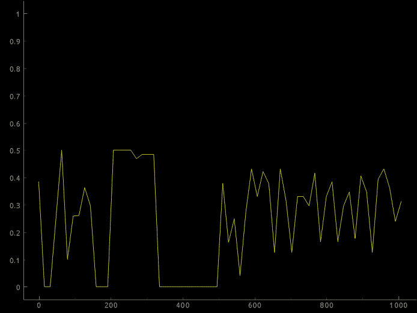

图 3-40：更详细的熵分析，集中在感兴趣的区域

#### 签名

对于签名数据，你需要签名密钥或绕过签名验证的方法，以便加载修改过的固件（我们将在第六章讨论如何绕过签名验证）。

回到我们的固件镜像：要检查数据签名，请修改固件镜像中的一个字节，这个修改不会导致执行失败（例如，在一个字符串常量中，如调试或错误信息）。如果设备在此镜像下无法启动，那么它很可能正在进行签名验证或校验和。需要一些逆向工程来确定是哪种验证方式，尽管这可能不简单。至少验证第一个固件启动阶段的代码将位于 ROM 中，不在你的视野范围内。

你可以寻找图像中的 RSA 或椭圆曲线密码学（ECC）签名，这两者都是高熵字节的序列。一个 RSA-2048 签名将会是 2,048 位（256 字节）长，而例如在曲线*prime256v1*上的 ECDSA 签名将会有 256 × 2 = 512 位的签名（64 字节）。固件块的开始或结束处的熵峰可能表示一个签名。

此外，检查两个旁路信道痕迹之间的差异：一个是在正确签名下启动，另一个是在损坏签名下启动。此测试可以帮助你准确找出启动过程中执行路径何时分叉，这通常（但不一定）发生在签名验证之后。这些信息在你希望通过故障注入绕过签名验证时也很有用。

最后，图像实际上可能会随带用于验证其完整性的公钥，因为 ROM（或熔断器）的空间有限，而公钥（特别是 RSA）相当大。这意味着你可以在固件镜像中查找高熵部分，这些部分就是公钥。对于 RSA-2048，公钥是 2,048 位的模数和公钥指数。通常，这个指数是 65,537（或 0x10001）。在高熵部分旁边找到 0x10001 通常表示 RSA 公钥。对于 ECC，公钥是曲线上的点。有几种方式来编码这一点——例如，在仿射（x,y）坐标中，prime256v1 曲线的 x 和 y 各占 256 位，总共是 512 位。压缩编码利用了椭圆曲线有两个可能的 y 值这一特性，给定曲线和点的 x 坐标，所以 prime256v1 上点的压缩表示只包含完整的 x 坐标（256 位）和 1 位 y 坐标，总共 257 位。“高效密码学标准，SEC 1：椭圆曲线密码学”规定了一种常见的编码方式：如果点是未压缩的，它会以 0x04 为前缀；如果是压缩的，则以 0x02 或 0x03 为前缀，具体取决于 y 的 1 位值。

你可能会想，如何将验证密钥嵌入到对象中以进行安全验证？这很容易被伪造啊！你说得对。为了节省空间，公钥的哈希值通常会存储在保险丝中。这意味着在启动时，首先会验证公钥的哈希值是否与存储的哈希值一致，只有通过验证后，公钥才会用来验证固件镜像。这一过程为攻击者提供了第二个故障注入的切入点。攻击者可以创建一个固件镜像，嵌入他们自己的公钥，并用这个密钥签署固件镜像。接下来，可以通过故障注入绕过密钥验证。

固件镜像的签名方式较少见的包括基于哈希的消息认证码（HMAC）或基于密码的消息认证码（CMAC）。这些认证码要求分发对称密钥，这意味着要么你在每个设备中都编程了一个“根密钥”（能够验证并签署任意固件镜像），要么你为每个设备分配不同的对称密钥，但这样就需要用设备专用的密钥加密每个固件镜像。第一种选择是愚蠢的；第二种选择则成本高昂。第一种选择也正是菲利普 Hue 攻击的发生方式（参见 Eyal Ronen 等人撰写的《IoT Goes Nuclear: Creating a ZigBee Chain Reaction》），因此不要总是认为你可以排除某种方式，因为*肯定没有哪个严肃的产品会这么做*。

## 总结

在本章中，我们探讨了如何收集硬件黑客攻击所需的有用信息，这通常就是你所需要的一切。例如，许多设备并没有固件加密，一旦你有能力通过 JTAG 提取固件，你就能学到足够的知识来利用该设备。

如果运气好的话，我们可以直接学到足够的知识来利用系统，如果我们被迫使用更高级的攻击手段，我们也能理解这些攻击如何应用到我们的系统上。由于本书讨论的是高级攻击方法，我们假设这些方法是必需的，并将直接深入探讨它们的工作原理。我们将结合本章中描述的信息发现技巧和第二章中概述的接口技能，在下一章中测试系统的故障注入弱点。
