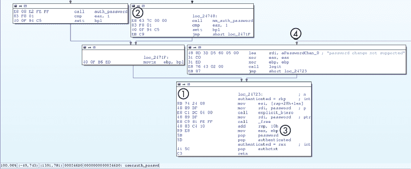
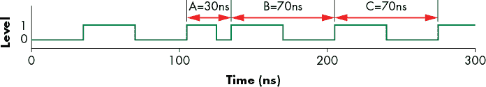
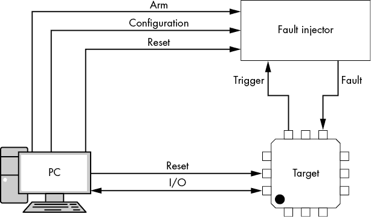
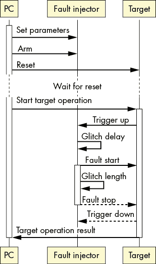
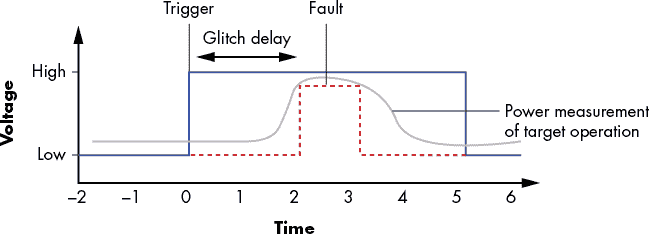
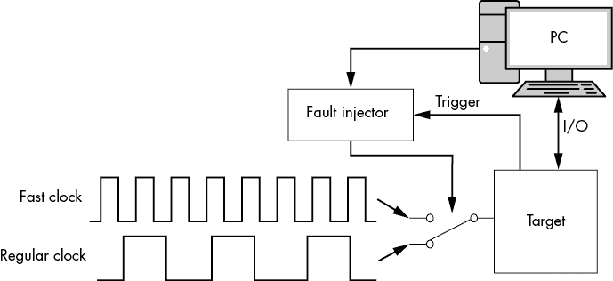
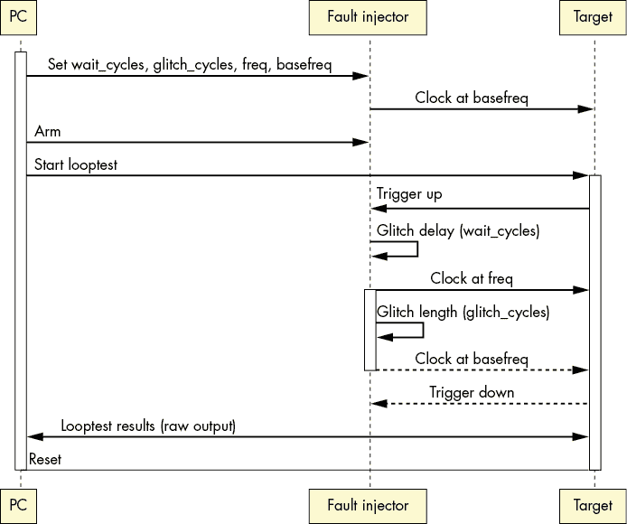
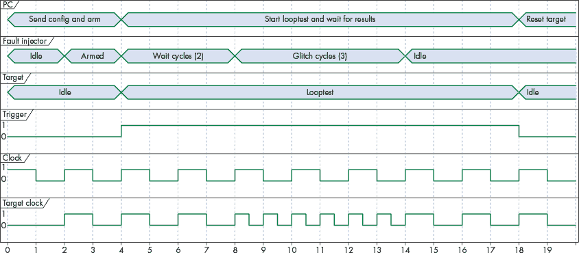
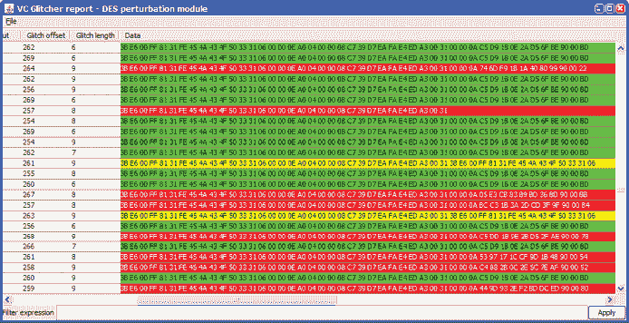
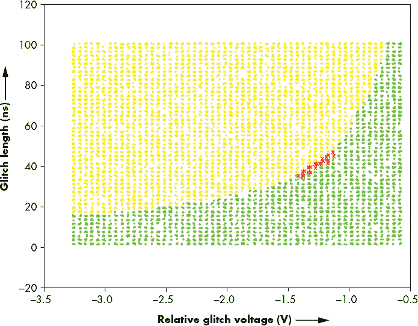

# 4

陶瓷店里的公牛：引入故障注入


故障注入是一门通过在正常设备功能执行过程中引发小的硬件损坏，绕过安全机制的艺术和科学。故障注入对系统安全性可能构成的风险甚至大于旁道分析。旁道分析针对加密密钥，而故障注入则可以攻击其他各种安全机制，例如安全启动，除了能够完全控制系统外，还可能允许直接从内存中提取密钥，而无需复杂的旁道分析。

故障注入的核心是让硬件在超出正常操作参数的情况下运行，并通过操控物理规律来实现预期的结果。这是“自然发生的故障”和“攻击者引发的故障”之间的主要区别。攻击者试图精确地设计故障，使复杂系统发生故障并产生特定效果，从而绕过安全机制。这可能从权限提升到秘密密钥提取不等。

达到这种精确度高度依赖于故障注入设备的精度。精度较低的注入设备会产生更多意想不到的效果，这些效果在每次注入尝试中可能会有所不同，这意味着只有部分故障能够被利用。攻击者尝试最小化故障注入尝试的次数，以便在合理的时间内实现漏洞利用。在第五章中，我们讨论了几种故障注入方式以及故障发生时芯片上发生的物理变化。

故障注入在实践中并不总是一个相关的攻击方式，因为通常需要对目标进行物理访问。如果目标安全地位于一个有安保的服务器机房内，故障注入就不适用了。当你已经用尽了逻辑硬件和软件攻击方式，但仍能物理访问目标时，故障注入可以是一个有效的攻击手段。（软件触发的故障注入是一个例外，因为硬件故障是由软件过程引起的，因此不需要物理存在。更多细节请参见第一章的“软件对硬件的攻击”部分。）

在本章中，我们讨论了故障注入的基础知识，以及为什么要进行故障注入的各种理由。我们还通过识别通过故障绕过身份验证的例子，对真实库（OpenSSH）中的一个实例进行了研究。故障在实践中是不可预测的，它们需要大量调整故障注入测试平台的参数，因此我们还探讨了故障注入测试平台设置的各个部分以及调优参数的策略。

## 故障的安全机制

设备具有多种安全机制，适合用来进行故障注入攻击。例如，JTAG 端口的调试功能可能只有在输入密码后才能启用，设备固件可能经过数字签名，或者设备硬件可能存储一个密钥，软件无法访问。任何理智的硬件工程师都会使用一个单独的位来表示*访问授权*状态，而不是*访问拒绝，回家去*状态，并且会假设这个重要的位会保持其值，直到它的控制软件指示改变。

现在，由于故障注入在实践中是随机的，要精确击中能破坏安全机制的那个比特位并非易事。假设我们可以访问一个故障注入器，在某个特定时刻翻转一个比特位。（这是故障注入中的独角兽：它很美丽，每个人都想要，但在实践中并不存在，除非我们考虑微探针，但那是另一类物理攻击。）

现在，我们可以利用故障注入来绕过各种安全机制。例如，当设备启动并执行固件签名验证时，我们可以翻转保存*(无效/有效签名)*状态的布尔值。我们还可以翻转锁定功能上的锁定位，例如加密引擎，这样就可以使用我们不应该使用的秘密密钥。我们甚至可以在执行加密算法时翻转比特，以恢复加密密钥材料。让我们更详细地看看这些安全机制。

### 绕过固件签名验证

现代设备通常从存储在闪存中的固件镜像启动。为了防止从被篡改的固件镜像启动，设备制造商会对其进行数字签名，并将签名存储在固件镜像旁边。当设备启动时，固件镜像会被检查，并使用与设备制造商相关联的公钥验证签名。只有当签名验证通过时，设备才会允许启动。该验证是通过加密方式确保安全的，但最终设备必须做出二元决策：启动还是不启动。在设备的启动软件中，这个决策通常归结为一个条件跳转指令。针对这个条件跳转的完美故障注入可以诱发一个“有效”的结果，即使固件镜像可能已经被修改。尽管软件可能很复杂，但在单一位置控制的故障就能妥协所有安全性。

在设备启动过程中获得运行时访问权限，允许攻击者妥协其后加载的任何软件，这通常是操作系统和任何应用程序，其中包含了设备的许多有用部分。

### 获得对锁定功能的访问

一个安全系统需要控制对功能和资源的访问。例如，一个应用程序不应该能够访问另一个应用程序的内存；只有内核可以访问 DMA 引擎，且只有授权用户能够访问文件。

当发生未经授权的资源访问尝试时，检查一个特定的访问控制位（或多个位），结果是“拒绝访问”。这个决策通常基于单个位的状态，并通过单一的条件分支指令强制执行。完美的故障注入器利用这个单点故障并可以翻转这个位。嘭！成就解锁。

### 恢复加密密钥

执行加密过程时引入的故障实际上可能会泄露加密密钥材料。关于这个话题，有大量的研究工作，通常归类为*差分故障分析（DFA）*。这个名字来源于对故障密码执行进行差分分析：我们分析正确和故障密码输出之间的差异。已知的 DFA 攻击存在于 AES、3DES、RSA-CRT 和 ECC 加密算法中。

对这些加密算法进行攻击的常见方法是对已知输入数据进行解密，有时不进行故障注入，而有时则在解密过程中注入故障。通过分析输出数据，可以确定密钥本身。已知的 3DES DFA 攻击只需要约 100 个故障即可完全恢复密钥。对于 AES，仅需要一个或两个；有关更多信息，请阅读 Kazuo Sakiyama 等人的文章《信息理论方法优化差分故障分析》。经典的 Bellcore 攻击针对 RSA-CRT，只需一个故障即可恢复整个 RSA 私钥，无论密钥长度如何，即使你理解了数学原理，它依然显得神秘莫测！你可以在*加密中的故障分析*（Springer，2012 年）一书中阅读更多关于此的内容，该书由 Marc Joye 和 Michael Tunstall 编辑。

通过使密码实现只运行一个轮次、跳过密钥添加、部分清零密钥或进行其他破坏，可以实现非 DFA 攻击。所有这些方法都需要分析算法的加密特性和故障，以理解如何从故障执行中恢复密钥。在最简单的情况下，你可以获得包含密钥材料的内存转储。我们将在第六章中通过实验室再次讨论 DFA。

## OpenSSH 故障注入练习

让我们考虑如何在通过 OpenSSH 连接访问时注入故障，并在真实的安全代码段中识别可能的注入点。假设设备已经禁用了固件认证检查和调试端口，唯一的接口是通过连接到监听 OpenSSH 服务器的以太网端口。

### 向 C 代码中注入故障

为了在密码提示阶段尝试故障注入，我们必须检查列表 4-1 中的 OpenSSH 7.2p2 代码。

```
`--snip--`
 50
 51 int **userauth_passwd**(Authctxt *authctxt)
 52 {
 53         char *password, *newpass;
 54         int authenticated = 0;
 55         int change;
 56         u_int len, newlen;
 57
 58         change = packet_get_char();
 59         password = packet_get_string(&len);
 60         if (change) {
 61                 /* discard new password from packet */
 62                 newpass = packet_get_string(&newlen);
 63                 explicit_bzero(newpass, newlen);
 64                 free(newpass);
 65         }
 66         packet_check_eom();
 67
 68         if (change)
 69                 logit("password change not supported");
 70         else if (PRIVSEP(auth_password(authctxt, password)) == 1)
 71                 authenticated = 1;
 72         explicit_bzero(password, len);
 73         free(password);
 74         return authenticated;
 75 }
`--snip--`
```

列表 4-1：*auth2-passwd.c*中的 OpenSSH 密码验证代码

我们在列表 4-1 中复制的`userauth_passwd`函数显然负责密码正确性的“是/否”判断。第 54 行的`authenticated`变量表示有效访问。仔细阅读这段代码，考虑如何通过故障注入来操控执行，使`authenticated`变量在提供无效密码时返回`1`值。假设你可以做诸如翻转位或更改分支之类的操作。不要停下来，直到你找到了至少三种方法；然后阅读以下答案。

以下是一些理论上可以故障这个代码的方法：

+   在第 54 行之后或第 54 行时将`authenticated`标志翻转为非零。

+   将第 70 行`auth_password()`的返回值更改为`1`。

+   将第 70 行比较的结果更改为“true”。

+   将第 70 行的检查值更改为提供的密码。

+   请求更改密码，将`change`设置为`1`，然后使第 62 行的`newpass`指向与`password`相同的位置，并通过软件利用现在在第 64 行和第 73 行释放相同内存的双重`free`调用进行利用。

这个最后的故障场景是非常牵强的，因为我们在实践中从未见过那种控制目标的情况。然而，其他的都是基本故障。一旦你追踪到导致`auth_password()`函数的代码，更多的故障机会就会显现出来。

关键点在于，一些故障在实践中比其他故障更容易实现。通常，定时越精确或所需效果越具体，成功故障的概率就越低。

### 向机器码注入故障

查看 C 代码是一个很好的练习；然而，CPU 并不会执行 C 语言。CPU 执行的是从 C 代码生成的指令，即机器码。机器码对人类来说很难阅读，因此我们将查看汇编代码，汇编代码是机器码的直接表示。汇编代码指令的抽象级别低于 C，并且更直接地表示了硬件中的活动（在高端 CPU 上，还有一个更低抽象级别的微代码层，我们将忽略它，因为它大多是不可见的）。

故障发生在硬件内部，处于物理层，并向上传播到各个抽象层。位翻转可以在 CPU 内部发生，而该 CPU 正在执行一个二进制文件，而这个二进制文件是从某些源代码生成的。因此，尽管故障与之前的 C 代码之间存在某种关系，但查看汇编代码使我们更接近故障。有关此方面的背景阅读，请参见 Bilgiday Yuce 等人所著的《Fault Attacks on Secure Embedded Software: Threats, Design and Evaluation》。

对于本书，我们获取了一个 OpenSSL 二进制文件，并将其加载到 IDA Pro 反汇编程序中。请查看图 4-1 中`userauth_passwd`函数末尾的反汇编。



图 4-1：在汇编代码中识别注入故障的指令

按照惯例，函数返回用户身份验证状态的`rax`寄存器中的值。此`rax`寄存器需要为非零值，程序才能将其解释为`authenticated==true`。请注意，`eax`只是`rax`的低 32 位，因此请通过查看标记为`loc_24723`的最终基本块（标记为 1）来思考导致`rax`为 0 的条件。我们将等待（以下是剧透）。

需要发生的情况是，输入状态必须使得最终的`loc_24723`基本块（位置 1）满足`ebp != 0`。在 Intel 汇编中，`ebp`是`rbp`的低 32 位，`bpl`是`rbp/ebp`的低 8 位。现在回溯代码并思考通过注入故障翻转某个位或跳过某个指令来实现`ebp != 0`的方法。我们再等一下。

这里是我们找到的几种方法：

+   在`loc_24748`（标记为 2）处，跳过对`mm_auth_password`的调用，并希望`eax`为`1`。如果`eax`为`1`，则`setz bpl`指令会使`ebp != 0`，因此`authenticated==true`。

+   在`loc_24748`（标记为 2）处，引入一个故障来跳过`cmp eax,1`指令，并希望`auth_password`将`z`标志设置为`1`。

+   好吧，你可能没找到这个，除非你自己分析了二进制文件中的调用函数。（总是从大局着眼；问题通常就藏在这里！）在`auth_password`调用之后，`authenticated`变量出现在`eax`中，然后是`bpl`标志，接着是`ebp`，最后是`rax`（例如，3 将`ebp`复制到`rax/eax`），这意味着你可以在相关寄存器的任何地方诱发故障，从而将`authenticated`的值设置为 1。

+   将密码`change`标志设置为`true`（通过协议或故障；注意，任何非零值都会被视为`true`），从而导致如图 4 所示的`password change not supported`响应，传递给`logit`函数调用。注入一个故障跳过该调用后的`xor ebp,ebp`步骤，然后希望`ebp`是非零值。

再次说明，你可以在多个点注入故障到汇编代码中。你不需要非常精确地计划注入哪个故障来达到某个特定的结果。在这个例子中，多个故障可以设置`authenticated==true`，以绕过密码机制。

现在，OpenSSH 在编写时并没有考虑故障注入；这并不是其威胁模型的一部分。在第十四章中，你将了解到如何在软件中采用各种对策，减少注入故障的效果。你还会在那一章找到有关*故障仿真*的信息，利用这些信息可以检测代码抵抗故障的能力。增强代码对自然发生的故障的鲁棒性，也限制了恶意故障注入，但并非完全阻止。关于非恶意故障注入的更多内容，请参阅 Jeffrey M. Voas 等人所著的《软件故障注入》（Wiley，1998）。至于芯片中的安全措施为何并不总能转化为安全机制，请参见 Niels Wiersma 等人所著的《安全 ≠ 安全：对 ASIL-D 认证微控制器抗故障注入攻击的安全评估》。前述来源和汇编代码示例展示了一个单一故障如何对安全性产生重大影响，例如绕过密码。

## 故障注入公牛

到目前为止，我们假设我们可以使用一个虚构的完美的一位故障注入器，我们称之为故障注入独角兽。不幸的是，这个设备并不存在，因此让我们看看如何尽可能接近我们的虚构独角兽，但使用现实世界中现有的工具。实际上，我们能期望的最好情况是有时能够造成一些有用的故障。注入故障的简单方法包括超频或欠压电路并使其过热。也有类似科幻的手段，例如使用强大的电磁（EM）脉冲、聚焦激光脉冲，或者通过α粒子或伽马射线辐射。

攻击者选择一种故障注入手段，然后调整时机、持续时间和其他参数，以最大化攻击的效果，这就是目标。防御者的目标是最小化这些攻击的效果，这就是故障注入从理论走向实践的地方。

实际上，你不可能在第一次尝试时注入一个完美的故障，因为你不知道故障的参数。如果你知道正确的参数，那么我们的独角兽故障注入器将对目标产生确定性的效果。然而，由于你的注入器总是包含一些不精确和抖动，即使使用相同的设置，你也会观察到多种不同的效果。在实践中，你的注入器的不精确将导致随机的故障注入尝试，你需要进行几次尝试才能成功攻击。

为了解决这个难题，你需要构建一个系统来执行故障实验，并尽可能精确地控制目标。其思路是启动目标操作，等待触发信号以指示目标操作正在执行，然后注入故障，捕获结果，如果需要，再重置目标进行新的尝试。

### 目标设备与故障目标

如前所述，故障注入需要对设备进行物理控制，因此首先需要一台设备（如果损坏了某个设备，最好准备几台）。选择像 Arduino 这样的简单设备或其他较慢的微控制器是有帮助的——最好选择已经编写过代码的设备。

接下来，你需要明确通过故障注入所要达到的目标，例如绕过密码验证的障碍。在前一节中，你已经看到了对 OpenSSH 代码的分析，包括 C 语言和汇编语言的分析，提供了实现此目标的多种方式。请记住，C 语言、汇编语言以及 Verilog 或 VHDL 只是对物理硬件发生的事情的表示。在这里，你试图通过干扰硬件的物理环境来操控硬件。通过这样做，你打破了工程师的假设——例如，晶体管仅在被指令驱动时才会切换，逻辑门将在下一个时钟周期前实际切换，CPU 指令将正确执行，C 程序中的变量会在被覆盖之前保持其值，或算术操作总是能正确计算其结果。你在物理层面引发故障，以在更高层次上实现目标。

### 故障注入工具

你对物理学的理解越深入，你就能越好地规划你的故障注入器，但并不意味着你需要拥有物理学博士学位。第五章将更深入地探讨不同方法背后的物理学原理以及故障注入设备的构造。

一个生成时钟信号的故障注入器可以复制目标设备的常规时钟信号，但然后在特定时刻注入一个非常快速的周期，以超频某个过程。目标是在引入快速周期时，导致 CPU 发生故障。图 4-2 显示了这样的时钟信号的样子。



图 4-2：使用快速周期导致 CPU 故障

这里我们有一个正常的时钟，其周期为 70ns，直到周期 A。周期 A 被缩短，使得周期 B 在周期 A 开始后仅 30ns 开始。周期 B 和 C 的持续时间再次为 70ns。这可能会在周期 A 和/或 B 期间导致芯片操作故障。

在处理 GHz 时钟速度时，纳秒级的时序抖动差异非常大；1 纳秒是 1 GHz 时钟周期的长度。要在实践中实现如此精确的时序，意味着需要构建专门的硬件电路来进行故障注入。

你需要尽可能多地控制故障注入的各个方面，因此确保你的注入器是可编程的。找到合适的故障参数需要进行许多实验，每个实验都有不同的设置。在时钟注入器的例子中，你需要能够将注入器编程为正常时钟速度、超频时钟速度和注入点。通过这种方式，重复实验将允许你控制注入的频率，并找出哪些设置导致异常或可重复的效果。

### 目标准备与控制

准备故障注入的细节取决于你的目标和你打算注入的故障类型。幸运的是，你会想做一些常见的操作：向目标发送命令、接收来自目标的结果、控制目标重置、控制触发器、监视目标并执行任何特定故障的修改。图 4-3 展示了连接的概览。



图 4-3：PC、故障注入器和目标之间的连接

图 4-3 中的故障注入器是执行故障注入的物理工具。目前，我们只是假设它可以通过我们简要描述的一种方法（如时钟、电压等）在目标中插入故障。目标将触发故障注入器，以便同步故障注入器与目标。这一触发通常直接传送到故障注入器工具，因为故障注入器工具与通过 PC 路由触发器相比，具有非常精确的时序。PC 将控制整体目标通信，因为我们需要记录设备的各种输出数据。由于时序是这里的关键因素，我们可以通过现在查看交互来更好地了解整体设置如何工作。

图 4-4 展示了一个常见的时序图，概述了 PC（控制一切）、故障注入器和目标之间的交互。你可以认为故障注入器通过 USB 等标准接口连接到 PC。



图 4-4：由 PC 启动的单次故障注入尝试的操作顺序，PC 控制故障注入器和目标

这个时序图显示了我们首先用我们要测试的参数配置故障注入器。在这个例子中，我们还将*故障延迟*和*故障时长*作为配置参数。目标触发事件后，故障注入器会等待故障延迟时间，然后插入一个时长为故障时长的故障（波动）。插入故障后，我们观察目标操作的输出。

#### 向目标发送命令

目标设备需要运行一个你打算通过脚本控制的故障过程或操作。这取决于操作的类型，但它可以是通过 RS232、JTAG、USB、网络或其他通信通道发送的命令。有时候，启动目标操作可能像开机一样简单。在之前的 OpenSSH 示例中，你需要通过网络连接到 SSH 守护进程并发送密码，这样就能启动密码验证目标操作。

#### 从目标设备接收结果

接下来，你需要知道你注入的故障是否产生了某些有趣的结果。一种典型的方法是监控目标设备的通信，查看是否有任何结果代码、状态或其他可能是注入的有趣信号。尽量以最低级别监控并记录所有来自通信通道的信息。

例如，在串行连接中，监控所有来回传输的字节，即使在其上运行了更复杂的协议。目的是让设备发生故障。传输的数据可能会异常，并且不遵循正常的通信协议。你不希望任何协议解析器阻碍你捕获设备故障。捕获所有数据，稍后再进行解析。在 OpenSSH 示例中，嗅探所有来自目标设备的网络流量，而不仅仅依赖于 SSH 客户端的日志。

#### 控制目标重置

在你的实验取得成功之前，你可能会多次使目标设备崩溃，因为每次实验可能会导致未确定的行为或状态。你需要某种方法将设备重置为已知状态。一种方法是通过按下重置或线路按钮来启动热重置，这通常是足够的，尽管有时设备无法正确重置。在这种情况下，你可以通过切断目标设备的核心或设备的电源来进行冷重置。在进行电源中断时，切断电源的时间要足够长，以便进行干净的重置（如果过快进行，可能会导致故障——你可不想发生这种情况）。如果这不可行，便宜的 USB 控制电源插座可能能提供你所需的功能，尽管它也可能会崩溃。如果设备发出异常数据，通信通道的两端都有可能崩溃。主机需要重新识别 USB 目标设备，然后你才能继续。在主机上的控制代码应该预见并尝试处理这些问题。在 OpenSSH 示例中，运行 OpenSSH 服务器的设备在重置后应该自动重新启动服务器。

#### 控制触发器

触发器是来自目标内部的电信号。故障注入器利用这些信号与目标操作同步。使用一个稳定且抖动最小的触发器可以更容易地在正确的时间注入故障。最好的方法是编程目标设备，在芯片的任何外部引脚上生成触发信号，例如 GPIO、串口、LED 等。在目标操作之前，触发引脚被拉高电压，目标操作完成后，触发引脚被拉低电压。当故障注入器看到触发信号时，它会等待一个可调的延迟，然后注入故障。这样，你就有了一个相对于目标操作的稳定时间参考点，并可以尝试在不同的延迟下向其执行过程注入故障。图 4-5 显示了目标操作、触发器和故障时序的概述。



图 4-5：目标操作、触发器和故障时序概述

功耗通过示波器测量，代表目标操作。脉冲也是通过示波器测量的，代表触发信号，故障则是为故障注入器创建的输入脉冲，代表故障的时序和幅度。

即使触发后的延迟*应该*是恒定的，目标上的时钟抖动可能导致目标操作没有在可预测的时间发生，从而降低故障的成功率。

抖动可能来自其他意外的来源，因此，作为表征设备的一部分，务必检查设备在执行过程中是否具有不稳定的时序。明显的抖动来源包括中断以及在触发指令和实际目标故障代码之间留下大量多余代码。但即使是“简单”的设备（如 ARM Cortex-M 处理器）也可能会即时优化机器指令，这意味着执行某个指令的延迟取决于先前执行的指令（*上下文*）。这意味着，如果你将触发代码移动到不同的区域，就会出现一个意外的小周期差异。许多设备（包括 ARM Cortex-M）支持*指令同步屏障（ISB）*指令，可以在执行触发代码之前插入该指令以“清除”上下文。

如果遇到无法通过编程方式创建硬件触发器的设备，则可以退而求其次使用软件触发，这需要从控制主机发送命令来启动操作，在控制主机上执行精确的延迟，然后通过发送软件命令启动故障注入器。纯软件解决方案会受到软件控制中所有抖动的影响。诱发一个有意义的故障并非不可能，但会降低你可靠再现故障的能力。

在 OpenSSH 示例中，您可以重新编译 OpenSSH，加入生成触发信号的命令，或者通过让控制主机向 OpenSSH 服务器发送密码并随后发送一个“go”命令给故障注入器，来使用基于软件的触发方式。

#### 监控目标设备

为了调试您的设置，您需要监控目标、通信、触发信号和复位线路。逻辑分析仪或示波器是执行此任务的好帮手。在没有注入故障的情况下运行几次目标操作，并捕获通信、触发和复位线路的信号。它们都工作正常吗？利用您的侧信道能力（见第 8 和第九章）在监控目标行为时也可能获得启发。例如，您应该能够看到触发信号与执行操作之间的抖动有多少。如果操作在示波器的时间轴上来回跳动，说明是抖动引起的。运行几个试验故障，看看一切是否继续正常运行。

监控有一个巨大的警告。在模拟域中，测量过程本身总是会影响目标设备。您不希望将示波器连接在 VCC 线路上，以免吸收那漂亮的电压波动。线缆上的额外负载会改变注入故障的形状。如果必须保持示波器连接，请将其配置为高阻抗，并使用 10:1 探头。

在开始实际的故障注入实验之前，要三重确认一切都正常工作，然后移除所有临时监控设备，以免干扰实验结果。曾有很多次，由于设置上的简单失误、预料之外的不稳定性、操作系统（OS）更新等原因，干扰了本来精心设计的实验。周末的实验因此作废，大家都感到很失望。

#### 执行故障特定的修改

要成功执行故障注入，通常需要物理地修改目标设备。在 OpenSSH 示例中，时钟故障要求修改印刷电路板（PCB），以注入时钟（我们将在后续章节讨论具体的修改可能性和策略）。

您规划、编程和构建攻击组件的越稳健，您就能越有效地进行故障注入实验。您的设置需要足够坚固，能够持续运行数周并应对可能发生的任何异常情况。在进行一百万次左右的故障注入后，墨菲定律告诉我们，故障一定会发生，不一定是在目标设备上，而是在您的设置上！

## 故障搜索方法

现在目标设备已连接并装置好，我们可以开始注入故障。我们尚不清楚的是，究竟在何时、何地、注入多少以及注入的频率如何。一般的方法是通过一些基本的目标分析、反馈和运气，找到一组有效的参数组合。

首先，我们需要确定目标对哪种类型的故障敏感。在 OpenSSH 示例中，我们直接目标是认证绕过，并假设我们知道如何插入故障——即哪些类型的故障和参数是成功的。可能我们可以通过故障让目标跳出循环或破坏内存。为此，我们将设计各种实验和测试程序，帮助缩小目标的敏感性范围。

接下来，我们将展示一个时钟故障示例，目的是找到这些参数，并逐步演示实验步骤，帮助你理解将所有内容整合后实验的样子。然后，我们将进一步探讨搜索策略，因为存在多种技术可以遍历庞大的故障参数搜索空间。

### 发现故障原语

拥有一个可编程的目标系统让你能够进行实验，并准确地了解它的弱点。主要目标是发现故障原语和相关的参数值。*故障原语*是指攻击者在注入特定故障时对目标造成的影响类型。它不是故障本身，而是结果的类别，例如引起跳过指令或更改特定数据值。准确预测可以诱发什么样的结果是困难的，但通过测试，你可以帮助调查并调试你的设置。Josep Balasch、Benedikt Gierlichs 和 Ingrid Verbauwhede 的论文《时钟故障对 8 位 MCU 影响的深入黑箱表征》提供了一个例子，展示了如何更深入地反向工程分析 CPU 中故障的作用。

#### 循环测试

*循环测试*是针对执行 *n* 次迭代的循环进行的。每次迭代都会根据某种因子增加一个 `count` 变量；在本示例中，假设因子为七。清单 4-2 中的代码展示了如何通常执行这种迭代计数检查。

```
// SOURCE: loop.c

// Since you're actually reading source code, here's a treat. Note the 'volatile'
// keyword and guess why it's there. Hint: compile with and without 'volatile' and
// check the difference in the disassembly.
int main() {
        volatile int count = 0;
        const int MAX = 1000;
        const int factor = 7;
        int i;
        gpio_set(1); // Trigger high
        for (i = 0; i < MAX; i++) {
                count+=factor;
        }
        gpio_set(0); // Trigger low
        if (i != MAX || count != MAX*factor) {
                printf("Glitch! %d %d %d\n", i, count, MAX);
        } else {
                printf("No luck, try again\n");
        }
        return 0;
}
```

清单 4-2：一个简单的循环示例

在程序结束时，`count` 的值应该是 `factor` 乘以 *n*。如果最终的计数值与预期不符，则说明发生了故障。根据输出，你可以推测发生了什么故障。如果跳过了 `count` 增加操作，你会看到计数值比预期少了七。如果跳过了循环计数器的增量操作一次，你会看到计数值比预期多了七。如果通过破坏结束检查过早跳出了 `for` 循环，你会看到一个是七的倍数，但比 `MAX` * 7 要小很多的计数值。这些是较易逆向工程的故障模型。你还可能看到看起来完全是垃圾的值，在这种情况下，可能有助于转储所有 CPU 寄存器。故障时寄存器交换并不罕见，这时你可能会在计数中看到栈或指令指针。

#### 寄存器或内存转储测试

通过这种类型的测试，我们尝试找出是否能影响 CPU 中的内存或寄存器值。我们首先创建一个程序来转储寄存器状态或（部分或哈希）内存，以创建基准。接着，我们创建一个程序，触发一个触发器，执行*nop 滑动*（CPU 中的一大堆连续的“无操作”指令），然后关闭触发器，再次转储寄存器状态或内存。然后，我们启动该程序并尝试在 nop 滑动执行过程中注入一个故障。由于 nop 滑动自然不会影响寄存器（除了指令指针）或内存，因此不会污染测试结果。经过这个实验，我们可以通过转储或比较哈希检查内存或寄存器内容是否发生变化。

该测试有助于确定使用电磁脉冲时故障的位置，因为你可能能够找到 RAM 单元或寄存器的物理位置与逻辑位置（寄存器或内存）之间的关系。

#### 内存复制测试

在内存复制过程中，可能会有机会使用攻击者控制的数据破坏一些内部寄存器，从而实现任意代码执行。该理论（发表于 Niek Timmers、Albert Spruyt 和 Marc Witteman 的论文《使用故障注入控制 ARM 上的 PC》）如下所述。以 ARMv7 为例，实现了高效的内存复制，如清单 4-3 所示，通过将多个寄存器填充一个加载指令，然后通过一个存储指令写入所有这些寄存器。

```
memcpy:
LDMIA R1!,{R4-R7} ; Load registers R4,R5,R6,R7 with data at address in R1
                  ; inc R1
STMIA R2!,{R4-R7} ; Store register content in R4,R5,R6,R7 at address in R2
                  ; inc R2
CMP R1,R3         ; End address in R3; are we done?
BNE memcpy        ; Not done: jump to memcpy
```

清单 4-3：内存复制测试

在循环中运行前面的代码会复制一块数据。当我们查看指令如何编码时，它变得有趣（见表 4-1）。

表 4-1：指令编码

| **ARM 汇编** | **十六进制** | **二进制** |
| --- | --- | --- |
| LDMIA R1!,{R4–R7} | E8B1**0**0F0 | 11101000 10110001 00000000 11110000 |
| LDMIA R1!,{R4–R7,**PC**} | E8B1**8**0F0 | 11101000 10110001 **1**0000000 11110000 |

在表 4-1 中，指令编码的最后 16 位表示寄存器列表。R4–R7 由索引 4–7 中连续 4 个位被设置为 1 来表示。索引 15（从右数的第 16 位）表示程序计数器（PC）寄存器。这意味着，操作码中的一个比特差异允许在正常的复制循环中从内存加载数据到 PC。如果故障能够引起比特翻转，并且如果内存复制的源是攻击者控制的，那意味着 PC 将变为攻击者控制。

想一想，如果你能够通过故障设置 PC，你会输入什么数据到复制例程中。以下是其中一个答案：

```
Address 0000: 00001000 00001000 00001000 00001000
`--snip--`
Address 0ff0: 00001000 00001000 00001000 00001000
Address 1000: <`attack code`>
```

如果你引发了一个故障，导致 LDMIA 操作码在加载前 0x1000 字节内的任何数据时翻转了 PC 位，那么会将 0x1000 加载到 PC 中。在地址 0x1000 处，你放置攻击代码，当 PC 指向那里时，你就获得了代码执行权限！这个例子有些简化了，假设内存缓冲区的来源地址是 0\。你需要弄清楚源缓冲区实际所在的偏移量，然后再偏移所有内容。

如果这个场景看起来有些牵强，实际上在启动过程中的拷贝循环（比如从闪存到 SRAM 的拷贝）或甚至在内核/用户空间边界（比如将缓冲区拷贝到内核内存）中遇到这样的情况是非常常见的。这是一种安全机制，旨在防止低权限进程在高权限进程使用缓冲区内容时更改该内容。

这个例子是针对 AArch32 的，但其他架构也有类似的构造（更多细节请参考 Timmers、Spruyt 和 Witteman 的论文）。

#### 加密测试

*加密测试*通过相同的输入数据反复运行加密算法。大多数算法在遇到相同的输入时会提供相同的输出。*椭圆曲线数字签名算法（ECDSA）*是一个显著的例外，它在每次运行时都会生成不同的签名。如果你看到输出损坏，你可能能够执行差异故障分析攻击（参见本章前面的“恢复加密密钥”），通过这种方式，你可以从故障的加密算法中恢复密钥材料。

#### 针对非可编程设备

你并不总是有好运针对一个可编程设备，这会使确定故障原语变得复杂。在这种情况下，你有两种基本的选择。第一种选择是获取一个类似的可编程设备——例如，一个具有相同 CPU 和可编程固件的设备——并希望故障原语相似。通常情况是这样的，尽管一些具体的故障参数可能会有所不同。第二种选择是利用监控能力和推理能力来攻击目标设备，并希望能有所发现。例如，如果你想破坏加密算法的最后一轮，可以使用旁路测量来发现时序，并进行广泛的参数搜索，以帮助发现更多的故障参数。

### 查找有效故障

前面章节中的循环、内存转储和加密测试让你能够确定发生了何种故障，但它们并未告诉你如何引发有效的故障。首先，确定目标的基本性能参数——最小和最大时钟频率、电压等——为开始查找有效的故障提供一些大致的参考值。这时，故障注入就从科学转变为一种艺术。现在的关键是调整故障注入器的参数，直到它们变得有效。

#### 超频故障示例

假设你有一个目标设备，运行着一个循环测试程序，并且将时钟故障注入器连接到时钟线，如图 4-6 所示。



图 4-6：时钟切换安排

这个简单的工作台使用电子开关将两种时钟频率中的一种发送到设备。其理念是，快速时钟对目标设备来说过于迅速，因此会导致故障。微控制器（时钟故障注入器）控制切换，同时也在监控目标设备。

你可以调整多个参数来调节故障。根据目标设备的不同，一组参数值要么没有效果，要么导致完全崩溃，或者如果选择得当，会导致一些故障。参数类型包括超频频率、触发后开始超频的时钟周期数，以及连续超频的周期数。你还可以调整高低电压、上升/下降时间以及时钟的其他更复杂的方面。

清单 4-4 中的伪代码展示了如何使用不同设置运行重复实验。

```
# Pseudocode for a clock fault injection test setup

for id in range(0, 19):
     # Generate random fault parameters
   1 wait_cycles = random.randint(0,1000)
   2 glitch_cycles = random.randint(1,4)
   3 freq = random.randrange(25,123,25)
     basefreq = 25
     # Program external glitcher
     program_clock_glitcher(wait_cycles, glitch_cycles, freq)

     # Make glitcher wait for trigger
     arm_glitcher()

     # Start target
     run_looptest_on_target()

     # Read response
   4 output = read_count_from_target()
   5 reset_target()

     # Report
     print(id, wait_cycles, glitch_cycles, freq, output)
```

清单 4-4：一个旨在调整参数并查看结果的 Python 示例

你可以看到等待参数 1、故障周期 2 和超频频率 3 的随机设置。对于每次故障注入尝试，我们会捕获实际的程序输出 4，然后重置目标设备 5。这使得我们可以确定是否引发了任何效应。假设我们的目标设备正在运行带有因子的循环测试；也就是说，每次循环迭代时计数器增加 1。我们让目标设备循环 65,535 次（十六进制 0xFFFF），所以如果返回的不是 `'FF FF'`，则说明发生了故障注入。

图 4-7 展示了在此特定示例中，PC、故障注入器和目标设备之间的交互顺序。你可以将其与图 4-4 进行比较，看看这个特定示例的配置与我们之前工作的不同之处。



图 4-7：PC、故障注入器和目标设备在进行单次故障注入时的操作顺序

在图 4-7 中，你可以看到我们现在已经指定了从*basefreq*到*freq*的切换。这些是传递给故障注入工具的配置参数的一部分。

图 4-8 展示了信号在逻辑分析仪上的快照，在这里你可以看到目标设备的时钟从*basefreq*切换到*freq*，然后再切回。

在图 4-8 中，注意到当故障注入器激活时，目标设备的时钟以两倍速运行。在这个示例中，等待周期被设置为 2，故障周期被设置为 3。通过计算从触发信号的上升沿到目标时钟增加到*freq*的时间，我们可以看到这一变化。随着我们尝试更多参数，我们将看到这在各种设置之间的变化。



图 4-8：进行单次故障注入时，PC、故障注入器和目标之间的操作时序

成功的一个关键方面是选择起始的参数范围。在前面的例子中，如果我们随机化等待周期、故障周期和频率，攻击者需要非常幸运才能“猜测”所有参数正确，从而导致故障。对于参数数量有限的情况，这是一种可行的方法，但随着参数增多，搜索空间会呈指数级增长。

通常来说，隔离各个参数并尝试确定这些参数的合理范围是有意义的。例如，注入故障必须针对清单 4-2 中的`for`循环进行。我们可以通过在 GPIO 线上的触发的起始和结束点来测量该循环的时序，因此我们需要将等待周期限制在触发窗口内。对于故障周期和频率，目前我们并没有明确的指示表明什么是有效的。从小范围开始然后逐步增大通常是有道理的，这样可以先从一个可行的目标开始，然后逐步提高参数，直到目标设备崩溃。之后，我们在“工作”与“崩溃”之间寻找边界，希望能够发现可利用的故障。我们将在本章稍后的“搜索策略”部分讨论各种策略。

#### 故障注入实验

现在，我们选择一些参数范围来使用时钟故障注入器进行实验。我们将使用从一个到四个故障周期的范围进行实验。我们选择一个周期作为最小值，因为它是可能仍然引起故障的最小设置，而四个周期作为最大值，因为在实际中，这仍然算是“温和”的。几十个甚至数百个连续的故障周期将直接导致目标崩溃。类似地，我们选择了从 25 MHz 到 100 MHz 的超频频率。

接下来，我们运行故障注入程序一段时间并检查输出。如果没有故障发生，我们需要使参数更加激进。如果只发生崩溃，我们则需要减小参数的激进度。

#### 故障实验结果

第一次运行故障的结果显示在表 4-2 中，包含故障配置和目标发送到 PC 的输出。

表 4-2：第一次故障运行结果

| **ID** | **等待周期** | **故障周期** | **频率 (MHz)** | **输出** |
| --- | --- | --- | --- | --- |
| 0 | 561 | 4 | 50 | **FF FE** |
| 1 | 486 | 4 | 75 | **FF FE** |
| 2 | 204 | 3 | 100 | <timeout> |
| 3 | 765 | 4 | 75 | **FF FE** |
| 4 | 276 | 4 | 50 | **FF FE** |
| 5 | 219 | 2 | 100 | **FF FE** |
| 6 | 844 | 1 | 25 | FF FF |
| 7 | 909 | 3 | 50 | **FF FE** |
| 8 | 795 | 4 | 75 | **FF FE** |
| 9 | 235 | 4 | 100 | <timeout> |
| 10 | 225 | 1 | 25 | FF FF |
| 11 | 686 | 1 | 50 | 61 72 62 69 74 72 61 72 79 20 6D 65 6D 6F 72 79 |
| 12 | 66 | 2 | 100 | **FF FE** |
| 13 | 156 | 1 | 75 | **FF FE** |
| 14 | 39 | 2 | 100 | **FF FE** |
| 15 | 755 | 3 | 50 | 61 72 62 69 74 72 61 72 79 20 6D 65 6D 6F 72 79 |
| 16 | 658 | 2 | 50 | 00 EB CD AF 08 8E 00 00 00 01 |
| 17 | 727 | 1 | 100 | <timeout> |
| 18 | 518 | 3 | 50 | 00 EB CD AF 08 8E 00 00 00 01 |

日志显示了一些显著的结果。首先，某些尝试返回`FF FF`，表示没有引起故障。其他输出显示`FF FE`，这很有趣，因为该值在数值上比`FF FF`少了 1。这意味着我们可能引入了像“跳过循环”或“将加法转化为无操作”这样的故障原始类型。其他值可能是任意数据。在实际操作中，我们发现这些可能是任意内存，因此它仍然可能是一个有趣的攻击原始类型。获取足够的任意内存片段意味着存储在该内存中的密码或固件内容可能会泄漏。我们还看到另一个结果是超时，这表示目标崩溃并停止响应。

#### 分析结果

接下来，我们将分析数据，并尝试缩小参数范围，使其尽可能接近诱导所需结果的条件。表 4-2 中的数据表明，当时钟频率设为 25 MHz 时，没有发生故障，因为我们始终得到`FF FF`输出。在 50 MHz 时，我们开始看到一些有趣的效果，返回值为`FF FE`。这个结果在 50–100 MHz 和故障周期 1–4 时都出现。更仔细的分析显示，50 MHz 也会显示各种数据损坏，而 100 MHz 则表示超时。在 75 MHz 和任何数量的故障周期下，我们总是得到“跳过循环”原始故障类型，结果为`FF FE`。在该频率下的等待周期似乎没有任何效果，可能是因为在循环执行过程中注入的地方不影响最终效果。

#### 重试实验

现在，假设我们想要研究“跳过循环”原始故障。分析结果表明，进行二次实验来确定更有针对性的参数范围的有效性。75 MHz 下成功的故障似乎是一个不错的起点。对于等待和故障周期，选择该频率下成功结果的平均值似乎是一个合理的参数选择，这些参数能够导致故障。它们的平均值分别是 550.5 和 3.25。由于需要整数值，我们重新运行实验，使用{550,551}和{3,4}。然而，使用这些参数范围运行测试结果没有任何故障！出了点问题。

为了尝试其他方法，我们将频率固定为 75 MHz，但使用原始的等待和故障周期范围，如表 4-3 所示。

表 4-3：故障结果示例，再次尝试

| **ID** | **等待周期** | **故障周期** | **频率（MHz）** | **输出** |
| --- | --- | --- | --- | --- |
| 0 | 155 | 3 | 75 | FF FF |
| 1 | 612 | 4 | 75 | **FF FE** |
| 2 | 348 | 1 | 75 | **FF FE** |
| 3 | 992 | 4 | 75 | FF FF |
| 4 | 551 | 2 | 75 | FF FF |
| 5 | 436 | 3 | 75 | FF FF |
| 6 | 763 | 1 | 75 | FF FF |
| 7 | 695 | 4 | 75 | FF FF |
| 8 | 10 | 4 | 75 | FF FF |
| 9 | 48 | 4 | 75 | FF FF |
| 10 | 485 | 3 | 75 | FF FF |
| 11 | 18 | 2 | 75 | **FF FE** |
| 12 | 512 | 2 | 75 | FF FF |
| 13 | 745 | 4 | 75 | FF FF |
| 14 | 260 | 3 | 75 | FF FF |
| 15 | 802 | 4 | 75 | FF FF |
| 16 | 608 | 1 | 75 | FF FF |
| 17 | 48 | 3 | 75 | **FF FE** |
| 18 | 900 | 1 | 75 | **FF FE** |

结果显示了正常操作（`FF FF`）和我们关注的故障（`FF FE`）的混合，因此这是朝正确方向迈出的另一大步。花点时间分析一下结果。

看起来，任何数量的故障周期都会导致故障，因此这并不是第一次实验中故障发生的原因。问题一定出在等待周期上。记住，等待周期对应的是触发器（`for`循环的开始）和故障尝试之间的时钟周期数。`for`循环会有一些重复执行的指令序列。那么，假设`for`循环中的某一指令易受故障影响，你期待在有效故障发生时看到什么样的等待周期？

这里有个剧透：导致`FF FE`故障的大多数等待周期是三的倍数。也许这种相似的倍数的原因在于，循环执行需要三周期，而其中某一特定周期容易出故障。

然而，故障周期的数量似乎并不影响故障。从理论上讲，这看起来很奇怪。我们本以为通过在易受攻击指令前开始一个周期，并且将故障周期设置为两个，我们会击中易受攻击指令并导致相同的故障。我们真希望能为你提供一段关于时钟、位、原子、阻抗以及它们与潮汐周期关系的美妙解释，但不幸的是，硬件的规律往往神秘莫测。我们经常看到可以重现的结果，但却无法解释，而你也会遇到同样的现象。在这种情况下，最好干脆接受故障注入中的“黑魔法”成分，然后继续前进。

#### 结果

我们已经确定，如果能够命中正确的时钟周期，我们就能跳过一个循环，或者将增量指令变为无操作（nop）。基于之前的有限实验，我们将等待周期设置为三的倍数来攻击这个系统。这样，我们得到了五次成功和一次失败（ID 9 能被 3 整除，但没有导致故障），因此我们可以估算出 83%的成功率。还不错！

这个练习假设你可以访问故障目标中的源代码。即使源代码可用，从中预测特定操作何时在目标设备上执行并非易事。该练习表明，即使没有精确的信息来判断何时执行故障，也并不妨碍你进行攻击时序。在零知识场景下，你需要通过（在线）研究和目标程序的逆向工程来寻找有效的参数。

请记住，通常有多个参数组合可以起作用，并且多种方法可以产生期望的故障。有时你需要精确调节参数；其他时候，参数对变化表现出显著的容忍度。有些参数值可能取决于你的硬件（例如对电磁脉冲的敏感性），而其他参数可能取决于运行目标设备的软件（例如某个关键指令的精确时序）。

### 搜索策略

没有一个固定的方案可以用来为实验选择一组合适的参数。前面的示例为如何选择参数提供了一些提示。那个示例已经是一个高维参数优化问题，增加更多的参数只会使搜索空间呈指数级增长。随机化参数的策略是相当无效的，除非你的目标是快速衰老。特别是当一个故障不足以引发期望的结果时，这一点尤其适用。一些故障注入对策包括重复敏感的计算两次，并比较结果。例如，程序可以检查密码两次，这意味着你需要第二次以相同的方式对目标进行故障注入，才能绕过检测（或者你需要在目标操作中注入故障，然后尝试故障检测机制）。注意，这引入了新的参数：多个故障之间的延迟，以及每个故障的参数。

存在一些通用策略，你可以用来优化你选择实验的参数，比如随机或区间步进、嵌套、从小到大（或反过来）、尝试分而治之的方式、进行更智能的搜索，或者，如果一切都失败了，耐心等待。

#### 随机或区间步进

选择参数值时的一个决定是：是为每次尝试随机化值，还是在特定范围内逐步通过区间。有时，在你开始测试时，会为多个参数使用随机值来采样各种参数组合。如果你已经确定了其他参数值，并且想要精准定位出故障敏感的时钟周期，那么逐步测试每个等待周期范围内的每个值是非常有用的。

#### 嵌套

如果你想要穷举地尝试某些参数的所有值，你可以将它们嵌套。例如，你可以在所有等待周期值上进行区间步进，然后为每个等待周期值尝试四种不同的时钟频率。这种方法适用于在小范围内的微调，但一旦范围增大，嵌套会迅速导致需要测试的组合数量爆炸。

在没有任何先验知识的情况下，你可能会随意选择先扫哪个参数，后扫哪个参数。这叫做*嵌套顺序*。在前面的例子中，我们也可以先尝试所有固定时钟频率下的等待周期，然后再尝试下一个时钟频率下的所有等待周期。你可以将这个思路扩展到任意数量的参数。

你可能会不小心让自己的工作变得更复杂——例如，如果你正在处理的目标对某个特定的等待周期值非常敏感，但几乎在任何频率下都会发生故障。在这种情况下，你最好先扫一遍等待周期，然后再改变频率。通常，你可以通过使用随机化参数值选择进行初步扫描，从而获得这种类型的信息。

#### 小到大

在这种策略下，你首先将所有参数设置为小值，通常是在你不想破坏目标时。这些参数可以是短时间、低脉冲强度或小电压差异。然后，你逐步增加参数值的范围。从某种意义上讲，这是一种安全的方法，因为某些故障可能会对目标产生剧烈后果，例如当激光功率从仅仅是一点火花提升到完全爆发成蓝色烟雾。

#### 大到小

小到大方法可能令人沮丧，因为它可能需要耐心才能产生故障。有时，先将某些参数值的音量调到 11，然后再慢慢减少它们，可能更有效。使用这种方法的风险是可能会破坏目标。

对于非破坏性故障注入方法，这种技术在初始设置阶段非常有价值。例如，如果你通过简单切断电源来执行电压故障注入，你可能会发现证明可以引发设备重启，以确认你的故障注入电路工作正常。

#### 分而治之

有些参数是独立于其他参数的，而有些则对其他参数有影响和依赖关系。如果某些参数是独立的，尝试识别它们并单独优化，以提高效果。

例如，脉冲功率对于电磁（EM）故障来说，很可能与关键程序指令的时序无关。脉冲功率取决于硬件因素，而时序则取决于芯片上运行的程序。一种策略是随机化故障时序，并逐步增加电磁功率，直到开始出现崩溃或数据损坏。在那个时刻，你大致可以确定产生结果的电磁功率参数。接下来，保持电磁功率在该水平，并逐步调整程序指令时序，期望发现某一时刻能够引发有用的故障。

其他参数可能看起来是独立的。例如，某些程序部分可能需要更强的电压故障，而其他部分则不需要。程序中的某些阶段可能比其他阶段消耗不同的功率水平，因此需要不同的电压故障。如果你在寻找良好的参数时遇到困难，尝试同步优化其他参数对。

你注入电磁脉冲的空间位置的 x 和 y 坐标很可能是成对的。时钟速度和电压故障深度也很可能是成对的。如果你试图分别优化这些可能成对的参数，可能会错过一些好的故障机会。

#### 智能搜索

对于一些参数，在优化时你可以应用比随机化或步进更复杂的逻辑。*爬山算法*从一组特定的参数开始，然后对这些参数进行小幅度变化，以查看性能（故障成功率）是否改善。

例如，如果你处在一个骰子的敏感位置，你可以使用爬山算法通过以下方式优化位置：在该位置周围注入一些故障，并朝着故障成功率增加的方向移动。继续这样做，直到没有更多相邻位置的成功率增加。此时，你已经找到了局部最大值。原则上，当你观察到成功率随着参数的小变化而平滑变化时，可以将此技术应用于所有参数。当没有这样的平滑变化时，这种技术完全失败，因此购买者需要小心。

#### 保持耐心

对实验保持更长时间的耐心虽然效率不高，但有时却是你能做的最有效的事情。找到能够引发故障的那一组参数组合可能很困难。不要轻易放弃。一旦你在实验室里关于参数搜索的聪明方法用尽，你可以让实验运行几周，等待幸运的参数组合出现。

### 分析结果

如何解读所有结果？一种有用的方法是简单地将结果以可视化方式呈现。按你正在调查的参数对结果表格进行排序，并根据测量的结果为每一行上色。注意聚类现象将帮助你确定敏感参数。让排序变得互动性强，可以让你轻松地深入分析有效的参数集。请参见图 4-9，在实际软件中，结果将被着色为绿色、黄色和红色。

在图 4-9 中，绿色线条（图中为灰色）表示正常结果，黄色线条（图中为浅灰色）表示重置，红色线条（图中为深灰色）突出显示由故障引起的无效或意外响应。



图 4-9：Riscure Inspector 软件中的颜色编码结果

对于有效的故障，确定每个参数的最小值/最大值/众数值可能是有用的。请注意，统计学中的“众数”计算比“平均值”统计计算提供更可靠的结果，因为平均值可能会指向一个不会导致故障的参数值。识别参数值的一个好方法是通过 x-y 散点图可视化结果，其中两个不同的参数变量分别沿两个坐标轴绘制（见图 4-10）。



图 4-10：故障结果的 x-y 绘图，重大故障用 X 标出

由实际导致重大故障的参数生成的数据点以 X 标出。你可以看到它们在重置/崩溃数据点之间聚集，这些数据点绘制在左上角的浅色阴影区域（原软件中的黄色），而右下角的深色点（原软件中的绿色）则代表正确的程序行为。

## 总结

在本章中，我们描述了故障的基础知识——为什么会发生故障，以及如何分析程序以寻找故障注入的机会。接着我们讨论了为什么完美地执行这种分析是不可能的，因为故障原语依赖于待测设备，而且故障注入是不精确的。故障注入在实践中是一个随机过程。我们还探讨了构建故障注入器所涉及的组件，提供了一个时钟故障实验示例，并讨论了几种故障参数的搜索策略。下一章将填补缺失的部分：为电压、时钟和电磁故障注入构建实际的故障注入器。
