# 第五章：别舔探针：如何注入故障


芯片和设备在其正常范围内运行时，经过精心设计以确保极低的故障概率。然而，当芯片超出其正常工作范围时，最终会导致故障发生。为此，它们的运行环境通常会受到控制：印刷电路板（PCB）上的电源线配有去耦电容器以缓冲电压的尖峰或波动，时钟电路被限制在特定范围内，风扇用于保持温度控制。如果你恰好处于太空中，超出了地球大气层的保护，你需要辐射屏蔽和其他抗故障电路来防止故障发生。

尽管芯片及其封装能抵抗大多数自然发生的故障，但它们通常并没有针对恶意攻击者进行加固。专门用于抵御具有物理访问权限的攻击者的芯片，例如某些智能卡中找到的安全微控制器，是著名的例外。

在本章中，我们描述了在故障注入安全测试中常用的不同故障注入方法，这些方法可以被一系列攻击者访问。 这些方法包括*电压和时钟* *故障注入*、*电磁故障注入（EMFI）*、*光学故障注入*和*体偏置注入*。对于每种技术，我们还将讨论你可能需要搜索的一些具体参数。（我们在第四章中讨论了搜索这些参数的策略。）

许多故障注入技术最初源自*故障分析（FA）*领域，该领域研究芯片故障，以便在制造过程中或之后最小化故障率。故障分析工程师拥有非常强大的故障注入工具，包括扫描电子显微镜（SEM）、聚焦离子束（FIB）、微探针站、辐射室等。我们不会讨论这些仪器，因为它们对大多数人来说成本过高，而且攻击者通常会使用低成本的工具。

也有可能生成更多不可预测故障的方法。例如，简单地加热芯片或使用强光手电筒就能引发故障——在某些情况下，成功的故障。但由于这种方法的时间和空间分辨率非常差，因此很难针对特定操作进行攻击，所以我们介绍了许多低成本的选项，来进行类似的实验，这些方法有更好的控制度。

## 时钟故障注入

*时钟故障注入*，通常称为*时钟故障*，旨在插入一个不正常的、过窄或过宽的时钟边缘。我们在第四章中讨论了时钟故障，并在图 4-2 中展示了时钟故障的示例，但我们尚未详细解释为什么时钟故障能够工作。

让我们从一点数字电路理论开始，探讨时钟毛刺是如何工作的——特别是 *D 触发器* 和 *组合逻辑*。考虑将 D（数据）触发器作为 1 位存储单元。它接受 *输入数据信号*（*D*）和 *时钟信号*（*CLK*）作为输入，并输出 *输出数据信号（Q）*。在整个时钟周期内，输出保持与其内部 1 位存储器相同，只有在时钟信号从低电平跳变到高电平的短暂时间内，输出才会发生变化，这个时刻被称为 *正向时钟边沿*。在这个边沿，触发器将其存储器设置为 D 的值。一组 *n* 个触发器也被称为 n*-位寄存器*。

组合逻辑是数字电路中由导线和布尔门构成的集合，通常用于为触发器提供输入和输出。例如，组合逻辑可以实现一个 n*-位波纹进位加法器（RCA）*，这是一种电路，用于计算两个 *n* 位输入寄存器的和，并将结果存储在一个（*n* + 1）位的输出寄存器中。RCA 是由一系列 1 位 *全加器* 构成的，全加器是用于执行两个 1 位输入加法运算的电路。

图 5-1 显示了一个 4 位计数器的示例：该寄存器由一个 4 位寄存器（四个 D 触发器 1）和一个 4 位波纹进位加法器 2（由四个全加器 3 构成）组成。在时钟信号跳变前的稳态中，寄存器的输出会输入到 RCA 中，RCA 将其加上数字 1，并将加法结果反馈给寄存器的输入。当时钟信号 4 跳变时，寄存器捕捉到这个输入，寄存器的输出发生变化。这个变化后的输出会输入到 RCA 中，用于计算下一个计数器值，依此类推。

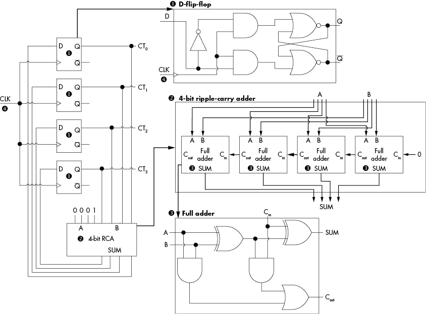

图 5-1：每个时钟跳变都会增加计数器的电路

让我们考虑一下当正向时钟边沿作用于输入寄存器时，会发生什么情况。寄存器的存储和输出会变化为其输入的值。输出一旦变化，信号就会开始通过 RCA 传播，这意味着它们会依次通过每个全加器。最终，信号会到达与 RCA 相连接的输出寄存器。在下一个正向时钟边沿，输出寄存器的状态会更新为 RCA 的计算结果。

信号从组合电路输入传播到输出所需的时间称为*传播延迟*。传播延迟取决于多个因素，包括电路中的门数量和类型、门的连接方式、输入的数据值，还包括晶体管的特征尺寸、温度和电源电压。因此，每个芯片上的组合电路都有自己的传播延迟。*电子设计自动化（EDA）*软件可以通过*静态时序分析*来找到电路的最坏情况传播延迟。这个最坏情况的传播延迟就是*关键路径*的长度，限制了芯片设计的工作范围。它特别用于计算电路可以运行的最大时钟频率。一旦芯片超过最大时钟频率，关键路径的输入将在下一个时钟边缘到来之前没有完全传播到输出，这意味着输出寄存器可能记住一个不是电路正确输出的值。（嘿，这听起来像是故障，不是吗？）

事实证明，为了正常工作，触发器需要在时钟边缘前后分别保持一个稳定的输入，这段时间分别称为*建立时间*和*保持时间*。不足为奇的是，当数据在时钟边缘前改变时，会发生*建立时间违规*，而当数据在时钟边缘后改变时，则会发生*保持时间违规*。攻击者可以通过使设备在时钟频率、电源电压和温度的规定范围外工作，来引发这些违规（从而造成故障）。

图 5-2 显示了一个简单的数字设备，包含两个寄存器，每个寄存器存储一个字节的数据。

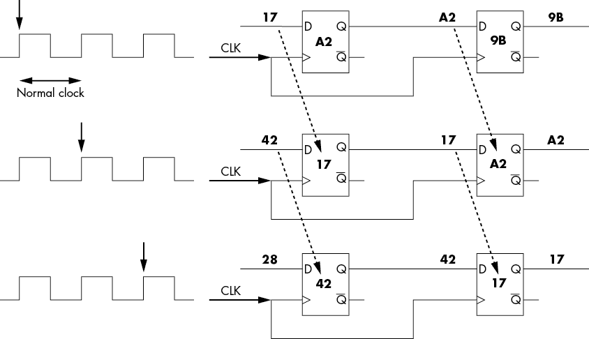

图 5-2：一个简单的移位寄存器正常工作

通常，每个寄存器保存一个字节的数据（该寄存器由八个触发器组成），组成字节的位的状态在正时钟边缘时在寄存器间移动。第一次时钟边缘后，两个寄存器分别保存字节 0xA2 和 0x9B。下一个输入字节 0x17 在左侧寄存器等待，而 0xA2 在右侧寄存器等待。第二次时钟边缘时，0x17 进入左侧寄存器。右侧寄存器读取左侧寄存器的输出 0xA2，并在短时间后出现在右侧寄存器输出。下一个时钟边缘时，数据再次从左侧寄存器移动到右侧寄存器。

图 5-3 显示了相同电路在时钟故障下的运行情况，其中我们引入了一个非常短的时钟周期。

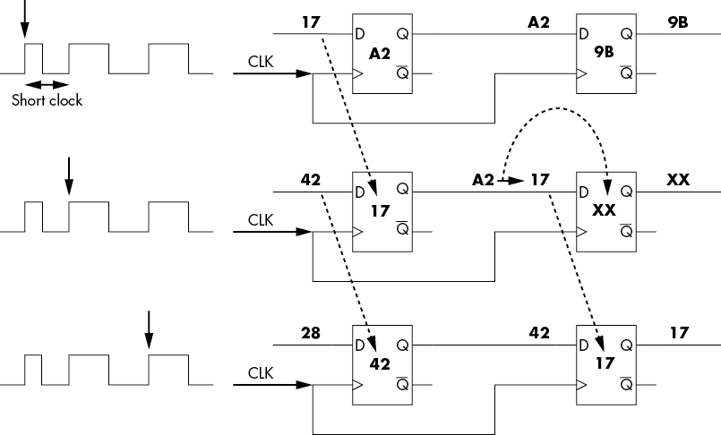

图 5-3：一个简单的移位寄存器工作不正常

在这个例子中，在第一次时钟沿后，左侧和右侧寄存器分别保持字节 0xA2 和 0x9B，这与图 5-2 中的起始状态相同。如之前所示，下一个输入字节 0x17 在等待，但现在有一个短时钟周期干扰了有序过程。输入字节 0x17 仍然被复制到左侧寄存器中，就像在正常工作电路中的情况一样。然而，短周期未能为左寄存器的输出总线提供足够的时间来稳定，因此其输出在 0xA2 和 0x17 之间的过渡状态。这意味着右侧寄存器现在处于某个未知状态 0xXX，它也将其输出到外部总线。在下一个时钟沿，电路继续正常操作，将值 0x17 设置到输出数据总线上，但在这种情况下，数据序列将 0xA2 更改为其他值，从而导致执行的任何程序出现故障！

### 亚稳态

除了违反关键路径时序，违反时序约束还有其他影响。如果数据在时钟沿附近发生变化，翻转触发器的输出将进入*亚稳态*，这通常表现为一个无效的逻辑电平，需要一些时间才能达到最终值（参见图 5-4）。

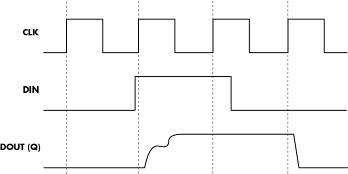

图 5-4：翻转触发器输出处于亚稳态

在实际设备上，这看起来是什么样的？我们可以使用现场可编程门阵列（FPGA）来构建一个系统，使我们能够调整时钟，通过略微调整时钟沿使其在数据过渡前后产生这些更可能的状态。在图 5-5 中所示的例子中，如果没有发生无效状态，翻转触发器的输出应该在 0 和 1 之间交替。

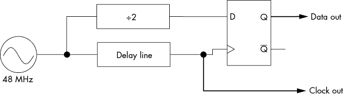

图 5-5：一个允许通过移动时钟沿来引发亚稳态的电路

图 5-6 显示了确实没有进入无效状态。我们使用示波器的*持久性*模式来展示电路操作。多次相同操作的运行被叠加在一起，强度和颜色显示最可能的“路径”。在这种情况下，图 5-6 中的较深色调最可能，较浅色调最不可能。输出有时是 1，有时是 0。然而，它总是会发生过渡，这意味着如果是 0，它会变成 1，反之亦然，且两种过渡（从 1 到 0 和从 0 到 1）是同样可能的，正如预期的那样。

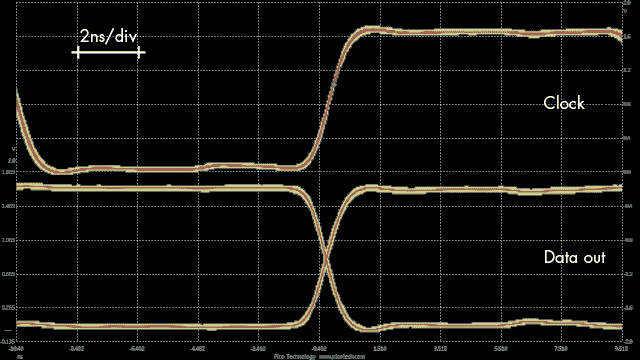

图 5-6：名义操作

在 图 5-7 中，我们通过改变延迟线来调整时钟边缘，以引起亚稳态。此时，触发器需要更长的时间才能达到最终值。亚稳态意味着最终值是由推动触发器进入稳定状态的随机噪声定义的。这不仅意味着最终值是随机的，还意味着由于稳定时间长于预期，某些电路可能会在初始状态下采样亚稳态触发器，而其他电路则可能看到最终状态。在这个例子中，我们略微降低了核心电压，以夸大亚稳态的稳定时间。

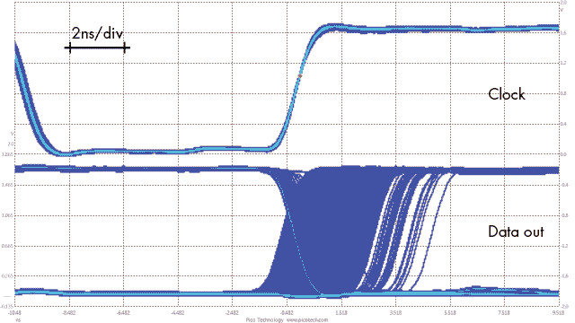

图 5-7：通过改变时钟边缘来引起时序违规的亚稳态数据输出（低电压操作）

图 5-8 显示了在正常电压下运行时的时钟边缘和输出。

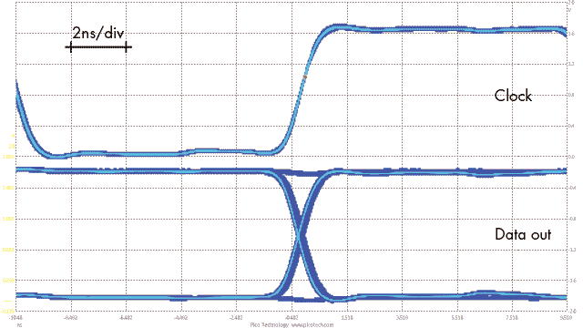

图 5-8：通过改变时钟边缘来引起时序违规的亚稳态数据输出（正常电压操作）

略长的亚稳态仍然存在，但请注意，缺乏过渡有时仍会发生，这证明了违反建立时间和保持时间将传播无效的逻辑状态。

### 故障敏感性分析

传播延迟依赖于多种因素，包括数据值，这意味着由于违反建立时间和保持时间而导致的故障可能依赖于数据值。*故障敏感性分析*利用了这一行为；其思想是将设备超频，直到只有特定的数据值会引发故障。比如，当设备被超频时，0xFF 会导致故障，而其他值则不会，因此，如果你遇到故障，就知道值是 0xFF。经过一些特性测试后，你可以通过检测是否有故障来了解那些数据值是什么。

### 限制

时钟故障的一个限制是，它要求设备使用外部时钟输入。当查看典型设备的数据手册时，你可能会发现它有一个内部时钟发生器。小型嵌入式设备的一个明显特征是没有外部晶体或时钟发生器，这意味着它可能使用内部发生器。这意味着你不能将外部时钟输入到设备中，而没有对时钟的控制，就无法进行时钟故障。

即使数据手册显示了外部晶体，类似于*相位锁定环*（*PLL*）的东西也可能在内部修改它。这种情况的一个指示是，当外部晶体的频率低于预期的设备工作频率时。树莓派上的晶体是 19.2 MHz，但主 CPU 的工作频率可以达到几百 MHz。这是因为该外部时钟通过 PLL 被倍增到更高的内部频率，这对于几乎所有的系统芯片（SoC）设备来说都是一样的，比如手机。即使是许多低成本、低功耗的设备也有 PLL。你仍然可以使用时钟故障来攻击带有 PLL 的设备，但由于 PLL 的工作方式，其有效性较低。

如果你对查看带有 PLL 的时钟故障注入的有效性感兴趣，可以参考 Bodo Selmke、Florian Hauschild 和 Johannes Obermaier 的《Peak Clock: Fault Injection into PLL-Based Systems via Clock Manipulation》（发表于 ASHES 2019）。

### 所需硬件

在第四章中，我们介绍了一种通过在两种不同的时钟频率之间切换来生成时钟故障的简单方法。另一种方法是使用 FPGA 向单一源时钟插入小脉冲（故障），这使得你可以使用两个相位移的时钟进行异或运算（见 图 5-9），从而轻松生成故障时钟。

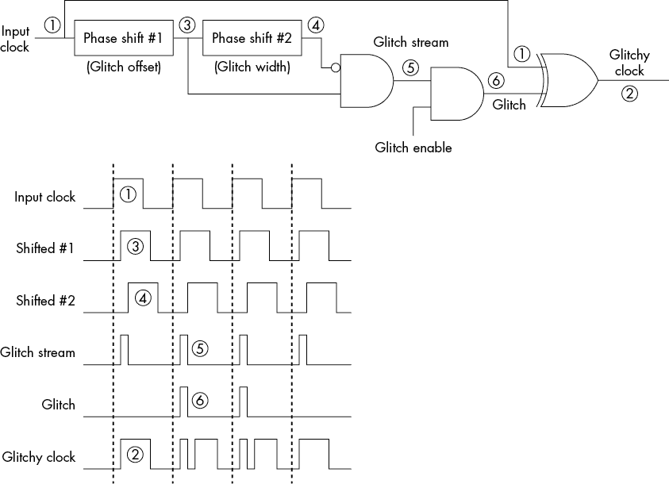

图 5-9：使用 FPGA 生成时钟故障

几乎每个 FPGA 都提供能够执行所需相位调整逻辑的时钟模块。例如，ChipWhisperer 项目在 Xilinx Spartan-6 FPGA 上实现了这样的时钟故障。

我们可以使用异或方法来生成故障时钟，如本例所示。相位移是通过大多数 FPGA 内部的时钟控制模块来实现的。在 图 5-9 中，源（输入）时钟的目标 1 是最终得到“故障”时钟 2。为此，输入时钟首先通过第一个模块进行相位移（延迟），得到时钟 3。这个时钟再次进行相位移，得到时钟 4。通过逻辑与运算并反转其中一个输入，我们能够得到一个脉冲，其宽度由第二个相位移设置，并且相对于原始时钟的边缘，由第一个相位移插入的延迟偏移 5。这个“故障流”包含无尽的脉冲流，因此我们可以选择通过与门仅抽取几个脉冲，得到我们的故障 6。最后，我们使用异或将这个故障插入原始时钟，生成最终的时钟 2。FPGA 可以执行的最小相位移和最小逻辑门切换速度限制了这种方法的可行性。

另一种选择是使用模拟延迟线，其中可变电阻（或可变电容）可以微调延迟（见 图 5-10），这实现了我们通过 FPGA 实现的相同操作。

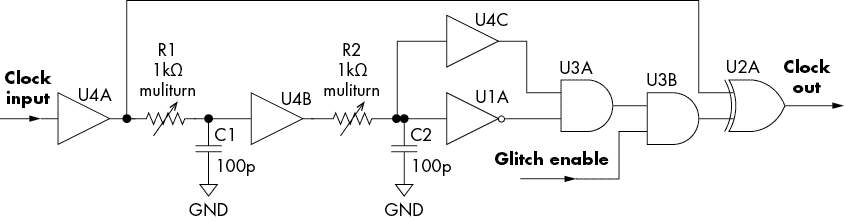

图 5-10：使用模拟延迟线生成时钟故障

图 5-10 展示了使用电阻-电容（RC）模块，这些模块取代了图 5-9 中展示的相位移元件。你可以使用独立的逻辑芯片，通过选择适合所需逻辑电平的芯片（例如 3.3 V 或 5.0 V），来构建整个电路。如果你想使用可变电阻，我们建议使用多圈调节电位器。你可以使用 Arduino 触发*故障使能*引脚，这个引脚在常规时钟和故障时钟之间切换（可以参考本章后面的“电压故障注入”部分，或者跳到代码示例 5-1 查看代码示例）。

在高速设计中，“逻辑电平”有着多种不同的含义，超出了你可能遇到的 3.3 V 和 5.0 V 等电平。时钟通常使用一种叫做*低压差分信号传输（LVDS）*的信号方式，其中两根线传输相反相位的信号，也就是说，当一根线变高时，另一根线则变低。这些信号电平通常也要小得多；低电平与高电平之间的典型电压差（波动）可能只有 0.35 V，并且这种波动会围绕某个共同电平电压进行。“共同电平”指的是电压不会降到 0 V（低电平），而是低于某个固定电压的一定电平。例如，如果共同电平是 1.65 V（即 3.3 V 的一半），信号的波动范围可能是从 1.3 V 到 2.0 V，表示从低电平到高电平的切换（在这种情况下，波动幅度为 0.7 V）。

物理逻辑电平不会影响时钟故障的概念，但可能需要你付出额外的物理努力。FPGA 输出驱动器通常会支持一些这些高速逻辑电平，但你需要理解目标设备的要求，以便将故障信号正确地注入到设备中。你可能还需要一个 LVDS 驱动芯片或类似设备来产生有效的时钟故障。

插入时钟故障的一个更简单方法是使用两个时钟：一个常规时钟和一个非常快速的时钟。在第四章中，我们简要提到过，通过暂时切换到快速时钟，可以引发故障。超频的时长将取决于两个时钟之间的切换速度。从原理上讲，你可以使用 Arduino 或 FPGA 来实现，尽管前者的切换速度较慢。这种时钟切换方法不仅易于实现，而且只要有合适的开关，你几乎可以用它来处理任何时钟频率。你可以使用这种方法插入 8 MHz 时钟或 1 GHz 时钟的故障。

你也可以通过切换 I/O 引脚来生成时钟故障，只要开发板足够快。例如，如果你的设备以 100 MHz 运行，你可以通过在“软件”中设置 I/O 引脚为低电平 10 个周期，再设置为高电平 10 个周期，来生成 5 MHz 的时钟。通过简单地切换 I/O 引脚一个周期，你就可以插入故障。

### 时钟故障注入参数

我们介绍了两种时钟故障注入的变体：临时超频（参见图 4-8）和将毛刺插入到时钟信号中（参见图 5-9）。如果你想简化操作，临时超频更容易构建，但如果可能的话，我们推荐构建时钟毛刺插入电路，因为它可以生成更多种类的毛刺。我们在第四章讨论了等待周期、毛刺周期、超频频率、毛刺偏移和毛刺宽度等参数。

## 电压故障注入

我们通过干扰芯片的电源电压来执行电压故障注入（例如，暂时切断电源）。关于电压故障注入的工作原理，存在两种主要观点：时序视图和阈值视图。*阈值视图*简单地指出，通过改变电路上的电压，可以改变逻辑 0 和 1 的电压阈值，从而有效地改变数据。*时序视图*利用了电压与电路稳定运行频率之间的关系，这些频率能够在没有故障的情况下稳定运行。如前所述，触发器在时钟边沿前后需要稳定的输入一段时间，以便正确捕捉输入值。事实证明，提高芯片上的电压会降低传播延迟，这意味着信号变化更快，可能会导致保持时间违规，因为信号可能会在保持时间结束前发生变化。另一方面，降低电压则可能导致设置时间违规，因为信号可能会与下一个时钟边沿的时间太接近。一个短暂的毛刺（电源电压的下降或尖峰）也可能影响正确操作。电路上的电压变化只需要在相关晶体管切换时发生，这个持续时间远小于一个时钟周期，因此在现代设备上通常是亚纳秒级的。这样的非常短暂的电压变化就是我们在进行电压故障注入时理想的目标。

然而，我们所说的电压变化是直接作用于晶体管本身的电源供应端，位于芯片内部。*电源网络*负责将电力传输到芯片内，它位于晶体管与芯片外部电源之间。这个网络会影响毛刺的形状，因为芯片内部的电容和电感会滤除任何快速的尖峰和波动。因此，任何电压毛刺必须足够长，以便它能够传递到晶体管并形成能够真正影响我们关注的电路部分的形状。*时钟网络*负责将时钟信号传递到所有相关的门电路。时钟和电源网络覆盖整个芯片，因此电压毛刺可能会同时影响多个晶体管，导致故障。

此外，在设备的电源和芯片的电源之间，许多去耦电容器旨在减少由开关电源引起的电压下陷和尖峰，以及从 PCB 上的其他元件拾取的噪声。这些电容器的阵列使得芯片在正常条件下运行时，发生故障的概率非常小。当然，它们也会影响我们在进行故障注入时故意想要注入的下陷和尖峰。

### 生成电压故障

故障注入的原理是在芯片处于感兴趣的时刻，将其置于正常工作条件之外进行操作。对于电压故障注入，目标是为芯片创建一个稳定的电源，除了在某些重要操作时，需要将其电压降低或突增，超出正常工作电压范围。

你可以考虑三种生成适当电压故障的方法。第一种是使用可编程信号发生器，其中信号发生器的输出通过电压缓冲器为目标设备供电。第二种方法是在两个电源之间切换：常规工作电压和“故障”电压。最后，短路法则简单地将供电的工作电压短接。

### 构建基于开关的注入器

如果你正在生成电压波动，你将需要某种形式的可编程电源或波形发生器。典型的可编程电源无法快速切换电压，而典型的波形发生器输出的功率不足以驱动目标设备。（目标是< 1ms 的故障，通常在 40–1,000ns 范围内。商用故障注入器可低至 2ns。）目标是生成一个如图 5-11 所示的波形，该波形具有标准基线电压，然后在某个更低或更高的电压下插入一个故障。

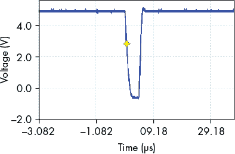

图 5-11：电压故障注入波形

这个特定波形是从基于 Chris Gerlinsky 在“破解 NXP LPC 系列微控制器的代码读取保护”（REcon 布鲁塞尔 2017）演讲中的电路生成的。Gerlinsky 概述了使用 MAX4619 模拟开关的故障注入器设计，该开关具有 10–20 Ω的导通电阻（取决于供电电压）。导通电阻是开关中的有效电阻；10 或 20 Ω会限制你能推动到目标的电流量。Gerlinsky 将多个通道并联，以生成一个更强大的故障注入平台。

图 5-12 展示了 MAX4619 与相同的并联电路生成一个多路复用器。VCC 可以是 3.3V 或 5V；使用更高电压（5V）意味着你在输入电压上有更多的灵活性，并且导通电阻更低。

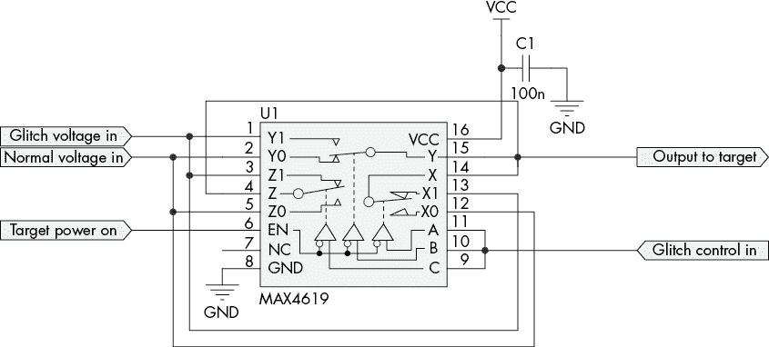

图 5-12：电压开关电路

该电路需要一个外部信号源来触发开关操作，切换常规工作电压（正常电压输入）和故障电压（故障电压输入）之间。像 Arduino 这样的嵌入式平台可以轻松生成切换信号。列表 5-1 展示了代码，适用于经典的基于 ATmega328P 的 Arduino（Arduino Uno 及类似产品）。

```
//Use digital pin D0 – D7 with this code. We cannot use the digitalWrite()
//function as it is VERY slow. Instead we will be directly accessing the registers.
#define GLITCH_PIN 0

void setup(){
    DDRD |= 1<<GLITCH_PIN;
}

void loop(){
    //Create 2000 ns pulse – in practice NOT very accurate, actual pulse is
    //about 1720 ns.
    PORTD |= (1<<GLITCH_PIN);
    delayMicroseconds(2);
    PORTD &= ~(1<<GLITCH_PIN);

    //Create very short pulse, 2 cycles (125ns, assuming a 16MHz Arduino)
    //We no longer use digitalWrite() as it's slower, but directly access AVR
    //registers.
    PORTD |= (1<<GLITCH_PIN);
    PORTD &= ~(1<<GLITCH_PIN);

    //Create 500ns pulse (2 cycles + 6 nops = 8 cycles, 8 * 62.5 = 500ns)
    PORTD |= (1<<GLITCH_PIN);
    __asm__ __volatile__ ("nop\n\t");
    __asm__ __volatile__ ("nop\n\t");
 __asm__ __volatile__ ("nop\n\t");
    __asm__ __volatile__ ("nop\n\t");
    __asm__ __volatile__ ("nop\n\t");
    __asm__ __volatile__ ("nop\n\t");
    PORTD &= ~(1<<GLITCH_PIN);
}
```

列表 5-1：用于生成快速脉冲的 Arduino 代码

该代码通过使用一个不太精确的延迟例程和 CPU 执行速度作为定时源，生成三种不同时长的脉冲。你可以轻松添加按钮或其他接口来发送其他时长的脉冲。

你可以使用其他几种设备作为多路复用器。一个选择是使用两个独立的互补开关芯片，而不是一个集成设备，例如 TS12A4515P 和 TS12A4514P。这些开关芯片也有面包板友好的 DIP 封装，并且具有一个“常闭”和一个“常开”开关。使用独立封装的优点可能是可以提供更多的功耗，例如。其他版本还配有双输入电源，允许你传递负电压以实现更复杂的故障选项。

这些多路复用器仍然具有相对较高的开关电阻。例如，针对仅需 1 mA 到 100 mA 电流的设备可能是可行的，因此你可以针对一个简单的独立微控制器。但如果你对更高功率的设备或甚至是一个完整的系统感兴趣，就无法使用这种简单的电压故障注入方法，因为多路复用器可能会过热。

#### 切换故障生成器的目标准备

一旦你拥有了电压生成硬件，就可以准备目标。目标是通过断开标准电源并连接你自己的电源，使电源运行单一电源平面。这个操作的难度范围很广，主要是因为需要手动修改 PCB。单面 PCB 上的表面贴装微控制器，只有一个电源平面，容易修改；而修改使用球栅阵列（BGA）连接的多电源平面 SoC 则较为困难。假设你没有 BGA PCB 返修站，我们将重点关注使用标准工具（如烙铁和手术刀）进行手动修改。

按照以下步骤连接注入器：

1.  选择要针对的电源平面。微控制器通常只有一个电源平面，但对于更复杂的嵌入式芯片，多个电源平面为芯片的不同部分供电。选择供电你感兴趣的故障操作的特定平面。

1.  没有单一的方法来确定正确的电源平面，但一些目标研究可以帮助你。查看数据手册/引脚图和 PCB 标记中的“VCC”或“VCORE”。或者，测量芯片不同引脚上的电压，并将其与已知的核心电压进行匹配。无论如何，你需要知道正常电压，以便稍后驱动芯片。

1.  找到一个在 PCB 上可以断开标准电源与电路连接的点，并注入你自己的电源。为了减少电容和电感的影响，找到一个尽可能接近目标的位置，记住一个电源平面可能会连接到芯片封装上的多个引脚。当你断开标准电源时，要断开整个电源平面，然后用注入器驱动该平面。PCB 设计、引脚分配和/或追踪 PCB 连线会帮助你找到这个点。电压调节器或电源管理 IC 供电的电源平面就是你可以切断电源的地方。或者，你也可以拆除串联组件，例如电阻或电感。

1.  对于那些主动监控并管理电源的目标（复杂的 SoC 和电源管理 IC 是典型的例子），一旦完全断开电源，监控电路将检测到这一点，并可能阻止芯片完成启动过程，甚至无法重新启动。确保监控电路完好无损或以某种方式绕过，使其看到的电压不会被中断。这样做取决于电路的实现方式，需要对涉及的电子元件有一定了解。

1.  使用手术刀小心地切断 PCB 路径并断开现有电源。通过测量连接是否不存在，仔细确认你确实已经断开电源。当你确认已经断开后，将注入器的输出焊接到电源平面。使用短线以避免增加过多的电感。使用切割点为电路供电，或者将电线焊接到靠近芯片的（已拆除的）解耦电容焊盘上。

1.  为了将故障注入到芯片中，尽可能通过拆除解耦电容来减少 PCB 上的电容。这些电容通常是小型电容，插入在 VCC 和 GND 之间，用于减少电源上的噪声，实际上还可以避免现场发生意外故障。

1.  一种方法是逐个拆除这些电容，直到你拆除了所有电容，或者直到芯片停止工作。后一种情况下，将最后拆除的电容重新焊回去，希望能有好的结果。通常，芯片会重新开始工作。你可能能在不拆除电容的情况下注入故障，但要准备接受较低的成功率。

1.  在继续之前，检查在使用你的电源供电时，设备是否能够启动并正常运行。如果无法启动，重新检查并调试每一步，知道你可能会使设备变砖。现在，你应该已经有了一个由稳定电源供电并可以控制的目标。一旦达到这个点，就可以开始进行故障实验（像第四章中的示例）。

### 超压注入故障

作为控制电压故障的替代方法，短路法（crowbar）使用更大的力量，控制性较差，但更容易实现。与先前的硬件允许对正常和故障工作电压进行精确控制不同，短路法是通过短暂地将正常工作电压短接到 0 V 来实现的。短路法实际上是将一个“死短”应用于设备的电源供应之一。这必须小心进行，因为如果故障持续时间过长，可能会损坏电源电路，特别是考虑到这些电源可能没有短路保护。

短路会在电源分配电路中引起振铃，这实际上是大幅的电压尖峰。故障的性质取决于板子的具体情况，并且对于攻击者来说很难控制。此方法在 Colin O’Flynn 的论文《使用短路器在嵌入式系统中进行故障注入》（IACR Cryptology ePrint Archive, 2017）中进行了介绍。

#### 选择短路器

短路器本身可以是一个 MOSFET 器件；MOSFET 本质上是一种晶体管。具体选择哪种 MOSFET 将取决于你攻击的设备。如果你的设备有强大的电源或大容量的去耦电容，且你无法将其移除，你需要一个高功率 MOSFET。与低功率 MOSFET 相比，高功率 MOSFET 的开关时间较慢，因此使用高功率 MOSFET 会对故障持续时间施加最小限制。

两个此类 MOSFET 的例子是低功耗设备的 DMN2056U 和高功耗设备的 IRF7807。它们都是逻辑电平 MOSFET（意味着信号发生器或 Arduino 可以轻松驱动它们），但 IRF7807 具有更低的导通电阻，在试图拖低电源轨并在高功耗设备（如 Raspberry Pi）中产生故障时非常必要。

使用逻辑电平驱动的 MOSFET 可以获得更好的效果，因为它们可以通过 3.3 V 信号完全开启。标准 MOSFET 需要更高的电压（5 V 至 10 V）才能开启，这意味着如果只用 3.3 V 信号驱动它们，你将无法获得强大的短路效应。合适的 MOSFET 通常以表面贴装的形式提供；穿孔式 MOSFET 通常速度过慢。

你可以通过任何合适的信号源来驱动 MOSFET 的栅极：如实验室波形发生器、FPGA 开发板或 Arduino。你可以使用清单 5-1 中的相同代码来触发 MOSFET，在可编程的时间内产生故障。

#### 短路故障发生器的目标准备

与控制电压故障相比，短路注入方法需要的目标准备工作要少得多。你只需要确定一个合适的电源平面，并且无需将该电源平面与电路的其他部分断开连接。

确定敏感电源轨与控制电压故障的过程非常相似。你可能需要查阅设备的数据手册，以确定各个电源引脚连接的电压值。有关此类信息的详细内容，请参见第三章。

将撬棍连接到设备的去耦电容器上。这些电容器几乎总是与电源引脚之间有一个非常低的阻抗路径。由于电容器是简单的双端元件，因此将其物理连接起来也相对简单。去耦电容器的一端通常连接到电源轨的地线，这使得可以将撬棍设备直接焊接到去耦电容器上。让我们通过一个树莓派 3 Model B+ 的快速示例来看一下。

### 树莓派故障攻击与撬棍

树莓派基金会没有发布最近款树莓派设备的完整原理图。例如，树莓派 3 Model B+ 的原理图是有限的，并未显示主 SoC 的完整引脚图。它确实包含一些关于电源轨的信息（见 图 5-13）。

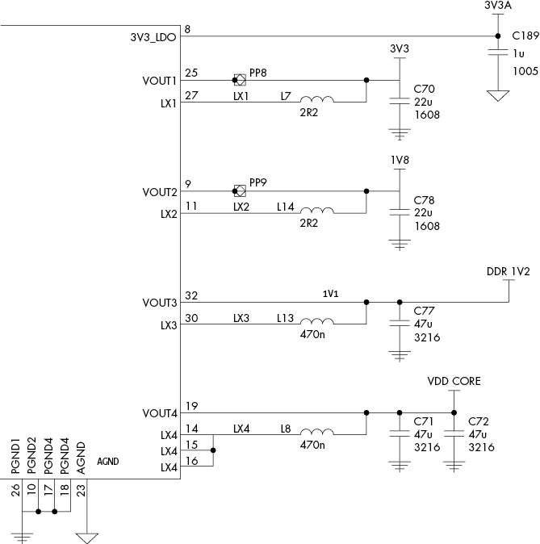

图 5-13：树莓派 3 Model B+ 原理图的一部分，主电源调节器位于左侧（根据 Creative Commons Attribution-NoDerivatives 4.0 国际 [CC BY-ND] 许可协议授权）

在大多数情况下，您会需要类似“微处理器单元”或“核心”电压电源轨的东西。检查原理图会发现以下标签：3V3A、3V3、1V8、DDR_1V2、VDD_CORE 等等。在树莓派 3 Model B+ 的情况下，VDD_CORE 看起来是最合适的。然而，我们希望将故障插入得更接近主 SoC，而不是直接在电源调节器处。您会注意到从 图 5-13 可以看到，电源调节器芯片的第 19 引脚连接到 VDD_CORE。让我们看看那颗芯片（见 图 5-14）。

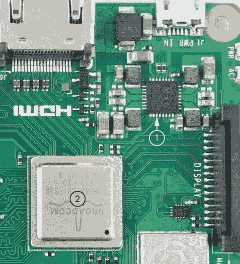

图 5-14：树莓派 3 Model B+ 的一部分，显示了主 SoC（2）和电源 IC（1）

图 5-14 中显示了连接到第 19 引脚的部分，标记为 1。主 SoC 位于附近，标记为 2，但它距离足够远，以至于在电源调节器芯片输出端插入故障并不会太有效。幸运的是，我们可以使用万用表找到 VDD_CORE 输出与主 SoC 下方位置之间的 0 Ω（直接短路）。图 5-15 显示了 SoC 下方的视图。

图 5-15 中的三个勾画部分都显示了它们彼此之间以及与 VDD_CORE 轨之间的直接短路。如果我们在上电时测量，电压大约是 1.2 V。需要注意的是，我们可能会有多个相似电压的轨道；例如，DDR 电压也是 1.2 V，但属于不同的轨道。

图 5-15 中 VDD_CORE 的每个勾画部分可能连接到 SoC 的不同引脚。例如，这是一个四核设备，可能还搭载了其他加速器。因此，我们预计该芯片可能暴露出不同的电源引脚，这些引脚都在 VDD_CORE 轨上。我们可能需要尝试向这三组中的每一组插入故障。目前，我们将像 图 5-16 中所示的那样，将电线焊接到每一组。

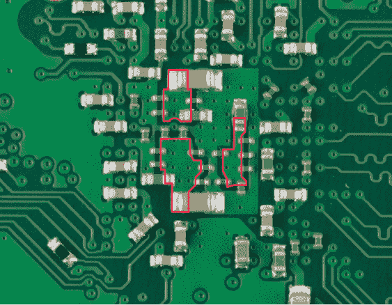

图 5-15：主 SoC 下方，标出的区域都被电连接到 VDD_CORE 电源轨

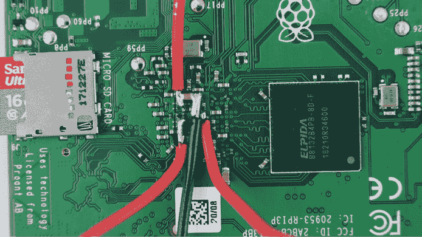

图 5-16：三个 VDD_CORE 连接中的每一个都被引出到电线，以完成故障插入。

你可能想使用更小的电线，但这个示例展示了你如何能够使用粗糙的设备。需要注意的是，电线非常容易断裂；我们使用热熔胶覆盖电线以固定它们。你也可以使用其他材料（例如环氧树脂），但热熔胶的优点是容易去除。我们还成功地只使用针（跳线针）连接电源，这意味着你不需要将电线焊接到目标板上。缺点是你不能轻松地移动目标，因此在这个示例中我们将继续使用焊接的电线，这样更稳固。目标准备好后，接下来我们来设置故障硬件。

#### 使用故障短路硬件插入故障

我们将把一个 MOSFET 连接到 VDD_CORE 电源轨上，以插入故障。图 5-17 展示了整体设置，其中 MOSFET 是 N 通道 IRF7807。重要的是，MOSFET 具有逻辑电平门槛，这意味着你可以通过任何普通的数字信号驱动 MOSFET。

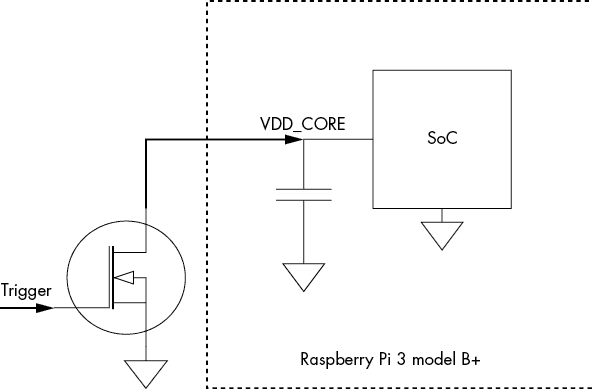

图 5-17：MOSFET（左侧）短接 VDD_CORE 电源轨

除了故障触发器外，我们还需要一种触发 MOSFET 的方法。列表 5-1 展示了如何使用 Arduino 生成小脉冲，因此我们可以简单地重新利用它。Arduino GPIO 引脚的脉冲输出被驱动到图 5-17 所示的触发输入。或者，我们也可以使用脉冲发生器来生成小脉冲，或者使用专用硬件，例如 ChipWhisperer-Lite 或 Riscure 的 Inspector FI 硬件。我们需要实验脉冲的宽度，但希望其范围从大约 100ns 到 50μs 之间。

在我们的示例中，我们利用了 ChipWhisperer-Lite 具有 SMA 接口的 MOSFET 故障触发输出，并将其简单地接到 VDD_CORE 电源线上（见图 5-18），这实际上为我们提供了来自图 5-17 的故障设置，并配有可编程脉冲发生器。

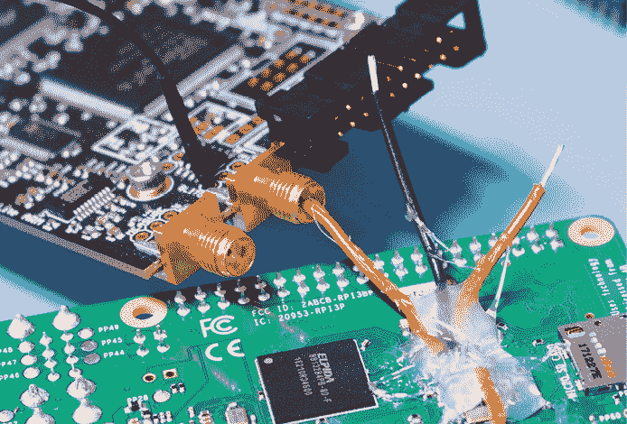

图 5-18：ChipWhisperer-Lite 包含了一个 MOSFET 在故障（短路）输出中，我们可以用它来执行攻击。注意用于固定电线的热熔胶幼儿园技能。

其中一条 VDD_CORE 电源线连接到 SMA 连接器的中央引脚，该引脚与 MOSFET 相连。你可以使这个连接看起来更正式，但我们想展示即使是非常简单的设置也能成功。你还会注意到我们使用了单独的接地连接。在本示例中，焊接在 PCB 背面的接地线在使用前断裂了（我们提到过它们很脆弱），因此我们改为使用 I/O 头上的接地。我们希望电线尽量短，以减少电线长度的寄生效应；较长的电线（具有较大的电感）会削弱我们试图插入的脉冲。较短的电线意味着我们应该能够更精确地控制插入脉冲的宽度。

如果你能重置树莓派，说明你的故障硬件工作正常。插入过长的故障应该导致设备重启。如果没有重启，说明故障不够强大（或不够长）。

#### 树莓派代码

当然，树莓派需要运行一个程序，才能让我们了解故障是否发生。我们将使用第四章清单 4-2 中的简单循环代码思路，并进行修改，增加额外的循环并移除触发器，如清单 5-2 所示。

```
#include <stdio.h>
int main(){
        volatile int i, j, k, cnt;
        k = 0;
 while(1) {
                cnt = 0;
                for(i = 0; i < 10000; i++)
                        for(j = 0; j < 10000; j++)
                                cnt++;
                printf("%d %d %d %d\n", cnt, i, j, k++);
        }
}
```

清单 5-2：一个双循环示例

我们添加了两个`for`循环，从而增加了潜在故障指令执行的时长。这两个循环意味着，如果我们在内循环中发生故障，外循环仍然会继续运行。使用两个循环还意味着目标会跳转到稍微不同的位置，增加了我们代码的脆弱性。

现在我们编译并运行程序，确保关闭优化选项，以避免编译器过于智能地优化代码（例如，使用`-O0`选项对于 GCC 或 Clang 编译器）。我们还添加了`volatile`关键字，以确保循环能够进入最终的二进制文件。

在运行 Pi 时，我们生成小的脉冲来引发故障。图 5-19 显示了故障会话的输出。

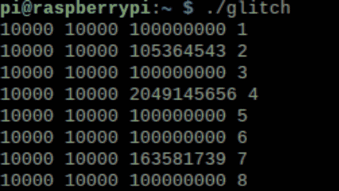

图 5-19：成功故障插入的结果

图 5-19 显示了`cnt`变量值的各种故障，在正常情况下，`cnt`值应为 100,000,000。还要注意，`for`循环结束时`i`和`j`的值在本示例中未受到影响。

在这种情况下，我们在 HDMI 连接的显示器上监控输出，因此我们可以看到许多其他进程正在运行，而我们并没有破坏它们，这主要是因为循环程序占用了大部分 CPU 时间，但我们也偶尔会使系统崩溃。

对于最优参数，首先确定目标持续重启时的最短故障。这种故障过于激进，但它为故障时长提供了上限。对于树莓派来说，重启的时间尤为烦人，因此我们会从这个上限缩短故障时长。

我们不需要担心同步故障，因为来自 Listing 5-2 的循环将是主要执行任务。大部分处理器时间将花费在循环中，从而避免需要更仔细地表征平台或处理触发器。

#### 故障注入结果

这个例子展示了故障注入如何能够在相当复杂的 Linux 目标上产生有趣的故障。此次攻击的结果将仅仅是循环计数器值的故障。图 5-19 展示了一个成功攻击的例子，结果是在循环中的任意时刻注入一个 3.2 微秒宽的脉冲。

图 5-20 展示了这种故障的波形。正常电压大约是 1.2V，而短路注入将其降至 0.96V。

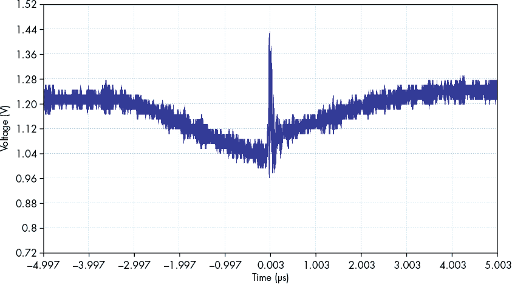

图 5-20：注入到 Raspberry Pi 中的故障波形

释放短路器会导致电压迅速升高至 1.44V，并在电源轨上产生振铃。我们预计这应该是导致故障行为的原因，而不是降低的工作电压。我们没有使用其他方法来引入这个故障，唯一使用的是短路器，但这些板的复杂电力分配网络在被这种方式刺激时通常会产生振铃。这种振铃波形也解释了为什么我们使用了如此宽的输入脉冲。你会注意到，3.2 微秒的脉冲时间反映了目标上看到的电力逐渐减少，而不是突然的电压下降，这与我们注入线中仍有一定的电感以及电容电源网络对变化的抵抗有关。

由于攻击持续时间较长且具有演示性质，我们使用了软件触发器，并没有特定的硬件触发器来同步我们的故障注入器。请参见 Colin 的 YouTube 视频，标题为“使用 ChipWhisperer-Lite 对 Raspberry Pi 3 model B+进行电压（VCC）故障注入”，该视频展示了其在这款 Raspberry Pi 上工作的过程。

### 电压故障注入搜索参数

在切换两个电压之间时，我们需要首先确定运行目标的*基础* *电压*。一开始我们可以使用其正常运行时的电压。然而，如果我们想优化一些，我们可以将目标运行在最高电压（针对尖峰）或最低电压（针对下陷），只要它仍然能够可靠地工作。通过调整电压（如果我们要通过故障使电压上升）或下降（如果我们要通过故障使电压下降），我们减少了故障注入器需要注入的电荷量，从而诱发一个导致故障的电压。

一旦你确定了操作时序和基础电压，就可以开始调整实际故障。如果使用如前面“短路注入故障”部分所描述的短路注入方法，你将无法控制故障电压，因为短路器只是将电压拉至地面。然而，如果你的注入器允许你控制故障电压，可以进行实验，看看什么因素会导致设备发生故障。逐步将电压移出操作范围，以避免造成永久性损坏。正向电压尖峰有更高的几率烧坏目标，因此最好先尝试电压下跌。你可以生成短时间低于 0V 的电压下跌，以耗尽电容，但过长时间这样做也可能导致损坏。

除了电压设置之外，你当然还需要考虑与故障位置相关的参数。我们在第四章中讨论了这些内容，以及相关的搜索策略。

## 电磁故障注入

*电磁故障注入*使用强烈的电磁脉冲来引发故障。你可以通过多种方式产生这种故障，但最简单的方法是通过一条线圈中脉冲强电流。电磁注入遵循法拉第定律，该定律表示通过导线回路的磁场变化会在回路端点产生电压差。通过线圈的电流尖峰产生了这种变化的磁场。芯片上的导线形成了回路部分。当变化的磁场作用于芯片上的导线时，我们会得到电压尖峰，可能会暂时使信号电平从 1 翻转为 0，反之亦然。电磁故障注入的一个方便特性是，一旦你建立了设置，你不需要修改目标设备；只需将探头放在芯片上方并触发即可。

另外，一些故障注入器可以生成持续的电磁场。这些设备更具体地用于偏置环形振荡器，目的是减少随机数生成器中的熵。有关更多详细信息，请参见 Jeroen Senden 的硕士论文《使用谐波波形的电磁故障注入对基于环形振荡器的真正随机数生成器进行偏置》（特温特大学，2015 年）。

图 5-21 展示了电磁故障注入器的一般结构，其中线圈产生一个磁场，诱发目标芯片内部某处的电流流动和电压变化。根据 Marjan Ghodrati 等人撰写的《通过电磁注入诱发局部时钟故障》，结果是局部时钟故障。更有趣的一点是，你可以精确地将探头放置在芯片表面上，这意味着你可以针对芯片的特定区域进行攻击。尽管该磁场可能不像激光束那样精确，但它比时钟或电压故障注入更具局部效果。你还不必担心用酸烧伤自己，因为不需要去除封装，但你将面临高电压和电流，因此请避免舔电磁探头的诱惑。

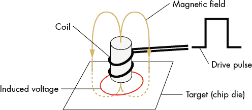

图 5-21：电磁脉冲将电压注入目标芯片。

许多封装上方有散热器。虽然我们发现仍然可以通过薄散热器插入一些磁场，但它确实显著减少了传递到芯片的功率。去除散热器对于许多攻击，包括 EMFI 攻击，非常有帮助，具体如下所示。

### 生成电磁故障

你的预算决定了是购买还是自制线圈和脉冲发生器。线圈可以有多种形式，最简单的方法是使用现成的磁场探头或固芯电感器。一些有用的探头设计参考文献包括 Rachid Omarouayache 等人的《用于 EM 故障攻击的磁性微探头设计》（EMC Europe，2013 年）和 Rajesh Velegalati、Robert Van Spyk 及 Jasper van Woudenberg 的《电磁故障注入实践》（ICMC，2013 年）。通常，探头将由 SMA 连接器构建，如图 5-22 中的示例所示。

最后，你需要为探头提供信号。所需的信号强度决定了你需要哪些设备。最基本的脉冲来自电容器通过探头线圈的放电。目标是通过线圈实现非常高的电流变化速率，因此线圈的匝数越少，电感越小，从而导致更快的上升时间。

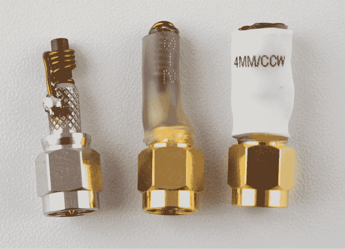

图 5-22：自制和商用探头示例

你可以购买商用脉冲发生器，这些发生器具有广泛的电压和电流输出范围。通过调整脉冲的电压和/或电流，你可以调节在目标设备中诱发的效应类型。Avtech、Riscure、NewAE Technology 和 Keysight 都是脉冲发生器（或 EMFI 工具）供应商。用于故障注入的典型电压为 60–400V，电流为 0.5–20A，脉冲长度通常为几十纳秒（因此功率约为几十微瓦；不必担心烧坏探头尖端）。

一个可以由脉冲发生器或探头尖端定义的参数是脉冲在芯片中感应的极性。你可以通过切换进入探头的电压脉冲的极性或反转探头线圈的方向来改变脉冲极性。无论哪种方法，都能反转磁场的方向，从而反转感应电流的方向。在某些情况下，你可能无法安全地改变极性。例如，在使用高电压时，你肯定希望金属连接器的裸露部分处于地电位。实际上，脉冲极性的选择是任意的；我们倾向于在特定设备上测试两种极性，因为某一种极性可能在特定设备上比另一种更有效。

最后，将探头尖端尽量接近芯片，但不要触碰芯片。根据经验法则，目标与探头的距离应小于回路直径。如果回路直径约为 1 毫米，你可以直接将其放置在封装顶部。如果直径更小，可以考虑去除芯片封装。

### 电磁故障注入架构

电磁故障注入工具可以使用多种架构，通常分为两种主要类型：直接驱动注入线圈和耦合驱动（见图 5-23）。左侧和中间的两种电磁故障注入工具采用*直驱*架构，而右侧的电磁故障注入工具采用*耦合驱动*（这里与电容 C1 耦合）。在直驱电磁故障注入工具中，电容器组直接接入线圈，并控制接入时间。

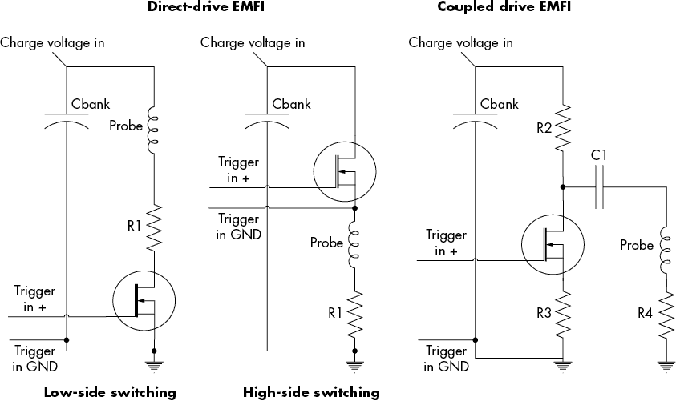

图 5-23：EMFI 工具

直驱架构的优势在于它对连接到设备的探头相对宽容。它不需要精确匹配阻抗或其他因素，因为几乎任何连接到驱动器的东西都可以从电容器组中尽可能快速地驱动。在这两种直驱架构中，电阻器 R1 用于限制开关元件（MOSFET）中的电流，以防输出端短路导致损坏。

你可以将直驱架构细分为*高端*或*低端*开关架构。低端开关的优点是结构简单，能够实现高性能；主要缺点是输出端“尖端”始终连接到高电压源，这是一种危险的情况。你可以在第一款开源 EMFI 工具中找到这种架构的例子，Ang Cui 和 Rick Housley 在他们的工作《BADFET：利用二阶脉冲电磁故障注入攻破现代安全启动》（WOOT ’17）中展示了这一架构。

一个更复杂但更安全的选择是使用高侧开关。选择这个选项时，开关元件必须“跟随脉冲”，意味着当开关关闭时，控制电压必须迅速跟随脉冲电压。在图 5-23 中的中间示例中，标记为“Trigger In GND”的连接点不在系统地面电位上；相反，它处于输出线圈的高侧（该线圈正处于从 0 V 到 400 V 左右的脉冲过程中）。将正常的系统地面（预期为 0 V）连接到“Trigger In GND”需要额外的电路来实现功能，但它确保了高电压仅在脉冲操作期间存在。高侧开关安排被 ChipSHOUTER 工具使用，你可以在[www.chipshouter.com](http://www.chipshouter.com)上找到有关此构造的更多信息，包括 ChipSHOUTER 设计细节和原理图。

图 5-23 右侧所示的耦合架构允许低侧驱动的简单性，但使用耦合元件（如变压器、电感器或电容器）来传递探头能量，确保电压仅在放电事件期间存在。图 5-23 中的示例显示了使用电容 C1 来耦合能量。如果选择电阻 R3 非常小，则可以像此示例中一样将“Trigger In GND”连接到系统地面。电阻 R2 用于在 MOSFET 打开（关闭）时在其两端产生电压，从而引起一个变化的电压，该电压通过电容 C1 耦合。

该架构可能需要通过不同的探头进行调试——例如，改变 R4 和 C1 的值。《EM 脉冲故障注入设计考虑》由 Arthur Beckers 等人（CARDIS 2019）提供了该架构设计的良好概述。该架构在设计简单性、脉冲生成有效性和通过限制输出端可能暴露的高电压来固有地保证安全性之间提供了一种折衷（输出端的高电压无法像其余电路那样轻松封装）。

### EMFI 脉冲波形和宽度

一个典型的驱动波形应该是什么样的？图 5-24 展示了这样的波形示例。电压进入一个线圈，你可以看到它从 0 V 变到 400 V，再回到 0 V。

在这种情况下，我们生成了两个连续的脉冲。你可能认为只有非常短（窄）的脉冲是相关的。如果 CPU 以 50 MHz 运行，一个时钟周期是 20ns，那么你是否真的应该插入更宽的脉冲，比如显示的 1,000ns 脉冲？在考虑脉冲宽度时，记住是*磁通量的变化*在引入故障。因此，我们主要关心的是*边缘*。边缘的电压变化是实际故障插入的唯一有趣时刻。一个非常宽的脉冲意味着在上升沿引发电流，在下降沿引发相反方向的电流。

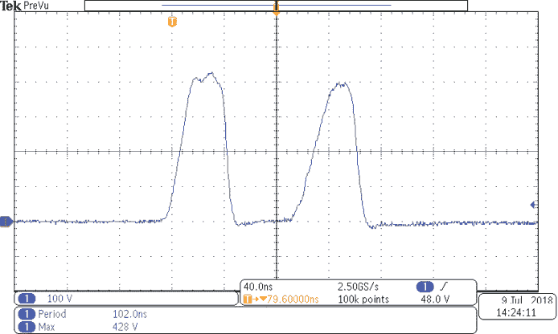

图 5-24：插入到线圈中的驱动波形示例，用于 EMFI 攻击

### 电磁故障注入的搜索参数

电磁故障注入（EMFI）中的一个主要参数是探头尖端的类型以及尖端的构造，例如绕组的数量、使用的核心类型和尖端产生的磁场极性。一般来说，这些参数比较难以变化，因为它们高度依赖于你的具体物理硬件。改变这些参数可能意味着需要制造新的物理探头，这并不像改变一些 Python 代码那么简单。

选择正确的极性以生成你所需的故障，遗憾的是，这只能靠运气。我们并不知道有什么方法可以预测哪种极性效果更好，但我们发现一种极性可能会触发与另一种极性不同的故障。作为极性对真实设备影响的例子，请参阅 Colin O'Flynn 的《BAM BAM!! 电磁故障注入在汽车 ECU 攻击中的可靠性》（ESCAR EU，2020），其中一种极性未能成功，而另一种极性在 ECU 目标上取得了极大成功。

关于核心构建本身的主题，研究表明使用少量的环路（从单个环路开始）和锐化的铁氧体核心。湿式研磨机（通常用于刀具磨锐）非常适合塑形铁氧体核心。

电磁故障注入通常是非破坏性的，因此你可以从最大值的 50%开始你的*故障功率*（*故障* *电压* 乘以 *故障电流*），然后根据是否没有结果或崩溃过多来调整。你可能无法配置*故障持续时间*，因为这取决于脉冲发生器。然而，如果你能配置它，从 10–50 纳秒开始是合理的。如前所述，非常宽的脉冲实际上可能会导致两个脉冲被注入到目标中。

一旦你完成了一些初始设置，记得检查你的配置并使用第四章中讨论的搜索策略。

## 光学故障注入

芯片由半导体材料构成，通常是使用掺杂硅制造的，并且具有一个有趣的特性（对我们黑客而言），即当你用足够强度的光子照射门时，门的导电性会发生变化。强光脉冲实际上有能力电离半导体区域，从而导致局部故障。

人类实际上从我们开始将集成电路(IC)放置在辐射强烈的环境中，如外太空时，就已经知道了光子效应。各种辐射都会产生与用光子照射晶体管相同的效应，比如用α粒子、X 射线等对其进行辐射。问问你在航空电子或航天技术领域的朋友关于*单粒子事件翻转*—基本上，太空本身笨拙地试图在你的芯片上注入故障。进行故障分析的人可以通过用激光轰击集成电路来模拟这些效应。激光的好处是它们比粒子加速器或 X 射线机更安全、更容易获得。这意味着我们可以用它们来注入故障。

### 芯片准备

为了通过光访问芯片，您必须首先去除部分或全部封装，这一过程被称为*解封*（*decapping*）或*去封装*，如第一章所述。要访问芯片的正面，只需解封顶部（假设它不是*倒装芯片*设备，见第三章讨论）。图 5-25 展示了一个已解封的智能卡芯片示例。

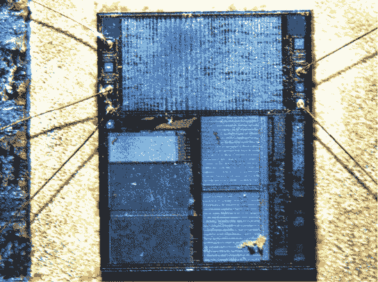

图 5-25：已解封的公开可用智能卡芯片，连线保持完好（来源：Riscure）

要解封一个设备，我们使用酸（通常是烟雾状硝酸）来化学蚀刻封装。不同的封装类型需要使用不同的具体过程。因此，暴露硅芯片既是技巧又是科学。做好在开发解封技术的实验过程中可能会丢失一些样品的准备，并且要意识到，在没有适当化学实验室的环境下进行解封是危险的。通过一些努力是可能的；请参考*《PoC || GTFO 国际期刊》*，第 0x04 期，获取一些关于在家进行解封的好提示。

目标是通过包装上打一个洞，使芯片可见，同时确保连线和包装的其他部分完好无损，以便您可以将芯片放回其原始 PCB 上使用。芯片的封装决定了您可以访问芯片的哪些部分。您只能从一侧解封 BGA 封装，通常会暴露芯片的前面；而倒装芯片封装则提供对芯片背面的访问。在制造过程中，如果发生芯片堆叠，您最终可能只能访问包装中的一颗芯片。叠层封装会带来一些挑战。（有关这些封装的讨论，请参见第三章。）

当无法去封装时，去包装和重新连接可能会奏效。使用这种技术，你完全溶解封装并破坏连接线，只留下硅芯片。一旦你将芯片从封装中提取出来，你就可以访问芯片的正面和背面，但需要通过重新连接来重新连接芯片。芯片准备实验室可以进行重新连接，或者如果你有接触到线键合机，自己动手（需要一些练习）也可以。

### 正面和背面攻击

你可以从两个方向进行光学攻击：芯片的正面或背面（见图 5-26）。

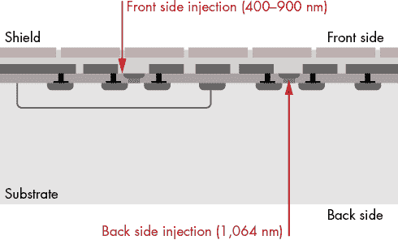

图 5-26：来自芯片两侧的激光攻击（图片来源：Riscure）

箭头指示了激光束的来源。芯片的正面有组成连接门的金属层。旧的芯片可能有三层金属层，而现代集成电路可能有超过 10 层。硅衬底位于芯片的背面。你想要攻击的门被夹在金属和衬底之间，所以你需要让光子越过这些障碍。达到这个目标的关键有两个方面：波长和功率。

在图 5-26 所示的芯片正面，金属会散射你的光子，尽管金属线之间的间隙相对较小，但它们足够大，光子可以悄悄穿过。较短的波长有助于光子通过这些小间隙。层与层之间的散射就像旧款的巴加泰尔弹球游戏，尽管弹球从顶部的一个地方发射，但它最终落地的区域却扩展到了底部的一个更大范围。这使得落地区域比光源发射的点的大小要大。大约 400 nm 到 900 nm 之间的波长效果最好，因为目标中的硅能够轻松吸收这些波长。

根据你需要反射多少金属层、选择的频率以及激光脉冲的持续时间，你可能需要几瓦特的功率。过高功率的二极管激光器很有用，因为调低功率比调高功率要容易。在实验室环境中，前面使用的衰减 445 nm/3 W 和 808 nm/14 W 激光器的脉冲持续时间从 20ns 到 1000ns 不等。不要因为高功率的额定值而气馁。参阅 Sergei P. Skorobogatov 和 Ross J. Anderson 的论文《光学故障注入攻击》（CHES 2002），讨论了成功使用 650 nm/10 mW 激光器进行故障注入攻击的案例。

在背面，你需要穿透衬底，这基本上是一个厚（几百微米）的硅片，你的光子需要穿透它才能产生效果。这里的难题是，你希望使用一种不会被硅衬底吸收的波长，但却会被门（同样由硅制成）吸收！

解决此问题的方法是使用硅刚好变得透明的激光波长。在红外范围内，1,064 nm 是一个不错的选择，因为它也可以释放大量的光子来影响门电路。我们曾使用 20 W 二极管激光器来实现这一点，尽管这可能有点“过于强大”。衬底也会扩散你的光子，这会增加有效的光斑大小；如果你能使用这类抛光设备，抛光和薄化衬底会有所帮助。

图 5-27 显示了不同光波长在各种材料中的穿透深度。


图 5-27：不同光子波长在硅中的穿透深度

你可以看到，在 1,064 nm 处，硅刚好接近变得透明。随着波长变短，吸收系数开始迅速增加。例如，注意 1,200nm（1.2μm）和 800nm（0.8μm）之间的变化。

### 光源

在尝试通过光子注入故障时，需要考虑光源的以下特性：时间精度、空间精度、波长和强度。

你可以通过多种方法在你的芯片上获得足够的光子冲击；以下是三种方法：

+   使用用锡箔包裹的相机闪光灯，通过一个小孔将光束集中并通过显微镜。这显然是一种非常具成本效益的解决方案，尽管时间和空间的精度有限（这一点在 Skorobogatov 和 Anderson 的《光学故障注入攻击》中也有所介绍）。

+   使用专门用于 IC 修改的激光切割机。故障分析实验室通常有这些设备，但它们不在普通黑客的预算之内。我们提到它们，是因为它们在专用工具可用之前曾用于故障注入。（注意，这些激光切割机不同于用于切割木材或金属的激光切割机。）这些切割机的光束强度足以进行故障注入。它们设计用于通过烧蚀部分芯片来进行微观修改。一个缺点是，当它们用于切割时，对时间精度没有要求，这大大限制了在正确的时刻释放光子的能力。基于八木天线的激光切割机在触发激光和实际光子释放之间的时间存在抖动，这意味着它们在用于故障注入时提供的不一致的可重复性。

+   使用二极管激光器。你可以将二极管激光器与显微镜光学元件结合，聚焦到一个小光斑，或者与光纤结合引导光束，如图 5-28 所示。


图 5-28：光纤激光故障注入（来源：Riscure）

这张照片展示了一根光纤精确定位在一个去顶盖的智能卡芯片上，激光二极管瞄准芯片的特定区域。你可以将显微镜和光纤与 XY 加工平台结合使用来定位激光，这样可以生成小而集中的光斑和脉冲，且几乎没有定时抖动。

你可以将光学故障注入扩展到本书范围之外的更高级技术。例如，在处理高度保护的芯片时，可以使用多个激光源。如果你有一个包含 CPU 和加密加速器的芯片，你有时可以通过将一个激光光斑放置在 CPU 的某个区域，另一个放置在加密加速器的区域，然后同时照射这两个区域，从而在两个核心上注入故障。

### 光学故障注入设置

光学故障注入的优势在于你可以通过将激光瞄准芯片的精确位置来准确地定位注入的故障，这使得你可以针对功能的小部分（例如，JTAG 解锁电路）进行注入。找到合适的位置比较困难，需要某种 XY 定位平台来自动化搜索有用的位置。你需要一些具有匹配光斑尺寸的规格（即定位分辨率）的设备，这些光斑尺寸可以小到 1 微米。

在 XY 工作站旁边，你需要选择上述提到的光源之一，并可选地将其连接到光学显微镜上。请注意，任何显微镜都有一定范围的频率是几乎透明的，因此请确保它与光源的频率匹配。

光斑大小可以通过光学显微镜设置中的不同放大倍数进行配置。你可以通过降低光强度来减小有效光斑大小，这样可以减少散射。理想情况下，光斑的直径应在 1–50 微米之间。光斑越小，定位特定区域的精度越高，但这也意味着你需要在 XY 空间中搜索更多的光斑。通常情况下，我们建议从较大的光斑开始。如果你最终只得到崩溃而没有有趣的故障，可能是你扫描的区域太大了，此时可以尝试减小光斑大小。

### 光学故障注入的可配置参数

第一个需要考虑的参数是用于 XY 扫描的*目标区域*。你可以对芯片的照片进行一些光学反向工程，以识别不同的模块。根据我们的经验，避免扫描内存单元可以节省时间，尽管包含内存解码器可能也很有趣。如果你不想限制自己，可以扫描整个芯片。

两个参数，*光强度*和*持续时间*，决定了你传递的能量量。能量过大会导致芯片损坏。我们在设备旁有一个小小的芯片墓地，作为提醒。对于所有光源，你可以使用滤光器来控制光强度，滤光器能阻挡光线。对于激光切割机，你还可以通过电子方式调整强度，而对于二极管激光器，你可以通过调节电源来调节强度和持续时间。至于持续时间，通常你会瞄准一个时钟周期的长度，但这里也有一定的余地。在我们的实验中，我们已经观察到，在较低强度下，成功的故障发生在几十个时钟周期的长度上。

扫描的棘手部分在于，不同芯片部分所需的能量量不同，这意味着你需要结合优化参数和 XY 扫描。为了避免烧毁芯片，首先使用非常低的能量进行一次测试，这时不会出现故障或其他可观察的效果。尝试将光强度设为最大值的 1%到 10%，持续时间设为 10–50 纳秒，并开始在芯片上进行扫描，比如在 20×20 的网格中。如果看到任何不规则的行为，终止实验，降低设置，再重复直到没有故障为止。然后开始逐步增加能量，每次都在芯片上进行新的扫描。一旦你开始看到有趣的故障，就可以开始缩小参数范围。

当你进行双激光光学故障注入时，你将加倍我们刚才描述的大多数参数，导致一个非常复杂的搜索空间。这并没有什么魔法灵丹妙药，完全是应用分而治之的原则。

## 体偏注入

*体偏注入（BBI）*是一种介于电磁故障注入和激光故障注入之间的故障注入方法。它使用一个物理针头，放置在芯片的背面（参见图 5-29）。通过针头注入高压脉冲，这个脉冲可以耦合到集成电路的各个内部节点。Philippe Maurine 在他的论文《电磁故障注入技术：设备和实验结果》（FDTC 2012）中介绍了这种方法。

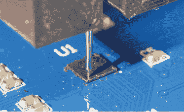

图 5-29：体偏注入使用针头作用于芯片的背面。

该探针是一个标准的弹簧加载式测试点探针。在图 5-29 中，我们为了进行背面攻击稍微作弊了一下。目标设备是一个标准的微控制器，采用晶圆级芯片封装（WLCSP）。这些 WLCSP 设备实际上是硅片的一片，添加了焊球，专为一些最小的电子产品设计。由于其构造方式，它们通常暴露出设备的背面，因此你不需要进行任何工作。可能会有一个简单的绝缘盖，容易刮去，但不需要我们之前讨论的酸性解封装过程。

为了注入故障，需要将相对高电压脉冲注入到接触设备背面的针脚上。由于背面和设备内部节点之间没有直接（低电阻）连接，因此需要这种高电压脉冲。图 5-30 展示了一个脉冲示例。

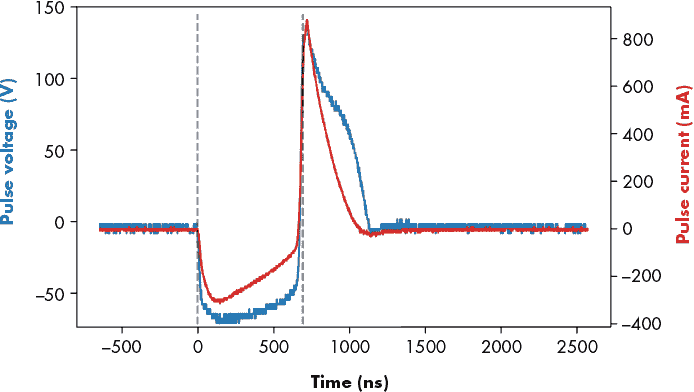

图 5-30：输入 = 10 V 时的示例脉冲，脉冲宽度 = 680 ns。BBI 需要像 EMFI 一样的高电压，但其峰值电流比 EMFI 更小。

您会注意到芯片背面的峰值电压超过 150 V。然而，这种较高的电压会转换为 IC 内部节点上的较小电压，因此我们不会“烧坏” IC。此例中的峰值电流为 0.8 A，远小于 EMFI，在 EMFI 中我们可能会在线圈中看到 20 A 或更大的峰值电流。

与光学故障注入（OFI）相比，甚至与电磁故障注入（EMFI）相比，BBI 技术的成本要低得多。某一架构使用了简单的升压变压器，这意味着可以以大约 $15 的成本制作一个可用的 BBI 探针（见 图 5-31）。

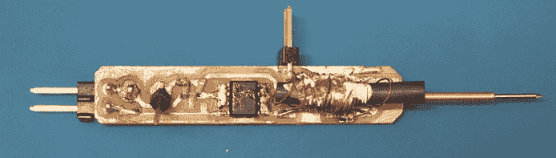

图 5-31：该 ChipJabber-BasicBBI 探针可以以非常低的成本组装。

在这个例子中，一个升压变压器（位于 图 5-31 中图中央右侧杂乱的绕组）由一个简单的 MOSFET 开关驱动。通过改变输入电压，您可以调整 BBI 的输出电压。有关原理图的完整细节，请参阅 [`github.com/newaetech/chipjabber-basicbbi/`](https://github.com/newaetech/chipjabber-basicbbi/) 以及 Colin O'Flynn 的论文《低成本体偏注入（BBI）攻击 WLCSP 设备》（CARDIS，2020）。

### 体偏注入的参数

BBI 的参数相对简单。除了标准参数，如时序和芯片表面的物理位置外，BBI 还增加了 *脉冲电压*。我们通常从非常低的电压开始（尽可能接近 0 V），然后逐步增加，直到看到故障。有效电压可能从 10 V 到 500 V 不等，具体取决于设备。电压需求的主要驱动因素是背面厚度。您可以使用万用表测量从芯片背面到地面引脚的电阻来粗略估计。如果电阻在 20 kΩ 到 50 kΩ 之间，您将需要一个非常低的电压（10 V 到 50 V）。如果电阻在 100 kΩ 到 300 kΩ 之间，您可能需要更高的电压，例如 75 V 到 200 V。如果电阻更高（1 MΩ），攻击可能无效或需要更高的电压。

BBI 很容易损坏设备。这些高电压脉冲直接注入硅芯片，相较于电磁故障注入（EMFI），更容易造成设备的永久性故障。从低电压开始并逐步增加是避免损坏设备的建议搜索策略。

## 触发硬件故障

我们已经提到过几次触发器，假设某些触发事件是容易访问的。实际上，触发事件可能简单也可能复杂，但我们最终要做出决定的是哪个事件在我们关注的操作之前发生，并且我们希望触发故障。

触发的要求与侧信道功率分析类似，我们在第九章中描述了这一点。侧信道功率分析与故障注入在触发方面的主要区别在于，故障注入是主动操控设备执行，而功率分析是被动监听。由于功率分析是被动监听，我们可以在已录制的数据中找到触发事件，但在故障注入中，我们需要一个在设备操作期间发生的触发事件。

微控制器上最常见的故障触发器之一是复位引脚。当设备启动时，它通常会执行一些安全关键操作，例如检查保险丝位的值、检查启动签名等等。这个过程告诉我们起始点（复位变为非活动状态时，设备可以运行），但是我们应该从触发点检查多长时间呢？需要进行一些实验来确定这一点。你可以为你的微控制器编写一个程序，一旦代码开始，就将一个 I/O 引脚置为高电平。复位引脚变为非活动状态和你的用户 I/O 引脚变为高电平之间的时间表示设备执行启动代码的时刻。

一些设备还包括复位输入和复位输出。这些设备使用复位输出来通知系统中的其他设备主微控制器何时启动并正常运行。这个信息可以提供更可靠的触发，因为复位输出实际上可能是复位逻辑的一部分。

更复杂的触发器通常基于设备的某些 I/O，例如指示设备处于特定启动状态的串行消息。例如，Listing 5-3 展示了 Echo Dot 的启动消息。

```
[PART] load "tee1" from 0x0000000000E00200 (dev) to 0x43001000 (mem) [SUCCESS]
[PART] load speed: 9583KB/s, 58880 bytes, 6ms
[BLDR_MTEE] sha256 takes 1 (ms) for 58304 bytes
[BLDR_MTEE] rsa2048 takes 87 (ms)
[BLDR_MTEE] verify pkcs#1 pss takes 2 (ms)
[BLDR_MTEE] aes128cbc takes 1 (ms) for 58304
NAND INFO:nand_bread 245: blknr:0xE0E,  blks:0x1
```

Listing 5-3：来自 Echo Dot 的启动消息提供了足够的细节，我们可以针对各个方面进行故障注入。

拥有如此详细的启动消息是罕见的，但在这个例子中，串行端口消息指示了某些功能（如 RSA-2048 签名计算）是否成功。我们很可能希望在 RSA-2048 计算之后、PKCS#1 验证之前触发故障。如果我们只是想验证是否可以触发故障，那么那长达 87 毫秒的 RSA-2048 操作将是一个完美的目标。通过破坏 RSA-2048 计算，我们将看到签名验证失败（因为 RSA 操作没有正确执行）。

通常，你可以通过将设备启动时的时间与已知的正常设置和无效设置进行比较，找到有用的时序信息。如果你向设备发送错误的密码，它会卡住还是启动错误指示灯？从逻辑上讲，你的故障位置一定是在设备开始处理和发生卡住或错误条件之间的某个时间点。

在下一章中，我们将通过一些实际例子，展示如何更具体地找到这些触发点。

### 与不可预测目标时序的协作

针对故障注入的对策之一，无论是否故意实施，都是在触发和目标操作之间设置非恒定时间。如果这个时间有抖动，攻击者如何精准地确定注入时机以命中代码序列中的特定操作呢？

时序抖动的产生方式有多种：通过故意引入代码中的随机延迟、当目标运行操作系统和调度程序并定期处理中断时，或者目标运行在抖动的时钟上。任何这些情况都会对故障注入的成功率产生负面影响，因为目标操作将发生在不可预测的时间。弥补这种抖动的一种方法是使用旁路信号将注入器与目标同步。使用功率旁路信号意味着在功率测量中的波形上触发——通常使用 FPGA 进行实时触发。

## 总结

故障攻击提供了一种强大的手段，可以将各种非预期的行为引入设备。虽然看起来可能有大量的可能性，但通过一些实验往往能够成功地实施故障攻击。

本章概述了你可以通过故障注入引发的各种效果，以及一些常见的注入方法——即时钟故障注入、电压故障注入、光学故障注入、EM 故障注入和体偏置注入。这些内容应能为你提供理解和应用这些攻击的背景知识。

在接下来的几章中，我们将讨论旁路功率分析，它可以与故障注入结合使用。你可以使用旁路功率分析来找出设备内部正在执行的功能，这是一个强大的工具，可以帮助你确定故障是否引起了非预期的效果，即使你无法从目标设备中看到任何输出。

既然你已经看到这里了，这里有一个故障注入的小窍门，虽然超出了本书的范围，但对于所有嵌入式设备来说具有广泛的适用性。如果经典的栈溢出缓冲区溢出载荷被长度检查阻止，可以故意让缓冲区长度检查出错，重新找回上世纪 90 年代的代码注入感觉。祝你玩得开心！
