# 基准时间：故障注入实验室


故障注入是一种攻击嵌入式系统的绝妙方法，本章重点介绍其实际应用。我们不仅描述了如何进行实际的注入，还介绍了如何开始自己的故障注入实验。尽管你可以在大量设备上进行故障注入，但在这里我们集中讨论一些特定的例子。

我们将我们的故障注入攻击分为三个部分，这些部分是相对可重现的。使用相同的硬件，你应该能够达到预期的结果。第一部分展示了如何使用火花注入故障到设备中。我们编写一个包含简单循环的程序，然后展示如何将故障注入到循环中。第二部分应用了两种不同的故障注入方法：撬棍注入和多路复用器（mux）注入。最后，第三部分应用故障注入来破坏支撑现代密码学的完美且安全的数学原理。

图 6-1 是一个显示所有这些操作的示意图（同一图示在第四章中作为图 4-3 出现）。

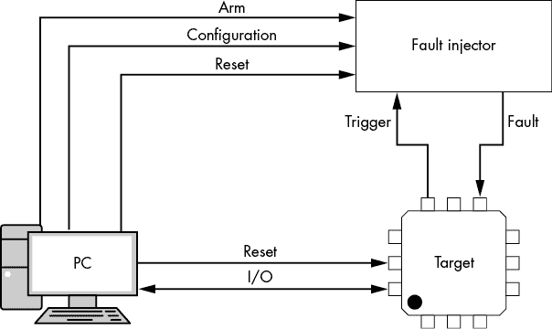

图 6-1：PC、故障注入器与目标之间的连接

阅读这些例子时，请记住，所有这些操作都会有相同的组成部分。一个*目标*将运行一些我们要注入故障的代码，但这三种操作将使用不同的目标。*故障注入器*是我们插入故障的方式；在不同的操作中，我们将向你展示几种不同的故障注入器。最后，*PC*将参与监控或控制整个操作。

设备之间的实际连接在各部分之间会有所不同。例如，在第一部分中，我们不需要精确的时序。这意味着图 6-1 中的“触发”信号可能是可选的；我们将使用的其中一个故障注入器根本没有任何触发器。在后续部分中，我们会有更精确的时序要求，因此将使用触发信号来延迟故障，以确保它在非常特定的时间点被插入。

## 第一部分：一个简单的循环

我们将从你可以执行的最基本的故障注入开始，展示如何在新目标上开始故障注入。面对新设备时，一个典型的任务是运行非常简单的循环代码（参见清单 6-1）在目标设备上。

```
void glitch_infinite(void)
{
    char str[64];
    unsigned int k = 0;
    //Declared volatile to avoid optimizing away loop.
    //This also adds lots of SRAM access
  1 volatile uint16_t i, j;
  2 volatile uint32_t cnt;
    while(1) {
 cnt = 0;
      3 trigger_high();
      4 for(i = 0; i < 200; i++){
            for(j = 0; j < 200; j++){
                cnt++;
            }
        }
        trigger_low();
      5 sprintf(str, "%lu %d %d %d\n", cnt, i, j, k++);
        uart_puts(str);
    }
}
```

清单 6-1：这段简单的 C 代码是一个很好的故障注入示例。

这段代码有几个设计特点，使得故障注入变得容易。两个变量，在第 1 和第 2 行，声明为`volatile`，提供了大量的静态 RAM（SRAM）访问，从而增加了攻击面。可选的`trigger_high()`命令在第 3 行可以用来触发外部硬件插入故障。双重循环结构第 4 行提供了多次故障影响程序的机会。如果一个变量被破坏或某条指令被跳过，结果可能是变量`i`、`j`和`cnt`的值都会不正确。它们的值会在第 5 行打印出来，以便你查看故障注入的结果。

`cnt`变量最可能会明显被破坏。例如，如果`j`的值被破坏，只有在外循环对`i`的最后一次迭代发生破坏时，才会观察到`j`值被破坏。这个简单的循环不仅显示你是否在注入故障，还可以通过观察输出变化来查看各种类型的故障。

你可能需要稍微修改清单 6-1 中的代码，以便在目标平台上编译，但它的设计目标是除了简单的字符串打印命令外，几乎不需要其他要求。

那么，如何在一个简单的循环上执行攻击呢？毕竟这是一个实验章节。我们将展示三种执行攻击的方法，所有这些方法的硬件成本大约是 50 美元，但你可能已经有了一些所需的设备。第一种方法使用 Arduino 作为目标设备，并通过 BBQ 打火机插入故障。接下来的两种方法将基于电压故障注入；我们将向你展示如何使用短路棒和多路复用电路来生成电压故障。为了驱动这些电路，我们将在本实验中使用 ChipWhisperer-Nano（或 ChipWhisperer-Lite），但你也可以使用其他脉冲源来驱动这些电路。让我们开始注入故障吧（正如他们所说的）。

### 一只痛苦的 BBQ 打火机

这种方法可能是更危险的，但从成本角度来看，它几乎是无可匹敌的。我们需要将代码从清单 6-1 编译到一个 Arduino 上。那段代码几乎可以直接使用。你需要先设置串口，然后将`puts()`调用替换为`Serial.write()`。你可能还想调整循环迭代计数器，以使输出变得更慢一些（参见图 6-2）。该程序还会为你标记成功的故障注入。

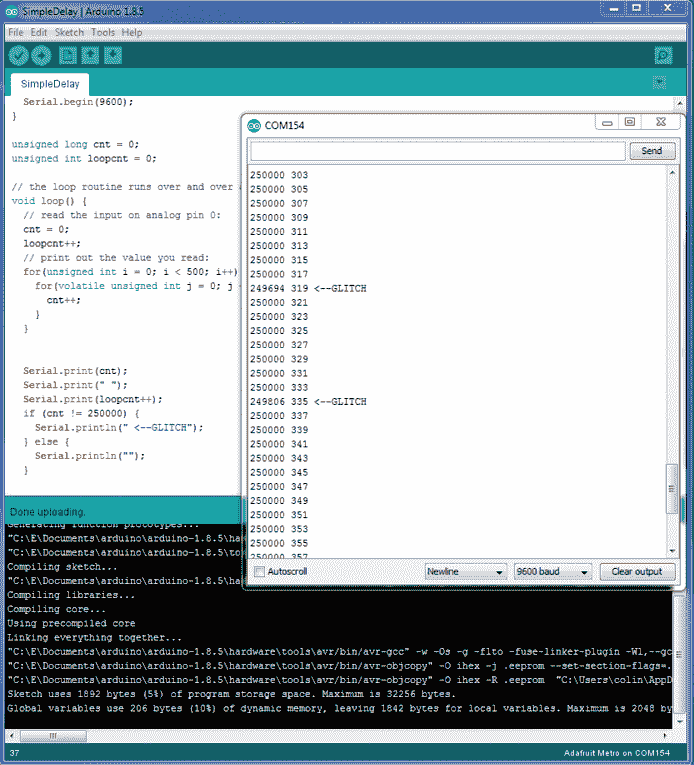

图 6-2：在 Arduino Metro Mini 上实现代码

本示例中我们使用的是 Arduino Metro Mini，Adafruit 零件号 2590，因为它配有 ATmega328P 芯片，采用 QFN 封装。我们需要 QFN 封装，因为它在芯片表面（我们生成电磁故障脉冲的地方）和芯片本体之间的材料最少。例如，ATmega328P 的 DIP 封装太厚，可能无法成功注入故障，甚至可能完全失败。

图 6-3 右侧的隔离器来自 Adafruit，零件号 2107，但你可以使用任何其他隔离器，甚至只是一个隔离的串口。故障注入方法也很容易损坏你的目标设备，因为你将使用非常高的电压！

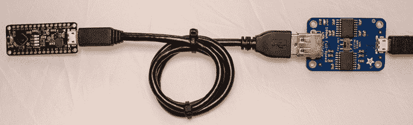

图 6-3：来自 Adafruit 的隔离器（右侧是 PCB），我们的目标（左侧是 PCB）

好了，警告够多了。如果你撕开一个烧烤点火器，你会发现压电点火器，如图 6-4 所示。

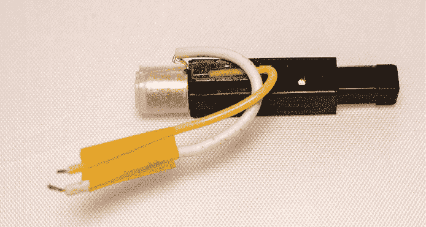

图 6-4：压电点火器产生高电压。

该元件在右端的推动器被压入外壳，直到听到“咔哒”声时，会产生高电压（小心不要电到自己）。如果你小心地将高压线（即连接到烧烤点火器端的电线）弯曲，使其接近端盖，它将产生火花。在我们的案例中，我们已经将两根电线连接起来，形成一个小的火花间隙，可能在 0.5 毫米到 2 毫米之间。间隙通过一些聚酰亚胺胶带固定。

这本身足以提供一个故障注入机制。我们将尝试强制火花在攻击 Arduino 时在某个“有趣”的地方生成。火花间隙位于表面贴装的 Arduino 封装上方（见图 6-5）。

芯片上方的聚酰亚胺胶带（Adafruit 零件号 3057，通常以 Kapton 品牌出售）为其提供绝缘保护。如果火花连接到微控制器的引脚，你会立刻烧毁设备，如果你的绝缘体不起作用或者超出了电压限制，也可能烧毁计算机。

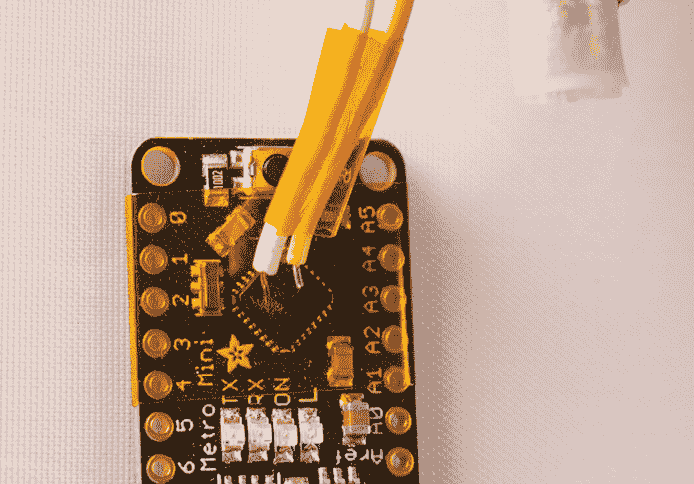

图 6-5：聚酰亚胺胶带有助于（但不能完全防止）我们的设备因高电压而爆炸。

接下来，运行程序并开始打火。运气好的话，你会得到一些损坏的输出，如图 6-2 屏幕上所示。如果总计数器重置为零，你可能还会看到一些重置。虽然这仍然是一种故障，但这并不是你想要的那种有趣的故障。重置意味着你的故障太强大；尝试在火花间隙中增加一些间距或更改位置。

这一部分简要展示了一个简单的循环和火花如何向设备插入故障。当时序不重要时，这种火花可以导致有用的攻击。在 Arun Magesh 的博客文章“通过燃气打火器进行电磁故障注入绕过 Android MDM，费用为 1.5 美元”中，这种类型的攻击被用在智能手机上。

## 第二部分：插入有用的故障

或许你不愿意烧毁目标设备或计算机，在这种情况下，你将需要一些更微妙的故障注入方法。在这一部分中，我们描述了如何使用故障注入攻击设备中存储在闪存中的读取保护配置字。如果我们成功改变这个配置字，就能读取我们通常无法访问的闪存内容。

在本章中，我们应用了两种较不激进但同样有效的故障注入方法：破坏器故障注入和多路复用器（mux）故障注入。我们还介绍了一个新的故障注入目标：Olimex LPC-P1114 开发板。开发板的用户手册将帮助你理解我们在这里描述的修改和互连。

本章使用的故障注入方法可以通过之前部分中我们所破坏的 Arduino 微处理器中的简单循环测试代码来实现相同的故障。如果你想测试故障设置，我们建议从清单 6-1 中的简单循环代码开始，并将其编译为目标代码。然而，为了避免本书中的重复，我们将直接跳到最终目标，即破坏安全配置。现在让我们一起走过如何实际看到一些有用的故障！

### 使用破坏器故障注入来破坏配置字

我们将应用破坏性故障注入方法来破坏微控制器的配置字（有关破坏性故障注入的介绍，请参见第五章）。这将基于 Chris Gerlinsky 的演讲“在 NXP LPC 系列微控制器上破解代码读保护”（REcon 布鲁塞尔 2017），该演讲涵盖了初步工作，包括故障如何工作及如何生成的细节。在这里，我们展示了一种稍微更简单的注入故障的方法，即通过电源引入一个“破坏器”。该方法已被证明能够对各种设备起作用，包括更高级的目标，如树莓派和现场可编程门阵列（FPGA）板。欲了解更多细节，请参见 Colin O'Flynn 的《在嵌入式系统上使用破坏器进行故障注入》（IACR Cryptology ePrint Archive，2016），该文介绍了破坏器故障注入方法。

最终目标是攻击代码读保护机制，这是防止他人将二进制代码从设备中复制出来的机制。在 LPC 设备中，代码读保护是内存中的一个特殊字，定义了微控制器具有的保护级别。这些代码读保护字节是“选项字节”的一部分，选项字节包含了微控制器的各种配置。表 6-1 列出了与代码读保护相关的选项字节的有效值。

表 6-1：与代码读保护相关的选项字节的有效值

| **模式** | 选项字节值 | **描述** |
| --- | --- | --- |
| NO_ISP | 0x4E697370 | 禁用“ISP 入口”引脚。 |
| CRP1 | 0x12345678 | 禁用 SWD 接口。仅通过 ISP 允许部分闪存更新。 |
| CRP2 | 0x87654321 | 禁用 SWD 接口。在大多数其他命令可用之前，必须执行完整芯片擦除。 |
| CRP3 | 0x43218765 | 禁用 SWD 接口；禁用 ISP 接口。除非用户通过替代方法实现引导加载程序调用，否则设备无法访问。 |
| 解锁 | 任何其他值 | 没有启用保护（完全的 JTAG 和引导加载程序访问）。 |

设计中的关键漏洞在于，“解锁”级别是默认值，只有当该字设置为几个特定值之一时，才会启用代码读取保护。这意味着，如果你在从闪存读取代码读取保护字时破坏了该值，就完全没有代码保护！我们可以使用故障注入来破坏这个值。接下来，我们来看一下需要哪些工具。

#### 设置设备

首先，我们需要一个目标设备（安装在目标板上），用于尝试破解代码读取保护；其次，我们需要一个能够插入故障的工具，以使程序错误读取值并移除读取保护。

图 6-6 展示了一个示例设置。LPC1114 目标板位于照片的顶部，ChipWhisperer-Nano（用于执行故障注入）位于照片的底部，可以看到两者之间的互联（稍后会详细介绍这种互联）。

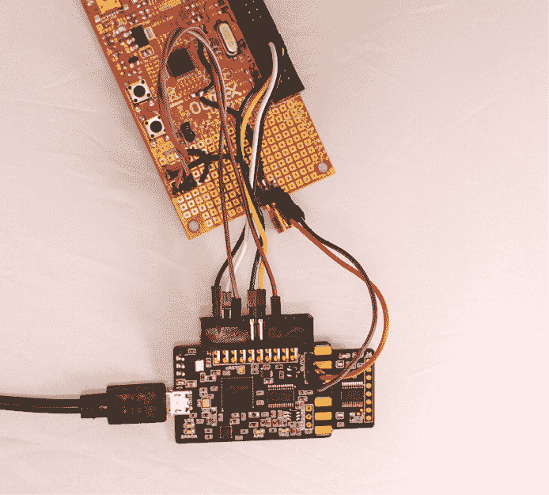

图 6-6：使用 ChipWhisperer-Nano 进行故障注入的 LPC1114 处理器目标

除了 ChipWhisperer-Nano 提供的编程和故障注入时序，其唯一真正使用的功能是简单的“短路”机制，如果需要的话，你可以用外部 MOSFET 或类似设备来替代。

#### ChipWhisperer-Nano 与 ChipWhisperer-Lite 的比较

我们使用 ChipWhisperer-Nano 是因为它的成本较低（$50），尽管它在故障注入时的时序分辨率不如 ChipWhisperer-Lite（$250）。ChipWhisperer-Lite 在执行这种攻击时更为可靠。

如果你按照图 6-6 中的连接方式使用 ChipWhisperer-Nano，请记住，ChipWhisperer-Nano 内置了一个 STM32F0 微控制器，作为目标设备。你可以移除目标端（它设计成可以剪切和断开），但更不具破坏性的方法是将其擦除。对于我们即将进行的攻击，STM32F0 目标的物理存在不会影响我们的使用。我们只需要确保它没有运行任何会干扰我们的 I/O 线路的代码。

下面是一个简短的 Python 示例，演示如何通过 Jupyter Notebook 接口执行此操作（有关更多细节，请参见本章节的笔记本 [`nostarch.com/hardwarehacking/`](https://nostarch.com/hardwarehacking/)）：

```
PLATFORM="CWNANO"
%run "Helper_Scripts/Setup_Generic.ipynb"
p = prog()
p.scope = scope
p.open() #Open and find attached STM32F0 target
p.find()
p.erase() #Erase it!
p.close()
target.dis()
scope.dis()
```

在这种情况下，我们仅通过引导加载程序接口擦除设备的闪存，以确保串行数据线是空闲的。如果 ChipWhisperer-Nano 目标上运行了代码，可能会破坏我们的引导加载程序访问。

#### 修改和互联

这种攻击的优点在于我们可以做到极其简单。我们需要在 LPC1114 目标的电源之间创建一个瞬时短路，因此我们对 LPC1114 开发板的 PCB 做了一些修改。基本上，我们需要一个来自过电流保护机制到电源轨的连接，并且必须移除那些会平滑电源轨上故障的电容器。我们目标是如 图 6-7 所示的电路。

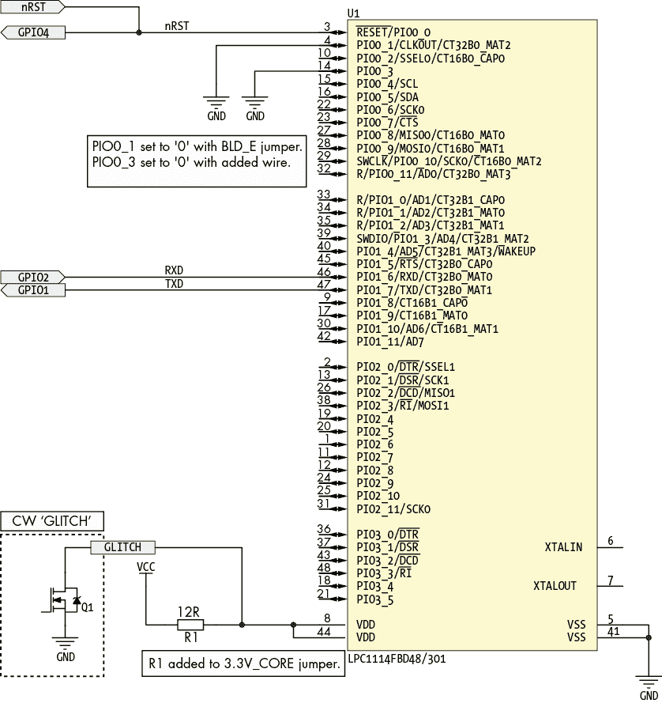

图 6-7：显示 LPC1114 开发套件部分原理图

原理图显示了 GLITCH 连接，指示我们如何插入故障。在我们提供的示例中，实际的 Q1 组件集成在 ChipWhisperer-Nano 中，但如果你想单独实现此功能，可以将电源路由到类似的故障注入模块，例如由信号发生器驱动的 MOSFET。图 6-8 显示了物理实现。


图 6-8：为故障注入而修改的 LPC1114 开发板

以下列表提供了对开发板进行修改的逐步说明，见 图 6-8：

1.  移除去耦电容 C4 1。

1.  移除去耦电容 C1 2。

1.  通过切断跳线 3，将 3.3 V CORE_E VDD 从 LPC1114 中断开。

1.  通过切断跳线 4，将 3.3 V IO_E VDD 从 LPC1114 中断开。

1.  在跳线 3 上插入一个 12 Ω 电阻。现在，PCB 电源 VDD 通过该电阻连接到 LPC1114。

1.  通过链接 5 将 3.3 V CORE_E VDD 和 3.3 V IO_E VDD 电源的“芯片端”连接在一起，从跳线 4 的焊盘和电容器 C4 1 的焊盘连接。

1.  将 3.3 V CORE_E VDD 和 3.3 V IO_E VDD 电源通过连接器 7 使用链接 6（这里连接器是 SMA 连接器，但任何类型的连接器均可）连接在一起。

1.  只需在 BLD_E 9 上安装插头，将 PIO0_1 接地。

1.  将 PIO0_3 设置为 GND，这需要将一根电线（短橙色电线 a）焊接到地面。

1.  在 8 处添加一个三针插头，并将 RST 连接路由到这三根引脚。

1.  将来自 ChipWhisperer 的 nReset OUT 线路在 J3-5 和触发输入线 J3-16 连接到开发板上的 RST 输入，连接时使用你在 8 处安装的插头。

1.  将来自 ChipWhisperer 的 GND 在 J3-2 引脚连接到开发板上的 UEXT-2 引脚。

1.  将来自 ChipWhisperer 的 VCC 在 J3-3 引脚连接到开发板上的 UEXT-1 引脚。

1.  将来自 ChipWhisperer 的 TXD 在 J3-10 引脚连接到开发板上的 UEXT-3 引脚。

1.  将来自 ChipWhisperer 的 RXD 在 J3-12 引脚连接到开发板上的 UEXT-4 引脚。

表 6-2 提供了目标设备与 ChipWhisperer-Nano 之间连接的总结。（你也应该能够从此列表中确定独立攻击类型的连接方式。）

表 6-2：ChipWhisperer-Nano 开发板与故障生成器的连接

| **LPC1114 开发板** | **ChipWhisperer-Nano** | **描述** |
| --- | --- | --- |
| UEXT-1 | J3-3 | VCC |
| UEXT-2 | J3-2 | GND |
| UEXT-3 | J3-10 | TXD |
| UEXT-4 | J3-12 | RXD |
| RST | J3-5 | 重置输出 |
| RST | J3-16 | 触发输入 |
| VCC_CORE | 故障连接器中间引脚 | 在此插入 VCC 故障 |
| GND | 故障连接侧引脚 | 第二个 GND（用于故障） |

开发板上的 RST 引脚既是输出（切换来重置设备）也是输入（作为插入故障的参考），这是必需的，因为 ChipWhisperer-Nano 使用 GPIO4 作为触发输入。

#### 时机就是一切

当 LPC1114 设备从重置中恢复时，它将从闪存读取配置字，我们需要在这一时刻插入故障。如果我们能够破坏内存读取，设备将被解锁，这不是设计者的初衷。

我们使用重置引脚来计时故障。重置引脚的上升沿（由于重置是低电平有效的）指示引导序列的开始。如果你控制的是单一设备（例如你自己的 FPGA 或微控制器），你当然可以根据你将重置引脚拉高的时间来控制故障。

重置引脚只告诉我们设备何时开始引导过程，但不能告诉我们结束时间，也不能告诉我们读取保护值何时从闪存中获取。我们需要在从引导开始到结束的过程中扫过故障插入点，瞄准可能发生闪存读取的每个时钟周期。

虽然重置引脚为我们提供了开始时间，但我们希望在设备完成引导时能够知道一个结束时间（如果到那时我们没有破坏代码保护，那么故障显然是无效的）。为了确定这个“结束时间”，我们可以编写一个简单的程序，切换一个 I/O 引脚并将其加载到微控制器中。当 I/O 引脚开始切换时，我们知道微控制器正在运行我们的代码，且引导过程已完成。

因此，引导时间是从重置引脚变为非活动状态（变为高电平）到 I/O 引脚切换之间的时间。在重置引脚变为高电平和 I/O 引脚切换之间，微控制器的引导代码必须正在从闪存读取读取保护值并对该值采取行动。我们的故障必须瞄准这个时间段中的某个时刻。

#### 引导加载程序协议

为了理解如何找到一个有效的故障，这里有一个简短的设备引导加载程序入门。我们将使用引导加载程序来判断事情是否按计划进行。

引导加载程序协议非常简单。使用串行协议与设备通信，允许我们通过串行终端实验引导加载程序。通信流程如下：我们发送一些设置信息，接着进行内存读写操作以加载和验证代码。

协议在传输第一个字符时自动确定波特率。其余的设置确认波特率同步，并通知引导加载程序外部晶体的速度，以防需要进行任何额外的设置。你可以在清单 6-3 的输出示例中看到一些设置命令，我们接下来会查看这些命令。

几个命令用于擦除、读取和写入内存，但我们只关心内存读取尝试，因为如果设备被锁定，内存读取会失败。我们可以使用`R 0 4\r\n`执行内存读取，这将尝试从地址 0 读取 4 字节。如果设备被锁定，我们会得到`19`的响应，这是访问不被允许的错误代码。最终，我们需要编写一个脚本方法，不断测试设备是否解锁。

有了这些，我们现在需要破坏存储代码读保护代码的“选项字节”。它们不会被持续检查，但只会在重置时读取。如前所述，我们需要从重置开始计时我们的攻击。

#### 设备设置

首先，我们需要使引导加载程序的通信正常工作。虽然我们可以实现整个引导加载程序协议，但我们将使用一个现有的库，叫做`nxpprog`（可在[`github.com/ulfen/nxpprog/`](https://github.com/ulfen/nxpprog/)找到），它能够与这些设备进行通信。

以下示例参考了本书资源中提供的配套 Jupyter Notebook，该 Notebook 实现了完整的攻击过程并提供了所需的设置细节。建议的安装说明也可以在线获取。不过，我们将在这里一起走一遍代码和攻击过程，这样你就能看到它是如何工作的，而无需安装任何东西。

`nxpprog`库需要支持函数`isp_mode()`、`write()`和`readline()`。`isp_mode()`函数通过设置进入引脚并重置设备，进入在系统编程（ISP）模式。在这个示例中，ISP 模式入口引脚被焊接到 GND 以强制进入 ISP 模式（参见图 6-8）。`isp_mode()`函数仅重置设备，从而开始一个新的引导加载程序迭代。其他两个函数则通过串口与引导加载程序通信。如果使用的是 ChipWhisperer 设备，则数据将从 ChipWhisperer 输出。有关这些函数的更多细节，请参阅 Jupyter Notebook。

清单 6-2 显示了尝试连接设备并读取输出的示例：

```
nxpdev = CWDevice(scope, target, print_debug=True)

#Need to enter ISP mode before initializing programmer object
nxpdev.isp_mode()
nxpp = nxpprog.NXP_Programmer("lpc1114", nxpdev, 12000)

#Examples of stuff you can do:
print(nxpp.get_serial_number())
print(nxpp.read_block(0, 4))
```

清单 6-2：使用`nxpprog`连接并读取内存

清单 6-3 包含预期的输出和调试信息，显示了串口`read`和`write`指令。

```
Write: ?
Read: Synchronized
Write: b'Synchronized\r\n'
Read: Synchronized
Read: OK
Write: b'12000\r\n'
Read: 12000
Read: OK
Write: b'A 0\r\n'
Read: A 0
Read: 0
Write: b'U 23130\r\n'
Read: 0
Write: b'N\r\n'
Read: 0
Read: 218316836
Read: 2935817382
Read: 1480765853
Read: 4110424384
218316836 2935817382 1480765853 4110424384
Write: b'R 0 4\r\n'
Read: 19
**OSError**: 'R 0 4' error: 19 - CODE_READ_PROTECTION_ENABLED: Code read protection enabled
```

清单 6-3：运行`nxpprog`连接脚本的输出，来自清单 6-2

在这种情况下，我们会得到一个 `CODE_READ_PROTECTION_ENABLED` 错误，这正是我们所期待的。如果我们使用的是一个新的开发板，那么代码读保护可能尚未启用。这意味着为了模拟现实世界，我们需要在继续教程之前先开启该保护。

读保护代码字节位于地址 0x2FC，并由 4 个字节组成。要编程代码保护，我们需要擦除整个内存页（4,096 字节），然后使用我们的配置字重新编程新页，将其设置为启用读保护。在实际情况中，我们需要知道应该在该页的所有其他字节中编程什么，但如果我们不需要运行代码，而只是进行概念验证，我们可以将数据编程为零（或其他任何数据）。

列表 6-4 展示了示例实现默认打开 *lpc1114_first4096.bin* 文件：

```
def set_crp(nxpp, value, image=None):
    """
    Set CRP value - requires the first 4096 bytes of FLASH due to
    page size!
    """

    if image is None:
        f = open(r"external/lpc1114_first4096.bin", "rb")
        image = f.read()
        f.close()

    image = list(image)
    image[0x2fc] = (value >> 0)  & 0xff
    image[0x2fd] = (value >> 8)  & 0xff
    image[0x2fe] = (value >> 16) & 0xff
    image[0x2ff] = (value >> 24) & 0xff

    print("Programming flash...")
    nxpp.prog_image(bytes(image), 0)
    print("Done!")
```

列表 6-4：擦除并重新编程整个内存页。

如果你没有这个文件，你可以简单地将 `image = [0]*4096` 的值设置为零，这样就会用零（0）覆盖闪存页。这意味着代码将不再运行，但我们不关心代码是否运行；我们关心的是是否能够绕过代码读保护。

列表 6-5 使用了来自列表 6-4 的数据来锁定设备，以便我们可以执行一种现实世界中的攻击：

```
nxpdev = CWDevice(scope, target, print_debug=True)

#Need to enter ISP mode before initializing programmer object
nxpdev.isp_mode()
nxpp = nxpprog.NXP_Programmer("lpc1114", nxpdev, 12000)
set_crp(nxpp, 0x12345678)
```

列表 6-5：使用 ISP API 接口锁定设备

现在我们已经锁定了设备，可以开始进一步调查并确定攻击的范围。

#### 使用功率分析确定故障注入时机

在这个案例中，我们将作弊并从一个“正常”的电源波形开始，以观察大约在什么时间我们应该插入故障。图 6-8 显示了我们插入了一个 12 欧姆的分流电阻。其功能不仅是促进故障注入，还允许我们观察功率波形。在我们的电流击穿攻击示例中，我们将示波器连接到分流电阻上，记录电源轨的直流电平，如 图 6-9 中的中间轨迹所示。

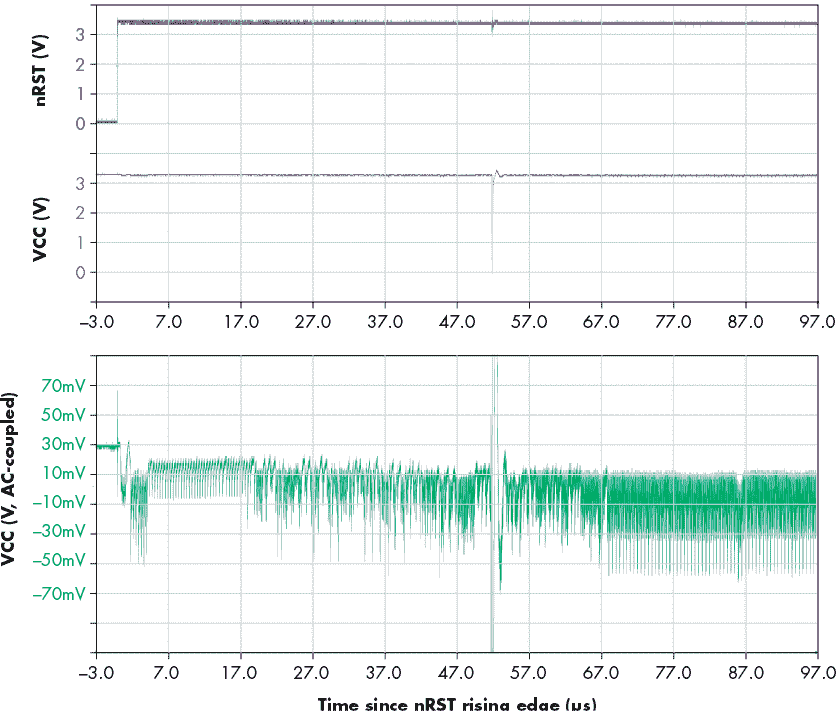

图 6-9：启动时的电源轨迹

在这条轨迹的中间是电流击穿注入的故障。底部行显示了对故障两侧电源轨变化的放大查看，这就是我们所称的功率轨迹。顶部行则显示了 LPC1114 的复位输出轨迹。功率轨迹的变化使我们能够看到 CPU 执行的不同操作。我们要中断的具体部分是加载锁定闪存的字的过程。

在这个场景中，使用功率轨迹对于理解哪些故障参数会导致设备异常行为至关重要。我们需要注意的一点是，故障太强可能会导致设备重置并重新启动；那样对我们来说并没有什么帮助！

除了在示波器上查看功率轨迹，清单 6-6 显示了一个简单的脚本，使 ChipWhisperer-Nano 能够捕获功率轨迹。

```
import matplotlib.pylab as plt

#Enter ISP Mode
nxpdev.isp_mode()

#Sample at 20 MS/s (maximum for CW-Nano)
scope.adc.clk_freq = 20E6
scope.adc.samples = 2000

#Reset again and perform a power capture
scope.io.nrst = 'low'
scope.arm()
time.sleep(0.05)
scope.io.nrst = 'high'
scope.capture()

#Plot Waveform
trace = scope.get_last_trace()
plt.plot(trace)
plt.show()
```

清单 6-6：捕获启动功率轨迹的 Python 脚本

该轨迹显示在图 6-10 中。更高端的 ChipWhisperer-Lite 和 ChipWhisperer-Pro 将提供更详细的功率轨迹，但即使是这个$50 的 ChipWhisperer-Nano，也足以让我们看到启动过程的细节。

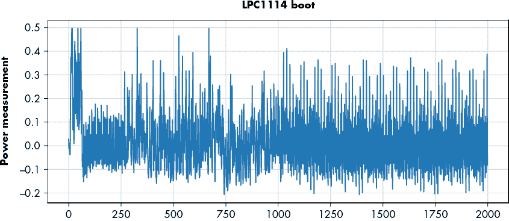

图 6-10：在清单 6-6 中测量的 LPC1114 的启动过程的功率轨迹

这些信息提供了什么？首先，它使我们能够检查和描述潜在有用故障的效果。其次，我们使用 ChipWhisperer-Nano 通过运行清单 6-7 中的代码来触发故障插入（如果你使用的是 ChipWhisperer-Lite，请参阅附带的笔记本）。

```
#ChipWhisperer-Nano uses count of fixed-frequency oscillator, so these values
#don't directly correlate with the timing of the power analysis graphs.
scope.glitch.repeat = 15
scope.glitch.ext_offset = 1400
```

清单 6-7：在 ChipWhisperer-Nano 上开启故障

在清单 6-7 中的代码中，`scope.glitch.repeat` 参数表示“故障”被“应用”的周期数（来自第五章的故障宽度）。`scope.glitch.ext_offset` 参数表示从触发事件到插入故障之间的偏移量，定义了故障发生的时间点。这些参数在这里有些“无单位”，因为数字表示基于微控制器内部振荡器的周期延迟。我们很少关心“实际”的值；我们只希望能够重新创建它们。

一旦`repeat`（故障宽度）和`ext_offset`（故障偏移）设置固定，它们将在下次触发时自动应用。如果我们再次运行清单 6-6（先运行过清单 6-7），我们现在会得到一个插入故障的功率波形。图 6-11 显示了结果。

在这个示例中，看起来我们使用了过于激进的故障，在大约 250 个时钟周期时插入。故障可能太宽了。故障插入后，设备似乎已经被静音。功率轨迹看起来不再像是在执行代码，这很糟糕，因为我们可能触发了欠压检测器或以其他方式重置了设备。我们需要调整参数并再试一次。


图 6-11：插入在大约 250 个周期处的故障导致设备重置。

将此与我们在清单 6-7 中更改`scope.glitch.repeat`的值进行比较，将`repeat`设置为 10。图 6-12 显示了功率轨迹。

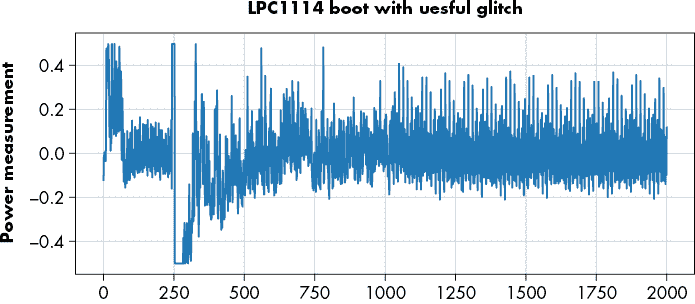

图 6-12：插入在大约 250 个周期处的故障没有中断正常的启动。

我们仍然看到故障大约在 250 周期左右插入，但似乎设备继续执行代码！我们想要扫描那些故障宽度，这些宽度既不太宽（导致重置），也不至于让设备恢复正常运行。这种功率分析测量允许我们对电路板进行表征，了解下一步所需的故障宽度。在这种情况下，宽度（`scope.glitch.repeat`设置）为 14，大约是设备经常重置之前的上限。这意味着对于该样本电路板，我们首先会尝试 9 到 14 之间的宽度（下限有些是任意的；你可能需要进一步减少下限，但在某个点上，故障会太窄而没有效果）。再次强调，这些单位是相对任意的；我们不关心精确的测量，因为我们只是找到了设备重置和设备似乎正常运行之间的范围。你可能会发现这些数字在你的目标和设置中会有所不同。

如果你尝试使用除了 ChipWhisperer-Nano 之外的其他信号发生器重新创建此故障插入，可以很容易地使用示波器检查设备在故障发生后是重置了还是继续启动。通过这种方法，你可以轻松调整故障参数，减少搜索空间。

在接下来的章节中，我们将探讨功率分析以及如何利用它来显示设备程序中某些值处理的具体位置。执行“功率分析攻击”是可能的，我们可以测量这些配置字何时实际被加载。如果你有兴趣查看相关代码，可以参考 GitHub 上的 ChipWhisperer-Jupyter 仓库中的 LPC1114 示例([`github.com/newaetech/chipwhisperer-jupyter/`](https://github.com/newaetech/chipwhisperer-jupyter/))，里面有更多的细节。

#### 从故障攻击到内存转储

现在我们可以看到设备启动，我们基本上已经准备好插入故障。我们要做的就是编写一个脚本，扫描故障的时序，看设备是否能解锁。如果设备成功解锁，我们就可以进行下一步，转储整个闪存。

列表 6-8 展示了重要部分（查看 Jupyter 笔记本中的完整示例）。在这里，我们指定了一个偏移范围，可以沿着这个范围进行扫描，找到有用的信息。你需要知道，代码的 100%成功率取决于你的物理连接；你可能需要多次运行此代码才能成功。我们还通过给出一个非常狭窄的偏移范围作弊，这有助于我们多次重复攻击。

```
import time
print("Attempting to glitch LPC Target")

nxpdev = CWDevice(scope, target)

Range = namedtuple("Range", ["min", "max", "step"])

# Empirically these seemed to work OK, we want to hit around
# time 51.8 to 51.9 μs from reset. CW-Nano doesn't have as meaningful
# timebase as CW-Lite, so we just sweep larger ranges...
offset_range = Range(5600, 6050, 1)
repeat_range = Range(9, 15, 1)

scope.glitch.repeat = repeat_range.min

done = False
while done == False:
    scope.glitch.ext_offset = offset_range.min
    if scope.glitch.repeat >= repeat_range.max:
        scope.glitch.repeat = repeat_range.min
    while scope.glitch.ext_offset < offset_range.max:

        scope.io.nrst = 'low'
        time.sleep(0.05)
        scope.arm()
 scope.io.nrst = 'high'
        target.ser.flush()

        print("Glitch offset %4d, width %d........"%
                (scope.glitch.ext_offset, scope.glitch.repeat), end="")

        time.sleep(0.05)
        try:
            nxpp = nxpprog.NXP_Programmer("lpc1114", nxpdev, 12000)

            try:
              1 data = nxpp.read_block(0, 4)
                print("[SUCCESS]\n")
                print("  Glitch OK! Add code to dump here.")
                done = True
                break

            except IOError as e:
                #print(e)
                print("[NORMAL]")

        except IOError:
            print("[FAILED]")
            pass

        scope.glitch.ext_offset += offset_range.step

    scope.glitch.repeat += repeat_range.step
```

列表 6-8：在尝试读取 CRP 状态时，扫描故障宽度和偏移量

每次故障尝试后，都会尝试从内存 1 中读取数据。如果成功，整个闪存会被读取出来，你就可以完全访问和控制 LPC1114 处理器。如果没有成功，首先检查使用功率跟踪的时序。我们通过实验发现，LPC1114 需要大约 51µs，但这会随着电压、温度和生产批次的变化而变化。

还要检查故障波形的形状，它会随着更长或更短的电线而变化。由于 ChipWhisperer-Nano 在故障宽度和偏移上的分辨率较低，因此与 ChipWhisperer-Lite 相比，任何给定硬件设置下的攻击成功率较低。例如，你可能需要使用更长或更短的电线来物理调整故障参数。但在进一步调整之前，可以让攻击运行一段时间。让攻击运行一到两个小时，可能会得到一个成功的参数设置，如列表 6-9 所示。

```
Attempting to glitch LPC Target
Glitch offset 5700, width 9........[NORMAL]
Glitch offset 5701, width 9........[NORMAL]
Glitch offset 5702, width 9........[NORMAL]
Glitch offset 5703, width 9........[NORMAL]
Glitch offset 5704, width 9........[NORMAL]
Glitch offset 5705, width 9........[NORMAL]
Glitch offset 5706, width 9........[NORMAL]
Glitch offset 5707, width 9........[NORMAL]
   ---`MANY MORE TESTS`---
Glitch offset 5729, width 9........[SUCCESS]

  Glitch OK! Beginning dump...
00 08 00 10 D1 1D 00 00 CB 1F 00 00 CB 1F 00 00
CB 1F 00 00 CB 1F 00 00 CB 1F 00 00 38 3B FF EF
00 00 00 00 00 00 00 00 00 00 00 00 CB 1F 00 00
CB 1F 00 00 00 00 00 00 CB 1F 00 00 CB 1F 00 00
```

列表 6-9：运行脚本时成功故障的输出

一旦攻击成功，接下来就是执行闪存读取，这需要循环读取所有内存以获取芯片数据。使用`nxpprog`库可以让这一过程更简单；有关如何完成此任务的示例，请查看本书的配套 GitHub 仓库，链接地址为[`nostarch.com/hardwarehacking`](https://nostarch.com/hardwarehacking)。你还可以通过重新编程配置字来解锁设备，这应该能够让你攻击一个完全锁定的设备，解禁 ISP 和 JTAG。

不必担心所有可能性；只要收到成功消息，就意味着你已经能够破坏配置字，从而绕过读取保护！如果你依赖于这样的安全方法，执行这一练习是有用的，它能帮助你理解别人是如何绕过这些安全措施的。

### 多路复用故障注入

我们已经用起重棒进行了一个示例，但查看其他执行电压故障注入的方法也很有帮助。最常见的其他方法是使用多路复用器（mux），它在常规操作电压和“故障”电压之间切换。使用多路复用器的问题是，它可能会增加损坏目标的风险。例如，如果你正在对设备进行负电压故障注入，你可能会发现负电压超出了规格范围。在我们的例子中，我们将使用范围内的电压来避免这种风险。

#### 多路复用硬件设置

我们在第五章中讨论了将多路复用器作为电压切换注入器的故障注入方法，详细内容请参见该章节，了解如何使用多路复用器构建故障注入电路。

在这个示例中使用多路复用器时，我们使用与图 6-8 中显示的相同的 LPC1114 开发板，但这次没有连接输入电压和核心电压的 12 Ω分流电阻。如果已经安装，请将其拆除。必须切断电路，以便微控制器的核心电压完全来自外部电源。我们将把 mux 输出连接到 LPC1114 开发板的核心电压，这意味着 LPC1114 始终由 mux 输出供电。

在这个示例中，我们使用了一个由互补对模拟开关组成的双芯片解决方案：TS12A4514 是常开开关，而 TS12A4515 是常闭开关。图 6-13 展示了这个解决方案的原理图。

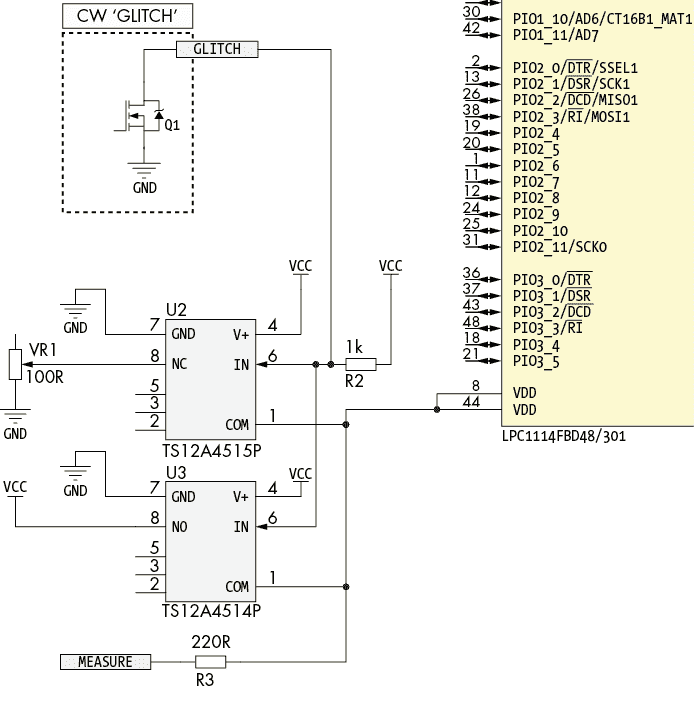

图 6-13：展示用于 mux 故障注入的简单多路复用器原理图

TS12A4514 将标准的 3.3 V VCC 从 ChipWhisperer-Nano 传送到 LPC1114，而 TS12A4515 通过由可变电阻 VR1 设定的较低电压进行供电。这意味着每次切换 ChipWhisperer-Nano 的 I/O 引脚时，我们会切换每个模拟开关的引脚 6，并使得传送到 LPC1114 的电压在 TS12A4514 的标准 VCC 和 TS12A4515 的调整 VCC 之间切换。与图 6-7 中的过电压故障原理图相比，只有与 VDD 的连接发生变化；串行和触发连接保持不变。

在我们的构建中，我们将 TS12A4514（底部）和 TS12A4515（顶部）堆叠在一起并将它们焊接在一起。这两个切换电压引脚（U2 和 U3 的引脚 8）是唯一没有焊接在一起的引脚，因为它们有不同的连接；具体细节请参见图 6-14。

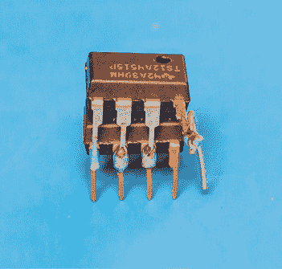

图 6-14：将 TS12A4514（底部）和 TS12A4515（顶部）堆叠（改装）在一起

图 6-15 展示了基于 mux 的故障注入设置；接下来我们将详细介绍每个部分的低级细节。

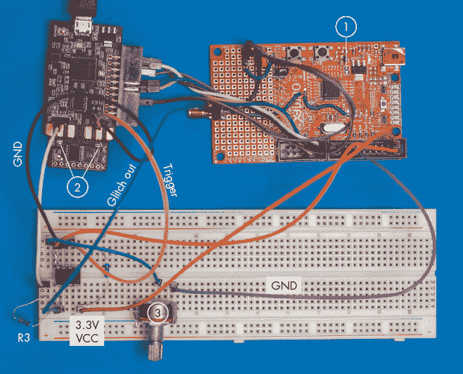

图 6-15：执行 mux 攻击的完整设置

首先，请注意，前面提到的 12 Ω 电阻已经从目标 1 中移除。对于基于切换的故障，使用多路复用器，我们需要指定两个电压：常规电压和“故障”电压。在这种情况下，为了简化操作，我们将使用与前面短路部分相似的电压。常规电压是标准的 3.3 V 电源，从 LPC1114 板上的 JTAG 连接器获取。故障电压类似于短路设置中，我们尝试将电源拉到地（0 V）。直接拉到 0 V 可能会使设备重置得太快，因此我们改为在路径中加入一个可变电阻（VR1）。由于目标设备通常在正电源轨上具有一定的电容，使用电阻意味着电压不会那么快地下降到 0 V（GND）。在图中，我们使用的是标准的可变电阻 3。

在 ChipWhisperer-Nano 上，我们需要在目标侧 2 处拆除两个焊接跳线。这一步是必需的，因为我们现在将使用故障输出驱动多路复用器，但仍然希望使用测量功能。默认情况下，故障输出和测量在目标板上是绑定在一起的。当故障输出直接连接到目标电压时，前一部分的设置是可以的。现在，我们需要将测量和故障信号解耦。将 ChipWhisperer-Nano 的目标侧分离开来可以实现相同的目标，并确保 I/O 引脚没有冲突。然而，仅仅拆除焊接跳线可能会较不激进，以防你仍然想使用附带的目标。

要触发多路复用器切换，我们只需要一个数字 I/O 信号，它沿着时间轴进行扫描，从而在目标启动序列的不同点插入电压切换。我们可以使用外部 FPGA 或信号发生器，但在这个示例中，我们将使用在短路示例中使用的相同的 ChipWhisperer-Nano 或 ChipWhisperer-Lite 故障输出。故障触发输出仅驱动低电平，因此当其不被驱动为低电平时，1 kΩ 电阻会将线路拉高。我们可以将此故障触发输出用作多路复用器选择线的输入，并记住，当我们想要插入故障时，它是“低有效”的，即当故障线被驱动为低电平时。

TS12A4515P 在其输入端（位于合并的 6 号引脚）来自 ChipWhisperer-Nano 的故障触发器为低电平时，将预设的故障电压（由 VR1 设置）切换到 LPC1114 电源轨。相反，TS12A4514P 在其输入端（同样位于合并的 6 号引脚）来自 ChipWhisperer-Nano 的故障触发器为高电平时，将正常的 3.3 V VCC 电压切换到 LPC1114 电源轨。每当 ChipWhisperer 的故障输出触发器为低电平时，故障电压会通过多路复用器切换到 LPC1114 电源轨，随时且根据 ChipWhisperer 编程和控制，持续任意时长。

要查看 mux 输出及其周围故障发生时的启动波形，类似于图 6-9 中所示的情况，你可以测量 mux 的引脚 1。这对于调整故障时机和宽度至关重要。在这个例子中，我们不依赖示波器，而是将 ChipWhisperer-Nano 设置为捕获电源线信号，像在短路故障注入示例中一样。ChipWhisperer-Nano 的一个警告是它有一个固定的输入增益；你可能会发现电源线信号压倒了输入，使得观察变得困难。因此，插入了一个 220 Ω 电阻（R3），它与 ChipWhisperer-Nano 测量输入形成电压分压器。你可能需要根据你使用的多路复用器来调整这个电阻。ChipWhisperer-Lite 允许调整增益，因此不需要做同样的修改，可以直接观察 LPC1114 核心电压。

#### 调整故障设置

和短路故障注入示例一样，我们需要调整故障设置。之前我们只需要调整故障宽度；现在我们还需要调整故障电压。在此过程中，为了简化操作，我们使用可变电阻器来调整故障的“强度”，而不是应用特定的电压设置。我们调节这个电阻，再次在启动过程中查看或捕获电源测量，并观察插入不同的故障电压对其的影响。

如果你正在使用 ChipWhisperer-Nano，那么这意味着运行清单 6-6 中显示的脚本。如之前所述，你可以在清单 6-7 中看到如何调整故障宽度。切换到非常窄的故障（`scope.glitch.repeat = 1`）和更宽的故障（`scope.glitch.repeat = 50`）应该会导致窄故障不会重置目标，而宽故障会重置目标。

你还可以调整电阻器 VR1 以查看它如何影响结果。你应该会发现，较大的 VR1 值可以让你在设备重置之前使用更宽的故障设置。同样，可以参考图 6-11 和 6-12，了解在重置和非重置情况下电源轨迹的示例。电阻器的添加为我们提供了另一个可调节项。假设 `scope.glitch.repeat = 6` 的设置允许设备正常工作，而 `scope.glitch.repeat = 7` 总是会导致重置。我们希望找到一个*几乎*重置设备的设置。虽然重置并不有用，但你可以调整电阻值到一个不总是重置设备的点。

作为一个 sanity check，首先将两个 mux 输入连接到 +3.3 V，你应该会看到目标不会发生故障。然后将一个 mux 输入直接连接到 GND，你会发现即使是窄故障也会导致目标重置。接下来，使用可变电阻器找到理想的中间设置。

一旦你找到了由可变电阻设置的电压的合适值（在我们的实验中，"合适"的设置是 34 Ω的电阻），你就可以再次找到引发目标不稳定并重置的故障宽度设置。当我们调整电阻设置时，使用的是非常宽的故障宽度，所以现在我们想要微调宽度，以减少我们的搜索空间。

与撬棍故障相比，我们发现需要稍微窄一点的故障。列表 6-10 展示了成功的输出转储示例；请注意，时序偏移大致与撬棍插入时确定的时序相同，但宽度不同。

```
Attempting to glitch LPC Target
Glitch offset 5700, width 5........[NORMAL]
   ---`MANY MORE TESTS`---
Glitch offset 5722, width 5........[NORMAL]
Glitch offset 5723, width 5........[NORMAL]
Glitch offset 5724, width 5........[NORMAL]
Glitch offset 5725, width 5........[NORMAL]
Glitch offset 5726, width 5........[NORMAL]
Glitch offset 5727, width 5........[NORMAL]
Glitch offset 5728, width 5........[SUCCESS]

  Glitch OK! Beginning dump...
00 08 00 10 D1 1D 00 00 CB 1F 00 00 CB 1F 00 00
CB 1F 00 00 CB 1F 00 00 CB 1F 00 00 38 3B FF EF
00 00 00 00 00 00 00 00 00 00 00 00 CB 1F 00 00
CB 1F 00 00 00 00 00 00 CB 1F 00 00 CB 1F 00 00
CB 1F 00 00 CB 1F 00 00 CB 1F 00 00 CB 1F 00 00
CB 1F 00 00 CB 1F 00 00 CB 1F 00 00 CB 1F 00 00
CB 1F 00 00 CB 1F 00 00 CB 1F 00 00 CB 1F 00 00
```

列表 6-10：使用多路复用器的结果与使用撬棍时的成功故障输出相同。

如果你调整了常规的工作电压，故障的时序将发生变化。设备的工作电压会略微改变内部振荡器的频率（此外，还存在设备之间的自然差异）。这意味着将目标电压从 3.3 V 调整到 2.5 V，可能会显著影响在启动过程中故障被插入的时刻。

## 第三幕：差分故障分析

与之前的环节使用故障注入影响结果不同，这一环节使用故障注入来破坏支撑现代密码学的完美且安全的数学。在本环节中，我们将攻击 RSA，使用一种特别常见的 RSA 实现。这类故障使得执行*差分故障分析（DFA）*攻击成为可能。DFA 攻击依赖于攻击者能够在插入故障的同时运行加密操作，并将故障操作的结果与正常操作的结果进行比较。

### 一点 RSA 数学

2001 年由 Dan Boneh、Richard A. DeMillo 和 Richard J. Lipton 发表的论文《在密码学计算中消除错误的重要性》中，介绍了针对 RSA 的 Bellcore DFA 攻击。这可能是最有效的 DFA 攻击之一，因此在这个环节中，我们将带你体验名为“单一故障，所有密钥位”的过程。尽管这是一个神奇的结果，但在数学上并不复杂。Bellcore 攻击聚焦于 RSA 的一个特定变种，称为*RSA-CRT（中国剩余定理）*。RSA-CRT 的发明是为了通过对较小的数字进行 RSA 模运算来加速 RSA 签名的计算，同时（当然）得到相同的结果。

首先，我们将讨论教材中的 RSA 算法，然后展示 RSA-CRT 的实现。我们将在第八章介绍功率分析攻击时再次讨论 RSA。理解 RSA 如何应对故障攻击需要比功率分析更多的细节，因此本节内容比第八章所需的更为深入（如果以下数学内容让你感到困惑，请不要担心）。由于这是一本硬件书籍，更多的细节可以参考你最喜欢的加密教材。如果你还没有最喜欢的，Jean-Philippe Aumasson 的《Serious Cryptography》（No Starch Press, 2018）是一个不错的选择，其中第十章涵盖了 RSA。以下的数学内容包含了大量的密码学和数论背景，但实际上你只需要高中水平的代数知识，就能理解这些攻击为何有效。

RSA 的工作原理从两个素数*p*和*q*开始，它们共同构成了*私钥*的基础。*公钥*仅仅是*n*，其中*n*  =  *pq*。*p*和*q*的保密性源于非常大数字的因式分解固有的困难性，意味着没有已知的高效算法可以仅从*n*恢复*p*和*q*。RSA 的下一个组件是选择一个名为*公钥指数* *e*的数字。一个常见的选择是 2¹⁶ + 1。*私钥指数* *d*现在通过*d*  =  *e*^(–1) mod  λ(*n*)来计算，其中λ是 Carmichael 的欧拉函数（它的实现对于以下的攻击并不重要，所以你可以只是对这个函数的存在点头表示知道）。

如果你使用 RSA 对给定消息进行签名，消息*m*就是 RSA 签名所保护的内容。RSA 签名是通过计算*s*  =  *m*^(*d*)  mod  *n*来完成的。消息*m*仅仅是一个整数（数字）。实际上，我们有一个*填充方案*，将典型的字符串或二进制消息转换为整数*m*。

RSA 计算开销非常大。考虑到现代安全要求下，私钥指数至少是 2048 位长，而模指数运算*m*^(*d*) mod *n*的复杂度随着*n*位数的立方增长。

进入中国剩余定理。其思路是将计算分成两部分，利用*n*是两个素数乘积的事实。RSA-CRT 中的私钥基于之前提到的素数*p*和*q*。我们可以将这个私钥，依然仅基于*p*和*q*的值，表示为三个数字：*d*[*P*]  =  *d*  mod  *p* – 1,  *d*[*Q*]  =  *d*  mod  *q* – 1，以及*q*[inv] =  *q*^(–1)  mod  *p*。通过这种实现方式，我们现在可以按照以下方式计算签名：

*s*[*P*] = *m*^(*d*)^([*P*])mod *p*

*s*[*Q*] = *m*^(*d*)^([*Q*])mod *q*

*s* = *s*[*Q*] + *q*(*q*invmod *p*)

由于模数（*p* 和 *q*）现在只有原来的一半位数，计算签名的速度大约提高了四倍（这很好）。此外，现在只需一次故障就能执行差分故障分析（DFA）攻击（这不好）。为了理解为什么，考虑我们在计算 *s*[*P*] 时注入一个故障，假设故障结果为 *s'*[*P*]。这样，我们就会得到一个损坏的签名 *s'*。接下来，我们可以进行一些代数运算：

*s'* = *s*[*Q*] + *q*(*q*invmod *p*)

接下来，我们从 *s* 中减去 *s'*：

*s* – *s'* = *s*[*Q*] + *q*(*q*invmod *p*) – *s*[*Q*] – *q*(*q*invmod *p*)

然后我们从两边移除 *s*[*Q*]：

*s* – *s'* = *q*(*q*invmod *p*) – *q*(*q*invmod *p*)

然后，我们认识到 *q* 乘以某个整数，减去 *q* 乘以另一个整数，可以写成：

*s* – *s'* = *qk*[1] – *qk*[2] = *kq*

其中 *k*[1]、*k*[2] 和 *k* 是一些（未知的）整数。这是因为 *s*[*P*] 出现了故障。如果你在计算 *s*[*Q*] 时发生了故障，你就会得到 *s* – *s'* =  *kp*。

接下来，我们使用一种高效的算法来计算 *最大公约数（GCD）*。两个整数 *i* 和 *j* 的 GCD 给出了一个能够同时整除这两个数的最大正整数。例如，36 和 24 的 GCD 是 12，因为 12 可以同时整除 36 和 24。没有比 12 更大的数可以同时整除 36 和 24。我们可以写作 GCD(36, 24) = 12。

按照定义，质数只能被它自身和 1 除尽。在 RSA 中，模数 *n* = *pq*，所以它只能被 1、*p* 和 *q* 除尽。由于 GCD(*q*, *n*) = GCD(*q*, *pq*) =  *q*，因此 *n* 和任何整数 *kq*（其中 *k* 小于 *p*）的 GCD 为 *q*。

从我们的攻击中，我们可以计算出 *s* – *s'*，并且我们知道它是 *q* 的倍数 *k*（其中 *k* 小于 *p*）。我们计算 GCD(*s* – *s'*, *n*) = GCD(*kq*, *pq*) =  *q*。之所以能这么做，是因为 *p* 和 *q* 是质数，因此 *n* 没有其他除数。现在，由于我们有了 *q*，我们可以轻松计算出 *p* = *n* ÷ *q*，这样我们就得到了两个私有质数，从而得到了 RSA 私钥！

请注意，为了使这个攻击有效，我们需要同时有 *s* 和 *s'*，这意味着需要对同一个消息 *m* 进行两次签名，并且在两次签名计算中破坏其中一个。实际操作中，可能并不总是能做到这一点，因为像 *最优非对称加密填充（OAEP）* 这样的填充方案，会在签名者端对消息 *m* 的一部分进行随机化。幸运的是，著名的密码学家阿尔亨·伦斯特拉（Arjen Lenstra）曾向 Bellcore 的作者们写了一份备忘录，展示了一个只需要损坏签名就能成功的攻击。

这个解法与之前的解法非常相似，之前我们通过代数推导出一个值，使得它与 *n* 的 GCD 给出了其中一个质数。与之前的不同之处在于，我们没有 *s*，只有 *s'*。我们可以使用之前推导出的方程来关联它们：

*s* − *s*′ = *kq*

*s* = *s*′ + *kq*

因此，我们将在 RSA 消息方程中按照以下方式替换 *s*：

*m* = *s*^(*e*)mod *n* = (*s*′ + *kq*)^(*e*)mod *n*

接下来，我们使用二项式定理进行一些重写。二项式定理规定如下：

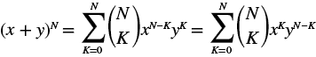

因此，我们将写成：

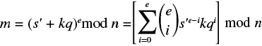

我们将为 *i* = 0 推导出表达式：

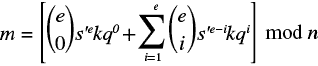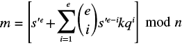

我们还将从求和中分出一个 *kq* 项：

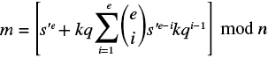

我们用 *x* 替换求和，其中 *x* 是某个整数：

*m* = [*s*'^(*e*) + *kqx*]mod *n*

*m* − *s*^('*e*) = *kqx* mod *n*

然后我们用以下公式找到 *q*：

GCD(*m* − *s*'^(*e*), *n*) = GCD(*kqx*, *n*) = GCD(*kqx*, *pq*) = *q*

由于 *p* = *n* ÷ *q*，我们就得到了完整的私钥。与之前一样，这对 *s*[*Q*] 的故障也适用。

### 获取目标的正确签名

对于这个例子，我们将使用本章节的 Jupyter Notebook，它具有 RSA-CRT 故障模拟器，并且可以在带有 32 位 ARM（NAE-CWLITE-ARM）目标的 ChipWhisperer-Lite 上运行。你可以在笔记本的顶部配置你选择的目标。对于硬件，它会引导你加载固件，获取设备的签名，并验证签名是否正确。

你可以使用任何其他目标设备；你只需要做的就是建立一个故障注入设置并在目标上实现 RSA-CRT。RSA-CRT 接受消息 *m* 并返回签名 *s*。你可以修改笔记本中的代码，适应你的固件和构建设置。

#### 在模拟器中注入故障

对于笔记本中的模拟器，我们实现了如前所述的 RSA-CRT 计算。就像在真实硬件上一样，我们对消息进行 PKCS#1 v1.5 填充后的哈希签名。幸运的是，这个标准相对简单。PKCS#1 v1.5 填充形式如下所示：

```
|00|01|ff...|00|`hash_prefix`|`message_hash`|
```

在这里，`ff...`部分是一个由`ff`字节组成的字符串，长度足够使填充后的消息大小与 *n* 相同，而`hash_prefix`是应用于`message_hash`的哈希算法的标识符。在我们的例子中，SHA-256 的哈希前缀是`3031300d060960864801650304020105000420`。

总的来说，填充和哈希后的消息“Hello World！”看起来像这样：

```
|00|01|ffffffffffffffffffffffffffffffffffffffffffffffffffffffffffffffffffffffffffffffffffffffffffffffffffffffffffffffffffffffffffffffffffffffffffffffffffff|003031300d060960864801650304020105000420|7f83b165ff1fc53b92dc18148a1d65dfc2d4b1fa3d677284addd200126d9069|
```

现在我们有了最终的消息，我们将其推送到 RSA-CRT 计算中，但首先会模拟一些故障。为此，我们随机翻转 *s*[*P*] 中的一些位，以获取 *s'*[*P*]。正如前面所解释的攻击所示，故障的具体内容并不重要。我们也可以将 *s*[*P*] 设置为π的二进制展开、0 或我们的宠物生日。接下来，我们计算故障签名 *s'*。

#### 在硬件上注入故障

对于硬件，放宽何时和何地故障的条件也对我们有所帮助：只要故障发生在计算*s*[*P*]或*s*[*Q*]的过程中，任何故障都是有效的。由于这些计算几乎占据了整个 RSA-CRT 计算过程，从接收消息到计算签名的时间大部分都花在了*s*[*P*]和*s*[*Q*]的计算上。这意味着你可以尝试运气，盲目地在签名计算的时间窗口内注入故障。

如果你想更清楚地了解你正在做什么，可以通过电源轨迹来查看 RSA 操作的时序。例如，图 6-16 中的电源轨迹来自 STM32F30，其中操作被分为两个主要的子操作。

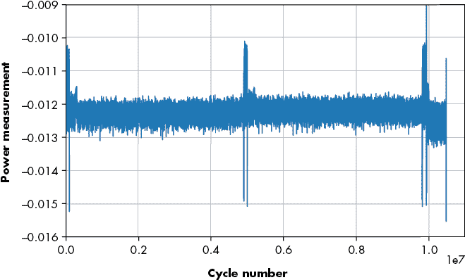

图 6-16：MBED-TLS 执行 RSA 签名操作

你可以看到签名计算的两部分在 500,000 周期左右分开，中间有一个小的波动。这个模式在 RSA-CRT 中非常常见，事实上，仅凭这个模式就能明显看出设备正在运行 RSA-CRT，而无需了解设备的内部细节。我们将在下一章更详细地研究功率分析，并讨论如何利用它从设备中恢复机密信息。

确定时序后，我们可以注入故障。在本练习的笔记本中，我们选择了一个范围在 7,000,000 到 7,100,000 之间进行故障注入，这个范围大致位于签名计算的后半段。从先前对设备的特征分析中，我们知道一些可以使用的故障参数，并且我们在笔记本中将这些值硬编码。如果我们不确定时序，可以通过遍历一些近似的时序来进行尝试，正如这段代码所示：

```
from tqdm import tnrange
for i in tnrange(7000000, 7100000):
    scope.glitch.ext_offset = i
    target.flush()
    scope.arm() # arm the glitch to occur at ext_offset
    target.write("t\n") # this starts signature operation and triggers counter
    scope.capture() # wait for trigger/counter to finish
 `--snip--`
```

我们使用一个循环让目标执行签名操作，同时我们注入故障。然后我们需要检查结果，看看目标是否返回看起来像是损坏的签名，而不是目标崩溃或硬错误。检查每个时序下输出是否有效的代码可以在配套的笔记本中找到。

我们通过签名的返回值来识别候选的签名损坏情况：如果设备返回的签名具有正确的长度，但未通过 RSA 验证，那么它就是候选损坏签名。如果签名长度不正确，那么很可能是签名计算之外的某些部分被破坏，因此我们可以丢弃这些实例。

在笔记本中，我们作弊，简单地检查签名中是否没有出现“预期的”输出（预期输出是正确签名的结果）。这是检查签名是否有效的一个更简单方法。

运行此代码后，我们将获得一个故障签名，可以用来恢复质数。通常，这种方法会奏效。如果遇到一个不适用的极端情况，可以轻松地获取另一个故障签名并再试一次。

如果你不打算使用 ChipWhisperer 路线，并且有自己的设置或目标，请首先进行表征：找出故障注入参数，这些参数会导致签名出现明显的损坏。有效损坏的标志是，当签名的数据发生变化时，签名的长度却没有变化。这次攻击的有趣之处在于，成功的表征已经会产生一个损坏的签名，这意味着我们已经完成了故障注入的部分。

#### 完成攻击

一旦我们得到了故障签名，无论是来自硬件还是 RSA-CRT 模拟器，我们仍然需要做一些工作。假设我们有一个变量叫做 `s_crt`，它是正确的签名，另一个变量叫做 `s_crt_x`，它是损坏的签名。这些只是很大的数字。例如，`s_crt_x` 在以十六进制打印时看起来像这样：

```
1187B790564D43D48CD140A7FF890EEA713D1603D8CBC57CF070EE951479C75E93FE98AD04F535109D957F9AB9
AA25DB2FB1A5521C68C986A270782B7A579A12B9AE79DF2F59ED9E6694C64C40AAD9FE46B203DB75792016EE
A315F7CAA8F9AAC0FD89052FFAC29C022E32B541B150419E2B6604DDA6BF2582F62C9F7876393D
```

之前，我们有一个简单的公式用于从损坏的签名和正确的签名或消息中计算出素数 *p* 和 *q*。笔记本实现了使用最大公约数（GCD）恢复素数的两种方法。正如你将看到的，这个计算只需要短短几分之一秒就能完成，然后打印出私有素数。

让我们来看一下笔记本中的一个实现，它使用损坏的签名和正确的签名来查找私有素数：

```
# Recover p and q from corrupted signature and correct signature
calc_q = gcd(s_crt_x - s_crt, N)
calc_p = N // calc_q
print("Recovered p using s: {}".format(hex(calc_p)))
print("Recovered q using s: {}".format(hex(calc_q)))
print("pq == N?             {}".format(calc_q * calc_p == N))
```

这个代码块的输出显示了计算出的 `p` 和 `q` 的值。为了确认它们是否正确，我们只需要检查它们相乘是否得到（公开的，因此已知的）`N` 值。以下是运行上述代码的示例：

```
Recovered p using s: 0xc36d0eb7fcd285223cfb5aaba5bda3d82c01cad19ea484a87ea4377637e75500fcb2005c5c7dd6ec4ac023cda285d796c3d9e75e1efc42488bb4f1d13ac30a57
Recovered q using s: 0xc000df51a7c77ae8d7c7370c1ff55b69e211c2b9e5db1ed0bf61d0d9899620f4910e4168387e3c30aa1e00c339a795088452dd96a9a5ea5d9dca68da636032af
pq == N?             True
```

哇！我们通过一个损坏的签名分解出了 `N`，并且知道了私有素数 `p` 和 `q`。整个过程只需要在签名操作的几乎任意时刻插入一次故障。

加固后的实现有一个额外的技巧，我们在现实中应该绕过它：实际的 `mbedTLS` 库会检查它是否返回了错误的签名，它通过简单地检查签名是否按预期工作来实现这一点。在示例固件中，我们已将这一行注释掉。实际上，你会使用故障注入来绕过这个检查。尽管双重故障听起来很棘手，但它变得更容易，因为初始故障（在 RSA 操作中）几乎不需要精确的时机，因此唯一复杂的部分是对签名验证检查进行故障注入的时机。

## 总结

在这一章中，我们通过三个不同的例子进行了故障注入攻击的演示，从最基本的循环中的故障攻击场景开始，最后展示了如何通过故障攻击来转储 RSA 密钥。

请记住，故障注入在实践中是一个随机过程。故障的具体类型和产生的效果会有很大不同，甚至随着不同的设备锁代码以及制造商保护设备免受故障攻击的工作而发生变化。

如果你自己进行本章中的实验，不要灰心，如果第一次实验没有稳定运行。尝试多种故障注入的方法，更重要的是，先从一些简单的例子开始实验，看看你能注入哪些不同类型的故障。

在下一章，我们将提高难度，挑战一个现成的设备。
