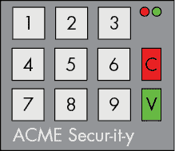
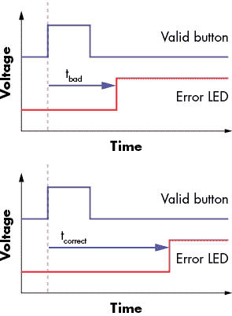
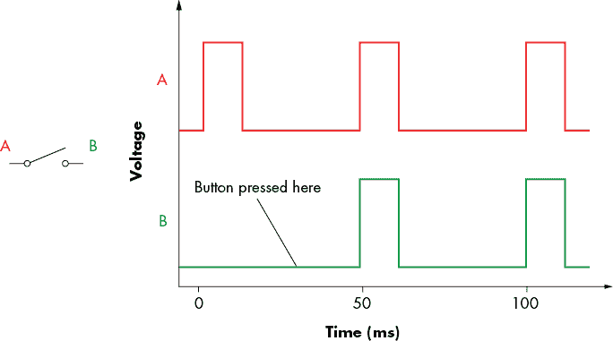
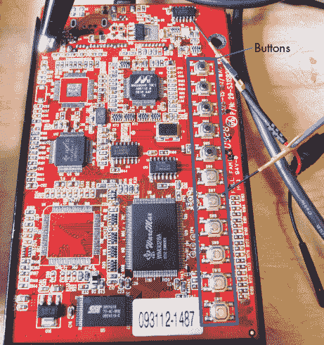
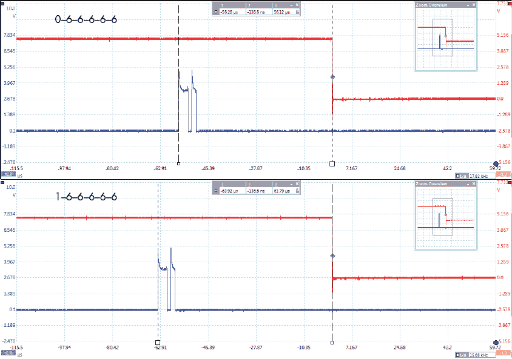
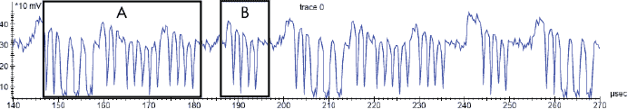
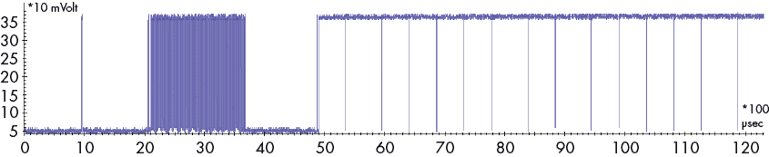
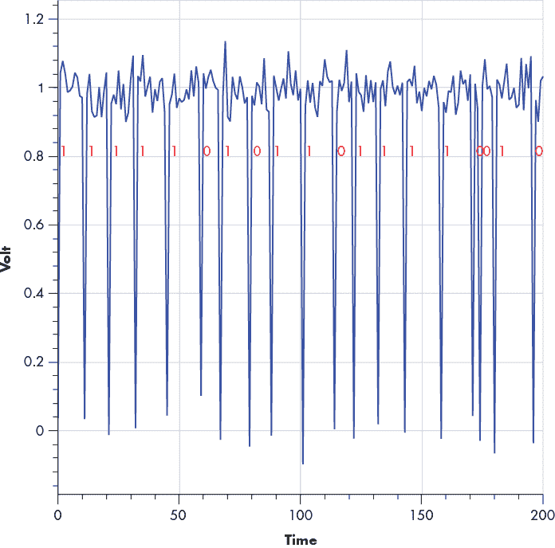
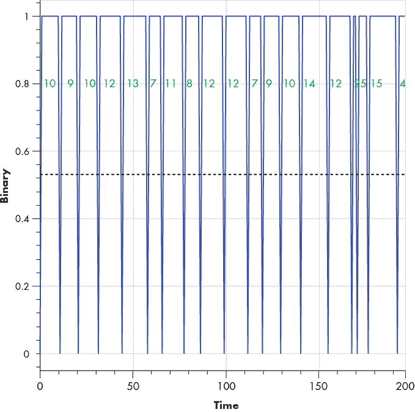
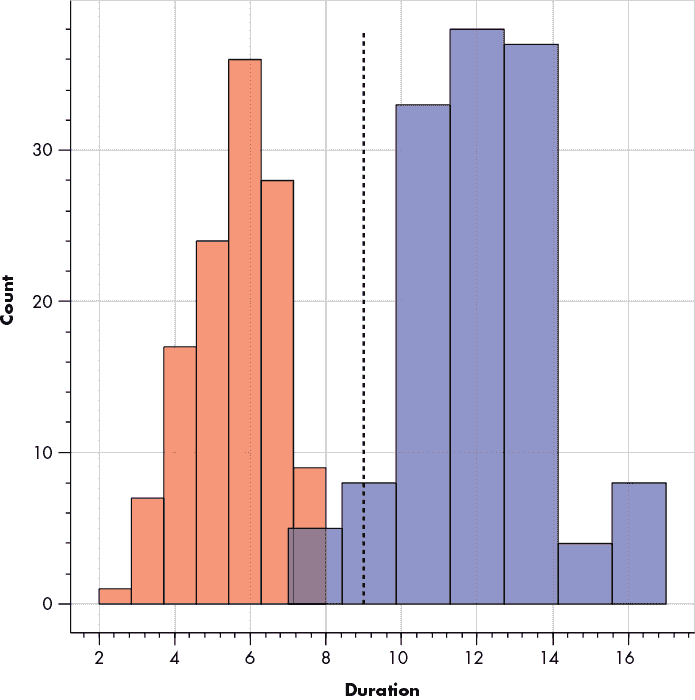

# 8

我掌控了力量：功率分析简介


你常常会听到关于加密算法是不可破解的论调，不管计算能力如何巨大进步。这是真的。然而，正如你将在本章中学到的，发现加密算法漏洞的关键在于其实现方式，无论它们有多么“军用级”。

话虽如此，我们本章不会讨论加密实现中的错误，比如失败的边界检查。相反，我们将利用数字电子的本质，通过侧信道攻击打破那些表面上看似安全的算法。*侧信道*是系统中某个可观察到的方面，它能揭示系统内部所藏的秘密。我们将描述的技术利用了这些算法在硬件中的物理实现中产生的漏洞，主要是在数字设备如何使用电力方面。我们将从数据依赖的执行时间开始，我们可以通过监控功耗来确定它，然后再通过监控功耗作为一种手段，识别加密处理函数中的密钥位。

在侧信道分析方面有着相当丰富的历史先例。例如，在第二次世界大战期间，英国人曾试图估算德国生产的坦克数量。最可靠的方法竟然是通过对被俘或损坏坦克的序列号进行统计分析，假设序列号通常以直观的方式递增。本章将介绍的攻击正是这种所谓的*德国坦克问题*：它们结合了统计学与假设，并最终利用了对方无意中泄露给我们的少量数据。

其他历史上的侧信道攻击监测的是来自硬件的意外电子信号。事实上，几乎一开始电子系统被用来传递安全信息时，它们就已经遭遇了攻击。其中一个著名的早期攻击是“TEMPEST”攻击，由贝尔实验室的科学家们在二战期间发起，通过 80 英尺外的电波信号解码电子打字机按键，准确率达到 75%（参见美国国家安全局的《TEMPEST: A Signal Problem》）。此后，TEMPEST 被用来通过拾取计算机显示器的无线电信号，从建筑物外部重现显示在屏幕上的内容（例如，参见 Wim van Eck 的《Electromagnetic Radiation from Video Display Units: An Eavesdropping Risk?》）。而最初的 TEMPEST 攻击是使用 CRT 显示器进行的，这一漏洞在 Markus G. Kuhn 的《Electromagnetic Eavesdropping Risks of Flat-Panel Displays》中已经被证明同样适用于更新型的 LCD 显示器，所以这项技术远远没有过时。

然而，我们将向你展示比 TEMPEST 更隐秘的东西：一种利用硬件意外发射来破解原本安全的加密算法的方法。这个策略包括运行在硬件上的软件（如微控制器上的固件）和加密算法的纯硬件实现（如加密加速器）。我们将描述如何测量，如何处理你的测量以改善泄露，并且如何提取秘密。我们将涉及的主题从芯片和印刷电路板（PCB）设计开始，跨越电子学、电磁学、（数字）信号处理、统计学、密码学，甚至到常识。

## 时序攻击

时机决定一切。考虑一下当实施个人身份号码（PIN）码检查时会发生什么，就像你在墙上的保险箱或门警报上看到的那样。设计师允许你输入完整的 PIN 码（比如四位数），然后将输入的 PIN 码与存储的密钥代码进行比较。在 C 代码中，它可能类似于 Listing 8-1。

```
int checkPassword() {
    int user_pin[] = {1, 1, 1, 1};
    int correct_pin[] = {5, 9, 8, 2};

    // Disable the error LED
    error_led_off();
 // Store four most recent buttons
    for(int i = 0; i < 4; i++) {
        user_pin[i] = read_button();
    }

    // Wait until user presses 'Valid' button
    while(valid_pressed() == 0);

    // Check stored button press with correct PIN
    for(int i = 0; i < 4; i++) {
        if(user_pin[i] != correct_pin[i]) {
            error_led_on();
            return 0;
        }
    }

    return 1;
}
```

Listing 8-1：用 C 语言编写的 PIN 码检查示例

看起来这是一段相当合理的代码，对吧？我们读取四位数字。如果它们与密钥代码匹配，函数返回`1`；否则，返回`0`。最终，我们可以使用这个返回值通过按下有效按钮，在输入四个数字后打开保险箱或解除安全系统。红色错误 LED 亮起，表示 PIN 码不正确。

这个保险箱可能会如何被攻击？假设 PIN 码接受数字 0 到 9，测试所有可能的组合将需要总共 10 × 10 × 10 × 10 = 10,000 次猜测。平均来说，我们需要进行 5,000 次猜测才能找到 PIN 码，但这将需要很长时间，而且系统可能会限制我们反复输入猜测的速度。

幸运的是，我们可以使用一种叫做*时序攻击*的技术将猜测次数减少到 40 次。假设我们有如图 8-1 所示的键盘。C 键（清除）用于清除输入，V 键（有效）用于验证。



图 8-1：一个简单的键盘

为了执行攻击，我们将两个示波器探头连接到键盘：一个连接到 V 按钮的连接线，另一个连接到错误 LED 的连接线。然后，我们输入 PIN 0000。 （当然，我们假设我们已经获得了这个 PIN 垫的副本，并且已经对其进行了拆解。）我们按下 V 按钮，观察示波器的波形，并测量按下 V 按钮与错误 LED 亮起之间的时间差。通过 Listing 8-1 中的循环执行，我们可以得出结论：如果 PIN 的前三个数字是正确的，而只有最后一次检查失败，那么函数返回失败结果所需的时间将比从一开始第一个数字就是错误时所需的时间更长。

攻击会遍历所有可能的 PIN 码第一个数字（0000、1000、2000，直到 9000），同时记录按下 V 按钮与错误 LED 亮起之间的时间延迟。图 8-2 展示了定时序列。



图 8-2：确定循环延迟时间

我们预计，当第一个 PIN 码数字正确时（假设是 1），延迟会增加，然后错误 LED 才会亮起，而这只有在第二个数字与`correct_pin[]`进行比较之后才会发生。我们现在知道第一个数字是正确的。图 8-2 的上半部分显示，当完全错误的序列之后按下有效按钮时，错误 LED 会在短时间内亮起（t[bad]）。将其与部分正确序列之后按下有效按钮进行比较（该部分序列的第一个按钮是正确的）。现在，由于第一个数字是正确的，错误 LED 的亮起时间更长（t[correct]），但在比较第二个数字时，它会亮起错误 LED。

我们通过尝试第二个数字的每种可能性来继续攻击：输入 1000、1100、1200 直到 1900\. 一如既往，我们预计当第二个数字正确时（假设是 3），延迟会增加，然后错误 LED 才会亮起。

对第三个数字进行相同的攻击，我们确定前面三个数字是 133\. 现在，只需要猜测最后一个数字，看看哪个数字能解锁系统（假设是 7）。因此，PIN 码组合就是 1337\. （考虑到本书的读者，我们意识到我们可能刚刚公布了你的 PIN 码。现在就更改它吧。）

这种方法的优点在于，通过知道错误数字在 PIN 码序列中的位置，我们逐步发现了数字。这个小小的信息有着巨大的影响。我们不再需要进行最多 10 × 10 × 10 × 10 次猜测，而只需要进行最多 10 + 10 + 10 + 10 = 40 次猜测。如果我们在三次失败尝试后被锁定，猜测 PIN 码的概率已经从 3/1000（0.3%）提高到了 3/40（7.5%）。进一步假设 PIN 码是随机选择的（尽管在现实中这是一个不太好的假设），我们平均*能找到*猜测的数字在猜测序列中的中间位置。这意味着，平均而言，我们每个数字只需要猜测五个数字，因此我们通过辅助攻击，平均总共只需进行 20 次猜测。

我们称之为*定时攻击*。我们只测量了两事件之间的时间，并利用这个信息恢复了部分秘密。实践中真的是这么简单吗？下面是一个真实的例子。

### 硬盘定时攻击

考虑一个带有 PIN 保护分区的硬盘外壳——特别是 Vantec Vault，型号 NSTV290S2。

Vault 硬盘外壳通过篡改硬盘的分区表，使其在主机操作系统中无法显示；该外壳实际上并不加密任何内容。当正确的 PIN 码输入 Vault 时，有效的分区信息将被操作系统访问。

攻击 Vault 最明显的方式可能是手动修复硬盘的分区表，但我们也可以针对其 PIN 码输入逻辑使用定时攻击—这种方式更符合我们的侧信道功率分析。

与前面讨论的 PIN 码键盘例子不同，我们首先需要确定何时按钮被*读取*，因为在这个设备中，微控制器仅偶尔*扫描*按钮。每次扫描都需要检查每个按钮的状态，以确定它是否被按下。这种扫描技术是硬件中必须接收按钮输入的标准方法。它使硬件中的微控制器能够在每次检查按钮按下与否的 100 毫秒左右时间内执行其他工作，从而维持了我们这些相对缓慢而笨拙的人类的即时反应假象。

在执行扫描时，微控制器将某些线路设置为正电压（高电平）。我们可以利用这一转换作为触发信号，指示何时正在读取按钮。按钮按下时，从此线路变为高电平到*错误*事件的时间延迟为我们提供了执行攻击所需的时间信息。图 8-3 显示了只有在微控制器正在读取按钮状态*并且*按钮同时被按下时，B 线才会变高。我们的主要挑战是触发捕获，当这个高电平值通过按钮传播时，而不仅仅是当按钮被按下时。



图 8-3：硬盘攻击时序图

这个简单的例子展示了微控制器仅每 50 毫秒检查一次按钮的状态，如上面的定时线 A 所示。它只能在这些 50 毫秒间隔内的短暂高脉冲期间检测到按钮按下。按钮按下的存在通过 A 线脉冲允许的短暂高脉冲传递到 B 线。

图 8-4 显示了硬盘外壳右侧的按钮，通过这些按钮可以输入六位数的 PIN 码。只有当整个正确的 PIN 码输入后，硬盘才会将其内容暴露给操作系统。

恰巧我们的硬盘的正确 PIN 码是 123456（和我们行李的密码相同），图 8-5 展示了我们如何读取这个密码。

上面一条是错误信号，下面一条是按钮扫描信号。垂直光标与按钮扫描信号的上升沿和错误信号的下降沿对齐。我们关心的是这两个光标之间的时间差，这对应于微控制器处理 PIN 码输入所需的时间，之后它会响应错误信号。

看图的上半部分，我们看到定时信息，其中第一位数字是错误的。按钮扫描的第一个上升沿与错误信号的下降沿之间的时间延迟给出了处理时间。相比之下，图的下半部分显示了第一位数字正确时的相同波形。注意，时间延迟稍长一些。这一延迟更长是因为密码检查循环接受了第一位数字后，继续检查下一个数字。通过这种方式，我们可以识别密码的第一位数字。



图 8-4：Vantec Vault NSTV290S2 硬盘外壳



图 8-5：硬盘定时测量

攻击的下一阶段是迭代所有第二位数字的选项（即测试 106666、116666……156666、166666），并寻找类似的处理延迟跳跃。这种延迟跳跃再次表明我们找到了正确的数字，然后可以继续攻击下一个数字。

我们可以使用定时攻击在（最多）60 次猜测内猜出 Vault 的密码（10 + 10 + 10 + 10 + 10 + 10），手动操作时不应超过 10 分钟。然而，制造商声称 Vault 有一百万个组合（10 × 10 × 10 × 10 × 10 × 10），这一点在输入 PIN 码时是正确的。然而，我们的定时攻击将实际需要尝试的组合数减少到了总组合数的 0.006%。没有任何反制措施（如随机延迟）使得我们的攻击变得复杂，硬盘也没有提供锁定机制来防止用户输入无限次的猜测。

### 定时攻击的功耗测量

假设为了阻止定时攻击，有人插入了一个小的随机延迟，然后才点亮错误 LED。底层的密码检查与清单 8-1 中的相同，但现在从按下 V 按钮到错误 LED 亮起之间的时间延迟不再清晰地指示错误数字的位置。

现在假设我们能够测量执行代码的微控制器的功耗。（我们将在第九章“准备示波器”一节中解释如何做到这一点。）功耗可能类似于图 8-6，该图展示了设备执行操作时的功耗轨迹。



图 8-6：设备执行操作时的功耗示例轨迹

请注意功耗轨迹的重复性。振荡将以类似微控制器工作频率的速率发生。芯片上的大部分晶体管开关活动发生在时钟的边缘，因此功耗也在这些时刻附近出现峰值。同样的原理也适用于高速设备，如 Arm 微控制器或定制硬件。

我们可以通过功率特征推测设备正在做什么。例如，如果之前讨论的随机延迟是通过一个简单的`for`循环来实现的，该循环从 0 计数到一个随机数*n*，那么它将呈现为一个重复*n*次的模式。在图 8-6 的窗口 B 中，一个模式（在此情况下为简单脉冲）重复了四次，因此，如果我们预期有一个随机延迟，那么这一连续四个脉冲的序列可能就是延迟。如果我们使用相同的 PIN 记录几个这样的功率轨迹，且所有模式除了脉冲数量不同，类似于窗口 B 的脉冲模式相同，那么这表明在窗口 B 周围存在一个随机过程。这个随机性可能是真正的随机过程，也可能是某种伪随机过程（伪随机通常是一个纯粹确定性的过程，用来生成“随机性”）。例如，如果你重置设备，你可能会在窗口 B 中看到相同的连续重复，这表明它并不是真正的随机。然而，更有意思的是，如果我们改变 PIN 并看到类似窗口 A 的模式数量发生变化，那么我们可以很好地推测窗口 A 周围的功率序列代表了比较函数。因此，我们可以将定时攻击集中在功率轨迹的这一部分。

这种方法与以前的定时攻击的不同之处在于，我们不需要对整个算法进行定时测量，而是可以选择算法中恰好具有特征信号的特定部分。我们可以使用类似的技术来破解加密实现，接下来我们将介绍。

## 简单功率分析

一切都是相对的，*简单功率分析（SPA）*与*差分功率分析（DPA）*也是如此。术语*简单功率分析*起源于 1998 年保罗·科赫尔（Paul Kocher）、约书亚·贾菲（Joshua Jaffe）和本杰明·俊（Benjamin Jun）的论文《差分功率分析》（“Differential Power Analysis”），其中 SPA 与更复杂的 DPA 一同被提出。然而，请记住，在某些泄漏场景下，进行 SPA 有时可能比进行 DPA 更为复杂。你可以通过观察算法的单次执行来执行 SPA 攻击，而 DPA 攻击则涉及多次执行算法并使用不同的数据。DPA 通常分析数百到数十亿个轨迹之间的统计差异。虽然你可以在单个轨迹中执行 SPA，但它可能涉及几条到成千上万条轨迹——额外的轨迹是为了减少噪声。SPA 攻击的最基本示例是通过目视检查功率轨迹，这可以破解弱的加密实现或 PIN 验证，如本章前面所示。

SPA 依赖于观察每条微控制器指令在功耗轨迹中的独特表现。例如，乘法操作可以与加载指令区分开：微控制器使用不同的电路来处理乘法指令和加载指令的电路。因此，每个过程都会有一个独特的功耗特征。

SPA 与前一节讨论的定时攻击不同，SPA 让你可以检查算法的执行过程。你可以分析每个操作的时序以及操作的可识别功率特征。如果某个操作依赖于秘密密钥，你可能能够确定该密钥。即使你无法与设备交互，且只能在设备执行加密操作时观察它，你也可以使用 SPA 攻击来恢复密钥。

### 将 SPA 应用到 RSA

让我们将 SPA 技术应用于一个加密算法。我们将专注于非对称加密，尤其是使用私钥的操作。第一个考虑的算法是 RSA 加密系统，我们将研究一个解密操作。RSA 加密系统的核心是模幂运算算法，该算法计算 *m*[*e*] = *c* mod *n*，其中 *m* 是消息，*c* 是密文，mod *n* 是取模运算。如果你不熟悉 RSA，我们建议阅读 Jean-Philippe Aumasson 的《Serious Cryptography》（也由 No Starch Press 出版），这本书以通俗易懂的方式介绍了理论。我们在第六章也提供了对 RSA 的快速概述，但对于接下来的侧信道分析，你只需了解它处理数据和一个密钥的事实，不需要理解 RSA 的任何其他内容。

这个秘密密钥是模幂运算算法中处理的一部分，列表 8-2 展示了一个可能的模幂运算算法实现。

```
unsigned int do_magic(unsigned int secret_data, unsigned int m, unsigned int n) {
    unsigned int P = 1;
    unsigned int s = m;
    unsigned int i;

    for(i = 0; i < 10; i++) {
        if (i > 0)
            s = (s * s) % n;

        if (secret_data & 0x01)
            P = (P * s) % n;

        secret_data = secret_data >> 1;
    }

    return P;
}
```

列表 8-2：平方-乘法算法的实现

这个算法恰好位于你可能会在经典教科书中学到的 RSA 实现的核心。这个特定的算法叫做 *平方-乘法指数*，是针对一个 10 位密钥硬编码的，密钥由 `secret_data` 变量表示。（通常，`secret_data` 会是一个更长的密钥，位数在几千位范围内，但为了这个例子，我们保持它较短。）变量 `m` 是我们尝试解密的消息。当攻击者确定 `secret_data` 的值时，系统防御已经被突破。对这个算法进行侧信道分析是一种可以攻破系统的策略。注意，我们在第一次迭代时跳过了平方操作。第一个 `if (i > 0)` 不是我们攻击的泄漏部分，它只是算法构造的一部分。

SPA 可以用来查看这个算法的执行并确定其代码路径。如果我们能够识别是否执行了`P * s`，就能找到`secret_data`的一个位的值。如果我们能为每次循环迭代识别这一点，那么我们可能能够直接从功耗示波器的跟踪中读取这个秘密（见图 8-7）。

在我们解释如何读取这个跟踪之前，仔细观察一下跟踪，并尝试将算法的执行与其对应起来。



图 8-7：平方与乘法执行的功耗跟踪

注意在大约 5 毫秒到 12 毫秒之间（100µs 单位 x 轴上的 50 到 120 之间）的一些有趣的模式：大约 0.9 毫秒和 1.1 毫秒的块交替出现。我们可以将较短的块称为 Q（快速），将较长的块称为 L（长）。Q 出现了 10 次，L 出现了四次；它们的顺序是 QLQQQQLQLQQQQL。这是 SPA 信号分析的可视化部分。

现在，我们需要通过将这些信息与某些秘密相关联来进行解释。如果我们假设`s * s`和`P * s`是计算上昂贵的操作，我们应该能看到外循环的两种变体：一种仅包含平方（S，`(s * s)`），另一种既包含平方也包含乘法（SM，`(s * s)`接着是`(P * s)`）。我们小心地忽略了`i = 0`的情况，因为它没有`(s * s)`，但我们会讨论这个问题。

我们知道，当位为 0 时执行 S 操作，而当位为 1 时执行 SM 操作。现在缺少的一个部分是：跟踪中的每个块是否对应单一的 S 操作或单一的 M 操作，还是每个块对应一个循环迭代，因此可能是单一的 S 操作或结合的 SM 操作？换句话说，我们的映射是{Q → S, L → M}，还是{Q → S, L → SM}？

答案的线索就在序列 QLQQQQLQLQQQQL 中。注意，每个 L 前面都有一个 Q，并且没有 LL 序列。根据算法，每个 M 必须在 S 之前（第一次迭代除外），并且没有 MM 序列。这表明{Q → S, L → M}是正确的映射，因为{Q → S, L → SM}映射可能也会产生 LL 序列。

这使我们能够将模式映射到操作，并将操作映射到秘密位，这意味着 QLQQQQLQLQQQQL 将变为操作 SM,S,S,S,SM,SM,S,S,S,SM。算法处理的第一个位是密钥的最低有效位，我们观察到的第一个序列是 SM。由于算法跳过了最低有效位的 S 操作，我们知道初始的 SM 必须来自下一个循环迭代，因此是下一个位。有了这个信息，我们就能重建密钥：10001100010。

### 将 SPA 应用于 RSA，Redux

RSA 实现中的模幂运算实现会有所不同，一些变体可能需要更多的努力才能破解。但从根本上讲，找到处理 0 位或 1 位的差异是 SPA 攻击的起点。例如，ARM 开源的 MBED-TLS 库的 RSA 实现使用了一种叫做*窗口化*的方法。它一次处理多个秘密密钥位（一个*窗口*），这在理论上意味着攻击更复杂，因为该算法不会逐个位地处理。Praveen Kumare Vadnala 和 Lukasz Chmielewski 的《利用侧信道攻击攻击 OpenSSL：RSA 案例研究》描述了对 MBED-TLS 使用的窗口化实现的完整攻击。

我们特别指出，拥有一个简单的模型是一个很好的起点，即使实现与模型不完全相同，因为即使是最好的实现也可能存在可以通过简单模型解释/利用的缺陷。MBED-TLS 版本 2.26.0 中用于 RSA 解密的窗口化模幂运算函数的实现就是一个例子。在接下来的讨论中，我们已经从 MBED-TLS 中提取了*bignum.c*文件，并简化了`mbedtls_mpi_exp_mod`函数的部分代码，生成了清单 8-3 中的代码，这假设我们有一个存储秘密密钥的`secret_key`变量，以及一个存储要处理的位数的`secret_key_size`变量。

```
 int ei, state = 0;
 1 for( int i = 0; i < secret_key_size; i++ ){
     2 ei = (secret_key >> i) & 1;
     3 if( ei == 0 && state == 0 )
           // Do nothing, loop for next bit
       else
         4 state = 2;
}
`--snip--`
```

清单 8-3：*bignum.c*的伪代码，展示了`mbedtls_mpi_exp_mod`实现流程的一部分

我们将参考 MBED-TLS 版本 2.26.0 中*bignum.c*文件的原始行号，以便您可以找到具体的实现。如果您想查找，外部的`for()`循环 1 在清单 8-3 中实现为`while(1)`循环，并可以在第 2227 行找到。

一个秘密密钥位被加载到`ei`变量中 2（在原文件的第 2241 行）。作为模幂运算实现的一部分，该函数将处理秘密密钥的位，直到遇到第一个值为 1 的位为止。为了执行此处理，`state`变量是一个标志，指示我们是否已经完成了所有前导零的处理。我们可以看到在 3 处的比较，如果`state == 0`（意味着我们还没有看到 1 位）并且当前的秘密密钥位（`ei`）是 0 时，跳过循环的下一次迭代。

有趣的是，比较 3 中的操作顺序对于此函数来说是一个完全致命的缺陷。值得信赖的 C 编译器*通常*会首先执行`ei == 0`的比较，而不是`state == 0`的比较。`ei`比较*总是*泄露秘密密钥位 4 的值，对于所有密钥位而言。事实证明，您可以通过 SPA（侧信道攻击）捕捉到这一点。

````If the `state` comparison was done first instead, the comparison would never even reach the point of checking the `ei` value once the `state` variable was nonzero (the `state` variable becomes nonzero after processing the first secret key bit set to 1). The simple fix (which may not work with every compiler) is to swap the order of the comparison to be `state == 0 && ei == 0`. This example shows the importance of checking your implementation as a developer and the value in making basic assumptions as an attacker.    As you can see, SPA exploits the fact that different operations introduce differences in power consumption. In practice, you should easily be able to see different instruction paths when they differ by a few dozen clock cycles, but those differences will become harder to see as the instruction paths get closer to taking only a single cycle. The same limitation holds for data-dependent power consumption: if the data affects many clock cycles, you should be able to read the path, but if the difference is just a small power variation at an individual instruction, you’ll see it only on particularly leaky targets. Yet, if these operations directly link to secrets, as in Figure 8-7, you should still be able to learn those secrets.    Once the power variations dip below the noise level, SPA has one more trick up its sleeve before you may want to switch to DPA: *signal processing*. If your target executes its critical operations in a constant time with constant data and a constant execution path, you can rerun the SPA operations many times and average the power measurements in order to counter noise. We’ll discuss more elaborate filtering in Chapter 11\. However, sometimes the leakage is so small that we need heavy statistics to detect it, and that’s where DPA comes in. You’ll learn more about DPA in Chapter 10.    ### SPA on ECDSA    This section uses the companion notebook for this chapter (available at [`nostarch.com/hardwarehacking/`](https://nostarch.com/hardwarehacking/)). Keep it handy, as we’ll reference it throughout this section. The section titles in this book match the section titles in the notebook.    #### Goal and Notation    The *Elliptic Curve Digital Signature Algorithm (ECDSA)* uses *elliptic curve cryptography (ECC)* to generate and verify secure signature keys. In this context, a digital *signature* applied to a computer-based document is used to verify cryptographically that a message is from a trusted source or hasn’t been modified by a third party.    The goal is to use SPA to recover the private key `d` from the execution of an ECDSA signature algorithm so that we can use it to sign messages purporting to be the sender. At a high level, the inputs to an ECDSA signature are the private key `d`, the public point `G`, and a message `m`, and the output is a signature `(r,s)`. One weird thing about ECDSA is that the signatures are different every time, even for the same message. (You’ll see why in a moment.) The ECDSA *verification* algorithm verifies a message by taking the public point `G`, public key `pd`, message `m`, and the signature `(r,s)` as inputs. A *point* is nothing more than a set of xy-coordinates on a *curve*—hence the C in ECDSA.    In developing our attack, we rely on the fact that the ECDSA signature algorithm internally uses a random number `k`. This number must be kept secret, because if the value of `k` of a given signature `(r,s)` is revealed, you can solve for `d`. We’re going to extract `k` using SPA and then solve for `d`. We’ll refer to `k` as a *nonce*, because besides requiring secrecy, it must also remain unique (*nonce* is short for “number used once”).    As you can see in the notebook, a few basic functions implement ECDSA signing and verification, and some lines exercise these functions. For the remainder of this notebook, we create a random public/private key `pd/d`. We also create a random message hash `e` (skipping the actual hashing of a message `m`, which is not relevant here). We perform a signing operation and verification operation, just to check that all is well. From here on, we’ll use only the public values, plus a simulated power trace, to recover the private values.    #### Finding a Leaky Operation    Now, let’s tickle your brain. Check the functions `leaky_scalar_mul()` and `ecdsa_sign_leaky()`. As you know, we’re after nonce `k`, so try to find it in the code. Pay specific attention to how nonce `k` is processed by the algorithm and come up with some hypotheses on how it may leak into a power trace. This is an SPA exercise, so try to spot the secret-dependent operations.    As you may have figured out, we’ll attack the calculation of the nonce `k`multiplied by public point `G`. In ECC, this operation is called a *scalar multiplication* because it multiplies a scalar `k` with a point `G`.    The textbook algorithm for scalar multiplication takes the bits of `k` one by one, as implemented in `leaky_scalar_mul()`. If the bit is 0, only a point-doubling is executed. If the bit is 1, both a point-addition and a point-doubling are executed. This is much like textbook RSA modular exponentiation, and as such, it also leads to an SPA leak. If you can differentiate between point-doubling only and point-addition followed by point-doubling, you can find the individual bits of `k`. As mentioned before, we can then calculate the full private key `d`.    #### Simulating SPA Traces of a Leaky ECDSA    In the notebook, `ecdsa_sign_leaky()` signs a given message with a given private key. In doing so, it leaks the simulated timing of the loop iterations in the scalar multiplication implemented in `leaky_scalar_mul()`. We’re obtaining this timing by randomly sampling a normal distribution. In a real target, the timing characteristics will be different from what we do here. However, any measurable timing difference between the operations will be exploitable in the same way.    Next, we turn the timings into a simulated power trace using the function `timeleak_to_trace()`. The start of such a trace will be plotted in the notebook; Figure 8-8 also shows an example.      Figure 8-8: Simulated ECDSA power consumption trace showing nonce bits      In this simulated trace, you can see an SPA timing leakage where the loops performing point-doublings (secret nonce `k` bit = 0) are shorter in duration than loops that perform both point-addition and point-doubling (secret nonce `k` bit = 1).    #### Measuring Scalar Multiplication Loop Duration    When attacking an unknown nonce, we’ll have a power trace, but we don’t know the bits for `k`. Therefore, we analyze the distances between the peaks using `trace_to_difftime()` in the notebook. This function first applies a vertical threshold to the traces to get rid of amplitude noise and turn the power trace into a “binary” trace. The power trace is now a sequence of 0 (low) and 1 (high) samples.    We’re interested in the duration of all sequences of ones because they measure the duration of the scalar multiplication loop. For example, the sequence [1, 1, 1, 1, 1, 0, 1, 0, 1, 1] turns into the durations [5, 1, 2], corresponding to the number of sequential ones. We apply some NumPy magic (explained in more detail in the notebook) to accomplish this conversion. Next, we plot these durations on top of the binary trace; Figure 8-9 shows the result.      Figure 8-9: Binary ECDSA power consumption trace showing SPA timing leakage      #### From Durations to Bits    In an ideal world, we would have “long” and “short” durations as well as one cutoff that correctly separates the two. If a duration is below the cutoff, we would have only point-doubling (secret bit 0), or as shown earlier, we would have both point-addition and point-doubling (secret bit 1). Alas, in reality, timing jitter will cause this naive SPA to fail because the cutoff is not able to separate the two distributions perfectly. You can see this effect in the notebook and Figure 8-10.      Figure 8-10: The distribution of the durations for a double-only (left) and a double-and-add (right) overlap, disallowing the duration to be a perfect predictor.      How do you solve for this? An important insight is that we have a good idea of which bits are likely incorrect: namely, the ones that are closest to the cutoff. In the notebook, the `simple_power_analysis()` function analyzes the duration for each operation. Based on this analysis, it generates a guessed value for `k` and a list of bits in `k` that are closest to the cutoff. The cutoff is determined as the mean of the 25th and 75th percentiles in the duration distribution, as this is more stable than taking the average.    #### Brute-Forcing the Way Out    Since we have an initial guess of `k` and the bits closest to the cutoff, we can simply brute-force those bits. In the notebook, we do this in the `bruteforce()` function. For all candidates for `k`, a value of the private key `d` is calculated.    The function has two means of verifying whether it found the correct `d`. If it has access to the correct `d`, it can cheat by comparing the calculated `d` with the correct `d`. If it doesn’t have access to the correct `d`, it calculates the signature `(r,s)` from the guessed `k` and calculated `d` and then checks that this signature is correct. This process is much, much slower, but it’s something you’ll face when doing this for real.    Even this brute-force attack won’t always yield the correct nonce, so we’ve put it in a giant loop for you. Let it run for a while, and it will recover the private key simply from only SPA timings. After some time, you’ll see something like Listing 8-4.    ``` Attempt 16 Guessed k: 0b111111110001100101011110000110101100011100000011001111010011001111010001000010110110110010011001001100000011101000110111010101011010001110011000010001100000010100001101111010000000010010010000110110111100001101001111010110001000110011101000010010100101101 Actual k:  0b111111110001100101011110000110101100011100001011001111010011001111010001000010110110110010011111001100000011101000110111010101011010001110011000010001100000010100001101111010000000010010010000111110111100001101001111010110001000110011101000010010100101101 Bit errors: 4 Bruteforcing bits: [241  60 209 160 161 212  34  21] No key for you.   Attempt 17 Guessed k: 0b11111011101110001001010000100001101011000000100111000001011010011010010000110110000110010010011111000110110111011100110001110101010110000000100110001111101000110010001101001100011101101010111000110111110011101001011110010100011101100011100011011000100 Actual k:  0b11111011101110001001010000100001101011000000110111000001011010011010010000110110000110010110011111000110110111011101110001110101010110000000100110011111101000111010001101001100011101101010111000110111110011101001011110010100011101101011100011011000100 Bit errors: 6 Bruteforcing bits: [103 185 135 205  18 161  90  98] Yeash! Key found:0b110101001000000000010001100011000010100101101011100001101001100010111011101111000011100111101101000010100000111001001111110010111100001010001001010010111100110100100000001001110001010111100100000100101010010101110101001110110100010011100000001100101110 ```    Listing 8-4: Output of the Python ECDSA SPA attack    Once you see this, the SPA algorithm has successfully recovered the key only from some noisy measurements of the simulated durations of the scalar multiplication.    This algorithm has been written to be fairly portable to other ECC (or RSA) implementations. If you’re going after a real target, first creating a simulation like this notebook that mimics the implementation is recommended just to show that you can positively do key extraction. Otherwise, you’ll never know whether your SPA failed because of the noise or because you have a bug somewhere.    ## Summary    Power analysis is a powerful form of a side-channel attack. The most basic type of power analysis is a simple extension of a timing side-channel attack, which gives better visibility into what a program is executing internally. In this chapter, we showed how simple power analysis could break not only password checks but also some real cryptographic systems, including RSA and ECDSA implementations.    Performing this theoretical and simulated trace might not be enough to convince you that power analysis really is a threat to a secure system. Before going further, next we’ll take you through the setup for a basic lab. You’ll get your hands on some hardware and perform basic SPA attacks, allowing you to see the effect of changing instructions or program flow in the power trace. After exploring how power analysis measurement works, we’ll look at advanced forms of power analysis in subsequent chapters.````
