# 差分功率分析：DPA 攻击


利用功率测量来了解程序流程有明显的安全隐患，但如果我们能够进一步了解程序流程之外的内容呢？可以想象一种算法，其中无论处理的数据如何，代码的程序流程保持一致。然而，通过一种强大的技术——*差分功率分析（DPA）*，我们可以了解设备正在处理的数据，即使程序流程完全相同。

在上一章中，你了解到简单功率分析利用设备的功率特征来大致确定它正在执行的操作。这些操作可能是 PIN 验证中的循环或 RSA 计算中的模运算。在 SPA 中，我们可以单独处理每个跟踪数据。例如，在 RSA 的 SPA 攻击中，我们可能使用模运算的顺序来恢复密钥。而在 DPA 中，我们分析的是一组跟踪数据之间的*差异*。我们使用统计方法分析跟踪数据中的微小变化，这可能帮助我们确定设备正在处理的数据，甚至是逐个位的数据。

由于单个位仅影响少数几个晶体管，你可以想象其对功率消耗的影响微乎其微。事实上，通常无法在功率跟踪中测量单个位（除非它引起了大规模的操作差异，比如 RSA 的教科书实现）。不过，我们可以做的是捕获成千上万、数百万、数十亿次功率跟踪数据，并利用统计学的力量（双关语）来检测由单个位引起的微小偏差。DPA 攻击的目标是利用功率测量来确定算法中的某个秘密且恒定的状态——通常是处理数据的目标设备上的加密密钥。

这一极为强大的技术首次由 Paul Kocher、Joshua Jaffe 和 Benjamin Jun 于 1998 年在题为“差分功率分析”的论文中发布。DPA 是一种特定的侧信道功率分析算法，但该术语通常用来描述该领域中的所有相关算法。除非另有说明，否则我们在这里也将使用该术语作为通用术语。

在进行 DPA 攻击之前，你需要能够与目标设备进行通信，并使其执行所需的加密操作。你将收集目标设备的测量数据并记录其功率消耗。然后，你将处理这些数据并执行攻击，期望恢复加密密钥。尽管这种攻击听起来与第九章中描述的 SPA 攻击相似，但其处理步骤有很大不同。

但在深入了解 DPA 攻击中实施的处理之前，你需要理解我们正在利用的具体效应。我们将从一个简单的微控制器开始；这些可编程数字设备几乎可以保证存在于任何可被破解的产品中。

## 微控制器内部

如果你深入查看微控制器内部，你会看到所有的导线将信号从芯片的一侧传输到另一侧，如图 10-1 所示。各种数据线从芯片的一个区域流向另一个区域。一个 8 位微控制器通常有一条 8 位宽的主*数据总线*。

这些线传输数据，其中一些数据就是我们的目标。这些数据线最终会连接到数字电路的基本构件之一，即*晶体管*。这些是*场效应晶体管（FETs）*，但我们关心的仅仅是它们本质上是一个开关；它们有一个输入端，可以控制输出端的开关。为了切换数据总线末端的场效应晶体管，我们必须将数据总线线设为高电平或低电平。场效应晶体管的输入以及其间所有的线路可以看作是一个非常小的电容器，移动这条线路的高低电平实际上意味着改变电容器上的电压，这意味着数据值直接影响内部电容的电荷。

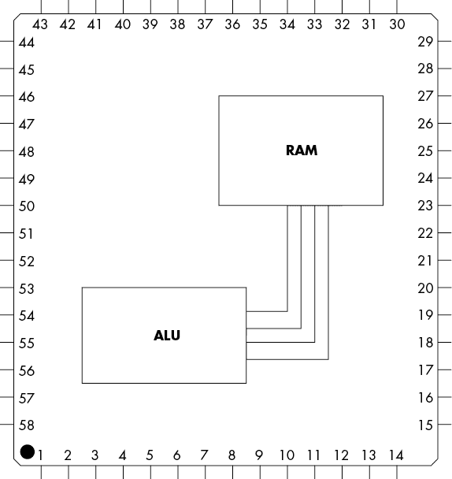

图 10-1：芯片中的数据线

### 改变电容器上的电压

微控制器内部和周围的各种电容影响着功耗。为了方便后续讨论，我们将所有这些电容视为一个单一的电容。如果你在高中物理课上认真听讲过，你可能还记得，要增加电容器上的电压，你需要施加一个*电荷*，而这个电荷必须来自某个地方——通常是通过电源线。数字集成电路（IC）会有 VCC（正电源）和 GND（地）电源线。如果你监控功耗，你会看到 VCC 线上在从低电平切换到高电平时会有电流尖峰。这是由于改变电容器上电压的基本方程所导致的，可以表述为“通过电容器的电流与电容*C*和电压变化率相关”，如下所示：


如果电容器上的电压发生变化（例如从低电平切换到高电平时发生的情况），我们会在电容器所在的电路中看到电流流动。如果电压在低电平到高电平的过渡中变化，我们应该会看到电流沿一个方向流动。如果电压在高电平到低电平的过渡中变化，我们应该看到电流的方向发生反转。观察电流流动的大小和方向可以让我们推断电容器上的电压变化情况，从而推断整个电路（包括微控制器内部总线状态的过渡）的变化。

为了说明这一点，假设我们有一个微控制器，它允许我们监测电流消耗和内部数据总线的状态。如果我们在监测进入设备的电流时，改变两条数据线，我们预计这个测量的结果会像图 10-2 那样。当总线上的数据发生变化时，所有数据线都会相对于系统时钟在定义明确的时间点同时改变状态。在这些时刻，我们会看到由于数据线切换而产生的电流峰值。切换数据线意味着充电和放电电容器，这需要电流流动。


图 10-2：监测切换数据线时的电流峰值，展示 0→1 和 1→0 过渡时电流流入的情况

大多数实际微控制器的总线会进入*预充电*状态，这种状态介于逻辑 1 和逻辑 0 之间。逻辑状态切换需要时间，而这个时间取决于施加在总线上的电压差（即 1 状态和 0 状态之间的电压差）。通过预充电，这个电压差是恒定的，并且只有完全从 0 到 1 切换的电压差的一半，无论总线上是 0 还是 1。这使得总线操作所需的时间更短，整个操作也更可靠。

### 从功率到数据，再回到功率

本书中我们讨论的大多数测量旨在捕捉被测设备的电流。功率与电流的关系为*P* = *I* × *V*；详细信息见第二章。如果设备具有恒定的工作电压，功率和电流之间具有线性关系。对于接下来的工作，我们不需要这些测量的具体单位，线性（甚至非线性）缩放因子在结果应用中几乎没有影响。

因此，在接下来的讨论中，以及本书剩余部分中，*电流*和*功率*这两个术语会被交替使用。对于这些攻击的常见术语是*功率分析*，所以你会看到攻击者测量设备的功率或拥有功率迹线的描述。在大多数情况下，这是不准确的，因为实际测量的是电路中设备的电流，通常使用电流探头等工具。（为了进一步困惑你，这些电流是通过示波器以伏特为单位进行测量的。如果你特别较真于功率和电流之间的区别，请注意，你可能会发现自己根本无法存在于功率分析的领域。）

作为攻击者，我们可以利用前面提到的预充电状态，直接确定正在操作的数字中 1 的个数。这个数字称为*海明重量 (HW)*。0xA4 的海明重量为 3，因为 0xA4 在二进制中是 10010100，里面有三个 1。通过简单的预充电 2 位总线，我们的功率消耗迹线会像图 10-3 那样。

由于预充电，功率峰值仅依赖于当前通过总线传输的值中 1 的数量。请注意，我们只考虑 VCC 电源轨的电流消耗，这就是为什么在线路变为低电平时没有负峰值的原因。这种行为更接近于你在实际系统中看到的情况，因为你观察的是单一电源轨的功耗。

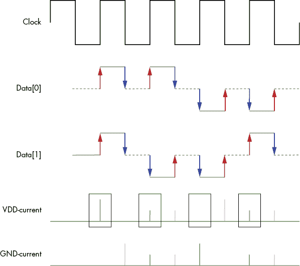

图 10-3：2 位数据线上的海明重量

在实际中，微控制器通常会泄露处理数据的海明重量。我们可以通过在多次测量中，确定何时处理数据并平均功耗来确认这一点。图 10-4 显示了一个 STM32F303 微控制器的示例。

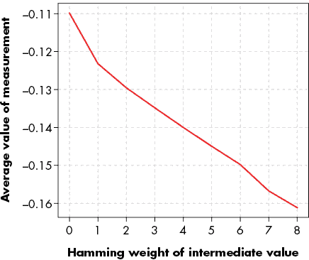

图 10-4：STM32F303 微控制器的功耗增加导致电压测量下降。

你可能会惊讶于这种拟合的线性程度，但我们在微控制器上的实际测量通常确实会与该模型匹配。我们通过 VCC 电源线上的串联电阻测量电压降，因此增加的功耗（增加的海明重量）会导致更大的电压下降。

## 性感的 XOR 示例

现在我们可以使用平均功耗来确定数字设备中设置为 1 的位数总和，让我们看看如何破解一个简单设备。考虑一个基本电路，它将每个输入字节与某个未知但恒定的 8 位密钥进行 XOR 运算。然后，它将这些数据通过一个查找表，该查找表用已知值替换每个字节，就像一个替换密码，其中原始输入字节被查找表中的对应输出字节替换，最终得到“加密”结果。

我们无法访问该设备的输出；我们所能做的只是向其发送数据，它会将数据进行 XOR 运算并通过查找表发送。然而，我们*可以*，如图 10-5 所示，通过在待测设备的 VCC 线中插入分流电阻来测量该设备的功耗。

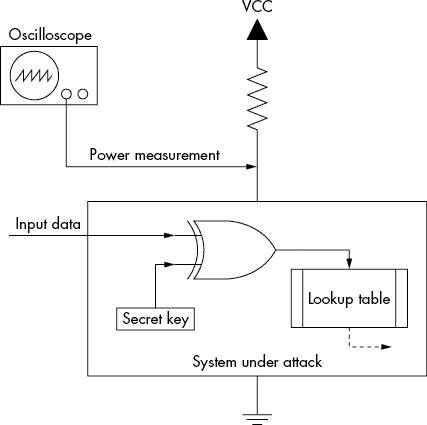

图 10-5：这个简单设备将通过 DPA 攻击被破解。

现在我们向设备发送一堆随机的 8 位输入数据字节，并记录每个字节及其功率轨迹。我们最终得到一个数据列表，列出了发送到设备的数据及其在该操作过程中测量的功率轨迹，如图 10-6 所示。

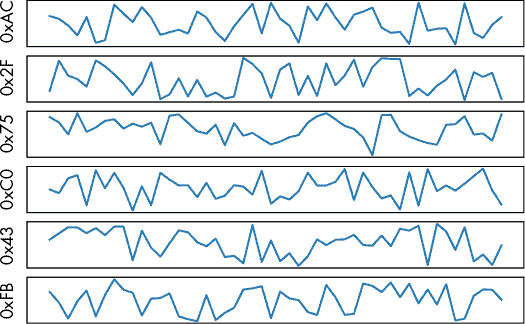

图 10-6：输入数据与相关功率轨迹

这就是我们开始进行 DPA 攻击所需的一切，在这个过程中我们将尝试恢复密钥。

## 差分功率分析攻击

对于图 10-5 中的这个异或（XOR）示例的 DPA 攻击，我们每次只针对一个秘密密钥位进行攻击。我们将描述如何破解最低有效位（LSB），但是你可以通过一些创意将这种方法扩展到所有 8 位。

这些攻击的核心是*密钥枚举*，这其实就是我们通过有根据的猜测来尝试密钥的值。我们尝试每一个可能的密钥值，预测如果设备使用该密钥值，功耗会是多少，然后将我们的预测与实际的功耗轨迹进行比对。最好的匹配就是我们的*密钥候选*。

你此时完全正确地想，“为什么我需要功耗分析，而不是直接暴力破解一个 8 位密钥？”对于暴力攻击，你需要输入一个密钥并从系统中得到反馈，确认密钥是否正确。这里的问题是，我们假设输出不可用，因此你永远无法测试猜测的密钥是否正确。

在 DPA 攻击中，我们将获得一些关于猜测密钥是否正确的“线索”。我们实际上并不直接得知密钥是否解密了数据。对猜测的密钥进行测试的最佳方法是尝试解密一些数据，看看是否能得到有效的输出；如果能得到有效输出，那么我们基本可以确定密钥是正确的。而在 DPA 攻击中，我们技术上只是对*密钥假设*或*密钥猜测*的信心有所增加。如果这个信心非常高，我们可以推断出实际密钥等于我们的密钥假设，而无需进行测试解密。更重要的是，我们稍后将把这个例子扩展到更大的密钥，针对这些密钥你无法使用暴力破解。例如，应用 DPA 攻击于一个 128 位的密钥，其工作量是应用于单个位时的 128 倍，因为我们可以独立地对密钥位进行攻击。相比之下，暴力破解一个单个位的密钥最多需要两次尝试，但破解全部 128 位的密钥则最多需要进行 2¹²⁸次尝试。那是一个非常大的数字，差不多是宇宙中蚂蚁的数量，如果宇宙中的每颗星星都有十亿只蚁后，每只蚁后都有一个十亿只蚂蚁的巢穴。这意味着，通过 DPA，破解 128 位密钥是可行的，而暴力破解则不可行。

### 使用泄漏假设预测功耗

为了预测设备的功耗，我们将使用*泄漏假设*并结合我们对系统的了解。我们假设系统泄漏所有处理值的海明重量，但我们面临一个问题。我们只能测量总功耗，也就是所有正在处理的数据的海明重量，而不是我们感兴趣的仅仅是秘密值的海明重量。此外，即使我们能够隔离出秘密值，许多不同的 8 位值也会有相同的海明重量。由于本章内容较多，你应该已经猜到，解决这个难题的方法是存在的。

假设我们有一个名为`t[]`的功率轨迹数组和一个名为`p[]`的相关输入数据数组。例如，图 10-6 中的顶部条目将有`p[0] = 0xAC`。功率轨迹`t[0]`是一个样本值数组，如顶部轨迹所示。我们可以应用 DPA 算法生成每个密钥猜测的差异列表。列表 10-1 中呈现的简单函数模拟了一个简单目标设备的功耗，并通过 DPA 攻击猜测了一个单一位。

```
diffarray = []
1 each key guess i of the secret key in range {0x00, 0x01, ..., 0xFE, 0xFF}:
    zerosarray = new array
    onesarray = new array
    2 for each trace d in range {0,1, ..., D-1}:
        3 calculate hypothetical output h = lookup_table[i XOR p[d]]

        4 if the LSB of h == 0:
            5 Append t[d] to zerosarray[]
        else:
            6 Append t[d] to onesarray[]

    7 difference = mean(onesarray) – mean(zerosarray)
    append difference to diffarray[]
```

列表 10-1：使用 DPA 攻击模拟功耗和猜测单一位

我们首先列举出所有可能的字节猜测 1。对于每个可能的密钥字节猜测，我们遍历所有记录的功率轨迹 2。使用与轨迹`p[d]`和密钥猜测`i`相关的输入数据，我们可以生成一个*假设的*输出`h` 3，只有在我们正确猜测密钥时，这个输出才等于微控制器所计算的结果。

最后，我们查看假设输出中的目标位（最低有效位，LSB） 4。根据密钥猜测，我们将每个记录的功率轨迹`t[d]`添加到两组中的一组：我们*认为*LSB 为 1 的组 5，以及我们*认为*LSB 为 0 的组 6。

现在考虑这个猜测的性质。如果猜测是*错误的*，我们认为输入查找表的数据实际上并非设备上实际输入的数据，因此，我们认为从查找表中得到的结果也不是实际得到的结果。根据错误的最低有效位（LSB）分组，意味着我们基本上将所有的功率轨迹随机分成两组。在这种情况下，您会期望每组的平均功耗大致相同。因此，如果你从两个平均值中相互减去，你应该得到的结果应该什么也没有，只可能是一些噪音。图 10-7 展示了两组的例子以及得到的减法结果。

如果我们的猜测是*正确的*，我们认为计算的结果实际上与设备上计算的结果相同。因此，我们已将所有最低有效位（LSB）实际设置为 1 的功率轨迹分入一组，将所有 LSB 实际设置为 0 的功率轨迹分入另一组。如果这些 1 和 0 的功耗稍有不同，那么如果我们对足够大的轨迹组进行平均，这种差异应该变得明显。当我们操作该位时，我们预计在一组和零组之间会看到一个小的差异，如图 10-8 所示。

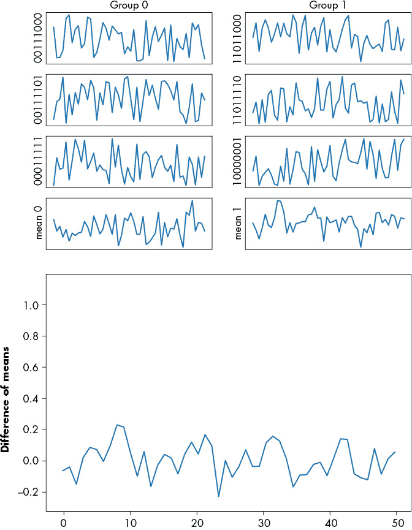

图 10-7：将多个功率轨迹平均为 1 和 0，用于一个错误猜测（0xAB），且没有明显的峰值

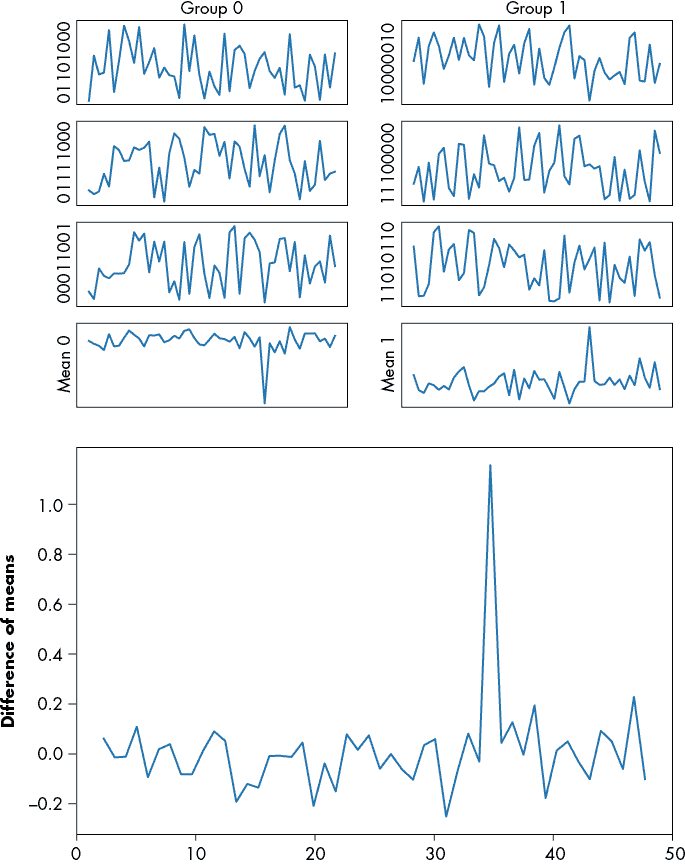

图 10-8：将多个功率轨迹平均为 1 和 0，用于一个正确猜测（0x97），其中明显可见一个峰值

这种差异（在列表 10-1 中的 7）给我们提供了**差分**功率分析中的*差分*部分。这种分析的优势在于，将图 10-6 中显示的表格中的痕迹分为两组，使我们能够平均多个痕迹以减少噪声，同时不会平均掉我们关注的位的贡献。我们可以在图 10-8 中的样本 35 看到最终的波动，这表明我们可以看到最低有效位（LSB）的微小贡献。对这两组平均值之间的差异进行比较，将称为计算*均值差异（DoM）*。

但是，这么微小的功率消耗波动会不会在现实芯片中其他许多线路切换的噪声中丢失呢？实际上，所有其他噪声在两个组中是均匀分布的。唯一在统计上仍然显著的差异是 LSB，即我们选择用来划分组的那个单个位。当我们对足够多的痕迹进行平均时，任何其他翻转位的贡献都会相互抵消。

### Python 中的 DPA 攻击

作为概念验证，本章的配套 Jupyter 笔记本（[`nostarch.com/hardwarehacking/`](https://nostarch.com/hardwarehacking/)）实现了一个对我们示例的 DPA 攻击，使用 Python 编写。`measure_power()`函数，在列表 10-2 中部分展示，使用一个秘密字节对输入数据进行 XOR 运算，并通过查找表进行传递。

```
def measure_power(din):
    #secret byte
    skey = 0b10010111 # 0x97

    #Calculate result
    res = lookup[din ^ skey]
```

列表 10-2：使用某个秘密密钥对输入进行 XOR 运算的查找表

在以下示例中，查找表是随机生成的（即列表 10-2 中的`lookup`数组）。查找表应该至少是一个双射，如果我们正在实现一个真实的加密算法，还需要更多的考虑。然而，出于演示的目的，随机排列的序列也可以使用。使用这样的查找表将展示 AES 或其他算法本身并没有根本的“问题”，正是这些算法使得攻击成为可能。

我们将模拟运行该函数的硬件的功率消耗，而不仅仅是执行“加密功能”，这将使其更容易在计算机上跟踪。稍后你将看到如何在实际硬件上执行这些测量。

#### 模拟单次功率测量

为了模拟单次功率测量，我们将在`measure_power()`函数中生成一个包含随机背景噪声的数组，以反映噪声测量和系统的现实情况。然后，我们将根据中间值中 1 的数量插入一个功率峰值。这模拟了图 10-5 中显示的系统功率消耗测量。

#### 批量测量

接下来，我们进行批量测量。`gen_traces()`函数调用`measure_power()`函数，使用多个随机输入并记录结果功率轨迹。你可以指定执行多少次测量。（我们稍后会看看这对攻击成功率的影响。）

图 10-9 展示了我们“测量”到的单个轨迹，这是通过 Python 绘制的。

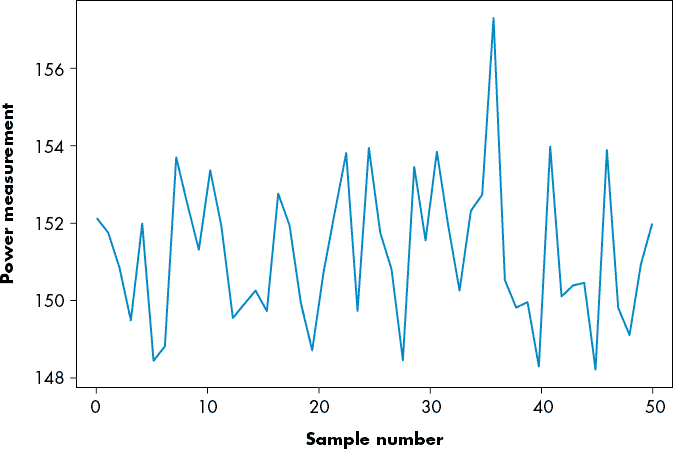

图 10-9：生成的单个轨迹示例（输入 = 0xAC）

#### 枚举可能性并分割轨迹

此时，我们已经有了前面“通过泄漏假设预测功耗”部分提到的测量和输入数据数组。现在我们需要做的就是枚举密钥猜测，并根据假设的中间值将记录的功率轨迹分成两组。

在`dom()`函数中，我们用`lookup[guess ^ p]`猜测中间值，然后通过`(XX >> bitnum) & 1`表达式检查该值是否设置了特定的比特。根据该比特的值，轨迹被分为两组。在我们的示例中，在使用 LSB 之前，这对应于将`bitnum`设置为 0。

#### 差分数组

最后，我们减去每组的均值以得到差分数组。这些差分看起来是什么样的呢？如果分割正确，我们应该在某个时刻看到一个大的峰值。回顾图 10-7 和图 10-8 中的均值差异，你应该能看到当分离轨迹正确时，会出现明显的正峰值，从而知道我们的关键猜测是正确的。

图 10-8 中的图表是正确猜测的结果，我们基于假设密钥字节为 0x97 对轨迹进行了分割。图 10-7 中的图表显示了一个错误的密钥猜测，我们假设密钥字节为 0xAB，并对轨迹进行了分割。

随着轨迹的分离，即使在非常高噪声的环境下，最终所有非 DPA 信号的部分都会被平均掉，正如你可以通过比较图 10-10 中的左右均值差异所看到的那样。

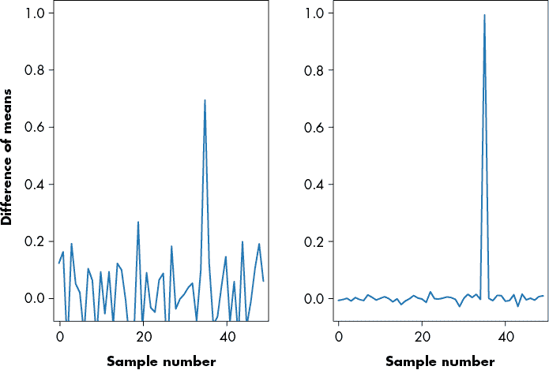

图 10-10：对 1,000（左）与 100,000（右）个轨迹的均值差异以减少噪声

图 10-10 展示了右侧使用的 100,000 个轨迹，而左侧为 1,000 个轨迹。结果是随机噪声被进一步抑制，信号变得更加突出。

#### 完整攻击

接下来，我们通过计算每个比特的每个猜测的均值差异，确定每个比特加密密钥的最可能值。从所有这些差异中，我们找到最强的峰值，表示该比特的最佳密钥猜测。运行代码会生成如下输出：

```
Best guess from bit 0: 0x97
Best guess from bit 1: 0x97
Best guess from bit 2: 0x97
Best guess from bit 3: 0x97
Best guess from bit 4: 0x97
Best guess from bit 5: 0x97
Best guess from bit 6: 0x97
Best guess from bit 7: 0x97
```

我们已经确定了每个位的加密密钥的正确值。虽然 DPA 一次处理单个位，但在我们示例加密函数中使用那个奇怪的查找表意味着我们只需猜测一个位就能破解整个 8 位的加密密钥。这种方法之所以有效，是因为查找表的输出的单个位可能与输入表的所有位相关。这个输入是 8 位的未知密钥和 8 位的已知算法输入数据组合而成。

使用查找表可以确保如果我们对密钥值的猜测是错误的，将追踪分为一类和零类的划分基本上是随机的。具体来说，查找表很可能是非线性的，因为我们对其进行了随机化处理。

如果我们只攻击简单的输入 XOR 密钥而没有查找表，那么每个密钥位只会与中间状态的一个位相关，这意味着我们每次只能确定中间状态的一个位对应的密钥位。

## 认识你的敌人：高级加密标准速成课程

破解我们设计的仅对一个字节有效的算法并不算太刺激，因此现在我们要将 DPA 应用到高级加密标准（AES）。AES 总是以 16 字节的块进行操作，这意味着你必须一次加密 16 字节。AES 有三种密钥长度的可能性：128 位（16 字节）、192 位（24 字节）或 256 位（32 字节）。较长的密钥通常意味着更强的加密，因为任何形式的暴力破解对更长的密钥破解的时间会呈指数增长。

我们在这里主要讨论 AES-128（尽管你也可以轻松将旁道攻击应用于 AES-192 或 AES-256），使用 *电子密码本 (ECB)* 模式。在 ECB 模式下，16 字节的未加密 *明文* 通过 AES-128-ECB 和相同的密钥总是映射到相同的加密 *密文*。大多数现实世界的加密不会直接使用 ECB 模式，而是使用各种 *操作模式*，例如 *密码分组链接 (CBC)* 和 *Galois 计数模式 (GCM)*。对 AES 的直接 DPA 攻击将应用于 ECB 模式下的 AES。一旦你掌握了如何处理 AES 的 ECB 模式，也可以将其扩展到 AES CBC 和 AES GCM 的攻击。

图 10-11 显示了 AES-128 开始部分的总体结构。（我们将讨论限制在算法的开始几轮，因为我们的攻击发生在该部分。）

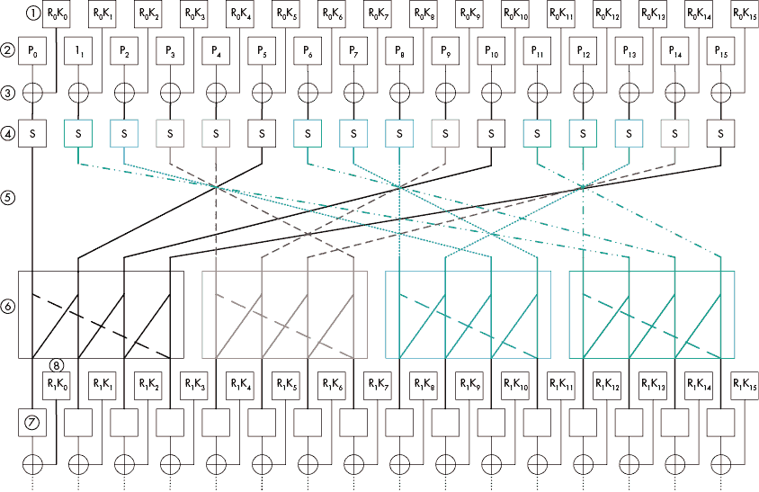

图 10-11：AES 算法的完整第一轮和第二轮的开始

在图 10-11 中，16 字节的密钥表示为 R[0]K[*k*] 1，其中 *k* 是密钥字节的编号。第一个下标表示该密钥适用于哪一轮；AES 在每一轮使用不同的 16 字节轮密钥。输入明文为 2，依然带有下标，表示字节编号。每个轮密钥的字节与明文 3 的每个字节进行异或操作，称为 `AddRoundKey` 操作。请注意，对于 AES-128，第一轮的轮密钥与 AES 密钥相同；其他所有的轮密钥都是通过密钥调度算法从 AES 密钥派生出来的。对于 AES-128 的 DPA，我们只需要提取一个轮密钥，通过它可以推导出 AES 密钥。

一旦轮密钥和明文在 `AddRoundKey` 操作中进行异或运算，每个字节就会通过一个 *替代盒* *(S-box)* 4，进行称为 `SubBytes` 的操作。S-box 是一个 8 位查找表，具有一对一的映射关系（也就是说，每个输入都有一个唯一的输出）。这也意味着它是可逆的；给定 S-box 的输出，你可以确定输入。S-box 设计具有许多优良的特性，可以抵抗线性和差分密码分析。（这些查找表的具体定义并不重要；我们只想指出，S-box 不仅仅是一个普通的查找表。）

接下来的两层进一步将输入分布到多个输出比特中。第一层是一个名为 `ShiftRows` 的函数，它会打乱字节 5。接下来，`MixColumns` 操作 6 将 4 个字节的输入结合成 4 个字节的输出，这意味着如果输入到 `MixColumns` 的单个字节发生变化，所有 4 个字节的输出都会受到影响。

`MixColumns` 的输出成为下一轮 7 的输入。这一轮有一个轮密钥 8，它将再次与输入的轮文本 7 通过 `AddRoundKey` 操作进行异或运算。之前的操作（`SubBytes`、`ShiftRows` 和 `MixColumns`）然后会重复。结果是，如果我们在 AES 开始时翻转一个比特，经过 10 轮后，我们应该（平均而言）看到一半的输出比特发生翻转。

除了最后一轮外，所有的轮次都会进行完全相同的操作；只有进入轮次的数据和轮密钥会有所不同。最后一轮将进行另一个 `AddRoundKey` 操作，而不是 `MixColumns` 操作。然而，我们只需要通过 DPA 攻击第一轮来提取完整的密钥，因此对于最后一轮，我们并不太担心！

### 使用 DPA 攻击 AES-128

要通过 DPA 破解 AES-128 实现，我们首先需要模拟 AES-128 实现。我们一直在使用的异或示例基本上是 AES 的前两步：密钥加法（异或）和 S-box 查找。

要构建一个真正的 AES DPA 攻击，我们将修改来自附带的 Jupyter 笔记本的示例代码（如果你还没有这样做，现在是个好时机让它正常运行）。我们只需要将随机查找表改为正确的 AES S-box。在这种情况下，我们攻击的是 S-box 的*输出*。S-box 的非线性效应将使得提取完整的加密密钥变得更加容易。

如果你运行示例代码，它应该会生成图 10-12 中的输出，显示 `guess` 变量的三种值：0x96、0x97 和 0x98 的追踪。这些是 `guess` 变量 256 个值中的三种差异追踪。当 `guess` 变量与正确的密钥字节匹配时，你会看到一个大的峰值。

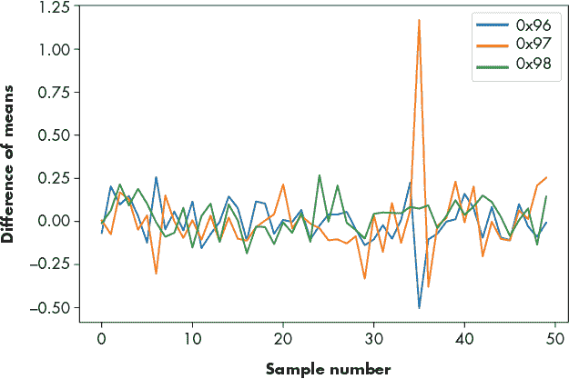

图 10-12：对 AES-128 加密算法的单字节进行 DPA 攻击的输出，密钥为 0x97

虽然我们只攻击了 AES-128 加密的一个字节，但我们可以对每个输入字节重复攻击，以确定整个 16 字节的密钥。记得我们猜测只有 8 位时的情况吗？我们没有做出任何关于破解哪个密钥的 8 位的特殊假设。因此，我们可以对任何密钥字节进行相同的攻击。

我们现在声明，我们可以通过攻击 16 次并且每次仅猜测 8 位来破解所有 AES 密钥字节！从计算上来说，这是完全可行的，而进行 2¹²⁸ 的暴力破解则根本不可能。DPA 的基本强度在于，我们不是暴力破解整个密钥空间，而是将加密算法分解成子密钥，然后通过使用来自功率追踪的附加信息来验证子密钥猜测，从而暴力破解这些子密钥。通过这种方式，我们将破解 AES-128 实现从不可能变为可以实现的现实。

## 相关功率分析攻击

DPA 攻击假设，对于某个特定设备，当一个比特是 1 或 0 时，功耗会有所不同。正如我们所解释的，我们可以使用从查找表中提取的任意 8 个比特之一来预测密钥。这个冗余实际上是我们可以用来增强攻击的东西。一种直接的方法是使用每个位作为一个单独的“投票”，来判断哪个子密钥是最有可能的候选者，但我们可以更加聪明。我们可以使用一种更高级的攻击，称为*相关功率分析（CPA**）*，它将同时对任意数量的比特进行建模，因此可以产生更强的攻击。在 DPA/CPA 术语中，这意味着我们需要更少的追踪来恢复密钥。CPA 是由 Eric Brier、Christophe Clavier 和 Francis Olivier 在 CHES 2004 论文《带泄漏模型的相关功率分析》中引入的。我们将呈现数学符号及 Python 实现，帮助你将理论与实际代码对接。直到你真正实现这个攻击，细节可能会逃避你（相信我们），所以拿起笔和纸，让我们深入探讨吧。

在 DPA 中，我们基本上是在说：“如果某个中间位发生变化，功耗也会随之变化。”虽然这是对的，但它并没有完全捕捉到数据与功耗之间关系的全部范围。请参见图 10-4。一个字的哈明权重越高（即，设置的位越多），功耗越高。这接近完美的线性关系。这个关系似乎适用于任何类型的 CMOS，因此它对微控制器非常适用。那么，我们如何利用这种线性呢？

DPA 的基本思想是进行关键猜测并预测一个中间值中某一位的值。在 CPA 中，我们做相同的关键猜测，但预测整个中间值的字。在我们的 AES 示例中，我们预测 S 盒的 8 位输出：

```
sbox[guess ^ input_data[d]]
```

现在，魔法来了：预测之后，我们计算该预测值的哈明权重。我们知道它与实际的功耗几乎是线性相关的。因此，如果我们的猜测是正确的，我们应该能够找到 S 盒输出的哈明权重与设备实际测量功耗之间的线性关系。如果我们的猜测是错误的，我们就看不到线性关系，因为我们为预测值计算的哈明权重实际上是某个其他尚未知的值的哈明权重，而不是我们预测的那个值。对我们非常有用的是找到那个给出这种线性关系的`猜测`。如何利用这种线性关系将在我们关注某位皮尔逊先生时变得显而易见。

### 相关系数

*样本皮尔逊相关系数* *r* 做的正是我们所需要的。它衡量两个随机变量样本之间的线性关系——在我们这里，就是测量的功率轨迹与某个`猜测`的 S 盒输出的哈明权重之间的线性关系。根据定义，皮尔逊相关系数为+1 时，表示它们完全线性相关；也就是说，功耗越大，哈明权重越高。如果相关系数为-1，则表示它们完全负相关；也就是说，更高的哈明权重与较低的功耗相关。

实际中可能会出现负相关性，因此我们通常对相关系数的绝对值更感兴趣。如果相关系数为 0，则说明完全没有线性关系，对于我们的实际目的来说，这意味着对于某个`猜测`，测量的轨迹与 S 盒的哈明权重之间没有显著的对应关系。通过这个观察，我们可以通过简单地查看皮尔逊相关系数的绝对值来测试一个猜测的好坏，并比较不同的猜测。相关系数绝对值最高的猜测获胜，因此很可能就是实际的密钥！

#### 先了解一些术语

我们即将介绍许多在方程式中映射到笔记本中 Python 表达式的变量。为了方便你使用，我们在表 10-1 中给出了映射。

从方程式转换为 Python 是以下过程中的一个重要部分，未来你将读到的许多攻击也与此相关。像表 10-1 这样的简单映射表可以让你的工作变得更加轻松。如果你已经运行了伴随代码，保持此页面打开，以便快速在方程和代码之间转换。

表 10-1：将相关方程变量映射到笔记本

| **方程变量** | **笔记本** | **含义** |
| --- | --- | --- |
| *d* | `tnum` | 跟踪索引 [*0..D* – *1*] |
| *D* | `number_traces` | 跟踪总数 |
| *i* | `guess` | 假设子密钥的值为 *i*[*0*..*I* – *1*] |
| *I* | `256` | 可用子密钥猜测的总数 |
| *j* | 不适用（谢谢，NumPy！） | 样本索引 [*0*..*T* – *1*] |
| h[*d,i*] | `hyp, intermediate()` | 跟踪 *d* 和子密钥猜测 *i* 的假设功耗 |
| *p*[*d*] | `input_data[d]` | 跟踪 *d* 的明文值 |
| *r*[*i,j*] | `cpaoutput` | 子密钥猜测 *i* 在样本索引 *j* 处的相关系数 |
| *t*[*d,j*] | `traces[d][j]` | 跟踪 *d* 在样本索引 *j* 处的样本值 |
| *T* | `numpoint` | 每个跟踪中的样本数 |

#### 计算要关联的数据

为了计算相关系数，我们需要一张来自设备的实际功率测量表（见表 10-2）和一列假设的功率测量值（见表 10-3）。我们首先来看表 10-2，这是使用伴随笔记本中的代码生成的功率测量数据。

表 10-2：*D* 个跟踪（行）的功率测量，包括明文 *p*[*d*] 和 *T* 个样本，在不同时间索引 *j*（列）处的测量数据

|  | **明文 *p*[*d*]** | **测量值 ***j*** = 0** | **测量值 ***j*** = 1** | **测量值 ***j*** = *T* – 1** |
| --- | --- | --- | --- | --- |
| **Trace *d* = 0** | 0xA1 | 151.24 | 153.56 | 152.11 |
| **Trace *d* = 1** | 0xC5 | 151.16 | 150.35 | 148.54 |
| **Trace *d* = 2** | 0x1B | 150.06 | 149.67 | 151.28 |
| **Trace *d* = *D* – 1** | 0x55 | 149.09 | 152.42 | 151.00 |

跟踪编号 *d* 代表给定的加密操作、明文和相应的功率跟踪。对于整个操作，我们会记录 *T* 个功率跟踪样本，每个样本代表在操作过程中某个时间点的功率测量。每个跟踪中的样本总数取决于我们的测量采样率以及操作的持续时间。例如，如果我们的 AES 操作花费了 10 毫秒（0.01 秒），且我们的示波器每秒记录 1 亿个样本（MS/s），那么我们将得到 0.01 × 100,000,000 = 1,000,000 个样本（即 *T* = 1,000,000）。在实际场景中，*T* 可以是几乎任何数值，但通常在 100 到 1,000,000 个样本之间。我们的 CPA 攻击将独立考虑每个样本，因此从技术上讲，我们每个跟踪只需要一个 *单一* 样本（但这个单一样本必须在正确的时间）。

对于假设的功率测量，我们不再拥有样本（或时间）轴。相反，我们考虑在给定密钥猜测 *i* 的情况下，针对相同的跟踪编号（相同的 *d* 索引），假设的功率消耗是什么。那时，时间发生了什么变化？之前我们说过，攻击可以通过单个样本点在“正确的时间”成功。“正确的时间”实际上是指设备正在执行我们为其建模假设功率消耗的操作时的时间。这意味着我们的假设测量不需要时间索引，因为我们已经将时间定义为操作发生的时刻。对于物理测量，我们不知道操作发生的具体时间，因此我们需要记录一个更长的功率跟踪，其中包含该操作（但也包括我们的攻击会排除的其他部分）。表 10-3 展示了我们在这个示例中使用的假设值表。

表 10-3：具有 *d* 跟踪和 *i* 猜测的明文与假设值

|  | **明文 *p*[*d*]** | **猜测 ***i*** = 0** | **猜测 ***i*** = 1** | **猜测 ***i*** = 2** | **猜测 ***i*** = *I*– 1** |
| --- | --- | --- | --- | --- | --- |
| **跟踪 *d* = 0** | 0xA1 | 3 | 3 | 2 | 3 |
| **跟踪 *d* = 1** | 0xC5 | 4 | 3 | 4 | 1 |
| **跟踪 *d* = 2** | 0x1B | 6 | 3 | 4 | 4 |
| **跟踪 *d* = *D* – 1** | 0x55 | 6 | 1 | 5 | 4 |

对于每个密钥猜测，我们计算 S-box 输出的汉明重量，并将结果放入表格中，每个猜测占一列，编号从 0 到 255。我们的假设是，如果秘密密钥字节是 0x00，则功率测量将类似于第 0 列；如果秘密密钥字节是 0x01，则功率测量将类似于第 1 列；如果秘密密钥字节是 0xFF，则功率测量将与第 255 列类似。我们想查看哪一列（如果有的话）与物理功率测量高度相关。

之前，我们使用了测量的功率跟踪表。在这里，我们将使用符号 *t*[*d,j*] 来表示这些表，其中 *j* = 0,1, . . ., *T – 1* 是跟踪中的时间索引，*d* = 0,1, . . . , *D – 1* 是跟踪编号。如果你正在跟随本节的 Jupyter 笔记本中的代码示例，我们正在索引一个名为 `traces[d][j]` 的变量。如前所述，如果攻击者确切知道加密操作发生的位置，他们只需要测量一个单独的点，即 *T* = 1。对于每个跟踪编号 *d*，攻击者还知道与该功率跟踪对应的明文，定义为 *p*[*d*]。变量 *p*[*d*] 相当于随附代码中的 `input_data[d]`，并且是表 10-2 和 10-3 中的第一列。

#### 引入函数

我们将在此定义几个函数：我们将设备在跟踪编号 *d* 和秘密密钥猜测 *i* 下的假设功耗表示为 *h*[*d,i*] = *l*(*w*(*p*[*d*], *i*)), 其中 *l*(*x*) 是给定中间值 *x* 的 *泄漏模型*，*w*(*p*[*d*], *i*) 给定输入明文 *p*[*d*] 和秘密密钥的猜测 *i* 生成该中间值 *x*。 （我们很快会深入研究泄漏模型。）此函数 *h*[*d,i*] 成为 *假设值表*，我们在这里询问在假设的秘密密钥字节下，功率测量应该是什么样子。这些是表 10-3 中的剩余列。

我们再假设微控制器的功耗取决于 S-box 输出的 Hamming 权重，就像 AES-128 的 DPA 示例一样。现在，我们可以更新我们的函数定义，使其更具体地适用于 AES-128（⊕ 表示异或）：

*l(x) = HammingWeight(x)*

*w(p,i) = SBox(p ⊕ i)*

`HammingWeight()` 函数返回一个 8 位值中的 1 的个数，而 `SBox()` 函数返回 AES S-box 查找表的值。请查看随附的笔记本以获取 Python 实现。

#### 计算相关性

现在我们将使用相关系数 *r* 来寻找假设功耗 *l*(*x*) 和测量功耗 *t*[*d*],[*j*] 之间的线性关系。最后，我们可以通过将这些值代入 Pearson 相关系数的公式，计算每个点 0 ≤ *j* < *T* 在所有跟踪 0 ≤ *d* < *D* 中的相关系数，对于每个可能的子密钥值 0 ≤ *i* < *I*：

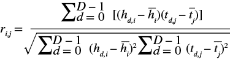

这是刚才介绍的函数的一些细节：

+   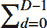 *x* 是在所有 *D* 跟踪中执行的 *x* 的总和。

+   *h*[*i*] 是猜测 *i* 对所有 *D* 跟踪的平均（均值）假设泄漏。如果泄漏是字节的 Hamming 权重，则泄漏的范围可以从 0 到 8（包括）。 （对于大量的跟踪，泄漏的均值应为 4，并且与 *i* 无关。）

+   *t*[*j*] 是在所有 *D* 跟踪中，点 *j* 处的平均（均值）功率测量值。

如果我们计算 表 10-2 和 表 10-3 的相关性，我们会得到 表 10-4。该表中的行是 *相关迹线*，列是不同的时间点。

表 10-4：每个密钥猜测 *i* 的相关迹线 *r*

|  | **相关 ***j*** = 0** | **相关 ***j*** = 35** | **相关 ***j*** = *T* – 1** |
| --- | --- | --- | --- |
| **猜测 ***i*** = 0x00** | 0.02 | –0.01 | 0.11 |
| **猜测 ***i*** = 0x01** | 0.06 | –0.01 | 0.06 |
| **猜测 ***i*** = 0x97** | –0.00 | 0.54 | –0.12 |
| **猜测 ***i*** = 0xFF** | –0.01 | 0.18 | 0.12 |

对于正确的时间（*j* = 35）和密钥猜测（*i* = 0x97），相关性显著更高。当然，“完整”表格将包含所有样本点（时间），其中 *j* 索引从 0 到 *T* – 1，以及所有密钥猜测从 0 到 *I* – 1。本示例中的密钥猜测终点 *I* – 1 是 0xFF，因为我们的泄漏模型基于单字节输入，它只能取值 0x00 到 0xFF。为了保持表格的整洁，我们展示了几个样本点的例子。

### 使用 CPA 攻击 AES-128

既然我们可以使用 CPA 来检测泄漏，让我们回顾一下攻击 AES-128 算法的单字节示例，就像在第 310 页的《使用 DPA 攻击 AES-128》部分所做的那样。我们将再次使用 `measure_power()` 函数，目标是攻击这个单字节。我们将扩展之前的示例，创建一个 `intermediate()` 函数，表示值 h[d,i] = l(w(p[d], i))。对于给定的明文输入字节和密钥猜测，这个函数返回中间值的预期海明重量。CPA 攻击将在比较预期泄漏与实际测量泄漏时使用此函数。

#### 求和循环

注意到 Pearson 相关系数方程中，实际上有三个求和操作覆盖所有迹线。对于这个初始实现，我们将计算其中的一些求和，并将其分解为以下格式：

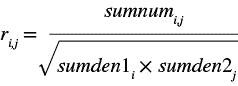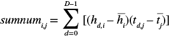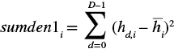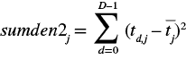

在 Python 中，我们首先使用当前的密钥猜测计算所有均值。然后，对于每个迹线，我们更新所有求和变量。对于每个输入时出现的样本点，生成一个求和。再次使用 Pearson 相关系数结果（由 CPA 攻击使用）来确定特定敏感操作发生的位置；你无需提前知道加密发生的时间。

#### 相关性计算与分析

为了完成攻击，我们通过合并求和生成相关迹线。我们绘制不同猜测数的相关迹线，期望正确的密钥猜测（见 图 10-13）出现最大的峰值。

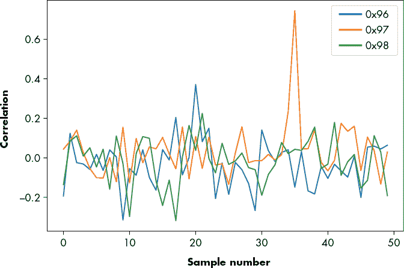

图 10-13：正确密钥猜测（0x97）与两个错误密钥猜测的相关性图

相关性追踪应该在猜测与设备使用的秘密值匹配的点上显示强相关性。图 10-13 中的峰值以及相关性图表通常显示强*正*相关，但如果你反向测量功耗，你可能会得到一个强*负*相关性，尽管这是正确的密钥猜测。这种负相关性可能是因为你在 GND 路径而不是 VCC 路径中进行测量，或者你的探针可能连接了反向极性，或者你的测量设置可能因为其他原因导致反向读取。因此，为了确定正确的密钥猜测，我们只需查看相关性峰值的绝对值。

CPA 攻击是一种破解加密实现的方法，通常对于 DPA 攻击来说过于安全，因为 CPA 考虑了来自所有 8 个比特（对于一个 8 位系统）的泄漏，而 DPA 攻击仅考虑一个比特。CPA 攻击的原理基于这样的观察：你可以将中间变量的哈明重量与设备的功耗线性相关，并且它利用相关性来利用这种关系。

尝试将 DPA 和 CPA 攻击的追踪次数减少，直到它们无法可靠地恢复正确的密钥。你可能会发现，在大约 200 次追踪时，DPA 攻击无法恢复正确的密钥，而 CPA 攻击则能够在大约 40 次追踪下恢复正确的密钥。两个模拟系统的噪声量相同；CPA 攻击通过使用多个比特的贡献来实现更好的结果。

#### 泄漏模型和敏感值

*泄漏模型*描述了在设备上处理的数据值如何在旁路通道中表现出来。到目前为止，我们使用了哈明重量泄漏模型，其中功耗与 I/O 线中设置的比特数之间有某种线性关系。作为敏感值，我们选择了一个中间状态，即在一个秘密值与已知输入数据混合并经过非线性操作后不久的状态。

由于总线预充电现象，发生了哈明重量泄露。然而，并非所有芯片中的泄露都是由于预充电总线引起的。另一种常见的泄露模型是*哈明距离（HD）*。HD 模型基于这样的事实：当一个寄存器从一个状态转移到下一个状态时，功耗仅取决于改变状态的比特数。因此，在使用该模型时，您只关心两个时钟周期之间的比特数差异。图 10-14 显示了寄存器的 HD 示例。

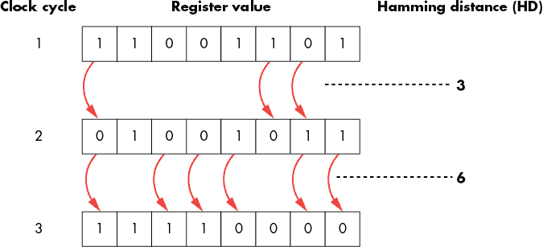

图 10-14：寄存器在三个连续时钟周期中的哈明距离

这个过程表明，泄漏反映了寄存器状态的变化。如果这个寄存器保存的是 S-box 的输出，你需要知道（或猜测）这个寄存器的*先前*状态，才能破解*当前*状态。

硬件中的密码学实现，例如微控制器中的 AES 外设，其中算法并未作为软件进程运行，更容易受到 HD 泄漏的影响。由于它们通常只有少数几个寄存器之间的连接（与主数据总线相比），它们不会将数据线预充电，这导致我们检测到的是哈明距离而不是哈明权重。在攻击这些设备时，我们需要计算变化的假设功耗，这意味着我们需要确定该敏感寄存器的先前状态。先前的状态可能只是最后使用的输入字节，或者可能是上次加密操作运行时的输出。

在专门实现 AES-128 的电路中，确定先前的值可能会面临更多挑战，因为该值现在将依赖于硬件设计的细节（如前面在图 10-11 中所示）。硬件设计师比软件设计师具有更大的灵活性，在实现 AES-128 时，他们可能会选择使用 16 个并行运行的 S-box 查找表，或者像图 10-15 中所示，逐个执行查找操作来共享一个 S-box 查找表给所有输入字节。可能需要一些侦查工作才能确定他们选择了哪种方式。

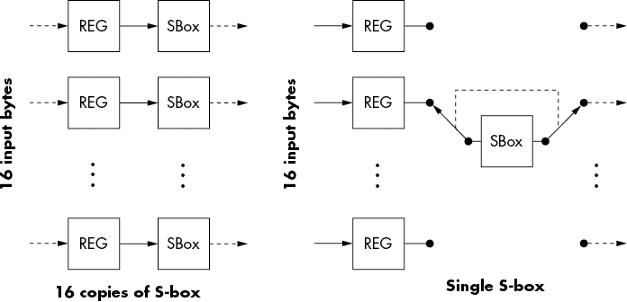

图 10-15：硬件中实现 AES 的方法

实现的选择将取决于设备的目的：当设计一个非常小且低功耗的 AES 核心时，一般用途的微控制器可能会接受较慢的吞吐量，而设计用于硬盘或网络控制器的 AES 核心则会在吞吐量达到多 Gbps 的情况下，牺牲可能存在的功率或设备大小限制。你可能通过测量 AES 所需的时钟周期数，并将其除以轮次，来推测某些结构。在大约每轮 1 个时钟周期时，所有的 S-box（和轮内其他 AES 操作）都是并行运行的；在大约每轮 4 个时钟周期时，`SubBytes` 和 `MixColumns` 等操作会在单独的时钟周期中执行。当每轮时钟周期数达到 20+ 时，`SubBytes` 很可能是通过单个 S-box 实现的。

你对目标了解得越少，就越需要通过反复试探来确定它是如何实现加密的。如果你发现设备的 S-box 输出没有泄漏，可以尝试猜测`MixColumns`操作之后的字节（前面“认识你的敌人：高级加密标准入门”一节中有描述）。如果汉明重量方法没有显示相关性，可以尝试使用汉明距离方法。Ilya Kizhvatov 的《AVR XMEGA 加密引擎的侧信道分析》在实际电路中提供了一个很好的例子，展示了如何破解 XMEGA 的 AES 外设。你还可以在 ChipWhisperer 项目中找到一个逐步教程，重复执行该 XMEGA 攻击，你可以亲自实验这些结果。

#### 在真实（但仍为玩具）硬件上进行 DPA

第八章解释了如何进行 SPA 的功率测量。本章中的 DPA 采集设置与之相同，所以我们将在此基础上继续。在你理解 DPA 如何工作并模拟过 Python 攻击之前，不要尝试攻击真实设备。向专家请教：检查每一步操作。采集或分析中的一个小 bug 就可能导致你无法看到任何泄漏。

我们将把 AES 算法嵌入到一个简单的软件框架中，由固件执行加密操作。你可以使用任何 AES 库来进行加密，比如开源的 avr-crypto-lib。你甚至可以找到这个库的 Arduino 移植版（[`github.com/DavyLandman/AESLib/`](https://github.com/DavyLandman/AESLib/)）。

示例 10-3 展示了一个能够通过串口接收数据并启动加密的源代码示例。

```
#include <stdio.h>
#include <stdint.h>
#include "aes.h"
#include "hardware.h"

int main(void){
    uint8_t key[16];
    uint8_t ptdata[16];
    uint8_t ctdata[16];
    uint8_t i;
    setup_hardware();
    while(1){
        //Read key
        for(i = 0; i < 16; i++){
            scanf("%02x", key + i);
        }

        //Read plaintext
        for(i = 0; i < 16; i++){
            scanf("%02x", ptdata + i);
        }

        //Do encryption
        trigger_high();
        aes_128(key, ptdata, ctdata);
        trigger_low();
 //Return ciphertext
        for(i = 0; i < 16; i++){
            printf("%02x", ctdata[i]);
        }

    };
    return 0;
}
```

示例 10-3：用于在触发器上执行简单加密的微控制器固件示例（C 语言）

这个示例有一个非常简单的串行协议；你以 ASCII 格式发送 16 字节的密钥，16 字节的明文，然后系统会返回加密后的数据。

例如，你可以打开串口并发送以下文本：

```
2b7e151628aed2a6abf7158809cf4f3c 6bc1bee22e409f96e93d7e117393172a
```

然后 AES-128 模块会返回`3ad77bb40d7a3660a89ecaf32466ef97`。通过在互联网上查找“AES-128 测试向量”来测试你的实现。

### 与目标设备通信

在定义了自己的串行协议以发送和接收数据后，与目标设备的通信应该很简单。像 SPA 的示例一样，我们将向目标发送一些数据，并在 AES 操作期间记录其功耗。如果你跟着配套笔记本操作，它展示了如何在虚拟设备上执行测量；只需将测量函数替换为调用物理设备即可。

前面模拟的测量示例对单字节进行了攻击，但你需要向真实设备发送 16 个字节。你可以选择对任何一个字节进行攻击，或者依次攻击每个字节。

再次提醒，在 I/O 线的上升沿触发信号，以确定感兴趣的精确数据点。例如，当针对 AES 的第一轮时，像 Listing 10-3 中所示的 `trigger_high()` 代码应当放置在 AES 函数内部，使得该行仅在你进行敏感操作时（如 S-box 查找输出）才处于高电平。

### 示波器采样速度

和 SPA 攻击一样，你可以通过实验确定任何平台或设备所需的采样率。通常，DPA 攻击需要比 SPA 更高的采样率，因为我们将根据功率的微小变化将数据分类到多个组中。相比之下，SPA 攻击通常只匹配功率波形中较大的变化，因此 SPA 可以在比 DPA 更大的噪声和时间抖动条件下工作。

一般来说，在攻击像 AES 这样的微控制器上的软件实现时，通常只需要以大约 1 到 5 倍时钟速度的采样频率进行采样即可。攻击硬件实现时需要更高的采样率，通常是时钟速度的 5 到 10 倍。然而，这些规则充其量只是一个模糊的经验法则；你的采样率选择将取决于设备泄漏、测量设置以及示波器的质量。某些采样方法，例如在 ChipWhisperer 平台上使用的同步采样，也可以放宽这些要求，使你即使在时钟速度本身（即时钟速度的 1 倍）下进行采样，也能成功进行攻击。

## 小结

本章（以及前两章）集中讨论了攻击你可以控制的平台。这些是很好的学习目标，我们鼓励你尝试各种算法和测量变种，以了解你的选择如何影响泄漏检测。掌握了这些技能后，你将准备好进入下一个阶段：攻击黑盒系统。要有效地进行这类攻击，你需要对加密技术如何在嵌入式系统中实现以及如何使用你的旁路分析工具箱进行攻击有一个基本的理解。

下一章将介绍一些额外的工具，用于攻击那些没有方便触发信号或不清楚实现细节的真实系统。在此过程中，你的耐心将会受到严峻考验。
