# 11

跟技术过招：高级功率分析

前两章以及一般的功率分析文献，集中于对攻击的理论理解和在实验室条件下的应用。作为那些亲眼见证了大量此类攻击的人，我们可以告诉你，对于大多数实际目标来说，你的时间有 10%会花在设置测量设备的过程中；10%的时间会用来进行实际的功率分析攻击，其余的 80%则是花费在试图弄明白攻击为什么没有泄漏信号上。这是因为，只有当你从踪迹获取到踪迹分析的每一步都做对了，攻击才会显示泄漏；而在你实际找到泄漏之前，很难确定最初的哪一步出了问题。实际上，功率分析需要耐心，配合大量的步骤分析，一系列的试错，并且需要强大的计算能力。本章更侧重于功率分析的*艺术*而非科学。

在实践中，你需要一些额外的工具来克服实际目标所带来的各种障碍。这些障碍在很大程度上决定了从设备中成功提取机密信息的难度。目标本身的一些固有特性会影响信号和噪声特性，像可编程性、设备复杂性、时钟速度、旁道类型和防护措施等特性也会有影响。当你在微控制器上测量 AES 的软件实现时，你可能仅需闭一只眼、把手放在背后，就能从一个迹象中识别出单独的加密轮次。但当你测量嵌入在 800 MHz 的全系统芯片（SoC）上的硬件 AES 时，别指望在一个迹象中看到加密轮次。许多并行处理会导致幅度噪声——更不用说泄漏信号本身就非常微小了。最简单的 AES 实现可能在不到 100 个迹象和 5 分钟的分析时间内就被破解，而我们见过的最复杂攻击成功的例子，则已经超过了十亿(!)个迹象和几个月的分析——有时，攻击仍然会失败。

在接下来的部分中，我们将提供一些工具，以便在不同的情况下应用，并提供一个关于如何处理整个功率分析话题的一般方法。装备了这些工具后，接下来就取决于你来判断是否、何时以及如何将它们应用到你最喜欢的目标上。因此，本章有点像是一个混合包。首先，我们讨论一些更强大的攻击方法并提供参考文献。接着，我们深入探讨了几种衡量密钥提取成功与否的方法，以及如何衡量你设置的改进。然后，我们讨论了如何测量真实设备，而非一些简单的、实验室中完全可控的目标。接下来是关于踪迹分析和处理的部分，最后，我们提供了一些额外的参考资料。

## 主要障碍

电源分析有多种形式。在本章中，我们将提到*简单功耗分析（SPA）*，*差分功耗分析（DPA）*以及*相关功耗攻击（CPA）*，或者简称为*功耗分析*，当一种声明适用于这三种情况时。

理论与攻击实际设备之间的差异是显著的。在进行实际功率分析时，您将会遇到主要障碍。这些障碍包括以下几点：

**幅度噪声**

这是你在听 AM 无线电传输时听到的嘶嘶声，你设置中所有其他电子组件的噪音，或者作为对策添加的随机噪声。你测量设置的各个部分会导致它，但实际设备中非感兴趣但并行的操作也会出现在你的测量中。你在进行的所有测量中都会遇到幅度噪声，它对功率攻击构成问题，因为它会掩盖由数据泄露引起的实际功率变化。对于 CPA，它会导致您的相关峰值幅度降低。

**时间噪声（也称为错位）**

由示波器触发或非恒定时间路径导致目标操作的时间抖动，使得感兴趣的操作在每次跟踪时出现不同的时间。这种抖动会影响相关功耗攻击，因为攻击假设泄露始终在相同的时间索引处出现。抖动会产生不良影响，扩大您的相关峰值并降低其幅度。

**侧信道对策**

是的，芯片和设备供应商也会阅读本书。刚刚描述的无意噪声源也可以由设备设计者有意引入，以降低功率攻击的有效性。不仅引入噪声源，而且还通过使用掩蔽和盲化算法以及芯片设计（参见 Thomas S. Messerges 的“Securing the AES Finalists Against Power Analysis Attacks”）、协议中的常量密钥旋转（参见 Pankaj Rohatgi 的“Leakage Resistant Encryption and Decryption”）、以及常量功率电路（参见 Thomas Popp 和 Stefan Mangard 的“Masked Dual-Rail Pre-charge Logic: DPA-Resistance Without Routing Constraints”）和 SCA 抗性单元库（参见 Kris Tiri 和 Ingrid Verbauwhede 的“A Logic Level Design Methodology for a Secure DPA Resistant ASIC or FPGA Implementation”）来减少泄露信号。

不过，请不要绝望。对于每种噪声源或对策，都有工具可以恢复至少一部分泄露。作为攻击者，您的目标是将所有这些工具结合起来进行成功的攻击；作为防御者，您的目标是提供足够的对策，使得攻击者在技能、时间、耐心、计算能力和磁盘空间等资源上耗尽。

### 更强大的攻击

到目前为止我们所描述的关于功耗分析的内容，实际上是该领域中一些较为基础的攻击方式。还有各种更强大的攻击方式，许多已经超出了本章的范围。然而，我们不希望你在实际知识与感知知识的邓宁-克鲁格效应曲线的错误一侧。我们希望确保你有足够的知识，知道自己并不是拥有所有的知识。

到目前为止你学到的一切都是使用了*泄漏模型*。这个模型做了一些基本假设——例如，更大的功耗可能意味着更多的线路被拉高。一种更强大的方法是模板攻击（参见 Suresh Chari, Josyula R. Rao 和 Pankaj Rohatgi 的《模板攻击》）。在*模板攻击*中，与你假设泄漏模型不同，你直接从已知数据（以及密钥！）正在处理的设备上进行测量。数据和密钥的知识为你提供了一个指示，显示在已知数据值范围内使用的功耗，这些信息被编码在每个值的模板中。已知数据值的模板帮助你识别在相同或类似设备上未知的数据值。

制作这样的模板模型意味着你需要一个设备，可以通过设置自己的密钥值并允许所需的加密过程发生，从而完全控制它。这种方法的实用性因设备而异，因为可能难以重新编程目标设备，或者你可能只有目标设备的一个副本，无法重新编程以生成模板。其他情况下，比如通用微控制器，你可以访问需要的多个可编程设备。

模板攻击的优势在于，它们比 CPA 操作在更精确的模型上，因此可以在更少的痕迹中执行密钥恢复，可能只需要*一次加密操作*就能揭示整个加密密钥。另一个优势是，如果你攻击的设备使用的是某种非标准算法，模板攻击不需要你为泄漏提供模型。这些更强大的攻击的缺点是计算复杂性和内存要求，通常比简单的与 Hamming 权重的相关性要大。因此，选择使用模板或其他技术，如*线性回归*（参见 Julien Doget、Emmanuel Prouff、Matthieu Rivain 和 François-Xavier Standaert 的《单变量侧信道攻击和泄漏建模》）、*互信息分析*（参见 Benedikt Gierlichs、Lejla Batina、Pim Tuyls 和 Bart Preneel 的《互信息分析》）、*深度学习*（参见 Guilherme Perin、Baris Ege 和 Jasper van Woudenberg 的《降低门槛：深度学习在侧信道分析中的应用》）或*差分聚类分析*（参见 Lejla Batina、Benedikt Gierlichs 和 Kerstin Lemke-Rust 的《差分聚类分析》），取决于你的攻击情况所需或可用的条件，如最少的痕迹数、最短的墙钟时间、最低的计算复杂性、更少的人工分析以及其他各种情况。

在更实际的建议方面，Victor Lomné、Emmanuel Prouff 和 Thomas Roche 写了《Side Channel Attacks 背后的场景 - 扩展版》，其中包含了许多关于各种攻击的技巧。特别是，*条件泄漏平均*对于 CPA 可以节省大量时间。你可以在 Riscure 的开源 Jlsca 项目中找到它的实现及其他各种算法，网址是 [`github.com/Riscure/Jlsca/`](https://github.com/Riscure/Jlsca/)。

本章结束时，我们将进一步讨论参考资料。

## 测量成功

我们如何衡量生活中的成功是一个容易引发哲学性长篇大论的话题。幸运的是，工程师和科学家没有太多时间去空谈，所以这里列出了一些方法，让我们能够衡量侧信道分析攻击的成功。我们将讨论在进一步研究中可能会遇到的几种数据类型和图表。

### 基于成功率的度量标准

在学术界最初使用的度量标准之一是基于攻击成功率的。最基本的版本可能是测试进行一次攻击所需的痕迹数量，以*完全恢复加密密钥*。这个度量标准通常不是特别有用。如果你只做了一次试验，可能是你非常幸运；通常，所需的痕迹数量会超过你报告的数量。

为了应对这种不现实的情况，我们使用成功率与轨迹数量的图表。我们首先会提到*全局成功率（GSR）*，它表示在给定数量的轨迹下，成功恢复完整密钥的攻击所占的百分比。图 11-1 展示了一个示例 GSR 图。

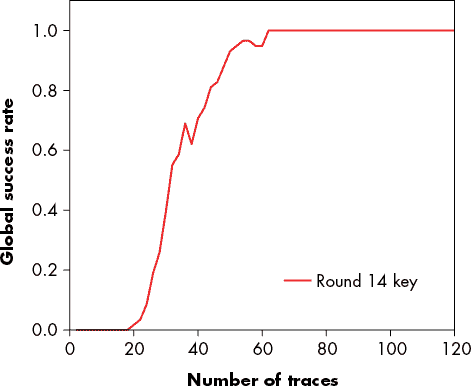

图 11-1：泄露的 AES-256 目标的全局成功率示例图

图 11-1 中的图表显示，如果我们从设备记录了 40 个轨迹，我们预计会在约 80% 的情况下恢复完整的加密密钥。我们可以通过多次在设备上执行该实验来简单地找到这个度量，理想情况下还应使用不同的加密密钥，以防某些密钥值比其他密钥产生更多泄漏。

除了使用 GSR，我们还可以绘制*部分成功率*。这里的*部分*意味着我们将 AES-128 密钥中的每一个字节独立地考虑，而不考虑其他字节，这样就得到了 16 个值，每个值代表在给定数量的轨迹下，恢复某一个字节的正确值的概率。

全局成功率可能会产生误导，因为在某些特定实现中，可能有一个密钥字节不会泄露。因此，GSR 将始终为零，因为整个加密密钥永远无法恢复，但部分成功率的图表将揭示是否只有 16 个字节中的一个无法恢复。然后，我们可以在 1 秒钟内对最后一个字节进行暴力破解，而零 GSR 并未揭示恢复密钥的真实概率。

### 基于熵的度量

基于熵的度量基于这样一个原理：我们可以通过一些猜测来恢复密钥。没有任何先验知识的情况下，恢复原始的 AES-128 密钥平均需要 0.5 × 2¹²⁸ 次猜测。这个数字如此之大，在暴力破解密钥的集群被熔化和/或被太阳吞噬成红巨星之前（大约 50 亿年后），密钥是无法计算出来的。

辅助通道分析攻击的结果提供的信息比简单的“密钥是 XYZ”或“未找到密钥”要多。事实上，每一个密钥猜测都有一个与之相关的置信度——即相对于某一分析方法，猜测该密钥正确的置信度。在 CPA 中，这个置信度值是该特定密钥猜测的相关性的绝对值。因此，针对 AES-128 密钥的某一个字节进行 CPA 攻击的结果是一个带有置信度水平的密钥猜测排名列表，最佳猜测排在最上面，最差的猜测排在最底部。

假设我们使用功率分析攻击，知道实际的密钥字节在每个列表的前三名中。那么，针对密钥的总共需要进行 3¹⁶次猜测，约为 4300 万次，因此它可以很容易地在智能手机上完成。因此，我们已经减少了熵。原始密钥是随机的一组比特，但我们现在对某些比特的最可能状态有了一些信息，并可以利用这些信息加速暴力破解攻击。

最简单的图形表示方式是*部分猜测熵（PGE）*。PGE 提问如下问题：在用一定数量的跟踪进行攻击后，有多少个关键猜测被错误地排名为比正确的关键值更可能？如果你对每个字节进行关键猜测，你将为每个字节的密钥得到一个 PGE 值；对于 AES-128，你将得到 16 个 PGE 图。PGE 提供了关于侧信道攻击减少的密钥搜索空间的信息。图 11-2 展示了这样的图形示例。

图 11-2 中的图形还将所有 16 个 PGE 图平均，以得到攻击的平均 PGE。部分猜测熵可能会有些误导，因为我们可能没有理想的方式来结合所有密钥的猜测。例如，如果对于一个密钥字节，正确的值排名第一，而对于第二个密钥字节排名第三，我们仍然需要做出最坏情况下的假设，并对所有前三个候选值进行暴力破解。然而，如果 PGE 在所有字节中不均匀分布，进行这样的暴力破解攻击很快会变得不可能。

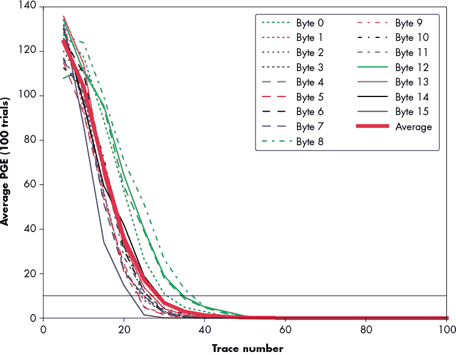

图 11-2：部分猜测熵

存在理想的算法来结合攻击的输出，它们可以用来生成真正的总猜测熵（参见 Nicholas Veyrat-Charvillon, Benoît Gérard, François-Xavier Standaert 的《超越计算能力的安全评估》）。总猜测熵提供了关于通过运行攻击算法减少密钥猜测空间的详细信息。

### 相关性峰值进展

另一种格式是绘制每个关键猜测在多个跟踪中的相关性。此方法旨在展示相关性峰值随时间的变化过程；参见图 11-3 作为示例。它显示了每个关键猜测在我们增加跟踪数量时的相关性峰值。对于错误的关键猜测，这个相关性将趋向于零，而对于正确的关键猜测，它将趋向于实际的泄漏水平。

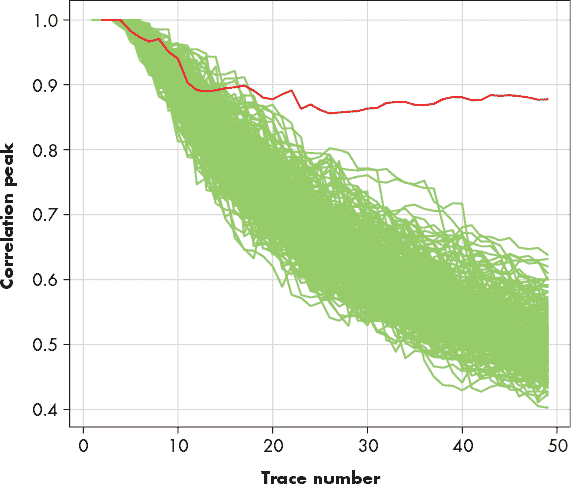

图 11-3：相关性峰值与跟踪数量的图表展示了正确的猜测。

该图去除了关于最大相关峰值发生时刻的信息，但现在显示了该峰值如何从“错误猜测”中区分开来。正确峰值交叉所有错误猜测的点被认为是算法被破解的地方。将相关输出与轨迹编号进行对比，显示了正确的密钥猜测如何从错误猜测的噪声中慢慢脱颖而出。

图 11-3 中显示的图表的一个优点是它表示了错误猜测和正确猜测之间的差距。如果这个差距很大，你可以更有信心地认为攻击通常会成功。

### 相关峰值高度

目前为止描述的成功度量提供了一个关于你距离密钥提取有多近的概念，但它们对于调试你的设置或跟踪处理方法帮助不大。对于这些任务，有一个简单的方法：查看攻击算法的输出轨迹，例如 CPA 的相关轨迹（或者稍后我们讨论的 TVLA 的 t-轨迹）。这些输出轨迹是改进你的设置或处理的主要方式之一。

你所绘制的图，例如图 11-4，会将所有错误的密钥猜测的相关轨迹用一种颜色表示，而正确的密钥猜测用另一种颜色突出显示。

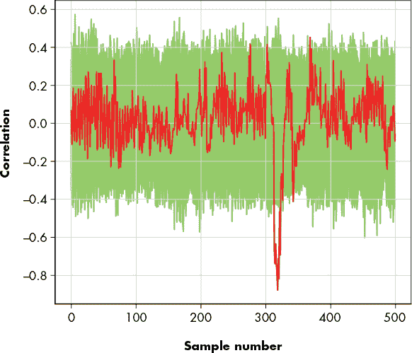

图 11-4：攻击算法的原始输出图

图 11-4 显示了正确的密钥猜测具有最大的相关峰值，并提供了该峰值的时间索引。此图展示了相关性与时间的关系，其中正确的密钥猜测在图中以深灰色突出显示，错误的猜测则是浅灰色。将此图与功率轨迹叠加，可以有效地可视化泄漏发生的位置。

这种类型的绘图在优化设置时非常有用。只需在更改一个采集参数或处理步骤之前和之后计算图表。如果峰值变得更强，说明你的侧信道攻击得到了改进；如果峰值减弱，说明情况变得更糟。

## 真实设备上的测量

当你准备测量一个真实设备——而不是一个为侧信道分析设计的简单实验平台时——你需要做一些额外的考虑。本节简要概述了这些考虑事项。

### 设备操作

攻击真实设备的第一步是操作它。执行此操作的要求取决于你所进行的攻击，但我们可以为你提供一些关于运行加密操作和选择要发送的输入的总体指导和提示。

#### 启动加密

真实设备可能没有提供“加密此块”功能。在侧信道分析攻击中，部分工作是确定如何攻击此类设备。例如，如果我们正在攻击一个在解密固件之前进行认证的引导加载程序，我们不能仅仅发送随机输入数据来解密。然而，对于功率分析，通常仅知道密文或明文就足够了。在这种情况下，我们可以直接提供原始固件镜像，这样它就会通过真实性检查，然后被解密。由于我们知道固件的密文，我们仍然可以进行功率攻击。

类似地，许多设备将具有基于挑战-响应的认证功能。这些功能通常要求你通过加密一个随机的 nonce 值来进行响应。设备也会单独加密这个 nonce。现在，设备可以验证你发送的响应是否被正确加密，从而证明你与设备共享相同的密钥。如果你向设备发送一个随机的垃圾值，认证检查最终会失败。然而，这种失败并不重要；我们已经在加密过程中捕获了设备的 nonce 和功率信号。如果我们收集到一组这些信号，它可以为我们提供足够的信息来进行功率分析攻击。正确的实现通常会包括速率限制或固定尝试次数来避免此类攻击。

处理设备通信时的另一个问题是时序捕获。正如之前所示，我们不关心找出加密发生的确切时刻，因为 CPA 攻击会为我们揭示这个时刻（假设对齐，但我们稍后会讨论）。我们确实需要接近正确时序（例如，通过在发送加密块的最后一个数据包时触发示波器）。我们不知道加密发生的确切时刻，但我们知道，它必须发生在发送该数据块和设备返回响应消息之间的某个时刻。

基于嗅探 I/O 线路的触发将会更困难。通常最简单的方法是实现一个自定义设备，监控 I/O 线路上的相关活动。你可以简单地编程一个微控制器，读取所有正在发送的数据，并在检测到期望的字节时将 I/O 引脚置高，从而触发示波器。

启动和捕获操作主要是一个工程难题，但重要的是要尽可能保持其稳定性并避免抖动。抖动的时序行为会导致时序噪声和其他后续问题，这可能会使得之后无法对跟踪进行适当的分析。

#### 重复和分离操作

另一个记忆技巧是，如果你能对目标进行程序控制，那么在单次跟踪中获取多个操作会更有帮助。你可以通过将目标操作在一次跟踪中被调用的次数作为协议中的输入变量来实现这一点。最简单的技巧是将一个循环包裹在对目标本身操作的调用周围。在某些情况下，你可以通过让它在更低的层级进行循环，例如，给 AES-ECB 加密引擎一个需要加密的大量数据块。

现在，如果你在增加目标操作调用次数的同时进行采集（例如，每次跟踪时调用次数加倍），你很快就会看到加密操作所在的区域扩展。这是因为，尽管单个加密操作可能是一个不可见的波动，但你执行的操作越多，它们所需的时间就越长。到某个点时，它们会在你的跟踪中变得可见。然后，你可以轻松地确定操作的时间点，并计算单个操作的平均持续时间。

你还可以尝试在操作之间使用一个可变延迟循环（或者空操作滑动；*nop*表示无操作，实际上让处理器在特定时间内什么也不做）。一旦前面的技巧向你展示了时间信息，你可以利用这些信息将单独的操作调用分开，这实际上有助于检测泄露，因为一个操作的泄露不会渗透到后续操作中。

#### 从随机输入到选择性输入

到目前为止，我们一直在将完全随机的数据输入到加密算法中，这为 CPA 计算提供了良好的属性。一些特定的攻击需要选择性输入，比如对 AES 的某些攻击（请参见 Kai Schramm、Gregor Leander、Patrick Felke 和 Christof Paar 的《AES 的碰撞攻击：结合侧信道攻击与差分攻击》）或使用 Welch 的 t 检验的中间轮次变体的测试向量泄漏评估（更多细节请参见本章稍后的“测试向量泄漏评估”部分）。

不深入探讨其原因（稍后会讨论），你可以在跟踪采集过程中创建不同的集合，例如与常数或随机输入数据相关的测量，以及各种精心选择的输入。

你将对这些数据集进行各种统计分析，因此至关重要的是，你的数据集之间唯一的统计学差异应当是由输入数据的差异造成的。实际上，运行超过几小时的跟踪获取活动可能会在某些情况下出现可检测的变化，例如平均功率水平的变化（见本章稍后的“分析技术”部分）。如果你在第 0 分钟测量了 A 集，而在第 60 分钟测量了 B 集，那么你的统计数据肯定会显示这两个数据集之间的功率差异。这些功率差异可能看起来不显著，直到你发现怀疑的泄漏实际上是因为你的空调在第 59 分钟启动并冷却了目标设备，而不是因为目标设备存在泄漏。当你对多个数据集进行统计分析时，必须确保这些数据集之间的差异仅仅是由于输入数据造成的。这意味着，对于每个你测量的跟踪数据，你必须随机选择要生成输入数据的数据集。你也*不*希望目标设备知道你正在为哪个数据集进行测量；目标设备只需要知道操作的数据。如果你将关于数据集的信息发送给目标设备，它将出现在你的跟踪数据中。如果你不是随机选择，而是交替选择数据集，它也会出现在你的跟踪数据中。这些无关的相关性非常难以调试，因为它们会表现为（错误的）泄漏，因此你应该努力避免它们。你是在检测极小的功率变化，而基于跟踪数据集运行的目标设备的开关语句将会掩盖任何有趣的泄漏。

### 测量探头

要执行侧信道攻击，你需要测量设备的功耗。在攻击你自己设计的目标板时，进行这种测量非常简单，但在真实设备上则需要更多的创意。我们将讨论两种主要方法：使用物理分流电阻和使用电磁探头。

#### 插入分流电阻

如果尝试在“标准”电路板上测量功率，你需要对电路板进行一些修改，以便进行功耗测量。不同的电路板会有所不同，但例如，图 11-5 展示了如何通过抬起薄型四方扁平封装（TQFP）引脚，插入表面贴装电阻。

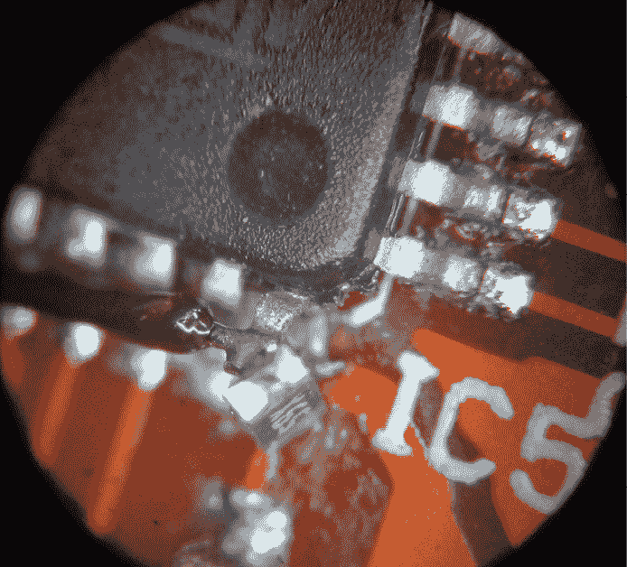

图 11-5：在 TQFP 封装的引脚中插入电阻

然后你需要将示波器探头连接到电阻的任一侧，这样你就可以测量电阻上的电压降，从而得出特定电压网的电流消耗。

#### 电磁探头

一个更先进的替代方法是使用电磁探头（也叫做 H 场探头、近场探头或磁场探头），它可以放置在感兴趣区域的上方或附近。由此进行的分析称为*电磁分析（EMA）*。EMA 不需要对被攻击设备进行任何修改，因为探头只需直接放置在芯片上方或芯片周围的去耦电容器上方。这些探头通常以*近场探头套件*的形式出售，通常包括一个放大器。

这种方法有效的原理很简单。高中物理教我们，电流通过导线时，会在导线周围产生磁场。右手定则告诉我们，如果我们将导线握住，拇指指向电流方向，那么磁场线会沿着我们的手指方向围绕导线旋转。现在，芯片内部的任何活动实际上就是电流的开关。我们不是直接测量开关电流，而是探测它周围的开关磁场。这个原理基于这样一个事实：开关磁场会在导线中感应出电流。我们可以用示波器来测量这根导线，从而间接地反映出芯片中的开关活动。

#### 自制电磁探头

作为购买探头的替代方法，你可以自己制作一个简单的探头。自己动手制作电磁探头是全家都能享受的乐趣，前提是全家人喜欢使用尖锐物品、焊接工具和化学品。除了探头外，你还需要制作一个低噪声放大器，用来增强示波器或其他设备测量到的信号强度。

探头本身由一段半柔性同轴电缆构成。你可以从各种来源购买这类电缆（例如 Digi-Key，eBay），查找“SMA 到 SMA 电缆”，比如 Crystek 部件号 CCSMA-MM-086-8，可以在 Digi-Key 以大约 10 美元的价格购买。将这根电缆剪成两段后，你就得到了两根半柔性电缆，每根电缆一端有一个 SMA 连接器（其中一个在图 11-6 中显示）。

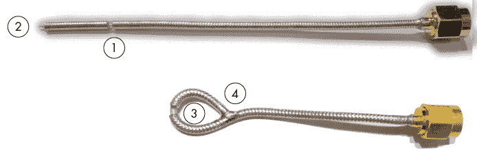

图 11-6：用半柔性 SMA 电缆自制的电磁探头

在整个外部屏蔽上切一个槽 1。将末端剥去几毫米 2。轻轻将其圆成一个圆圈 3，用钳子夹住槽口，以防内部导线弯曲。完成基本探头时，将圆圈焊接闭合 4，确保内部导线包含在外部屏蔽之间的焊接连接中。

由于外部屏蔽是导电的，你可能需要给表面涂上一层非导电材料，比如像 Plasti Dip 这样的橡胶涂层，或者用自粘胶带将其包裹起来。

在这个探头的狭缝处拾取到的信号将会非常微弱，因此你需要一个放大器才能在示波器上看到任何信号。你可以使用一个简单的集成电路（IC）作为低噪声放大器的基础。它需要一个干净的 3.3 V 电源，因此建议将电压调节器也设计到电路板上。如果你的示波器灵敏度不够，甚至可能需要将两个放大器串联以获得足够的增益。图 11-7 展示了一个围绕着$0.50 集成电路（型号 BGA2801,115）构建的简单放大器示例。

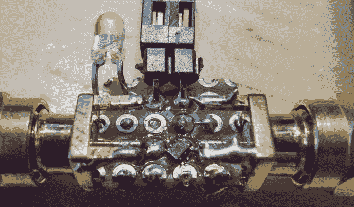

图 11-7：电磁探头简单放大器

如果你想自己构建放大器，请参考图 11-8 的原理图。

侧信道测量的选择可能会显著影响信号和噪声特性。直接测量芯片所消耗的电力通常噪声较低，相比之下，例如电磁测量、声学侧信道（参见 Daniel Genkin、Adi Shamir 和 Eran Tromer 的《RSA 密钥提取：低带宽声学密码分析》），或者机箱电位的测量（参见 Daniel Genkin、Itamar Pipman 和 Eran Tromer 的《离我笔记本远点：PC 上的物理侧信道密钥提取攻击》）通常噪声较高。然而，直接的功率测量意味着你测量的是所有的功耗，包括那些你不感兴趣的过程所消耗的电力。在片上系统（SoC）中，如果你的探头精确地定位在泄漏的物理位置，电磁测量可能会得到更好的信号。你可能会遇到一些反制措施，它们可以最小化直接功率测量中的泄漏，但在电磁测量中没有限制，反之亦然。作为经验法则，在复杂的芯片和 SoC 上，先尝试电磁测量，在较小的微控制器上，先尝试功率测量。

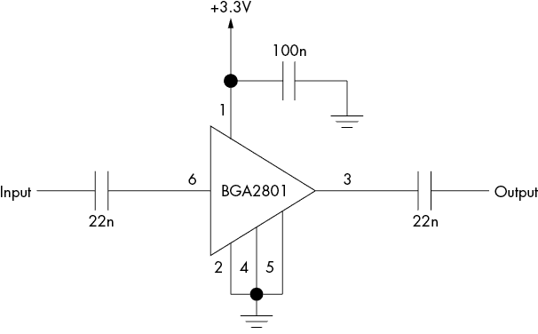

图 11-8：电磁探头简单放大器原理图

### 确定敏感网

无论使用电阻分流器还是电磁探头，我们都必须确定需要测量设备的哪一部分。目标是测量执行敏感操作的逻辑电路的功耗——无论是硬件外设还是执行软件程序的通用核心。

在电阻分流的情况下，这意味着需要查看集成电路的电源引脚。这里你需要在为内部核心供电的引脚之一上进行测量，而不是那些为 I/O 引脚驱动器供电的引脚。小型微控制器可能有一个单独的电源供电给微控制器的所有部分。即便是这些简单的微控制器，也可能有多个名称相同的电源引脚，因此选择一个最容易接触到的引脚。一定要避免选择专门供给模拟部分的电源，比如模拟到数字转换器的电源，因为这些电源可能不会为你感兴趣的组件供电。

更先进的设备可能会有四个或更多电源供应。例如，存储器、CPU、时钟发生器和模拟部分可以都是单独的供应。再次强调，您可能需要进行一些实验，但几乎可以肯定，您想要的供应将是名称中带有 *CPU* 或 *CORE* 的供应之一。您可以使用在第三章中帮助您挖掘的数据来识别最有可能的目标。

如果使用 EM 探针瞄准设备，您需要进行实验以确定探针的正确方向和位置。值得注意的是，将探针放置在围绕目标的去耦合电容器附近是有益的，因为高电流通常会流经这些部件。在这种情况下，您需要确定哪些去耦合电容器与设备的核心组件相关，类似于确定要瞄准哪个电源供应的方法。

在目标运行加密同时在屏幕上显示实时迹线捕获可以提供启发。随着探针的移动，您将看到捕获的迹线变化剧烈。一个经验法则是在加密阶段之前和之后找到一个场强较弱的地方，并且在执行加密过程时场强较强。同时显示一个“拥抱”操作的触发器也有帮助。手动移动探针以快速了解芯片各个部分的泄漏也是有好处的。

### 自动探针扫描

将探针安装在 XY 平台上，并在芯片的各个位置自动捕获迹线，可以更精确地定位感兴趣的区域。 图 11-9 展示了一个示例设置。

您可以使用 TVLA 来获得另一种很好的可视化效果，如本章后面“测试向量泄漏评估”部分所述。TVLA 测量泄漏而不进行 CPA 攻击，因此如果可视化 TVLA 结果，您将看到芯片区域的实际泄漏图。不利之处在于，为了计算 TVLA 值，您需要对每个芯片位置进行两套完整的测量集，这显著增加了您的迹线采集活动的时间。

探测更多的点增加了找到 *正确* 位置的机会，但降低了效率。在可视化中给出更连续数据梯度的空间分辨率进行扫描，以确保 XY 扫描步长小于探针的敏感区域。

当与本章后面描述的“用于可视化的过滤”部分结合使用时，扫描尤其引人关注。如果您知道目标操作的泄漏频率，您可以将该频率下的信号强度作为芯片上位置的函数进行可视化。这导致了如 图 11-10 所示的漏泄强度 XY 扫描可视化图，显示了 31 至 34 MHz 频段上芯片不同区域的漏泄强度。这些图像可以帮助定位感兴趣的区域，并且只需每个位置进行一次迹线测量即可完成。

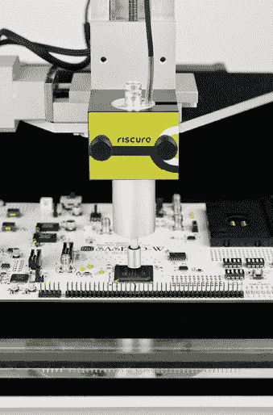

图 11-9：Riscure 电磁探针安装在 XY 平台上的示例

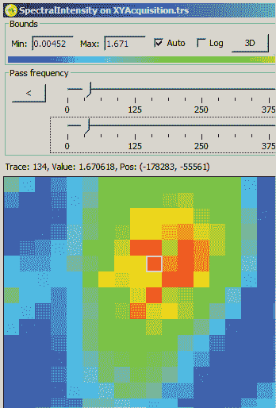

图 11-10：芯片泄漏区域的 XY 扫描可视化

### 示波器设置

示波器是捕捉和展示来自磁性探针的泄漏信号的理想工具。你必须仔细设置示波器，以获取良好的信息。我们在第二章中讨论了示波器可用的各种输入类型，并提供了一些关于避免使用可能在非常小的信号上引入大量噪声的探头的一般建议。为了进一步减少噪声，通常需要对示波器的输入进行某种放大，以增强信号。

你可以使用*差分放大器*来做到这一点，它只放大两个信号点之间的*差异*。除了增强信号外，差分放大器还去除了两个信号点上存在的噪声（称为*共模*噪声）。在现实中，这意味着电源产生的噪声会被大部分去除，只留下你在测量电阻器上测得的电压变化。

示波器制造商出售商用*差分探头*，但它们通常非常昂贵。作为替代方案，你可以简单地使用商用运算放大器（或*运算放大器*）构建一个差分放大器。差分探头可以测量跨电阻器的功耗，以减少噪声的贡献。一个开放源代码设计作为 ChipWhisperer 项目的一部分提供，其中使用了 Analog Devices AD8129。 图 11-11 是该探头在物理设备上的使用照片。

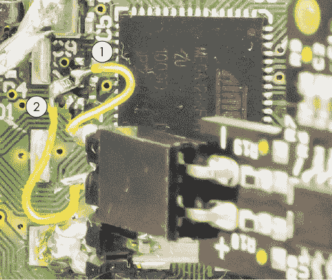

图 11-11：差分探头在目标板上的使用

在图 11-11 中，差分探头有正极（+）和负极（–）引脚。这些引脚标记在黑色探头 PCB 的右下角。线缆 2 和 1 分别将正极和负极引脚连接到安装在目标 PCB 上的分流电阻的两侧。由于流入分流电阻的电力带有噪声，因此在这个例子中使用差分探头，我们希望去除这种共模噪声。

差分探头的电路图如图 11-12 所示，如果你对其连接细节感兴趣，可以参考此图。

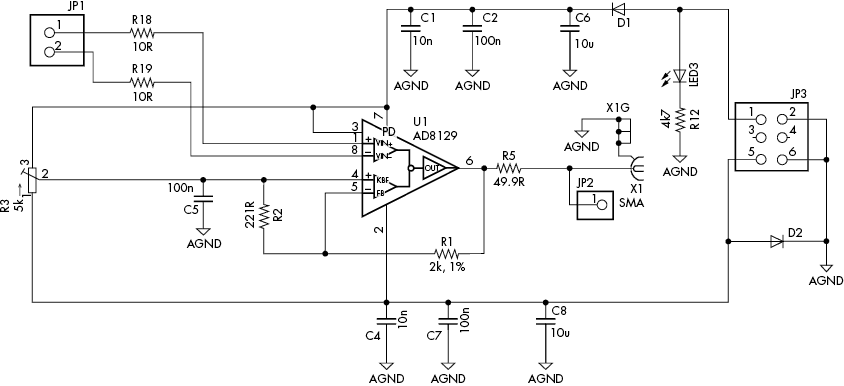

图 11-12：差分探头电路图

#### 采样率

到目前为止，我们假设你已经神奇地将测量数据读取到了计算机中。前几章简要解释了在设置示波器时，你需要选择一个合适的采样率。该采样率的上限取决于你为示波器支付了多少钱；如果你有足够的资金，你可以购买 100 GS/s（每秒 10 亿次采样）或更快的设备。

更多的采样不一定更好。较长的波形意味着需要大量存储空间和更长的处理时间。你可能希望以非常高的速率进行采样，然后在存储数据时进行*下采样*（即对连续采样进行平均），这将显著改善你的波形。首先，下采样实际上会虚拟增加示波器的量化分辨率。如果你的示波器有一个以 100 MHz 运行的 8 位 ADC，并且你对每两个样本进行平均，那么你实际上拥有的是一个以 50 MHz 运行的 9 位示波器。这是因为，如果一个样本值为 55，另一个样本值为 56，它们的平均值为 55.5。引入这些“半”值实际上增加了 1 位分辨率。或者，你可以对四个连续样本进行平均，以获得一个有效的 10 位示波器，运行在 25 MHz。

其次，快速采样可以减少测量中的时间抖动。触发事件发生在采样周期的某个时刻，示波器只有在下一个采样周期开始时才开始测量。触发事件与示波器采样时钟的异步性意味着触发事件和下一个采样周期之间存在抖动。这种抖动表现为波形对齐错误。

假设示波器以较慢的速率进行采样，如 25 MS/s，这意味着每 40ns 采样一次。每当触发事件发生时（即加密开始时），你会有一些延迟，直到下一个采样开始。这个延迟平均为 20ns（采样周期的一半），因为示波器的时间基准与目标设备的时间基准完全独立。

如果你以更快的速率进行采样（比如 1 GS/s），从触发到第一个采样开始的延迟将只有 0.5ns，或者说提高了 40 倍！一旦记录了数据，你就可以进行下采样以减少内存需求。所得波形将具有与在 25 MS/s 下进行捕获时相同的点数，但现在抖动不超过 0.5ns，从而显著改善侧信道攻击的结果（参见 Colin O'Flynn 和 Zhizhang Chen 的《内部振荡器的同步采样与时钟恢复用于侧信道分析与故障注入》）。

从*数字信号处理（DSP）*的角度来看，真正的下采样使用滤波器，并且任何内置在你选择的编程语言的 DSP 框架中的下采样程序都应该支持这一点。然而，实际上，通过平均连续点进行下采样，或者仅保留每 40 个样本点，往往会保持可利用的泄漏。

一些示波器可以为你执行此操作；某些 PicoScope 设备具有硬件执行的下采样选项。请查阅示波器的详细编程手册，以查看是否存在此选项。

最后，你可以使用与设备时钟同步捕获的硬件。在附录 A 中，我们描述了专门设计用于执行此任务的 ChipWhisperer 硬件。一些示波器具有*参考输入*功能，通常允许输入最多 10 MHz 的同步参考信号。这个功能在现实生活中并不太有用，因为这意味着你必须将设备从一个 10 MHz 的时钟源（与示波器的同步参考信号相同）供电，以实现同步采样能力。

## 跟踪集分析与处理

到目前为止的假设是，你记录了功率跟踪并进行分析算法。实际上，你将包含一个中间步骤：预处理跟踪数据，这意味着在将数据传递给分析算法（如 CPA）之前，进行一些处理操作。所有这些步骤的目的是减少噪声，和/或提高泄漏信号的强度。此时，你的测量设置和 CPA 脚本应该是*一劳永逸*的。跟踪处理主要是一个试验和错误的过程，需要通过实验找到最适合你目标的方式。在本节中，我们假设你已经完成了一组跟踪数据的测量，但还没有开始进行 CPA 分析。

你可能使用的四种主要预处理技术包括*归一化/丢弃*、*重新同步*、*过滤*和*压缩*（请参见本章后面的“处理技术”部分）。为了确定你的预处理步骤是否真正有效，我们首先描述一些分析技术，例如计算*平均值*和*标准差*、*过滤*（是的，又来了）、*谱分析*、*中间相关*、*已知密钥 CPA*和*TVLA*（按你应用它们的典型顺序列出）。你不一定需要全部使用它们，当你在一个简单的、完全可控的泄漏实验平台上进行分析时，可能可以完全忽略其中的大部分。这些技术都是*标准*的数字信号处理（DSP）工具，应用于功率分析的上下文中。可以参考 DSP 文献，寻找更先进的技术灵感。

随着你从实验平台过渡到在非理想情况下进行的实际测量，分析技巧变得更加宝贵。你将使用预处理技术，然后通过分析技巧检查其结果。如果你知道密钥，你可以通过已知密钥的 CPA 或 TVLA 来检查你的攻击是否有所改进。如果你不知道密钥，你需要不断尝试，直到认为自己准备好进行 CPA。如果成功了，太好了；如果没有，你将不得不回溯每一步，弄清楚是否应该尝试其他方法。不幸的是，这不是一门精确的科学，但这里描述的分析技术可以为你提供一些起点。

### 分析技术

本节描述了一些标准分析技术，这些技术提供了一个衡量信号是否足够好以进行 CPA 的指标。在 CPA 中，你使用不同的输入数据进行了测量。接下来的许多可视化图应首先使用相同的操作和相同的数据执行，之后随着接近 CPA 攻击时，你可以使用不同的信息。

#### 每个追踪的数据采集活动中的平均值和标准偏差

假设你将每个追踪表示为一个单一的点——即该追踪中所有样本的平均值。回想一下 *t*[*d,j*]，其中 *j* = 0,1,…,*T* - 1 是追踪中的时间索引，*d* = 0,1,…,*D* - 1 是追踪编号。你的计算公式是

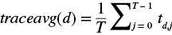

绘制所有这些点展示了随着时间推移，平均值的变化，并可以帮助你发现追踪采集活动中的异常；例如，参见图 11-13。

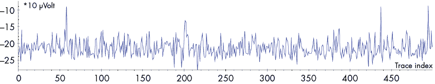

图 11-13：每个追踪的所有样本的平均值，显示追踪 58、437 和 494 为异常值

一种异常类型是漂移的平均值——例如，由于温度变化（是的，你会看到空调启动）或由于某个完全的异常值，可能是由于错过了触发。你要么修正这些追踪，要么直接丢弃它们。（有关如何处理这些信息的详细内容，请参见本章稍后的“标准化追踪”部分。）标准偏差将为同一采集活动提供不同的视角。我们建议同时计算它们，因为计算开销微不足道。

#### 每个操作的平均值和标准偏差（按样本）

计算平均值的另一种方法是按样本计算：

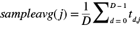

这个平均值有助于更清晰地展示你所捕获的操作的实际样子，因为它减少了幅度噪声。图 11-14 展示了上图中的原始追踪和下图中的样本平均追踪。

样本平均追踪使得过程步骤更加明显。然而，随着时间噪声的增加，它的有用性会下降。轻微的错位通常对可视化没有影响，因为你仅失去高频信号，但追踪错位越严重，你能看到的最高频率就越低。如果你的泄漏信号仅在高频部分，轻微的错位可能会对 CPA 产生不利影响。你可以通过观察更高频内容来利用平均值直观判断错位情况。

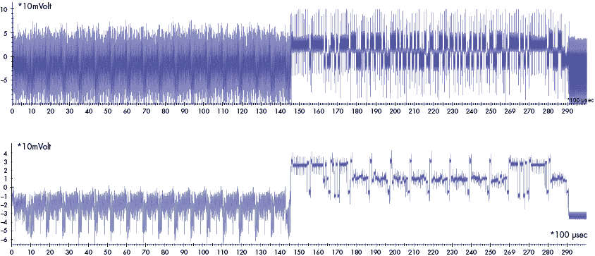

图 11-14：原始追踪（上）和样本平均追踪（下）

另一种有效的方法是计算每个样本的标准差。作为经验法则，标准差越低，错位越少，如图 11-15 所示。在这个例子中，300 到 460 个样本之间的时间具有较低的标准差，表明错位很小。

即使是完全对齐的轨迹，使用相同的操作，平均值和标准差仍然可能显示差异，这是由于数据差异引起的，因此表明数据泄漏。

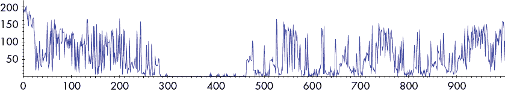

图 11-15：轨迹集的标准差

#### 可视化滤波

频率滤波可以作为生成轨迹数据可视化表示的一种方法。你可以大幅度地取消某些频率（通常是高频），以便更好地观察正在执行的操作，而无需对整个轨迹集计算平均值。通过对样本进行滑动平均，可以实现一个简单的低通滤波器（见图 11-16）。低通滤波器是清理轨迹数据可视化表示的快速方法。

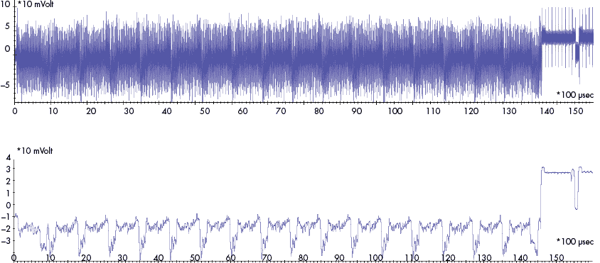

图 11-16：原始轨迹（上）和低通滤波后的轨迹（下）

你也可以使用更精确且计算复杂的滤波器（见本章后面的“频率滤波”部分），但这样做对于可视化目的可能是过度的。这个可视化步骤仅仅是为了提供一个了解噪声下发生了什么的概念；它不是一个预处理步骤，因为你可能会同时去除泄漏信号。一个例外是一些简单的功率分析攻击：对 RSA 中的平方/乘法等依赖于密钥的操作进行可视化，可以破解私钥！

#### 频谱分析

在时间域中你看不见的东西，可能在频率域中会可见。如果你不知道频率域是什么意思，可以考虑音乐和声音。如果你录制音乐，它捕捉的是时间域的信息：声音波通过时间产生的气压。但当你听音乐时，你听到的是频率域：不同音高的声音随时间的变化。

两种可视化通常非常有用：*平均频谱*，这是没有时间表示的“纯”频率域，和*平均频谱图*，它是频率和时间信息的结合。频谱显示了单个轨迹中每个频率的幅度，是一维信号。它通过计算轨迹的快速傅里叶变换（FFT）获得。频谱图显示了单个轨迹中所有频率随时间的变化。因为它增加了时间维度，所以它是二维信号。它通过对轨迹的小块进行 FFT 计算得出。

平均频谱和平均频谱图表示的是整个追踪集中的信号的平均值。当我们说查看平均值时，意思是我们首先计算每个单独追踪的信号，然后按每个样本将它们求平均。

图 11-17 所示的芯片频谱大约有 35 MHz 的时钟，可以从每 35 MHz 的频率峰值中看到。每 17.5 MHz 会有较小的峰值，表明存在重复的过程需要两个时钟周期。

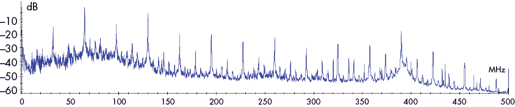

图 11-17：整个追踪集的平均频谱

你可以进行一些有趣的分析。每 35 MHz 的频率峰值是由 35 MHz 方波的*谐波*引起的；换句话说，它们是由一个在 35 MHz 频率上开关的数字信号引起的。你是否建议这就是时钟？正确。频谱可以用来识别系统中一个或多个时钟域。

如果你的目标（加密）操作与其他组件的时钟频率不同，这种分析会特别有用。当你对两个平均频谱进行差分分析时，它会变得更加有效。假设你知道追踪中的某一时间段包含目标操作，而其余部分不包含目标操作。现在你独立计算这两个部分的平均频谱，并将其中一个从另一个中减去；也就是说，你计算这两个平均值之间的差异。你将得到一个*差分频谱*，准确显示目标操作期间哪些频率更加（或更少）活跃，这可以成为频率滤波的一个很好的起点（参见本章后面的“频率滤波”部分）。

查找操作频率的另一种方法是对追踪的频域进行已知密钥 CPA 分析。已知密钥 CPA 将在本章后面的同名章节中进行解释，但简而言之，由于你知道密钥，你可以找到未知密钥 CPA 恢复密钥的接近程度。要查找操作的频率，首先使用 FFT 转换所有追踪数据，然后对转换后的追踪进行已知密钥 CPA 分析。现在你可能能够看到泄漏出现在哪些频率上。你也可以用 TVLA 做同样的操作。这些方法并不总是有效，可能需要（显著）更多的追踪数据才能得到信号。

频谱分析的一个好处是它相对独立于时序，因此也不容易受到对齐错误的影响，因为我们并不关心信号的相位分量。你可以在频谱上进行 CPA，而不需要对追踪数据进行重新同步，尽管效率取决于泄漏的类型（参见 O. Schimmel 等人于 2010 年在 COSADE 大会上发表的“频域中的相关功率分析”）。

含有时序信息的频谱图也可以帮助你识别*有趣*的事件。如果你知道目标操作的开始时间，你可能能看到某些频率的出现或消失。或者，如果你不知道目标操作的开始时间，注意频率模式变化的时间点也可能会有所帮助。参见图 11-18，在该图中，整个频谱在例如 5ms 和 57ms 时刻明显发生了变化。

信号频率特性的变化可能是由于加密引擎的启动。与频谱分析不同，你现在正在查看基于时间的信息，因此这种频谱图方法对时序噪声更为敏感。

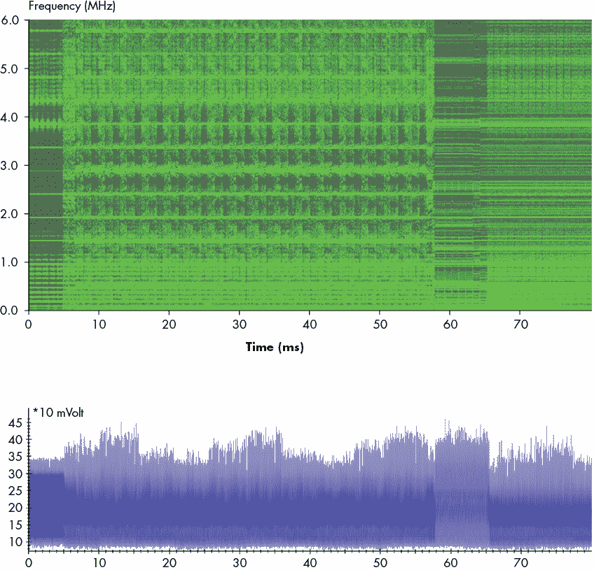

图 11-18：加密操作的频谱图（上图）和原始追踪（下图）

#### 中间关联

现在你知道，你可以使用 CPA（相关功率分析）通过计算每个密钥假设的相关追踪来确定密钥。你还可以将相关追踪用于其他目的：例如，检测目标正在处理的其他数据值，例如明文或密文在某个操作中被使用。在本节中，我们假设你已经知道了要关联的数据值，因此不需要进行假设测试。最直接且有趣的候选数据值是由密码算法消耗和产生的明文和密文。通过已知的数据值和泄漏模型，你可以关联追踪并找出这些数据值是否以及何时泄漏。

假设你有一个 AES 加密算法，你知道每次执行时的明文，并且知道它泄漏了 8 位值的海明重量（HW）。现在，你可以将每个明文字节的 HW 与测量值进行关联，看看算法何时消耗它们；这也被称为*输入关联*。根据你的追踪采集窗口，你可能会看到很多关联时刻：每次总线传输、缓冲区复制或明文的其他处理操作都可能引起一个尖峰。然而，这些尖峰中的一个可能就是第一个`AddRoundKey`的实际输入，之后你可能会想要攻击替代操作。

另一个技巧是计算与密文的相关性；这也被称为*输出关联*。尽管明文尖峰理论上可以出现在整个追踪过程中，密文尖峰*仅在加密操作完成后才会出现*。因此，密文的第一个尖峰表明加密操作必须在该尖峰之前发生。一个好的经验法则是在第一个密文尖峰和紧接其前的明文尖峰之间寻找加密操作。

在密文相关性中观察到波动是一个好现象。这表明你拥有足够的轨迹、微不足道的对齐误差，并且泄露模型能够捕捉到密文。当然，如果没有看到波动，意味着你需要修正上述任何问题，而你可能不一定知道是哪一个。这个方法通常是通过反复试错进行的。请注意，使用 CPA 时，你攻击的是加密中间值，而不是明文或密文。因此，与明文或密文的相关性仅表明你的处理是正确的；实际的加密中间值可能需要稍微不同的对齐方式、不同的滤波器，或者更多的轨迹。  

如果你知道加密执行的密钥，最终你可以使用的相关性技巧是*中间* *相关性*。如果你知道密钥、密文或明文，并且了解加密实现的类型，你可以计算加密算法的所有中间状态。例如，你可以在 AES 的每一轮中，针对`MixColumns`的每个 8 位输出的硬件权重（HW）进行相关性分析。通过这种方式，你应该会看到每一轮有 16 个波动，这些波动彼此之间稍微有些延迟。这个思路可以扩展到对整个 128 位 AES 轮状态的硬件权重进行相关性分析，这适用于 AES 的并行实现。  

你也可以利用这个技巧对泄露模型进行暴力破解——例如，既计算硬件权重（HW），又计算汉明距离（HD），然后观察哪一个出现的波动最大。缺点是你需要知道密钥，但优点是，如果你在这里看到波动，那么你就接近成功的 CPA 了。（你不能断定已经成功是因为 CPA 关注的是“正确波动”与“错误波动”的区别，而我们这里只分析了“正确波动”）。  

#### 已知密钥 CPA  

*已知密钥 CPA*技术结合了本章前面讨论的 CPA 结果和部分猜测熵原则，用来判断你是否能够成功提取密钥。你需要计算完整的 CPA，然后使用 PGE 分析（对于每个子密钥）正确的密钥候选排名与轨迹数量之间的关系。一旦你看到子密钥的排名结构性下降，你就知道你有了一些线索。  

当只有少数几个密钥的排名下降到非常低的时候，不要过于兴奋。统计数据可能会产生奇怪的结果。它们也可能随着轨迹集的增大而回升。只有当大多数密钥的排名下降并保持在低位时，你才可能找到了线索。我们也观察到相反的效果：9 个密钥字节排名为 1，而最后一个密钥却需要很长时间才能找到。同样，统计数据可能会产生奇怪的结果。只有当所有子密钥都排名较低时，你才进入了可以通过暴力破解来解决的阶段。

与中间相关性方法相比，这种方法实际上告诉你是否能够提取密钥。然而，计算复杂度要大得多；你需要计算每个密钥字节的 256 个相关值，而在中间相关性方法中只需计算一个相关值。和中间相关性一样，未能观察到峰值可能是由于轨迹不足、显著的对齐误差或不良的泄漏模型。这可能需要通过反复试验来确定。

#### 测试向量泄漏评估

*Welch 的 t 检验*是一种统计检验，用于确定两组样本是否具有相等的均值。我们将使用这个检验来回答一个简单的问题：如果你将电源轨迹分成两组，这两组是否在统计上是可区分的？也就是说，如果我们用密钥 A 执行了 100 次加密操作，再用密钥 B 执行了 100 次加密操作，电源轨迹中是否存在可检测的差异？如果在某个时间点，密钥 A 和密钥 B 的设备平均功耗不同，那么这可能表明设备正在泄漏信息。

我们将这个测试应用于每一组电源轨迹的某一时间点。结果是这两组电源轨迹在该时间点具有相同均值的概率，无论标准差如何。我们将故意创建两组轨迹，每一组的目标进程处理不同的值。如果这些值导致平均功率水平发生变化，那么我们就知道存在泄漏。有关如何获取多个轨迹集和选择输入数据的更多信息，请参阅本章前面的“轨迹集分析与处理”部分。我们必须再次强调：如果你通过运行 100 条使用密钥 A 的轨迹，接着再运行 100 条使用密钥 B 的轨迹来生成这两组轨迹，那么你的轨迹是没有用的。统计测试几乎肯定会发现它们之间的差异，因为在每组轨迹采集时，物理变化（如温度）很可能已经发生。在每条轨迹的采集前，随机决定是使用密钥 A 还是密钥 B（而非目标 PC）。问问我们怎么知道。

我们可以绘制 Welch 的*t*值随时间变化的图像，并观察到泄漏发生时的峰值，类似于相关性轨迹。Welch 的*t*值是通过以下公式计算的：

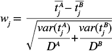

其中 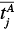 是第*j*时刻，跟踪集合*A*的平均样本值，*var()*是样本方差，*D*^(*A*)是跟踪集合*A*中的跟踪数量。*w*[*j*]的值越高，跟踪集合*A*和跟踪集合*B*在第*j*时刻由不同均值生成的可能性就越大。根据我们的经验，对于至少有几百个跟踪的跟踪集合，当*w*[*j*]的绝对值达到 10 及以上时，通常表示有泄漏，且如果*w*[*j*]达到 80 或更高，CPA 攻击可能会成功。在其他文献中，你经常会看到 4.5 这个值，根据我们的经验，这个值会导致一些假阳性。

我们将给你提供几个 AES 的样本集合，以便你能理解我们在这里追求的目标：

1.  创建一个包含随机输入数据的集合和一个包含常量输入数据的集合。其想法是，如果目标没有泄漏，尽管处理过的数据特征明显不同，加密算法内部的功率测量应该在统计上是不可区分的。注意，输入数据传输到加密引擎的功率测量可能会泄漏，本测试将能够检测到这一点。显然，输入数据的差异不是真正的泄漏，不能被利用，因此需要警惕由于“输入泄漏”而引起的假* t *峰值。

1.  创建一个集合，其中一个中间数据位***X***的值为 0，另一个集合中***X***的值为 1。当测试 AES 中的某个中间轮次的位时，例如在第 5 轮`SubBytes`或`MixColumns`操作后的 AES 状态位时，这个例子最为有用。通过此测试，不会出现类似“输入泄漏”的假阳性；AES 第 5 轮的位与 AES 的输入或输出位几乎没有相关性。如果你想测试 Hamming 距离泄漏，还可以将位*X*计算为，例如，整个 AES 轮次的输入和输出的异或。你应该使用已知密钥执行此测试，但也可以使用完全随机的输入。由于你不知道哪个位*X*实际上泄漏，你可以计算所有可能的中间位的统计数据——例如，对于第 5 轮`AddRoundKey`、`SubBytes`和`MixColumns`后的 3 × 128 位状态（`ShiftRows`不翻转位）。

1.  创建一个集合，其中中间值***Y***为***A***，另一个集合中中间值***Y***不为***A***。这是前一个思路的扩展。例如，你可以测试当`SubBytes`输出的一个字节值为 0x80 时，其功率测量是否有偏差。同样，你可以计算任何中间值*Y*和数值*A*的 t 检验，因此你可以对第 5 轮的`Substitute`输出状态进行 16 × 256 次测试。

1.  创建一个集合，其中 AES 的整个 128 位轮 ***R*** 状态恰好有 ***N*** 位被设置为 1，然后创建另一个随机集合。这个方法很巧妙。假设我们选择轮 *R* = 5，然后生成一个 128 位的状态，假设有 *N* = 16 个随机选择的比特被设置为 1。这是一个显著的偏差：在正常情况下，平均而言，64 位会被设置为 1，而且这种偏差状态的出现几乎是不可能的。然而，使用已知的密钥，我们可以计算出在该密钥下，什么明文会生成这种偏差状态。由于密码学的特性，这些明文的字节将表现得像是均匀随机的。密文也是如此。事实上，在计算 *t* 时，理论上你唯一可能检测到的偏差实际上是在轮 *R* 中，因为不应存在其他偏差（除了轮 *R* – 1 和 *R* + 1 可能有一些轻微的偏差）。因此，你不会因为明文或密文的传输而看到 *t* 峰值。由于你是在偏置整个轮状态，因此你可能会用比之前方法更少的追踪检测到泄漏；因此，这是在任何 CPA 方法能够检测到之前，检测泄漏的一个很好的起始方法。

如你所见，你可以使用 t 检验来检测各种类型的泄漏。请注意，我们没有指定明确的功率模型，这使得 t 检验比 CPA 等方法更通用，作为泄漏检测器。特别是内轮的偏置会放大泄漏。t 检验是确定泄漏时机、EM 泄漏位置，或通过调优过滤器以获得 *t* 的最高值来改善滤波器的一个极好的工具。如果你有很多不对齐的情况，一个很酷的技巧是首先做一个 FFT，然后在频域计算 *t*，以找出你的泄漏在哪个频率上。

t 检验的缺点是，你可能需要密钥，而且这些测试并不实际进行密钥提取。换句话说，你仍然需要使用 CPA 并弄清楚一个功率模型，而且你可能不会成功。就像 CPA 一样，没看到峰值意味着你可能需要改进你的追踪处理。

因为你实际上并没有恢复密钥，所以 t 检验也容易产生假阳性。这些假阳性可能是因为与密码学泄漏无关的追踪组之间存在统计差异（例如，由于没有正确地随机化你的采集活动）。此外，t 检验还会检测与从密码学核心加载或卸载数据相关的泄漏，而这些泄漏可能对攻击没有用。t 检验只是告诉你两个组是否有相同或不同的均值，而 *你* 必须正确理解这意味着什么。然而，它确实是一个非常方便的工具，用来调整你的处理技术：如果 *t* 值上升，你就走在正确的方向上。

### 处理技术

在本章前面的“分析技巧”部分，我们介绍了一些标准方法，用于衡量信号是否足够好以用于 CPA。在本节中，我们将描述一些处理轨迹集的技术。一些实用的建议：每一步后都检查结果，并且星期天检查两次。否则，很容易犯错并永久丢失泄漏信号。提前发现问题要比等到你需要调试整个处理链时再发现更高效。

#### 归一化轨迹

一旦获得了一组轨迹，计算每条轨迹的平均值和标准差总是有帮助的，正如本章前面“操作的平均值和标准差（每个样本）”部分所解释的那样。你将看到两件事：单条轨迹中的离群值会跳出“正常”范围，以及由于环境条件或采集中的错误/漏洞导致正常范围的缓慢漂移。为了提高轨迹集的质量，你需要通过只允许一定范围的平均值/标准差来剔除离群值。之后，你可以通过*归一化*轨迹来纠正漂移。一种典型的归一化策略是减去每条轨迹的平均值，并将所有样本值除以该轨迹的标准差。结果是，每条轨迹的平均样本值为 0，标准差为 1。

#### 频率滤波

在使用示波器捕获数据时，我们可以在输入端使用模拟滤波器。这些滤波器也可以通过数字计算实现：各种环境提供的库可以轻松地将轨迹通过滤波器。比如 Python 中的 scipy.signal 和 C++中的 SPUC。数字滤波器构成了大多数数字信号处理工作的基础，因此大多数编程语言都有优秀的滤波库。

在进行*频率* *滤波*时，目标是利用你感兴趣的泄漏信号或某些特定噪声源可能位于频谱的特定部分这一事实。（本章前面的“频谱分析”部分包含了如何分析频谱中的噪声或信号的描述。）

通过传递信号或屏蔽噪声，你可以提高 CPA 的有效性。你可能希望对基频信号的谐波应用相同的滤波器；例如，如果你的目标时钟频率是 4 MHz，保持 3.9–4.1、7.9–8.1、11.9–12.1 MHz 等频率可能会有所帮助。如果你的系统中有开关调节器向测量中添加噪声，你可能需要一个*高通*或*带通*滤波器来消除这种噪声。通常，*低通*滤波可以帮助减轻这些系统中的高频噪声，但在某些情况下，泄漏信号完全位于高频部分，因此高通滤波会排除成功的任何机会！换句话说，这需要一些反复试验。

对于 DPA，您很可能会使用（多重）陷波滤波器来传递或阻止基频及其谐波。*有限冲击响应（FIR）*或*无限冲击响应（IIR）*滤波器设计用于陷波滤波可能会比较复杂；您总是可以回到计算上更复杂的方式，通过进行 FFT，再通过设置幅度为 0 并进行反向 FFT 来屏蔽/传递频谱中的任意部分。

#### 重新同步

理想情况下，我们知道加密操作发生的时刻，我们会触发示波器在这个确切的时间点进行记录。不幸的是，我们可能没有如此精确的触发器，而是基于向微控制器发送的消息触发示波器。微控制器接收到消息并执行加密之间的时间间隔不是恒定的，因为它可能不会立即对消息作出反应。

这种不一致意味着我们需要重新同步多个信号轨迹。图 11-19 显示了重新同步前的三个信号轨迹（*未对齐的轨迹*），以及重新同步后的三个信号轨迹（*已对齐的轨迹*）。

上面的三个信号轨迹没有同步。通过对这三个信号轨迹执行*绝对差和（SAD）*过程，同步后的输出显示了底部的清晰轨迹。

应用 SAD 方法，您需要选取一个轨迹作为*参考轨迹*。这就是您将对齐其他所有轨迹的基准轨迹。从这个参考轨迹中，您选择一组点，通常是一些在所有轨迹中都出现的特征。最后，您尝试对每个轨迹进行偏移，使得两个轨迹之间的绝对差最小化。本章附带一个小型 Jupyter 笔记本（[`nostarch.com/hardwarehacking/`](https://nostarch.com/hardwarehacking/)），实现了 SAD 并生成了图 11-19。

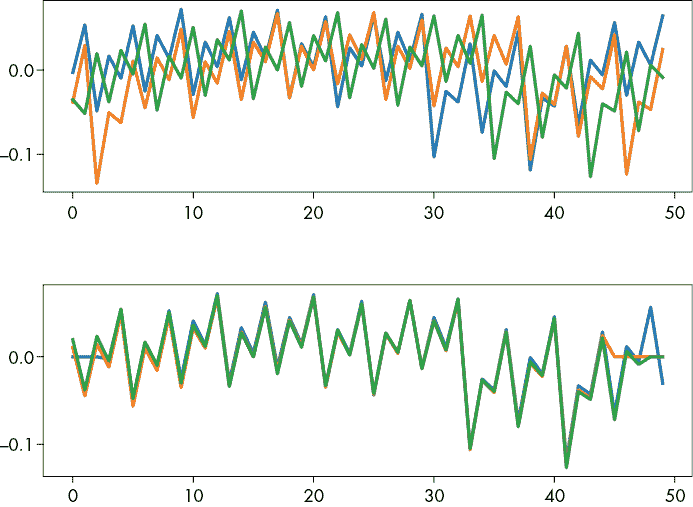

图 11-19：使用绝对差和（SAD）方法同步信号轨迹

另一种方法是使用*循环卷积定理*。两个信号之间的卷积本质上是两个信号在不同偏移量*n*下逐点相乘。使得此乘积值最小的*n*值是这两个信号的“最佳匹配”偏移量。直接计算非常昂贵。幸运的是，您可以通过对两个信号执行 FFT，对信号逐点相乘，然后进行反向 FFT 来获得卷积。此过程将为您提供每个偏移量*n*下两个信号之间的卷积结果，然后您只需要扫描最小值。

其他几个简单的重新同步模块可以在 ChipWhisperer 软件中找到。重新同步可能比仅仅应用静态偏移要更复杂。你可能需要在时间上扭曲追踪数据，或者删除某些追踪数据段，其中仅在少数几个追踪中发生了中断。我们在这里不详细介绍这些内容，但可以参考 Jasper G. J. van Woudenberg、Marc F. Witteman 和 Bram Bakker 的《通过弹性对齐改善差分功率分析》以了解更多关于*弹性对齐*的细节。

#### 追踪压缩

捕获长时间的追踪数据可能会占用大量磁盘和内存空间。使用每秒采样速率为 GS/s 或更高的高速示波器时，你会很快发现追踪数据的大小会变得非常庞大。更糟糕的是，分析速度变得非常慢，因为分析是在每个样本上依次进行的。

如果真实目标是找到每个时钟周期中的一些泄漏信息，你可能会猜到不需要每个时钟周期的每一个样本。实际上，通常只保留每个时钟周期中的一个样本就足够了。这被称为*追踪压缩*，因为你大大减少了样本点的数量。

如本章“采样率”部分所述，你可以通过简单的下采样来执行追踪压缩，但这样做不会像真正的追踪压缩那样节省得多。

真正的追踪压缩使用一个函数来确定每个时钟周期的表示值。它可以是整个时钟周期或仅部分时钟周期内的最小值、最大值或平均值。如果你的目标设备有一个稳定的晶体振荡器，你可以通过在触发器的某个偏移位置采样来进行这种追踪压缩，因为设备和采样时钟都应该是稳定的。对于不稳定的时钟，你需要进行一些时钟恢复——例如，通过寻找表示时钟起始的峰值。一旦你获得时钟，你可能会发现只有时钟周期的前*x*百分比包含了大部分泄漏信息，因此你可以忽略其余部分。

在压缩电磁探测器测量时，需要考虑到电磁信号是功率信号的导数。因此，对于一个单一的功率尖峰，会有一个正向电磁尖峰，后面紧接着一个负向电磁尖峰。你不希望将捕获波形的正负部分平均化；从本质上讲，它们会相互抵消！在这种情况下，你只需要取该时钟周期内绝对样本值的总和。

### 使用卷积神经网络的深度学习

保持相关性要求像旁道分析这样的领域必须跟上机器学习（ML）的趋势。实际上，有两种看似富有成效的方式可以将旁道问题框定为机器学习的问题：第一种是将旁道分析视为一个（智能）代理的步骤序列，第二种是将旁道分析视为一个分类问题。这个研究课题在写作时仍然处于起步阶段，但它是一个重要的课题。旁道分析变得越来越重要，而我们的人手不足以跟上市场需求。任何像机器学习这样的自动化方法都至关重要。

考虑一下 *代理* 视角：代理观察它们的世界，执行某个动作，并根据它们的动作如何改变世界来受到惩罚或奖励。我们可以训练一个代理决定下一步该采取什么措施，比如决定是否根据 *t* 峰值的高度使用对齐、过滤或重采样。未来会证明这是聪明的还是愚蠢的，因为这个话题目前尚未被研究。

现在考虑一下 *分类问题*。分类是将一个对象归类到某个类别的科学。例如，现代的深度学习分类器能够接收任意图像，并以很高的准确率判断图像中是猫还是狗。用于执行分类的神经网络通过展示已经标注为“猫”或“狗”的数百万张图片进行训练。训练的目的是调整网络参数，使其能够检测出图像中代表猫或狗的特征。神经网络有趣的地方在于，调整过程完全通过观察发生；不需要专家描述检测“猫”或“狗”所需的特征。（在写作时，专家仍然需要设计网络结构以及如何训练网络）。旁道分析本质上是一个分类问题：我们试图从我们呈现的轨迹中分类出中间值。知道了这些中间值，我们就可以计算出密钥。

图 11-20 说明了训练神经网络进行旁道分析的过程。

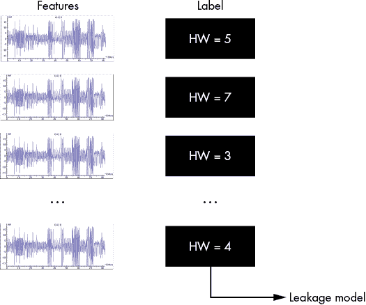

图 11-20：训练神经网络进行旁道分析

我们用一组可爱的轨迹替代了我们心爱的猫和狗，这些轨迹会根据我们目标的中间值的 Hamming 权重逐一标注。对于 AES，这个标签可能是某个 S-box 输出的 Hamming 权重。这组标注的轨迹将作为神经网络的训练集，神经网络则希望学会如何从给定的轨迹中确定 Hamming 权重。最终的结果是一个训练好的模型，可以用于为新的轨迹分配 Hamming 权重的概率。

图 11-21 展示了如何利用网络的分类来获得中间值（进而是密钥）的置信度值。

该图显示了神经网络处理单个轨迹的过程。轨迹经过神经网络处理，最终输出一个关于汉明权重的概率分布。在这个例子中，最可能的汉明权重是 6，概率为 0.65。

我们可以通过向神经网络呈现轨迹和已知的中间值来训练它，如图 11-20 所示，然后让网络对具有未知中间值的轨迹进行分类，如图 11-21 所示，这实际上是一种 SPA 方法。这样的 SPA 分析在 ECC 或 RSA 中非常有用，在这些情况下，我们需要对表示计算的轨迹块进行分类，这些计算涉及一个或几个关键位。

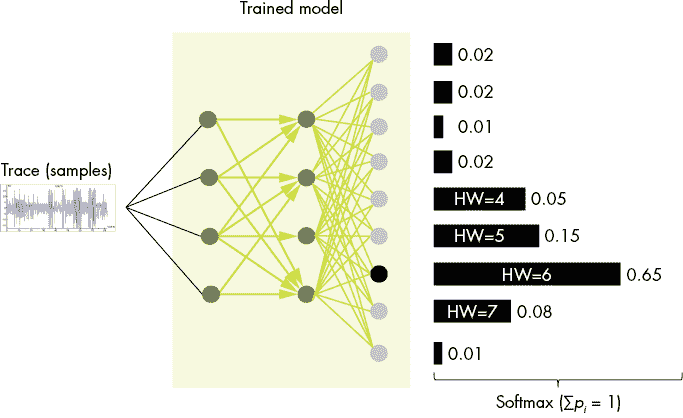

图 11-21：使用网络的分类来帮助寻找密钥

DPA 方法是使用中间值的概率分布（即神经网络的输出），将该概率分布转化为对关键字节的置信度值，并针对每个观察到的轨迹更新这些置信度。在这里，我们与通常的神经网络分类方法有所不同：我们不关心每个轨迹的分类是否完美，只要平均来说，我们能够偏向相关关键字节的置信度值。换句话说，我们并不打算在每张图片中完美地识别出猫或狗，而是我们有成千上万张极其嘈杂的动物图片，我们试图判断它是否是猫。

正确训练的网络，特别是卷积神经网络，可以在不考虑方向、尺度、无关的颜色变化和一定程度噪声的情况下检测物体。因此，假设这些网络能够通过分析需要过滤和对齐的轨迹来减少人工工作量。在 Jasper 的 2018 年 Black Hat 演讲《降低门槛：深度学习用于侧信道分析》中（可以在 YouTube 上观看），他展示了他与合著者 Guilherme Perin 和 Baris Ege 的工作。他证明了神经网络是分析不对齐和一些噪声情况下的非对称加密和对称加密软件实现的可行方法。关于这一点，如何将其扩展到具有更强对抗措施的硬件实现仍然是一个未解之谜。该研究的一个有趣结果是，通过检测网络中的一阶泄漏，它突破了二阶掩码实现。

本工作的目标是消除人工分析师解释轨迹的需求。尽管我们尚未达到这一目标，但我们通过将努力转移到网络设计上，而不是侧信道分析中的多领域复杂性，或许已经使任务变得更简单。

## 总结

在本章的介绍中，我们提到这将是关于*功耗分析的艺术*，而非*功耗分析的科学*。科学部分是简单的——只需理解工具的功能即可。艺术则在于何时、如何以正确的方式应用这些工具，甚至是设计你自己的工具。要在这门艺术上达到专家级水平，需要经验，而这些经验只有通过实验才能获得。无论处于什么样的技能水平，都有有趣的目标可以进行尝试。在我们的实验室，我们分析的是多 GHz 的 SoC，但这需要一支具有几年的专业分析经验的团队，并且可能需要几个月的时间才能开始看到任何泄露现象。另一方面，对于初学者，我们只需要几小时就能教会没有经验的人如何破解一个简单微控制器上的密钥。无论你玩什么，尽量根据自己的经验水平来选择目标。

另一个很好的练习是构建你自己的对策。选择一个你能轻松破解的目标，并允许你加载自己的代码。试着思考，什么样的情况会真正让你作为攻击者难以破解实现；可以使用的一个技巧是，拿你分析中的一个步骤，打破该步骤所做的假设。一个简单的办法是随机化算法的时序，这样可以打破 DPA（差分功耗分析），并迫使你对跟踪信号进行对齐。通过这种方式，你不仅提升了系统的安全性，还提高了自己的攻击技能，并为下一个周末的活动提供了目标。
