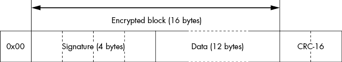
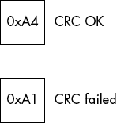
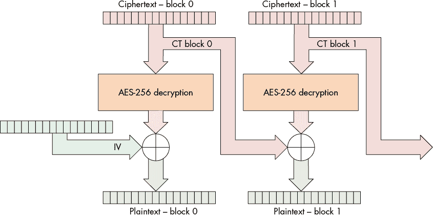
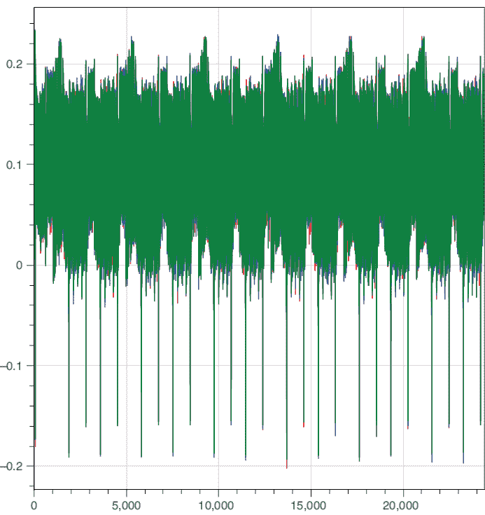
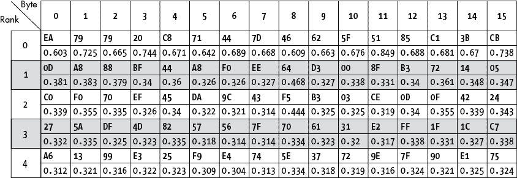
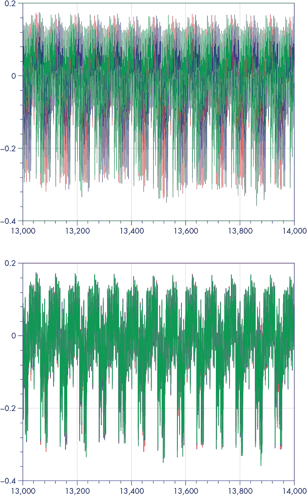
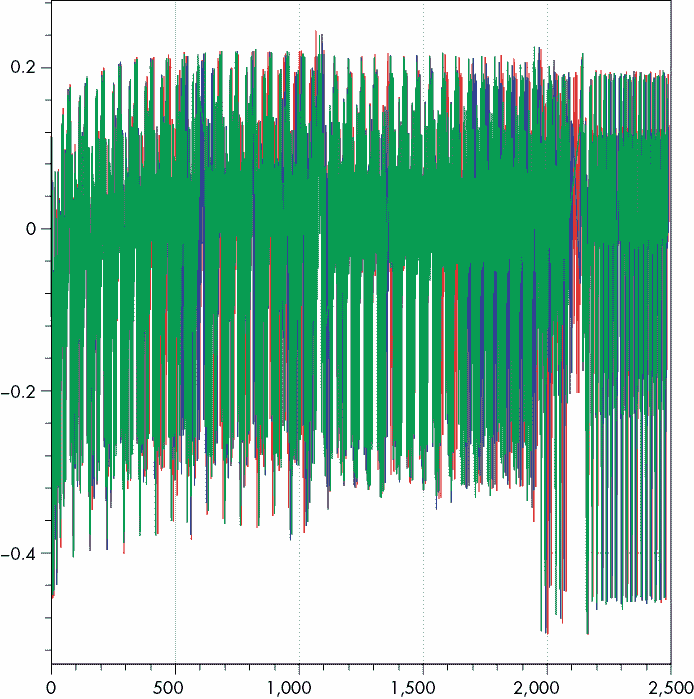
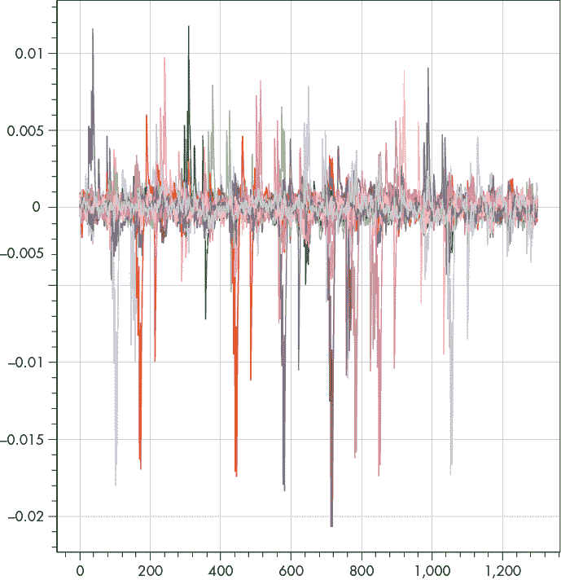
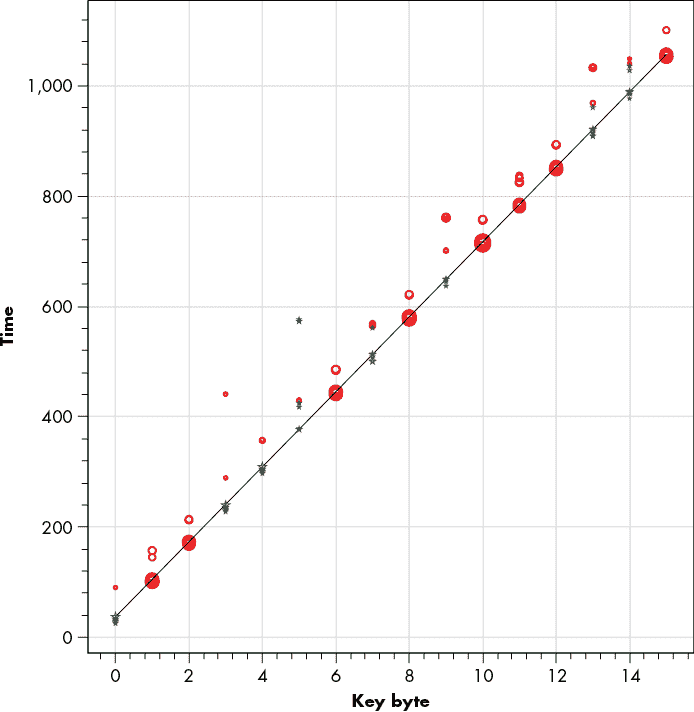
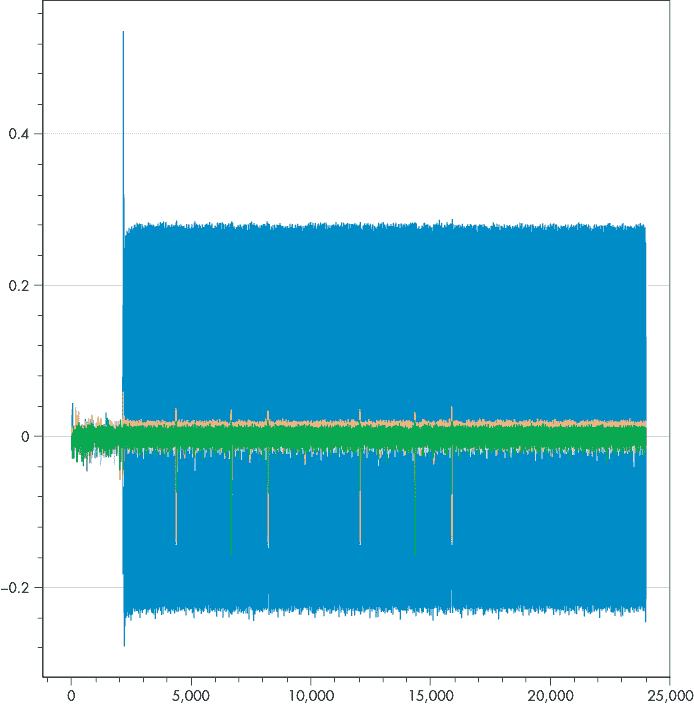

# 12

测试时间：差分功率分析


本实验通过完整的攻击流程展示了一个使用 AES-256 加密的引导程序，目的是展示如何在实际系统中使用旁路功率分析。这个实验中的 AES-256 引导程序是专门为这个练习创建的。受害微控制器将通过串行连接接收一个命令，解密命令并确认附带的签名是否正确。然后，只有在签名检查成功的情况下，它才会将代码保存到内存中。为了让这个系统更具抗加密攻击的能力，引导程序将使用密码块链接（CBC）模式。目标是找出秘密密钥和 CBC 初始化向量，以便我们能成功伪造自己的固件。在实际的引导程序中，可能会有更多的功能，比如读取熔丝、设置硬件等，但这些功能并未实现，因为它们与旁路分析（SCA）攻击无关。

## 引导程序背景

在微控制器的世界里，引导程序是一段特定的代码，旨在让用户将新固件上传到内存中，这对于那些可能需要修补或更新的复杂代码设备特别有用。引导程序通过通信线路（如 USB 端口、串口、以太网端口、Wi-Fi 连接等）接收信息，并将这些数据存储到程序内存中。一旦接收到完整的固件，微控制器就能顺利运行其更新后的代码。

引导程序有一个主要的安全问题。制造商可能希望阻止任意方编写自己的固件并将其上传到微控制器上。这可能出于保护原因，因为攻击者如果能获得早期引导访问权限，可能会访问那些本不应该被访问的设备部分。另一个常见的原因是保护制造商的商业利益；在游戏和打印机行业，硬件以低于制造成本的价格出售，而这些成本通过销售与平台绑定的游戏和墨盒来收回。嵌入在安全引导中的安全功能用于实现这一锁定，因此绕过它会危及商业模式。

停止执行任意固件的最常见方式是添加数字签名（可选加密）。制造商可以将签名添加到固件代码中，并用秘密密钥对其加密。然后，引导程序可以解密传入的固件，并确认其签名是否正确。用户将无法知道与固件相关的加密或签名密钥，因此无法创建自己的引导代码。

在这个实验中，引导程序使用一个秘密的 AES 密钥来签名和加密固件。我们将展示如何提取它。

### 引导程序通信协议

在本实验中，引导程序的通信协议通过串口以 38,400 波特率运行。在这个例子中，引导程序始终等待新的数据发送；在实际应用中，通常会通过命令序列或启动时存在的特殊引脚来强制引导程序进入（例如，参见第三章中的“引导配置引脚”部分。图 12-1 展示了发送给引导程序的命令的样子。



图 12-1：引导程序帧格式

图 12-1 中的帧有四个部分：

1.  **0x00**：一个字节的固定头部。

1.  **签名**：一个秘密的 4 字节常量。引导程序在解密帧后会确认该签名是否正确。

1.  **数据**：传入固件的十二个字节。此系统强制我们每次发送 12 个字节的代码；更完整的引导程序可能允许更长的可变长度数据帧。这些字节使用 AES-256 加密，采用 CBC 模式（将在下一节描述）。

1.  **CRC-16**：一个使用 CRC-CCITT 多项式（0x1021）的 16 位校验和。循环冗余校验（CRC）的最低有效位（LSB）先发送，然后是最高有效位（MSB）。引导程序会通过串口回复，描述该循环冗余校验是否有效。

引导程序对每个命令的响应是一个字节，指示 CRC-16 是否正确（见图 12-2）。



图 12-2：引导程序响应格式

在回复命令后，引导程序会验证签名是否正确。如果它与预期的制造商签名匹配，则 12 个字节的数据将写入闪存。否则，数据将被丢弃。引导程序不会向用户指示签名检查是否通过。

### AES-256 CBC 的详细信息

系统使用 AES-256 块密码，在密码块链（CBC）模式下运行。通常，避免直接使用加密原语（即电子代码本，ECB），因为它意味着相同的明文每次都会映射到相同的密文。密码块链确保了如果你多次加密相同的 16 字节序列，加密后的块都是不同的。

图 12-3 展示了 AES-256 CBC 解密的工作原理。AES-256 解密块的详细信息将在后面详细讨论。



图 12-3：使用 AES-256 进行密码块链解密：一个块的密文用于解密下一个块，形成对前一个密文块的依赖链。

图 12-3 显示了解密后的输出并未直接作为明文使用。相反，输出与一个 16 字节的值做异或运算，该值来自于之前的密文。由于第一个解密块没有前一个密文可用，因此使用初始化向量（IV）代替。为了确保加密安全性，IV 通常被认为是公开的，但在我们的示例中，我们将其保密，以展示如果 IV 不可用时如何恢复它。如果我们要解密整个密文（包括第 0 块）或正确生成我们自己的密文，我们需要找到这个 IV 以及 AES 密钥。

### 攻击 AES-256

本实验中的引导加载程序使用 AES-256 解密，具有 256 位（32 字节）密钥，这意味着我们常规的 AES-128 CPA 攻击将无法直接使用；我们需要多几个额外步骤。首先，我们对逆 S-盒输出执行“常规”AES-128 CPA 攻击，以获得第 14 轮密钥。我们针对逆 S-盒，因为它是解密，解密的第一轮为第 14 轮。使用找到的轮密钥，我们可以计算第 13 轮的输入。接下来，我们将使用“一个特别的技巧”（下文描述）对第 13 轮逆 S-盒输出执行 CPA 攻击，以获得一个“变换过的”第 13 轮密钥。一旦得到它，我们将这个轮密钥转换为常规的第 13 轮密钥。现在我们有了两个轮密钥，这足以使用逆密钥调度来恢复完整的 AES-256 密钥。魔力就在于这些变换后的密钥，所以让我们深入了解它们。

首先，我们假设通过常规 CPA 已经恢复了第 14 轮密钥。这使得我们可以计算第 14 轮的输出。对于 AES 解密，第 14 轮的输出作为第 13 轮的输入，因此我们将其称为 *X*[*13*]。我们不能像第 14 轮那样直接对第 13 轮进行相同的 CPA 攻击，因为第 13 轮中存在逆 *MixColumns* 操作 (*MixColumns*[*–1*])。 *MixColumns*[*–1*] 操作接受 4 个字节的输入并生成 4 个字节的输出。单个字节的变化将导致所有 4 个字节的输出发生变化。我们需要对 4 个字节进行猜测，而不是 1 个字节，这意味着我们必须遍历 2³²次猜测，而不是 2⁸次。这将是一个相当耗时的操作。

为了解决这个问题，我们将做一些代数运算，首先将第 13 轮表示为一个方程式。第*X*[*13*]轮末的状态是第*X*[*14*]轮输入和第 13 轮密钥 *K*[*13*] 的函数：

*X*[*13*] = *SubBytes**–1*(*MixColumns*^(*–1*)(*X*[*14*] ⊕ *K*[*13*])))

*MixColumns*^(*–1*) 是一个线性函数；即：

*MixColumns*^(*–1*)(*A* ⊕ *B*) = *MixColumns*^(*–1*)(*A*) ⊕ *MixColumns*^(*–1*)(*B*)

对于 *ShiftRows*^(*–1*) 也是如此。我们可以利用这一事实，通过重新书写 *X*[*13*] 的方程来得到：

*X*[*13*] = *SubBytes*^(*–1*)(*ShiftRows*^(*–1*)(*MixColumns*^(*–1*)(*X*[*14*])) ⊕ *ShiftRows*^(*–1*)(*MixColumns*^(*–1*)(*K*[*13*])))

我们将引入 *K'*[*13*]，即第 13 轮的变换密钥：

*K'*[*13*] = *ShiftRows*^(*–1*)(*MixColumns*^(*–1*)(*K*[*13*])))

我们可以使用这个变换后的密钥来表示输出 *X*[*13*] 如下：

*X*[*13*] = *SubBytes*^(*–1*)(*ShiftRows*^(*–1*)(*MixColumns*^(*–1*)(*X*[*14*])) ⊕ *K'*[*13*])

使用这个方程，你可以看到 *K'*[*13*] 只是一个比特向量，我们可以通过 CPA 恢复它，而不依赖于 *MixColumns*^(*–1*)。因此，我们可以对 *SubBytes*^(*–1*) 输出的单独字节执行 CPA 攻击，一次恢复每个变换后的子密钥。 一旦我们有了所有变换后的子密钥字节的最佳猜测，就可以通过反转变换来恢复实际的轮密钥：

*K*[*13*] = *MixColumns*(*ShiftRows*(*K'*[*13*])))

最后一步很简单：使用逆 AES-256 密钥调度，我们可以使用 *K*[*13*] 和 *K*[*14*] 密钥来确定完整的 AES-256 加密密钥。如果你无法完全跟随这一步，不要担心；本章的 Jupyter 笔记本伴随章节 ([`nostarch.com/hardwarehacking/`](https://nostarch.com/hardwarehacking/)) 包含了必要的代码。

## 获取并构建引导加载程序代码

按照伴随笔记本顶部的说明进行设置，特别是正确设置 `SCOPETYPE`。如果你只是跟随跟踪，它们已经在虚拟机 (VM) 中提供。我们建议你先使用提供的预捕获跟踪进行跟随。伴随的 Jupyter 笔记本包含所有分析代码，包括所有“答案”。为了避免直接透露所有内容，我们已用军用级别的 RSA-16 加密了答案。首先，尝试自己找到这些答案。

如果你正在使用 ChipWhisperer 硬件作为目标，使用本笔记本编译引导加载程序并将其加载到目标上，通过运行与本节对应的笔记本中的所有单元。确保你可以看到闪存已编程并验证成功。

如果你没有使用 ChipWhisperer 作为目标，你需要自己移植、编译并加载引导加载程序代码。笔记本顶部有一个指向代码的链接。对于移植，检查 *bootloader.c* 中的 `main()` 函数，查看其中的 `platform_init()`、`init_uart()`、`trigger_setup()`、`trigger_high()`、`trigger_low()` 调用。`simpleserial` 库已包含，并使用 `putch()` 和 `getch()` 与串口控制台通信。你可以在 *victims/firmware/hal* 文件夹中看到各种 *硬件抽象层 (HALs)*。你可以作为参考使用的最基础的 HAL 是 *victims/firmware/hal/avr* 文件夹中的 ATmega328P HAL。如果某个 HAL 已经与你想运行的设备匹配，那么只需在笔记本中指定与该 HAL 文件夹对应的匹配平台 `YYY`，并设置 `PLATFORM=YYY` 即可。在继续之前，请确保你已经构建并闪存了固件。

## 运行目标并捕获跟踪

让我们获取一些跟踪数据。如果你没有硬件，可以跳过这一步。如果有硬件，你需要设置目标并向其发送它接受的消息，因此你需要处理串行通信和计算 CRC。

如果你有 ChipWhisperer 设备，可以尝试在 ChipWhisperer-Lite XMEGA（“经典”）或 ChipWhisperer-Lite Arm 平台上运行。或者，你可以按照自己的 SCA 设置和/或目标进行操作。我们在第九章讨论了如何设置自己的功率测量；简单功率分析和相关功率分析的物理测量是相同的，因此请参考该章节，以获取使用自己设备设置过程的更多细节。本章中使用的引导加载程序代码也能在 ATmega328P 上运行，因此如果你使用的是基于 Arduino Uno 的功率捕获设置，你几乎可以直接运行引导加载程序代码。

在本实验中，我们有幸看到引导加载程序的源代码，通常在现实世界中我们是无法访问到的。我们将假设没有这些知识进行实验，稍后再查看以确认我们的假设。

### 计算 CRC

如果你在物理目标上运行，攻击该目标的下一步是与之通信。大部分传输过程相对直接，但 CRC 有些棘手。幸运的是，互联网上有大量开源代码可以用来计算 CRC。在这种情况下，我们将从`pycrc`导入一些代码，代码可以在我们的笔记本中找到。我们通过以下代码行来初始化它：

```
bl_crc = Crc(width = 16**,** poly=0x1021)
```

现在我们可以通过调用来轻松获取我们消息的 CRC。

```
bl_crc.bit_by_bit(message)
```

这意味着我们的消息将通过引导加载程序的基本可接受性测试。在现实生活中，你可能不知道 CRC 多项式，也就是我们在初始化 CRC 时通过`poly`参数传递的值。幸运的是，引导加载程序通常只使用几种常见的多项式。CRC 不是加密函数，因此该多项式不被视为机密。

### 与引导加载程序通信

完成这些步骤后，我们可以开始与引导加载程序进行通信。回想一下，引导加载程序期望的数据块格式如图 12-1 所示，其中包括一个 16 字节的加密消息。我们其实不关心这 16 字节消息的内容，只要每个不同，以便我们能为即将进行的 CPA 攻击提供多样的 Hamming 权重。因此，我们将使用 ChipWhisperer 代码生成随机消息。

我们现在可以运行`target_sync()`函数来与目标同步。该函数应该从目标接收`0xA1`，表示 CRC 失败。如果我们没有收到`0xA1`，我们将继续循环直到收到为止。此时，我们已经与目标同步。接下来，我们将发送一个具有正确 CRC 的缓冲区，以检查我们的通信是否正常工作。我们发送一个带有正确 CRC 的随机消息，应该会收到`0xA4`作为响应。

当我们看到此响应时，我们知道通信已按预期工作，可以继续进行。否则，就该开始调试了。一个典型的问题是通信参数错误（38,400 波特率，8N1，无流控制）。尝试使用串行终端手动连接到目标设备，按回车键直到开始看到响应。此外，串行连接失败可以通过逻辑分析仪或示波器进行调试。检查是否看到线路切换，并且它们的电压和波特率正确。如果没有响应，可能是目标设备未启动（它是否需要时钟信号并且有提供？），或者你没有连接到正确的 TX/RX 对。

### 捕捉概览追踪

既然这些都处理好了，我们可以继续进行追踪的捕捉。由于这是在微控制器上实现的软件 AES，我们可以通过观察 14 轮来直观地识别 AES 执行过程。我们正在执行 AES-256 解密，因此第 14 轮是首次执行的轮次！

我们将使用以下设置进行首次捕捉：

1.  **采样率**：7.37 MS/s（每秒百万样本，1×设备时钟）

1.  **样本数量**：24,400

1.  **触发器**：上升沿

1.  **追踪次数**：三次

对于初次捕捉，我们只是想获取芯片上正在发生的操作的概览，这意味着在样本数量方面，可以选择一个你确定可以捕获整个目标操作的非常大的数字。理想情况下，你希望能够清楚地看到操作的结束。结束通常通过某个无限循环来标识，设备正在等待更多输入，因此在追踪的尾部会看到一个无限重复的模式。图 12-4 显示了 XMEGA 目标的概览追踪，仅裁剪了 AES-256 操作。



图 12-4：ChipWhisperer XMEGA 目标上 AES-256 执行的功率追踪

我们实际上并没有看到操作的结束，但在这个例子中，我们只对前几轮感兴趣。通过放大，我们可以识别出解密的前两轮发生在前 4000 个样本内，这使我们能够在后续捕捉中缩小样本的数量。

如果你的概览追踪未能清晰显示 AES 过程，考虑检查目标设备和示波器的所有连接和配置，然后尝试隔离问题：

+   检查目标设备是否正确输出触发信号，并且示波器响应触发信号。你可以在示波器上捕捉触发信号来进行调试。

+   检查信号通道。即使你没有识别出其中的 AES，也需要看到某些活动。

+   检查电缆和配置。

也有可能您的目标根本没有泄漏这么多（例如，如果您使用的是硬件加速的加密）。您可以通过使用相关性分析或 t 检验来开始定位加密，正如第十章和第十一章所述。对于本实验而言，这不在讨论范围内。

### 捕获详细跟踪

假设您有一个概览跟踪并已确定了前两轮，请使用以下设置并重新运行前面的循环以捕获一批数据：

1.  **采样率**：29.49 MS/s（4×设备时钟）

1.  **样本数量**：24,400

1.  **触发器**：上升沿

1.  **跟踪数量**：200

数字 200 是初步猜测：在微控制器上的软件 AES 通常像筛子一样泄漏，因此您不需要太多的跟踪数据。如果在分析过程中无法找到任何泄漏，您可能需要增加此数字并重试。再给您一个数据点：任何真正受保护的实现，或者在系统级芯片（SoC）上运行的加密，可能需要数百万甚至上千万的跟踪数据才能找到任何泄漏。

## 分析

现在您拥有了功率跟踪数据，可以进行 CPA 攻击。正如前面所述，您需要进行两次攻击：第一次获取第 14 轮密钥，第二次（使用第一次结果）获取第 13 轮密钥。最后，您需要进行一些后处理，以获得 256 位加密密钥。

### 第 14 轮密钥

我们可以使用标准的、不加修饰的 CPA 攻击来攻击第 14 轮密钥（使用逆 S-box，因为我们正在破解的是解密过程）。Python 处理 24,400 个样本的速度相对较慢，因此如果您想要更快的攻击，可以使用更小的范围。如果您查看图 12-4 中的轮次，您可以将样本范围缩小到仅包括第 14 轮。详细跟踪中的采样频率是概览的四倍，因此请确保考虑到这一点。

在对预先获取的跟踪数据运行分析代码时，我们会得到图 12-5 中显示的表格作为结果。该表格包含您正在寻找的密钥，所以只有在您想要答案时才查看它。



图 12-5：第 14 轮密钥的 16 个子密钥的前五个候选及其相关性峰值高度

此表格中的列显示了 16 个子密钥字节。五行表示五个最高排名的子密钥假设，按（绝对）相关性峰值高度降序排列。如果在硬件上运行，此数字会有所变化；但如果一切正常，您将在排名 0 处得到相同的密钥字节。从这个表格中，我们可以做出一些观察。由于该表仅表示完整 AES-256 密钥中的 128 位部分，我们无法使用密文/明文对来验证此部分密钥是否正确。事实上，由于我们没有解密固件，甚至不知道明文是什么，因此根本无法进行这项测试。

我们可以仅仅希望这一部分密钥是正确的，然后继续前进。然而，如果我们在第 14 轮的密钥上有一个比特错误，当我们尝试恢复第 13 轮的密钥时会完全卡住。这是因为我们需要计算第 13 轮的输入，而这依赖于正确的第 14 轮密钥。如果输入计算错误，我们将无法找到任何正确的 CPA 相关性。

为了确认这确实是正确的密钥，我们查看每个子密钥的不同候选密钥之间的相关性值。例如，对于子密钥 0，前五个候选密钥的相关性分别是 0.603、0.381、0.339、0.332 和 0.312。最佳候选密钥的相关性明显高于其他密钥，意味着我们有很高的信心认为 0xEA 是正确的猜测。如果最佳候选密钥的相关性是 0.385，那会让我们信心大大降低，因为它与其他候选密钥的差距较小。

正如图 12-5 中的表格所示，对于每个子密钥，最佳候选密钥的相关性明显高于第二个候选密钥，因此我们可以有足够的信心继续进行。作为经验法则，如果每个子密钥的最佳候选密钥和第二个候选密钥之间的差异是第二个候选密钥和第三个候选密钥差异的一个数量级，那么通常可以放心地继续。

如果你在使用自己的测量数据，请做一下检查。如果你的相关性显示信心较低，可以尝试多采集一些跟踪数据，或者改进跟踪数据的处理，包括第十一章中描述的任何技术，如滤波、对齐、压缩和重同步等。另外，不要气馁！第一次尝试时获得正确的泄漏极为罕见，这正是你利用真实处理和分析的机会。

接下来，笔记本将密钥字节收集到 `rec_key` 变量中，并打印出相关性值。它还会告诉你是否猜对了密钥！让我们继续处理密钥的另一半。

### 第 13 轮密钥

对于第 13 轮，我们需要处理 XMEGA 跟踪中的一些对齐问题，并且我们需要使用“变换”后的密钥添加泄漏模型。

#### 重同步跟踪

如果你正在跟随 XMEGA 版本的固件，跟踪在第 13 轮泄漏发生之前会变得不同步。图 12-6 展示了不同步的跟踪。不同步是由于非恒定时间的 AES 实现所致；代码对每个输入的执行时间并不总是相同。（实际上，可以对这个 AES 实现进行时间攻击。不过，我们会继续聚焦于 CPA 攻击。）

尽管这为定时攻击打开了一个机会，但实际上使我们的 AES 攻击变得稍微难一些，因为我们需要重新同步（重新对齐）跟踪。幸运的是，我们可以很容易地使用`ResyncSAD`预处理模块来完成这个任务。它接收一个参考模式（`ref_trace`和`target_window`），并使用绝对差值和（在第十一章的“重新同步”部分中解释）将其与其他跟踪进行匹配，以找到如何将其他跟踪对齐。使用这个模块时，跟踪会围绕目标窗口对齐。图 12-6 的下方图显示了结果。



图 12-6：上方是不同步的跟踪，下方是重新同步后的跟踪

#### 泄露模型

ChipWhisperer 代码没有内建第 13 轮密钥的泄露模型，所以我们需要创建自己的模型。在笔记本中的`leakage()`方法接收 16 字节的输入数据，作为 AES-256 解密的`pt`参数，它将数据通过第 14 轮解密，使用之前找到的第 14 轮密钥（存储在`k14`中），然后进行*ShiftRows*^(*–1*)操作，再进行*SubBytes*^(*–1*)操作，最终生成`x14`。

接下来，它会将`x14`通过一个部分的第 13 轮解密，使用我们之前解释过的变换密钥：

*X*[*13*] = *SubBytes*^(*–1*)(*ShiftRows*^(*–1*)(*MixColumns*^(*–1*)(*X*[*14*])) ⊕ *K'*[*13*])

然后，我们将`x14`输入到*MixColumns*^(*–1*)和*ShiftRows*^(*–1*)操作中。接着我们将一个单字节的密钥猜测值（即变换后的密钥*K'*[*13*]，存储在`guess[bnum]`中）与其进行异或操作，最后应用一个单独的 S-box。输出的*X*[*13*]就是我们返回给 CPA 泄露模型的中间值。

#### 运行攻击

和第 14 轮攻击类似，我们可以使用较小范围的点来加快攻击速度。运行这个攻击后，我们得到了如图 12-7 所示的结果表。


图 12-7：变换后的第 13 轮密钥的 16 个子密钥对应的前五个候选密钥及其相关性峰值高度

对于每个首选候选密钥，相关性看起来很好：排名为 0 的候选密钥的相关性峰值明显高于排名为 1 的候选密钥。如果你的情况也一样，可以继续进行下一步。

如果你这边看起来不对，检查一下所有的参数（检查两遍），确认第一次找到的密钥的相关性确实不错，并检查这一轮的对齐。如果这些都没有问题，那就真的很神秘了；通常 AES 的不同轮次需要相同的预处理（除了对齐），所以如果第 14 轮的密钥能够完全提取出来而第 13 轮不行，就很奇怪。我们能推荐的就是仔细检查每一步，使用已知的密钥相关性或 t 检验（参见第十一章“测试向量泄漏评估”部分）来判断在已知密钥的情况下是否能找到密钥。正如之前提到的，继续坚持下去。

当你拥有变换后的第 13 轮密钥时，在笔记本中运行该块，使得该密钥被打印并记录在`rec_key2`中。为了获得真实的第 13 轮密钥，笔记本会将你恢复的密钥通过`ShiftRows`和`MixColumns`操作。接下来，它将第 13 轮和第 14 轮密钥结合，然后通过适当运行 AES 密钥调度计算出完整的 AES 密钥。

你应该看到打印出的 32 字节密钥。如果它正确，庆祝一下！如果不正确，请检查你的代码，使用我们提供的密钥确保它正常工作。

## 恢复 IV

现在我们有了加密密钥，可以继续攻击下一个秘密值：初始化向量（IV）。通常，密码学中的 IV 被认为是公开信息，因此可以获取，但本教程的作者决定将其隐藏。我们将尝试使用差分功率分析（DPA）攻击恢复 IV，这意味着我们需要捕获一些操作的跟踪，这些操作将已知的变化数据与未知且恒定的 IV 结合。图 12-3 显示了 IV 与来自 AES-256 解密块的输出结合。由于我们已经恢复了 AES 密钥，我们知道并控制这个输出。这意味着我们拥有所有必要的条件，通过 DPA 攻击，瞄准将输出与 IV 结合的异或（XOR）操作。

### 捕获内容

第一个问题是：“*微控制器*究竟在什么时候能执行异或操作？”在这种情况下，“能”指的是硬性限制；例如，我们只能在所有异或输入都已知后执行异或操作，因此我们知道异或操作肯定不会发生在第一次 AES 解密之前。异或操作至少会发生在明文固件写入闪存之前。如果我们能在功率跟踪中找到 AES 解密和闪存写入的信号，那么我们可以确定异或操作会出现在两者之间。

然而，这通常会导致一个相当大的时间窗口，因此下一个问题是：“*微控制器*实际上会在什么时候执行异或操作？”在这种情况下，“会”指的是开发者方面的理智。代码可能会在 AES 解密完成后不久应用异或操作，尽管这不是一个绝对保证。开发者可能做出了其他选择。通常情况下，开发者会做出合理的选择，因此通过一些合理的推理，你可以缩小采集窗口。如果你把窗口缩小得太小，可能会完全错过这个操作，从而导致攻击失败。我们之所以尝试进行这样的优化，即便存在完全失败的风险，是因为更小的窗口会产生更小的文件，意味着更快速的攻击和能够捕获更多的跟踪信号。此外，实际攻击在较小窗口下几乎总是表现得更好，因为较小的窗口意味着你排除了不必要的噪音——噪音最终会降低攻击性能。

接下来，让我们以 AES-256 完成作为捕获 IV XOR 的起点。回想一下，在解密完成后触发引脚被拉低。这意味着我们可以通过在触发信号的下降沿触发我们的示波器，开始在 AES-256 功能之后进行采集。

现在的问题是要捕获多少个样本，这将是有点根据经验做出的猜测。从我们之前的捕获中，我们知道一个 14 轮的 AES 适配于 15,000 个样本。因此，一个简单的 16 字节 XOR 应该明显更短，至少少于一个轮次（比如 1,000 个样本）。然而，我们不知道 AES 后多久才会计算 XOR。为了安全起见，我们定为 24,400 个样本来进行单次追踪概览。

### 获取第一条追踪

现在我们已经猜测了要采集的内容，让我们看看采集代码。与采集 AES 操作相比，现在有几个额外的方面需要考虑：

+   IV 只在第一次解密时应用，这意味着我们需要在每次捕获追踪前重置目标。

+   我们在下降沿触发后捕获 AES 后的操作。

+   根据目标的不同，我们可能需要通过发送一堆无效数据并寻找错误的 CRC 返回来清空目标的串行线。这一步骤会显著减慢捕获过程，所以你可以先尝试不执行这一步。

笔记本代码实现了所需的捕获逻辑，如果捕获成功，它会为我们绘制一条单一的追踪图以供检查（见图 12-8）。采集参数如下：

1.  **采样率**：29.49 MS/s（设备时钟的 4 倍）

1.  **样本数量**：24,400

1.  **触发器**：下降沿

1.  **追踪次数**：三次

在继续之前，尝试找到你认为 IV 被计算的范围。想一想在 AES 计算后，AES CBC 中可能发生的操作的顺序和持续时间。

现在，我们必须根据现有信息做出一个合理的猜测，判断这个操作窗口是否足够好，能够继续进行。看起来在 0 到大约 1,000 个样本之间有 16 次重复，同样在 1,000 到 2,000 个样本之间也有重复。它们的持续时间（样本数量）符合我们大约 1,000 个样本的预期。我们将继续假设在 0 到 1,000 之间的某个位置发生了 XOR。如果最终我们没有找到 IV，可能需要重新考虑这个假设。

如果你在自己的采集中没有看到清晰的概览追踪，可以回到本章的“捕获概览追踪”部分，了解如何为 AES 捕获概览追踪。如果丢失信号，有时回到前几步是有帮助的。



图 12-8：AES 操作后，IV XOR 隐藏在某处的功率追踪

### 获取其余的追踪

现在我们已经从概览追踪中获得了 XOR 发生的正确时机，我们可以继续进行捕获。它和上次的捕获非常相似，唯一的不同是你会注意到这次的采集会慢得多。这是因为我们必须在每次捕获之间重置目标，以便将设备重置到初始 IV。

现在，我们将把我们的追踪数据存储在 Python 列表中，稍后我们会转换为 NumPy 数组以便进行简单分析。至于追踪的数量 `N`，我们可以采用与 AES 相同的数量，因为泄漏特性可能是相似的。

你可以通过目视检查几个捕获的追踪数据来确认它们看起来是否与概览追踪相同，确认后你就可以开始分析。如果它们看起来不同，回去检查一下在捕获概览追踪和这些追踪数据之间发生了什么变化。

### 分析

现在我们已经有了一批追踪数据，我们可以执行经典的 DPA 攻击来恢复 IV 的单个比特。攻击 XOR 通常比攻击加密算法更困难，因为加密算法具有扩散和混淆特性：任何非线性都可以作为区分器帮助相关性。例如，在 AES 中，如果我们猜错了一个密钥字节的一个比特，那么 S-box 的一半输出比特会被猜错，追踪数据的相关性会大幅下降。而对于 XOR “密钥”——IV，如果我们猜错了一个比特，只有 XOR 输出中的一个比特会出错，因此追踪数据的相关性下降的幅度较小。因为我们正在攻击的是软件实现，所以我们可能不会遇到太大问题，因为它会有较高的泄漏。然而，当 XOR 在硬件中实现时，可能需要数亿到数十亿次追踪才能得到相关性。到那个时候，你可能想要逐渐脱离 Python 脚本了。

#### 攻击理论

引导加载程序通过执行 XOR 操作将 IV 应用于 AES 解密结果，我们将其写为：

*PT* = *DR* ⊕ *IV*

在这里，*DR* 是解密后的密文，*IV* 是秘密的初始向量，*PT* 是引导加载程序稍后将使用的明文，每个 128 位。由于我们已经知道 AES-256 密钥，我们可以计算 *DR*。

这些信息足够让我们通过计算均值差来攻击单个 *IV* 比特：经典的 DPA 攻击（见第十章）。假设 *DR*[*i*] 是 *DR* 的第 *i* 位，假设我们想要获取 *IV*[*i*] 的第 *i* 位。我们可以做以下操作：

1.  将所有的追踪数据分为两组：一组是 *DR*[*i*] = 0，另一组是 *DR*[*i*] = 1。

1.  计算两个组的平均追踪数据。

1.  计算两个组的均值差（DoM）。它应包含明显的脉冲，对应所有使用 *DR*[*i*] 的情况。

1.  如果脉冲的方向相同，那么 *IV*[*i*] 比特是 0（*PT*[*i*]== *DR*[*i*]）。如果脉冲的方向反转，那么 *IV*[*i*] 比特是 1（*PT*[*i*] == ~ *DR*[*i*]）。

我们可以重复进行此攻击 128 次，以恢复整个 IV。

#### 执行单比特攻击

让我们来看看尖峰的方向和位置，如果我们想提取所有 128 位，就必须定位它们。为了简化问题，我们现在只关注每个 IV 字节的最低有效位(LSB)。根据攻击理论，我们通过 AES 解密来计算*DR*，并计算每个字节的 LSB 的 DoM。最后，我们绘制这 16 个 DoM，看是否能发现正负尖峰（见图 12-9）。



图 12-9：对 IV 每个字节的一个比特进行 DPA 攻击

你应该能看到一些明显的正负尖峰，但很难确定哪些是 XOR 操作的一部分，哪些是“虚峰”。由于我们在 8 位微控制器上进行测量，XOR 是并行进行的，每次 8 位，并且在 XOR 操作周围有一个`for`循环，遍历所有 16 个字节，因此我们预期每个字节的峰值应该是均匀间隔的。我们可以在图 12-9 中看到一些，但我们需要做更多的工作来自动化提取所有 128 位。

我们将制作一个散点图，使我们能够找到每个 IV 字节泄漏的时间点。我们将按照以下方式设置：

+   图中的每个标记代表一个泄漏位置。

+   x 坐标表示泄漏的字节。

+   y 坐标表示泄漏在时间中的位置。

+   每个标记都有一个形状——星形表示正峰值，圆形表示负峰值。因此，这个形状表示 IV 比特是 1 还是 0。

+   每个标记的大小表示峰值的大小。

+   对于每个 x 坐标，都会有一些标记，表示该字节的最高峰值。

因为我们假设 IV 是以循环方式进行 XOR 操作，每次 8 位，所以 x 坐标和 y 坐标之间会有线性关系。一旦我们得到这个关系，我们可以利用它提取正确的峰值，从而获取比特。图 12-10 显示了结果。



图 12-10：散点图显示 DPA 峰值，帮助我们找到字节与跟踪中位置之间的线性关系

你可能会注意到有两种合理的方法可以通过这些点绘制一条线。我们选择的是那些峰值幅度最高的线。如果这证明是错误的，我们可以尝试第二条线，它稍微位于图 12-10 中黑线的上方。

我们的目标是提取所有 IV 位，我们可以利用 XOR 操作的时序规律来创建一个脚本来实现这一点。

#### 其他 127

现在我们可以通过对每个比特重复进行 1 位概念性攻击来攻击整个 IV。完整的代码在笔记本中，但首先尝试自己完成。如果遇到困难，这里有一些提示来帮助你开始。

一种简单的遍历比特的方法是使用两个嵌套的循环，像这样：

```
for byte in range(16):
    for bit in range(8):
        # Attack bit number (byte*8 + bit)
```

需要查看的示例取决于你攻击的是哪个字节。请记住，字节中的所有 8 个比特是并行处理的，并且它们会出现在跟踪中的相同位置。当我们使用`location = start + byte*slope`来设置`start`和`slope`的正确值时，我们成功了。

位移操作符和按位与操作符对于获取单个比特非常有用：

```
#This will either result in a 0 or a 1
checkIfBitSet = **(**byteToCheck >> bit**)** & 0x01
```

检查你的 IV 是否与我们这里的相匹配。如果不匹配，首先再次运行此脚本，并将`flip`变量设置为 1。根据你的目标和连接方式，峰值的极性可能会反转。你可以通过翻转所有找到的 IV 比特并重新尝试来轻松检查这一点。

## 攻击签名

我们可以对这个引导加载程序做的最后一件事就是攻击签名。本节展示了如何通过 SPA 攻击恢复签名的所有 4 个秘密字节。一种可能的替代方法是使用密钥解密固件加载过程中嗅探到的单个数据包，但那不涉及功率测量，因此不太适合在这里使用。

### 攻击理论

你可能已经注意到，在进行 XOR 操作的跟踪时，有一个微妙的区别，就是在大约 256 个跟踪中的 1 个中，XOR 后的操作稍微需要更长时间。这个效应可能是因为签名比较有一个提前终止的条件：如果第一个字节不正确，其余字节就不再检查。我们在第八章中已经研究过这种时序泄漏效应，并将在这里使用它来恢复秘密信息。

为了确保我们确实观察到了一个时序泄漏，我们可以通过发送 256 个通信数据包来验证这一点，每次保持密文不变，但将签名的第一个字节变化为从 0 到 255 的所有值。我们将观察到正好有一个数据包生成了更长的跟踪，这意味着我们“猜测”了签名字节正确。然后，我们可以对其他 3 个字节进行迭代，以创建数据包的签名。我们来验证一下我们的假设是否正确（在猜测签名时）。

### 电源跟踪

我们的捕获过程将与我们用来破解 IV 的过程非常相似，但现在我们知道了加密过程中的秘密值，因此可以通过加密我们发送的文本来做一些改进。这有两个重要的优势：

+   我们可以控制解密签名的每个字节（如前所述，签名与明文一起加密发送），这使得我们能够对每个可能的值进行一次尝试。这也简化了分析，因为我们不必担心解密我们发送的文本。

+   我们只需要重置目标一次。我们知道 IV，并且因为我们知道密钥和明文，我们可以正确地生成整个 CBC 链，这大大加快了捕获过程。

我们将运行循环 256 次（每次对应一个可能的字节值），并将该值分配给我们要检查的字节。笔记本中的`next_sig_byte()`函数实现了这一功能。我们不确定检查发生的具体位置，所以我们会比较保守，捕获 24,000 个样本。其他内容应该与实验的早期部分熟悉。

### 分析

在捕获了跟踪之后，实际的分析非常简单。我们寻找一个与其他 255 个完全不同的单一跟踪。找出这个跟踪的一个简单方法是将所有跟踪与参考跟踪进行比较。我们将所有跟踪的平均值作为参考。让我们首先绘制与参考跟踪差异最大的一些跟踪。根据你的目标，你可能会看到类似于图 12-11 的图表。

看起来有一个跟踪与平均值明显不同，因为它在其他跟踪后面产生了一个巨大的“带状”！然而，让我们通过统计学的方法来做。在`guess_signature()`中，我们使用相关系数：参考跟踪与待测试跟踪之间的相关性值越接近 0，它就越偏离均值。我们只希望对差异较大的部分进行相关性计算，因此我们选择了`sign_range`，即图表中有较大差异的子集。

接下来，我们计算并打印前五个跟踪与参考的相关性：

```
Correlation values: [0.55993054 0.998865 0.99907424 0.99908035 0.9990855 4]
Signature byte guess: [0 250 139 134 229]
```



图 12-11：跟踪与参考之间的差异；其中一个跟踪明显不同。

就相关性而言，某个跟踪与其他跟踪完全不同，相关性大大降低（相关性约为 0.560，而其他跟踪约为 0.999）。由于这个数字明显较低，它很可能是我们正确的猜测。第二个列表给出了与每个先前相关性匹配的签名猜测。因此，第一个数字就是我们对正确签名字节的最佳猜测（在此情况下为 0）。

### 所有四个字节

现在我们有了一个能够恢复 IV 单字节的算法，我们只需要对所有 4 个字节进行循环。基本上，我们将目标作为一个神谕，来猜测正确的签名字节，在最坏的情况下（4 × 256 = 1,024 个跟踪）和平均情况下（512 个跟踪）。笔记本实现了这个循环，并能够提取出秘密签名。

总的来说，我们现在能够伪造引导程序会接受的代码，并且通过使用各种功率分析攻击，我们也能够解密任何现有的代码。

## 偷看引导程序源代码

纯粹为了好玩，我们来看一下代码，看看能否弄明白我们找到的跟踪。引导程序的主循环执行了几个有趣的任务，如*bootloader.c*中的代码片段所示，重新创建的代码见列表 12-1。完整的引导程序代码可以通过笔记本顶部的链接找到。

```
 // Continue with decryption
  trigger_high();
  aes256_decrypt_ecb(&ctx, tmp32);
  trigger_low();

  // Apply IV (first 16 bytes)
1 for (i = 0; i < 16; i++){
      tmp32[i] ^= iv[i];
  }

  // Save IV for next time from original ciphertext
2 for (i = 0; i < 16; i++){
      iv[i] = tmp32[i+16];
  }

  // Tell the user that the CRC check was okay
3 putch(COMM_OK);
  putch(COMM_OK);

  // Check the signature
4 if ((tmp32[0] == SIGNATURE1) &&
     (tmp32[1] == SIGNATURE2) &&
     (tmp32[2] == SIGNATURE3) &&
     (tmp32[3] == SIGNATURE4)){

     // Delay to emulate a write to flash memory
     _delay_ms(1);
  }
```

列表 12-1：*bootloader.c*的一部分，显示了数据的解密与处理

这让我们对微控制器如何完成工作有了一个相当清晰的了解。接下来将使用来自列表 12-1 的 C 文件。

在解密过程之后，启动加载程序执行一些不同的代码：

+   为了应用 IV，它在循环 1 中执行一个 XOR 操作。

+   为了存储下一个块的 IV，它将先前的密文复制到 IV 数组 2 中。

+   它通过串口发送 2 个字节 3。

+   它逐一检查签名的字节 4。

我们应该能够在电源波形中识别出这些代码部分。例如，运行在 XMEGA 上的启动加载程序的电源波形如图 12-12 所示。


图 12-12：电源波形的视觉检查，已注释的已知指令（基于我们对代码的了解）

注释像图 12-12 这样的波形，首先要识别出最终的“空闲”模式。我们可以使用触发器来确认这一点，或者只是在不发送命令的情况下测量设备。然后，我们可以根据已知操作从后向前构建注释。了解代码中的主要循环会有所帮助，因为你通常可以在电源波形中数出这些循环。这些洞察可以来自代码，甚至只是基于对代码应如何编写的假设，前提是它实现了某个公共规范。在这个案例中，我们作弊了，直接使用了代码。

我们之前找到的峰值位置与我们根据电源波形注释所声称的 XOR 操作发生的位置在样本数上是对齐的。这表明我们正确地注释了电源波形。

### 签名检查的时序

C 中的签名检查如下所示：

```
if ((tmp32[0] == SIGNATURE1) &&
    (tmp32[1] == SIGNATURE2) &&
    (tmp32[2] == SIGNATURE3) &&
    (tmp32[3] == SIGNATURE4)){
```

在 C 中，编译器允许短路计算布尔表达式。当检查多个条件时，程序会在一旦确定最终值时停止评估其他条件。在这种情况下，除非所有四个等式检查都为真，否则结果将为假。因此，只要程序发现一个假的条件，它就可以停止评估其他条件。

要查看编译器如何处理此操作，我们需要查看汇编文件。打开为构建的二进制文件生成的*.lss*文件，它位于与启动加载程序代码相同的文件夹中。这就是所谓的*列表*文件，它让你看到 C 源代码编译并链接后的汇编代码。由于汇编代码提供了已执行指令的精确视图，因此可以更好地与波形进行对应。

接下来，找到签名检查并确认编译器使用了短路逻辑（这使我们的时序攻击成为可能）。你可以通过以下方式确认这一点。让我们以 STM32F3 芯片为例，在列表 12-2 中显示了汇编结果。

```
 //Check the signature
               if ((tmp32[0] == SIGNATURE1) &&
   8000338:   f89d 3018   ldrb.w  r3, [sp, #24]
   800033c:   2b00        cmp r3, #0
   800033e:   d1c2        bne.n   80002c6 <main+0x52>
   8000340:   f89d 2019   ldrb.w  r2, [sp, #25]
 1 8000344:   2aeb        cmp r2, #235    ; 0xeb
 2 8000346:   d1be        bne.n   80002c6 <main+0x52>
                   (tmp32[1] == SIGNATURE2) &&
   8000348:   f89d 201a   ldrb.w  r2, [sp, #26]
 3 800034c:   2a02        cmp r2, #2
 4 800034e:   d1ba        bne.n   80002c6 <main+0x52>
                   (tmp32[2] == SIGNATURE3) &&
   8000350:   f89d 201b   ldrb.w  r2, [sp, #27]
   8000354:   2a1d        cmp r2, #29
   8000356:   d1b6        bne.n   80002c6 <main+0x52>
                   (tmp32[3] == SIGNATURE4)){
```

列表 12-2：签名检查的列表文件示例

我们可以看到围绕签名的一系列四次比较。第一个字节被比较 1，如果比较失败，`bne.n`指令 2 会跳转到地址`80002c6`。这意味着我们看到的是短路操作，因为如果第一个字节不正确，只会进行一次比较。我们还可以看到，每个四个汇编代码块都包括一次比较和一个条件分支。所有四个条件分支（`bne.n`）都将程序返回到相同的位置，即地址`80002c6`。你可以看到第一个签名字节的比较 1 和条件跳转 2，与第二个签名字节的比较 3 和跳转 4 是相同的。如果我们打开地址`80002c6`处的反汇编代码，我们会看到跳转目标是`80002c6`，也就是`while(1)`循环的开始。所有四个分支必须*失败*“不相等”检查才能进入`if`块的主体。

另外请注意，代码的作者显然知道定时攻击，因为签名检查是在串行 I/O 完成后进行的。然而，要么他们没有意识到 SPA 攻击，要么他们故意为这次练习设置了 SPA 后门。我们永远无法知道真相。

## 总结

在本实验中，我们攻击了一个虚构的引导加载程序，该程序使用 AES-256 CBC 的软件实现，配合一个秘密密钥、秘密初始化向量（IV）和一个秘密签名来保护固件加载。我们在预先录制的跟踪数据上进行了实验，或者在 ChipWhisperer 硬件上进行。如果你足够勇敢，你也可以在你自己的目标和示波器硬件上进行。通过 CPA 攻击，我们恢复了秘密密钥；通过 DPA 攻击，我们恢复了初始化向量（IV）；通过 SPA 攻击，我们恢复了签名。本练习涵盖了功耗分析的许多基础知识。在进行功耗分析时，一个重要的方面是，你可能需要经过很多步骤和决策才能到达你所追求的秘密，因此，尽量做出最好的猜测，并在每一步进行双重检查。

为了帮助你更好地理解什么是可能的，我们将在下一章介绍一些现实生活中的攻击示例。然而，在你积累旁路功耗分析经验的过程中，进行本章所描述的攻击可能是很有用的。我们可以完全访问引导加载程序的源代码，因此能够更好地理解复杂步骤，而不需要进行复杂的逆向工程过程。

使用开放示例来构建这种直觉是非常有价值的。许多实际的产品都是使用相同的引导加载程序（或者至少是相同的一般流程）构建的。特别值得一提的一个引导加载程序叫做“MCUBoot”（可以在[`github.com/mcu-tools/mcuboot/`](https://github.com/mcu-tools/mcuboot/)找到）。这个引导加载程序是开源的 Arm“受信固件-M”的基础，也是许多 MCU 中固件的一部分（例如，Cypress PSoC 64 设备，[`github.com/cypresssemiconductorco/mtb-example-psoc6-mcuboot-basic/`](https://github.com/cypresssemiconductorco/mtb-example-psoc6-mcuboot-basic/)）。

特定厂商的应用说明书是另一个有用的引导加载程序示例来源。几乎每个微控制器制造商都提供至少一个安全引导加载程序示例应用说明书。产品设计师直接使用这些示例应用说明书的可能性非常高，因此如果你正在使用某款微控制器的产品，检查该微控制器厂商是否提供了示例引导加载程序是非常有用的。实际上，本章中的引导加载程序大致基于 Microchip 的应用说明书 AN2462（原 Atmel 应用说明书 AVR231）。你可以在 TI（“CryptoBSL”）、Silicon Labs（“AN0060”）和 NXP（“AN4605”）等厂商找到类似的 AES 引导加载程序。任何这些示例都可以作为锻炼你功耗分析技能的好练习。
