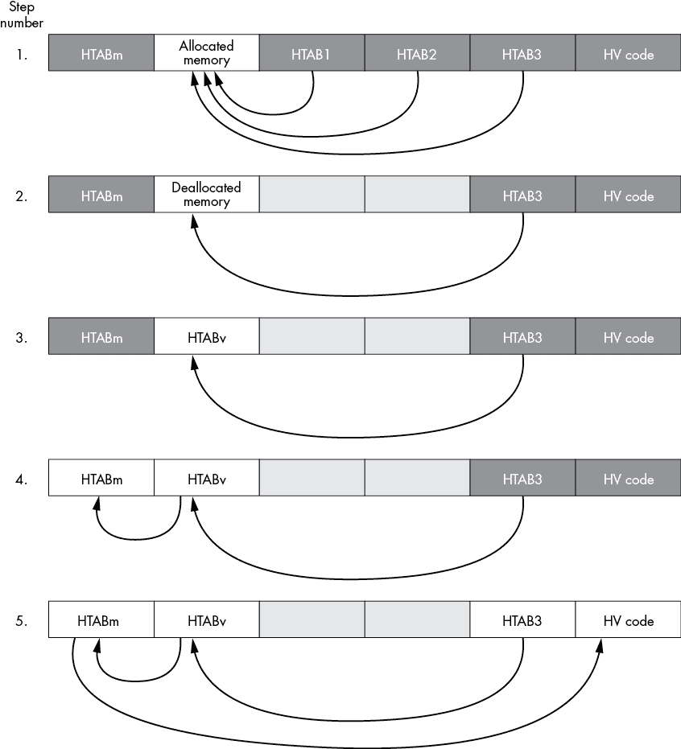
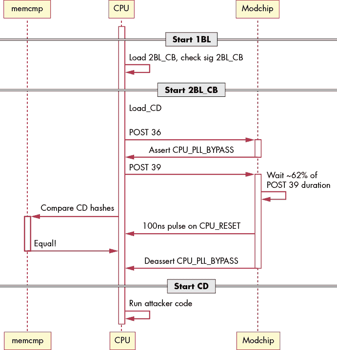
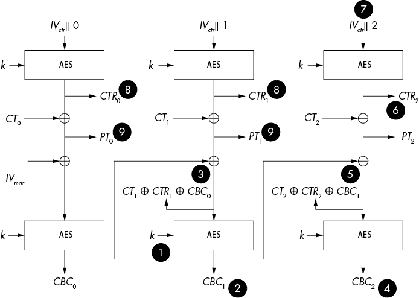
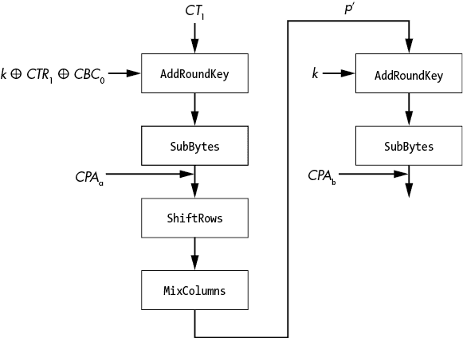

# 不开玩笑：现实生活中的例子

你已经学习了嵌入式系统，并且了解了嵌入式攻击。你可能仍然觉得缺少有关真实系统的实际攻击细节。本章将帮助弥补实验室示例与现实生活之间的差距，我们将提供故障注入和电源分析攻击的例子。

## 故障注入攻击

故障注入攻击可能是（公开的）真实世界攻击中使用最多的攻击手段（相较于电源分析）。你可能听说过的两个高调例子是攻击索尼 PlayStation 的虚拟机和通过“重置漏洞”攻击 Xbox 360。游戏系统是有趣的攻击目标，因为它们通常拥有一些最强的消费者级别设备安全性。在这些 PlayStation 和 Xbox 360 攻击发生的同一时间段，其他大多数消费电子产品（如路由器和电视）都没有启动签名，且无需高级攻击就能被利用。如果你想看看设备安全如何改进，还可以探索其他攻击细节，比如任天堂 Switch 的攻击等。

### PlayStation 3 虚拟机

游戏主机始终是攻击的目标，因为有一群有动机的用户希望攻击它们。玩家可能想运行盗版游戏，可能有兴趣修改游戏本身（或者在游戏中作弊），或者他们可能希望在一个相对广泛可用且强大的平台上运行自定义代码。尤其是在索尼 PlayStation 3 的情况下，它采用了独特的 Cell 微处理器，能够很好地支持多任务处理。虽然现在你可能计划将一个算法直接放到你的图形处理单元（GPU）上，但 GPU 计算领域在当时并不像现在这么容易接触；例如，CUDA 在 2007 年 6 月发布，OpenCL 在 2008 年 8 月发布，但 PlayStation 3 主机集群早在 2007 年 1 月就已经开始测试。

PlayStation 支持直接运行 Linux。Linux 本身在 PlayStation 虚拟机的控制下运行，虚拟机阻止了用户访问任何不当的内容（例如安全密钥存储）。有效地攻击 PlayStation 意味着要找到绕过虚拟机的方法，只有这样才能深入系统的其他部分，恢复关键的机密信息。在最初的 PlayStation 3 破解工作完成后，索尼宣布未来的 PlayStation 更新将不再支持运行 Linux，因为存在安全风险。这一宣布间接激励了黑客进一步攻破 PlayStation 3，因为在更新后的 PlayStation 3 上运行 Linux 现在需要成功的攻击。

这是什么攻击？我们实际上将专注于“初步工作”，这项工作得益于乔治·霍兹（George Hotz，GeoHot），并不是最终的 PlayStation 漏洞，但它仍然是一个著名的攻击，因此作为故障攻击的一个例子值得了解。

为了理解这个攻击，我们首先需要了解一些关于 Linux 内核如何访问内存的细节。为此，Linux 内核请求虚拟机监控器分配一个内存缓冲区。虚拟机监控器按要求分配了该缓冲区。内核还请求在哈希表（HTAB）页索引中创建多个引用，因此该内存块有多个引用。你可以在图 13-1 的步骤 1 中看到此时内存的抽象视图。

图 13-1：PS3 攻陷的五个步骤

图 13-1 展示了攻击过程中内存内容的抽象视图。HTAB 是“句柄”，它让内核访问特定的内存范围，如箭头所示。灰色单元格仅对虚拟机监控器可见，而白色单元格对内核可见。

回到攻击部分。到目前为止，一切都很好且安全。内核对一块内存具有读写权限，但虚拟机监控器（hypervisor）非常清楚这块内存，并确保不会发生越界读写。当我们请求虚拟机监控器通过关闭在图 13-1 步骤 1 中通过 HTAB 所做的所有引用来释放内存时，攻击便开始了。在此时，我们在 PS3 内存总线上插入一个故障，目的是使某个释放操作失败。稍后我们会解释为什么这很重要，但现在请注意，攻击之所以有效，是因为释放操作从未被“验证”。如果指向我们应该释放的硬件内存的指针被破坏，虚拟机监控器将无法察觉这一点。

物理故障来自于一个插入到内存数据总线上的逻辑级信号（即 DQx 引脚）。最初的演示使用了一个现场可编程门阵列（FPGA）板来生成一个短脉冲（约 40ns），但后来复现此攻击的人也使用微控制器生成类似的脉冲（在 40 到 300ns 的范围内）。由于许多释放操作被强制执行，故障可以通过手动触发。具体的时序并不需要，因为只要有一个释放操作失败就足够。

这让我们进入图 13-1 的第二步：内核可以访问一块内存，而这块内存实际上在 HTAB 中并没有被作废。虚拟机监控器对此并不知情，因为它认为它已经安全地释放了内存并移除了所有引用。

攻击的最后阶段是生成一个新的虚拟内存空间，该空间与内核可以读写的内存块重叠。这个虚拟内存空间还将包括该虚拟空间内的页面映射的 HTAB，但如果我们幸运的话，该 HTAB 将位于我们可以读写的内存块中，如图 13-1 中步骤 3 所示。如果我们可以写入 HTAB，这意味着我们可以将内存页映射到我们的空间中，这通常只有超监视器能够执行。这样可以绕过大多数保护机制，因为内存页看起来是通过有效的 HTAB 传递的，而且内核本身正在读写它允许访问的内存地址。

实现完全读写访问的最后一步是重新映射原始 HTAB，以便我们可以直接对这个表进行读写，如图 13-1 中步骤 4 所示。通过切换回原始内存空间（而不是为攻击创建的虚拟内存空间），我们现在可以写入主 HTAB，从而将任意内存页映射到我们的缓冲区中。由于我们对这个缓冲区拥有读写访问权限，我们可以获得对任何内存位置的读写访问权限，包括超监视器代码本身，如图 13-1 中步骤 5 所示。

漏洞的产生是因为超监视器与 HTAB 状态脱耦，因此它无法意识到内核仍然拥有对新创建的虚拟内存空间的读写访问权限。这个漏洞也受到超监视器允许内核通过标准 API 调用发现该初始缓冲区的实际内存地址的帮助（这在创建虚拟内存空间时有助于获取 HTAB 重叠）。

如果你对更多细节感兴趣，你可以找到 Hotz 发布的原始代码镜像。由于诉讼，Hotz 停止了对 Sony 产品的进一步工作。你还可以找到 xorloser 发布的一系列博客文章，其中包括原始细节和一些更新版本的攻击工具（称为 XorHack）。这些博客文章提供了完整的攻击示例，如果你想了解详细的技术内容，可以参考。

结论是，在故障攻击中，可以使用多种方法来施加故障。例如，攻击不局限于电压、时钟、电磁（EM）和光学故障注入方法。在这种情况下，内存总线本身出现故障，这可能比尝试在复杂设备的电源上注入故障更容易成为目标。故障注入设备可以是一个简单的微控制器，甚至可以使用 Arduino 来脉冲相应的内存总线引脚。

另一个结论是巧妙的目标准备使得攻击更加轻松。尽管攻击可以通过精确的时序来故障单个 HTAB 条目，但同时修改大量条目要容易得多。这样做可以在故障注入时使用较为宽松的时序，因为该攻击设计成只需少量的成功即可完成。

### Xbox 360

Xbox 360 是另一个成功被故障注入攻击的游戏主机。这项工作主要归功于 GliGli 和 Tiros，之前的逆向工程工作由不同的用户完成（有关 Reset Glitch Hack 的完整致谢请参见 [`github.com/Free60Project`](https://github.com/Free60Project)，有关详细硬件信息请参见 [`github.com/gligli/tools/tree/master/reset_glitch_hack`](https://github.com/gligli/tools/tree/master/reset_glitch_hack)）。图 13-2 显示了攻击步骤的高层次概览。

Xbox 360 有一个基于 ROM 的第一阶段引导加载程序（1BL），它加载存储在 NAND 闪存中的第二阶段引导加载程序（2BL，也称为 Xbox 上的 CB）。1BL 在加载 2BL 之前验证 2BL 的 RSA 签名。最后，2BL 加载一个名为 CD 的块，其中包含虚拟机监控器和内核——基本上意味着我们最好加载我们自己的 CD 块，这样我们就不需要利用虚拟机监控器，因为我们将完全运行我们自己的代码。

2BL 块将在运行此代码之前验证 CD 块的预期 SHA-1 哈希。由于 2BL 块已通过 RSA 签名进行检查，我们无法在不被检测到的情况下修改 2BL 块期望的 CD 块 SHA-1 哈希。如果我们有一个 SHA-1 哈希碰撞，我们可以加载我们自己的（意外的）代码，但有一种更简单的方法可以继续。

SHA-1 将会在 CD 代码上计算，并与类似 `memcmp()` 的方法进行比较。我们知道这类操作容易受到故障攻击，因此我们可以考虑在此时插入一个故障。

为了简化时序，使用了 Xbox 360 的一些硬件特性。特别是，主中央处理单元（CPU）有一个暴露的引脚，可以用来绕过相位锁定环（PLL）。结果是，CPU 以更慢的速度运行，只有 520 kHz。这个引脚在示例中被标记为 CPU_PLL_BYPASS，但请记住，这些引脚名称并非基于公开文档，如数据手册。这个引脚实际上可能是 PLL 的反馈回路，但将其接地的效果与启用 PLL 绕过是一样的。

图 13-2：成功故障攻击 Xbox 360 "fat" 版本的序列

现在，CPU 以更慢的速度运行，更容易微调故障注入时序。在这种情况下，故障注入方法是在 CPU 的重置线上的短暂冲击。这个故障不会重置系统，而是导致 SHA-1 比较报告成功的比较，即使 SHA-1 哈希不匹配。

如果重置线故障无法成功，可能需要尝试其他途径，例如电压或电磁故障注入，可能会成功。但像 PlayStation 攻击一样，目标是开发非常简单的工具，使得攻击易于复制。将简单的逻辑电平信号发送到重置引脚是可以通过复杂的可编程逻辑设备（CPLD）、现场可编程门阵列（FPGA）或微控制器来完成的。

而这些改装芯片正是这样做的。这些芯片将故障漏洞“武器化”。它们利用电源自检（POST）系统的细节，该系统报告启动进度。通过接入 POST 报告，几乎可以准确知道何时触发慢时钟操作，然后注入重置故障。像所有故障攻击一样，重置故障不会有完美的成功率。如果故障不成功，改装芯片会检测到并正确重置系统，然后重新尝试。这个过程通常可以在 30 到 60 秒内加载不安全的二进制文件。

再次说明，巧妙的准备将一个相对复杂的目标转变为可以用基础电子设备攻击的目标。在这种情况下，目标被大大减速，而不是强迫发生大量易受攻击的操作。硬件的后续版本没有相同的测试点，而是暴露了 I2C 总线上的时钟发生器。通过接入 I2C 总线，攻击者可以以类似的效果减慢主 CPU 的速度。

对时钟频率进行外部控制可能是可行的，即使对于复杂的目标也是如此。例如，一个目标可能使用相位锁定环（PLL）来倍频一个晶体频率；将 12 MHz 的晶体替换为 1 MHz 的振荡器可能使主 CPU 以 66.7 MHz 的频率运行，而不是目标的 800 MHz。然而，这是否成功远远不确定。PLL 和振荡器本身有其限制（可能无法以如此慢的速度工作），外部部件如 DRAM 也有上下频率限制（DRAM 芯片有最小和最大刷新时间），而 CPU 可能会检测到频率偏差并自动关机以防止攻击。

Xbox 360 重置故障表明，花时间“探索”目标可能有助于发现可以大规模利用的漏洞。在这种情况下，达成可靠的故障攻击结合了几个单独的观察，这些观察本身可能并不是一个显而易见的攻击途径：启动阶段对观察者是实时已知的；CPU 上的一个引脚可以以更慢的速度运行，并且在重置引脚上的短暂故障（至少在运行非常慢时）不会正确重置芯片，而是插入故障。

## 电源分析攻击

前一节中展示的故障注入攻击被用来获取超出安全架构原本许可的临时权限（例如，允许加载未签名的固件）。虽然故障注入可以通过内存转储或通过差分故障分析泄露密钥，但它通常是为了获得权限，从而继续攻击。相比之下，功率分析几乎完全关注于揭示敏感信息，例如加密密钥。区别在于，成功的功率分析攻击可能为你提供“王国的钥匙”。这些密钥可能使得难以区分攻击者和合法的所有者或操作员，并且它们可能允许在没有进一步硬件攻击的情况下进行规模扩展。

### 飞利浦 Hue 攻击

飞利浦 Hue 灯泡是智能灯具，允许所有者远程控制各种设置。这些灯具通过 Zigbee Light Link (ZLL) 进行通信，该协议运行在一个非常受限的无线网络协议（IEEE 802.15.4）上。这里我们展示了“物联网走向核爆：创建 ZigBee 链式反应”（Eyal Ronen 等人）的部分内容。该研究详细说明了如何恢复飞利浦 Hue 固件的加密密钥。在发现一个漏洞后，作者还成功绕过了这些灯泡通常用来防止它们被距离超过 1 米的攻击者从网络中断开的“接近性测试”。这个漏洞和接近性测试绕过使得攻击者能够创建一个蠕虫程序，在完整的 Zigbee 范围内（30-400 米，取决于条件）使受害者灯泡从网络中断开，并远程安装蠕虫固件，之后已感染的灯泡开始攻击其他灯泡。通过功率分析，攻击者能够破坏（全球）固件的加密和签名密钥。

#### Zigbee Light Link

ZLL 是 Zigbee 的一个特定版本（与常规 Zigbee 或 Zigbee 家庭自动化不同），它像 Zigbee 一样，使用一种称为 IEEE 802.15.4 的低功耗无线协议。ZLL 有一个简单的方法，允许新设备（比如你刚购买的灯泡）加入网络。

这个加入过程依赖于一个固定的主密钥，将唯一的网络密钥传递给新灯泡，设备将连接到一个具有唯一密钥的网络。一旦唯一密钥被传递，网络中不再使用共享的主密钥，因为主密钥始终有泄露的风险。网络所有者需要将网络置于允许新设备加入的模式，这样新设备无法在没有所有者知情的情况下被添加。然而，这个解释并没有描述我们如何解决替换已经故障的桥接器，或者用户需要将灯泡从一个网络移到另一个网络的问题。

#### 绕过接近性检查

对于需要更改唯一网络密钥的场景，我们进入了第二部分，一个特殊的“恢复出厂设置”消息，它允许某人将灯泡从现有网络中去认证，以便它现在可以加入不同的网络。要执行这一步，你需要物理接近（大约 1 米范围）。ZLL 主密钥（正如你可能预料的那样）被泄漏了，这意味着任何人都可以发送这些消息。

接近性检查通常通过拒绝信号强度低于某个值的消息来完成。尽管可以使用高功率无线电发射器伪造无线电距离并从更远的范围重置设备，但这样做并不是“蠕虫式”的，因为 Hue 的发射器本身的功率不足够强大。一个“蠕虫式”的解决方案通过固件漏洞和一些兼容性要求出现了。首先，发送一个精心设计的“恢复出厂设置”消息给受害者。这个消息的设计目的是利用固件漏洞，从而绕过接近性测试。工厂重置后，受害者会主动开始搜索 Zigbee 网络。详细内容在论文中，本文重点介绍攻击的功率分析部分。

#### Hue 上的固件更新

现在我们已经进入了一个阶段，在这个阶段，一个设备可以被强制加入一个新的、由攻击者控制的网络，此时你可以发送固件更新请求。真正的问题是，固件更新文件的实际格式是什么，我们该如何自己发送一个固件更新文件？在这个阶段，我们将重置你对攻击设置的理解，并返回到一个合法的飞利浦 Hue 灯泡。

飞利浦 Hue 灯泡具备执行固件更新的能力。通过标准的逆向工程技术，以及仅仅查看作为参考设计一部分的 Zigbee 空中下载（OTA）更新机制的示例实现，我们可以了解其工作原理。当灯泡需要固件更新时，它从桥接设备（之前从远程服务器下载的）下载文件到外部 SPI 闪存芯片中。实际的 OTA 下载可能需要一些时间（通常至少需要一个小时），因为每个数据包中发送的只是小量数据。如果网络处于繁忙的无线环境中，或者灯泡处于无线电范围的边缘，这段时间可能会大大延长。

我们可以不直接尝试从这个慢速 OTA 接口嗅探更新，而是查看 SPI 芯片的情况，这可以为我们提供一个“更新就绪”的 SPI 闪存镜像。如果我们想触发给定灯泡的更新，我们只需要将这个 SPI 镜像写入 SPI 闪存芯片，灯泡就会执行实际的自我重编程。这个编程过程由 SPI 闪存镜像中的一个字节触发，该字节指示灯泡准备好进行更新。启动时，灯泡会检查这个字节的值，并在必要时触发编程。这个编程机制也意味着，如果你在重编程阶段通过关闭灯泡电源来中断过程，下次启动时，灯泡会自动重新启动并继续重编程步骤。

#### 通过功率分析获取固件密钥

AES-CCM 用于加密和验证固件文件（AES-CCM 的规范可以在 IETF RFC 3610 中找到），因此我们不能简单地上传任何伪造的映像。我们首先需要提取密钥。为此，SPI 闪存芯片成为我们加密算法的“输入”，我们可以通过功率分析破解它。在这种情况下，CCM 使得事情比你最初猜测的要复杂一些。我们不再有每个加密模式的直接输入，因为 AES-CCM 使用了 AES-CTR 模式与 AES-CBC 一起使用。图 13-3 提供了一个不完整的 CCM 概述，只关注我们攻击所需要的部分。

AES 块的最上一行是 AES 在 CTR 模式下：一个递增的计数器被加密以获得 128 位的流密码块（*CTR*[*m*], 8）。这用于通过简单的 XOR 操作解密密文（9）。为了创建身份验证标签，AES 块的最下一行密文被 XOR 到下一个块的输入（3, 5），这构成了密码块链接（*CBC*[*m*], 2, 4）。我们省略了一些关于身份验证标签是如何精确计算的细节，但这些对攻击来说并不重要。

图 13-3：攻击中需要了解的所有 AES-CCM 信息

我们如何通过功率分析攻击 CCM？直接攻击 AES-CTR 不行，因为我们不知道输入（7，因为 IV 是未知的），也不知道输出，因为那是密码流，永远无法访问（8）。在 AES-CBC 中，我们也无法执行普通的 CPA；输入是解密后的固件（9，我们不知道），AES-CBC 的输出（2, 4）也永远无法访问。不过，Ronen 等人描述了如何进行巧妙的密钥变换（就像我们在第十二章中做的那样），从而能够从 AES-CBC 中获得密钥（1）。

让我们从最上面开始，先看密文 *CT*。我们将其分割成 128 位的块，*CT*[*m*]，其中 *m* 是块的索引。AES-CTR 解密是一种流密码，我们将流（8）写作 *CTR*[*m*] = `AES`(*k*, *IV*[*ctr*] || *m*)，其中 || 表示位的连接，所以我们可以将从中得到的 *PT*（9）写作 *PT*[*m*] = *CT*[*m*] ⊕ *CTR*[*m*]。

CCM 中的 *IV*[*ctr*] 由几个字段组成，但基本上此时对我们来说最大的未知数是 nonce。为了简化，我们暂时可以说我们不知道 *IV*[*ctr*]（暂时如此）。

接下来，AES-CBC 用于加密 *PT*[*m*]，生成身份验证标签。我们可以将 CBC 的输出块 *m*（2, 4）写作 *CBC*[*m*] = `AES`(*k*, *PT*[*m*] ⊕ *CBC*[*m–1*])，其中块 *m* = *0* 使用 *CBC*[*-1*] = *IV*[*mac*] 来定义。我们可以替换 *PT*[*m*] 来得到 *CBC*[*m*] = `AES` (*k*, *CT*[*m*] ⊕ *CTR*[*m*] ⊕ *CBC*[*m–1*])。

到目前为止，一切顺利，尽管公式中的所有内容都未知，除了*CT*。在常规的 AES-ECB 功率分析攻击中，我们假设至少知道明文或密文，从而可以恢复*k*。任何前述 AES 函数的问题在于，我们不知道输入，也不知道输出。

关键就在于此时。 在 AES 中，`AddRoundKey`(*k, p*) 就是 *k* ⊕ *p*，这意味着我们可以将 `AddRoundKey`(*k*, *p* ⊕ *d*) 重写为 `AddRoundKey`(*k* ⊕ *p*, *d*)。这意味着，如果*p*是未知且固定的，我们可以将其视为已转换密钥*k* ⊕ *p*的一部分。如果我们控制了*d*，我们可以进行 CPA 攻击来恢复*k* ⊕ *p*。

在我们的 CCM 情况下，我们无法攻击 `AddRoundKey`(*k*, *CT*[*m*] ⊕ *CTR*[*m*] ⊕ *CBC*[*m–1*])，但我们可以攻击 `AddRoundKey`(*k* ⊕ *CTR*[*m*] ⊕ *CBC*[*m–1*], *CT*[*m*])，因为我们控制了*CT*[*m*]！假设目标发生泄漏，我们可以使用*CPA*[*a*]（见图 13-4）来找到已转换的密钥*k* ⊕ *CTR*[*m*] ⊕ *CBC*[*m-1*]，虽然这本身没有直接用处。这个已转换的密钥让我们能够计算所有中间数据，直到第二次`AddRoundKey`(*k*, *p′*)。第二次`AddRoundKey`仍然使用*k*，这是我们不知道的。然而，由于我们知道已转换的轮密钥和*CT*，我们可以计算出*p′*。我们现在可以使用一个普通的*CPA*[*b*]攻击，利用*p′*来恢复从 AES 第二轮的*k*。

图 13-4：两种 CPA 攻击：一种针对转换密钥，另一种针对常规密钥

一旦我们得到了*k*（在图 13-3 中是 1），我们还有几个步骤要走。请注意，我们仍然没有*PT*或任何 IV。然而，*k*允许我们完成图 13-4 中的“修改”AES 计算，从而得到*CBC*[*m*]块 2。现在我们可以解密此块，得到*CT*[*m*] ⊕ *CTR*[*m*] ⊕ *CBC*[*m-1*] 3，并且由于我们知道*CT*[*m*]，我们就知道*CTR*[*m*] ⊕ *CBC*[*m-1*]。

最后一步，我们可以对后续块*m+1*使用相同的攻击。这让我们能够找到*CBC*[*m+1*] 4 和*CT*[*m+1*] ⊕ *CTR*[*m+1*]⊕ *CBC*[*m*] 5。由于我们已经从之前的攻击中知道了*CT*[*m+1*]和*CBC*[*m*]，我们可以通过 XOR 操作计算出*CTR*[*m+1*] 6，这等于`AES`(*k*, *IV*[*ctr*] || *m+1*)。因为我们知道*k*，我们可以解密这个结果来找出*IV*[*ctr*] 7，随后我们可以计算出任何*m*的*CTR*[*m*] 8，最终使我们能够解密*PT*[*m*] = *CTR*[*m*] ⊕ *CT*[*m*] 9！

我们现在有了固件密钥和明文，因此我们可以轻松地伪造固件。通过利用一种可以让我们将 Hue 从其网络中断开并上传新固件的攻击，我们可以创建一个在城市中传播的蠕虫。文章中，作者计算出，对于像巴黎这样的城市，大约需要 15,000 个 Hue 灯才能使蠕虫控制城市中的所有 Hue 灯。

该攻击结合了可扩展/现实攻击、硬件逆向工程、无线通信、协议滥用、利用固件漏洞、*以及*对 CCM 的功耗分析攻击。再加上鲜奶油，它就成了完美的甜点。

## 总结

在本章中，我们描述了如何通过硬件攻击破解 PlayStation 3、Xbox 360 和 Philips Hue 灯具。尤其是在那些软件漏洞较少的系统中，硬件攻击可能是导致系统被攻破的关键步骤。
